<!-- [[toc]] -->

## 真的需要吗？

目前已经通过引入jar的方式实现项目编码，maven并不是在项目中是刚需的

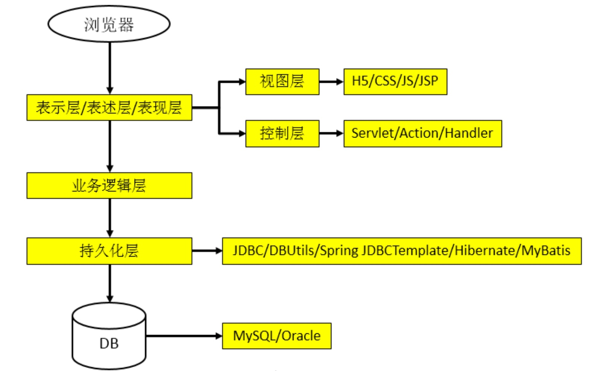

## 目前存在的问题

- 一个项目就是一个工程
    - 如果项目非常庞大，就不合适继续使用package来划分模块，最好是每一个模块对应一个工程，利于分工协作
    - 借助于maven就可以将一个项目拆分成多个工程
- 项目需要的jar必须手动复制到WEB-INF/lib目录下
    - 带来的问题：同样的jar包重复出现在不同的项目工程总，一方面浪费存储空间，另外也让工程比较臃肿
    - 借助maven可以将包仅仅保存在仓库中，有需要使用的工程引用这个文件接口，并不需要真的把这个jar包复制过来
- jar包需要别人替我们准备好，或者到官网下载
    - 不同技术的官网提供的jar包下载的形式五花八门的（源码、二进制等）
    - 有些技术的官网通过maven或者SVN等专门的工具来提供下载的
    - 如果是以非正规的方式下载的jar包，那么其中的内容很可能也是不正规的
    - 以规范的方式下载jar包，内容也是可靠的
    - TIPS：”统一的规范“ 不仅是对IT开发领域非常重要，对于整个人类社会都是非常重要的（不同的领域需要统一的规范才能合作）
- 一个jar包依赖的其他包需要自己手动加入到项目中
    - FileUpload组件->IO组件。commons-fileupload-1.3.jar依赖于commons-io-2.0.1.jar，如果没有引入后面的jar，就不能正常运行上传功能
    - spring jar包的依赖关系
    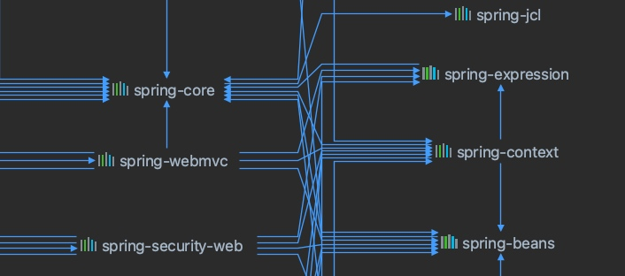
    - 如果所有的jar之间的依赖关系都需要程序员自己非常清楚了解，那么就会极大的增加了学习成本

maven会自动将被依赖的jar导入进来

## maven是什么？

maven是一款服务于Java平台的自动化构建工具。

自动化构建平台的发展历程：make->ant->maven->gradle

## 构建

- 概念：以Java源文件、框架配置文件、jsp、html、图片等资源为原材料去生产一个可以运行的项目的过程
    - 编译
    - 搭建
    - 部署
- 编译：Java源文件（User.java）->编译->Class字节码文件->交给JVM去执行
- 部署：一个BS项目最终运行的并不是动态web工程本身，而是这个动态web工程”编译后的结果“
    - 生的鸡->处理->熟的鸡
    - 动态web工程->编译、部署->编译后的结果
    - TIPS ：运行时环境，其实是一组jar的引用

**构建过程中的各个环节**

- 清理：将以前编译得到的旧的字节码文件清除，为下一次编译做准备
- 编译：将Java源程序编程成class字节码文件
- 测试：自动测试，自动调用Junit程序
- 报告：测试程序执行的结果
- 打包：动态web工程打war包，Java工程打jar包
- 安装：maven特定的概念--将打包得到的文件复制到仓库中指定的位置
- 部署：将动态web工程生成的war复制到Servlet容器指定的目录下，使其可以运行

自动化构建

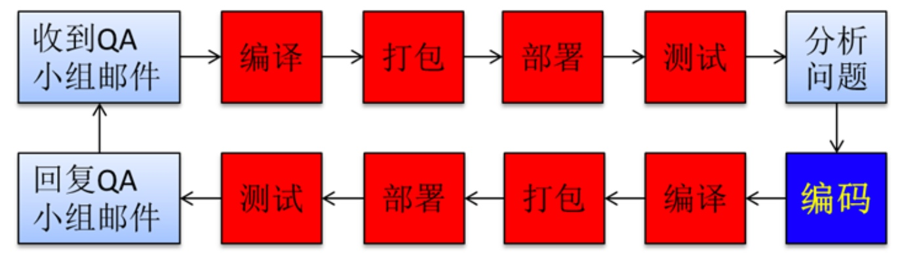

将红色的部分是重复，我们可以交给maven处理，这就是自动化构建

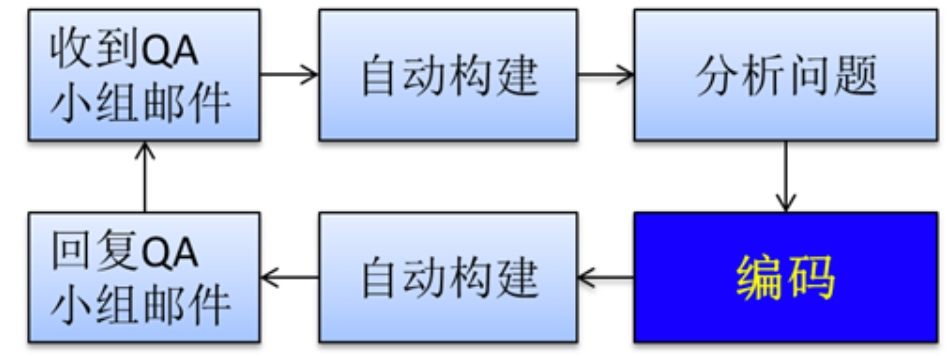

## 安装maven核心程序

1. 检查java环境变量

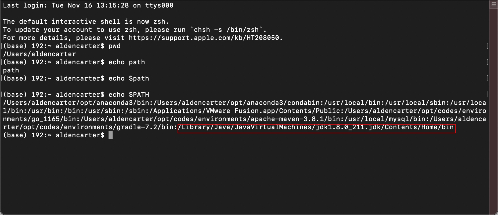

2. 解压maven核心程序的压缩包，放在一个非中文无空格的目录下

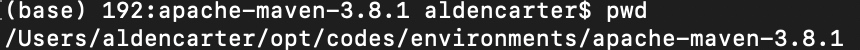

3. 配置maven的环境变量

在~/.bash_profile文件中配置M2的环境变量

```shell
export M2_HOME=/Users/aldencarter/opt/codes/environments/apache-maven-3.8.1
export PATH=$PATH:$M2_HOME/bin
```

可以配置成MAVEN_HOME和M2_HOME，以前低版本的叫M2_HOME，如果是配置M2_HOME是为了向下兼容，避免出现各种错误

## maven的核心概念

- **约定的目录结构**
- **POM**
- **坐标**
- **依赖**
- 仓库
- 生命周期/插件/目标
- 继承
- 聚合

下面做一一讲解

## 第一个maven工程

创建约定的目录结构

- 根目录：工程名
    - src：源码
    - pom.xml：maven工程的核心配置文件
    - main：存放主程序
        - java：存放Java源文件
        - resources：存放框架配置文件或者其他工具的配置文件
    - test：存放测试程序

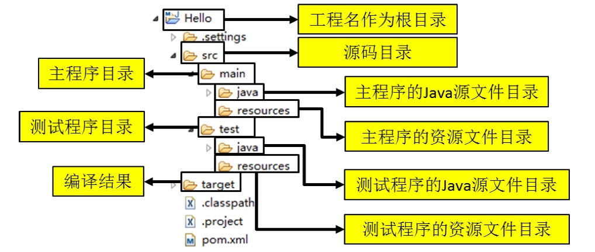

为什么要遵守约定的目录结构呢？

- maven要负责我们这个项目的自动化构建，以编译为例，maven要想自动进行编译，那么它必须知道Java源文件保存在哪里
- 如果我们自定的东西想要让框架或者工具知道，有两种方式
    - 以配置的方式告诉框架
    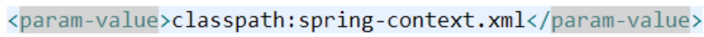
    - 遵守框架内部已经存在的约定，比如：log4j.properties(log4j.xml)、springboot的约定大于配置
- 约定大于配置，配置大于编码

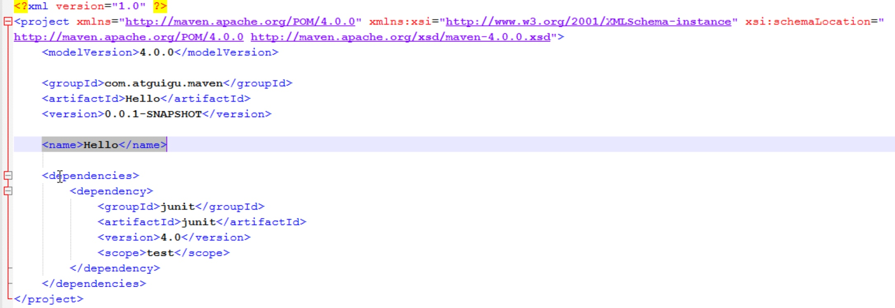

## 常用maven命令

注意：执行与构建过程相关的maven命令，必须进入pom.xml所在的目录，比如与构建过程相关的，编译、测试、打包、部署等

**常用的命令**

- mvn clean：清理
- mvn compile：编译主程序，生成target目录
- mvn test-compile：编译测试程序
- mvn test：执行测试
- mvn package：打包
- mvn install：安装
- mvn site：生成站点

## 关于联网问题

- maven的核心程序中仅仅定义了抽象的生命周期，但是具体的工作必须由特定的插件来完成，而插件本身并不包含在maven的核心程序中
- 当我们执行的maven命令需要用到某些插件的时候，maven核心程序首先会到本地仓库中查找
- 本地仓库默认的位置：~/.m2/repository
- maven核心程序如果在本地仓库中找不到需要的插件，那么它就会自动连接到外网，到中央仓库下载
- 如果此时无法连接到外网，则构建失败
- 修改默认本地仓库的位置可以让maven和兴到我们事先准备的目录下查找插件
    - 找到maven解压目录下的/conf/settings.xml
    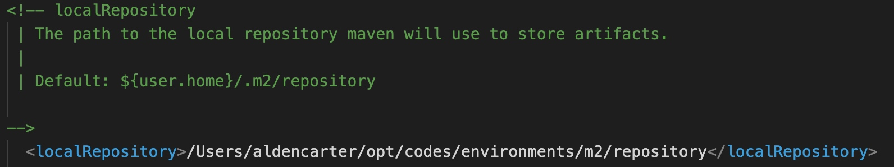

## POM

- 含义：project Object model 项目对象模型，DOM document Object model 文档对象模型
- pom.xml对于maven工程是核心配置文件，与构建过程相关的一切设置都在这个文件中进行配置
    - 重要程度相当于web.xml对于web工程

## 坐标

- 数学中的坐标
    - 在平面上使用x、y两个向量可以唯一定位平面中的任何一个点
    - 在空间中就是x、y、z
- maven中的坐标，使用三个向量唯一定位一个maven工程
    - groupid：公司或者组织的域名倒序+项目名，`<groupid>com.example.maven</groupid>`
    - artifactid：模块名，`<artifactid>Hello</artifactid>`
    - version：版本
- 坐标与仓库中路径的对应关系：
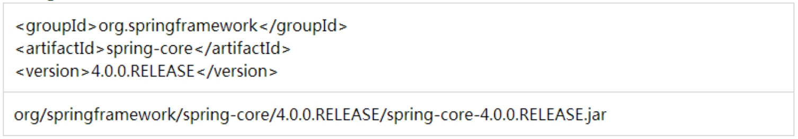

## 仓库

1. 仓库的分类

- 本地仓库：当前电脑上部署的仓库目录，为当前电脑上所有的maven工程服务
- 远程仓库
    - 私服：搭建在局域网中，为局域网内的所有maven工程服务
    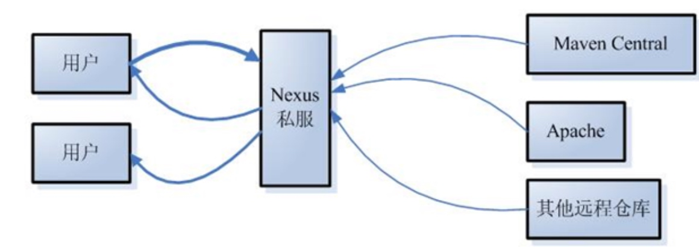
    - 中央仓库：架设在Internet上，为全世界所有的maven工程服务
    - 中央仓库镜像：为了分担中央仓库的流量，提升用户访问速度

2. 仓库中保存的内容：maven工程

- maven自身所需要的插件
- 第三方框架或工具的jar包（第一方式jdk，第二方是开发者，只有这两个都不能实现的功能才要依赖第三方）
- 我们自己开发的maven工程

## 依赖

1. manven 解析依赖信息时会到本地仓库中查找所依赖的jar包

对于我们自己开发的maven工程，使用`mvn install`命令安装后就会被安装到仓库中

2. 依赖的范围

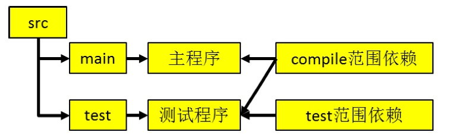

- compile范围依赖
    - 对主程序是否有效：有效
    - 对测试程序是否有效：有效
    - 是否参与打包：参与
- test范围依赖
    - 对主程序是否有效：无效
    - 对测试程序是否有效：有效
    - 是否参与打包：不参与
- provided范围依赖
    - 对主程序是否有效：有效
    - 对测试程序是否有效：有效
    - 是否参与打包：不参与

从开发和运行这两个不同阶段理解compile和provided的区别

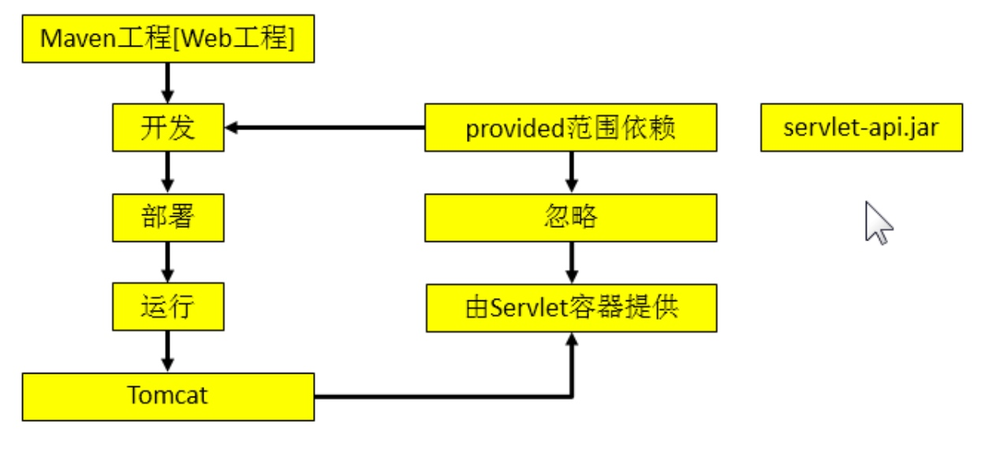

serlvet-api.jar在开发过程中需要，但是在运行的时候，是在tomcat上的，由tomcat提供，不需要加到运行环境中

总结


### 依赖的传递性

```xml
<dependencies>
    <dependency>
        <groupId>org.springframework</groupId>
        <artifactId>spring-context</artifactId>
        <version>5.2.7.RELEASE</version>
    </dependency>
    <dependency>
        <groupId>junit</groupId>
        <artifactId>junit</artifactId>
        <version>4.12</version>
        <scope>test</scope>
    </dependency>
    <dependency>
        <groupId>com.alibaba</groupId>
        <artifactId>druid</artifactId>
        <version>1.1.21</version>
    </dependency>
    <dependency>
        <groupId>mysql</groupId>
        <artifactId>mysql-connector-java</artifactId>
        <version>5.1.47</version>
    </dependency>
</dependencies>
```

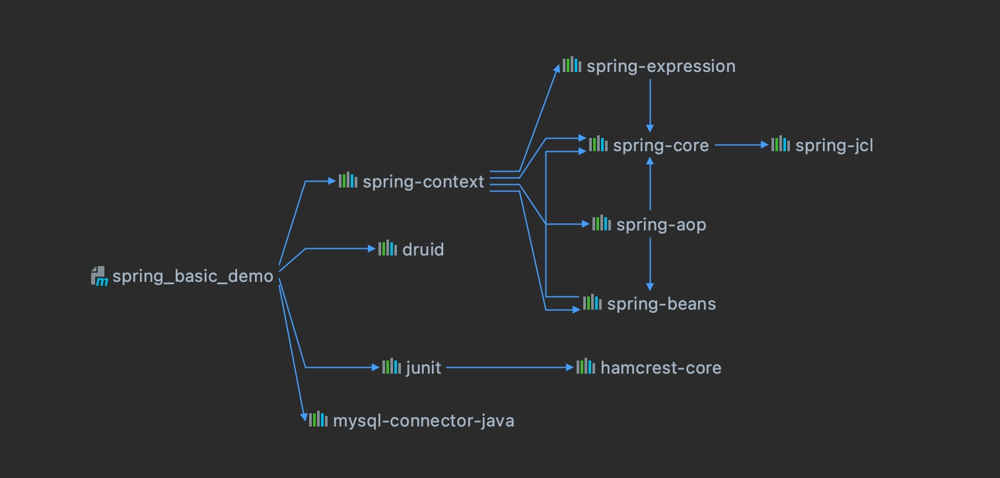

可以看到我们只只是引入了`spring-context`就会自动引入`spring-expression`、`spring-core`、`spring-aop`、`spring-beans`。

在创建多模块项目中，可以传递的依赖不必在每个模块工程中都重复声明，在父类工程中依赖一次即可。

**注意：非complie范围的依赖不能传递。所以在各个工程模块中，如果有需要就得重复声明依赖**

### 依赖的排除

需要设置依赖排除的场合，比如：

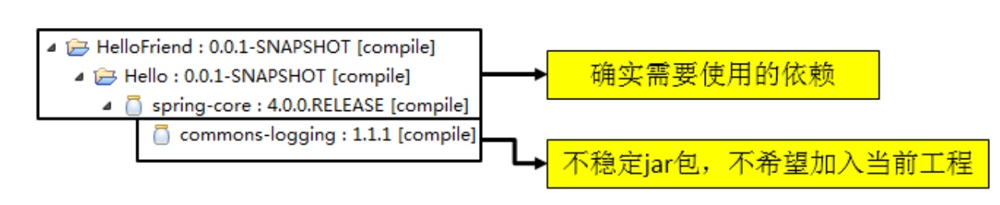

```xml
<dependency>
    <groupId>org.springframework</groupId>
    <artifactId>spring-context</artifactId>
    <version>5.2.7.RELEASE</version>
    <!--排除context 和 aspects-->
    <exclusions>
        <exclusion>
            <groupId>org.springframework</groupId>
            <artifactId>spring-context</artifactId>
        </exclusion>
        <exclusion>
            <groupId>org.springframework</groupId>
            <artifactId>spring-aspects</artifactId>
        </exclusion>
    </exclusions>
</dependency>
```

### 依赖的原则

作用：解决模块工程之间的jar包冲突问题

原则：**就近优先** 和 **先引入者优先**

情景一：就近优先

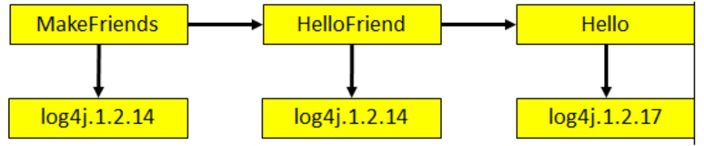

log4j中，HelloFriend依赖14版本，Hello依赖17版本，当MakeFriends引入的时候，会优先选择14的版本

情景二：先引入者优先

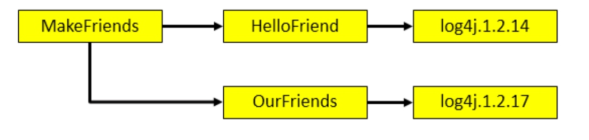

先声明dependency者优先

### 统一管理依赖版本号

- 使用properties 标签内使用自定义标签统一声明管理
- 在需要统一版本的位置，使用`${自定义标签}`引入声明的版本号

```xml
<properties>
    <!-- 统一版本管理 -->
    <SPRING.VERSION>5.2.7.RELEASE</SPRING.VERSION>
</properties>

<dependencies>
    <dependency>
        <groupId>org.springframework</groupId>
        <artifactId>spring-context</artifactId>
        <version>${SPRING.VERSION}</version>
    </dependency>
</dependencies>
```

其实properties标签配合自定义标签声明数据的配置并不是只能用于声明依赖版本号，凡是需要统一声明之后在使用的地方都可以使用

```xml
<properties>
    <maven.compiler.source>8</maven.compiler.source>
    <maven.compiler.target>8</maven.compiler.target>
    <project.build.sourceEncoding>UTF-8</project.build.sourceEncoding>
</properties>
```

### 继承

1. 现状：
- MakeFriends依赖Junit4.9
    - Hello依赖Junit4.0
    - HelloFriend依赖Junit4.0

由于test范围的依赖不能传递，所以必然会分散在各个模块工程中，很容易造成版本不一致

2. 需求：统一管理各个模块中的Junit依赖的版本

3. 解决思路：

将Junit依赖版本统一提取到父工程中，在子工程中声明依赖时不指定版本，以父工程中统一的配置为准，同时也便于修改。

4. 操作步骤：

创建一个maven工程作为父工程，注意：打包方式为pom。`<packaging>pom</packaging>`

在子工程中声明对父工程的引用

```xml
<parent>
    <artifactId>maven01</artifactId>
    <groupId>com.example</groupId>
    <version>1.0-SNAPSHOT</version>
</parent>
```

将子工程的坐标中与父工程坐标中重复的内容删除

在父工程中统一管理Junit依赖

```xml
<dependencyManagement>
    <dependencies>
        <dependency>
            <groupId>junit</groupId>
            <artifactId>junit</artifactId>
            <version>4.12</version>
            <scope>test</scope>
        </dependency>
    </dependencies>
</dependencyManagement>
```

在子工程中添加Junit依赖不用添加版本号

```xml
<dependencies>
    <dependency>
        <groupId>junit</groupId>
        <artifactId>junit</artifactId>
        <scope>test</scope>
    </dependency>
</dependencies>
```

可以看到子模块中有向上的版本依赖

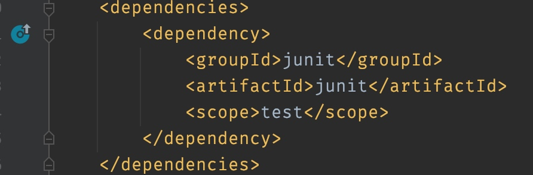

### 聚合

一键安装各个模块，配置方式：在一个总的聚合工程中配置各个参与聚合的模块，父工程可以作为聚合的工程，但是不一定

将多个工程拆分为模块后，需要手动逐个安装到仓库后依赖才能够生效。修改源码后也需要逐个手动进 行 clean 操作。而使用了聚合之后就可以批量进行 Maven 工程的安装、清理工作。

在总的聚合工程中使用 modules/module 标签组合，指定模块工程的相对路径即可

```xml
<modules>
    <module>../Hello</module>
    <module>../HelloFriend</module>
    <module>../MakeFriends</module>
</modules>
```

## 生命周期

- 各个构建环节执行的顺序：不能打乱顺序，必须按照既定的正确顺序来执行
- maven的核心程序中定义了抽象的生命周期，生命周期中各个阶段的具体任务是由插件来完成的
- maven有三套互相独立的生命周期
    - clean lifecycle 在进行真正的构建之前进行一些清理工作
        - pre-clean 执行一些需要在clean之前完成的工作
        - clean 移除所有上一次构建生成的文件
        - post-clean 执行一些需要在clean之后立即完成的工作
    - default lifecycle 构建的核心部分，编译、测试、打包、安装、部署等
        - validate
        - generate-sources
        - process-sources
        - generate-resources
        - process-resources 复制并处理资源文件至目标目录，准备打包
        - compile 编译项目的源代码
        - process-classes
        - generate-test-sources
        - process-test-soruces
        - generate-test-resources
        - process-test-resources 复制并处理资源文件至目标测试目录
        - test-compile 编译测试源代码
        - process-test-classes
        - test 使用适合的单元测试框架运行测试，这些测试代码不会被打包或部署
        - prepare-package
        - package 接收编译好的代码，打包成可发布的格式，如jar
        - pre-integration-test
        - integration-test
        - post-integration-test
        - verify
        - install 将包安装到本地仓库，让其他项目依赖
        - deploy 将最终的包复制到远程仓库，让其他的开发人员与项目共享或者部署到服务器上运行
    - site lifecycle 生成项目报告、站点、发布站点
        - pre-site 执行一些需要在生成站点文档之前的工作
        - site 生成项目的站点文档
        - post-site 执行一些需要在生成站点文档之后完成的工作，并且为部署做准备
        - site-deploy 将生成的站点文档部署到特定的服务器
- maven核心程序为了更好的实现自动化构建，按照这一特点执行生命周期中的各个阶段：不论现在要执行生命周期中的那个阶段，都是从这个生命周期最初的位置开始执行
- 插件和目标
    - 生命周期的各个阶段仅仅定义了要执行的任务是什么
    - 各个阶段和插件的目标对应的
    - 相似的目标由特定的插件来完成，比如：
    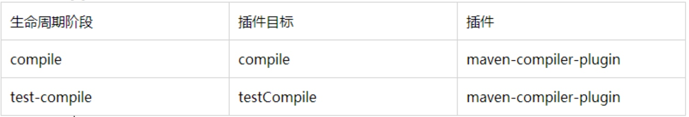
    - 可以将目标看做调用插件功能的命令

## 在idea中使用maven

1. maven插件：eclipse内置

2. maven插件的设置

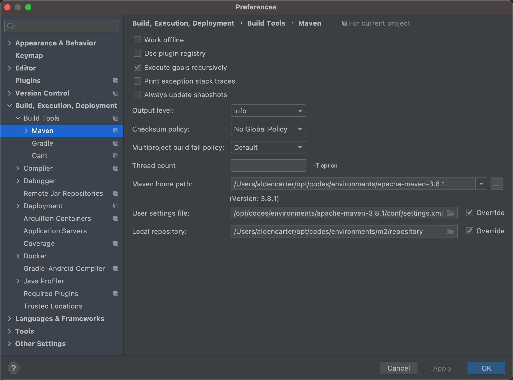

3. 执行maven命令

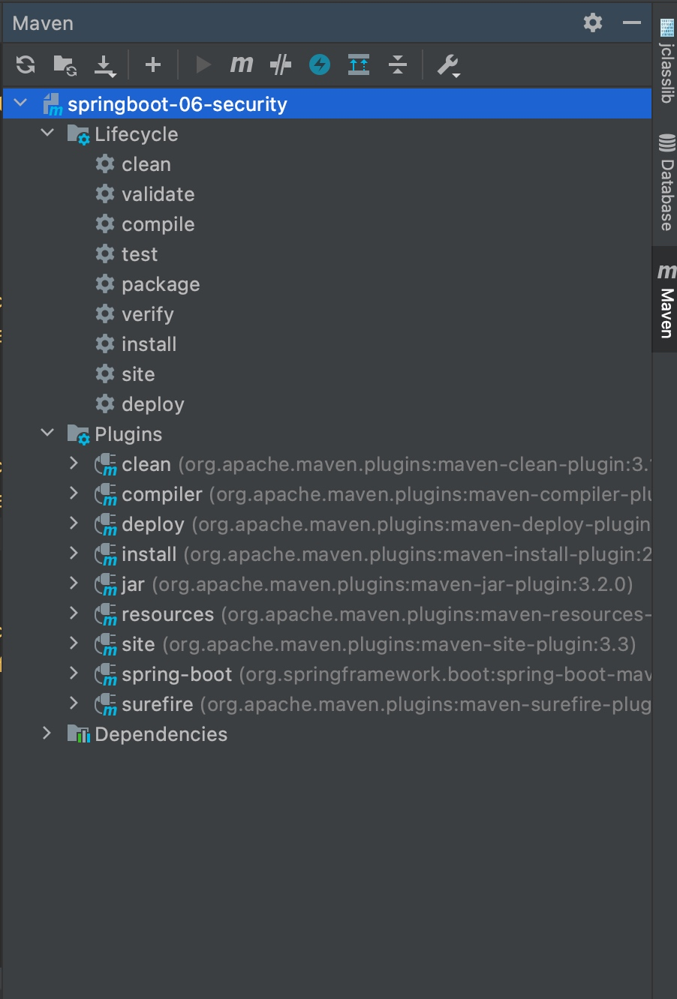

## web工程自动部署

deploy可以自动的将web工程打包部署到tomcat等web容器中

```xml
<!--配置当前工程构建过程中的特殊设置-->
<build>
    <finalName>maven-01</finalName>
    <!--配置构建过程中需要使用的插件-->
    <plugins>
        <plugin>
            <!--cargo是一家专门从事"启动servlet容器"的组织-->
            <groupId>org.codehaus.cargo</groupId>
            <artifactId>cargo-maven3-plugin</artifactId>
            <version>1.9.0</version>
            <configuration>
                <!--配置当前系统中容器的位置-->
                <container>
                    <containerId>tomcat9x</containerId>
                    <home>~/opt/codes/environments/apache-tomcat-9.0.54</home>
                </container>
                <configuration>
                    <type>existing</type>
                    <home>~/opt/codes/environments/apache-tomcat-9.0.54</home>
                    <!-- 如果tomcat端口默认为8080则不必设置该属性 -->
                    <!--<properties>-->
                    <!--    <cargo.servlet.port>8090</cargo.servlet.port>-->
                    <!--</properties>-->
                </configuration>
            </configuration>
            <!--配置插件在什么情况下运行-->
            <executions>
                <execution>
                    <id>cargo-run</id>
                    <!--生命周期的阶段-->
                    <phase>install</phase>
                    <goals>
                        <!--插件的目标-->
                        <goal>run</goal>
                    </goals>
                </execution>
            </executions>
        </plugin>
    </plugins>
</build>
```


