## 版本控制

### 版本控制工具应该具备的功能

- 协同修改
    - 多人并行不悖的修改服务器端的同一个文件。
- 数据备份
    - 不仅保存目录和文件的当前状态，还能够保存每一个提交过的历史状态。
- 版本管理
    - 在保存每一个版本的文件信息的时候要做到不保存重复数据，以节约存储空间，提高运行效率。这方面 SVN 采用的是增量式管理的方式，而 Git 采取了文件系统快照的方式。
- 权限控制
    - 对团队中参与开发的人员进行权限控制。
    - 对团队外开发者贡献的代码进行审核——Git独有。
- 历史记录
    - 查看修改人、修改时间、修改内容、日志信息。
    - 将本地文件恢复到某一个历史状态。
- 分支管理
    - 允许开发团队在工作过程中多条生产线同时推进任务，进一步提高效率。

### 版本控制介绍

工程设计领域中使用版本控制管理工程蓝图的设计过程。在 IT 开发过程中也可以使用版本控制思想管理代码的版本迭代

1. 个人开发改进迭代

可以在不同的项目版本中修改、回滚等。

2. 团队协作

协同开发的情况下，如果是使用基本的文件管理服务器的话，可能存在被覆盖的情况。

#### 版本控制工具

- 集中式版本控制工具：CVS、SVN、VSS等，会出现单点故障
- 分布式版本控制工具：Git等

## git简介

### git的优势

- 大部分操作在本地操作完成，不需要联网
- 完整性保证
- 尽可能添加数据而不是删除或修改数据
- 分支操作非常快捷流畅
- 与Linux命令全面兼容

### git安装

#### 通过homebrew安装，如果没有安装homebrew需要安装

安装homebrew

```shell
/usr/bin/ruby -e "$(curl -fsSL https://raw.githubusercontent.com/Homebrew/install/master/install)"
```

安装git

```xml
brew install git
```

#### 创建ssh key、配置git

1. 设置username和email（github每次commit都会记录他们）
```shell
git config --global user.name "xxx"
git config --global user.email "xxxx@gamil.com"
```

2. 成功的话会在~/下生成.ssh文件夹，进去，打开id_rsa.pub，复制里面的key

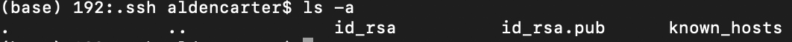

终端查看.ssh/id_rsa.pub文件

```shell
open .ssh/id_rsa.pub
```

回车后，就会新弹出一个终端，然后复制里面的key。
或者用cat命令查看

```shell
cat .ssh/id_rsa.pub
```

复制里面的内容。

3. 登录GitHub（默认你已经注册了GitHub账号），添加ssh key，点击Settings

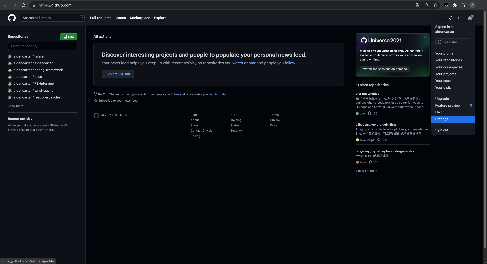

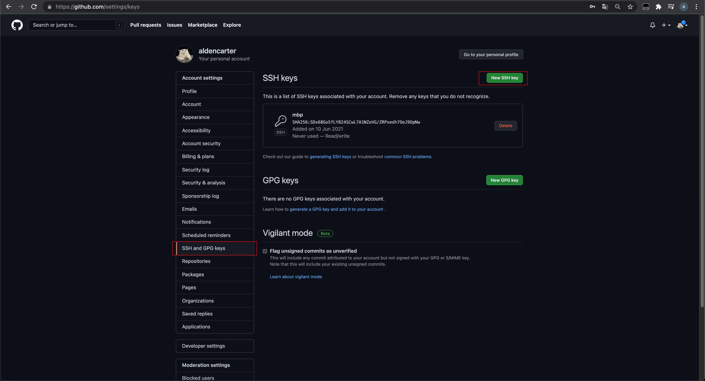

将刚才复制的内容添加到新建的SSH keys中

4. 验证连接

```shell
ssh -T git@github.com
```

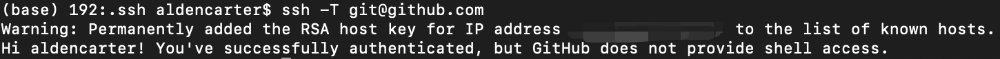

### git结构

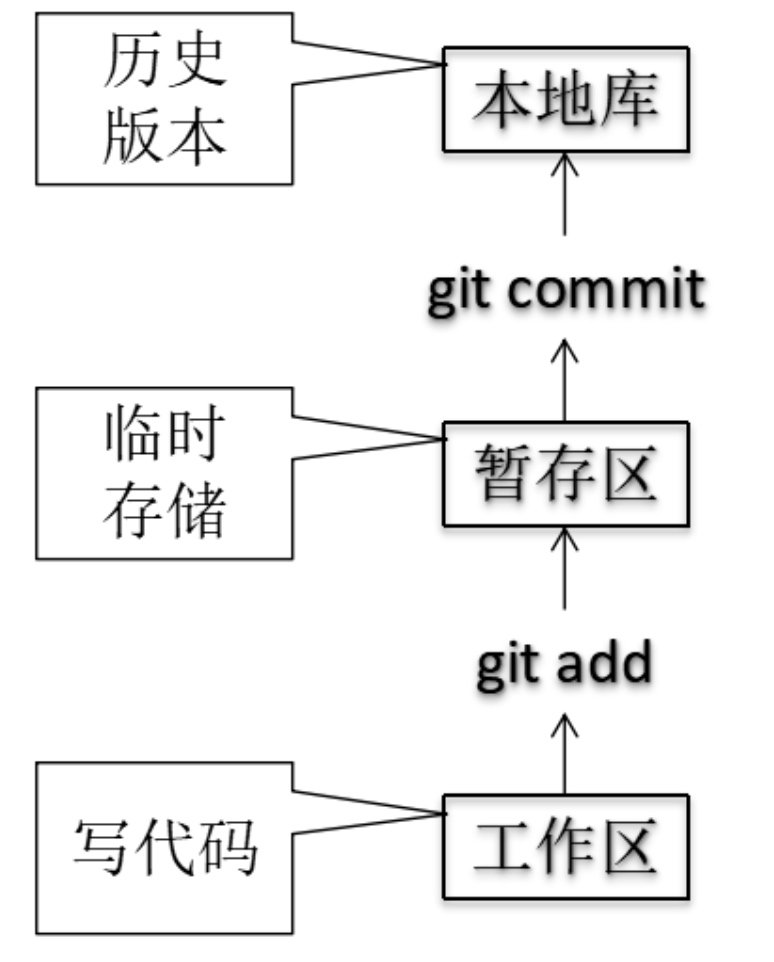

### git和代码托管中心

代码托管中心的任务：维护远程库

局域网环境下

- GitLab服务器

外网环境下

- GitHub
- 码云

### 本地库和远程库

场景：

1. 团队内部协作

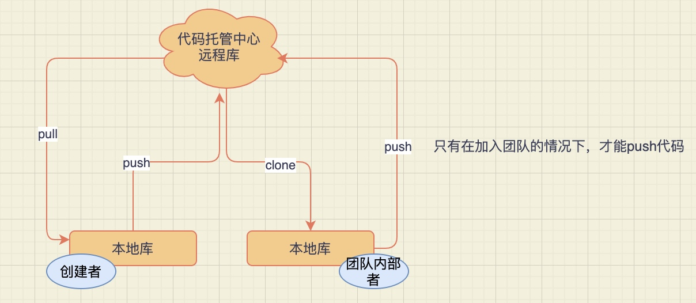

2. 跨团队协作

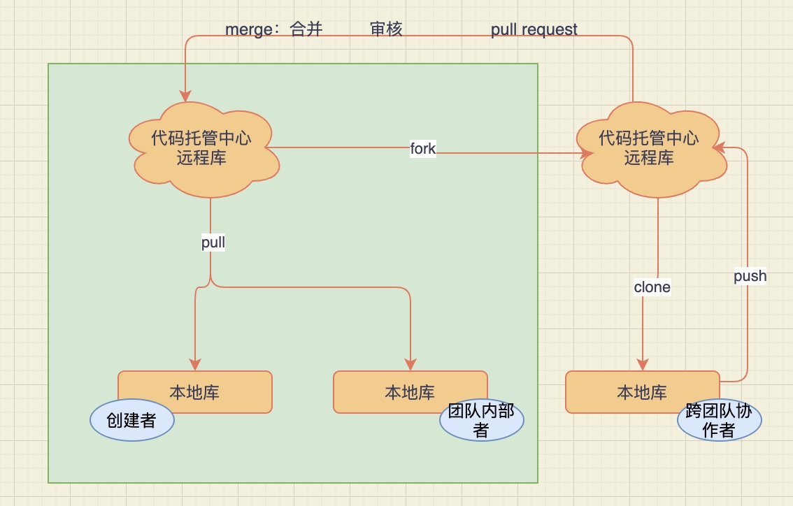

## git命令行操作

### 本地库初始化

命令：git add

进入项目目录->使用git init

#### 设置签名

形式：

- 用户名：tom
- Email地址：goodMoring@gmail.com

作用：区分不同开发人员

辨析：这里设置的签名和登录远程库（代码托管中心）的账号、密码没有任何关系

命令

- 项目级别/仓库级别：仅在**当前本地库项目**范围内有效
    - git config user.name xxx
    - git config user.email xxx@gmail.com
    - 信息保存在当前目录.gitconfig中
- 系统用户级别：登录当前**操作系统的用户**范围
    - git config --global user.name xxx
    - git config --global user.email xxx@gmail.com
    - 信息保存在~/.gitconfig中
- 优先级别
    - 就近原则：项目级别优先与系统用户级别，二者都有时，采用项目级别的签名
    - 如果只有系统用户级别的签名，就以系统用户级别的签名为准

### 基本操作

#### git status 查看工作区、暂存区状态，在项目目录下运行

```shell
(base) 192:git-01 aldencarter$ git status
On branch master ## 在master这个分支上

No commits yet ## 没有任何提交，是指本地库

nothing to commit (create/copy files and use "git add" to track) ## 没有什么可提交的，表示暂存区里面什么都没有
```

创建文件之后

```xml
(base) 192:git-01 aldencarter$  echo "1111" > git-test.txt
(base) 192:git-01 aldencarter$ ls 
git-test.txt
(base) 192:git-01 aldencarter$ git status
On branch master

No commits yet

Untracked files:
  (use "git add <file>..." to include in what will be committed)
	git-test.txt

nothing added to commit but untracked files present (use "git add" to track)
```

#### 执行`git add git-test.txt`添加文件到缓存区（暂存区）

git add [file name]

```shell
(base) 192:git-01 aldencarter$ git add git-test.txt 
(base) 192:git-01 aldencarter$ 
```

添加到缓存区之后颜色的变化

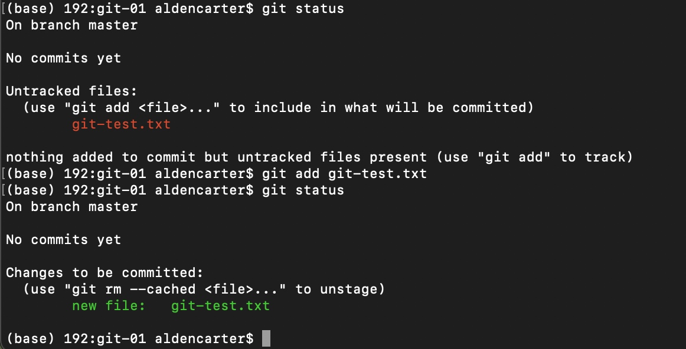

#### 使用`git rm --cached <file>...`从缓存区中删除

#### 使用`git commit`从缓存区提交到本地仓库

git commit -m "提交信息" [file name]

vim编辑器使用技巧：在命令模式下使用`set nu`显示行号

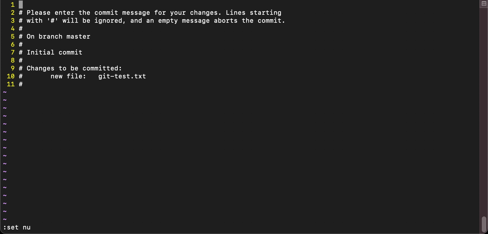

按下i进入编辑模式，输入提交的信息

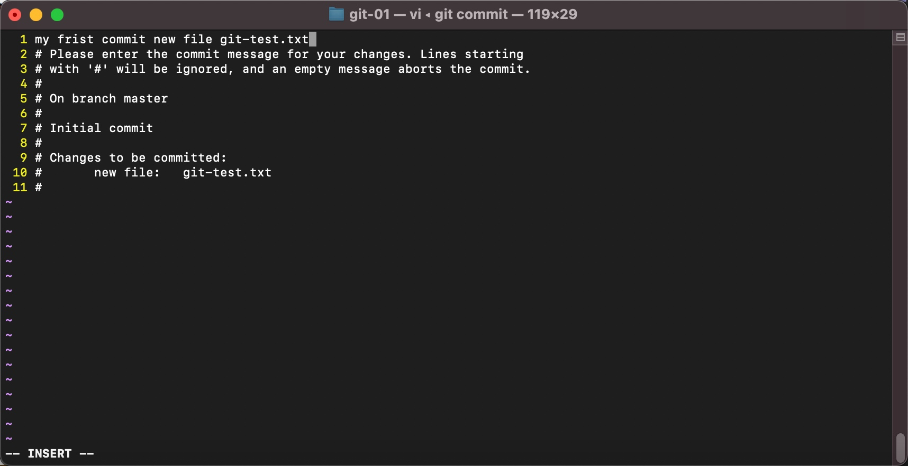

按下wq退出编辑，提交数据成功

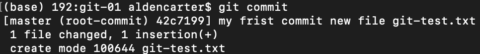

可以使用`git commit -m "提交信息" git-test.txt`就可以不用进入vim编辑提交信息了

#### 改了文件之后，在查看文件状态

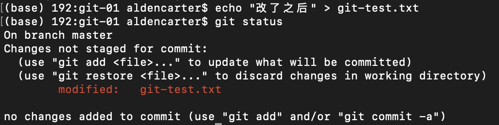

#### 查看历史记录

git log

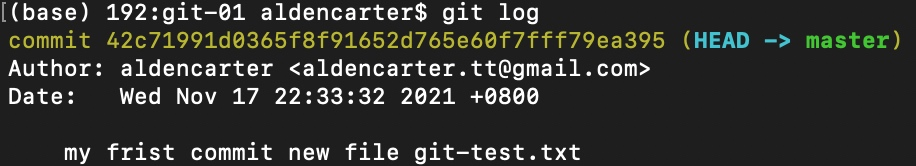

多屏显示控制方式：
- 空格向下翻译
- b 向上翻页
- q 退出

git log --pretty=oneline 显示成一行

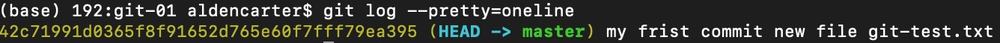

git log --oneline hash只显示一部分

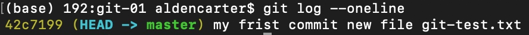

git reflog 比git log 多了一些信息

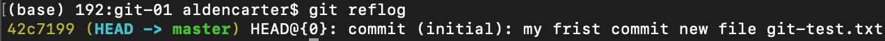

其中，HEAD@{0}表示移动到当前版本需要多少步

#### 前进后退

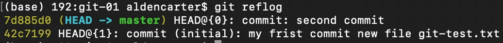

1. 基于索引值操作「推荐」

- git reset --hard [局部索引值]
- git reset --hard 42c7199

2. 使用符号^只能后退

- git reset --hard HEAD^
- 注：一个^表示后退一步，n个表示后退n步`git reset --hard HEAD^^^`

3. 使用~符号:只能后退

- git reset --hard HEAD~n 
- 注:表示后退n步

##### reset 命令的三个参数对比

1. --soft 参数

- 仅仅在本地仓库移动指针

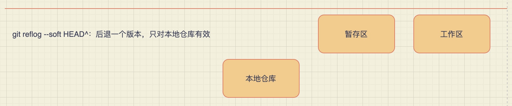

2. --mixed 参数

- 在本地仓库移动HEAD指针
- 重置暂存区

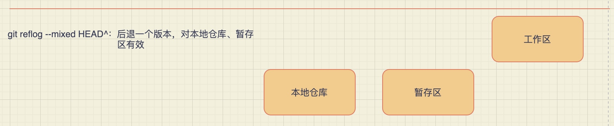

3. --hard 参数

- 在本地仓库移动HEAD指针
- 重置暂存区
- 重置工作区

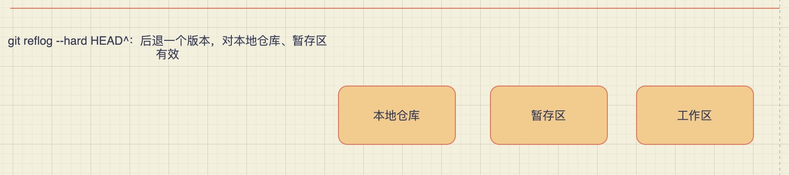

##### 删除文件并找回

前提：删除前，文件存在时的状态提交到了本地库

操作：git reset --hard [指针位置]

- 删除操作已经提交到本地库：指针位置指向历史记录 `git reset --hard 42c7199`
- 删除操作尚未提交到本地库：指针位置使用HEAD `git reset --hard HEAD`

##### 比较文件差异

git diff [文件名]

- 将工作区中的文件和暂存区进行比较

git diff [本地库中历史版本] [文件名]

- 将工作区中的文件和本地库历史记录比较

如果不带文件名则是比较多个文件

### 分支管理

#### 什么是分支？

在版本控制过程中，使用多条线同时推进多个任务

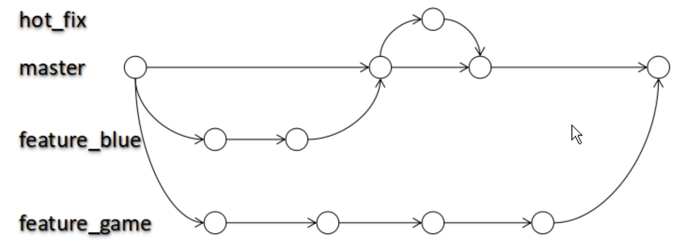

#### 分支的好处

- 同时并行推进多个功能的开发，提高开发效率
- 各个分支在开发过程中，如果某一个分支开发失败，不会对其他分支有任何影响，失败的分支删除重新开始即可

#### 分支操作

- 创建分支
    - git branch [分支名]
- 查看分支
    - git branch -v
- 切换分支
    - git checkout [分支名]
- 合并分支
    - 第一步：切换到接受修改的分支（被合并，增加新内容）上 `git checkout [被合并的分支名]`
    - 第二步：执行merge命令 `git merge [有新内容分支名]`

##### 合并分支的冲突解决

冲突的表现

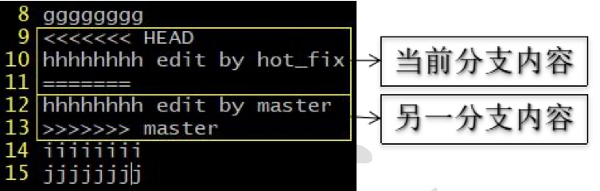

冲突的解决

- 编辑文件，删除特殊符号
- 把文件修改到满意的程度，保存退出
- git add [文件名]
- git commit -m "日志信息"
    - 注意：此时commit一定不能带具体的文件名

## git基本原理

哈希是一个系列的加密算法，各个不同的哈希算法虽然加密强度不同，但是有以下 几个共同点:

- 不管输入数据的数据量有多大，输入同一个哈希算法，得到的加密结果长度固定。 
- 哈希算法确定，输入数据确定，输出数据能够保证不变 
- 哈希算法确定，输入数据有变化，输出数据一定有变化，而且通常变化很大 
- 哈希算法不可逆

git底层采用SHA-1算法

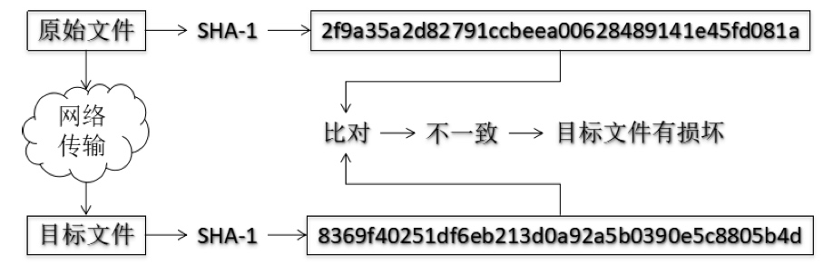

### git保存版本的机制

Git 把数据看作是小型文件系统的一组快照。每次提交更新时 Git 都会对当前的全部文件制作一个快照并保存这个快照的索引。为了高效，如果文件没有修改， Git 不再重新存储该文件，而是只保留一个链接指向之前存储的文件。所以 Git 的 工作方式可以称之为快照流。

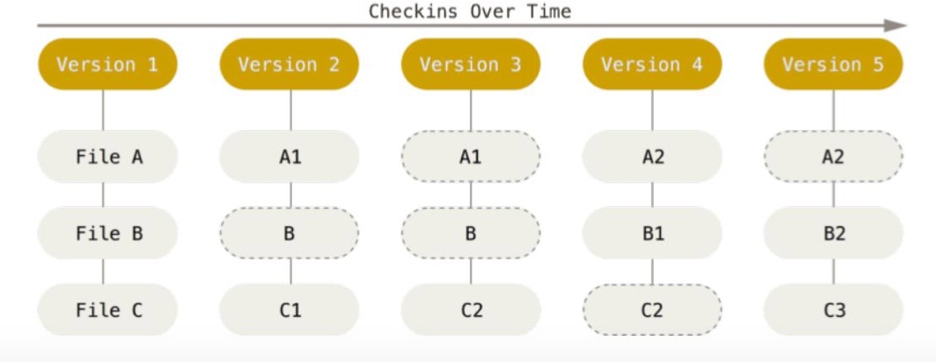

git 提交对象，提交的对象链接这所有本次提交的修改信息

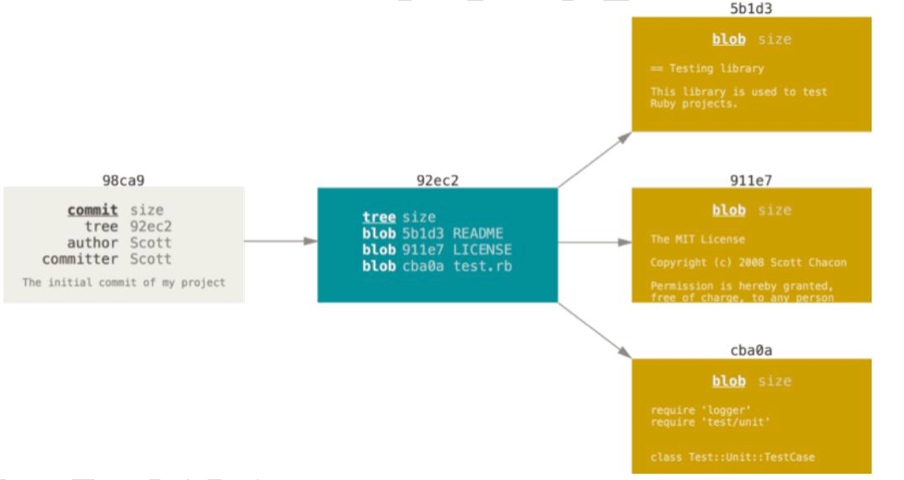

提交对象及其父对象（之前提交的对象）形成的链条

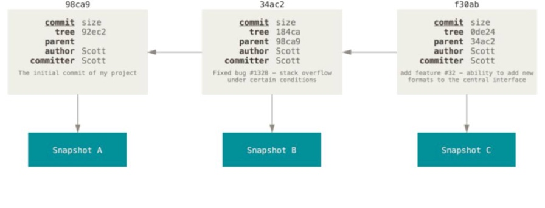

### git分支管理机制

分支的创建，创建出testing分支指向当的节点

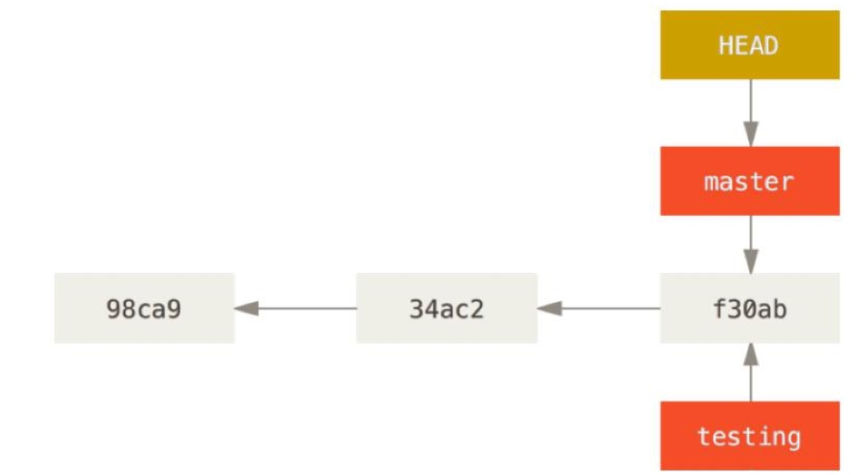

分支的切换，HEAD指针切换到testing分支上

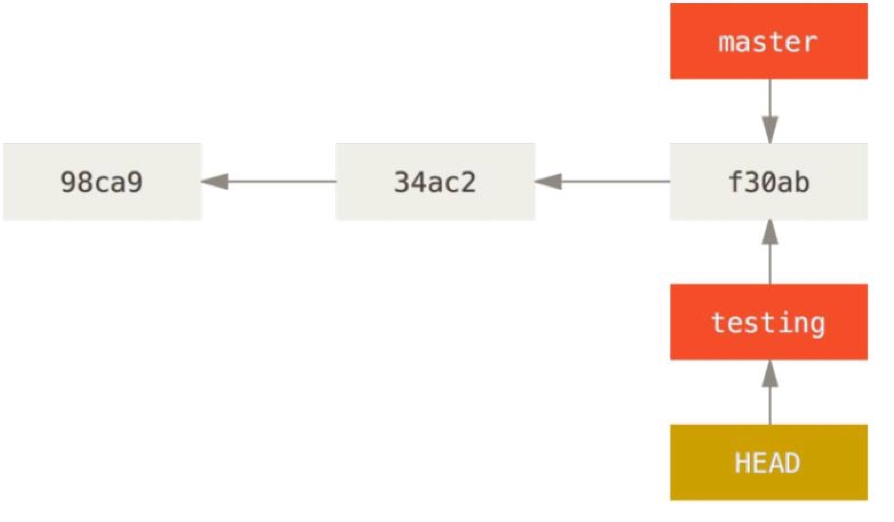

master分支回滚到之前一个分支

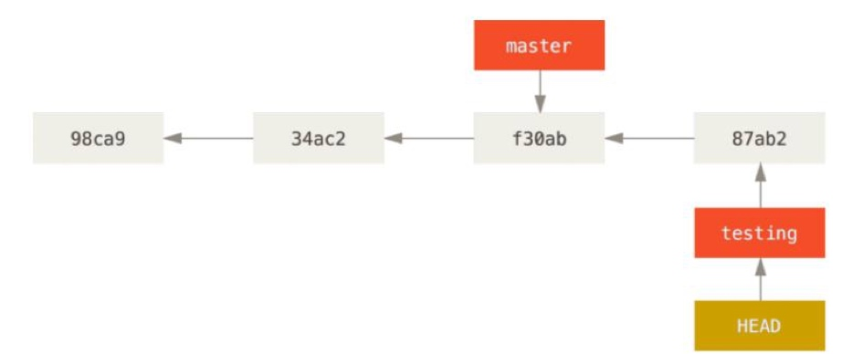

切换到master分支上

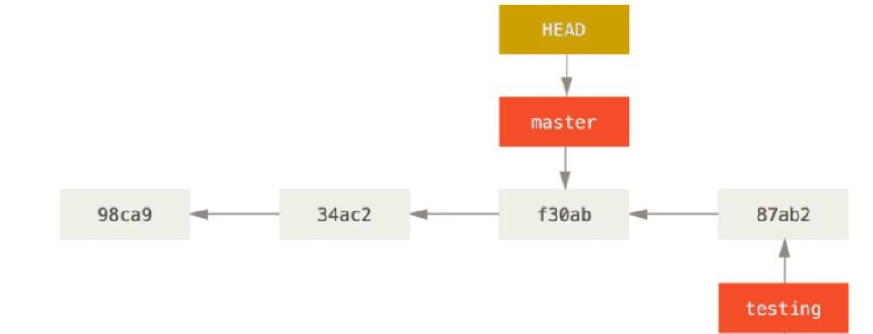

当testing分支有对象提交的时候，会出现新提交的对象指向之前刚刚分支出来的父节点

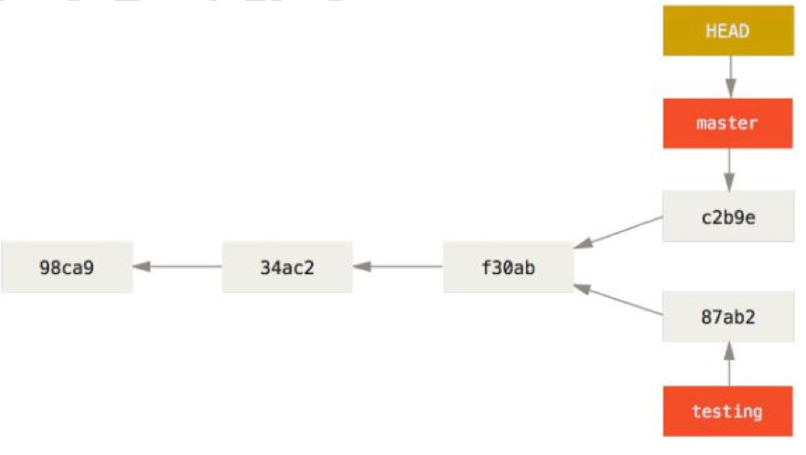

## GitHub

### 远程库创建

### 在本地仓库创建远程仓库的别名

如果每次都带着远程库这么长的地址不方便`https://github.com/aldencarter/fafafa.git`，所以可以在本地给这个远程库取别名

使用`git remote -v`查看当前项目有没有别名

使用`git remote add origin https://github.com/aldencarter/fafafa.git`给当前项目取别名，以后就用origin代表这个`https://github.com/aldencarter/fafafa.git`地址

再用`git remote -v`查看一下，得到

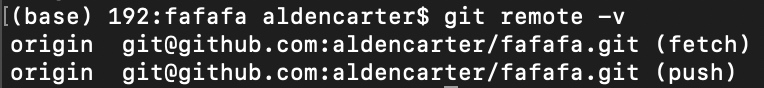

- fetch 表示取回
- push 表示推送

> 从远程仓库clone下来的项目本身就自带着别名`origin`

### 推送

git push [别名] [分支名]

使用账号密码登录，当我们push的时候就会弹出登录界面`git push origin master`

### 克隆

git clone [远程仓库地址]

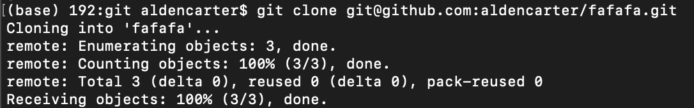

效果

- 完整的把远程库下载到本地
- 创建origin远程地址别名
- 初始化本地库

### 团队成员邀请

版本不对应，找不到新邀请在那里了。

### 拉取

pull = fetch+merge

- git fetch [远程库地址别名] [远程分支名]，此时还没有将文件与本地仓库的合并
    - 如果想要看fetch下来的文件，可以使用`git checkout origin/master`
    - 然后切换回去`git checkout master`
- git merge [远程库地址别名/远程分支名]，将两个远程的和本地的合并

直接使用pull进行拉取

- git pull [远程库地址别名] [远程分支名]

#### 解决冲突

改了同一文件的同一个位置，只有先推送的人能推送到远程库，后者就会出现冲突

要点

- 如果不是基于GitHub远程库的最新版本所做的修改，不能推送，必须先拉取
- 拉取下来之后如果进入冲突状态，则按照”分支冲突解决办法“操作即可

### 跨团队协作

外者

- 以外者身份点击fork，本地修改，然后推送到自己的远程仓库
- 在GitHub中点击pull request申请提交到拉取的那个项目

项目持有者

- 在GitHub上点击pull request可以查看到pull的申请
- 审核代码
- 合并代码

### SSH登录

- 进入当前用户的家目录`$ cd ~`
- 删除.ssh目录`$ rm -rvf .ssh`
- 运行命令生成.ssh密钥目录`$ ssh-keygen -t rsa -C aldencarter.tt@gmail.com`[注意:这里-C 这个参数是大写的 C]
- 进入.ssh目录查看文件列表`$ cd .ssh` `$ ls -lF`
- 查看id_rsa.pub文件内容`$ cat id_rsa.pub`
- 复制 id_rsa.pub 文件内容，登录 GitHub，点击用户头像→Settings→SSH and GPG
keys
- New SSH Key
- 输入复制的密钥信息
- 回到 Git bash 创建远程地址别名`git remote add origin_ssh git@github.com:aldencarter/fafafa.git`
- 推送文件进行测试

## git工作流

在项目开发过程中使用 Git 的方式

### 分类

#### 集中式工作流

像 SVN 一样，集中式工作流以中央仓库作为项目所有修改的单点实体。所有修改都提交到 Master 这个分支上。这种方式与 SVN 的主要区别就是开发人员有本地库。Git 很多特性并没有用到。

#### GitFlow工作流

Gitflow 工作流通过为功能开发、发布准备和维护设立了独立的分支，让发布迭代过程更流畅。严格的分支模型也为大型项目提供了一些非常必要的结构。

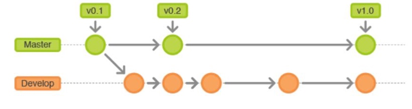

#### Foroking工作流

Forking 工作流是在 GitFlow 基础上，充分利用了 Git 的 Fork 和 pull request 的功能以达到代码审核的目的。更适合安全可靠地管理大团队的开发者，而且能接受 不信任贡献者的提交。

举例：Linux团队，是虚拟的团队

### GitFlow 工作流详解

#### 分支种类

- 主干分支 master
    - 主要负责管理正在运行的生产环境代码。永远保持与正在运行的生产环境 完全一致。
- 开发分支 develop 主要负责管理正在开发过程中的代码。一般情况下应该是最新的代码。
- bug 修理分支 hotfix
    - 主要负责管理生产环境下出现的紧急修复的代码。 从主干分支分出，修理完毕并测试上线后，并回主干分支。并回后，视情况可以删除该分支。 
- 准生产分支(预发布分支) release
    - 较大的版本上线前，会从开发分支中分出准生产分支，进行最后阶段的集 成测试。该版本上线后，会合并到主干分支。生产环境运行一段阶段较稳定后 可以视情况删除。
- 功能分支 feature
    - 为了不影响较短周期的开发工作，一般把中长期开发模块，会从开发分支 中独立出来。 开发完成后会合并到开发分支。

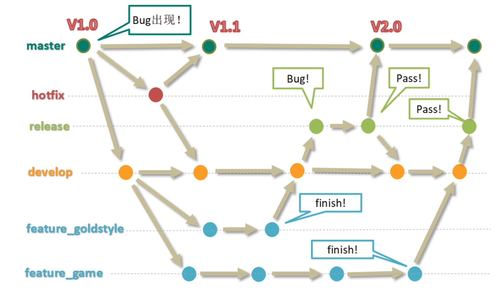

#### 分支实战

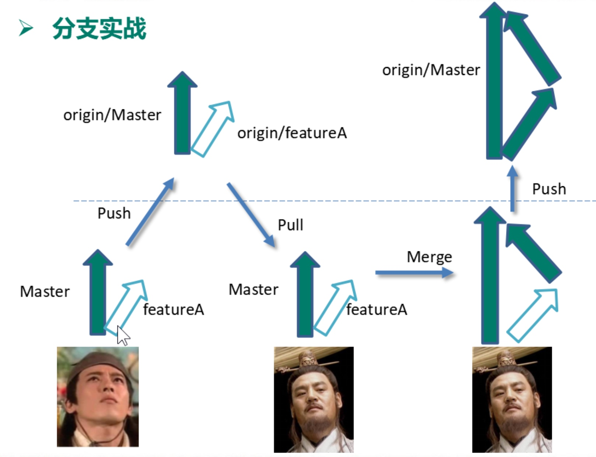


## github服务器环境搭建
