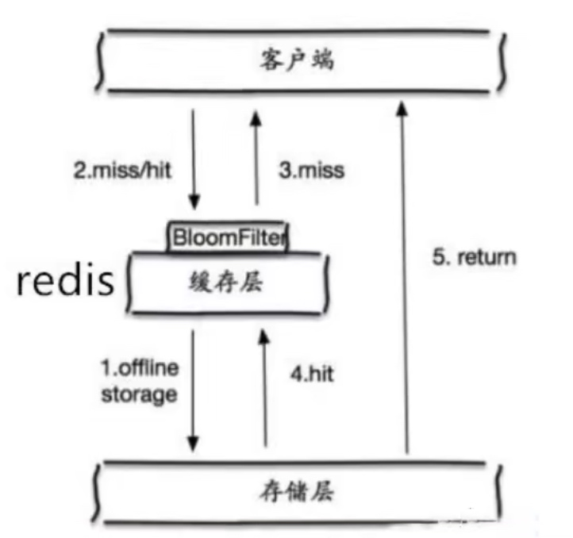

## NoSQL概述

### 技术发展

我们现在处于什么年代？大数据时代

大数据一般的数据库无法进行分析处理了

#### 技术分类

- 解决功能性问题：Java、jsp、RDBMS、Tomcat、HTML、Linux、JDBC、SVN
- 解决扩展性问题：structs、spring、springMvc、Hibernate、mybatis
- 解决性能问题：NOSQL、Java线程、Hadoop、Nginx、MQ、ElasticSearch

#### web 1.0时代

数据的访问量是有限的，使用单体服务器可以解决大部分的问题


90年代，一个基本的网站访问量一般不会太大，单个数据完全足够

那个时候更多的是去使用静态网页，服务器根本没有太大的压力

思考一下，这种情况下，整个网站的瓶颈是什么？

 - 数据量如果太大，一个机器放不下
 - 数据如果超过300万，如果不创建索引就会很卡了，一个机器放不下
 - 访问量（读写混合），一个服务器承受不了

只要出现以上的三种情况之一，那么你就必须要晋级了

#### web 2.0时代

发展过程：优化数据结构和索引-->文件缓存（IO）-->Memcached（当时最热门的技术）

用户访问量增大，同时会产生大量的用户数据，在使用单点的服务器不能承受这么大的压力。


1. memcache（缓存）+mysql+垂直拆分


网站80%的情况都是在读，但是如果这80%的操作都需要在数据库中取读写的话，十分麻烦，所以说我们希望可以使用缓存来保证效率

- 通过缓存解决读的问题


2. 分库分表+水平拆分+MySQL集群


- 先去缓存中找，找不到就去到数据库去查
- MySQL集群中，每个库放置1/3的数据

本质还是数据库的读写问题

MySQL使用的数据库：

- 早些年使用的是myism：表锁，查一个数据只需要进行锁一行就行了，但是myism引擎却要锁整张表，不支持事务
- 现在有myism和innodb：默认innodb，行锁，支持事务
- 慢慢的就开始使用分库分表来解决写的压力，MySQL在那个年代也推出了表分区，但是并没有多少人使用
- MySQL开始推出集群

3. 如今最近的年代

在定位、音乐、热榜等，MySQL的关系型数据库已经不够用了，数据量大，变化很快

浏览很快就10W+了，这时候的浏览量是在每次有用户访问文章的时候直接写入到数据库吗？

不是的，会先缓存在内存中，然后在逐渐的写入到数据库中

MySQL有的使用它来存储一些比较大的文件，博客、图片等，数据量很大，效率就低了，如果有一种数据库来专门处理这种数据，MySQL的压力就变得十分小了，大数据的IO压力下，表几乎没法更大


#### 解决CPU及内存压力

如果我们使用多个服务器，那么session该怎么存储。


- 存储到客户端cookie中
- session复制
- 存储到NOSQL数据库，完全在内存中

#### 解决IO压力


### NoSQL发展

#### NoSQL数据库概述

NoSQL（Not Only SQL），泛指**非关系型的数据库**，随着web2.0互联网的诞生，传统的关系性数据库很慢对付web2.0时代，尤其是超大规模的高并发社区，暴露出很多难以克服的问题，这个时候就需要使用NoSQL数据库了

不依赖业务逻辑方式存储，以简单的key-value模式存储

- 不遵循SQL标准
- 不支持ACID
- 远超SQL的性能

##### NoSQL适用场景

- 对数据高并发的读写
- 海量数据的读写
- 对数据高可扩展性的

##### NoSQL不适用场景

- 需要事务的支持
- 基于SQL的结构化查询存储，处理复杂的关系，需要即席查询

> 即席查询（Ad Hoc）是用户根据自己的需求，灵活的选择查询条件，系统能够根据用户的选择生成相应的统计报表。即席查询与普通应用查询最大的不同是普通的应用查询是定制开发的，而即席查询是由用户自定义查询条件的。

#### 当下的NoSQL应用

##### Memcache


##### Redis


##### MongoDB


### 数据库的存储方式分类

#### 行式存储数据库


#### 列式数据库


#### 图关系型数据库


### 数据库排名

> 网址：https://hellogithub.com/report/db-engines/

数据库排名前10位

| 排名 | 上月 | 数据库名称           | 数据库类型    | 分数    | 变化   |
| ---- | ---- | -------------------- | ------------- | ------- | ------ |
| 1    | 1    | Oracle               | Relational    | 1281.74 | +9.01  |
| 2    | 2    | MySQL                | Relational    | 1206.04 | -5.48  |
| 3    | 3    | Microsoft SQL Server | Relational    | 954.02  | -0.27  |
| 4    | 4    | PostgreSQL           | Relational    | 608.21  | +10.94 |
| 5    | 5    | MongoDB              | Document      | 484.67  | -2.67  |
| 6    | 7    | Redis                | Key-value     | 173.54  | +2.04  |
| 7    | 6    | IBM Db2              | Relational    | 167.18  | -0.34  |
| 8    | 8    | Elasticsearch        | Search engine | 157.72  | -1.36  |
| 9    | 9    | SQLite               | Relational    | 128.68  | -1.12  |
| 10   | 11   | Microsoft Access     | Relational    | 125.99  | +6.75  |

#### NoSQL 特点

- 方便扩展（数据之间没有关系，很好扩展）
- 大数据量高性能（Redis一秒写8万次，读取11万次，NOSQL的缓存基数级，是一个中细粒度的缓存，性能会比较高）
- 数据类型是多样性的，（不需要事先设计数据库，随取随用，如果是数据量十分大的表，很多人就无法设计了）

传统的关系型数据库 RBDMS 和 NOSQL区别

传统的关系型数据库RDBMS

- 结构化组织
- SQL
- 数据和关系都存在单独的表中
- 操作数据，数据库定义语言
- 基础的事务

NOSQL

- 不仅仅是数据
- 没有固定的查询语言
- 键值对存储，列存储，文档存储，图形数据库（社交关系）
- 最终一致性
- CAP定理 和 BASE（异地多活）
- 高性能，高可用，高可扩展

了解：3V+3高

大数据时代的3V：主要是描述问题的

- 海量Volume
- 多样Variety
- 实时Velocity

大数据时代的3高：主要是对程序的要求

- 高并发
- 高可拓（随时可以水平拆分，机器不够了，可以添加机器）
- 高性能（保证用户体验和性能）

真正在公司中实践，还是NOSQL+RDBMS

如果你未来想要当一个架构师，只要记住一句话：没有什么是加一层解决不了的

数据的存储：

- 商品的基本信息：名称、价格、商家信息，通过关系型数据库就可以解决了
- 商品的描述、评论（文字比较多），通过文档型数据库、MongoDB
- 图片 分布式文件系统 FastDFS
  - 淘宝自己的TFS
  - Google 的 GFS
  - Hadoop HDFS
  - 阿里云的 OSS
- 商品的关键字（搜索）
  - 搜索引擎 solr elasticsearch
  - Isearchd
- 商品热门的波段信息
  -  内存数据库
  -  Redis、Tair、MemCache
- 商品的交易，外部支付接口
  - 三方应用

大型互联网应用问题：

- 数据类型太多了
- 数据源繁多，经常重构
- 数据要改造，大面积改造

解决问题：

统一的数据服务层


#### NoSQL的四大分类

KV键值对：

-  新浪 Redis
-  美团 Redis + Tair
-  阿里、百度：Redis+MemCache

文档型数据库（bson格式 和json一样）：

- MongoDB（一般必须要掌握）
  - 是一个基于分布式文件存储的数据库，是C++编写的，主要用来处理大量的文档
  - MongoDB是一个介于关系型数据和非关系型数据库中间的产品，MongoDB是非关系数据库中功能最丰富、最像关系型数据库的数据库
- ConthDB

列存储数据库

- HBase
- 分布式文件系统

图形关系数据库

- 他不会存图形的，放的是关系，比如：朋友圈社交网络，广告推荐
- Neo4j，InfoGrid


## redis概述

Redis：Remote Dictionary Server 远程字典服务

- 内存存储、持久化、内存中是断电即失、所以说持久化很重要（rdb\aof）
- 效率高，可以用于高速缓存
- 发布订阅系统
- 地图信息分析
- 计时器、计数器（浏览量）

### 特性

- Redis是一个开源的key-value（键值对的）存储系统
- 支持存储的value类型：stirng（字符串）\list（链表）\set（集合）\zset（sorted set 有序集合）和hash（哈希类型）
- 这些数据类型都支持push/pop、add/remove及取交集并集和差集及更丰富的操作，而且这些操作都是原子性的
- 在此基础上，Redis支持各种不同方式的排序
- 数据缓存在内存中
- Redis会周期性的吧更新的数据写入磁盘或者把修改操作写入追加的记录文件中
- 实现了master-slave（主从）同步
- 高性能、高存储


### 应用场景

1. 配置关系型数据库做高速缓存

- 高频次，热门访问的数据，降低数据库IO
- 分布式架构，做session共享


2. 计数器


2. 消息队列系统


3. 排行榜
4. 社交网络
5. 实时系统

6. 多样性的数据结构存储持久化数据


###  redis特性

- 速度快
  - 数据存储在内存中
  - 使用C语言编程
  - 线程模型：单线程多路IO复用
- 持久化（断点不丢失数据）
  - Redis所有的数据保存在内存中，对数据的更新将异步的保存到磁盘上
- 多种数据结构
  - String、Blobs、Bitmap
  - Hash Tables
  - Linked Lists
  - Sets
  - Sorted Sets
  - BitMaps
  - HyperLogLog（超小内存唯一值计数）
  - GEO（地理信息定位）
- 支持多种编辑语言
  - Java
  - PHP
  - Python
  - ...
- 功能丰富
  - 发布订阅
  - Lua脚本
  - 事务
  - pipeline
- 简单
- 主从复制
  
- 高可用、分布式
  - Redis-Sentinel支持高可用
  - Redis-Cluster支持分布式

### Redis相关知识介绍

- 默认16个数据库，类似数组下标从0开始，初始默认使用0号库，使用命令`select <dbid>`来切换数据库。如: `select 8`，统一密码管理，所有库同样密码。
- dbsize查看当前数据库的key的数量
- flushdb清空当前库
- flushall通杀全部库

**Redis是单线程+多路IO复用技术**


- 黄牛：单线程
- 123号买票要求提出后，不等待，去做其他事情（异步）
- 误区：高性能的服务器一定是多线程吗？
- 误区：多线程（CPU上下文会切换）一定比单线程效率高吗？
- CPU>内存>硬盘
- 核心：Redis是将所有的数据全部放在内存中，所以说使用单线程去操作效率是最高的，多线程（CPU上下文会切换：耗时的操作），对于内存系统来说，如果没有上下文切换，效率就是最高的，多次读写都是在一个CPU上的，在内存情况下，这个就是最佳的方案

总结：

- 1.redis是基于内存的，内存的读写速度非常快；

- 2.redis是单线程的，省去了很多上下文切换线程的时间；

- 3.redis使用多路复用技术，可以处理并发的连接

> 总结一点就是：为什么我们要使用多线程，就是为了能完全的利用CPU的性能，让CPU能达到高效率


## Redis 安装

### 安装到linux

#### 下载和上传到Linux

官网地址：https://redis.io/

下载地址：https://download.redis.io/releases/

下载版本：6.2.1 for Linux（redis-6.2.1.tar.gz）

上传到Linux服务器

```
scp Downloads/redis-6.2.1.tar.gz root@172.16.187.9:/opt
```

#### 安装

##### 下载安装gcc编译器

安装C 语言的编译环境

```
yum install centos-release-scl scl-utils-build
yum install -y devtoolset-8-toolchain
scl enable devtoolset-8 bash
```

测试 gcc版本

```
gcc --version
```


##### 安装Redis

解压Redis

```
tar -zxvf redis-6.2.1.tar.gz
```

解压完成后进入目录：

```
cd redis-6.2.1
```

在redis-6.2.1目录下再次执行make命令（只是编译好）


跳过make test 继续执行: make install


查看安装目录，默认安装都是在usr/local/bin


- redis-benchmark:性能测试工具，可以在自己本子运行，看看自己本子性能如何
- redis-check-aof：修复有问题的AOF文件
- redis-check-dump：修复有问题的dump.rdb文件
- redis-sentinel：Redis集群使用
- redis-server：Redis服务器启动命令
- redis-cli：命令行客户端，操作入口

**redis-benchmark**


```bash
redis-benchmark -h localhost -p 6379 -c 100 -n 100000
```

如何查看这些东西呢？


#### 启动

##### 前台启动（不推荐）

前台启动，命令行窗口不能关闭，否则服务器停止


如果想要在启动的时候更改端口

```
redis-server --port 6380
```

##### 后台启动

###### 配置redis.conf

拷贝一份redis.conf到其他目录

在Redis目录中创建一个config的目录


将redis.conf配置文件拷贝到config目录中

```
cp redis.conf config/redis.conf
```


因为我们的机器可能会部署多个Redis，因为Redis是单线程的，而很多服务器是多核CPU，所以通常会在一台机器上部署很多的Redis，这样Redis就会涉及到多个端口，可以通过在配置文件中配置端口区分不同的Redis。

将刚才拷贝的redis.conf重命名成redis-6381.conf

```
mv redis.conf redis-6381.conf
```

去除所有的注释和空格查看并重定向到文件中，删除6381，得到纯净的配置文件

```
cat redis-6381.conf | grep -v "#" | grep -v "^$" > redis-6382.conf
rm -rf redis-6381.conf
```


1. 后台启动设置daemonize no改成yes

daemonize no 改成 yes，让服务在后台启动

命令模式下使用`/daemonize`搜索到对应的行

2. 修改端口为6382

port 6382

3. 修改数据目录为redis/data

dir "/opt/redis-6.2.1/data"

4. 修改日志输出文件

logfile "6382.log"

5. 其他的先不用管，删除其他的配置信息，或者直接创建一个新的配置文件，然后把刚才的录入进去

6. 在Redis根目录下创建一个data目录


###### Redis启动

当前所在目录：/opt/redis-6.2.1，启动Redis：`redis-server config/redis-6382.conf`

查看Redis任务

```
ps -ef|grep redis
```


查看日志是否输出到配置的目录中


#### 用客户端访问：redis-cli

在任意目录下`redis-cli -h 127.0.0.1 -p 6379`（不输入IP地址和端口默认连接本机的6379端口）

本地连接，只修改了端口，只输入端口的方式：`redis-cli -p 6379`


退出


##### Redis客户端返回值

- 状态回复：ping->PONG
- 错误回复：(error) WRONGTYPE Operation against
- 整数回复：(integer) 1
- 字符串回复
- 多行回复：

#### 启动方式比较

- 生产环境选择配置启动
- 单机多实例配置文件可以用端口去分开

#### Redis关闭

1. 使用redis-cli连接之后，使用shutdown关闭
2. 在终端直接使用redis-cli shutdown关闭
3. 或者直接使用`kill -9 进程号`杀掉进程

### 安装到mac

#### 下载

网址：https://redis.io/download

#### 编译安装

解压之后进入目录，执行`make install`

```bash
(base) aldencarter@aldencarter redis6 % make install
cd src && /Library/Developer/CommandLineTools/usr/bin/make install
    CC Makefile.dep
rm -rf redis-server redis-sentinel redis-cli redis-benchmark redis-check-rdb redis-check-aof *.o *.gcda *.gcno *.gcov redis.info lcov-html Makefile.dep
rm -f adlist.d quicklist.d ae.d anet.d dict.d server.d sds.d zmalloc.d lzf_c.d lzf_d.d pqsort.d zipmap.d sha1.d ziplist.d release.d networking.d util.d object.d db.d replication.d rdb.d t_string.d t_list.d t_set.d t_zset.d t_hash.d config.d aof.d pubsub.d multi.d debug.d sort.d intset.d syncio.d cluster.d crc16.d endianconv.d slowlog.d scripting.d bio.d rio.d rand.d memtest.d crcspeed.d crc64.d bitops.d sentinel.d notify.d setproctitle.d blocked.d hyperloglog.d latency.d sparkline.d redis-check-rdb.d redis-check-aof.d geo.d lazyfree.d module.d evict.d expire.d geohash.d geohash_helper.d childinfo.d defrag.d siphash.d rax.d t_stream.d listpack.d localtime.d lolwut.d lolwut5.d lolwut6.d acl.d gopher.d tracking.d connection.d tls.d sha256.d timeout.d setcpuaffinity.d monotonic.d mt19937-64.d anet.d adlist.d dict.d redis-cli.d zmalloc.d release.d ae.d crcspeed.d crc64.d siphash.d crc16.d monotonic.d cli_common.d mt19937-64.d ae.d anet.d redis-benchmark.d adlist.d dict.d zmalloc.d release.d crcspeed.d crc64.d siphash.d crc16.d monotonic.d cli_common.d mt19937-64.d
(cd ../deps && /Library/Developer/CommandLineTools/usr/bin/make distclean)
(cd hiredis && /Library/Developer/CommandLineTools/usr/bin/make clean) > /dev/null || true
(cd linenoise && /Library/Developer/CommandLineTools/usr/bin/make clean) > /dev/null || true
(cd lua && /Library/Developer/CommandLineTools/usr/bin/make clean) > /dev/null || true
(cd jemalloc && [ -f Makefile ] && /Library/Developer/CommandLineTools/usr/bin/make distclean) > /dev/null || true
(cd hdr_histogram && /Library/Developer/CommandLineTools/usr/bin/make clean) > /dev/null || true
(rm -f .make-*)
(cd modules && /Library/Developer/CommandLineTools/usr/bin/make clean)
rm -rf *.xo *.so
(cd ../tests/modules && /Library/Developer/CommandLineTools/usr/bin/make clean)
rm -f commandfilter.so basics.so testrdb.so fork.so infotest.so propagate.so misc.so hooks.so blockonkeys.so blockonbackground.so scan.so datatype.so auth.so keyspace_events.so blockedclient.so getkeys.so test_lazyfree.so timer.so defragtest.so hash.so zset.so stream.so commandfilter.xo basics.xo testrdb.xo fork.xo infotest.xo propagate.xo misc.xo hooks.xo blockonkeys.xo blockonbackground.xo scan.xo datatype.xo auth.xo keyspace_events.xo blockedclient.xo getkeys.xo test_lazyfree.xo timer.xo defragtest.xo hash.xo zset.xo stream.xo
(rm -f .make-*)
echo STD=-pedantic -DREDIS_STATIC='' -std=c11 >> .make-settings
echo WARN=-Wall -W -Wno-missing-field-initializers >> .make-settings
echo OPT=-O2 >> .make-settings
echo MALLOC=libc >> .make-settings
echo BUILD_TLS= >> .make-settings
echo USE_SYSTEMD= >> .make-settings
echo CFLAGS= >> .make-settings
echo LDFLAGS= >> .make-settings
echo REDIS_CFLAGS= >> .make-settings
echo REDIS_LDFLAGS= >> .make-settings
echo PREV_FINAL_CFLAGS=-pedantic -DREDIS_STATIC='' -std=c11 -Wall -W -Wno-missing-field-initializers -O2 -g -ggdb   -I../deps/hiredis -I../deps/linenoise -I../deps/lua/src -I../deps/hdr_histogram >> .make-settings
echo PREV_FINAL_LDFLAGS=  -g -ggdb >> .make-settings
(cd ../deps && /Library/Developer/CommandLineTools/usr/bin/make hiredis linenoise lua hdr_histogram)
(cd hiredis && /Library/Developer/CommandLineTools/usr/bin/make clean) > /dev/null || true
(cd linenoise && /Library/Developer/CommandLineTools/usr/bin/make clean) > /dev/null || true
(cd lua && /Library/Developer/CommandLineTools/usr/bin/make clean) > /dev/null || true
(cd jemalloc && [ -f Makefile ] && /Library/Developer/CommandLineTools/usr/bin/make distclean) > /dev/null || true
(cd hdr_histogram && /Library/Developer/CommandLineTools/usr/bin/make clean) > /dev/null || true
(rm -f .make-*)
(echo "" > .make-ldflags)
(echo "" > .make-cflags)
MAKE hiredis
cd hiredis && /Library/Developer/CommandLineTools/usr/bin/make static 
cc -std=c99 -pedantic -c -O3 -fPIC  -I/usr/local/opt/openssl/include -Wall -W -Wstrict-prototypes -Wwrite-strings -Wno-missing-field-initializers -g -ggdb alloc.c
cc -std=c99 -pedantic -c -O3 -fPIC  -I/usr/local/opt/openssl/include -Wall -W -Wstrict-prototypes -Wwrite-strings -Wno-missing-field-initializers -g -ggdb net.c
cc -std=c99 -pedantic -c -O3 -fPIC  -I/usr/local/opt/openssl/include -Wall -W -Wstrict-prototypes -Wwrite-strings -Wno-missing-field-initializers -g -ggdb hiredis.c
cc -std=c99 -pedantic -c -O3 -fPIC  -I/usr/local/opt/openssl/include -Wall -W -Wstrict-prototypes -Wwrite-strings -Wno-missing-field-initializers -g -ggdb sds.c
cc -std=c99 -pedantic -c -O3 -fPIC  -I/usr/local/opt/openssl/include -Wall -W -Wstrict-prototypes -Wwrite-strings -Wno-missing-field-initializers -g -ggdb async.c
cc -std=c99 -pedantic -c -O3 -fPIC  -I/usr/local/opt/openssl/include -Wall -W -Wstrict-prototypes -Wwrite-strings -Wno-missing-field-initializers -g -ggdb read.c
cc -std=c99 -pedantic -c -O3 -fPIC  -I/usr/local/opt/openssl/include -Wall -W -Wstrict-prototypes -Wwrite-strings -Wno-missing-field-initializers -g -ggdb sockcompat.c
ar rcs libhiredis.a alloc.o net.o hiredis.o sds.o async.o read.o sockcompat.o
/Library/Developer/CommandLineTools/usr/bin/ranlib: file: libhiredis.a(sockcompat.o) has no symbols
MAKE linenoise
cd linenoise && /Library/Developer/CommandLineTools/usr/bin/make
cc  -Wall -Os -g  -c linenoise.c
MAKE lua
cd lua/src && /Library/Developer/CommandLineTools/usr/bin/make all CFLAGS="-O2 -Wall -DLUA_ANSI -DENABLE_CJSON_GLOBAL -DREDIS_STATIC='' -DLUA_USE_MKSTEMP " MYLDFLAGS="" AR="ar rc"
cc -O2 -Wall -DLUA_ANSI -DENABLE_CJSON_GLOBAL -DREDIS_STATIC='' -DLUA_USE_MKSTEMP    -c -o lapi.o lapi.c
cc -O2 -Wall -DLUA_ANSI -DENABLE_CJSON_GLOBAL -DREDIS_STATIC='' -DLUA_USE_MKSTEMP    -c -o lcode.o lcode.c
cc -O2 -Wall -DLUA_ANSI -DENABLE_CJSON_GLOBAL -DREDIS_STATIC='' -DLUA_USE_MKSTEMP    -c -o ldebug.o ldebug.c
cc -O2 -Wall -DLUA_ANSI -DENABLE_CJSON_GLOBAL -DREDIS_STATIC='' -DLUA_USE_MKSTEMP    -c -o ldo.o ldo.c
cc -O2 -Wall -DLUA_ANSI -DENABLE_CJSON_GLOBAL -DREDIS_STATIC='' -DLUA_USE_MKSTEMP    -c -o ldump.o ldump.c
cc -O2 -Wall -DLUA_ANSI -DENABLE_CJSON_GLOBAL -DREDIS_STATIC='' -DLUA_USE_MKSTEMP    -c -o lfunc.o lfunc.c
cc -O2 -Wall -DLUA_ANSI -DENABLE_CJSON_GLOBAL -DREDIS_STATIC='' -DLUA_USE_MKSTEMP    -c -o lgc.o lgc.c
cc -O2 -Wall -DLUA_ANSI -DENABLE_CJSON_GLOBAL -DREDIS_STATIC='' -DLUA_USE_MKSTEMP    -c -o llex.o llex.c
cc -O2 -Wall -DLUA_ANSI -DENABLE_CJSON_GLOBAL -DREDIS_STATIC='' -DLUA_USE_MKSTEMP    -c -o lmem.o lmem.c
cc -O2 -Wall -DLUA_ANSI -DENABLE_CJSON_GLOBAL -DREDIS_STATIC='' -DLUA_USE_MKSTEMP    -c -o lobject.o lobject.c
cc -O2 -Wall -DLUA_ANSI -DENABLE_CJSON_GLOBAL -DREDIS_STATIC='' -DLUA_USE_MKSTEMP    -c -o lopcodes.o lopcodes.c
cc -O2 -Wall -DLUA_ANSI -DENABLE_CJSON_GLOBAL -DREDIS_STATIC='' -DLUA_USE_MKSTEMP    -c -o lparser.o lparser.c
cc -O2 -Wall -DLUA_ANSI -DENABLE_CJSON_GLOBAL -DREDIS_STATIC='' -DLUA_USE_MKSTEMP    -c -o lstate.o lstate.c
cc -O2 -Wall -DLUA_ANSI -DENABLE_CJSON_GLOBAL -DREDIS_STATIC='' -DLUA_USE_MKSTEMP    -c -o lstring.o lstring.c
cc -O2 -Wall -DLUA_ANSI -DENABLE_CJSON_GLOBAL -DREDIS_STATIC='' -DLUA_USE_MKSTEMP    -c -o ltable.o ltable.c
cc -O2 -Wall -DLUA_ANSI -DENABLE_CJSON_GLOBAL -DREDIS_STATIC='' -DLUA_USE_MKSTEMP    -c -o ltm.o ltm.c
cc -O2 -Wall -DLUA_ANSI -DENABLE_CJSON_GLOBAL -DREDIS_STATIC='' -DLUA_USE_MKSTEMP    -c -o lundump.o lundump.c
cc -O2 -Wall -DLUA_ANSI -DENABLE_CJSON_GLOBAL -DREDIS_STATIC='' -DLUA_USE_MKSTEMP    -c -o lvm.o lvm.c
cc -O2 -Wall -DLUA_ANSI -DENABLE_CJSON_GLOBAL -DREDIS_STATIC='' -DLUA_USE_MKSTEMP    -c -o lzio.o lzio.c
cc -O2 -Wall -DLUA_ANSI -DENABLE_CJSON_GLOBAL -DREDIS_STATIC='' -DLUA_USE_MKSTEMP    -c -o strbuf.o strbuf.c
cc -O2 -Wall -DLUA_ANSI -DENABLE_CJSON_GLOBAL -DREDIS_STATIC='' -DLUA_USE_MKSTEMP    -c -o fpconv.o fpconv.c
cc -O2 -Wall -DLUA_ANSI -DENABLE_CJSON_GLOBAL -DREDIS_STATIC='' -DLUA_USE_MKSTEMP    -c -o lauxlib.o lauxlib.c
cc -O2 -Wall -DLUA_ANSI -DENABLE_CJSON_GLOBAL -DREDIS_STATIC='' -DLUA_USE_MKSTEMP    -c -o lbaselib.o lbaselib.c
cc -O2 -Wall -DLUA_ANSI -DENABLE_CJSON_GLOBAL -DREDIS_STATIC='' -DLUA_USE_MKSTEMP    -c -o ldblib.o ldblib.c
cc -O2 -Wall -DLUA_ANSI -DENABLE_CJSON_GLOBAL -DREDIS_STATIC='' -DLUA_USE_MKSTEMP    -c -o liolib.o liolib.c
cc -O2 -Wall -DLUA_ANSI -DENABLE_CJSON_GLOBAL -DREDIS_STATIC='' -DLUA_USE_MKSTEMP    -c -o lmathlib.o lmathlib.c
cc -O2 -Wall -DLUA_ANSI -DENABLE_CJSON_GLOBAL -DREDIS_STATIC='' -DLUA_USE_MKSTEMP    -c -o loslib.o loslib.c
cc -O2 -Wall -DLUA_ANSI -DENABLE_CJSON_GLOBAL -DREDIS_STATIC='' -DLUA_USE_MKSTEMP    -c -o ltablib.o ltablib.c
cc -O2 -Wall -DLUA_ANSI -DENABLE_CJSON_GLOBAL -DREDIS_STATIC='' -DLUA_USE_MKSTEMP    -c -o lstrlib.o lstrlib.c
cc -O2 -Wall -DLUA_ANSI -DENABLE_CJSON_GLOBAL -DREDIS_STATIC='' -DLUA_USE_MKSTEMP    -c -o loadlib.o loadlib.c
cc -O2 -Wall -DLUA_ANSI -DENABLE_CJSON_GLOBAL -DREDIS_STATIC='' -DLUA_USE_MKSTEMP    -c -o linit.o linit.c
cc -O2 -Wall -DLUA_ANSI -DENABLE_CJSON_GLOBAL -DREDIS_STATIC='' -DLUA_USE_MKSTEMP    -c -o lua_cjson.o lua_cjson.c
cc -O2 -Wall -DLUA_ANSI -DENABLE_CJSON_GLOBAL -DREDIS_STATIC='' -DLUA_USE_MKSTEMP    -c -o lua_struct.o lua_struct.c
cc -O2 -Wall -DLUA_ANSI -DENABLE_CJSON_GLOBAL -DREDIS_STATIC='' -DLUA_USE_MKSTEMP    -c -o lua_cmsgpack.o lua_cmsgpack.c
cc -O2 -Wall -DLUA_ANSI -DENABLE_CJSON_GLOBAL -DREDIS_STATIC='' -DLUA_USE_MKSTEMP    -c -o lua_bit.o lua_bit.c
ar rc liblua.a lapi.o lcode.o ldebug.o ldo.o ldump.o lfunc.o lgc.o llex.o lmem.o lobject.o lopcodes.o lparser.o lstate.o lstring.o ltable.o ltm.o lundump.o lvm.o lzio.o strbuf.o fpconv.o lauxlib.o lbaselib.o ldblib.o liolib.o lmathlib.o loslib.o ltablib.o lstrlib.o loadlib.o linit.o lua_cjson.o lua_struct.o lua_cmsgpack.o lua_bit.o	## DLL needs all object files
ranlib liblua.a
cc -O2 -Wall -DLUA_ANSI -DENABLE_CJSON_GLOBAL -DREDIS_STATIC='' -DLUA_USE_MKSTEMP    -c -o lua.o lua.c
cc -o lua  lua.o liblua.a -lm 
cc -O2 -Wall -DLUA_ANSI -DENABLE_CJSON_GLOBAL -DREDIS_STATIC='' -DLUA_USE_MKSTEMP    -c -o luac.o luac.c
cc -O2 -Wall -DLUA_ANSI -DENABLE_CJSON_GLOBAL -DREDIS_STATIC='' -DLUA_USE_MKSTEMP    -c -o print.o print.c
cc -o luac  luac.o print.o liblua.a -lm 
MAKE hdr_histogram
cd hdr_histogram && /Library/Developer/CommandLineTools/usr/bin/make
cc  -Wall -Os -g  -c  hdr_histogram.c 
    CC adlist.o
    CC quicklist.o
    CC ae.o
    CC anet.o
    CC dict.o
    CC server.o
    CC sds.o
    CC zmalloc.o
    CC lzf_c.o
    CC lzf_d.o
    CC pqsort.o
    CC zipmap.o
    CC sha1.o
    CC ziplist.o
    CC release.o
    CC networking.o
    CC util.o
    CC object.o
    CC db.o
    CC replication.o
    CC rdb.o
    CC t_string.o
    CC t_list.o
    CC t_set.o
    CC t_zset.o
    CC t_hash.o
    CC config.o
    CC aof.o
    CC pubsub.o
    CC multi.o
    CC debug.o
    CC sort.o
    CC intset.o
    CC syncio.o
    CC cluster.o
    CC crc16.o
    CC endianconv.o
    CC slowlog.o
    CC scripting.o
    CC bio.o
    CC rio.o
    CC rand.o
    CC memtest.o
    CC crcspeed.o
    CC crc64.o
    CC bitops.o
    CC sentinel.o
    CC notify.o
    CC setproctitle.o
    CC blocked.o
    CC hyperloglog.o
    CC latency.o
    CC sparkline.o
    CC redis-check-rdb.o
    CC redis-check-aof.o
    CC geo.o
    CC lazyfree.o
    CC module.o
    CC evict.o
    CC expire.o
    CC geohash.o
    CC geohash_helper.o
    CC childinfo.o
    CC defrag.o
    CC siphash.o
    CC rax.o
    CC t_stream.o
    CC listpack.o
    CC localtime.o
    CC lolwut.o
    CC lolwut5.o
    CC lolwut6.o
    CC acl.o
    CC gopher.o
    CC tracking.o
    CC connection.o
    CC tls.o
    CC sha256.o
    CC timeout.o
    CC setcpuaffinity.o
    CC monotonic.o
    CC mt19937-64.o
    LINK redis-server
    INSTALL redis-sentinel
    CC redis-cli.o
    CC cli_common.o
    LINK redis-cli
    CC redis-benchmark.o
    LINK redis-benchmark
    INSTALL redis-check-rdb
    INSTALL redis-check-aof

Hint: It's a good idea to run 'make test' ;)

    INSTALL redis-server
    INSTALL redis-benchmark
    INSTALL redis-cli
```

#### 运行

启动

```bash
redis-server
```

## Redis配置

### 基础配置

- daemonize：是否是守护进程（no|yes）
- port：对外端口
- logfile：Redis系统日志
- dir：Redis工作目录

自定义目录：/etc/redis.conf

### redis配置文件详解

#### Units单位

配置大小单位,开头定义了一些基本的度量单位，只支持bytes，不支持bit
大小写不敏感


#### INCLUDES包含


类似jsp中的include，多实例的情况可以把公用的配置文件提取出来

#### NETWORK 网络相关配置

##### bind


默认情况bind=127.0.0.1只能接受本机的访问请求

不写的情况下，无限制接受任何ip地址的访问

生产环境肯定要写你应用服务器的地址；服务器是需要远程访问的，所以需要将其注释掉


**如果开启了protected-mode，那么在没有设定bind ip且没有设密码的情况下，Redis只允许接受本机的响应**

##### protected-mode

将本机访问保护模式设置no


##### Port

端口号，默认 6379


##### tcp-backlog

设置tcp的backlog，backlog其实是一个连接队列，backlog队列总和=未完成三次握手队列 + 已经完成三次握手队列

在高并发环境下你需要一个高backlog值来避免慢客户端连接问题

注意Linux内核会将这个值减小到/proc/sys/net/core/somaxconn的值（128），所以需要确认增大/proc/sys/net/core/somaxconn和/proc/sys/net/ipv4/tcp_max_syn_backlog（128）两个值来达到想要的效果


##### timeout

一个空闲的客户端维持多少秒会关闭，0表示关闭该功能。即永不关闭


##### tcp-keepalive

对访问客户端的一种心跳检测，每个n秒检测一次

单位为秒，如果设置为0，则不会进行Keepalive检测，建议设置成60


#### GENERAL 通用

##### daemonize

是否为后台进程，设置为yes

守护进程，后台启动


##### pidfile

存放pid文件的位置，每个实例会产生一个不同的pid文件


##### loglevel

指定日志记录级别，Redis总共支持四个级别：debug、verbose、notice、warning，默认为notice

四个级别根据使用阶段来选择，生产环境选择notice或者warning


##### logfile

日志文件名称


##### databases 16

设定库的数量 默认16，默认数据库为0，可以使用`SELECT <dbid>`命令在连接上指定数据库id


#### SECURITY 安全

##### 设置密码


Redis中requirepass已经作为一种兼容性的设置。

#### CLIENTS限制

##### maxclients


- 设置redis同时可以与多少个客户端进行连接。
- 默认情况下为10000个客户端。
- 如果达到了此限制，redis则会拒绝新的连接请求，并且向这些连接请求方发出“max number of clients reached”以作回应

#### MEMORY MANAGEMENT 内存管理

##### maxmemory


- 建议必须设置，否则，将内存占满，造成服务器宕机
- 设置redis可以使用的内存量。一旦到达内存使用上限，redis将会试图移除内部数据，移除规则可以通过maxmemory-policy来指定。
- 如果redis无法根据移除规则来移除内存中的数据，或者设置了“不允许移除”，那么redis则会针对那些需要申请内存的指令返回错误信息，比如SET、LPUSH等。
- 但是对于无内存申请的指令，仍然会正常响应，比如GET等。如果你的redis是主redis（说明你的redis有从redis），那么在设置内存使用上限时，需要在系统中留出一些内存空间给同步队列缓存，只有在你设置的是“不移除”的情况下，才不用考虑这个因素

##### maxmemory-policy


- volatile-lru：使用LRU算法移除key，只对设置了过期时间的键；（最近最少使用）
- allkeys-lru：在所有集合key中，使用LRU算法移除key
- volatile-random：在过期集合中移除随机的key，只对设置了过期时间的键
- allkeys-random：在所有集合key中，移除随机的key
- volatile-ttl：移除那些TTL值最小的key，即那些最近要过期的key
- noeviction：不进行移除。针对写操作，只是返回错误信息

##### maxmemory-samples


- 设置样本数量，LRU算法和最小TTL算法都并非是精确的算法，而是估算值，所以你可以设置样本的大小，redis默认会检查这么多个key并选择其中LRU的那个。
- 一般设置3到7的数字，数值越小样本越不准确，但性能消耗越小。

> 我们现在讲解的命令虽然是通过终端来输入的，但是后面通过springboot连接到Redis的代码其实也是这些名的封装

## redis数据类型

### Redis键，通用命令

#### 通用命令

获得redis常见数据类型操作命令：http://www.redis.cn/commands.html

- `keys *` 查看当前库所有key (匹配：keys *1)，尽量不要在生产环境中使用
- `exists key` 判断某个key是否存在
- `type key` 查看你的key是什么类型
- `del key [key...]` 删除指定的key数据
- `unlink key` 根据value选择非阻塞删除，仅将keys从keyspace元数据中删除，真正的删除会在后续异步操作
- `expire key 10` 10秒钟：为给定的key设置过期时间
- `ttl key` 查看还有多少秒过期，-1表示永不过期，-2表示已过期
- `persist key` 去掉key的过期时间
- `select` 命令切换数据库
- `dbsize` 查看当前数据库的key的数量
- `flushdb` 清空当前库
- `flushall` 通杀全部库
- `move <key> <db>` 移除当前key

##### 时间复杂度


#### 数据结构和内部编码


#### redisObject


#### 单线程架构

单线程为什么这么快？

- 纯内存
- 非阻塞IO
- 避免了线程切换和竞态消耗


使用单线程要注意什么？

- 一次只运行一条命令
- 拒绝长（慢）命令：keys,flushall,flushdb

### 字符串

#### 简介

String是Redis最基本的数据类型，一个key对应一个value

String类型是二进制安全的，意味着Redis的String可以包含任何数据，比如图片或者序列化对象

String是Redis最基本的数据类型，一个Redis中字符串value最多可以是512M

##### 字符串的键值结构


##### 使用场景

- 缓存
- 计数器，社交网站的点赞和视频网站的播放量
- 分布式锁
- 统计多单位的数量
- 粉丝数

**一个Redis中字符串value最多可以是512M**

#### 常用命令

命令在键入的过程中会出现提示，比如set命令如下。

```
set <key> <value>
```


```
set key value [EX seconds|PX milliseconds|EXAT timestamp|PXAT milliseconds-timestamp|KEEPTTL] [NX|XX]
```

- *NX：当数据库中key不存在时，可以将key-value添加数据库
- *XX：当数据库中key存在时，可以将key-value添加数据库，与NX参数互斥
- *EX：key的超时秒数
- *PX：key的超时毫秒数，与EX互斥

比如：`set lua hhh xx`

**常用命令**

时间复杂度：O(1)

- `set key value` 添加key-value
- `get <key>` 查询对应键值
- `del key` 删除key-value
- `append <key> <value>` 将给定的\<value>追加到原值的末尾，如果key值不存在，就相当于set
- `strlen <key>` 获得值的长度
- `setnx <key> <value>` set if not exist 只有在key不存在时设置key的值，在分布式锁中会经常使用
- `setex <key> <过期时间> <value>` set with expire，设置键值的同时，设置过期时间，单位秒

**计数命令**

时间复杂度：O(1)

- `incr <key>` 将key中储存的数字值增1，只能对数字值操作，如果为空，新增值为1
- `decr <key>` 将key中储存的数字值减1，只能对数字值操作，如果为空，新增值为-1
- `incrby/decrby <key> <步长>` 将key中储存的数字值增减，自定义步长
- `incrbyfloat key 3.5` 浮点数自增，增加key对应的值3.5

**其他命令**

- `mset <key1> <value1> <key2> <value2>.....` 同时设置一个或多个key-value对  
- `mget <key1> <key2> <key3>.....` 同时获取一个或多个value  
- `msetnx <key1> <value1> <key2> <value2>.....` 同时设置一个或多个key-value 对，当且仅当所有给定key都不存在，原子操作，设置要么同时成功，要么同时失败
- `getrange <key> <起始位置> <结束位置>` 获得值的范围，类似java中的substring，前包，后包
- `setrange <key> <起始位置> <value>` 用\<value>覆写\<key>所储存的字符串值，从<起始位置>开始(索引从0开始)
- `getset <key> <value>` 以新换旧，设置了新值同时获得旧值


**上面在进行加1操作和同时设置多个值的时候存在原子性**


所谓原子操作是指不会被线程调度机制打断的操作

这种操作一旦开始，就一直运行到结束，中间不会有任何 context switch （切换到另一个线程）

- 在单线程中， 能够在单条指令中完成的操作都可以认为是"原子操作"，因为中断只能发生于指令之间。
- 在多线程中，不能被其它进程（线程）打断的操作就叫原子操作。

Redis单命令的原子性主要得益于Redis的单线程

**为什么要出现批量的、联合的操作？**

一般业务和Redis是架设在不同的服务器中的，传输时间取决于网络的传输速度，所以一次性将命令传输给Redis去执行命令，将会减少传输的次数，减少网络带来的耗时。


#### 时间复杂度总结


#### 实战

设置一个user:1对象，值为json字符串

```bash
127.0.0.1:6382> set user:1 {name:zhangsan,id:1}
OK
127.0.0.1:6382> get user:1
"{name:zhangsan,id:1}"
```

或者

```bash
127.0.0.1:6382> mset user:1:name zhangsan user:1:id 1
OK
127.0.0.1:6382> mget user:1:name user:1:id
1) "zhangsan"
2) "1"
```

实现如下功能：

1. 记录网站每个用户个人主页的访问量？

使用incr userid:pageview在每次有人访问的时候自增1

因为是单线程的，所以无竞争，不存在Java上的线程访问共享资源的问题。

2. 缓存视频的基本信息，数据源在MySQL中，为了提高接口访问的性能，提高数据访问的并发量，会将一些基础信息存储在缓存中，比如Redis，memcache


实现的伪代码

```java
public VideoInfo get(long id){
    String redisKey = redisPrefix+id;
    VideoInfo videoInfo = redis.get(redisKey);
    if(videoInfo==null){
        videoInfo = mysql.get(id);
        if(videoInfo!=null){
            //序列化
            redis.set(redisKey,serialize(videoInfo));
        }
    }
    return videoInfo;
}
```

3. 分布式id生成器，当分布式的应用需要获取id的时候，为了能在分布式的应用中获取到的ID是唯一的，可以使用Redis实现


incr id

原子操作。

#### 数据结构

String的数据结构为简单的动态字符串（Simple Dynamic String，缩写SDS），是可以修改的字符串，内部结构实现上类似于Java的ArrayList，采用预分配冗余空间的方式来减少内存的频繁分配


如图中所示，内部为当前字符串实际分配的空间capacity一般要高于实际字符串长度len。当字符串长度小于1M时，扩容都是加倍现有的空间，如果超过1M，扩容时一次只会多扩1M的空间。需要注意的是字符串最大长度为512M

### Redis列表

#### 简介

单键多值

- 有序的
- 可以重复的
- 左右两边进行插入和弹出

Redis 列表是简单的字符串列表，按照插入顺序排序。你可以添加一个元素到列表的头部（左边）或者尾部（右边）


它的底层实际是个双向链表，**对两端的操作性能很高**，通过**索引下标的操作中间的节点性能会较差**

#### 常用命令

所有的list相关的命令都是以l开头的

**增**

- `lpush/rpush <key> <value1> <value2> <value3>....` 从左边/右边插入一个或多个值，时间复杂度(1~n)
- `linsert <key> before|after <value> <newvalue>` 在\<value>的前面|后面插入\<newvalue>插入值d

**删**

- `lpop/rpop <key>` 从左边/右边吐出一个值。**值在键在，值光键亡**
- `lrem <key> <n> <value>` 
  - n>0，从左边删除n个值等于value的项(从左到右)
  - n<0，从右边删除n个值等于value的项(从右到左)
  - n=0，删除所有value相等的项
- `ltrim key start end` 按照索引范围修剪列表，时间复杂度O(n)，比如：只保留1到4的，切除前后，ltrim listkey 1 4

**查**

- `lrange <key> <start> <stop>` 按照索引下标获得元素(从左到右)，包含stop元素，`lrange mylist 0 -1`   **0左边第一个，-1右边第一个，（0 -1表示获取所有）**，O(n)
- `lindex <key> <index>` 按照索引下标获得元素(从左到右)，O(n)
- `llen <key>` 获得列表长度，，O(1)

**改**

- `lset <key> <index> <value>` 将列表key下标为index的值替换成value

**其他**

- `rpoplpush <key1><key2>` 从\<key1>列表右边吐出一个值，插到\<key2>列表左边
- `blpop|brpop key timeout` lpop|rpop阻塞版本，timeout是阻塞超时时间，timeout=0为永不阻塞 O(1)

#### 实战

1. 微博，TimeLine，时间轴，将用户关注的微博按照时间的新旧排序


#### 使用

- lpush + lpop = stack
- lpush + rpop = queue
- lpush + ltrim = capped collection
- lpush + brpop = message queue

#### 数据结构

List的数据结构为快速链表quickList

首先在列表元素较少的情况下会使用一块连续的内存存储，这个结构是ziplist，也即是压缩列表。
它将所有的元素紧挨着一起存储，分配的是一块连续的内存

当数据量比较多的时候才会改成quicklist

因为普通的链表需要的附加指针空间太大，会比较浪费空间。比如这个列表里存的只是int类型的数据，结构上还需要两个额外的指针prev和next


Redis将链表和ziplist结合起来组成了quicklist。也就是将多个ziplist使用双向指针串起来使用。这样既满足了快速的插入删除性能，又不会出现太大的空间冗余

#### 小结

- 它实际上是一个链表，before Node after,left,right都可以插入值
- 如果key不存在，创建新的链表
- 如果key存在，新增内容
- 如果移除了所有值，空链表，也代表不存在
- 在两边插入过着改动值，效率最高，中间元素效率相对较低

### Redis集合

#### 简介

Redis set对外提供的功能与list类似是一个列表的功能，特殊之处在于set是可以**自动排重**的，当你需要存储一个列表数据，又不希望出现重复数据时，set是一个很好的选择，并且set提供了判断某个成员是否在一个set集合内的重要接口，这个也是list所不能提供的

**Redis的Set是string类型的无序集合。它底层其实是一个value为null的hash表**，所以添加，删除，查找的复杂度都是O(1)

- 无序
- 无重复
- 集合间操作（交集、并集、差集）

#### 常用命令

**集合内的API**

- `sadd <key> <value1> <value2>.....` 将一个或多个 member 元素加入到集合 key 中，已经存在的 member 元素将被忽略
- `smembers <key>` 取出该集合的所有值，set是无序的，小心使用
- `sismember <key> <value>` 判断集合\<key>是否为含有该\<value>值，有1，没有0
- `scard <key>` 返回该集合的元素个数
- `srem <key> <value1> <value2>....` 删除集合中的某个元素
- `spop <key>` 随机从该集合中吐出一个值
- `srandmember <key> <n>` 随机从该集合中取出n个值，不会从集合中删除

**集合间的API**

- `smove <source> <destination> value` 把集合中一个值从一个集合移动到另一个集合
- `sinter <key1> <key2>` 返回两个集合的交集元素
- `sunion <key1> <key2>` 返回两个集合的并集元素
- `sddiff <key1> <key2>` 返回两个集合的差集元素(key1中的，不包含key2中的)

#### 实战

1. 抽奖系统

使用spop随机从该集合中吐出一个值

2. like、赞、踩

3. 标签

给用户添加标签，知道用户关注了那些标签


给标签添加用户，知道这些标签有那些用户


#### 数据结构

Set数据结构是dict字典，字典是用哈希表实现的

Java中HashSet的内部实现使用的是HashMap，只不过所有的value都指向同一个对象。Redis的set结构也是一样，它的内部也使用hash结构，所有的value都指向同一个内部值

### 哈希

#### 简介

Redis hash 是一个键值对集合

Redis hash是一个string类型的field和value的映射表，hash特别适合用于存储对象。
类似Java里面的Map<String,Object>，Redis本身自己就是kv结构，现在其中的v也就是kv结构

**键值对结构**


用户ID为查找的key，存储的value用户对象包含姓名，年龄，生日等信息，如果用普通的key/value结构来存储


主要有以下2种存储方式：


#### 常用命令

**常用命令**

时间复杂度是：O(1)

- `hset <key> <field> <value>` 给\<key>集合中的\<field>键赋值\<value>
- `hget <key1> <field>` 从\<key1>集合\<field>取出value
- `hdel <key> <field>` 删除hash key对应的field的value

**其他命令**

时间复杂度是：O(1)

- `hlen <key>` 获取对应的key下field的数量
- `hexists <key1> <field>` 查看哈希表 key 中，给定域field是否存在

**批量命令**

时间复杂度是：O(n)

- `hmset <key1> <field1> <value1> <field2> <value2>...` 批量设置hash key的一批field value
- `hmget <key> <field1>` 批量获取hash key的一批field对应的值
- `hgetall key` 返回hash key对应所有的field和value，小心使用
- `hkeys <key>` 列出该hash集合的所有field
- `hvals <key>` 列出该hash集合的所有value

**其他命令**

时间复杂度是：O(1)

- `hincrby <key> <field> <increment>` 为哈希表key中的域field的值加上增量1
- `hsetnx <key><field><value>` 将哈希表key中的域field的值设置为value，当且仅当域field不存在
- `hincrbyfloat key field floatCounter` 浮点数自增

#### 实战

实现如下功能：

1. 记录网站每个用户个人主页的访问量？

hincrby key         field       vaule
hincrby user:1:info pageview    count

和前面的区别就是前面的String只是存储了一个userid，但是这里我们的key中还存在其他的field，比如：username等

2. 缓存视频的基本信息，数据源在MySQL中

之前放在字符串中，然后做了序列化，在取出来要使用的时候，在做一次序列化。

现在通过map可以是实现数据对应

伪代码实现

```java
public VideoInfo get(long id){
    String redisKey = redisPrefix + id;
    Map<String,String> hashMap = redis.hgetAll(redisKey);
    VideoInfo videoInfo =  transferMaptoVideo(haspMap);
    if(videoInfo == null){
        videoInfo = mysql.get(id);
        if(videoInfo != null){
            redis.hmset(redisKey,transferVideoToMap(videoInfo));
        }
    }
    return videoInfo;
}
```

3. 用户信息的缓存

String方式实现方式一：


String方式实现方式二：


hash实现方式


过期时间只能针对key来设置，所以hash里面的field不能设置过期时间

**三种方案的比较**


#### 时间复杂度总结


#### 数据结构

Hash类型对应的数据结构是两种：ziplist（压缩列表），hashtable（哈希表）。当field-value长度较短且个数较少时，使用ziplist，否则使用hashtable

### 有序集合Zset

#### 简介

Redis有序集合zset与普通集合set非常相似，是一个没有重复元素的字符串集合

不同之处是有序集合的每个成员都关联了一个评分（score）,这个评分（score）被用来按照从最低分到最高分的方式排序集合中的成员。集合的成员是唯一的，但是评分可以是重复了


因为元素是有序的, 所以你也可以很快的根据评分（score）或者次序（position）来获取一个范围的元素

访问有序集合的中间元素也是非常快的,因此你能够使用有序集合作为一个没有重复成员的智能列表

集合VS有序集合

|          | 元素       | 次序 | 结构          |
| -------- | ---------- | ---- | :------------ |
| 集合     | 无重复元素 | 无序 | element       |
| 有序集合 | 无重复元素 | 有序 | element+score |

列表VS有序集合

|          | 元素           | 次序 | 结构          |
| -------- | -------------- | ---- | :------------ |
| 列表     | 可以有重复元素 | 有序 | element       |
| 有序集合 | 无重复元素     | 有序 | element+score |

#### 常用命令

- `zadd <key> <score1> <value1> <score2> <value2>…` 将一个或多个member元素及其score值加入到有序集key当中，source可以重复，但是value不能重复 O(logN)
- `zrem  <key> <value>` 删除该集合下，指定值的元素 O(1)
- `zscore key element` 返回元素的分数 O(1)
- `zincrby <key> <increment> <value>` 为元素的score加上增量
- `zcard key` 返回元素的总个数 O(1)
- `zrange <key> <start> <stop> [WITHSCORES]` 返回有序集key中，下标在\<start> \<stop>之间的元素，带WITHSCORES，可以让分数一起和值返回到结果集 O(log(n)+m)
- `zreverange <key> <start> <stop> [WITHSCORES]` 从高到低排名
- `zrangebyscore key min max [withscores] [limit offset count]` 返回有序集key中，所有score值介于min和max之间(包括等于min或max)的成员。有序集成员按score值递增(从小到大)次序排列 -inf/+inf 负无穷和正无穷
- `zrevrangebyscore key max min [withscores] [limit offset count]` 同上，改为从大到小排列
- `zcount <key> <min> <max>` 统计该集合，分数区间内的元素个数 O(log(n)+m)
- `zrank <key> <value>` 返回该值在集合中的排名，从0开始
- `zrevrank <key> <value>` 从高到低排名
- `zremrangebyrank key start end` 删除指定排名内的升序元素

#### 有序集合命令总结


#### 实战

1. 排行榜
2. 存储班级成绩表，工资表排序
3. 普通消息为1，重要消息为2，带权重进行判断
4. 排行榜应用实现，取Top N

#### 数据结构

SortedSet(zset)是Redis提供的一个非常特别的数据结构，一方面它等价于Java的数据结构Map<String, Double>，可以给每一个元素value赋予一个权重score，另一方面它又类似于TreeSet，内部的元素会按照权重score进行排序，可以得到每个元素的名次，还可以通过score的范围来获取元素的列表

zset底层使用了两个数据结构

- hash，hash的作用就是关联元素value和权重score，保障元素value的唯一性，可以通过元素value找到相应的score值
- 跳跃表，跳跃表的目的在于给元素value排序，根据score的范围获取元素列表

#### 跳跃表

##### 简介

有序集合在生活中比较常见，例如根据成绩对学生排名，根据得分对玩家排名等。对于有序集合的底层实现，可以用数组、平衡树、链表等。数组不便元素的插入、删除；平衡树或红黑树虽然效率高但结构复杂；链表查询需要遍历所有效率低。Redis采用的是跳跃表。跳跃表效率堪比红黑树，实现远比红黑树简单

##### 实例

对比有序链表和跳跃表，从链表中查询出51

有序链表


要查找值为51的元素，需要从第一个元素开始依次查找、比较才能找到。共需要6次比较

跳跃表


- 从第2层开始，1节点比51节点小，向后比较
- 21节点比51节点小，继续向后比较，后面就是NULL了，所以从21节点向下到第1层
- 在第1层，41节点比51节点小，继续向后，61节点比51节点大，所以从41向下
- 在第0层，51节点为要查找的节点，节点被找到，共查找4次

从此可以看出跳跃表比有序链表效率要高

### Bitmaps 位图

#### 简介

统计用户信息，活跃不活跃的用户，登录未登录的用户，打开未打开的用户，都可以使用bitmaps

都是操作二进制位来进行记录，就只有0和1两个状态

现代计算机用二进制（位）作为信息的基础单位，1个字节等于8位，例如“abc”字符串是由3个字节组成，但实际在计算机存储时将其用二进制表示， “abc”分别对应的ASCII码分别是97、98、99，对应的二进制分别是01100001、01100010和01100011，如下图


合理地使用操作位能够有效地提高内存使用率和开发效率。

Redis提供了Bitmaps这个“数据类型”可以实现对位的操作：

- Bitmaps本身不是一种数据类型，实际上它就是字符串（key-value），但是它可以对字符串的位进行操作。
- Bitmaps单独提供了一套命令，所以在Redis中使用Bitmaps和使用字符串的方法不太相同。可以把Bitmaps想象成一个以位为单位的数组， 数组的每个单元只能存储0和1，数组的下标在Bitmaps中叫做偏移量。


#### 命令

1. setbit

(1). 格式：`setbit <key> <offset> <value>` 设置Bitmaps中某个偏移量的值（0或1）


- offset：偏移量从0开始

(2). 实例：每个独立用户是否访问过网站存放在Bitmaps中，将访问的用户记做1，没有访问的用户记做0，用偏移量作为用户的id。
设置键的第offset个位的值（从0算起），假设现在有20个用户，userid=1，6，11，15，19的用户对网站进行了访问，那么当前Bitmaps初始化结果如图


unique:users:20201106代表2020-11-06这天的独立访问用户的Bitmaps


**注：**

- 很多应用的用户id以一个指定数字（例如10000）开头，直接将用户id和Bitmaps的偏移量对应势必会造成一定的浪费，通常的做法是每次做setbit操作时将用户id减去这个指定数字。
- 在第一次初始化Bitmaps时，假如偏移量非常大，那么整个初始化过程执行会比较慢，可能会造成Redis的阻塞。

2. getbit

(1). 格式：`getbit <key> <offset>` 获取Bitmaps中某个偏移量的值


获取键的第offset位的值（从0开始算）

(2). 实例：获取id=8的用户是否在2020-11-06这天访问过，返回0说明没有访问过


注：因为100根本不存在，所以也是返回0

3. bitcount

统计字符串被设置为1的bit数。一般情况下，给定的整个字符串都会被进行计数，通过指定额外的 start 或 end 参数，可以让计数只在特定的位上进行。start 和 end 参数的设置，都可以使用负数值：比如 -1 表示最后一个位，而 -2 表示倒数第二个位，start、end 是指bit组的字节的下标数，二者皆包含。

(1). 格式

`bitcount <key> [start end]` 统计字符串从start字节到end字节比特值为1的数量


(2). 实例

计算2022-11-06这天的独立访问用户数量


start和end代表起始和结束字节数，下面操作计算用户id在第1个字节到第3个字节之间的独立访问用户数，对应的用户id是11，15，19。


举例：K1【01000001 01000000 00000000 00100001】，对应【0，1，2，3】
bitcount K1 1 2 ：统计下标1、2字节组中bit=1的个数，即01000000 00000000
-->bitcount K1 1 2 -->1

bitcount K1 1 3 ： 统计下标1、2字节组中bit=1的个数，即01000000 00000000 00100001
-->bitcount K1 1 3 -->3

bitcount K1 0 -2：统计下标0到下标倒数第2，字节组中bit=1的个数，即01000001  01000000 00000000-->bitcount K1 0 -2 -->3

注意：redis的setbit设置或清除的是bit位置，而bitcount计算的是byte位置。

4. bitop

(1). 格式：`bitop and(or/not/xor) <destkey> [key…]`


bitop是一个复合操作，它可以做多个Bitmaps的and（交集）、or（并集）、not（非）、xor（异或）操作并将结果保存在destkey中。

(2). 实例

2020-11-04 日访问网站的userid=1,2,5,9。

```bash
setbit unique:users:20201104 1 1
setbit unique:users:20201104 2 1
setbit unique:users:20201104 5 1
setbit unique:users:20201104 9 1
```

2020-11-03 日访问网站的userid=0,1,4,9。

```bash
setbit unique:users:20201103 0 1
setbit unique:users:20201103 1 1
setbit unique:users:20201103 4 1
setbit unique:users:20201103 9 1
```

计算出两天都访问过网站的用户数量

```bash
bitop and unique:users:and:20201104_03 unique:users:20201103unique:users:20201104
```


计算出任意一天都访问过网站的用户数量（例如月活跃就是类似这种），可以使用or求并集


5. bitpos

`bitpos key targetBit [start] [end]` 计算位图指定范围（start到end，单位为字节，如果不指定就是获取全部）第一个偏移量对应的值等于targetBit的位置，`bitpos test 0 1 5`表示获取从第1到第5中为0的第一个的偏移量

#### Bitmaps与set对比

假设网站有1亿用户，每天独立访问的用户有5千万，如果每天用集合类型和Bitmaps分别存储活跃用户可以得到表

set和Bitmap存储一天活跃用户对比

| 数据类型 | 每个用户id占用空间             | 需要存储的用户量 | 全部内存量             |
| -------- | ------------------------------ | ---------------- | :--------------------- |
| 集合类型 | 64位（假设userid用的是长整型） | 50000000         | 64位*50000000 = 400MB  |
| Bitmaps  | 1位                            | 100000000        | 1位*100000000 = 12.5MB |

很明显，这种情况下使用Bitmaps能节省很多的内存空间，尤其是随着时间推移节省的内存还是非常可观的

set和Bitmaps存储独立用户空间对比

| 数据类型 | 一天   | 一个月 | 一年  |
| -------- | ------ | ------ | ----- |
| 集合类型 | 400MB  | 12GB   | 144GB |
| Bitmaps  | 12.5MB | 375MB  | 4.5GB |

但Bitmaps并不是万金油，假如该网站每天的独立访问用户很少，例如只有10万（大量的僵尸用户） ，那么两者的对比如下表所示，很显然，这时候使用Bitmaps就不太合适了，因为基本上大部分位都是0。

set和Bitmaps存储一天活跃用户对比（独立用户比较少）

| 数据类型 | 每个userid占用空间 | 需要存储的用户量 | 全部内存量             |
| -------- | ------------------ | ---------------- | ---------------------- |
| 集合类型 | 64位               | 100000           | 64位*100000 = 800KB    |
| Bitmaps  | 1位                | 100000000        | 1位*100000000 = 12.5MB |

#### 使用经验

- type=String，最大512MB
- 注意setbit的位移量，可能有较大的耗时
- 位图不是绝对好的

### HyperLogLog

#### 简介

在工作当中，我们经常会遇到与统计相关的功能需求，比如统计网站PV（PageView页面访问量）,可以使用Redis的incr、incrby轻松实现

但像UV（UniqueVisitor，独立访客，一个人访问一个网站多次，但是还是算作一次）、独立IP数、搜索记录数等需要去重和计数的问题如何解决？这种**求集合中不重复元素个数的问题称为基数问题**

解决基数问题有很多种方案：

- 数据存储在MySQL表中，使用distinct count计算不重复个数
- 使用Redis提供的hash、set、bitmaps等数据结构来处理

以上的方案结果精确，但随着数据不断增加，导致占用空间越来越大，对于非常大的数据集是不切实际的

能否能够降低一定的精度来平衡存储空间？Redis推出了HyperLogLog

**Redis HyperLogLog是用来做基数统计的算法**，HyperLogLog的优点是，在输入元素的数量或者体积非常非常大时，计算基数所需的空间总是固定的、并且是很小的

在Redis里面，每个HyperLogLog键只需要花费12KB内存，就可以计算接近2^64个不同元素的基数。这和计算基数时，元素越多耗费内存就越多的集合形成鲜明对比

但是，因为HyperLogLog只会根据输入元素来计算基数，而不会储存输入元素本身，所以 HyperLogLog不能像集合那样，返回输入的各个元素

什么是基数?

比如数据集 {1, 3, 5, 7, 5, 7, 8}， 那么这个数据集的基数集为 {1, 3, 5 ,7, 8}, 基数(不重复元素)为5。 基数估计就是在误差可接受的范围内，快速计算基数

0.81%的错误率，统计UV任务，可以忽略不计，如果允许容错，可以使用。如果不允许容错，可以使用set或者自己的数据类型

#### 命令

1. pfadd 

（1）格式：`pfadd <key>< element> [element ...]` 添加指定元素到 HyperLogLog 中


（2）实例


将所有元素添加到指定HyperLogLog数据结构中。如果执行命令后HLL估计的近似基数发生变化，则返回1，否则返回0

2. pfcount

（1）格式：`pfcount <key> [key ...]` 计算HLL的近似基数，可以计算多个HLL，比如用HLL存储每天的UV，计算一周的UV可以使用7天的UV合并计算即可


（2）实例


3. pfmerge

（1）格式：`pfmerge<destkey><sourcekey> [sourcekey ...]` 将一个或多个HLL合并后的结果存储在另一个HLL中，比如每月活跃用户可以使用每天的活跃用户来合并计算可得


（2）实例


### Geospatial

#### 简介

Redis 3.2 中增加了对GEO类型的支持。GEO，Geographic，地理信息的缩写。该类型，就是元素的2维坐标，在地图上就是经纬度。redis基于该类型，提供了经纬度设置，查询，范围查询，距离查询，经纬度Hash等常见操作

#### 命令

1. geoadd

（1）格式：`geoadd <key> <longitude> <latitude> <member> [longitude latitude member...]` 添加地理位置（经度，纬度，名称）


（2）实例

```bash
geoadd china:city 121.47 31.23 shanghai
geoadd china:city 106.50 29.53 chongqing 114.05 22.52 shenzhen 116.38 39.90 beijing
```


两极无法直接添加，一般会下载城市数据，直接通过 Java 程序一次性导入。
有效的经度从-180度到180度。有效的纬度从-85.05112878度到85.05112878度。
当坐标位置超出指定范围时，该命令将会返回一个错误。
已经添加的数据，是无法再次往里面添加的

2. geopos

（1）格式：`geopos <key> <member> [member...]` 获得指定地区的坐标值


（2）实例


3. geodist

（1）格式：`geodist <key> <member1> <member2>  [m|km|ft|mi ]` 获取两个位置之间的直线距离


（2）实例
获取两个位置之间的直线距离


单位：

- m 表示单位为米[默认值]
- km 表示单位为千米
- mi 表示单位为英里
- ft 表示单位为英尺

如果用户没有显式地指定单位参数， 那么 GEODIST 默认使用米作为单位

4. georadius

（1）格式：`georadius <key> <longitude> <latitude> radius  m|km|ft|mi` 以给定的经纬度为中心，找出某一半径内的元素


经度 纬度 距离 单位

（2）实例


5. georadiusbymember

(1) 格式 `georadiusbymember key member radius m|km|ft|mi [WITHCOORD] [WITHDIST] [WITHHASH] [COUNT count [ANY]] [ASC|DESC] [STORE key] [STORE]` 找出位于指定范围内的元素，中心点是由给定的位置元素决定

6. geohash

(1) 格式 `geohash key member [member ...]` 返回一个或多个位置元素的geohash表示


将二维的经纬度转换成一维的字符串，如果两个字符串越像越接近

geo底层的实现其实就是zset，我们可以使用zset命令来操作geo

## java连接redis

### Jedis所需要的jar包

```xml
<dependency>
    <groupId>redis.clients</groupId>
    <artifactId>jedis</artifactId>
    <version>3.2.0</version>
</dependency>
```

### 连接Redis注意事项

- 禁用Linux的防火墙：Linux(CentOS7)里执行命令`systemctl stop/disable firewalld.service`
- redis.conf中注释掉`bind 127.0.0.1`,然后`protected-mode no`

### 编码

创建maven项目，编写测试代码

public Jedis(String host, int port, int connectionTimeout, int soTimeout)

- host：Redis节点的所在机器IP
- port：Redis节点的端口
- connectionTimeout：客户端连接超时
- soTimeout：客户端读写超时

```java
public class JedisDemo1 {
    Jedis jedis;

    @Before
    public void before() {
        // 创建jedis对象
        jedis = new Jedis("172.16.187.9", 6379);
    }

    /**
     * 操作key-value 字符串 String
     */
    @Test
    public void demo1() {

        //添加
        jedis.set("name", "lucy");

        //获取
        final String name = jedis.get("name");
        System.out.println(name);

        // 设置多个key-value
        jedis.mset("k1", "v1", "k2", "v2");
        final List<String> mget = jedis.mget("k1", "k2");
        System.out.println(Arrays.toString(mget.toArray()));

        final Set<String> keys = jedis.keys("*");
        for (String key : keys) {
            System.out.println(key);
        }
    }

    /**
     * 操作List
     */
    @Test
    public void demo2() {
        jedis.lpush("key1", "lucy", "mary", "jack");
        final List<String> values = jedis.lrange("key1", 0, -1);

        System.out.println(values);
    }

    /**
     * 操作set
     */
    @Test
    public void demo3() {
        jedis.sadd("names", "lucy", "jack");

        final Set<String> names = jedis.smembers("names");

        System.out.println(names);
    }

    /**
     * 操作hash
     */
    @Test
    public void demo4() {

        jedis.hset("names", "age", "20");
        final String age = jedis.hget("name", "age");

        System.out.println(age);
    }

    /**
     * 操作zset
     */
    @Test
    public void demo5() {

        jedis.zadd("china", 100, "shanghai");
        final Set<String> china = jedis.zrange("china", 0, -1);

        System.out.println(china);
    }
}
```

### Jedis池化

通过new的方式自己创建


Jedis连接池


方案对比


|        | 优点                                                         | 缺点                                                         |
| ------ | ------------------------------------------------------------ | ------------------------------------------------------------ |
| 直连   | 简单方便；适用于少量长期连接的场景                           | 存在每次新建/关闭TCP开销；资源无法控制，存在连接泄漏的可能；Jedis对象线程不安全 |
| 连接池 | Jedis预先生成，降低开销使用；连接池的形式保护和控制资源的使用 | 相对于直连，使用相对麻烦，尤其在资源的管理上需要很多参数来保证，一旦规划不合理也会出现问题 |

#### JedisPool的简单使用

初始化Jedis连接池，通常来讲JedisPool是单例的，

```java
GenericObjectPoolConfig poolConfig=new GenericObjectPoolConfig();
jedisPool jedisPool =new JedisPool(poolConfig,"127.0.0.1",6379);

Jedis jedis =null;

try{
    // 从连接池获取jedis对象
    jedis = jedisPool.getResource();
    // 执行操作
    jedis.set("helloKey","worldValue");
}catch(Exception e){
    e.printStackTrace();
}finally{
    if(jedis!=null){
        // 如果使用JedisPool.Close()操作不是关闭连接，而是代表归还连接池
        jedis.close();
    }
}
```

### 使用事务

```java
public class JedisDemo {
    public static void main(String[] args) {
        Jedis jedis = new Jedis("172.16.187.9", 6379);

        final Transaction transaction = jedis.multi();
        try {
            transaction.set("key", "value");

            transaction.exec();
        } catch (Exception e) {
            e.printStackTrace();
            transaction.discard();
        } finally {
            jedis.close();
        }
    }
}
```

### springboot整合Redis

springboot操作数据：spring-data 包含了 jpa，jdbc，MongoDB，Redis

springdata也是和springboot齐名的项目

spring-data：https://spring.io/projects/spring-data

说明：springboot2.x之后，原来使用的jedis被替换成了lettuce

```xml
<dependency>
  <groupId>io.lettuce</groupId>
  <artifactId>lettuce-core</artifactId>
  <version>5.3.5.RELEASE</version>
  <scope>compile</scope>
</dependency>
```

jedis：采用的是直连的方式，多线程操作的话是不安全的，如果要避免的话，需要使用jedis pool连接池。
lettuce：采用的是netty，高性能的网络框架，异步请求非常快，实例可以在多个线程中共享，不存在线程不安全的情况，可以减少线程数量，更像NIO模式

#### 整合

##### 配置参数

可配置参数`org.springframework.boot.autoconfigure.data.redis.RedisProperties`


```java
@Configuration(proxyBeanMethods = false)
@ConditionalOnClass(RedisOperations.class)
@EnableConfigurationProperties(RedisProperties.class)
@Import({ LettuceConnectionConfiguration.class, JedisConnectionConfiguration.class })
public class RedisAutoConfiguration {

	@Bean
	// ConditionalOnMissingBean当我们自己编写redisTemplate的时候，这个方法会失效
	@ConditionalOnMissingBean(name = "redisTemplate")// 我们可以自定义一个自己的redisTemplate来替换这个默认的
	public RedisTemplate<Object, Object> redisTemplate(RedisConnectionFactory redisConnectionFactory)
			throws UnknownHostException {
		RedisTemplate<Object, Object> template = new RedisTemplate<>();
		// 默认的redisTemplate没有过多的设置，redis对象保存都是都需要序列化的
		// 两个泛型都是Object类型，我们后面使用需要强制转换<Object, Object>--><String, Object>
		template.setConnectionFactory(redisConnectionFactory);
		return template;
	}

	@Bean
	@ConditionalOnMissingBean // 由于String是Redis中最常用的类型，所以说单独提出来了一个bean
	public StringRedisTemplate stringRedisTemplate(RedisConnectionFactory redisConnectionFactory)
			throws UnknownHostException {
		StringRedisTemplate template = new StringRedisTemplate();
		template.setConnectionFactory(redisConnectionFactory);
		return template;
	}

}
```

1. 导入依赖

```xml
<dependency>
    <groupId>org.springframework.boot</groupId>
    <artifactId>spring-boot-starter-data-redis</artifactId>
</dependency>
```

2. 配置连接

```xml
## springboot所有的配置类，都会有一个自定配置类
## 自动配置类斗殴会绑定一个properties配置文件
## 配置Redis
spring.redis.host=127.0.0.1 ## 默认是127.0.0.1
spring.redis.port=6379
```

3. 测试

```java
class Redis02SpringbootApplicationTests {
    @Autowired
    private RedisTemplate redisTemplate;

    @Test
    void contextLoads() {
        // opsForValue 操作字符串的 类似String
        // opsForList 操作List 类似List
        // opsForHash 操作Hash
        // ....

        // 除了基本的操作，我们常用的方法都可以直接通过redisTemplate操作，比如事务和基本的crud
        final ValueOperations valueOperations = redisTemplate.opsForValue();
        valueOperations.set("mykey","zhangsan");
        final Object mykey = valueOperations.get("mykey");
        redisTemplate.opsForList();

        // 获取redis的基本连接对象
        redisTemplate.getConnectionFactory().getConnection();

    }
}
```


## 事务

Redis单条命令是保证原子性，但是事务不保证原子性

事务的本质就是一组命令的集合，一个事务中的所有命令都会被序列化，在事务执行的过程中，会按照顺序执行，

一次性、顺序性、排他性，执行一系列的命令

Redis事务没有隔离级别的概念

所有的命令在事务中，并没有直接被执行，只有发起执行命令的时候才会执行

### Redis的事务使用

1. 开启事务（multi）

```bash
multi
```


2. 命令入队（）


3. 执行事务（exec）


一个事务执行完之后就没有了

4. 放弃事务（discard）

### 事务错误

1. 编译型异常（代码有问题，命令有错），**事务中所有的命令都不会被执行**，比如，getset k1这一条命令是错误的，就会在输入命令的时候报错


2. 运行时异常（1/0），如果事务队列中存在语法错误，那么执行命令的时候，其他命令可以正常执行的，错误命令会抛出异常，所以才说没有原子性，比如，当对一个字符串进行自增1的时候，在执行的时候抛出异常


### Redis实现乐观锁

悲观锁：

- 什么时候都会出现问题，无论做什么都会加锁

乐观锁：

- 很乐观，认为什么时候都会出现问题，所以不会加锁，但是它总得有一个判断依据说该不该加锁，所以会在更新数据的时候去判断一下，在此期间是否有人修改过这个数据。
- 和Java和mybatis获取version的方式一样
- 更新的时候比较version

Redis可以通过`watch`去实现，事务执行成功之后，watch自动取消。

#### Redis的监视测试

正常执行成功：


执行失败：

开两个reids-cli，一个终端开启watch并开启事务，输入事务内容，先不执行命令，另一个终端直接修改money的数量+1000，那么watch就会检测到数据变动，那么这个事务就提交执行失败


如何解决：

- 先`unwatch`取消监视，放弃原来的version
- 再次`watch money`，获取最新的version


## 慢查询

查询执行时间长

### 生命周期

Redis从客户端发送命令到Redis的过程。


两点说明：

- 慢查询发生在第3阶段
- 客户端等待超时不一定慢查询，但慢查询是客户端等待超时的一个可能因素

### 两个配置


1. slowlog-max-len

- 慢查询是一个先进先出的队列，如果一条命令在第三步的执行过程中被列入慢查询的范围，就会进入一个队列
- 队列是一个固定长度的
- 慢查询的队列保存在内存中

2. slowlog-log-slower-than

- 慢查询的阈值（单位：微秒）
- slowlog-log-slower-than=0，表示记录所有的命令，表示所有命令都记录到慢查询
- slowlog-log-slower-than<0，表示不记录任何命令

#### 配置方法

1. 默认值

- config get slowlog-max-len=128
- config get slowlog-log-slower-than=10000

2. 修改配置文件重启

当然这是不建议这么做的，除非是Redis第一次启动的时候，才使用，如果是线上运行了，是不能这么做的

3. 动态配置

- config set slowlog-max-len 1000
- config set slowlog-log-slower-than 1000

### 三个命令

1. slowlog get [n]：获取慢查询队列，n表示获取到第几条
2. slowlog len：获取慢查询队列长度
3. slowlog reset：清空慢查询队列

### 运维经验

1. slowlog-max-len不要设置过大，默认10ms，通常设置1ms，比如我们的Redis的每秒执行命令通常是万级别的，也就是一秒执行一万次，那么每条命令的执行时间就是0.1毫秒，那么对于我们来说，超过1毫秒就已经是慢查询了，但是这个也不是绝对的，要根据QPS（Queries Per Second意思是“每秒查询率”）来设置
2. slowlog-log-slower-than不要设置过小，通常设置1000左右，队列是存在内存中的，是一个先进先出的队列，如果设置的过小，那么刚开始慢查询就会被丢掉，对于分析历史的问题不是很方便
3. 理解生命周期
4. 定期持久化慢查询

## pipeline

1. 1次网络命令通信模型


2. 批量网络命令通行模型

在没有mget、mset等这些批量操作的情况下的批量网络命令通行模型


### 什么是流水线

流水线，在客户端将一批命令一起打包，在服务端进行批量计算之后，在打包结果发送回来。


两点注意：

- redis的命令通常是微秒级别的
- pipeline每次条数要控制（网络），网络是限制Redis执行耗时的瓶颈

### 客户端实现

Jedis实现，引入依赖

```xml
<dependency>
    <groupId>redis.clients</groupId>
    <artifactId>jedis</artifactId>
    <version>3.2.0</version>
</dependency>
```

如果在没有pipeline的情况下

```java
// 创建jedis对象
final Jedis jedis = new Jedis("172.16.187.9", 6379);

for (int i = 0; i < 10000; i++) {
    jedis.hset("hashkey:"+i,"field"+i,"value"+i);
}
```

使用pipeline

```java
// 创建jedis对象
final Jedis jedis = new Jedis("172.16.187.9", 6379);

// 将1000条命令拆分成10次
for (int i = 0; i < 100; i++) {
    // 一次pipeline执行100条命令
    final Pipeline pipelined = jedis.pipelined();
    for (int j = i * 100; j < (i + 1) * 100; j++) {
        pipelined.hset("hashkey:" + j, "field" + j, "value" + j);
    }

    pipelined.syncAndReturnAll();
}
```

### 与原生操作对比

与原生的mget、mget等操作的比较

原生的M操作，是原子操作


pipeline是非原子的，但是会根据客户端提交的前后顺序，返回的数据是有顺序的


### 使用建议

- 注意每次pipeline携带的数据量
- pipeline每次只能作用在一个Redis节点上
- 要清楚M操作和pipeline的区别

## 发布和订阅

### 什么是发布和订阅

Redis发布订阅(pub/sub)是一种消息通信模式：发送者(pub)发送消息，订阅者(sub)接收消息。

Redis客户端可以订阅任意数量的频道

角色

- 发布者 publisher
- 订阅者 subscriber
- 频道 channel

### Redis的发布和订阅


#### 客户端可以订阅频道如下图


#### 当给这个频道发布消息后，消息就会发送给订阅的客户端


### 发布订阅命令行实现

1. 打开一个客户端订阅channel1

```
SUBSCRIBE channel1
```


2. 打开另一个客户端，给channel1发布消息hello

```
publish channel1 hello
```


返回的1是订阅者数量

3. 打开第一个客户端可以看到发送的消息


注：发布的消息没有持久化，如果在订阅的客户端收不到hello，只能收到订阅后发布的消息

4. unsubscribe 取消订阅

```
unsubscribe [channel] ## 一个或者多个
```

### 消息队列（Redis没有提供，但是我们可以通过list阻塞实现）


订阅者通过抢的方式获取到发布的消息

## redis持久化

### 持久化的作用

#### 什么是持久化

Redis所有的数据保存在内存中，对数据的更新将异步的保存到磁盘上

#### 主流数据库的持久化的实现方式

两种方式

1. 快照（某时某点的拷贝一份出来，做一个完整的备份），比如 mysql dump、Redis RDB
2. 写日志（数据库如果做任何操作的更新就记录在日志当中，当某个时候需要将数据回复的时候，就将日志重走一遍，获取数据的变化），比如 MySQL Binlog、HBase HLog、Redis AOF

### RDB，持久化的第一种方式

#### 什么是RDB


#### 触发机制-主要三种方式

- save（同步）：一旦开始，就要停止其他的任务，来持久化
- bgsave（异步）：在后台异步持久化数据
- 自动：在某些条件达到的时候，自动做RDB

##### save命令

对Redis发送save命令，会创建RDB二进制文件


```
redis > save
OK
```

一旦执行save命令，会同步执行RDB，导致阻塞。


文件策略：如果存在老的RDB文件，新替换老，时间复杂度：O(n)。

##### bgsave命令


```
redis > bgsave
Background saving started
```


文件策略和save相同：如果存在老的RDB文件，新替换老，时间复杂度：O(n)。


##### save 与 bgsave


| 命令   | save             | bgsave               |
| ------ | ---------------- | -------------------- |
| IO类型 | 同步             | 异步                 |
| 阻塞？ | 是               | 是（阻塞发生在fork） |
| 复杂度 | O(n)             | O(n)                 |
| 优点   | 不会消耗额外内存 | 不阻塞客户端命令     |
| 缺点   | 阻塞客户端命令   | 需要fork，消耗内存   |

Redis自动生成RDB文件的配置


如下三条中的任一条件被满足

- 如果在60秒钟改变了10000条记录，Redis会自动做RDB的生成
- 如果在300秒钟改变了10条记录，Redis会自动做RDB
- 如果在900秒钟改变了1条记录，Redis会自动做RDB


但是这样的配置我们不太好去控制，在redis.conf文件中

- save 900 1
- save 300 10
- save 60 10000
- dbfilename dump.rdb save和bgsave生成的rdb文件的名字
- dir ./ rdb文件、aof文件和日志文件存储位置
- stop-writes-on-bgsave-error yes bgsave发生了错误，是否停止写入
- rdbcompression yes rdb是否采用压缩的格式，一般是采用压缩格式
- rdbchecksum yes rdb文件是否进行校验和检验

最佳配置（推荐配置）

- 不使用默认的save配置，也就是关闭上面的三条save
- dbfilename dump-${prot}.rdb Redis是单线程，机器是多核的，所以机器上面会部署多个Redis，通过使用端口区分rdb文件
- dir /bigdiskpath 选择比较大的硬盘的目录
- stop-writes-on-bgsave-error yes
- rdbcompression yes 在主从复制方面，开启之后，可以加快主从复制
- rdbchecksum yes

##### 触发机制-不容忽视的方式

1. 全量复制，在没有执行save或者bgsave也没有添加默认的配置策略，也有rdb文件生成，其实是在主从配置的时候，主会默认生成的rdb文件
2. debug reload 在此时也会触发rbd机制
3. shutdown 关闭的时候也会执行rdb文件的生成

#### 总结

- rdb是Redis内存到硬盘的快照，用于持久化
- save通常会阻塞Redis
- bgsave不会阻塞Redis，但是会fork新进程
- save自动配置满足任一条件就会被执行，但通常不会使用自动配置这种方式
- 有些触发机制不容忽视

### AOF，持久化的第二种范式

#### rdb现存问题

- 耗时、耗性能
  - O(n)数据，需要将所有的数据都dump到硬盘中
  - bgsave的fork()：消耗内存，copy-on-write策略
  - disk I/O：IO性能
- 不可控，容易丢失数据
  - 比如：在t1时刻执行多个写命令，t2时期满足rdb自动创建的条件，然后在t3时间再次执行多个写命令，如果t4宕机了，那么t3到t4的时间内，将会无法将内存的数据存储到硬盘上，也就是无法执行rdb，此时数据就会丢失

#### 什么是aof

1. aof创建


2. aof恢复


#### aof三种策略

1. always

always表示在每次进行更新操作（增删查改等）都会fsync到硬盘中


2. everysec

always表示在每秒进行fsync到硬盘中，是Redis的默认值


3. no

根据操作系统来决定的，有操作系统来决定什么时候开刷，什么时候不刷，写入aof文件，不等待磁盘同步


##### 三种策略的比较


| 命令 | always                            | everysec                 | no     |
| ---- | --------------------------------- | ------------------------ | :----- |
| 优点 | 不丢失数据                        | 每秒一次fsync，丢1秒数据 | 不用管 |
| 缺点 | IO开销较大，一般的SATA只有几百TPS | 丢1秒数据                | 不可控 |

#### aof重写

aof策略可以将每条命令都写到aof文件当中，但是它其实会存在一个问题，随这Redis的运行，数据的增多，aof文件会逐渐的增大，就会出现许多问题，比如使用aof恢复就会比较慢，对写入命令的速度也会有一定的影响，对硬盘也是一种挑战，所以Redis提供了aof重写来解决问题


- 将多条对同一个数据操作的命令整合成一个最终结果的命令
- 将过期作废的数据进行清除，不保存到aof文件中

aof重写作用

- 减少硬盘占用量
- 加速恢复速度


##### aof重写实现的两种方式

1. bgrewriteaof：类似于rdb中的bgsave，利用fork出子进程来实现aof重写


2. aof重写配置，通过配置文件实现aof自动重写

配置：

- auto-aof-rewrite-min-size aof文件重写需要的尺寸，也就是说当aof多大的的时候才需要重写
- auto-aof-rewrite-percentage aof文件增长率，当aof重写之后，当下次达到什么程度的时候才进行重写呢，比如当达到100M的时候重写了，如果auto-aof-rewrite-percentage设置了100%，那么当aof达到200M的时候会重写

统计：

- aof_current_size aof当前尺寸（单位：字节）
- aof_base_size aof上次启动和重写的尺寸（单位：字节）

根据上面的配置和统计，需要同时满足以下的条件才能自动触发

- aof_current_size > auto-aof-rewrite-min-size
- (aof_current_size - aof_base_size)/aof_base_size > auto-aof-rewrite-percentage

##### aof重写流程


-  当开始aof重写之后，父进程会fork出来一个子进程
-  子进程开始进行重写操作，并将重写的数据写入到aof_rewrite_buf流中，最后将buf写入到新的aof文件中
-  即使在重写的过程中，父进程也会将在这期间产生的aof写入到旧的aof文件中
-  最后在将新的aof文件替换旧的aof文件
-  最后通过信号通知父进程

##### 配置

- appendonly yes ## 开启aof
- appendfilename "appendonly-${port}.aof" ## aof文件名
- appendfsync everysec ## 策略
- dir /bigdiskpath ## rdb、aof、日志文件存储目录
- no-appendfsync-on-rewrite yes 在aof重写的时候是否要做正常的aof的判断操作，这里不做操作，aof重写是非常消耗性能的，因为要将子进程的数据写入到磁盘当中，肯定会有一定的磁盘消耗，而正常的aof也要将aof写入到磁盘当中，肯定会有一定的冲突，因为在write的时候，如果数据量比较大，就会有一定导致磁盘比较紧张，也就是说这段期间是否允许丢失数据，因为重写完，新的aof文件就是一个完整安全的aof数据文件，同时在执行bgrewriteaof操作和主进程写aof文件的操作，两者都会操作磁盘，而bgrewriteaof往往会涉及大量磁盘操作，这样就会造成主进程在写aof文件的时候出现阻塞的情形，现在no-appendfsync-on-rewrite参数出场了。如果该参数设置为no，是最安全的方式，不会丢失数据，但是要忍受阻塞的问题。如果设置为yes呢？这就相当于将appendfsync设置为no，这说明并没有执行磁盘操作，只是写入了缓冲区，因此这样并不会造成阻塞（因为没有竞争磁盘），但是如果这个时候redis挂掉，就会丢失数据。丢失多少数据呢？在linux的操作系统的默认设置下，最多会丢失30s的数据
- auto-aof-rewrite-percentage 100 增长率
- auto-aof-rewrite-min-size 64mb 最小尺寸

### RDB和AOF的抉择


| 命令       | rdb    | aof                         |
| ---------- | ------ | --------------------------- |
| 启动优先级 | 低     | 高（Redis挂掉重启优先调用） |
| 体积       | 小     | 大                          |
| 恢复速度   | 快     | 慢                          |
| 数据安全性 | 丢数据 | 根据策略决定                |
| 轻重       | 重     | 轻                          |

rdb的最佳策略

- 关掉rdb，但是在主从复制第一次的时候需要使用rdb
- 集中管理，按天或者按周的方式集中管理才使用rdb

aof最佳策略

- 开：缓存和存储
- aof重写集中管理
- 建议使用everysync

### 常见的持久化开发运维问题

#### fork操作

- 是一个同步操作，只是做一个内存页的拷贝，而不是去完全做内存的拷贝，所以在大部分的情况下是非常快的，但是如果在执行fork执行的过程中突然卡住了，那么就会阻塞Redis的主线程
- 与内存量息息相关：内存越大，耗时越长（与机器类型有关）
- info:latest_fork_usec，可以查看fork的执行时间

##### 改善fork

- 优先使用物理机或者高效支持fork操作的虚拟化技术
- 控制Redis实例最大可用内存：maxmemory
- 合理配置Linux内存分配策略：vm.overcommit_memory = 1
- 降低fork频率：例如放宽aof重写自动触发时机，不必要的全量复制

#### 进程外的开销

##### 子进程开销和优化

1. CPU

- 开销：rdb和aof文件生成，属于CPU密集型
- 优化：不做CPU绑定，不和CPU密集型部署

2. 内存

- 开销：fork内存开销，其实理论上fork出来的进程应该是占用和主进程一致的，但是Linux有一套copy-on-write（显式复制）的机制，就是父子进程会共享相同的物理内存页，但是如果此时主进程有大量的写入的话，那么子进程的内存开销就会比较大，因为它要做一个副本
- 优化：echo never > /sys/kernel/mm/transparent_hugepage/enabled，Linux的内核在3.6.38这个版本增加了一个PHP的特性，它支持大的内存页分配，但是这个对于Redis是不好的，在fork的时候就会从原来的4k变成2M，这样会极大的增大产生内存副本的概率和fork过程的aof的数据大小，这个虽然说是为了增加fork的速度，但是对Redis来说没有好处，所以通常会禁止掉

3. 硬盘

- 开销：aof和rdb文件写入，可以结合iostat，iotop分析
- 优化：
  - 不要和高硬盘负载服务部署在一起：存储服务、消息队列等，它们本身对硬盘的开销很大，如果把它们放在一起，肯定是会对Redis的性能有影响
  - no-appendfsync-on-rewrite = yes，也就是在aof重写期间不要去做aof的追加的操作，可以减少内存的开销
  - 根据写入量决定磁盘类型：例如ssd
  - 单机多实例持久化文件目录可以考虑分盘

#### aof追加阻塞


##### aof阻塞定位

1. 可以通过Redis日志：


2. 也可以通过info persistence命令查看


## 主从复制

### 概念

主从复制，是指将一台Redis服务器的数据，复制到其他的Redis服务器，前者称为主节点（master/leader），后者称为从节点（slave/follower），数据的复制是单向的，只能由主节点到从节点，master以写为主，slave以读为主

默认情况下，每台Redis服务器都是主节点，且一个主节点可以有多个从节点（或没有从节点），但一个从节点只能有一个主节点

#### 主从复制的作用主要包括

- 数据冗余：主从复制实现了数据的热备份，是持久化之外的一种数据冗余方式
- 故障处理：当主节点出现问题时，可以由从节点提供服务，实现快速的故障处理，实际上是一种服务的冗余
- 负载均衡：在主从复制的基础上，配合读写分离，可以由主节点提供服务，由从节点提供读服务（即写Redis数据时应用主节点，读Redis数据时应用连接从节点），分担服务器负载；尤其是在写少读多的场景下，通过多个从节点分担负载，可以大大提高Redis服务器的并发量
- 高可用的基石：除了上述作用以外，主从复制还是哨兵和集群能够实施的基础，因此说主从复制是Redis高可用的基础

一般来说，要将Redis运用于工程项目中，只使用一台Redis是万万不能的（会出现宕机的情况），原因如下：

- 结构上，单个Redis服务器会发生单点故障，并且一台服务器需要处理所有的请求负载，压力较大
- 从容量上，单个Redis服务器内存容量有限，就算一台Redis服务器内存容量为256G，也不能将所有内存用作Redis存储内存，一般来说，**单台Redis最大内存不应该超过20G**，如果超过20G直接使用集群。

电商网站上的商品，一般都是一次上传，无数次浏览的，说专业点就是“读多写少”

对于这种场合，我们可以使用如下这种结构：


主从复制，读写分离，80%的操作都是在进行读操作，减缓服务器的压力，架构中经常使用。最低配都是一主二从。

只要在公司中，组从复制就是必须使用的，因为在真实项目中，不可能单机，使用集群

#### 环境配置

只配置从库，不用配置主库，因为Redis默认自己就是一个主库

```bash
127.0.0.1:6382> info replication ## 查看当前库的信息
## Replication
role:master ## 角色
connected_slaves:0 ## 没有从机
master_failover_state:no-failover
master_replid:7d27e302aa04f4f2f6659201debb2f904a143159
master_replid2:0000000000000000000000000000000000000000
master_repl_offset:0
second_repl_offset:-1
repl_backlog_active:0
repl_backlog_size:1048576
repl_backlog_first_byte_offset:0
repl_backlog_histlen:0
```

在一个Linux机器中配置伪Redis集群

复制三个redis.conf并配置其中的端口、进程名、rdb文件名、日志文件名、最好也修改一下存储的目录名


```bash
bind 0.0.0.0 ## 之前为了远程访问修改
protected-mode no ## 之前为了远程访问，关闭保护模式
port 6381 ## 设置端口
tcp-backlog 511
timeout 0
tcp-keepalive 300
daemonize yes
pidfile /var/run/redis_6381.pid ## 设置进程名
loglevel notice
logfile "redis-6381.log" ## 设置日志名
databases 16
always-show-logo no
set-proc-title yes
proc-title-template "{title} {listen-addr} {server-mode}"
stop-writes-on-bgsave-error yes
rdbcompression yes
rdbchecksum yes
dbfilename dump-6381.rdb
rdb-del-sync-files no
dir ../data/ ## 配置rdb和日志的存储目录
```

修改完毕之后启动三个Redis服务


#### 一主二从

##### 通过命令的方式配置

如果使用命令的方式只是暂时的

默认情况下，每一台都是主节点，一般情况下，只需要配置从机

认老大，一个主机（79），两个从机（80，81），在从机中配置

```
127.0.0.1:6380>  slaveof 127.0.0.1 6379
OK

127.0.0.1:6381> slaveof 127.0.0.1 6379
OK
```

在查看配置信息

```bash
## 在从机中查看Redis配置信息
127.0.0.1:6380> info replication
## Replication
role:slave ## 当前角色是从机

## 在主机中查看配置信息
127.0.0.1:6379> info replication
## Replication
role:master
connected_slaves:2 ## 两个从机
slave0:ip=127.0.0.1,port=6381,state=online,offset=294,lag=0 ## 从机信息
slave1:ip=127.0.0.1,port=6380,state=online,offset=294,lag=0 ## 从机信息
```

##### 真实的主从配置应该是在文件中

这样的配置就是永久的

```bash
################################## REPLICATION #################################

## Master-Replica replication. Use replicaof to make a Redis instance a copy of
## another Redis server. A few things to understand ASAP about Redis replication.
#
##   +------------------+      +---------------+
##   |      Master      | ---> |    Replica    |
##   | (receive writes) |      |  (exact copy) |
##   +------------------+      +---------------+
#
## 1) Redis replication is asynchronous, but you can configure a master to
##    stop accepting writes if it appears to be not connected with at least
##    a given number of replicas.
## 2) Redis replicas are able to perform a partial resynchronization with the
##    master if the replication link is lost for a relatively small amount of
##    time. You may want to configure the replication backlog size (see the next
##    sections of this file) with a sensible value depending on your needs.
## 3) Replication is automatic and does not need user intervention. After a
##    network partition replicas automatically try to reconnect to masters
##    and resynchronize with them.
#
replicaof <masterip> <masterport> ## 在从机上配置上主机的IP和端口
```

#### 细节

1. 主机可以设置值，从机不能写只能读，主机中的所有信息和数据，都会自动被从机保存

在主机上设置值

```bash
127.0.0.1:6379> keys *
(empty array)
127.0.0.1:6379> set k1 v1
OK
```

那么从机上也可以查询得到

```bash
127.0.0.1:6380> keys *
(empty array)
127.0.0.1:6380> keys *
1) "k1"
```

从机上不能写

```bash
127.0.0.1:6380> set k2 v2
(error) READONLY You can't write against a read only replica.
```

2. 如果主机宕机了，那么从机在没有配置哨兵模式的情况下，是不会知道主机宕机的，也不会重新选举出一个新的主机。如果主机重新启动之后，添加值，从机也可以读取到设置的值

3. 如果从机断了，主机写入值，重新启动的从机，如果是使用命令行配置的主从策略，那么从机重新启动之后，如果不配置为从机的话，默认是自己就是主机，那么是获取不到值的；但是接着再配置为之前主机的从机，那么可以获取到主机写入的值，即只要变为了从机，立马从主机中获取值

复制原理：

slave启动成功连接到master之后会发送一个sync同步命令

master接到命令，启动后台的存盘进程，同时收集所有接收到的用于修改数据集的命令，在后台进程执行完毕之后，master将传送整个数据文件到slave，并完成一次完全同步

第一次就会连接就会进行一次全量复制，主机写数据就会进行增量复制

- 全量复制：salve服务在接收到数据库文件之后，将其存盘并加载到内存中
- 增量复制：master继续将新的所有收集到的修改命令依次传给slave，完成同步

但是只要是重新连接master，一次完全同步（全量复制）将会被自动执行。我们的数据一定可以在从机中见到

#### 两种方式的主从配置


- 一主多从，只有一个主机，其他的都是以它为主机的从机，缺点：主机断了，全部断
- 像毛毛虫一样的配置，既可以作为从机，也作为别的从机的主机，此时的80仍然是从节点，不能写入数据，缺点：中间断了，后面全部断

上面的情况，如果没有主节点了，这个时候能不能选择一个老大出来呢？之前是手动方式

谋朝串位：

如果主机断了，可以通过这个命令`slaveof no one`使自己成为主节点，其他的节点就可以手动连接到最新的这个主节点（哨兵模式没有出来之前是手动的）

如果这个时候，老大修复了，那么只能重新连接，如果是通过手动的方式设置的主从节点，其实在宕机的时候，配置其他为主节点，会相对于写在配置文件中的要方便

### 哨兵模式

（自动选举老大的模式）

主从切换技术的方法是：当主服务器宕机后，需要手动把一台从服务器切换为主服务器，这就需要人工干预，费时费力，还会造成一段时间内服务不可用，这不是一种推荐的方式，更多的时候，我们优先考虑哨兵模式，Redis从2.8开始正式提供Sentinel（哨兵）架构来解决这个问题

谋朝串位的自动版，能够后台监视主机是否故障，如果故障了根据投票数自动将从库转换为主库

哨兵模式是一种特殊的模式，首先Redis提供了哨兵的命令，哨兵是一个独立的进程，作为进程，它会独立运行。其原理是**哨兵通过发送命令，等待Redis服务器响应，从而监控多个Redis实例**


这里的哨兵有两个作用：

-  通过发送命令，让Redis服务器返回监控其运行状态，包括主服务器和从服务器
-  当哨兵检测到master宕机，会自动将slave切换成master，然后通过**发布订阅模式**通知其他从服务器，修改配置文件，让它们切换主机

然后一个哨兵进程对Redis服务器的监控，可能会出现问题，为此，我们可以使用多个哨兵进行监控。各个哨兵之间还会进行监控，这样就形成了多哨兵模式


假设主服务器宕机，哨兵1先检测到这个结果，系统并不会马上进行failover过程，仅仅是哨兵1主观认为主服务器不可用，这个现象称为主观下线，当后面的哨兵也检测到主服务器不可用，并且数量达到一定值时，那么哨兵之间就会进行一次投票，投票的结果由一个哨兵发起，进行failover(故障转移)操作。切换成功后，就会通过发布订阅模式，让各个哨兵把自己监控的从服务器实现切换主机，这个过程称为客观下线

#### 测试

我们目前状态是一主二从

1. 配置哨兵配置文件sentinel.conf

```bash
vim sentinel.conf

## sentinel monitor 被监控的主机名称（随意写） 主机地址 主机端口 1
sentinel monitor myreids 127.0.0.1 6379 1
```

后面的这个数字1，代表主机挂了，让slave投票看让谁接替成为主机，票数最多的就会成为主机，哨兵模式的配置远远不仅这么简单，但是这个是最核心的配置

2. 启动哨兵

```bash
[root@localhost config]## redis-sentinel sentinel.conf
1905:X 30 Nov 2021 00:40:13.340 ## oO0OoO0OoO0Oo Redis is starting oO0OoO0OoO0Oo
1905:X 30 Nov 2021 00:40:13.340 ## Redis version=6.2.1, bits=64, commit=00000000, modified=0, pid=1905, just started
1905:X 30 Nov 2021 00:40:13.340 ## Configuration loaded
1905:X 30 Nov 2021 00:40:13.341 * Increased maximum number of open files to 10032 (it was originally set to 1024).
1905:X 30 Nov 2021 00:40:13.341 * monotonic clock: POSIX clock_gettime
                _._
           _.-``__ ''-._
      _.-``    `.  `_.  ''-._           Redis 6.2.1 (00000000/0) 64 bit
  .-`` .-```.  ```\/    _.,_ ''-._
 (    '      ,       .-`  | `,    )     Running in sentinel mode
 |`-._`-...-` __...-.``-._|'` _.-'|     Port: 26379
 |    `-._   `._    /     _.-'    |     PID: 1905
  `-._    `-._  `-./  _.-'    _.-'
 |`-._`-._    `-.__.-'    _.-'_.-'|
 |    `-._`-._        _.-'_.-'    |           http://redis.io
  `-._    `-._`-.__.-'_.-'    _.-'
 |`-._`-._    `-.__.-'    _.-'_.-'|
 |    `-._`-._        _.-'_.-'    |
  `-._    `-._`-.__.-'_.-'    _.-'
      `-._    `-.__.-'    _.-'
          `-._        _.-'
              `-.__.-'

1905:X 30 Nov 2021 00:40:13.342 ## WARNING: The TCP backlog setting of 511 cannot be enforced because /proc/sys/net/core/somaxconn is set to the lower value of 128.
1905:X 30 Nov 2021 00:40:13.344 ## Sentinel ID is c870412f8b8c92b02050a1d50ab6fe4d2ecebecf
1905:X 30 Nov 2021 00:40:13.344 ## +monitor master myreids 127.0.0.1 6379 quorum 1 ## 表示当前的这个是主机，并且有1票
1905:X 30 Nov 2021 00:40:13.344 * +slave slave 127.0.0.1:6381 127.0.0.1 6381 @ myreids 127.0.0.1 6379 ## 有两个从机
1905:X 30 Nov 2021 00:40:13.345 * +slave slave 127.0.0.1:6380 127.0.0.1 6380 @ myreids 127.0.0.1 6379
```

如果主机掉线了，哨兵模式会在一会之后检测到主机宕机，然后从从机里面选举出新的主机，这个选举机制有一个算法

```bash
1905:X 30 Nov 2021 00:45:09.129 ## +sdown master myreids 127.0.0.1 6379
1905:X 30 Nov 2021 00:45:09.129 ## +odown master myreids 127.0.0.1 6379 #quorum 1/1
1905:X 30 Nov 2021 00:45:09.129 ## +new-epoch 1
1905:X 30 Nov 2021 00:45:09.129 ## +try-failover master myreids 127.0.0.1 6379
1905:X 30 Nov 2021 00:45:09.131 ## +vote-for-leader c870412f8b8c92b02050a1d50ab6fe4d2ecebecf 1
1905:X 30 Nov 2021 00:45:09.131 ## +elected-leader master myreids 127.0.0.1 6379
1905:X 30 Nov 2021 00:45:09.131 ## +failover-state-select-slave master myreids 127.0.0.1 6379
1905:X 30 Nov 2021 00:45:09.186 ## +selected-slave slave 127.0.0.1:6380 127.0.0.1 6380 @ myreids 127.0.0.1 6379
1905:X 30 Nov 2021 00:45:09.186 * +failover-state-send-slaveof-noone slave 127.0.0.1:6380 127.0.0.1 6380 @ myreids 127.0.0.1 6379
1905:X 30 Nov 2021 00:45:09.287 * +failover-state-wait-promotion slave 127.0.0.1:6380 127.0.0.1 6380 @ myreids 127.0.0.1 6379
1905:X 30 Nov 2021 00:45:09.289 ## +promoted-slave slave 127.0.0.1:6380 127.0.0.1 6380 @ myreids 127.0.0.1 6379
1905:X 30 Nov 2021 00:45:09.289 ## +failover-state-reconf-slaves master myreids 127.0.0.1 6379
1905:X 30 Nov 2021 00:45:09.345 * +slave-reconf-sent slave 127.0.0.1:6381 127.0.0.1 6381 @ myreids 127.0.0.1 6379
1905:X 30 Nov 2021 00:45:10.334 * +slave-reconf-inprog slave 127.0.0.1:6381 127.0.0.1 6381 @ myreids 127.0.0.1 6379
1905:X 30 Nov 2021 00:45:10.334 * +slave-reconf-done slave 127.0.0.1:6381 127.0.0.1 6381 @ myreids 127.0.0.1 6379
1905:X 30 Nov 2021 00:45:10.389 ## +failover-end master myreids 127.0.0.1 6379
1905:X 30 Nov 2021 00:45:10.389 ## +switch-master myreids 127.0.0.1 6379 127.0.0.1 6380
1905:X 30 Nov 2021 00:45:10.389 * +slave slave 127.0.0.1:6381 127.0.0.1 6381 @ myreids 127.0.0.1 6380
1905:X 30 Nov 2021 00:45:10.389 * +slave slave 127.0.0.1:6379 127.0.0.1 6379 @ myreids 127.0.0.1 6380
1905:X 30 Nov 2021 00:45:40.437 ## +sdown slave 127.0.0.1:6379 127.0.0.1 6379 @ myreids 127.0.0.1 6380
```

并且当前80端口的Redis从机已经成为了主机

```bash
127.0.0.1:6380> info replication
## Replication
role:master
connected_slaves:1
slave0:ip=127.0.0.1,port=6381,state=online,offset=33923,lag=0
master_failover_state:no-failover
master_replid:7222b2976afd8f11c776170a470733532cadabe2
master_replid2:9ea48e8bfe293f2b47653279db5aed11110bf371
master_repl_offset:34055
second_repl_offset:25403
repl_backlog_active:1
repl_backlog_size:1048576
repl_backlog_first_byte_offset:29
repl_backlog_histlen:34027
```

谋朝串位：如果刚开始的主机回来了，那么也只能当新的主机的从机（大人，时代变了）

#### 哨兵模式的优点和缺点

优点：

- 哨兵集群，一般基于主从复制模式，所有的主从配置的优点，他全都有
- 主从可以切换，故障可以转移，系统的可用性更好
- 哨兵模式即使主从模式的升级，从手动到自动，更加健壮

缺点：

- Redis不好在线扩容，集群容量一旦到达上线，在线扩容就十分麻烦
- 实现哨兵模式的配置其实是很麻烦的，里面有很多的选择

#### 哨兵模式的全部配置

```bash
## Example sentinel.conf
## 哨兵sentinel实例运行的端口 默认26379 如果有哨兵集群，我们还需要配置每个哨兵的端口，跟刚才配置Redis主从端口一样
port 26379

## 哨兵sentinel的工作目录
dir /tmp

## 哨兵sentinel监控的redis主节点的 ip port
## master-name 可以自己命名的主节点名字 只能由字母A-z、数字0-9 、这三个字符".-_"组成。
## quorum 配置多少个sentinel哨兵统一认为master主节点失联 那么这时客观上认为主节点失联了
## sentinel monitor <master-name> <ip> <redis-port> <quorum>
sentinel monitor mymaster 127.0.0.1 6379 2

## 当在Redis实例中开启了requirepass foobared 授权密码 这样所有连接Redis实例的客户端都要提供密码
## 设置哨兵sentinel 连接主从的密码 注意必须为主从设置一样的验证密码
## sentinel auth-pass <master-name> <password>
sentinel auth-pass mymaster MySUPER--secret-0123passw0rd

## 指定多少毫秒之后 主节点没有应答哨兵sentinel 此时 哨兵主观上认为主节点下线 默认30秒
## sentinel down-after-milliseconds <master-name> <milliseconds>
sentinel down-after-milliseconds mymaster 30000

## 这个配置项指定了在发生failover主备切换时最多可以有多少个slave同时对新的master进行 同步，这个数字越小，完成failover所需的时间就越长，但是如果这个数字越大，就意味着越 多的slave因为replication而不可用。可以通过将这个值设为 1 来保证每次只有一个slave 处于不能处理命令请求的状态。
## sentinel parallel-syncs <master-name> <numslaves>
sentinel parallel-syncs mymaster 1

## 故障转移的超时时间 failover-timeout 可以用在以下这些方面：
#1. 同一个sentinel对同一个master两次failover之间的间隔时间。
#2. 当一个slave从一个错误的master那里同步数据开始计算时间。直到slave被纠正为向正确的master那里同步数据时。
#3.当想要取消一个正在进行的failover所需要的时间。 
#4.当进行failover时，配置所有slaves指向新的master所需的最大时间。不过，即使过了这个超时，slaves依然会被正确配置为指向master，但是就不按parallel-syncs所配置的规则来了
## 默认三分钟
## sentinel failover-timeout <master-name> <milliseconds>
sentinel failover-timeout mymaster 180000

## SCRIPTS EXECUTION
#配置当某一事件发生时所需要执行的脚本，可以通过脚本来通知管理员，例如当系统运行不正常时发邮件通知相关人员。
#对于脚本的运行结果有以下规则：
#若脚本执行后返回1，那么该脚本稍后将会被再次执行，重复次数目前默认为10
#若脚本执行后返回2，或者比2更高的一个返回值，脚本将不会重复执行。
#如果脚本在执行过程中由于收到系统中断信号被终止了，则同返回值为1时的行为相同。
#一个脚本的最大执行时间为60s，如果超过这个时间，脚本将会被一个SIGKILL信号终止，之后重新执行。
#通知型脚本:当sentinel有任何警告级别的事件发生时（比如说redis实例的主观失效和客观失效等等），将会去调用这个脚本，这时这个脚本应该通过邮件，SMS等方式去通知系统管理员关于系统不正常运行的信息。调用该脚本时，将传给脚本两个参数，一个是事件的类型，一个是事件的描述。如果sentinel.conf配置文件中配置了这个脚本路径，那么必须保证这个脚本存在于这个路径，并且是可执行的，否则sentinel无法正常启动成功。

#通知脚本
## shell编程
## sentinel notification-script <master-name> <script-path>
sentinel notification-script mymaster /var/redis/notify.sh

## 客户端重新配置主节点参数脚本
## 当一个master由于failover而发生改变时，这个脚本将会被调用，通知相关的客户端关于master地址已经发生改变的信息。
## 以下参数将会在调用脚本时传给脚本:
## <master-name> <role> <state> <from-ip> <from-port> <to-ip> <to-port>
## 目前<state>总是“failover”,
## <role>是“leader”或者“observer”中的一个。
## 参数 from-ip, from-port, to-ip, to-port是用来和旧的master和新的master(即旧的slave)通信的
## 这个脚本应该是通用的，能被多次调用，不是针对性的。
## sentinel client-reconfig-script <master-name> <script-path>
sentinel client-reconfig-script mymaster /var/redis/reconfig.sh ## 一般都是由运维来配置！
```

> 面试高频，工作常用

Redis缓存的使用，极大的提升了应用程序的性能和效率，特别是数据查询方面。但同时，他也会带来一些问题，其中，最要害的问题，就是数据的一致性问题，从严格意义是哪个讲，这个问题无解。如果对数据一致性要求特别高，那么久不能使用缓存

另外的一些典型问题就是，缓存穿透、缓存雪崩和缓存击穿。目前，业界也都有比较流行的解决方案

## redis缓存问题

### 缓存穿透（查不到）

#### 概念

缓存穿透的概念很简单，用户想要查询一个数据，发现Redis内存数据库没有，也就是缓存没有命中，于是向持久层数据库查询。发现也没有，也是本次查询失败。当用户很多的时候，缓存都没有命中，于是都去请求持久层数据库。这会给持久层数据库造成很大的压力，这时候就相当于出现了缓存穿透


#### 解决方案

##### 布隆过滤器

布隆过滤器是一种数据结构，对所有可能查询的参数以hash形式存储，在控制层先进行校验，不符合则丢弃，从而避免对底层存储系统的查询压力



#### 缓存空对象

当存储层不命中后，即使返回的空对象也将其缓存起来，同时会设置一个过期时间，之后在访问这个数据将会从缓存中获取，保护了后端数据源


但是这种方法会存在两个问题：

- 如果空值能够被缓存起来，这就意味着需要更多的空间存储更多的键，因为这当中可能会有很多的空值的键
- 即使对空值设置了过期时间，还是会存在缓存和存储层的数据会有段时间窗口的不一致，这对于需要保持一致性的业务会有影响

### 缓存击穿（量太大，缓存过期瞬间爆炸）

微博服务器宕机（热点）

#### 概述

这里需要注意和缓存穿透的区别，缓存击穿，是指一个key非常热点，在不停的扛着大的并发量，大并发集中对这一个点进行访问，当这个key在失效的瞬间，持续的大并发就穿破缓存，直接请求数据库，就像在一个屏障上凿开了一个洞

当某个key在过期的瞬间，有大量的请求并发访问，这类数据一般是热点数据，由于缓存过期，会同时访问数据库来查询最新的数据，并且回写缓存，会导致数据库瞬间压力过大

#### 解决方案

1. 设置热点数据永不过期

从缓存层面来看，没有设置过期时间，所以不会出现热点key过期后产生的问题

2. 加互斥锁

分布式锁：使用分布式锁，保证对于每个key同时只有一个线程去查询后端服务，其他线程没有获得分布式锁的权限，因此只需要等待即可，这种方式将高并发的压力转移到了分布式锁，因此对分布式锁的考验很大


### 缓存雪崩

#### 概念

缓存雪崩，是指在某一时间段，缓存集中过期失效，或者是Redis集体宕机

产生雪崩的原因之一，比如在写文本的时候，马上要到双十二零点，很快就会迎来一波抢购，这波商品的时间比较集中放入了缓存，那么就会提前先放到缓存里面，假设缓存一个小时，那么到了凌晨一点钟的时候，这批商品的缓存就会过期了，而对这批商品的访问查询，都落到了数据库上，对于数据库而言，就会产生周期性的压力波峰，于是所有的请求都会打到存储层，存储层的调用量会暴增，造成存储层也会挂掉的情况


其实集中过期，倒不是非常致命，比较致命的缓存雪崩，是缓存服务器的某个节点宕机或者断网，因为自然形成的缓存雪崩，一定是在某个时间段集中创造缓存，这个时候，数据库也是可以顶出压力的。无非就是对数据库产生周期性的压力而已。而缓存服务节点的宕机，对数据库服务器造成的压力是不可预测的，很有可能瞬间就把数据库压垮

双十一：停掉一些服务，（保证主要的服务可用）

#### 解决办法

1. Redis高可用

这个思想的含义是，既然Redis有可能挂掉，那我多增设几台Redis，这样一台挂掉之后其他的还可以继续工作，其实就是搭建的集群

2. 限流降级

这个解决方案的思想是，在缓存失效后，通过加锁或者队列来控制读数据库写缓存的线程数量，比如某个key只允许一个线程查询数据和写缓存，其他线程等待

3. 数据预热

数据预热的含义是，在正式部署之前，我先把可能的数据先预热一遍，这样部分可能大量访问的数据就会加载到缓存中。在即将发生大并发访问之前手动触发加载缓存不同的key，设置不同的过期时间，让缓存失效的时间点尽量均匀。


