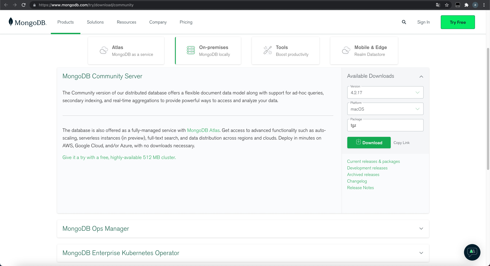

## 数据库简介

- 关系型数据库（RDBMS）
    - MySQL等
- 非关系型数据库（NoSQL not only sql）
    - MongoDB、Redis

## MongoDB概述

### 简介

- 是为了快速开发互联网web应用而设计的数据库系统
- 面向文档，就是类似json的结构，叫做Bson

#### 三个概念

- 数据库 可以在数据库中存放文档
- 集合 类似于数组，在集合中可以存放文档
- 文档 文档是数据库中的最小单位，存储和操作的内容都是文档
    - 在MongoDB中，数据库和集合都不需要手动创建，当我们创建文档时，如果文档所在的集合或者数据库不存在会自动创建数据库和集合

## MongoDB安装

### 下载

- 偶数版为稳定版，奇数版为开发版
- 对32位系统支持不佳，3.2版本之后没有对32位系统支持

官方下载网址：https://www.mongodb.com/try/download/community



下载完成之后解压到自己想要的目录（不带中文）并将其重命名为mongodb4

```bash
## 目录
(base) aldencarter@aldencarter db % pwd
/Users/aldencarter/opt/codes/environments/mongodb4
```

### 安装

在mongodb4下创建`data\db`和`log`目录

终端执行

```bash
mongod --dbpath /Users/aldencarter/opt/codes/environments/mongodb4/data/db --logpath /Users/aldencarter/opt/codes/environments/mongodb4/log/mongo.log --fork
```

- `--dbpath` 设置数据存放目录
- `--logpath` 设置日志存放目录
- `--fork` 在后台运行
- `--port` 用来指定端口号

查看 MongoDB 服务是否启动：

```bash
(base) aldencarter@aldencarter ~ % ps aux | grep -v grep | grep mongod
aldencarter      17673   0.0  0.1  6850008  36788   ??  S    11:20上午   0:00.52 mongod --dbpath /Users/aldencarter/opt/codes/environments/mongodb4/data/db --logpath /Users/aldencarter/opt/codes/environments/mongodb4/log/mongo.log --fork
```

使用`mongo`测试进入MongoDB客户端

```bash
(base) aldencarter@aldencarter ~ % mongo
MongoDB shell version v4.2.17
connecting to: mongodb://127.0.0.1:27017/?compressors=disabled&gssapiServiceName=mongodb
Implicit session: session { "id" : UUID("9d44068a-0714-4a41-ad63-9c334087a09e") }
MongoDB server version: 4.2.17
Welcome to the MongoDB shell.
For interactive help, type "help".
For more comprehensive documentation, see
	https://docs.mongodb.com/
Questions? Try the MongoDB Developer Community Forums
	https://community.mongodb.com
Server has startup warnings: 
2021-12-02T11:20:20.459+0800 I  CONTROL  [initandlisten] 
2021-12-02T11:20:20.460+0800 I  CONTROL  [initandlisten] ** WARNING: Access control is not enabled for the database.
2021-12-02T11:20:20.460+0800 I  CONTROL  [initandlisten] **          Read and write access to data and configuration is unrestricted.
2021-12-02T11:20:20.461+0800 I  CONTROL  [initandlisten] 
2021-12-02T11:20:20.462+0800 I  CONTROL  [initandlisten] ** WARNING: This server is bound to localhost.
2021-12-02T11:20:20.462+0800 I  CONTROL  [initandlisten] **          Remote systems will be unable to connect to this server. 
2021-12-02T11:20:20.463+0800 I  CONTROL  [initandlisten] **          Start the server with --bind_ip <address> to specify which IP 
2021-12-02T11:20:20.464+0800 I  CONTROL  [initandlisten] **          addresses it should serve responses from, or with --bind_ip_all to
2021-12-02T11:20:20.465+0800 I  CONTROL  [initandlisten] **          bind to all interfaces. If this behavior is desired, start the
2021-12-02T11:20:20.465+0800 I  CONTROL  [initandlisten] **          server with --bind_ip 127.0.0.1 to disable this warning.
2021-12-02T11:20:20.466+0800 I  CONTROL  [initandlisten] 
2021-12-02T11:20:20.467+0800 I  CONTROL  [initandlisten] 
2021-12-02T11:20:20.467+0800 I  CONTROL  [initandlisten] ** WARNING: soft rlimits too low. Number of files is 256, should be at least 1000
---
Enable MongoDB's free cloud-based monitoring service, which will then receive and display
metrics about your deployment (disk utilization, CPU, operation statistics, etc).

The monitoring data will be available on a MongoDB website with a unique URL accessible to you
and anyone you share the URL with. MongoDB may use this information to make product
improvements and to suggest MongoDB products and deployment options to you.

To enable free monitoring, run the following command: db.enableFreeMonitoring()
To permanently disable this reminder, run the following command: db.disableFreeMonitoring()
---

> 
```

### 结束 MongoDB

使用 mongo 命令打开终端之后，运行以下命令可以结束 MongoDB，这种方式比较安全。

```bash
> use admin;
> db.shutdownServer();
```

## 基本命令

### 数据库操作

1. show dbs或者show databases 显示当前所有的数据库

```bash
> show dbs
admin   0.000GB
config  0.000GB
local   0.000GB
```

2. use 数据库名 进入到指定的数据库中

```bash
> use test ## 没有也可以使用，上面有说明
switched to db test
```

3. db 表示当前所处的数据库

```bash
> db
test
```

4. show collections 显示集合

```bash
> show collections
```

### 文档CRUD操作

官方文档：https://docs.mongodb.com/manual/tutorial/getting-started/

1. 添加

- `db.collection.insert()` 看传入的对象，如果是{}就是单个对象，如果是[]就是多个对象：
- `db.collection.insertOne()` 插入一个文档
- `db.collection.insertMany()` 插入多个文档

```sql
db.stus.insertOne({
    name: "白骨精",
    age: 28,
    gender: "女"
});

db.stus.insertMany([{
    name: "猪八戒",
    age: 28,
    gender: "男"
}, {
    name: "孙悟空",
    age: 38,
    gender: "男"
}]);
```

插入的时候会自动生成_id属性，如果不想使用它的自动生成的_id属性，可以在文档中添加_id覆盖它生成的

2. 删除
3. 修改

`db.colllection.update(查询条件,修改的新对象)` 使用新的对象替换旧的对象，默认只会修改一个

```bash
db.stus.update({name:"张三"},{name:"李四",age:89})
```

如果需要修改指定的属性，而不是替换整个对象，可以使用修改操作符

修改操作符：

- $set 可以用来修改和增加文档中的指定的属性
- $unset 可以用来删除文档中指定的属性

```bash
db.stus.updae({name:"张三"},{$set:{name:"李四"}})
```

`db.colllection.updateMany()` 同时修改多个符合条件的文档
`db.colllection.updateOne()` 修改一个符合条件的文档

4. 查询

`db.collection.find()` 查询当前集合中的所有符合条件的文档，可以接受一个对象作为条件参数，返回的是数组

- {} 表示查询集合中的所有文档
- {字段名:值} 查询属性是指定值的文档

```bash
> db.collection.find()
{ "_id" : ObjectId("61a845dee0bbc6393726a2ce"), "name" : "张三", "age" : 18, "gender" : "男" }
```

```bash
db.collection.find({name:"张三"});
```

`db.collection.findOne()` 用来查询集合中符合条件的第一个文档，返回的是文档对象
`db.collection.find({}).count()` 查询结果的数量，还可以使用`db.collection.find({}).length()`
