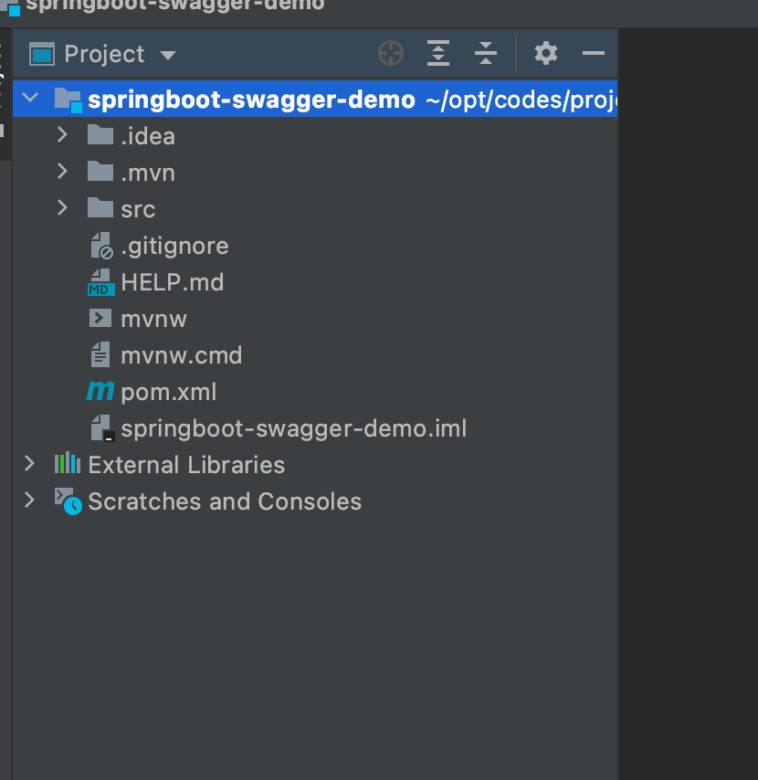
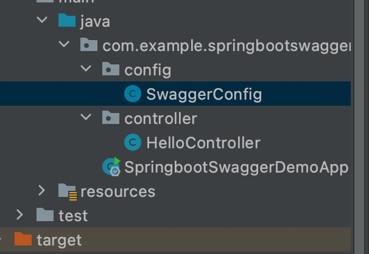
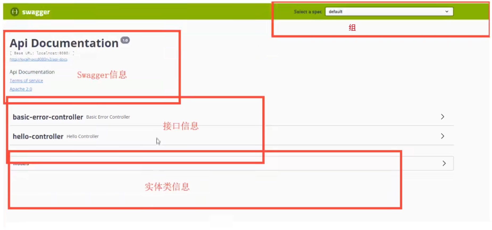
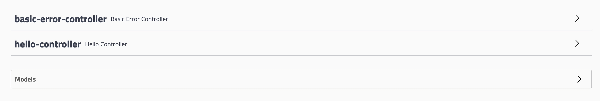
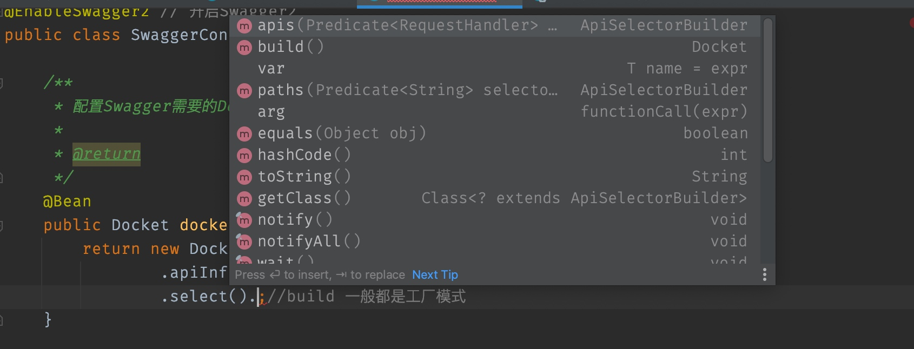
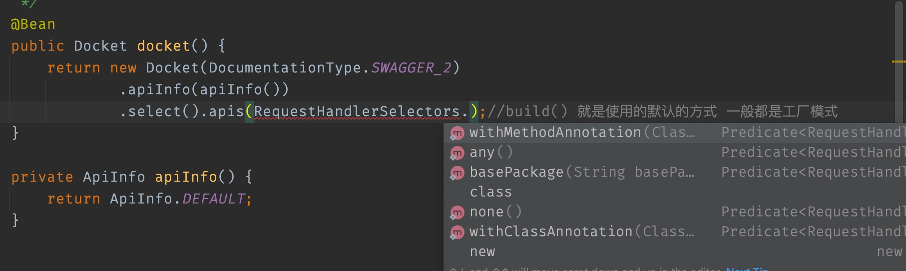
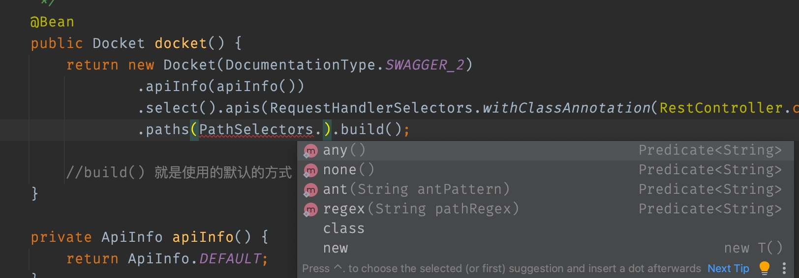
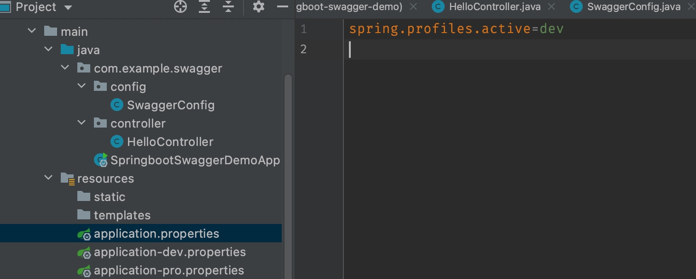
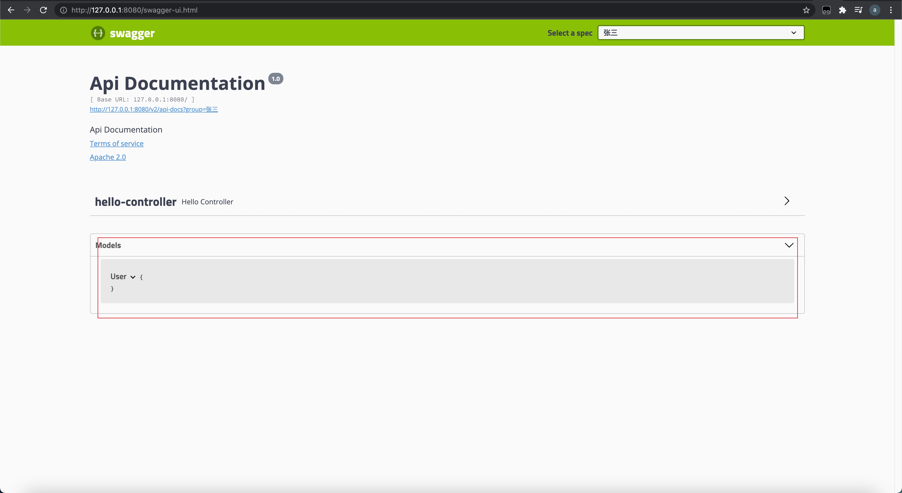
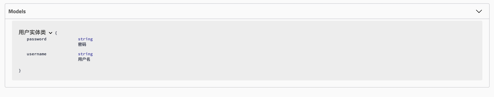

学习目标

- 了解Swagger的作用和概念
- 了解前后端分离
- 在springboot中集成Swagger

## Swagger简介

前后端分离

vue+springboot

前后端分离的时代：

- 后端：后端控制层、服务层、数据访问层（后端团队）
- 前端：前端控制层、视图层（前端团队）
    - 伪造数据，json。已经存在了，不需要后端了，前端工程依旧能够跑起来

- 前后端是如何交互的==》API
- 前后端相对独立，松耦合
- 前后端甚至可以部署在不同的服务器上

产生一个问题：

- 前后端集成连调，前后端人员无法做到及时协调、尽早解决

解决方案：

- 首先指定schema（约束），实时更新最新的API，降低集成的风险
- 早些年，老公司使用Word文档

### Swagger

- 号称世界上最流行的api框架
- restful api文档在线自动生成工具->API文档与API定义同步更新
- 直接运行，可以在线测试API接口
- 支持多种语言

官网：https://swagger.io/

## 在项目中使用Swagger（集成）

1. 创建springboot web项目



注意Swagger和springboot的版本匹配

```xml
<parent>
    <groupId>org.springframework.boot</groupId>
    <artifactId>spring-boot-starter-parent</artifactId>
    <version>2.5.6</version>
    <relativePath/> <!-- lookup parent from repository -->
</parent>
```

2. 导入依赖
    - swagger2
    - ui

```xml
<dependency>
    <groupId>io.springfox</groupId>
    <artifactId>springfox-swagger2</artifactId>
    <version>2.9.2</version>
</dependency>
<dependency>
    <groupId>io.springfox</groupId>
    <artifactId>springfox-swagger-ui</artifactId>
    <version>2.9.2</version>
</dependency>
```

3. 编写一个HelloController工程

> 一个springboot web项目之后一定会有一个默认的请求，/error

```java
@RestController
public class HelloController {

    @GetMapping("/hello") //如果是使用RequestMapper的话，就会Swagger就会显示所有的请求方法协议
    public String hello(){
        return "hello";
    }
}
```

4. 配置swagger

```java
@Configuration
@EnableSwagger2 // 开启Swagger2
public class SwaggerConfig {
}
```



5. 测试访问

http://127.0.0.1:8080/swagger-ui.html



## 配置Swagger

Swagger的bean实例Docket，现在我们通过@Configuration注解已经将Swagger设置为spring的配置类，并且通过@EnableSwagger2开启Swagger了

当我们启动springboot的时候，Swagger就会去spring容器中寻找Docket bean来配置自己，所以我们就需要把Docket这个bean注入到spring容器中

Docket对象在创建的时候需要一个属性DocumentationType

```java
public Docket(DocumentationType documentationType) {
        this.apiInfo = ApiInfo.DEFAULT;
        this.groupName = "default";
        this.enabled = true;
        this.genericsNamingStrategy = new DefaultGenericTypeNamingStrategy();
        this.applyDefaultResponseMessages = true;
        this.host = "";
        this.pathMapping = Optional.absent();
        this.apiSelector = ApiSelector.DEFAULT;
        this.enableUrlTemplating = false;
        this.vendorExtensions = Lists.newArrayList();
        this.documentationType = documentationType;
    }
```

这个属性我们可以使用SWAGGER_2

```java
public class DocumentationType extends SimplePluginMetadata {
    public static final DocumentationType SWAGGER_12 = new DocumentationType("swagger", "1.2");
    public static final DocumentationType SWAGGER_2 = new DocumentationType("swagger", "2.0");
    public static final DocumentationType SPRING_WEB = new DocumentationType("spring-web", "1.0");
    private final MediaType mediaType;
}
```

那么经过编码，配置Swagger就变成了

```java
@Configuration
@EnableSwagger2 // 开启Swagger2
public class SwaggerConfig {

    /**
     * 配置Swagger需要的Docket的Bean实例
     * @return
     */
    @Bean
    public Docket docket(){
        return new Docket(DocumentationType.SWAGGER_2);
    }
}
```

### 配置Swagger基本信息

那么，现在我们先配置一下上面说到的四个模块中最简单的Swagger信息


ApiInfo构造函数

```java
public ApiInfo(String title, String description, String version, String termsOfServiceUrl, Contact contact, String license, String licenseUrl, Collection<VendorExtension> vendorExtensions) {
    this.title = title;
    this.description = description;
    this.version = version;
    this.termsOfServiceUrl = termsOfServiceUrl;
    this.contact = contact;
    this.license = license;
    this.licenseUrl = licenseUrl;
    this.vendorExtensions = Lists.newArrayList(vendorExtensions);
}
```

ApiInfo还自带了默认的配置信息

```java
public static final ApiInfo DEFAULT = new ApiInfo("Api Documentation", "Api Documentation", "1.0", "urn:tos",
          DEFAULT_CONTACT, "Apache 2.0", "http://www.apache.org/licenses/LICENSE-2.0", new ArrayList<VendorExtension>());
```

### Swagger配置扫描接口

怎么样自定义去扫描这些Controller接口和需要的参数类型呢？



这里就需要使用到Swagger的扫描方法：Docket中的select()



其中，build()使用工厂模式创建

- api() 配置要扫描接口的方式
- paths() 配置指定的请求路径



- basePackage指定要扫描的包
- any所有包
- none都不扫描
- withClassAnnotation扫描类上的注解，含有该注解的就会被扫描
    - 比如：RequestHandlerSelectors.withClassAnnotation(RestController.class)
- withMethodAnnotation扫描方法上的注解，含有该注解的就会被扫描
    - 比如：RequestHandlerSelectors.withMethodAnnotation(ApiOperation.class)



- any所有的请求路径
- none都不包含
- regex通过正则表达式配置
- ant指定的请求路径
    - PathSelectors.ant("/zhangsan/**")

### 配置是否启用Swagger

```java
return new Docket(DocumentationType.SWAGGER_2)
                .apiInfo(apiInfo())
                .enable(false); // 设置是否默认开启Swagger
```

如果为false，则Swagger不能在浏览器中访问

我只希望Swagger在生产环境中使用，在发布的时候不使用，该怎么设置？

- 判断是否为生产环境 flag=false
- 注入enable()这个值



```java
@Bean
public Docket docket(Environment environment) {

    final Profiles profiles = Profiles.of("dev");
    final boolean b = environment.acceptsProfiles(profiles);

    return new Docket(DocumentationType.SWAGGER_2)
            .apiInfo(apiInfo())
            .enable(b) // 设置是否默认开启Swagger
            .select().apis(RequestHandlerSelectors.withClassAnnotation(RestController.class))
            //.paths(PathSelectors.any())
            .build();

    //build() 就是使用的默认的方式 一般都是工厂模式
}
```

### 配置API文档的分组

```java
/**
 * 配置Swagger需要的Docket的Bean实例
 *
 * @return
 */
@Bean
public Docket docket(Environment environment) {

    final Profiles profiles = Profiles.of("dev");
    final boolean b = environment.acceptsProfiles(profiles);

    return new Docket(DocumentationType.SWAGGER_2)
            .apiInfo(apiInfo())
            .enable(b) // 设置是否默认开启Swagger
            .groupName("张三") // 配置文档分组
            .select().apis(RequestHandlerSelectors.withClassAnnotation(RestController.class))
            //.paths(PathSelectors.any())
            .build();

    //build() 就是使用的默认的方式 一般都是工厂模式
}
```

如何配置多个分组，可以注入多个Docket到spring容器中

```java
/**
 * 配置Swagger需要的Docket的Bean实例
 *
 * @return
 */
@Bean
public Docket docket1(Environment environment) {

    final Profiles profiles = Profiles.of("dev");
    final boolean b = environment.acceptsProfiles(profiles);

    return new Docket(DocumentationType.SWAGGER_2)
            .apiInfo(apiInfo())
            .enable(b) // 设置是否默认开启Swagger
            .groupName("李四") // 配置文档分组
            .select().apis(RequestHandlerSelectors.withClassAnnotation(RestController.class))
            //.paths(PathSelectors.any())
            .build();

    //build() 就是使用的默认的方式 一般都是工厂模式
}

/**
 * 配置Swagger需要的Docket的Bean实例
 *
 * @return
 */
@Bean
public Docket docket(Environment environment) {

    final Profiles profiles = Profiles.of("dev");
    final boolean b = environment.acceptsProfiles(profiles);

    return new Docket(DocumentationType.SWAGGER_2)
            .apiInfo(apiInfo())
            .enable(b) // 设置是否默认开启Swagger
            .groupName("张三") // 配置文档分组
            .select().apis(RequestHandlerSelectors.withClassAnnotation(RestController.class))
            //.paths(PathSelectors.any())
            .build();

    //build() 就是使用的默认的方式 一般都是工厂模式
}
```

### 实体类配置

1. 创建User实体类

```java
public class User {
    private String username;
    private String password;
}
```

2. 需要给实体类绑定到Swagger中

```java
// 只要我们的接口中，返回的值存在实体类，就会自动添加到Models中
@PostMapping("/post")
public User post(){
    return new User();
}
```



3. 光是有这些东西还是不够，只有代码有没有注解说明，就不叫文档规范了，所以我们需要给我们的代码添加注释

总共有5个

给实体类添加 @ApiModel，给实体类字段添加 @ApiModelProperty，需要为字段生成get\set方法

```java
@ApiModel(value = "用户实体类")
public class User {
    @ApiModelProperty(value = "用户名")
    private String username;
    @ApiModelProperty(value = "密码")
    private String password;

    public String getUsername() {
        return username;
    }

    public void setUsername(String username) {
        this.username = username;
    }

    public String getPassword() {
        return password;
    }

    public void setPassword(String password) {
        this.password = password;
    }
}
```



给Controller添加@Api("签到模块web接口")可以说明当前Controller是做什么用的；给Controller的处理方法添加@ApiOperation("查看用户今天是否可以签到")可以说明当前方法是做什么用的；@ApiParam("用户信息")用在方法参数上，用来说明当前方法接收的参数

```java
// UserController
@RestController
@RequestMapping("/user")
@Api("用户模块web接口")
public class UserController {

    @PostMapping("/login")
    @ApiOperation("登录系统")
    public R login(@Valid @RequestBody LoginForm form) {
        return R.ok();
    }
}

// LoginForm
@Data
@ApiModel
public class LoginForm {
    @NotBlank(message = "临时授权不能为空")
    private String code;
}

// ApiParam对参数说明
@PostMapping("/post")
public User post(@ApiParam("用户信息") User user){
    return user;
}
```

## 总结

-  我们可以通过Swagger给一些比较难理解的属性或者接口，增加注释信息
-  接口文档实时更新
-  可以在线测试

注意点：在正式发布之前，关闭Swagger

