## 权限的管理

### 什么是权限管理

基本上涉及到用户参与的系统都要进行权限管理，权限管理属于系统安全的范畴

按照安全规则或者安全策略控制用户可以访问而且只能访问自己授权的资源

权限管理包含

- 身份认证
- 授权

合起来就是认证授权

对于需要访问控制的资源，用户首先经过身份认证，认证通过的用户具有该资源的访问权限方可访问

### 什么是是身份认证

身份认证，就是判断一个用户是否为合法的用户的处理过程，最常用的简单身份认证方式就是系统通过核对用户输入的用户名和口令，看其是否与系统中存储的该用户的用户名和口令是否一致，来判断用户的身份是否正确，对于采用指纹的的系统则需要指纹；对于硬件key等刷卡系统则需要刷卡

### 什么是授权

授权，即访问控制，控制谁能访问到那些资源，主题进行身份认证后需要分配权限方可访问系统资源，对于某些资源没有权限是无法访问的

## 什么是shiro

官网：https://shiro.apache.org/

> Apache Shiro™ is a powerful and easy-to-use Java security framework that performs authentication, authorization, cryptography, and session management. With Shiro’s easy-to-understand API, you can quickly and easily secure any application – from the smallest mobile applications to the largest web and enterprise applications.
> Apache Shiro 是一个功能强大且易于使用的 Java 安全框架，可执行**身份验证、授权、加密**和会话管理。借助 Shiro 易于理解的 API，您可以快速轻松地保护任何应用程序——从最小的移动应用程序到最大的 Web 和企业应用程序。


shiro 是apache旗下的一个开源框架，它将软件系统的安全认证相关的功能抽取出来，实现用户身份认证，权限授权、加密、会话管理等功能，组成一个通用的安全认证框架

### shiro的核心架构

官方的架构：https://shiro.apache.org/reference.html

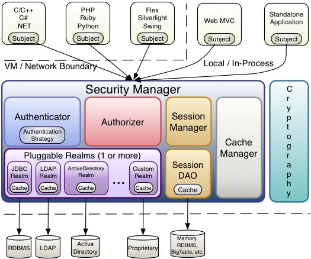

#### Subject

就相当于主体，也就是应用在不同的第三方语言的应用

#### SecurityManager

安全管理器，是shiro中最核心的API之一，要使用shiro进行权限管理的时候，首先要拿到安全管理器SecurityManager，无论是做什么，都需要先找到安全管理器SecurityManager

继承了Authenticator、Authorizer、SessionManager这三个接口

#### Authenticator

（认证）

做认证的


#### Authorizer

（授权）

做授权的


#### Realm（领域）

是整个shiro中具体去做认证和授权的适配的，比如：jdbcRealm

说白了就是获取认证和授权中的数据，并完成相应的认证的授权操作的

#### SessionManager

因为shiro需要帮我们对用户进行认证和授权，那么用户在认证通过之后，之前没有使用shiro的时候，需要把用户认证的session中保存到内存中，现在如果使用shiro，那么就可以交给shiro的session manager进行管理，即session manager是来用管理整个shiro在web应用中的会话的

#### SessionDAO

是用来对会话数据进行管理的，实现数据的持久化和内存的管理

#### CacheManager

主要是缓存认证的授权的一些数据，比如：用户在登录之后，当用户对后端发起请求的时候，此时就需要认证用户，如果在每次都对数据库进行读取操作的话，对数据库的损耗就比较高，所以如果此时使用cachemanager缓存起来，就不用每次都读取数据库了

#### Cryptography

算法生成器，在做认证的授权的时候，需要验证用户的时候，需要对密码进行加密，加密的过程中，就需要算法生成的策略，提供的算法比如有sha256、MD5等

## 认证

身份认证，就是判断一个用户是否为合法用户的处理过程，最常用的简单身份认证就是系统对用户输入的用户名和口令，看其是否与系统中存储的该用户的用户名和口令是否一致

### 认证中的关键对象

1. subject 主体

访问系统的用户，主体可以是用户、程序等，进行认证的都称为主体

2. Principal 身份信息

是主体（subject）进行身份认证的的标识，标识必须具有唯一性，如用户名、手机号、邮箱地址等，一个主体可以有多个身份，但是必须有一个主身份（Primary Principal）

3. Credential 凭证信息

是只有主体自己知道的安全信息，如密码、证书等

### 认证流程

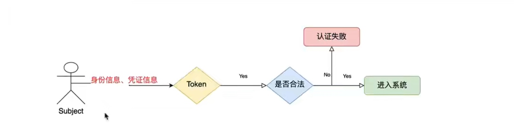

### 认证开发

前期我们学习shiro就直接使用标准的Java maven项目就可以了，之后会结合web项目进行开发

1. 创建项目并引入依赖

```xml
<dependency>
    <groupId>org.apache.shiro</groupId>
    <artifactId>shiro-core</artifactId>
    <version>1.5.3</version>
</dependency>
```

只要引入shiro核心，就会自动依赖到其他的项目

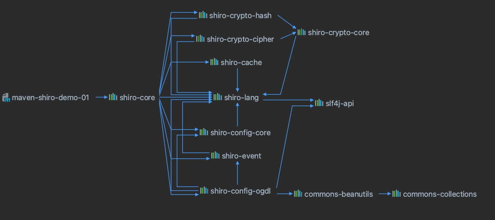

2. 创建shiro配置文件

使用后缀为ini的文件，ini文件主要是可以存储复杂数据的配置文件，shiro也会根据ini来处理配置文件

以后我们整合到springboot之后，是用不到这个配置文件的，这个文件主要是为了用来学习shiro使用的，书写我们系统中相关的权限数据，一般包括两个部分：认证和授权，认证就需要用户名和口令，授权就是为了判断某个菜单或者按钮对于当前通过认证的用户是否有这个权限

```ini
[users]
zhansan=123
lisi=456
wangwu=789
```

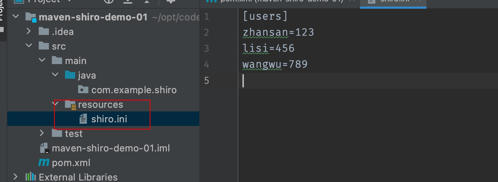

3. 开发认证代码

```java
public class TestAuthenticator {

    @Test
    public void test01() {
        // 创建security manager
        final DefaultSecurityManager defaultSecurityManager = new DefaultSecurityManager();
        defaultSecurityManager.setRealm(new IniRealm("classpath:shiro.ini"));

        // 将安装工具类中设置为默认安全管理器
        SecurityUtils.setSecurityManager(defaultSecurityManager);

        // 获取主体对象
        final Subject subject = SecurityUtils.getSubject();
        System.out.println("认证状态: "+ subject.isAuthenticated());

        // 创建token令牌
        final UsernamePasswordToken token = new UsernamePasswordToken("zhangsan", "123");
        try {
            subject.login(token);
            System.out.println("登录成功~ ");
            System.out.println("认证状态: "+ subject.isAuthenticated());
        } catch (UnknownAccountException e) {
            System.out.println("用户名错误");
            e.printStackTrace();
        } catch (IncorrectCredentialsException e) {
            System.out.println("密码错误");
            e.printStackTrace();
        }
    }
}
```

输出结果

```
认证状态: false
登录成功~ 
认证状态: true
```

### 自定义Realm

通过之前的shiro的架构可以知道，如果想要将数据库中的用户信息应用到认证中，那么就需要自己实现Realm

#### 认证源码的流程

调用subject.login函数的过程

```java
public void login(AuthenticationToken token) throws AuthenticationException {
    clearRunAsIdentitiesInternal();
    Subject subject = securityManager.login(this, token);// 调用securityManager登录

    PrincipalCollection principals;

    String host = null;

    // 登录之后获取用户的身份信息存储到principals中
    if (subject instanceof DelegatingSubject) {
        DelegatingSubject delegating = (DelegatingSubject) subject;
        //we have to do this in case there are assumed identities - we don't want to lose the 'real' principals:
        principals = delegating.principals;
        host = delegating.host;
    } else {
        principals = subject.getPrincipals();
    }

    if (principals == null || principals.isEmpty()) {
        String msg = "Principals returned from securityManager.login( token ) returned a null or " +
                "empty value.  This value must be non null and populated with one or more elements.";
        throw new IllegalStateException(msg);
    }
    this.principals = principals;
    this.authenticated = true;// 能走到这里就表示就已经登录成功了，表示认证通过了
    if (token instanceof HostAuthenticationToken) {
        host = ((HostAuthenticationToken) token).getHost();
    }
    if (host != null) {
        this.host = host;
    }
    // 存储session
    Session session = subject.getSession(false);
    if (session != null) {
        this.session = decorate(session);
    } else {
        this.session = null;
    }
}
```

调用securityManager.login的过程

```java
public Subject login(Subject subject, AuthenticationToken token) throws AuthenticationException {
    AuthenticationInfo info;
    try {
        info = authenticate(token);// 主要是调用authenticate实现登录
    } catch (AuthenticationException ae) {
        try {
            onFailedLogin(token, ae, subject);
        } catch (Exception e) {
            if (log.isInfoEnabled()) {
                log.info("onFailedLogin method threw an " +
                        "exception.  Logging and propagating original AuthenticationException.", e);
            }
        }
        throw ae; //propagate
    }

    Subject loggedIn = createSubject(token, info, subject);// 创建subject方便返回

    onSuccessfulLogin(token, info, loggedIn);// 登录成功，将当前的subject保存起来，方便做下次校验

    return loggedIn;
}
```

调用authenticate函数

```java
public final AuthenticationInfo authenticate(AuthenticationToken token) throws AuthenticationException {

    if (token == null) {
        throw new IllegalArgumentException("Method argument (authentication token) cannot be null.");
    }

    log.trace("Authentication attempt received for token [{}]", token);

    AuthenticationInfo info;
    try {
        info = doAuthenticate(token);// 做登录工作
        if (info == null) {
            String msg = "No account information found for authentication token [" + token + "] by this " +
                    "Authenticator instance.  Please check that it is configured correctly.";
            throw new AuthenticationException(msg);
        }
    } catch (Throwable t) {
        AuthenticationException ae = null;
        if (t instanceof AuthenticationException) {
            ae = (AuthenticationException) t;
        }
        if (ae == null) {
            //Exception thrown was not an expected AuthenticationException.  Therefore it is probably a little more
            //severe or unexpected.  So, wrap in an AuthenticationException, log to warn, and propagate:
            String msg = "Authentication failed for token submission [" + token + "].  Possible unexpected " +
                    "error? (Typical or expected login exceptions should extend from AuthenticationException).";
            ae = new AuthenticationException(msg, t);
            if (log.isWarnEnabled())
                log.warn(msg, t);
        }
        try {
            notifyFailure(token, ae);
        } catch (Throwable t2) {
            if (log.isWarnEnabled()) {
                String msg = "Unable to send notification for failed authentication attempt - listener error?.  " +
                        "Please check your AuthenticationListener implementation(s).  Logging sending exception " +
                        "and propagating original AuthenticationException instead...";
                log.warn(msg, t2);
            }
        }


        throw ae;
    }

    log.debug("Authentication successful for token [{}].  Returned account [{}]", token, info);

    // 通知任何一斤注册监听器，登录成功
    notifySuccess(token, info);

    return info;
}
```

doAuthenticate

```java
protected AuthenticationInfo doAuthenticate(AuthenticationToken authenticationToken) throws AuthenticationException {
    assertRealmsConfigured();// 断言是否配置realm
    Collection<Realm> realms = getRealms();
    if (realms.size() == 1) {
        return doSingleRealmAuthentication(realms.iterator().next(), authenticationToken);
    } else {
        return doMultiRealmAuthentication(realms, authenticationToken);
    }
}
```

```java
protected AuthenticationInfo doSingleRealmAuthentication(Realm realm, AuthenticationToken token) {
    if (!realm.supports(token)) {
        String msg = "Realm [" + realm + "] does not support authentication token [" +
                token + "].  Please ensure that the appropriate Realm implementation is " +
                "configured correctly or that the realm accepts AuthenticationTokens of this type.";
        throw new UnsupportedTokenException(msg);
    }
    // 这个方法是会先从缓存中获取到信息，如果获取不到，在执行认证
    AuthenticationInfo info = realm.getAuthenticationInfo(token);
    if (info == null) {
        String msg = "Realm [" + realm + "] was unable to find account data for the " +
                "submitted AuthenticationToken [" + token + "].";
        throw new UnknownAccountException(msg);
    }
    return info;
}


protected AuthenticationInfo doMultiRealmAuthentication(Collection<Realm> realms, AuthenticationToken token) {

    AuthenticationStrategy strategy = getAuthenticationStrategy();

    AuthenticationInfo aggregate = strategy.beforeAllAttempts(realms, token);

    if (log.isTraceEnabled()) {
        log.trace("Iterating through {} realms for PAM authentication", realms.size());
    }

    for (Realm realm : realms) {

        try {
            aggregate = strategy.beforeAttempt(realm, token, aggregate);
        } catch (ShortCircuitIterationException shortCircuitSignal) {
            // Break from continuing with subsequnet realms on receiving 
            // short circuit signal from strategy
            break;
        }

        if (realm.supports(token)) {

            log.trace("Attempting to authenticate token [{}] using realm [{}]", token, realm);

            AuthenticationInfo info = null;
            Throwable t = null;
            try {
                // 同single realm
                info = realm.getAuthenticationInfo(token);
            } catch (Throwable throwable) {
                t = throwable;
                if (log.isDebugEnabled()) {
                    String msg = "Realm [" + realm + "] threw an exception during a multi-realm authentication attempt:";
                    log.debug(msg, t);
                }
            }

            aggregate = strategy.afterAttempt(realm, token, info, aggregate, t);

        } else {
            log.debug("Realm [{}] does not support token {}.  Skipping realm.", realm, token);
        }
    }

    aggregate = strategy.afterAllAttempts(token, aggregate);

    return aggregate;
}
```

```java
public final AuthenticationInfo getAuthenticationInfo(AuthenticationToken token) throws AuthenticationException {
    // 匹配当前用户名是否在realm能获取得到中
    AuthenticationInfo info = getCachedAuthenticationInfo(token);
    if (info == null) {
        //otherwise not cached, perform the lookup:
        info = doGetAuthenticationInfo(token);
        log.debug("Looked up AuthenticationInfo [{}] from doGetAuthenticationInfo", info);
        if (token != null && info != null) {
            // 缓存起来
            cacheAuthenticationInfoIfPossible(token, info);
        }
    } else {
        log.debug("Using cached authentication info [{}] to perform credentials matching.", info);
    }

    if (info != null) {
        // 开始验证密码
        assertCredentialsMatch(token, info);
    } else {
        log.debug("No AuthenticationInfo found for submitted AuthenticationToken [{}].  Returning null.", token);
    }

    return info;
}
```

```java
protected AuthenticationInfo doGetAuthenticationInfo(AuthenticationToken token) throws AuthenticationException {
    UsernamePasswordToken upToken = (UsernamePasswordToken) token;
    SimpleAccount account = getUser(upToken.getUsername());// 这里就获取到我们配置的shiro.ini文件中的用户信息，存储在protected final Map<String, SimpleAccount> users;中

    if (account != null) {

        if (account.isLocked()) {
            throw new LockedAccountException("Account [" + account + "] is locked.");
        }
        if (account.isCredentialsExpired()) {
            String msg = "The credentials for account [" + account + "] are expired";
            throw new ExpiredCredentialsException(msg);
        }

    }

    return account;
}
```

也就是真正完成用户名的认证就在类`SimpleAccountRealm`中的`doGetAuthenticationInfo`方法中

然后验证密码方法在`assertCredentialsMatch`中

```java
protected void assertCredentialsMatch(AuthenticationToken token, AuthenticationInfo info) throws AuthenticationException {
    CredentialsMatcher cm = getCredentialsMatcher();
    if (cm != null) {
        if (!cm.doCredentialsMatch(token, info)) {
            //not successful - throw an exception to indicate this:
            String msg = "Submitted credentials for token [" + token + "] did not match the expected credentials.";
            throw new IncorrectCredentialsException(msg);
        }
    } else {
        throw new AuthenticationException("A CredentialsMatcher must be configured in order to verify " +
                "credentials during authentication.  If you do not wish for credentials to be examined, you " +
                "can configure an " + AllowAllCredentialsMatcher.class.getName() + " instance.");
    }
}
```

也就是最终密码的校验在`AuthenticatingRealm`的`assertCredentialsMatch`方法中

综上，我们要想自己定义认证，那么就需要做认证用户名和密码，而且密码的校验是它自己自动完成的

那么我只需要实现`SimpleAccountRealm`中的`doGetAuthenticationInfo`方法即可，而`SimpleAccountRealm`实现了`AuthorizingRealm`接口，那么我只需要也实现这个接口即可

为什么密码的校验不用我们来完成呢？因为需要做加密的操作，这些加密操作直接由shiro来完成

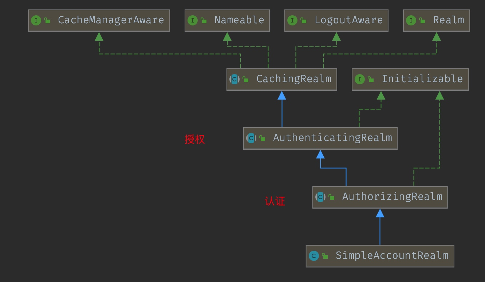

- AuthorizingRealm 中的 doGetAuthorizationInfo是用来做认证的
- AuthenticatingRealm 中的 doGetAuthenticationInfo是用来做授权的

#### 自定义realm实现认证

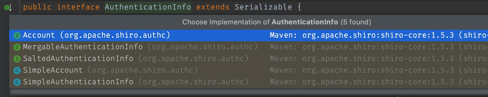

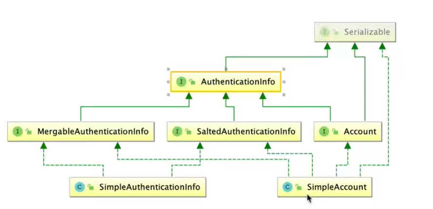

可以使用SimpleAuthenticationInfo也可以使用SimpleAccount，一般我们使用SimpleAuthenticationInfo

```java
/**
 * 自定义的Realm的实现，将认证或者授权的数据的来源转为数据库的实现
 */
public class CustomRealm extends AuthorizingRealm {
    /**
     * 做授权的
     *
     * @param principals
     * @return
     */
    @Override
    protected AuthorizationInfo doGetAuthorizationInfo(PrincipalCollection principals) {
        return null;
    }

    /**
     * 做验证的
     *
     * @param token
     * @return
     * @throws AuthenticationException
     */
    @Override
    protected AuthenticationInfo doGetAuthenticationInfo(AuthenticationToken token) throws AuthenticationException {
        // 在token中获取到用户名
        final String principal = (String) token.getPrincipal();
        System.out.println(principal);

        //TODO 根据身份信息使用jdbc或者mybatis查询数据库中的对应的用户信息
        // 现在使用模拟数据来模拟
        if ("zhangsan".equals(principal)) {
            // 参数1 数据库中正确的用户名
            // 参数2 数据库中返回的密码
            // 参数3 提供当前realm的名字，这个直接调用父类的getName就可以了
            final SimpleAuthenticationInfo authenticationInfo = new SimpleAuthenticationInfo("zhangsan", "123", this.getName());
            return authenticationInfo;
        }
        return null;
    }
}
```

创建测试类

```java
public class TestCustomRealmAuthenticator {
    @Test
    public void test01(){
        // 创建security manager
        final DefaultSecurityManager defaultSecurityManager = new DefaultSecurityManager();
        defaultSecurityManager.setRealm(new CustomRealm());// 使用自定的realm

        // 将安装工具类中设置为默认安全管理器
        SecurityUtils.setSecurityManager(defaultSecurityManager);

        // 获取主体对象
        final Subject subject = SecurityUtils.getSubject();
        System.out.println("认证状态: "+ subject.isAuthenticated());

        // 创建token令牌
        final UsernamePasswordToken token = new UsernamePasswordToken("zhangsan", "123");
        try {
            subject.login(token);

            System.out.println("登录成功~ ");
            System.out.println("认证状态: "+ subject.isAuthenticated());
        } catch (UnknownAccountException e) {
            System.out.println("用户名错误");
            e.printStackTrace();
        } catch (IncorrectCredentialsException e) {
            System.out.println("密码错误");
            e.printStackTrace();
        }
    }
}
```

执行结果

```
认证状态: false
zhangsan
登录成功~ 
认证状态: true
```

### 使用MD5和Salt

实际应用是将盐和散列后的值存在数据库中的，自定义realm从数据库取出盐和加密后的值由shiro完成密码校验

我们上面的数据库中的密码还是明文存储的，这样做是不安全的，一般在设计系统的时候会将密码加密，同时还会加一定的随机盐进行散列

#### MD5一般用来做加密和签名

（校验和）

特点：

- MD5算法不可逆
- 如果内容相同，得出的加密的结果始终是一致的，比如网站提供了一个资源，在下载过程中因为网络问题，导致内容少了，这个时候就可以使用MD5进行比较，也就是可以对文件的内容进行比较

那么用在shiro上，就可以对密码进行加密

生成结果：无论内容有多大，始终是一个16进制长度为32为长度的字符串

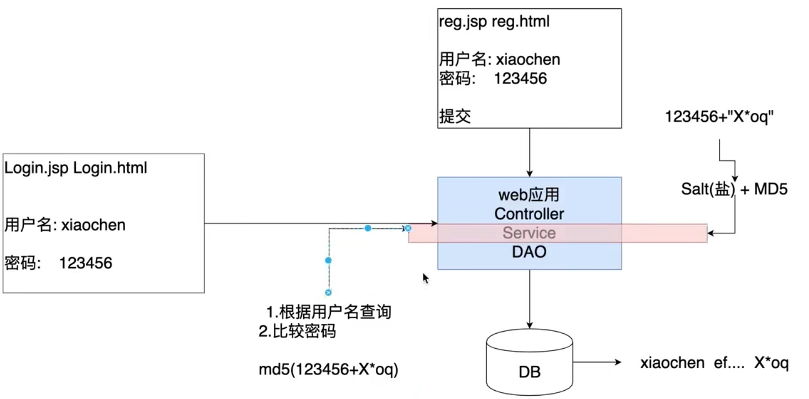

#### 实战：MD5和salt实现

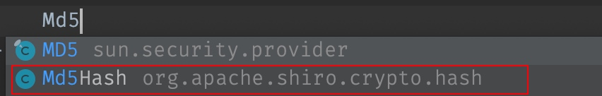

MD5在shiro中的使用测试

```java
@Test
public void test02() {
    final Md5Hash md5Hash = new Md5Hash("123");
    final String s = md5Hash.toHex();
    System.out.println(s);

    // 加盐
    final Md5Hash md5Hash1 = new Md5Hash("123", "X0&*&&38");
    final String s1 = md5Hash1.toHex();
    System.out.println(s1);
}
```

```java
/**
 * 测试md5的自定义realm
 */
@Test
public void test03() {
    // 创建security manager
    final DefaultSecurityManager defaultSecurityManager = new DefaultSecurityManager();
    final CustomMd5Realm md5Realm = new CustomMd5Realm();

    // 设置realm在匹配密码的使用使用md5的凭证匹配器
    final HashedCredentialsMatcher credentialsMatcher = new HashedCredentialsMatcher();
    credentialsMatcher.setHashAlgorithmName("md5");
    credentialsMatcher.setHashIterations(1024);
    md5Realm.setCredentialsMatcher(credentialsMatcher);

    defaultSecurityManager.setRealm(md5Realm);// 使用自定的realm

    // 将安装工具类中设置为默认安全管理器
    SecurityUtils.setSecurityManager(defaultSecurityManager);

    // 获取主体对象
    final Subject subject = SecurityUtils.getSubject();
    System.out.println("认证状态: " + subject.isAuthenticated());

    // 创建token令牌
    final String password = "123";
    final UsernamePasswordToken token = new UsernamePasswordToken("zhangsan", password);
    try {
        subject.login(token);

        System.out.println("登录成功~ ");
        System.out.println("认证状态: " + subject.isAuthenticated());
    } catch (UnknownAccountException e) {
        System.out.println("用户名错误");
        e.printStackTrace();
    } catch (IncorrectCredentialsException e) {
        System.out.println("密码错误");
        e.printStackTrace();
    }
}
```

测试调用

```java
/**
 * 自定义的Realm的实现，将认证或者授权的数据的来源转为数据库的实现
 * 加入MD5+salt+hash散列
 */
public class CustomMd5Realm extends AuthorizingRealm {
    /**
     * 做授权的
     *
     * @param principals
     * @return
     */
    @Override
    protected AuthorizationInfo doGetAuthorizationInfo(PrincipalCollection principals) {
        return null;
    }

    /**
     * 做验证的
     *
     * @param token
     * @return
     * @throws AuthenticationException
     */
    @Override
    protected AuthenticationInfo doGetAuthenticationInfo(AuthenticationToken token) throws AuthenticationException {
        // 在token中获取到用户名
        final String principal = (String) token.getPrincipal();
        System.out.println(principal);

        //TODO 根据身份信息使用jdbc或者mybatis查询数据库中的对应的用户信息
        // 现在使用模拟数据来模拟
        if ("zhangsan".equals(principal)) {
            final String password = new Md5Hash("123", "fafdsfsfudidc", 1024).toHex();

            // 参数1 数据库中正确的用户名
            // 参数2 数据库中返回的md5+salt的密码
            // 参数3 注册时的随机盐
            // 参数4 提供当前realm的名字，这个直接调用父类的getName就可以了
            final SimpleAuthenticationInfo authenticationInfo = new SimpleAuthenticationInfo("zhangsan", password, ByteSource.Util.bytes("fafdsfsfudidc"), this.getName());
            return authenticationInfo;
        }
        return null;
    }
}
```

测试结果

```
认证状态: false
zhangsan
登录成功~ 
认证状态: true
```

## 授权

### 概念

授权，就是访问控制，控制谁能访问那些资源，主体进行身份认证后需要分配权限方可访问系统的资源，对于某些资源没有权限是无法访问的

### 关键对象

授权可以简单理解为who对what(which)进行how操作

- who 主体（Subject），主体需要访问系统中的资源
- what 资源（Resource），如系统菜单、页面、按钮、类方法、紫铜商品信息等，资源包括资源类型和资源实例，比如商品信息为资源类型，类型为t01的商品为资源实例编号为001的商品信息也属于资源实例
- how 权限、许可（Premission），规定了主体对资源的操作许可，权限离开没有意义，如用户查询权限、用户添加权限、某个类方法的调用权限、编号为001用户的修改权限等，通过权限可知主体对哪些资源都有哪些操作许可

### 授权流程

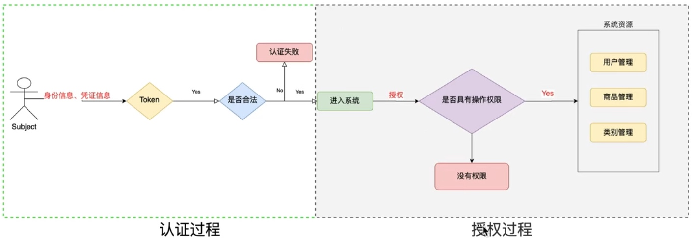

### 授权方式

1. 基于角色的访问控制

RBAC基于角色的访问控制（Role-Based Access Control）是以角色为中心进行访问控制

伪代码：

```
if(subject.hasRole("admin")){
    //操作什么资源
}
```

2. 基于资源的访问控制

RBAC基于资源的访问控制（Resource-Based Access Control）是以资源为中心进行访问控制

伪代码：

```
if(subject.isPremission("user:update:01")){
    // 对01用户进行修改
}

if(subject.isPremission("user:update:*")){
    // 对所有用户进行修改
}
```

### 权限字符串

权限字符串的规则是：资源标识符：操作：资源实例标识符，意思是对那个资源的哪个实例具有什么操作，":"是资源/操作/实例的分割符，权限字符串也可以使用*通配符

例子：

- 用户创建权限：user:create，或者user:create:*
- 用户修改实例001的权限：user:update:001
- 用户实例001的所以权限：user:*:001

### shiro中授权编程实现方式

1. 编程式：

```java
Subject subject =SecurityUtils.getSubject();
if(subject.hasRole("admin")){
    // 有权限
}else{
    // 无权限
}
```

2. 注解式

```java
@RequiresRole("admin")
public void hello(){
    // 有权限
}
```

3. 标签式

```jsp
JSP/GSP 标签：在JSP/GSP页面通过相应的标签完成
<shiro:hasRole name="admin">
<!--有权限-->
</shiro:hasRole>
注意：Thymelef中使用shiro需要额外集成
```

### 开发自定义授权

1. 授权的数据来源填充，也就是CustomMd5Realm.doGetAuthorizationInfo函数中需要提前将对应的权限或者资源给shiro

```java
/**
 * 做授权的
 *
 * @param principals
 * @return
 */
@Override
protected AuthorizationInfo doGetAuthorizationInfo(PrincipalCollection principals) {
    final String principal = (String) principals.getPrimaryPrincipal();
    System.out.println("身份信息：" + principal);

    // TODO 根据身份信息，也就是用户名，获取当前用户的角色信息，以及权限信息
    // 模拟一下数据
    final SimpleAuthorizationInfo authorizationInfo = new SimpleAuthorizationInfo();

    // 将数据库中查询的角色信息赋值给权限对象
    authorizationInfo.addRole("admin");
    authorizationInfo.addRole("user");

    authorizationInfo.addStringPermission("user:*:*");
    authorizationInfo.addStringPermission("product:update:*");

    return authorizationInfo;
}
```

2. 授权验证

```java
/**
 * 测试md5的自定义realm
 */
@Test
public void test03() {
    // 创建security manager
    final DefaultSecurityManager defaultSecurityManager = new DefaultSecurityManager();
    final CustomMd5Realm md5Realm = new CustomMd5Realm();

    // 设置realm在匹配密码的使用使用md5的凭证匹配器
    final HashedCredentialsMatcher credentialsMatcher = new HashedCredentialsMatcher();
    credentialsMatcher.setHashAlgorithmName("md5");
    credentialsMatcher.setHashIterations(1024);
    md5Realm.setCredentialsMatcher(credentialsMatcher);

    defaultSecurityManager.setRealm(md5Realm);// 使用自定的realm

    // 将安装工具类中设置为默认安全管理器
    SecurityUtils.setSecurityManager(defaultSecurityManager);

    // 获取主体对象
    final Subject subject = SecurityUtils.getSubject();
    System.out.println("认证状态: " + subject.isAuthenticated());

    // 创建token令牌
    final String password = "123";
    final UsernamePasswordToken token = new UsernamePasswordToken("zhangsan", password);
    try {
        subject.login(token);

        System.out.println("登录成功~ ");
        System.out.println("认证状态: " + subject.isAuthenticated());
    } catch (UnknownAccountException e) {
        System.out.println("用户名错误");
        e.printStackTrace();
    } catch (IncorrectCredentialsException e) {
        System.out.println("密码错误");
        e.printStackTrace();
    }

    // 认证用户进行授权
    if(subject.isAuthenticated()){
        // 1. 基于角色权限控制
        System.out.println(subject.hasRole("admin"));

        // 基于多角色的权限控制
        subject.hasAllRoles(Arrays.asList("admin","user"));

        // 是否具有其中一个角色
        final boolean[] booleans = subject.hasRoles(Arrays.asList("admin", "user", "super"));
        for (boolean aBoolean : booleans) {
            System.out.println(aBoolean);
        }

        //2. 基于权限字符串的访问控制 资源标识符:操作符:资源类型
        System.out.println(subject.isPermitted("user:*:*"));
        System.out.println(subject.isPermitted("product:*:*"));

        // 分别具有那些权限
        final boolean[] permitted = subject.isPermitted("user:*:01", "product:*:*");
        for (boolean b : permitted) {
            System.out.println(b);
        }

        // 同时具有那些权限
        System.out.println(subject.isPermittedAll("user:*:01", "product:*:*"));
    }
}
```

## 整合到springboot项目

### 整合思路

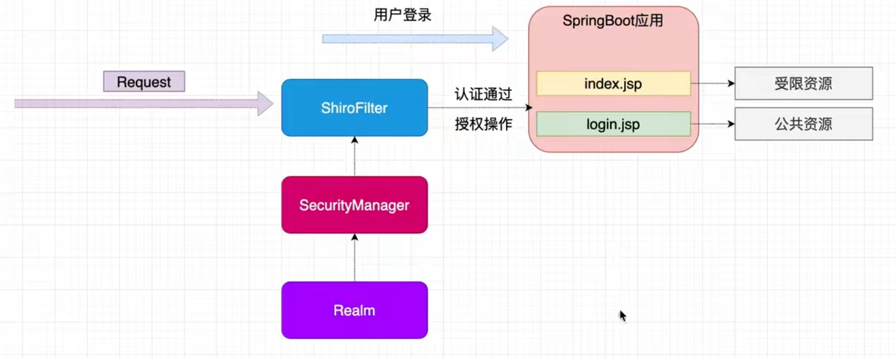

### 整合流程

1. 创建springboot项目，添加spring-web依赖

并将项目修改成支持jsp的web项目：

pom中引入jsp依赖和jstl依赖

```xml
<!--引入jsp解析依赖-->
<dependency>
    <groupId>org.apache.tomcat.embed</groupId>
    <artifactId>tomcat-embed-jasper</artifactId>
</dependency>
<dependency>
    <groupId>jstl</groupId>
    <artifactId>jstl</artifactId>
    <version>1.2</version>
</dependency>
```

在main目录创建webapp目录，并在在webapp中创建index.jsp文件，通过`!`快捷输入jsp文件模板

```jsp
<!doctype html>
<html lang="en">
<head>
    <meta charset="UTF-8">
    <meta name="viewport"
          content="width=device-width, user-scalable=no, initial-scale=1.0, maximum-scale=1.0, minimum-scale=1.0">
    <meta http-equiv="X-UA-Compatible" content="ie=edge">
    <title>Document</title>
</head>
<body>
    hello world
</body>
</html>
```

`<%@page contentType="text/html; UTF-8" pageEncoding="UTF-8" isELIgnored="false" %>`设置jsp页面防止乱码

application中配置jsp

- `spring.mvc.view.prefix=/`
- `spring.mvc.view.suffix=.jsp`

2. 引入shiro依赖

apache shiro给我们提供了springboot和shiro整合的依赖

```xml
<!--引入shiro依赖-->
<dependency>
    <groupId>org.apache.shiro</groupId>
    <artifactId>shiro-spring-boot-starter</artifactId>
    <version>1.5.3</version>
</dependency>
```

#### 配置shiro环境

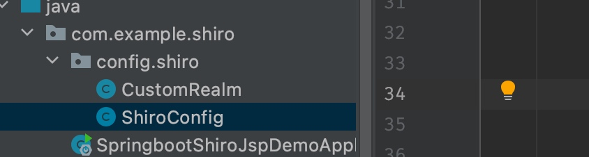

1. 创建配置类

```java
/**
 * 用来整合shiro相关的配置类
 */
@Configuration
public class ShiroConfig {
    /**
     * 创建ShiroFilter
     * 负责拦截所有的请求
     * 通过工厂类注入 ShiroFilterFactoryBean实现了FactoryBean
     */
    @Bean
    public ShiroFilterFactoryBean getShiroFilterFactoryBean(DefaultWebSecurityManager defaultWebSecurityManager) {
        final ShiroFilterFactoryBean shiroFilterFactoryBean = new ShiroFilterFactoryBean();

        // 给filter设置安全管理器
        shiroFilterFactoryBean.setSecurityManager(defaultWebSecurityManager);

        // 配置系统的受限资源
        Map<String, String> map = new HashMap<>();
        map.put("/index.jsp", "authc");// authc 请求这个资源需要认证和授权，其实它就是一个filter

        // 默认的认证界面的路径，不写就是/login.jsp
        shiroFilterFactoryBean.setLoginUrl("/login.jsp");
        shiroFilterFactoryBean.setFilterChainDefinitionMap(map);

        // 配置系统的公共资源

        return shiroFilterFactoryBean;
    }

    /**
     * 创建安全管理器 SecurityManager
     *
     * @return
     */
    @Bean
    public DefaultWebSecurityManager getDefaultWebSecurityManager(Realm realm) {
        final DefaultWebSecurityManager defaultWebSecurityManager = new DefaultWebSecurityManager();

        // 给安全管理器设置realm
        defaultWebSecurityManager.setRealm(realm);

        return defaultWebSecurityManager;
    }

    /**
     * 创建自定义的realm
     */
    @Bean
    @Primary // 因为spring容器中有多个realm，所以设置一下优先级
    public Realm getRealm() {
        final CustomRealm customRealm = new CustomRealm();
        return customRealm;
    }
}
```

#### 常见的过滤器

shiro提供了多个默认的过滤器，我们可以用这些过滤器来配置控制指定的url的权限

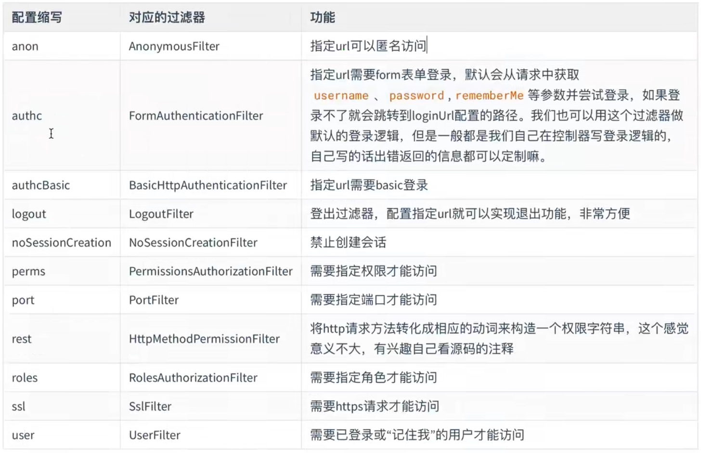

#### shiro认证和退出

自定义realm

```java
/**
 * 自定义realm
 */
public class CustomRealm extends AuthorizingRealm {
    @Override
    protected AuthorizationInfo doGetAuthorizationInfo(PrincipalCollection principals) {
        return null;
    }

    /**
     * 认证
     *
     * @param token
     * @return
     * @throws AuthenticationException
     */
    @Override
    protected AuthenticationInfo doGetAuthenticationInfo(AuthenticationToken token) throws AuthenticationException {

        final String principal = (String) token.getPrincipal();

        if ("zhangsan".equals(principal)) {
            return new SimpleAuthenticationInfo(principal, "123", this.getName());
        }
        return null;
    }
}
```

```java
@Controller
@RequestMapping("/user")
public class UserController {

    /**
     * 退出登录
     *
     * @return
     */
    @RequestMapping("/logout")
    public String logout() {
        final Subject subject = SecurityUtils.getSubject();
        subject.logout();
        return "redirect:/login.jsp";
    }

    /**
     * 用来处理身份认证
     * 这里的认证方式是要使用shiro认证方式
     *
     * @param username
     * @param password
     * @return
     */
    @RequestMapping("/login")
    public String login(String username, String password) {
        // 获取主体对象
        final Subject subject = SecurityUtils.getSubject();
        try {
            subject.login(new UsernamePasswordToken(username, password));
            return "redirect:/index.jsp";
        } catch (UnknownAccountException e) {
            e.printStackTrace();
            System.out.println("用户名错误");
        } catch (IncorrectCredentialsException e) {
            e.printStackTrace();
            System.out.println("密码错误");
        }
        return "redirect:/login.jsp";
    }
}
```

```jsp
<%@page contentType="text/html; UTF-8" pageEncoding="UTF-8" isELIgnored="false" %>
<!doctype html>
<html lang="en">
<head>
    <meta charset="UTF-8">
    <meta name="viewport"
          content="width=device-width, user-scalable=no, initial-scale=1.0, maximum-scale=1.0, minimum-scale=1.0">
    <meta http-equiv="X-UA-Compatible" content="ie=edge">
    <title>Document</title>
</head>
<body>
<h1>用户登录</h1>
<form action="${pageContext.request.contextPath}/user/login" method="post">
    用户名：<input type="text" name="username"><br>
    密码：<input type="text" name="password"><br>
    <input type="submit" value="登录">
</form>
</body>
</html>
```

index.jsp中增加退出请求

```jsp
<a href="${pageContext.request.contextPath}/user/logout">退出登录</a>
```

```java
/**
 * 用来整合shiro相关的配置类
 */
@Configuration
public class ShiroConfig {
    /**
     * 创建ShiroFilter
     * 负责拦截所有的请求
     * 通过工厂类注入 ShiroFilterFactoryBean实现了FactoryBean
     */
    @Bean
    public ShiroFilterFactoryBean getShiroFilterFactoryBean(DefaultWebSecurityManager defaultWebSecurityManager) {
        final ShiroFilterFactoryBean shiroFilterFactoryBean = new ShiroFilterFactoryBean();

        // 给filter设置安全管理器
        shiroFilterFactoryBean.setSecurityManager(defaultWebSecurityManager);

        // 配置系统的受限资源
        // 配置系统的公共资源
        Map<String, String> map = new HashMap<>();
        //map.put("/index.jsp", "authc");// authc 请求这个资源需要认证和授权，其实它就是一个filter
        map.put("/user/login","anon");// 设置为公共资源
        map.put("/**","authc");// 表示所有的资源都需要认证和授权

        // 默认的认证界面的路径，不写就是/login.jsp
        shiroFilterFactoryBean.setLoginUrl("/login.jsp");
        shiroFilterFactoryBean.setFilterChainDefinitionMap(map);

        return shiroFilterFactoryBean;
    }

    /**
     * 创建安全管理器 SecurityManager
     *
     * @return
     */
    @Bean
    public DefaultWebSecurityManager getDefaultWebSecurityManager(Realm realm) {
        final DefaultWebSecurityManager defaultWebSecurityManager = new DefaultWebSecurityManager();

        // 给安全管理器设置realm
        defaultWebSecurityManager.setRealm(realm);

        return defaultWebSecurityManager;
    }

    /**
     * 创建自定义的realm
     */
    @Bean
    @Primary // 因为spring容器中有多个realm，所以设置一下优先级
    public Realm getRealm() {
        final CustomRealm customRealm = new CustomRealm();
        return customRealm;
    }
}
```

### shiro连接数据库+完成基于MD5+salt的注册功能

1. 创建register.jsp页面

```jsp
<%@page contentType="text/html; UTF-8" pageEncoding="UTF-8" isELIgnored="false" %>
<!doctype html>
<html lang="en">
<head>
    <meta charset="UTF-8">
    <meta name="viewport"
          content="width=device-width, user-scalable=no, initial-scale=1.0, maximum-scale=1.0, minimum-scale=1.0">
    <meta http-equiv="X-UA-Compatible" content="ie=edge">
    <title>Document</title>
</head>
<body>
<h1>用户注册</h1>
<form action="${pageContext.request.contextPath}/user/register" method="post">
    用户名：<input type="text" name="username"><br>
    密码：<input type="text" name="password"><br>
    <input type="submit" value="立即注册">
</form>
</body>
</html>
```

2. 添加mybatis、mysql和druid依赖

```xml
<!--mysql-->
<dependency>
    <groupId>mysql</groupId>
    <artifactId>mysql-connector-java</artifactId>
    <version>5.1.47</version>
</dependency>

<!--mybatis-->
<dependency>
    <groupId>org.mybatis.spring.boot</groupId>
    <artifactId>mybatis-spring-boot-starter</artifactId>
    <version>2.2.0</version>
</dependency>
<!--druid-->
<dependency>
    <groupId>com.alibaba</groupId>
    <artifactId>druid</artifactId>
    <version>1.1.21</version>
</dependency>
```

3. 配置数据库和mybatis信息

```
spring.datasource.type=com.alibaba.druid.pool.DruidDataSource
spring.datasource.driver-class-name=com.mysql.jdbc.Driver
spring.datasource.url=jdbc:mysql://localhost:3306/springboot-shiro-jsp-demo?characterEncoding=UTF-8
spring.datasource.username=root
spring.datasource.password=123456

mybatis.type-aliases-package=com.example.shiro.db.pojo
mybatis.mapper-locations=classpath:mapper/*.xml
```

4. 创建对应的数据库和表

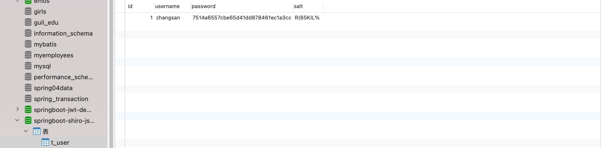

5. 通过idea的插件mybatis-plus逆向生成mybatis三件套：TUserDao接口、TUser实体类、TUserDao.xml映射文件

6. 创建UserService和UserServiceImpl

给出UserServiceImpl

```java
@Service
@Transactional
public class UserServiceImpl implements UserService {
    @Autowired
    private TUserDao userDao;

    @Override
    public void register(TUser user) {
        // 明文密码进行md5+salt+hash散列
        String salt = SaltUtil.getSalt(8);
        final Md5Hash md5Hash = new Md5Hash(user.getPassword(), salt, 1024);

        // 将随机盐保存到数据库
        user.setSalt(salt);
        user.setPassword(md5Hash.toHex());

        // 保存到数据库
        userDao.insert(user);
    }
}
```

7. SaltUtil随机盐工具类

```java
public class SaltUtil {
    /**
     * 生成salt的静态方法
     *
     * @param n
     * @return
     */
    public static String getSalt(int n) {
        final char[] chars = "ABCDEFGHIJKLMNOPQRSTUVWXYZabcdefghijklmnopqrstuvwxyz0123456789!@#$%^&*()_".toCharArray();
        StringBuffer sb = new StringBuffer();
        for (int i = 0; i < n; i++) {
            final char c = chars[new Random().nextInt(chars.length)];
            sb.append(c);
        }
        return sb.toString();
    }
}
```

8. UserController中创建注册方法

```java
/**
 * 用户注册
 *
 * @param user
 * @return
 */
@RequestMapping("/register")
public String register(TUser user) {
    try {
        userService.register(user);
        return "redirect:/login.jsp";
    } catch (Exception exception) {
        exception.printStackTrace();
        return "redirect:/register.jsp";
    }
}
```

### shiro连接数据库+完成基于MD5+salt的认证功能


1. 如果想要在CustomRealm中实现认证功能，就需要通过用户名查询到对应的用户信息

所以我们显创建查询操作

TUserDao.xml

```xml
<select id="findByUsername" parameterType="String" resultType="com.example.shiro.db.pojo.TUser">
select * from t_user where username=#{username}
</select>
```

TUserDao.java

```java
TUser findByUsername(String username);
```

UserServiceImpl.java

```java
@Override
public TUser findByUsername(String username) {
    return userDao.findByUsername(username);
}
```

2. 编写认证方法，通过上面的查询操作来获取到数据库中对应的用户信息

```java
/**
 * 认证
 *
 * @param token
 * @return
 * @throws AuthenticationException
 */
@Override
protected AuthenticationInfo doGetAuthenticationInfo(AuthenticationToken token) throws AuthenticationException {

    final String principal = (String) token.getPrincipal();

    // 在spring工厂中获取到指定的对象 userService
    UserService userService = (UserService) ApplicationContextUtil.getBean("userService");

    final TUser user = userService.findByUsername(principal);

    if (!ObjectUtils.isEmpty(user)) {
        return new SimpleAuthenticationInfo(user.getUsername(), user.getPassword(), ByteSource.Util.bytes(user.getSalt()), this.getName());
    }
    return null;
}
```

其中，ApplicationContextUtil是为了能获取到注入到spring容器中的UserService

```java
/**
 * spring application context 工具类，主要为了让不再spring容器中的对象能获取到已经注入到spring 容器中的中的bean对象
 * <p>
 * 应该是使用了spring扩展点，当ApplicaitonContext创建之后回调到这里给我们
 */
@Component
public class ApplicationContextUtil implements ApplicationContextAware {

    private static ApplicationContext context;

    @Override
    public void setApplicationContext(ApplicationContext applicationContext) throws BeansException {
        this.context = applicationContext;
    }

    /**
     * 根据bean的名字获取到spring容器中对应的bean
     *
     * @param beanName
     * @return
     */
    public static Object getBean(String beanName) {
        return context.getBean(beanName);
    }
}
```

3. 配置ShiroConfig的getRealm，让它能使用md5加密进行密码匹配

```java
/**
 * 创建自定义的realm
 */
@Bean
@Primary // 因为spring容器中有多个realm，所以设置一下优先级
public Realm getRealm() {
    final CustomRealm customRealm = new CustomRealm();

    // 修改默认的凭证（密码）匹配器
    final HashedCredentialsMatcher credentialsMatcher = new HashedCredentialsMatcher();
    // 设置加密为md5算法
    credentialsMatcher.setHashAlgorithmName("MD5");
    credentialsMatcher.setHashIterations(1024);
    customRealm.setCredentialsMatcher(credentialsMatcher);
    return customRealm;
}
```

### shiro授权的基本使用

#### 在jsp页面中做权限控制

做菜单等带有权限色彩的展示与否

之前有说过如果想要自定义授权，就需要在CustomRealm中实现doGetAuthorizationInfo

```java
@Override
protected AuthorizationInfo doGetAuthorizationInfo(PrincipalCollection principals) {

    // 先模拟假数据
    // 获取身份信息
    final String principal = (String) principals.getPrimaryPrincipal();

    // 根据主身份信息获取它的角色信息 和 权限信息
    if ("zhangsan".equals(principal)) {
        final SimpleAuthorizationInfo simpleAuthorizationInfo = new SimpleAuthorizationInfo();
        simpleAuthorizationInfo.addRole("admin");

        return simpleAuthorizationInfo;
    }

    return null;
}
```

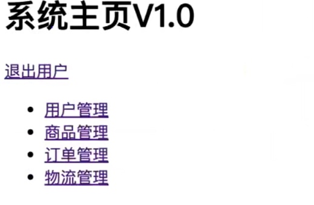

假设admin可以看到所有的菜单，user只能看到用户管理，那么就要在页面上进行权限控制，使用shiro为我们提供的标签

需要先引入标签

```jsp
<%@taglib prefix="shiro" uri="http://shiro.apache.org/tags" %>
```

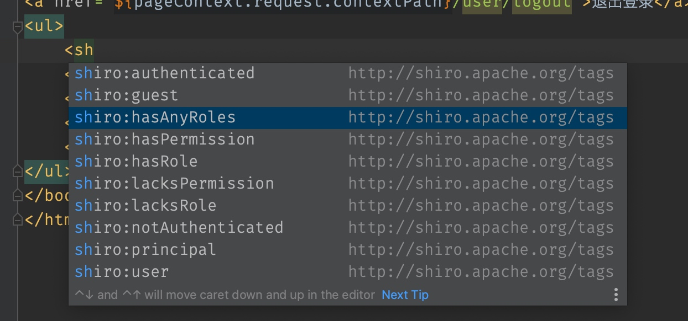

```jsp
<ul>
    <li><a href="">用户管理</a></li>
    <%--只有admin权限的用户才能看见--%>
    <shiro:hasRole name="admin">
        <li><a href="">商品管理</a></li>
        <li><a href="">订单管理</a></li>
        <li><a href="">物流管理</a></li>
    </shiro:hasRole>
</ul>
```

对多个角色可见，使用逗号隔开

```jsp
<shiro:hasAnyRoles name="user,admin">
    <li><a href="">用户管理</a></li>
</shiro:hasAnyRoles>
```

通过资源（权限）限定

```java
simpleAuthorizationInfo.addStringPermission("user:update:*");
```

比如，用户管理中有增删改查权限

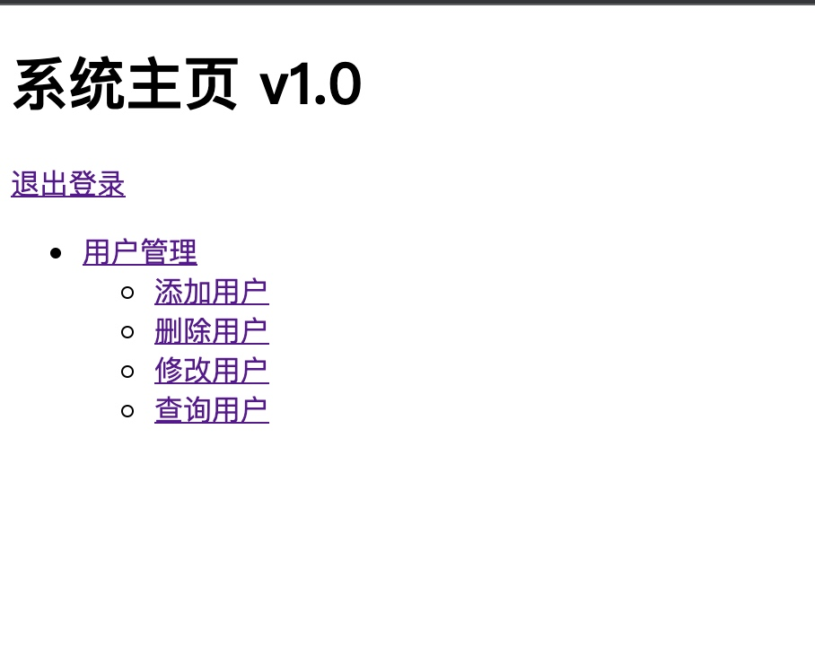

这个时候就可以使用`shiro:hasPermission`来限定

```jsp
<ul>
    <shiro:hasPermission name="user:add:*">
        <li><a href="">添加用户</a></li>
    </shiro:hasPermission>
    <shiro:hasPermission name="user:delete:*">
        <li><a href="">删除用户</a></li>
    </shiro:hasPermission>
    <shiro:hasPermission name="user:update:*">
        <li><a href="">修改用户</a></li>
    </shiro:hasPermission>
    <shiro:hasPermission name="user:select:*">
        <li><a href="">查询用户</a></li>
    </shiro:hasPermission>
</ul>
```

这个时候只能做更新操作

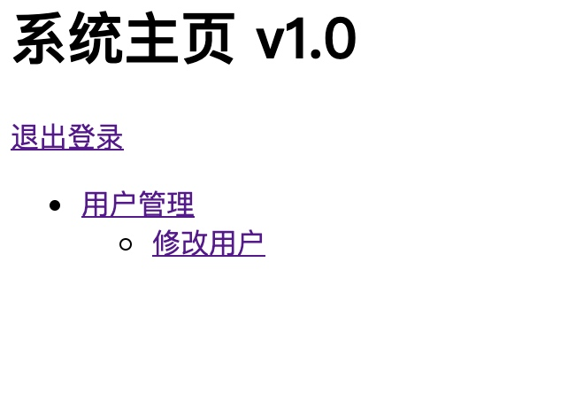

#### 在代码中完成权限控制

比如对订单管理的控制，OrderController，主要是为了防止用户通过浏览器输入连接地址访问

```java
@Controller
@RequestMapping("/order")
public class OrderController {

    @RequestMapping("/save")
    public String save() {
        // 业务处理

        // .......

        // 代码的方式进行授权
        // 获取主体对象
        final Subject subject = SecurityUtils.getSubject();

        // 基于角色的
        if (subject.hasRole("admin")) {
            System.out.println("保存订单");
        } else {
            System.out.println("无权访问");
        }

        // 基于权限（资源）
        if (subject.isPermitted("order:save:*")) {
            System.out.println("保存订单");
        } else {
            System.out.println("无权访问");
        }

        return "redirect:/index.jsp";
    }
}
```

#### 使用注解方式做授权

```java
@RequestMapping("/save")
//@RequiresRoles("admin") // 必须要有admin权限
@RequiresRoles(value = {"admin", "user"}) // 必须要同时有admin和user权限
@RequiresPermissions(value = "order:save:*")// 用来判断权限字符串
public String save() {
    // 业务处理

    // .......

    // 代码的方式进行授权
    // 获取主体对象
    final Subject subject = SecurityUtils.getSubject();

    // 基于角色的
    if (subject.hasRole("admin")) {
        System.out.println("保存订单");
    } else {
        System.out.println("无权访问");
    }

    // 基于权限（资源）
    if (subject.isPermitted("order:save:*")) {
        System.out.println("保存订单");
    } else {
        System.out.println("无权访问");
    }

    return "redirect:/index.jsp";
}
```

### shiro授权的数据从数据库获取-角色

1. 创建数据库角色表和权限表

需要注意的是，有几种模式

- 用户和角色绑定，角色和权限（资源URL）绑定
- 只有用户角色
- 用户和权限字符串

一般在做web应用的时候，都是用户作为某个角色，角色持有某些权限

用户 * ------- * 角色 * ------- * 权限

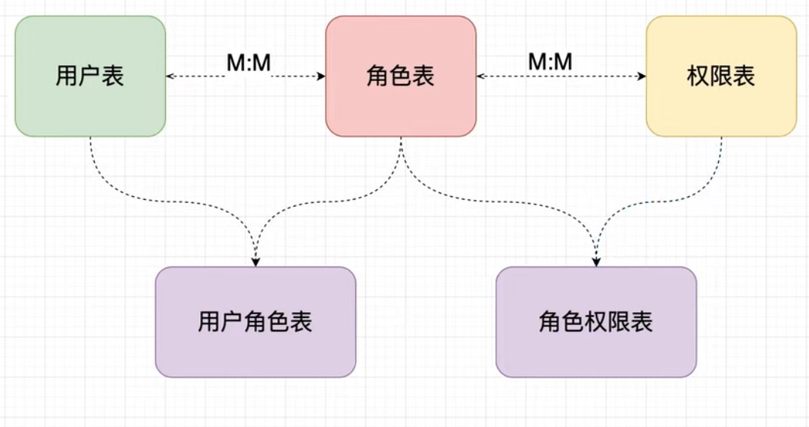

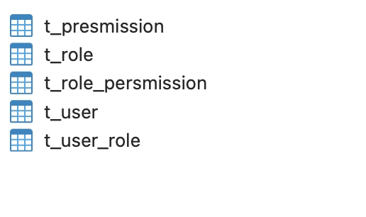

对应的sql创建语句

```sql
/*
 Navicat Premium Data Transfer

 Source Server         : 127.0.0.1.3306
 Source Server Type    : MySQL
 Source Server Version : 50729
 Source Host           : localhost:3306
 Source Schema         : springboot-shiro-jsp-demo

 Target Server Type    : MySQL
 Target Server Version : 50729
 File Encoding         : 65001

 Date: 06/12/2021 20:18:25
*/

SET NAMES utf8mb4;
SET FOREIGN_KEY_CHECKS = 0;

-- ----------------------------
-- Table structure for t_presmission
-- ----------------------------
DROP TABLE IF EXISTS `t_presmission`;
CREATE TABLE `t_presmission` (
  `id` int(11) unsigned NOT NULL AUTO_INCREMENT,
  `name` varchar(80) DEFAULT NULL,
  `url` varchar(255) DEFAULT NULL,
  PRIMARY KEY (`id`)
) ENGINE=InnoDB DEFAULT CHARSET=utf8;

-- ----------------------------
-- Table structure for t_role
-- ----------------------------
DROP TABLE IF EXISTS `t_role`;
CREATE TABLE `t_role` (
  `id` int(11) unsigned NOT NULL AUTO_INCREMENT,
  `name` varchar(60) DEFAULT NULL,
  PRIMARY KEY (`id`)
) ENGINE=InnoDB DEFAULT CHARSET=utf8;

-- ----------------------------
-- Table structure for t_role_persmission
-- ----------------------------
DROP TABLE IF EXISTS `t_role_persmission`;
CREATE TABLE `t_role_persmission` (
  `id` int(11) unsigned NOT NULL AUTO_INCREMENT,
  `role_id` int(11) DEFAULT NULL,
  `presmission_id` int(11) DEFAULT NULL,
  PRIMARY KEY (`id`)
) ENGINE=InnoDB DEFAULT CHARSET=utf8;

-- ----------------------------
-- Table structure for t_user
-- ----------------------------
DROP TABLE IF EXISTS `t_user`;
CREATE TABLE `t_user` (
  `id` int(6) unsigned NOT NULL AUTO_INCREMENT,
  `username` varchar(40) DEFAULT NULL,
  `password` varchar(40) DEFAULT NULL,
  `salt` varchar(255) DEFAULT NULL,
  PRIMARY KEY (`id`)
) ENGINE=InnoDB AUTO_INCREMENT=2 DEFAULT CHARSET=utf8;

-- ----------------------------
-- Table structure for t_user_role
-- ----------------------------
DROP TABLE IF EXISTS `t_user_role`;
CREATE TABLE `t_user_role` (
  `id` int(11) unsigned NOT NULL AUTO_INCREMENT,
  `user_id` int(11) DEFAULT NULL,
  `role_id` int(11) DEFAULT NULL,
  PRIMARY KEY (`id`)
) ENGINE=InnoDB DEFAULT CHARSET=utf8;

SET FOREIGN_KEY_CHECKS = 1;
```

添加对应用户和角色的对应

zhangsan - admin
lisi - user
lisi - productor

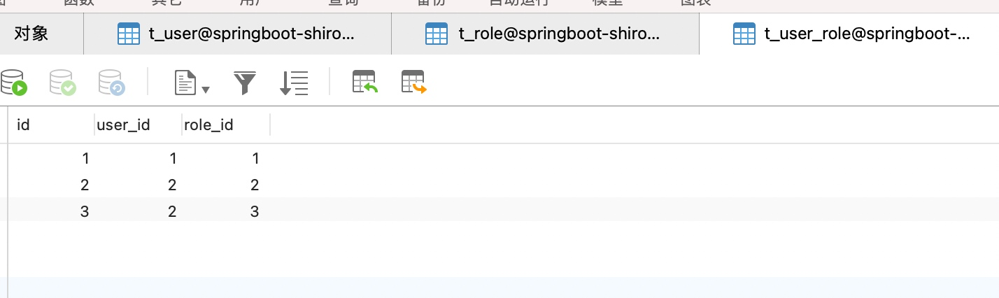


TRoleDao中查询用户权限

```java
// 查询所有角色
List<TRole> findRoleByUsername(String username);
```

```xml
<select id="findRoleByUsername" parameterType="String" resultType="com.example.shiro.db.pojo.TRole">
SELECT
  t_role.id,
  t_role.`name`
FROM
  t_user
    LEFT JOIN t_user_role ON t_user.id = t_user_role.user_id
    LEFT JOIN t_role ON t_user_role.role_id = t_role.id
WHERE
  t_user.username = #{username};
</select>
```

CustomRealm中编写授权代码

```java
@Override
protected AuthorizationInfo doGetAuthorizationInfo(PrincipalCollection principals) {

    // 先模拟假数据
    // 获取身份信息
    final String principal = (String) principals.getPrimaryPrincipal();

    // 根据主身份信息获取它的角色信息 和 权限信息
    final RoleService roleService = (RoleService)ApplicationContextUtil.getBean("roleService");

    final List<TRole> roles = roleService.findRoleByUsername(principal);

    // 授权角色信息
    if(!CollectionUtils.isEmpty(roles)){
        final SimpleAuthorizationInfo simpleAuthorizationInfo = new SimpleAuthorizationInfo();
        simpleAuthorizationInfo.addRoles(roles.stream().map(TRole::getName).collect(Collectors.toList()));
        return simpleAuthorizationInfo;
    }

    return null;
}
```

### shiro授权的数据从数据库获取-权限

#### 数据库设计

存在两个账号：zhangsan 和 lisi，其中zhangsan是admin角色，这个角色拥有所有的权限：用户管理、商品管理、订单管理、物流管理下的增删改查操作；lisi是user角色，这个角色拥有用户管理下的查询操作

```sql
/*
 Navicat Premium Data Transfer

 Source Server         : 127.0.0.1.3306
 Source Server Type    : MySQL
 Source Server Version : 50729
 Source Host           : localhost:3306
 Source Schema         : springboot-shiro-jsp-demo

 Target Server Type    : MySQL
 Target Server Version : 50729
 File Encoding         : 65001

 Date: 06/12/2021 21:55:44
*/

SET NAMES utf8mb4;
SET FOREIGN_KEY_CHECKS = 0;

-- ----------------------------
-- Table structure for t_permission
-- ----------------------------
DROP TABLE IF EXISTS `t_permission`;
CREATE TABLE `t_permission` (
  `id` int(11) unsigned NOT NULL AUTO_INCREMENT,
  `name` varchar(80) DEFAULT NULL,
  `url` varchar(255) DEFAULT NULL,
  PRIMARY KEY (`id`)
) ENGINE=InnoDB AUTO_INCREMENT=5 DEFAULT CHARSET=utf8;

-- ----------------------------
-- Records of t_permission
-- ----------------------------
BEGIN;
INSERT INTO `t_permission` VALUES (1, 'user:add', '');
INSERT INTO `t_permission` VALUES (2, 'user:update', NULL);
INSERT INTO `t_permission` VALUES (3, 'user:delete', NULL);
INSERT INTO `t_permission` VALUES (4, 'user:select', NULL);
COMMIT;

-- ----------------------------
-- Table structure for t_role
-- ----------------------------
DROP TABLE IF EXISTS `t_role`;
CREATE TABLE `t_role` (
  `id` int(11) unsigned NOT NULL AUTO_INCREMENT,
  `name` varchar(60) DEFAULT NULL,
  PRIMARY KEY (`id`)
) ENGINE=InnoDB AUTO_INCREMENT=4 DEFAULT CHARSET=utf8;

-- ----------------------------
-- Records of t_role
-- ----------------------------
BEGIN;
INSERT INTO `t_role` VALUES (1, 'admin');
INSERT INTO `t_role` VALUES (2, 'user');
COMMIT;

-- ----------------------------
-- Table structure for t_role_permission
-- ----------------------------
DROP TABLE IF EXISTS `t_role_permission`;
CREATE TABLE `t_role_permission` (
  `id` int(11) unsigned NOT NULL AUTO_INCREMENT,
  `role_id` int(11) DEFAULT NULL,
  `premission_id` int(11) DEFAULT NULL,
  PRIMARY KEY (`id`)
) ENGINE=InnoDB AUTO_INCREMENT=6 DEFAULT CHARSET=utf8;

-- ----------------------------
-- Records of t_role_permission
-- ----------------------------
BEGIN;
INSERT INTO `t_role_permission` VALUES (1, 1, 1);
INSERT INTO `t_role_permission` VALUES (2, 1, 2);
INSERT INTO `t_role_permission` VALUES (3, 1, 3);
INSERT INTO `t_role_permission` VALUES (4, 1, 4);
INSERT INTO `t_role_permission` VALUES (5, 2, 4);
COMMIT;

-- ----------------------------
-- Table structure for t_user
-- ----------------------------
DROP TABLE IF EXISTS `t_user`;
CREATE TABLE `t_user` (
  `id` int(6) unsigned NOT NULL AUTO_INCREMENT,
  `username` varchar(40) DEFAULT NULL,
  `password` varchar(40) DEFAULT NULL,
  `salt` varchar(255) DEFAULT NULL,
  PRIMARY KEY (`id`)
) ENGINE=InnoDB AUTO_INCREMENT=3 DEFAULT CHARSET=utf8;

-- ----------------------------
-- Records of t_user
-- ----------------------------
BEGIN;
INSERT INTO `t_user` VALUES (1, 'zhangsan', '7514a6557cbe65d41dd878461ec1a3cc', 'R(65KlL%');
INSERT INTO `t_user` VALUES (2, 'lisi', '4587b203cc7e841bb73eba4b4b90ab11', 'DS3RWLuo');
COMMIT;

-- ----------------------------
-- Table structure for t_user_role
-- ----------------------------
DROP TABLE IF EXISTS `t_user_role`;
CREATE TABLE `t_user_role` (
  `id` int(11) unsigned NOT NULL AUTO_INCREMENT,
  `user_id` int(11) DEFAULT NULL,
  `role_id` int(11) DEFAULT NULL,
  PRIMARY KEY (`id`)
) ENGINE=InnoDB AUTO_INCREMENT=4 DEFAULT CHARSET=utf8;

-- ----------------------------
-- Records of t_user_role
-- ----------------------------
BEGIN;
INSERT INTO `t_user_role` VALUES (1, 1, 1);
INSERT INTO `t_user_role` VALUES (2, 2, 2);
COMMIT;

SET FOREIGN_KEY_CHECKS = 1;
```

获取数据库的Permission的信息

```xml
<select id="findPermissionByRoleId" parameterType="integer" resultType="com.example.shiro.db.pojo.TPermission">
SELECT
  t_permission.id,
  t_permission.`name`
FROM
  t_role
    LEFT JOIN t_role_permission ON t_role.id = t_role_permission.role_id
    LEFT JOIN t_permission ON t_role_permission.premission_id = t_permission.id
WHERE
  t_role.id = #{roleId};
</select>
```

PermissionServiceImpl

```java
@Service("permissionService")
@Transactional
public class PermissionServiceImpl implements PermissionService {

    @Autowired
    private TPermissionDao permissionDao;

    @Override
    public List<TPermission> findPermissionByRoleId(Integer roleId) {
        return permissionDao.findPermissionByRoleId(roleId);
    }
}
```

CustomRealm.doGetAuthorizationInfo函数

```java
@Override
protected AuthorizationInfo doGetAuthorizationInfo(PrincipalCollection principals) {

    // 先模拟假数据
    // 获取身份信息
    final String principal = (String) principals.getPrimaryPrincipal();

    // 根据主身份信息获取它的角色信息 和 权限信息
    final RoleService roleService = (RoleService)ApplicationContextUtil.getBean("roleService");
    final PermissionService permissionService = (PermissionService)ApplicationContextUtil.getBean("permissionService");

    final List<TRole> roles = roleService.findRoleByUsername(principal);

    // 授权角色信息
    if(!CollectionUtils.isEmpty(roles)){
        final SimpleAuthorizationInfo simpleAuthorizationInfo = new SimpleAuthorizationInfo();

        roles.forEach(one->{
            simpleAuthorizationInfo.addRole(one.getName());
            // 根据主身份信息获取它的角色信息 和 权限信息
            final List<TPermission> permissions = permissionService.findPermissionByRoleId(one.getId());

            // 授权角色信息
            if(!CollectionUtils.isEmpty(permissions)){
                simpleAuthorizationInfo.addStringPermissions(permissions.stream().map(TPermission::getName).collect(Collectors.toList()));
            }
        });

        return simpleAuthorizationInfo;
    }

    return null;
}
```

index.jsp

```jsp
<%@page contentType="text/html; UTF-8" pageEncoding="UTF-8" isELIgnored="false" %>
<%@taglib prefix="shiro" uri="http://shiro.apache.org/tags" %>
<!doctype html>
<html lang="en">
<head>
    <meta charset="UTF-8">
    <meta name="viewport"
          content="width=device-width, user-scalable=no, initial-scale=1.0, maximum-scale=1.0, minimum-scale=1.0">
    <meta http-equiv="X-UA-Compatible" content="ie=edge">
    <title>Document</title>
</head>
<body>
<h1>系统主页 v1.0</h1>
<a href="${pageContext.request.contextPath}/user/logout">退出登录</a>
<ul>
    <shiro:hasAnyRoles name="user,admin">
        <li><a href="">用户管理</a>
            <ul>
                <shiro:hasPermission name="user:add:*">
                    <li><a href="">添加用户</a></li>
                </shiro:hasPermission>
                <shiro:hasPermission name="user:delete:*">
                    <li><a href="">删除用户</a></li>
                </shiro:hasPermission>
                <shiro:hasPermission name="user:update:*">
                    <li><a href="">修改用户</a></li>
                </shiro:hasPermission>
                <shiro:hasPermission name="user:select:*">
                    <li><a href="">查询用户</a></li>
                </shiro:hasPermission>
            </ul>
        </li>
    </shiro:hasAnyRoles>
    <%--只有admin权限的用户才能看见--%>
    <shiro:hasRole name="admin">
        <li><a href="">商品管理</a></li>
        <li><a href="">订单管理</a></li>
        <li><a href="">物流管理</a></li>
    </shiro:hasRole>
</ul>
</body>
</html>
```

zhangsan登录

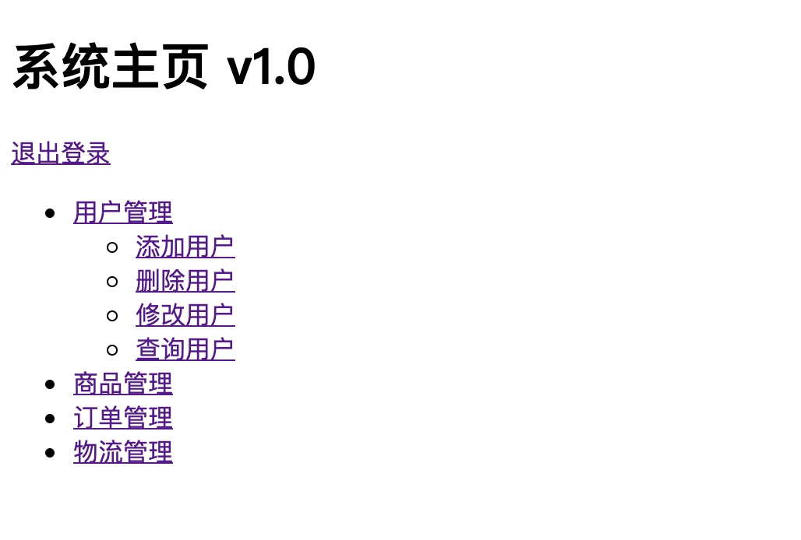

lisi登录


### shiro缓存

如果我们要在页面中做权限判断的话，就需要在页面中编写大量的权限判断

并且还需要在Controller中添加相应的注解

这里就会发现一些问题，每一次在刷新页面的时候，都需要重新访问数据库，但是一个用户权限数据剧本上是不怎么会变化的，所以对于权限来说，不能每做一次校验就做一次数据库查询，对于数据库的压力不小

为了避免这些问题，我们一般都会给权限加缓存。也就是一旦这个用户已经授权过一次了，就权限数据缓存起来

可以通过使用CacheManager实现缓存

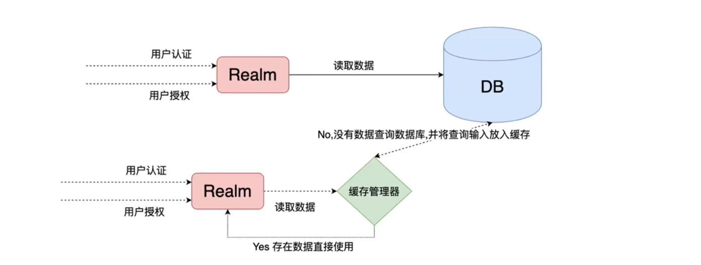

#### 使用EhCache实现缓存

1. 引入依赖

```xml
<dependency>
    <groupId>org.apache.shiro</groupId>
    <artifactId>shiro-ehcache</artifactId>
    <version>1.5.3</version>
</dependency>
```

2. 开启缓存

既然是realm查询的数据，当然是要在realm中开启

```java
/**
 * 创建自定义的realm
 */
@Bean
@Primary // 因为spring容器中有多个realm，所以设置一下优先级
public Realm getRealm() {
    final CustomRealm customRealm = new CustomRealm();

    // 修改默认的凭证（密码）匹配器
    final HashedCredentialsMatcher credentialsMatcher = new HashedCredentialsMatcher();
    // 设置加密为md5算法
    credentialsMatcher.setHashAlgorithmName("MD5");
    credentialsMatcher.setHashIterations(1024);
    customRealm.setCredentialsMatcher(credentialsMatcher);

    // 开启缓存管理器
    customRealm.setCachingEnabled(true);// 开启全局缓存
    customRealm.setAuthenticationCachingEnabled(true);// 认证缓存
    customRealm.setAuthenticationCacheName("authenticationCache");// 设置缓存名字方便查找
    customRealm.setAuthorizationCachingEnabled(true);// 授权缓存
    customRealm.setAuthorizationCacheName("authorizationCache");

    customRealm.setCacheManager(new EhCacheManager());
    return customRealm;
}
```

开启了缓存之后，只有在第一次查询的时候会去查询数据库，之后就不会了


#### shiro使用redis缓存

1. 引入依赖

```xml
<dependency>
    <groupId>org.springframework.boot</groupId>
    <artifactId>spring-boot-starter-data-redis</artifactId>
</dependency>
```

2. 配置redis连接

```
spring.redis.host=localhost
spring.redis.port=6379
spring.redis.database=0
spring.redis.password=123456
```

3. 启动redis

```bash
(base) aldencarter@aldencarter ~ % ps -ef |grep redis
  501 28122     1   0 四04下午 ??         8:16.15 redis-server 127.0.0.1:6379 
  501 54220 24999   0 11:01下午 ttys002    0:00.00 grep redis
```

4. 开发RedisCacheManager

我们可以参照EhCacheManager实现方式，EhCacheManager实现了CacheManager

```java
/**
 * 自定义redisCacheManager
 */
public class RedisCacheManager implements CacheManager {
    /**
     *
     * @param cacheName 认证或者是授权缓存的统一名称，也就是我们刚才配置的
     *          customRealm.setAuthenticationCacheName("authenticationCache");// 设置缓存名字方便查找
     *          customRealm.setAuthorizationCacheName("authorizationCache");
     *          这两个
     * @param <K>
     * @param <V>
     * @return
     * @throws CacheException
     */
    @Override
    public <K, V> Cache<K, V> getCache(String cacheName) throws CacheException {
        return new RedisCache<K, V>();
    }
}
```

5. 开发RedisCache实现

```java
/**
 * 自定义redis缓存的实现
 */
public class RedisCache<K, V> implements Cache<K, V> {

    @Override
    public V get(K k) throws CacheException {
        return (V) getRedisTemplate().opsForValue().get(k.toString());
    }

    @Override
    public V put(K k, V v) throws CacheException {

        getRedisTemplate().opsForValue().set(k.toString(), v);

        return null;
    }

    @Override
    public V remove(K k) throws CacheException {
        return null;
    }

    @Override
    public void clear() throws CacheException {

    }

    @Override
    public int size() {
        return 0;
    }

    @Override
    public Set<K> keys() {
        return null;
    }

    @Override
    public Collection<V> values() {
        return null;
    }

    private RedisTemplate getRedisTemplate() {
        final RedisTemplate redisTemplate = (RedisTemplate) ApplicationContextUtil.getBean("redisTemplate");
        redisTemplate.setKeySerializer(new StringRedisSerializer());
        return redisTemplate;
    }
}
```

6. 将缓存管理器改成自己的

```java
customRealm.setCacheManager(new RedisCacheManager());
```

7. 第一次查询会查询数据库，再次查询会从redis中获取


8. 如果想要分开做认证和授权的缓存，我们可以将cacheName传输给redisCache

那么在set的时候，就可以通过hash的方式存储到Redis中

```java
@Override
public V put(K k, V v) throws CacheException {

    //getRedisTemplate().opsForValue().set(k.toString(), v);

    getRedisTemplate().opsForHash().put(this.cacheName, k.toString(), v);

    return null;
}
```

那么在get的时候

```java
@Override
public V get(K k) throws CacheException {
    //return (V) getRedisTemplate().opsForValue().get(k.toString());
    return (V) getRedisTemplate().opsForHash().get(this.cacheName, k.toString());
}
```

修改getRedisTemplate，添加hash key序列化方式

```java
private RedisTemplate getRedisTemplate() {
    final RedisTemplate redisTemplate = (RedisTemplate) ApplicationContextUtil.getBean("redisTemplate");
    redisTemplate.setKeySerializer(new StringRedisSerializer());
    redisTemplate.setHashKeySerializer(new StringRedisSerializer());
    return redisTemplate;
}
```

9. 记住要将实体类，也就是要存入Redis的数据实现Serializable

```java
public class TPermission implements Serializable {
    private Integer id;

    private String name;

    private String url;

    private static final long serialVersionUID = 1L;
}
```

10. 出现错误

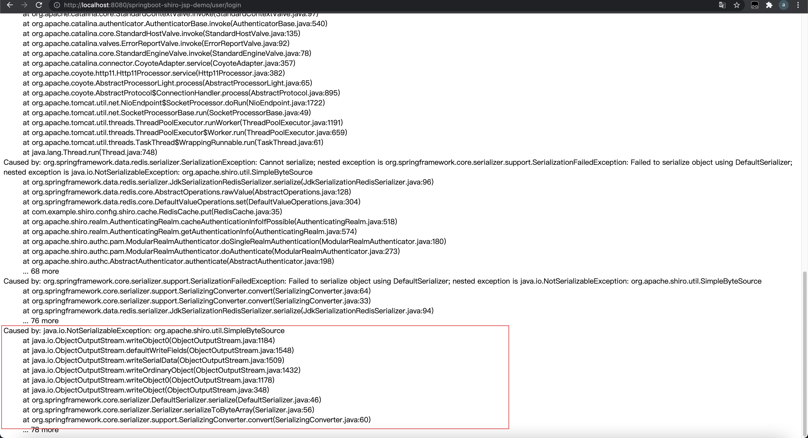

是因为，我们配置的salt不能实现序列化

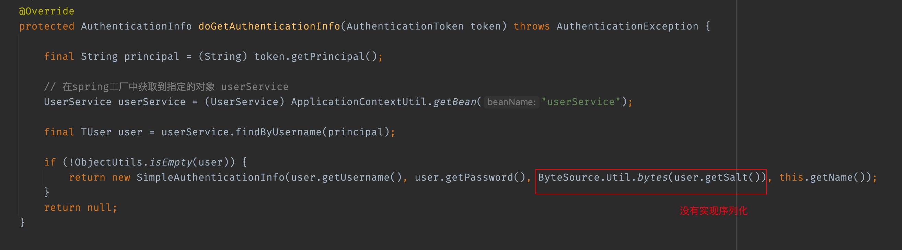

我们自定义salt实现，并实现序列化接口

```java
/**
 * 自定义salt实现，实现序列化接口
 */
public class MySimpleByteSource extends SimpleByteSource implements Serializable {

    public MySimpleByteSource(String string) {
        super(string);
    }
}
```

CustomRealm.doGetAuthenticationInfo改成我们自己的类

```java
return new SimpleAuthenticationInfo(user.getUsername(), user.getPassword(), new MySimpleByteSource(user.getSalt()), this.getName());
```

之后就可以了，但是如果是直接使用string类型的存储到redis中的话，就会报错，如果使用Hash类型的存储就不会，之后在看看

原因：因为SimpleByteSource没有无参的构造，但是redis反序列化又需要用到无参构造，所以我们实现ByteSource

直接复制SimpleByteSource中的代码来修改，然后在增加一个无参构造

```java
/**
 * 自定义salt实现，实现序列化接口
 */
public class MySimpleByteSource implements ByteSource, Serializable {

    private byte[] bytes;
    private String cachedHex;
    private String cachedBase64;

    public MySimpleByteSource() {
    }

    public MySimpleByteSource(byte[] bytes) {
        this.bytes = bytes;
    }

    public MySimpleByteSource(char[] chars) {
        this.bytes = CodecSupport.toBytes(chars);
    }

    public MySimpleByteSource(String string) {
        this.bytes = CodecSupport.toBytes(string);
    }

    public MySimpleByteSource(ByteSource source) {
        this.bytes = source.getBytes();
    }

    public MySimpleByteSource(File file) {
        this.bytes = (new MySimpleByteSource.BytesHelper()).getBytes(file);
    }

    public MySimpleByteSource(InputStream stream) {
        this.bytes = (new MySimpleByteSource.BytesHelper()).getBytes(stream);
    }

    public static boolean isCompatible(Object o) {
        return o instanceof byte[] || o instanceof char[] || o instanceof String || o instanceof ByteSource || o instanceof File || o instanceof InputStream;
    }

    public byte[] getBytes() {
        return this.bytes;
    }

    public boolean isEmpty() {
        return this.bytes == null || this.bytes.length == 0;
    }

    public String toHex() {
        if (this.cachedHex == null) {
            this.cachedHex = Hex.encodeToString(this.getBytes());
        }

        return this.cachedHex;
    }

    public String toBase64() {
        if (this.cachedBase64 == null) {
            this.cachedBase64 = Base64.encodeToString(this.getBytes());
        }

        return this.cachedBase64;
    }

    public String toString() {
        return this.toBase64();
    }

    public int hashCode() {
        return this.bytes != null && this.bytes.length != 0 ? Arrays.hashCode(this.bytes) : 0;
    }

    public boolean equals(Object o) {
        if (o == this) {
            return true;
        } else if (o instanceof ByteSource) {
            ByteSource bs = (ByteSource) o;
            return Arrays.equals(this.getBytes(), bs.getBytes());
        } else {
            return false;
        }
    }

    private static final class BytesHelper extends CodecSupport {
        private BytesHelper() {
        }

        public byte[] getBytes(File file) {
            return this.toBytes(file);
        }

        public byte[] getBytes(InputStream stream) {
            return this.toBytes(stream);
        }
    }
}
```

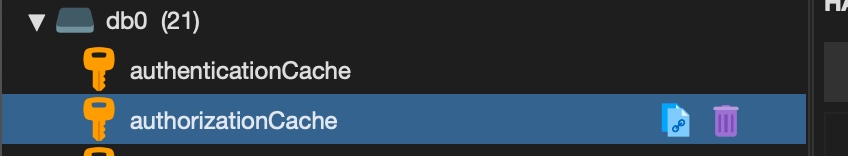

完善整个RedisCache

```java
/**
 * 自定义redis缓存的实现
 */
public class RedisCache<K, V> implements Cache<K, V> {

    private String cacheName;

    public RedisCache() {
    }

    public RedisCache(String cacheName) {
        this.cacheName = cacheName;
    }

    @Override
    public V get(K k) throws CacheException {
        //return (V) getRedisTemplate().opsForValue().get(k.toString());
        return (V) getRedisTemplate().opsForHash().get(this.cacheName, k.toString());
    }

    @Override
    public V put(K k, V v) throws CacheException {

        //getRedisTemplate().opsForValue().set(k.toString(), v);

        getRedisTemplate().opsForHash().put(this.cacheName, k.toString(), v);

        return null;
    }

    @Override
    public V remove(K k) throws CacheException {
        return (V) getRedisTemplate().opsForHash().delete(this.cacheName,k.toString());
    }

    @Override
    public void clear() throws CacheException {
        getRedisTemplate().delete(this.cacheName);
    }

    @Override
    public int size() {
        return getRedisTemplate().opsForHash().size(this.cacheName).intValue();
    }

    @Override
    public Set<K> keys() {
        return getRedisTemplate().opsForHash().keys(this.cacheName);
    }

    @Override
    public Collection<V> values() {
        return getRedisTemplate().opsForHash().values(this.cacheName);
    }

    private RedisTemplate getRedisTemplate() {
        final RedisTemplate redisTemplate = (RedisTemplate) ApplicationContextUtil.getBean("redisTemplate");
        redisTemplate.setKeySerializer(new StringRedisSerializer());
        redisTemplate.setHashKeySerializer(new StringRedisSerializer());
        return redisTemplate;
    }
}
```

### shiro加入验证码

1. 改造登录页面

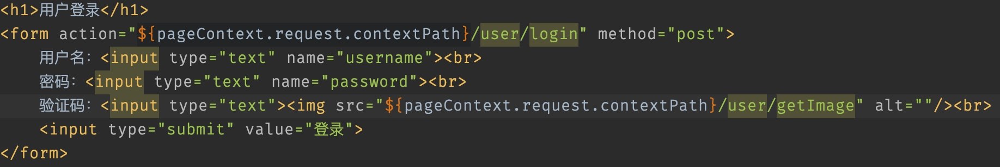

2. 获取验证码

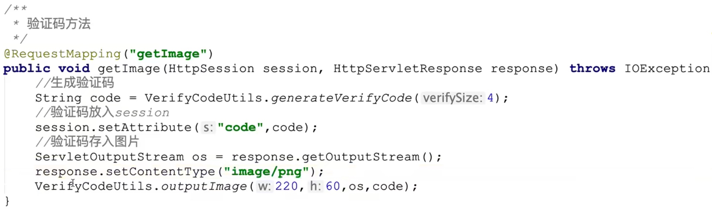

3. shiro放行获取验证码的请求

4. 然后就是在登录方法中验证通过验证码再进行登录操作

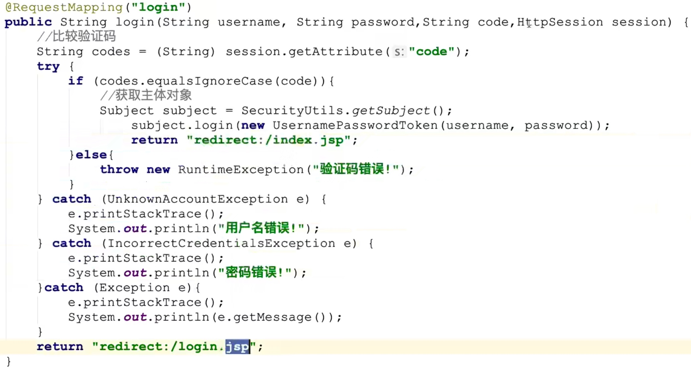

- 从session中获取到验证码
- 比较验证码
- 进行后续的操作

5. 结果

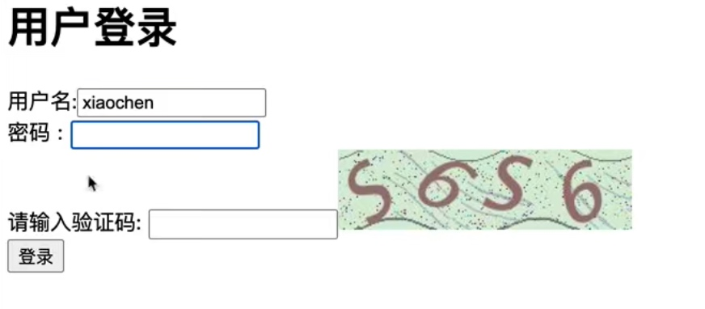

### shiro标签展示用户身份信息

```jsp
<%--用户的主身份信息--%>
<h1><shiro:principal/></h1>
<shiro:authenticated>
    认证之后展示的内容，比如未登录显示登录按钮，已经登录显示用户名
</shiro:authenticated>
<shiro:notAuthenticated>
    没有认证展示的内容
</shiro:notAuthenticated>
```

## shiro在springboot+thymeleaf中的应用

先创建springboot+thymeleaf项目

拿上面的jsp改成thymeleaf

### 常见的权限控制标签的使用

1. 引入依赖

```xml
<dependency>
    <groupId>com.github.theborakompanioni</groupId>
    <artifactId>thymeleaf-extras-shiro</artifactId>
    <version>2.0.0</version>
</dependency>
```

2. 引入命名空间

```html
<html lang="en" xmlns:th="http://www.thymeleaf.org" xmlns:shiro="http://www.pollix.at/thymeleaf/shiro">
```

3. 常见的权限控制标签

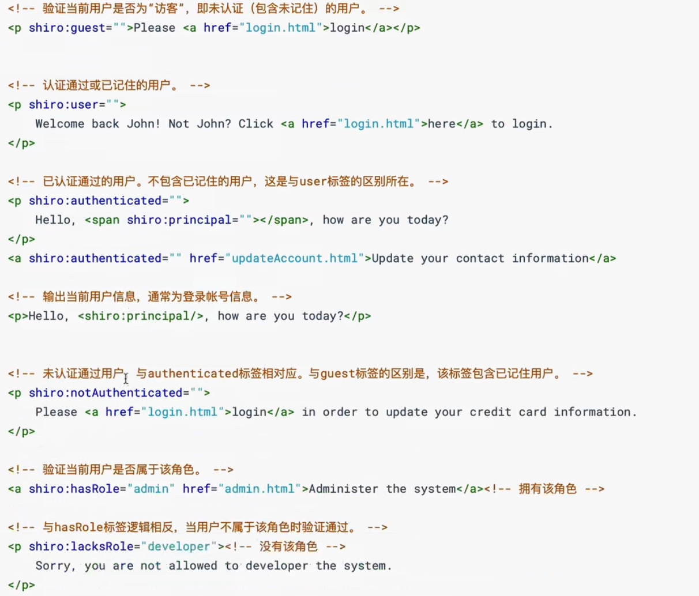

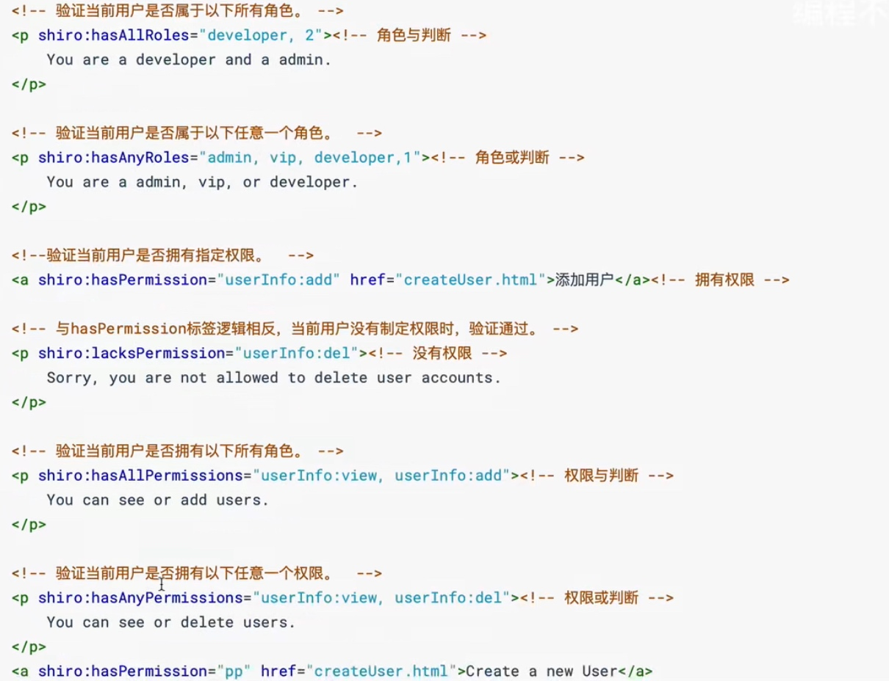

4. 加入shiro的方言配置

```java
@Configuration
public class ShiroConfig {

    @Bean(name = "shiroDialect")
    public ShiroDialect shiroDialect(){
        return new ShiroDialect();
    }
    
    //  .......其他配置
}
```


