## 概述

### 什么是restful

**rest**：表现层状态化(representational state transfer)，如果一个架构符合rest原则，就称它为restful架构风格

> rest 表现层状态转化 resource representational state transfer，全部名称应该是：资源的表现层状态转化

**资源**：所谓资源，就是网络上的一个实体，或者说是网络上的一个具体信息

**表现层**：我们把资源具体呈现出来的形式，叫做它的表现层(representation)

**状态化（state transfer）**：如果客户端想要操作服务器，必须通过某种手段，让服务器端发生“状态转化”，而这种转化是建立在表现层之上的，所以就是表现层状态转化

> rest原则就是指一个URL代表一个唯一的资源，并且通过http协议里面的四个动词：GET、POST、PUT、DELETE对应四种服务器段的基本操作：GET用来请求资源，POST用来添加资源(也可以用于更新资源)，PUT用来更新资源，DELETE用来删除资源

```markdown
原则：
	1. 使用rest的URL替换传统的URL
	传统的URL：http://localhost:9000/项目名称/user/findOne?id=12
						http://localhost:9000/项目名称/emp/findOne?id=18  ## 能唯一定位到资源
	restful:
						http://localhost:9000/项目名称/user/findOne/12
	2. 四中动词对应服务端的四种操作：GET、PUST、PUT、DELETE
```

#### springboot编写rest请求

创建springboot项目，引入web依赖，创建`user.UserController`

```java
/**
 * rest的设计原则：
 * 1. 使用restful替换传统URL 参数作为URL整体
 * 2. 使用四种http动词（请求方式）对应服务端四种操作
 *
 * @GETMapping
 * @POSTMapping
 * @PUTMapping
 * @DELETEMapping 3. 通常服务返回的数据都json格式 或者 xml格式
 */
// RestController 返回服务类型是json或者 xml格式的字符串
@RestController
@RequestMapping("user")
public class UserController {

    @GetMapping("findOne/{id}/{name}")
    public String findOne(@PathVariable("id") String id, @PathVariable("name") String name) {
        System.out.println("id : " + id);
        System.out.println("name : " + name);
        return "{'state':'success','code':200}";
    }

    @PostMapping("save")
    public String save(UserForm user) {
        return "{'state':'success','code':200}";
    }

    @PutMapping("update")
    public String update(UserForm user) {
        return "{'state':'success','code':200}";
    }

    @DeleteMapping("delete/{id}")
    public String delete(@PathVariable("id") String id) {
        return "{'state':'success','code':200}";
    }
}
// userForm
public class UserForm {
    private String id;
    private String username;

    public String getId() {
        return id;
    }

    public void setId(String id) {
        this.id = id;
    }

    public String getUsername() {
        return username;
    }

    public void setUsername(String username) {
        this.username = username;
    }

    @Override
    public String toString() {
        return "UserForm{" +
                "id='" + id + '\'' +
                ", username='" + username + '\'' +
                '}';
    }
}
```

### 什么是全文检索

**全文检索是计算机程序通过扫描文章中的每一个词，对每一个词建立一个索引，指明该词在文章中出现的次数和位置。当用户查询时根据建立的索引查找，类似于通过字典的检索表查字的过程**

全文检索(Full-Text Retrieval((检索)))以文本作为检索对象，找出含有指定词汇的文本。**全面、准确和快速是衡量全文检索系统的关键指标**

关于全文检索，我们要知道：

- 只处理文本
- 不处理语义
- 搜索英文不区分大小写
- 结果列表有相关度排序

### 什么是elasticSearch

> elasticSearch之前全文检索的的典型代表是Lucene，但是Lucene的API过于复杂，所以elasticSearch公司把Lucene进行了简化，就成了elasticSearch

elasticSearch简称ES，是基于Apache Lucene构建的开源搜索引擎，是当期流行的企业级搜索引擎，lucene本身就可以被人为迄今为止性能最好的一款开源搜索引擎工具包，但是Lucene的API相对复杂，需要深厚的搜索理论，很难集成到实际的应用中去。但是ES是采用Java语言编写，提供了简单易用的restful api，开发者可以使用其简单的restful api，开发相关的搜索功能，从而避免Lucene的复杂性

### es的诞生

> 官网：https://www.elastic.co/cn/
>
> es 发展时间线
>
> - **ES** 是基于 **Lucene** 开发的一款搜索应用
>
>   - [Lucene](https://lucene.apache.org/) 是一个基于 **Java** 语言的搜索引擎库，它由 **Doug Cutting** 创建于 1995 年，并于 2005 年成为 **Apache** 顶级开源项目
>
>   - 虽然 Lucene 非常强大，但它只是一个 Java 类库，而且学习成本较高
>
> - ES 的创始人 **Shay Banon** 在 2004 年，基于 Lucene 创建了一个开源项目 **Compass**，后于 2010 年改名为 ElasticSearch
>
> - 从一开始 ES 就具备了可扩展，分布式，易用的特点，ES 的这些优点使得它很快的流行开来
>
> - Shay Banon 在 2010 年发布了 ES 的第一个版本，并于 2012 年成立了公司，来提供更加完善的产品和服务
>
> - 2015年，公司名称从 Elasticsearch 改为 [Elastic](https://www.elastic.co/cn)。因为此时，公司的杀手级产品已经不仅仅是 Elasticsearch 了，而且还包括了 [Logstash](https://www.elastic.co/cn/logstash) 和 [Kibana](https://www.elastic.co/cn/kibana)，这三款应用统称为 **ELK**
>
> Elastic Stack栈
>
> - Beats + ElasticSearch + Kibana +Logstash
>
> Spring Statck栈
>
> - springboot + springcloud + spring data + spring data flow
>
> Full Stack 栈
>
> - 前端技术栈
> - 后端技术栈

### es的应用场景

es主要轻量级json作为数据存储格式，这点与MongoDB有点类似，但它在于读写性能上优于MongoDB，同时也支持地理位置查询，还方便地理位置和文本混合查询。以及在统计、日志类存储和分析、可视化这方面是引领者

## 安装es

### 准备环境

#### 安装jdk

1. 下载

官方网址：https://www.oracle.com/java/technologies/downloads/#java8

选择`x64 Compressed Archive`

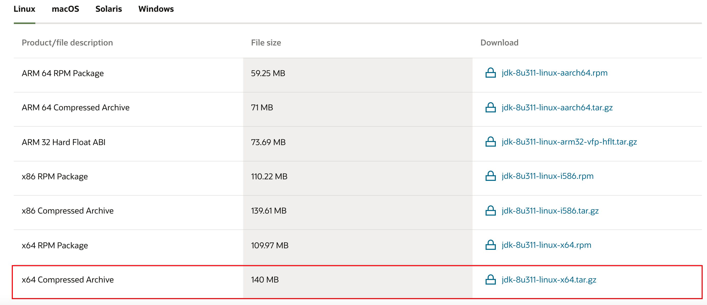

2. 上传到linux

```bash
scp /Users/aldencarter/Downloads/jdk-8u311-linux-x64.tar.gz root@172.16.187.15:/opt/soft/
```

3. 创建安装目录

```bash
mkdir /opt/dev-env/java/
```

4. 解压刚才的压缩包

```bash
tar -zxvf jdk-8u311-linux-x64.tar.gz -C /opt/dev-env/java/
```

5. 设置环境变量

打开`.bash_profile`文件

```bash
vim ~/.bash_profile
```

添加环境变量

```bash
export JAVA_HOME=/opt/dev-env/java/jdk1.8.0_311
export JRE_HOME=${JAVA_HOME}/jre
export CLASSPATH=.:${JAVA_HOME}/lib:${JRE_HOME}/lib
export PATH=${JAVA_HOME}/bin:$PATH
```

6. 刷新环境变量配置

```bash
soruce ~/.bash_profile
```

7. 检查安装情况

```bash
[root@localhost java]## java -version
java version "1.8.0_311"
Java(TM) SE Runtime Environment (build 1.8.0_311-b11)
Java HotSpot(TM) 64-Bit Server VM (build 25.311-b11, mixed mode)
```

#### 安装elasticSearch

1. 下载

可以选择不同的版本：https://www.elastic.co/downloads/past-releases#elasticsearch

2. 将压缩包上传到linux

在本地终端使用scp将压缩包上传到linux

```bash
scp /Users/aldencarter/Downloads/elasticsearch-6.8.20.tar.gz root@172.16.187.15:/opt/soft/
```

在/opt/下创建dev-env/elasticsearch，将压缩包解压到该目录下

```bash
mdkir elasticsearch
tar -zxvf elasticsearch-6.8.20.tar.gz -C /opt/dev-env/elasticsearch/
```

3. es不能以root用户身份启动，启动必须创建普通用户

在linux系统中创建新的组

```bash
groupadd es
```

创建新的用户es并将用户放入es组中

```bash
useradd es-admin -g es
```

修改es用户密码

```bash
passwd es-admin
```

4. 将`elasticsearch-6.8.20`目录的操作权限赋给`es-admin`

进入`elasticsearch-6.8.20`目录

```bash
cd /opt/dev-env/elasticsearch/elasticsearch-6.8.20
```

给用户`es-admin`赋予权限，`-R`表示`逐级（N层目录）` ， `*`表示 `任何文件`

```bash
chown -R es-admin:es *
```

5. 启动测试

切换到es-admin用户

```bash
su es-admin
```

进入`elasticsearch-6.8.0`，查看当前目录的所有者

```bash
[es-admin@localhost elasticsearch-6.8.0]$ ll
总用量 460
drwxr-xr-x.  3 es-admin es   4096 12月 12 17:35 bin								## 存放启动和关闭的相关脚本
	-rwxr-xr-x. 1 es-admin es     1777 5月  16 2019 elasticsearch		## 启动es[主要使用]
drwxr-xr-x.  2 es-admin es    178 12月 12 17:53 config							## 存放配置文件
	-rw-rw----. 1 es-admin es  2853 5月  16 2019 elasticsearch.yml		## yml配置文件[正常改]
  -rw-rw----. 1 es-admin es  3613 5月  16 2019 jvm.options					## jvm参数配置[对虚拟机的内存要求至少要512MB以上]
drwxr-xr-x.  3 es-admin es     19 12月 12 18:10 data								## 存放数据
drwxr-xr-x.  3 es-admin es   4096 5月  16 2019 lib									## 运行时需要的第三方jar包
-rw-r--r--.  1 es-admin es  13675 5月  16 2019 LICENSE.txt
drwxr-xr-x.  2 es-admin es    249 12月 12 17:53 logs								## 产生的日志
drwxr-xr-x. 31 es-admin es   4096 5月  16 2019 modules							## 存放依赖模块
-rw-r--r--.  1 es-admin es 427502 5月  16 2019 NOTICE.txt
drwxr-xr-x.  2 es-admin es      6 5月  16 2019 plugins							## es的插件，日后可以安装es的插件
-rw-r--r--.  1 es-admin es   8519 5月  16 2019 README.textile
```

启动 `elasticsearch-6.8.0` 的 `bin`目录下的`elasticsearch`，如果想要在后台运行，加一个参数`-d`

```bash
[es-admin@localhost elasticsearch-6.8.0]$ ./bin/elasticsearch -d
[es-admin@localhost elasticsearch-6.8.0]$ ps -ef | grep elasticsearch
es-admin  19040      1 49 18:12 pts/0    00:00:17 /opt/dev-env/java/jdk1.8.0_311/bin/java -Xms1g -Xmx1g -XX:+UseConcMarkSweepGC -XX:CMSInitiatingOccupancyFraction=75 -XX:+UseCMSInitiatingOccupancyOnly -Des.networkaddress.cache.ttl=60 -Des.networkaddress.cache.negative.ttl=10 -XX:+AlwaysPreTouch -Xss1m -Djava.awt.headless=true -Dfile.encoding=UTF-8 -Djna.nosys=true -XX:-OmitStackTraceInFastThrow -Dio.netty.noUnsafe=true -Dio.netty.noKeySetOptimization=true -Dio.netty.recycler.maxCapacityPerThread=0 -Dlog4j.shutdownHookEnabled=false -Dlog4j2.disable.jmx=true -Djava.io.tmpdir=/tmp/elasticsearch-8800862746266678458 -XX:+HeapDumpOnOutOfMemoryError -XX:HeapDumpPath=data -XX:ErrorFile=logs/hs_err_pid%p.log -XX:+PrintGCDetails -XX:+PrintGCDateStamps -XX:+PrintTenuringDistribution -XX:+PrintGCApplicationStoppedTime -Xloggc:logs/gc.log -XX:+UseGCLogFileRotation -XX:NumberOfGCLogFiles=32 -XX:GCLogFileSize=64m -Des.path.home=/opt/dev-env/elasticsearch/elasticsearch-6.8.0 -Des.path.conf=/opt/dev-env/elasticsearch/elasticsearch-6.8.0/config -Des.distribution.flavor=default -Des.distribution.type=tar -cp /opt/dev-env/elasticsearch/elasticsearch-6.8.0/lib/* org.elasticsearch.bootstrap.Elasticsearch -d
es-admin  19055  19040  0 18:12 pts/0    00:00:00 /opt/dev-env/elasticsearch/elasticsearch-6.8.0/modules/x-pack-ml/platform/linux-x86_64/bin/controller
es-admin  19099  18860  0 18:13 pts/0    00:00:00 grep --color=auto elasticsearch
```

6. 启动成功的标志

如果在日志中看到

```bash
[2021-12-12T18:12:47,764][INFO ][o.e.n.Node               ] [EChf8VF] started
```

表示已经启动成功了

es默认占用端口有：

- web端口：9200，数据api接口，并没有提供web客户端
- tcp端口：9300，数据交互，比如通过Java程序访问到es

执行如下命令测试客户端操作

```bash
[es-admin@localhost elasticsearch-6.8.0]$ curl http://localhost:9200
{
  "name" : "EChf8VF",
  "cluster_name" : "elasticsearch",
  "cluster_uuid" : "8cdDn-35R86sydD8C4IdyA",
  "version" : {
    "number" : "6.8.0",
    "build_flavor" : "default",
    "build_type" : "tar",
    "build_hash" : "65b6179",
    "build_date" : "2019-05-15T20:06:13.172855Z",
    "build_snapshot" : false,
    "lucene_version" : "7.7.0",
    "minimum_wire_compatibility_version" : "5.6.0",
    "minimum_index_compatibility_version" : "5.0.0"
  },
  "tagline" : "You Know, for Search"
}
```

### 开启远程访问连接权限

`es的web api接口默认情况下只允许本地访问`，如果想要通过远程连接，必须开启远程访问

将`config/elasticsearch.yaml`文件中原来的network修改为一下配置

`network.host: 0.0.0.0`

```yaml
## ---------------------------------- Network -----------------------------------
#
## Set the bind address to a specific IP (IPv4 or IPv6):
#
network.host: 0.0.0.0 ## 在命令模式下通过/来查找：/network
#
## Set a custom port for HTTP:
#
#http.port: 9200
#
## For more information, consult the network module documentation.
```

重新启动es

```bash
[es-admin@localhost elasticsearch-6.8.0]## ps -ef | grep elasticsearch
es-admin  19303      1  1 18:40 pts/0    00:00:21 /opt/dev-env/java/jdk1.8.0_311/bin/java -Xms1g -Xmx1g -XX:+UseConcMarkSweepGC -XX:CMSInitiatingOccupancyFraction=75 -XX:+UseCMSInitiatingOccupancyOnly -Des.networkaddress.cache.ttl=60 -Des.networkaddress.cache.negative.ttl=10 -XX:+AlwaysPreTouch -Xss1m -Djava.awt.headless=true -Dfile.encoding=UTF-8 -Djna.nosys=true -XX:-OmitStackTraceInFastThrow -Dio.netty.noUnsafe=true -Dio.netty.noKeySetOptimization=true -Dio.netty.recycler.maxCapacityPerThread=0 -Dlog4j.shutdownHookEnabled=false -Dlog4j2.disable.jmx=true -Djava.io.tmpdir=/tmp/elasticsearch-8581598406638581438 -XX:+HeapDumpOnOutOfMemoryError -XX:HeapDumpPath=data -XX:ErrorFile=logs/hs_err_pid%p.log -XX:+PrintGCDetails -XX:+PrintGCDateStamps -XX:+PrintTenuringDistribution -XX:+PrintGCApplicationStoppedTime -Xloggc:logs/gc.log -XX:+UseGCLogFileRotation -XX:NumberOfGCLogFiles=32 -XX:GCLogFileSize=64m -Des.path.home=/opt/dev-env/elasticsearch/elasticsearch-6.8.0 -Des.path.conf=/opt/dev-env/elasticsearch/elasticsearch-6.8.0/config -Des.distribution.flavor=default -Des.distribution.type=tar -cp /opt/dev-env/elasticsearch/elasticsearch-6.8.0/lib/* org.elasticsearch.bootstrap.Elasticsearch -d
es-admin  19318  19303  0 18:40 pts/0    00:00:00 /opt/dev-env/elasticsearch/elasticsearch-6.8.0/modules/x-pack-ml/platform/linux-x86_64/bin/controller
root      19447  19371  0 18:59 pts/1    00:00:00 grep --color=auto elasticsearch
[es-admin@localhost elasticsearch-6.8.0]## kill -9 19303
[es-admin@localhost elasticsearch-6.8.0]## ./bin/elasticsearch -d
```

#### 启动报错处理

```bash
[2021-12-12T19:02:46,777][ERROR][o.e.b.Bootstrap          ] [EChf8VF] node validation exception
[2] bootstrap checks failed
[1]: max file descriptors [4096] for elasticsearch process is too low, increase to at least [65535]
[2]: max virtual memory areas vm.max_map_count [65530] is too low, increase to at least [262144]

## 一旦开启远程连接，es就会认为我们要用于生产，如果是用于生产，在centos中，系统的给的这些参数都非常的小，不符合es自身的生产环境下的要求，所以我们必须把这些参数调整到符合es启动的最小要求
```

> 网址：https://blog.51cto.com/xpleaf/2327317
>
> **开发环境**
>
> 如果在es的配置中没有配置network.host来指定一个可用的IP地址的话，默认情况下，就绑定到localhost上，此时es会认为用户只是在开发环境下使用es，基于开箱即用的原则，虽然es此时也会进行bootstrap checks，来检查用户的配置是否与es设定的安全值相匹配，如下：
>
> - 如果匹配，则不会有warnning信息，此时es正常启动
>
> - 如果不匹配，则会有warnning信息，但因为是开发环境，es依然会正常启动
>
> **生产环境**
>
> 一旦用户配置了network.host来指定一个可用的非loopback地址，那么es就会认为用户此时是在生产环境下启动es，同样会进行检查，但一旦检查不通过，直接会将前面的warnning提升为error，所以此时es会启动失败
>
> ```bash
> 文件描述符：
> max file descriptors [4096] for elasticsearch process is too low, increase to at least [65536]
> 
> 线程数：
>  max number of threads [1024] for user [hadoop] is too low, increase to at least [2048]
> 
> 虚拟内存：
>  max virtual memory areas vm.max_map_count [65530] is too low, increase to at least [262144]
> 
>  system call filters:
>  system call filters failed to install; check the logs and fix your configuration or disable system call filters at your own risk
> ```
>
> **生产环境正常启动配置**
>
> 1. 文件描述符
>
> - 临时修改
>
> ```bash
> ulimit -n 65536
> ```
>
> 但是重新登录后就会恢复成默认值
>
> - 永久修改
>
> 修改/etc/security/limits.conf配置，末尾添加，如下：
>
> ```bash
> *          soft    nofile  65536	## soft表示为超过这个值就会有warnning
> *          hadr    nofile  65536	## hard则表示不能超过这个值
> ```
>
> 之后再重新登录，使用`ulimit -Hn`和`ulimit -Sn`就可以进行验证，和配置的值一致
>
> 2. 线程数
>
> 修改/etc/security/limits.conf配置，末尾添加，如下：
>
> ```bash
> *          soft    nproc   4096
> *          hard    nproc   4096
> ```
>
> 实际上，该配置文件对于nproc的说明为进程数，而不是线程数，之后再重新登录，使用`ulimit -Hu`和`ulimit -Su`就可以进行验证，和配置的值一致
>
> 3. 虚拟内存
>
> - 查看当前值
>
> ```bash
> sysctl vm.max_map_count
> ```
>
> - 临时设置
>
> ```bash
> sysctl -w vm.max_map_count=262144
> ```
>
> 但是重启系统后就会失效
>
> -  永久性设置
>
> 修改配置文件/etc/sysctl.conf，如下：
>
> ```bash
> vm.max_map_count=262144
> ```
>
> 需要重启后才生效
>
> 4. system call filters
>
> 原因：这是在因为Centos6不支持SecComp，而ES5.4.0默认bootstrap.system_call_filter为true进行检测，所以导致检测失败，失败后直接导致ES不能启动
>
> 解决：在elasticsearch.yml中配置bootstrap.system_call_filter为false，注意要在Memory下面：
>
> ```bash
> bootstrap.memory_lock: false
> bootstrap.system_call_filter: false
> ```

经过以上的配置之后，如果还不能启动的话，可以根据下面的提示进行修改：

有的会有三个需要处理的地方，有的只有两个，和系统的差异有关，根据提示配置

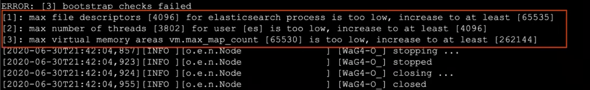

这里错误[2]的处理方式：

> 使用root用户修改系统设置
>
> ```bash
> vim /etc/security/limits.d/20-nproc.conf
> ```
> 
> 添加es的启动名称 es-admin进程数的配置
> ```bash
> es-admin          soft          nproc          4096
> ```
>


#### 验证

1. 本机验证

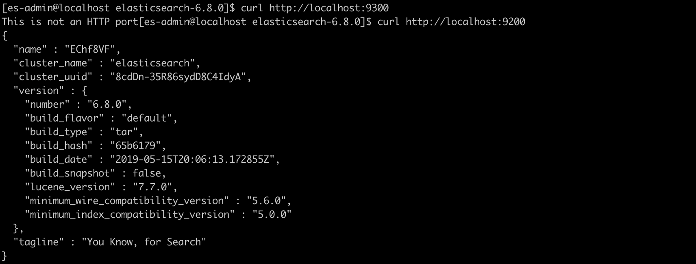

2. 远程访问

记得先开放端口或者关闭防火墙

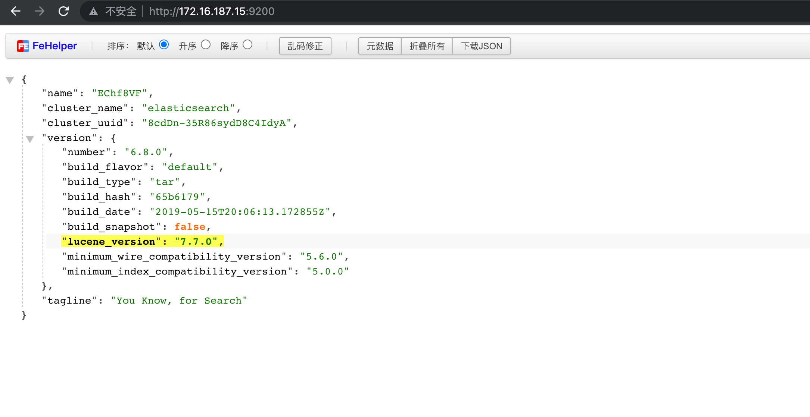

## es中基本概念

> 概念关系图，先看后面的类型说明，然后在看和mysql对比加深理解

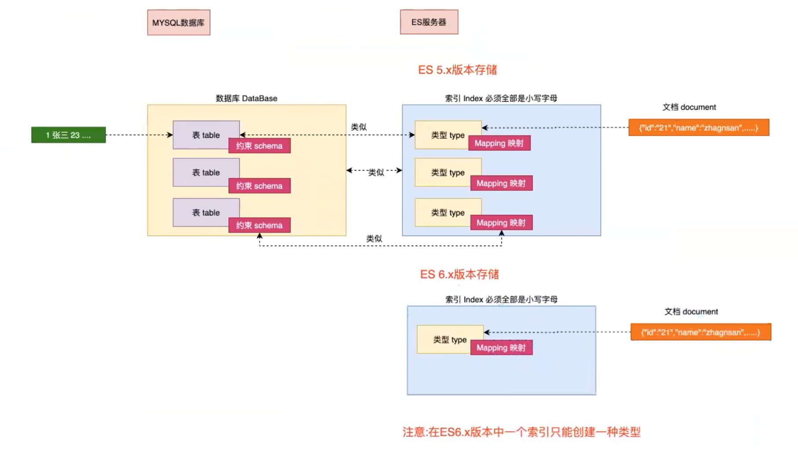

### 接近实时

(NRT)

> NRT：near real time，接近实时的搜索平台
>
> 官方文档说明：https://www.elastic.co/guide/index.html
>
> 可以选择自己版本的信息

elasticsearch是一个接近实时的搜索平台，这意味着，从索引一个文档直到这个文档能够被搜索到有一个轻微的延迟(通常是1秒内)

```markdown
## 流程(1秒内完成)
索引(录入)数据--->ES服务--->搜索
	- Beats(如果有一条数据日志发生变化，beats就会瞬间把这个变化抓到es中)
```

### 索引

(index)

一个索引就是一个**拥有几分相似特征的文档的集合**，比如说，你可以有一个客户数据的索引，另一个产品目录的索引，还有一个订单数据的索引。一个索引由一个名字来标识(**必须全部是小写字母的**)，并且当我们要对这个索引中的文档进行索引、搜索、更新和删除的时候，都要使用到这个名字，**索引类似于关系型数据库中database的概念**。在一个集群中，如果你想，可以定义任意多的索引

```markdown
es无论是启动多少个，都是集群
## 类似的对比
mysql			<--->	集群
database	<--->	索引
```

### 类型

(type)

**在一个索引中，可以定义一种或者多种类型**。一个类型是你的索引的一个逻辑上的分类/分区，其语义完全由你来定。通常，会为具有一组共同字段的文档定义一个类型，比如说，我们假设你运营一个博客平台并且将你的所有数据存储到一个索引中。在这个索引中，你可以为用户数据定义一个类型，为博客数据定义定义另一个类型，当然，也可以为评论数据定义另一个类型。**类型类似于关系型数据库中table的概念**

> Note：**在5.x版本以前可以在一个索引中定义多个类型，6.x之后也可以使用，但是不推荐，在7~8.x版本中彻底移除了一个索引中创建多个类型**
>
> **Why are mapping types being removed?**
>
> Initially, we spoke about an “index” being similar to a “database” in an SQL database, and a “type” being equivalent to a “table”.
>
> This was a bad analogy that led to incorrect assumptions. In an SQL database, tables are independent of each other. The columns in one table have no bearing on columns with the same name in another table. This is not the case for fields in a mapping type.
>
> In an Elasticsearch index, fields that have the same name in different mapping types are backed by the same Lucene field internally. In other words, using the example above, the `user_name` field in the `user` type is stored in exactly the same field as the `user_name` field in the `tweet` type, and both `user_name` fields must have the same mapping (definition) in both types.
>
> This can lead to frustration when, for example, you want `deleted` to be a `date` field in one type and a `boolean` field in another type in the same index.
>
> On top of that, storing different entities that have few or no fields in common in the same index leads to sparse data and interferes with Lucene’s ability to compress documents efficiently.
>
> For these reasons, we have decided to remove the concept of mapping types from Elasticsearch.
>
> **翻译**
>
> 最初，我们谈到“索引”类似于 SQL 数据库中的“数据库”，而“类型”等同于“表”。
>
> 这是一个糟糕的类比，导致了错误的假设。在 SQL 数据库中，表是相互独立的。一个表中的列与另一表中同名的列没有关系。对于映射类型中的字段，情况并非如此。
>
> 在 Elasticsearch 索引中，不同映射类型中具有相同名称的字段在内部由相同的 Lucene 字段支持。换句话说，使用上面的例子，`user`类型中的`user_name`字段与`tweet`类型中的`user_name`字段存储在完全相同的字段中，并且两个`user_name`字段必须具有相同的两种类型的映射（定义）。
>
> 例如，当您希望 `deleted` 成为同一索引中的一种类型的 `date` 字段和另一种类型的 `boolean` 字段时，这可能会导致挫折。
>
> 最重要的是，在同一索引中存储具有很少或没有共同字段的不同实体会导致数据稀疏并干扰 Lucene 有效压缩文档的能力。 由于这些原因，我们决定从 Elasticsearch 中删除映射类型的概念。

### 映射

(mapping)

mapping是es中的一个重要的内容，它**类似于传统关系数据中table和schema**，用来**定义一个索引(index)中的类型(type)的数据结构**。在es中，我们可以手动创建type(相当于table)和mapping(相当于schema)，也可以采用默认创建方式。在默认配置下，es可以根据插入的数据自动创建type及其mapping。mapping中主要包括字段名、字段数据类型和字段索引类型

```markdown
schema：对表中字段的约束，比如：id字段的类型、长度等
```

### 文档

一个文档是一个可以被索引的基础信息单元，**类似于表中的一条记录**。比如，你可以拥有一个员工的文档，也可以拥有某个商品的文档。文档以采用了轻量级的数据交换格式JSON(javascript object notation)来表示

## kibana

### 安装

> es给我们提供了一个web api，但是我们不能只是使用这个api直接来使用，前期学习的时候，先用客户端工具
>
> 对安装的用户没有要求，直接使用root安装就可以

Kibana 是一款开源的数据分析和可视化平台，它是 Elastic Stack 成员之一，设计用于和 Elasticsearch 协作。使用 Kibana 对 Elasticsearch 索引中的数据进行搜索、查看、交互操作。可以很方便的利用图表、表格及地图对数据进行多元化的分析和呈现

Kibana 可以使大数据通俗易懂。它很简单，基于浏览器的界面便于您快速创建和分享动态数据仪表板来追踪 Elasticsearch 的实时数据变化

1. 下载安装包

> 要和es版本对应上 6.8.0
>
> 网站：https://www.elastic.co/downloads/past-releases#kibana

2. 上传到linux服务器

```bash
scp /Users/aldencarter/Downloads/kibana-6.8.0-linux-x86_64.tar.gz root@172.16.187.15:/opt/soft/
```

3. 创建安装目录并解压

```bash
tar -zxvf soft/kibana-6.8.0-linux-x86_64.tar.gz -C dev-env/kibana/
```

4. 配置环境变量

config目录下配置：

```bash
## es 服务器主机地址
server.host: "172.16.187.15"
## es服务器地址
elasticsearch.hosts: ["http://172.16.187.15:9200"]
```

5. 启动

```bash
## 前台启动
./bin/kibana
## 后台启动
./bin/kibana &
## 后台运行并将日志输出到指定文件
./bin/kibana >./logs/kibana.log 2>&1 &
## >./logs/kibana.log：将标准日志输出到./logs/kibana.log文件
## 2>&1：将错误输出到和标准输出一样的文件中

## 关闭
## 查看端口
lsof -i:5601
## 根据pid关闭进程
kill -9 xxxx
```

6. 查看日志出现

```json
{"type":"log","@timestamp":"2021-12-12T15:32:08Z","tags":["listening","info"],"pid":2186,"message":"Server running at http://172.16.187.15:5601"}
{"type":"log","@timestamp":"2021-12-12T15:32:08Z","tags":["status","plugin:spaces@6.8.0","info"],"pid":2186,"state":"green","message":"Status changed from yellow to green - Ready","prevState":"yellow","prevMsg":"Waiting for Elasticsearch"}
```

表示已经运行成功

7. 访问web管理界面

如果能访问成功表示安装启动成功


8. 操作es主要使用的是`Dev Tools`


### kibana的基本操作

**也是对ES中类型的基本操作**

#### 索引基本操作

(index)

没有更新操作，如果创建错了，删除后重新创建

```json
PUT /ems 						创建索引
DELETE /ems					删除索引
DELETE /*						删除所有索引
GET /_cat/indices?v	查看索引信息
```

1. 创建索引

创建名字为`ems`的索引，不允许大写字母，只允许小写字母和数字

```json
PUT /ems
```

返回结果

```json
#! Deprecation: the default number of shards will change from [5] to [1] in 7.0.0; if you wish to continue using the default of [5] shards, you must manage this on the create index request or with an index template
{
  "acknowledged" : true,
  "shards_acknowledged" : true,
  "index" : "ems"
}
```

> 上面的提示说明：在6.x的版本中，会有一个提示（不是错误），es默认是以集群的方式，当前集群中只有单个节点，在es6版本（包含6）以前，每创建一个索引，为了保证高可用，这个索引就会有5个分片（5个备份），但是在7版本之后，就把这个备份调整成1份，如果想要修改备份的数量，就必须在创建索引的请求中加入明确的规则

根据上面的信息，如果我们想要修改索引的一些配置，可以在创建的时候添加一些参数

```json
PUT /ems
{
  "settings": {
    "number_of_replicas": 1,
    "number_of_shards": 5 		##  调整分片的数量，7.x中变成了1
    
  }
}
```

2. 删除索引

执行

```json
DELETE /ems
```

返回值

```json
{
  "acknowledged" : true
}
```

执行，表示删除所有的索引，连kibana的索引都一起删除了，删除之后将导致kibana无法运行，可以将kibana重启

```json
DELETE /*
```

3. 查看索引

执行

```json
GET /_cat/indices
```

返回结果

```json
yellow open ems                  0-SutP_GRf-o1LbHYJiTEg 5 1 0 0  1.2kb  1.2kb	## 刚才创建的ems
green  open .kibana_1            S3aSw7a6R2OEVdnMvy9_XQ 1 0 3 1 16.4kb 16.4kb	## 两个都是kibana自带的
green  open .kibana_task_manager ufve0u29Sc6GBZAOMqGmGQ 1 0 2 0  6.8kb  6.8kb
```

查询默认返回的是一个表格，如果想要显示表头，可以添加`?v`

```json
health status index                uuid                   pri rep docs.count docs.deleted store.size pri.store.size
yellow open   ems                  0-SutP_GRf-o1LbHYJiTEg   5   1          0            0      1.2kb          1.2kb
green  open   .kibana_1            S3aSw7a6R2OEVdnMvy9_XQ   1   0          3            1     16.4kb         16.4kb
green  open   .kibana_task_manager ufve0u29Sc6GBZAOMqGmGQ   1   0          2            0      6.8kb          6.8kb
```

- health 健康状况，比如刚才创建的ems，把一块完整的数据拆分成了5(pri)块，现在只有一台机器，也就是5块数据都存储在一个机器上，肯定是不安全的。而.kibana_1和.kibana_task_manager的分片数量只有1块，存在一台机器上，当然是安全的
  - green 健壮的
  - yellow 可用，不健壮的
  - red 不完整的，不可用的
- status 是关闭还是打开状态，默认是打开的，如果是关闭的不能直接操作，需要先打开
- index 索引的名字
- uuid 唯一标识
- pri 默认主分片数量
- rep 副本分片数量
- docs.count 文档数量
- docs.deleted 被删除的文档数量
- store.size 文档的存储大小
- pri.store.size 主分片的存储大小

#### 类型基本操作

(type)

映射类型

> mapping type：text、keyword、date、integer、long、double、boolean、ip

##### 创建类型

> 类型和映射不分开，所以在创建类型的时候就要创建映射
>
> 一个索引中只能存在一个类型

1. 创建/dangdang索引并创建(product)类型

`注意：这种方式创建类型要求索引不能存在`

**ES创建类型的时候，会自动创建一个`_id`的属性，所以我们的id可以不用(和MongoDB一样)**

```json
PUT /dangdang
{
  "mapping":{
    "product":{
      "properties":{
        "title":{"type":"text"},
        "name":{"type":"text"},
        "age":{"type":"integer"},
        "created":{"type":"date"}
      }
    }
  }
}
```

往/ems下创建类型

```json
## 类型操作 index/type(mapping) 一个索引中只能存在一个类型 ems/emp(id name age bir)
PUT /ems
{
  "mappings": {
    "emp": {
      "properties":{
        "id":{"type":"keyword"},
        "name":{"type":"text"},
        "age":{"type":"integer"},
        "bir":{"type":"date"}
      }
    }
  }
}

## 返回值
{
  "acknowledged" : true,
  "shards_acknowledged" : true,
  "index" : "ems"
}
```

往当当索引/dangdang创建book类型 字段 id name price author des pubdate

```json
PUT /dangdang
{
  "mappings": {
    "book":{
      "properties":{
        "id":{"type":"keyword"},
        "name":{"type":"keyword"},
        "price":{"type":"double"},
        "auther":{"type":"keyword"},
        "des":{"type":"text"},
        "pubdate":{"type":"date"}
      }
    }
  }
}

## 返回值
{
  "acknowledged" : true,
  "shards_acknowledged" : true,
  "index" : "dangdang"
}
```

##### 查看类型

```json
GET /dangdang/_mapping/product ## 语法：GET/索引名/mapping/类型名
```

执行

```json
GET /dangdang ## 直接返回dangdang下的所有映射，包括索引的配置信息
```

返回值

```json
{
  "dangdang" : {
    "aliases" : { },
    "mappings" : {
      "book" : {
        "properties" : {
          "auther" : {
            "type" : "keyword"
          },
          "des" : {
            "type" : "text"
          },
          "id" : {
            "type" : "keyword"
          },
          "name" : {
            "type" : "keyword"
          },
          "price" : {
            "type" : "double"
          },
          "pubdate" : {
            "type" : "date"
          }
        }
      }
    },
    "settings" : {
      "index" : {
        "creation_date" : "1639378904267",
        "number_of_shards" : "5",
        "number_of_replicas" : "1",
        "uuid" : "EoFGTp2RTEi1MhgPugsoXw",
        "version" : {
          "created" : "6080099"
        },
        "provided_name" : "dangdang"
      }
    }
  }
}
```

执行：只获取索引和索引中类型的映射

```json
GET /dangdang/_mapping
```

返回值

```json
{
  "dangdang" : {
    "mappings" : {
      "book" : {
        "properties" : {
          "auther" : {
            "type" : "keyword"
          },
          "des" : {
            "type" : "text"
          },
          "id" : {
            "type" : "keyword"
          },
          "name" : {
            "type" : "keyword"
          },
          "price" : {
            "type" : "double"
          },
          "pubdate" : {
            "type" : "date"
          }
        }
      }
    }
  }
}
```

#### 文档基本操作

(document)

##### 添加文档

```json
PUT /ems/emp/1 ## /索引/类型/id
{
  "name":"张三",
  "age":23,
  "bir":"2013-12-12",
  "content":"这是一个好员工"
}
```

执行

```json
PUT /ems/emp/1 ## 如果没有执行id=1 就会自己生成，如果要让系统帮我们自动生成id，意思就是先插入id然后在插入我们的的值
{
  "id":1,							## 如果没有执行id=1 就会自己生成
  "name":"zhangsan",
  "age":23,
  "bir":"2012-12-12"
}
```

> 如果没有执行id=1 就会自己生成，如果要让系统帮我们自动生成id，意思就是先插入id然后在插入我们的的值，所以需要改成POST请求
>
> ```json
> POST /ems/emp
> {
>   "name":"zhangsan",
>   "age":23,
>   "bir":"2012-12-12"
> }
> ```

返回值

```json
{
  "_index" : "ems",
  "_type" : "emp",
  "_id" : "1",
  "_version" : 1,
  "result" : "created",
  "_shards" : {
    "total" : 2,
    "successful" : 1,
    "failed" : 0
  },
  "_seq_no" : 0,
  "_primary_term" : 1
}
```

##### 查询文档

```json
GET /ems/emp/1
```

执行

```json
GET /ems/emp/1
```

返回值

```json
{
  "_index" : "ems",
  "_type" : "emp",
  "_id" : "1",
  "_version" : 1,
  "_seq_no" : 0,
  "_primary_term" : 1,
  "found" : true,
  "_source" : {
    "id" : 1,
    "name" : "zhangsan",
    "age" : 23,
    "bir" : "2012-12-12"
  }
}
```

`_id`映射到`id`

##### 删除文档

```json
DELETE /ems/emp/1
```

执行

```json
DELETE /ems/emp/1
```

返回值

```json
{
  "_index" : "ems",
  "_type" : "emp",
  "_id" : "1",
  "_version" : 2,
  "result" : "deleted",
  "_shards" : {
    "total" : 2,
    "successful" : 1,
    "failed" : 0
  },
  "_seq_no" : 1,
  "_primary_term" : 1
}
```

##### 更新文档

1. 第一种方式 更新原有数据

```json
POST /dangdang/emp/1/_update
{
  "doc":{
    "name":"lisi"
  }
}
```

2. 第二种方式 添加新的数据

```json
POST /ems/emp/1/_update
{
  "doc":{								## doc 固定写死的，会与/ems/emp/1中的文档匹配，然后更新对应的值
    "name":"zhangsan",
    "age":11,
    "dept":"销售部"			## 这个新添加的dept的类型是自动构建一个符合的类型，不准确
  }
}
```

> 这个新添加的dept的类型是自动构建一个符合的类型，不准确
>
> 所以这个给我们一个信号：就是创建了索引之后，可以不用创建类型，直接往索引中插入文档，但是这个自动构建的类型映射是不准确的

3. 第三种方式 在原来的数据基础上更新

```json
POST /ems/emp/1/_update
{
  "script":"ctx._source.age += 5"
}
```

ES的使用语法风格为：

```json
<REST Verb>	/<Index>/<Type>/<Id>
REST操作			/索引/类型/文档id
```

##### 批量操作

> `_bulk`批量操作，添加(index)、删除(delete)、更新(update)

批量更新会是原子操作，也就是其他的错误操作不会影响成功的操作

> 为什么不是原子操作？
>
> es主要帮我们完成搜索的操作，对es仅仅是查询操作，而插入、更新、删除都是为了查询操作，所以es中弱化事务

1. 批量索引两个文档

```json
PUT /dangdang/emp/_bulk
{"index":{"_id":"1"}}
{"name":"John Doe","age":23,"bir":"2012-12-12"}
{"name":"John Doe","age":23,"bir":"2012-12-12"}
```

2. 更新文档同时删除文档

```json
POST /dangdang/emp/_bulk
{"update":{"_id":"1"}}		## 更新文档
{"doc":{"name":"lisi"}}
{"delete":{"_id":2}}			## 删除文档
{"index":{}}							## 添加文档，不写id会自动添加_id
{"name":"xxx","age":23}
```

**注意：**批量时不会因为一个失败而全部失败，而是继续执行后续操作，批量在返回时按照执行的状态开始返回

## es高级检索

索引库底层的存储原理分析


### 检索方式 _search

es官方提供了两种检索方式：一种是通过URL参数进行搜索，另一种是通过DSL(Domain Specified Langeage)进行搜索。官方更推荐使用第二种方式，第二种方式是基于传递JSON作为请求体(request body)格式与ES进行交互，这种方式更强大，更简介


使用语法：`GET /索引/类型/_search`

- 查询参数：通过在请求URL后面添加`?xxx=xxx&yyy=yyy&zzz=zzz`，`GET /索引/类型/_search?参数`比如：`/emp/_search?q=user:john`，虽然简单，但是查询方式比较受限
- 特定领域查询：在查询URL后面添加具体的查询参数`{xxx:xxxx,yyy:yyy,zzz:zzz}`，`GET /索引/类型/_search {}`也叫request body
  - 更直观
  - 没有局限
  - 相对查询参数更加强大

### 创建测试数据

1. 删除索引

```json
GET /_cat/indices?v
DELETE /ems
```

2. 创建索引并指定类型

```json
PUT /ems
{
  "mappings":{
    "emp":{
      "properties":{
        "name":{"type":"text"},
        "age":{"type":"integer"},
        "bir":{"type":"date"},
        "content":{"type":"text"},
        "address":{"type":"keyword"}
      }
    }
  }
}
```

3. 插入测试数据

```json
PUT /ems/emp/_bulk
{"index":{}}
{"name":"张三","age":23,"bir":"2012-12-12","content":"团队开发曹操就到你还能创建方法美厨娘","address":"广州"}
{"index":{}}
{"name":"李四","age":21,"bir":"2012-12-12","content":"团队开发曹操就到你还能创建方法美厨娘","address":"深圳"}
{"index":{}}
{"name":"王五","age":24,"bir":"2012-12-12","content":"团队开发曹操就到你还能创建方法美厨娘","address":"上海"}
{"index":{}}
{"name":"赵六","age":27,"bir":"2012-12-12","content":"团队开发曹操就到你还能创建方法美厨娘","address":"成都"}
{"index":{}}
{"name":"刘能","age":28,"bir":"2012-12-12","content":"团队开发曹操就到你还能创建方法美厨娘","address":"北京"}
{"index":{}}
{"name":"张无忌","age":22,"bir":"2012-12-12","content":"团队开发曹操就到你还能创建方法美厨娘","address":"拉萨"}
{"index":{}}
{"name":"赵敏","age":20,"bir":"2012-12-12","content":"团队开发曹操就到你还能创建方法美厨娘","address":"呼和浩特"}
```

### URL检索

> url检索可以拼接的请求类型：https://www.elastic.co/guide/en/elasticsearch/reference/6.8/search-uri-request.html#_parameters_3
>
> (这里我就列出来了，免得还要自己去查)
>
> | Name                           | Description                                                  |
> | ------------------------------ | ------------------------------------------------------------ |
> | `q`                            | The query string (maps to the `query_string` query, see [*Query String Query*](https://www.elastic.co/guide/en/elasticsearch/reference/6.8/query-dsl-query-string-query.html) for more details). |
> | `df`                           | The default field to use when no field prefix is defined within the query. |
> | `analyzer`                     | The analyzer name to be used when analyzing the query string. |
> | `analyze_wildcard`             | Should wildcard and prefix queries be analyzed or not. Defaults to `false`. |
> | `batched_reduce_size`          | The number of shard results that should be reduced at once on the coordinating node. This value should be used as a protection mechanism to reduce the memory overhead per search request if the potential number of shards in the request can be large. |
> | `default_operator`             | The default operator to be used, can be `AND` or `OR`. Defaults to `OR`. |
> | `lenient`                      | If set to true will cause format based failures (like providing text to a numeric field) to be ignored. Defaults to false. |
> | `explain`                      | For each hit, contain an explanation of how scoring of the hits was computed. |
> | `_source`                      | Set to `false` to disable retrieval of the `_source` field. You can also retrieve part of the document by using `_source_includes` & `_source_excludes` (see the [request body](https://www.elastic.co/guide/en/elasticsearch/reference/6.8/search-request-source-filtering.html) documentation for more details) |
> | `stored_fields`                | The selective stored fields of the document to return for each hit, comma delimited. Not specifying any value will cause no fields to return. |
> | `sort`                         | Sorting to perform. Can either be in the form of `fieldName`, or `fieldName:asc`/`fieldName:desc`. The fieldName can either be an actual field within the document, or the special `_score` name to indicate sorting based on scores. There can be several `sort` parameters (order is important). |
> | `track_scores`                 | When sorting, set to `true` in order to still track scores and return them as part of each hit. |
> | `track_total_hits`             | Set to `false` in order to disable the tracking of the total number of hits that match the query. (see [*Index Sorting*](https://www.elastic.co/guide/en/elasticsearch/reference/6.8/index-modules-index-sorting.html) for more details). Defaults to true. |
> | `timeout`                      | A search timeout, bounding the search request to be executed within the specified time value and bail with the hits accumulated up to that point when expired. Defaults to no timeout. |
> | `terminate_after`              | The maximum number of documents to collect for each shard, upon reaching which the query execution will terminate early. If set, the response will have a boolean field `terminated_early` to indicate whether the query execution has actually terminated_early. Defaults to no terminate_after. |
> | `from`                         | The starting from index of the hits to return. Defaults to `0`. |
> | `size`                         | The number of hits to return. Defaults to `10`.              |
> | `search_type`                  | The type of the search operation to perform. Can be `dfs_query_then_fetch` or `query_then_fetch`. Defaults to `query_then_fetch`. See [*Search Type*](https://www.elastic.co/guide/en/elasticsearch/reference/6.8/search-request-search-type.html) for more details on the different types of search that can be performed. |
> | `allow_partial_search_results` | Set to `false` to return an overall failure if the request would produce partial results. Defaults to true, which will allow partial results in the case of timeouts or partial failures. This default can be controlled using the cluster-level setting `search.default_allow_partial_results`. |

```json
GET /ems/emp/_search?q=*&sort=age:asc&size=30&_source=name,age
```

- _search 搜索的API
- q=* 匹配所有的文档
- sort 以结果的中指定的字段排序
- size 返回的条数量，如果不写，默认返回10条数
- _source 返回指定的字段数据，比如\_soruce=name,age 表示返回类型name和age的数据

### DSL检索

> 以下重点讲DSL的高级语法

```json
GET /ems/emp_search
{
  "query":{"match_all":{}},
  "sort":[
    {
      "age":{
        "order":"desc"		## text 文本是没有办法做排序的，因为要做分词处理，文本就被拆分的
      }
    }
  ]
}
```

### DSL高级检索

(Query)

> 官方文档：https://www.elastic.co/guide/en/elasticsearch/reference/6.8/query-dsl.html

#### 查询所有

(match_all)

> match_all关键字：返回索引中的全部文档

```json
GET /ems/emp/_search
{
  "query":{"match_all":{}}
}
```

返回值

```json
{
  "took" : 1,																								## 从查询开始到返回结果用时 毫秒
  "timed_out" : false,																			## 操作是否超时
  "_shards" : {																							## 分片
    "total" : 5,
    "successful" : 5,
    "skipped" : 0,
    "failed" : 0
  },
  "hits" : {																								## 本次查询击中的对象，匹配到的数量
    "total" : 7,																						## 本次查询的结果数量
    "max_score" : 1.0,																			## 最大的得分，相关度
    "hits" : [
      {
        "_index" : "ems",
        "_type" : "emp",
        "_id" : "oMIcs30BWKY1ehm0t3mL",
        "_score" : 1.0,
        "_source" : {
          "name" : "张三",
          "age" : 23,
          "bir" : "2012-12-12",
          "content" : "团队开发曹操就到你还能创建方法美厨娘",
          "address" : "广州"
        }
      },
      {
        "_index" : "ems",
        "_type" : "emp",
        "_id" : "ocIcs30BWKY1ehm0t3mL",
        "_score" : 1.0,
        "_source" : {
          "name" : "李四",
          "age" : 21,
          "bir" : "2012-12-12",
          "content" : "团队开发曹操就到你还能创建方法美厨娘",
          "address" : "深圳"
        }
      },
      {
        "_index" : "ems",
        "_type" : "emp",
        "_id" : "o8Ics30BWKY1ehm0t3mL",
        "_score" : 1.0,
        "_source" : {
          "name" : "赵六",
          "age" : 27,
          "bir" : "2012-12-12",
          "content" : "团队开发曹操就到你还能创建方法美厨娘",
          "address" : "成都"
        }
      },
      {
        "_index" : "ems",
        "_type" : "emp",
        "_id" : "pcIcs30BWKY1ehm0t3mL",
        "_score" : 1.0,
        "_source" : {
          "name" : "张无忌",
          "age" : 22,
          "bir" : "2012-12-12",
          "content" : "团队开发曹操就到你还能创建方法美厨娘",
          "address" : "拉萨"
        }
      },
      {
        "_index" : "ems",
        "_type" : "emp",
        "_id" : "pMIcs30BWKY1ehm0t3mL",
        "_score" : 1.0,
        "_source" : {
          "name" : "刘能",
          "age" : 28,
          "bir" : "2012-12-12",
          "content" : "团队开发曹操就到你还能创建方法美厨娘",
          "address" : "北京"
        }
      },
      {
        "_index" : "ems",
        "_type" : "emp",
        "_id" : "osIcs30BWKY1ehm0t3mL",
        "_score" : 1.0,
        "_source" : {
          "name" : "王五",
          "age" : 24,
          "bir" : "2012-12-12",
          "content" : "团队开发曹操就到你还能创建方法美厨娘",
          "address" : "上海"
        }
      },
      {
        "_index" : "ems",
        "_type" : "emp",
        "_id" : "psIcs30BWKY1ehm0t3mL",
        "_score" : 1.0,
        "_source" : {
          "name" : "赵敏",
          "age" : 20,
          "bir" : "2012-12-12",
          "content" : "团队开发曹操就到你还能创建方法美厨娘",
          "address" : "呼和浩特"
        }
      }
    ]
  }
}
```

#### 查询结果中返回指定条数

(size)

> size 关键字：指定查询结果中返回指定条数。默认返回10条

```json
GET /ems/emp/_search
{
  "query":{"match_all":{}},
  "size":1
}
```

#### 分页查询

(from)

> from 关键字：用来指定起始返回位置，和size关键字连用可实现分页效果

```json
GET /ems/emp/_search
{
  "query":{"match_all":{}},
  "sort":[
    {
      "age":{"order":"desc"}
    }
  ],
	"size":2,
  "from":0
}
```

3. 查询结果中返回指定字段(_source)

> _source 关键字：是一个数组，在数组中用来指定展示那些字段

```json
GET /ems/emp/_search
{
  "query":{"match_all":{}},
  "_source":["name","age"]
}
```

#### 关键词查询

(term)

> term 关键字：用来使用关键词查询

```json
GET /ems/emp/_search
{
  "query":{"match_all":{}},
  "term":{
    "address":{
      "value":"北京"			## address中含有北京的
    }
  }
}
```

> **NOTE**
>
> - type类型为text会分词的；type类型为keyword不分词
>
> - 通过使用tern查询得知es中默认使用分词器为标准分词器(StandardAnalyzer)，标准分词器对于英文单词分词，对于中文单字分词
> - 通过使用tern查询得知，在es的mapping type中keyword、date、integer、long、double、boolean or ip 这些类型不分词，只有text类型分词
>
> 可以通过
>
> ```json
> GET /_analyze
> {
>   "text":"Redis is open source DB"
> }
> ```
>
> 来查看`Redis is open source DB`的分词效果
>
> ```json
> {
>   "tokens" : [
>     {
>       "token" : "redis",
>       "start_offset" : 0,
>       "end_offset" : 5,
>       "type" : "<ALPHANUM>",
>       "position" : 0
>     },
>     {
>       "token" : "is",
>       "start_offset" : 6,
>       "end_offset" : 8,
>       "type" : "<ALPHANUM>",
>       "position" : 1
>     },
>     {
>       "token" : "open",
>       "start_offset" : 9,
>       "end_offset" : 13,
>       "type" : "<ALPHANUM>",
>       "position" : 2
>     },
>     {
>       "token" : "source",
>       "start_offset" : 14,
>       "end_offset" : 20,
>       "type" : "<ALPHANUM>",
>       "position" : 3
>     },
>     {
>       "token" : "db",
>       "start_offset" : 21,
>       "end_offset" : 23,
>       "type" : "<ALPHANUM>",
>       "position" : 4
>     }
>   ]
> }
> ```
>
> 中文的标准分词
>
> ```json
> GET /_analyze
> {
>   "text":"java是一个跨平台产品"
> }
> ```
>
> 对于中文是单字分词
>
> ```json
> {
>   "tokens" : [
>     {
>       "token" : "java",
>       "start_offset" : 0,
>       "end_offset" : 4,
>       "type" : "<ALPHANUM>",
>       "position" : 0
>     },
>     {
>       "token" : "是",
>       "start_offset" : 4,
>       "end_offset" : 5,
>       "type" : "<IDEOGRAPHIC>",
>       "position" : 1
>     },
>     {
>       "token" : "一",
>       "start_offset" : 5,
>       "end_offset" : 6,
>       "type" : "<IDEOGRAPHIC>",
>       "position" : 2
>     },
>     {
>       "token" : "个",
>       "start_offset" : 6,
>       "end_offset" : 7,
>       "type" : "<IDEOGRAPHIC>",
>       "position" : 3
>     },
>     {
>       "token" : "跨",
>       "start_offset" : 7,
>       "end_offset" : 8,
>       "type" : "<IDEOGRAPHIC>",
>       "position" : 4
>     },
>     {
>       "token" : "平",
>       "start_offset" : 8,
>       "end_offset" : 9,
>       "type" : "<IDEOGRAPHIC>",
>       "position" : 5
>     },
>     {
>       "token" : "台",
>       "start_offset" : 9,
>       "end_offset" : 10,
>       "type" : "<IDEOGRAPHIC>",
>       "position" : 6
>     },
>     {
>       "token" : "产",
>       "start_offset" : 10,
>       "end_offset" : 11,
>       "type" : "<IDEOGRAPHIC>",
>       "position" : 7
>     },
>     {
>       "token" : "品",
>       "start_offset" : 11,
>       "end_offset" : 12,
>       "type" : "<IDEOGRAPHIC>",
>       "position" : 8
>     }
>   ]
> }
> ```

#### 范围查询

(range)

> range 关键字：用来指定查询指定范围内的文档

```json
GET /ems/emp/_search
{
  "query":{
    "range":{
      "age":{
        "gte":8, ## 大于等于
        "lte":30 ## 小于等于
      }
    }
  },
}
```

#### 前缀查询

(prefix)

> prefix关键字：用来检索含所有指定前缀的关键词的相关文档

```json
GET /ems/emp/_search
{
  "query":{
    "prefix":{
      "content":{
        "value":"redis"
      }
    }
  }
}
```

#### 通配符查询

(wildcard)

> wildcard关键字：通配符查询，`?`用来匹配一个任意字符，`*`用来匹配多个任意字符

```json
GET /ems/emp/_search
{
  "query":{
    "wildcard":{
      "content":{
        "value":"re*"
      }
    }
  }
}
```

#### 多id查询

(ids)

> ids关键字：值为数组类型，用来根据一组id获取多个对应的文档

```json
GET /ems/emp/_search
{
  "query":{
    "ids":{
      "values":["1","2"]
    }
  }
}
```

#### 模糊查询

(fuzzy)

> fuzzy关键字：用来模糊查询含有指定关键字的文档
>
> 最大模糊错误必须在0~2之间
>
> - elasticsearch 0个，没有错误
> - elasticsoarch 1个，错误
> - elasticsoorch 2个，错误
>
> 官方说明：https://www.elastic.co/guide/en/elasticsearch/reference/6.8/common-options.html#fuzziness
>
> fuzziness 参数可以指定为：
>
> - `0`、`1`、`2`：允许的最大编辑距离（或编辑次数）
> - `AUTO`：根据术语的长度生成编辑距离。可以选择提供低距离和高距离参数 AUTO:[low],[high]。如果未指定，则默认值为 3 和 6，相当于 AUTO:3,6 的长度：
>   - `0..2`：必须完全匹配
>   - `3..5`：可以模糊一个
>   - `>5`：可以模糊两个
>
> `AUTO` should generally be the preferred value for `fuzziness`.
```json
GET /ems/emp/_search
{
  "query":{
    "fuzzy":{
      "content":"elasticsearch"
    }
  }
}
```

#### 布尔查询

(bool)

> bool 关键字：用来组合多个条件实现复杂查询
>
> - must 相当于&&，同时成立
> - should 相当于||，成立一个就行
> - must_not：相当于!，不能满足任意一个

```json
GET /ems/emp/_search
{
  "query":{
    "bool":{
      "must":[
        {
          "range":{
            "age":{
              "gte":0,
              "lte":30
            }
          },
          "trem":{
            "address":{
              "value":"北京"
            }
          }
        }
      ],
      "should":[
        ## xxxxx
        { ## xxx }
      ],
    	"must_not":[],
    }
  }
}
```

#### 高亮查询

(highlight)

> highlinght 关键字：可以让符合条件的文档中的关键词高亮
>
> 并不是查询，只是对查询结果的二次渲染

```json
GET /ems/emp/_search
{
  "query":{
    "trem":{
      "content":{
        "value":"redis"
      }
    }
  },
  "highlight":{
    "fields":{
      "*":{}		## 对任何字段中的redis查询结果高亮，可以指定字段 "content":{}，但是为了性能，es只会根据查询指定的字段进行高亮，比如上面term中的content
    },
		"request_field_match":"false" ## 如果指定了*要对所有的字段都高亮，可以指定关闭字段匹配
  }
}
```

> 自定义高亮html标签：可以在highlight中使用`pre_tags`和`post_tags`

```json
GET /ems/emp/_search
{
  "query":{
    "term":{
      "name":"张三"
    }
  },
  "highlight":{
    "pre_tags":["<span style='color:red'>"],
  	"post_tags":["</span>"],
    "fields":{
      "content":{}
    }
  }
}
```

返回值

```json
{
  "took" : 6,
  "timed_out" : false,
  "_shards" : {
    "total" : 5,
    "successful" : 5,
    "skipped" : 0,
    "failed" : 0
  },
  "hits" : {
    "total" : 1,
    "max_score" : 0.6931472,
    "hits" : [
      {
        "_index" : "ems",
        "_type" : "emp",
        "_id" : "oMIcs30BWKY1ehm0t3mL",
        "_score" : 0.6931472,
        "_source" : {
          "name" : "张三",
          "age" : 23,
          "bir" : "2012-12-12",
          "content" : "团队开发曹操就到你还能创建方法美厨娘",
          "address" : "广州"
        },
        "highlight" : {
          "name" : [
            "张<span style='color:red'>三</span>"
          ]
        }
      }
    ]
  }
}
```

#### 多字段查询

(multi_match)

> 搜索比较智能
>
> - 如果搜索的字段分词它会对query进行先分词在搜索
> - 如果搜素的字段不分词，它会直接使用query整体进行该字段搜索
>
> 比如：字段content分词，那么就会拿着`中国`中的`中`和`国`分词之后与content中的分词进行比较；而name字段不分词，那么就会直接拿中国去与name字段进行分词

```json
GET /ems/emp/_search
{
  "query":{
    "multi_match":{
      "query":"中国",
      "field":["name":"content"] ## 这里写要检索的指定字段
    }
  }
}
```

#### 多字段分词查询

(query_string)

> 如果字段有分词，也是先将query分词处理之后进行匹配

```json
GET /dangdang/book/_search
{
  "query":{
    "query_string":{
      "query":"中国声音",
      "analyzer":"ik_max_word",				## 使用ik分词器
      "fields":["name","content"]
  	}
  }
}
```

## IK分词器

>  NOTE：
>
> 默认ES中采用标准分词器进行分词，这种方式并不适用于中文网站，因此需要修改ES对中文友好分词，从而达到更佳的搜索的效果
>
> github地址：https://github.com/medcl/elasticsearch-analysis-ik
>
> NOTE：要求版本严格与当前版本一致
>
> | IK version | ES version       |
> | ---------- | ---------------- |
> | master     | 7.x -> master    |
> | 6.x        | 6.x              |
> | 5.x        | 5.x              |
> | 1.10.6     | 2.4.6            |
> | 1.9.5      | 2.3.5            |
> | 1.8.1      | 2.2.1            |
> | 1.7.0      | 2.1.1            |
> | 1.5.0      | 2.0.0            |
> | 1.2.6      | 1.0.0            |
> | 1.2.5      | 0.90.x           |
> | 1.1.3      | 0.20.x           |
> | 1.0.0      | 0.16.2 -> 0.19.0 |

### 在线安装IK

> 在线安装IK（v5.5.1版本之后开始支持在线安装）

1. 在es安装目录执行如下命令

```bash
./bin/elasticsearch-plugin install https://github.com/medcl/elasticsearch-analysis-ik/releases/download/v6.8.0/elasticsearch-analysis-ik-6.8.0.zip
```

2. 查看安装的IK插件

进入plugins目录，IK已经安装好了

2. 重启es生效

后台启动之后，使用kill方式杀掉进程，之后再重新启动

> 如果出现错误：
>
> 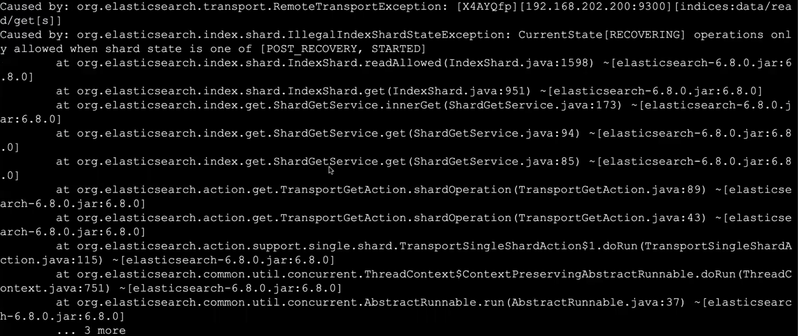
>
> 表示：为了使用IK分词器，不能存在历史数据
>
> 处理：
>
> es中所有的数据都在data目录中，直接清空data目录之后重新启动

3. 如果要使用kibana连接，将kibana重新启动一下

4. 验证

> ik_max_word 和 ik_smart 什么区别?
>
> ik_max_word: 会将文本做最细粒度的拆分，比如会将“中华人民共和国国歌”拆分为“中华人民共和国,中华人民,中华,华人,人民共和国,人民,人,民,共和国,共和,和,国国,国歌”，会穷尽各种可能的组合；
>
> ik_smart: 会做最粗粒度的拆分，比如会将“中华人民共和国国歌”拆分为“中华人民共和国,国歌”

```json
GET /_analyze
{
  "text":"中国人民共和国国歌",
  "analyzer":"ik_max_word"
}
```

返回值

```json
{
  "tokens" : [
    {
      "token" : "中国人民",
      "start_offset" : 0,
      "end_offset" : 4,
      "type" : "CN_WORD",
      "position" : 0
    },
    {
      "token" : "中国人",
      "start_offset" : 0,
      "end_offset" : 3,
      "type" : "CN_WORD",
      "position" : 1
    },
    {
      "token" : "中国",
      "start_offset" : 0,
      "end_offset" : 2,
      "type" : "CN_WORD",
      "position" : 2
    },
    {
      "token" : "国人",
      "start_offset" : 1,
      "end_offset" : 3,
      "type" : "CN_WORD",
      "position" : 3
    },
    {
      "token" : "人民共和国",
      "start_offset" : 2,
      "end_offset" : 7,
      "type" : "CN_WORD",
      "position" : 4
    },
    {
      "token" : "人民",
      "start_offset" : 2,
      "end_offset" : 4,
      "type" : "CN_WORD",
      "position" : 5
    },
    {
      "token" : "共和国",
      "start_offset" : 4,
      "end_offset" : 7,
      "type" : "CN_WORD",
      "position" : 6
    },
    {
      "token" : "共和",
      "start_offset" : 4,
      "end_offset" : 6,
      "type" : "CN_WORD",
      "position" : 7
    },
    {
      "token" : "国",
      "start_offset" : 6,
      "end_offset" : 7,
      "type" : "CN_CHAR",
      "position" : 8
    },
    {
      "token" : "国歌",
      "start_offset" : 7,
      "end_offset" : 9,
      "type" : "CN_WORD",
      "position" : 9
    }
  ]
}
```

```json
GET /_analyze
{ 
  "text":"中国人民共和国国歌", 
  "analyzer":"ik_smart"
}
```

返回值

```json
{
  "tokens" : [
    {
      "token" : "中国人民",
      "start_offset" : 0,
      "end_offset" : 4,
      "type" : "CN_WORD",
      "position" : 0
    },
    {
      "token" : "共和国",
      "start_offset" : 4,
      "end_offset" : 7,
      "type" : "CN_WORD",
      "position" : 1
    },
    {
      "token" : "国歌",
      "start_offset" : 7,
      "end_offset" : 9,
      "type" : "CN_WORD",
      "position" : 2
    }
  ]
}
```

5. 测试使用

我们在创建类型的时候明确指定要使用那种分词器

```json
PUT /ems
{
  "mappings":{
    "emp":{
      "properties":{
        "name":{"type":"text","analyzer":"ik_max_word"},
        "age":{"type":"integer"},
        "bir":{"type":"date"},
        "content":{"type":"text","analyzer":"ik_max_word"},
        "address":{"type":"keyword"}
      }
    }
  }
}
```

6. 在线安装的配置文件在es安装目录中config中

在目录`elasticsearch-6.8.0/config/analysis-ik`，不是在`elasticsearch-6.8.0/plugins/analysis-ik/config`，也就是说，ik在读取自定义词典的时候，是读取`elasticsearch-6.8.0/config/analysis-ik`这个目录中的配置

### 本地安装IK

> 可以将对应的IK分词器下载到本地，然后再安装

1. 下载对应版本

进入github中并选择对应的tags：https://github.com/medcl/elasticsearch-analysis-ik/tree/v6.8.0

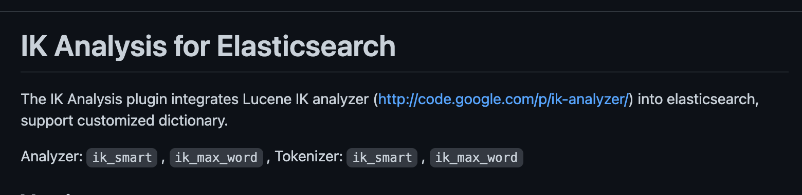

点击`http://code.google.com/p/ik-analyzer/`进入下载

或者选择releases下载


选择对应的版本下载

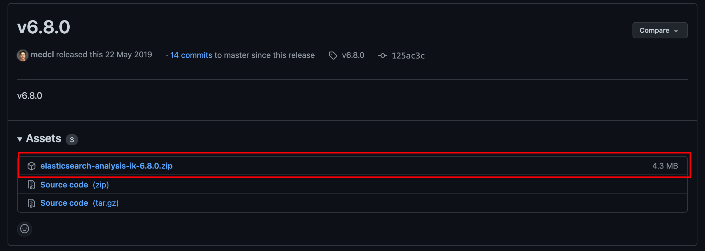

2. 解压

```bash
tar -zxvf elasticsearch-analysis-ik-6.8.0.zip
```

3. 移动到es安装目录中的plugins目录中

```bash
[es-admin@localhost elasticsearch-6.8.0]$ ll plugins/
总用量 0
drwxr-xr-x. 2 es-admin es 229 12月 13 22:55 analysis-ik
```

4. 重启es生效

先kill进程之后再重新启动

5. 如果要使用kibana连接，将kibana重新启动一下

### 配置IK扩展

#### 配置本地扩展词典和停用词典

> **Dictionary Configuration**
>
> `IKAnalyzer.cfg.xml` can be located at `{conf}/analysis-ik/config/IKAnalyzer.cfg.xml` or `{plugins}/elasticsearch-analysis-ik-*/config/IKAnalyzer.cfg.xml`
>
> ```xml
> <?xml version="1.0" encoding="UTF-8"?>
> <!DOCTYPE properties SYSTEM "http://java.sun.com/dtd/properties.dtd">
> <properties>
> 	<comment>IK Analyzer 扩展配置</comment>
> 	<!--用户可以在这里配置自己的扩展字典 -->
> 	<entry key="ext_dict">custom/mydict.dic;custom/single_word_low_freq.dic</entry>
> 	 <!--用户可以在这里配置自己的扩展停止词字典-->
> 	<entry key="ext_stopwords">custom/ext_stopword.dic</entry>
>  	<!--用户可以在这里配置远程扩展字典 -->
> 	<entry key="remote_ext_dict">location</entry>
>  	<!--用户可以在这里配置远程扩展停止词字典-->
> 	<entry key="remote_ext_stopwords">http://xxx.com/xxx.dic</entry>
> </properties>
> ```

##### 配置IK扩展

扩展词典只能对新增的文档生效，对原始文档不生效，因为原始文档已经构建好了索引了

- 如果是本地安装的话，在es目录下/plugins/ik目录/config中
- 如果是在在线安装的话，在es目录下/config/ik目录中

添加自己的扩展字典

```txt
[es-admin@localhost elasticsearch-6.8.0]$ cat config/analysis-ik/custom/mydict.dic
碰瓷
蓝瘦
```

在`IKAnalyzer.cfg.xml`中添加自己的扩展字典

```xml
<?xml version="1.0" encoding="UTF-8"?>
<!DOCTYPE properties SYSTEM "http://java.sun.com/dtd/properties.dtd">
<properties>
	<comment>IK Analyzer 扩展配置</comment>
	<!--用户可以在这里配置自己的扩展字典 -->
	<entry key="ext_dict">custom/mydict.dic;custom/single_word_low_freq.dic</entry>
	 <!--用户可以在这里配置自己的扩展停止词字典-->
	<entry key="ext_stopwords">custom/ext_stopword.dic</entry>
 	<!--用户可以在这里配置远程扩展字典 -->
	<entry key="remote_ext_dict">location</entry>
 	<!--用户可以在这里配置远程扩展停止词字典-->
	<entry key="remote_ext_stopwords">http://xxx.com/xxx.dic</entry>
</properties>
```

配置之后重新启动，出现如下

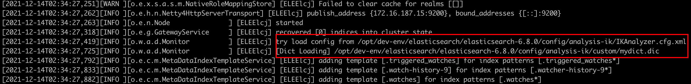

则表示加载了扩展的配置

**如果是停用词典(不允许这个词语匹配)，也是同样的配置**

##### 测试

1. 测试1

```json
GET /_analyze
{ 
  "text":"今天被碰瓷了，很蓝瘦", 
  "analyzer":"ik_smart"
}
```

```json
{
  "tokens" : [
    {
      "token" : "今天",
      "start_offset" : 0,
      "end_offset" : 2,
      "type" : "CN_WORD",
      "position" : 0
    },
    {
      "token" : "被",
      "start_offset" : 2,
      "end_offset" : 3,
      "type" : "CN_CHAR",
      "position" : 1
    },
    {
      "token" : "碰瓷",
      "start_offset" : 3,
      "end_offset" : 5,
      "type" : "CN_WORD",
      "position" : 2
    },
    {
      "token" : "了",
      "start_offset" : 5,
      "end_offset" : 6,
      "type" : "CN_CHAR",
      "position" : 3
    },
    {
      "token" : "很",
      "start_offset" : 7,
      "end_offset" : 8,
      "type" : "CN_CHAR",
      "position" : 4
    },
    {
      "token" : "蓝瘦",
      "start_offset" : 8,
      "end_offset" : 10,
      "type" : "CN_WORD",
      "position" : 5
    }
  ]
}
```

2. 测试2

```json
PUT /ems
{
  "mappings":{
    "emp":{
      "properties":{
        "name":{"type":"text","analyzer":"ik_max_word"},
        "age":{"type":"integer"},
        "bir":{"type":"date"},
        "content":{"type":"text","analyzer":"ik_max_word"},
        "address":{"type":"keyword"}
      }
    }
  }
}

PUT /ems/emp/2
{
  "name":"张三",
  "age":23,
  "bir":"2012-12-12",
  "content":"今天被碰瓷了，很蓝瘦",
  "address":"广州"
}

GET /ems/emp/_search
{
  "query": {
    "match_all": {}
  }
}

GET /ems/emp/_search
{
  "query": {
    "term": {
      "content": {
        "value": "碰瓷"
      }
    }
  }
}
```

#### 配置远程扩展词典和停用词典

**远程停用同理**

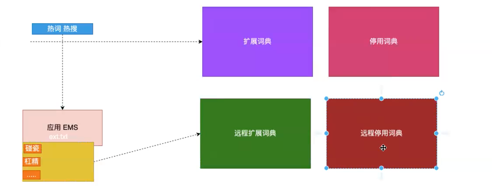

> 目前该插件支持热更新 IK 分词，通过上文在 IK 配置文件中提到的如下配置
>
> ```
>  	<!--用户可以在这里配置远程扩展字典 -->
> 	<entry key="remote_ext_dict">location</entry>
>  	<!--用户可以在这里配置远程扩展停止词字典-->
> 	<entry key="remote_ext_stopwords">location</entry>
> ```
>
> 其中 `location` 是指一个 url，比如 `http://yoursite.com/getCustomDict`，该请求只需满足以下两点即可完成分词热更新。
>
> 1. 该 http 请求需要返回两个头部(header)，一个是 `Last-Modified`，一个是 `ETag`，这两者都是字符串类型，只要有一个发生变化，该插件就会去抓取新的分词进而更新词库。
> 2. 该 http 请求返回的内容格式是一行一个分词，换行符用 `\n` 即可。
>
> 满足上面两点要求就可以实现热更新分词了，不需要重启 ES 实例
>
> 可以将需自动更新的热词放在一个 UTF-8 编码的 .txt 文件里，放在 nginx 或其他简易 http server 下，当 .txt 文件修改时，http server 会在客户端请求该文件时自动返回相应的 Last-Modified 和 ETag。可以另外做一个工具来从业务系统提取相关词汇，并更新这个 .txt 文件

我们通过创建springboot项目来测试使用远程更新词典

##### 创建sprinboot项目

1. 添加web依赖

```xml
<dependency>
  <groupId>org.springframework.boot</groupId>
  <artifactId>spring-boot-starter-web</artifactId>
</dependency>
```

2. 在static中创建ext.txt文件，要保证是utf-8编码

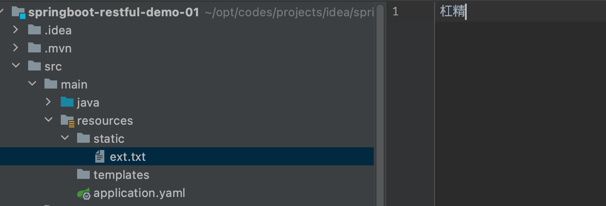

之后就ik就可以通过请求这个文件来获取扩展词典

`http://172.16.187.1:8080/springboot-restful-demo-01/ext.txt`

##### 修改IK配置文件

`vim config/analysis-ik/IKAnalyzer.cfg.xml`

```xml
<?xml version="1.0" encoding="UTF-8"?>
<!DOCTYPE properties SYSTEM "http://java.sun.com/dtd/properties.dtd">
<properties>
        <comment>IK Analyzer 扩展配置</comment>
        <!--用户可以在这里配置自己的扩展字典 -->
        <entry key="ext_dict">custom/mydict.dic</entry>
         <!--用户可以在这里配置自己的扩展停止词字典-->
        <entry key="ext_stopwords"></entry>
        <!--用户可以在这里配置远程扩展字典 -->
        <entry key="remote_ext_dict">http://172.16.187.1:8080/springboot-restful-demo-01/ext.txt</entry>
        <!--用户可以在这里配置远程扩展停止词字典-->
        <!-- <entry key="remote_ext_stopwords">words_location</entry> -->
</properties>
```

##### 测试

重新启动es服务

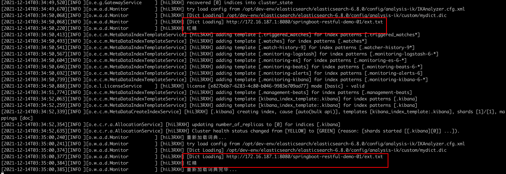

**只要词典有变化，就会不断的拉取新数据**

1. 测试1

执行

```json
GET /_analyze
{ 
  "text":"今天被碰瓷了，很蓝瘦，我是一个杠精", 
  "analyzer":"ik_smart"
}
```

返回值

```json
{
  "tokens" : [
    {
      "token" : "今天",
      "start_offset" : 0,
      "end_offset" : 2,
      "type" : "CN_WORD",
      "position" : 0
    },
    {
      "token" : "被",
      "start_offset" : 2,
      "end_offset" : 3,
      "type" : "CN_CHAR",
      "position" : 1
    },
    {
      "token" : "碰瓷",
      "start_offset" : 3,
      "end_offset" : 5,
      "type" : "CN_WORD",
      "position" : 2
    },
    {
      "token" : "了",
      "start_offset" : 5,
      "end_offset" : 6,
      "type" : "CN_CHAR",
      "position" : 3
    },
    {
      "token" : "很",
      "start_offset" : 7,
      "end_offset" : 8,
      "type" : "CN_CHAR",
      "position" : 4
    },
    {
      "token" : "蓝瘦",
      "start_offset" : 8,
      "end_offset" : 10,
      "type" : "CN_WORD",
      "position" : 5
    },
    {
      "token" : "我",
      "start_offset" : 11,
      "end_offset" : 12,
      "type" : "CN_CHAR",
      "position" : 6
    },
    {
      "token" : "是",
      "start_offset" : 12,
      "end_offset" : 13,
      "type" : "CN_CHAR",
      "position" : 7
    },
    {
      "token" : "一个",
      "start_offset" : 13,
      "end_offset" : 15,
      "type" : "CN_WORD",
      "position" : 8
    },
    {
      "token" : "杠精",
      "start_offset" : 15,
      "end_offset" : 17,
      "type" : "CN_WORD",
      "position" : 9
    }
  ]
}
```

2. 测试2

此时`石乐志`还不是关键字

```json
GET /_analyze
{ 
  "text":"今天被碰瓷了，很蓝瘦，我是一个杠精，他娘的石乐志", 
  "analyzer":"ik_smart"
}
```

会被切割成多个词语

```json
{
  "tokens" : [
    {
      "token" : "今天",
      "start_offset" : 0,
      "end_offset" : 2,
      "type" : "CN_WORD",
      "position" : 0
    },
    {
      "token" : "被",
      "start_offset" : 2,
      "end_offset" : 3,
      "type" : "CN_CHAR",
      "position" : 1
    },
    {
      "token" : "碰瓷",
      "start_offset" : 3,
      "end_offset" : 5,
      "type" : "CN_WORD",
      "position" : 2
    },
    {
      "token" : "了",
      "start_offset" : 5,
      "end_offset" : 6,
      "type" : "CN_CHAR",
      "position" : 3
    },
    {
      "token" : "很",
      "start_offset" : 7,
      "end_offset" : 8,
      "type" : "CN_CHAR",
      "position" : 4
    },
    {
      "token" : "蓝瘦",
      "start_offset" : 8,
      "end_offset" : 10,
      "type" : "CN_WORD",
      "position" : 5
    },
    {
      "token" : "我",
      "start_offset" : 11,
      "end_offset" : 12,
      "type" : "CN_CHAR",
      "position" : 6
    },
    {
      "token" : "是",
      "start_offset" : 12,
      "end_offset" : 13,
      "type" : "CN_CHAR",
      "position" : 7
    },
    {
      "token" : "一个",
      "start_offset" : 13,
      "end_offset" : 15,
      "type" : "CN_WORD",
      "position" : 8
    },
    {
      "token" : "杠精",
      "start_offset" : 15,
      "end_offset" : 17,
      "type" : "CN_WORD",
      "position" : 9
    },
    {
      "token" : "他",
      "start_offset" : 18,
      "end_offset" : 19,
      "type" : "CN_CHAR",
      "position" : 10
    },
    {
      "token" : "娘",
      "start_offset" : 19,
      "end_offset" : 20,
      "type" : "CN_CHAR",
      "position" : 11
    },
    {
      "token" : "的",
      "start_offset" : 20,
      "end_offset" : 21,
      "type" : "CN_CHAR",
      "position" : 12
    },
    {
      "token" : "石",
      "start_offset" : 21,
      "end_offset" : 22,
      "type" : "CN_CHAR",
      "position" : 13
    },
    {
      "token" : "乐",
      "start_offset" : 22,
      "end_offset" : 23,
      "type" : "CN_CHAR",
      "position" : 14
    },
    {
      "token" : "志",
      "start_offset" : 23,
      "end_offset" : 24,
      "type" : "CN_CHAR",
      "position" : 15
    }
  ]
}
```

然后我们在springboot项目中的ext.txt添加这个高频词，springboot项目最好设置自动刷新数据，或者在添加完之后`build project`


然后，es就会检测到更新并拉取数据

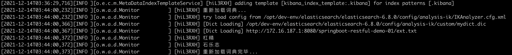

此时，我们在此测试一下

```json
GET /_analyze
{ 
  "text":"今天被碰瓷了，很蓝瘦，我是一个杠精，他娘的石乐志", 
  "analyzer":"ik_smart"
}
```

返回值

```json
{
  "tokens" : [
    {
      "token" : "今天",
      "start_offset" : 0,
      "end_offset" : 2,
      "type" : "CN_WORD",
      "position" : 0
    },
    {
      "token" : "被",
      "start_offset" : 2,
      "end_offset" : 3,
      "type" : "CN_CHAR",
      "position" : 1
    },
    {
      "token" : "碰瓷",
      "start_offset" : 3,
      "end_offset" : 5,
      "type" : "CN_WORD",
      "position" : 2
    },
    {
      "token" : "了",
      "start_offset" : 5,
      "end_offset" : 6,
      "type" : "CN_CHAR",
      "position" : 3
    },
    {
      "token" : "很",
      "start_offset" : 7,
      "end_offset" : 8,
      "type" : "CN_CHAR",
      "position" : 4
    },
    {
      "token" : "蓝瘦",
      "start_offset" : 8,
      "end_offset" : 10,
      "type" : "CN_WORD",
      "position" : 5
    },
    {
      "token" : "我",
      "start_offset" : 11,
      "end_offset" : 12,
      "type" : "CN_CHAR",
      "position" : 6
    },
    {
      "token" : "是",
      "start_offset" : 12,
      "end_offset" : 13,
      "type" : "CN_CHAR",
      "position" : 7
    },
    {
      "token" : "一个",
      "start_offset" : 13,
      "end_offset" : 15,
      "type" : "CN_WORD",
      "position" : 8
    },
    {
      "token" : "杠精",
      "start_offset" : 15,
      "end_offset" : 17,
      "type" : "CN_WORD",
      "position" : 9
    },
    {
      "token" : "他",
      "start_offset" : 18,
      "end_offset" : 19,
      "type" : "CN_CHAR",
      "position" : 10
    },
    {
      "token" : "娘",
      "start_offset" : 19,
      "end_offset" : 20,
      "type" : "CN_CHAR",
      "position" : 11
    },
    {
      "token" : "的",
      "start_offset" : 20,
      "end_offset" : 21,
      "type" : "CN_CHAR",
      "position" : 12
    },
    {
      "token" : "石乐志",
      "start_offset" : 21,
      "end_offset" : 24,
      "type" : "CN_WORD",
      "position" : 13
    }
  ]
}
```

## Filter Query

(过滤查询)

> 官方文档：https://www.elastic.co/guide/en/elasticsearch/reference/6.8/query-filter-context.html
>
> **Query context**
>
> A query clause used in query context answers the question “*How well does this document match this query clause?*” Besides deciding whether or not the document matches, the query clause also calculates a `_score` representing how well the document matches, relative to other documents.
>
> Query context is in effect whenever a query clause is passed to a `query` parameter, such as the `query` parameter in the [`search`](https://www.elastic.co/guide/en/elasticsearch/reference/6.8/search-request-query.html) API.
>
> **Filter context**
>
> In *filter* context, a query clause answers the question “*Does this document match this query clause?*” The answer is a simple Yes or No — no scores are calculated. Filter context is mostly used for filtering structured data, e.g.
>
> - *Does this `timestamp` fall into the range 2015 to 2016?*
> - *Is the `status` field set to `"published"`*?
>
> Frequently used filters will be cached automatically by Elasticsearch, to speed up performance.
>
> Filter context is in effect whenever a query clause is passed to a `filter` parameter, such as the `filter` or `must_not` parameters in the [`bool`](https://www.elastic.co/guide/en/elasticsearch/reference/6.8/query-dsl-bool-query.html) query, the `filter` parameter in the [`constant_score`](https://www.elastic.co/guide/en/elasticsearch/reference/6.8/query-dsl-constant-score-query.html) query, or the [`filter`](https://www.elastic.co/guide/en/elasticsearch/reference/6.8/search-aggregations-bucket-filter-aggregation.html) aggregation.

### 过滤查询

> 其实准确来说，ES中的查询操作分为2两种，`查询(query)`和`过滤(filter)`。查询即是之前提到query查询，它(查询)默认会计算每个返回文档的得分，然后根据得分排序。而过滤只会筛选出符合的文档，并不会计算得分，且它可以缓存文档。所以，单从性能考虑，过滤比查询更快。
>
> 换句话说，过滤适合在大范围筛选数据，而查询则适合精确匹配数据。一般应用时，应先使用过滤操作过滤数据，然后使用查询匹配数据


### 过滤语法

```json
GET /ems/emp/_search
{
  "query":{										## 查询
    "bool":{									## 通过布尔运算将过滤和查询组合在一起
      "must":[
        {"match_all":{}}
      ],
      "filter":{							## 在查询之前先做过滤
        "range":{							## 范围过滤
          "age":{
            "gle":10
          }
        }
      }
    }
  }
}
```

> NOTE：在执行filter和query时，先执行filter在执行query
>
> NOTE：es会自动缓存经常使用的过滤器，以加快性能

### 常见的过滤器类型

#### term、trems filter

在执行查询term之前，先做过滤term

```json
GET /ems/emp/_search ## 使用term过滤
{
  "query":{
    "bool":{
      "must":[
        {
          "term":{
          	"name":{
              "value":"张三"
            }
          }
        }
      ],
      "filter":{
        "term":{									## 基于指定关关键词过滤 trem
          "content":"框架"
        }
      }
    }
  }
}
```

#### exists filter

> 过滤存在指定字段，获取字段不为空的索引记录使用

```json
GET /ems/emp/_search
{
  "query":{
    "bool":{
      "must":[
        {
          "term":{						## 基于指定关键字的查询
            "name":{
              "value":"中国"
            }
          }
        }
      ],
      "filter":{
        "exists":{
          "field":"address"					## 只要文档中含有address字段的过滤
        }
      }
    }
  }
}
```

#### ids filter

> 过滤含有指定字段的索引记录

```json
GET /ems/emp/_search
{
  "query":{
    "bool":{
      "must":[
        {
          "trem":{
            "name":{
              "value":"中国"
            }
          }
        }
      ],
      "filter":{
        "ids":{
          "values":[1,2,3]
        }
      }
    }
  }
}
```

## java操作es

> **Java操作es模型，单纯使用es，而不用es生态的话**
>
> 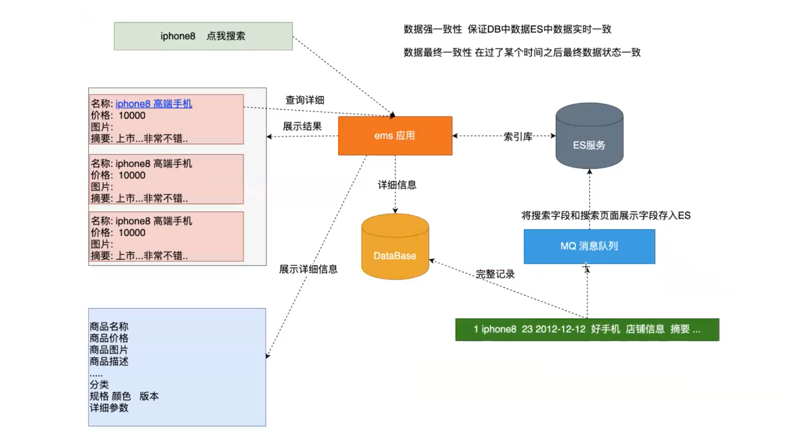
>
> 消息中间件非必须
>
> **实时索引**
>
> 只要数据发生了变化，那么es中的数据就变化，数据的强一致性。保证DB中的数据和ES中的数据实时一致，当用户执行增删改之后，立即把变化与es进行同步
>
> **最终索引**
>
> 过了一段时间之后，最终保证es中的数据发生了变化，和数据库中的数据最终一致性，用户在执行增删改还是对DB进行操作，然后过了一段时间之后，系统在从DB中拿出数据与es进行同步，可以通过定时任务将DB与ES进行同步

创建maven项目

> github项目地址：https://github.com/aldencarter/maven-elasticsearch-demo-01.git

### 引入maven依赖

```xml
<dependency>
  <groupId>org.elasticsearch</groupId>
  <artifactId>elasticsearch</artifactId>
  <version>6.8.0</version>
</dependency>
<dependency>
  <groupId>org.elasticsearch.client</groupId>
  <artifactId>transport</artifactId>
  <version>6.8.0</version>
</dependency>
<dependency>
  <groupId>org.elasticsearch.plugin</groupId>
  <artifactId>transport-netty4-client</artifactId>
  <version>6.8.0</version>
</dependency>
```

### 创建索引和类型

测试类可以先预先编写`@Before`和`@After`函数

```java
private TransportClient transportClient;

@Before
public void before() throws UnknownHostException {
  // 创建客户端
  transportClient = new PreBuiltTransportClient(Settings.EMPTY);
  // 设置es服务地址
  transportClient.addTransportAddress(new TransportAddress(InetAddress.getByName("172.16.187.15"), 9300));
}

@After
public void after() {
  if (transportClient != null) {
    transportClient.close();
  }
}
```

#### rest创建方式

```json
PUT /dangdang
{
  "mappings":{
    "book":{
      "properties":{
        "name":{
          "type":"text",
          "analyzer":"ik_max_word"
        },
        "age":{
          "type":"integer"
        },
        "sex":{
          "type":"keyword"
        },
        "content":{
          "type":"text",
          "analyzer":"ik_max_word"
        }
      }
    }
  }
}
```

#### 创建客户端操作对象

```java
@Test
public void test01() throws UnknownHostException {
  // 创建es客户端对象
  // PreBuiltTransportClient 子类唯一实现
  // 一般不在客户端对es进行操作，所以传入一个空设置 Settings.EMPTY
  TransportClient transportClient = new PreBuiltTransportClient(Settings.EMPTY);
  // 设置操作es服务主机和端口
  transportClient.addTransportAddress(new TransportAddress(InetAddress.getByName("172.16.187.15"),9300));

  // 操作
  System.out.println(transportClient);

  // 释放资源
  transportClient.close();
}
```

#### 创建索引

创建索引

```java
/**
 * 创建索引
 * 相当于 DB创建数据库，一般不这么做
 */
@Test
public void testCreateIndex(){
  // 创建一个索引 要保证创建的索引不存在
  final CreateIndexResponse response = transportClient.admin().indices().prepareCreate("dangdang").get();
  // 获取响应信息
  final boolean acknowledged = response.isAcknowledged();
  System.out.println(acknowledged);
}
```

#### 删除索引

```java
/**
 * 删除索引
 */
@Test
public void testDeleteIndex(){
  // 删除索引
  final AcknowledgedResponse response = transportClient.admin().indices().prepareDelete("dangdang").get();
  final boolean acknowledged = response.isAcknowledged();
  System.out.println(acknowledged);
}
```

#### 创建索引和类型

```java
/**
 * 了解 一般不这么做 相当于 DB 创建数据库和表
 * 创建索引 创建类型 创建映射
 */
@Test
public void testCreateIndexAndTypeMapping() throws ExecutionException, InterruptedException {
  // 创建索引的请求的对象
  final CreateIndexRequest dangdangIndex = new CreateIndexRequest("dangdang");

  // 索引设置类型
  /**
    * 参数1 类型名
    * 参数2 映射的json格式
    * 参数3 映射的格式类型
    */
  dangdangIndex.mapping("Book","{\"properties\":{\"name\":{\"type\":\"text\",\"analyzer\":\"ik_max_word\"},\"age\":{\"type\":\"integer\"},\"sex\":{\"type\":\"keyword\"},\"content\":{\"type\":\"text\",\"analyzer\":\"ik_max_word\"}}}", XContentType.JSON);

  // 创建索引
  final CreateIndexResponse createIndexResponse = transportClient.admin().indices().create(dangdangIndex).get();

  System.out.println(createIndexResponse.isAcknowledged());
}
```

### 索引一条记录

测试先预先编写`@Before`和`@After`函数

```java
private TransportClient transportClient;

@Before
public void before() throws UnknownHostException {
  // 创建客户端
  transportClient = new PreBuiltTransportClient(Settings.EMPTY);
  // 设置es服务地址
  transportClient.addTransportAddress(new TransportAddress(InetAddress.getByName("172.16.187.15"), 9300));
}

@After
public void after() {
  if (transportClient != null) {
    transportClient.close();
  }
}
```

#### 指定id索引记录

```java
/**
 * 添加一个文档
 * 指定id
 */
@Test
public void testCreateOptionId() {
  // name age sex content
  final Book book = new Book("1", "我们2001的故事", 23, "男", "我们在疫情下努力学习");
  // 转为json
  final String json = JSONObject.toJSONString(book);
  // 索引一条文档
  final IndexResponse indexResponse = transportClient.prepareIndex("dangdang", "book", book.getId()).setSource(json, XContentType.JSON).get();

  System.out.println(indexResponse.status());
}
```

#### 自定生成id索引记录

```java
/**
 * 添加一个文档
 * 自动id
 */
@Test
public void testCreateAutoId() {
  // name age sex content
  final Book book = new Book(null, "我们2002的故事", 23, "男", "我们在非典下努力学习");
  // 转为json
  final String json = JSONObject.toJSONString(book);
  // 索引一条文档
  final IndexResponse indexResponse = transportClient.prepareIndex("dangdang", "book").setSource(json, XContentType.JSON).get();

  System.out.println(indexResponse.status());
}
```

### 更新一条索引

```java
/**
 * 更新一条文档
 */
@Test
public void testUpdate() {
  final Book book = new Book("1", "我们2001的故事", 24, "女", "我们去向何处");
  final String json = JSONObject.toJSONString(book);
  final UpdateResponse updateResponse = transportClient.prepareUpdate("dangdang", "book", "1").setDoc(json, XContentType.JSON).get();
  System.out.println(updateResponse.status());
}
```

### 删除一条索引

```java
/**
 * 删除一条文档
 */
@Test
public void testDelete() {
  final DeleteResponse deleteResponse = transportClient.prepareDelete("dangdang", "book", "1").get();
  System.out.println(deleteResponse.status());
}
```

### 批量更新

```java
/**
 * 批量操作
 */
@Test
public void testBulk() {
  // 添加
  final Book book = new Book("10", "我们2010的故事", 24, "女", "我们去向何处");
  final String json = JSONObject.toJSONString(book);
  final IndexRequest indexRequest = new IndexRequest("dangdang", "book", book.getId()).source(json, XContentType.JSON);

  // 删除
  final DeleteRequest deleteRequest = new DeleteRequest("dangdang", "book", "0_gzuH0BbYhZoJqVJ5hB");

  // 修改
  final Book book1 = new Book("10", "我们2010的故事", 25, "女", "我们去向何处，又从何处来");
  final String json1 = JSONObject.toJSONString(book1);
  final UpdateRequest updateRequest = new UpdateRequest("dangdang", "book", "10").doc(json1, XContentType.JSON);

  final BulkRequestBuilder bulkRequestBuilder = transportClient.prepareBulk();
  final BulkResponse bulkItemResponses = bulkRequestBuilder.add(indexRequest)
    .add(deleteRequest)
    .add(updateRequest)
    .get();
  final BulkItemResponse[] items = bulkItemResponses.getItems();
  for (BulkItemResponse item : items) {
    System.out.println(item.status());
  }
}
```

### 检索记录

#### 查询所有并排序

一旦做了排序，就表示干预了es原本根据分数来排序的机制，此时就没有分数了

```java
/**
 * 排序查询
 */
@Test
public void testSearchBySort() {
  // 查询条件
  final MatchAllQueryBuilder matchAllQueryBuilder = QueryBuilders.matchAllQuery();// 查询所有
  final SearchResponse searchResponse = transportClient.prepareSearch("dangdang") //指定索引
    .setTypes("book") //指定类型
    .setQuery(matchAllQueryBuilder)//指定查询条件
    .addSort("age", SortOrder.DESC) // 设置排序 desc是降序
    .get();//执行查询

  System.out.println("总条数：" + searchResponse.getHits().getTotalHits());
  System.out.println("最大得分：" + searchResponse.getHits().getMaxScore()); // 手动排序之后得出 NaN
  final SearchHit[] hits = searchResponse.getHits().getHits();
  for (SearchHit hit : hits) {
    System.out.println(hit.getSourceAsString());
  }
}
```

#### 分页查询

```java
/**
 * 分页查询
 */
@Test
public void testSearchByPage() {
  // 查询条件
  final MatchAllQueryBuilder matchAllQueryBuilder = QueryBuilders.matchAllQuery();// 查询所有
  final SearchResponse searchResponse = transportClient.prepareSearch("dangdang") //指定索引
    .setTypes("book") //指定类型
    .setQuery(matchAllQueryBuilder)//指定查询条件
    .setFrom(0) // 起始条数 默认从0开始 (当前页-1)*size
    .setSize(10) //  设置每页展示的记录数
    .get();//执行查询

  System.out.println("总条数：" + searchResponse.getHits().getTotalHits());
  System.out.println("最大得分：" + searchResponse.getHits().getMaxScore());
  final SearchHit[] hits = searchResponse.getHits().getHits();
  for (SearchHit hit : hits) {
    System.out.println(hit.getSourceAsString());
  }
}
```

#### 查询返回字段

```java
/**
 * 查询返回指定字段
 */
@Test
public void testSearchBySource() {
  // 查询条件
  final MatchAllQueryBuilder matchAllQueryBuilder = QueryBuilders.matchAllQuery();// 查询所有
  final SearchResponse searchResponse = transportClient.prepareSearch("dangdang") //指定索引
    .setTypes("book") //指定类型
    .setQuery(matchAllQueryBuilder)//指定查询条件
    .setSource(SearchSourceBuilder.searchSource().fetchSource("name","age")) // 返回指定字段 参数1是包含字段 可以是通配符*表示包含所有字段，参数2是排除
    .get();//执行查询

  System.out.println("总条数：" + searchResponse.getHits().getTotalHits());
  System.out.println("最大得分：" + searchResponse.getHits().getMaxScore());
  final SearchHit[] hits = searchResponse.getHits().getHits();
  for (SearchHit hit : hits) {
    System.out.println(hit.getSourceAsString());
  }
}
```

#### term查询

```java
public void testResult(QueryBuilder queryBuilder){
  final SearchResponse searchResponse = transportClient.prepareSearch("dangdang")
    .setTypes("book")
    .setQuery(queryBuilder)//查询条件
    .get();

  System.out.println("总条数：" + searchResponse.getHits().getTotalHits());
  System.out.println("最大得分：" + searchResponse.getHits().getMaxScore());
  final SearchHit[] hits = searchResponse.getHits().getHits();
  for (SearchHit hit : hits) {
    System.out.println(hit.getSourceAsString());
  }
}

/**
 * termQuery
 */
@Test
public void testTermQuery() {
  // 查询条件 term query
  final TermQueryBuilder termQueryBuilder = QueryBuilders.termQuery("content", "非典");

  testResult(termQueryBuilder);
}
```

#### range查询

```java
/**
 * range 查询
 */
@Test
public void testRangeQuery(){
  final RangeQueryBuilder rangeQueryBuilder = QueryBuilders.rangeQuery("age").gte(0).lte(100);

  testResult(rangeQueryBuilder);
}
```

#### 通配符查询

```java
/**
 * 通配符查询
 */
@Test
public void testWildCardQuery() {
  final WildcardQueryBuilder wildcardQueryBuilder = QueryBuilders.wildcardQuery("content", "我们?");

  testResult(wildcardQueryBuilder);
}
```

#### prefix查询

```java
/**
 * 前缀查询
 */
@Test
public void testPrefixQuery() {
  final PrefixQueryBuilder prefixQueryBuilder = QueryBuilders.prefixQuery("content", "我");

  testResult(prefixQueryBuilder);
}
```

#### ids查询

```java
/**
 * ids查询
 */
@Test
public void testIdsQuery() {
  final IdsQueryBuilder idsQueryBuilder = QueryBuilders.idsQuery().addIds("1", "2", "3");

  testResult(idsQueryBuilder);
}
```

#### 模糊查询

```java
/**
 * 模糊查询
 * 0-2 不允许模糊
 * 3-5 可以出现一个模糊
 * >=6 最多出现两个模糊
 */
@Test
public void testFuzzyQuery() {
  final FuzzyQueryBuilder fuzzyQueryBuilder = QueryBuilders.fuzzyQuery("content", "我们");

  testResult(fuzzyQueryBuilder);
}
```

#### bool查询

```java
/**
 * bool查询 组合查询
 */
@Test
public void testBoolQuery() {
  final BoolQueryBuilder boolQueryBuilder = QueryBuilders.boolQuery().must(QueryBuilders.termQuery("content", "我们"));

  testResult(boolQueryBuilder);
}
```

#### 高亮查询

```java
/**
 * 高亮查询
 */
@Test
public void testSearch() {
  List<Book> books = new ArrayList<>();
  // 创建highlightBuilder
  final HighlightBuilder highlightBuilder = new HighlightBuilder()
    .field("*")
    .requireFieldMatch(false)
    .preTags("<span style='color:red;'>")
    .postTags("</span>");

  final SearchResponse searchResponse = transportClient.prepareSearch("dangdang") //指定索引
    .setTypes("book") //指定类型
    .setQuery(QueryBuilders.multiMatchQuery("我们", "content", "name"))//指定查询条件
    .highlighter(highlightBuilder) //高亮处理
    .get();//执行查询

  final SearchHit[] hits = searchResponse.getHits().getHits();
  for (SearchHit hit : hits) {
    // 封装原始数据
    final Map<String, Object> sourceAsMap = hit.getSourceAsMap();
    Book book = new Book();
    book.setId(sourceAsMap.get("id").toString());
    book.setName(sourceAsMap.get("name").toString());
    book.setAge(Integer.parseInt(sourceAsMap.get("age").toString()));
    book.setSex(sourceAsMap.get("sex").toString());
    book.setContent(sourceAsMap.get("content").toString());

    // 高亮处理
    final Map<String, HighlightField> highlightFields = hit.getHighlightFields();
    if (highlightFields.containsKey("name")) {
      final String nameHigh = highlightFields.get("name").fragments()[0].toString();
      book.setName(nameHigh);
    }
    if (highlightFields.containsKey("content")) {
      final String contentHigh = highlightFields.get("content").fragments()[0].toString();
      book.setContent(contentHigh);
    }
    books.add(book);
  }
}
```

### 过滤查询

```java
/**
 * 过滤查询
 * 主要用在查询执行之前对大量数据进行筛选
 * PostFilter 用来过滤
 */
@Test
public void testSearch() {
  final RangeQueryBuilder rangeQueryBuilder = QueryBuilders.rangeQuery("age")
    .gte(0)
    .lte(10);
  final SearchResponse searchResponse = transportClient.prepareSearch("dangdang") //指定索引
    .setTypes("book") //指定类型
    .setPostFilter(rangeQueryBuilder) // 过滤
    .setQuery(QueryBuilders.matchAllQuery())//指定查询条件
    .get();//执行查询
  final SearchHits hits = searchResponse.getHits();
  for (SearchHit hit : hits) {
    System.out.println(hit.getSourceAsString());
  }
}
```

### 综合案例

```java
/**
 * 综合案例：基于多字段关键字查询
 * 分页
 * 排序
 * 过滤
 * 执行字段返回
 * 高亮处理
 */
@Test
public void testComprehensiveSearch() {
  final SearchResponse searchResponse = transportClient.prepareSearch("dangdang")
    .setTypes("book")
    .setFrom(0)             // 起始条数
    .setSize(10)            // 每页记录数
    .addSort("age", SortOrder.DESC)         // 排序
    .setSource(SearchSourceBuilder.searchSource().fetchSource("*", "sex")) // 指定字段返回
    .setPostFilter(QueryBuilders.termQuery("name", "张三"))          // 过滤条件
    .setQuery(QueryBuilders.multiMatchQuery("我们", "name", "content"))   // 多字段搜索
    .highlighter(new HighlightBuilder().field("*").requireFieldMatch(false).preTags("<span style='color:red;'>").postTags("</span>")) // 高亮处理
    .get();

  final long totalHits = searchResponse.getHits().getTotalHits();
  System.out.println("符号条件的总条数：" + totalHits);
  final float maxScore = searchResponse.getHits().getMaxScore();
  System.out.println("最大分数：" + maxScore);
  final SearchHit[] hits = searchResponse.getHits().getHits();
  for (SearchHit hit : hits) {
    System.out.println(hit.getSourceAsString());
    System.out.println(hit.getHighlightFields().toString());
  }
}
```

## springboot data操作es

> spring data官方网站：https://spring.io/projects/spring-data
>
> Spring Data’s mission is to provide a familiar and consistent, Spring-based programming model for data access while still retaining the special traits of the underlying data store.
>
> It makes it easy to use data access technologies, relational and non-relational databases, map-reduce frameworks, and cloud-based data services. This is an umbrella project which contains many subprojects that are specific to a given database. The projects are developed by working together with many of the companies and developers that are behind these exciting technologies.
>
> 翻译：
>
> Spring Data 的使命是为数据访问提供熟悉且一致的基于 Spring 的编程模型，同时仍保留底层数据存储的特殊特征。 
>
> 它使使用数据访问技术、关系和非关系数据库、map-reduce 框架和基于云的数据服务变得容易。这是一个伞形项目，其中包含许多特定于给定数据库的子项目。这些项目是通过与这些令人兴奋的技术背后的许多公司和开发商合作开发的。
>
> 
>
> spring data elasticsearch：https://spring.io/projects/spring-data-elasticsearch
>
> 由于elasticsearch版本的更新的，`ElasticsearchTemplate`已经比较老了，所以此次不再使用

### 引入依赖

将springboot版本修改成较老的版本：`2.2.5.RELEASE`，新版本封装的elasticsearch的type已经去除了，新版本可以不用指定type

```xml
<dependency>
  <groupId>org.springframework.boot</groupId>
  <artifactId>spring-boot-starter-data-elasticsearch</artifactId>
</dependency>
```

### 编写yaml配置

>  The `TransportClient` is deprecated as of Elasticsearch 7 and will be removed in Elasticsearch 8. ([see the Elasticsearch documentation](https://www.elastic.co/guide/en/elasticsearch/client/java-api/current/transport-client.html)). Spring Data Elasticsearch will support the `TransportClient` as long as it is available in the used Elasticsearch [version](https://docs.spring.io/spring-data/elasticsearch/docs/current/reference/html/#elasticsearch.versions) but has deprecated the classes using it since version 4.0.
>
> We strongly recommend to use the [High Level REST Client](https://docs.spring.io/spring-data/elasticsearch/docs/current/reference/html/#elasticsearch.clients.rest) instead of the `TransportClient`.
>
> 翻译：
>
> 从 Elasticsearch 7 开始不推荐使用 TransportClient，并将在 Elasticsearch 8 中删除。（请参阅 Elasticsearch 文档）。 Spring Data Elasticsearch 将支持 TransportClient，只要它在使用的 Elasticsearch 版本中可用，但自 4.0 版以来已弃用使用它的类。
>
> 我们强烈建议使用高级 REST 客户端而不是 TransportClient。

#### spring-data(2.x版本配置)

之前版本使用的是ElasticTemplate，由于es官方TransportClient的废弃，导致新版本的中的所有关于的ElasticsearchTemplate都被弃用了，所以了解即可

```yaml
spring: 
	data: 
		elasticsearch: 
			cluster-nodes: 172.16.187.15:9300
```

#### spring-data(新版本推荐配置)RestHighLevelClient

> 官方网站：https://docs.spring.io/spring-data/elasticsearch/docs/current/reference/html/#elasticsearch.clients.rest
>
> The Java High Level REST Client is the default client of Elasticsearch, it provides a straight forward replacement for the `TransportClient` as it accepts and returns the very same request/response objects and therefore depends on the Elasticsearch core project. Asynchronous calls are operated upon a client managed thread pool and require a callback to be notified when the request is done.
>
> 翻译：
>
> Java 高级 REST 客户端是 Elasticsearch 的默认客户端，它直接替代了 `TransportClient`，因为它接受并返回完全相同的请求/响应对象，因此依赖于 Elasticsearch 核心项目。异步调用在客户端管理的线程池上运行，并且需要在请求完成时通知回调。

```java
@Configuration
public class RestClientConfig extends AbstractElasticsearchConfiguration {
    /**
     * 这个client用来替代transportClient对象
     * @return
     */
    @Bean
    @Override
    public RestHighLevelClient elasticsearchClient() {
        // 定义客户端配置对象
        // 用的是rest端口客户端，所以用的是9200端口
        final ClientConfiguration configuration = ClientConfiguration.builder()
                .connectedTo("172.16.187.15:9200")
                .build();
        // 通过restClients对象创建
        return RestClients.create(configuration).rest();
    }
}
```

测试使用client对象操作es

```java
/**
 * 测试ElasticSearchRestClient
 *
 * @SpringBootTest 表示使用springboot测试启动，这样可以通过springboot的启动类启动，就可以获取的到注入到spring容器中的bean
 */
@SpringBootTest
public class TestRestClient {
    @Autowired
    @Qualifier(value = "elasticsearchClient")
    private RestHighLevelClient restHighLevelClient;// 复杂查询使用

    // 面向对象的更友好的用法 ElasticSearchRepository 提供了一系列的crud方法


    /**
     * 删除文档
     */
    @Test
    public void testDelete() throws IOException {
        /**
         * 参数1 索引
         * 参数2 类型 新版本一个索引中只能有一个类型，所以可以不用传类型：public DeleteRequest(String index, String id)
         * 参数3 删除的id
         */
        final DeleteRequest deleteRequest = new DeleteRequest("dangdang", "book", "10");
        final DeleteResponse deleteResponse = restHighLevelClient.delete(deleteRequest, RequestOptions.DEFAULT);

        System.out.println(deleteResponse.status());
    }

    /**
     * 创建文档
     *
     * @throws IOException
     */
    @Test
    public void testAddIndex() throws IOException {
        final IndexRequest indexRequest = new IndexRequest("dangdang", "book", "2");
        indexRequest.source("{\"name\":\"李四\",\"age\":23,\"sex\":\"男\",\"content\":\"今天被碰瓷了，很蓝瘦\"}", XContentType.JSON);

        final IndexResponse indexResponse = restHighLevelClient.index(indexRequest, RequestOptions.DEFAULT);

        System.out.println(indexResponse.status());
    }

    /**
     * 更新操作
     */
    @Test
    public void testUpdate() throws IOException {
        final UpdateRequest updateRequest = new UpdateRequest("dangdang", "book", "1");
        updateRequest.doc("{\"name\":\"李四\",\"age\":23,\"sex\":\"男\",\"content\":\"今天被碰瓷了，很蓝瘦，想哭\"}", XContentType.JSON);
        final UpdateResponse updateResponse = restHighLevelClient.update(updateRequest, RequestOptions.DEFAULT);

        System.out.println(updateResponse.status());
    }

    /**
     * 查询文档
     */
    @Test
    public void testSearch() throws IOException {
        final SearchRequest searchRequest = new SearchRequest("dangdang");

        // 搜索构建对象
        final SearchSourceBuilder searchSourceBuilder = new SearchSourceBuilder();
        searchSourceBuilder.query(QueryBuilders.matchAllQuery())
                .from(0)    // 起始条数
                .size(10)   // 每页展示条数
                .postFilter(QueryBuilders.matchAllQuery())  // 过滤条件
                .sort("age", SortOrder.DESC)    // 排序
                .highlighter(new HighlightBuilder().field("*").requireFieldMatch(false));       // 高亮

        // 创建搜索请求
        searchRequest.types("book").source(searchSourceBuilder);
        final SearchResponse searchResponse = restHighLevelClient.search(searchRequest, RequestOptions.DEFAULT);

        System.out.println("符合条件的文档总数：" + searchResponse.getHits().getTotalHits());
        System.out.println("符合条件文档的最大得分：" + searchResponse.getHits().getMaxScore());

        final SearchHit[] hits = searchResponse.getHits().getHits();
        for (SearchHit hit : hits) {
            System.out.println(hit.getSourceAsString());
        }
    }

    /**
     * 批量更新
     */
    @Test
    public void testBulk() throws IOException {
        final BulkRequest bulkRequest = new BulkRequest();

        // 添加
        final IndexRequest indexRequest = new IndexRequest("dangdang", "book", "3");
        indexRequest.source("{\"name\":\"王五\",\"age\":23,\"sex\":\"男\",\"content\":\"今天被碰瓷了，很蓝瘦，想哭\"}", XContentType.JSON);
        bulkRequest.add(indexRequest);

        // 删除
        final DeleteRequest deleteRequest = new DeleteRequest("dangdang", "book", "3");
        bulkRequest.add(deleteRequest);
        // 修改
        final UpdateRequest updateRequest = new UpdateRequest("dangdang", "book", "1");
        updateRequest.doc("{\"name\":\"张三\",\"age\":23,\"sex\":\"男\",\"content\":\"今天被碰瓷了，很蓝瘦，想哭\"}", XContentType.JSON);
        bulkRequest.add(updateRequest);

        final BulkResponse bulkResponse = restHighLevelClient.bulk(bulkRequest, RequestOptions.DEFAULT);
        final BulkItemResponse[] items = bulkResponse.getItems();
        for (BulkItemResponse item : items) {
            System.out.println(item.status());
        }
    }
}
```

**spring-data-elasticsearch为我们提供面向对象的更友好的用法`ElasticSearchRepository`。提供了一系列的基本的crud方法，高级的方法还是使用`RestHighLevelClient`，比如复杂类型查询、高亮查询、指定条件查询**

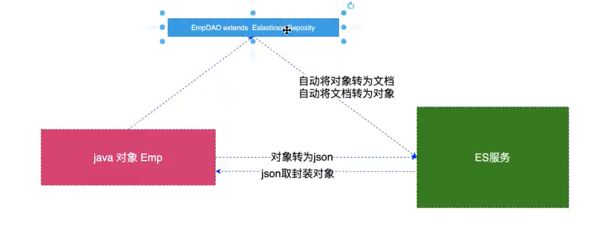

### 编写entity

```java
@Data
/**
 * 用在类上，作用：将emp的对象映射成es中一条json格式文档
 *  indexName 用来指定这个对象转为json文档存储那个索引中，要求：es服务器中不能存在此索引名
 */
@Document(indexName = "ems", type = "emp")
@Accessors(chain = true)
public class Emp {
    @Id // 用来将对象中的id属性与文档中的_id 进行一一对应
    private String id;

    // 用在属性上，代表mapping中的一个字段
    @Field(type = FieldType.Text, analyzer = "ik_max_word")
    private String name;

    @Field(type = FieldType.Integer)
    private Integer age;

    @Field(type = FieldType.Date)
  	@JsonFormat(pattern = "yyyy-MM-dd")
    private Date bir;

    @Field(type = FieldType.Text, analyzer = "ik_max_word")
    private String content;

    @Field(type = FieldType.Text, analyzer = "ik_max_word")
    private String address;
}
```

### 编写BookRepository

```java
public interface EmpRepository extends ElasticsearchRepository<Emp,String> {
}
```

下面的测试需要先注入EmpRepository对象

```java
@SpringBootTest
public class TestEmpRepository {
    @Autowired
    private EmpRepository empRepository;
  
    // 测试内容
}
```

### 索引or更新一条记录

```java
/**
 * 保存|更新一条文档
 * id 存在，更新
 * id 不存在，添加
 */
@Test
public void testSave() {
  final Emp emp = new Emp();
  emp.setId(UUID.randomUUID().toString())
    .setName("张三丰")
    .setBir(new Date())
    .setAge(23)
    .setAddress("武当山学院")
    .setContent("武侠大师，为求情，一生不娶，创立武当山，创立多种武功");
  empRepository.save(emp);
}
```

### 删除一条记录

```java
/**
 * 根据id删除文档
 */
@Test
public void testDelete() {
  empRepository.deleteById("fc905d63-4a93-45ff-9256-dbe5b5f7ca1d");
}
```

### 删除所有

```java
/**
 * 删除所有
 */
@Test
public void testDeleteAll() {
  empRepository.deleteAll();
}
```

### 检索

```java
/**
 * 检索
 */
@Test
public void testFindOne() {
  // Optional 是为了防止空指针的
  final Optional<Emp> optional = empRepository.findById("fc905d63-4a93-45ff-9256-dbe5b5f7ca1d");

  System.out.println(optional.get());
}
```

### 排序查询

```java
/**
 * 查询所有 排序
 */
@Test
public void testFindAll() {
  final Sort sort = Sort.by(Sort.Order.asc("age"));
  final Iterable<Emp> all = empRepository.findAll(sort);
  for (Emp emp : all) {
    System.out.println(emp);
  }
}
```

### 分页查询

```java
/**
 * 分页查询
 */
@Test
public void testFindByPage() {
  // PageRequest.of 参数1 当前页-1； 参数2 每页数量
  final Page<Emp> emps = empRepository.findAll(PageRequest.of(0, 10));
  emps.forEach(System.out::println);
}
```

### 自定义查询

自定义方法的前提是我们需要继承ElasticsearchRepository接口，利用强大的Spring Data来实现。比如：你的方法名叫做：findByTitle，那么它就知道你是根据title查询，然后自动帮你完成，无需写实现类

| Keyword               | Sample                                     | Elasticsearch Query String                                   |
| :-------------------- | :----------------------------------------- | :----------------------------------------------------------- |
| **`And`**             | `findBy**NameAndPrice**`                   | `{"bool" : {"**must**" : [ {"field" : {"name" : "?"}}, {"field" : {"price" : "?"}} ]}}` |
| **`Or`**              | `**findByNameOrPrice**`                    | `{"bool" : {"**should**" : [ {"field" : {"name" : "?"}}, {"field" : {"price" : "?"}} ]}}` |
| **`Is`**              | `**findBy**Name`                           | `{"bool" : {"**must**" : {"field" : {"name" : "?"}}}}`       |
| **`Not`**             | `**findBy****Nam**eNot`                    | `{"bool" : {"**must_not**" : {"field" : {"name" : "?"}}}}`   |
| **`Between`**         | `**findBy****Price**Between`               | `{"bool" : {"**must**" : {"**range**" : {"price" : {"from" : ?,"to" : ?,"include_lower" : true,"include_upper" : true}}}}}` |
| `LessThanEqual`       | `findByPriceLessThan`                      | `{"bool" : {"must" : {"range" : {"price" : {"from" : null,"to" : ?,"include_lower" : true,"include_upper" : true}}}}}` |
| `GreaterThanEqual`    | `findByPriceGreaterThan`                   | `{"bool" : {"must" : {"range" : {"price" : {"from" : ?,"to" : null,"include_lower" : true,"include_upper" : true}}}}}` |
| `Before`              | `findByPriceBefore`                        | `{"bool" : {"must" : {"range" : {"price" : {"from" : null,"to" : ?,"include_lower" : true,"include_upper" : true}}}}}` |
| `After`               | `findByPriceAfter`                         | `{"bool" : {"must" : {"range" : {"price" : {"from" : ?,"to" : null,"include_lower" : true,"include_upper" : true}}}}}` |
| `Like`                | `findByNameLike`                           | `{"bool" : {"must" : {"field" : {"name" : {"query" : "?*","analyze_wildcard" : true}}}}}` |
| `StartingWith`        | `findByNameStartingWith`                   | `{"bool" : {"must" : {"field" : {"name" : {"query" : "?*","analyze_wildcard" : true}}}}}` |
| `EndingWith`          | `findByNameEndingWith`                     | `{"bool" : {"must" : {"field" : {"name" : {"query" : "*?","analyze_wildcard" : true}}}}}` |
| `Contains/Containing` | `findByNameContaining`                     | `{"bool" : {"must" : {"field" : {"name" : {"query" : "**?**","analyze_wildcard" : true}}}}}` |
| `In`                  | `findByNameIn(Collection<String>names)`    | `{"bool" : {"must" : {"bool" : {"should" : [ {"field" : {"name" : "?"}}, {"field" : {"name" : "?"}} ]}}}}` |
| `NotIn`               | `findByNameNotIn(Collection<String>names)` | `{"bool" : {"must_not" : {"bool" : {"should" : {"field" : {"name" : "?"}}}}}}` |
| `Near`                | `findByStoreNear`                          | `Not Supported Yet !`                                        |
| `True`                | `findByAvailableTrue`                      | `{"bool" : {"must" : {"field" : {"available" : true}}}}`     |
| `False`               | `findByAvailableFalse`                     | `{"bool" : {"must" : {"field" : {"available" : false}}}}`    |
| **`OrderBy`**         | **`findByAvailableTrueOrderByNameDesc`**   | `{"sort" : [{ "name" : {"order" : "desc"} }],"bool" : {"must" : {"field" : {"available" : true}}}}` |

#### 扩展EmpRepository

```java
public interface EmpRepository extends ElasticsearchRepository<Emp, String> {

    // 根据姓名查询
    List<Emp> findByName(String name);

    // 根据年龄查询
    List<Emp> findByAge(Integer age);

    // 根据姓名和地址查询
    List<Emp> findByNameAndAddress(String name, String address);
}
```

#### 测试自定义查询

```java
/**
 * 基础查询 根据姓名 姓名和年龄 地址 等
 */
@Test
public void testFindByName() {
  final List<Emp> names = empRepository.findByName("张三丰");
  names.forEach(System.out::println);

  final List<Emp> ages = empRepository.findByAge(23);
  ages.forEach(System.out::println);

  final List<Emp> nameAndAddress = empRepository.findByNameAndAddress("张三丰", "武当山");
  nameAndAddress.forEach(System.out::println);
}
```

### 高亮查询

```java
/**
 * 复杂查询RestHighLevelClient 高亮查询
 */
@Test
public void testSearchQueryHighlight() throws IOException {
  // 配置搜索参数
  final SearchRequest searchRequest = new SearchRequest("ems");
  // 创建搜索对象
  final SearchSourceBuilder searchSourceBuilder = new SearchSourceBuilder();
  final HighlightBuilder highlightBuilder = new HighlightBuilder();
  highlightBuilder.field("*")
    .requireFieldMatch(false)
    .preTags("<span style='color:red;'>")
    .postTags("</span>");
  searchSourceBuilder.query(QueryBuilders.termQuery("content", "武侠"))//设置查询条件
    .sort("age", SortOrder.DESC)
    .from(0)    //起始页数（当前页-1）
    .size(10)//每页展示条数
    .highlighter(highlightBuilder);// 设置高亮
  searchRequest.types("emp").source(searchSourceBuilder);

  // 执行搜索
  final SearchResponse searchResponse = restHighLevelClient.search(searchRequest, RequestOptions.DEFAULT);

  System.out.println("总条数：" + searchResponse.getHits().getTotalHits());
  System.out.println("最大得分：" + searchResponse.getHits().getMaxScore()); // 设定排序的之后，得分就为NaN

  final SearchHit[] hits = searchResponse.getHits().getHits();
  for (SearchHit hit : hits) {
    System.out.println(hit.getSourceAsString());
  }
}
```

## es集群

### 相关概念

#### 集群

集群要解决的问题：

- 单节点压力问题
  - 并发压力
  - 物理资源的上限压力
- 数据冗余备份的能力

> 一个集群就是由一个或者多个节点组织在一起，它们共同持有你整个的数据，并一起提供索引和搜索功能，一个集群由一个唯一的名字标识，这个名字默认就是elasticsearch。这个名字是重要的，因为一个节点只能通过指定某个集群的名字，来加入这个集群，在产品环境中显式的设定这个名字是一个好习惯，但是使用默认值来进行测试/开发也是不错的。

#### 节点

> 一个节点是你集群中的一个服务器，作为集群的一部分，它存储你的数据，参与集群的索引和搜索功能。和集群类似，一个节点也是由一个名字来标识的，默认情况下，这个名字是一个随机的漫威漫画角色的名字，这个名字在启动的时候赋予节点。这个名字对于管理工作来说挺重要的，因为在这个管理过程中，你会去确定网络中的哪些服务器对应于elasticsearch集群中的哪些节点

> 一个节点可以通过配置集群名称的方式来加入一个指定的集群。默认情况下，每个节点都会被安排加入到一个叫做"elasticsearch"的集群中，这意味着，如果你在你的网络中启动了若干个节点，并假定他们能够相互发现彼此，他们将自动的形成并加入到一个叫做"elasticsearch"的集群中。

> 在一个集群里，只要你想，可以拥有任意多个节点。而且，如果当前你的网络中没有运行任何elasticseach节点，这时启动一个节点，会默认创建并加入到一个叫做"elasticsearch"的集群中

#### 分片和复制(shards & replicas)

> 一个索引可以存储超出单个节点硬件限制的大量数据。比如，一个具有10亿文档的索引占据1tb的磁盘空间，而任一节点都没有这样大的磁盘空间，或者单个节点处理索引请求，响应太慢。为了解决这个问题，elasticsearch提供了将索引分成多份的能力，这些份就叫做分片。当你创建一个索引的时候，你可以指定你想要的分片的数量。每个分片本身也是一个功能完善并且独立的“索引”，这个“索引”可以被放置到集群中的任何节点上。分片之所以重要，主要有两个方面：它允许你水平切分你的内容卷，它允许通过分片来分布和并执行操作来应对日益增长的执行量

> 允许你水平分割/扩展你的内容容量允许你在分片(潜在的，位于多个节点上)之上进行分布式的、并行的操作，进而提高性能/吞吐量。至于一个分片怎样分布，它的文档怎么样聚合回搜索请求，是完全由elasticsearch管理的，对于作为用户来说，这些都是透明的

> 在一个网络/云的环境里，失败随时都是可能发生，在某个分片/节点不知怎么就处于离线状态，或者由于任何原因消失了。这种情况下，有一个故障转移机制是非常有用并且是强烈推荐的。为此目的，elasticsearch允许你创建分片的一份或者多份拷贝，这些拷贝叫做复制分片，或者而直接叫做复制。复制之所以重要，主要由两个方面的原因：一旦分片丢失，就不能组成完整数据，所以需要将分片复制；复制分片不能和分片源在同一个服务器上

> 在分片/节点失败的情况下，提供了高可用性。因为这个原因，注意到复制分片从不与原/主要(origina/primary)分片置于同一节点上是非常重要的。扩展你的搜素量/吞吐量，因为搜索可以在所有的复制上并行运行

> 总之，每个索引可以被分成多个分片，一个索引也可以被复制0次(意思是没有复制)或多次。一旦复制了，每个索引就有了主分片(作为复制源和原来的分片)和赋值分片(主分片的拷贝)之别。分片和复制的数量可以在索引创建的时候指定。在索引创建之后，你可以在任何时候动态的改变复制数量，但是不能改变分片的数量。

> 默认情况下，elasticsearch中的每个索引被分片5个主分片和1个复制，这意味着，如果你的集群中至少有两个节点，你的索引将会有5个主分片和另外5个复制分片(1个完全拷贝)，这样的话每个索引总共就有10分片。一个索引的多个分片可以存放在集群的一台主机上，也可以存放在多台主机上，这取决于你的集群机器数量。主分片和复制分片的具体位置是由es内在的策略锁决定的

### 集群架构图

**如果我们明确的告诉集群由多个机器的话，当只有一个机器的时候，集群就不会向外提供服务了，因为要保证数据的完整性**

搭建集群最好是奇数个为主

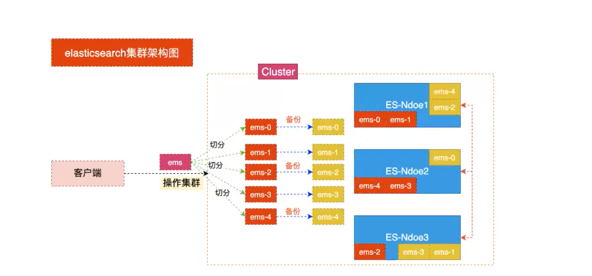

集群中虽然存在master和slave之分，但是master只是提供调度服务，并没有主次之分，每一台都对外提供服务，而且master是es自身自己决定的，并不是通过我们

### 快速搭建集群

1. 将原有的es安装包复制三份

```bash
cp -r elasticsearch-6.8.0/ node-1/
cp -r elasticsearch-6.8.0/ node-2/
cp -r elasticsearch-6.8.0/ node-3/
```

2. 删除复制目录中的data目录

> 注意：由于复制目录之间使用过因此需要在创建集群的时候将原来的数据删除

```bash
rm -rf node-1/data
rm -rf node-2/data
rm -rf node-3/data
```

3. 编辑master文件夹中config目录中的jvm.options文件调整启动内存

因为单个机器启动内存不够用，现在的情况是，一个G的内容只能启动一个es，所以我们把内存调小

```bash
vim node-1/config/jvm.options
vim node-2/config/jvm.options
vim node-3/config/jvm.options
```

分别加入

```bash
-Xms512m -Xmx512m
```

根据机器量力而行，这里调整到300m

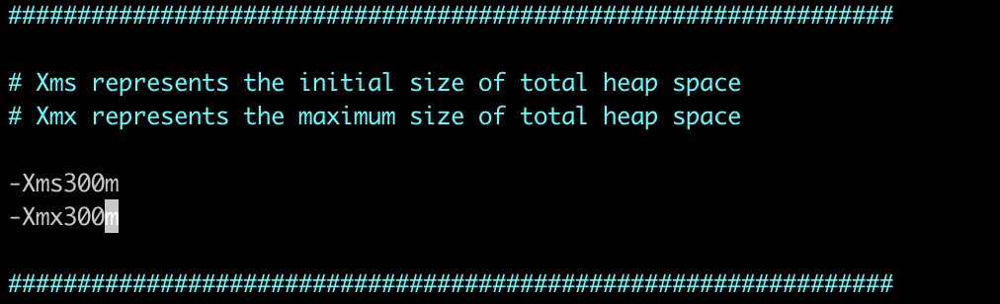

4. 分别修改三个文件夹中config目录中的elasticsearch.yml文件

```bash
vim node-1/config/elasticsearch.yml
vim node-2/config/elasticsearch.yml
vim node-3/config/elasticsearch.yml
```

分别加入如下配置：

```bash
cluster.name: my-es						## 集群名称（集群名称必须一致）
node.name: node-01							## 节点名称（节点名称不能一致）
network.host: 0.0.0.0					## 监听地址（必须开启远程权限，关闭防火墙）
http.port: 9201								## 监听端口（在一台机器时服务端口不能一致）
discovery.zen.ping_unicase.hosts: ["172.16.187.15:9302","172.16.187.15:9303"]		## 另外两个节点的ip
gateway.recover_after_nodes: 3			## 集群可做master的最小节点数
transport.tcp.port: 9301			## 集群tcp端口（在一台机器搭建必须修改）
```

5. 启动多个es

```bash
./node-1/bin/elasticsearch -d
./node-2/bin/elasticsearch -d
./node-3/bin/elasticsearch -d
```

6. 查看节点状态

```bash
curl http://172.16.187.15:9201
curl http://172.16.187.15:9202
curl http://172.16.187.15:9203
```

7. 查看集群健康状态

在任意一个节点上：

```http
http://172.16.187.15:9201/_cat/health?v
```

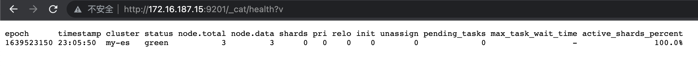

8. 可以修改kibana连接到es集群上


### 安装head插件

如果想具体看集群分片的状态，可以安装插件

1. 访问github网站

搜索：elasticsearch-head 插件

2. 安装git

```bash
yum install git
```

3. 将elasticsearch-head下载到本地

```bash
git clone git@github.com:mobz/elasticsearch-head.git
```

4. 安装nodejs

> 注意：没有wget的需要先安装
>
> ```bash
> yum install -y wget
> ```

5. 解压nodejs

```bash
xz -d node-xxxxxxx.tar.xz
tar -xvf node-xxxxx.tar
```

6. 配置环境变量

移动到usr目录下

```bash
mv node-xxxxx nodejs
mv nodejs /usr/nodejs
```

配置环境变量

```bash
vim /etc/profile
```

添加

```bash
export NODE_HOME=/usr/nodejs
export PATH=$PATH:$NODE_HOME/bin
```

7. 进入elasticsearch-head的目录

```bash
npm config set reigstry https://registry.npm.taobao.org
npm install
npm run start
```

执行结果

```bash
[root@localhost elasticsearch-head-master]## npm run start

> elasticsearch-head@0.0.0 start /opt/dev-env/elasticsearch/elasticsearch-head-master
> grunt server

Running "connect:server" (connect) task
Waiting forever...
Started connect web server on http://localhost:9100
```

8. 编写elasticsearch.yml配置文件开启head插件的访问

```bash
http.cors.enabled: true
http.cors.allow-origin: "*"
```

9. 启动访问head插件，默认端口9100

```http
http://ip:9100
```

10. 查看集群状态

展示了所有集群的数据的分布，都不在同一台机器上

- 粗边框的就是主分片
- 细边框的是副本分片

带星星的就是master

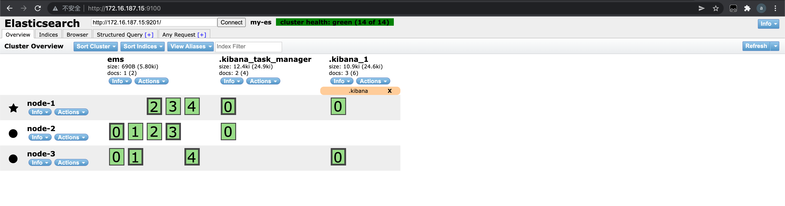

新建索引


11. 之后我们在连接es的时候，就可以连接到多个节点

```java
@Configuration
public class RestClientConfig extends AbstractElasticsearchConfiguration {
    /**
     * 这个client用来替代transportClient对象
     *
     * @return
     */
    @Bean
    @Override
    public RestHighLevelClient elasticsearchClient() {
        // 定义客户端配置对象
        // 用的是rest端口客户端，所以用的是9200端口
        final ClientConfiguration configuration = ClientConfiguration.builder()
                .connectedTo("172.16.187.15:9201", "172.16.187.15:9202", "172.16.187.15:9203")
                .build();
        // 通过restClients对象创建
        return RestClients.create(configuration).rest();
    }
}
```


