## 概述

### 是什么

mycat是数据库中间件

1. 数据库中间件

中间件：是一类连接软件组件和应用的计算机软件，以便于软件各部件之间的沟通

例子：Tomcat，web中间件

数据库中间件：连接Java应用程序和数据库

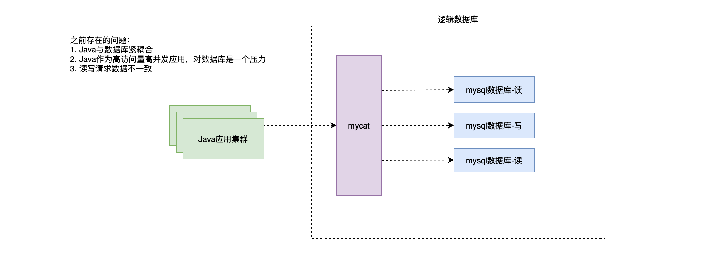

2. 数据库中间件对比

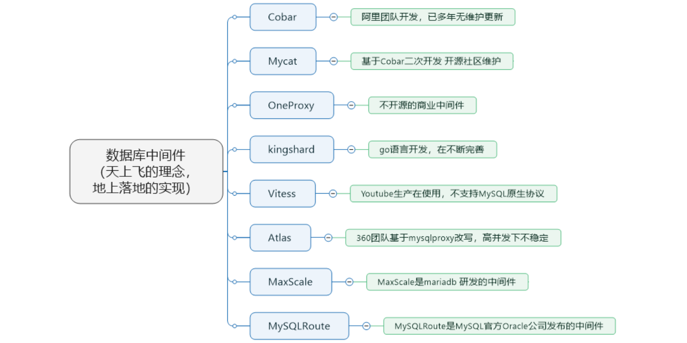

### 干什么

1. 读写分离

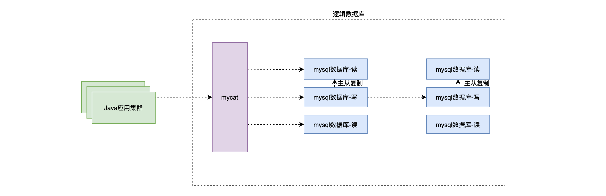

2. 数据分片

垂直拆分（分库）、水平拆分（分表）、垂直+水平拆分（分库分表）

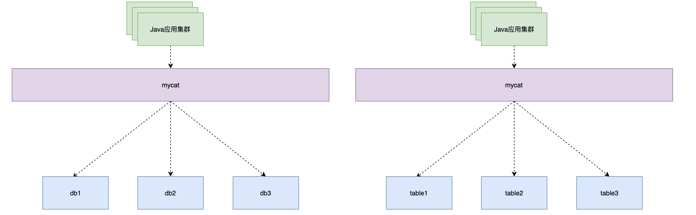

3. 多数据源整合

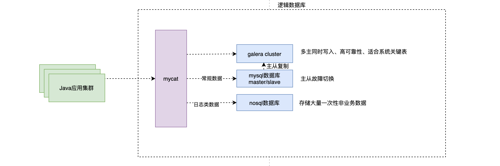

### 原理

mycat的原理中最重要的一个动词是"拦截"，它拦截了用户发送过来的SQL语句，首先对SQL语句做了一些特定的分析：如分片分析、路由分析、读写分离分析、缓存分析等，然后将此SQL发往后端的真是数据库，并将返回的结果做适当的处理，最终再返回给用户

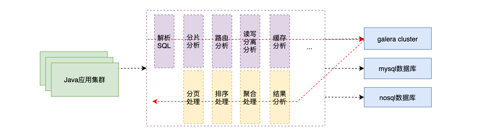

这种方式把数据库的分布式从代码中解耦出来，程序员察觉不出来后台使用了mycat还是mysql

## 安装启动

我们需要把mycat安装到Linux中

### 安装jdk

因为mycat是使用Java编写的，所以我们需要安装Java环境

（1）创建安装目录

```shell
mkdir /usr/local/java/
```

（2）解压至安装目录

```shell
tar -zxvf jdk-8u171-linux-x64.tar.gz -C /usr/local/java/
```

设置环境变量

打开文件

```shell
vim /etc/profile
```

在末尾添加

```shell
export JAVA_HOME=/usr/local/java/jdk1.8.0_171
export JRE_HOME=${JAVA_HOME}/jre
export CLASSPATH=.:${JAVA_HOME}/lib:${JRE_HOME}/lib
export PATH=${JAVA_HOME}/bin:$PATH
```

使环境变量生效

```shell
source /etc/profile
```

添加软链接

```shell
ln -s /usr/local/java/jdk1.8.0_171/bin/java /usr/bin/java
```

检查

```shell
java -version
```

### 创建MySQL

为了能使用mycat连接到MySQL，我们在docker中创建两个MySQL镜像，一个进行读库、一个进行写库

```yaml
version: "3.3"

networks:
  mycat_network:

services:
  mysql_dn_write:
    image: mysql:5.7
    container_name: dn_write
    ports:
      - "3306:3306"
    networks:
      - mycat_network
    volumes:
      - ./dn_write/data:/var/lib/mysql
    environment:
      - "MYSQL_ROOT_PASSWORD=root"
  mysql_dn_write:
    image: mysql:5.7
    container_name: dn_read
    ports:
      - "3307:3306"
    networks:
      - mycat_network
    volumes:
      - ./dn_read/data:/var/lib/mysql
    environment:
      - "MYSQL_ROOT_PASSWORD=root"
```

查看container

```bash
[root@localhost ~]## docker ps
CONTAINER ID   IMAGE       COMMAND                  CREATED         STATUS         PORTS                                                  NAMES
5050208c6af6   mysql:5.7   "docker-entrypoint.s…"   2 minutes ago   Up 2 minutes   0.0.0.0:3306->3306/tcp, :::3306->3306/tcp, 33060/tcp   dn_write
eae27098f88f   mysql:5.7   "docker-entrypoint.s…"   2 minutes ago   Up 2 minutes   33060/tcp, 0.0.0.0:3307->3306/tcp, :::3307->3306/tcp   dn_read
```

验证数据库的访问情况，我们在本地的终端访问Linux下docker中的数据库

```bash
mysql -uroot -proot -h 172.16.187.17 -P 3306 ## 写库
mysql -uroot -proot -h 172.16.187.17 -P 3307 ## 读库
## 如果不能访问，尝试将Linux的防火墙关闭
```

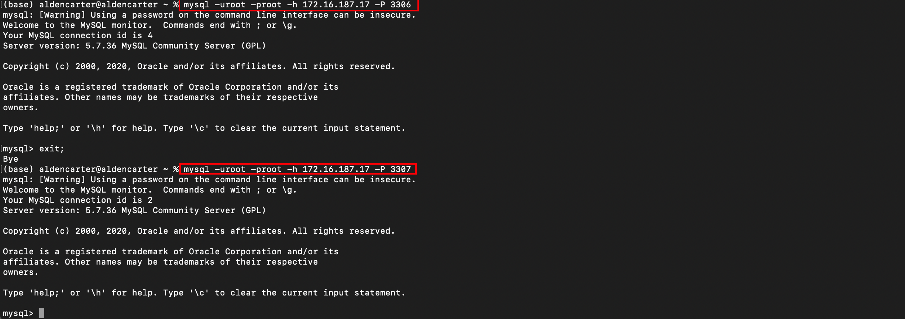

### 安装

```markdown
## linux下的安装方式
- rpm方式 .rpm安装包，多个rpm的情况下，需要按顺序安装
- yum方式 需要联网
- 解压包，解压后即可用
- 源码包，解压后编译安装
```

解压后即可使用，解压压缩文件拷贝到linux下`/usr/local/`

```bash
[root@localhost mycat]## ll
总用量 12
drwxr-xr-x. 2 root root  190 12月 24 01:57 bin
drwxrwxrwx. 2 root root    6 6月  24 2019 catlet
drwxrwxrwx. 4 root root 4096 12月 24 01:57 conf
drwxr-xr-x. 2 root root 4096 12月 24 01:57 lib
drwxrwxrwx. 2 root root    6 6月  26 2019 logs
-rwxrwxrwx. 1 root root  227 6月  27 2019 version.txt
[root@localhost mycat]## pwd
/usr/local/mycat
```

三个配置文件`cd conf/`

- schema.xml 定义逻辑表，表、分片节点等内容
- rule.xml 定义分片规则
- server.xml 定义用户以及系统相关变量，如端口等

### 启动

1. 修改配置文件server.xml

修改用户信心，与MySQL区分，如下：

```shell
<user name="mycat" defaultAccount="true"> ## 这里改成mycat
  <property name="password">123456</property>
  <property name="schemas">TESTDB</property> ## 逻辑库 TESTDB

  <!-- 表级 DML 权限设置 -->
  <!--
  <privileges check="false">
    <schema name="TESTDB" dml="0110" >
      <table name="tb01" dml="0000"></table>
      <table name="tb02" dml="1111"></table>
    </schema>
  </privileges>
  -->
</user>
```

2. 修改配置文件schema.xml

schema标签定义了表信息，因为我们暂时还没有这些，所以先删除，并在该节点上定义逻辑库的节点

```markdown
删除多行可以使用`d行数d`
```

dataNode定义了节点信息，因为并没有那么多数据节点，所以我们先删除其他的节点，dataHost定义了连接的数据库，我们将刚才在docker中创建的MySQL信息填写进入

```shell
<?xml version="1.0"?>
<!DOCTYPE mycat:schema SYSTEM "schema.dtd">
<mycat:schema xmlns:mycat="http://io.mycat/">

        <schema name="TESTDB" checkSQLschema="false" sqlMaxLimit="100" dataNode="dn1"> ## 这里配置 dataNode="dn1"
        </schema>
        <dataNode name="dn1" dataHost="localhost1" database="db1" /> ## localhost1表示连接到物理数据库的连接信息
        <dataHost name="localhost1" maxCon="1000" minCon="10" balance="0"
                          writeType="0" dbType="mysql" dbDriver="native" switchType="1"  slaveThreshold="100">
                <heartbeat>select user()</heartbeat>
                <!-- can have multi write hosts -->
                <writeHost host="hostM1" url="172.16.187.17:3306" user="root"
                                   password="root">
                        <!-- can have multi read hosts -->
                        <readHost host="hostS2" url="172.16.187.17:3307" user="root" password="root" />
                </writeHost>
        </dataHost>
</mycat:schema>
```

3. 验证数据库的访问情况

刚才我们在docker中安装MySQL的时候已经测试过了，可以连接

4. 启动程序

```markdown
## 6个特殊的目录：在Linux下有6个目录在整个Linux下任意位置都可以执行这里面的脚本，并且不需要加./
- bin
- usr/bin
- usr/local/bin
- sbin
- usr/sbin
- usr/local/sbin
```

- 控制台启动：进入`mycat/bin`目录下执行`./mycat console`
- 后台启动：进入`mycat/bin`目录下执行`./mycat start`

为了能第一时间看到启动日志，方便定位问题，我们选择控制台启动

```bash
[root@localhost mycat]## ./bin/mycat console
Running Mycat-server...
wrapper  | --> Wrapper Started as Console
wrapper  | Launching a JVM...
jvm 1    | Java HotSpot(TM) 64-Bit Server VM warning: ignoring option MaxPermSize=64M; support was removed in 8.0
jvm 1    | Wrapper (Version 3.2.3) http://wrapper.tanukisoftware.org
jvm 1    |   Copyright 1999-2006 Tanuki Software, Inc.  All Rights Reserved.
jvm 1    |
jvm 1    | MyCAT Server startup successfully. see logs in logs/mycat.log
```

### 登录

1. 登录后台管理窗口

此登录方式用于管理维护mycat

```bash
mysql -umycat -p123456 -P 9066 -h 172.16.187.19
## 执行效果 如果不能连接，查看是否关闭防火墙
(base) aldencarter@aldencarter ~ % mysql -umycat -p123456 -P 9066 -h 172.16.187.19
mysql: [Warning] Using a password on the command line interface can be insecure.
Welcome to the MySQL monitor.  Commands end with ; or \g.
Your MySQL connection id is 1
Server version: 5.6.29-mycat-1.6.7.1-release-20190627191042 MyCat Server (monitor) ## 这里是monitor

Copyright (c) 2000, 2020, Oracle and/or its affiliates. All rights reserved.

Oracle is a registered trademark of Oracle Corporation and/or its
affiliates. Other names may be trademarks of their respective
owners.

Type 'help;' or '\h' for help. Type '\c' to clear the current input statement.

mysql> 
```

2. 登录数据窗口

此登录方式用于通过mycat查询数据，我们选择这种方式访问mycat

```bash
mysql -umycat -p123456 -h 172.16.187.19 -P 8066
## 执行结果
(base) aldencarter@aldencarter ~ % mysql -umycat -p123456 -h 172.16.187.19 -P 8066
mysql: [Warning] Using a password on the command line interface can be insecure.
Welcome to the MySQL monitor.  Commands end with ; or \g.
Your MySQL connection id is 2
Server version: 5.6.29-mycat-1.6.7.1-release-20190627191042 MyCat Server (OpenCloudDB) ## 这里是mycat server OpenCloudDB

Copyright (c) 2000, 2020, Oracle and/or its affiliates. All rights reserved.

Oracle is a registered trademark of Oracle Corporation and/or its
affiliates. Other names may be trademarks of their respective
owners.

Type 'help;' or '\h' for help. Type '\c' to clear the current input statement.

mysql> 
```

常用的命令

- `show databases;` 
- `use TESTDB`
- `show tables;`

## 搭建读写分离

在搭建mycat的读写分离之前，需要先配置mysql的主从复制

我们通过mycat和MySQL的主从复制配合搭建数据库的读写分离，实现MySQL的高可用性。我们将搭建：一主一从、双主双从两种读写分离模式

### 一主一从

一个主机用于处理所有写请求，一台从机负责所有读请求，架构图如下：

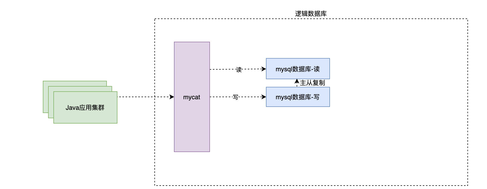

#### 搭建MySQL数据库主从复制

##### 主从复制的原理

主机把所有的写操作都写入到日志文件中，从机读取主机的日志文件，然后放到一个中继日志中，之后在执行日志写入数据

和Redis相同的是

- 主机只能有一台，从机能有多台

和Redis不同的是

- Redis是从头开始复制
- MySQL是从接入点开始复制

因为使用了IO线程，所以存在一个延时性的问题

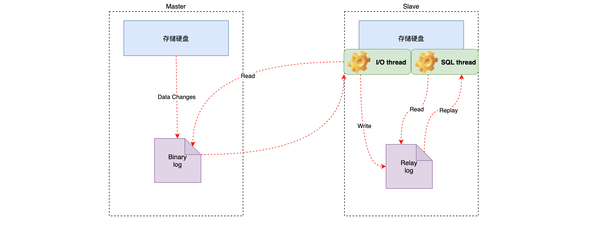

##### 配置

在上面搭建的docker中我们使用3306端口的MySQL作为主机，使用3307的端口作为从机

我们为了修改配置，需要把`/etc/mysql/`挂载出来，所以我们先把当前compose移除

```bash
[root@localhost mycat]## docker-compose down
Stopping dn_write ... done
Stopping dn_read  ... done
Removing dn_write ... done
Removing dn_read  ... done
Removing network mycat_mycat_network
```

在dn_read/conf和dn_write/conf目录下创建my.cnf

```bash
[mysqld]
user=mysql
character-set-server=utf8
default_authentication_plugin=mysql_native_password

[client]
default-character-set=utf8

[mysql]
default-character-set=utf8
```

修改配置文件，挂载MySQL配置文件

```yaml
version: "3.3"

networks:
  mycat_network:

services:
  mysql_dn_write:
    image: mysql:5.7
    container_name: dn_write
    ports:
      - "3306:3306"
    networks:
      - mycat_network
    volumes:
      - ./dn_write/data:/var/lib/mysql
      - ./dn_write/conf:/etc/mysql/conf.d
    environment:
      - "MYSQL_ROOT_PASSWORD=123456"
  mysql_dn_read:
    image: mysql:5.7
    container_name: dn_read
    ports:
      - "3307:3306"
    networks:
      - mycat_network
    volumes:
      - ./dn_read/data:/var/lib/mysql
      - ./dn_read/conf:/etc/mysql/conf.d
    environment:
      - "MYSQL_ROOT_PASSWORD=123456"
```

重新启动`docker-compose up -d`

```bash
[root@localhost mycat]## docker-compose up -d
Creating network "mycat_mycat_network" with the default driver
Creating dn_write ... done
Creating dn_read  ... done
```

1. 主机配置

修改`vim dn_write/conf/my.cnf`配置文件

添加配置

```bash
## 主服务器唯一ID
server-id=1
## 启用二进制日志
log-bin=mysql-bin
## 设置不要复制的数据库(可设置多个)
binlog-ignore-db=mysql
binlog-ignore-db=information_schema
## 设置需要复制的数据库 因为复制是从接入点开始复制的，所以应该是写一个没有创建过的数据库
binlog-do-db=testdb
## 设置logbin格式
binlog_format=STATEMENT
```

binlog日志存储的三种模式

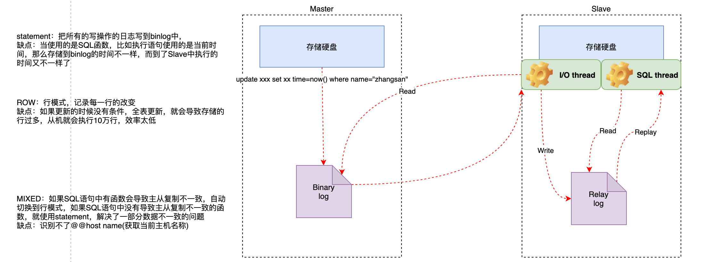

2. 从机配置

修改`vim dn_read/conf/my.cnf`配置文件

```bash
## 从服务器唯一ID
server-id=2
## 启用中继日志
relay-log=mysql-relay
```

3. 重启主机和从机

```bash
[root@localhost mycat]## docker-compose down ## 可以使用restart
Stopping dn_read  ... done
Stopping dn_write ... done
Removing dn_read  ... done
Removing dn_write ... done
Removing network mycat_mycat_network
[root@localhost mycat]## docker-compose up -d
Creating network "mycat_mycat_network" with the default driver
Creating dn_write ... done
Creating dn_read  ... done
```

4. 在主机上建立账号并授权slave

```bash
## 在主机MySQL里执行授权命令
GRANT REPLICATION SLAVE ON *.* TO 'slave'@'%' IDENTIFIED BY '123456';
## 结果
mysql> GRANT REPLICATION SLAVE ON *.* TO 'slave'@'%' IDENTIFIED BY '123456';
Query OK, 0 rows affected, 1 warning (0.00 sec)
```

查询master的状态

```mysql
show master status;
```

> 此时，发现并没有生效，进入容器内部查询
> ```bash
> root@999a93548efe:/## mysql --help | grep my.cnf
> mysql: [ERROR] unknown variable 'server-id=1'
> ```
> 解决方案：
> ```markdown
> 对我来说，它的工作原理是将 /etc/mysql/conf.d/my.cnf 重命名为 /etc/mysql/conf.d/my.ini
> 
> 我不确定其确切原因（请随意编辑此答案并添加到其中）
> 
> 我尝试了各种组合：
> 
> 保持变量为：server-id和server_id
> 保持组/部分为：[mysql]和[mysqld]
> 将文件重命名为：my.cnf, mysqld.cnf, mysql.cnf,my.ini
> 您可以继续尝试上述选项中的各种组合，它肯定会奏效。:)
> ```
>
> 我这里是把它放到了[mysqld]下就生效了

记录下File和Position的值，执行完此步骤后不要再操作主服务器MySQL，防止主服务器状态值变化

```bash
mysql> show master status;
+------------------+----------+--------------+--------------------------+-------------------+
| File             | Position | Binlog_Do_DB | Binlog_Ignore_DB         | Executed_Gtid_Set |
+------------------+----------+--------------+--------------------------+-------------------+
| mysql-bin.000001 |      154 | testdb       | mysql,information_schema |                   |
+------------------+----------+--------------+--------------------------+-------------------+
1 row in set (0.00 sec)
```

5. 在从机上配置需要复制的主机

```bash
## 复制主机的命令
CHANGE MASTER TO MASTER_HOST='172.16.187.17',
MASTER_USER='slave',
MASTER_PASSWORD='123456',
MASTER_LOG_FILE='mysql-bin.000001',MASTER_LOG_POS=154;
## 执行结果
mysql> CHANGE MASTER TO MASTER_HOST='172.16.187.17',
    -> MASTER_USER='slave',
    -> MASTER_PASSWORD='123456',
    -> MASTER_LOG_FILE='mysql-bin.000001',MASTER_LOG_POS=154;
Query OK, 0 rows affected, 1 warning (0.01 sec)
```

启动从服务器复制功能

```bash
start slave;
## 执行结果
mysql> start slave;
Query OK, 0 rows affected (0.00 sec)
```

查看从服务器状态

```mysql
show slave status\G;
```

下面两个参数都是Yes，则说明主从配置成功

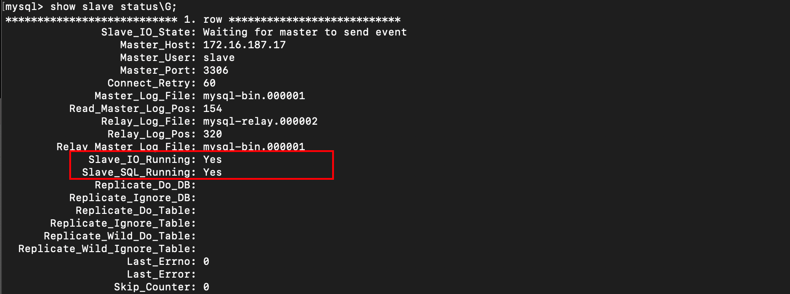

如果出现错误，会在Last_Error中显示

##### 测试

在master主机新建库、新建表、insert 记录

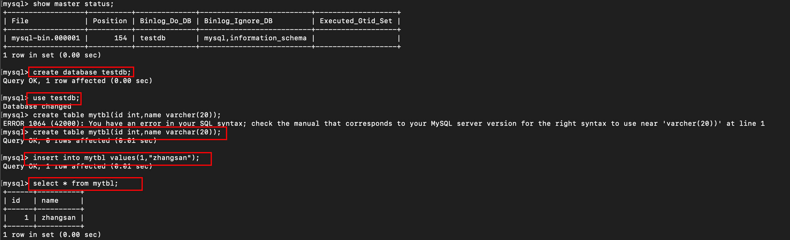

从机复制

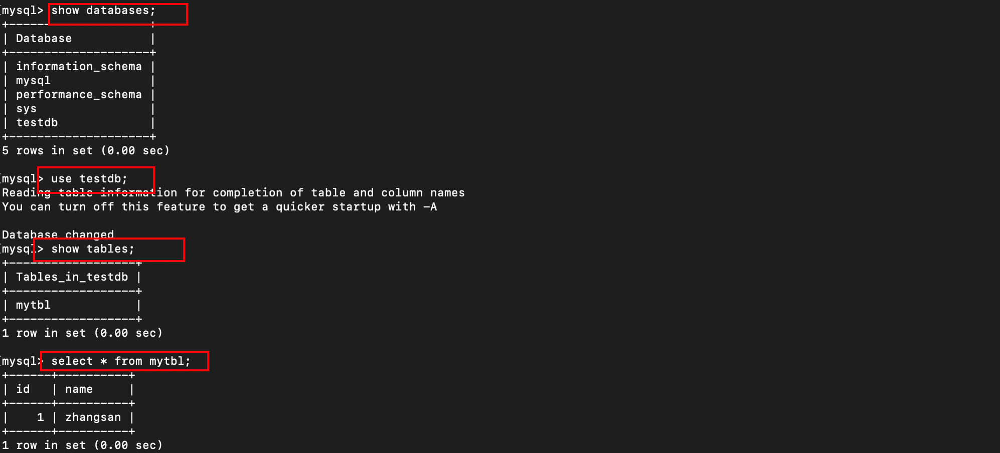

##### 其他命令

停止从服务复制功能

```bash
stop slave
```

如何重新配置主从？

```bash
stop slave; 
reset master;
```

#### 修改mycat的配置文件schema.xml

将dataNode修改中的数据库库修改成我们刚才的数据库testdb

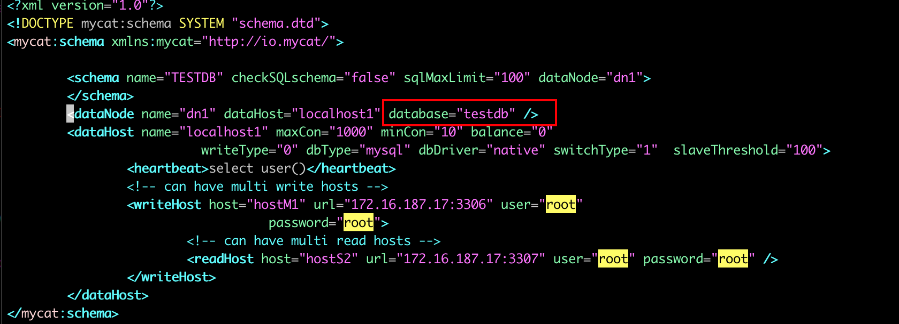

测试mycat是否可以成功连接到MySQL中的数据库

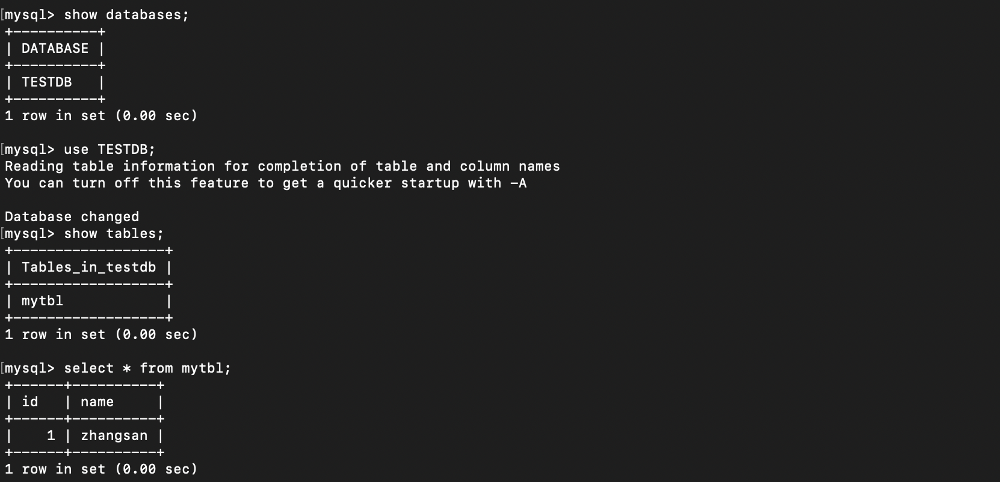

###### 验证是否实现读写分离

之前的配置已分配了读写主机，是否已实现读写分离？

在写主机插入一条数据

```mysql
insert into mytbl values (1,@@hostname); ## 获取当前的主机名，并插入数据库，如果实现了读写分离，那么我我们在查询的时候，应该使用的是读主机，也就是读主机的主机名
```

在mycat查询

```mysql
select * from mytbl;
## 返回结果
mysql> select * from mytbl;
+------+--------------+
| id   | name         |
+------+--------------+
|    1 | zhangsan     |
|    1 | 046e0e02a4c7 |
+------+--------------+
2 rows in set (0.00 sec)
## 和写主机的docker id一致，没有实现读写分离
[root@localhost mycat]## docker ps
CONTAINER ID   IMAGE       COMMAND                  CREATED          STATUS          PORTS                                                  NAMES
5976fad06d9b   mysql:5.7   "docker-entrypoint.s…"   58 minutes ago   Up 58 minutes   33060/tcp, 0.0.0.0:3307->3306/tcp, :::3307->3306/tcp   dn_read
046e0e02a4c7   mysql:5.7   "docker-entrypoint.s…"   58 minutes ago   Up 58 minutes   0.0.0.0:3306->3306/tcp, :::3306->3306/tcp, 33060/tcp   dn_write
```

###### 修改读写分离配置

修改`<dataHost>`的balance属性，通过此属性配置读写分离的类型

负载均衡类型，目前的取值有4 种：(**能写的主机只有一台，但是能读的主机有两台呀**)

- `balance="0"`，不开启读写分离机制，所有读操作都发送到当前可用的 writeHost 上

- `balance="1"`，全部的 readHost 与 stand by writeHost 参与 select 语句的负载均衡，简单的说，当双主双从模式(M1->S1，M2->S2，并且 M1 与 M2 互为主备)，正常情况下，M2,S1,S2 都参与 select 语句的负载均衡

- `balance="2"`，所有读操作都随机的在 writeHost、readhost 上分发

- `balance="3"`，所有读请求随机的分发到 readhost 执行，writerHost 不负担读压力

我们可以看到当前的balance值为0，表示不开启读写分离机制

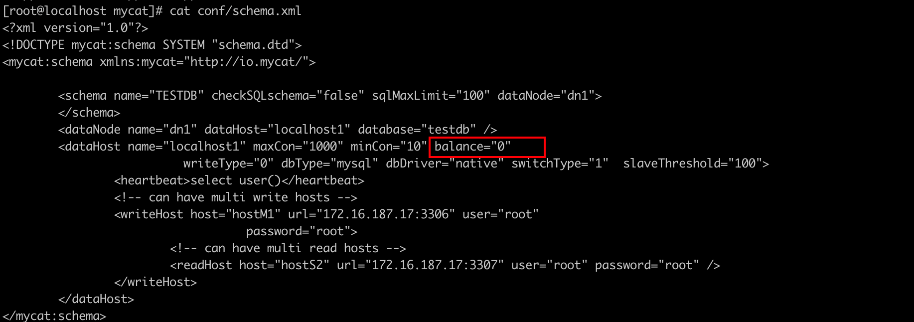

**`正常不是1就是3`**，为了能看到读写分离的效果，把balance设置成2，会在两个主机间随机切换查询

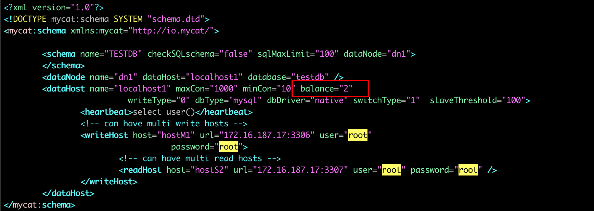

启动mycat，重新连接，验证读写分离

在写主机数据库表mytbl中插入带系统变量数据，造成主从数据不一致

```mysql
INSERT INTO mytbl VALUES(2,@@hostname);
```

在Mycat里查询mytbl表,可以看到查询语句在主从两个主机间切换

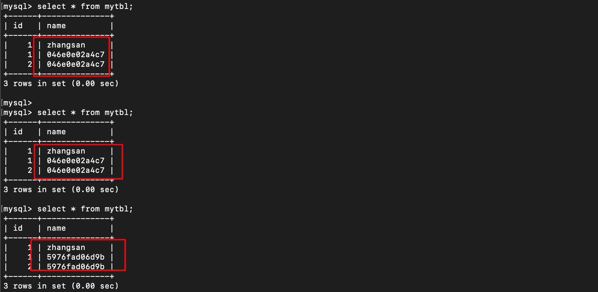

### 双主双从

一个主机m1用于处理所有写请求，它的从机s1和另一台主机m2还有它的从机s2负责所有的读请求。当m1主机宕机之后，m2负责写请求，m1、m2互为备机，如果宕机后，再重启，此时就作为备机。架构如下：

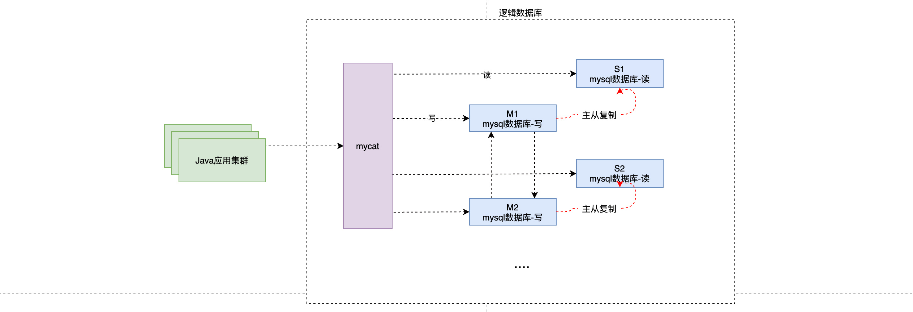

#### MySQL环境搭建

为了能创建出双主双从，我们创建4个docker容器来安装MySQL，还是使用docker-compose来安装

```yaml
version: "3.3"

networks:
  mycat_cluster_network:

services:
  mysql_master_1:
    image: mysql:5.7
    container_name: master_1
    ports:
      - "3306:3306"
    networks:
      - mycat_cluster_network
    volumes:
      - ./master_1/data:/var/lib/mysql
      - ./master_1/conf:/etc/mysql/conf.d
    environment:
      - "MYSQL_ROOT_PASSWORD=123456"
  mysql_master_2:
    image: mysql:5.7
    container_name: master_2
    ports:
      - "3307:3306"
    networks:
      - mycat_cluster_network
    volumes:
      - ./master_2/data:/var/lib/mysql
      - ./master_2/conf:/etc/mysql/conf.d
    environment:
      - "MYSQL_ROOT_PASSWORD=123456"
  mysql_slave_1:
    image: mysql:5.7
    container_name: slave_1
    ports:
      - "3308:3306"
    networks:
      - mycat_cluster_network
    volumes:
      - ./slave_1/data:/var/lib/mysql
      - ./slave_1/conf:/etc/mysql/conf.d
    environment:
      - "MYSQL_ROOT_PASSWORD=123456"
  mysql_slave_2:
    image: mysql:5.7
    container_name: slave_2
    ports:
      - "3309:3306"
    networks:
      - mycat_cluster_network
    volumes:
      - ./slave_2/data:/var/lib/mysql
      - ./slave_2/conf:/etc/mysql/conf.d
    environment:
      - "MYSQL_ROOT_PASSWORD=123456"
```

对应的容器和端口为：

- master_1 3306
- master_2 3307
- slave_1 3308
- slave_2 3309


创建容器

```bash
docker-compose up
## 结果
[root@localhost mycat_cluster]## docker-compose up
Creating network "mycat_cluster_mycat_cluster_network" with the default driver
Creating slave_2  ... done
Creating master_2 ... done
Creating slave_1  ... done
Creating master_1 ... done
Attaching to master_1, slave_2, master_2, slave_1
```

执行完之后，会帮我们创建挂载的目录，将基础配置文件my.cnf添加到指定的conf目录下

```bash
[mysqld]
user=mysql
character-set-server=utf8
default_authentication_plugin=mysql_native_password

[client]
default-character-set=utf8

[mysql]
default-character-set=utf8
```

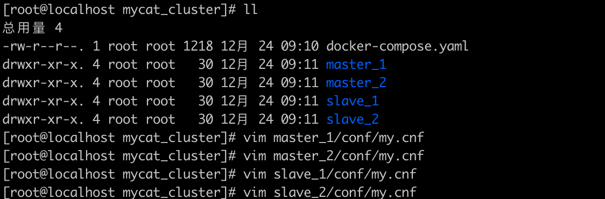

#### 搭建双主双从

##### 修改配置文件`conf/my.cnf`

1. msater_1

```bash
## 主服务器唯一ID
server-id=1
## 启用二进制日志
log-bin=mysql-bin
## 设置不要复制的数据库(可设置多个)
binlog-ignore-db=mysql
binlog-ignore-db=information_schema
## 设置需要复制的数据库
binlog-do-db=testdb
## 设置logbin格式
binlog_format=STATEMENT
## 在作为从数据库的时候，有写入操作也要更新二进制日志文件
log-slave-updates 
## 表示自增长字段从哪个数开始，指自增字段的起始值，其默认值是1，取值范围是1 .. 65535
auto-increment-increment=2
## 表示自增长字段每次递增的量，指字段一次递增多少，他的取值范围是1 .. 65535
auto-increment-offset=1
```

2. master_2

```bash
## 主服务器唯一ID
server-id=2
## 启用二进制日志
log-bin=mysql-bin
## 设置不要复制的数据库(可设置多个)
binlog-ignore-db=mysql
binlog-ignore-db=information_schema
#设置需要复制的数据库
binlog-do-db=testdb
#设置logbin格式
binlog_format=STATEMENT
## 在作为从数据库的时候，有写入操作也要更新二进制日志文件
log-slave-updates 
## 表示自增长字段从哪个数开始，指自增字段的起始值，其默认值是1，取值范围是1 .. 65535
auto-increment-increment=2 
## 表示自增长字段每次递增的量，指字段一次递增多少，他的取值范围是1 .. 65535
auto-increment-offset=2
```

3. slave_1

```bash
## 从服务器唯一ID
server-id=3
## 启用中继日志
relay-log=mysql-relay
```

4. slave_2

```bash
## 从服务器唯一ID
server-id=4
## 启用中继日志
relay-log=mysql-relay
```

##### 重启服务并配置

1. 双主机、双从机重启 mysql 服务，在两台主机上建立帐户并授权 slave

```mysql
## 在主机MySQL里执行授权命令
GRANT REPLICATION SLAVE ON *.* TO 'slave'@'%' IDENTIFIED BY '123456';
#查询Master_1的状态
show master status;
```

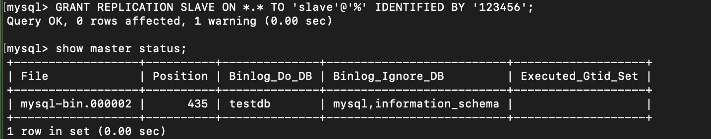

```mysql
## 在主机MySQL里执行授权命令
GRANT REPLICATION SLAVE ON *.* TO 'slave'@'%' IDENTIFIED BY '123456';
#查询Master_2的状态
show master status;
```

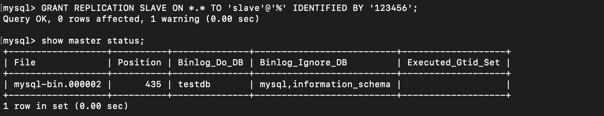

分别记录下File和Position的值，执行完此步骤后不要再操作主服务器MYSQL，防止主服务器状态值变化

2. 在从机上配置需要复制的主机

slava_1 复制 Master1，slava_2 复制 master_2

```mysql
## 复制主机的命令
CHANGE MASTER TO MASTER_HOST='172.16.187.1',
MASTER_USER='slave',
MASTER_PASSWORD='123456',
MASTER_LOG_FILE='mysql-bin.000002',MASTER_LOG_POS=435;
```

启动两台从服务器复制功能

```mysql
start slave;
```

查看从服务器状态

```mysql
show slave status\G;
```

##### 两个主机互相复制

Master2 复制 Master1，Master1 复制 Master2，使用的命令还是从机复制主机的命令

slava_1 复制 Master1，slava_2 复制 master_2

```mysql
## 复制主机的命令
CHANGE MASTER TO MASTER_HOST='172.16.187.1',
MASTER_USER='slave',
MASTER_PASSWORD='123456',
MASTER_LOG_FILE='mysql-bin.000002',MASTER_LOG_POS=435;
```

启动两台主服务器复制功能

```mysql
start slave;
```

查看从服务器状态

```mysql
show slave status\G;
```

#### 测试

##### 主从复制

分别对master_1、slave_1 和master_2、slave_2测试

Master1 主机新建库、新建表、insert 记录，Master2 和从机复制


##### 验证mycat

修改schema.xml，为了双主双从读写分离balance设置为1，并添加主机

```xml
<dataNode name="dn1" dataHost="host1" database="testdb" />
<dataHost name="host1" maxCon="1000" minCon="10" balance="1" writeType="0" dbType="mysql" dbDriver="native" switchType="1"  slaveThreshold="100" >
	<heartbeat>select user()</heartbeat>
	<!-- can have multi write hosts -->
	<writeHost host="hostM1" url="172.16.187.17:3306" user="root" password="123456">
		<!-- can have multi read hosts -->
		<readHost host="hostS1" url="172.16.187.17:3308" user="root" password="123456" />
	</writeHost>
	<writeHost host="hostM2" url="172.16.187.17:3307" user="root" password="123456">
		<!-- can have multi read hosts -->
		<readHost host="hostS2" url="172.16.187.17:3309" user="root" password="123456" />
	</writeHost>
</dataHost>
```


启动mycat，验证读写分离

在写主机Master1数据库表mytbl中插入带系统变量数据，造成主从数据不一致

```mysql
INSERT INTO mytbl VALUES(3,@@hostname);
```


#####  抗风险能力

停止数据库Master1，在Mycat里插入数据依然成功，Master2自动切换为写主机

```mysql
INSERT INTO mytbl VALUES(3,@@hostname);
```

启动数据库Master1，Master1、Master2 互做备机，负责写的主机宕机，备机切换负责写操作，保证数据库读写分离高可用性。

#### 其他命令

如何停止从服务复制功能

```mysql
stop slave;
```

如何重新配置主从

```mysql
stop slave; 
reset master;
```

## 垂直拆分-分库

一个数据库由很多的表构成，每个表对应着不同的业务，垂直切分是指按照业务将表进行分类，分布到不同的数据库上面，这样也就将数据或者压力分担到不同的库上面，如下图：

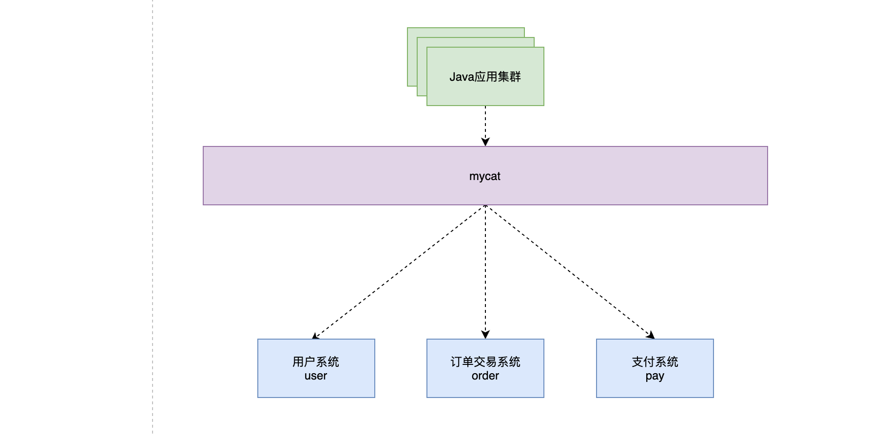

系统被切分成用户、订单交易、支付几个模块

### 如何划分表

一个问题：在两台主机上的两个数据库中的表，能否关联查询？不可以

分库的原则：有紧密关联关系的表应该在一个库中，互相没有关联关系的表可以分到不同的库里

```mysql
## 客户表 假设已经有rows:20万
CREATE TABLE customer(
  id INT AUTO_INCREMENT,
  NAME VARCHAR(200),
  PRIMARY KEY(id)
);
## 订单表 假设已经有rows:600万
CREATE TABLE orders(
  id INT AUTO_INCREMENT,
  order_type INT,
  customer_id INT,
  amount DECIMAL(10,2),
  PRIMARY KEY(id)
); 
## 订单详细表 假设已经有rows:600万
CREATE TABLE orders_detail(
  id INT AUTO_INCREMENT,
  detail VARCHAR(2000),
  order_id INT,
  PRIMARY KEY(id)
);
## 订单状态字典表 假设已经有rows:20
CREATE TABLE dict_order_type(
  id INT AUTO_INCREMENT,
  order_type VARCHAR(200),
  PRIMARY KEY(id)
);
```

以上四个表如何分库？客户表分在一个数据库，另外三个都需要关联查询，分在另外一个库中

### 实现分库

1. 修改schema.xml配置文件

```xml
<!-- dataNode="dn1"指定默认的表存储位置是dn1节点，然后customer这个表特殊指定存储在dn2这个节点上 -->
<schema name="TESTDB" checkSQLschema="false" sqlMaxLimit="100" dataNode="dn1">
	<table name="customer" dataNode="dn2" ></table>
</schema>
<!-- 设定两个表的数据库名称都是orders，这里的orders只是库名，并不代指订单表 -->
<dataNode name="dn1" dataHost="host1" database="orders" />
<dataNode name="dn2" dataHost="host2" database="orders" />
<!-- 配置数据主机 -->
<dataHost name="host1" maxCon="1000" minCon="10" balance="0" writeType="0" dbType="mysql" dbDriver="native" switchType="1"  slaveThreshold="100">
	<heartbeat>select user()</heartbeat>
	<!-- can have multi write hosts -->
	<writeHost host="hostM1" url="172.16.187.17:3306" user="root" password="123456"></writeHost>
</dataHost>
<dataHost name="host2" maxCon="1000" minCon="10" balance="0" writeType="0" dbType="mysql" dbDriver="native" switchType="1"  slaveThreshold="100">
	<heartbeat>select user()</heartbeat>
	<!-- can have multi write hosts -->
	<writeHost host="hostM2" url="172.16.187.17:3307" user="root" password="123456"></writeHost>
</dataHost>
```

2. 新增两个空白库

分库操作不是在原来的老数据库上进行操作，需要准备两台机器分别安装新的数据库

```mysql
## 在数据节点 dn1、dn2 上分别创建数据库 orders
CREATE DATABASE orders;
```

3. 启动mycat

```bash
./mycat console
```

4. 访问mycat进行分库

```mysql
## 访问 Mycat
mysql -umycat -p123456 -h 172.16.187.19 -P 8066
```

切换到 TESTDB

```mysql
use TESTDB;
```

创建 4 张表

```mysql
## 客户表 假设已经有rows:20万
CREATE TABLE customer(
  id INT AUTO_INCREMENT,
  NAME VARCHAR(200),
  PRIMARY KEY(id)
);
## 订单表 假设已经有rows:600万
CREATE TABLE orders(
  id INT AUTO_INCREMENT,
  order_type INT,
  customer_id INT,
  amount DECIMAL(10,2),
  PRIMARY KEY(id)
); 
## 订单详细表 假设已经有rows:600万
CREATE TABLE orders_detail(
  id INT AUTO_INCREMENT,
  detail VARCHAR(2000),
  order_id INT,
  PRIMARY KEY(id)
);
## 订单状态字典表 假设已经有rows:20
CREATE TABLE dict_order_type(
  id INT AUTO_INCREMENT,
  order_type VARCHAR(200),
  PRIMARY KEY(id)
);
```

查看表信息，可以看到成功分库

```markdown
我们在mycat上查询`show tables`，得出四张表，但是在dn1上查询只有`dict_order_type`、`orders_detail`、`orders`，而`customer`在dn2上
```

也就是说：在mycat上执行语句，当如果是拦截到的表是`dict_order_type`、`orders_detail`、`orders`的时候会转发给dn1，如果是`customer`会转发给dn2

## 水平拆分-分表

相对于垂直拆分，水平拆分不是将表做分类，而是按照某个字段的某种规则来分散到多个库之中，每个表中 包含一部分数据。简单来说，我们可以将数据的水平切分理解为是按照数据行的切分，就是将表中的某些行切分到一个数据库，而另外的某些行又切分到其他的数据库中，如图：

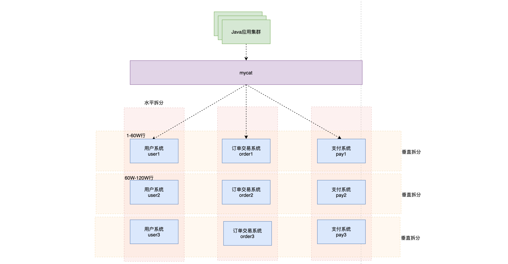

### 实现分表

1. 选择要拆分的表

MySQL单表存储数据库条数是有瓶颈的，单表达到1000万条数据就达到了瓶颈，会影响查询的效率，需要进行水平拆分（分表）进行优化

例如：例子中的orders、order_detail都已经达到了600万行数据，需要进行分表优化

2. 分表字段

以orders表为例，可以根据不同的字段进行分表

| 编号 | 分表字段                | 效果                                                         |
| ---- | ----------------------- | ------------------------------------------------------------ |
| 1    | id （主键、或创建时间） | 查询订单注重时效，历史订单被查询的次数少，如此分片会造成一个节点访问多，一个访问少，不平均 |
| 2    | customer_id（客户id）   | 根据客户id去分，两个节点访问平均，一个客户所有订单都在一个节点 |

3. 修改schema.xml配置文件

为 orders 表设置数据节点为 dn1、dn2，并指定分片规则为 mod_rule（自定义的名字）

```xml
<table name="orders" dataNode="dn1,dn2" rule="mod_rule" ></table>
```

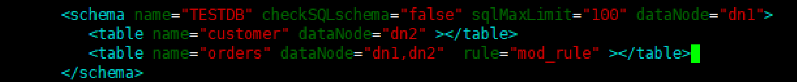

4. 修改rule.xml配置文件

在 rule 配置文件里新增分片规则 `mod_rule`，并指定规则适用字段为 `customer_id`，还有选择分片算法 `mod-long`（对字段求模运算），`customer_id` 对两个节点求模，根据结果分片，配置算法 `mod-long` 参数 count 为 2，两个节点

```xml
<tableRule name="mod_rule">
  <rule>
    <columns>customer_id</columns>
    <algorithm>mod-long</algorithm>
  </rule>
</tableRule>
…
<function name="mod-long" class="io.mycat.route.function.PartitionByMod">
  <!-- how many data nodes -->
  <property name="count">2</property>
</function>
```

5. 在数据节点`dn2`上建`orders` 表，重启 `Mycat`，让配置生效

```mysql
CREATE TABLE orders(
  id INT AUTO_INCREMENT,
  order_type INT,
  customer_id INT,
  amount DECIMAL(10,2),
  PRIMARY KEY(id)
); 
```

6. 访问Mycat实现分片

在 mycat 里向 orders 表插入数据，INSERT 字段不能省略

```mysql
INSERT INTO orders(id,order_type,customer_id,amount) VALUES (1,101,100,100100);
INSERT INTO orders(id,order_type,customer_id,amount) VALUES(2,101,100,100300);
INSERT INTO orders(id,order_type,customer_id,amount) VALUES(3,101,101,120000);
INSERT INTO orders(id,order_type,customer_id,amount) VALUES(4,101,101,103000);
INSERT INTO orders(id,order_type,customer_id,amount) VALUES(5,102,101,100400);
INSERT INTO orders(id,order_type,customer_id,amount) VALUES(6,102,100,100020);
```

在mycat、dn1、dn2中查看orders表数据，分表成功

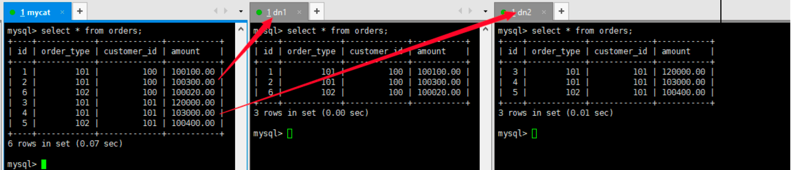

### mycat的分片

"join"

Orders 订单表已经进行分表操作了，和它关联的 orders_detail 订单详情表如何进行 join 查询，我们要对 orders_detail 也要进行分片操作。Join 的原理如下图： 

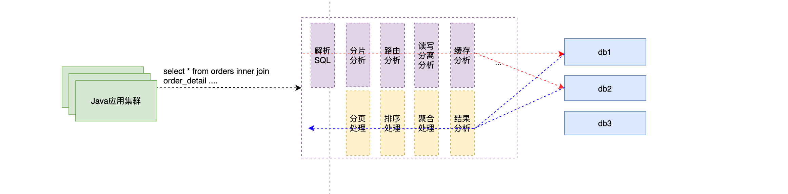

1. ER表

Mycat 借鉴了 NewSQL 领域的新秀 Foundation DB 的设计思路，Foundation DB 创新性的提出了 Table Group 的概念，其将子表的存储位置依赖于主表，并且物理上紧邻存放，因此彻底解决了JION 的效率和性能问题，根据这一思路，提出了基于 E-R 关系的数据分片策略，子表的记录与所关联的父表记录存放在同一个数据分片上

修改 schema.xml 配置文件

```xml
<table name="orders" dataNode="dn1,dn2" rule="mod_rule" >
	<childTable name="orders_detail" primaryKey="id" joinKey="order_id" parentKey="id" />
</table>
```

在 dn2 创建 orders_detail 表

重启 Mycat

访问 Mycat 向 orders_detail 表插入数据

```mysql
INSERT INTO orders_detail(id,detail,order_id) values(1,'detail1',1);
INSERT INTO orders_detail(id,detail,order_id) VALUES(2,'detail1',2);
INSERT INTO orders_detail(id,detail,order_id) VALUES(3,'detail1',3);
INSERT INTO orders_detail(id,detail,order_id) VALUES(4,'detail1',4);
INSERT INTO orders_detail(id,detail,order_id) VALUES(5,'detail1',5);
INSERT INTO orders_detail(id,detail,order_id) VALUES(6,'detail1',6);
```

在mycat、dn1、dn2中运行两个表join语句

```mysql
select o.*,od.detail from orders o inner join orders_detail od on o.id=od.order_id;
```

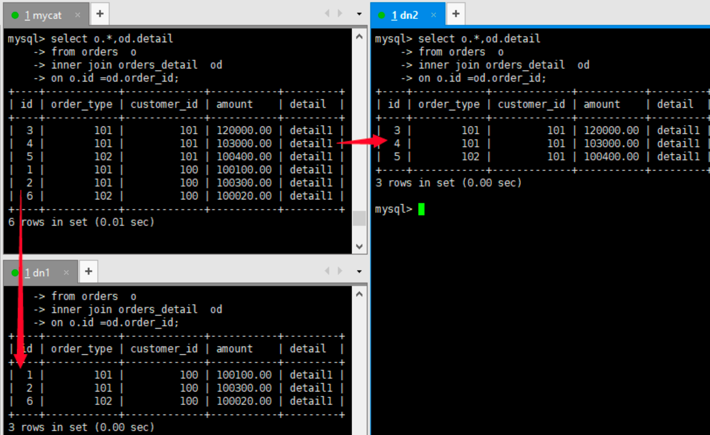

2. 全局表

在分片的情况下，当业务表因为规模而进行分片以后，业务表与这些附属的字典表之间的关联，就成了比较棘手的问题，考虑到字典表具有以下几个特性：

- 变动不频繁

- 数据量总体变化不大

- 数据规模不大，很少有超过数十万条记录

鉴于此，Mycat 定义了一种特殊的表，称之为“全局表”，全局表具有以下特性：

- 全局表的插入、更新操作会实时在所有节点上执行，保持各个分片的数据一致性

- 全局表的查询操作，只从一个节点获取

- 全局表可以跟任何一个表进行 JOIN 操作

将字典表或者符合字典表特性的一些表定义为全局表，则从另外一个方面，很好的解决了数据JOIN 的难题。通过全局表+基于 E-R 关系的分片策略，Mycat 可以满足 80%以上的企业应用开发

修改 schema.xml 配置文件

```xml
<table name="orders" dataNode="dn1,dn2" rule="mod_rule" >
	<childTable name="orders_detail" primaryKey="id" joinKey="order_id" parentKey="id" />
</table>
<table name="dict_order_type" dataNode="dn1,dn2" type="global" ></table>
```

在 dn2 创建 dict_order_type 表 

重启 Mycat

访问 Mycat 向 dict_order_type 表插入数据

```mysql
INSERT INTO dict_order_type(id,order_type) VALUES(101,'type1');
INSERT INTO dict_order_type(id,order_type) VALUES(102,'type2');
```

在Mycat、dn1、dn2中查询表数据

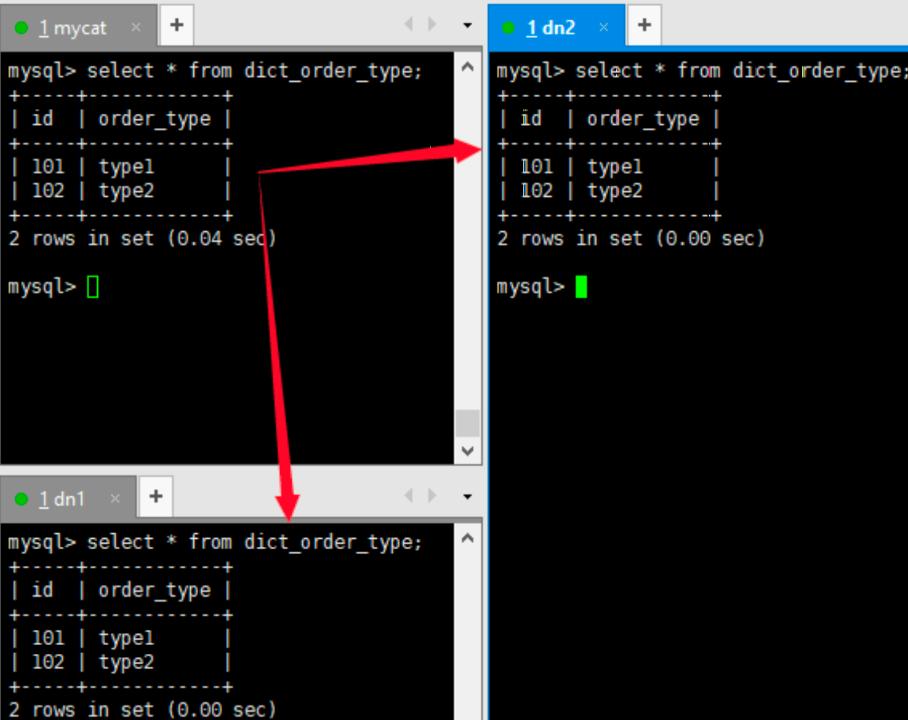

### 常用的分片规则

#### 取模

此规则为对分片字段求摸运算。也是水平分表最常用规则。5.1 配置分表中，orders 表采用了此规则

#### 分片枚举

通过在配置文件中配置可能的枚举 id，自己配置分片，本规则适用于特定的场景，比如有些业务需要按照省份或区县来做保存，而全国省份区县固定的，这类业务使用本条规则

1. 修改schema.xml配置文件

```xml
<table name="orders_ware_info" dataNode="dn1,dn2" rule="sharding_by_intfile" ></table>
```

2. 修改rule.xml配置文件

```xml
<tableRule name="sharding_by_intfile">
  <rule>
    <columns>areacode</columns>
    <algorithm>hash-int</algorithm>
  </rule>
</tableRule>
<function name="hash-int" class="io.mycat.route.function.PartitionByFileMap">
  <property name="mapFile">partition-hash-int.txt</property>
  <property name="type">1</property>
  <property name="defaultNode">0</property>
</function>
```

rule

- columns：分片字段
- algorithm：分片函数

function

- mapFile：标识配置文件名称
- type：0为int型、非0为String
- defaultNode：默认节点:小于 0 表示不设置默认节点，大于等于 0 表示设置默认节点，设置默认节点如果碰到不识别的枚举值，就让它路由到默认节点，如不设置不识别就报错

3. 修改partition-hash-int.txt配置文件

```
110=0
120=1
```

4. 重启 Mycat
5. 访问Mycat创建表

订单归属区域信息表

```mysql
CREATE TABLE orders_ware_info
(
  `id` INT AUTO_INCREMENT comment '编号',
  `order_id` INT comment '订单编号',
  `address` VARCHAR(200) comment '地址',
  `areacode` VARCHAR(20) comment '区域编号',
  PRIMARY KEY(id)
);
```

6. 插入数据

```mysql
INSERT INTO orders_ware_info(id, order_id,address,areacode) VALUES (1,1,'北京','110');
INSERT INTO orders_ware_info(id, order_id,address,areacode) VALUES (2,2,'天津','120');
```

7. 查询Mycat、dn1、dn2可以看到数据分片效果

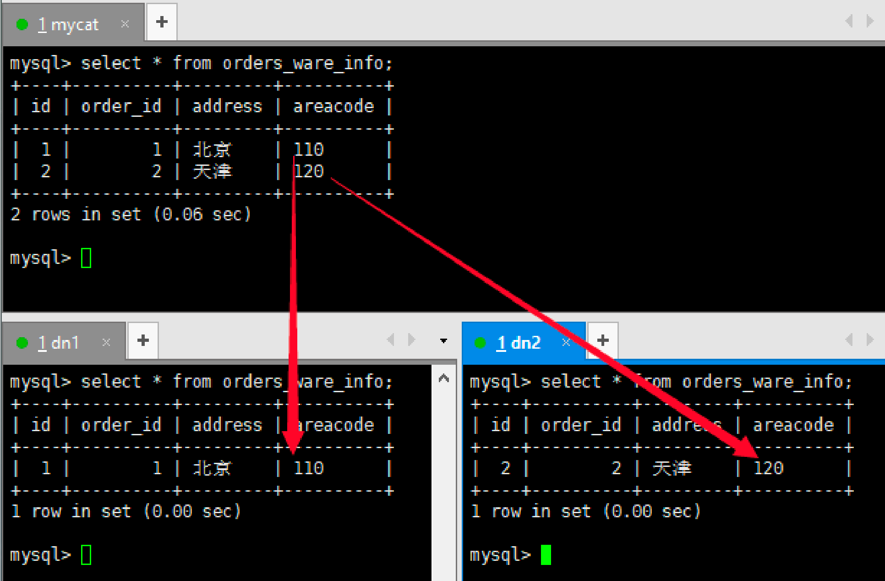

#### 范围约定

此分片适用于，提前规划好分片字段某个范围属于哪个分片

1. 修改schema.xml配置文件

```xml
<table name="payment_info" dataNode="dn1,dn2" rule="auto_sharding_long" ></table>
```

2. 修改rule.xml配置文件

```xml
<tableRule name="auto_sharding_long">
  <rule>
    <columns>order_id</columns>
    <algorithm>rang-long</algorithm>
  </rule>
</tableRule>
…
<function name="rang-long" class="io.mycat.route.function.AutoPartitionByLong">
  <property name="mapFile">autopartition-long.txt</property>
  <property name="defaultNode">0</property>
</function>
```

3. 修改autopartition-long.txt配置文件

```
0-102=0
103-200=1
```

4. 重启 Mycat
5. 访问Mycat创建表

支付信息表

```mysql
CREATE TABLE payment_info
(
  `id` INT AUTO_INCREMENT comment '编号',
  `order_id` INT comment '订单编号',
  `payment_status` INT comment '支付状态',
  PRIMARY KEY(id)
);
```

6. 插入数据

```mysql
INSERT INTO payment_info (id,order_id,payment_status) VALUES (1,101,0);
INSERT INTO payment_info (id,order_id,payment_status) VALUES (2,102,1);
INSERT INTO payment_info (id,order_id ,payment_status) VALUES (3,103,0);
INSERT INTO payment_info (id,order_id,payment_status) VALUES (4,104,1);
```

7. 查询Mycat、dn1、dn2可以看到数据分片效果

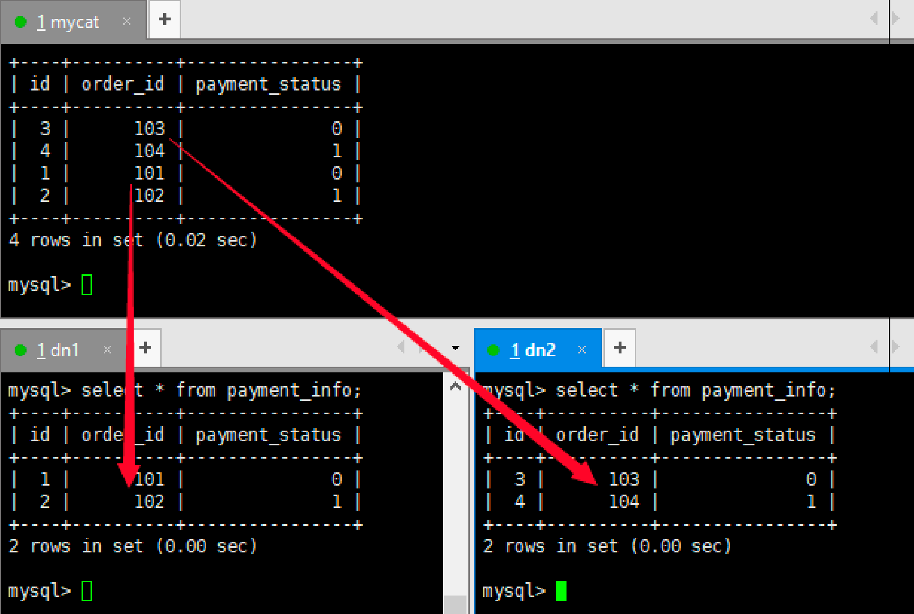

#### 按日期（天）分片

此规则为按天分片。设定时间格式、范围

1. 修改schema.xml配置文件

```xml
<table name="login_info" dataNode="dn1,dn2" rule="sharding_by_date" ></table>
```

2. 修改rule.xml配置文件

```xml
<tableRule name="sharding_by_date">
	<rule>
		<columns>login_date</columns>
		<algorithm>shardingByDate</algorithm>
	</rule>
</tableRule>
…
<function name="shardingByDate" class="io.mycat.route.function.PartitionByDate">
	<property name="dateFormat">yyyy-MM-dd</property> <property name="sBeginDate">2019-01-01</property>
	<property name="sEndDate">2019-01-04</property>
  <property name="sPartionDay">2</property> 
</function>
```

- dateFormat ：日期格式
- sBeginDate ：开始日期
- sEndDate：结束日期,则代表数据达到了这个日期的分片后循环从开始分片插入
- sPartionDay ：分区天数，即默认从开始日期算起，分隔 2 天一个分区

3. 重启 Mycat
4. 访问Mycat创建表

用户信息表

```mysql
CREATE TABLE login_info
(
  `id` INT AUTO_INCREMENT comment '编号',
  `user_id` INT comment '用户编号',
  `login_date` date comment '登录日期',
  PRIMARY KEY(id)
);
```

6. 插入数据

```mysql
INSERT INTO login_info(id,user_id,login_date) VALUES (1,101,'2019-01-01');
INSERT INTO login_info(id,user_id,login_date) VALUES (2,102,'2019-01-02');
INSERT INTO login_info(id,user_id,login_date) VALUES (3,103,'2019-01-03');
INSERT INTO login_info(id,user_id,login_date) VALUES (4,104,'2019-01-04');
INSERT INTO login_info(id,user_id,login_date) VALUES (5,103,'2019-01-05');
INSERT INTO login_info(id,user_id,login_date) VALUES (6,104,'2019-01-06');
```

7. 查询Mycat、dn1、dn2可以看到数据分片效果

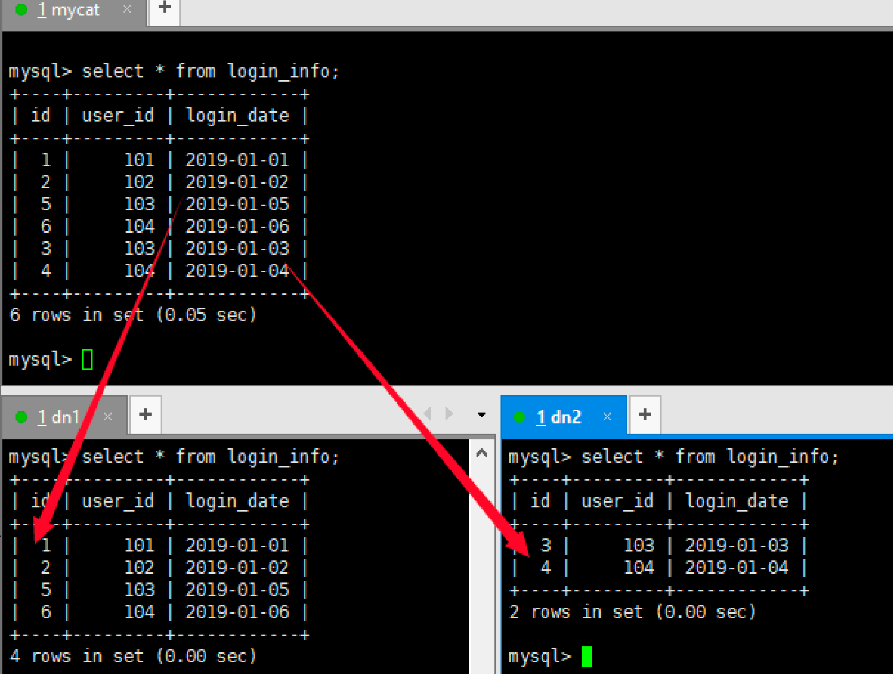

### 全局序列

在实现分库分表的情况下，数据库自增主键已无法保证自增主键的全局唯一。为此，Mycat 提供了全局 sequence，并且提供了包含本地配置和数据库配置等多种实现方式

#### 本地文件

此方式 Mycat 将 sequence 配置到文件中，当使用到 sequence 中的配置后，Mycat 会更下classpath 中的 sequence_conf.properties 文件中 sequence 当前的值

- 优点：本地加载，读取速度较快
- 缺点：抗风险能力差，Mycat 所在主机宕机后，无法读取本地文件

#### 数据库方式

利用数据库一个表 来进行计数累加。但是并不是每次生成序列都读写数据库，这样效率太低。Mycat 会预加载一部分号段到 Mycat 的内存中，这样大部分读写序列都是在内存中完成的。如果内存中的号段用完了 Mycat 会再向数据库要一次

问：那如果 Mycat 崩溃了 ，那内存中的序列岂不是都没了？

是的。如果是这样，那么 Mycat 启动后会向数据库申请新的号段，原有号段会弃用。也就是说如果 Mycat 重启，那么损失是当前的号段没用完的号码，但是不会因此出现主键重复

1. 建库序列脚本

在 dn1 上创建全局序列表

```mysql
CREATE TABLE MYCAT_SEQUENCE (NAME VARCHAR(50) NOT NULL,current_value INT NOT NULL,increment INT NOT NULL DEFAULT 100, PRIMARY KEY(NAME)) ENGINE=INNODB;
```

创建全局序列所需函数

```mysql
DELIMITER $$ 
CREATE FUNCTION mycat_seq_currval(seq_name VARCHAR(50)) RETURNS VARCHAR(64)
DETERMINISTIC 
BEGIN
DECLARE retval VARCHAR(64);
SET retval="-999999999,null";
SELECT CONCAT(CAST(current_value AS CHAR),",",CAST(increment AS CHAR)) INTO retval FROM
MYCAT_SEQUENCE WHERE NAME = seq_name;
RETURN retval;
END $$
DELIMITER ;
DELIMITER $$
CREATE FUNCTION mycat_seq_setval(seq_name VARCHAR(50),VALUE INTEGER) RETURNS 
VARCHAR(64)
DETERMINISTIC
BEGIN
UPDATE MYCAT_SEQUENCE
SET current_value = VALUE
WHERE NAME = seq_name;
RETURN mycat_seq_currval(seq_name);
END $$
DELIMITER ;
DELIMITER $$
CREATE FUNCTION mycat_seq_nextval(seq_name VARCHAR(50)) RETURNS VARCHAR(64) 
DETERMINISTIC
BEGIN
UPDATE MYCAT_SEQUENCE
SET current_value = current_value + increment WHERE NAME = seq_name;
RETURN mycat_seq_currval(seq_name);
END $$
DELIMITER ;
```

初始化序列表记录

```mysql
INSERT INTO MYCAT_SEQUENCE(NAME,current_value,increment) VALUES ('ORDERS', 400000,100);
```

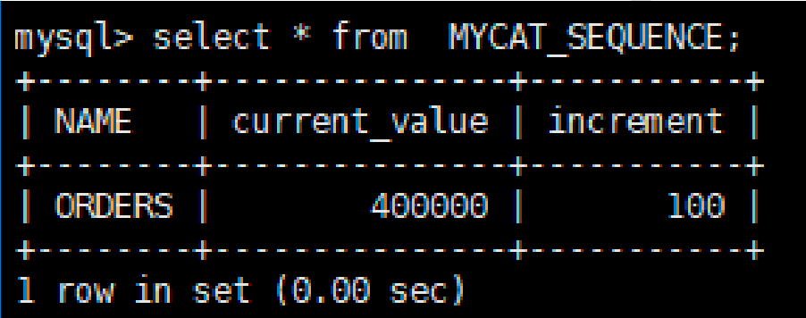

2. 修改 Mycat 配置

修改sequence_db_conf.properties 

```bash
vim sequence_db_conf.properties
```

意思是 ORDERS这个序列在dn1这个节点上，具体dn1节点是哪台机子，请参考schema.xml

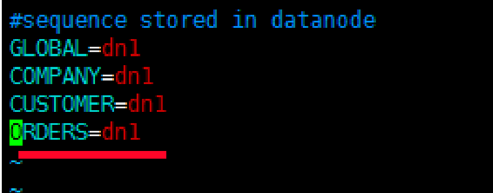

修改server.xml

```mysql
vim server.xml
```

全局序列类型：0-本地文件，1-数据库方式，2-时间戳方式。此处应该修改成1


重启Mycat

3. 验证全局序列

登录 Mycat，插入数据

```mysql
insert into orders(id,amount,customer_id,order_type) values(next value for MYCATSEQ_ORDERS,1000,101,102);
```

查询数据

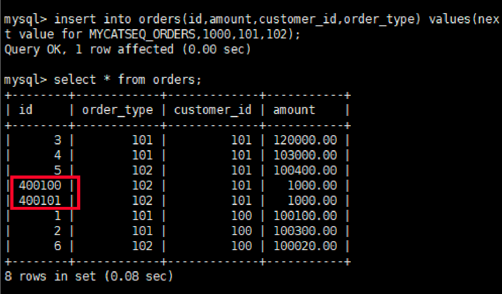

重启Mycat后，再次插入数据，再查询

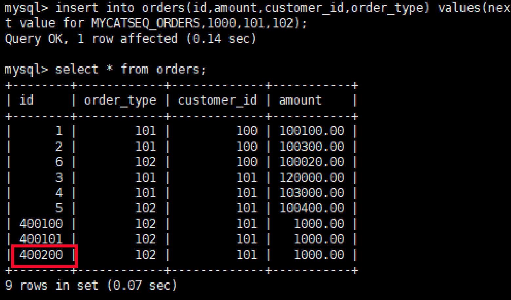

#### 时间戳方式

全局序列ID= 64 位二进制 (42(毫秒)+5(机器 ID)+5(业务编码)+12(重复累加) 换算成十进制为 18 位数的long 类型，每毫秒可以并发 12 位二进制的累加

- 优点：配置简单
- 缺点：18 位 ID 过长

#### 自主生成全局序列

可在 java 项目里自己生成全局序列，如下： 

- 根据业务逻辑组合
- 可以利用 redis 的单线程原子性 incr 来生成序列

但，自主生成需要单独在工程中用 java 代码实现，还是推荐使用 Mycat 自带全局序列

## 基于HA机制的mycat高可用

在实际项目中，Mycat 服务也需要考虑高可用性，如果 Mycat 所在服务器出现宕机，或 Mycat 服务故障，需要有备机提供服务，需要考虑 Mycat 集群

### 高可用方案

我们可以使用 HAProxy + Keepalived 配合两台 Mycat 搭起 Mycat 集群，实现高可用性。HAProxy 实现了 MyCat 多节点的集群高可用和负载均衡，而 HAProxy 自身的高可用则可以通过 Keepalived 来实现

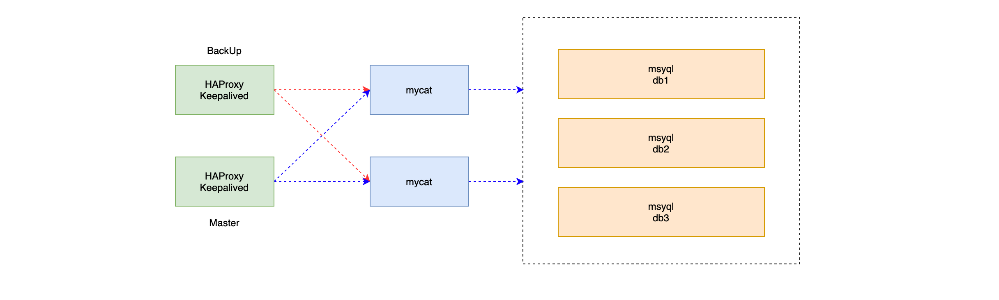

| 编号 | 角色                 | IP              | 地址   |
| ---- | -------------------- | --------------- | ------ |
| 1    | Mycat1               | 192.168.140.128 | host79 |
| 2    | Mycat2               | 192.168.140.127 | host80 |
| 3    | HAProxy（master）    | 192.168.140.126 | host81 |
| 4    | Keepalived（master） | 192.168.140.126 | host81 |
| 5    | HAProxy（backup）    | 192.168.140.125 | host82 |
| 6    | Keepalived（backup） | 192.168.140.125 | host82 |

### 安装配置HAProxy

#### 安装HAPorxy

1. 准备好HAProxy安装包，传到/opt目录下

使用scp命令

2. 解压到/usr/local/src

```bash
tar -zxvf haproxy-1.5.18.tar.gz -C /usr/local/src
```

3. 进入解压后的目录，查看内核版本，进行编译

```bash
cd /usr/local/src/haproxy-1.5.18
uname -r
make TARGET=linux310 PREFIX=/usr/local/haproxy ARCH=x86_64
## ARGET=linux310，内核版本，使用uname -r查看内核，如：3.10.0-514.el7，此时该参数就为linux310
## ARCH=x86_64，系统位数
## PREFIX=/usr/local/haprpxy #/usr/local/haprpxy，为haprpxy安装路径
```

4. 编译完成后，进行安装

```bash
make install PREFIX=/usr/local/haproxy
```

5. 安装完成后，创建目录、创建HAProxy配置文件

```bash
mkdir -p /usr/data/haproxy/
vim /usr/local/haproxy/haproxy.conf
```

6. 向配置文件中插入以下配置信息,并保存

```conf
global
  log 127.0.0.1 local0
  #log 127.0.0.1 local1 notice
  #log loghost local0 info
  maxconn 4096
  chroot /usr/local/haproxy
  pidfile /usr/data/haproxy/haproxy.pid
  uid 99
  gid 99
  daemon
  #debug
  #quiet
defaults
	log global
	mode tcp
  option abortonclose
  option redispatch
  retries 3
  maxconn 2000
  timeout connect 5000
  timeout client 50000
  timeout server 50000
listen proxy_status 
	bind :48066
    mode tcp
    balance roundrobin
    server mycat_1 192.168.140.128:8066 check inter 10s
    server mycat_2 192.168.140.127:8066 check inter 10s
    frontend admin_stats 
    bind :7777
    mode http
    stats enable
    option httplog
    maxconn 10
    stats refresh 30s
    stats uri /admin
    stats auth admin:123123
    stats hide-version
    stats admin if TRUE
```

#### 启动验证

1. 启动HAProxy

```bash
/usr/local/haproxy/sbin/haproxy -f /usr/local/haproxy/haproxy.conf
```

2. 查看HAProxy进程

```bash
ps -ef|grep haproxy
```

3. 打开浏览器访问

```http
http://192.168.140.125:7777/admin
```

在弹出框输入用户名：admin密码：123123

如果Mycat主备机均已启动，则可以看到如下图

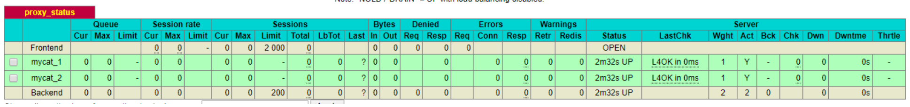

4. 验证负载均衡，通过HAProxy访问Mycat

```bash
mysql -umycat -p123456 -h 192.168.140.126 -P 48066
```

### 配置Keepalived

#### 安装Keepalive

1. 准备好Keepalived安装包，传到/opt目录下

2. 解压到/usr/local/src

```bash
tar -zxvf keepalived-1.4.2.tar.gz -C /usr/local/src
```

3. 安装依赖插件

```bash
yum install -y gcc openssl-devel popt-devel
```

4. 进入解压后的目录，进行配置，进行编译

```bash
cd /usr/local/src/keepalived-1.4.2
./configure --prefix=/usr/local/keepalived
```

5. 进行编译，完成后进行安装

```bash
make && make install
```

6. 运行前配置

```bash
cp /usr/local/src/keepalived-1.4.2/keepalived/etc/init.d/keepalived /etc/init.d/
mkdir /etc/keepalived
cp /usr/local/keepalived/etc/keepalived/keepalived.conf /etc/keepalived/
cp /usr/local/src/keepalived-1.4.2/keepalived/etc/sysconfig/keepalived /etc/sysconfig/
cp /usr/local/keepalived/sbin/keepalived /usr/sbin/
```

7. 修改配置文件

```bash
vim /etc/keepalived/keepalived.conf
```

修改如下配置

```bash
#修改内容如下
! Configuration File for keepalived
global_defs {
  notification_email {
  	xlcocoon@foxmail.com
  }
  notification_email_from keepalived@showjoy.com
  smtp_server 127.0.0.1
  smtp_connect_timeout 30
  router_id LVS_DEVEL
  vrrp_skip_check_adv_addr
  vrrp_garp_interval 0
  vrrp_gna_interval 0
}
vrrp_instance VI_1 {
  #主机配MASTER，备机配BACKUP
  state MASTER
  #所在机器网卡
  interface ens33
  virtual_router_id 51
  #数值越大优先级越高
  priority 100
  advert_int 1
  authentication {
    auth_type PASS
    auth_pass 1111
  }
  virtual_ipaddress {
    #虚拟IP
    192.168.140.200
  }
}
virtual_server 192.168.140.200 48066 {
  delay_loop 6
  lb_algo rr
  lb_kind NAT
  persistence_timeout 50
  protocol TCP
  real_server 192.168.140.125 48066 {
    weight 1
    TCP_CHECK {
      connect_timeout 3
      retry 3
      delay_before_retry 3
    }
  }
  real_server 192.168.140.126 48600 {
    weight 1
    TCP_CHECK {
      connect_timeout 3
      nb_get_retry 3
      delay_before_retry 3
    }
  }
}
```

#### 启动验证

1. 启动Keepalived

```bash
service keepalived start
```

2. 登录验证

```bash
mysql -umycat -p123456 -h 192.168.140.200 -P 48066
```

### 测试高可用

1. 关闭mycat

关闭其中一个mycat，测试能否在宕机的情况下实现高可用

2. 通过虚拟IP查询数据

```bash
mysql -umycat -p123456 -h 192.168.140.200 -P 48066
```

## mycat安全设置

### 权限配置

#### user标签权限控制

目前 Mycat 对于中间件的连接控制并没有做太复杂的控制，目前只做了中间件逻辑库级别的读写权限控制。是通过 server.xml 的 user 标签进行配置

```xml
#server.xml配置文件user部分
<user name="mycat">
  <property name="password">123456</property>
  <property name="schemas">TESTDB</property>
</user>
<user name="user">
  <property name="password">user</property>
  <property name="schemas">TESTDB</property>
  <property name="readOnly">true</property>
</user>
```

##### 配置说明

| 标签属性 | 说明                                                         |
| -------- | ------------------------------------------------------------ |
| name     | 应用连接中间件逻辑库的用户名                                 |
| password | 该用户对应的密码                                             |
| TESTDB   | 应用当前连接的逻辑库中所对应的逻辑表。schema中可以设置一个或多个 |
| readOnly | 应用连接中间件逻辑库所具有的的权限。true为只读，false为读写都有，默认为false |

##### 测试案例

###### 测试案例一

使用user用户，权限为只读（readOnly：true），验证是否可以查询出数据，验证是否可以写入数据

1. 用user用户登录，运行命令如下：

```bash
mysql -uuser -puser -h 192.168.140.128 -P8066
```

2. 切换到TESTDB数据库，查询orders表数据，如下：

```mysql
use TESTDB
select * from orders;
```

3. 可以查询到数据，如下图：

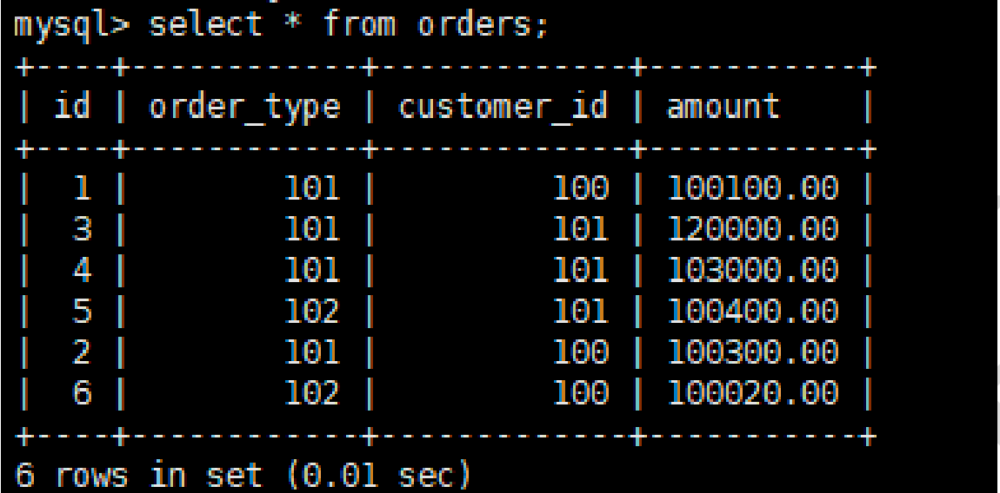

4. 执行插入数据sql，如下：

```mysql
insert into orders(id,order_type,customer_id,amount) values(7,101,101,10000);
```

5. 可看到运行结果，插入失败，只有只读权限，如下图： 

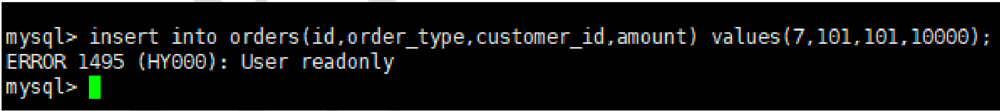

###### 测试案例二

使用mycat用户，权限为可读写（readOnly：false） ，验证是否可以查询出数据，验证是否可以写入数据

1. 用mycat用户登录，运行命令如下：

```bash
mysql -umycat -p123456 -h 192.168.140.128 -P8066
```

2. 切换到TESTDB数据库，查询orders表数据，如下：

```mysql
use TESTDB
select * from orders;
```

3. 可以查询到数据，如下图

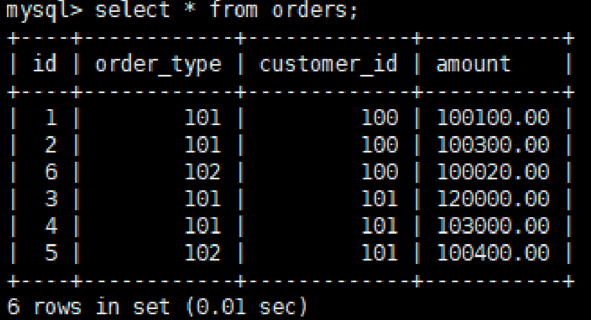

4. 执行插入数据sql，如下：

```mysql
insert into orders(id,order_type,customer_id,amount) values(7,101,101,10000);
```

5. 可看到运行结果，插入成功，如下图： 


#### privileges标签权限控制

在 user 标签下的 privileges 标签可以对逻辑库（schema）、表（table）进行精细化的 DML 权限控制

privileges 标签下的 check 属性，如为 true 开启权限检查，为 false 不开启，默认为 false

由于 Mycat 一个用户的 schemas 属性可配置多个逻辑库（schema） ，所以 privileges 的下级节点 schema 节点同样可配置多个，对多库多表进行细粒度的 DML 权限控制

```xml
## server.xml配置文件privileges部分
## 配置orders表没有增删改查权限
<user name="mycat">
  <property name="password">123456</property>
  <property name="schemas">TESTDB</property>
  <!-- 表级 DML 权限设置 -->
  <privileges check="true">
    <schema name="TESTDB" dml="1111" >
      <table name="orders" dml="0000"></table>
      <!--<table name="tb02" dml="1111"></table>-->
    </schema>
  </privileges>
</user>
```

##### 配置说明

| DML权限 | 增加（insert） | 更新（update） | 查询（select） | 删除（delete） |
| ------- | -------------- | -------------- | -------------- | -------------- |
| 0000    | 禁止           | 禁止           | 禁止           | 禁止           |
| 0010    | 禁止           | 禁止           | 可以           | 禁止           |
| 1110    | 可以           | 可以           | 可以           | 禁止           |
| 1111    | 可以           | 可以           | 可以           | 可以           |

##### 测试案例

###### 测试案例一

使用mycat用户，privileges配置orders表权限为禁止增删改查（dml="0000"） ，验证是否可以查询出数据，验证是否可以写入数据

1. 重启mycat，用mycat用户登录，运行命令如下：

```bash
mysql -umycat -p123456 -h 192.168.140.128 -P8066
```

2. 切换到TESTDB数据库，查询orders表数据，如下：

```mysql
use TESTDB
select * from orders;
```

3. 禁止该用户查询数据，如下图

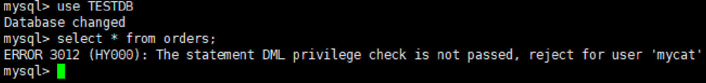

4. 执行插入数据sql，如下：

```mysql
insert into orders(id,order_type,customer_id,amount) values(8,101,101,10000);
```

5. 可看到运行结果，禁止该用户插入数据，如下图：

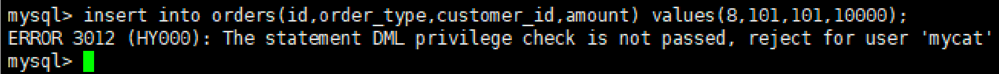

###### 测试案例二

使用mycat用户，privileges配置orders表权限为可以增删改查（dml="1111"） ，验证是否可以查询出数据，验证是否可以写入数据

1. 重启mycat，用mycat用户登录，运行命令如下： 

```bash
mysql -umycat -p123456 -h 192.168.140.128 -P8066
```

2. 切换到TESTDB数据库，查询orders表数据，如下：

```mysql
use TESTDB
select * from orders;
```

3. 可以查询到数据，如下图

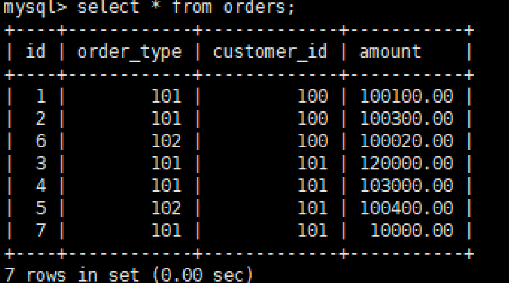

4. 执行插入数据sql，如下：

```mysql
insert into orders(id,order_type,customer_id,amount) values(8,101,101,10000);
```

5. 可看到运行结果，插入成功，如下图：


6. 执行插入数据sql，如下： 

```mysql
delete from orders where id in (7,8);
```

7. 可看到运行结果，插入成功，如下图：


### SQL拦截

firewall 标签用来定义防火墙；firewall 下 whitehost 标签用来定义 IP 白名单 ，blacklist 用来定义SQL 黑名单

#### 白名单

可以通过设置白名单，实现某主机某用户可以访问 Mycat，而其他主机用户禁止访问

1. 设置白名单

```xml
## server.xml配置文件firewall标签
## 配置只有192.168.140.128主机可以通过mycat用户访问
<firewall>
  <whitehost>
  	<host host="192.168.140.128" user="mycat"/>
  </whitehost>
</firewall>
```

2. 重启Mycat后，192.168.140.128主机使用mycat用户访问

```bash
mysql -umycat -p123456 -h 192.168.140.128 -P 8066
```

3. 可以正常访问，如下图

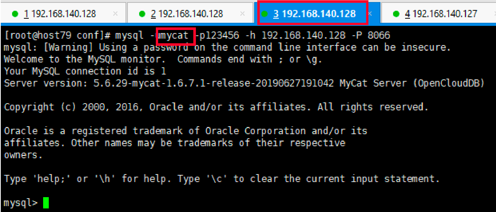

4. 在此主机换user用户访问，禁止访问

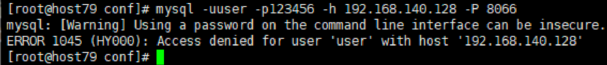

5. 在192.168.140.127主机用mycat用户访问，禁止访问

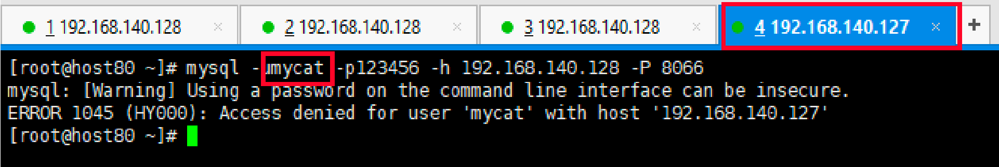

#### 黑名单

可以通过设置黑名单，实现 Mycat 对具体 SQL 操作的拦截，如增删改查等操作的拦截

1. 设置黑名单

```xml
#server.xml配置文件firewall标签
#配置禁止mycat用户进行删除操作
<firewall>
  <whitehost>
  	<host host="192.168.140.128" user="mycat"/>
  </whitehost>
  <blacklist check="true">
  	<property name="deleteAllow">false</property>
  </blacklist>
</firewall>
```

2. 重启Mycat后，192.168.140.128主机使用mycat用户访问

```bash
mysql -umycat -p123456 -h 192.168.140.128 -P 8066
```

3. 可以正常访问，如下图

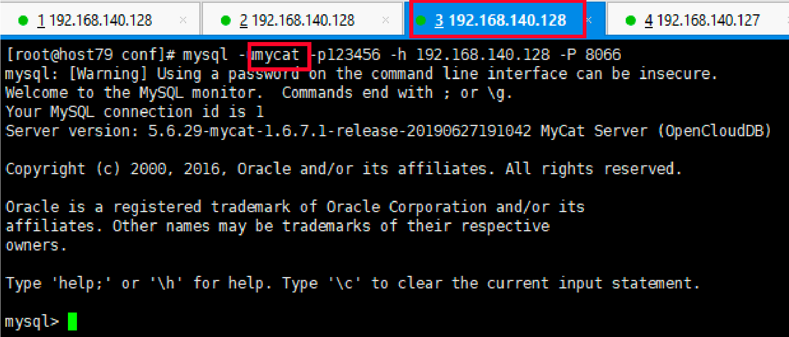

4. 切换TESTDB数据库后，执行删除数据语句

```mysql
delete from orders where id=7;
```

5. 运行后发现已禁止删除数据，如下图


可以设置的黑名单 SQL 拦截功能列表

| 配置项           | 缺省值 | 描述                          |
| ---------------- | ------ | ----------------------------- |
| selelctAllow     | true   | 是否允许执行 SELECT 语句      |
| deleteAllow      | true   | 是否允许执行 DELETE 语句      |
| updateAllow      | true   | 是否允许执行 UPDATE 语句      |
| insertAllow      | true   | 是否允许执行 INSERT 语句      |
| createTableAllow | true   | 是否允许创建表                |
| setAllow         | true   | 是否允许使用 SET 语法         |
| alterTableAllow  | true   | 是否允许执行 Alter Table 语句 |
| dropTableAllow   | true   | 是否允许修改表                |
| commitAllow      | true   | 是否允许执行 commit 操作      |
| rollbackAllow    | true   | 是否允许执行 roll back 操作   |

## mycat监控工具

### mycat-web简介

Mycat-web 是 Mycat 可视化运维的管理和监控平台，弥补了 Mycat 在监控上的空白。帮 Mycat 分担统计任务和配置管理任务。Mycat-web 引入了 ZooKeeper 作为配置中心，可以管理多个节点。Mycat-web 主要管理和监控 Mycat 的流量、连接、活动线程和内存等，具备 IP 白名单、邮件告警等模块，还可以统计 SQL 并分析慢 SQL 和高频 SQL 等。为优化 SQL 提供依据

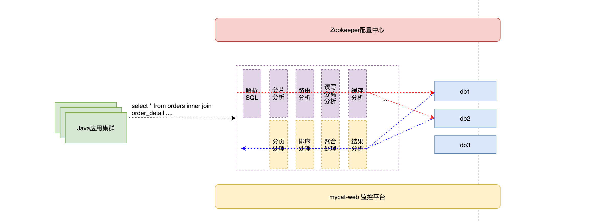

### mycat-web配置使用

#### zookeeper安装

安装步骤如下：

1. 下载安装包

网址：http://zookeeper.apache.org/

2. 安装包拷贝到Linux系统/opt目录下，并解压

```bash
tar -zxvf zookeeper-3.4.11.tar.gz
```

3. 进入ZooKeeper解压后的配置目录（conf），复制配置文件并改名

```bash
cp zoo_sample.cfg zoo.cfg
```

4. 进入ZooKeeper的命令目录（bin），运行启动命令

```bash
./zkServer.sh start
```

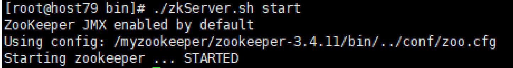

5.  ZooKeeper服务端口为2181，查看服务已经启动

```bash
netstat -ant | grep 2181
```


#### mycat-web安装

安装步骤如下： 

1. 下载安装包

网址：http://www.mycat.io/

2. 安装包拷贝到Linux系统/opt目录下，并解压

```bash
tar -zxvf Mycat-web-1.0-SNAPSHOT-20170102153329-linux.tar.gz
```

3. 拷贝mycat-web文件夹到/usr/local目录下

```bash
cp -r mycat-web /usr/local
```

4. 进入mycat-web的目录下运行启动命令

```bash
cd /usr/local/mycat-web/
./start.sh &
```

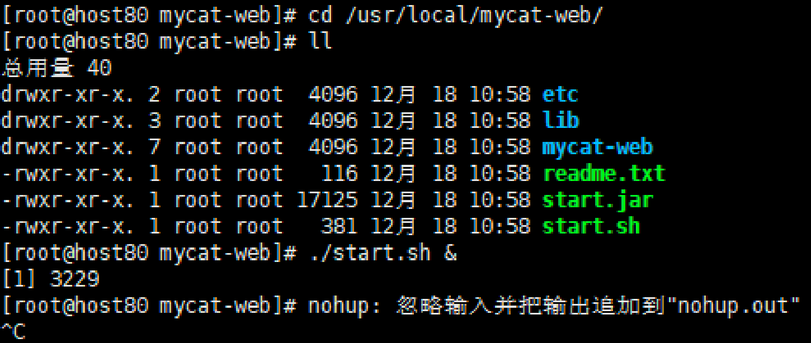

5. Mycat-web服务端口为8082，查看服务已经启动

```bash
netstat -ant | grep 8082
```


6. 通过地址访问服务

```http
http://192.168.140.127:8082/mycat/
```

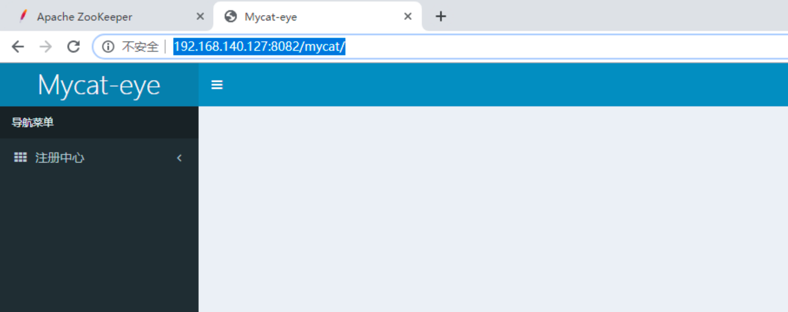

#### mycat-web配置

安装步骤如下： 

1. 先在注册中心配置ZooKeeper地址，配置后刷新页面，可见

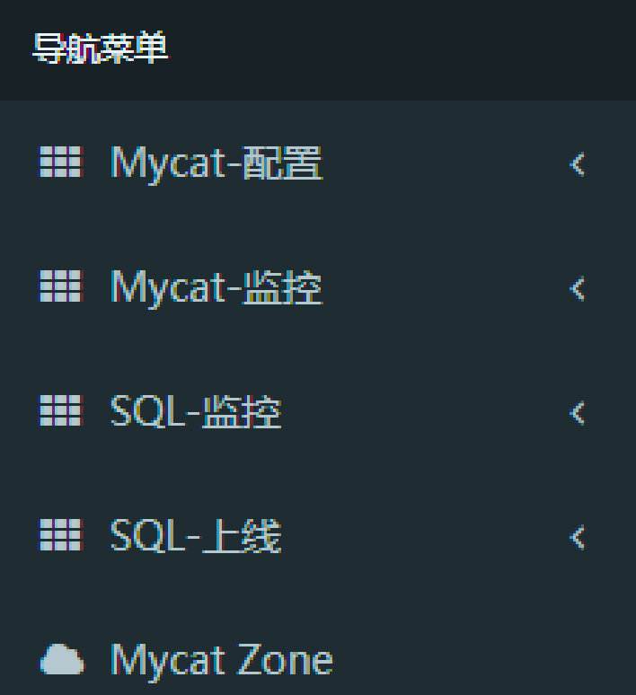

2. 新增Mycat监控实例

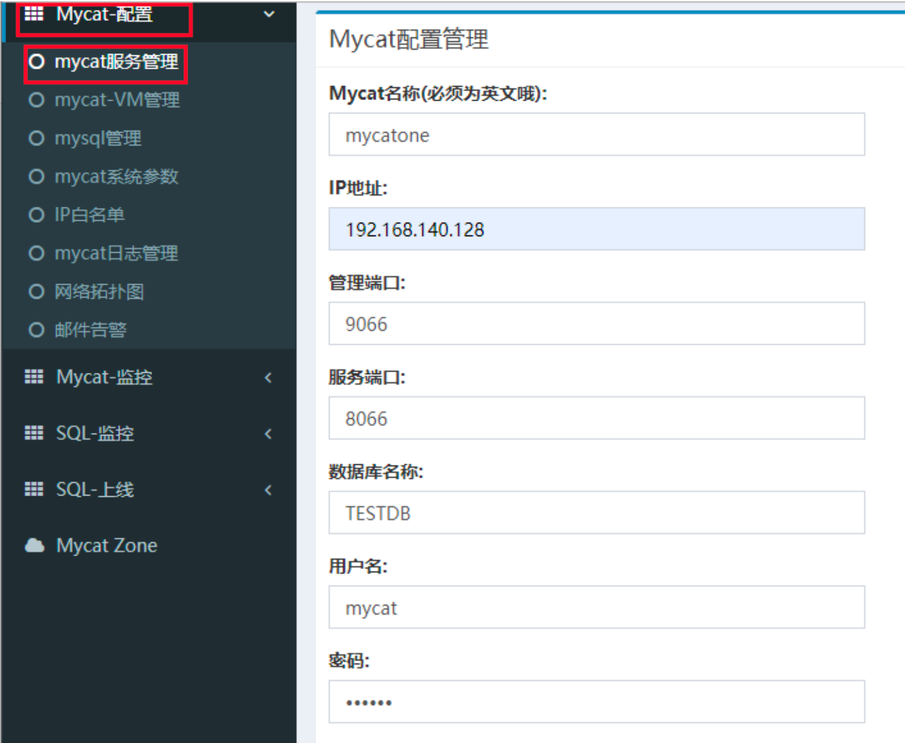

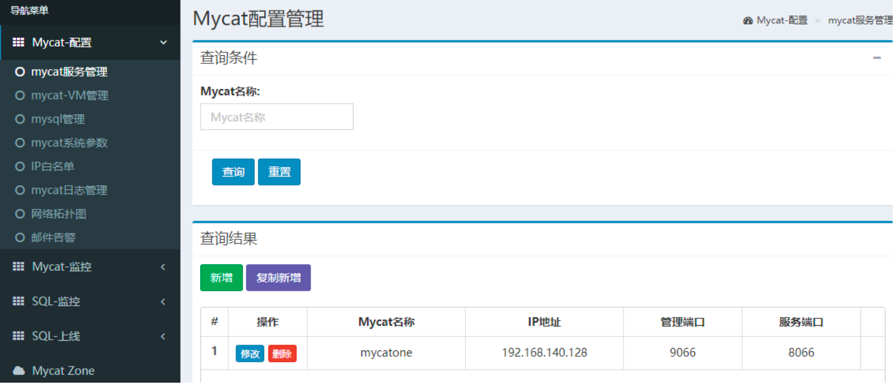

### mycat性能监控指标

在 Mycat-web 上可以进行 Mycat 性能监控，例如：内存分享、流量分析、连接分析、活动线程分析等等

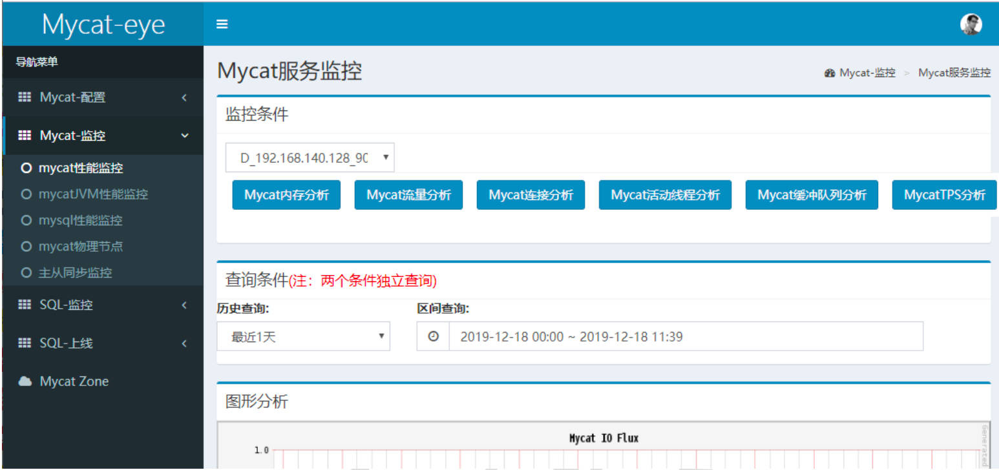

