## 概述

### Docker学习知识点

- Docker概述
- Docker安装
- Docker命令
  - 镜像命令
  - 容器命令
  - 操作命令
- Docker镜像
- 容器的数据卷
- DockerFile
- Docker网络原理
- idea整合Docker
- Docker Compose
- Docker Swarm
- CI\CD jenkins流水线

### Docker概述

#### Docker为什么出现？

做一款一款产品，会经历两个阶段：开发-上线，经常会有两套环境两套环境，这个环境部署的话，开始的时候是非常麻烦的，开发环境要到上线的时候，还要部署到应用环境，然后一些应用还需要配置，比如说配置端口、数据库连接等

这时候产生了两个角色：开发人员和运维人员，就会出现一些问题：我在我的电脑上可以运行，但是在测试或者运维人员上不能运行或者出现bug，或者上线更新一些软件或者环境版本更新导致应用不能用了，对于运维来说，考验就非常大了。

此时就会出现两个解决方案：要么运维来学习开发，要么开发去学习运维，即开发即运维

环境配置是十分麻烦的，在集群部署的情况下，每一个机器都要部署环境（Redis、ES、Hadoop....），费时费力

发布一个项目，以前可能是发布为一个jar或者war，假如需要的环境是Redis、MySQL、jdk、ES，本来运行一个jar就是一分钟的事，但是配置环境有时候需要一天都部署不好，这个时候，如果能带着我们本地运行的环境一起上线就好了，即变成了发布为jar+这些Redis、MySQL、jdk、ES环境，项目带上环境安装打包

之前在服务器配置一个应用环境，配置超级麻烦，不能够跨平台

window上开发，最后发布到Linux

- 传统：开发jar，然后发给运维，让运维来配置和部署
- 现在：开发打包部署上线，一套流程做完

Docker给以上的问题，给出了解决方案，

java->jar(环境)->打包项目打上环境（Docker镜像）->Docker仓库->下载我们发布的镜像->直接运行即可

容器-镜像-仓库

https://www.docker.com/


Docker的思想就来自于集装箱

原来的话，多个Java应用程序运行在同一个jre环境中，有可能会出现冲突，比如端口占用，在原来都是交叉的

现在的话，就要把它隔离（Docker的核心思想）开来，打包装箱，每个箱子是互相隔离的

一个箱子装水果，一个箱子装生化武器，原来的话，是不能把它们放在一个船里去装的，现在使用箱子把它们隔离

Docker通过隔离机制，可以将服务器利用到极致

沙箱

#### Docker的历史

2010年，几个搞IT的年轻人，就在美国成立了一家公司dotCloud，开始是做一些pass的云计算服务

Linux有关的容器技术，LXC有关的容器技术

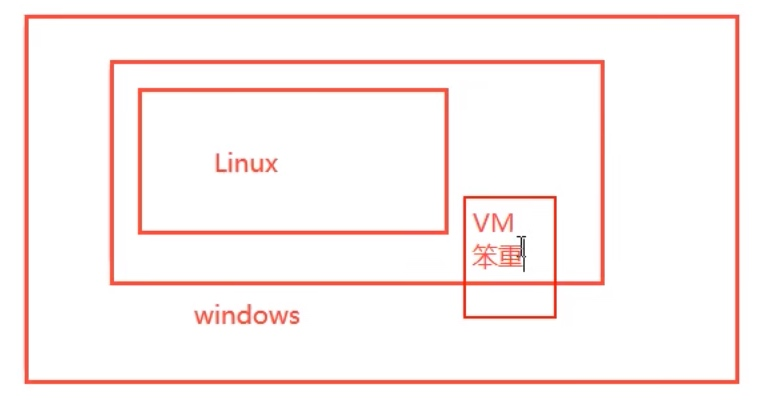

它们将自己的技术 容器化技术进行了统一的简化命名Docker

Docker刚刚诞生的时候，没有引起行业的注意，dotCloud活不下去了，没有办法将Docker开源

2013年，Docker开源，越来越多的人发现了Docker的优点，就火了

2014年9月，Docker1.0发布

#### Docker为什么这么火？

Docker虚拟机十分的轻巧

在容器技术出来之前，我们都是使用虚拟机技术，虚拟机需要在window中安装一个vmware，通过软件我们可以虚拟出来一台或者多台电脑，十分笨重

虚拟机也是属于虚拟化技术，Docker的容器技术也是一种虚拟化技术

- vmware：linux centos原生镜像（一个电脑），要做隔离的话，需要开启多个虚拟机
- Docker：也是要做隔离，使用镜像技术（只有最核心的环境）十分的小巧，运行镜像就可以了

Docker是基于go语言开发的开源项目

文档地址：https://docs.docker.com/ Docker的文档是超级详细的

仓库地址：https://hub.docker.com/

### Docker能干嘛

#### 之前的虚拟机技术

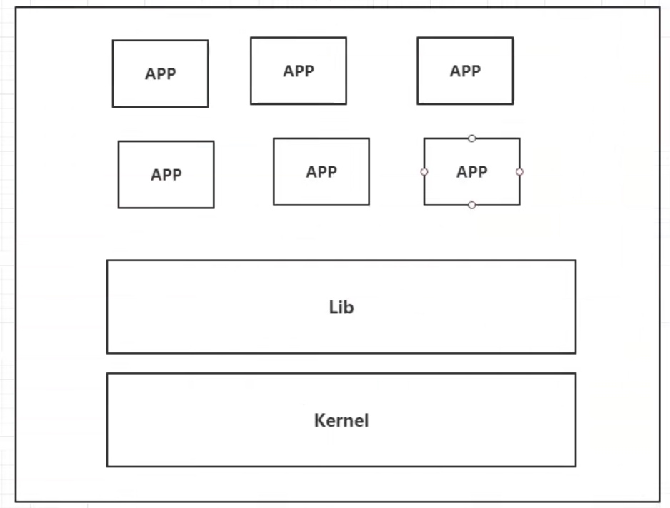

虚拟机的缺点：

- 内存占用大
- 资源浪费，资源占用十分多
- 冗余步骤多
- 启动很慢

#### 容器化技术

容器化就是不是模拟的完整的操作系统

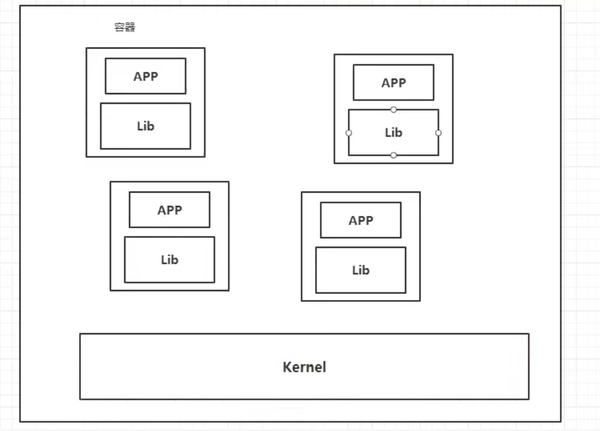

比较Docker和虚拟机技术的不同

- 传统的虚拟机，虚拟出一条硬件，运行一个完整的操作系统，然后在这个系统上安装和运行软件
- 容器内的应用是直接运行在宿主机的内核上，容器是没有自己的内核的，也没有虚拟我们的硬件，所以就轻便了
- 每个容器间是互相隔离的，每个容器内都有一个属于自己的文件系统，互不影响

#### DevOps（开发、运维）

- 更快速的交付和部署
  - 传统：一堆帮助文档，安装程序
  - Docker：打包镜像发布测试，一键运行
- 更便捷的升级和扩缩容
  - 使用Docker之后，我们部署应用就和搭积木一样
  - 项目打包为一个镜像，打包扩展
- 更简单的系统运维
  - 在容器化之后，我们的开发，测试环境都是高度一致
- 更高效的计算资源利用
  - Docker是内核级的虚拟化，可以在一个物理机上运行很多的容器实例，服务器性能可以使用到极致

### Docker中的名词概念

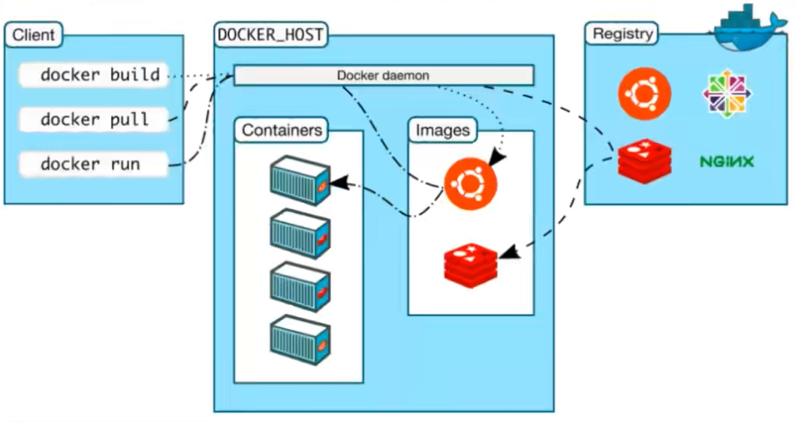

- 客户端
- 服务器
- 镜像（image）
  - Docker镜像就好比是一个模板，可以通过这个模板来创建容器服务，Tomcat镜像->run->tomcat1容器（提供服务）
  - 通过这个镜像可以创建多个容器（最终服务运行或者项目运行就是在容器中的）
- 容器（container）
  - Docker利用容器技术，独立运行一个或者一组应用，通过镜像来创建的
  - 启动，停止，删除等基本命令
  - 目前，就可以把容器理解为简易的Linux系统
- 仓库（repository）
  - 仓库就是存放镜像的地方
  - 仓库可以分为公有仓库和私有仓库
  - Docker Hub（默认是国外的）
  - 阿里云、网易云等都有容器服务器（默认镜像加速）

## 安装

### 环境准备

1. Linux基础
2. centos7

### 环境查看

```bash
## 系统内核
[root@localhost config]## uname -r
3.10.0-1160.el7.x86_64

## 系统版本
[root@localhost config]## cat /etc/os-release
NAME="CentOS Linux"
VERSION="7 (Core)"
ID="centos"
ID_LIKE="rhel fedora"
VERSION_ID="7"
PRETTY_NAME="CentOS Linux 7 (Core)"
ANSI_COLOR="0;31"
CPE_NAME="cpe:/o:centos:centos:7"
HOME_URL="https://www.centos.org/"
BUG_REPORT_URL="https://bugs.centos.org/"

CENTOS_MANTISBT_PROJECT="CentOS-7"
CENTOS_MANTISBT_PROJECT_VERSION="7"
REDHAT_SUPPORT_PRODUCT="centos"
REDHAT_SUPPORT_PRODUCT_VERSION="7"
```

### 安装

帮助文档：https://docs.docker.com/get-docker/

在Linux上安装：https://docs.docker.com/engine/install/centos/

1. 卸载旧的版本

```bash
sudo yum remove docker \
                  docker-client \
                  docker-client-latest \
                  docker-common \
                  docker-latest \
                  docker-latest-logrotate \
                  docker-logrotate \
                  docker-engine
```

执行结果

```bash
[root@localhost config]## yum remove docker \
>                   docker-client \
>                   docker-client-latest \
>                   docker-common \
>                   docker-latest \
>                   docker-latest-logrotate \
>                   docker-logrotate \
>                   docker-engine
已加载插件：fastestmirror
参数 docker 没有匹配
参数 docker-client 没有匹配
参数 docker-client-latest 没有匹配
参数 docker-common 没有匹配
参数 docker-latest 没有匹配
参数 docker-latest-logrotate 没有匹配
参数 docker-logrotate 没有匹配
参数 docker-engine 没有匹配
不删除任何软件包
```

2. 需要的安装包（有多个安装方法，本次使用镜像的方式进行安装）

```bash
sudo yum install -y yum-utils
```

执行结果

```bash
[root@localhost config]## sudo yum install -y yum-utils
已加载插件：fastestmirror
Loading mirror speeds from cached hostfile
 * base: mirrors.aliyun.com
 * centos-sclo-rh: mirrors.aliyun.com
 * centos-sclo-sclo: mirrors.163.com
 * extras: mirrors.aliyun.com
 * updates: mirrors.aliyun.com
base                                                                                                                             | 3.6 kB  00:00:00
centos-sclo-rh                                                                                                                   | 3.0 kB  00:00:00
centos-sclo-sclo                                                                                                                 | 3.0 kB  00:00:00
extras                                                                                                                           | 2.9 kB  00:00:00
updates                                                                                                                          | 2.9 kB  00:00:00
正在解决依赖关系
--> 正在检查事务
---> 软件包 yum-utils.noarch.0.1.1.31-54.el7_8 将被 安装
--> 正在处理依赖关系 python-kitchen，它被软件包 yum-utils-1.1.31-54.el7_8.noarch 需要
--> 正在处理依赖关系 libxml2-python，它被软件包 yum-utils-1.1.31-54.el7_8.noarch 需要
--> 正在检查事务
---> 软件包 libxml2-python.x86_64.0.2.9.1-6.el7_9.6 将被 安装
--> 正在处理依赖关系 libxml2 = 2.9.1-6.el7_9.6，它被软件包 libxml2-python-2.9.1-6.el7_9.6.x86_64 需要
---> 软件包 python-kitchen.noarch.0.1.1.1-5.el7 将被 安装
--> 正在处理依赖关系 python-chardet，它被软件包 python-kitchen-1.1.1-5.el7.noarch 需要
--> 正在检查事务
---> 软件包 libxml2.x86_64.0.2.9.1-6.el7.5 将被 升级
---> 软件包 libxml2.x86_64.0.2.9.1-6.el7_9.6 将被 更新
---> 软件包 python-chardet.noarch.0.2.2.1-3.el7 将被 安装
--> 解决依赖关系完成

依赖关系解决

========================================================================================================================================================
 Package                                架构                           版本                                       源                               大小
========================================================================================================================================================
正在安装:
 yum-utils                              noarch                         1.1.31-54.el7_8                            base                            122 k
为依赖而安装:
 libxml2-python                         x86_64                         2.9.1-6.el7_9.6                            updates                         247 k
 python-chardet                         noarch                         2.2.1-3.el7                                base                            227 k
 python-kitchen                         noarch                         1.1.1-5.el7                                base                            267 k
为依赖而更新:
 libxml2                                x86_64                         2.9.1-6.el7_9.6                            updates                         668 k

事务概要
========================================================================================================================================================
安装  1 软件包 (+3 依赖软件包)
升级           ( 1 依赖软件包)

总下载量：1.5 M
Downloading packages:
Delta RPMs disabled because /usr/bin/applydeltarpm not installed.
(1/5): libxml2-2.9.1-6.el7_9.6.x86_64.rpm                                                                                        | 668 kB  00:00:00
(2/5): python-chardet-2.2.1-3.el7.noarch.rpm                                                                                     | 227 kB  00:00:00
(3/5): libxml2-python-2.9.1-6.el7_9.6.x86_64.rpm                                                                                 | 247 kB  00:00:00
(4/5): python-kitchen-1.1.1-5.el7.noarch.rpm                                                                                     | 267 kB  00:00:00
(5/5): yum-utils-1.1.31-54.el7_8.noarch.rpm                                                                                      | 122 kB  00:00:00
--------------------------------------------------------------------------------------------------------------------------------------------------------
总计                                                                                                                    1.9 MB/s | 1.5 MB  00:00:00
Running transaction check
Running transaction test
Transaction test succeeded
Running transaction
  正在更新    : libxml2-2.9.1-6.el7_9.6.x86_64                                                                                                      1/6
  正在安装    : libxml2-python-2.9.1-6.el7_9.6.x86_64                                                                                               2/6
  正在安装    : python-chardet-2.2.1-3.el7.noarch                                                                                                   3/6
  正在安装    : python-kitchen-1.1.1-5.el7.noarch                                                                                                   4/6
  正在安装    : yum-utils-1.1.31-54.el7_8.noarch                                                                                                    5/6
  清理        : libxml2-2.9.1-6.el7.5.x86_64                                                                                                        6/6
  验证中      : python-chardet-2.2.1-3.el7.noarch                                                                                                   1/6
  验证中      : libxml2-2.9.1-6.el7_9.6.x86_64                                                                                                      2/6
  验证中      : libxml2-python-2.9.1-6.el7_9.6.x86_64                                                                                               3/6
  验证中      : python-kitchen-1.1.1-5.el7.noarch                                                                                                   4/6
  验证中      : yum-utils-1.1.31-54.el7_8.noarch                                                                                                    5/6
  验证中      : libxml2-2.9.1-6.el7.5.x86_64                                                                                                        6/6

已安装:
  yum-utils.noarch 0:1.1.31-54.el7_8

作为依赖被安装:
  libxml2-python.x86_64 0:2.9.1-6.el7_9.6              python-chardet.noarch 0:2.2.1-3.el7              python-kitchen.noarch 0:1.1.1-5.el7

作为依赖被升级:
  libxml2.x86_64 0:2.9.1-6.el7_9.6

完毕！
```

3. 设置镜像的仓库

```bash
sudo yum-config-manager \
    --add-repo \
    https://download.docker.com/linux/centos/docker-ce.repo ## 默认是从国外的，十分的慢
sudo yum-config-manager \
    --add-repo \
    http://mirrors.aliyun.com/docker-ce/linux/centos/docker-ce.repo ## 阿里云的镜像
```

执行结果

```bash
[root@localhost config]## sudo yum-config-manager \
>     --add-repo \
>     http://mirrors.aliyun.com/docker-ce/linux/centos/docker-ce.repo
已加载插件：fastestmirror
adding repo from: http://mirrors.aliyun.com/docker-ce/linux/centos/docker-ce.repo
grabbing file http://mirrors.aliyun.com/docker-ce/linux/centos/docker-ce.repo to /etc/yum.repos.d/docker-ce.repo
repo saved to /etc/yum.repos.d/docker-ce.repo
```

4. 安装之前，最好更新一下yum软件包索引

```bash
[root@localhost config]## yum makecache fast
已加载插件：fastestmirror
Loading mirror speeds from cached hostfile
 * base: mirrors.aliyun.com
 * centos-sclo-rh: mirrors.aliyun.com
 * centos-sclo-sclo: mirrors.163.com
 * extras: mirrors.aliyun.com
 * updates: mirrors.aliyun.com
base                                                                                                                             | 3.6 kB  00:00:00
centos-sclo-rh                                                                                                                   | 3.0 kB  00:00:00
centos-sclo-sclo                                                                                                                 | 3.0 kB  00:00:00
docker-ce-stable                                                                                                                 | 3.5 kB  00:00:00
extras                                                                                                                           | 2.9 kB  00:00:00
updates                                                                                                                          | 2.9 kB  00:00:00
(1/2): docker-ce-stable/7/x86_64/updateinfo                                                                                      |   55 B  00:00:00
(2/2): docker-ce-stable/7/x86_64/primary_db                                                                                      |  69 kB  00:00:00
元数据缓存已建立
```

5. 安装最新版的Docker引擎

docker-ce 社区版（一般使用这个） ee 企业版

```bash
sudo yum install docker-ce docker-ce-cli containerd.io ## 容器、客户端、io
```

执行结果

```bash
[root@localhost config]## sudo yum install docker-ce docker-ce-cli containerd.io
已加载插件：fastestmirror
Loading mirror speeds from cached hostfile
 * base: mirrors.aliyun.com
 * centos-sclo-rh: mirrors.aliyun.com
 * centos-sclo-sclo: mirrors.163.com
 * extras: mirrors.aliyun.com
 * updates: mirrors.aliyun.com
正在解决依赖关系
--> 正在检查事务
---> 软件包 containerd.io.x86_64.0.1.4.12-3.1.el7 将被 安装
--> 正在处理依赖关系 container-selinux >= 2:2.74，它被软件包 containerd.io-1.4.12-3.1.el7.x86_64 需要
---> 软件包 docker-ce.x86_64.3.20.10.11-3.el7 将被 安装
--> 正在处理依赖关系 docker-ce-rootless-extras，它被软件包 3:docker-ce-20.10.11-3.el7.x86_64 需要
---> 软件包 docker-ce-cli.x86_64.1.20.10.11-3.el7 将被 安装
--> 正在处理依赖关系 docker-scan-plugin(x86-64)，它被软件包 1:docker-ce-cli-20.10.11-3.el7.x86_64 需要
--> 正在检查事务
---> 软件包 container-selinux.noarch.2.2.119.2-1.911c772.el7_8 将被 安装
---> 软件包 docker-ce-rootless-extras.x86_64.0.20.10.11-3.el7 将被 安装
--> 正在处理依赖关系 fuse-overlayfs >= 0.7，它被软件包 docker-ce-rootless-extras-20.10.11-3.el7.x86_64 需要
--> 正在处理依赖关系 slirp4netns >= 0.4，它被软件包 docker-ce-rootless-extras-20.10.11-3.el7.x86_64 需要
---> 软件包 docker-scan-plugin.x86_64.0.0.9.0-3.el7 将被 安装
--> 正在检查事务
---> 软件包 fuse-overlayfs.x86_64.0.0.7.2-6.el7_8 将被 安装
--> 正在处理依赖关系 libfuse3.so.3(FUSE_3.2)(64bit)，它被软件包 fuse-overlayfs-0.7.2-6.el7_8.x86_64 需要
--> 正在处理依赖关系 libfuse3.so.3(FUSE_3.0)(64bit)，它被软件包 fuse-overlayfs-0.7.2-6.el7_8.x86_64 需要
--> 正在处理依赖关系 libfuse3.so.3()(64bit)，它被软件包 fuse-overlayfs-0.7.2-6.el7_8.x86_64 需要
---> 软件包 slirp4netns.x86_64.0.0.4.3-4.el7_8 将被 安装
--> 正在检查事务
---> 软件包 fuse3-libs.x86_64.0.3.6.1-4.el7 将被 安装
--> 解决依赖关系完成

依赖关系解决

========================================================================================================================================================
 Package                                    架构                    版本                                        源                                 大小
========================================================================================================================================================
正在安装:
 containerd.io                              x86_64                  1.4.12-3.1.el7                              docker-ce-stable                   28 M
 docker-ce                                  x86_64                  3:20.10.11-3.el7                            docker-ce-stable                   23 M
 docker-ce-cli                              x86_64                  1:20.10.11-3.el7                            docker-ce-stable                   29 M
为依赖而安装:
 container-selinux                          noarch                  2:2.119.2-1.911c772.el7_8                   extras                             40 k
 docker-ce-rootless-extras                  x86_64                  20.10.11-3.el7                              docker-ce-stable                  8.0 M
 docker-scan-plugin                         x86_64                  0.9.0-3.el7                                 docker-ce-stable                  3.7 M
 fuse-overlayfs                             x86_64                  0.7.2-6.el7_8                               extras                             54 k
 fuse3-libs                                 x86_64                  3.6.1-4.el7                                 extras                             82 k
 slirp4netns                                x86_64                  0.4.3-4.el7_8                               extras                             81 k

事务概要
========================================================================================================================================================
安装  3 软件包 (+6 依赖软件包)

总下载量：93 M
安装大小：376 M
Is this ok [y/d/N]: y
Downloading packages:
(1/9): container-selinux-2.119.2-1.911c772.el7_8.noarch.rpm                                                                      |  40 kB  00:00:00
warning: /var/cache/yum/x86_64/7/docker-ce-stable/packages/docker-ce-20.10.11-3.el7.x86_64.rpm: Header V4 RSA/SHA512 Signature, key ID 621e9f35: NOKEYA
docker-ce-20.10.11-3.el7.x86_64.rpm 的公钥尚未安装
(2/9): docker-ce-20.10.11-3.el7.x86_64.rpm                                                                                       |  23 MB  00:00:08
(3/9): containerd.io-1.4.12-3.1.el7.x86_64.rpm                                                                                   |  28 MB  00:00:09
(4/9): docker-ce-rootless-extras-20.10.11-3.el7.x86_64.rpm                                                                       | 8.0 MB  00:00:01
(5/9): fuse3-libs-3.6.1-4.el7.x86_64.rpm                                                                                         |  82 kB  00:00:00
(6/9): slirp4netns-0.4.3-4.el7_8.x86_64.rpm                                                                                      |  81 kB  00:00:00
(7/9): fuse-overlayfs-0.7.2-6.el7_8.x86_64.rpm                                                                                   |  54 kB  00:00:00
(8/9): docker-scan-plugin-0.9.0-3.el7.x86_64.rpm                                                                                 | 3.7 MB  00:00:00
(9/9): docker-ce-cli-20.10.11-3.el7.x86_64.rpm                                                                                   |  29 MB  00:00:05
--------------------------------------------------------------------------------------------------------------------------------------------------------
总计                                                                                                                    6.4 MB/s |  93 MB  00:00:14
从 https://mirrors.aliyun.com/docker-ce/linux/centos/gpg 检索密钥
导入 GPG key 0x621E9F35:
 用户ID     : "Docker Release (CE rpm) <docker@docker.com>"
 指纹       : 060a 61c5 1b55 8a7f 742b 77aa c52f eb6b 621e 9f35
 来自       : https://mirrors.aliyun.com/docker-ce/linux/centos/gpg
是否继续？[y/N]：y
Running transaction check
Running transaction test
Transaction test succeeded
Running transaction
  正在安装    : docker-scan-plugin-0.9.0-3.el7.x86_64                                                                                               1/9
  正在安装    : 1:docker-ce-cli-20.10.11-3.el7.x86_64                                                                                               2/9
  正在安装    : 2:container-selinux-2.119.2-1.911c772.el7_8.noarch                                                                                  3/9
  正在安装    : containerd.io-1.4.12-3.1.el7.x86_64                                                                                                 4/9
  正在安装    : slirp4netns-0.4.3-4.el7_8.x86_64                                                                                                    5/9
  正在安装    : fuse3-libs-3.6.1-4.el7.x86_64                                                                                                       6/9
  正在安装    : fuse-overlayfs-0.7.2-6.el7_8.x86_64                                                                                                 7/9
  正在安装    : docker-ce-rootless-extras-20.10.11-3.el7.x86_64                                                                                     8/9
  正在安装    : 3:docker-ce-20.10.11-3.el7.x86_64                                                                                                   9/9
  验证中      : 1:docker-ce-cli-20.10.11-3.el7.x86_64                                                                                               1/9
  验证中      : docker-scan-plugin-0.9.0-3.el7.x86_64                                                                                               2/9
  验证中      : fuse3-libs-3.6.1-4.el7.x86_64                                                                                                       3/9
  验证中      : fuse-overlayfs-0.7.2-6.el7_8.x86_64                                                                                                 4/9
  验证中      : slirp4netns-0.4.3-4.el7_8.x86_64                                                                                                    5/9
  验证中      : 2:container-selinux-2.119.2-1.911c772.el7_8.noarch                                                                                  6/9
  验证中      : 3:docker-ce-20.10.11-3.el7.x86_64                                                                                                   7/9
  验证中      : docker-ce-rootless-extras-20.10.11-3.el7.x86_64                                                                                     8/9
  验证中      : containerd.io-1.4.12-3.1.el7.x86_64                                                                                                 9/9

已安装:
  containerd.io.x86_64 0:1.4.12-3.1.el7              docker-ce.x86_64 3:20.10.11-3.el7              docker-ce-cli.x86_64 1:20.10.11-3.el7

作为依赖被安装:
  container-selinux.noarch 2:2.119.2-1.911c772.el7_8    docker-ce-rootless-extras.x86_64 0:20.10.11-3.el7    docker-scan-plugin.x86_64 0:0.9.0-3.el7
  fuse-overlayfs.x86_64 0:0.7.2-6.el7_8                 fuse3-libs.x86_64 0:3.6.1-4.el7                      slirp4netns.x86_64 0:0.4.3-4.el7_8

完毕！
```

如果不想安装最后一个版本，也可以执行版本安装

```bash
yum list docker-ce --showduplicates | sort -r ## 查看所有可选的版本

sudo yum install docker-ce-<VERSION_STRING> docker-ce-cli-<VERSION_STRING> containerd.io ## 安装指定的版本
```

6. 启动和测试

```bash
sudo systemctl start docker
```

执行结果

```bash
[root@localhost config]## sudo systemctl start docker
[root@localhost config]## docker version ## 使用docker version查看是否安装成功
Client: Docker Engine - Community
 Version:           20.10.11
 API version:       1.41
 Go version:        go1.16.9
 Git commit:        dea9396
 Built:             Thu Nov 18 00:38:53 2021
 OS/Arch:           linux/amd64
 Context:           default
 Experimental:      true

Server: Docker Engine - Community
 Engine:
  Version:          20.10.11
  API version:      1.41 (minimum version 1.12)
  Go version:       go1.16.9
  Git commit:       847da18
  Built:            Thu Nov 18 00:37:17 2021
  OS/Arch:          linux/amd64
  Experimental:     false
 containerd:
  Version:          1.4.12
  GitCommit:        7b11cfaabd73bb80907dd23182b9347b4245eb5d
 runc:
  Version:          1.0.2
  GitCommit:        v1.0.2-0-g52b36a2
 docker-init:
  Version:          0.19.0
  GitCommit:        de40ad0
```

7. 通过运行 hello-world 映像验证 Docker Engine 是否已正确安装

```bash
sudo docker run hello-world
```

执行结果

```bash
[root@localhost config]## sudo docker run hello-world
Unable to find image 'hello-world:latest' locally ## 没有在本地找到这个镜像
latest: Pulling from library/hello-world ## 需要去远程仓库拉取下载
2db29710123e: Pull complete
Digest: ## 签名信息sha256:cc15c5b292d8525effc0f89cb299f1804f3a725c8d05e158653a563f15e4f685
Status: Downloaded newer image for hello-world:latest

Hello from Docker! ## 表名Docker已经安装成功了
This message shows that your installation appears to be working correctly.

To generate this message, Docker took the following steps:
 1. The Docker client contacted the Docker daemon.
 2. The Docker daemon pulled the "hello-world" image from the Docker Hub.
    (amd64)
 3. The Docker daemon created a new container from that image which runs the
    executable that produces the output you are currently reading.
 4. The Docker daemon streamed that output to the Docker client, which sent it
    to your terminal.

To try something more ambitious, you can run an Ubuntu container with:
 $ docker run -it ubuntu bash

Share images, automate workflows, and more with a free Docker ID:
 https://hub.docker.com/

For more examples and ideas, visit:
 https://docs.docker.com/get-started/
```

8. 查看下载的hello-wrold镜像

```bash
[root@localhost config]## docker images
REPOSITORY    TAG       IMAGE ID       CREATED        SIZE
hello-world   latest    feb5d9fea6a5   2 months ago   13.3kB
```

### 卸载Docker

1. 卸载 Docker Engine、CLI 和 Containerd 包

```bash
sudo yum remove docker-ce docker-ce-cli containerd.io
```

2. 主机上的映像、容器、卷或自定义配置文件不会自动删除。删除所有镜像、容器和卷

```bash
sudo rm -rf /var/lib/docker ## docker的默认工作路径
sudo rm -rf /var/lib/containerd
```

### 阿里云镜像加速

1. 登录阿里云找到容器服务

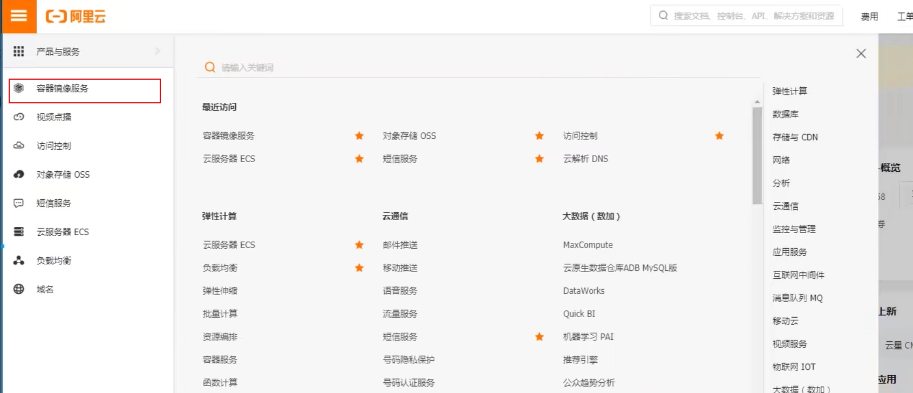

2. 找到镜像加速地址

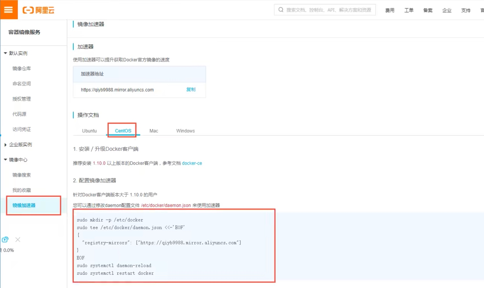

3. 配置使用

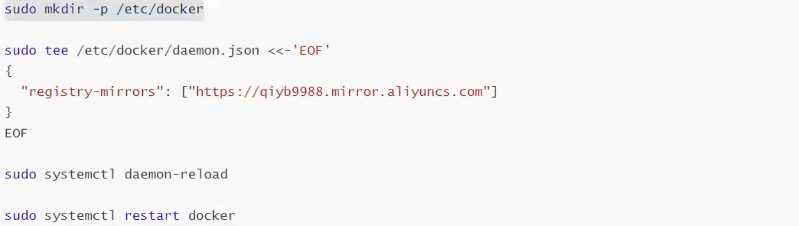

## docker启动流程初探

### 回顾helloworld流程

```bash
[root@localhost config]## sudo docker run hello-world
Unable to find image 'hello-world:latest' locally ## 没有在本地找到这个镜像
latest: Pulling from library/hello-world ## 需要去远程仓库拉取下载
2db29710123e: Pull complete
Digest: ## 签名信息sha256:cc15c5b292d8525effc0f89cb299f1804f3a725c8d05e158653a563f15e4f685
Status: Downloaded newer image for hello-world:latest

Hello from Docker! ## 表名Docker已经安装成功了
This message shows that your installation appears to be working correctly.

To generate this message, Docker took the following steps:
 1. The Docker client contacted the Docker daemon.
 2. The Docker daemon pulled the "hello-world" image from the Docker Hub.
    (amd64)
 3. The Docker daemon created a new container from that image which runs the
    executable that produces the output you are currently reading.
 4. The Docker daemon streamed that output to the Docker client, which sent it
    to your terminal.

To try something more ambitious, you can run an Ubuntu container with:
 $ docker run -it ubuntu bash

Share images, automate workflows, and more with a free Docker ID:
 https://hub.docker.com/

For more examples and ideas, visit:
 https://docs.docker.com/get-started/
```

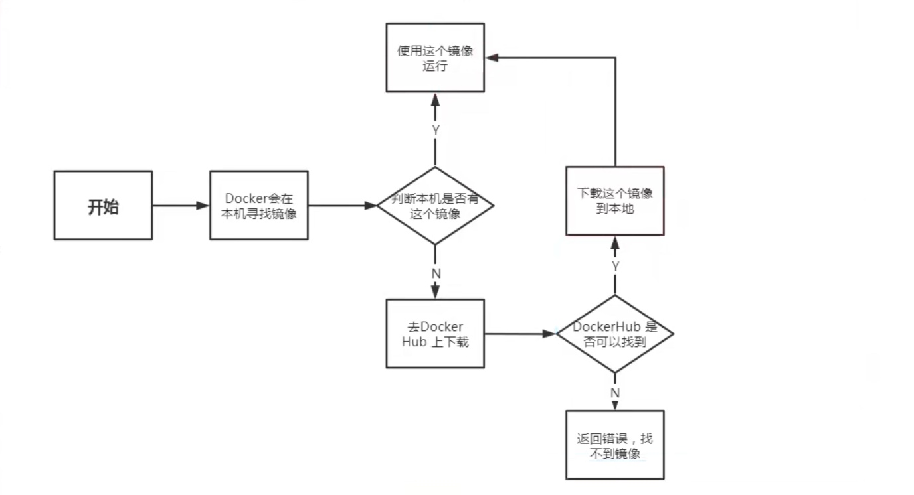

### 底层原理

#### Docker是怎么工作的？

Docker是一个client-server结构的系统，Docker的守护进程运行在主机上，通过socket从客户端进行访问

DockerServer接收到DockerClient的指令，就会执行这个命令

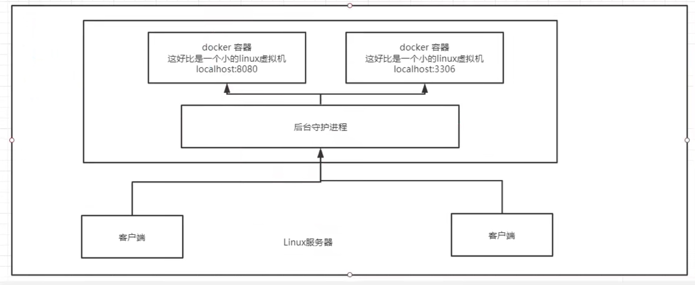

#### Docker为什么比VM快?

1. Docker有着比虚拟机更少的抽象层

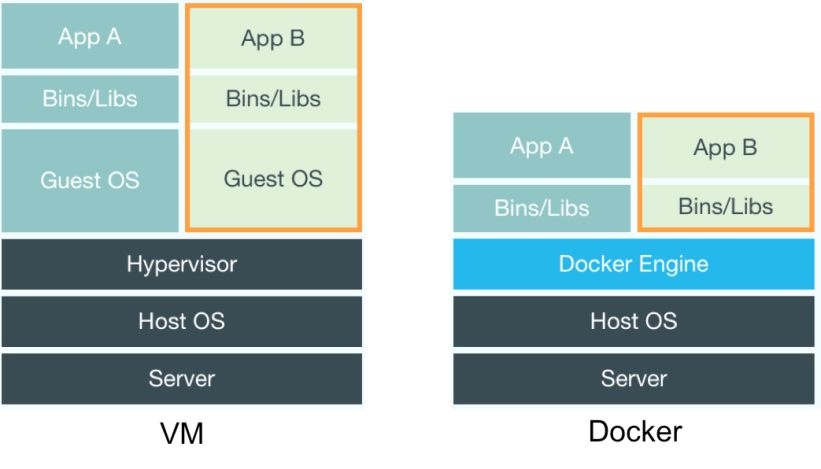

2. Docker利用的是宿主机的内核，VM需要Guest OS

所以说，新建一个容器的时候，Docker不需要像虚拟机一样重新加载一个操作系统内核，避免引导。虚拟机是加载Guest OS，是分钟级别的；而Docker是利用宿主机的操作系统，省略了这个复制的过程，是秒级别的

## 常用命令

### 帮助命令

```bash
docker version #显示docker的版本信息
docker info ## 显示docker的系统信息，包括镜像和容器的数量
docker 命令 --help ## 帮助命令
```

帮助文档的地址：https://docs.docker.com/reference/

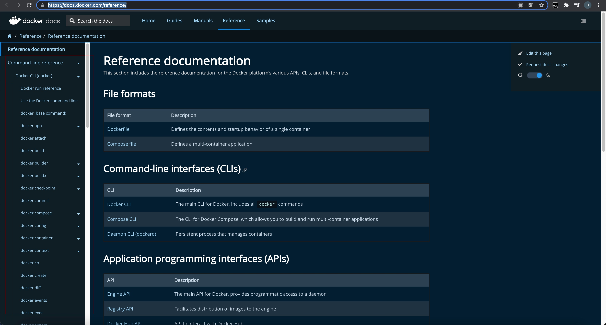

### 镜像命令

1. docker images ## 查看所有本地的主机上的镜像

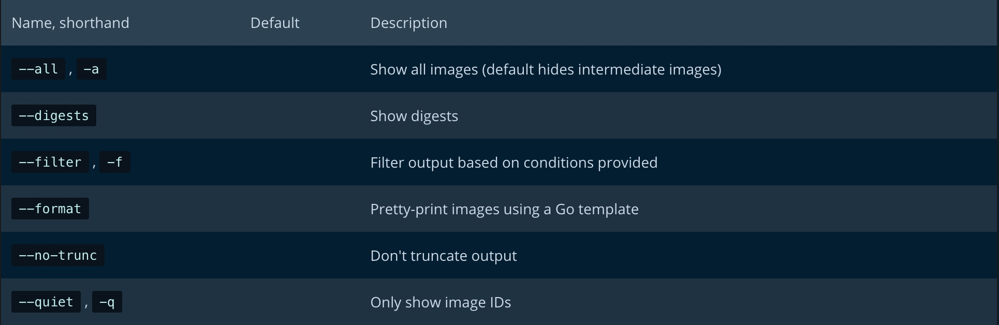

```bash
docker images --help
docker images

镜像的仓库源    镜像的标签  镜像的id        镜像创建时间     镜像的大小
REPOSITORY    TAG       IMAGE ID       CREATED        SIZE
hello-world   latest    feb5d9fea6a5   2 months ago   13.3kB
```

```bash
  -a, --all             列出所有的镜像
  -q, --quiet           只显示镜像的id，这个会经常使用，删除的话，是通过id删除
```

2. docker search ## 搜索

网页版的搜索

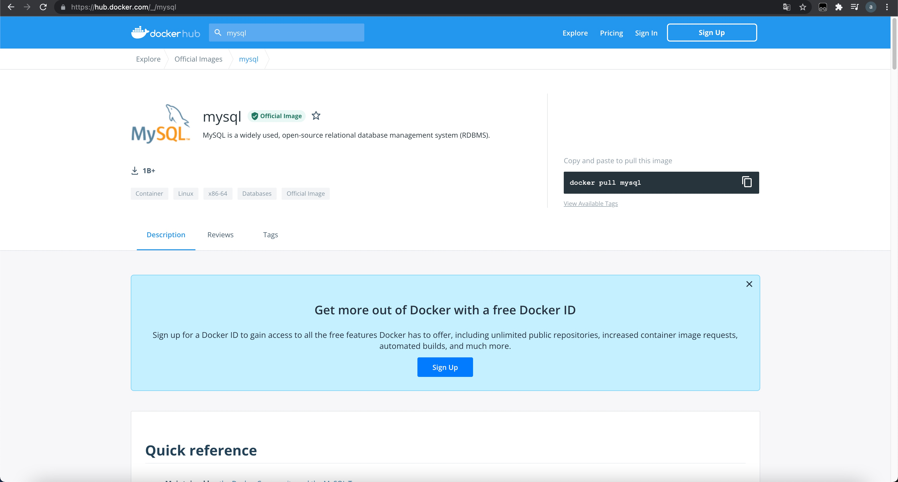

也可以直接通过终端使用`docker search`进行搜素

```bash
[root@localhost config]## docker search mysql
NAME                              DESCRIPTION                                     STARS     OFFICIAL   AUTOMATED
mysql                             MySQL is a widely used, open-source relation…   11748     [OK]
mariadb                           MariaDB Server is a high performing open sou…   4478      [OK]
mysql/mysql-server                Optimized MySQL Server Docker images. Create…   877                  [OK]
```

可选值

```bash
-f, --filter=STARS=3000 ## 搜索出来的镜像就是STARS大于3000的

[root@localhost config]## docker search mysql --filter=STARS=3000
NAME      DESCRIPTION                                     STARS     OFFICIAL   AUTOMATED
mysql     MySQL is a widely used, open-source relation…   11748     [OK]
mariadb   MariaDB Server is a high performing open sou…   4478      [OK]
```

3. docker pull ## 拉取，下载镜像

```bash
## 下载镜像 docker pull 镜像名[:tag(版本名)]
[root@localhost config]## docker pull mysql
Using default tag: latest ## 如果不写tag，默认就是latest
latest: Pulling from library/mysql
a10c77af2613: Pull complete ## 分层下载，docker image的核心，联合文件系统
b76a7eb51ffd: Pull complete
258223f927e4: Pull complete
2d2c75386df9: Pull complete
63e92e4046c9: Pull complete
f5845c731544: Pull complete
bd0401123a9b: Pull complete
3ef07ec35f1a: Pull complete
c93a31315089: Pull complete
3349ed800d44: Pull complete
6d01857ca4c1: Pull complete
4cc13890eda8: Pull complete
Digest: sha256:aeecae58035f3868bf4f00e5fc623630d8b438db9d05f4d8c6538deb14d4c31b ## 签名
Status: Downloaded newer image for mysql:latest
docker.io/library/mysql:latest ## 真实地址
```

`docker pull msyql`等价于`docker pull docker.io/library/mysql:latest`

指定版本下载

分层下载：把MySQL当成一个千层饼，不同的版本中，有存在相同的资源，比如说现在已经下载了msyql8.0版本，当我们在下载mysql5.7版本的时候，一些已经存在的资源时不需要下载的，极大的节省了内存

```bash
[root@localhost config]## docker pull mysql:5.7 ## 这个版本一定要在官方仓库中有
5.7: Pulling from library/mysql
a10c77af2613: Already exists
b76a7eb51ffd: Already exists
258223f927e4: Already exists
2d2c75386df9: Already exists
63e92e4046c9: Already exists
f5845c731544: Already exists
bd0401123a9b: Already exists
2724b2da64fd: Pull complete
d10a7e9e325c: Pull complete
1c5fd9c3683d: Pull complete
2e35f83a12e9: Pull complete
Digest: sha256:7a3a7b7a29e6fbff433c339fc52245435fa2c308586481f2f92ab1df239d6a29
Status: Downloaded newer image for mysql:5.7
docker.io/library/mysql:5.7
```

```bash
[root@localhost config]## docker images
REPOSITORY    TAG       IMAGE ID       CREATED        SIZE
mysql         5.7       8b43c6af2ad0   12 days ago    448MB
mysql         latest    b05128b000dd   12 days ago    516MB
hello-world   latest    feb5d9fea6a5   2 months ago   13.3kB
```

4. docker rmi ## 删除镜像

可以通过名称或者id删除

```bash
[root@localhost config]## docker rmi 8b43c6af2ad0
Untagged: mysql:5.7
Untagged: mysql@sha256:7a3a7b7a29e6fbff433c339fc52245435fa2c308586481f2f92ab1df239d6a29
Deleted: sha256:8b43c6af2ad08d95cdcb415d245446909a6cbc1875604c48c4325972e5b00442
Deleted: sha256:aad43f4d2f66438acd2d156216cd544a728851238714975c38d9a690f68afc57
Deleted: sha256:7b9addbc002c1e828aee7ec5c2679b04a591b6fa2b96002701ddee9d4ed54395
Deleted: sha256:b00f8e4e6ce8920fb563615503f232799ab380b338c3f2cbb5e86a2d762a6e80
Deleted: sha256:8fbabb17fd7b46a59cc15301741bf73a527b862f59cc6e84fae15b4dd5c425c0
```

全部删除

```bash
## -f 递归删除，$(docker images -aq)：复合查询出所有的镜像
[root@localhost config]## docker rmi -f $(docker images -aq)
Untagged: mysql:latest
Untagged: mysql@sha256:aeecae58035f3868bf4f00e5fc623630d8b438db9d05f4d8c6538deb14d4c31b
Deleted: sha256:b05128b000ddbafb0a0d2713086c6a1cc23280dee3529d37f03c98c97c8cf1ed
Deleted: sha256:2920230e18d6833c32c9f851905df9d3e2958a43b771c84908234ac031b25a45
Deleted: sha256:a790dd6a368bc9aa7d1b251b46ac2fc718ebae5a38ed51ff89ff99955dadaa35
Deleted: sha256:cd87c1db4b159f37f092e73a52c10d5ccb837ed7bfcdc3b008038540390454a4
Deleted: sha256:7f92300b04af4aef96d5ef6fab1e27456cef354eca04733d396ad74478bee7d8
Deleted: sha256:6a59f55eb4945598b4889ea269d79f8b99563c96e97ba2373e19712732d20352
Deleted: sha256:87030c256d8077b4d969e5819f5da01ed08f29e115eaec61b58b3f3134175e1e
Deleted: sha256:b1694d0bb0b1be63e940478b93aa34f46e18f8371539ccee3b5d580cbf576812
Deleted: sha256:f323fd0baccb89f82a5711fa6291f3b4c977b85c3bbba59b1080205b498133b1
Deleted: sha256:47a2799e90faa9d9aaaa4b63457390dcbf5b26ce67f0926821c50b982d741e32
Deleted: sha256:156f55d34ef3e567ef39380f8d86f7c946927a099a43205de8721e60bfef526e
Deleted: sha256:bb282bb84eb90a6040504a46f462ebe55cb9623df13219fc39f434a53ccd1687
Deleted: sha256:77b323d4ec74aad770337f99a60e862a64ccc53f4775b5f4945df0e606f78b90
Untagged: hello-world:latest
Untagged: hello-world@sha256:cc15c5b292d8525effc0f89cb299f1804f3a725c8d05e158653a563f15e4f685
Deleted: sha256:feb5d9fea6a5e9606aa995e879d862b825965ba48de054caab5ef356dc6b3412
```

没有任何的镜像了

```bash
[root@localhost config]## docker images
REPOSITORY   TAG       IMAGE ID   CREATED   SIZE
```

### 容器命令

说明：有了镜像才可以创建容器，下载一个centos镜像来测试学习，在docker中装一个linux来测试

```bash
docker pull centos
```

#### 新建容器并启动

```bash
docker run [可选参数] image

## 参数说明

--name="name"   容器名字 tomcat01、tomcat02等，用来区分容器
-d              后台方式运行，以前jar 经常使用nohup
-it             使用交互方式运行，进入容器查看内容
-p              指定容器的端口 -p 8080:8080（小写p）
    -p          ip:主机端口
    -p          主机端口:容器端口（常用的）
    -p          容器端口，不往外面走
    容器端口
-P              随机指定端口（大写P）
```

测试

```bash
[root@localhost config]## docker run -it centos /bin/bash ## 启动并进入容器
[root@8310454bec59 /]#

## 查看容器的centos，基础版本，很多命令都是不完善的
[root@8310454bec59 /]## ls
bin  dev  etc  home  lib  lib64  lost+found  media  mnt  opt  proc  root  run  sbin  srv  sys  tmp  usr  var

## 退出容器
[root@8310454bec59 /]## exit
exit
```

#### 列出所有运行中的容器

```bash
docker ps 命令
-a ## 列出当前正在运行的容器+带出历史运行过的容器
-n=? ## 显示最近创建的容器，比如n=1显示最近创建的最后一个容器
-q ## 只显示容器的编号

[root@localhost config]## docker ps -a ## 列出之前所有运行的容器
CONTAINER ID   IMAGE          COMMAND       CREATED         STATUS                     PORTS     NAMES
8310454bec59   centos         "/bin/bash"   3 minutes ago   Exited (0) 2 minutes ago             gracious_germain
66d940b76782   feb5d9fea6a5   "/hello"      4 hours ago     Exited (0) 4 hours ago               kind_mcnulty
```

#### 退出容器

```bash
exit ## 直接容器停止并退出

ctrl+p+q ## 容器不停止退出 （mac：coontrol+q+p）
```

#### 删除容器

```bash
docker rm 容器id ## 删除指定的容器，不能删除正在运行的容器，需要加-f强制删除
docker rm -f $(docker ps -aq) ## 删除所有的容器
docker ps -a -q|xargs docker rm ## 删除所有的容器，通过管道的方式
```

#### 启动和停止容器的操作

```bash
docker start 容器id       ## 启动容器
docker restart 容器id     ## 重启容器
docker stop 容器id        ## 停止当前正在运行的容器
docker kill 容器id        ## 强制停止当前容器
```

### 其他命令

#### 后台启动容器

```bash
## 命令 docker run -d 镜像名
[root@localhost config]## docker run -d centos
e6848eae16a89f15910c8cbe195e705239396f9036d102596788dc486860fcff
```

问题：docker ps，发现centos停止了

常见的坑，docker容器用后台运行，就必须要有一个前台进程，docker发现没有应用，就会自动停止。比如，Nginx容器启动后，发现自己没有提供服务，就会立刻停止，就是没有程序了

#### 查看日志命令

```bash
docker logs -tf --tail 容器，没有日志

## 自己编写一段shell脚本
docker run -d centos /bin/sh -c "while true;do echo zhangsan;sleep 1;done"

## 显示日志
-tf             ## 显示日志
-tail number    ## 要显示的日志条数
docker logs -tf --tail 10 e6848eae16a8
```

日志结果

```bash
[root@localhost config]## docker logs -tf --tail 10 f57b469927ac
2021-11-30T08:25:28.449424151Z zhangsan
2021-11-30T08:25:29.451613470Z zhangsan
2021-11-30T08:25:30.454649954Z zhangsan
2021-11-30T08:25:31.457364872Z zhangsan
2021-11-30T08:25:32.459740173Z zhangsan
2021-11-30T08:25:33.462692964Z zhangsan
2021-11-30T08:25:34.465015905Z zhangsan
2021-11-30T08:25:35.467454025Z zhangsan
2021-11-30T08:25:36.469816104Z zhangsan
2021-11-30T08:25:37.472183746Z zhangsan
2021-11-30T08:25:38.475065076Z zhangsan
```

#### 查看容器中的进程信息ps

```bash
[root@localhost config]## docker top f57b469927ac
UID                 PID                 PPID                C                   STIME               TTY                 TIME                CMD
root                3520                3500                0                   16:25               ?                   00:00:00            /bin/sh -c while true;do echo zhangsan;sleep 1;done
root                3693                3520                0                   16:27               ?                   00:00:00            /usr/bin/coreutils --coreutils-prog-shebang=sleep /usr/bin/sleep 1
```

#### 查看镜像的元数据

```bash
[root@localhost config]## docker inspect f57b469927ac
[
    {
        "Id": "f57b469927ac7883aa3a5c6b72d13ac3e5c8d5355fe257c80621900a727e492e",
        "Created": "2021-11-30T08:25:20.115734668Z",
        "Path": "/bin/sh",
        "Args": [
            "-c",
            "while true;do echo zhangsan;sleep 1;done"
        ],
        "State": {
            "Status": "running",
            "Running": true,
            "Paused": false,
            "Restarting": false,
            "OOMKilled": false,
            "Dead": false,
            "Pid": 3520,
            "ExitCode": 0,
            "Error": "",
            "StartedAt": "2021-11-30T08:25:20.434063675Z",
            "FinishedAt": "0001-01-01T00:00:00Z"
        },
        "Image": "sha256:5d0da3dc976460b72c77d94c8a1ad043720b0416bfc16c52c45d4847e53fadb6",
        "ResolvConfPath": "/var/lib/docker/containers/f57b469927ac7883aa3a5c6b72d13ac3e5c8d5355fe257c80621900a727e492e/resolv.conf",
        "HostnamePath": "/var/lib/docker/containers/f57b469927ac7883aa3a5c6b72d13ac3e5c8d5355fe257c80621900a727e492e/hostname",
        "HostsPath": "/var/lib/docker/containers/f57b469927ac7883aa3a5c6b72d13ac3e5c8d5355fe257c80621900a727e492e/hosts",
        "LogPath": "/var/lib/docker/containers/f57b469927ac7883aa3a5c6b72d13ac3e5c8d5355fe257c80621900a727e492e/f57b469927ac7883aa3a5c6b72d13ac3e5c8d5355fe257c80621900a727e492e-json.log",
        "Name": "/distracted_shannon",
        "RestartCount": 0,
        "Driver": "overlay2",
        "Platform": "linux",
        "MountLabel": "",
        "ProcessLabel": "",
        "AppArmorProfile": "",
        "ExecIDs": null,
        "HostConfig": {
            "Binds": null,
            "ContainerIDFile": "",
            "LogConfig": {
                "Type": "json-file",
                "Config": {}
            },
            "NetworkMode": "default",
            "PortBindings": {},
            "RestartPolicy": {
                "Name": "no",
                "MaximumRetryCount": 0
            },
            "AutoRemove": false,
            "VolumeDriver": "",
            "VolumesFrom": null,
            "CapAdd": null,
            "CapDrop": null,
            "CgroupnsMode": "host",
            "Dns": [],
            "DnsOptions": [],
            "DnsSearch": [],
            "ExtraHosts": null,
            "GroupAdd": null,
            "IpcMode": "private",
            "Cgroup": "",
            "Links": null,
            "OomScoreAdj": 0,
            "PidMode": "",
            "Privileged": false,
            "PublishAllPorts": false,
            "ReadonlyRootfs": false,
            "SecurityOpt": null,
            "UTSMode": "",
            "UsernsMode": "",
            "ShmSize": 67108864,
            "Runtime": "runc",
            "ConsoleSize": [
                0,
                0
            ],
            "Isolation": "",
            "CpuShares": 0,
            "Memory": 0,
            "NanoCpus": 0,
            "CgroupParent": "",
            "BlkioWeight": 0,
            "BlkioWeightDevice": [],
            "BlkioDeviceReadBps": null,
            "BlkioDeviceWriteBps": null,
            "BlkioDeviceReadIOps": null,
            "BlkioDeviceWriteIOps": null,
            "CpuPeriod": 0,
            "CpuQuota": 0,
            "CpuRealtimePeriod": 0,
            "CpuRealtimeRuntime": 0,
            "CpusetCpus": "",
            "CpusetMems": "",
            "Devices": [],
            "DeviceCgroupRules": null,
            "DeviceRequests": null,
            "KernelMemory": 0,
            "KernelMemoryTCP": 0,
            "MemoryReservation": 0,
            "MemorySwap": 0,
            "MemorySwappiness": null,
            "OomKillDisable": false,
            "PidsLimit": null,
            "Ulimits": null,
            "CpuCount": 0,
            "CpuPercent": 0,
            "IOMaximumIOps": 0,
            "IOMaximumBandwidth": 0,
            "MaskedPaths": [
                "/proc/asound",
                "/proc/acpi",
                "/proc/kcore",
                "/proc/keys",
                "/proc/latency_stats",
                "/proc/timer_list",
                "/proc/timer_stats",
                "/proc/sched_debug",
                "/proc/scsi",
                "/sys/firmware"
            ],
            "ReadonlyPaths": [
                "/proc/bus",
                "/proc/fs",
                "/proc/irq",
                "/proc/sys",
                "/proc/sysrq-trigger"
            ]
        },
        "GraphDriver": {
            "Data": {
                "LowerDir": "/var/lib/docker/overlay2/d0af445884236d4114644346051c3d09bc7fa53b10206e7aff3b1b66a8b40541-init/diff:/var/lib/docker/overlay2/d39436851978407d2c59f9a2df2ac07eca93c0b44222a9063efd4b16e8bddf1f/diff",
                "MergedDir": "/var/lib/docker/overlay2/d0af445884236d4114644346051c3d09bc7fa53b10206e7aff3b1b66a8b40541/merged",
                "UpperDir": "/var/lib/docker/overlay2/d0af445884236d4114644346051c3d09bc7fa53b10206e7aff3b1b66a8b40541/diff",
                "WorkDir": "/var/lib/docker/overlay2/d0af445884236d4114644346051c3d09bc7fa53b10206e7aff3b1b66a8b40541/work"
            },
            "Name": "overlay2"
        },
        "Mounts": [],
        "Config": {
            "Hostname": "f57b469927ac",
            "Domainname": "",
            "User": "",
            "AttachStdin": false,
            "AttachStdout": false,
            "AttachStderr": false,
            "Tty": false,
            "OpenStdin": false,
            "StdinOnce": false,
            "Env": [
                "PATH=/usr/local/sbin:/usr/local/bin:/usr/sbin:/usr/bin:/sbin:/bin"
            ],
            "Cmd": [
                "/bin/sh",
                "-c",
                "while true;do echo zhangsan;sleep 1;done"
            ],
            "Image": "centos",
            "Volumes": null,
            "WorkingDir": "",
            "Entrypoint": null,
            "OnBuild": null,
            "Labels": {
                "org.label-schema.build-date": "20210915",
                "org.label-schema.license": "GPLv2",
                "org.label-schema.name": "CentOS Base Image",
                "org.label-schema.schema-version": "1.0",
                "org.label-schema.vendor": "CentOS"
            }
        },
        "NetworkSettings": {
            "Bridge": "",
            "SandboxID": "4152ac3753a5be8c7ba1fd1db56d77a400abe11f28dca0a040ec03073c773fac",
            "HairpinMode": false,
            "LinkLocalIPv6Address": "",
            "LinkLocalIPv6PrefixLen": 0,
            "Ports": {},
            "SandboxKey": "/var/run/docker/netns/4152ac3753a5",
            "SecondaryIPAddresses": null,
            "SecondaryIPv6Addresses": null,
            "EndpointID": "09153182eaa753b3f9f0117e7fc7fb9e5a5bab63420a3aac5196aaf12d6705cc",
            "Gateway": "172.17.0.1",
            "GlobalIPv6Address": "",
            "GlobalIPv6PrefixLen": 0,
            "IPAddress": "172.17.0.2",
            "IPPrefixLen": 16,
            "IPv6Gateway": "",
            "MacAddress": "02:42:ac:11:00:02",
            "Networks": {
                "bridge": {
                    "IPAMConfig": null,
                    "Links": null,
                    "Aliases": null,
                    "NetworkID": "2f93b7d3e704e8758194cc6a3d1d9367205362d8cdc71d26cccaff40b6448c65",
                    "EndpointID": "09153182eaa753b3f9f0117e7fc7fb9e5a5bab63420a3aac5196aaf12d6705cc",
                    "Gateway": "172.17.0.1",
                    "IPAddress": "172.17.0.2",
                    "IPPrefixLen": 16,
                    "IPv6Gateway": "",
                    "GlobalIPv6Address": "",
                    "GlobalIPv6PrefixLen": 0,
                    "MacAddress": "02:42:ac:11:00:02",
                    "DriverOpts": null
                }
            }
        }
    }
]
```

#### 进入当前正在运行的容器

我们通常容器都是使用后台方式运行的，当需要进入容器修改一些配置的时候

方式一

```bash
docker exec -it 容器id bashShell

## 比如
[root@localhost config]## docker exec -it f57b469927ac /bin/bash
[root@f57b469927ac /]## ps -ef
UID         PID   PPID  C STIME TTY          TIME CMD
root          1      0  0 08:25 ?        00:00:00 /bin/sh -c while true;do echo zhangsan;sleep 1;done
root        846      0  0 08:39 pts/0    00:00:00 /bin/bash
root        884      1  0 08:39 ?        00:00:00 /usr/bin/coreutils --coreutils-prog-shebang=sleep /usr/bin/sleep 1
root        885    846  0 08:39 pts/0    00:00:00 ps -ef
```

方式二

```bash
docker attach 容器id

## 测试

docker attach f57b469927ac
当前正在执行前台代码...
```

二者的区别

- docker exec 进入容器后开启一个新的终端，可以在里面操作（常用的）
- docker attach 进入容器正在执行的终端，不会启动新的进程

#### 从容器内拷贝文件到主机上

```bash
docker cp 容器id:容器内路径 目的主机路径

[root@localhost opt]## docker cp d7172d136b18:/opt/test.txt /opt/
[root@localhost opt]## ll
总用量 2388
drwx--x--x. 4 root root      28 11月 30 11:02 containerd
drwxrwxr-x. 9 root root    4096 11月 29 23:19 redis-6.2.1
-rw-r--r--. 1 root root 2438367 11月 23 12:55 redis-6.2.1.tar.gz
drwxr-xr-x. 3 root root      26 11月 23 12:50 rh
-rw-r--r--. 1 root root       0 11月 30 16:59 test.txt
```

拷贝是一个手动过程，未来我们使用 -v 卷的技术，可以实现自动同步 将容器中的/home和linux中的/home目录打通

### 小结

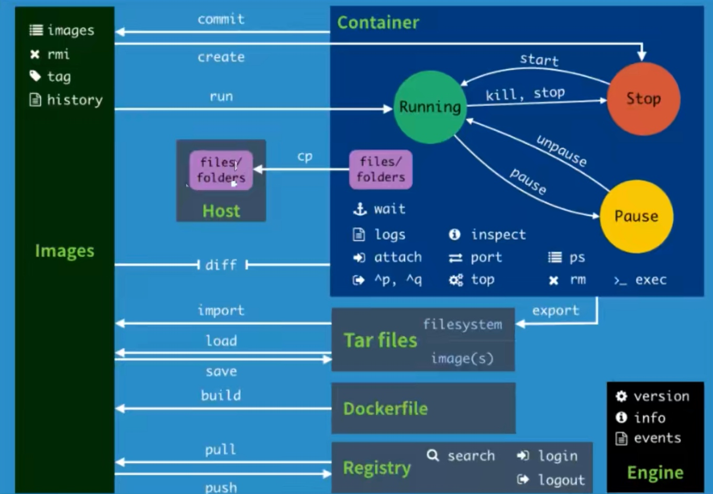

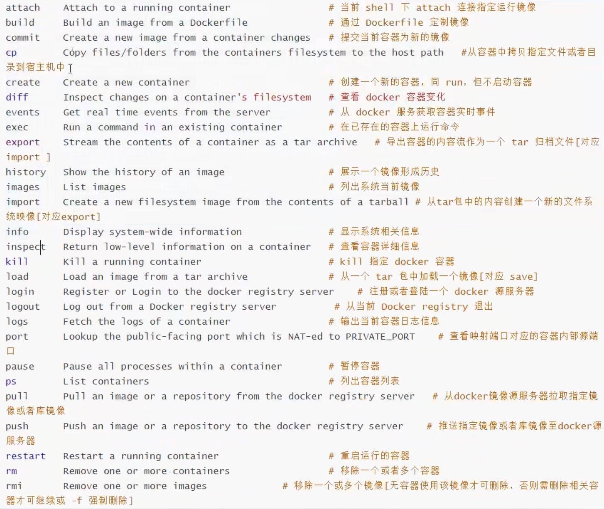

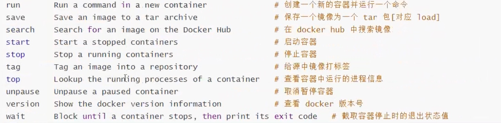

### 命令练习

#### Docker安装Nginx

Nginx主要用作负载均衡和反向代理

1. 搜索镜像

```bash
[root@localhost opt]## docker search nginx
NAME                              DESCRIPTION                                     STARS     OFFICIAL   AUTOMATED
nginx                             Official build of Nginx.                        15893     [OK]
jwilder/nginx-proxy               Automated Nginx reverse proxy for docker con…   2098                 [OK]
richarvey/nginx-php-fpm           Container running Nginx + PHP-FPM capable of…   819                  [OK]
jc21/nginx-proxy-manager          Docker container for managing Nginx proxy ho…   285
linuxserver/nginx                 An Nginx container, brought to you by LinuxS…   160
tiangolo/nginx-rtmp               Docker image with Nginx using the nginx-rtmp…   146                  [OK]
jlesage/nginx-proxy-manager       Docker container for Nginx Proxy Manager        144                  [OK]
alfg/nginx-rtmp                   NGINX, nginx-rtmp-module and FFmpeg from sou…   110                  [OK]
nginxdemos/hello                  NGINX webserver that serves a simple page co…   78                   [OK]
privatebin/nginx-fpm-alpine       PrivateBin running on an Nginx, php-fpm & Al…   60                   [OK]
nginx/nginx-ingress               NGINX and  NGINX Plus Ingress Controllers fo…   57
nginxinc/nginx-unprivileged       Unprivileged NGINX Dockerfiles                  54
nginxproxy/nginx-proxy            Automated Nginx reverse proxy for docker con…   28
staticfloat/nginx-certbot         Opinionated setup for automatic TLS certs lo…   25                   [OK]
nginx/nginx-prometheus-exporter   NGINX Prometheus Exporter for NGINX and NGIN…   22
schmunk42/nginx-redirect          A very simple container to redirect HTTP tra…   19                   [OK]
centos/nginx-112-centos7          Platform for running nginx 1.12 or building …   16
centos/nginx-18-centos7           Platform for running nginx 1.8 or building n…   13
flashspys/nginx-static            Super Lightweight Nginx Image                   11                   [OK]
bitwarden/nginx                   The Bitwarden nginx web server acting as a r…   11
mailu/nginx                       Mailu nginx frontend                            9                    [OK]
webdevops/nginx                   Nginx container                                 9                    [OK]
sophos/nginx-vts-exporter         Simple server that scrapes Nginx vts stats a…   7                    [OK]
ansibleplaybookbundle/nginx-apb   An APB to deploy NGINX                          3                    [OK]
wodby/nginx                       Generic nginx                                   1                    [OK]
```

2. 拉取下载镜像

```bash
[root@localhost opt]## docker pull nginx
Using default tag: latest
latest: Pulling from library/nginx
eff15d958d66: Pull complete
1e5351450a59: Pull complete
2df63e6ce2be: Pull complete
9171c7ae368c: Pull complete
020f975acd28: Pull complete
266f639b35ad: Pull complete
Digest: sha256:097c3a0913d7e3a5b01b6c685a60c03632fc7a2b50bc8e35bcaa3691d788226e
Status: Downloaded newer image for nginx:latest
docker.io/library/nginx:latest
```

3. 查看是否已经下载完成

```bash
[root@localhost opt]## docker images
REPOSITORY   TAG       IMAGE ID       CREATED        SIZE
nginx        latest    ea335eea17ab   13 days ago    141MB
centos       latest    5d0da3dc9764   2 months ago   231MB
```

端口暴露的概念

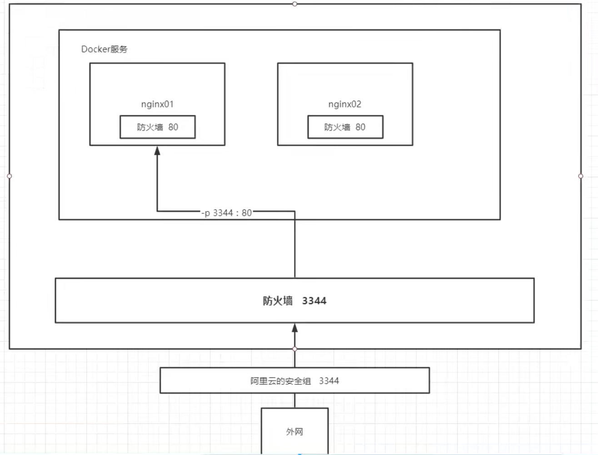

4. 启动nginx

```bash
## -d 后台运行
## --name 给容器命名
## -p 宿主机端口，容器内部端口
[root@localhost opt]## docker run -d --name nginx01 -p 3344:80 nginx
aa575c8844ddae600a72eb6b54f51dfd5c52063c21d10b63ea0b096aec7d7a2e
```

5. 查看当前进程是否存在Nginx

```bash
[root@localhost opt]## docker ps
CONTAINER ID   IMAGE     COMMAND                  CREATED         STATUS         PORTS                                   NAMES
aa575c8844dd   nginx     "/docker-entrypoint.…"   5 seconds ago   Up 4 seconds   0.0.0.0:3344->80/tcp, :::3344->80/tcp   nginx01
d7172d136b18   centos    "/bin/bash"              2 hours ago     Up 2 hours                                             kind_noyce
```

6. 访问测试

```bash
[root@localhost opt]## curl localhost:3344
<!DOCTYPE html>
<html>
<head>
<title>Welcome to nginx!</title>
<style>
html { color-scheme: light dark; }
body { width: 35em; margin: 0 auto;
font-family: Tahoma, Verdana, Arial, sans-serif; }
</style>
</head>
<body>
<h1>Welcome to nginx!</h1>
<p>If you see this page, the nginx web server is successfully installed and
working. Further configuration is required.</p>

<p>For online documentation and support please refer to
<a href="http://nginx.org/">nginx.org</a>.<br/>
Commercial support is available at
<a href="http://nginx.com/">nginx.com</a>.</p>

<p><em>Thank you for using nginx.</em></p>
</body>
</html>
```

通过浏览器访问

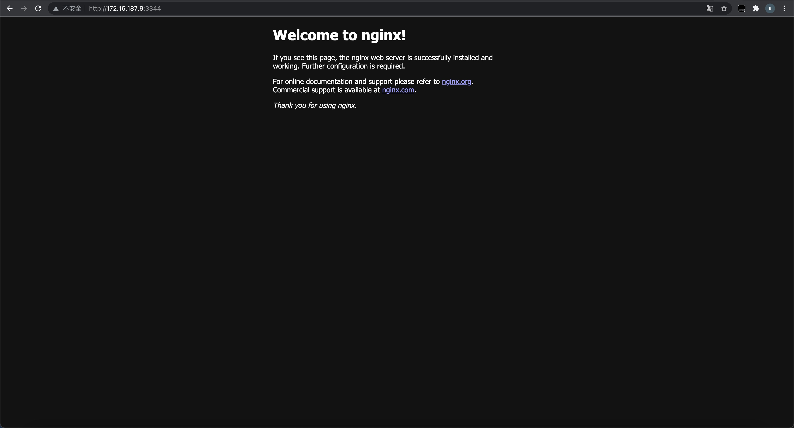

我们也可以进入nginx容器查看

```bash
nginx:[root@localhost opt]## docker exec -it nginx01 /bin/bash
root@aa575c8844dd:/## whereis nginx
nginx: /usr/sbin/nginx /usr/lib/nginx /etc/nginx /usr/share/nginx
```

思考问题：我们每次改动nginx配置文件，都需要进入容器内部，十分的麻烦，我要是可以在容器外部提供一个映射路径，达到在容器外部修改文件，容器内部就可以自动修改

可以通过 -v 数据卷技术

#### Docker安装Tomcat

docker run 如果在本地找不到该镜像的话，就会从远程仓库中下载

1. 下载

官方的使用：`docker run -it --rm tomcat:9.0`

我们之前的启动都是后台启动，停止了容器之后，容器还是可以查到，`docker run -it --rm`这种方式一般用来测试，用完即删除

```bash
[root@localhost opt]## docker pull tomcat:9.0
9.0: Pulling from library/tomcat
Digest: sha256:db8ac6f67c9865d634dc767ea3c3726beb7ca58998f4295b3bab8eee1410b58c
Status: Image is up to date for tomcat:9.0
docker.io/library/tomcat:9.0
```


2. 启动运行

本地都有了，还要去下载，没有指明版本号

```bash
[root@localhost opt]## docker run -d -p 3355:8080 --name tomcat01 tomcat
Unable to find image 'tomcat:latest' locally
latest: Pulling from library/tomcat
647acf3d48c2: Already exists
b02967ef0034: Already exists
e1ad2231829e: Already exists
5576ce26bf1d: Already exists
26518d6c686a: Already exists
cdb1f4e0dbfd: Already exists
1d872b5136cc: Already exists
0b9db4d94c97: Already exists
03ee64d25ffd: Pull complete
45a601314df9: Pull complete
Digest: sha256:93ff3bc7fb766a9bb5bb0d1f925f9d8795594d87e8365164908ddddcdaa75ff4
Status: Downloaded newer image for tomcat:latest
85cf11058d2abb2a0b15977fb1c8df74bbb671114b92ac73974326fb720b9788
[root@localhost opt]## docker ps
CONTAINER ID   IMAGE     COMMAND             CREATED          STATUS         PORTS                                       NAMES
85cf11058d2a   tomcat    "catalina.sh run"   10 seconds ago   Up 9 seconds   0.0.0.0:3355->8080/tcp, :::3355->8080/tcp   tomcat01
```

3. 测试访问没有问题


但是为什么没有显示主页呢？

官方的镜像是一个阉割版的，进入容器之后，查看webapps中是空的

```bash
[root@localhost opt]## docker exec -it tomcat01 /bin/bash
root@85cf11058d2a:/usr/local/tomcat## ls
BUILDING.txt	 LICENSE  README.md	 RUNNING.txt  conf  logs	    temp     webapps.dist
CONTRIBUTING.md  NOTICE   RELEASE-NOTES  bin	      lib   native-jni-lib  webapps  work
root@85cf11058d2a:/usr/local/tomcat## ls -al
total 132
drwxr-xr-x. 1 root root    30 Nov 18 14:49 .
drwxr-xr-x. 1 root root    20 Nov 18 14:43 ..
-rw-r--r--. 1 root root 18994 Nov  9 22:12 BUILDING.txt
-rw-r--r--. 1 root root  6210 Nov  9 22:12 CONTRIBUTING.md
-rw-r--r--. 1 root root 60269 Nov  9 22:12 LICENSE
-rw-r--r--. 1 root root  2333 Nov  9 22:12 NOTICE
-rw-r--r--. 1 root root  3372 Nov  9 22:12 README.md
-rw-r--r--. 1 root root  6905 Nov  9 22:12 RELEASE-NOTES
-rw-r--r--. 1 root root 16517 Nov  9 22:12 RUNNING.txt
drwxr-xr-x. 2 root root  4096 Nov 18 14:49 bin
drwxr-xr-x. 1 root root    22 Nov 30 11:18 conf
drwxr-xr-x. 2 root root  4096 Nov 18 14:49 lib
drwxrwxrwx. 1 root root    80 Nov 30 11:18 logs
drwxr-xr-x. 2 root root   159 Nov 18 14:49 native-jni-lib
drwxrwxrwx. 2 root root    30 Nov 18 14:49 temp
drwxr-xr-x. 2 root root     6 Nov 18 14:49 webapps
drwxr-xr-x. 7 root root    81 Nov  9 22:12 webapps.dist
drwxrwxrwx. 2 root root     6 Nov  9 22:12 work
root@85cf11058d2a:/usr/local/tomcat## cd webapps
root@85cf11058d2a:/usr/local/tomcat/webapps## ls -al
total 0
drwxr-xr-x. 2 root root  6 Nov 18 14:49 .
drwxr-xr-x. 1 root root 30 Nov 18 14:49 ..
```

发现问题：

- Linux命令是阉割的
- tomcat webapps是空的，也就是阉割的

原因：阿里云镜像，默认是最小的镜像，所有的不必要的都剔除了。只要保证最小的可运行的环境

其实他这Tomact默认的网站项目存储在webapps.dist目录下

```bash
root@85cf11058d2a:/usr/local/tomcat## ls -la
total 132
drwxr-xr-x. 1 root root    30 Nov 18 14:49 .
drwxr-xr-x. 1 root root    20 Nov 18 14:43 ..
-rw-r--r--. 1 root root 18994 Nov  9 22:12 BUILDING.txt
-rw-r--r--. 1 root root  6210 Nov  9 22:12 CONTRIBUTING.md
-rw-r--r--. 1 root root 60269 Nov  9 22:12 LICENSE
-rw-r--r--. 1 root root  2333 Nov  9 22:12 NOTICE
-rw-r--r--. 1 root root  3372 Nov  9 22:12 README.md
-rw-r--r--. 1 root root  6905 Nov  9 22:12 RELEASE-NOTES
-rw-r--r--. 1 root root 16517 Nov  9 22:12 RUNNING.txt
drwxr-xr-x. 2 root root  4096 Nov 18 14:49 bin
drwxr-xr-x. 1 root root    22 Nov 30 11:18 conf
drwxr-xr-x. 2 root root  4096 Nov 18 14:49 lib
drwxrwxrwx. 1 root root    80 Nov 30 11:18 logs
drwxr-xr-x. 2 root root   159 Nov 18 14:49 native-jni-lib
drwxrwxrwx. 2 root root    30 Nov 18 14:49 temp
drwxr-xr-x. 2 root root     6 Nov 18 14:49 webapps
drwxr-xr-x. 7 root root    81 Nov  9 22:12 webapps.dist
drwxrwxrwx. 2 root root     6 Nov  9 22:12 work
root@85cf11058d2a:/usr/local/tomcat## cd webapps.dist/
root@85cf11058d2a:/usr/local/tomcat/webapps.dist## ls la
ls: cannot access 'la': No such file or directory
root@85cf11058d2a:/usr/local/tomcat/webapps.dist## ls -la
total 4
drwxr-xr-x.  7 root root   81 Nov  9 22:12 .
drwxr-xr-x.  1 root root   30 Nov 18 14:49 ..
drwxr-xr-x.  3 root root  223 Nov 18 14:49 ROOT
drwxr-xr-x. 15 root root 4096 Nov 18 14:49 docs
drwxr-xr-x.  7 root root   99 Nov 18 14:49 examples
drwxr-xr-x.  6 root root   79 Nov 18 14:49 host-manager
drwxr-xr-x.  6 root root  114 Nov 18 14:49 manager
```

我们可以将项目复制到webapps中，或者将webapps.dist改为webapps

```bash
root@85cf11058d2a:/usr/local/tomcat## cp -r webapps.dist/* webapps/
root@85cf11058d2a:/usr/local/tomcat## cd webapps
root@85cf11058d2a:/usr/local/tomcat/webapps## ls -al
total 4
drwxr-xr-x.  1 root root   81 Nov 30 11:29 .
drwxr-xr-x.  1 root root   57 Nov 18 14:49 ..
drwxr-xr-x.  3 root root  223 Nov 30 11:29 ROOT
drwxr-xr-x. 15 root root 4096 Nov 30 11:29 docs
drwxr-xr-x.  7 root root   99 Nov 30 11:29 examples
drwxr-xr-x.  6 root root   79 Nov 30 11:29 host-manager
drwxr-xr-x.  6 root root  114 Nov 30 11:29 manager
```

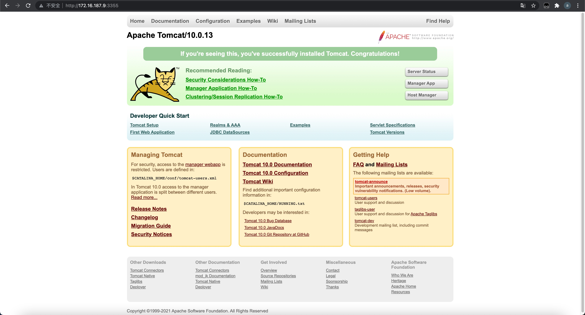


思考问题：我们每次改动nginx配置文件，都需要进入容器内部，十分的麻烦，我要是可以在容器外部提供一个映射路径，达到在容器外部修改文件，容器内部就可以自动修改

我们在外部放置项目，比如在webapps目录下，就自动同步到容器内部就好了

可以通过 -v 数据卷技术

docker容器=tomcat+网站，现在就是如果删除了docker容器之后，就会删除tomcat和网站

以前MySQL的话，是装在Linux中，现在如果要安装MySQL是装到Docker中，如果一不小心把容器删除，数据就没有，很不安全，之后会解决。

#### 部署es+kabana

es 暴露的端口很多，而且es十分的消耗内存，es的数据一般需要放置到安全目录，即挂载

1. docker hub搜索 elasticsearch 下载启动

```bash
docker run -d --name elasticsearch --net somenetwork -p 9200:9200 -p 9300:9300 -e "discovery.type=single-node" elasticsearch:tag

##  --net somenetwork 网络配置，我们这里先不使用即
## 使用版本 7.6.2
docker run -d --name elasticsearch -p 9200:9200 -p 9300:9300 -e "discovery.type=single-node" elasticsearch:7.6.2
```

启动之后，linux就卡住了，elasticsearch太消耗内存了

```bash
[root@localhost opt]## docker ps
CONTAINER ID   IMAGE                 COMMAND                  CREATED          STATUS          PORTS                                                                                  NAMES
6fa5c451240f   elasticsearch:7.6.2   "/usr/local/bin/dock…"   22 seconds ago   Up 21 seconds   0.0.0.0:9200->9200/tcp, :::9200->9200/tcp, 0.0.0.0:9300->9300/tcp, :::9300->9300/tcp   elasticsearch
[root@localhost opt]## docker stats
CONTAINER ID   NAME            CPU %     MEM USAGE / LIMIT     MEM %     NET I/O     BLOCK I/O        PIDS
6fa5c451240f   elasticsearch   0.29%     612.7MiB / 972.4MiB   63.01%    656B / 0B   2.66GB / 364MB   43
```

2. 测试es是否成功了

```bash
[root@localhost opt]## curl localhost:9200
{
  "name" : "6fa5c451240f",
  "cluster_name" : "docker-cluster",
  "cluster_uuid" : "OJ-1vGJ6TzOI3AcXJY-NaQ",
  "version" : {
    "number" : "7.6.2",
    "build_flavor" : "default",
    "build_type" : "docker",
    "build_hash" : "ef48eb35cf30adf4db14086e8aabd07ef6fb113f",
    "build_date" : "2020-03-26T06:34:37.794943Z",
    "build_snapshot" : false,
    "lucene_version" : "8.4.0",
    "minimum_wire_compatibility_version" : "6.8.0",
    "minimum_index_compatibility_version" : "6.0.0-beta1"
  },
  "tagline" : "You Know, for Search"
}
```

3. 因为es非常的消耗内存，为此我们可以限制一下es的内存占用

可以通过修改配置文件，或者-e 参数环境配置修改

```bash
docker run -d --name elasticsearch -p 9200:9200 -p 9300:9300 -e "discovery.type=single-node" -e ES_JAVA_OPS="-Xms64m -Xmx512m" elasticsearch:7.6.2
```

`-e ES_JAVA_OPS="-Xms64m -Xmx512m"`这些参数根据自己的环境修改

作业：使用kabana连接es

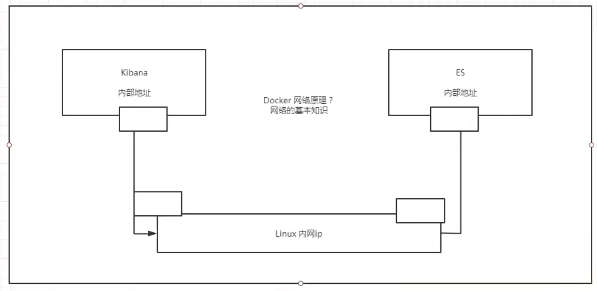

## 镜像

### 镜像是什么

镜像是一种轻量级、可执行的独立软件包，用来打包软件运行环境和基于运行环境开发的软件，它包含了运行某个软件所需的所有内容，包括代码、运行时、库、环境变量和配置文件

所有的应用，直接打包成为Docker镜像，就可以直接部署运行

如何得到镜像呢？

- 从远程仓库下载
- 朋友拷贝给你
- 自己制作一个镜像Dockerfile

### Docker镜像加载原理

#### UnionFS（联合文件系统）

我们在docker pull 下载的时候就是联合文件系统

UnionFS（联合文件系统）：Union文件系统（UnionFS）是一种分层、轻量级并且高性能的文件系统，它支持对文件系统的修改作为一次提交来一层层的叠加，同时可以将不同的目录挂载到同一个虚拟文件系统下（unite several directories into a single virtual filesystem）。Union文件系统是Docker镜像的基础，镜像可以通过分层来进行继承，基于基础镜像（没有父镜像），可以制作各种具体的应用镜像

特性：一次同时加载多个文件系统，但是从外面看起来，只能看到一个文件系统，联合加载会把各层文件系统叠加起来，这样最终的文件系统会包含底层的文件和目录

#### Docker镜像加载原理

Docker的镜像实际上是由一层一层的文件系统组成的，这种层级的文件系统UnionFS

bootfs(boot file system)主要包含bootloader和kernal，bootloader主要是引导加载kernel，Linux刚启动时会加载bootfs文件系统，在Docker镜像的最底层是bootfs。这一层与我们典型的Linux/Unix系统是一样的，包含boot加载器和内核。当boot加载完成之后整个内核就都在内存中了，此时内存的使用权已经由bootfs转交给内核，此时系统也会卸载bootfs

黑屏--开机进入系统的过程叫做加载，这一部分是公用的

rootfs(root file system)，在bootfs之上，包含典型Linux系统中的/dev，/proc，/bin，/etc等标准目录和文件。rootfs就是各种不同的操作系统发行版，比如Ubuntu、Centos等等

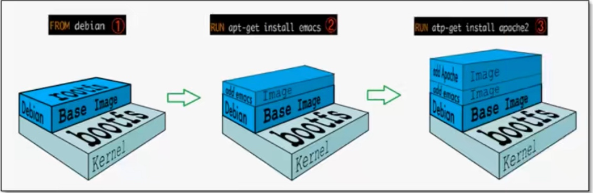

平时我们安装进虚拟机的centos都是好几G的，为什么Docker这里的centos才200M呢？

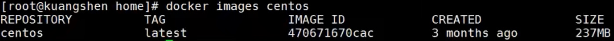

对于一个精简的OS，rootfs可以很小，只需要包含最基本的命令，工具和程序库就可以了，因为底层直接用Host（主机）的kernel，自己需要提供rootfs就可以了，由此可见对于不同的Linux发行版，bootfs基本一致的，rootfs会有差别，因此不同的发行版可以共用bootfs

虚拟机试分钟级别，容器是秒级的

### 分层理解

#### 分层的镜像

我们可以去下载一个镜像，注意观察下载的日志输出，可以看到一层一层的在下载

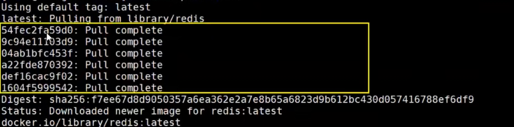

思考：为什么Docker镜像要采用这种分层的结构呢？

最大的好处，我觉得莫过于是资源共享，比如有多个镜像都从相同的Base镜像构建而来，那么宿主机只需要在磁盘上保留一份base镜像，同时内存也只需要加载一份base镜像，这样就可以为所有的容器服务了，而且镜像的每一层都可以被共享

查看镜像分层的方式可以通过`docker image inspect`命令

```bash
[root@localhost opt]## docker image inspect tomcat:latest
[
// ......
        "RootFS": {
            "Type": "layers",
            "Layers": [
                "sha256:a36ba9e322f719a0c71425bd832fc905cac3f9faedcb123c8f6aba13f7b0731b",
                "sha256:5499f2905579e85017f919e25be9e7a50bcc30c61294f12479b289708ebb31fa",
                "sha256:a4aba4e59b40caa040cc3ccfa42a84bbe64e3da8d1e7e0da69100c837afd215a",
                "sha256:8a5844586fdb00f07529ad1b3eb20167ba3a176302ecccbae1fbb45620acb89f",
                "sha256:ab9d251e27cbdd53ed6535ddabeabe3181446f5835c05e13530675308e7ae903",
                "sha256:47ee2d19f81a629f5636916161325202d5787ee5618731ccad3d3e0bc57d5886",
                "sha256:a9e4c93435392db432f410bf38dfdd4ac228bad27ef030eb35e6ff50ba86ee4c",
                "sha256:b87b38d56cd33dc40c6e37b952abfb52761d3e9889dadb5f54ca1b048f245501",
                "sha256:f2d212e4d5abdacb7ae676f9fea80989878aecaf846c5d2cad292444f3fc3a22",
                "sha256:cf0d7f22bbdc88e524f6af5bd67c83fd7235d9a63e2ecd5bccf3317026b6fee9"
            ]
        },
        "Metadata": {
            "LastTagTime": "0001-01-01T00:00:00Z"
        }
    }
]
```

理解：

所有的Docker镜像都起始于一个基础镜像，当进行修改或者增加新的内容时，就会在当前镜像层之上，创建新的镜像层

举一个简单的例子，假如基于Ubuntu Linux16.04创建一个新的镜像，这就是新镜像的第一层；如果在该镜像中添加Python包，就会在基础镜像之上创建第二个镜像层；如果继续添加一个安全补丁，就会创建第三个镜像层

该镜像当前已经包含3个镜像层，如下图所示（这只是一个用于演示的很简单的例子）

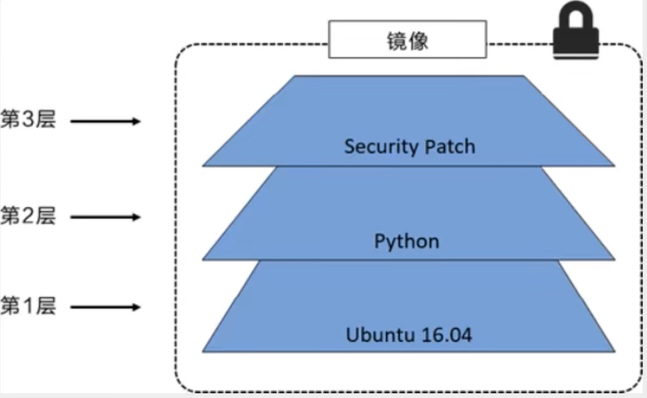

在添加额外的镜像层的同时，镜像始终保持是当前所有镜像的组合，理解这一点非常重要，下图中举了一个简单的例子，每个镜像层包含了3个文件，而镜像包含了来自两个镜像层的6个文件

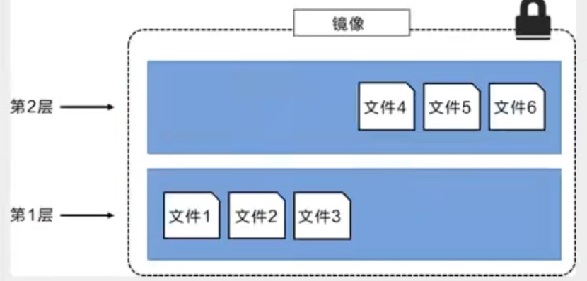

上图中的镜像层跟之前图中的略有区别，主要目的是便于展示文件

下图展示了一个稍微复杂的三层镜像，在外部看来整体镜像只有6个文件，这是因为最上层中的文件7是文件5的一个更新版本

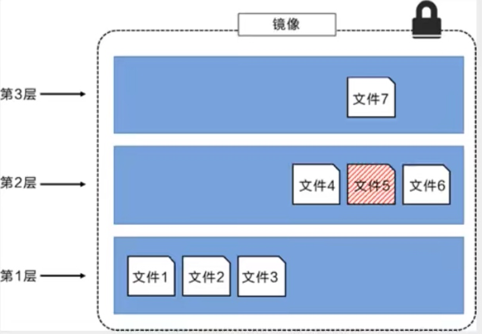

这种情况下，上层镜像层中的文件覆盖了底层镜像中的文件，这样就使得文件的更新版本作为一个新镜像层添加到镜像当中

Docker通过存储引擎（新版本采用快照机制）的方式来实现镜像堆栈，并保证多镜像层对外展示为统一的文件系统

Linux上可用的存储引擎有AUFS、Overlay2、Device Mapper、Btrfs以及ZFS。顾名思义，每种存储引擎都基于Linux中对应的文件系统或者块设备技术，并且每种存储引擎都有其独特的性能特点

Docker在windows上仅支持windowfilter一种存储引擎，该引擎基于NTFS文件系统之上实现了分层和CoW

下图展示了与系统显示相同的三层镜像。所有镜像层堆叠并合并，对外提供统一的视图

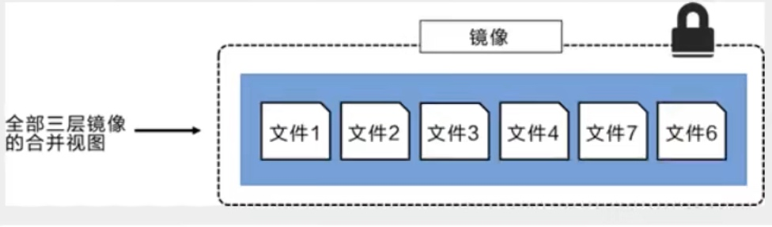

#### 特点

Docker镜像都是只读的，当容器启动时，一个新的可写层被加载到镜像的顶部

这一层就是我们通常说的容器层，容器之下的都叫镜像层

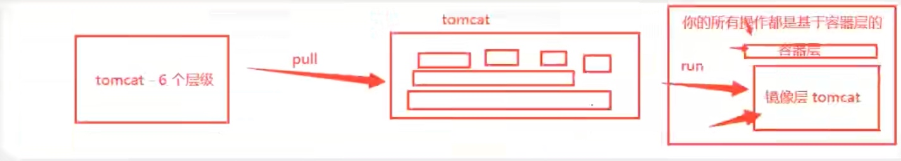

### commit镜像

docker commit 提交容器成为一个新的副本

```
## 命令和git原理类似
docker commit -m="提交的描述信息" -a="作者" 容器id 目标镜像名:[tag]
```

以Tomcat为例

1. 启动默认的tomcat

```bash
[root@localhost opt]## docker run -it -p 8080:8080 tomcat
Using CATALINA_BASE:   /usr/local/tomcat
Using CATALINA_HOME:   /usr/local/tomcat
Using CATALINA_TMPDIR: /usr/local/tomcat/temp
Using JRE_HOME:        /usr/local/openjdk-11
Using CLASSPATH:       /usr/local/tomcat/bin/bootstrap.jar:/usr/local/tomcat/bin/tomcat-juli.jar
Using CATALINA_OPTS:
NOTE: Picked up JDK_JAVA_OPTIONS:  --add-opens=java.base/java.lang=ALL-UNNAMED --add-opens=java.base/java.io=ALL-UNNAMED --add-opens=java.base/java.util=ALL-UNNAMED --add-opens=java.base/java.util.concurrent=ALL-UNNAMED --add-opens=java.rmi/sun.rmi.transport=ALL-UNNAMED
30-Nov-2021 14:40:12.292 INFO [main] org.apache.catalina.startup.VersionLoggerListener.log Server version name:   Apache Tomcat/10.0.13
30-Nov-2021 14:40:12.295 INFO [main] org.apache.catalina.startup.VersionLoggerListener.log Server built:          Nov 9 2021 22:12:58 UTC
30-Nov-2021 14:40:12.295 INFO [main] org.apache.catalina.startup.VersionLoggerListener.log Server version number: 10.0.13.0
30-Nov-2021 14:40:12.295 INFO [main] org.apache.catalina.startup.VersionLoggerListener.log OS Name:               Linux
30-Nov-2021 14:40:12.295 INFO [main] org.apache.catalina.startup.VersionLoggerListener.log OS Version:            3.10.0-1160.el7.x86_64
30-Nov-2021 14:40:12.295 INFO [main] org.apache.catalina.startup.VersionLoggerListener.log Architecture:          amd64
30-Nov-2021 14:40:12.296 INFO [main] org.apache.catalina.startup.VersionLoggerListener.log Java Home:             /usr/local/openjdk-11
30-Nov-2021 14:40:12.296 INFO [main] org.apache.catalina.startup.VersionLoggerListener.log JVM Version:           11.0.13+8
30-Nov-2021 14:40:12.296 INFO [main] org.apache.catalina.startup.VersionLoggerListener.log JVM Vendor:            Oracle Corporation
30-Nov-2021 14:40:12.296 INFO [main] org.apache.catalina.startup.VersionLoggerListener.log CATALINA_BASE:         /usr/local/tomcat
30-Nov-2021 14:40:12.296 INFO [main] org.apache.catalina.startup.VersionLoggerListener.log CATALINA_HOME:         /usr/local/tomcat
30-Nov-2021 14:40:12.328 INFO [main] org.apache.catalina.startup.VersionLoggerListener.log Command line argument: --add-opens=java.base/java.lang=ALL-UNNAMED
30-Nov-2021 14:40:12.328 INFO [main] org.apache.catalina.startup.VersionLoggerListener.log Command line argument: --add-opens=java.base/java.io=ALL-UNNAMED
30-Nov-2021 14:40:12.328 INFO [main] org.apache.catalina.startup.VersionLoggerListener.log Command line argument: --add-opens=java.base/java.util=ALL-UNNAMED
30-Nov-2021 14:40:12.328 INFO [main] org.apache.catalina.startup.VersionLoggerListener.log Command line argument: --add-opens=java.base/java.util.concurrent=ALL-UNNAMED
30-Nov-2021 14:40:12.328 INFO [main] org.apache.catalina.startup.VersionLoggerListener.log Command line argument: --add-opens=java.rmi/sun.rmi.transport=ALL-UNNAMED
30-Nov-2021 14:40:12.328 INFO [main] org.apache.catalina.startup.VersionLoggerListener.log Command line argument: -Djava.util.logging.config.file=/usr/local/tomcat/conf/logging.properties
30-Nov-2021 14:40:12.329 INFO [main] org.apache.catalina.startup.VersionLoggerListener.log Command line argument: -Djava.util.logging.manager=org.apache.juli.ClassLoaderLogManager
30-Nov-2021 14:40:12.329 INFO [main] org.apache.catalina.startup.VersionLoggerListener.log Command line argument: -Djdk.tls.ephemeralDHKeySize=2048
30-Nov-2021 14:40:12.329 INFO [main] org.apache.catalina.startup.VersionLoggerListener.log Command line argument: -Djava.protocol.handler.pkgs=org.apache.catalina.webresources
30-Nov-2021 14:40:12.329 INFO [main] org.apache.catalina.startup.VersionLoggerListener.log Command line argument: -Dorg.apache.catalina.security.SecurityListener.UMASK=0027
30-Nov-2021 14:40:12.329 INFO [main] org.apache.catalina.startup.VersionLoggerListener.log Command line argument: -Dignore.endorsed.dirs=
30-Nov-2021 14:40:12.329 INFO [main] org.apache.catalina.startup.VersionLoggerListener.log Command line argument: -Dcatalina.base=/usr/local/tomcat
30-Nov-2021 14:40:12.329 INFO [main] org.apache.catalina.startup.VersionLoggerListener.log Command line argument: -Dcatalina.home=/usr/local/tomcat
30-Nov-2021 14:40:12.329 INFO [main] org.apache.catalina.startup.VersionLoggerListener.log Command line argument: -Djava.io.tmpdir=/usr/local/tomcat/temp
30-Nov-2021 14:40:12.333 INFO [main] org.apache.catalina.core.AprLifecycleListener.lifecycleEvent Loaded Apache Tomcat Native library [1.2.31] using APR version [1.7.0].
30-Nov-2021 14:40:12.333 INFO [main] org.apache.catalina.core.AprLifecycleListener.lifecycleEvent APR capabilities: IPv6 [true], sendfile [true], accept filters [false], random [true], UDS [true].
30-Nov-2021 14:40:12.337 INFO [main] org.apache.catalina.core.AprLifecycleListener.initializeSSL OpenSSL successfully initialized [OpenSSL 1.1.1k  25 Mar 2021]
30-Nov-2021 14:40:12.753 INFO [main] org.apache.coyote.AbstractProtocol.init Initializing ProtocolHandler ["http-nio-8080"]
30-Nov-2021 14:40:12.778 INFO [main] org.apache.catalina.startup.Catalina.load Server initialization in [669] milliseconds
30-Nov-2021 14:40:12.845 INFO [main] org.apache.catalina.core.StandardService.startInternal Starting service [Catalina]
30-Nov-2021 14:40:12.845 INFO [main] org.apache.catalina.core.StandardEngine.startInternal Starting Servlet engine: [Apache Tomcat/10.0.13]
30-Nov-2021 14:40:12.862 INFO [main] org.apache.coyote.AbstractProtocol.start Starting ProtocolHandler ["http-nio-8080"]
30-Nov-2021 14:40:12.879 INFO [main] org.apache.catalina.startup.Catalina.start Server startup in [100] milliseconds
30-Nov-2021 14:41:42.884 INFO [Catalina-utility-1] org.apache.catalina.startup.HostConfig.deployDirectory Deploying web application directory [/usr/local/tomcat/webapps/ROOT]
30-Nov-2021 14:41:43.252 INFO [Catalina-utility-1] org.apache.catalina.startup.HostConfig.deployDirectory Deployment of web application directory [/usr/local/tomcat/webapps/ROOT] has finished in [368] ms
30-Nov-2021 14:41:43.252 INFO [Catalina-utility-1] org.apache.catalina.startup.HostConfig.deployDirectory Deploying web application directory [/usr/local/tomcat/webapps/docs]
30-Nov-2021 14:41:43.281 INFO [Catalina-utility-1] org.apache.catalina.startup.HostConfig.deployDirectory Deployment of web application directory [/usr/local/tomcat/webapps/docs] has finished in [29] ms
30-Nov-2021 14:41:43.281 INFO [Catalina-utility-1] org.apache.catalina.startup.HostConfig.deployDirectory Deploying web application directory [/usr/local/tomcat/webapps/examples]
30-Nov-2021 14:41:43.570 INFO [Catalina-utility-1] org.apache.catalina.startup.HostConfig.deployDirectory Deployment of web application directory [/usr/local/tomcat/webapps/examples] has finished in [289] ms
30-Nov-2021 14:41:43.571 INFO [Catalina-utility-1] org.apache.catalina.startup.HostConfig.deployDirectory Deploying web application directory [/usr/local/tomcat/webapps/host-manager]
30-Nov-2021 14:41:43.605 INFO [Catalina-utility-1] org.apache.catalina.startup.HostConfig.deployDirectory Deployment of web application directory [/usr/local/tomcat/webapps/host-manager] has finished in [34] ms
30-Nov-2021 14:41:43.605 INFO [Catalina-utility-1] org.apache.catalina.startup.HostConfig.deployDirectory Deploying web application directory [/usr/local/tomcat/webapps/manager]
30-Nov-2021 14:41:43.625 INFO [Catalina-utility-1] org.apache.catalina.startup.HostConfig.deployDirectory Deployment of web application directory [/usr/local/tomcat/webapps/manager] has finished in [20] ms
```

2. 发现这个默认的tomcat的webapps下是没有项目应用的，官方的镜像默认的webapps下面是没有文件的

3. 自己将webapps.dist中的项目应用拷贝到webapps中，也就是在原始的镜像上加了一层

```bash
root@2c5c20e62a37:/usr/local/tomcat/webapps## ls -la
total 4
drwxr-xr-x.  1 root root   81 Nov 30 14:41 .
drwxr-xr-x.  1 root root   57 Nov 18 14:49 ..
drwxr-xr-x.  3 root root  223 Nov 30 14:41 ROOT
drwxr-xr-x. 15 root root 4096 Nov 30 14:41 docs
drwxr-xr-x.  7 root root   99 Nov 30 14:41 examples
drwxr-xr-x.  6 root root   79 Nov 30 14:41 host-manager
drwxr-xr-x.  6 root root  114 Nov 30 14:41 manager
```

4. 将修改过的容器通过commit提交为一个新的镜像，我们以后就使用修改过的镜像就可以了，这就是我们修改过的镜像

```bash
[root@localhost ~]## docker commit -m="app webapps apps" -a="zhangsan" 2c5c20e62a37 tomcat02:1.0
sha256:5d84ec2da22ea290e45a6bd7e488d7fcaf354afb7442bec092dd4a6d70618555
```

5. 查询当前的镜像，已经存在我们提交上去的tomcat02

```bash
[root@localhost ~]## docker images
REPOSITORY            TAG       IMAGE ID       CREATED          SIZE
tomcat02              1.0       5d84ec2da22e   27 seconds ago   684MB
```

如果你想要保存当前容器的状态，就可以通过commit来提交，获得一个镜像，就好比我们以前学习虚拟机的时候的快照

到了这里才是入门Docker

## 容积数据卷

### Docker的理念回顾

将应用和环境打包成一个镜像

但是应用的数据是不应该放在容器中的，如果数据放在容器中，一旦将容器删除之后，数据就丢失了

**需求：数据可以持久化**

比如，安装了一个MySQL容器，删除容器就相当于删除库数据，**需求：MySQL的数据可以存在本地或者其他地方**

容器之间可以有一个数据共享的技术。Docker容器中产生的数据，同步到本地，这就是卷技术。说白了很简单，就是目录的挂载，将容器内的目录挂载到Linux上

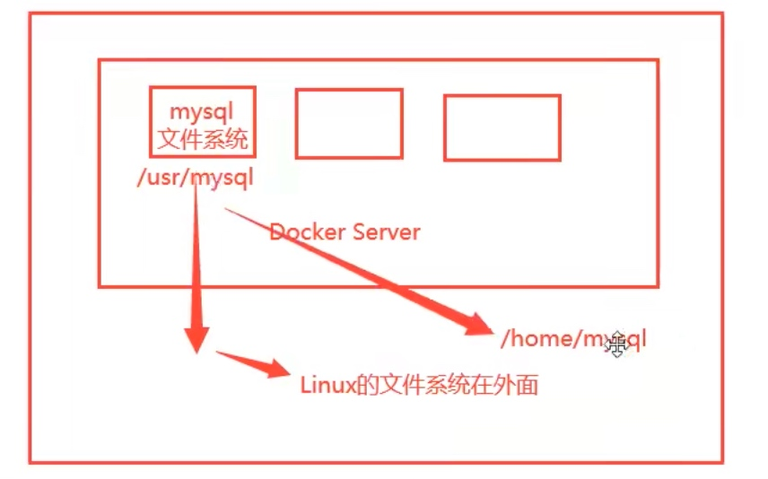

**总结：容器的持久化和同步操作，容器间也是可以数据共享的**

类似于双向绑定

### 使用数据卷

#### 方式一：直接使用命令来挂载 -v （方式二在Dockerfile中说明）

```bash
docker run -it -v 主机的目录:容器内的目录

[root@localhost opt]## docker run -it -v /opt/test:/home centos /bin/bash

## 在opt目录下多出一个目录：test

[root@localhost opt]## ll
总用量 2388
drwx--x--x. 4 root root      28 11月 30 11:02 containerd
drwxrwxr-x. 9 root root    4096 11月 29 23:19 redis-6.2.1
-rw-r--r--. 1 root root 2438367 11月 23 12:55 redis-6.2.1.tar.gz
drwxr-xr-x. 3 root root      26 11月 23 12:50 rh
drwxr-xr-x. 2 root root       6 11月 30 23:35 test
-rw-r--r--. 1 root root       0 11月 30 16:59 test.txt
```

通过查看当前容器信息可以看到数据卷挂载信息

```bash
[root@localhost opt]## docker inspect 31099f8a98d2
[
    {
        // ......
        "Mounts": [
            {
                "Type": "bind",
                "Source": "/opt/test",
                "Destination": "/home",
                "Mode": "",
                "RW": true,
                "Propagation": "rprivate"
            }
        ],
        // ......
    }
]
```

测试文件的同步

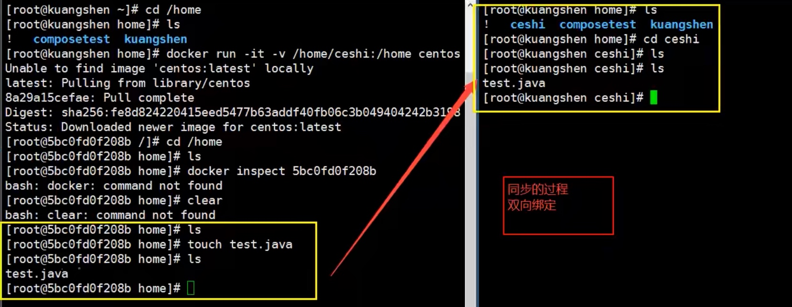

测试文件内容的同步

- 停止容器
- 宿主机上修改文件内容
- 再次启动容器，容器内的数据依旧是同步的

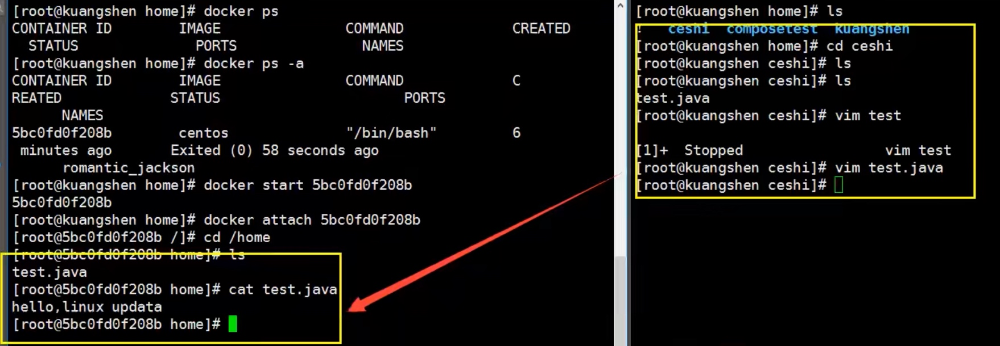

好处：以后修改配置文件，只需要在本地修改即可，容器内会自动同步

### 实战：安装MySQL

我们都知道MySQL的数据不应该存储在容器中，应该挂载到外部的主机上

1. 搜索MySQL

```bash
[root@localhost opt]## docker search mysql
NAME                              DESCRIPTION                                     STARS     OFFICIAL   AUTOMATED
mysql                             MySQL is a widely used, open-source relation…   11753     [OK]
```

2. 下载mysql镜像

```bash
[root@localhost opt]## docker pull mysql:5.7
5.7: Pulling from library/mysql
a10c77af2613: Pull complete
b76a7eb51ffd: Pull complete
258223f927e4: Pull complete
2d2c75386df9: Pull complete
63e92e4046c9: Pull complete
f5845c731544: Pull complete
bd0401123a9b: Pull complete
2724b2da64fd: Pull complete
d10a7e9e325c: Pull complete
1c5fd9c3683d: Pull complete
2e35f83a12e9: Pull complete
Digest: sha256:7a3a7b7a29e6fbff433c339fc52245435fa2c308586481f2f92ab1df239d6a29
Status: Downloaded newer image for mysql:5.7
docker.io/library/mysql:5.7
```

3. 运行容器，需要做数据挂载

安装启动MySQL的时候，需要配置密码的，这是要注意的

官方的测试

```bash
docker run --name some-mysql -e MYSQL_ROOT_PASSWORD=my-secret-pw -d mysql:tag

## -e 代表配置环境
```

```bash
[root@localhost opt]## docker run -d -p 3310:3306 -v /opt/mysql/conf:/etc/mysql/conf.d -v /opt/mysql/data:/var/lib/mysql -e MYSQL_ROOT_PASSWORD=123456 --name mysql01 mysql:5.7
c559ef8c43e224084a1d0efa901a5cbb94428105cfce25d43f9abb88b666c9ce
## -d 后台运行
## -p 端口映射
## -v 数据卷挂载
## -e 环境配置
## --name 设置名字
```

4. 测试MySQL

查看进程

```bash
[root@localhost opt]## docker ps
CONTAINER ID   IMAGE       COMMAND                  CREATED              STATUS              PORTS                                                  NAMES
c559ef8c43e2   mysql:5.7   "docker-entrypoint.s…"   About a minute ago   Up About a minute   33060/tcp, 0.0.0.0:3310->3306/tcp, :::3310->3306/tcp   mysql01
```

通过Navicat连接MySQL成功


Navicat-连接到服务器的3310-3310和容器内的3306映射，这个时候我们就可以连接上了

创建一个数据库，然后可以在我们挂载的目录中看到

```bash
[root@localhost opt]## cd mysql/
[root@localhost mysql]## ll
总用量 4
drwxr-xr-x. 2 root    root    6 12月  1 00:10 conf
drwxr-xr-x. 6 polkitd root 4096 12月  1 00:23 data
[root@localhost mysql]## cd data
[root@localhost data]## ll
总用量 188484
-rw-r-----. 1 polkitd input       56 12月  1 00:10 auto.cnf
-rw-------. 1 polkitd input     1680 12月  1 00:10 ca-key.pem
-rw-r--r--. 1 polkitd input     1112 12月  1 00:10 ca.pem
-rw-r--r--. 1 polkitd input     1112 12月  1 00:10 client-cert.pem
-rw-------. 1 polkitd input     1676 12月  1 00:10 client-key.pem
-rw-r-----. 1 polkitd input     1352 12月  1 00:10 ib_buffer_pool
-rw-r-----. 1 polkitd input 79691776 12月  1 00:10 ibdata1
-rw-r-----. 1 polkitd input 50331648 12月  1 00:10 ib_logfile0
-rw-r-----. 1 polkitd input 50331648 12月  1 00:10 ib_logfile1
-rw-r-----. 1 polkitd input 12582912 12月  1 00:23 ibtmp1
drwxr-x---. 2 polkitd input     4096 12月  1 00:10 mysql
drwxr-x---. 2 polkitd input     8192 12月  1 00:10 performance_schema
-rw-------. 1 polkitd input     1680 12月  1 00:10 private_key.pem
-rw-r--r--. 1 polkitd input      452 12月  1 00:10 public_key.pem
-rw-r--r--. 1 polkitd input     1112 12月  1 00:10 server-cert.pem
-rw-------. 1 polkitd input     1680 12月  1 00:10 server-key.pem
drwxr-x---. 2 polkitd input     8192 12月  1 00:10 sys
drwxr-x---. 2 polkitd input       20 12月  1 00:23 test ## 就是这个
```

假设我们将容器删除，我们挂载到本地的数据卷依旧没有丢失，这就实现了容器数据持久化功能

### 具名和匿名挂载

#### 匿名挂载


```bash
docker run -d -P --name nginx01 -v /etc/nginx nginx
## -P 表示随机映射端口
## -v 容器内路径 表示直接映射到外部的同目录下
```

通过`docker volume ls`查看所有卷的挂载

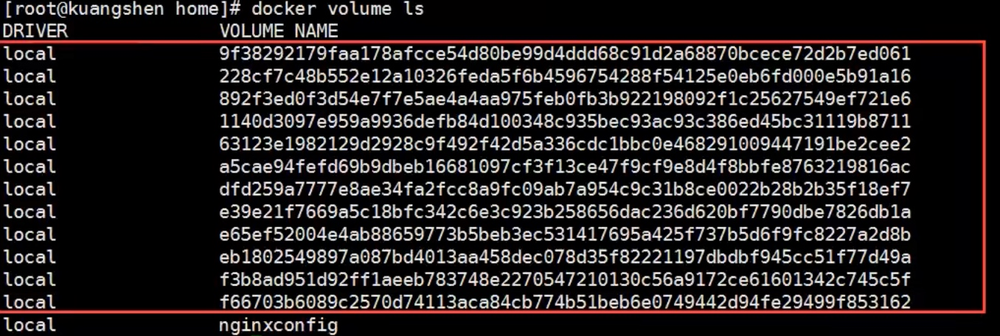

这种就是匿名挂载，我们在 -v 的时候，只写了容器内的路径，没有写容器外的路径

#### 具名挂载

通过-v 卷名:容器内路径 实现具名挂载

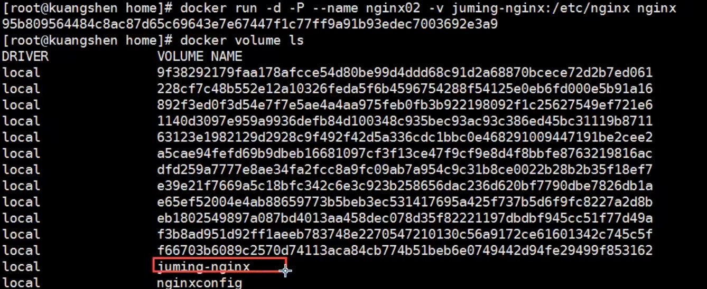

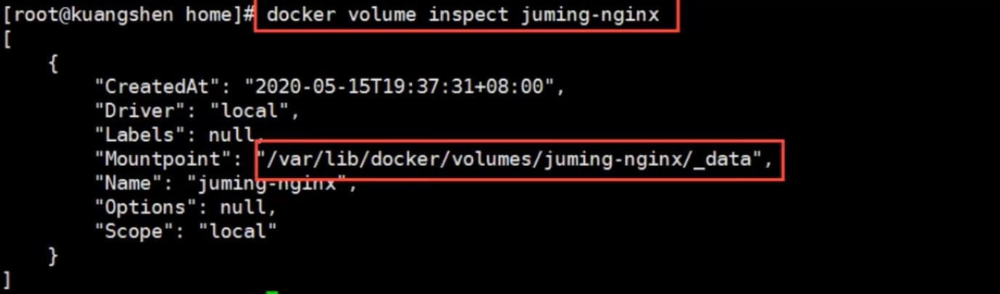

所有的docker容器内的卷，没有指定目录的情况下，都是挂载在`/var/lib/docker/volumes/xxxx/_data`下，其中`xxxx`如果有设置具名挂载的话，就是具名挂载的名称，如果匿名，就会在`/var/lib/docker/volumes`下随机生成一个挂载目录

我们通过具名挂载可以方便的找到我们的挂载的卷，大多数情况下使用具名挂载，不建议使用匿名挂载

#### 如何确定是具名挂载还是匿名挂载，或者是指定路径挂载

- -v 容器内路径 匿名挂载
- -v 卷名(不带`/`):容器内路径 具名挂载
- -v /xxx/xxx（容器外路径）:容器内路径 指定路径挂载

拓展：

`docker run -d -P --name nginx01 -v juming-nginx:/etc/nginx:ro nginx`或者是`docker run -d -P --name nginx01 -v juming-nginx:/etc/nginx:rw nginx`

通过-v 容器内路径:ro或者rw 改变读写权限

- ro readonly 只读 说明这个路径只能通过宿主机来操作，容器内部无法操作
- rw readwrite 可读可写

一旦设定了容器权限，容器对我们挂载出来的内容就有了限定了

### 方式二：Dockerfile

dockerfile就是用来构建docker镜像的构建文件

之前是通过commit来生成镜像文件，现在使用dockerfile就是手工打造一个镜像，打造过程其实就是一段命令脚本，执行了就生成了镜像

通过这个脚本可以生成一个镜像，镜像是一层一层的，脚本是一个个命令，每个命令都是一层

#### 通过dockefile创建镜像

1. 创建dockerfile脚本

```bash
vim dockerfile1
```

2. 输入脚本内容

通过volume 挂载目录

```bash
from centos ## 表示基础镜像是centos

volume ["volume01","volume02"] ## 挂载目录

cmd echo "---end---" ## 结束输出---end---
cmd /bin/bash ## 进入的默认走bash控制台
```

3. 构建镜像

```bash
[root@localhost docker-test-volume]## docker build -f dockerfile1 -t zhangsan/centos .
Sending build context to Docker daemon  2.048kB
Step 1/4 : from centos
 ---> 5d0da3dc9764
Step 2/4 : volume ["volume01","volume02"]
 ---> Running in f22d56d1872e
Removing intermediate container f22d56d1872e
 ---> f55dccc90e89
Step 3/4 : cmd echo "---end---"
 ---> Running in 0c7bc2cc920f
Removing intermediate container 0c7bc2cc920f
 ---> fc3b1db7018d
Step 4/4 : cmd /bin/bash
 ---> Running in 558ecc2f44a8
Removing intermediate container 558ecc2f44a8
 ---> 86b4bff72eab
Successfully built 86b4bff72eab
Successfully tagged zhangsan/centos:latest
```

通过`docker images`查看生成的镜像

```bash
[root@localhost docker-test-volume]## docker images
REPOSITORY            TAG       IMAGE ID       CREATED          SIZE
zhangsan/centos       latest    86b4bff72eab   56 seconds ago   231MB ## 这个
tomcat                latest    904a98253fbf   12 days ago      680MB
nginx                 latest    ea335eea17ab   13 days ago      141MB
mysql                 5.7       8b43c6af2ad0   13 days ago      448MB
centos                latest    5d0da3dc9764   2 months ago     231MB
portainer/portainer   latest    580c0e4e98b0   8 months ago     79.1MB
elasticsearch         7.6.2     f29a1ee41030   20 months ago    791MB
```

4. 启动一下自己生成的容器并测试一下是否挂载目录成功

```bash
[root@localhost docker-test-volume]## docker run -it 86b4bff72eab /bin/bash
[root@7a3b37125daa /]## ls -l
total 0
lrwxrwxrwx.   1 root root   7 Nov  3  2020 bin -> usr/bin
drwxr-xr-x.   5 root root 360 Dec  1 01:51 dev
drwxr-xr-x.   1 root root  66 Dec  1 01:51 etc
drwxr-xr-x.   2 root root   6 Nov  3  2020 home
lrwxrwxrwx.   1 root root   7 Nov  3  2020 lib -> usr/lib
lrwxrwxrwx.   1 root root   9 Nov  3  2020 lib64 -> usr/lib64
drwx------.   2 root root   6 Sep 15 14:17 lost+found
drwxr-xr-x.   2 root root   6 Nov  3  2020 media
drwxr-xr-x.   2 root root   6 Nov  3  2020 mnt
drwxr-xr-x.   2 root root   6 Nov  3  2020 opt
dr-xr-xr-x. 143 root root   0 Dec  1 01:51 proc
dr-xr-x---.   2 root root 162 Sep 15 14:17 root
drwxr-xr-x.  11 root root 163 Sep 15 14:17 run
lrwxrwxrwx.   1 root root   8 Nov  3  2020 sbin -> usr/sbin
drwxr-xr-x.   2 root root   6 Nov  3  2020 srv
dr-xr-xr-x.  13 root root   0 Nov 30 08:47 sys
drwxrwxrwt.   7 root root 171 Sep 15 14:17 tmp
drwxr-xr-x.  12 root root 144 Sep 15 14:17 usr
drwxr-xr-x.  20 root root 262 Sep 15 14:17 var
drwxr-xr-x.   2 root root   6 Dec  1 01:51 volume01 ## 这两个就是我们刚才挂载的两个目录
drwxr-xr-x.   2 root root   6 Dec  1 01:51 volume02
```

上面挂载的目录在外界一定有一个同步的目录，我们在现在只写了容器内部的目录，没有写外部的目录，是匿名挂载，那么在`/var/lib/volumes`下一定会有生成随机名称的目录

我们通过`docker inspect`命令查看容器的信息，可以看到挂载的目录

```bash
[root@localhost lib]## docker inspect 0887565512c1
[
    {
        // .......
        "Mounts": [
            {
                "Type": "volume",
                "Name": "b01bbf784f7138cd9aba69f8c972f020caf0f8c732f899a0c808e0b48eacd323",
                "Source": "/var/lib/docker/volumes/b01bbf784f7138cd9aba69f8c972f020caf0f8c732f899a0c808e0b48eacd323/_data",
                "Destination": "volume01",
                "Driver": "local",
                "Mode": "",
                "RW": true,
                "Propagation": ""
            },
            {
                "Type": "volume",
                "Name": "ab6fbcba4d51bae0198a8b6209530867e04d7124e54fe3a305f19685d8e44f2f",
                "Source": "/var/lib/docker/volumes/ab6fbcba4d51bae0198a8b6209530867e04d7124e54fe3a305f19685d8e44f2f/_data",
                "Destination": "volume02",
                "Driver": "local",
                "Mode": "",
                "RW": true,
                "Propagation": ""
            }
        ],
        // ......
    }
]
```

进入容器之后在volume01中创建一个文件，然后去`/var/lib/docker/volumes/b01bbf784f7138cd9aba69f8c972f020caf0f8c732f899a0c808e0b48eacd323/_data`目录下查看是否存在该文件

```bash
[root@localhost lib]## cd /var/lib/docker/volumes/b01bbf784f7138cd9aba69f8c972f020caf0f8c732f899a0c808e0b48eacd323/_data
[root@localhost _data]## ll
总用量 0
-rw-r--r--. 1 root root 0 12月  1 09:57 container.txt
```

这种方式我们未来使用的十分多，因为我们通常会构建自己的镜像，假设构建镜像时候没有挂载卷，要手动通过-v的方式挂载

### 数据卷容器

之前实现的是容器内和宿主机之间的数据卷共享

我们可以利用数据卷容器实现多个容器之间的数据共享，比如多个MySQL同步数据


1. 启动三个容器，通过我们刚才自己的写镜像启动

启动父容器

```bash
[root@localhost _data]## docker run -it --name docker01 86b4bff72eab
[root@745160b0c52a /]## ls
bin  dev  etc  home  lib  lib64  lost+found  media  mnt  opt  proc  root  run  sbin  srv  sys  tmp  usr  var  volume01	volume02
[root@745160b0c52a /]## ls -la
total 0
drwxr-xr-x.   1 root root  38 Dec  1 02:18 .
drwxr-xr-x.   1 root root  38 Dec  1 02:18 ..
-rwxr-xr-x.   1 root root   0 Dec  1 02:18 .dockerenv
lrwxrwxrwx.   1 root root   7 Nov  3  2020 bin -> usr/bin
drwxr-xr-x.   5 root root 360 Dec  1 02:18 dev
drwxr-xr-x.   1 root root  66 Dec  1 02:18 etc
drwxr-xr-x.   2 root root   6 Nov  3  2020 home
lrwxrwxrwx.   1 root root   7 Nov  3  2020 lib -> usr/lib
lrwxrwxrwx.   1 root root   9 Nov  3  2020 lib64 -> usr/lib64
drwx------.   2 root root   6 Sep 15 14:17 lost+found
drwxr-xr-x.   2 root root   6 Nov  3  2020 media
drwxr-xr-x.   2 root root   6 Nov  3  2020 mnt
drwxr-xr-x.   2 root root   6 Nov  3  2020 opt
dr-xr-xr-x. 142 root root   0 Dec  1 02:18 proc
dr-xr-x---.   2 root root 162 Sep 15 14:17 root
drwxr-xr-x.  11 root root 163 Sep 15 14:17 run
lrwxrwxrwx.   1 root root   8 Nov  3  2020 sbin -> usr/sbin
drwxr-xr-x.   2 root root   6 Nov  3  2020 srv
dr-xr-xr-x.  13 root root   0 Nov 30 08:47 sys
drwxrwxrwt.   7 root root 171 Sep 15 14:17 tmp
drwxr-xr-x.  12 root root 144 Sep 15 14:17 usr
drwxr-xr-x.  20 root root 262 Sep 15 14:17 var
drwxr-xr-x.   2 root root   6 Dec  1 02:18 volume01
drwxr-xr-x.   2 root root   6 Dec  1 02:18 volume02
```

```bash
[root@localhost _data]## docker ps
CONTAINER ID   IMAGE          COMMAND                  CREATED              STATUS              PORTS     NAMES
745160b0c52a   86b4bff72eab   "/bin/sh -c /bin/bash"   About a minute ago   Up About a minute             docker01
```

`control+q+p` 不关闭容器退出，启动第一个子容器，并通过`--volumes-from docker01`来表示挂载依赖docker01

```bash
[root@localhost _data]## docker run -it --name docker02 --volumes-from docker01 86b4bff72eab
[root@32653853be6d /]## ls -la
total 0
drwxr-xr-x.   1 root root  38 Dec  1 02:22 .
drwxr-xr-x.   1 root root  38 Dec  1 02:22 ..
-rwxr-xr-x.   1 root root   0 Dec  1 02:22 .dockerenv
lrwxrwxrwx.   1 root root   7 Nov  3  2020 bin -> usr/bin
drwxr-xr-x.   5 root root 360 Dec  1 02:22 dev
drwxr-xr-x.   1 root root  66 Dec  1 02:22 etc
drwxr-xr-x.   2 root root   6 Nov  3  2020 home
lrwxrwxrwx.   1 root root   7 Nov  3  2020 lib -> usr/lib
lrwxrwxrwx.   1 root root   9 Nov  3  2020 lib64 -> usr/lib64
drwx------.   2 root root   6 Sep 15 14:17 lost+found
drwxr-xr-x.   2 root root   6 Nov  3  2020 media
drwxr-xr-x.   2 root root   6 Nov  3  2020 mnt
drwxr-xr-x.   2 root root   6 Nov  3  2020 opt
dr-xr-xr-x. 144 root root   0 Dec  1 02:22 proc
dr-xr-x---.   2 root root 162 Sep 15 14:17 root
drwxr-xr-x.  11 root root 163 Sep 15 14:17 run
lrwxrwxrwx.   1 root root   8 Nov  3  2020 sbin -> usr/sbin
drwxr-xr-x.   2 root root   6 Nov  3  2020 srv
dr-xr-xr-x.  13 root root   0 Nov 30 08:47 sys
drwxrwxrwt.   7 root root 171 Sep 15 14:17 tmp
drwxr-xr-x.  12 root root 144 Sep 15 14:17 usr
drwxr-xr-x.  20 root root 262 Sep 15 14:17 var
drwxr-xr-x.   2 root root   6 Dec  1 02:18 volume01
drwxr-xr-x.   2 root root   6 Dec  1 02:18 volume02
```

2. 测试：在docker01中的volume01中创建一个测试文件，是否会在docker02的volume01中有文件

```bash
[root@localhost ~]## docker attach 745160b0c52a
[root@745160b0c52a /]## ls -al
total 0
drwxr-xr-x.   1 root root  38 Dec  1 02:18 .
drwxr-xr-x.   1 root root  38 Dec  1 02:18 ..
-rwxr-xr-x.   1 root root   0 Dec  1 02:18 .dockerenv
lrwxrwxrwx.   1 root root   7 Nov  3  2020 bin -> usr/bin
drwxr-xr-x.   5 root root 360 Dec  1 02:18 dev
drwxr-xr-x.   1 root root  66 Dec  1 02:18 etc
drwxr-xr-x.   2 root root   6 Nov  3  2020 home
lrwxrwxrwx.   1 root root   7 Nov  3  2020 lib -> usr/lib
lrwxrwxrwx.   1 root root   9 Nov  3  2020 lib64 -> usr/lib64
drwx------.   2 root root   6 Sep 15 14:17 lost+found
drwxr-xr-x.   2 root root   6 Nov  3  2020 media
drwxr-xr-x.   2 root root   6 Nov  3  2020 mnt
drwxr-xr-x.   2 root root   6 Nov  3  2020 opt
dr-xr-xr-x. 145 root root   0 Dec  1 02:18 proc
dr-xr-x---.   2 root root 162 Sep 15 14:17 root
drwxr-xr-x.  11 root root 163 Sep 15 14:17 run
lrwxrwxrwx.   1 root root   8 Nov  3  2020 sbin -> usr/sbin
drwxr-xr-x.   2 root root   6 Nov  3  2020 srv
dr-xr-xr-x.  13 root root   0 Nov 30 08:47 sys
drwxrwxrwt.   7 root root 171 Sep 15 14:17 tmp
drwxr-xr-x.  12 root root 144 Sep 15 14:17 usr
drwxr-xr-x.  20 root root 262 Sep 15 14:17 var
drwxr-xr-x.   2 root root   6 Dec  1 02:18 volume01
drwxr-xr-x.   2 root root   6 Dec  1 02:18 volume02
[root@745160b0c52a /]## cd volume01
[root@745160b0c52a volume01]## ls
[root@745160b0c52a volume01]## touch docker01.txt
[root@745160b0c52a volume01]## ls
docker01.txt
```

存在该文件

```bash
[root@32653853be6d volume01]## ls
docker01.txt
```

类似于Java中的类，子类继承了父类

3. 在启动一个容器docker03，也是挂载到docker01作为父容器，然后在该容器中创建文件，测试是否在同为子容器的docker02中存在文件

```bash
[root@localhost ~]## docker run -it --name docker03 --volumes-from docker01 86b4bff72eab
[root@fdd6c8c68ad5 /]## ls -al
total 0
drwxr-xr-x.   1 root root  38 Dec  1 02:35 .
drwxr-xr-x.   1 root root  38 Dec  1 02:35 ..
-rwxr-xr-x.   1 root root   0 Dec  1 02:35 .dockerenv
lrwxrwxrwx.   1 root root   7 Nov  3  2020 bin -> usr/bin
drwxr-xr-x.   5 root root 360 Dec  1 02:35 dev
drwxr-xr-x.   1 root root  66 Dec  1 02:35 etc
drwxr-xr-x.   2 root root   6 Nov  3  2020 home
lrwxrwxrwx.   1 root root   7 Nov  3  2020 lib -> usr/lib
lrwxrwxrwx.   1 root root   9 Nov  3  2020 lib64 -> usr/lib64
drwx------.   2 root root   6 Sep 15 14:17 lost+found
drwxr-xr-x.   2 root root   6 Nov  3  2020 media
drwxr-xr-x.   2 root root   6 Nov  3  2020 mnt
drwxr-xr-x.   2 root root   6 Nov  3  2020 opt
dr-xr-xr-x. 151 root root   0 Dec  1 02:35 proc
dr-xr-x---.   2 root root 162 Sep 15 14:17 root
drwxr-xr-x.  11 root root 163 Sep 15 14:17 run
lrwxrwxrwx.   1 root root   8 Nov  3  2020 sbin -> usr/sbin
drwxr-xr-x.   2 root root   6 Nov  3  2020 srv
dr-xr-xr-x.  13 root root   0 Nov 30 08:47 sys
drwxrwxrwt.   7 root root 171 Sep 15 14:17 tmp
drwxr-xr-x.  12 root root 144 Sep 15 14:17 usr
drwxr-xr-x.  20 root root 262 Sep 15 14:17 var
drwxr-xr-x.   2 root root  26 Dec  1 02:25 volume01
drwxr-xr-x.   2 root root   6 Dec  1 02:18 volume02
[root@fdd6c8c68ad5 /]## cd volume01/
[root@fdd6c8c68ad5 volume01]## ls
docker01.txt
[root@fdd6c8c68ad5 volume01]## touch docker03.txt
[root@fdd6c8c68ad5 volume01]## ls -la
total 0
drwxr-xr-x. 2 root root 46 Dec  1 02:36 .
drwxr-xr-x. 1 root root 38 Dec  1 02:35 ..
-rw-r--r--. 1 root root  0 Dec  1 02:25 docker01.txt
-rw-r--r--. 1 root root  0 Dec  1 02:36 docker03.txt
```

在子容器docker02中查看，存在docker03创建的文件

```bash
[root@745160b0c52a volume01]## ls -la
total 0
drwxr-xr-x. 2 root root 46 Dec  1 02:36 .
drwxr-xr-x. 1 root root 38 Dec  1 02:18 ..
-rw-r--r--. 1 root root  0 Dec  1 02:25 docker01.txt
-rw-r--r--. 1 root root  0 Dec  1 02:36 docker03.txt
```

4. 测试：既然子容器docker02和docker03都是依赖父容器docker01，如果把docker01停止并删除会怎么样？还能实现数据共享吗？

```bash
[root@localhost ~]## docker ps -a
CONTAINER ID   IMAGE                 COMMAND                  CREATED          STATUS                      PORTS     NAMES
ca6ee7145e5f   86b4bff72eab          "/bin/sh -c /bin/bash"   34 seconds ago   Up 33 seconds                         docker02
fdd6c8c68ad5   86b4bff72eab          "/bin/sh -c /bin/bash"   5 minutes ago    Up 5 minutes                          docker03
745160b0c52a   86b4bff72eab          "/bin/sh -c /bin/bash"   21 minutes ago   Exited (0) 23 seconds ago             docker01
0887565512c1   86b4bff72eab          "/bin/bash"              44 minutes ago   Exited (0) 22 minutes ago             eloquent_aryabhata
7a3b37125daa   86b4bff72eab          "/bin/bash"              48 minutes ago   Exited (0) 44 minutes ago             nervous_jennings
c559ef8c43e2   mysql:5.7             "docker-entrypoint.s…"   11 hours ago     Exited (0) 40 minutes ago             mysql01
31099f8a98d2   centos                "/bin/bash"              11 hours ago     Exited (127) 11 hours ago             wonderful_faraday
2c5c20e62a37   tomcat                "catalina.sh run"        12 hours ago     Exited (130) 11 hours ago             determined_ishizaka
5df377de6188   tomcat                "catalina.sh run"        12 hours ago     Exited (130) 12 hours ago             reverent_shaw
712e50db61c6   tomcat                "catalina.sh run"        12 hours ago     Created                               hungry_payne
a5bfd1012976   portainer/portainer   "/portainer"             14 hours ago     Exited (2) 12 hours ago               modest_herschel
6fa5c451240f   elasticsearch:7.6.2   "/usr/local/bin/dock…"   15 hours ago     Exited (143) 14 hours ago             elasticsearch
85cf11058d2a   tomcat                "catalina.sh run"        15 hours ago     Exited (143) 15 hours ago             tomcat01
aa575c8844dd   nginx                 "/docker-entrypoint.…"   16 hours ago     Exited (0) 16 hours ago               nginx01
d7172d136b18   centos                "/bin/bash"              18 hours ago     Exited (0) 16 hours ago               kind_noyce
[root@localhost ~]## docker rm -f 745160b0c52a
745160b0c52a
[root@localhost ~]## docker ps -a
CONTAINER ID   IMAGE                 COMMAND                  CREATED              STATUS                      PORTS     NAMES
ca6ee7145e5f   86b4bff72eab          "/bin/sh -c /bin/bash"   About a minute ago   Up About a minute                     docker02
fdd6c8c68ad5   86b4bff72eab          "/bin/sh -c /bin/bash"   6 minutes ago        Up 6 minutes                          docker03
0887565512c1   86b4bff72eab          "/bin/bash"              44 minutes ago       Exited (0) 23 minutes ago             eloquent_aryabhata
7a3b37125daa   86b4bff72eab          "/bin/bash"              49 minutes ago       Exited (0) 45 minutes ago             nervous_jennings
c559ef8c43e2   mysql:5.7             "docker-entrypoint.s…"   11 hours ago         Exited (0) 41 minutes ago             mysql01
31099f8a98d2   centos                "/bin/bash"              11 hours ago         Exited (127) 11 hours ago             wonderful_faraday
2c5c20e62a37   tomcat                "catalina.sh run"        12 hours ago         Exited (130) 11 hours ago             determined_ishizaka
5df377de6188   tomcat                "catalina.sh run"        12 hours ago         Exited (130) 12 hours ago             reverent_shaw
712e50db61c6   tomcat                "catalina.sh run"        12 hours ago         Created                               hungry_payne
a5bfd1012976   portainer/portainer   "/portainer"             14 hours ago         Exited (2) 12 hours ago               modest_herschel
6fa5c451240f   elasticsearch:7.6.2   "/usr/local/bin/dock…"   15 hours ago         Exited (143) 14 hours ago             elasticsearch
85cf11058d2a   tomcat                "catalina.sh run"        15 hours ago         Exited (143) 15 hours ago             tomcat01
aa575c8844dd   nginx                 "/docker-entrypoint.…"   16 hours ago         Exited (0) 16 hours ago               nginx01
d7172d136b18   centos                "/bin/bash"              18 hours ago         Exited (0) 16 hours ago               kind_noyce
```

父容器docker01已经不存在了

在查看docker02和docker03中的数据

```bash
[root@ca6ee7145e5f volume01]## ls -al
total 0
drwxr-xr-x. 2 root root 46 Dec  1 02:36 .
drwxr-xr-x. 1 root root 38 Dec  1 02:40 ..
-rw-r--r--. 1 root root  0 Dec  1 02:25 docker01.txt
-rw-r--r--. 1 root root  0 Dec  1 02:36 docker03.txt
```

还存在

总结：数据的共享，只要还有一个在使用就会被删除，这是一种备份的机制，而不是共享的机制

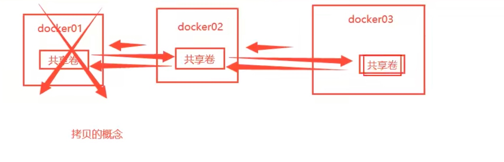

5. 使用场景

多个MySQL实现数据共享，或者Redis实现数据共享

```bash
docker run -d -p 3310:3306 -v /etc/mysql/conf.d -v /var/lib/mysql -e MYSQL_ROOT_PASSWORD=123456 --name mysql01 mysql:5.7

docker run -d -p 3310:3306 -v /etc/mysql/conf.d -v /var/lib/mysql -e MYSQL_ROOT_PASSWORD=123456 --name mysql02 --volumes-from mysql01 mysql:5.7
```

这个时候，可以实现两个容器数据同步

结论：

容器之间的配置信息的传递，数据卷容器的生命周期一直持续到没有容器使用为止
但是一旦你持久化到了本地，这个时候本地的数据是不会删除的

## Dockerfile

### dockerfile介绍

dockerfile是用来做docker镜像的文件，是命令参数脚本

构建步骤：

1. 编写一个dockerfile文件
2. docker build 构建成为一个镜像
3. docker run 运行镜像
4. docker push 发布镜像（Dockerhub、阿里云镜像仓库）

我们看一下官方的镜像是怎么做的，在docker hub中查找centos 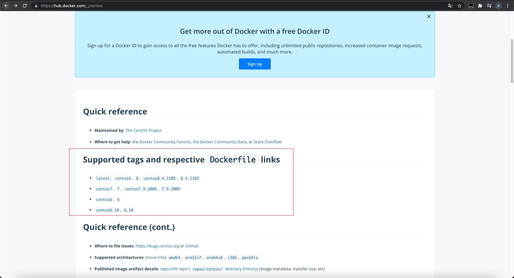

点击对应的版本，跳转到GitHub，其中的命令代码和我们之前编写的差不多

```
FROM scratch
ADD centos-8-x86_64.tar.xz /
LABEL org.label-schema.schema-version="1.0"     org.label-schema.name="CentOS Base Image"     org.label-schema.vendor="CentOS"     org.label-schema.license="GPLv2"     org.label-schema.build-date="20210915"
CMD ["/bin/bash"]
```

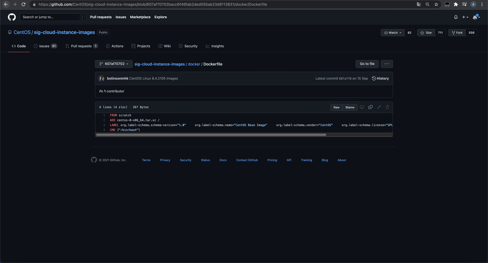

很多官方的镜像都是基础包，很多功能都没有，我们通常会自己搭建自己的镜像

官方既然可以制作镜像，那么我们也可以

### dockerfile构建过程

dockerfile就是很多的命令的集合

#### 基础知识

1. 每个保留关键字（指令）都必须是大写字母（我刚才写的时候怎么不用大写，除非是约定俗成的）
2. 执行从上到下顺序执行
3. \## 表示注释
4. 每一个指令都会创建提交一个新的镜像层，并提交

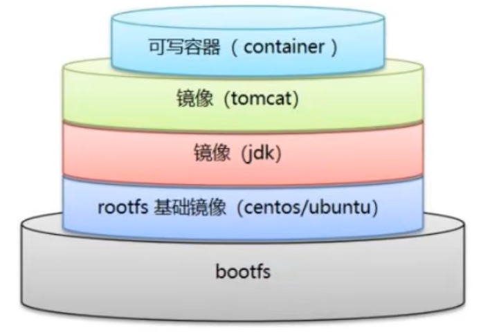

dockerfile是面向开发的，我们以后要发布项目，做镜像，就需要编写dockerfile文件，这个文件十分简单

docker镜像逐渐成为企业交付的标准

步骤：开发、部署、运维。缺一不可

dockerfile：构建文件，定义了一切的步骤，就类似于源代码

dockerImage：通过dockerfile构建生成的对象，最终发布和运行的产品

docker容器：容器就是镜像运行起来提供服务

#### dockerfile的指令


1. FROM 基础镜像，一切从这里开始构建
2. MAINTAINER 镜像是谁写的，姓名+邮箱
3. RUN 镜像构建的时候需要运行的命令
4. ADD 步骤，比如我们要搭建一个Tomcat的容器，这里就要加上Tomcat的压缩包
5. WORKDIR 镜像的工作目录
6. VOLUME 挂载的目录
7. EXPOSE 暴露端口
8. RUN 最终要运行的
9. CMD 指定这个容器启动的时候要运行的命令，只有最后一个会生效，可被替代
10. ENTRYPOINT 指定这个容器启动的时候要运行的命令，可以直接追加命令
11. ONBUILD 当构建一个被继承的dockerfile，这个时候就会运行ONBUILD的指令，是一个触发指令
12. COPY 类似ADD命令，将我们的文件拷贝到镜像中
13. ENV 构建的时候，设置环境变量

以前我们是使用别人的镜像，现在我们知道这些指令之后，我们练习来自己写一个镜像

#### 实战测试

- docker hub中大部分的镜像都是从这个基础镜像过来的FROM scratch，然后配置需要的软件和配置来进行构建

##### 创建一个自己的centos

1. 编写dockerfile文件

```
FROM centos
MAINTAINER zhangsan<zhangsan@gmail.com>

ENV MYPATH /usr/local
WORKDIR $MYPATH

RUN yum -y install vim
RUN yum -y install net-tools

EXPOSE 80

CMD echo $MYPATH
CMD echo "----end----"
CMD /bin/bash
```

1. 通过这个文件构建镜像

```
[root@localhost opt]## docker build -f dockerfile01 -t mycentos .
Sending build context to Docker daemon  562.3MB
Step 1/10 : FROM centos
 ---> 5d0da3dc9764
Step 2/10 : MAINTAINER zhangsan<zhangsan@gmail.com>
 ---> Running in b85d7a77c2d4
Removing intermediate container b85d7a77c2d4
 ---> f2f99f49cdef
Step 3/10 : ENV MYPATH /usr/local
 ---> Running in 2e811983aea2
Removing intermediate container 2e811983aea2
 ---> e9d621213b11
Step 4/10 : WORKDIR $MYPATH
 ---> Running in c3d23187bf65
Removing intermediate container c3d23187bf65
 ---> 78f322ee3e4e
Step 5/10 : RUN yum -y install vim
 ---> Running in 6f990db50242
CentOS Linux 8 - AppStream                      1.4 MB/s | 8.1 MB     00:05
CentOS Linux 8 - BaseOS                          57 kB/s | 3.5 MB     01:03
CentOS Linux 8 - Extras                          13 kB/s |  10 kB     00:00
Dependencies resolved.
================================================================================
 Package             Arch        Version                   Repository      Size
================================================================================
Installing:
 vim-enhanced        x86_64      2:8.0.1763-16.el8         appstream      1.4 M
Installing dependencies:
 gpm-libs            x86_64      1.20.7-17.el8             appstream       39 k
 vim-common          x86_64      2:8.0.1763-16.el8         appstream      6.3 M
 vim-filesystem      noarch      2:8.0.1763-16.el8         appstream       49 k
 which               x86_64      2.21-16.el8               baseos          49 k

Transaction Summary
================================================================================
Install  5 Packages

Total download size: 7.8 M
Installed size: 30 M
Downloading Packages:
(1/5): gpm-libs-1.20.7-17.el8.x86_64.rpm        181 kB/s |  39 kB     00:00
(2/5): vim-filesystem-8.0.1763-16.el8.noarch.rp 380 kB/s |  49 kB     00:00
(3/5): vim-enhanced-8.0.1763-16.el8.x86_64.rpm  879 kB/s | 1.4 MB     00:01
(4/5): vim-common-8.0.1763-16.el8.x86_64.rpm    1.4 MB/s | 6.3 MB     00:04
[MIRROR] which-2.21-16.el8.x86_64.rpm: Curl error (28): Timeout was reached for http://mirrors.neusoft.edu.cn/centos/8.5.2111/BaseOS/x86_64/os/Packages/which-2.21-16.el8.x86_64.rpm [Connection timed out after 30001 milliseconds]
(5/5): which-2.21-16.el8.x86_64.rpm             1.6 kB/s |  49 kB     00:30
--------------------------------------------------------------------------------
Total                                           253 kB/s | 7.8 MB     00:31
warning: /var/cache/dnf/appstream-02e86d1c976ab532/packages/gpm-libs-1.20.7-17.el8.x86_64.rpm: Header V3 RSA/SHA256 Signature, key ID 8483c65d: NOKEY
CentOS Linux 8 - AppStream                      1.6 MB/s | 1.6 kB     00:00
Importing GPG key 0x8483C65D:
 Userid     : "CentOS (CentOS Official Signing Key) <security@centos.org>"
 Fingerprint: 99DB 70FA E1D7 CE22 7FB6 4882 05B5 55B3 8483 C65D
 From       : /etc/pki/rpm-gpg/RPM-GPG-KEY-centosofficial
Key imported successfully
Running transaction check
Transaction check succeeded.
Running transaction test
Transaction test succeeded.
Running transaction
  Preparing        :                                                        1/1
  Installing       : which-2.21-16.el8.x86_64                               1/5
  Installing       : vim-filesystem-2:8.0.1763-16.el8.noarch                2/5
  Installing       : vim-common-2:8.0.1763-16.el8.x86_64                    3/5
  Installing       : gpm-libs-1.20.7-17.el8.x86_64                          4/5
  Running scriptlet: gpm-libs-1.20.7-17.el8.x86_64                          4/5
  Installing       : vim-enhanced-2:8.0.1763-16.el8.x86_64                  5/5
  Running scriptlet: vim-enhanced-2:8.0.1763-16.el8.x86_64                  5/5
  Running scriptlet: vim-common-2:8.0.1763-16.el8.x86_64                    5/5
  Verifying        : gpm-libs-1.20.7-17.el8.x86_64                          1/5
  Verifying        : vim-common-2:8.0.1763-16.el8.x86_64                    2/5
  Verifying        : vim-enhanced-2:8.0.1763-16.el8.x86_64                  3/5
  Verifying        : vim-filesystem-2:8.0.1763-16.el8.noarch                4/5
  Verifying        : which-2.21-16.el8.x86_64                               5/5

Installed:
  gpm-libs-1.20.7-17.el8.x86_64         vim-common-2:8.0.1763-16.el8.x86_64
  vim-enhanced-2:8.0.1763-16.el8.x86_64 vim-filesystem-2:8.0.1763-16.el8.noarch
  which-2.21-16.el8.x86_64

Complete!
Removing intermediate container 6f990db50242
 ---> 7ca5011b346f
Step 6/10 : RUN yum -y install net-tools
 ---> Running in 83ca3b46c435
Last metadata expiration check: 0:00:38 ago on Wed Dec  1 07:04:22 2021.
Dependencies resolved.
================================================================================
 Package         Architecture Version                        Repository    Size
================================================================================
Installing:
 net-tools       x86_64       2.0-0.52.20160912git.el8       baseos       322 k

Transaction Summary
================================================================================
Install  1 Package

Total download size: 322 k
Installed size: 942 k
Downloading Packages:
[MIRROR] net-tools-2.0-0.52.20160912git.el8.x86_64.rpm: Curl error (28): Timeout was reached for http://mirrors.neusoft.edu.cn/centos/8.5.2111/BaseOS/x86_64/os/Packages/net-tools-2.0-0.52.20160912git.el8.x86_64.rpm [Connection timed out after 30001 milliseconds]
net-tools-2.0-0.52.20160912git.el8.x86_64.rpm    11 kB/s | 322 kB     00:30
--------------------------------------------------------------------------------
Total                                            10 kB/s | 322 kB     00:30
Running transaction check
Transaction check succeeded.
Running transaction test
Transaction test succeeded.
Running transaction
  Preparing        :                                                        1/1
  Installing       : net-tools-2.0-0.52.20160912git.el8.x86_64              1/1
  Running scriptlet: net-tools-2.0-0.52.20160912git.el8.x86_64              1/1
  Verifying        : net-tools-2.0-0.52.20160912git.el8.x86_64              1/1

Installed:
  net-tools-2.0-0.52.20160912git.el8.x86_64

Complete!
Removing intermediate container 83ca3b46c435
 ---> bd2942ed89c3
Step 7/10 : EXPOSE 80
 ---> Running in f3d522876ac2
Removing intermediate container f3d522876ac2
 ---> 500594c65062
Step 8/10 : CMD echo $MYPATH
 ---> Running in 1bea4dce90d5
Removing intermediate container 1bea4dce90d5
 ---> be3e90ec2f97
Step 9/10 : CMD echo "----end----"
 ---> Running in de0febf0fddd
Removing intermediate container de0febf0fddd
 ---> b4a5eea0b77d
Step 10/10 : CMD /bin/bash
 ---> Running in 0c77ccf511c8
Removing intermediate container 0c77ccf511c8
 ---> f3fb7fd293d9
Successfully built f3fb7fd293d9
Successfully tagged mycentos:latest
[root@localhost opt]## docker images
REPOSITORY            TAG       IMAGE ID       CREATED          SIZE
mycentos              latest    f3fb7fd293d9   52 seconds ago   322MB
```

1. 测试运行

```
[root@localhost opt]## docker run -it f3fb7fd293d9
[root@86677a70c685 local]## pwd
/usr/local
[root@86677a70c685 local]## ifconfig
eth0: flags=4163<UP,BROADCAST,RUNNING,MULTICAST>  mtu 1500
        inet 172.17.0.2  netmask 255.255.0.0  broadcast 172.17.255.255
        ether 02:42:ac:11:00:02  txqueuelen 0  (Ethernet)
        RX packets 8  bytes 656 (656.0 B)
        RX errors 0  dropped 0  overruns 0  frame 0
        TX packets 0  bytes 0 (0.0 B)
        TX errors 0  dropped 0 overruns 0  carrier 0  collisions 0

lo: flags=73<UP,LOOPBACK,RUNNING>  mtu 65536
        inet 127.0.0.1  netmask 255.0.0.0
        loop  txqueuelen 1000  (Local Loopback)
        RX packets 0  bytes 0 (0.0 B)
        RX errors 0  dropped 0  overruns 0  frame 0
        TX packets 0  bytes 0 (0.0 B)
        TX errors 0  dropped 0 overruns 0  carrier 0  collisions 0
```

1. 对比：之前原生

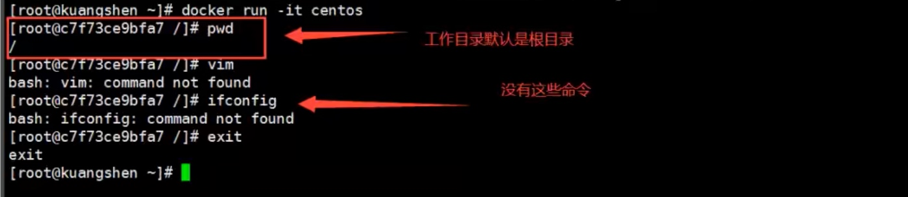

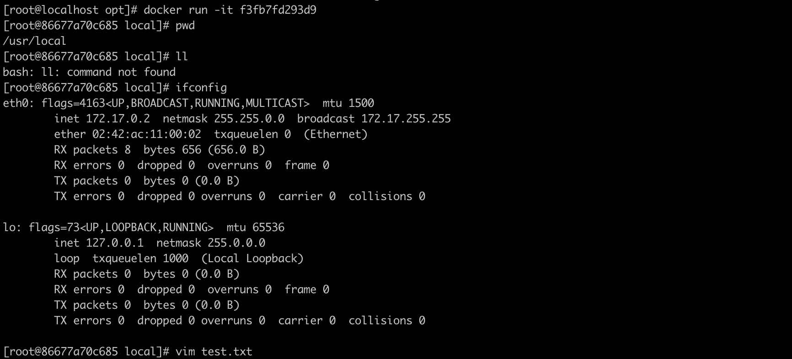

1. 查看我们创建的镜像的构建过程

```
[root@localhost opt]## docker history f3fb7fd293d9
IMAGE          CREATED         CREATED BY                                      SIZE      COMMENT
f3fb7fd293d9   4 minutes ago   /bin/sh -c #(nop)  CMD ["/bin/sh" "-c" "/bin…   0B
b4a5eea0b77d   4 minutes ago   /bin/sh -c #(nop)  CMD ["/bin/sh" "-c" "echo…   0B
be3e90ec2f97   4 minutes ago   /bin/sh -c #(nop)  CMD ["/bin/sh" "-c" "echo…   0B
500594c65062   4 minutes ago   /bin/sh -c #(nop)  EXPOSE 80                    0B
bd2942ed89c3   4 minutes ago   /bin/sh -c yum -y install net-tools             26.9MB
7ca5011b346f   5 minutes ago   /bin/sh -c yum -y install vim                   63.9MB
78f322ee3e4e   6 minutes ago   /bin/sh -c #(nop) WORKDIR /usr/local            0B
e9d621213b11   6 minutes ago   /bin/sh -c #(nop)  ENV MYPATH=/usr/local        0B
f2f99f49cdef   6 minutes ago   /bin/sh -c #(nop)  MAINTAINER zhangsan<zhang…   0B
5d0da3dc9764   2 months ago    /bin/sh -c #(nop)  CMD ["/bin/bash"]            0B
<missing>      2 months ago    /bin/sh -c #(nop)  LABEL org.label-schema.sc…   0B
<missing>      2 months ago    /bin/sh -c #(nop) ADD file:805cb5e15fb6e0bb0…   231MB
```

##### CMD 和 ENTRYPOINT 区别

两个都能执行命令

- CMD 指定这个容器启动的时候要运行的命令，只有最后一个会生效，可被替代
- ENTRYPOINT 指定这个容器启动的时候要运行的命令，可以直接追加命令

测试CMD

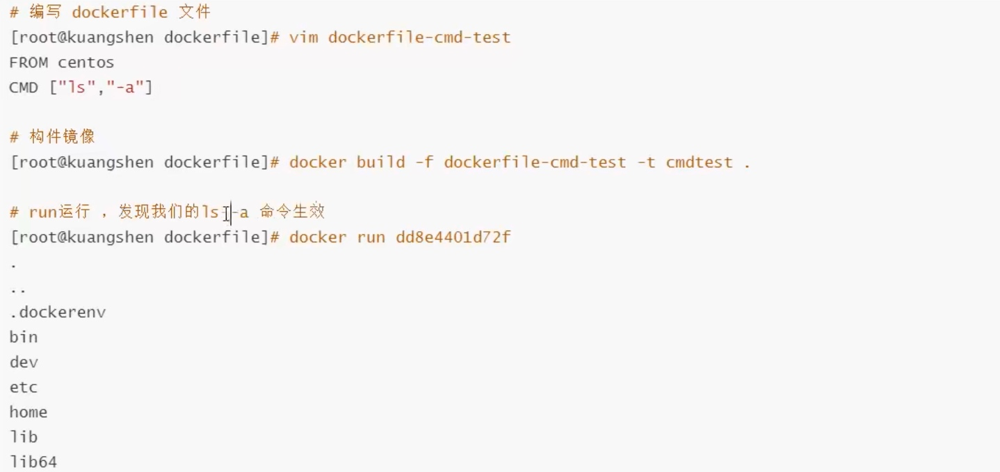

RUN、CMD 和 ENTRYPOINT 这三个 Dockerfile 指令看上去很类似，很容易混淆。本节将通过实践详细讨论它们的区别。

简单的说：

- RUN命令执行命令并创建新的镜像层，通常用于安装软件包
- CMD命令设置容器启动后默认执行的命令及其参数，但CMD设置的命令能够被docker run命令后面的命令行参数替换
- ENTRYPOINT配置容器启动时的执行命令（不会被忽略，一定会被执行，即使运行 docker run时指定了其他命令）

### 实战：制作tomcat镜像

1. 准备镜像文件 tomcat压缩包，jdk的压缩包

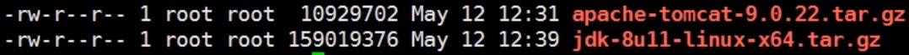

1. 编写dockerfile文件，官方推荐命名`Dockerfile`，这样build可以不用加`-f`指定dockerfile文件

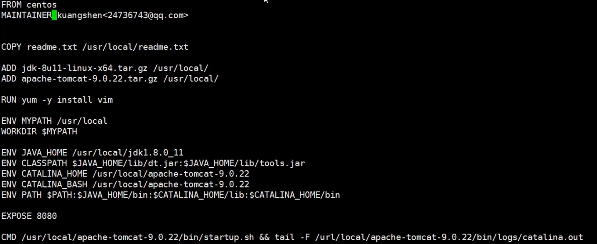

1. 构建镜像`docker build -t diytomcat .`

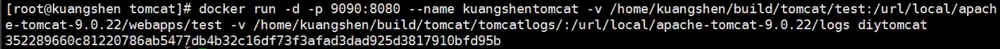

### 发布自己的镜像

#### 发布到docker hub

1. 地址：`https://hub.docker.com/`注册自己的账号
2. 确定这个账号可以登录，并登录

```
[root@localhost opt]## docker login --help

Usage:  docker login [OPTIONS] [SERVER]

Log in to a Docker registry.
If no server is specified, the default is defined by the daemon.

Options:
  -p, --password string   Password
      --password-stdin    Take the password from stdin
  -u, --username string   Username
[root@localhost opt]## docker login -u aldencarter
Password:
WARNING! Your password will be stored unencrypted in /root/.docker/config.json.
Configure a credential helper to remove this warning. See
https://docs.docker.com/engine/reference/commandline/login/#credentials-store

Login Succeeded
```

1. 将镜像修改成私人的镜像

```
[root@localhost opt]## docker tag mycentos aldencarter/mycentos
[root@localhost opt]## docker images
REPOSITORY             TAG       IMAGE ID       CREATED         SIZE
aldencarter/mycentos   latest    f3fb7fd293d9   2 hours ago     322MB
```

1. 在我们服务器上提交自己的镜像`docker push`

```
[root@localhost opt]## docker push aldencarter/mycentos
Using default tag: latest
The push refers to repository [docker.io/aldencarter/mycentos]
d79641b58d09: Pushed
8be15870bef2: Pushed
74ddd0ec08fa: Pushed
latest: digest: sha256:fc981383bd634e7d12aba5db1aee6ea4d5bf6f75299352018c3673b79a61ed5a size: 953
```

然后在远程仓库就看见了刚才push的镜像了

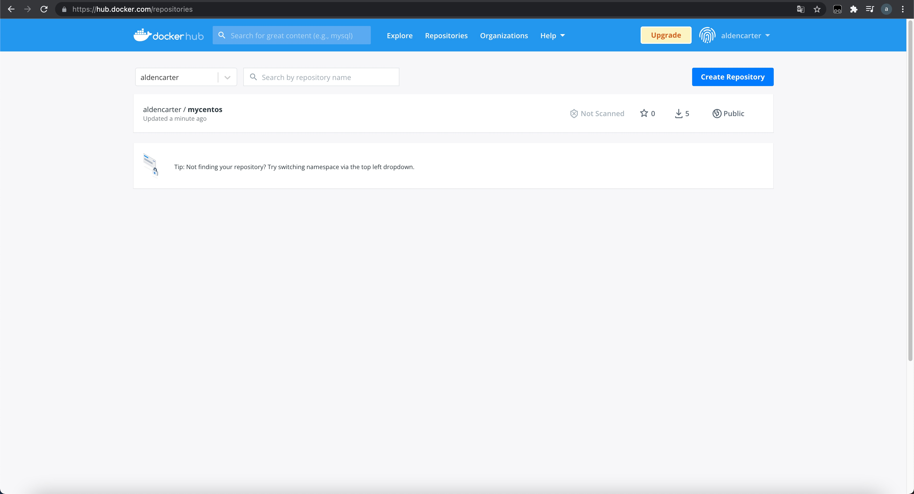

提交的时候也是按照镜像的层级一层一层的提交上去的

#### 发布到阿里云

1. 登录到阿里云
2. 找到容器镜像服务


1. 创建一个命名空间，命名空间一般表示一个大的项目


1. 创建容器镜像


1. 浏览阿里云

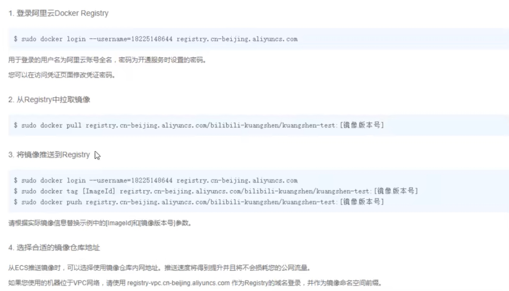

参考官方文档

### 小结

docker的全流程

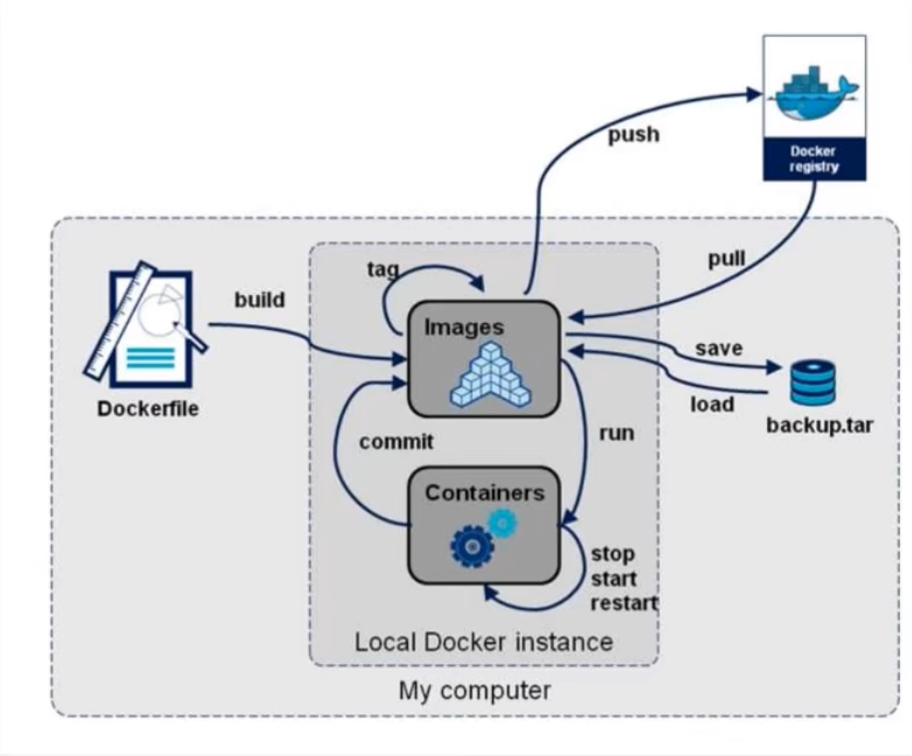

## 网络

可以做容器编排、集群部署

### docker0

ip addr

```bash
[root@localhost opt]## ip addr
1: lo: <LOOPBACK,UP,LOWER_UP> mtu 65536 qdisc noqueue state UNKNOWN group default qlen 1000
    link/loopback 00:00:00:00:00:00 brd 00:00:00:00:00:00
    inet 127.0.0.1/8 scope host lo
       valid_lft forever preferred_lft forever
    inet6 ::1/128 scope host
       valid_lft forever preferred_lft forever
2: ens33: <BROADCAST,MULTICAST,UP,LOWER_UP> mtu 1500 qdisc pfifo_fast state UP group default qlen 1000
    link/ether 00:0c:29:8b:e7:2d brd ff:ff:ff:ff:ff:ff
    inet 172.16.187.9/24 brd 172.16.187.255 scope global noprefixroute dynamic ens33
       valid_lft 65260sec preferred_lft 65260sec
    inet6 fe80::a432:d172:c316:1696/64 scope link noprefixroute
       valid_lft forever preferred_lft forever
3: docker0: <NO-CARRIER,BROADCAST,MULTICAST,UP> mtu 1500 qdisc noqueue state DOWN group default
    link/ether 02:42:cc:36:67:59 brd ff:ff:ff:ff:ff:ff
    inet 172.17.0.1/16 brd 172.17.255.255 scope global docker0
       valid_lft forever preferred_lft forever
    inet6 fe80::42:ccff:fe36:6759/64 scope link
       valid_lft forever preferred_lft forever
```

- lo 本机回环地址
- ens33 ip地址
- docker0 docker网络

#### docker是如何处理容器网络访问的？


```bash
[root@localhost opt]## docker run -d -P --name tomcat01 tomcat
Unable to find image 'tomcat:latest' locally
latest: Pulling from library/tomcat
647acf3d48c2: Pull complete
b02967ef0034: Pull complete
e1ad2231829e: Pull complete
5576ce26bf1d: Pull complete
26518d6c686a: Pull complete
cdb1f4e0dbfd: Pull complete
1d872b5136cc: Pull complete
0b9db4d94c97: Pull complete
03ee64d25ffd: Pull complete
45a601314df9: Pull complete
Digest: sha256:93ff3bc7fb766a9bb5bb0d1f925f9d8795594d87e8365164908ddddcdaa75ff4
Status: Downloaded newer image for tomcat:latest
13536079939af86134582d61da0b2996adb586bd31a4539eeebe8c039025ad2e
```

查看容器内部的网络地址 ip addr（如果提示这个不是命令，下面有解决办法）

```bash
[root@localhost opt]## docker exec -it tomcat01 ip addr
1: lo: <LOOPBACK,UP,LOWER_UP> mtu 65536 qdisc noqueue state UNKNOWN group default qlen 1000
    link/loopback 00:00:00:00:00:00 brd 00:00:00:00:00:00
    inet 127.0.0.1/8 scope host lo
       valid_lft forever preferred_lft forever
46: eth0@if47: <BROADCAST,MULTICAST,UP,LOWER_UP> mtu 1500 qdisc noqueue state UP group default
    link/ether 02:42:ac:11:00:02 brd ff:ff:ff:ff:ff:ff link-netnsid 0
    inet 172.17.0.2/16 brd 172.17.255.255 scope global eth0
       valid_lft forever preferred_lft forever
```

eth0@if47：连接到容器外的47网口

#### linux能不能ping通容器内部

可以

```bash
[root@localhost opt]## ping 172.17.0.2
PING 172.17.0.2 (172.17.0.2) 56(84) bytes of data.
64 bytes from 172.17.0.2: icmp_seq=1 ttl=64 time=0.056 ms
64 bytes from 172.17.0.2: icmp_seq=2 ttl=64 time=0.050 ms
64 bytes from 172.17.0.2: icmp_seq=3 ttl=64 time=0.046 ms
64 bytes from 172.17.0.2: icmp_seq=4 ttl=64 time=0.055 ms
64 bytes from 172.17.0.2: icmp_seq=5 ttl=64 time=0.052 ms
64 bytes from 172.17.0.2: icmp_seq=6 ttl=64 time=0.051 ms
```

#### 原理

1. 我们每启动一个docker容器，docker就会给docker容器分配一个ip，我们只要安装了docker，就会有一个网卡docker0，是通过桥接模式连接到网络，使用的技术是veth-pair技术

再次测试ip addr

```bash
[root@localhost opt]## ip addr
1: lo: <LOOPBACK,UP,LOWER_UP> mtu 65536 qdisc noqueue state UNKNOWN group default qlen 1000
    link/loopback 00:00:00:00:00:00 brd 00:00:00:00:00:00
    inet 127.0.0.1/8 scope host lo
       valid_lft forever preferred_lft forever
    inet6 ::1/128 scope host
       valid_lft forever preferred_lft forever
2: ens33: <BROADCAST,MULTICAST,UP,LOWER_UP> mtu 1500 qdisc pfifo_fast state UP group default qlen 1000
    link/ether 00:0c:29:8b:e7:2d brd ff:ff:ff:ff:ff:ff
    inet 172.16.187.9/24 brd 172.16.187.255 scope global noprefixroute dynamic ens33
       valid_lft 62131sec preferred_lft 62131sec
    inet6 fe80::a432:d172:c316:1696/64 scope link noprefixroute
       valid_lft forever preferred_lft forever
3: docker0: <BROADCAST,MULTICAST,UP,LOWER_UP> mtu 1500 qdisc noqueue state UP group default
    link/ether 02:42:cc:36:67:59 brd ff:ff:ff:ff:ff:ff
    inet 172.17.0.1/16 brd 172.17.255.255 scope global docker0
       valid_lft forever preferred_lft forever
    inet6 fe80::42:ccff:fe36:6759/64 scope link
       valid_lft forever preferred_lft forever
47: veth4759ead@if46: <BROADCAST,MULTICAST,UP,LOWER_UP> mtu 1500 qdisc noqueue master docker0 state UP group default
    link/ether 1a:2f:1d:35:4a:94 brd ff:ff:ff:ff:ff:ff link-netnsid 0
    inet6 fe80::182f:1dff:fe35:4a94/64 scope link
       valid_lft forever preferred_lft forever
```

47: veth4759ead@if46：对应容器中的46网口

我们发现这些容器带来的网卡，都是一对一对的

veth-pair：就是一对虚拟设备接口，它们都是成对出现的，一端连着协议，一端彼此相连，正因为有这个特性，evth-pair就可以充当着桥梁，连接各种虚拟网络设备

2. 我们在启动多一个tomca02，发现又多了一对veth-pair
3. 我们来测试一下tomcat01和tomcat02是否可以ping，可以

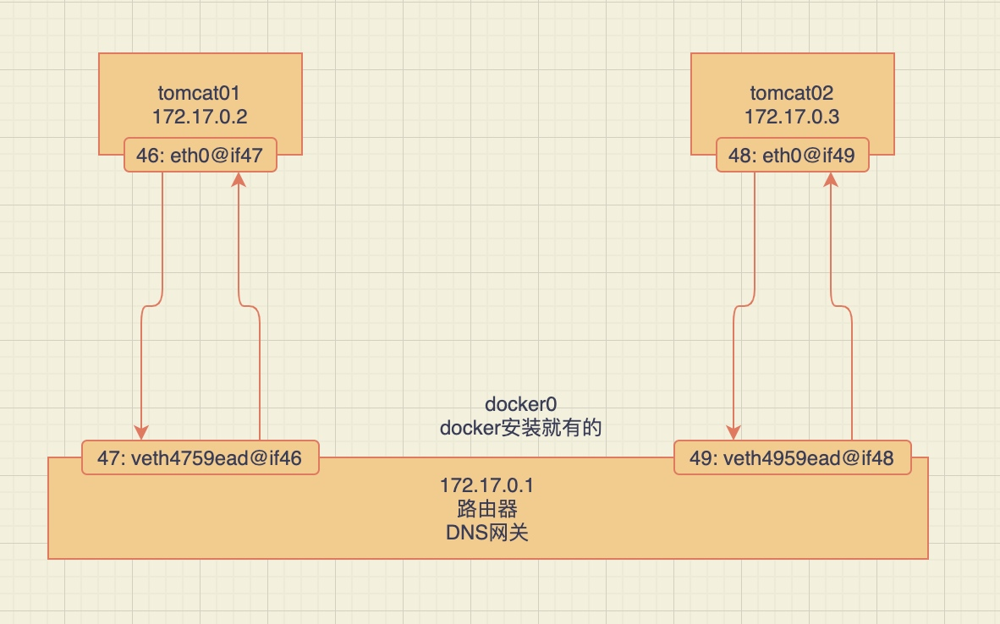

结论：tomcat01和tomcat02是共用一个路由器，docker0

所有的容器不指定网络的情况下，都是docker0路由的，docker会给我们的容器分配一个默认的可用的IP

255.255.0.1/16：表示使用前面的16位，后面的16位可以在这个局域网下连接容器

00000000.00000000.00000000.00000000

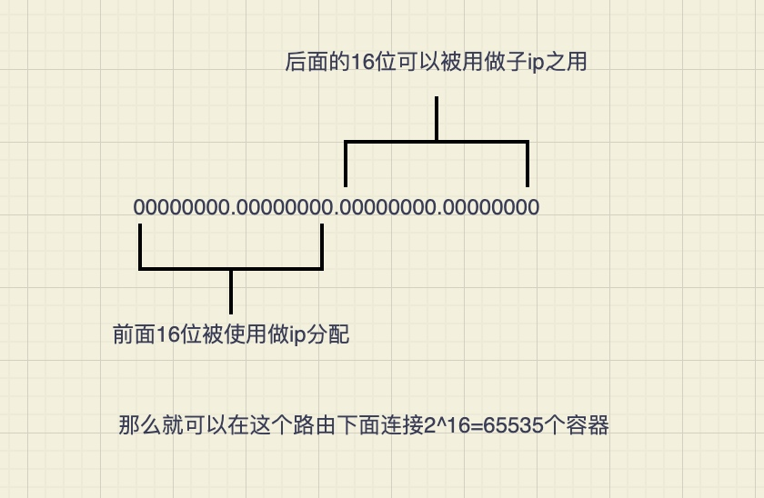

docker使用的是linux的桥接

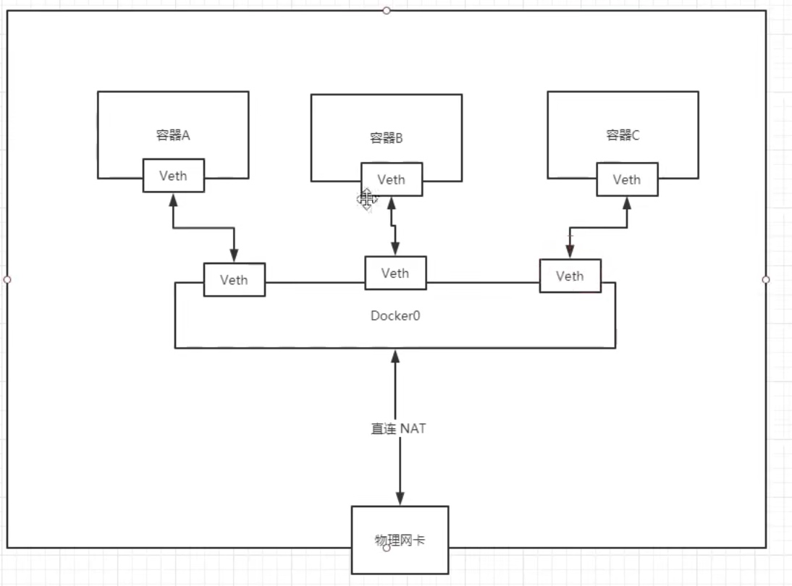

docker中所有的网络接口都是虚拟的，虚拟的转发率高

只要容器删除，对应的网桥（veth）就没有了

**如果出现问题：找不到ip addr命令**

进入容器，安装这个ip addr命令

1. 更改apt-get源为国内源，将原本的soruces.list重命名为sources.list.bak

```bash
root@13536079939a:/usr/local/tomcat## mv /etc/apt/sources.list /etc/apt/sources.list.bak
```

2. 搜索引擎检索一下国内的阿里源

大概就是这个

```
deb http://mirrors.aliyun.com/ubuntu/ focal main restricted universe multiverse
deb-src http://mirrors.aliyun.com/ubuntu/ focal main restricted universe multiverse

deb http://mirrors.aliyun.com/ubuntu/ focal-security main restricted universe multiverse
deb-src http://mirrors.aliyun.com/ubuntu/ focal-security main restricted universe multiverse

deb http://mirrors.aliyun.com/ubuntu/ focal-updates main restricted universe multiverse
deb-src http://mirrors.aliyun.com/ubuntu/ focal-updates main restricted universe multiverse

deb http://mirrors.aliyun.com/ubuntu/ focal-proposed main restricted universe multiverse
deb-src http://mirrors.aliyun.com/ubuntu/ focal-proposed main restricted universe multiverse

deb http://mirrors.aliyun.com/ubuntu/ focal-backports main restricted universe multiverse
deb-src http://mirrors.aliyun.com/ubuntu/ focal-backports main restricted universe multiverse
```

输出到sources.list文件

```
root@13536079939a:/etc/apt## echo "deb http://mirrors.aliyun.com/ubuntu/ focal main restricted universe multiverse
deb-src http://mirrors.aliyun.com/ubuntu/ focal main restricted universe multiverse

deb http://mirrors.aliyun.com/ubuntu/ focal-security main restricted universe multiverse
deb-src http://mirrors.aliyun.com/ubuntu/ focal-security main restricted universe multiverse

deb http://mirrors.aliyun.com/ubuntu/ focal-updates main restricted universe multiverse
deb-src http://mirrors.aliyun.com/ubuntu/ focal-updates main restricted universe multiverse

deb http://mirrors.aliyun.com/ubuntu/ focal-proposed main restricted universe multiverse
deb-src http://mirrors.aliyun.com/ubuntu/ focal-proposed main restricted universe multiverse

deb http://mirrors.aliyun.com/ubuntu/ focal-backports main restricted universe multiverse
deb-src http://mirrors.aliyun.com/ubuntu/ focal-backports main restricted universe multiverse" >> /etc/apt/sources.list
```

3. 更新源

```bash
root@13536079939a:/etc/apt## apt-get update
```

4. 安装iproute2

```bash
apt-get install iproute2
```

### --link

思考一个场景：我们编写了一个微服务，然后在连接数据库的databas url=ip;，当数据库的ip换掉了，如何在项目不重启的情况下将连接的数据库的IP换成其他的数据库IP呢？

我们希望能处理这个问题，是否可以通过名字的方式来访问容器呢？

tomcat01和tomcat02如何不是通过IP的方式进行访问对方呢？

通过`--link`可以解决网络连通问题

```bash
[root@localhost opt]## docker run -d -P --name tomcat01 --link tomcat02 tomcat
[root@localhost opt]## docker exec -it tomcat01 ping tomcat02
```

思考：是否可以通过tomcat02 ping到tomcat01？不能

我们可以通过`docker network inspect`来查看当前的容器网络详情

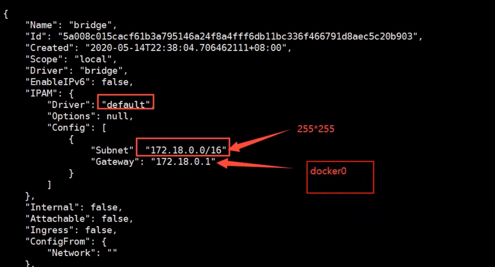

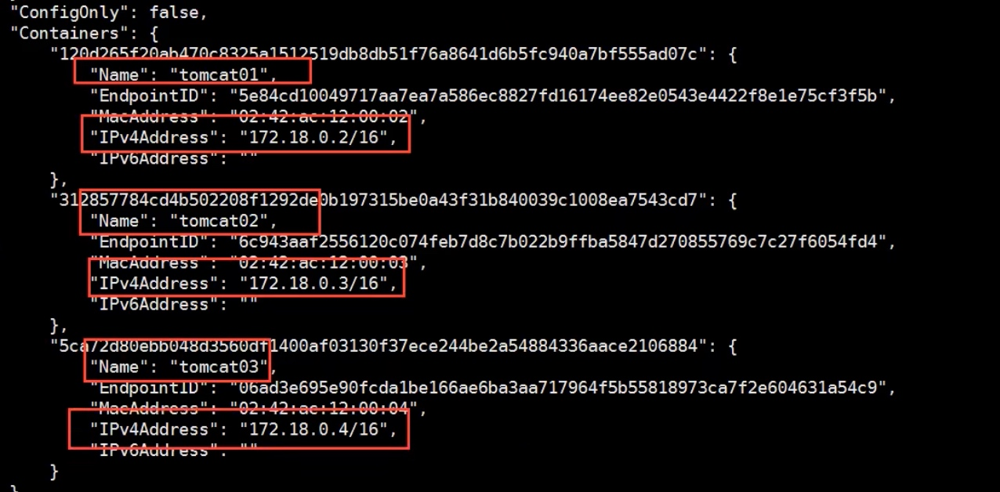

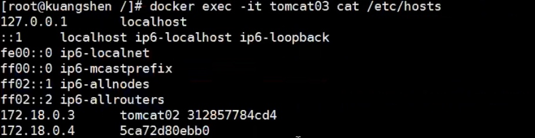

我们可以看到它其实是在tomcat02的host文件中做了IP和名字映射

--link 其实就是在我们的host文件中增加了映射

我们真实开发docker已经不建议直接使用--link的

我们要使用自定义网络，不使用docker0

docker0问题：它不支持容器名连接访问

### 自定义网络

查看所有的docker网络

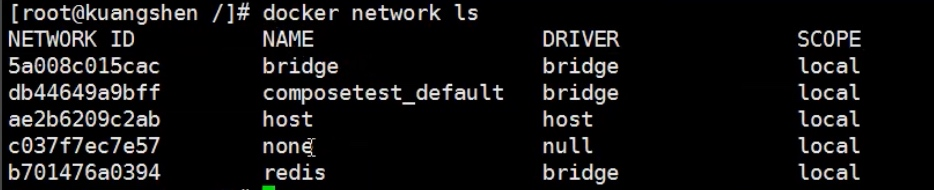

#### 网络模式

- bridge：桥接 docker（默认，自己创建也是使用bridge模式）
- none：不配置网络
- host：和宿主机共享网络
- container：容器网络连通（用得少，局限性很大）

可以通过`docker network --help`了解docker网络相关的信息

```bash
[root@localhost opt]## docker network --help

Usage:  docker network COMMAND

Manage networks

Commands:
  connect     Connect a container to a network
  create      Create a network
  disconnect  Disconnect a container from a network
  inspect     Display detailed information on one or more networks
  ls          List networks
  prune       Remove all unused networks
  rm          Remove one or more networks

Run 'docker network COMMAND --help' for more information on a command.
```

#### 测试

我们之前直接启动的命令，如果不配置网络信息，默认会使用桥接模式`--net bridge`，就是使用docker0作为桥接

```bash
docker run -d -P --name tomcat01 --net bridge tomcat

## 也就是说，如果我们自定义网络，之后就可以通过这个配置改成我们的自定义网络
```

docker0（bridge）的特点：

- 默认的，域名（别名）不能访问
- --link可以打通连接

可以通过`docker network create --help`了解到创建网络相关的信息

创建自定义网络

```bash
## --driver bridge 设置为桥接模式
## --subnet 192.168.0.0/16 设置子网，192.168.0.1~192.168.255.255
## --gateway 192.168.0.1 设置网关
## mynet 自定义网络的名字
[root@localhost opt]## docker network create --driver bridge --subnet 172.17.0.0/16 --gateway 172.17.0.1 mynet
1c546014524d480702e962186ce632c8240c9d13b885c650329299d96c714891
[root@localhost opt]## docker network ls
NETWORK ID     NAME      DRIVER    SCOPE
dffddc9735f5   bridge    bridge    local
3793140c9b61   host      host      local
1c546014524d   mynet     bridge    local
f5ece4249811   none      null      local
```

查看自己的定义的网络信息，自己的网络就配置好了

```bash
[root@localhost opt]## docker network inspect 1c546014524d
[
    {
        "Name": "mynet",
        "Id": "1c546014524d480702e962186ce632c8240c9d13b885c650329299d96c714891",
        "Created": "2021-12-01T20:24:34.408890969+08:00",
        "Scope": "local",
        "Driver": "bridge",
        "EnableIPv6": false,
        "IPAM": {
            "Driver": "default",
            "Options": {},
            "Config": [
                {
                    "Subnet": "172.17.0.0/16",
                    "Gateway": "172.17.0.1"
                }
            ]
        },
        "Internal": false,
        "Attachable": false,
        "Ingress": false,
        "ConfigFrom": {
            "Network": ""
        },
        "ConfigOnly": false,
        "Containers": {},
        "Options": {},
        "Labels": {}
    }
]
```

```bash
[root@localhost opt]## docker network inspect 1c546014524d
[
    {
        "Name": "mynet",
        "Id": "1c546014524d480702e962186ce632c8240c9d13b885c650329299d96c714891",
        "Created": "2021-12-01T20:24:34.408890969+08:00",
        "Scope": "local",
        "Driver": "bridge",
        "EnableIPv6": false,
        "IPAM": {
            "Driver": "default",
            "Options": {},
            "Config": [
                {
                    "Subnet": "172.17.0.0/16",
                    "Gateway": "172.17.0.1"
                }
            ]
        },
        "Internal": false,
        "Attachable": false,
        "Ingress": false,
        "ConfigFrom": {
            "Network": ""
        },
        "ConfigOnly": false,
        "Containers": {
            "8109e35199be3bebccdcb0dded37f1e15fb90db37aa8e482a2259be29d587043": {
                "Name": "tomcat-net-01",
                "EndpointID": "4be7e5cc7ca3e7ea076a246b446f73cb8e1908f3c6aa29254a0508f555ee8587",
                "MacAddress": "02:42:c0:a8:00:02",
                "IPv4Address": "172.17.0.2/16",
                "IPv6Address": ""
            },
            "cfede6db4b4d8ea4f36debea74d6d4387a84b80484013eee0b9958246bc26009": {
                "Name": "tomcat-net-02",
                "EndpointID": "01f30e416b90760a21f5f479120c27f9939233606391fc342808df973091d799",
                "MacAddress": "02:42:c0:a8:00:03",
                "IPv4Address": "172.17.0.3/16",
                "IPv6Address": ""
            }
        },
        "Options": {},
        "Labels": {}
    }
]
```

通过ip ping tomcat-net-02可以ping通

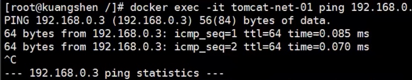

通过tomcat-net-02 ping tomcat-net-02也可以ping通

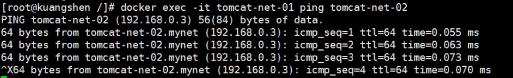

我们自定义的网络，docker都已经帮我们维护好了对应的关系，推荐我们平时这样使用网络

好处：

- 在集群上，不同的集群使用不同的网络，保证集群是安全和健康的（redis集群、MySQL集群）

### 网络连通

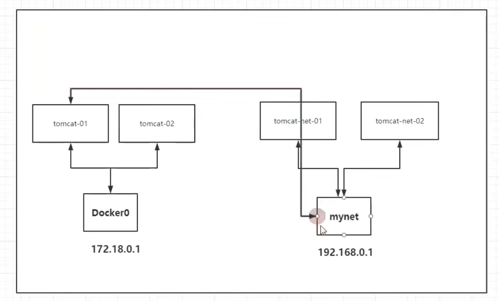

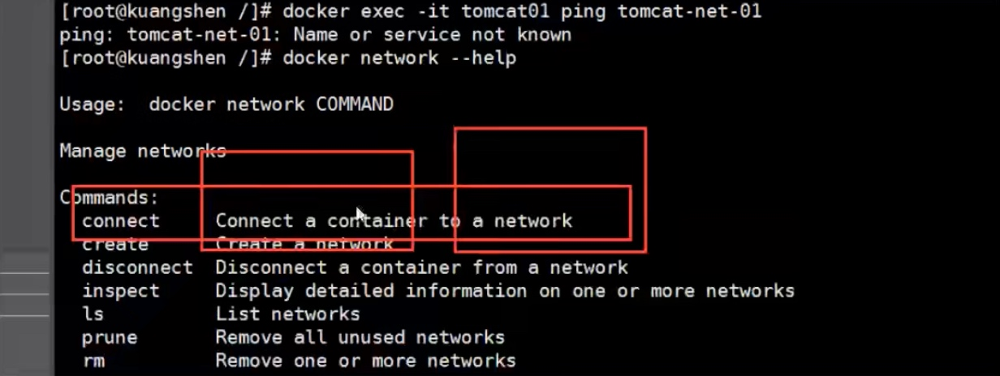

可以通过connect命令将一个容器连接到一个网络

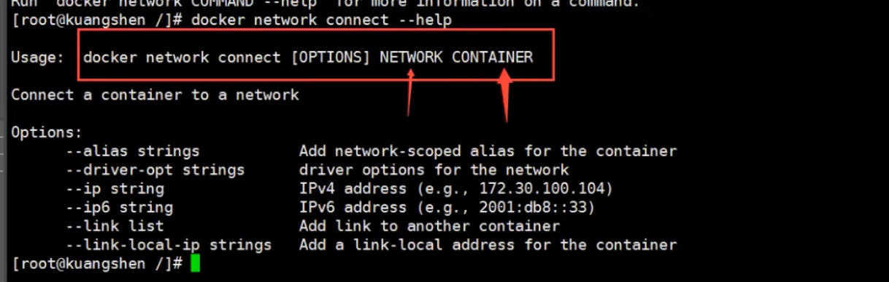

测试打通 tomcat01 到 mynet

```bash
docker network connect mynet tomcat01
```

通过`docker network inspect mynet`查看mynet的网络信息

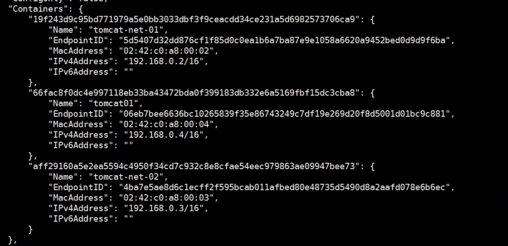

连通之后就是将tomcat01添加到了mynet的路由，官方的叫做：一个容器两个ip地址，就像阿里云的服务器，一个公网IP一个私网IP

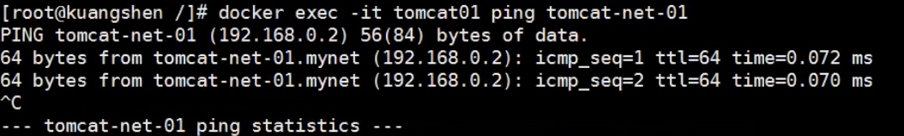

能ping通

结论：假设要跨网络操作别人，就需要使用docker network connect连通

### 实战：Redis集群部署

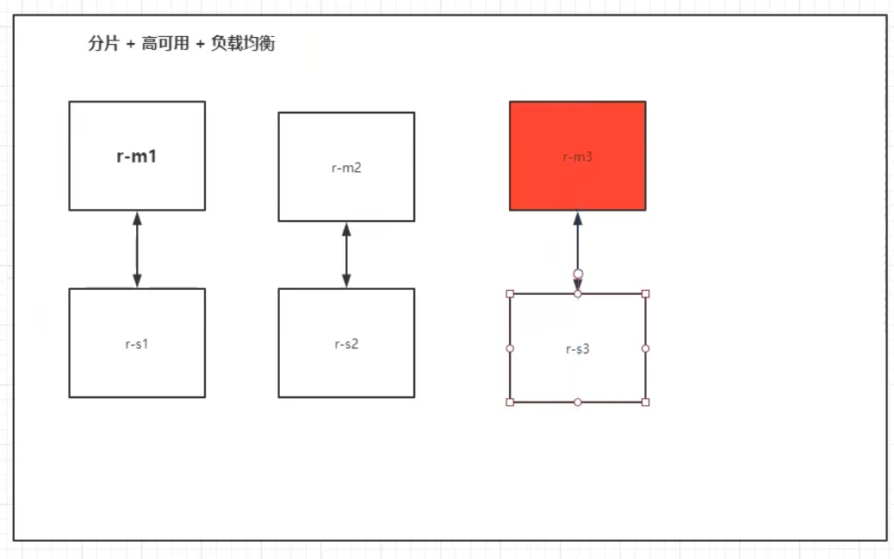

- 三主三从
- 只要其中一个master redis挂掉了，slave redis就要成为master redis

那么就要启动6个容器，一个个启动太慢了，写个shell脚本

1. 为了网络安全，创建一个网卡

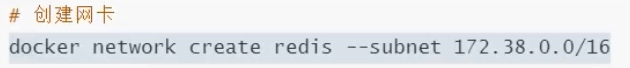

2. 通过脚本创建6个Redis配置

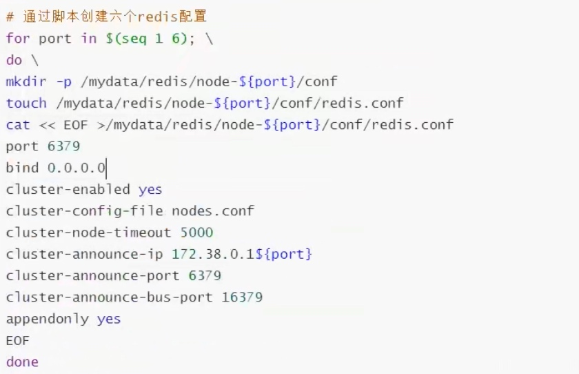

3. 启动

redis-1

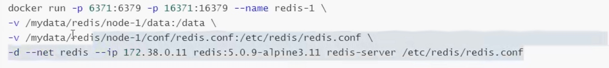

redis-2

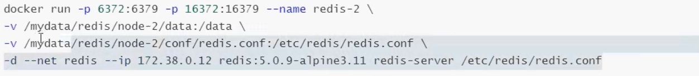

redis-3

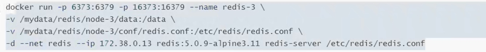

redis-4

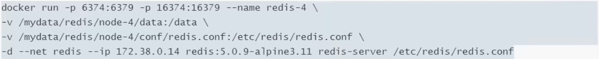

redis-5

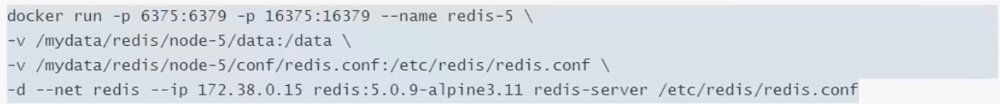

redis-6

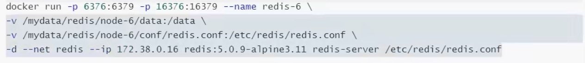

4. 创建集群

进入容器

创建集群

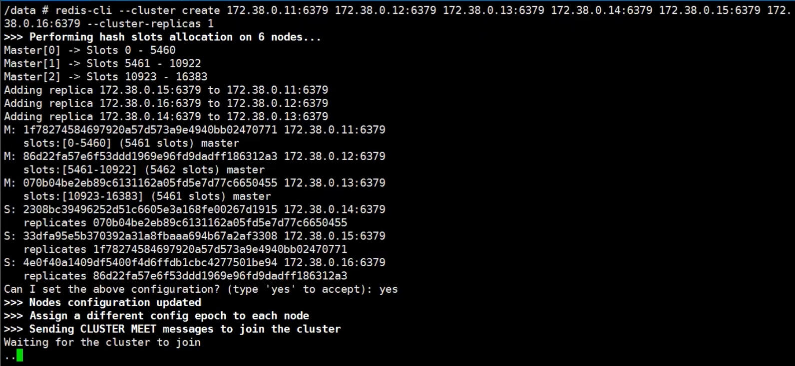

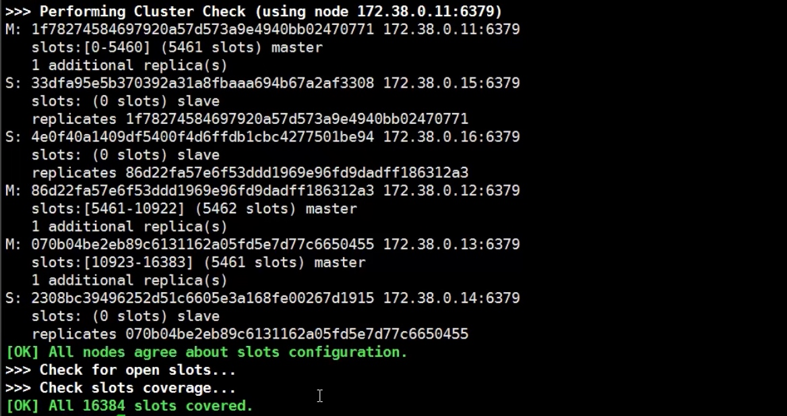

5. 集群测试

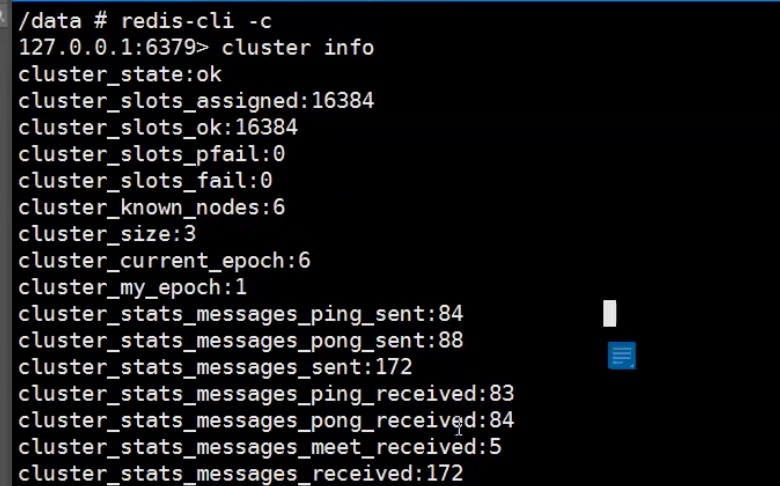

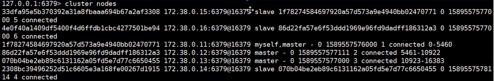

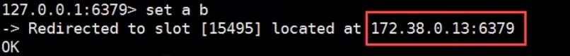

如果我们测试将13关闭，那么14就会成为master

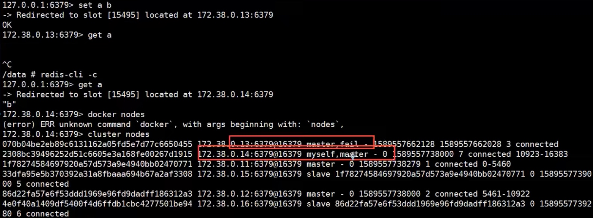

我们使用集群的之后，所有的技术都会慢慢变得简单

## springboot微服务打包docker镜像

1. 构建springboot项目

正常通过idea创建springboot项目，勾选 spring web测试一下就好了

写一个Controller，自测一下

```java
@RestController
public class HelloController {
    @RequestMapping("/hello")
    public String hello(){
        return "hello world";
    }
}
```


2. 打包应用

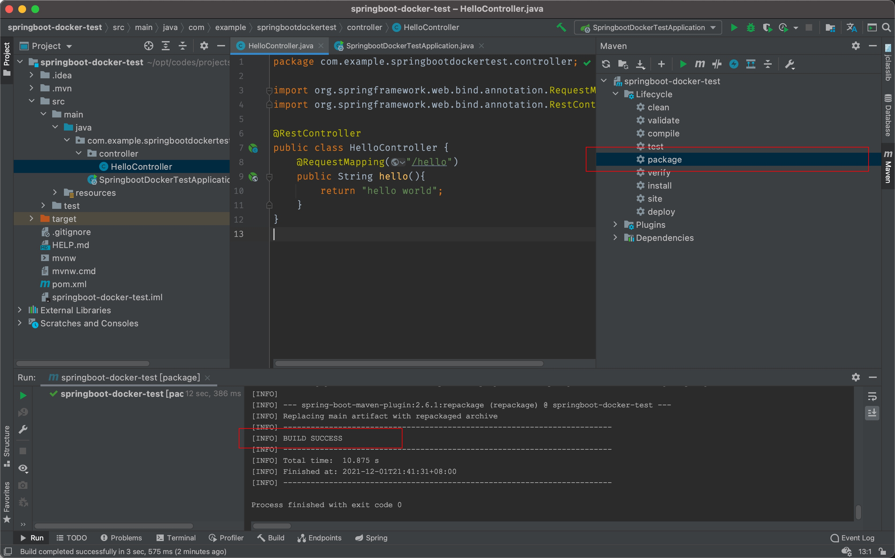

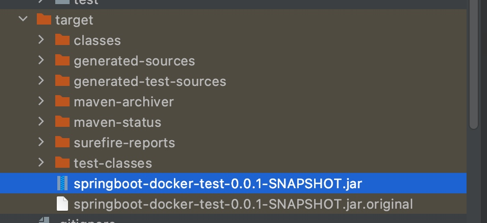

3. 编写dockerfile

idea中安装一个插件

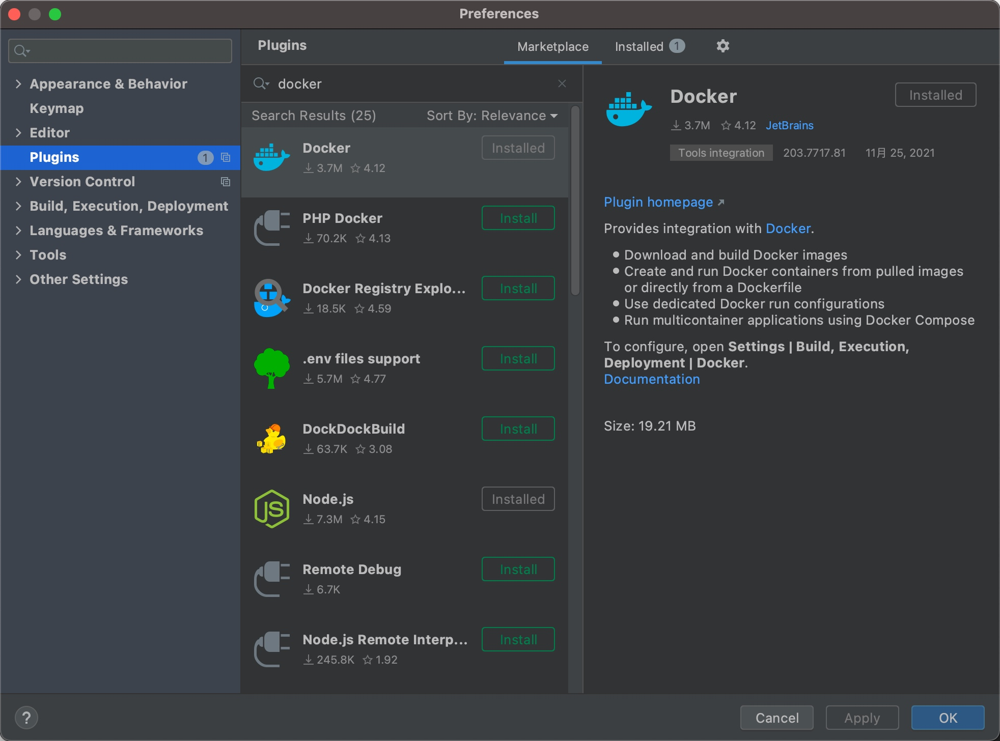

安装这个插件之后，编写dockerfile会高亮提示

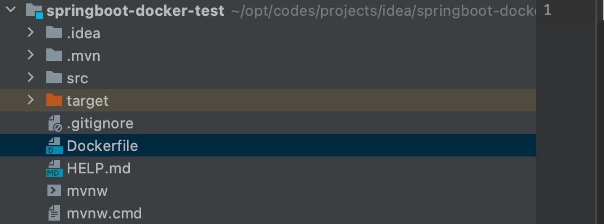

将target中的jar包拷贝到项目根目录

编写Dockerfile

```bash
FROM java:8

COPY *.jar /app.jar

CMD ["--server.port=8080"]

EXPOSE 8080

ENTRYPOINT ["java","-jar","/app.jar"]
```

上传到服务器

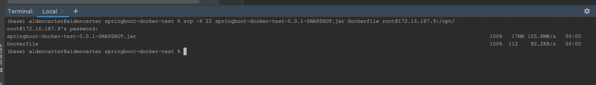

查看一下

```bash
[root@localhost idea]## ll
总用量 17208
-rw-r--r--. 1 root root      112 12月  1 21:55 Dockerfile
-rw-r--r--. 1 root root 17615742 12月  1 21:55 springboot-docker-test-0.0.1-SNAPSHOT.jar
```

4. 构建镜像

```bash
[root@localhost idea]## docker build -t springboot-docker-test .
Sending build context to Docker daemon  17.62MB
Step 1/5 : FROM java:8
8: Pulling from library/java
5040bd298390: Pull complete
fce5728aad85: Pull complete
76610ec20bf5: Pull complete
60170fec2151: Pull complete
e98f73de8f0d: Pull complete
11f7af24ed9c: Pull complete
49e2d6393f32: Pull complete
bb9cdec9c7f3: Pull complete
Digest: sha256:c1ff613e8ba25833d2e1940da0940c3824f03f802c449f3d1815a66b7f8c0e9d
Status: Downloaded newer image for java:8
 ---> d23bdf5b1b1b
Step 2/5 : COPY *.jar /app.jar
 ---> d0f78db7d58e
Step 3/5 : CMD ["--server.port=8080"]
 ---> Running in d10314b279e3
Removing intermediate container d10314b279e3
 ---> bb3cbc867291
Step 4/5 : EXPOSE 8080
 ---> Running in fd241ea8df01
Removing intermediate container fd241ea8df01
 ---> e750cd57c83c
Step 5/5 : ENTRYPOINT ["java","-jar","/app.jar"]
 ---> Running in 84080e2e9c12
Removing intermediate container 84080e2e9c12
 ---> ffc793f69fe5
Successfully built ffc793f69fe5
Successfully tagged springboot-docker-test:latest
```

```bash
[root@localhost idea]## docker images
REPOSITORY               TAG       IMAGE ID       CREATED          SIZE
springboot-docker-test   latest    ffc793f69fe5   13 minutes ago   661MB
```

5. 发布运行

```bash
[root@localhost idea]## docker run -d -P --name springboot-docker-test-01 ffc793f69fe5
a0208bb7d908cb7f8068717104ea3e88ea204bc767b027ef7a09f42da9cffaf2
```

6. 访问测试

```bash
[root@localhost idea]## curl 172.17.0.2:8080/hello
hello world
```

或者是直接通过访问`localhost:49156/hello`进行访问

```bash
[root@localhost idea]## docker ps
CONTAINER ID   IMAGE          COMMAND                  CREATED         STATUS         PORTS                                         NAMES
a0208bb7d908   ffc793f69fe5   "java -jar /app.jar …"   2 minutes ago   Up 2 minutes   0.0.0.0:49156->8080/tcp, :::49156->8080/tcp   springboot-docker-test-01
[root@localhost idea]## curl localhost:49156/hello
hello world
```

以后我们使用了docker之后，给别人交付的就是一个镜像即可

如果有很多的镜像，这么多镜像如何维护呢？后面的Docker Compose 和Docker Swarm

## Docker Compose

### 简介

以前使用使用docker都是使用dockerfile 之后使用docker build生成一个镜像，通过run去执行，这些全部不都是手动操作，比较麻烦

我们想要的效果是：微服务100个是不是要启动100个项目，就需要启动100个容器，每一个都需要编写一个dockerfile然后去build之后run，非常麻烦，而且100个服务之间还存在互相依赖，比较麻烦

这个时候docker compose就可以来高效的管理容器，定义和管理多个容器

k8s的描述文件也需要使用到docker compose来管理

官方介绍：

> Compose is a tool for defining and running multi-container Docker applications. With Compose, you use a YAML file to configure your application’s services. Then, with a single command, you create and start all the services from your configuration. To learn more about all the features of Compose, see the list of features.
>
> Compose works in all environments: production, staging, development, testing, as well as CI workflows. You can learn more about each case in Common Use Cases.
>
> Using Compose is basically a three-step process:
>
> 1. Define your app’s environment with a Dockerfile so it can be reproduced anywhere.
>
> 2. Define the services that make up your app in docker-compose.yml so they can be run together in an isolated environment.
>
> 3. Run docker compose up and the Docker compose command starts and runs your entire app. You can alternatively run docker-compose up using the docker-compose binary.

翻译：

> Compose 是一个用于定义和运行多容器 Docker 应用程序的工具。借助 Compose，您可以使用 YAML 文件来配置应用程序的服务。然后，使用单个命令，从配置中创建并启动所有服务。要了解有关 Compose 的所有功能的更多信息，请参阅功能列表。
>
> Compose 适用于所有环境：生产、登台、开发、测试以及 CI 工作流。您可以在常见用例中了解有关每个案例的更多信息。
>
> 使用 Compose 基本上是一个三步过程：
>
> 1. 使用 Dockerfile 定义应用程序的环境，以便它可以在任何地方复制。
>
> 2. 在 docker-compose.yml 中定义组成您的应用程序的服务，以便它们可以在隔离的环境中一起运行。
>
> 3. 运行 `docker compose up`，`Docker compose command` 命令启动并运行整个应用程序。您也可以使用 `docker-compose up` 二进制文件运行。

作用：批量编排容器

Compose 是docker官方的开源项目，需要安装

dockerfile让程序在任何地方运行

yaml文件示例：

```yaml
version: "3.9"  ## optional since v1.27.0
services:
  web:
    build: .
    ports:
      - "5000:5000"
    volumes:
      - .:/code
      - logvolume01:/var/log
    links:
      - redis
  redis:
    image: redis
volumes:
  logvolume01: {}
```

通过配置文件一键启动

compose重要的概念：

- 服务services：说白了就是一个容器，一个应用（web应用、Redis应用）的整合
- 项目project：一组关联的容器

### 安装

它就是一个二进制可执行文件，放在/usr/local/bin下就可以全局去用

1. 下载

```bash
sudo curl -L "https://github.com/docker/compose/releases/download/1.29.2/docker-compose-$(uname -s)-$(uname -m)" -o /usr/local/bin/docker-compose

## 国内镜像
sudo curl -L https://get.daocloud.io/docker/compose/releases/download/1.25.5/docker-compose-`uname -s`-`uname -m` > /usr/local/bin/docker-compose
```

2. 给下载的文件授权

```bash
sudo chmod +x /usr/local/bin/docker-compose
```

3. 执行查看docker compose 的版本号

```bash
docker-compose --version
```

```bash
[root@localhost bin]## docker-compose --version
docker-compose version 1.25.5, build 8a1c60f6
```

### 体验

官方快速开始体验：https://docs.docker.com/compose/gettingstarted/

1. 应用
2. dockerfile应用打包为镜像（单机玩具）
3. dockerfile-compose.yaml文件（定义整个应用的服务，需要的环境，web、redis）完整的上线服务
4. 启动compose项目`docker-compose up`

流程

```bash
[root@localhost composetest]## docker-compose up
Creating network "composetest_default" with the default driver
Building web
Step 1/10 : FROM python:3.7-alpine
3.7-alpine: Pulling from library/python
59bf1c3509f3: Pull complete
8786870f2876: Pull complete
45d4696938d0: Pull complete
ef84af58b2c5: Pull complete
c3c9b71b9a69: Pull complete
Digest: sha256:d64e0124674d64e78cc9d7378a1130499ced66a7a00db0521d0120a2e88ac9e4
Status: Downloaded newer image for python:3.7-alpine
 ---> a1034fd13493
Step 2/10 : WORKDIR /code
 ---> Running in faec68c4ae6b
Removing intermediate container faec68c4ae6b
 ---> 74cfe26e3734
Step 3/10 : ENV FLASK_APP=app.py
 ---> Running in 95d5e0bf2356
Removing intermediate container 95d5e0bf2356
 ---> a488d9e28f25
Step 4/10 : ENV FLASK_RUN_HOST=0.0.0.0
 ---> Running in 392b4d46904e
Removing intermediate container 392b4d46904e
 ---> fee1998a8360
Step 5/10 : RUN apk add --no-cache gcc musl-dev linux-headers
 ---> Running in 82abea5f21d4
fetch https://dl-cdn.alpinelinux.org/alpine/v3.15/main/x86_64/APKINDEX.tar.gz
fetch https://dl-cdn.alpinelinux.org/alpine/v3.15/community/x86_64/APKINDEX.tar.gz
(1/13) Installing libgcc (10.3.1_git20211027-r0)
(2/13) Installing libstdc++ (10.3.1_git20211027-r0)
(3/13) Installing binutils (2.37-r3)
(4/13) Installing libgomp (10.3.1_git20211027-r0)
(5/13) Installing libatomic (10.3.1_git20211027-r0)
(6/13) Installing libgphobos (10.3.1_git20211027-r0)
(7/13) Installing gmp (6.2.1-r0)
(8/13) Installing isl22 (0.22-r0)
(9/13) Installing mpfr4 (4.1.0-r0)
(10/13) Installing mpc1 (1.2.1-r0)
(11/13) Installing gcc (10.3.1_git20211027-r0)
(12/13) Installing linux-headers (5.10.41-r0)
(13/13) Installing musl-dev (1.2.2-r7)
Executing busybox-1.34.1-r3.trigger
OK: 139 MiB in 48 packages
Removing intermediate container 82abea5f21d4
 ---> 406168cd3b8c
Step 6/10 : COPY requirements.txt requirements.txt
 ---> 5963b56e0e47
Step 7/10 : RUN pip install -r requirements.txt
 ---> Running in c202416b44b1
Collecting flask
  Downloading Flask-2.0.2-py3-none-any.whl (95 kB)
Collecting redis
  Downloading redis-4.0.2-py3-none-any.whl (119 kB)
Collecting click>=7.1.2
  Downloading click-8.0.3-py3-none-any.whl (97 kB)
Collecting itsdangerous>=2.0
  Downloading itsdangerous-2.0.1-py3-none-any.whl (18 kB)
Collecting Werkzeug>=2.0
  Downloading Werkzeug-2.0.2-py3-none-any.whl (288 kB)
Collecting Jinja2>=3.0
  Downloading Jinja2-3.0.3-py3-none-any.whl (133 kB)
Collecting deprecated
  Downloading Deprecated-1.2.13-py2.py3-none-any.whl (9.6 kB)
Collecting importlib-metadata
  Downloading importlib_metadata-4.8.2-py3-none-any.whl (17 kB)
Collecting MarkupSafe>=2.0
  Downloading MarkupSafe-2.0.1-cp37-cp37m-musllinux_1_1_x86_64.whl (30 kB)
Collecting wrapt<2,>=1.10
  Downloading wrapt-1.13.3-cp37-cp37m-musllinux_1_1_x86_64.whl (78 kB)
Collecting typing-extensions>=3.6.4
  Downloading typing_extensions-4.0.1-py3-none-any.whl (22 kB)
Collecting zipp>=0.5
  Downloading zipp-3.6.0-py3-none-any.whl (5.3 kB)
Installing collected packages: zipp, typing-extensions, wrapt, MarkupSafe, importlib-metadata, Werkzeug, Jinja2, itsdangerous, deprecated, click, redis, flask
Successfully installed Jinja2-3.0.3 MarkupSafe-2.0.1 Werkzeug-2.0.2 click-8.0.3 deprecated-1.2.13 flask-2.0.2 importlib-metadata-4.8.2 itsdangerous-2.0.1 redis-4.0.2 typing-extensions-4.0.1 wrapt-1.13.3 zipp-3.6.0
WARNING: Running pip as the 'root' user can result in broken permissions and conflicting behaviour with the system package manager. It is recommended to use a virtual environment instead: https://pip.pypa.io/warnings/venv
WARNING: You are using pip version 21.2.4; however, version 21.3.1 is available.
You should consider upgrading via the '/usr/local/bin/python -m pip install --upgrade pip' command.
Removing intermediate container c202416b44b1
 ---> af9c9a8c06c0
Step 8/10 : EXPOSE 5000
 ---> Running in 6994d41dc122
Removing intermediate container 6994d41dc122
 ---> 971877e7d127
Step 9/10 : COPY . .
 ---> 253d9f21cc1e
Step 10/10 : CMD ["flask", "run"]
 ---> Running in a3dafc350523
Removing intermediate container a3dafc350523
 ---> 8d3b810d7c6f
Successfully built 8d3b810d7c6f
Successfully tagged composetest_web:latest
WARNING: Image for service web was built because it did not already exist. To rebuild this image you must use `docker-compose build` or `docker-compose up --build`.
Pulling redis (redis:alpine)...
alpine: Pulling from library/redis
59bf1c3509f3: Already exists
719adce26c52: Pull complete
b8f35e378c31: Pull complete
d034517f789c: Pull complete
3772d4d76753: Pull complete
211a7f52febb: Pull complete
Digest: sha256:4bed291aa5efb9f0d77b76ff7d4ab71eee410962965d052552db1fb80576431d
Status: Downloaded newer image for redis:alpine
Creating composetest_web_1   ... done
Creating composetest_redis_1 ... done
Attaching to composetest_redis_1, composetest_web_1
redis_1  | 1:C 04 Dec 2021 09:10:21.505 ## oO0OoO0OoO0Oo Redis is starting oO0OoO0OoO0Oo
redis_1  | 1:C 04 Dec 2021 09:10:21.505 ## Redis version=6.2.6, bits=64, commit=00000000, modified=0, pid=1, just started
redis_1  | 1:C 04 Dec 2021 09:10:21.505 ## Warning: no config file specified, using the default config. In order to specify a config file use redis-server /path/to/redis.conf
redis_1  | 1:M 04 Dec 2021 09:10:21.506 * monotonic clock: POSIX clock_gettime
redis_1  | 1:M 04 Dec 2021 09:10:21.506 * Running mode=standalone, port=6379.
redis_1  | 1:M 04 Dec 2021 09:10:21.506 ## WARNING: The TCP backlog setting of 511 cannot be enforced because /proc/sys/net/core/somaxconn is set to the lower value of 128.
redis_1  | 1:M 04 Dec 2021 09:10:21.506 ## Server initialized
redis_1  | 1:M 04 Dec 2021 09:10:21.506 ## WARNING overcommit_memory is set to 0! Background save may fail under low memory condition. To fix this issue add 'vm.overcommit_memory = 1' to /etc/sysctl.conf and then reboot or run the command 'sysctl vm.overcommit_memory=1' for this to take effect.
redis_1  | 1:M 04 Dec 2021 09:10:21.507 * Ready to accept connections
web_1    |  * Serving Flask app 'app.py' (lazy loading)
web_1    |  * Environment: production
web_1    |    WARNING: This is a development server. Do not use it in a production deployment.
web_1    |    Use a production WSGI server instead.
web_1    |  * Debug mode: off
web_1    |  * Running on all addresses.
web_1    |    WARNING: This is a development server. Do not use it in a production deployment.
web_1    |  * Running on http://172.18.0.2:5000/ (Press CTRL+C to quit)
```

- 创建网络
- 执行docker-compose.yraml
- 启动服务

5. 此时我们通过浏览器访问到linux服务器的IP地址的5000端口，`http://172.16.187.9:5000/`，就可以看到


```bash
[root@localhost ~]## docker ps
CONTAINER ID   IMAGE             COMMAND                  CREATED          STATUS          PORTS                                       NAMES
5fedf725a862   redis:alpine      "docker-entrypoint.s…"   16 minutes ago   Up 16 minutes   6379/tcp                                    composetest_redis_1
216979874e1c   composetest_web   "flask run"              16 minutes ago   Up 16 minutes   0.0.0.0:5000->5000/tcp, :::5000->5000/tcp   composetest_web_1
```

能这么顺利的启动是因为有一些默认的规则，下面会大概了解一下这些规则。

6. docker compose的停止

```bash
docker-compose stop/down

## 或者

docker-compose down --volumes
```

You can bring everything down, removing the containers entirely, with the down command. Pass --volumes to also remove the data volume used by the Redis container. 使用`--volumes`会在停止的时候解除挂载的映射目录

```bash
[root@localhost composetest]## docker-compose down
Stopping composetest_redis_1 ... done
Stopping composetest_web_1   ... done
Removing composetest_redis_1 ... done
Removing composetest_web_1   ... done
Removing network composetest_default
```

暴力停止 `ctrl+c`

### docker compose的一些默认规则

#### 启动规则

docker-compose中需要的镜像会自动帮我们下载

```bash
[root@localhost ~]## docker images
REPOSITORY               TAG          IMAGE ID       CREATED          SIZE
composetest_web          latest       8d3b810d7c6f   16 minutes ago   183MB
springboot-docker-test   latest       ffc793f69fe5   2 days ago       661MB
redis                    alpine       3900abf41552   4 days ago       32.4MB
python                   3.7-alpine   a1034fd13493   4 days ago       41.8MB
tomcat                   latest       904a98253fbf   2 weeks ago      680MB
face                     latest       d979b342f258   11 months ago    2.17GB
java                     8            d23bdf5b1b1b   4 years ago      643MB
```

如果后面我们使用到docker swarm就会有服务这个概念，现在还没有，先留一个悬念

```bash
[root@localhost ~]## docker service ls
Error response from daemon: This node is not a swarm manager. Use "docker swarm init" or "docker swarm join" to connect this node to swarm and try again.
```

默认的服务名 是文件名_服务名_num

未来如果使用到多个集群的话，那么就会这种形式：文件名_服务名_num。_num是副本数量
服务Redis服务==>4个副本，集群状态下，服务不能是只有一个运行实例，都是弹性的，这样可以在每个服务器上运行docker，docker中运行这个redis，实现高并发的目的

#### 网络规则

```bash
[root@localhost ~]## docker network ls
NETWORK ID     NAME                  DRIVER    SCOPE
6c50f2484f94   bridge                bridge    local
96bfa39def47   composetest_default   bridge    local
3793140c9b61   host                  host      local
f5ece4249811   none                  null      local
```

docker运行的话，为了避免不同的环境网络的影响，所以我们之前在讲到docker网络的时候，经常使用自己创建的自定义网络来作为自己容器的连接桥梁

如果项目中的容器都在同一个网络下，就可以通过域名访问，其实就是在网络下做一个dns映射解析到到对应的IP地址上去

原本的mysql服务写连接url是：mysql://ip地址:3306xxxxxx，现在为了避免当这个指定的IP地址的服务器宕机之后无法做到高可用，所以就会将MySQL部署在集群上，此时我们更想的是如何通过同一个域名可以映射到指定的IP地址，能让我们访问连接到服务器，自定义网络就可以通过域名进行访问到MySQL服务器

我们通过`docker network inspect`查看当前的我们创建的compose项目可以看到，当前的这个网络已经做了映射

```bash
[root@localhost ~]## docker network inspect 96bfa39def47
[
    {
        "Name": "composetest_default",
        "Id": "96bfa39def47ed72fe95d0a62f64f1d6bd4fa4e80b4160fc26ddf0d8d32a4692",
        "Created": "2021-12-04T16:52:44.600560681+08:00",
        "Scope": "local",
        "Driver": "bridge",
        "EnableIPv6": false,
        "IPAM": {
            "Driver": "default",
            "Options": null,
            "Config": [
                {
                    "Subnet": "172.18.0.0/16",
                    "Gateway": "172.18.0.1"
                }
            ]
        },
        "Internal": false,
        "Attachable": true,
        "Ingress": false,
        "ConfigFrom": {
            "Network": ""
        },
        "ConfigOnly": false,
        "Containers": {
            "216979874e1c98721a1f2db21cb8888420b1c8edd59ac8bd67b34bbe11bda3a2": {
                "Name": "composetest_web_1",
                "EndpointID": "2b7d27960aaf3509dd972f5fbe779bfe12e30db0e68767782a65028e11e9ba3f",
                "MacAddress": "02:42:ac:12:00:02",
                "IPv4Address": "172.18.0.2/16",
                "IPv6Address": ""
            },
            "5fedf725a86236ab418af51abd4aa1d6a52c190a269dd43bd2c867ae068d1922": {
                "Name": "composetest_redis_1",
                "EndpointID": "1803f09ddac375a4828ac5f2ca0636738283456b802b29c63b7e9513de4f435f",
                "MacAddress": "02:42:ac:12:00:03",
                "IPv4Address": "172.18.0.3/16",
                "IPv6Address": ""
            }
        },
        "Options": {},
        "Labels": {
            "com.docker.compose.network": "default",
            "com.docker.compose.project": "composetest",
            "com.docker.compose.version": "1.25.5"
        }
    }
]
```

前面我们在使用python的创建第一个compose项目的时候，使用的连接不是域名，而是redis，就是compose帮我们解决了映射的问题

```py
cache = redis.Redis(host='redis', port=6379)
```

### docker 小结

1. docker镜像通过run变成一个容器
2. dockerfile来构建镜像，也就是服务打包
3. 多个微服务的环境可以通过docker-compose来管理和启动服务（编排、环境、服务之间的依赖、网络的处理）
4. docker network 网络

### compose配置编写规则

官方的网址：https://docs.docker.com/compose/compose-file/

docker-compose.yaml的核心

三层

```yaml
## 3层

version: '' ## 版本
services: ## 服务
    服务1:
        ## 服务配置，原来在在docker中配置的配置信息都可以在这里写
        images:
        build:
        network:
    服务2:
    ## .....
## 其他配置 网络配置、卷挂载、全局配置
volumes:
network:
configs:
```

比如：

```yaml
version: "3.9"
services:

  redis:
    image: redis:alpine
    ports:
      - "6379"
    networks:
      - frontend
    deploy:
      replicas: 2
      update_config:
        parallelism: 2
        delay: 10s
      restart_policy:
        condition: on-failure

  db:
    image: postgres:9.4
    volumes:
      - db-data:/var/lib/postgresql/data
    networks:
      - backend
    deploy:
      placement:
        max_replicas_per_node: 1
        constraints:
          - "node.role==manager"

  vote:
    image: dockersamples/examplevotingapp_vote:before
    ports:
      - "5000:80"
    networks:
      - frontend
    depends_on:
      - redis
    deploy:
      replicas: 2
      update_config:
        parallelism: 2
      restart_policy:
        condition: on-failure

  result:
    image: dockersamples/examplevotingapp_result:before
    ports:
      - "5001:80"
    networks:
      - backend
    depends_on: ## 依赖，项目启动的顺序，当前项目启动需要先启动其他的项目
      - db
    deploy:
      replicas: 1
      update_config:
        parallelism: 2
        delay: 10s
      restart_policy:
        condition: on-failure

  worker:
    image: dockersamples/examplevotingapp_worker
    networks:
      - frontend
      - backend
    deploy: ## 集群
      mode: replicated
      replicas: 1
      labels: [APP=VOTING]
      restart_policy:
        condition: on-failure
        delay: 10s
        max_attempts: 3
        window: 120s
      placement:
        constraints:
          - "node.role==manager"

  visualizer:
    image: dockersamples/visualizer:stable
    ports:
      - "8080:8080"
    stop_grace_period: 1m30s
    volumes:
      - "/var/run/docker.sock:/var/run/docker.sock"
    deploy:
      placement:
        constraints:
          - "node.role==manager"

networks:
  frontend:
  backend:

volumes:
  db-data:
```

- depends_on: ## 依赖，项目启动的顺序，当前项目启动需要先启动其他的项目


### 实战示例：使用compose一键部署WP博客

官方网址：https://docs.docker.com/samples/wordpress/

1. 创建目录，`cd my_wordpress/`
2. 创建yaml文件`docker-compose.yml`

```yaml
version: "3.9"
    
services:
  db:
    image: mysql:5.7
    volumes:
      - db_data:/var/lib/mysql
    restart: always
    environment:
      MYSQL_ROOT_PASSWORD: somewordpress
      MYSQL_DATABASE: wordpress
      MYSQL_USER: wordpress
      MYSQL_PASSWORD: wordpress
    
  wordpress:
    depends_on:
      - db
    image: wordpress:latest
    volumes:
      - wordpress_data:/var/www/html
    ports:
      - "8000:80"
    restart: always
    environment:
      WORDPRESS_DB_HOST: db:3306
      WORDPRESS_DB_USER: wordpress
      WORDPRESS_DB_PASSWORD: wordpress
      WORDPRESS_DB_NAME: wordpress
volumes:
  db_data: {}
  wordpress_data: {}
```

3. 构建并启动`docker-compose up -d`

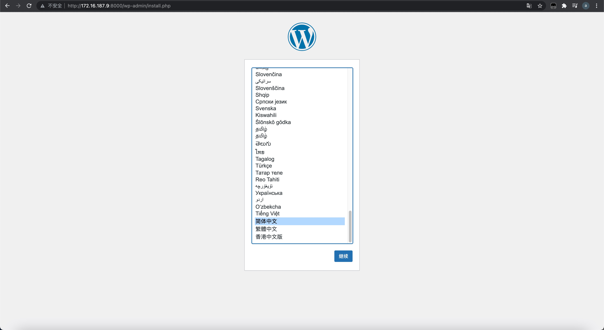

### 实战：自己编写微服务使用compose部署到docker

1. 创建springboot项目

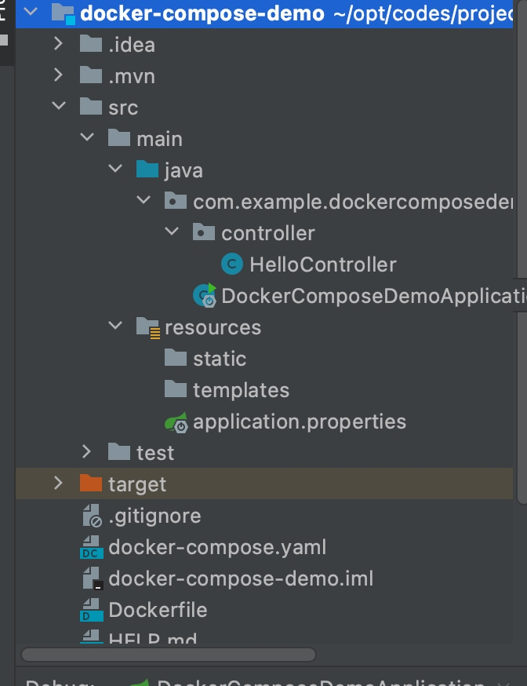

2. 编写Controller

```java
package com.example.dockercomposedemo.controller;

import org.springframework.beans.factory.annotation.Autowired;
import org.springframework.data.redis.core.StringRedisTemplate;
import org.springframework.web.bind.annotation.GetMapping;
import org.springframework.web.bind.annotation.RestController;

@RestController
public class HelloController {

    @Autowired
    private StringRedisTemplate redisTemplate;

    @GetMapping("/hello")
    public String hello() {
        final Long views = redisTemplate.opsForValue().increment("views");
        return "hello, " + views;
    }
}
```

3. 编写Dockerfile，构建镜像

```
FROM java:8
COPY *.jar /app.jar
CMD ["--server.port=8080"]

EXPOSE 8080

ENTRYPOINT ["java","-jar","/app.jar"]
```

4. 编写docker-compose.yaml，编排项目

```yaml
version: "3"
services:
  zhangapp:
    build: .
    image: zhangapp
    depends_on:
      - redis
    ports:
      - "8080:8080"
  redis:
    image: "library/redis:alpine"
```

5. 上传到服务，启动

```bash
[root@localhost docker-compose-demo]## ll
总用量 26944
-rw-r--r-- 1 root root 27581162 12月  4 20:42 docker-compose-demo-0.0.1-SNAPSHOT.jar
-rw-r--r-- 1 root root      171 12月  4 20:43 docker-compose.yaml
-rw-r--r-- 1 root root      110 12月  4 20:43 Dockerfile
```

```bash
[root@localhost docker-compose-demo]## docker-compose up -d
Creating network "docker-compose-demo_default" with the default driver
Building zhangapp
Step 1/5 : FROM java:8
 ---> d23bdf5b1b1b
Step 2/5 : COPY *.jar /app.jar
 ---> 4cea62a18432
Step 3/5 : CMD ["--server.port=8080"]
 ---> Running in a83e3feb516a
Removing intermediate container a83e3feb516a
 ---> 4a33c1954a5e
Step 4/5 : EXPOSE 8080
 ---> Running in f92bb0f6300d
Removing intermediate container f92bb0f6300d
 ---> 5133930fd6a0
Step 5/5 : ENTRYPOINT ["java","-jar","/app.jar"]
 ---> Running in fc7d894a738b
Removing intermediate container fc7d894a738b
 ---> d4724f41cb29
Successfully built d4724f41cb29
Successfully tagged zhangapp:latest
WARNING: Image for service zhangapp was built because it did not already exist. To rebuild this image you must use `docker-compose build` or `docker-compose up --build`.
Creating docker-compose-demo_redis_1 ... done
Creating docker-compose-demo_zhangapp_1 ... done
```

```bash
[root@localhost docker-compose-demo]## docker ps
CONTAINER ID   IMAGE              COMMAND                  CREATED          STATUS          PORTS                                       NAMES
f7828c2306ae   zhangapp           "java -jar /app.jar …"   21 seconds ago   Up 20 seconds   0.0.0.0:8080->8080/tcp, :::8080->8080/tcp   docker-compose-demo_zhangapp_1
```


假设项目需要重新打包，可以使用`docker-compose up --bulid`

通过命令`docker-compose --help`

```bash
[root@localhost docker-compose-demo]## docker-compose --help
Define and run multi-container applications with Docker.

Usage:
  docker-compose [-f <arg>...] [options] [COMMAND] [ARGS...]
  docker-compose -h|--help

Options:
  -f, --file FILE             Specify an alternate compose file
                              (default: docker-compose.yml)
  -p, --project-name NAME     Specify an alternate project name
                              (default: directory name)
  --verbose                   Show more output
  --log-level LEVEL           Set log level (DEBUG, INFO, WARNING, ERROR, CRITICAL)
  --no-ansi                   Do not print ANSI control characters
  -v, --version               Print version and exit
  -H, --host HOST             Daemon socket to connect to

  --tls                       Use TLS; implied by --tlsverify
  --tlscacert CA_PATH         Trust certs signed only by this CA
  --tlscert CLIENT_CERT_PATH  Path to TLS certificate file
  --tlskey TLS_KEY_PATH       Path to TLS key file
  --tlsverify                 Use TLS and verify the remote
  --skip-hostname-check       Don't check the daemon's hostname against the
                              name specified in the client certificate
  --project-directory PATH    Specify an alternate working directory
                              (default: the path of the Compose file)
  --compatibility             If set, Compose will attempt to convert keys
                              in v3 files to their non-Swarm equivalent
  --env-file PATH             Specify an alternate environment file

Commands:
  build              Build or rebuild services
  config             Validate and view the Compose file
  create             Create services
  down               Stop and remove containers, networks, images, and volumes
  events             Receive real time events from containers
  exec               Execute a command in a running container
  help               Get help on a command
  images             List images
  kill               Kill containers
  logs               View output from containers
  pause              Pause services
  port               Print the public port for a port binding
  ps                 List containers
  pull               Pull service images
  push               Push service images
  restart            Restart services
  rm                 Remove stopped containers
  run                Run a one-off command
  scale              Set number of containers for a service
  start              Start services
  stop               Stop services
  top                Display the running processes
  unpause            Unpause services
  up                 Create and start containers
  version            Show the Docker-Compose version information
```

### 总结

一个工程里面有多个项目，项目最终会整合成一个完整的工程，工程里面可能会有多个服务，服务会被跑成一个容器

Kubernetes k8s

## Docker Swarm

集群的方式，不是单机

### 环境准备

创建四个虚拟机，直接创建一个，然后克隆出来

按照之前的docker安装docker，在iterm2上可以使用快捷键`commnand+shift+i`同时多窗口输入

需要先把防火墙关闭或者在之后使用的相关的端口的时候开启这个端口

我们这里在虚拟机上运行，就直接关闭防火墙好了

1. 检测防火墙状态

```bash
[root@localhost opt]## systemctl status firewalld
● firewalld.service - firewalld - dynamic firewall daemon
   Loaded: loaded (/usr/lib/systemd/system/firewalld.service; enabled; vendor preset: enabled)
   Active: active (running) since 六 2021-12-04 21:53:41 CST; 1h 23min ago
     Docs: man:firewalld(1)
 Main PID: 725 (firewalld)
    Tasks: 2
   Memory: 1.5M
   CGroup: /system.slice/firewalld.service
           └─725 /usr/bin/python2 -Es /usr/sbin/firewalld --nofork --nopid
```

是开启的

2. 关闭

```bash
## 停止防火墙
systemctl stop firewalld
## 永久关闭
systemctl disable firewalld
```


### Swarm集群搭建

swarm相关的：https://docs.docker.com/get-started/overview/

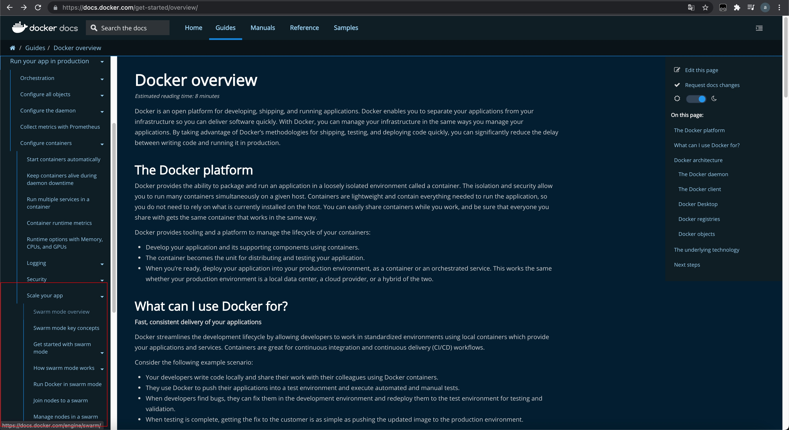

工作模式：https://docs.docker.com/engine/swarm/how-swarm-mode-works/nodes/

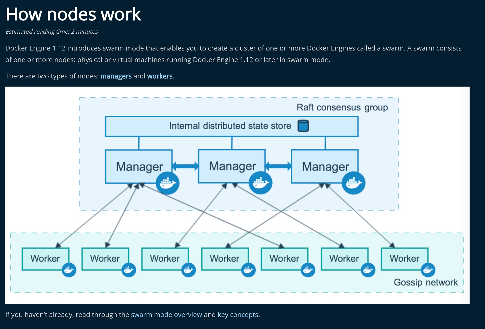

- 有节点的概念，工作节点和管理节点，管理节点至少要有三个，选举，两个的话，选不了
- 操作都是在manager上
- Raft 一致性算法

swarm相关的命令

```bash
[root@localhost opt]## docker swarm --help

Usage:  docker swarm COMMAND

Manage Swarm

Commands:
  ca          Display and rotate the root CA
  init        Initialize a swarm
  join        Join a swarm as a node and/or manager
  join-token  Manage join tokens
  leave       Leave the swarm
  unlock      Unlock swarm
  unlock-key  Manage the unlock key
  update      Update the swarm

Run 'docker swarm COMMAND --help' for more information on a command.
```

初始化一个集群

```bash
[root@localhost opt]## docker swarm init --help

Usage:  docker swarm init [OPTIONS]

Initialize a swarm

Options:
      --advertise-addr string                  Advertised address (format: <ip|interface>[:port]) ## 重点是这个命令，告诉别人我在哪里
```

- `--advertise-addr string`，Advertised address (format: <ip|interface>[:port]) ## 重点是这个命令，告诉别人我在哪里

```bash
[root@localhost opt]## docker swarm init --advertise-addr 172.16.187.10
Swarm initialized: current node (wrph3nynhph6xxbaw074zbtfu) is now a manager.

To add a worker to this swarm, run the following command:

    docker swarm join --token SWMTKN-1-1xcdmrx4ptaipi39andnrjg2k77ls27qhlm1e3utmq5y3s7loe-cqs6vlluiri1rykp9v7vywhh9 172.16.187.10:2377

To add a manager to this swarm, run 'docker swarm join-token manager' and follow the instructions.
```

得到两个信息：

- To add a worker to this swarm, run the following command:`docker swarm join --token SWMTKN-1-1xcdmrx4ptaipi39andnrjg2k77ls27qhlm1e3utmq5y3s7loe-cqs6vlluiri1rykp9v7vywhh9 172.16.187.10:2377`
- To add a manager to this swarm, run `docker swarm join-token manager` and follow the instructions.

获取令牌

- `docker swarm join-token manager` 获取管理节点令牌
- `docker swarm join-token worker` 获取工作节点令牌

获取到的令牌可以用作其他节点来加入到这个swarm中

将另一个节点加入到swarm中，如果出现不能连接的话，就查看是否开放了端口，要么就直接关闭防火墙

```bash
[root@localhost opt]## docker swarm join --token SWMTKN-1-1xcdmrx4ptaipi39andnrjg2k77ls27qhlm1e3utmq5y3s7loe-cqs6vlluiri1rykp9v7vywhh9 172.16.187.10:2377
This node joined a swarm as a worker.
```

通过使用`docker node ls`查看节点列表，只能使用在管理节点上

```bash
[root@localhost opt]## docker node ls
ID                            HOSTNAME                STATUS    AVAILABILITY   MANAGER STATUS   ENGINE VERSION
o7axrudtjc5w0jfufzzpgifp6     localhost.localdomain   Ready     Active                          20.10.11
wrph3nynhph6xxbaw074zbtfu *   localhost.localdomain   Ready     Active         Leader           20.10.11
```

配置所有的主机：

2、5做manager，3、4做worker 

```bash
[root@localhost opt]## docker node ls
ID                            HOSTNAME                STATUS    AVAILABILITY   MANAGER STATUS   ENGINE VERSION
4otmq6usrs4n2cncja3pw7u0t     localhost.localdomain   Ready     Active                          20.10.11
o7axrudtjc5w0jfufzzpgifp6     localhost.localdomain   Ready     Active                          20.10.11
wrph3nynhph6xxbaw074zbtfu *   localhost.localdomain   Ready     Active         Leader           20.10.11
yw58psu6baqkg6a9yv4urol4o     localhost.localdomain   Ready     Active         Reachable        20.10.11
```

#### 总结

1. 生成主节点
2. 其他节点加入（可以加入manager或者worker）
3. 上面的双manager是不合理的，但是只有四台虚拟机，先这么配置

### Raft协议

上面我们搭建的集群，双主双从，假设一个节点挂了，其他节点是否可以使用？

Raft协议的核心就是保证大多数节点存活才可以用，至少>1台，集群的话至少>3台

实验：

1. 将docker manager其中的一个机器停止，模仿宕机，双主机的情况下，另外一个节点也不能使用

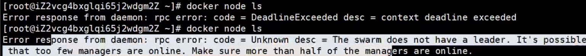

2. 可以使用`docker swarm leave`离开集群，那么就会显示down的状态

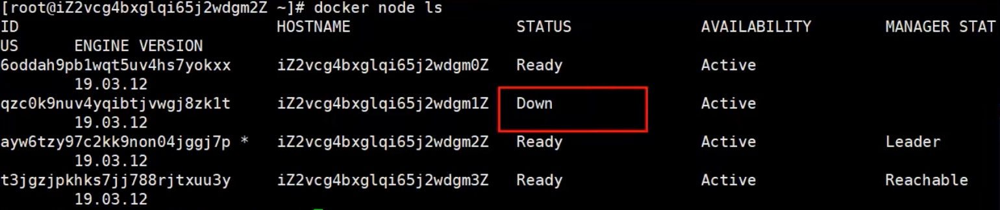

3. worker节点就是工作的，manager节点是管理的，只有管理节点才能执行命令

将刚才leave的节点作为管理节点加入到集群中

```bash
[root@localhost opt]## docker node ls
ID                            HOSTNAME                STATUS    AVAILABILITY   MANAGER STATUS   ENGINE VERSION
4otmq6usrs4n2cncja3pw7u0t     localhost.localdomain   Down      Active                          20.10.11
95k3fdaiws92nfnlgw2c0az6r     localhost.localdomain   Ready     Active         Reachable        20.10.11
o7axrudtjc5w0jfufzzpgifp6     localhost.localdomain   Ready     Active                          20.10.11
wrph3nynhph6xxbaw074zbtfu *   localhost.localdomain   Ready     Active         Leader           20.10.11
yw58psu6baqkg6a9yv4urol4o     localhost.localdomain   Ready     Active         Reachable        20.10.11
```

4. 这个时候我们有三个管理节点，如果其中一台宕机了，那么另外两台会选出一个leader

```bash
[root@localhost opt]## systemctl stop docker
Warning: Stopping docker.service, but it can still be activated by:
  docker.socket
```

还可以运行

```bash
[root@localhost opt]## docker node ls
ID                            HOSTNAME                STATUS    AVAILABILITY   MANAGER STATUS   ENGINE VERSION
4otmq6usrs4n2cncja3pw7u0t     localhost.localdomain   Down      Active                          20.10.11
95k3fdaiws92nfnlgw2c0az6r *   localhost.localdomain   Ready     Active         Leader           20.10.11
o7axrudtjc5w0jfufzzpgifp6     localhost.localdomain   Ready     Active                          20.10.11
wrph3nynhph6xxbaw074zbtfu     localhost.localdomain   Unknown   Active         Unreachable      20.10.11
yw58psu6baqkg6a9yv4urol4o     localhost.localdomain   Ready     Active         Reachable        20.10.11
```

如果我们在将其中一个manager也停止，那么此时就无法运行了，因为只有一个manager了

#### 总结

- 集群，要想可用，至少要保证有3个manager，至少要保证有>1台manager是存活的
- Raft协议：保证大多数节点存活，才可以使用，高可用

### swarm集群弹性创建服务

以后告别docker run，容器就是玩具，脱离了编排就没有任何意义

docker-compose才是启动一个项目的重点，单机

到了集群里面，那么就是swarm，`docker service`服务

到k8s里面，也是一个个的服务，service pods

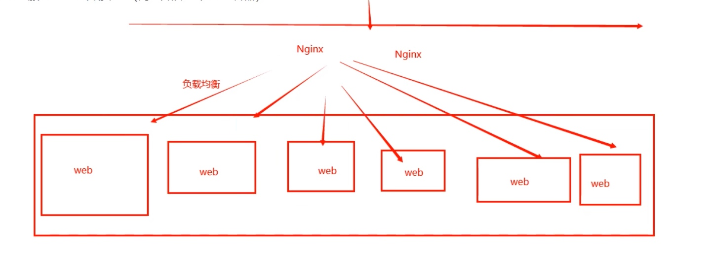

- 如果新增加一个web服务，那么就需要在Nginx中配置映射才能做负载均衡，是比较麻烦的
- 但是使用了swarm之后，它屏蔽了底层的服务，在增加多少个web服务，其实对Nginx来说都是一个
- 也就是动态扩缩容

#### 体验：创建服务、动态扩展服务、动态更新服务、移除服务

##### 创建服务

可以通过docker service在集群的情况下启动一个服务

```bash
[root@localhost opt]## docker service --help

Usage:  docker service COMMAND

Manage services

Commands:
  create      Create a new service
  inspect     Display detailed information on one or more services
  logs        Fetch the logs of a service or task
  ls          List services
  ps          List the tasks of one or more services
  rm          Remove one or more services
  rollback    Revert changes to a service's configuration
  scale       Scale one or multiple replicated services
  update      Update a service

Run 'docker service COMMAND --help' for more information on a command.
```

灰度发布：金丝雀发布，要平滑的升级版本，几种升级版本的方式：

- 停止网站，重新发布项目
- 灰度发布，动态升级

```bash
[root@localhost opt]## docker service create --help

Usage:  docker service create [OPTIONS] IMAGE [COMMAND] [ARG...]

Create a new service

Options:
      --cap-add list                       Add Linux capabilities
      --cap-drop list                      Drop Linux capabilities
      --config config                      Specify configurations to expose to the service
      --constraint list                    Placement constraints
      --container-label list               Container labels
      --credential-spec credential-spec    Credential spec for managed service account (Windows only)
  -d, --detach                             Exit immediately instead of waiting for the service to converge
      --dns list                           Set custom DNS servers
      --dns-option list                    Set DNS options
      --dns-search list                    Set custom DNS search domains
      --endpoint-mode string               Endpoint mode (vip or dnsrr) (default "vip")
      --entrypoint command                 Overwrite the default ENTRYPOINT of the image
  -e, --env list                           Set environment variables
      --env-file list                      Read in a file of environment variables
      --generic-resource list              User defined resources
      --group list                         Set one or more supplementary user groups for the container
      --health-cmd string                  Command to run to check health
      --health-interval duration           Time between running the check (ms|s|m|h)
      --health-retries int                 Consecutive failures needed to report unhealthy
      --health-start-period duration       Start period for the container to initialize before counting retries towards unstable (ms|s|m|h)
      --health-timeout duration            Maximum time to allow one check to run (ms|s|m|h)
      --host list                          Set one or more custom host-to-IP mappings (host:ip)
      --hostname string                    Container hostname
      --init                               Use an init inside each service container to forward signals and reap processes
      --isolation string                   Service container isolation mode
  -l, --label list                         Service labels
      --limit-cpu decimal                  Limit CPUs
      --limit-memory bytes                 Limit Memory
      --limit-pids int                     Limit maximum number of processes (default 0 = unlimited)
      --log-driver string                  Logging driver for service
      --log-opt list                       Logging driver options
      --max-concurrent uint                Number of job tasks to run concurrently (default equal to --replicas)
      --mode string                        Service mode (replicated, global, replicated-job, or global-job) (default "replicated")
      --mount mount                        Attach a filesystem mount to the service
      --name string                        Service name
      --network network                    Network attachments
      --no-healthcheck                     Disable any container-specified HEALTHCHECK
      --no-resolve-image                   Do not query the registry to resolve image digest and supported platforms
      --placement-pref pref                Add a placement preference
  -p, --publish port                       Publish a port as a node port
  -q, --quiet                              Suppress progress output
      --read-only                          Mount the container's root filesystem as read only
      --replicas uint                      Number of tasks
      --replicas-max-per-node uint         Maximum number of tasks per node (default 0 = unlimited)
      --reserve-cpu decimal                Reserve CPUs
      --reserve-memory bytes               Reserve Memory
      --restart-condition string           Restart when condition is met ("none"|"on-failure"|"any") (default "any")
      --restart-delay duration             Delay between restart attempts (ns|us|ms|s|m|h) (default 5s)
      --restart-max-attempts uint          Maximum number of restarts before giving up
      --restart-window duration            Window used to evaluate the restart policy (ns|us|ms|s|m|h)
      --rollback-delay duration            Delay between task rollbacks (ns|us|ms|s|m|h) (default 0s)
      --rollback-failure-action string     Action on rollback failure ("pause"|"continue") (default "pause")
      --rollback-max-failure-ratio float   Failure rate to tolerate during a rollback (default 0)
      --rollback-monitor duration          Duration after each task rollback to monitor for failure (ns|us|ms|s|m|h) (default 5s)
      --rollback-order string              Rollback order ("start-first"|"stop-first") (default "stop-first")
      --rollback-parallelism uint          Maximum number of tasks rolled back simultaneously (0 to roll back all at once) (default 1)
      --secret secret                      Specify secrets to expose to the service
      --stop-grace-period duration         Time to wait before force killing a container (ns|us|ms|s|m|h) (default 10s)
      --stop-signal string                 Signal to stop the container
      --sysctl list                        Sysctl options
  -t, --tty                                Allocate a pseudo-TTY
      --ulimit ulimit                      Ulimit options (default [])
      --update-delay duration              Delay between updates (ns|us|ms|s|m|h) (default 0s)
      --update-failure-action string       Action on update failure ("pause"|"continue"|"rollback") (default "pause")
      --update-max-failure-ratio float     Failure rate to tolerate during an update (default 0)
      --update-monitor duration            Duration after each task update to monitor for failure (ns|us|ms|s|m|h) (default 5s)
      --update-order string                Update order ("start-first"|"stop-first") (default "stop-first")
      --update-parallelism uint            Maximum number of tasks updated simultaneously (0 to update all at once) (default 1)
  -u, --user string                        Username or UID (format: <name|uid>[:<group|gid>])
      --with-registry-auth                 Send registry authentication details to swarm agents
  -w, --workdir string                     Working directory inside the container
```

比如创建一个服务Nginx：`docker service create -p 8888:80 --name my-nginx nginx`

```bash
[root@localhost opt]## docker service create -p 8888:80 --name my-nginx nginx
nr2jxd0t215jxhh9upxd4l59q
overall progress: 1 out of 1 tasks
1/1: running   [==================================================>]
verify: Service converged
[root@localhost opt]## docker service ls
ID             NAME       MODE         REPLICAS   IMAGE          PORTS
nr2jxd0t215j   my-nginx   replicated   1/1        nginx:latest   *:8888->80/tcp
```

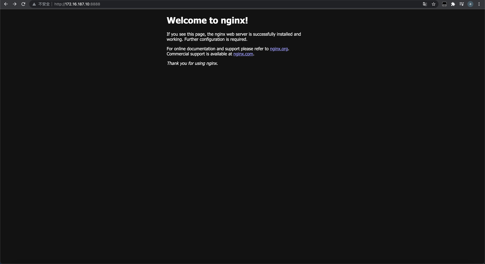

- replicated 副本，当前只有一个

理解两个概念：

- docker run 容器启动，不具有扩缩容器
- docker service 服务，具有扩缩容器，可以滚动更新

可以通过过`docker ps`查看当前服务运行在哪个机器上的，虽然在2这个节点启动的，但是运行却在5这个节点上的

##### 动态更新服务

通过`docker service update`更新

```bash
[root@localhost opt]## docker service update --help

Usage:  docker service update [OPTIONS] SERVICE

Update a service

Options:
      --args command                       Service command args
      --cap-add list                       Add Linux capabilities
      --cap-drop list                      Drop Linux capabilities
      --config-add config                  Add or update a config file on a service
      --config-rm list                     Remove a configuration file
      --constraint-add list                Add or update a placement constraint
      --constraint-rm list                 Remove a constraint
      --container-label-add list           Add or update a container label
      --container-label-rm list            Remove a container label by its key
      --credential-spec credential-spec    Credential spec for managed service account (Windows only)
  -d, --detach                             Exit immediately instead of waiting for the service to converge
      --dns-add list                       Add or update a custom DNS server
      --dns-option-add list                Add or update a DNS option
      --dns-option-rm list                 Remove a DNS option
      --dns-rm list                        Remove a custom DNS server
      --dns-search-add list                Add or update a custom DNS search domain
      --dns-search-rm list                 Remove a DNS search domain
      --endpoint-mode string               Endpoint mode (vip or dnsrr)
      --entrypoint command                 Overwrite the default ENTRYPOINT of the image
      --env-add list                       Add or update an environment variable
      --env-rm list                        Remove an environment variable
      --force                              Force update even if no changes require it
      --generic-resource-add list          Add a Generic resource
      --generic-resource-rm list           Remove a Generic resource
      --group-add list                     Add an additional supplementary user group to the container
      --group-rm list                      Remove a previously added supplementary user group from the container
      --health-cmd string                  Command to run to check health
      --health-interval duration           Time between running the check (ms|s|m|h)
      --health-retries int                 Consecutive failures needed to report unhealthy
      --health-start-period duration       Start period for the container to initialize before counting retries towards unstable (ms|s|m|h)
      --health-timeout duration            Maximum time to allow one check to run (ms|s|m|h)
      --host-add list                      Add a custom host-to-IP mapping (host:ip)
      --host-rm list                       Remove a custom host-to-IP mapping (host:ip)
      --hostname string                    Container hostname
      --image string                       Service image tag
      --init                               Use an init inside each service container to forward signals and reap processes
      --isolation string                   Service container isolation mode
      --label-add list                     Add or update a service label
      --label-rm list                      Remove a label by its key
      --limit-cpu decimal                  Limit CPUs
      --limit-memory bytes                 Limit Memory
      --limit-pids int                     Limit maximum number of processes (default 0 = unlimited)
      --log-driver string                  Logging driver for service
      --log-opt list                       Logging driver options
      --max-concurrent uint                Number of job tasks to run concurrently (default equal to --replicas)
      --mount-add mount                    Add or update a mount on a service
      --mount-rm list                      Remove a mount by its target path
      --network-add network                Add a network
      --network-rm list                    Remove a network
      --no-healthcheck                     Disable any container-specified HEALTHCHECK
      --no-resolve-image                   Do not query the registry to resolve image digest and supported platforms
      --placement-pref-add pref            Add a placement preference
      --placement-pref-rm pref             Remove a placement preference
      --publish-add port                   Add or update a published port
      --publish-rm port                    Remove a published port by its target port
  -q, --quiet                              Suppress progress output
      --read-only                          Mount the container's root filesystem as read only
      --replicas uint                      Number of tasks
      --replicas-max-per-node uint         Maximum number of tasks per node (default 0 = unlimited)
      --reserve-cpu decimal                Reserve CPUs
      --reserve-memory bytes               Reserve Memory
      --restart-condition string           Restart when condition is met ("none"|"on-failure"|"any")
      --restart-delay duration             Delay between restart attempts (ns|us|ms|s|m|h)
      --restart-max-attempts uint          Maximum number of restarts before giving up
      --restart-window duration            Window used to evaluate the restart policy (ns|us|ms|s|m|h)
      --rollback                           Rollback to previous specification
      --rollback-delay duration            Delay between task rollbacks (ns|us|ms|s|m|h)
      --rollback-failure-action string     Action on rollback failure ("pause"|"continue")
      --rollback-max-failure-ratio float   Failure rate to tolerate during a rollback
      --rollback-monitor duration          Duration after each task rollback to monitor for failure (ns|us|ms|s|m|h)
      --rollback-order string              Rollback order ("start-first"|"stop-first")
      --rollback-parallelism uint          Maximum number of tasks rolled back simultaneously (0 to roll back all at once)
      --secret-add secret                  Add or update a secret on a service
      --secret-rm list                     Remove a secret
      --stop-grace-period duration         Time to wait before force killing a container (ns|us|ms|s|m|h)
      --stop-signal string                 Signal to stop the container
      --sysctl-add list                    Add or update a Sysctl option
      --sysctl-rm list                     Remove a Sysctl option
  -t, --tty                                Allocate a pseudo-TTY
      --ulimit-add ulimit                  Add or update a ulimit option (default [])
      --ulimit-rm list                     Remove a ulimit option
      --update-delay duration              Delay between updates (ns|us|ms|s|m|h)
      --update-failure-action string       Action on update failure ("pause"|"continue"|"rollback")
      --update-max-failure-ratio float     Failure rate to tolerate during an update
      --update-monitor duration            Duration after each task update to monitor for failure (ns|us|ms|s|m|h)
      --update-order string                Update order ("start-first"|"stop-first")
      --update-parallelism uint            Maximum number of tasks updated simultaneously (0 to update all at once)
  -u, --user string                        Username or UID (format: <name|uid>[:<group|gid>])
      --with-registry-auth                 Send registry authentication details to swarm agents
  -w, --workdir string                     Working directory inside the container
```

```bash
[root@localhost opt]## docker service update --replicas 3 my-nginx
my-nginx
overall progress: 3 out of 3 tasks
1/3: running   [==================================================>]
2/3: running   [==================================================>]
3/3: running   [==================================================>]
verify: Service converged
```

一旦这么部署，无论是四个中的那个IP去访问Nginx都可以访问得到，这个时候的集群其实就是一个整体了，服务可以有多个副本动态扩缩容，实现高可用

弹性、扩缩容

比如我现在有1000台服务器，但是平时用不到这么多，只需要100台，突然有一天，到了双十一那一天，这个时候就可以把剩余的900台动态扩缩容到集群中

**出现错误**

Docker Swarm 错误 error creating external connectivity network: Failed to Setup IP tables: U
环境 CentOS7

关闭防火墙后需要重启Docker

service docker restart

还有一个命令，`docker service scale`也可以用来扩缩容，和更新差不多

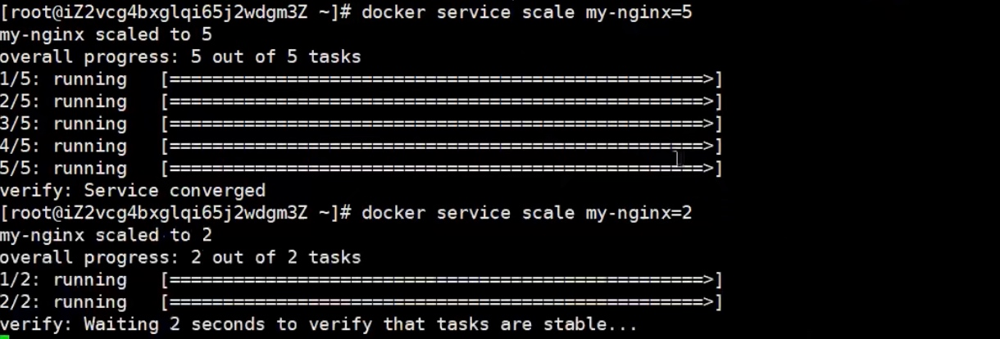

##### 移除服务

通过命令`docker service rm xxx` 来移除服务

### 总结

docker swarm 其实并不难，只要会搭建集群，会启动服务，会动态管理容器就可以了

#### 概念拓展总结

1. swarm 集群的管理和编排。

docker 可以初始化一个swarm集群，其他的节点可以加入，有两个角色：管理员和工作者

2. node：就是docker节点，多个节点就组成了网络集群，这个集群需要一个管理者，这个管理者就是swarm
3. service 服务，就是任务，可以在管理节点，或者工作节点来运行，核心，用户访问的就是它，我们部署的也是它
4. task 容器内的命令，细节任务

### 服务副本和全局服务

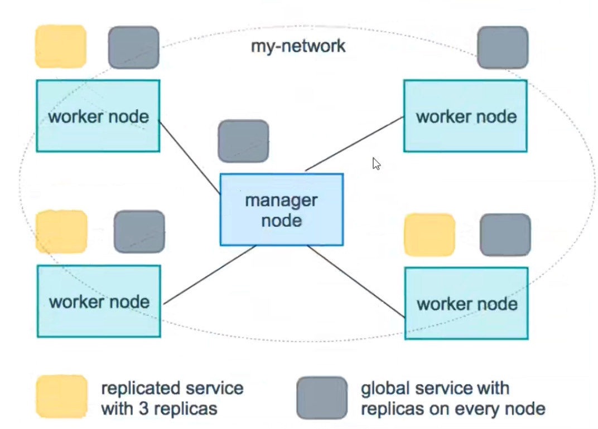


调用service以什么方式运行

```bash
--mode string
service mode (replicated or global)(default "replicated")

docker service create --mode replicated --name mytom tomcat:7 ## 默认的

docker service create --mode global --name haha alpine ping baidu.com
## 场景？日志收集
每个节点有自己的日志收集器，过滤。把所有的日志最终在传给日志中心，服务监控，状态性能
```

扩展：网络模式

- swarm：
- overlay：就是在这群体网络中，对这个群体网络中的其他机器可见
- ingress：特殊的overlay网络，具有负载均衡的功能，会自动做负载均衡

虽然在docker在4台机器上，实际使用的是同一个网络--ingress网络

## docker stack

docker-compose 是单机部署项目

在集群上部署项目就是使用docker stack

```bash
## 单机下使用
docker-compose up -d wordpress.yaml

## 集群下使用
docker stack deply wordpress.yaml
```

使用细节

```bash
docker stack --help
```

## docker secret

安全，配置密码使用的，证书的

使用细节

```bash
docker secret --help
```

## docker cofigs

配置

```bash
docker configs --help
```

## k8s
