> 参考网址：https://www.bilibili.com/video/BV1Sk4y197eD

## 前言

1. 什么是分布式框架

分布式系统是若干独立系统的集合，但是用户使用起来像是在使用一套系统

2. 为什么需要分布式系统

规模的逐步扩大和业务的复杂，单台计算机扛不住双十一那样的流量，俗话说：三个臭皮匠顶一个诸葛亮

3. 应用架构的发展演变

- 单一架构：当网站流量很小的时候，我们将所有的应用业务放到一台服务器上，打包运行公司管理系统/超市收银系统
  - 优点：开发简单、部署简单
  - 缺点：扩展不容易（怎么处理日益增长的流量），谁都改一个，维护不容易，性能提升难
- 垂直应用架构：将大应用拆分成为小应用（一般按照业务拆分），根据不同的访问频率决定各自业务部署的服务器数量
  - 优点：扩展容易
  - 缺点：页面一改，可能造成整个项目重新部署，业务的界面没有分离开，随着各种业务种类增加，怎么解决业务之间的互相调用问题，订单服务器和用户服务器交互效率的问题
- 分布式架构（基于PRC：远程过程调用）：将业务拆分后，用某种方式实现各个业务模块的远程调用和复用，这时一个好的PRC框架就决定了你的分布式架构的性能，怎么调用，何时调用，服务器挂了怎么办....我们需要一个框架来帮我们解决这个问题。这个时候，就有了dubbo，dubbo是一个高性能的PRC框架，解决了分布式中的调用问题
  - 优点：解决了分布式系统中互相调用的问题
  - 缺点：假设有100台服务器，50台用户业务服务器，50台订单业务服务器，但是在上线后发现，用户服务器使用率很小，但是订单服务器压力很大，最佳配比应该是1:4，这时候就要求我们还有一个统一管理的调度中心

## 初识dubbo

### 为什么dubbo说自己性能高

高性能要从底层的原理说起，既然是一个PRC框架，主要干的就是远程过程（方法）调用，那么提升性能就要从最关键、最耗时的两个方面入手：序列化话网络通信

序列化：我们学习java网络开发的时候知道，本地的对象要在网路上传输，必须实现Serializable接口，也就是必须序列化。我们序列化的方案很多：xml、json、二进制流...其中效率最高的就是二进制流（因为计算机就是二进制的），所以dubbo采用的就是效率最高的二进制

网络通信：不同于http需要进行7步走（三次握手和四次挥手），dubbo采用socket通信机制，一步到位，提升了通信效率，并且可以简历长连接，不用反复连接，直接传输数据

### 别的PRC框架

gPRC、Thrift、HSF...

### dubbo的前世今生

> dubbo 之前一直都作为 Alibaba 公司内部使用的框架。
>
> 2011 年,dubbo 被托管到了GitHub 上(开源)
>
> 2014 年11 月发布2.4.11版本后宣布停止更新。此后一段时间很多公司开源了自己基于Dubbo的变种版本(例如当当网的 Dubbo X,网易考拉的 Dubbo K)
>
> 2017 年 SpringCloud 横空出世,Dubbo 感觉到压力后连续更新了几个版本2018 年 1 月,阿里公司联合当当网将 Dubbo 和 Dubbo X 合并,发布了 2.6 版本2018 年除夕夜阿里将 Dubbo 贡献给了 Apache 基金会
>
> 2018 除夕夜至今,Apache 维护和更新 Dubbo

## dubbo框架

### dubbo概述

Apache Dubbo (incubating) |ˈdʌbəʊ| 是一款高性能、轻量级的开源 Java RPC 框架，它提供了三大核心能力：面向接口的远程方法调用，智能容错和负载均衡，以及服务自动注册和发现

Dubbo 是一个分布式服务框架，致力于提供高性能和透明化的 RPC 远程服务调用方案、服务治理方案

官网： https://dubbo.apache.org/zh/

> Apache Dubbo 是一款微服务开发框架，它提供了 RPC通信 与 微服务治理 两大关键能力。这意味着，使用 Dubbo 开发的微服务，将具备相互之间的远程发现与通信能力， 同时利用 Dubbo 提供的丰富服务治理能力，可以实现诸如服务发现、负载均衡、流量调度等服务治理诉求。同时 Dubbo 是高度可扩展的，用户几乎可以在任意功能点去定制自己的实现，以改变框架的默认行为来满足自己的业务需求

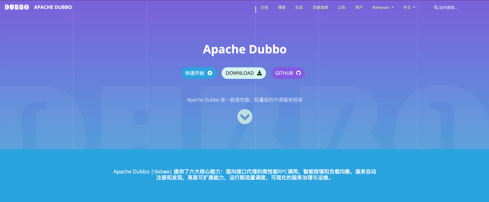

特性：Apache Dubbo提供了六大核心能力：面向接口代理的高性能RPC调用，智能容错和负载均衡，服务自动注册和发现，高度可扩展能力，运行期流量调度，可视化的服务治理与运维

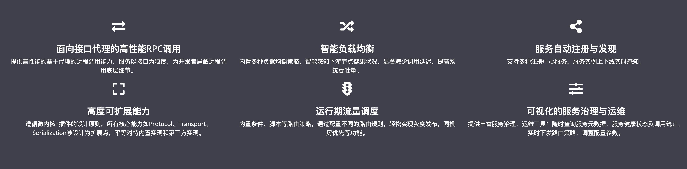

面向接口代理：调用接口的方法，在 A 服务器调用 B 服务器的方法，由 dubbo 实现对 B 的调用，无需关心实现的细节，就像MyBatis 访问 Dao 的接口，可以操作数据库一样。不用关心 Dao 接口方法的实现。这样开发是方便，舒服的

### 基本架构

Dubbo 基于消费端的自动服务发现能力，其基本工作原理如下图：

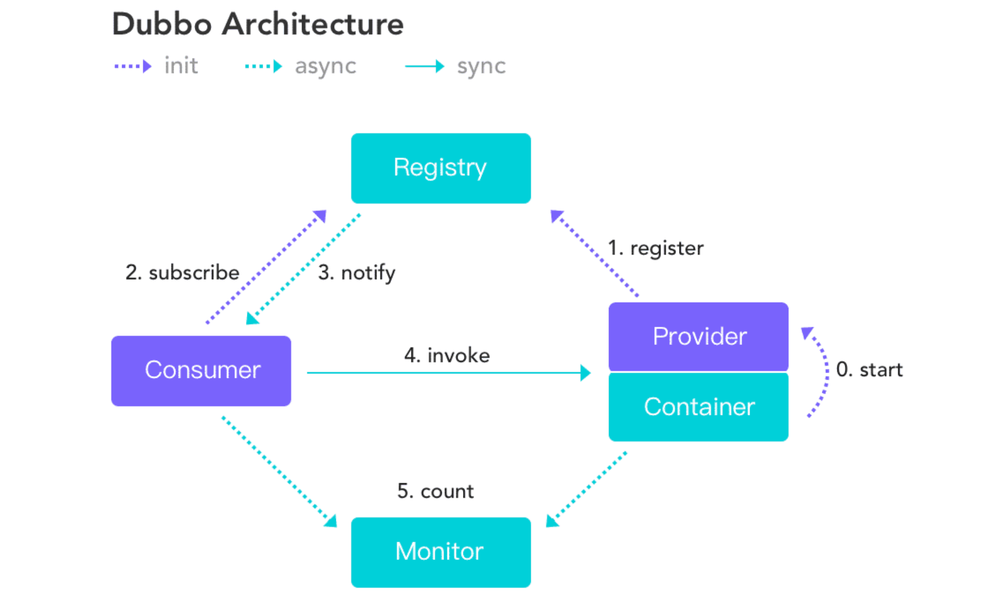

服务发现的一个核心组件是注册中心，Provider 注册地址到注册中心，Consumer 从注册中心读取和订阅 Provider 地址列表

- 服务提供者（Provider）：暴露服务的服务提供方，服务提供者在启动时，向注册中心注册自己提供的服务

- 服务消费者（Consumer）: 调用远程服务的服务消费方，服务消费者在启动时，向注册中心订阅自己所需的服务，服务消费者，从提供者地址列表中，基于软负载均衡算法，选一台提供者进行调用，如果调用失败，再选另一台调用

- 注册中心（Registry）：注册中心返回服务提供者地址列表给消费者，如果有变更，注册中心将基于长连接推送变更数据给消费者

- 监控中心（Monitor）：服务消费者和提供者，在内存中累计调用次数和调用时间，定时每分钟发送一次统计数据到监控中心

调用关系说明：

- 服务容器负责启动，加载，运行服务提供者

- 服务提供者在启动时，向注册中心注册自己提供的服务

- 服务消费者在启动时，向注册中心订阅自己所需的服务

- 注册中心返回服务提供者地址列表给消费者，如果有变更，注册中心将基于长连接推送变更数据给消费者

- 服务消费者，从提供者地址列表中，基于软负载均衡算法，选一台提供者进行调用，如果调用失败，再选另一台调用

- 服务消费者和提供者，在内存中累计调用次数和调用时间，定时每分钟发送一次统计数据到监控中心

### dubbo支持的协议

支持多种协议：dubbo , hessian , rmi , http, webservice , thrift , memcached , redis。dubbo 官方推荐使用dubbo 协议。dubbo 协议默认端口 20880

使用 dubbo 协议，spring 配置文件加入：

```
<dubbo:protocol name="dubbo" port="20880" />
```

```markdown
# dubbo 是PRC框架的一种实现
```

### 直连方式-案例1

通过调用远程方法获取学生总人数

点对点的直连项目:消费者直接访问服务提供者，没有注册中心。消费者必须指定服务提供者的访问地址（url）

消费者直接通过 url 地址访问固定的服务提供者。这个 url 地址是不变的

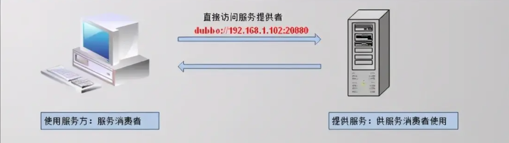

#### 创建空项目

在idea中创建一个空项目

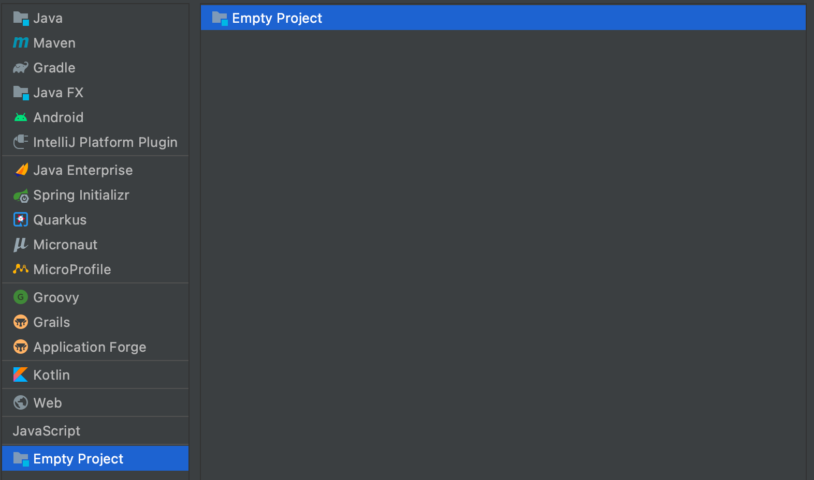

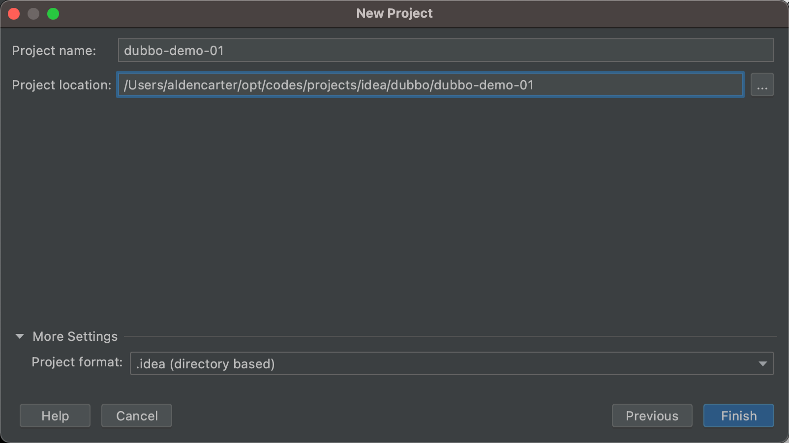

#### 创建服务提供者

添加module，创建maven工程，我们创建一个webapp模板的maven工程

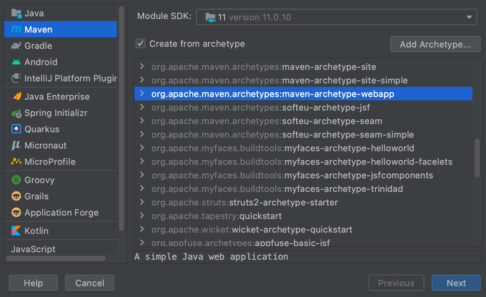

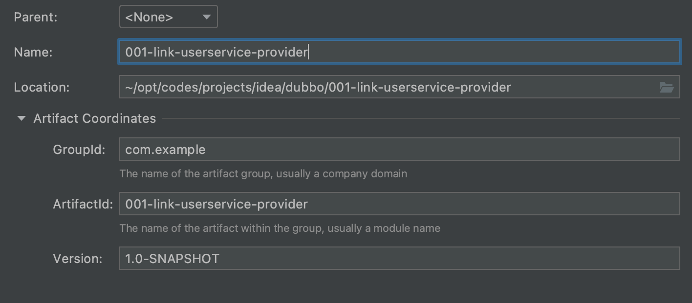

##### 修改web项目

将pom.xml文件中多余的依赖去除，删除之后为

```xml
<?xml version="1.0" encoding="UTF-8"?>

<project xmlns="http://maven.apache.org/POM/4.0.0" xmlns:xsi="http://www.w3.org/2001/XMLSchema-instance"
  xsi:schemaLocation="http://maven.apache.org/POM/4.0.0 http://maven.apache.org/xsd/maven-4.0.0.xsd">
  <modelVersion>4.0.0</modelVersion>

  <groupId>com.example</groupId>
  <artifactId>001-link-userservice-provider</artifactId>
  <version>1.0-SNAPSHOT</version>
  <packaging>war</packaging>

  <properties>
    <project.build.sourceEncoding>UTF-8</project.build.sourceEncoding>
    <maven.compiler.source>1.7</maven.compiler.source>
    <maven.compiler.target>1.7</maven.compiler.target>
  </properties>

  
</project>
```

然后在main中添加java和test等目录，idea会自己自动提示应该加什么

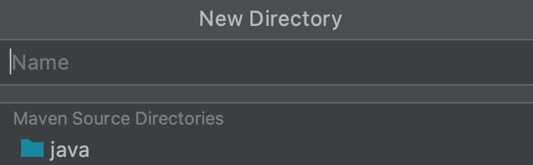

之后会变成

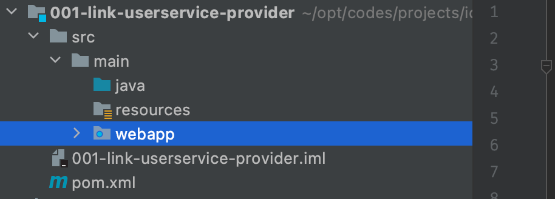

如果没有出现目标的配置，可以通过右键设置

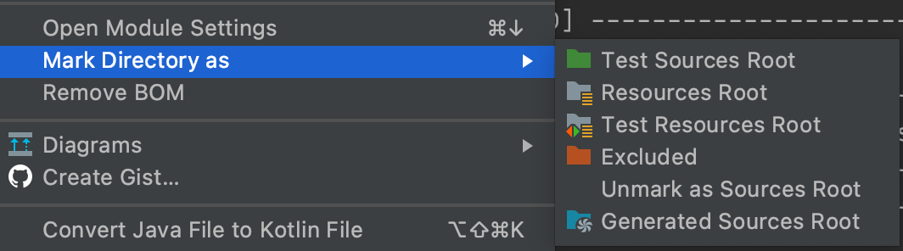

##### 添加依赖

1. 添加spring依赖

```xml
<!--spring 依赖-->
<dependency>
  <groupId>org.springframework</groupId>
  <artifactId>spring-context</artifactId>
  <version>5.2.7.RELEASE</version>
</dependency>
<dependency>
  <groupId>org.springframework</groupId>
  <artifactId>spring-webmvc</artifactId>
  <version>5.2.7.RELEASE</version>
</dependency>
```

2. 添加dubbo依赖

通过`https://mvnrepository.com/`查找


选用2.6.2版本就好

```xml
<dependency>
    <groupId>com.alibaba</groupId>
    <artifactId>dubbo</artifactId>
    <version>2.6.2</version>
</dependency>
```

3. 设置编译的级别

```xml
<build>
    <plugins>
        <!--jdk 1.8编译插件-->
        <plugin>
            <groupId>org.apache.maven.plugins</groupId>
            <artifactId>maven-compiler-plugin</artifactId>
            <version>3.1</version>
            <configuration>
                <source>1.8</source>
                <target>1.8</target>
            </configuration>
        </plugin>
    </plugins>
</build>
```

##### 创建实体和服务

实体类：

```java
package com.example.dubbo.model;

public class User {
    private Integer id;
    private String username;

    private Integer age;

    public Integer getId() {
        return id;
    }

    public void setId(Integer id) {
        this.id = id;
    }

    public String getUsername() {
        return username;
    }

    public void setUsername(String username) {
        this.username = username;
    }

    public Integer getAge() {
        return age;
    }

    public void setAge(Integer age) {
        this.age = age;
    }
}
```

业务接口：

```java
package com.example.dubbo.service;

import com.example.dubbo.model.User;

public interface UserService {
    /**
     * 根据用户标识获取用户信息
     *
     * @param id
     * @return
     */
    User queryUserById(Integer id);
}
```

接口实现：

```java
package com.example.dubbo.service.impl;

import com.example.dubbo.model.User;
import com.example.dubbo.service.UserService;

public class UserServiceImpl implements UserService {
    @Override
    public User queryUserById(Integer id) {
        // 这里模拟数据，按照道理应该是从持久层获取的
        final User user = new User();
        user.setId(1001);
        user.setUsername("张三");
        user.setAge(23);
        return user;
    }
}
```

##### 暴露接口

我们需要创建配置文件配置dubbo，在resources中创建spring config xml文件，名字为：``

引入的命名空间为：

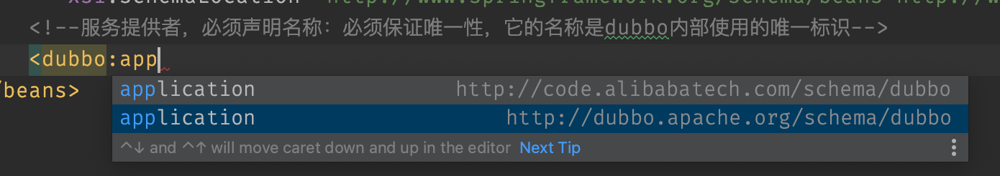

```xml
<?xml version="1.0" encoding="UTF-8"?>
<beans xmlns="http://www.springframework.org/schema/beans"
       xmlns:xsi="http://www.w3.org/2001/XMLSchema-instance" xmlns:dubbo="http://dubbo.apache.org/schema/dubbo"
       xsi:schemaLocation="http://www.springframework.org/schema/beans http://www.springframework.org/schema/beans/spring-beans.xsd http://dubbo.apache.org/schema/dubbo http://dubbo.apache.org/schema/dubbo/dubbo.xsd">
    <!--服务提供者，必须声明名称：必须保证唯一性，它的名称是dubbo内部使用的唯一标识-->
    <dubbo:application name="001-link-userservice-provider"/>

    <!--访问服务协议的名称及端口号，dubbo官方推荐使用的dubbo协议，端口号默认为20880-->
    <!--
        name:指定协议的名臣
        port:指定协议的端口号（默认为20880）
    -->
    <dubbo:protocol name="dubbo" port="20880" />

    <!--
        暴露服务接口
        interface 暴露服务接口的全限定类型
        ref="userService" 引用的实现类在spring容器中的标识
        registry="N/A" 表示直连没有用到注册中心，则值为："N/A"
    -->
    <dubbo:service interface="com.example.dubbo.service.UserService" ref="userService" registry="N/A"/>

    <!--将接口的实现类架子啊到spring容器中-->
    <bean class="com.example.dubbo.service.impl.UserServiceImpl" id="userService"/>

</beans>
```

##### 配置监听器

在web.xml中配置监听器

```xml
<!DOCTYPE web-app PUBLIC
 "-//Sun Microsystems, Inc.//DTD Web Application 2.3//EN"
 "http://java.sun.com/dtd/web-app_2_3.dtd" >

<web-app>
  <context-param>
    <param-name>contextConfigLocation</param-name>
    <param-value>classpath:dubbo-userservice-provider.xml</param-value>
  </context-param>
  <listener>
    <listener-class>org.springframework.web.context.ContextLoaderListener</listener-class>
  </listener>
</web-app>
```

##### 配置Tomcat

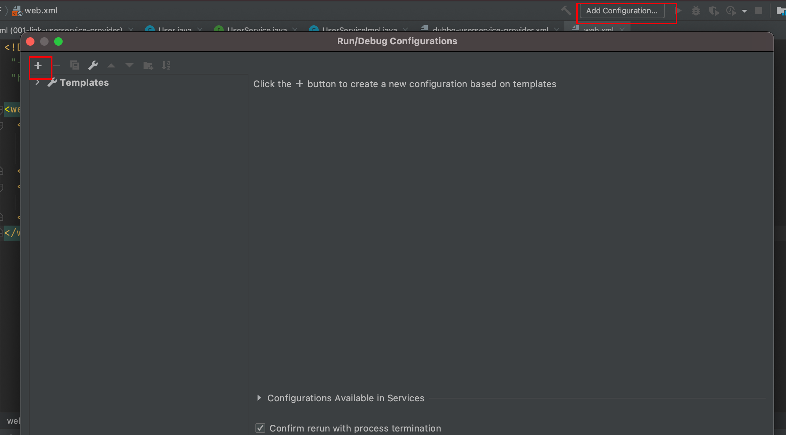

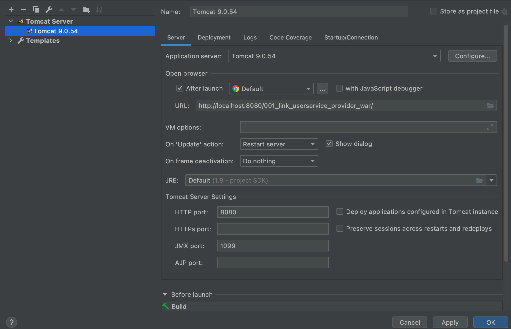

#### 创建服务消费者

1. 也是创建webapp模板的模块，然后去除pom.xml文件中多余的文字

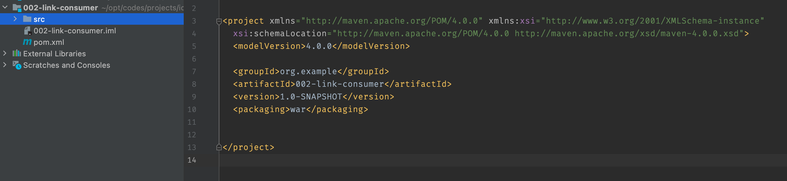

2. 创建java 和 resources文件夹

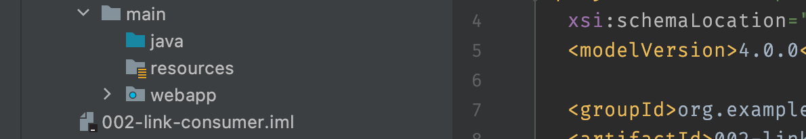

3. 配置pom文件：添加需要的依赖（dubbo、spring）

```xml
<!--spring依赖-->
<dependency>
    <groupId>org.springframework</groupId>
    <artifactId>spring-context</artifactId>
    <version>5.2.7.RELEASE</version>
</dependency>
<dependency>
    <groupId>org.springframework</groupId>
    <artifactId>spring-webmvc</artifactId>
    <version>5.2.7.RELEASE</version>
</dependency>

<!--dubbo-->
<dependency>
    <groupId>com.alibaba</groupId>
    <artifactId>dubbo</artifactId>
    <version>2.6.2</version>
</dependency>
```

除了spring和dubbo的依赖之外，我们还需要知道服务的提供者当前提供了那些服务，所以服务提供者必须将自己打包成jar包发布到本地仓库，然后给服务调用者依赖，所以我们需要将服务提供者的打包方式改为jar（默认方式就是jar）

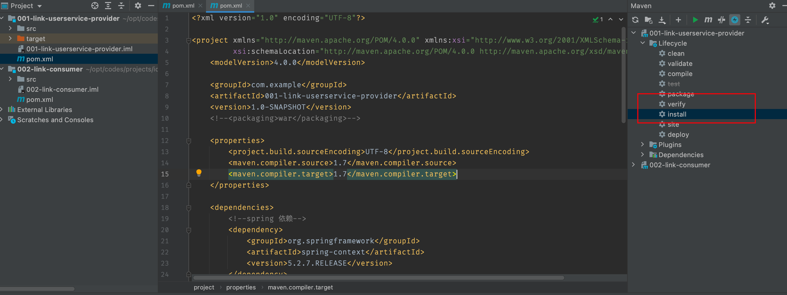

打完之后，我们在把它改回war包，然后我们的服务调用者就可以依赖服务提供者

```xml
<!--依赖服务提供者-->
<dependency>
    <groupId>com.example</groupId>
    <artifactId>001-link-userservice-provider</artifactId>
    <version>1.0-SNAPSHOT</version>
</dependency>
```

4. 设置dubbo的核心配置文件

```xml
<?xml version="1.0" encoding="UTF-8"?>
<beans xmlns="http://www.springframework.org/schema/beans"
       xmlns:xsi="http://www.w3.org/2001/XMLSchema-instance" xmlns:dubbo="http://dubbo.apache.org/schema/dubbo"
       xsi:schemaLocation="http://www.springframework.org/schema/beans http://www.springframework.org/schema/beans/spring-beans.xsd http://dubbo.apache.org/schema/dubbo http://dubbo.apache.org/schema/dubbo/dubbo.xsd">
    <!--声明服务消费者名称：保证唯一性-->
    <dubbo:application name="002-link-consumer"/>

    <!--
        引用远程服务接口：
        id="userService" 远程服务接口对象名称
        interface 调用远程接口的全限定类名
        url 访问服务接口的地址
        registry 不使用注册中心，值为：N/A
    -->
    <dubbo:reference id="userService" interface="com.example.dubbo.service.UserService" url="dubbo://localhost:20880" registry="N/A"/>

</beans>
```

编写spring的配置文件

```xml
<?xml version="1.0" encoding="UTF-8"?>
<beans xmlns="http://www.springframework.org/schema/beans"
       xmlns:xsi="http://www.w3.org/2001/XMLSchema-instance"
       xmlns:context="http://www.springframework.org/schema/context"
       xmlns:mvc="http://www.springframework.org/schema/cache"
       xsi:schemaLocation="http://www.springframework.org/schema/beans http://www.springframework.org/schema/beans/spring-beans.xsd http://www.springframework.org/schema/context https://www.springframework.org/schema/context/spring-context.xsd http://www.springframework.org/schema/cache http://www.springframework.org/schema/cache/spring-cache.xsd">

    <!--扫描组件-->
    <context:component-scan base-package="com.example.dubbo.web"/>

    <!--配置注解驱动-->
    <mvc:annotation-driven/>

    <!--配置视图解析器-->
    <bean class="org.springframework.web.servlet.view.InternalResourceViewResolver">
        <property name="prefix" value="/"/>
        <property name="suffix" value=".jsp"/>
    </bean>
</beans>
```

5. 编写Controller并配置页面请求

```java
@Controller
public class UserController {
    @Autowired
    private UserService userService;

    @RequestMapping(value = "/user")
    public String userDetail(Model model, Integer id) {
        final User user = userService.queryUserById(id);
        model.addAttribute("user", user);
        return "userDetail";
    }
}
```

6. 编写web配置

```xml
<!DOCTYPE web-app PUBLIC
        "-//Sun Microsystems, Inc.//DTD Web Application 2.3//EN"
        "http://java.sun.com/dtd/web-app_2_3.dtd" >

<web-app xmlns="http://java.sun.com/xml/ns/j2ee"
         xmlns:xsi="http://www.w3.org/2001/XMLSchema-instance"
         xsi:schemaLocation="http://java.sun.com/xml/ns/j2ee/web-app_2_4.xsd"
         version="2.4">
    <servlet>
        <servlet-name>dispatcherServlet</servlet-name>
        <servlet-class>org.springframework.web.servlet.DispatcherServlet</servlet-class>
        <init-param>
            <param-name>contextConfigLocation</param-name>
            <param-value>classpath:application.xml,classpath:dubbo-consumer.xml</param-value>
        </init-param>
    </servlet>
    <servlet-mapping>
        <servlet-name>dispatcherServlet</servlet-name>
        <url-pattern>/</url-pattern>
    </servlet-mapping>
</web-app>
```

7. 给跳转一个页面

```html
<html>
<head>
    <title>用户详情</title>
</head>
<body>
<h2>用户详情</h2>
<div>用户标识：${user.id}</div>
<div>用户名称：${user.username}</div>
<div>用户年纪：${user.age}</div>
</body>
</html>
```

8. 结果

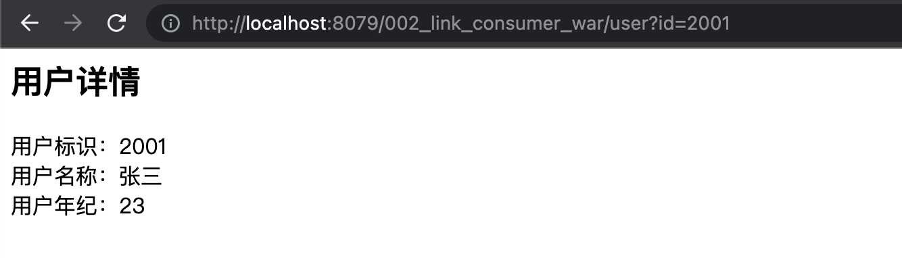

```markdown
# dubbo官方推荐必须有一个接口工程，他就是一个maven java工程
要求接口工程里存放到内容如下：
1. 对外暴露的服务接口（service接口）
2. 实体bean对象
这样我们就不能直接new出接口的实现类了，只能使用dubbo的RPC来调用
```

### dubbo服务化最佳实践

#### 分包

建议将服务接口、服务模型等均放在公共包中

#### 粒度

- 服务接口尽可能大粒度，每个服务方法应代表一个功能，而不会是某功能的一个步骤
- 服务接口建议以业务场景为单位划分，并对相近业务做抽象，防止接口数量爆炸
- 不建议使用过于抽象的通用接口，如：Map query(Map)，这样的接口没有明确语义，会给后期维护带来不变

#### 版本

每个接口都应定义版本号，区分同一接口的不同实现，如：`<dubbo:service intereface='com.xxx.XxxService' version='1.0'/>`

### 直连方式-改造案例1

#### 创建工程

按照dubbo官方推荐的方式来改造前面的项目，将接口和实体Bean单独放到模块中

1. 创建接口，选择空白maven模块

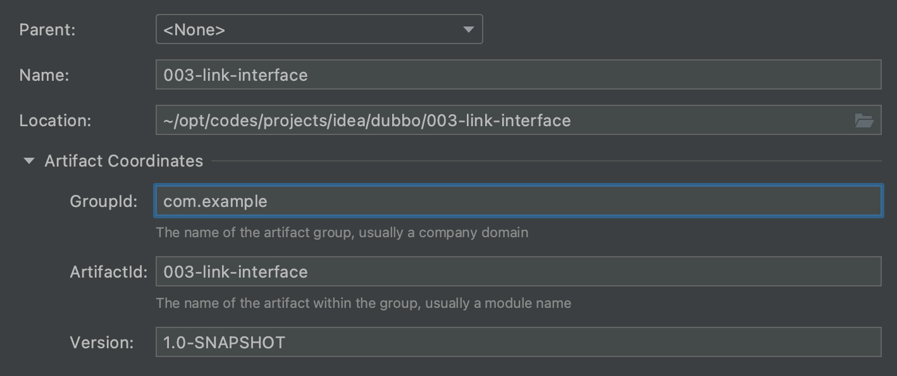

2. 创建provider，选择webapp模块，并添加java和resources文件夹，删除pom.xml文件中多余的内容（和前面的一样）

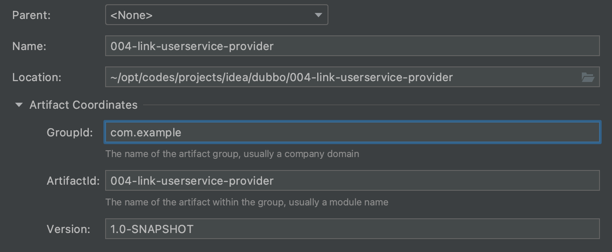

3. 创建consumer，和创建消费者一样：

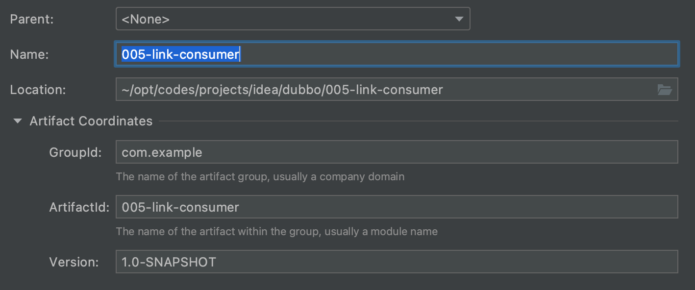

这样创建了三个工程之后，就和dubbo要求的一致了

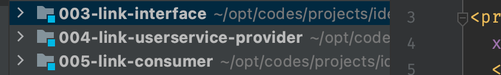

#### 修改工程

##### 修改interface工程

1. 添加User实体

```java
package com.example.dubbo.model;

import java.io.Serializable;

public class User implements Serializable {
    private Integer id;
    private String username;
    private Integer age;

    public Integer getId() {
        return id;
    }

    public void setId(Integer id) {
        this.id = id;
    }

    public String getUsername() {
        return username;
    }

    public void setUsername(String username) {
        this.username = username;
    }

    public Integer getAge() {
        return age;
    }

    public void setAge(Integer age) {
        this.age = age;
    }
}
```

2. 添加UserService接口

```java
package com.example.dubbo.service;

import com.example.dubbo.model.User;

public interface UserService {

    /**
     * 根据用户标识获取用户信息
     *
     * @param id
     * @return
     */
    User queryUserById(Integer id);

    /**
     * 查询用户总人数
     *
     * @return
     */
    Integer queryAllUserCount();


}
```

##### 修改provider

1. 添加依赖和设置编译级别

```xml
<dependencies>
  <!--spring 依赖-->
  <dependency>
    <groupId>org.springframework</groupId>
    <artifactId>spring-context</artifactId>
    <version>5.2.7.RELEASE</version>
  </dependency>
  <dependency>
    <groupId>org.springframework</groupId>
    <artifactId>spring-webmvc</artifactId>
    <version>5.2.7.RELEASE</version>
  </dependency>

  <!--dubbo 依赖-->
  <dependency>
    <groupId>com.alibaba</groupId>
    <artifactId>dubbo</artifactId>
    <version>2.6.2</version>
  </dependency>

  <!--引入接口工程-->
  <dependency>
    <groupId>com.example</groupId>
    <artifactId>003-link-interface</artifactId>
    <version>1.0-SNAPSHOT</version>
  </dependency>
</dependencies>

<build>
  <plugins>
    <!--jdk 1.8编译插件-->
    <plugin>
      <groupId>org.apache.maven.plugins</groupId>
      <artifactId>maven-compiler-plugin</artifactId>
      <version>3.1</version>
      <configuration>
        <source>1.8</source>
        <target>1.8</target>
      </configuration>
    </plugin>
  </plugins>
</build>
```

2. 实现接口

```java
public class UserServiceImpl implements UserService {
    @Override
    public User queryUserById(Integer id) {
        final User user = new User();
        user.setId(id);
        user.setUsername("张三");
        user.setAge(23);
        return user;
    }

    @Override
    public Integer queryAllUserCount() {
        return 5;
    }
}
```

3. 编写配置文件

dubbo-userservice-provider.xml配置文件

```xml
<?xml version="1.0" encoding="UTF-8"?>
<beans xmlns="http://www.springframework.org/schema/beans"
       xmlns:xsi="http://www.w3.org/2001/XMLSchema-instance" xmlns:dubbo="http://dubbo.apache.org/schema/dubbo"
       xsi:schemaLocation="http://www.springframework.org/schema/beans http://www.springframework.org/schema/beans/spring-beans.xsd http://dubbo.apache.org/schema/dubbo http://dubbo.apache.org/schema/dubbo/dubbo.xsd">
    <!--声明dubbo服务提供者的名称：保证唯一性-->
    <dubbo:application name="004-link-userservice-provider"/>

    <!--设置dubbo使用的协议和端口号-->
    <dubbo:protocol name="dubbo" port="20880"/>

    <!--暴露服务接口-->
    <dubbo:service interface="com.example.dubbo.service.UserService" ref="userService" registry="N/A"/>

    <!--加载业务接口的是吸纳类到spring容器中-->
    <bean id="userService" class="com.example.dubbo.service.impl.UserServiceImpl"/>
</beans>
```

在web.xml中配置：编写监听器

```xml
<!DOCTYPE web-app PUBLIC
        "-//Sun Microsystems, Inc.//DTD Web Application 2.3//EN"
        "http://java.sun.com/dtd/web-app_2_3.dtd" >

<web-app xmlns="http://java.sun.com/xml/ns/j2ee"
         xmlns:xsi="http://www.w3.org/2001/XMLSchema-instance"
         xsi:schemaLocation="http://java.sun.com/xml/ns/j2ee/web-app_2_4.xsd"
         version="2.4">
    <context-param>
        <param-name>contextConfigLocation</param-name>
        <param-value>classpath:dubbo-userservice-provider.xml</param-value>
    </context-param>
    <listener>
        <listener-class>org.springframework.web.context.ContextLoaderListener</listener-class>
    </listener>
</web-app>
```

4. 配置提供者的Tomcat

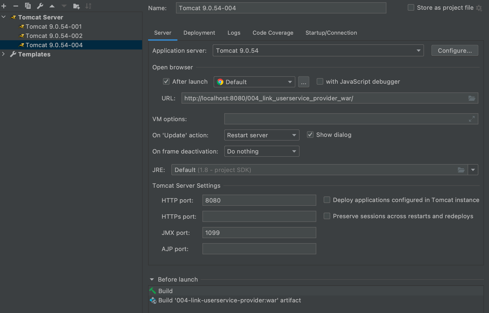

##### 修改consumer

1. 添加依赖

之前我们还需要让服务提供者打包jar，然后才能在服务调用者中引入依赖调用，但是现在可以不用了，我们直接引用接口模块，就可以知道服务提供者提供了什么服务了

```xml
<dependencies>
    <!--spring 依赖-->
    <dependency>
        <groupId>org.springframework</groupId>
        <artifactId>spring-context</artifactId>
        <version>5.2.7.RELEASE</version>
    </dependency>
    <dependency>
        <groupId>org.springframework</groupId>
        <artifactId>spring-webmvc</artifactId>
        <version>5.2.7.RELEASE</version>
    </dependency>

    <!--dubbo 依赖-->
    <dependency>
        <groupId>com.alibaba</groupId>
        <artifactId>dubbo</artifactId>
        <version>2.6.2</version>
    </dependency>

    <!--引入接口工程-->
    <dependency>
        <groupId>com.example</groupId>
        <artifactId>003-link-interface</artifactId>
        <version>1.0-SNAPSHOT</version>
    </dependency>
</dependencies>

<build>
    <plugins>
        <!--jdk 1.8编译插件-->
        <plugin>
            <groupId>org.apache.maven.plugins</groupId>
            <artifactId>maven-compiler-plugin</artifactId>
            <version>3.1</version>
            <configuration>
                <source>1.8</source>
                <target>1.8</target>
            </configuration>
        </plugin>
    </plugins>
</build>
```

2. 编写配置文件 dubbo-consumer.xml

```xml
<?xml version="1.0" encoding="UTF-8"?>
<beans xmlns="http://www.springframework.org/schema/beans"
       xmlns:xsi="http://www.w3.org/2001/XMLSchema-instance" xmlns:dubbo="http://dubbo.apache.org/schema/dubbo"
       xsi:schemaLocation="http://www.springframework.org/schema/beans http://www.springframework.org/schema/beans/spring-beans.xsd http://dubbo.apache.org/schema/dubbo http://dubbo.apache.org/schema/dubbo/dubbo.xsd">
    <!--声明服务消费者的名称：保证唯一性-->
    <dubbo:application name="005-link-consumer"/>
    <!--引用-->
    <dubbo:reference id="userService" interface="com.example.dubbo.service.UserService" url="dubbo://localhost:20880" registry="N/A"/>
</beans>
```

3. 编写spring配置文件application.xml

```xml
<?xml version="1.0" encoding="UTF-8"?>
<beans xmlns="http://www.springframework.org/schema/beans"
       xmlns:xsi="http://www.w3.org/2001/XMLSchema-instance"
       xmlns:context="http://www.springframework.org/schema/context"
       xmlns:mvc="http://www.springframework.org/schema/mvc"
       xsi:schemaLocation="http://www.springframework.org/schema/beans http://www.springframework.org/schema/beans/spring-beans.xsd http://www.springframework.org/schema/context https://www.springframework.org/schema/context/spring-context.xsd http://www.springframework.org/schema/mvc https://www.springframework.org/schema/mvc/spring-mvc.xsd">
    <!--扫描组件-->
    <context:component-scan base-package="com.example.dubbo.web"/>

    <!--配置注解驱动-->
    <mvc:annotation-driven/>

    <!--视图解析器-->
    <bean class="org.springframework.web.servlet.view.InternalResourceViewResolver">
        <property name="suffix" value="/"/>
        <property name="prefix" value=".jsp"/>
    </bean>
</beans>
```

4. 编写代码消费

java代码

```java
@Controller
public class UserController {
    @Autowired
    private UserService userService;

    /**
     * 根据ID查询
     *
     * @param model
     * @param id
     * @return
     */
    @RequestMapping(value = "/userDetail")
    public String userDetail(Model model, Integer id) {
        final User user = userService.queryUserById(id);
        model.addAttribute("user", user);
        return "userDetail";
    }

    /**
     * 查询所有的用户数量
     *
     * @param model
     * @param id
     * @return
     */
    @RequestMapping(value = "/userCount")
    public String userCount(Model model, Integer id) {
        final Integer count = userService.queryAllUserCount();
        model.addAttribute("count", count);
        return "userDetail";
    }
}
```

jsp显示代码

```jsp
<%@ page contentType="text/html;charset=UTF-8" language="java" %>
<html>
<head>
    <title>用户详情</title>
</head>
<body>
<h2>用户详情</h2>
<div>用户标识：${user.id}</div>
<div>用户名称：${user.username}</div>
<div>用户年纪：${user.age}</div>
<div>用户总人数：${count}</div>
</body>
</html>
```

5. 配置中央调度器

```xml
<!DOCTYPE web-app PUBLIC
        "-//Sun Microsystems, Inc.//DTD Web Application 2.3//EN"
        "http://java.sun.com/dtd/web-app_2_3.dtd" >

<web-app xmlns="http://java.sun.com/xml/ns/j2ee"
         xmlns:xsi="http://www.w3.org/2001/XMLSchema-instance"
         xsi:schemaLocation="http://java.sun.com/xml/ns/j2ee/web-app_2_4.xsd"
         version="2.4">
    <servlet>
        <servlet-name>dispatcherServlet</servlet-name>
        <servlet-class>org.springframework.web.servlet.DispatcherServlet</servlet-class>
        <init-param>
            <param-name>contextConfigLocation</param-name>
            <param-value>classpath:application.xml,classpath:dubbo-consumer.xml</param-value>
        </init-param>
    </servlet>
    <servlet-mapping>
        <servlet-name>dispatcherServlet</servlet-name>
        <url-pattern>/</url-pattern>
    </servlet-mapping>
</web-app>
```

6. 配置application.xml

```xml
<?xml version="1.0" encoding="UTF-8"?>
<beans xmlns="http://www.springframework.org/schema/beans"
       xmlns:xsi="http://www.w3.org/2001/XMLSchema-instance"
       xmlns:context="http://www.springframework.org/schema/context"
       xmlns:mvc="http://www.springframework.org/schema/mvc"
       xsi:schemaLocation="http://www.springframework.org/schema/beans http://www.springframework.org/schema/beans/spring-beans.xsd http://www.springframework.org/schema/context https://www.springframework.org/schema/context/spring-context.xsd http://www.springframework.org/schema/mvc https://www.springframework.org/schema/mvc/spring-mvc.xsd">
    <!--扫描组件-->
    <context:component-scan base-package="com.example.dubbo.web"/>

    <!--配置注解驱动-->
    <mvc:annotation-driven/>

    <!--视图解析器-->
    <bean class="org.springframework.web.servlet.view.InternalResourceViewResolver">
        <property name="prefix" value="/"/>
        <property name="suffix" value=".jsp"/>
    </bean>
</beans>
```

7. 配置Tomcat

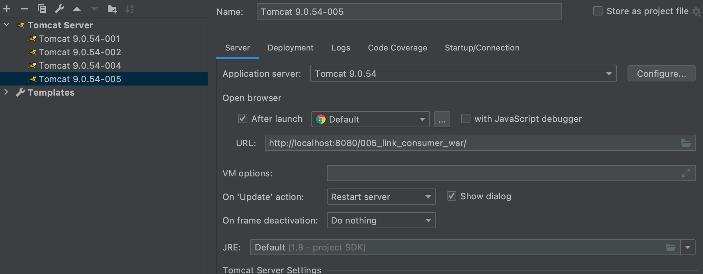

8. 启动调用结果

用户信息

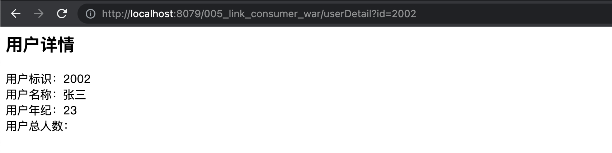

总人数

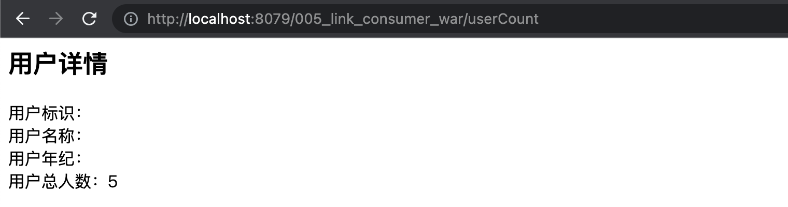

### dubbo常用标签

dubbo中常用的标签，分为三个类别：共用标签、服务提供者标签、服务消费者标签

#### 公用标签

```xml
<dubbo:application /> 和 <dubbo:registry />
```

1. 配置应用信息

```xml
<dubbbo:application name="服务的名称" />
```

2. 配置注册中心

```xml
<dubbo:registry address="ip:prot" protocol="协议" />
```

#### 服务提供者标签

1. 配置暴露的服务

```xml
<dubbo:service interface="服务接口名" ref="服务实现对象 bean" /> 
```

#### 服务消费者

1. 配置服务消费者引用远程服务

```xml
<dubbo:reference id="服务引用的bean的id" interface="服务接口名" />
```

## 注册中心-zookeeper

### 注册中心概述

对于服务提供方，它需要发布服务，而且由于应用系统的复杂性，服务的数量、类型也不断膨胀；对于服务消费方，它最关心如何获取到它所需要的服务，而面对复杂的应用系统，需要管理大量的服务调用

而且，对于服务提供方和服务消费方来说，他们还有可能兼具者两种角色，即需要提供服务，又需要消费服务，通过将服务统一管理起来，可以有效的优化内部应用对服务发布/使用的流程和管理

服务注册中心可以通过特定的协议来完成服务对外的统一，dubbo提供的注册中心有如下的几种类型可以选择：

- Multcast 注册中心：组播方式
- Redis注册中心：使用Redis作为注册中心
- Simple注册中心：就是一个dubbo服务。作为注册中心。提供查找服务的功能
- Zookeeper注册中心：使用Zookeeper作为注册中心

推荐使用Zookeeper注册中心

> 参照网址：https://dubbo.apache.org/zh/docs/v2.7/admin/install/zookeeper/、https://dubbo.apache.org/zh/docs/references/registry/zookeeper/
>
> Zookeeper是 Apache Hadoop 的子项目，强度相对较好，建议生产环境使用该注册中心
>
> 
>
> 流程说明：
>
> - 服务提供者启动时: 向 `/dubbo/com.foo.BarService/providers` 目录下写入自己的 URL 地址
> - 服务消费者启动时: 订阅 `/dubbo/com.foo.BarService/providers` 目录下的提供者 URL 地址。并向 `/dubbo/com.foo.BarService/consumers` 目录下写入自己的 URL 地址
> - 监控中心启动时: 订阅 `/dubbo/com.foo.BarService` 目录下的所有提供者和消费者 URL 地址。
>
> 支持以下功能：
>
> - 当提供者出现断电等异常停机时，注册中心能自动删除提供者信息
> - 当注册中心重启时，能自动恢复注册数据，以及订阅请求
> - 当会话过期时，能自动恢复注册数据，以及订阅请求
> - 当设置 `<dubbo:registry check="false" />` 时，记录失败注册和订阅请求，后台定时重试
> - 可通过 `<dubbo:registry username="admin" password="1234" />` 设置 zookeeper 登录信息
> - 可通过 `<dubbo:registry group="dubbo" />` 设置 zookeeper 的根节点，不配置将使用默认的根节点。
> - 支持 `*` 号通配符 `<dubbo:reference group="*" version="*" />`，可订阅服务的所有分组和所有版本的提供者

### 注册中心工作方式

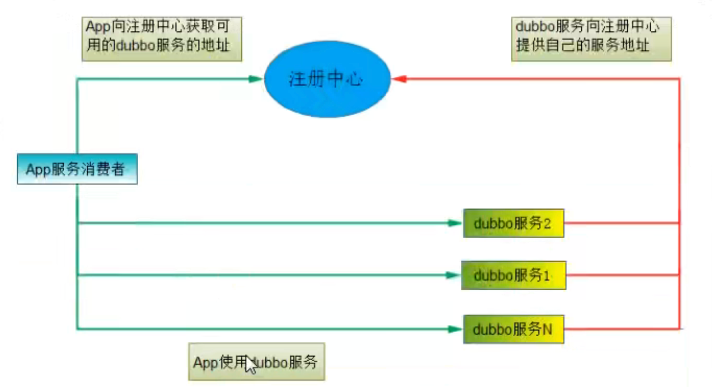

### Zookeeper注册中心

Zookeeper 是一个高性能的，分布式的，开放源码的分布式应用程序协调服务。简称 zk。Zookeeper 是翻译管理是动物管理员

可以理解为 windows 中的资源管理器或者注册表。他是一个树形结构。这种树形结构和标准文件系统相似。ZooKeeper 树中的每个节点被称为Znode。和文件系统的目录树一样，ZooKeeper 树中的每个节点可以拥有子节点。每个节点表示一个唯一服务资源。Zookeeper 运行需要 java 环境

#### 下载安装文件

官网下载地址: http://zookeeper.apache.org/

进入官网地址，首页找到下载地址，现在稳定版本是 3.7.0


Apache ZooKeeper 3.8.0 是我们当前的版本，3.7.0 是我们最新的稳定版本

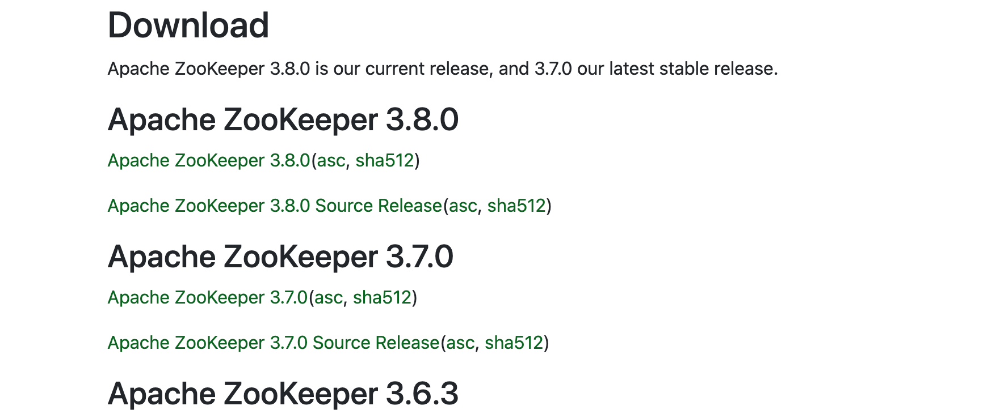

选择我们想要下载的版本，进入下载

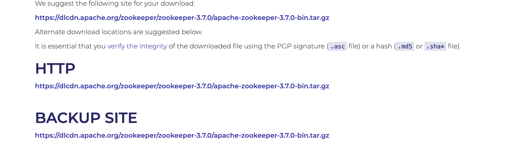


#### 安装配置Zookeeper

##### window平台

下载的文件 zookeeper-3.7.0.tar. 解压后到目录就可以了，例如 d:/servers/ zookeeper-3.7.0

修改 zookeeper-3.7.0/conf/ 目录下配置文件，（下面这个图使用教程中的替代了）

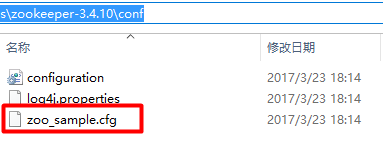

复制 zoo-sample.cfg 改名为 zoo.cfg

文件内容：


tickTime: 心跳的时间，单位毫秒. Zookeeper 服务器之间或客户端与服务器之间维持心跳的时间间隔，也就是每个 tickTime 时间就会发送一个心跳。表明存活状态。

dataDir: 数据目录，可以是任意目录。存储 zookeeper 的快照文件、pid 文件，默认为/tmp/zookeeper，建议在 zookeeper 安装目录下创建 data 目录，将 dataDir 配置改为/usr/local/zookeeper-3.7.0/dataclientPort: 客户端连接 zookeeper 的端口，即 zookeeper 对外的服务端口，默认为 2181

##### Linux平台

安装配置Zookeeper需要JDK，所以在安装Zookeeper之前需要先安装JDK

1. 上传我们下载的压缩包到linux中

```bash
scp /Users/aldencarter/Downloads/apache-zookeeper-3.7.0-bin.tar.gz root@172.16.187.20:/opt/soft_dev
```

2. 创建安装目录并解压压缩包

```bash
mkdir /usr/local/zookeeper/
tar -zxvf apache-zookeeper-3.7.0-bin.tar.gz -C /usr/local/zookeeper/
```

3. 配置文件

在 zookeeper 的 conf 目录下，将 zoo_sample.cfg 改名为 zoo.cfg，进入 zookeeper 目录下的 conf，拷贝样例文件 zoo-sample.cfg 为 zoo.cfg

```bash
cp zoo_sample.cfg zoo.cfg
```

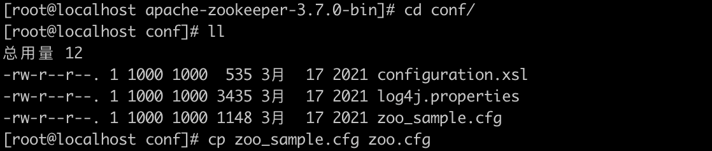

文件内容：

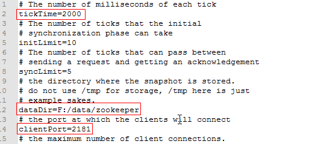

- tickTime: 心跳的时间，单位毫秒. Zookeeper 服务器之间或客户端与服务器之间维持心跳的时间间隔，也就是每个 tickTime 时间就会发送一个心跳。表明存活状态

- dataDir: 数据目录，可以是任意目录。存储 zookeeper 的快照文件、pid 文件，默认为/tmp/zookeeper，建议在 zookeeper 安装目录下创建 data 目录，将 dataDir 配置改为`/usr/local/zookeeper-3.7.0/data`
- clientPort: 客户端连接 zookeeper 的端口，即 zookeeper 对外的服务端口，默认为 2181

4. 启动 Zookeeper

启动（切换到安装目录的 bin 目录下）：

```bash
./zkServer.sh start
```


5. 关闭 Zookeeper

关闭（切换到安装目录的 bin 目录下）：

```bash
./zkServer.sh stop
```

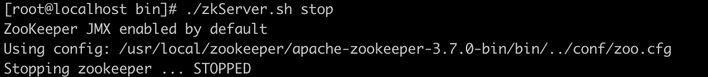

#### Zookeeper 的客户端图形工具

Zookeeper 图形界面的客户端：ZooInspector. 使用方式：Windows 上解压 ZooInspector 文件

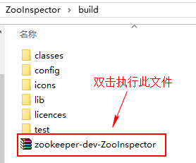

主界面：

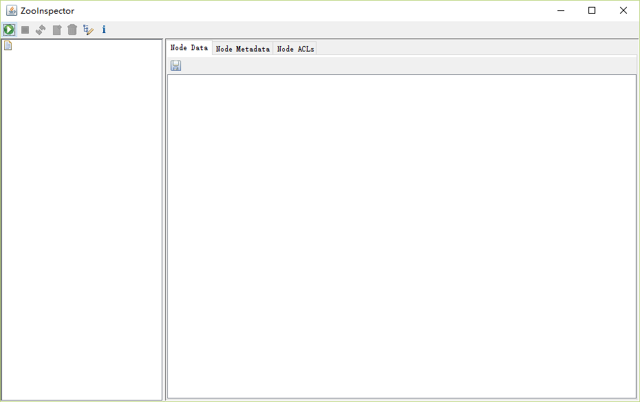

配置连接：

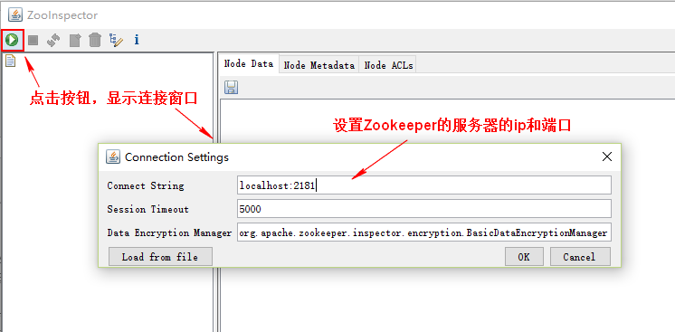

连接成功：

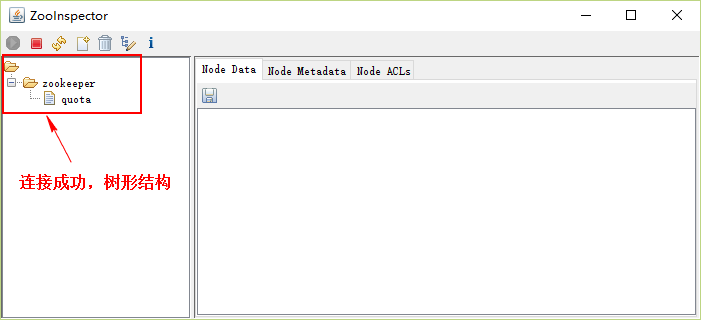

### dubbo案例使用Zookeeper

按照上面的方式创建三个模块，如下，然后就是和上面差不多的编写代码了

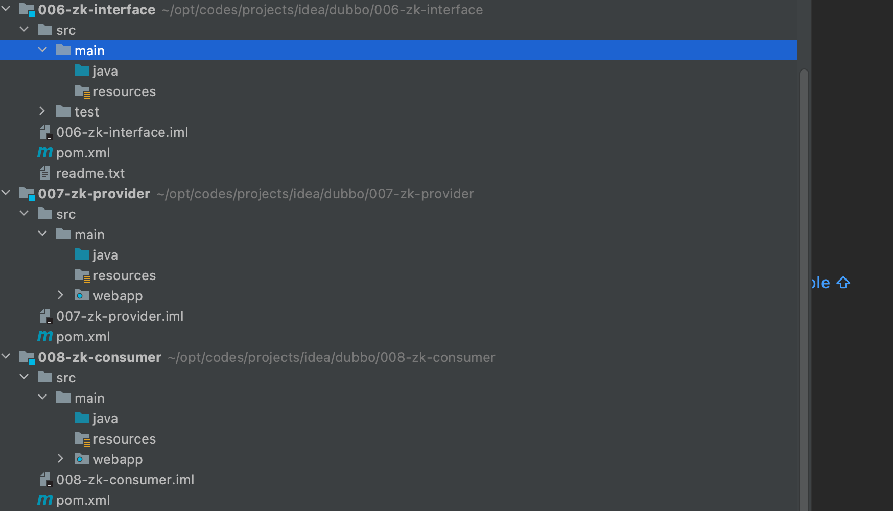

#### 接口项目

和前面的一样的，先创建接口项目，存放实体bean(必须要进行序列化操作)和业务接口

006-zk-interface

1. 编写实体类

```java
package org.example.dubbo.model;

import java.io.Serializable;

public class User implements Serializable {
    private Integer id;
    private String username;

    public Integer getId() {
        return id;
    }

    public void setId(Integer id) {
        this.id = id;
    }

    public String getUsername() {
        return username;
    }

    public void setUsername(String username) {
        this.username = username;
    }
}
```

2. 编写接口

```java
package org.example.dubbo.service;

import org.example.dubbo.model.User;

public interface UserService {
    /**
     * 获取用户信息
     *
     * @param id
     * @return
     */
    User userDetail(Integer id);

    /**
     * 获取用户总数
     *
     * @return
     */
    Integer userCount();
}
```

#### provider项目

和前面的一样的，创建webapp模板的项目，然后去除多余的pom.xml文件的内容并添加需要的依赖

```xml
<dependencies>
    <!--spring 依赖-->
    <dependency>
        <groupId>org.springframework</groupId>
        <artifactId>spring-context</artifactId>
        <version>5.2.7.RELEASE</version>
    </dependency>
    <dependency>
        <groupId>org.springframework</groupId>
        <artifactId>spring-webmvc</artifactId>
        <version>5.2.7.RELEASE</version>
    </dependency>

    <!--dubbo 依赖-->
    <dependency>
        <groupId>com.alibaba</groupId>
        <artifactId>dubbo</artifactId>
        <version>2.6.2</version>
    </dependency>

    <!--引入接口工程-->
    <dependency>
        <groupId>org.example</groupId>
        <artifactId>006-zk-interface</artifactId>
        <version>1.0-SNAPSHOT</version>
    </dependency>
    <!--zookeeper依赖-->
    <dependency>
        <groupId>org.apache.curator</groupId>
        <artifactId>curator-framework</artifactId>
        <version>4.1.0</version>
    </dependency>
</dependencies>

<build>
    <plugins>
        <!--jdk 1.8编译插件-->
        <plugin>
            <groupId>org.apache.maven.plugins</groupId>
            <artifactId>maven-compiler-plugin</artifactId>
            <version>3.1</version>
            <configuration>
                <source>1.8</source>
                <target>1.8</target>
            </configuration>
        </plugin>
    </plugins>
</build>
```

1. 编写接口实现

```java
package org.example.dubbo.service.impl;

import org.example.dubbo.model.User;
import org.example.dubbo.service.UserService;

public class UserServiceImpl implements UserService {
    @Override
    public User userDetail(Integer id) {
        final User user = new User();
        user.setId(id);
        user.setUsername("张三");
        return user;
    }

    @Override
    public Integer userCount() {
        return 7;
    }
}
```

2. 编写配置文件`dubbo-zk-provider.xml`

```xml
<?xml version="1.0" encoding="UTF-8"?>
<beans xmlns="http://www.springframework.org/schema/beans"
       xmlns:xsi="http://www.w3.org/2001/XMLSchema-instance" xmlns:dubbo="http://code.alibabatech.com/schema/dubbo"
       xsi:schemaLocation="http://www.springframework.org/schema/beans http://www.springframework.org/schema/beans/spring-beans.xsd http://code.alibabatech.com/schema/dubbo http://code.alibabatech.com/schema/dubbo/dubbo.xsd">
    <!--声明dubbo服务提供者的名称：设置接口唯一名称-->
    <dubbo:application name="007-zk-provider"/>

    <!--设置dubbo使用的协议和端口号-->
    <dubbo:registry protocol="dubbo" port="20880"/>

    <!--暴露接口的服务，使用Zookeeper注册中心-->
    <!--指定注册中心的地址和端口号-->
    <dubbo:registry address="zookeeper://172.16.187.20:2181"/>
    <dubbo:service interface="org.example.dubbo.service.UserService" ref="userService"/>

    <!--加载业务接口的是实体类到spring容器中-->
    <bean id="userService" class="org.example.dubbo.service.impl.UserServiceImpl"/>
</beans>
```

3. 配置监听器

```xml
<!DOCTYPE web-app PUBLIC
        "-//Sun Microsystems, Inc.//DTD Web Application 2.3//EN"
        "http://java.sun.com/dtd/web-app_2_3.dtd" >

<web-app xmlns="http://java.sun.com/xml/ns/j2ee"
         xmlns:xsi="http://www.w3.org/2001/XMLSchema-instance"
         xsi:schemaLocation="http://java.sun.com/xml/ns/j2ee/web-app_2_4.xsd"
         version="2.4">
    <context-param>
        <param-name>contextConfigLocation</param-name>
        <param-value>classpath:dubbo-zk-provider.xml</param-value>
    </context-param>
    <listener>
        <listener-class>org.springframework.web.context.ContextLoaderListener</listener-class>
    </listener>
</web-app>
```

4. 配置Tomcat

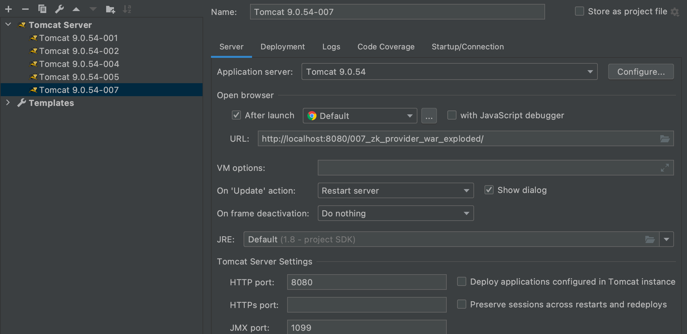

### 注册中心的高可用


## dubbo的配置


## 监控中心


