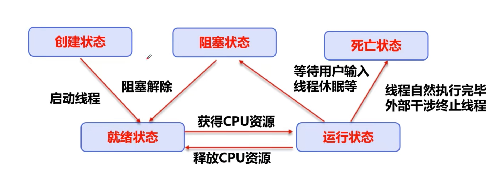
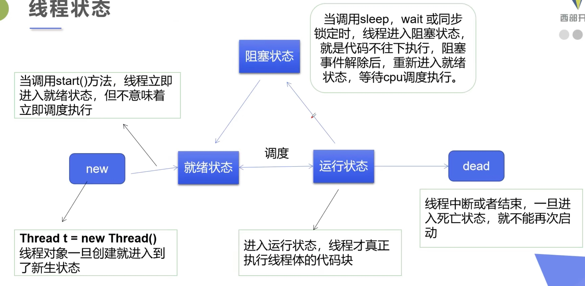
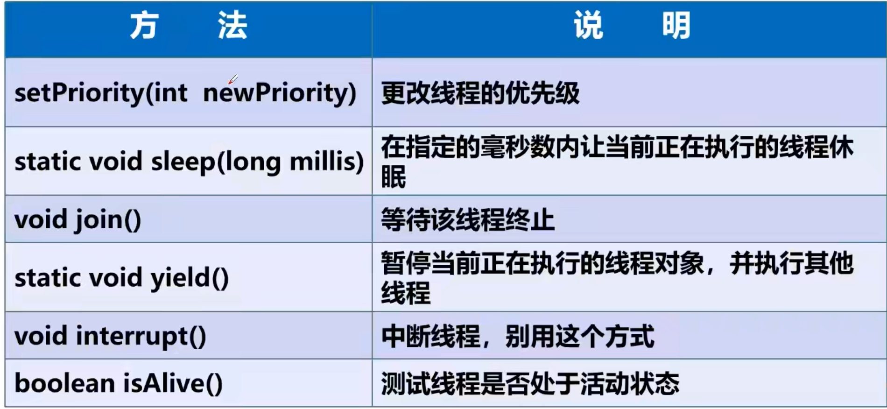
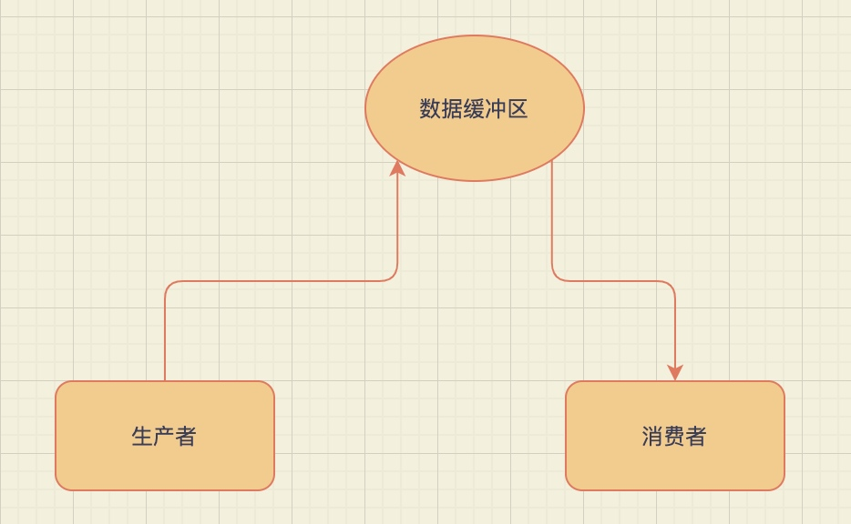
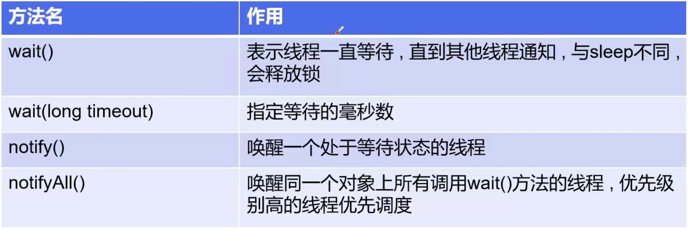

## 线程简介

### 多任务

### 线程

独立的执行路径

### 进程

- 程序是指令和数据的有序集合，其本身并没有任何的含义，是一个静态的概念（没有运行起来）
- 进程就是执行程序的一次执行过程，是一个动态的概念，是系统资源分配的单位
- 一个进程中可以包含若干个线程，当然一个进程中至少有一个线程，线程是CPU调度和执行的单位

### 多线程

注意：

很多线程是模拟出来的，真正的多线程是指有多个CPU，即多核，如服务器，如果是模拟出来的多线程，即在一个CPU的情况下，在同一个时间点，CPU只能执行一个代码，因为切换得很块，所以就有同时执行的错觉

对同一资源的操作，会存在资源抢夺的问题，需要加入并发控制

## 线程实现（重点）

### 三种创建方式

- Thread 继承Thread类
- Runnable 实现Runnable接口
- Callable 实现Callable接口

#### 继承Thread类

```java
/**
 * 创建线程的方式一：
 * 继承Thread类，重写run方法
 * 调用start开启线程
 */
public class TestThead01 extends Thread {
    @Override
    public void run() {
        for (int i = 0; i < 10; i++) {
            System.out.println("TestThead01：" + i);
        }
    }

    public static void main(String[] args) {
        TestThead01 testThead01 = new TestThead01();
        new Thread(testThead01).start();

        for (int i = 0; i < 10; i++) {
            System.out.println("main：" + i);
        }
    }
}
```

```java
/**
 * 练习Thread 实现多线程同步下载图片
 */
public class TestThread02 extends Thread {
    private String url;
    private String name;

    public TestThread02(String url, String name) {
        this.url = url;
        this.name = name;
    }

    @Override
    public void run() {
        WebDownloader webDownloader = new WebDownloader();
        webDownloader.downloader(url, name);
        System.out.println("下载了文件：" + name);
    }

    public static void main(String[] args) {
        TestThread02 testThread02 = new TestThread02("", "~/opt/1.png");
        new Thread(testThread02).start();
    }
}

class WebDownloader {
    public void downloader(String url, String name) {
        try {
            FileUtils.copyURLToFile(new URL(url), new File(name));
        } catch (IOException e) {
            e.printStackTrace();
        }
    }
}
```

#### 实现Runnable接口

```java
/**
 * 创建线程方式二
 * 实现Runnable接口，重写run方法，执行线程需要丢人Runnable接口的实现类，调用start方法
 */
public class TestThread03 implements Runnable{
    @Override
    public void run() {
        for (int i = 0; i < 10; i++) {
            System.out.println("TestThead01：" + i);
        }
    }

    public static void main(String[] args) {
        TestThread03 testThead03 = new TestThread03();
        new Thread(testThead03).start();

        for (int i = 0; i < 10; i++) {
            System.out.println("main：" + i);
        }
    }

}
```

#### 实现Callable接口

Callable 接口类似于 Runnable，因为两者都是为那些实例可能由另一个线程执行的类而设计的。但是，Runnable 不返回结果，也不能抛出已检查的异常。

- 实现Callable 接口，需要返回值类型
- 重写call方法
- 创建目标对象
- 创建执行任务：ExecutorService ser=Executors.newFixedThreadPool(1);
- 提交执行：Future\<Boolean\> result=ser.submit(t1)
- 获取结果：boolean r=result.get();
- 关闭服务：ser.shutdownNow();

```java
/**
 * 线程创建方式三：
 * 实现Callable方法
 */
public class TestCallable implements Callable<Boolean> {
    private String url;
    private String name;

    public TestCallable(String url, String name) {
        this.url = url;
        this.name = name;
    }

    @Override
    public Boolean call() {
        WebDownloader webDownloader = new WebDownloader();
        webDownloader.downloader(url, name);
        System.out.println("下载了文件：" + name);
        return true;
    }

    public static void main(String[] args) throws ExecutionException, InterruptedException {
        TestCallable testCallable = new TestCallable("", "~/opt/1.png");

        // 创建执行任务
        final ExecutorService executorService = Executors.newFixedThreadPool(1);
        final Future<Boolean> result = executorService.submit(testCallable);

        final Boolean rs = result.get();
        System.out.println(rs);

        executorService.shutdownNow();
    }
}

class WebDownloader {
    public void downloader(String url, String name) {
        try {
            FileUtils.copyURLToFile(new URL(url), new File(name));
        } catch (IOException e) {
            e.printStackTrace();
        }
    }
}
```

### 线程状态





### 线程方法



#### 线程停止

- 不推荐使用JDK提供的stop、destroy方法「已经废止」
- 推荐线程自己停止下来
- 建议使用一个标志位进行终止变量，当flag=false，则终止线程运行

通过外部标志位停止线程

```java
/**
 * 测试stop
 * <p>
 * 1 建议线程正常停止--利用次数，不建议死循环
 * 2 建议使用标志位--设置一个标志位
 * 3 不要是用stop或者destroy等过时或JDK不建议使用的方法
 */
public class TestStop implements Runnable {
    // 1 设置一个标志位
    private boolean flag = true;

    @Override
    public void run() {
        int i = 0;
        while (flag) {
            System.out.println("run.....thread:" + i++);
        }
    }

    // 2 设置一个公开的方法停止线程，转换标志位
    public void stop() {
        this.flag = false;
    }

    public static void main(String[] args) {
        final TestStop testStop = new TestStop();
        new Thread(testStop).start();

        for (int i = 0; i < 1000; i++) {
            System.out.println("main"+i);
            if (i == 900) {
                // 调用stop切换标志位，停止线程
                testStop.stop();
            }
        }
    }
}
```

#### 线程休眠 Thread.sleep

- sleep(时间) 指定当前线程阻塞的毫秒数
- sleep存在异常InterrptedExecuption
- sleep时间达到后，线程进入就绪状态
- sleep可以模拟网络延时，倒计时等
- 每一个对象都有一个锁，sleep不会释放锁

#### 线程礼让 Thread.yield

- 礼让线程，让当前正在执行的线程暂停，但不阻塞
- 将线程从运行状态转为**就绪状态**
- 让CPU重新调度，礼让不一定成功，看CPU心情
- 出来重新争抢CPU

```java
/**
 * 测试礼让线程，礼让不一定成功
 */
public class TestYield {
    public static void main(String[] args) {
        MyYield myYield = new MyYield();

        new Thread(myYield, "A").start();
        new Thread(myYield, "B").start();
    }

}

class MyYield implements Runnable {

    @Override
    public void run() {
        System.out.println(Thread.currentThread().getName() + "线程开始执行");
        Thread.yield();
        System.out.println(Thread.currentThread().getName() + "线程停止执行");
    }
}
```

输出结果

```shell
A线程开始执行
B线程开始执行
A线程停止执行
B线程停止执行
```

#### 合并线程 Join

- join合并线程，待此线程执行完成之后，再执行其他线程，其他线程阻塞
- 可以想象成是插队

```java
/**
 * 线程合并，相当于我直接合并到你的工作中先执行（插队）
 */
public class TestJoin implements Runnable {
    @Override
    public void run() {
        for (int i = 0; i < 20; i++) {
            System.out.println("join:" + i);
        }
    }

    public static void main(String[] args) throws InterruptedException {
        TestJoin testJoin = new TestJoin();

        Thread thread = new Thread(testJoin);
        thread.start();

        for (int i = 0; i < 10; i++) {
            if (i == 5) {
                thread.join();
            }

            System.out.println("main:" + i);
        }
    }
}
```

输出结果

```shell
main:0
main:1
join:0
main:2
main:3
main:4
join:1
join:2
join:3
join:4
join:5
join:6
join:7
join:8
join:9
join:10
join:11
join:12
join:13
join:14
join:15
join:16
join:17
join:18
join:19
main:5
main:6
main:7
main:8
main:9
```

#### 线程状态观测 Thread.State

线程状态

```java
public enum State {
    NEW,// 就绪
    RUNNABLE,// 运行
    BLOCKED,// 阻塞
    WAITING,// 等待
    TIMED_WAITING,// 超时等待
    TERMINATED;// 退出
}
```

```java
/**
 * 测试线程状态
 */
public class TestState {
    public static void main(String[] args) throws InterruptedException {
        Thread thread = new Thread(() -> {
            for (int i = 0; i < 5; i++) {
                try {
                    Thread.sleep(1000);
                } catch (InterruptedException e) {
                    e.printStackTrace();
                }
            }
            System.out.println("////////");
        });

        Thread.State state = thread.getState();
        System.out.println(state);// new态

        thread.start();

        state = thread.getState();
        System.out.println(state);//run

        while (state != Thread.State.TERMINATED) {// 只要线程不终止，就一直输出状态
            Thread.sleep(100);

            state = thread.getState();
            System.out.println(state);
        }
    }
}
```

#### 线程优先级

线程调度器决定按照优先级决定应该调度那个线程来执行

线程的优先级用数字表示，范围从1~10

- Tread.MIN_PRIORITY = 1;
- Thread.NORM_PRIORITY = 5;
- Thread.MAX_PRIORITY = 10;

使用以下方式获取/改变优先级

- getPriority()
- .setPriority(int xxx)

#### 守护线程

- 线程分为用户线程和守护线程
- 虚拟机必须确保用户线程执行完毕
- 虚拟机不用等待守护线程执行完毕
- 如：后台记录日志操作，监控内存，垃圾回收等待

```java
/**
 * 测试守护线程
 * 上帝守护你
 * 按照道理来说，本来God线程应该是一直运行的，但是将他设置为守护线程之后，JVM不用等待守护线程执行完毕
 */
public class TestDaemon {
    public static void main(String[] args) {
        God god = new God();
        You you = new You();

        Thread thread = new Thread(god);
        thread.setDaemon(true);//默认是false，表示是守护线程

        thread.start();

        new Thread(you).start();// 用户线程启动
    }
}

class God implements Runnable {
    @Override
    public void run() {
        while (true) {
            System.out.println("上帝保佑着你");
        }
    }
}

class You implements Runnable {

    @Override
    public void run() {
        for (int i = 0; i < 365000; i++) {
            System.out.println("你一生都开心的活着");
        }
        System.out.println("======goodbye");
    }
}
```

## 线程同步（重点）

多个线程操作同一个资源

### 基础概念

1. 并发

并发：同一个对象被多个线程同时操作

2. 线程同步

线程同步就是一种等待机制，多个需要同时访问此对象的线程进入这个对象的等待池形成队列，等待前面线程使用完毕，下一个在使用

由于同一个进程的多个线程共享同一块存储空间，在访问时加入锁机制synchronized，当一个线程获得对象的排它锁，独占资源，其他线程必须等待，使用后释放锁

存在以下问题：

- 一个线程持有锁会导致其他需要此锁的线程挂起
- 在多线程竞争下，加锁，释放锁会导致比较多的上下文切换和调度延时，引起性能问题
- 如果一个优先级高的线程等待一个优先级低的线程释放锁会导致优先级倒置，引起性能问题

3. 队列和锁

- 队列，所有需要此资源的线程需要进入这个等待队列
- 锁，当一个线程持有此资源的锁，就可以操作此对象

```java
/**
 * 不安全的买票
 */
public class UnsafeTicket {
    public static void main(String[] args) {
        BuyTicket buyTicket = new BuyTicket();
        new Thread(buyTicket, "张三").start();
        new Thread(buyTicket, "李四").start();
        new Thread(buyTicket, "黄牛").start();
    }
}

class BuyTicket implements Runnable {

    int ticketNums = 10;

    boolean flag = true;

    private void buy() {
        //判断是否有票
        if (ticketNums <= 0) {
            flag = false;
            return;
        }

        // 模拟延迟
        try {
            Thread.sleep(100);
        } catch (InterruptedException e) {
            e.printStackTrace();
        }

        // 买票
        System.out.println(Thread.currentThread().getName() + " 拿到 " + ticketNums--);
    }

    @Override
    public void run() {
        //买票
        while (flag) {
            buy();
        }
    }
}
```

三个人都去拿这个票数到自己的线程内存中导致这个共享变量出现值不唯一的情况，

输出结果出现重叠和负值的情况

```java
李四 拿到 10
黄牛 拿到 10
张三 拿到 9
李四 拿到 8
黄牛 拿到 6
张三 拿到 7
黄牛 拿到 5
张三 拿到 4
李四 拿到 5
李四 拿到 2
黄牛 拿到 3
张三 拿到 3
李四 拿到 1
黄牛 拿到 -1
张三 拿到 0
```

### 同步方法和同步代码块

由于我们可以通过private 关键字来保证数据对象只能被方法访问，所以我们只需要针对方法提出一套机制，这套机制就是synchronized关键字，它包括两种用法：synchronized方法和synchronized代码块

#### 同步方法

```java
public synchronized void method(int args){}
```

- synchronized方法控制对“对象”的访问，每个对象对应一把锁，每个synchronized方法都必须调用方法的对象的锁才能执行，否则线程会阻塞，方法一旦执行，就独占该锁，直到该方法返回才释放锁，后面被阻塞的线程才能获得这个锁
- 缺点：将一个大的方法申明为synchronized将会影响效率

```java
/**
 * 不安全的买票
 */
public class SafeTicket {
    public static void main(String[] args) {
        BuyTicket1 buyTicket = new BuyTicket1();
        new Thread(buyTicket, "张三").start();
        new Thread(buyTicket, "李四").start();
        new Thread(buyTicket, "黄牛").start();
    }
}

class BuyTicket1 implements Runnable {

    int ticketNums = 10;

    boolean flag = true;

    private synchronized void buy() {
        //判断是否有票
        if (ticketNums <= 0) {
            flag = false;
            return;
        }

        // 模拟延迟
        try {
            Thread.sleep(100);
        } catch (InterruptedException e) {
            e.printStackTrace();
        }

        // 买票
        System.out.println(Thread.currentThread().getName() + " 拿到 " + ticketNums--);
    }

    @Override
    public void run() {
        //买票
        while (flag) {
            buy();
        }
    }
}
```

#### 同步代码块

```
synchronized(Obj){}
```

Obj称为同步监视器

- Obj可以是任意对象，但是推按使用共享资源作为同步监视器
- 同步方法中无需指定同步监视器，因为同步方法的同步监视器就是this（普通方法），就是这个对象本身（普通方法）或者是Class（静态方法）

同步监视器的执行过程：

- 第一个线程访问，锁定同步监视器，执行其中额代码
- 第二个线程访问，发现同步监视器被锁定，无法访问
- 第一个线程访问完毕，解锁同步监视器
- 第二个线程访问，发现同步监视器没有锁，然后锁定并访问

```java
/**
 * 不安全的买票
 */
public class SafeTicket {
    public static void main(String[] args) {
        BuyTicket1 buyTicket = new BuyTicket1();
        new Thread(buyTicket, "张三").start();
        new Thread(buyTicket, "李四").start();
        new Thread(buyTicket, "黄牛").start();
    }
}

class BuyTicket1 implements Runnable {

    int ticketNums = 10;

    boolean flag = true;

    private void buy() {
        synchronized (BuyTicket1.class) {
            //判断是否有票
            if (ticketNums <= 0) {
                flag = false;
                return;
            }

            // 模拟延迟
            try {
                Thread.sleep(100);
            } catch (InterruptedException e) {
                e.printStackTrace();
            }

            // 买票
            System.out.println(Thread.currentThread().getName() + " 拿到 " + ticketNums--);
        }
    }

    @Override
    public void run() {
        //买票
        while (flag) {
            buy();
        }
    }
}
```

###  死锁

多个线程各自占用一些共享资源，并且互相等待其他线程占用的资源才能运行，而导致两个或者多个线程互相等待

某一个同步代码块同时拥有两个以上的对象的锁，就有可能会发生死锁的问题

```java
/**
 * 死锁
 * 化妆
 */
public class DeadLock {
    public static void main(String[] args) {
        Makeup makeup1 = new Makeup(0, "张三");
        Makeup makeup2 = new Makeup(1, "李四");

        makeup1.start();
        makeup2.start();
    }
}

/**
 * 口红
 */
class Lipstick {

}

/**
 * 镜子
 */
class Mirror {

}

class Makeup extends Thread {
    static Lipstick lipstick = new Lipstick();
    static Mirror mirror = new Mirror();

    int choice;
    String girlName;

    public Makeup(int choice, String girlName) {
        this.choice = choice;
        this.girlName = girlName;
    }

    @Override
    public void run() {
        // 化妆
        try {
            makeup();
        } catch (InterruptedException e) {
            e.printStackTrace();
        }
    }

    /**
     * 互相持有对方需要的资源
     */
    private void makeup() throws InterruptedException {
        if (choice == 0) {
            synchronized (lipstick) {
                System.out.println(this.girlName + " 获得口红的锁");
                Thread.sleep(1000);

                synchronized (mirror) {
                    System.out.println(this.girlName + " 获得镜子的锁");
                }
            }
        } else {
            synchronized (mirror) {
                System.out.println(this.girlName + " 获得镜子的锁");
                Thread.sleep(2000);

                synchronized (lipstick) {
                    System.out.println(this.girlName + " 获得口红的锁");
                }
            }
        }
    }
}
```

#### 死锁的避免方法

产生死锁的四个必要条件

- 互斥条件：一个资源每次只能被一个进程使用
- 请求与保持条件：一个进程因请求资源而阻塞时，对已获得的资源保持不放
- 不剥夺条件：进程已获得的资源，在未使用完之前，不能强行剥夺
- 循环等待条件：若干进程之间形成一种头尾相接的循环等待资源关系

**上面列出的死锁的四个条件，我们只要想办法破坏其中的任意一个或者多个条件就可以避免死锁发生**

### Lock（锁）

通过显式定义同步锁对象来实现同步，同步锁使用Lock对象充当

java.util.concurrent.locks.Lock接口是控制多个线程对共享资源进行访问的工具，锁提供了对共享资源的独占访问，每次只能有一个线程对Lock对象加锁，线程开始访问共享资源之前应该先获得Lock对象

ReentrantLock类实现了Lock，它拥有synchronzied相同的并发性和内存语义，在实现线程安全的控制中，比较常用的是ReentrantLock，可以显示加锁，释放锁

```java
/**
 * Lock测试
 * <p>
 * ReentrantLock 可重入锁
 */
public class LockDemo {
    public static void main(String[] args) {
        TestLock testLock = new TestLock();
        new Thread(testLock).start();
        new Thread(testLock).start();
        new Thread(testLock).start();
    }
}

class TestLock implements Runnable {

    int ticketNums = 10;

    private final Lock lock = new ReentrantLock();

    @Override
    public void run() {
        while (true) {
            lock.lock();
            try {
                if (ticketNums > 0) {
                    try {
                        Thread.sleep(1000);
                    } catch (InterruptedException e) {
                        e.printStackTrace();
                    }

                    System.out.println(ticketNums--);
                } else {
                    break;
                }
            } catch (Exception e) {
                e.printStackTrace();
            } finally {
                lock.unlock();
            }
        }
    }
}
```

### synchronized 与 lock 的对比

- lock是显式锁（手动开启和关闭锁） synchronized是隐式锁，出了作用域自动释放
- Lock只有代码块锁，synchronized有代码块锁和方法锁
- 使用Lock锁，JVM将花费比较少的时间来调度线程，性能更好，并且具有更好的扩展性
- 优先使用顺序：
    - Lock
    - 同步代码块锁
    - 同步方法锁

## 线程通信问题（线程协作）

### 生产者消费者模式

应用场景：

- 假设仓库中只能存放一件产品，生产者将生产出来的产品放入仓库，消费者将仓库中产品取走消费
- 如果仓库中没哟产品，则生产者将产品放入仓库，否则停止生产并等待，知道仓库中的产品被消费者取走为止
- 如果仓库中放有产品，则消费者可以将产品取走消费，否则停止消费并等待，直到仓库中再次放入产品为止



### 线程通信

Java提供了几个方法解决线程之间的通信问题



**均是Object类的方法，都只能在同步方法或者同步代码块中使用，否则会抛出异常IllegalMonitorStateException**

### 解决方式

并发协作模型“生产者/消费者模式”

1. 管程法

- 生产者：负责生产数据的模块
- 消费者：负责处理数据的模块
- 缓冲区：消费者不能直接使用生产者的数据，他们之间有个缓冲区

生产者间生产好的数据放入缓冲区，消费者从缓冲区拿出数据

```java
/**
 * 测试：生产者消费者模型
 * 利用缓冲区解决
 * 就是管程法
 */
public class TestPC {
    public static void main(String[] args) {
        SynContainer container=new SynContainer();

        new Producer(container).start();
        new Consumer(container).start();
    }
}

/**
 * 生产者
 */

class Producer extends Thread {
    SynContainer container;

    public Producer(SynContainer container) {
        this.container = container;
    }

    @Override
    public void run() {
        for (int i = 0; i < 100; i++) {
            try {
                container.push(new Chicken(i));
            } catch (InterruptedException e) {
                e.printStackTrace();
            }
            System.out.println("生产了" + i + "只鸡");
        }
    }
}

/**
 * 消费者
 */

class Consumer extends Thread {
    SynContainer container;

    public Consumer(SynContainer container) {
        this.container = container;
    }

    @Override
    public void run() {
        for (int i = 0; i < 100; i++) {
            try {
                System.out.println("消费" + container.pop() + "这只鸡");
            } catch (InterruptedException e) {
                e.printStackTrace();
            }
        }
    }
}

/**
 * 产品
 */

class Chicken {
    int id;//产品编号

    public Chicken(int id) {
        this.id = id;
    }
}

/**
 * 缓冲区
 */

class SynContainer {
    // 容器大小
    Chicken[] chickens = new Chicken[10];

    //容器计数器
    int count = 0;

    /**
     * 生产者放入产品
     */
    public synchronized void push(Chicken chicken) throws InterruptedException {
        // 如果容器满了，就需要等待消费者
        if (count == chickens.length) {
            // 等待
            wait();
        }

        // 如果没有满，就把产品丢进容器
        chickens[count] = chicken;
        count++;

        // 可以通知消费者消费了
        notifyAll();
    }


    /**
     * 消费者消费产品
     */

    public synchronized Chicken pop() throws InterruptedException {
        // 判断能够消费
        if (count == 0) {
            // 消费等待
            wait();
        }

        // 如果可以消费
        count--;
        final Chicken chicken = chickens[count];

        // 通着生产者生产
        notifyAll();

        return chicken;
    }
}
```

2. 信号灯法

通过一个标志位来判断是否生产产品还是唤醒另一个线程

```java
/**
 * 测试：生产者消费者模型
 * 信号灯法
 * 通过标志位
 */
public class TestPC2 {
    public static void main(String[] args) {
        TV tv=new TV();
        new Thread(new Player(tv)).start();
        new Thread(new Watcher(tv)).start();
    }
}

/**
 * 生产者 演员
 */
class Player extends Thread {
    TV tv;

    public Player(TV tv) {
        this.tv = tv;
    }

    @Override
    public void run() {
        for (int i = 0; i < 20; i++) {
            if (i % 2 == 0) {
                this.tv.play("荒野冒险播放中");
            } else {
                this.tv.play("广告");
            }
        }
    }
}

/**
 * 消费者 观众
 */

class Watcher extends Thread {
    TV tv;

    public Watcher(TV tv) {
        this.tv = tv;
    }

    @Override
    public void run() {
        for (int i = 0; i < 20; i++) {
            tv.watch();
        }
    }
}

/**
 * 产品 节目
 */
class TV {
    /**
     * 演员表演，观众等待
     * 观众观看，演员等待
     */
    String voice;//表演的节目
    boolean flag = true;

    /**
     * 表演
     */
    public synchronized void play(String voice) {

        if (!flag) {
            try {
                this.wait();
            } catch (InterruptedException e) {
                e.printStackTrace();
            }
        }

        System.out.println("演员表演了：" + voice);

        //通知观众观看
        this.notifyAll();

        this.voice = voice;
        this.flag = !this.flag;
    }

    /**
     * 观看
     */
    public synchronized void watch() {
        if (flag) {
            try {
                this.wait();
            } catch (InterruptedException e) {
                e.printStackTrace();
            }
        }
        System.out.println("观看了" + voice);

        //通知演员表演
        this.notifyAll();
        this.flag = !this.flag;
    }
}
```

## 线程池

背景：经常创建和销毁、使用量特别大的资源，比如并发情况下的线程，对性能影响很大

思路：提前创建好多个线程，放入线程池中，使用时直接获取，使用完放回池中。可以避免频繁创建销毁、实现重复利用，类似生活中的公共交通工具

好处：

- 提高了响应速度（减少了创建新线程的时间）
- 降低资源消耗（重复利用线程池中线程，不需要每次都创建）
- 便于线程管理
    - corePoolSize：核心池的大小
    - maxmumPoolSize：最大线程数
    - keepAliveTime：线程没有任务时最多保持多长时间后会终止

```java
/**
 * 测试线程池
 */
public class TestPool {
    public static void main(String[] args) {
        // 创建服务 池子
        // 参数为线程的大小
        final ExecutorService executorService = Executors.newFixedThreadPool(10);

        executorService.execute(new MyThread());
        executorService.execute(new MyThread());
        executorService.execute(new MyThread());
        executorService.execute(new MyThread());

        // 关闭连接
        executorService.shutdown();
    }
}

class MyThread implements Runnable {

    @Override
    public void run() {
        System.out.println(Thread.currentThread().getName());
    }
}
```
