## 什么是JUC

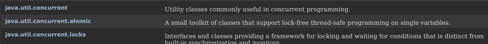

java.util工具包，包、分类

业务：普通的线程代码 Thread

Runnable 没有返回值，效率相比于Callable相对较低

Callable

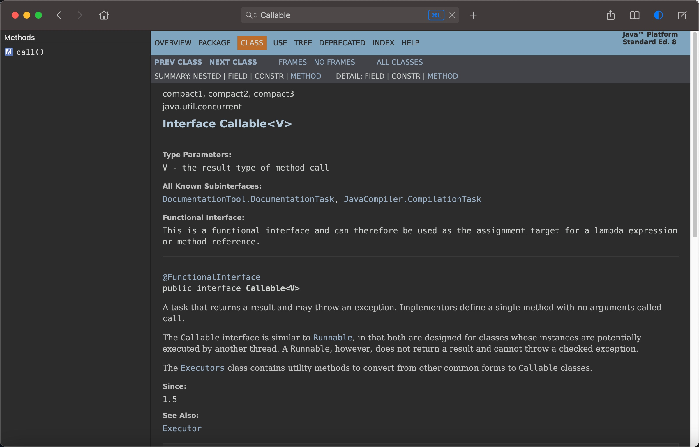

Lock

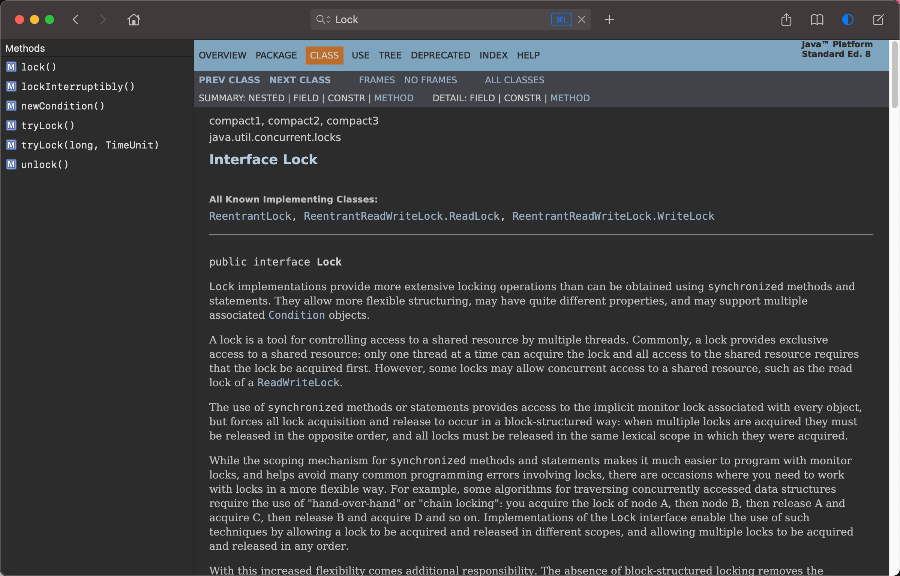

## 进程和线程

### 进程和线程

> 如果不能使用一句话说出来的技术，就是不扎实

进程：一个程序，QQ.exe Music.exe 程序的集合

一个进程往往可以包含多个线程，至少包含一个

java默认有几个线程-->2个 main、GC（守护线程）

线程：开了一个进程idea，编写代码，自动保存（线程负责的）

对于Java而言，开始一个线程：Thread Runnable Callable

Java真的可以开始线程吗？

不行，它是调用本地方法，也就是C++编写的代码，C++启动的线程

```java
public synchronized void start() {
    /**
     * This method is not invoked for the main method thread or "system"
     * group threads created/set up by the VM. Any new functionality added
     * to this method in the future may have to also be added to the VM.
     *
     * A zero status value corresponds to state "NEW".
     */
    if (threadStatus != 0)
        throw new IllegalThreadStateException();

    /* Notify the group that this thread is about to be started
     * so that it can be added to the group's list of threads
     * and the group's unstarted count can be decremented. */
    group.add(this);

    boolean started = false;
    try {
        start0();
        started = true;
    } finally {
        try {
            if (!started) {
                group.threadStartFailed(this);
            }
        } catch (Throwable ignore) {
            /* do nothing. If start0 threw a Throwable then
              it will be passed up the call stack */
        }
    }
}

private native void start0();
```

### 并发、并行

并发（多线程操作同一个资源）

- CPU一核，模拟出多个线程，天下武功，唯快不破，快速交替

并行（多个人一起行动）

- CPU多核，多个线程可以同时执行

获取CPU核数

```java
package com.example.juc;

public class Test1 {
    public static void main(String[] args) {
        // 获取CPU的核数
        // CPU 密集型、IO密集型
        System.out.println(Runtime.getRuntime().availableProcessors());
    }
}
```

并发编程的本质：**充分利用CPU的资源**

### 回顾多线程

#### 线程有几个状态

```java
public enum State {
    /**
     * 新生
     */
    NEW,

    /**
     * 运行
     */
    RUNNABLE,

    /**
     * 阻塞
     */
    BLOCKED,

    /**
     * 等待，死死的等，不放弃
     */
    WAITING,

    /**
     * 超时等待，可以放弃
     */
    TIMED_WAITING,

    /**
     * 终止
     */
    TERMINATED;
}
```

#### wait/sheep区别

1. 来自不同的类

- wait --Object
- sleep --Thread

企业中，一般不用sleep，而是

```java
TimeUnit.DAYS.sleep(1);
TimeUnit.SECONDS.sleep(1);
```

2. 关于锁的释放

- wait 会释放锁
- sleep睡觉了，抱着锁睡觉，不会释放

3. 使用的范围

- wait 必须在同步代码块中，必须要等待
- sleep 可以在任何地方睡觉

4. 是否需要捕获异常

- wait 不需要捕获异常
- sleep 必须要捕获异常

## Lock锁

> 传统的 Synchronzied

### 买票的例子

1. 传统的开发方式

```java
public class SaleTicketDemo01 {
    public static void main(String[] args) {
        new Thread(new MyThread()).start();
    }
}

class MyThread implements Runnable{

    @Override
    public void run() {

    }
}
```

2. 同一个资源被多个线程并发访问

在多线程中，一般都是资源类和线程操作解耦，不放在用同一个类中，只有在线程操作资源类时，才会创建资源类的对象

```java
/**
 * 基本的买票的例子
 * <p>
 * 真正的多线程开发，公司中的开发，降低耦合性，如果是去实现Runnable，增加了耦合性
 * 线程就是一个单独的资源类，没有任何附属操作
 * 1、属性、方法
 */
public class SaleTicketDemo01 {
    public static void main(String[] args) {
        // 多线程操作
        // 并发：多线程操作同一个资源类
        Ticket ticket = new Ticket();

        // @FunctionalInterface 函数式接口，可以直接new 出来，jdk8之后，可以使用lambda表达式：(参数)->{代码}
        new Thread(() -> {
            for (int i = 0; i < 60; i++) {
                ticket.sale();
            }
        },"A").start();
        new Thread(() -> {
            for (int i = 0; i < 60; i++) {
                ticket.sale();
            }
        },"B").start();
        new Thread(() -> {
            for (int i = 0; i < 60; i++) {
                ticket.sale();
            }
        },"C").start();

    }
}

//资源类 OOP
class Ticket {
    // 属性、方法
    private int number = 50;

    // 买票的方式
    public void sale() {
        if (number > 0) {
            System.out.println(Thread.currentThread().getName() + "卖出了" + (number--) + "张票，剩余：" + number);
        }
    }
}
```

输出结果：

```shell
A卖出了50张票，剩余：49
A卖出了49张票，剩余：48
A卖出了48张票，剩余：47
A卖出了47张票，剩余：46
A卖出了45张票，剩余：44
A卖出了44张票，剩余：43
B卖出了46张票，剩余：45
B卖出了42张票，剩余：41
B卖出了41张票，剩余：40
B卖出了40张票，剩余：39
A卖出了43张票，剩余：42
A卖出了38张票，剩余：37
A卖出了37张票，剩余：36
A卖出了36张票，剩余：35
A卖出了35张票，剩余：34
A卖出了34张票，剩余：33
A卖出了32张票，剩余：31
A卖出了31张票，剩余：30
A卖出了30张票，剩余：29
A卖出了29张票，剩余：28
A卖出了28张票，剩余：27
A卖出了27张票，剩余：26
A卖出了26张票，剩余：25
B卖出了39张票，剩余：38
A卖出了25张票，剩余：24
A卖出了23张票，剩余：22
A卖出了22张票，剩余：21
C卖出了33张票，剩余：32
C卖出了20张票，剩余：19
A卖出了21张票，剩余：20
B卖出了24张票，剩余：23
A卖出了18张票，剩余：17
C卖出了19张票，剩余：18
A卖出了16张票，剩余：15
A卖出了14张票，剩余：13
A卖出了13张票，剩余：12
A卖出了12张票，剩余：11
A卖出了11张票，剩余：10
A卖出了10张票，剩余：9
B卖出了17张票，剩余：16
B卖出了8张票，剩余：7
B卖出了7张票，剩余：6
B卖出了6张票，剩余：5
B卖出了5张票，剩余：4
B卖出了4张票，剩余：3
B卖出了3张票，剩余：2
B卖出了2张票，剩余：1
B卖出了1张票，剩余：0
A卖出了9张票，剩余：8
C卖出了15张票，剩余：14
```

多个线程争抢资源，导致共享的资源出现错误

3. 用传统的方式去解决并发出现的问题

```java
//资源类 OOP
class Ticket {
    // 属性、方法
    private int number = 50;

    // 买票的方式
    // synchronized 本质就是排队，队列，锁，从无序变成有序，单入
    // synchronized一共可以锁两个东西：对象和Class
    public synchronized void sale() {
        if (number > 0) {
            System.out.println(Thread.currentThread().getName() + "卖出了" + (number--) + "张票，剩余：" + number);
        }
    }
}
```

输出结果

```shell
A卖出了50张票，剩余：49
A卖出了49张票，剩余：48
A卖出了48张票，剩余：47
A卖出了47张票，剩余：46
A卖出了46张票，剩余：45
B卖出了45张票，剩余：44
B卖出了44张票，剩余：43
B卖出了43张票，剩余：42
B卖出了42张票，剩余：41
B卖出了41张票，剩余：40
B卖出了40张票，剩余：39
B卖出了39张票，剩余：38
B卖出了38张票，剩余：37
B卖出了37张票，剩余：36
B卖出了36张票，剩余：35
B卖出了35张票，剩余：34
B卖出了34张票，剩余：33
B卖出了33张票，剩余：32
B卖出了32张票，剩余：31
B卖出了31张票，剩余：30
B卖出了30张票，剩余：29
B卖出了29张票，剩余：28
B卖出了28张票，剩余：27
B卖出了27张票，剩余：26
B卖出了26张票，剩余：25
B卖出了25张票，剩余：24
B卖出了24张票，剩余：23
B卖出了23张票，剩余：22
B卖出了22张票，剩余：21
B卖出了21张票，剩余：20
B卖出了20张票，剩余：19
B卖出了19张票，剩余：18
B卖出了18张票，剩余：17
B卖出了17张票，剩余：16
B卖出了16张票，剩余：15
B卖出了15张票，剩余：14
B卖出了14张票，剩余：13
B卖出了13张票，剩余：12
B卖出了12张票，剩余：11
B卖出了11张票，剩余：10
B卖出了10张票，剩余：9
B卖出了9张票，剩余：8
B卖出了8张票，剩余：7
A卖出了7张票，剩余：6
A卖出了6张票，剩余：5
A卖出了5张票，剩余：4
A卖出了4张票，剩余：3
A卖出了3张票，剩余：2
A卖出了2张票，剩余：1
A卖出了1张票，剩余：0
```

- synchronized 本质就是排队，队列，锁，从无序变成有序，单入
- synchronized一共可以锁两个东西：对象和Class
    - 方法上的synchronized只能是锁Class
    - 代码块中的synchronized可以锁对象，也可以锁Class

synchronized 锁对象和锁Class

synchronized要按照同步代码块来保证线程安全，这可就加在方法“复杂”多了。有：synchronized(this){}这么写的，也有synchronized(Count.class){}这么写的，还有定义了一个private Object obj = new Object; ….synchronized(obj){}这么写的

synchronized你到底锁住的是谁？

synchronized从语法的维度一共有3个用法：

- 静态方法加上关键字 **锁的是Class**
- 实例方法（也就是普通方法）加上关键字 **锁的是this，也就是对象**
- 方法中使用同步代码块 **看括号中的对象，比如：如果是Count.class就是锁Class，如果是this就是锁对象，和public synchronized void demo(){}一样**

### Lock所在包-Package java.util.concurrent.locks

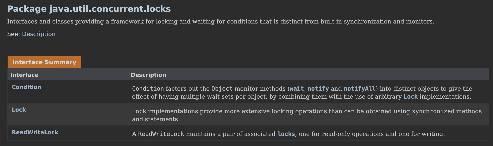

- Condition
- Lock 锁
- ReadWriteLock 读写锁

### Lock使用

Lock 接口

```java
// A typical usage idiom for this method would be:
Lock lock = ...;
if (lock.tryLock()) {// 加锁
try {
 // manipulate protected state
} finally {
 lock.unlock();// 解锁
}
} else {
// perform alternative actions
}
```

三个实现类：

> All Known Implementing Classes: ReentrantLock, ReentrantReadWriteLock.ReadLock, ReentrantReadWriteLock.WriteLock

- ReentrantLock：常用的，普通的，可重入锁
- ReentrantReadWriteLock.ReadLock 写锁
- ReentrantReadWriteLock.WriteLock 读锁

#### 公平锁与非公平锁

```java
/**
 * Creates an instance of {@code ReentrantLock}.
 * This is equivalent to using {@code ReentrantLock(false)}.
 */
public ReentrantLock() {
    sync = new NonfairSync(); // 非公平锁
}

/**
 * Creates an instance of {@code ReentrantLock} with the
 * given fairness policy.
 *
 * @param fair {@code true} if this lock should use a fair ordering policy
 */
public ReentrantLock(boolean fair) {// 如果传入的是true的话，就是公平锁（FairSync）
    sync = fair ? new FairSync() : new NonfairSync();
}
```

- 公平锁：十分公平，需要先来后到
- 非公平锁：十分不公平，可以插队（默认）

为什么非公平锁是默认的？

- 两个进程：一个3h执行完，一个3s执行完，3s排号的时候在3h的后面，3s的为了拿到CPU的3s需要等待3h，这有必要吗？
- Lock 和 Synchronzied都是非公平锁

#### 买票Lock实现

```java
/**
 * 基本的买票的例子
 * <p>
 * 真正的多线程开发，公司中的开发，降低耦合性，如果是去实现Runnable，增加了耦合性
 * 线程就是一个单独的资源类，没有任何附属操作
 * 1、属性、方法
 */
public class SaleTicketDemo02 {
    public static void main(String[] args) {
        // 多线程操作
        // 并发：多线程操作同一个资源类
        Ticket2 ticket = new Ticket2();

        // @FunctionalInterface 函数式接口，可以直接new 出来，jdk8之后，可以使用lambda表达式：(参数)->{代码}
        new Thread(() -> { for (int i = 0; i < 60; i++) ticket.sale(); }, "A").start();
        new Thread(() -> { for (int i = 0; i < 60; i++) ticket.sale(); }, "B").start();
        new Thread(() -> { for (int i = 0; i < 60; i++) ticket.sale(); }, "C").start();

    }
}

//资源类 OOP

/**
 * Lock使用三部曲：
 * new ReentrantLock();
 * lock.tryLock()
 * lock.unlock();
 */
class Ticket2 {
    // 属性、方法
    private int number = 50;

    Lock lock = new ReentrantLock();

    // 买票的方式
    // Lock 方式
    public void sale() {
        if (lock.tryLock()) {// 加锁
            try {
                if (number > 0) {
                    System.out.println(Thread.currentThread().getName() + "卖出了" + (number--) + "张票，剩余：" + number);
                }
            } finally {
                lock.unlock();// 解锁
            }
        } else {
            // perform alternative actions
        }
    }
}
```

输出结果：

```shell
A卖出了50张票，剩余：49
A卖出了49张票，剩余：48
A卖出了48张票，剩余：47
A卖出了47张票，剩余：46
A卖出了46张票，剩余：45
A卖出了45张票，剩余：44
A卖出了44张票，剩余：43
A卖出了43张票，剩余：42
A卖出了42张票，剩余：41
A卖出了41张票，剩余：40
A卖出了40张票，剩余：39
A卖出了39张票，剩余：38
A卖出了38张票，剩余：37
A卖出了37张票，剩余：36
A卖出了36张票，剩余：35
A卖出了35张票，剩余：34
A卖出了34张票，剩余：33
A卖出了33张票，剩余：32
A卖出了32张票，剩余：31
A卖出了31张票，剩余：30
A卖出了30张票，剩余：29
C卖出了29张票，剩余：28
C卖出了28张票，剩余：27
C卖出了27张票，剩余：26
C卖出了26张票，剩余：25
C卖出了25张票，剩余：24
C卖出了24张票，剩余：23
C卖出了23张票，剩余：22
C卖出了22张票，剩余：21
C卖出了21张票，剩余：20
C卖出了20张票，剩余：19
C卖出了19张票，剩余：18
C卖出了18张票，剩余：17
C卖出了17张票，剩余：16
C卖出了16张票，剩余：15
C卖出了15张票，剩余：14
C卖出了14张票，剩余：13
C卖出了13张票，剩余：12
C卖出了12张票，剩余：11
C卖出了11张票，剩余：10
C卖出了10张票，剩余：9
C卖出了9张票，剩余：8
C卖出了8张票，剩余：7
C卖出了7张票，剩余：6
C卖出了6张票，剩余：5
C卖出了5张票，剩余：4
C卖出了4张票，剩余：3
C卖出了3张票，剩余：2
C卖出了2张票，剩余：1
C卖出了1张票，剩余：0
```

### synchronized 与 Lock 的区别

1. synchronized 内置的Java关键字，Lock是一个Java类
2. synchronized 无法判断获取锁状态，Lock可以判断是否获取到了锁
3. synchronized 会自动释放锁，Lock必须要手动释放锁，如果不释放锁，就会出现**死锁**，手动的难度高但是更安全，你们看开赛车的那个开自动挡
4. synchronized 线程1 （获得锁，阻塞）、线程2（傻傻的等待）；Lock锁就不一定会傻傻的等待`lock.tryLock()`，不让我拿到，我才懒得等待呢
5. synchronized 可重入锁，不可以中断的，非公平的；Lock 可重入锁，可以判断锁，可以自己设置公平不公平
6. synchronized 适合锁少量的代码同步问题，Lock适合锁大量的同步代码

#### 锁是什么？如何判断锁的是谁？


## 生产者和消费者

大有门道

面试的时候，常见的手写代码：单例模式、排序算法、生产者和消费者问题、死锁问题

### 老版的：可以使用synchronize wait notify实现

```java
/**
 * 线程之间的通信问题：生产者和消费者问题， 等待唤醒，通知唤醒
 * 线程交替执行 A B 操作同一个变量 num = 0
 * A num + 1 等
 * B num - 1
 */
public class A {
    public static void main(String[] args) {
        final Data data = new Data();

        new Thread(() -> {
            for (int i = 0; i < 10; i++) {
                try {
                    data.increment();
                } catch (InterruptedException e) {
                    e.printStackTrace();
                }
            }
        }, "A").start();
        new Thread(() -> {
            for (int i = 0; i < 10; i++) {
                try {
                    data.decrement();
                } catch (InterruptedException e) {
                    e.printStackTrace();
                }
            }
        }, "B").start();
    }
}

/**
 * 数字，资源类
 * 资源类，应该去解耦合
 * 只要是多线程，只要是并发编程不加锁就是不安全
 * <p>
 * 口诀：判断等待，业务，通知
 */
class Data {
    private int number = 0;

    // +1
    public synchronized void increment() throws InterruptedException {
        if (number != 0) {
            //等待操作
            this.wait();
        }

        number++;

        System.out.println(Thread.currentThread().getName() + "=>" + number);
        //通知其他线程，我+1完毕了
        this.notifyAll();
    }

    // -1
    public synchronized void decrement() throws InterruptedException {
        if (number == 0) {
            //等待操作
            this.wait();
        }

        number--;

        System.out.println(Thread.currentThread().getName() + "=>" + number);
        //通知其他线程，我-1完毕了
        this.notifyAll();
    }
}
```

输出结果

```shell
A=>1
B=>0
A=>1
B=>0
A=>1
B=>0
A=>1
B=>0
A=>1
B=>0
A=>1
B=>0
A=>1
B=>0
A=>1
B=>0
A=>1
B=>0
A=>1
B=>0
```

#### 问题所在

如果有四个线程：A B C D四个线程，两个加，两个减的话，他还安全吗？

不安全，因为是单个if判断（只会判断一次），如果出现

```java
/**
 * 线程之间的通信问题：生产者和消费者问题， 等待唤醒，通知唤醒
 * 线程交替执行 A B 操作同一个变量 num = 0
 * A num + 1 等
 * B num - 1
 */
public class A {
    public static void main(String[] args) {
        final Data data = new Data();

        new Thread(() -> {
            for (int i = 0; i < 10; i++) {
                try {
                    data.increment();
                } catch (InterruptedException e) {
                    e.printStackTrace();
                }
            }
        }, "A").start();
        new Thread(() -> {
            for (int i = 0; i < 10; i++) {
                try {
                    data.decrement();
                } catch (InterruptedException e) {
                    e.printStackTrace();
                }
            }
        }, "B").start();

        new Thread(() -> {
            for (int i = 0; i < 10; i++) {
                try {
                    data.increment();
                } catch (InterruptedException e) {
                    e.printStackTrace();
                }
            }
        }, "C").start();
        new Thread(() -> {
            for (int i = 0; i < 10; i++) {
                try {
                    data.decrement();
                } catch (InterruptedException e) {
                    e.printStackTrace();
                }
            }
        }, "D").start();
    }
}

/**
 * 数字，资源类
 * 资源类，应该去解耦合
 * 只要是多线程，只要是并发编程不加锁就是不安全
 * <p>
 * 口诀：判断等待，业务，通知
 */
class Data {
    private int number = 0;

    // +1
    public synchronized void increment() throws InterruptedException {
        if (number != 0) {
            //等待操作
            this.wait();
        }

        number++;

        System.out.println(Thread.currentThread().getName() + "=>" + number);
        //通知其他线程，我+1完毕了
        this.notifyAll();
    }

    // -1
    public synchronized void decrement() throws InterruptedException {
        if (number == 0) {
            //等待操作
            this.wait();
        }

        number--;

        System.out.println(Thread.currentThread().getName() + "=>" + number);
        //通知其他线程，我-1完毕了
        this.notifyAll();
    }
}
```

输出结果并不是我们所需要的：出现2 和 3 就是错误的

```shell
A=>1
B=>0
A=>1
B=>0
A=>1
B=>0
A=>1
B=>0
A=>1
B=>0
C=>1
B=>0
A=>1
B=>0
C=>1
B=>0
A=>1
B=>0
C=>1
D=>0
C=>1
B=>0
A=>1
C=>2
D=>1
D=>0
C=>1
A=>2
C=>3
D=>2
D=>1
D=>0
C=>1
A=>2
C=>3
D=>2
D=>1
D=>0
C=>1
D=>0

Process finished with exit code 0
```

> As in the one argument version, interrupts and spurious wakeups are possible, and this method should always be used in a loop:
> 翻译
> 与单参数版本一样，中断和**虚假唤醒**是可能的，并且应始终在循环中使用此方法
>
> ```java
> synchronized (obj) {
>  while (<condition does not hold>)
>      obj.wait();
>  ... // Perform action appropriate to condition
> }
> ```

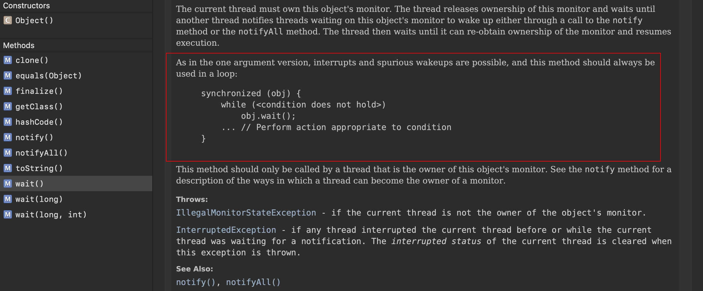

也就是说，在+1之后唤醒的两个-1的操作，其中一个获得到-1的权限之后-1，然后不等于1了，if不符判断，就去休眠了，放出了CPU的操作权，此时另一个-1的操作获得了CPU的操作权，并进行-1操作

**虚假唤醒**

1. 两个+1操作虚假唤醒（两个-1操作同理）

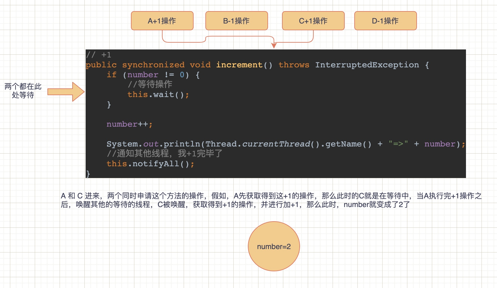

2. +1 和 -1 操作虚假唤醒

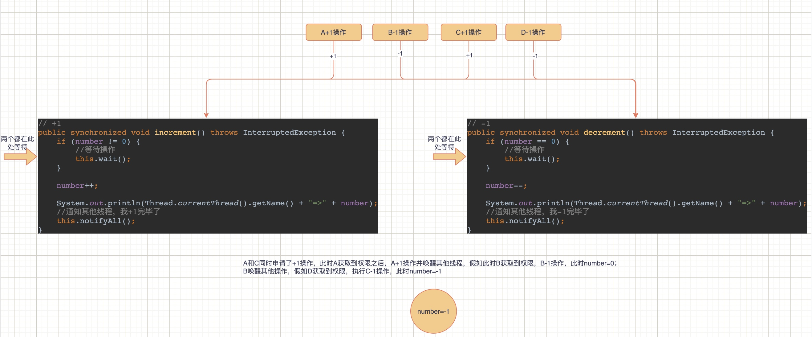

那么，此时改用`while`的话，就可以保证在被唤醒之后接着判断当前的`number`是否符合我们的条件

```java
/**
 * 数字，资源类
 * 资源类，应该去解耦合
 * 只要是多线程，只要是并发编程不加锁就是不安全
 * <p>
 * 口诀：判断等待，业务，通知
 */
class Data {
    private int number = 0;

    // +1
    public synchronized void increment() throws InterruptedException {
        while (number != 0) {
            //等待操作
            this.wait();
        }

        number++;

        System.out.println(Thread.currentThread().getName() + "=>" + number);
        //通知其他线程，我+1完毕了
        this.notifyAll();
    }

    // -1
    public synchronized void decrement() throws InterruptedException {
        while (number == 0) {
            //等待操作
            this.wait();
        }

        number--;

        System.out.println(Thread.currentThread().getName() + "=>" + number);
        //通知其他线程，我-1完毕了
        this.notifyAll();
    }
}
```

输出结果

```shell
A=>1
B=>0
A=>1
B=>0
A=>1
B=>0
A=>1
B=>0
A=>1
B=>0
C=>1
B=>0
A=>1
B=>0
C=>1
B=>0
A=>1
D=>0
C=>1
B=>0
A=>1
D=>0
C=>1
B=>0
A=>1
D=>0
C=>1
D=>0
A=>1
D=>0
C=>1
D=>0
C=>1
D=>0
C=>1
D=>0
C=>1
D=>0
C=>1
D=>0
```

### juc版的：Lock

通过Lock找到Condition

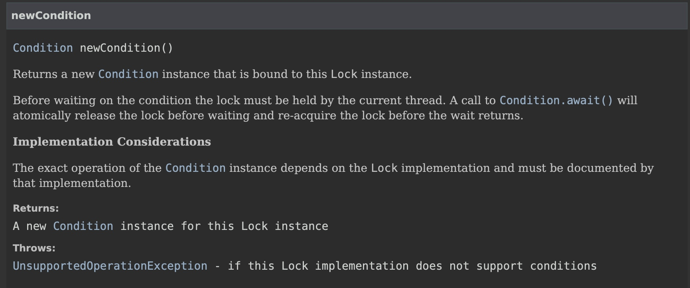

#### Condition

> Condition factors out the Object monitor methods (wait, notify and notifyAll) into distinct objects to give the effect of having multiple wait-sets per object, by combining them with the use of arbitrary Lock implementations. Where a Lock replaces the use of synchronized methods and statements, a Condition replaces the use of the Object monitor methods.
> Condition将对象监视器方法（wait、notify 和 notifyAll）分解为不同的对象，通过将它们与任意 Lock 实现的使用相结合，从而产生每个对象具有多个等待集的效果。 Lock 代替了同步方法和语句的使用，而 Condition 代替了对象监视器方法的使用。
> 
> ```java
> class BoundedBuffer {
>   final Lock lock = new ReentrantLock();
>   final Condition notFull  = lock.newCondition(); // 监视器对象
>   final Condition notEmpty = lock.newCondition(); 
> 
>    final Object[] items = new Object[100];
>    int putptr, takeptr, count;
> 
>    public void put(Object x) throws InterruptedException {
>      lock.lock();
>      try {
>        while (count == items.length)
>          notFull.await(); // 等待
>        items[putptr] = x;
>        if (++putptr == items.length) putptr = 0;
>        ++count;
>        notEmpty.signal(); // 通知
>      } finally {
>        lock.unlock();
>      }
>    }
> 
>    public Object take() throws InterruptedException {
>      lock.lock();
>      try {
>        while (count == 0)
>          notEmpty.await();
>        Object x = items[takeptr];
>        if (++takeptr == items.length) takeptr = 0;
>        --count;
>        notFull.signal();
>        return x;
>      } finally {
>        lock.unlock();
>      }
>    }
>  }
> ```

#### 代码实现JUC版生产者和消费者

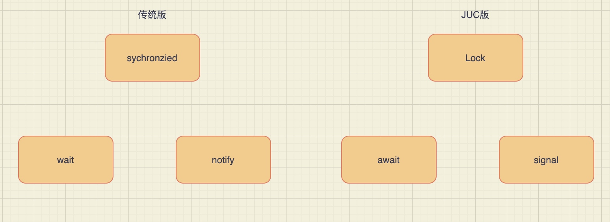

```java
/**
 * 线程之间的通信问题：生产者和消费者问题， 等待唤醒，通知唤醒
 * 线程交替执行 A B 操作同一个变量 num = 0
 * A num + 1 等
 * B num - 1
 */
public class B {
    public static void main(String[] args) {
        final Data2 data = new Data2();

        new Thread(() -> {
            for (int i = 0; i < 10; i++) {
                try {
                    data.increment();
                } catch (InterruptedException e) {
                    e.printStackTrace();
                }
            }
        }, "A").start();
        new Thread(() -> {
            for (int i = 0; i < 10; i++) {
                try {
                    data.decrement();
                } catch (InterruptedException e) {
                    e.printStackTrace();
                }
            }
        }, "B").start();

        new Thread(() -> {
            for (int i = 0; i < 10; i++) {
                try {
                    data.increment();
                } catch (InterruptedException e) {
                    e.printStackTrace();
                }
            }
        }, "C").start();
        new Thread(() -> {
            for (int i = 0; i < 10; i++) {
                try {
                    data.decrement();
                } catch (InterruptedException e) {
                    e.printStackTrace();
                }
            }
        }, "D").start();
    }
}

/**
 * 数字，资源类
 * 资源类，应该去解耦合
 * 只要是多线程，只要是并发编程不加锁就是不安全
 * <p>
 * 口诀：判断等待，业务，通知
 */
class Data2 {
    private int number = 0;
    Lock lock = new ReentrantLock();
    Condition condition = lock.newCondition();

    // +1
    public void increment() throws InterruptedException {
        lock.lock();
        try {
            while (number != 0) {
                //等待操作
                condition.await();
            }

            number++;

            System.out.println(Thread.currentThread().getName() + "=>" + number);

            //通知其他线程，我+1完毕了
            condition.signalAll();

        } catch (Exception exception) {
            exception.printStackTrace();
        } finally {
            lock.unlock();
        }
    }

    // -1
    public void decrement() throws InterruptedException {
        lock.lock();
        try {
            while (number == 0) {
                //等待操作
                condition.await();
            }

            number--;

            System.out.println(Thread.currentThread().getName() + "=>" + number);

            //通知其他线程，我-1完毕了
            condition.signalAll();

        } catch (Exception exception) {
            exception.printStackTrace();
        } finally {
            lock.unlock();
        }
    }
}
```

> 任何一个新的技术，绝对不是仅仅覆盖了原来的技术，一定是会有优势和补充

问题：现在的线程是随机的状态，如何能让它按照我们想要的顺序执行呢？

**Condition 精准的通知和唤醒线程**

让三个线程顺序执行：A执行完通知B执行  B执行完通知C执行，C执行完通知A执行

```java
/**
 * 让三个线程顺序执行
 * A执行完通知B执行  B执行完通知C执行，C执行完通知A执行
 */
public class C {
    public static void main(String[] args) {
        Data3 data3 = new Data3();
        new Thread(() -> {
            for (int i = 0; i < 10; i++) {
                data3.printA();
            }
        }, "A").start();
        new Thread(() -> {
            for (int i = 0; i < 10; i++) {
                data3.printB();
            }
        }, "B").start();
        new Thread(() -> {
            for (int i = 0; i < 10; i++) {
                data3.printC();
            }
        }, "C").start();
    }
}

/**
 * 资源类
 */
class Data3 {
    private Lock lock = new ReentrantLock();
    private Condition condition1 = lock.newCondition();
    private Condition condition2 = lock.newCondition();
    private Condition condition3 = lock.newCondition();

    private int number = 1;// 1 的时候 A执行 2 的时候 B执行 3 的时候 C执行

    public void printA() {
        lock.lock();
        try {
            // 业务代码 判断->执行业务->通知
            while (number != 1) {
                // 等待
                condition1.await();
            }

            System.out.println(Thread.currentThread().getName() + "=>AAAAAA");

            // 唤醒，唤醒指定的人 B
            number = 2;
            condition2.signal();
        } catch (Exception e) {
            e.printStackTrace();
        } finally {
            lock.unlock();
        }
    }

    public void printB() {
        lock.lock();
        try {
            // 业务代码 判断->执行业务->通知
            while (number != 2) {
                condition2.await();
            }

            System.out.println(Thread.currentThread().getName() + "=>BBBBBB");

            // 唤醒，唤醒指定的人 C
            number = 3;
            condition3.signal();

        } catch (Exception e) {
            e.printStackTrace();
        } finally {
            lock.unlock();
        }
    }

    public void printC() {
        lock.lock();
        try {
            // 业务代码 判断->执行业务->通知

            while (number != 3) {
                condition3.await();
            }

            System.out.println(Thread.currentThread().getName() + "=>CCCCCC");

            // 唤醒，唤醒指定的人 A
            number = 1;
            condition1.signal();

        } catch (Exception e) {
            e.printStackTrace();
        } finally {
            lock.unlock();
        }
    }
}
```

输出结果

```shell
A=>AAAAAA
B=>BBBBBB
C=>CCCCCC
A=>AAAAAA
B=>BBBBBB
C=>CCCCCC
A=>AAAAAA
B=>BBBBBB
C=>CCCCCC
A=>AAAAAA
B=>BBBBBB
C=>CCCCCC
A=>AAAAAA
B=>BBBBBB
C=>CCCCCC
A=>AAAAAA
B=>BBBBBB
C=>CCCCCC
A=>AAAAAA
B=>BBBBBB
C=>CCCCCC
A=>AAAAAA
B=>BBBBBB
C=>CCCCCC
A=>AAAAAA
B=>BBBBBB
C=>CCCCCC
A=>AAAAAA
B=>BBBBBB
C=>CCCCCC
```

## 八锁的现象：关于锁的八个问题

如何判断锁的是谁？永远的知道什么锁，锁到底锁的是谁

对象、Class

深刻理解我们的锁

1. 标准情况下，两个线程是先打印sendSms还是call的呢？

先sendSms之后在是call

```java
public class Test1 {
    public static void main(String[] args) throws InterruptedException {
        final Phone phone = new Phone();

        // 锁的存在
        new Thread(() -> {
            phone.sendSms();
        }, "A").start();

        TimeUnit.SECONDS.sleep(1);

        new Thread(() -> {
            phone.call();
        }, "B").start();
    }
}

class Phone {
    // synchronized 锁的对象是方法的调用者 this
    // 两个方法用的是同一个锁，谁先拿到谁先执行
    public synchronized void sendSms() {
        System.out.println("sendSms");
    }

    public synchronized void call() {
        System.out.println("call");
    }
}
```

2. 延迟4秒之后，两个线程是先打印sendSms还是call的呢？

先 sendSms 之后在call

```java
public class Test1 {
    public static void main(String[] args) throws InterruptedException {
        final Phone phone = new Phone();

        // 锁的存在
        new Thread(() -> {
            phone.sendSms();
        }, "A").start();

        //TimeUnit.SECONDS.sleep(1);

        new Thread(() -> {
            phone.call();
        }, "B").start();
    }
}

class Phone {
    // synchronized 锁的对象是方法的调用者 this
    // 两个方法用的是同一个锁，谁先拿到谁先执行
    public synchronized void sendSms() {
        try {
            TimeUnit.SECONDS.sleep(1);
        } catch (InterruptedException e) {
            e.printStackTrace();
        }
        System.out.println("sendSms");
    }

    public synchronized void call() {
        System.out.println("call");
    }
}
```

3. 增加一个普通方法，两个线程是先打印sendSms还是hello的呢？

hello sendSms

```java
public class Test2 {
    public static void main(String[] args) throws InterruptedException {
        // 两个对象
        final Phone2 phone1 = new Phone2();

        // 锁的存在
        new Thread(() -> {
            phone1.sendSms();
        }, "A").start();

        TimeUnit.SECONDS.sleep(1);

        new Thread(() -> {
            phone2.hello();
        }, "B").start();
    }
}

class Phone2 {
    public synchronized void sendSms() {
        try {
            TimeUnit.SECONDS.sleep(4);
        } catch (InterruptedException e) {
            e.printStackTrace();
        }
        System.out.println("sendSms");
    }

    public synchronized void call() {
        System.out.println("call");
    }

    public void hello() {
        System.out.println("hello");
    }
}
```

4. 两个对象，两个线程是先打印sendSms还是call的呢？

call sendSms

```java
public class Test2 {
    public static void main(String[] args) throws InterruptedException {
        // 两个对象
        final Phone2 phone1 = new Phone2();
        final Phone2 phone2 = new Phone2();

        // 锁的存在
        new Thread(() -> {
            phone1.sendSms();
        }, "A").start();

        TimeUnit.SECONDS.sleep(1);

        new Thread(() -> {
            phone2.call();
        }, "B").start();
    }
}

class Phone2 {
    public synchronized void sendSms() {
        try {
            TimeUnit.SECONDS.sleep(4);
        } catch (InterruptedException e) {
            e.printStackTrace();
        }
        System.out.println("sendSms");
    }

    public synchronized void call() {
        System.out.println("call");
    }

    public void hello() {
        System.out.println("hello");
    }
}
```

5. 增加两个静态的同步方法，两个线程是先打印sendSms还是call的呢？

sendSms call

```java
public class Test3 {
    public static void main(String[] args) throws InterruptedException {
        // 两个对象
        final Phone3 phone1 = new Phone3();

        // 锁的存在
        new Thread(() -> {
            phone1.sendSms();
        }, "A").start();

        TimeUnit.SECONDS.sleep(1);

        new Thread(() -> {
            phone1.call();
        }, "B").start();
    }
}

class Phone3 {
    // static 类一加载就初始化，所有只能有Class锁
    public static synchronized void sendSms() {
        try {
            TimeUnit.SECONDS.sleep(4);
        } catch (InterruptedException e) {
            e.printStackTrace();
        }
        System.out.println("sendSms");
    }

    public static synchronized void call() {
        System.out.println("call");
    }

    public void hello() {
        System.out.println("hello");
    }
}
```

6. 两个静态的方法，一个同步，一个普通方法，两个线程是先打印sendSms还是hello的呢？ 

hello sendSms

```java
public class Test4 {
    public static void main(String[] args) throws InterruptedException {
        // 两个对象
        final Phone4 phone1 = new Phone4();

        // 锁的存在
        new Thread(() -> {
            phone1.sendSms();
        }, "A").start();

        TimeUnit.SECONDS.sleep(1);

        new Thread(() -> {
            phone1.hello();
        }, "B").start();
    }
}

class Phone4 {
    // static 类一加载就初始化，所有只能有Class锁
    public static synchronized void sendSms() {
        try {
            TimeUnit.SECONDS.sleep(4);
        } catch (InterruptedException e) {
            e.printStackTrace();
        }
        System.out.println("sendSms");
    }

    public static synchronized void call() {
        System.out.println("call");
    }

    public static void hello() {
        System.out.println("hello");
    }
}
```

7. 两个的方法，一个静态同步，一个普通同步方法，两个线程是先打印sendSms还是call的呢？ 

call sendSms

```java
public class Test4 {
    public static void main(String[] args) throws InterruptedException {
        // 两个对象
        final Phone4 phone1 = new Phone4();

        // 锁的存在
        new Thread(() -> {
            phone1.sendSms();
        }, "A").start();

        TimeUnit.SECONDS.sleep(1);

        new Thread(() -> {
            phone1.call();
        }, "B").start();
    }
}

class Phone4 {
    // static 类一加载就初始化，所有只能有Class锁
    public static synchronized void sendSms() {
        try {
            TimeUnit.SECONDS.sleep(4);
        } catch (InterruptedException e) {
            e.printStackTrace();
        }
        System.out.println("sendSms");
    }

    public synchronized void call() {
        System.out.println("call");
    }

    public static void hello() {
        System.out.println("hello");
    }
}
```

8. 两个对象，两个线程是先打印sendSms还是call的呢？ 

call sendSms

```java
public class Test4 {
    public static void main(String[] args) throws InterruptedException {
        // 两个对象
        final Phone4 phone1 = new Phone4();
        final Phone4 phone2 = new Phone4();

        // 锁的存在
        new Thread(() -> {
            phone1.sendSms();
        }, "A").start();

        TimeUnit.SECONDS.sleep(1);

        new Thread(() -> {
            phone2.call();
        }, "B").start();
    }
}

class Phone4 {
    // static 类一加载就初始化，所有只能有Class锁
    public static synchronized void sendSms() {
        try {
            TimeUnit.SECONDS.sleep(4);
        } catch (InterruptedException e) {
            e.printStackTrace();
        }
        System.out.println("sendSms");
    }

    public synchronized void call() {
        System.out.println("call");
    }

    public static void hello() {
        System.out.println("hello");
    }
}
```

## 集合类不安全

并发情况下，集合类在操作上是不安全的

### List 不安全

```java
public class ListTest {
    public static void main(String[] args) {
        List<String> list = new ArrayList<>();

        for (int i = 0; i < 10; i++) {
            new Thread(() -> {
                list.add(UUID.randomUUID().toString().substring(0, 5));
                System.out.println(list);
            }, String.valueOf(i)).start();
        }
    }
}
```

报出错误：`java.util.ConcurrentModificationException`并发修改异常

```shell
[84562]
[84562, b4e72, 62594, f8148, 1d951, 37a3a]
[84562, b4e72, 62594, f8148, 1d951]
[84562, b4e72, 62594]
[84562, b4e72, 62594, f8148, 1d951, 37a3a, e3939, 55bbf, 3681f]
[84562, b4e72, 62594, f8148, 1d951, 37a3a, e3939, 55bbf, 3681f, cd94e]
[84562, b4e72]
[84562, b4e72, 62594, f8148, 1d951, 37a3a, e3939, 55bbf]
[84562, b4e72, 62594, f8148, 1d951, 37a3a, e3939]
Exception in thread "7" java.util.ConcurrentModificationException
	at java.util.ArrayList$Itr.checkForComodification(ArrayList.java:909)
	at java.util.ArrayList$Itr.next(ArrayList.java:859)
	at java.util.AbstractCollection.toString(AbstractCollection.java:461)
	at java.lang.String.valueOf(String.java:2994)
	at java.io.PrintStream.println(PrintStream.java:821)
	at com.example.juc.unsafe.ListTest.lambda$main$0(ListTest.java:14)
	at java.lang.Thread.run(Thread.java:748)

Process finished with exit code 0
```

#### 怎么样才能安全呢？

```java
public class ListTest {
    public static void main(String[] args) {
        /**
         * Vector 默认情况下就是线程安全的，ArrayList是jdk1.2才出来的，但是 Vector 是JDK1.0就出来了
         * 你想到的使用synchronized人家早就想到了
         */
        // List<String> list = new Vector<>();
        // Collections.synchronizedList 创建一个线程安全的集合
        //List<String> list = Collections.synchronizedList(new ArrayList<>());

        // CopyOnWrite 写入时复制 COW 计算机领域的一种优化策略
        // 写入的时候复制一份，然后写入到复制的那一份，然后在合并到原来的那一份
        // 多个线程调用的时候，list 读取的时候是固定的；写入的时候（覆盖）
        // 在写入的时候避免覆盖，造成数据问题

        // 读写分离

        /**
         * CopyOnWriteArrayList 比 Vector厉害在哪里？
         * 
         */
        List<String> list = new CopyOnWriteArrayList<>();


        /**
         * 并发情况下，ArrayList是不安全的
         * 解决方案：
         * 1 List<String> list = new Vector<>();
         * 2 List<String> list = Collections.synchronizedList(new ArrayList<>());
         * 3 List<String> list = new CopyOnWriteArrayList<>();
         */
        for (int i = 0; i < 10; i++) {
            new Thread(() -> {
                list.add(UUID.randomUUID().toString().substring(0, 5));
                System.out.println(list);
            }, String.valueOf(i)).start();
        }
    }
}
```

CopyOnWriteArrayList 比 Vector 厉害在哪里？

查看源码，我们可以发现 Vector 使用 sychronzied，CopyOnWriteArrayList 使用的Lock锁

Synchronized 的效率相对较低，Lock 粒度更细

Vector

```java
public synchronized boolean add(E e) {
    modCount++;
    ensureCapacityHelper(elementCount + 1);
    elementData[elementCount++] = e;
    return true;
}
```

CopyOnWriteArrayList

```java
private transient volatile Object[] array;

// 添加操作
public boolean add(E e) {
    final ReentrantLock lock = this.lock;
    lock.lock();
    try {
        Object[] elements = getArray();
        int len = elements.length;
        // 写入的时候，复制
        Object[] newElements = Arrays.copyOf(elements, len + 1);
        newElements[len] = e;
        setArray(newElements);
        return true;
    } finally {
        lock.unlock();
    }
}
```

### Set不安全

Set 和 List 本质上是一样的，都是Collection的不同实现

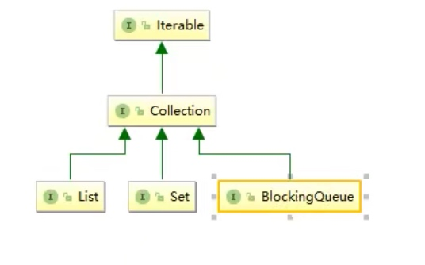

```java
/**
 * 同理可证
 */
public class SetTest {
    public static void main(String[] args) {
        //Set<String> set = new HashSet<>();
        //Set<String> set = Collections.synchronizedSet(new HashSet<>());
        Set<String> set = new CopyOnWriteArraySet<>();

        for (int i = 0; i < 10; i++) {
            new Thread(() -> {
                set.add(UUID.randomUUID().toString().substring(0, 5));
            }, String.valueOf(i)).start();
        }
    }
}
```

#### HashSet的底层原理是什么？

```java
/**
 * hashset 的底层就是 hashmap
 * Constructs a new, empty set; the backing <tt>HashMap</tt> instance has
 * default initial capacity (16) and load factor (0.75).
 */
public HashSet() {
    map = new HashMap<>();
}

// add set 本质就是map key 是无法重复的
public boolean add(E e) {
    return map.put(e, PRESENT)==null;
}
```

### Map不安全

回顾 HashMap 的基本原理

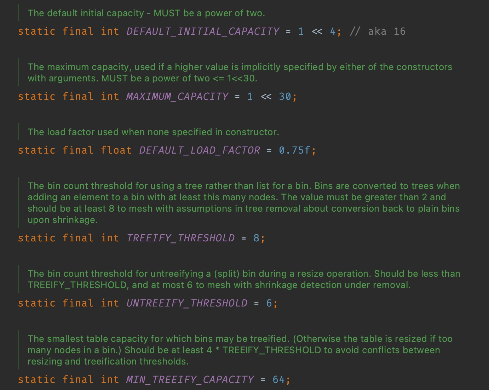

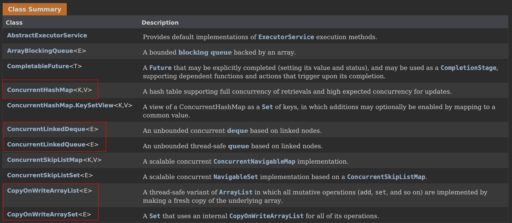


```java
/**
 * 并发修改异常
 */
public class MapTest {
    public static void main(String[] args) {
        /**
         * map 是这样用的吗？ 默认等价于什么？
         * 不是 工作中不是这样子用的
         * 等价于：new HashMap<>(16,0.75)
         *
         * 初始化参数 默认值
         * 加载因子
         * 初始化容量
         */
        //Map<String, String> map = new HashMap<>();
        //Map<String, String> map = Collections.synchronizedMap(new HashMap<>());
        Map<String, String> map = new ConcurrentHashMap<>();

        for (int i = 0; i < 30; i++) {
            new Thread(() -> {
                map.put(Thread.currentThread().getName(), UUID.randomUUID().toString());
                System.out.println(map);
            }, String.valueOf(i)).start();
        }
    }
}
```

## Callable（真的很简单）

> The Callable interface is similar to Runnable, in that both are designed for classes whose instances are potentially executed by another thread. A Runnable, however, does not return a result and cannot throw a checked exception.
> 
> Callable 接口类似于 Runnable，因为两者都是为那些实例可能由另一个线程执行的类而设计的。但是，Runnable 不返回结果，也不能抛出已检查的异常。

- 可以有返回值
- 可以抛出异常
- 方法不同，run \ call

### 代码测试

泛型的参数等于方法的返回值

```java
@FunctionalInterface
public interface Callable<V> {
    /**
     * Computes a result, or throws an exception if unable to do so.
     *
     * @return computed result
     * @throws Exception if unable to compute a result
     */
    V call() throws Exception;
}
```

如果想要自己创建线程，只能使用Thread（还有线程池），Thread只接受Runnable

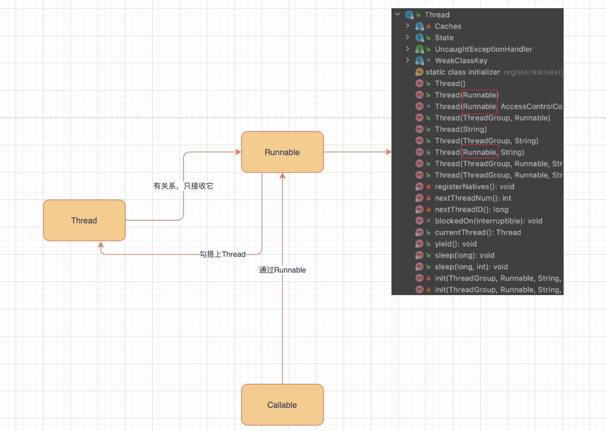

我们传它的实现类进去`FutureTask`

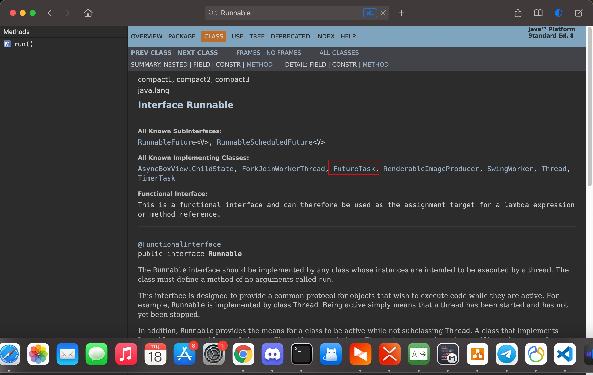

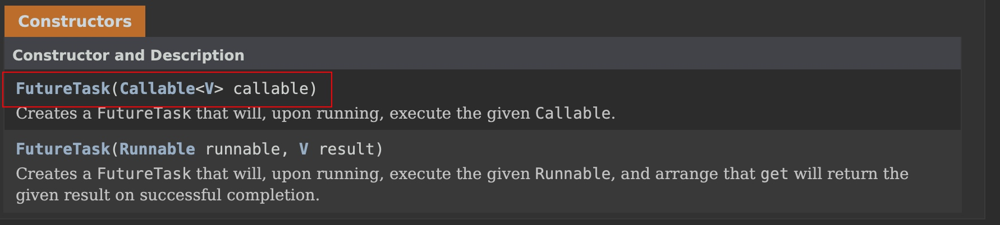

```java
public class CallableTest {
    public static void main(String[] args) throws ExecutionException, InterruptedException {
        //new Thread(new MyThread()).start();
        MyThread m = new MyThread();
        final FutureTask futureTask = new FutureTask(m);
        new Thread(futureTask,"A").start();

        final String o = (String)futureTask.get();
        System.out.println(o);
    }
}

//class MyThread implements Runnable{
//
//    @Override
//    public void run() {
//
//    }
//}

class MyThread implements Callable<String> {

    @Override
    public String call() throws Exception {
        return "123456789";
    }
}
```

```java
public class CallableTest {
    public static void main(String[] args) throws ExecutionException, InterruptedException {
        //new Thread(new MyThread()).start();
        MyThread m = new MyThread();
        final FutureTask futureTask = new FutureTask(m);
        new Thread(futureTask, "A").start();
        new Thread(futureTask, "B").start();// call只会被调用一次，结果会被缓存，提高效率

        final String o = (String) futureTask.get();// 这个get方法可能会产生阻塞，把它放到最后，或者使用异步通信来处理
        System.out.println(o);
    }
}

//class MyThread implements Runnable{
//
//    @Override
//    public void run() {
//
//    }
//}

class MyThread implements Callable<String> {

    @Override
    public String call() throws Exception {
        System.out.println("call");
        return "123456789";
    }
}
```

**细节**

- 有缓存
- 结果可能需要等待，会阻塞

## CountDownLatch、CyclicBarrier、Semaphore

### CountDownLatch

> A synchronization aid that allows one or more threads to wait until a set of operations being performed in other threads completes.
> 
> 一种同步辅助，允许一个或多个线程等待，直到在其他线程中执行的一组操作完成。

```java
/**
 * countDownLatch 计数器
 * <p>
 * 保安要等待6个学生全部出去的之后再关门
 */
public class CountDownLatchDemo {
    public static void main(String[] args) throws InterruptedException {
        // 总数是6
        final CountDownLatch countDownLatch = new CountDownLatch(6);

        for (int i = 0; i < 6; i++) {
            new Thread(() -> {
                System.out.println(Thread.currentThread().getName() + "走了");
                countDownLatch.countDown();
            }, String.valueOf(i)).start();
        }

        countDownLatch.await();//等待计数器归零，然后在向下执行，也就是等待学生都走光了

        System.out.println("保安关门");
    }
}
```

输出结果

```shell
0走了
3走了
2走了
5走了
1走了
4走了
保安关门
```


### CyclicBarrier

> A synchronization aid that allows a set of threads to all wait for each other to reach a common barrier point. CyclicBarriers are useful in programs involving a fixed sized party of threads that must occasionally wait for each other. The barrier is called cyclic because it can be re-used after the waiting threads are released.
> 
> 一种同步辅助工具，它允许一组线程全部等待彼此到达公共屏障点。 CyclicBarriers 在涉及固定大小的线程组的程序中很有用，这些线程必须偶尔相互等待。屏障被称为循环的，因为它可以在等待线程被释放后重新使用。
> 
> 加法计数器

```java
/**
 * 集齐7颗龙珠召唤神龙
 */
public class CyclicBarrierTest {

    public static void main(String[] args) {

        //召唤龙珠的线程
        CyclicBarrier cyclicBarrier = new CyclicBarrier(7, () -> {
            System.out.println("召唤神龙成功");
        });

        for (int i = 0; i < 7; i++) {
            /*
                lambda 能拿到并操作 i 吗？不能
                再怎么说，lambda也是一个类的简写，怎么可以拿到局部变量呢
                除非是使用final修饰，让局部内部类使用
             */

            final int temp = i;
            new Thread(() -> {
                System.out.println(Thread.currentThread().getName() + "收集" + temp + "个龙珠");

                try {
                    cyclicBarrier.await();// 其实就是相当于调用 cyclicBarrier +1
                } catch (InterruptedException e) {
                    e.printStackTrace();
                } catch (BrokenBarrierException e) {
                    e.printStackTrace();
                }
            }, String.valueOf(i)).start();
        }
    }
}
```

输出结果

```shell
0收集0个龙珠
2收集2个龙珠
1收集1个龙珠
4收集4个龙珠
3收集3个龙珠
5收集5个龙珠
6收集6个龙珠
召唤神龙成功
```

如果把

```java
CyclicBarrier cyclicBarrier = new CyclicBarrier(8, () -> {
            System.out.println("召唤神龙成功");
        });
```

此时召唤神龙是不成功的，会一直停在第8颗，也就是一直等待召唤第8颗不成功

```shell
0收集0个龙珠
2收集2个龙珠
1收集1个龙珠
3收集3个龙珠
4收集4个龙珠
5收集5个龙珠
6收集6个龙珠
```

### Semaphore

Semaphore：信号量

> A counting semaphore. Conceptually, a semaphore maintains a set of permits. Each acquire() blocks if necessary until a permit is available, and then takes it. Each release() adds a permit, potentially releasing a blocking acquirer. However, no actual permit objects are used; the Semaphore just keeps a count of the number available and acts accordingly.
> 
> 计数信号量。从概念上讲，信号量维护**一组**许可。如有必要，每个acquire() 都会阻塞，直到获得许可为止，然后获取它。每个 release() 添加一个许可，可能会释放一个阻塞的获取者。但是，没有使用实际的许可对象；信号量只是计算可用的数量并相应地采取行动。

抢车位

6辆车 抢 3个车位

```java
/**
 * 抢车位
 * 6辆车 抢 3个车位
 */
public class SemaphoreDemo {
    public static void main(String[] args) {
        // 线程数量，停车位
        Semaphore semaphore = new Semaphore(3);

        for (int i = 0; i < 6; i++) {
            new Thread(() -> {
                try {
                    // acquire()  得到
                    semaphore.acquire();
                    System.out.println(Thread.currentThread().getName()+"抢到车位");
                    // 停车2秒
                    TimeUnit.SECONDS.sleep(2);
                    System.out.println(Thread.currentThread().getName()+"离开车位");
                } catch (InterruptedException e) {
                    e.printStackTrace();
                }finally {
                    // release()  释放
                    semaphore.release();
                }
            }, String.valueOf(i)).start();
        }
    }
}
```

输出结果

```shell
0抢到车位
2抢到车位
1抢到车位
2离开车位
0离开车位
3抢到车位
1离开车位
4抢到车位
5抢到车位
4离开车位
3离开车位
5离开车位
```

#### 原理

`semaphore.acquire();` 抢占资源，假设已经没有资源了，等待，等待到被释放为止

`semaphore.release();`释放资源，会将当前的信号量释放+1，然后唤醒等待的线程

**作用**

多个共享资源的作用，并发限流，控制最大的线程数

## 读写锁

- 读-读 可以共存
- 读-写 可以共存
- 写-写 不可以共存

同一个概念的不同说法

- 独占锁（写锁）
- 共享锁（读锁）

> Interface ReadWriteLock
> 实现类
> ReentrantReadWriteLock

```java
public class ReadWriteLockDemo {
    public static void main(String[] args) {
        final MyCache myCache = new MyCache();

        // 写入
        for (int i = 0; i < 5; i++) {
            final int temp = i;
            new Thread(() -> {
                myCache.put(temp + "", temp);
            }, String.valueOf(i)).start();
        }

        // 读取
        for (int i = 0; i < 5; i++) {
            final int temp = i;
            new Thread(() -> {
                myCache.get(temp + "");
            }, String.valueOf(i)).start();
        }
    }
}

/**
 * 缓存
 * 读的时候可以被多个线程读，写的时候只能被单个线程写
 */
class MyCache {
    private volatile Map<String, Object> map = new HashMap<>();

    // 存 写
    public void put(String key, Object value) {
        System.out.println(Thread.currentThread().getName() + "写入" + key);
        map.put(key, value);
        System.out.println(Thread.currentThread().getName() + "写入OK");
    }

    // 取 读
    public void get(String key) {
        System.out.println(Thread.currentThread().getName() + "读取" + key);
        final Object o = map.get(key);
        System.out.println(Thread.currentThread().getName() + "读取OK");
    }
}
```

输出结果

线程被插队了。

```shell
0写入0
2写入2
1写入1
1写入OK
4写入4
4写入OK
2写入OK
3写入3
3写入OK
0写入OK
0读取0
0读取OK
1读取1
1读取OK
2读取2
2读取OK
3读取3
3读取OK
4读取4
4读取OK
```

### 使用读写锁

```java
public class ReadWriteLockDemo {
    public static void main(String[] args) {
        final MyCacheLock myCache = new MyCacheLock();

        // 写入
        for (int i = 0; i < 5; i++) {
            final int temp = i;
            new Thread(() -> {
                myCache.put(temp + "", temp);
            }, String.valueOf(i)).start();
        }

        // 读取
        for (int i = 0; i < 5; i++) {
            final int temp = i;
            new Thread(() -> {
                myCache.get(temp + "");
            }, String.valueOf(i)).start();
        }
    }
}

/**
 * 缓存
 * 读的时候可以被多个线程读，写的时候只能被单个线程写
 */
class MyCacheLock {
    private volatile Map<String, Object> map = new HashMap<>();

    // 读写锁，更加细粒度的控制
    private ReadWriteLock readWriteLock = new ReentrantReadWriteLock();

    // 存 写 的时候，只希望，同时只有一个线程写
    public void put(String key, Object value) {
        //readWriteLock.writeLock() 获取写锁
        readWriteLock.writeLock().lock();

        try {
            System.out.println(Thread.currentThread().getName() + "写入" + key);
            map.put(key, value);
            System.out.println(Thread.currentThread().getName() + "写入OK");
        } catch (Exception e) {
            e.printStackTrace();
        } finally {
            readWriteLock.writeLock().unlock();
        }
    }

    // 取 读 所有人都可以读
    public void get(String key) {
        readWriteLock.readLock().lock();
        try {
            System.out.println(Thread.currentThread().getName() + "读取" + key);
            final Object o = map.get(key);
            System.out.println(Thread.currentThread().getName() + "读取OK");
        } catch (Exception e) {
            e.printStackTrace();
        } finally {
            readWriteLock.readLock().unlock();
        }
    }
}
```

输出结果

```shell
0写入0
0写入OK
1写入1
1写入OK
2写入2
2写入OK
3写入3
3写入OK
4写入4
4写入OK
0读取0
0读取OK
1读取1
1读取OK
2读取2
2读取OK
3读取3
3读取OK
4读取4
4读取OK
```

## 阻塞队列

### 阻塞、队列

- 写入：如果队列满了，就必须阻塞
- 读取：如果队列是空的，就必须等待

### BlockingQueue

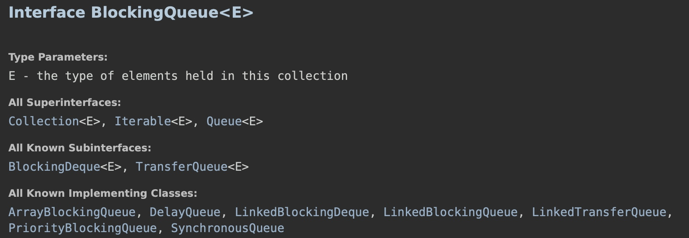

- SynchronousQueue 同步队列
- ArrayBlockingQueue 数组实现的队列
- LinkedBlockingDeque 链表实现的队列
- DelayQueue 延时队列

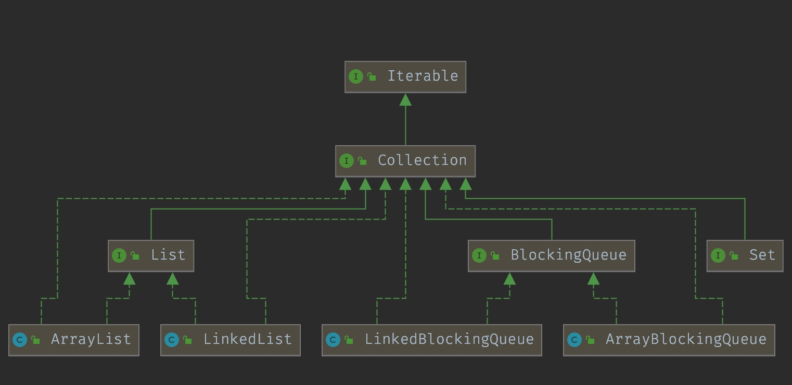

什么情况下会用到阻塞队列

多线程（a-b线程执行顺序），线程池（使用一个队列存储线程）

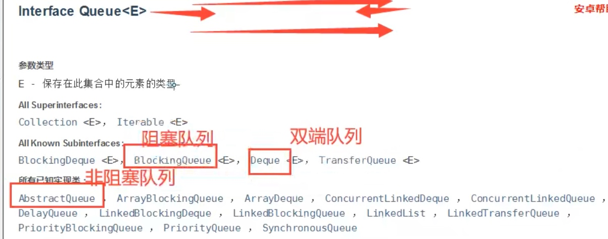

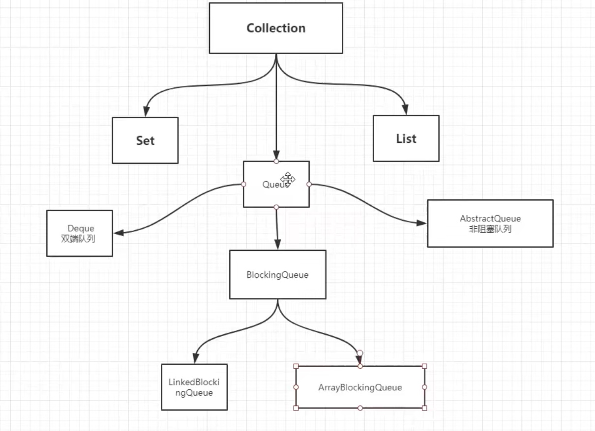


### 学会使用队列

添加、移除

#### 四组API

1. 抛出异常
2. 不会抛出异常
3. 阻塞等待
4. 超时等待


| 方式    | 抛出异常      | 有返回值,不抛出异常 | 阻塞等待     | 超时等待                           |
|-------|-----------|------------|:---------|:-------------------------------|
| 添加    | add("a")  | offer("a") | put("a") | offer("d",2, TimeUnit.SECONDS) |
| 移除    | remove()  | poll()     | take()   | poll(2, TimeUnit.SECONDS)      |
| 判断队列首 | element() | peek()     | -        | -                               |

```java
public class Test {
    public static void main(String[] args) throws Exception {
        test1();
    }

    /**
     * 抛出异常
     */
    public static void test1() {
        // 队列的大小 3 表示只能方三个参数
        final ArrayBlockingQueue arrayBlockingQueue = new ArrayBlockingQueue<>(3);
        arrayBlockingQueue.add("a");
        arrayBlockingQueue.add("b");
        arrayBlockingQueue.add("c");

        // 如果添加的数量超过队列的大小，会抛出异常
        // Exception in thread "main" java.lang.IllegalStateException: Queue full
        //arrayBlockingQueue.add("d");

        System.out.println(arrayBlockingQueue.element());// 查看队首的元素值


        System.out.println(arrayBlockingQueue.remove());
        System.out.println(arrayBlockingQueue.remove());
        System.out.println(arrayBlockingQueue.remove());

        // 如果弹出元素的时候是空的，会抛出异常
        // java.util.NoSuchElementException
        System.out.println(arrayBlockingQueue.remove());
    }

    /**
     * 有返回值，不会抛出异常
     */
    public static void test2() {
        // 队列的大小 3 表示只能方三个参数
        final ArrayBlockingQueue arrayBlockingQueue = new ArrayBlockingQueue<>(3);

        arrayBlockingQueue.offer("a");
        arrayBlockingQueue.offer("b");
        arrayBlockingQueue.offer("c");

        // 如果添加失败返回false，不抛出异常
        //arrayBlockingQueue.offer("d");

        System.out.println(arrayBlockingQueue.peek());// 查看队首元素

        arrayBlockingQueue.poll();
        arrayBlockingQueue.poll();
        arrayBlockingQueue.poll();

        // 取值的时候，如果是队列空的，就返回null
        //arrayBlockingQueue.poll();
    }

    /**
     * 等待 阻塞（一直阻塞）
     */
    public static void test3() throws InterruptedException {
        // 队列的大小 3 表示只能方三个参数
        final ArrayBlockingQueue arrayBlockingQueue = new ArrayBlockingQueue<>(3);

        arrayBlockingQueue.put("a");
        arrayBlockingQueue.put("b");
        arrayBlockingQueue.put("c");

        // 一直阻塞 队列没有位置了
        arrayBlockingQueue.put("d");


        arrayBlockingQueue.take();
        arrayBlockingQueue.take();
        arrayBlockingQueue.take();

        // 一直阻塞 队列是空的
        arrayBlockingQueue.take();
    }

    /**
     * 等待，阻塞（等待超时）
     */
    public static void test4() throws InterruptedException {
        // 队列的大小 3 表示只能方三个参数
        final ArrayBlockingQueue arrayBlockingQueue = new ArrayBlockingQueue<>(3);

        arrayBlockingQueue.offer("a");
        arrayBlockingQueue.offer("b");
        arrayBlockingQueue.offer("c");

        arrayBlockingQueue.offer("d",2, TimeUnit.SECONDS);// 表示如果当前队列阻塞了，我就等待2秒，2秒之后还不能插入，我就不插了


        arrayBlockingQueue.poll();
        arrayBlockingQueue.poll();
        arrayBlockingQueue.poll();

        arrayBlockingQueue.poll(2, TimeUnit.SECONDS);//表示如果超过2秒没有拿到，我就不拿了
    }
}
```

## SynchronousQueue 同步队列

没有容量

进去一个元素，必须等待取出来之后，才能再往里面放一个元素

put(存)、take(取)

```java
/**
 * 同步队列
 * 和其他的BlockingQueue不一样，SynchronousQueue不存储元素，put了一个元素，
 * 必须先take取出来才能接着往里放
 */
public class SynchronousQueueDemo {
    public static void main(String[] args) {
        final BlockingQueue<String> synchronousQueue = new SynchronousQueue();
        new Thread(() -> {
            try {
                System.out.println(Thread.currentThread().getName() + " put 1");
                synchronousQueue.put("1");

                System.out.println(Thread.currentThread().getName() + " put 2");
                synchronousQueue.put("2");

                System.out.println(Thread.currentThread().getName() + " put 3");
                synchronousQueue.put("3");
            } catch (InterruptedException e) {
                e.printStackTrace();
            }
        }, "T1").start();
        new Thread(() -> {
            try {
                TimeUnit.SECONDS.sleep(3);
                System.out.println(Thread.currentThread().getName() + " take " + synchronousQueue.take());

                TimeUnit.SECONDS.sleep(3);
                System.out.println(Thread.currentThread().getName() + " take " + synchronousQueue.take());

                TimeUnit.SECONDS.sleep(3);
                System.out.println(Thread.currentThread().getName() + " take " + synchronousQueue.take());
            } catch (InterruptedException e) {
                e.printStackTrace();
            }
        }, "T2").start();

    }
}
```

输出结果

```shell
T1 put 1
T2 take 1
T1 put 2
T2 take 2
T1 put 3
T2 take 3
```

## 线程池

**三大方法、七大参数、四种拒绝策略**

> 池化技术

程序的运行，本质：占用系统资源，所以我们就要优化系统资源的使用，于是就演变出来一种技术--池化技术

比如，线程池、数据库连接池、对象池（spring ioc）

池化技术：事先准备好一些资源，有人要用，就来我这里拿，用完之后还给我，因为在创建和销毁的时候都会占用系统的资源

默认大小：2

max：xx

线程池的好处：

- 降低资源的消耗
- 提高响应的速度
- 方便管理

**线程复用、可以控制最大并发数、管理线程**

### 线程池的三大方法

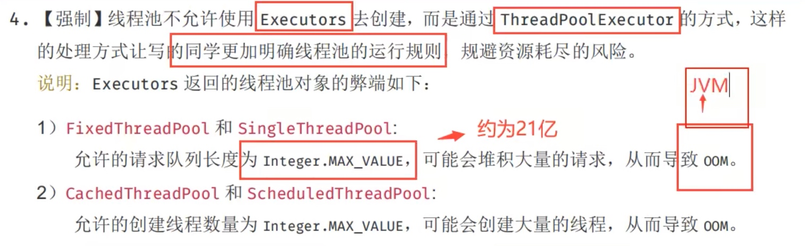

- Executors.newSingleThreadExecutor(); 单个线程的线程池
- Executors.newFixedThreadPool(5); 创建一个固定的线程池的大小
- Executors.newCachedThreadPool(); 可伸缩的，遇强则强，遇弱则弱

**Executors.newSingleThreadExecutor**

```java
/**
 * Collection 有 Collections
 * Array 有 Arrays
 * Executor 有 Executors
 * 工具类
 * <p>
 * 3大方法
 * Executors.newSingleThreadExecutor();
 * Executors.newFixedThreadPool(5);
 * Executors.newCachedThreadPool();
 */
public class Demo01 {
    public static void main(String[] args) {
        //单个线程的线程池
        final ExecutorService executorService = Executors.newSingleThreadExecutor();

        try {
            for (int i = 0; i < 10; i++) {
                executorService.execute(() -> {
                    System.out.println(Thread.currentThread().getName() + " ok");
                });
            }
        } catch (Exception e) {
            e.printStackTrace();
        } finally {
            // 线程池用完，要关闭的
            executorService.shutdown();
        }
    }
}
```

输出结果

```shell
pool-1-thread-1 ok
pool-1-thread-1 ok
pool-1-thread-1 ok
pool-1-thread-1 ok
pool-1-thread-1 ok
pool-1-thread-1 ok
pool-1-thread-1 ok
pool-1-thread-1 ok
pool-1-thread-1 ok
pool-1-thread-1 ok
```

**Executors.newFixedThreadPool**

```java
/**
 * Collection 有 Collections
 * Array 有 Arrays
 * Executor 有 Executors
 * 工具类
 * <p>
 * 3大方法
 * Executors.newSingleThreadExecutor();
 * Executors.newFixedThreadPool(5);
 * Executors.newCachedThreadPool();
 */
public class Demo01 {
    public static void main(String[] args) {
        //单个线程的线程池
        //final ExecutorService executorService = Executors.newSingleThreadExecutor();
        final ExecutorService executorService = Executors.newFixedThreadPool(5);

        try {
            for (int i = 0; i < 10; i++) {
                executorService.execute(() -> {
                    System.out.println(Thread.currentThread().getName() + " ok");
                });
            }
        } catch (Exception e) {
            e.printStackTrace();
        } finally {
            // 线程池用完，要关闭的
            executorService.shutdown();
        }

        //// 创建一个固定的线程池的大小
        //Executors.newFixedThreadPool(5);
        //
        //// 可伸缩的，遇强则强，遇弱则弱
        //Executors.newCachedThreadPool();
    }
}
```

输出结果

```shell
pool-1-thread-1 ok
pool-1-thread-3 ok
pool-1-thread-2 ok
pool-1-thread-5 ok
pool-1-thread-4 ok
pool-1-thread-5 ok
pool-1-thread-2 ok
pool-1-thread-1 ok
pool-1-thread-5 ok
pool-1-thread-4 ok
```

**Executors.newCachedThreadPool**

```java
/**
 * Collection 有 Collections
 * Array 有 Arrays
 * Executor 有 Executors
 * 工具类
 * <p>
 * 3大方法
 * Executors.newSingleThreadExecutor();
 * Executors.newFixedThreadPool(5);
 * Executors.newCachedThreadPool();
 */
public class Demo01 {
    public static void main(String[] args) {
        //单个线程的线程池
        //final ExecutorService executorService = Executors.newSingleThreadExecutor();
        //final ExecutorService executorService = Executors.newFixedThreadPool(5);
        final ExecutorService executorService = Executors.newCachedThreadPool();

        try {
            for (int i = 0; i < 10; i++) {
                executorService.execute(() -> {
                    System.out.println(Thread.currentThread().getName() + " ok");
                });
            }
        } catch (Exception e) {
            e.printStackTrace();
        } finally {
            // 线程池用完，要关闭的
            executorService.shutdown();
        }

        //// 创建一个固定的线程池的大小
        //Executors.newFixedThreadPool(5);
        //
        //// 可伸缩的，遇强则强，遇弱则弱
        //Executors.newCachedThreadPool();
    }
}
```

输出结果

```shell
pool-1-thread-1 ok
pool-1-thread-2 ok
pool-1-thread-3 ok
pool-1-thread-4 ok
pool-1-thread-4 ok
pool-1-thread-5 ok
pool-1-thread-3 ok
pool-1-thread-2 ok
pool-1-thread-3 ok
pool-1-thread-5 ok
```

### 线程池的七大参数

源码分析：

```java
//newSingleThreadExecutor
public static ExecutorService newSingleThreadExecutor() {
    return new FinalizableDelegatedExecutorService
        (new ThreadPoolExecutor(1, 1,
                                0L, TimeUnit.MILLISECONDS,
                                new LinkedBlockingQueue<Runnable>()));
}

//newFixedThreadPool
public static ExecutorService newFixedThreadPool(int nThreads) {
    return new ThreadPoolExecutor(nThreads, nThreads,
                                  0L, TimeUnit.MILLISECONDS,
                                  new LinkedBlockingQueue<Runnable>());
}

//newCachedThreadPool
public static ExecutorService newCachedThreadPool() {
    return new ThreadPoolExecutor(0, Integer.MAX_VALUE,// 约等于21亿
                                  60L, TimeUnit.SECONDS,
                                  new SynchronousQueue<Runnable>());
}
```

本质：ThreadPoolExecutor

```java
public ThreadPoolExecutor(int corePoolSize, // 核心线程池大小
                          int maximumPoolSize, // 最大核心线程池大小
                          long keepAliveTime, // 超时了没有调用就会被释放
                          TimeUnit unit,  // 超时的单位
                          BlockingQueue<Runnable> workQueue, // 阻塞队列
                          ThreadFactory threadFactory, // 线程工厂，创建线程
                          RejectedExecutionHandler handler) { // 拒绝策略
    if (corePoolSize < 0 ||
        maximumPoolSize <= 0 ||
        maximumPoolSize < corePoolSize ||
        keepAliveTime < 0)
        throw new IllegalArgumentException();
    if (workQueue == null || threadFactory == null || handler == null)
        throw new NullPointerException();
    this.acc = System.getSecurityManager() == null ?
            null :
            AccessController.getContext();
    this.corePoolSize = corePoolSize;
    this.maximumPoolSize = maximumPoolSize;
    this.workQueue = workQueue;
    this.keepAliveTime = unit.toNanos(keepAliveTime);
    this.threadFactory = threadFactory;
    this.handler = handler;
}
```

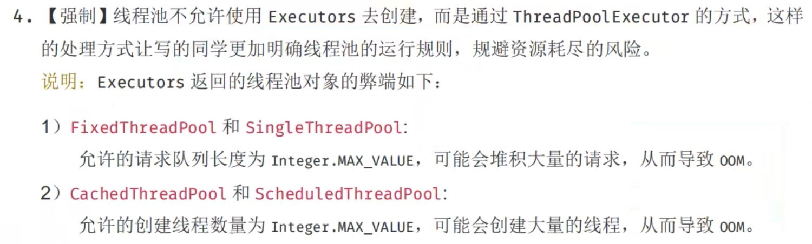

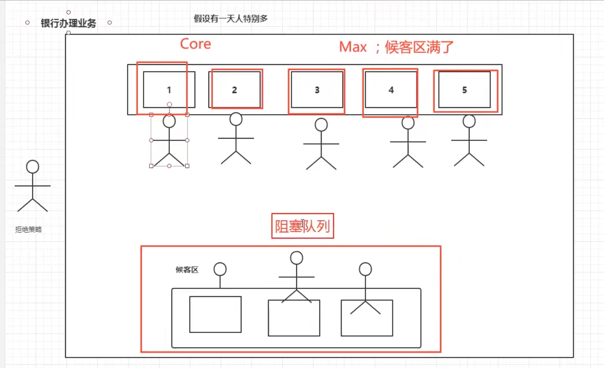

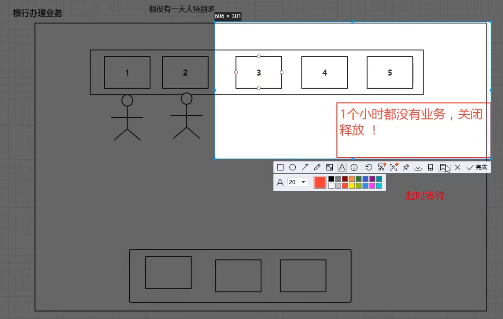

### 四种拒绝策略

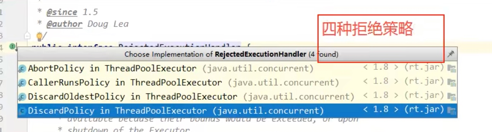

1. ThreadPoolExecutor.AbortPolicy

默认的拒绝策略 银行满了，但是还有人进来，不处理这个人的业务，抛出异常

```java
public class Demo01 {
    public static void main(String[] args) {
        //单个线程的线程池
        //final ExecutorService executorService = Executors.newSingleThreadExecutor();
        //final ExecutorService executorService = Executors.newFixedThreadPool(5);
        //final ExecutorService executorService = Executors.newCachedThreadPool();

        // 自定义线程池
        // 工作中只会用 ThreadPoolExecutor 上面三个不安全
        final ExecutorService executorService = new ThreadPoolExecutor(
                2,
                5,
                3,
                TimeUnit.SECONDS,
                new LinkedBlockingQueue<>(3),// 候客区等待的队列
                Executors.defaultThreadFactory(), // 默认的线程工厂
                new ThreadPoolExecutor.AbortPolicy() // 默认的拒绝策略 银行满了，但是还有人进来，不处理这个人的业务，抛出异常
                );

        try {
            /**
             * 如果是2个以下，就是启动核心的两个线程
             * 如果是5个以下，就会启动最大线程
             * 如果是5个以上，8个以下，超过5个的就会进入阻塞队列
             * 使用了ThreadPoolExecutor.AbortPolicy这个策略，如果超过8个，就会抛出异常
             */
            for (int i = 0; i < 9; i++) {
                executorService.execute(() -> {
                    System.out.println(Thread.currentThread().getName() + " ok");
                });
            }
        } catch (Exception e) {
            e.printStackTrace();
        } finally {
            // 线程池用完，要关闭的
            executorService.shutdown();
        }

        //// 创建一个固定的线程池的大小
        //Executors.newFixedThreadPool(5);
        //
        //// 可伸缩的，遇强则强，遇弱则弱
        //Executors.newCachedThreadPool();
    }
}
```

```shell
pool-1-thread-2 ok
pool-1-thread-4 ok
pool-1-thread-3 ok
pool-1-thread-1 ok
pool-1-thread-3 ok
pool-1-thread-4 ok
pool-1-thread-2 ok
pool-1-thread-5 ok
java.util.concurrent.RejectedExecutionException: Task com.example.juc.pool.Demo01$$Lambda$1/381259350@3feba861 rejected from java.util.concurrent.ThreadPoolExecutor@5b480cf9[Running, pool size = 5, active threads = 1, queued tasks = 0, completed tasks = 7]
	at java.util.concurrent.ThreadPoolExecutor$AbortPolicy.rejectedExecution(ThreadPoolExecutor.java:2063)
	at java.util.concurrent.ThreadPoolExecutor.reject(ThreadPoolExecutor.java:830)
	at java.util.concurrent.ThreadPoolExecutor.execute(ThreadPoolExecutor.java:1379)
	at com.example.juc.pool.Demo01.main(Demo01.java:43)
```

2. ThreadPoolExecutor.CallerRunsPolicy

哪来的去哪里 main来到只能会到main线程执行

```java
public class Demo02 {
    public static void main(String[] args) {
        //单个线程的线程池
        //final ExecutorService executorService = Executors.newSingleThreadExecutor();
        //final ExecutorService executorService = Executors.newFixedThreadPool(5);
        //final ExecutorService executorService = Executors.newCachedThreadPool();

        // 自定义线程池
        // 工作中只会用 ThreadPoolExecutor 上面三个不安全
        final ExecutorService executorService = new ThreadPoolExecutor(
                2,
                5,
                3,
                TimeUnit.SECONDS,
                new LinkedBlockingQueue<>(3),// 候客区等待的队列
                Executors.defaultThreadFactory(), // 默认的线程工厂
                new ThreadPoolExecutor.CallerRunsPolicy() // 银行满了，但是还有人进来，哪来的去哪里 main来到只能会到main线程执行
                );

        try {
            /**
             * 如果是2个以下，就是启动核心的两个线程
             * 如果是5个以下，就会启动最大线程
             * 如果是5个以上，8个以下，超过5个的就会进入阻塞队列
             * 如果超过8个，就会抛出异常
             */
            for (int i = 0; i < 9; i++) {
                executorService.execute(() -> {
                    System.out.println(Thread.currentThread().getName() + " ok");
                });
            }
        } catch (Exception e) {
            e.printStackTrace();
        } finally {
            // 线程池用完，要关闭的
            executorService.shutdown();
        }
    }
}
```

输出结果

```shell
pool-1-thread-1 ok
pool-1-thread-3 ok
main ok ## main线程调用的线程池线程，只能会到mian线程执行
pool-1-thread-2 ok
pool-1-thread-5 ok
pool-1-thread-3 ok
pool-1-thread-1 ok
pool-1-thread-4 ok
pool-1-thread-5 ok
pool-1-thread-2 ok
```

3. ThreadPoolExecutor.DiscardPolicy

不会抛出异常，丢掉任务，任务不会执行

```java
public class Demo03 {
    public static void main(String[] args) {
        //单个线程的线程池
        //final ExecutorService executorService = Executors.newSingleThreadExecutor();
        //final ExecutorService executorService = Executors.newFixedThreadPool(5);
        //final ExecutorService executorService = Executors.newCachedThreadPool();

        // 自定义线程池
        // 工作中只会用 ThreadPoolExecutor 上面三个不安全
        final ExecutorService executorService = new ThreadPoolExecutor(
                2,
                5,
                3,
                TimeUnit.SECONDS,
                new LinkedBlockingQueue<>(3),// 候客区等待的队列
                Executors.defaultThreadFactory(), // 默认的线程工厂
                new ThreadPoolExecutor.DiscardPolicy() // 银行满了，但是还有人进来，不会抛出异常，丢掉任务，任务不会执行
                );

        try {
            /**
             * 如果是2个以下，就是启动核心的两个线程
             * 如果是5个以下，就会启动最大线程
             * 如果是5个以上，8个以下，超过5个的就会进入阻塞队列
             * 如果超过8个，就会抛出异常
             */
            for (int i = 0; i < 9; i++) {
                executorService.execute(() -> {
                    System.out.println(Thread.currentThread().getName() + " ok");
                });
            }
        } catch (Exception e) {
            e.printStackTrace();
        } finally {
            // 线程池用完，要关闭的
            executorService.shutdown();
        }
    }
}
```

4. ThreadPoolExecutor.CallerRunsPolicy

队列满了，尝试和最早的竞争，如果竞争失败了就丢掉，竞争成功了就执行，不会抛出异常

```java
public class Demo02 {
    public static void main(String[] args) {
        //单个线程的线程池
        //final ExecutorService executorService = Executors.newSingleThreadExecutor();
        //final ExecutorService executorService = Executors.newFixedThreadPool(5);
        //final ExecutorService executorService = Executors.newCachedThreadPool();

        // 自定义线程池
        // 工作中只会用 ThreadPoolExecutor 上面三个不安全
        final ExecutorService executorService = new ThreadPoolExecutor(
                2,
                5,
                3,
                TimeUnit.SECONDS,
                new LinkedBlockingQueue<>(3),// 候客区等待的队列
                Executors.defaultThreadFactory(), // 默认的线程工厂
                new ThreadPoolExecutor.CallerRunsPolicy() // 队列满了，尝试和最早的竞争，如果竞争失败了就丢掉，竞争成功了就执行，不会抛出异常
                );

        try {
            /**
             * 如果是2个以下，就是启动核心的两个线程
             * 如果是5个以下，就会启动最大线程
             * 如果是5个以上，8个以下，超过5个的就会进入阻塞队列
             * 如果超过8个，就会抛出异常
             */
            for (int i = 0; i < 9; i++) {
                executorService.execute(() -> {
                    System.out.println(Thread.currentThread().getName() + " ok");
                });
            }
        } catch (Exception e) {
            e.printStackTrace();
        } finally {
            // 线程池用完，要关闭的
            executorService.shutdown();
        }
    }
}
```

### 最大线程应该如何定义

1. CPU 密集型

看电脑可以并行多少条线程 几核CPU就是几个线程

`Runtime.getRuntime().availableProcessors()`可以获取到是几核CPU

```java
final ExecutorService executorService = new ThreadPoolExecutor(
            2,
            Runtime.getRuntime().availableProcessors(),
            3,
            TimeUnit.SECONDS,
            new LinkedBlockingQueue<>(3),// 候客区等待的队列
            Executors.defaultThreadFactory(), // 默认的线程工厂
            new ThreadPoolExecutor.DiscardOldestPolicy() // 默认的拒绝策略 银行满了，但是还有人进来，不会抛出异常，丢掉任务，任务不会执行
            );
```

2. IO 密集型

判断你程序中十分耗IO的线程有多少个，在这个基础上设置，一般是2倍

程序有15个大型任务，IO十分占用资源，所以至少需要15个线程去处理

## 四大函数式接口（重点、简单、必须掌握）

新时代的程序员：lambda表达式、链式编程、函数式接口、Stream流式计算

### 函数式接口

只有一个方法的接口

最经典的就是：Runnable，超级多，

简化编程模型，在新版本的框架底层大量应用
```java
@FunctionalInterface
public interface Runnable {
    /**
     * When an object implementing interface <code>Runnable</code> is used
     * to create a thread, starting the thread causes the object's
     * <code>run</code> method to be called in that separately executing
     * thread.
     * <p>
     * The general contract of the method <code>run</code> is that it may
     * take any action whatsoever.
     *
     * @see     java.lang.Thread#run()
     */
    public abstract void run();
}
```

forEach(消费者类的函数式接口)

```java
@Override
public void forEach(Consumer<? super E> action) {
    Objects.requireNonNull(action);
    final int expectedModCount = modCount;
    @SuppressWarnings("unchecked")
    final E[] elementData = (E[]) this.elementData;
    final int size = this.size;
    for (int i=0; modCount == expectedModCount && i < size; i++) {
        action.accept(elementData[i]);
    }
    if (modCount != expectedModCount) {
        throw new ConcurrentModificationException();
    }
}

@FunctionalInterface
public interface Consumer<T> {
}
```

四大原生的函数式接口

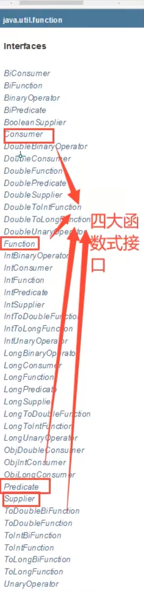


### Function

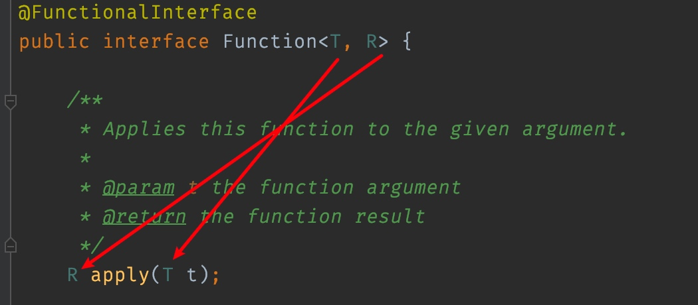

```java
/**
 * Function函数型接口
 * 有一个输入参数，有一个输出参数
 */
public class Demo01 {
    public static void main(String[] args) {
        /**
         * 工具类：输出输入的值
         */
        final Function function1 = new Function<String, String>() {
            @Override
            public String apply(String s) {
                return s;
            }
        };

        System.out.println(function1.apply("dadfaf"));

        /**
         * 工具类：输出输入的值
         * 改成lambda表达式
         */
        final Function function2 = (str) -> {
            return str;
        };

        System.out.println(function2.apply("aadsfs"));
    }
}
```

### Predicate

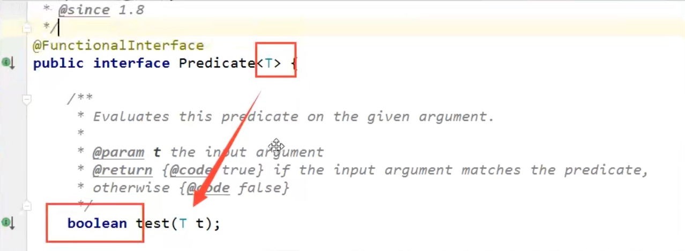

```java
/**
 * 断定型接口：有一个输入参数，返回值只能是布尔值
 */
public class Demo02 {
    public static void main(String[] args) {
        /**
         * 判断字符串是否为空
         */
        final Predicate<String> predicate1 = new Predicate<String>() {
            @Override
            public boolean test(String str) {
                return str.isEmpty();
            }
        };

        System.out.println(predicate1.test("12323"));

        /**
         * 判断字符串是否为空
         * lambda表达式
         */
        final Predicate<String> predicate2 = (str) -> {
            return str.isEmpty();
        };

        System.out.println(predicate2.test("12323"));
    }
}
```


### Consumer

消费型接口

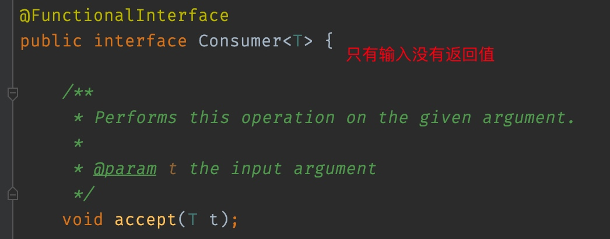

```java
/**
 * 消费型接口，只有输入，没有返回值
 */
public class Demo03 {
    public static void main(String[] args) {
        /**
         * 打印字符串
         */
        final Consumer<String> stringConsumer1 = new Consumer<String>() {

            @Override
            public void accept(String s) {
                System.out.println(s);
            }
        };

        stringConsumer1.accept("safafafa");


        /**
         * lambda表达式方式
         */
        final Consumer<String> stringConsumer2 = (s) -> {
            System.out.println(s);
        };

        stringConsumer2.accept("safafafa");
    }
}
```

### Supplier

供给型接口：没有参数只有返回值

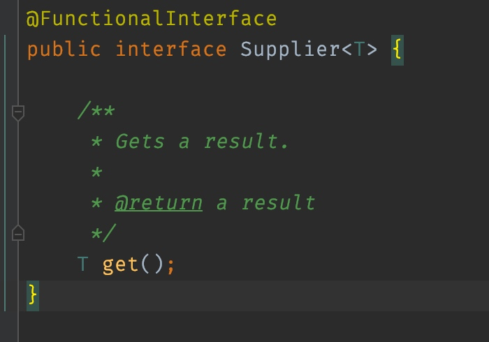

```java
/**
 * 供给型接口：没有参数只有返回值
 */
public class Demo04 {
    public static void main(String[] args) {
        final Supplier<Integer> stringSupplier1 = new Supplier<Integer>() {

            @Override
            public Integer get() {
                System.out.println("get()");
                return 1024;
            }
        };

        System.out.println(stringSupplier1.get());

        /**
         * lambda表达式
         */
        final Supplier<Integer> stringSupplier2 = () -> {
            System.out.println("get()");
            return 1024;
        };

        System.out.println(stringSupplier2.get());
    }
}
```

### 总结四个函数编程接口

在传统的**泛型、枚举、反射**的基础上，增加**lambda表达式、链式编程、函数式编程、Stream流式计算**

简化编程模型

## Stream流式计算

### 什么是Stream流式计算

大数据时代：存储+计算

存储：集合框架、mysql本质就是存储东西的

计算都应该交给流来操作

### Package java.util.stream

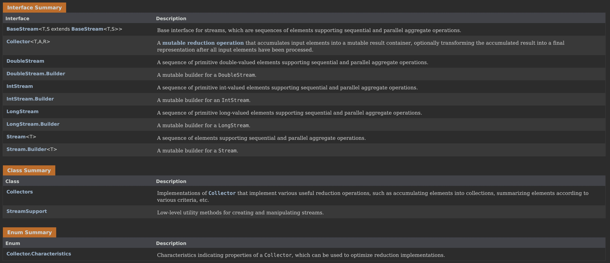

### 使用

```java
/**
 * 题目要求：一分之内完成此题，只能用一行代码实现
 * 现在有5个用户，筛选：
 * 1 ID必须是偶数
 * 2 年龄必须是大于23岁
 * 3 用户名转为大写字母
 * 4 用户名字倒着排序
 * 5 只输出一个用户
 */
public class Test {
    public static void main(String[] args) {
        final User user1 = new User(1, "a", 21);
        final User user2 = new User(2, "b", 22);
        final User user3 = new User(3, "c", 23);
        final User user4 = new User(4, "d", 24);
        final User user5 = new User(5, "e", 25);
        final User user6 = new User(6, "f", 26);

        // 集合就是存储的
        final List<User> list = Arrays.asList(user1, user2, user3, user4, user5, user6);

        // 计算交给Stream流
        list.stream()
                // ID必须是偶数
                .filter(u -> {
                    return u.getId() % 2 == 0;
                })
                // 年龄必须是大于23岁
                .filter(u -> {
                    return u.getAge() > 23;
                })
                // 用户名转为大写字母
                .map(u -> {
                    return u.getName().toUpperCase();
                })
                // 用户名字倒着排序
                .sorted((a, b) -> {
                    return b.compareTo(a);
                })
                // 只输出一个用户
                .limit(1)
                .forEach(System.out::println);
    }
}
```

## 分支合并 ForkJoin

### 什么是ForkJoin

ForkJoin在JDK1.7之后出现的，并行执行任务，提高效率。大数据量

大数据：Map Reduce（把大任务拆分成小任务）

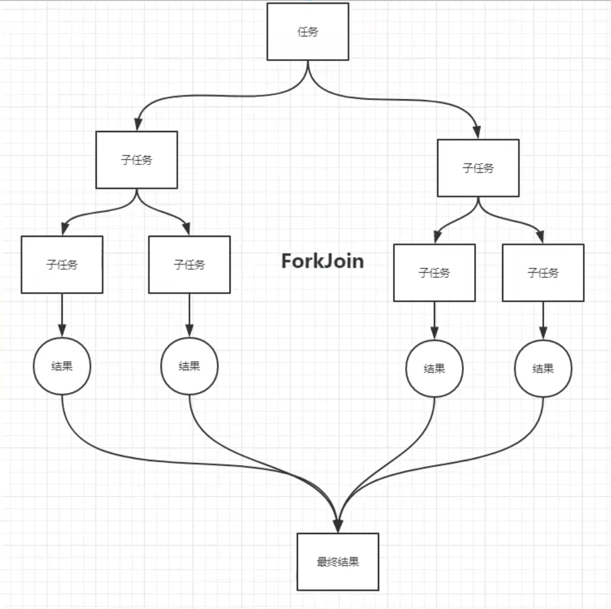

### ForkJoin特点

工作窃取

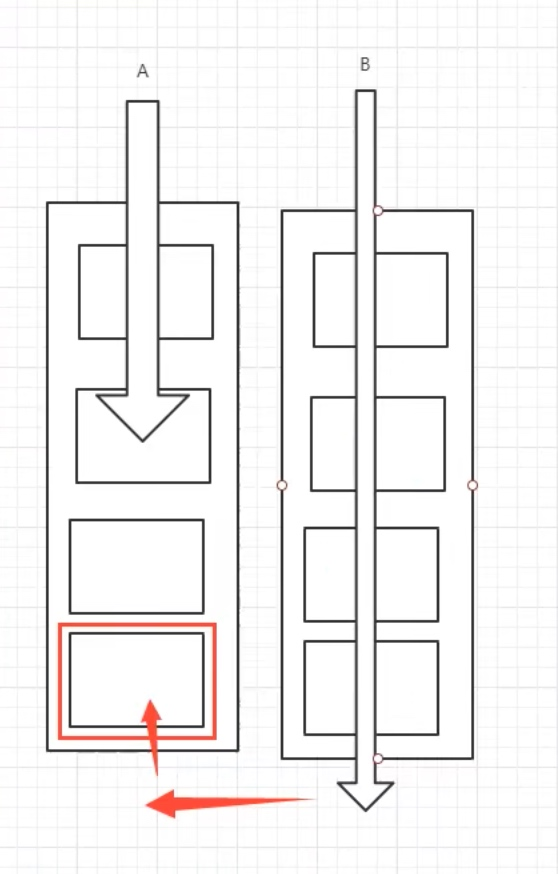

A、B两个线程执行任务，B任务执行完了，就会窃取A位完成的任务过来执行，不让B线程等待。

这个里面维护的都是双端队列（可以从上面取，也可以从下面取）

### ForkJoin使用

java.util.concurrent.ForkJoinPool 的两个接口

- Executor
- ExecutorService

执行

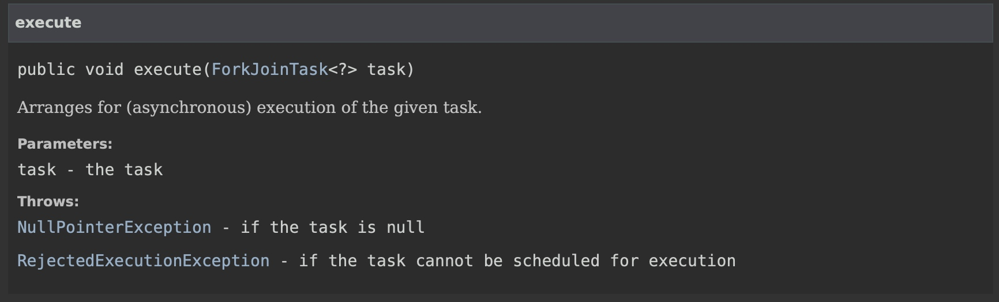

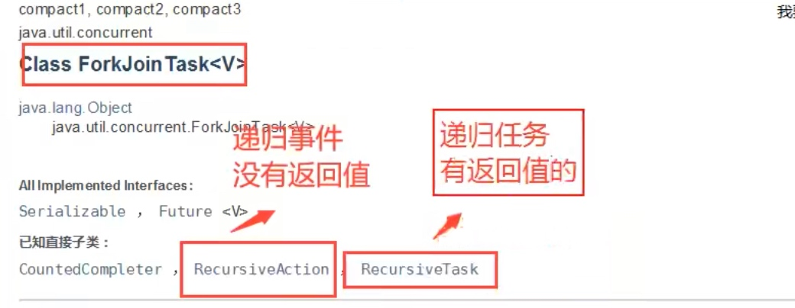

ForkJoinDemo 求和计算任务

```java
/**
 * 求和计算的任务
 * 3000 6000(ForkJoin) 9000(Stream并行流)
 * <p>
 * 如何使用forkjoin
 * 1 forkjoinpool 通过它来执行
 * 2 计算任务 forkjoinpool.execute(ForkJoinTask\<\?\> task)
 * 3 计算类继承RecursiveTask
 */
public class ForkJoinDemo extends RecursiveTask<Long> {

    private long start;
    private long end;

    // 临界值
    private long temp = 10000L;

    public ForkJoinDemo(long start, long end) {
        this.start = start;
        this.end = end;
    }

    /**
     * 并行计算的方法
     *
     * @return
     */
    @Override
    protected Long compute() {
        if (end - start < temp) {
            // 如果小于临界值，正常计算
            long sum = 0L;
            //计算10亿的求和
            for (long i = start; i <= end; i++) {
                sum += i;
            }
            return sum;
        } else { // 像递归
            // 如果求和量超过temp规定的值，就使用分支合并运算
            final long middle = (start + end) / 2; // 中间值
            final ForkJoinDemo task1 = new ForkJoinDemo(start, middle);
            task1.fork();//拆分任务，把任务压入线程队列

            final ForkJoinDemo task2 = new ForkJoinDemo(middle, end);
            task2.fork();//拆分任务，把任务压入线程队列

            return task1.join() + task2.join();//汇总计算结果
        }
    }
}
```

测试类

```java
/**
 * 3000 6000(ForkJoin) 9000(Stream并行流)
 */
public class Test {
    public static void main(String[] args) throws Exception {
        //test01(); // sum = 499999999500000000，时间：5998

        //test02(); // sum = 500065535999828224，时间：138

        test03(); // sum = 500000000500000000，时间：175

    }

    /**
     * 普通程序员
     */
    public static void test01() {
        final long start = System.currentTimeMillis();
        Long sum = 0L;
        for (Long i = 1L; i < 10_0000_0000; i++) {
            sum += i;
        }

        final long end = System.currentTimeMillis();
        System.out.println("sum = " + sum + "，时间：" + (end - start));
    }

    /**
     * 会使用ForkJoin
     */
    public static void test02() throws ExecutionException, InterruptedException {
        final long start = System.currentTimeMillis();

        final ForkJoinPool forkJoinPool = new ForkJoinPool();
        final ForkJoinTask<Long> task = new ForkJoinDemo(0, 10_0000_0000);
        final ForkJoinTask<Long> submit = forkJoinPool.submit(task);// execute是同步的， submit提交的任务是异步的

        final Long sum = submit.get();

        final long end = System.currentTimeMillis();
        System.out.println("sum = " + sum + "，时间：" + (end - start));
    }

    /**
     * Stream 并行流
     */
    public static void test03() {
        final long start = System.currentTimeMillis();

        //IntStream
        //DoubleStream

        // range 不包含
        // rangeClosed 包含 (]
        final long sum = LongStream.rangeClosed(0L, 10_0000_0000).parallel().reduce(0, Long::sum);

        final long end = System.currentTimeMillis();
        System.out.println("sum = " + sum + "，时间：" + (end - start));
    }
}
```

## 异步回调

Future 设计的初衷：对将来的某个时间的结果进行建模

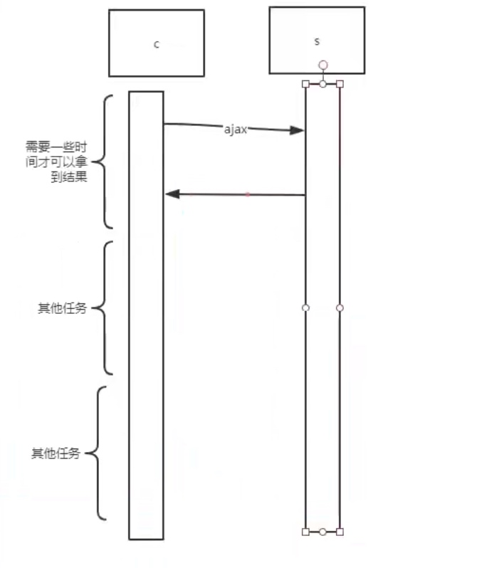

> A Future that may be explicitly completed (setting its value and status), and may be used as a CompletionStage, supporting dependent functions and actions that trigger upon its completion.
> When two or more threads attempt to complete, completeExceptionally, or cancel a CompletableFuture, only one of them succeeds.
> 可以显式完成的 Future（设置其值和状态），并且可以用作 CompletionStage，支持在完成时触发的依赖功能和操作。
> 当两个或多个线程尝试完成、完成异常或取消 CompletableFuture 时，只有其中一个成功。

```java
/**
 * 异步调用
 * 异步执行
 * 成功回调
 * 失败回调
 */
public class Demo01 {
    public static void main(String[] args) throws ExecutionException, InterruptedException {
        //test01();

        test02();
    }

    /**
     * 有返回值的异步调用
     * @throws InterruptedException
     * @throws ExecutionException
     */
    private static void test02() throws InterruptedException, ExecutionException {
        //有返回结果的异步回调
        // ajax 一般会有success failed
        final CompletableFuture<Integer> objectCompletableFuture = CompletableFuture.supplyAsync(() -> {
            System.out.println(Thread.currentThread().getName());
            //int i = 10 / 0;// 如果出现异常，就会回调为233
            return 1024;// 成功的返回值
        });

        final Integer integer = objectCompletableFuture.whenComplete((t, u) -> {
            System.out.println(t);//获取得到的正常的返回结果
            System.out.println(u);
        }).exceptionally((e) -> {
            System.out.println(e.getMessage());
            return 233;// 失败的返回值
        }).get();

        System.out.println(integer);
    }

    /**
     * 没有返回值的异步回调
     *
     * @throws InterruptedException
     * @throws ExecutionException
     */
    private static void test01() throws InterruptedException, ExecutionException {
        // 发起一个请求 没有返回值的
        final CompletableFuture<Void> objectCompletableFuture = CompletableFuture.runAsync(() -> {
            try {
                TimeUnit.SECONDS.sleep(2);
            } catch (InterruptedException e) {
                e.printStackTrace();
            }
            System.out.println(Thread.currentThread().getName());
        });

        System.out.println("1111");

        objectCompletableFuture.get(); //阻塞获取执行结果
    }
}
```

## JMM

请你谈谈你对volatile的理解

volatile是Java虚拟机提供的**轻量级的同步机制**

- 保证可见性
- 不保证原子性
- 禁止指令重拍

当谈到怎么保证可见性的时候，就要说到JMM了。

### 什么是JMM

JVM 是Java虚拟机

JMM 是Java内存模型，不存在的东西，概念，约定


**关于JMM的一些同步的约定**

线程不会直接操作主存的中的共享变量，而是在自己的工作内存中持有一份主存中变量的复制版

1. 线程解锁前，必须把共享变量**立刻**刷回主存
2. 线程加锁前，必须读取主存中的最新值到工作内存中
3. 加锁和解锁是同一把锁

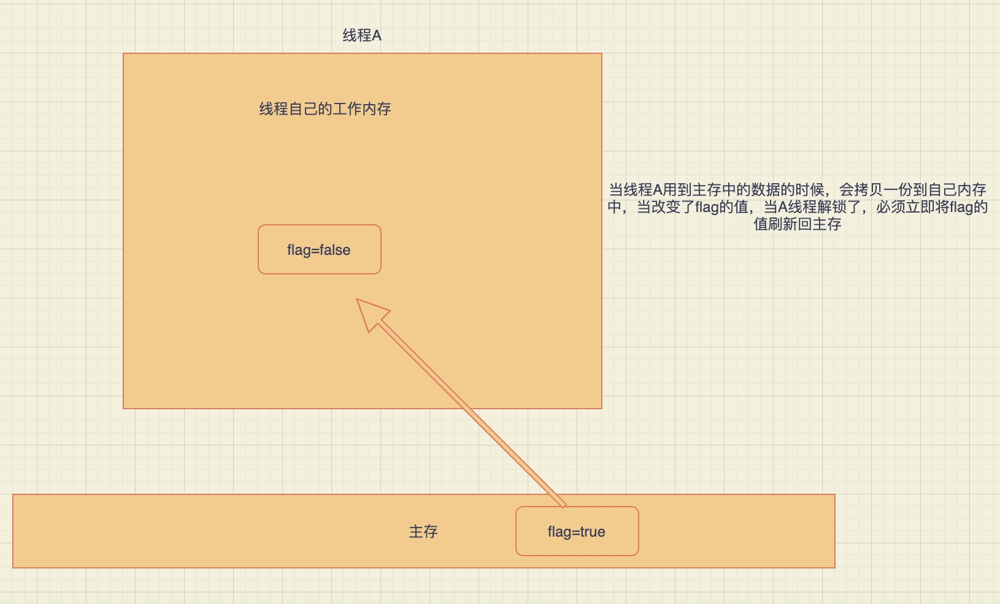

线程可以分为 工作内存 和 主内存

8种操作

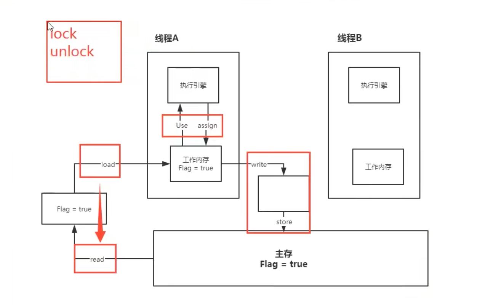

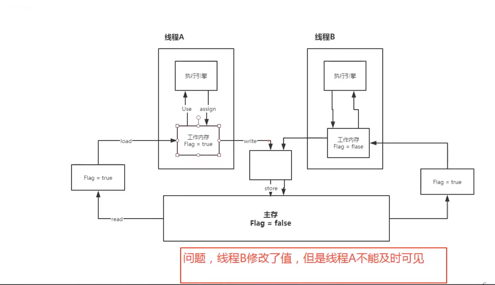

**内存交互操作有8种，虚拟机实现必须保证每一个操作都是原子的，不可在分的（对于double和long类型的变量来说，load、store、read和write操作在某些平台上允许例外）**

- lock     （锁定）：作用于主内存的变量，把一个变量标识为线程独占状态
- unlock （解锁）：作用于主内存的变量，它把一个处于锁定状态的变量释放出来，释放后的变量才可以被其他线程锁定
- read    （读取）：作用于主内存变量，它把一个变量的值从主内存传输到线程的工作内存中，以便随后的load动作使用
- load     （载入）：作用于工作内存的变量，它把read操作从主存中变量放入工作内存中
- use      （使用）：作用于工作内存中的变量，它把工作内存中的变量传输给执行引擎，每当虚拟机遇到一个需要使用到变量的值，就会使用到这个指令
- assign  （赋值）：作用于工作内存中的变量，它把一个从执行引擎中接受到的值放入工作内存的变量副本中
- store    （存储）：作用于主内存中的变量，它把一个从工作内存中一个变量的值传送到主内存中，以便后续的write使用
- write 　（写入）：作用于主内存中的变量，它把store操作从工作内存中得到的变量的值放入主内存的变量中

**JMM对这八种指令的使用，制定了如下规则：**

- 不允许read和load、store和write操作之一单独出现。即使用了read必须load，使用了store必须write
- 不允许线程丢弃他最近的assign操作，即工作变量的数据改变了之后，必须告知主存
- 不允许一个线程将没有assign的数据从工作内存同步回主内存
- 一个新的变量必须在主内存中诞生，不允许工作内存直接使用一个未被初始化的变量。就是怼变量实施use、store操作之前，必须经过assign和load操作
- 一个变量同一时间只有一个线程能对其进行lock。多次lock后，必须执行相同次数的unlock才能解锁
- 如果对一个变量进行lock操作，会清空所有工作内存中此变量的值，在执行引擎使用这个变量前，必须重新load或assign操作初始化变量的值
- 如果一个变量没有被lock，就不能对其进行unlock操作。也不能unlock一个被其他线程锁住的变量
- 对一个变量进行unlock操作之前，必须把此变量同步回主内存

### 代码示例

```java
/**
 * 试验：当子线程执行之后，主线程修改了num的值，那么应该将子线程的while循环停止
 * 但是事实没有停止
 */
public class JMMDemo {
    private static int num = 0;

    public static void main(String[] args) {
        new Thread(() -> {
            while (num == 0) {

            }
        }).start();

        try {
            TimeUnit.SECONDS.sleep(1);
        } catch (InterruptedException e) {
            e.printStackTrace();
        }

        num = 1;
        System.out.println(num);
    }
}
```

程序并没有停止

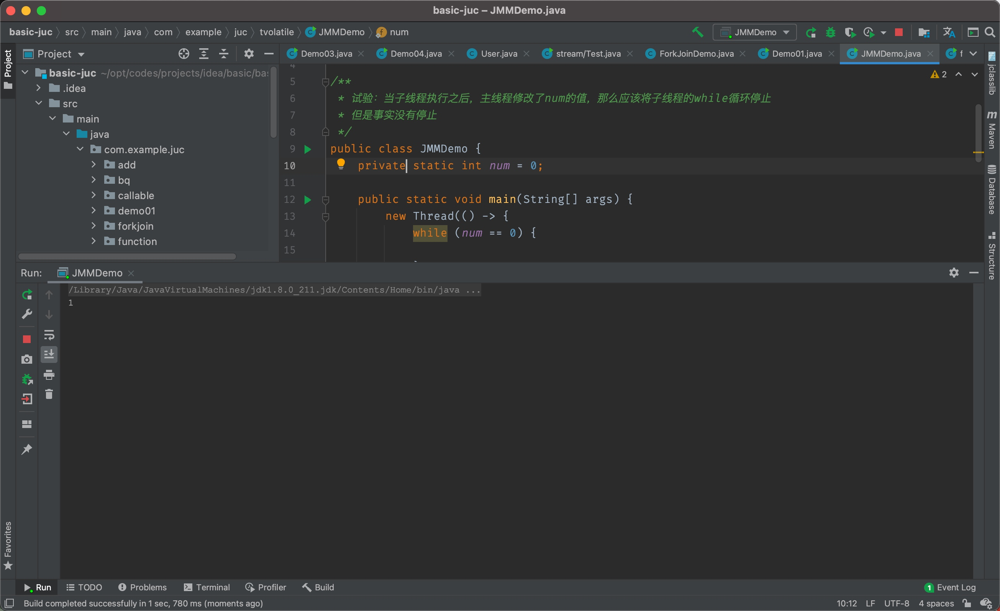

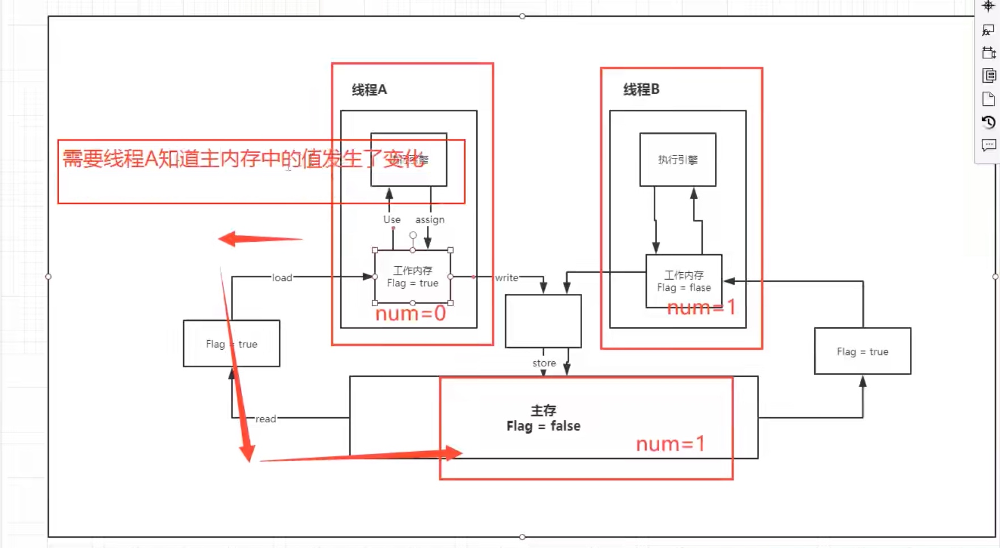

问题：程序并不知道主内存的值已经被修改过了，引出volatile。

## volatile

### 保证可见性

在线程之间保证可见性

```java
/**
 * 试验：当子线程执行之后，主线程修改了num的值，那么应该将子线程的while循环停止
 * 但是事实没有停止
 */
public class JMMDemo {
    private volatile static int num = 0;

    public static void main(String[] args) {
        new Thread(() -> {
            while (num == 0) {

            }
        }).start();

        try {
            TimeUnit.SECONDS.sleep(1);
        } catch (InterruptedException e) {
            e.printStackTrace();
        }

        num = 1;
        System.out.println(num);
    }
}
```

### 不保证原子性

不可分割

线程A在执行任务的时候，不能被打扰的，也不能被分割，要么同时成功，要么同时失败

```java
/**
 * 不保证原子性
 */
public class VDemo02 {
    private static int num = 0;

    public static void add() {
        num++;// 不是一个原子性操作
    }

    public static void main(String[] args) {
        // 理论上num应该是20000
        // 但是输出结果不到20000
        for (int i = 0; i < 20; i++) {
            new Thread(() -> {
                for (int j = 0; j < 1000; j++) {
                    add();
                }
            }, String.valueOf(i)).start();
        }

        while (Thread.activeCount() > 2) {// main gc
            Thread.yield(); //让线程等待
        }

        System.out.println(Thread.currentThread().getName() + "：" + num);
    }
}
```

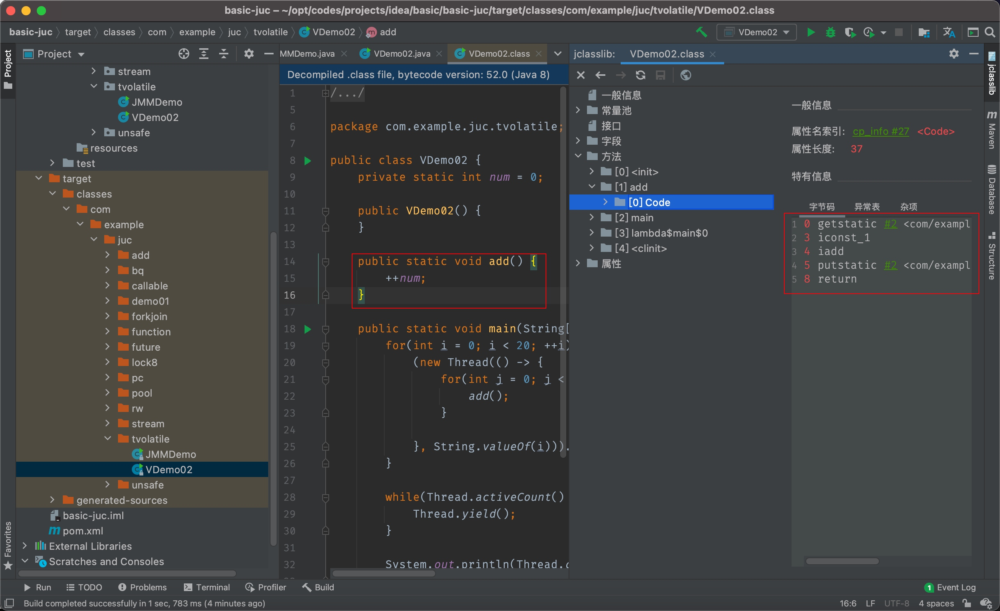

- 获得这个值
- +1
- 写回这个值

**如果不加lock 和 sychronized 怎么样保证原子性**

Package java.util.concurrent.atomic

使用原子类，解决原子性的问题

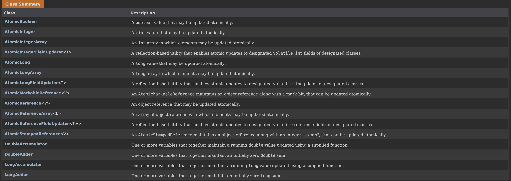

这些类的底层都和操作系统挂钩，在内存种修改值，Unsafe类是一个很特殊的存在。CAS会介绍。

#### 原子类为什么这么高级

#### 原子类的使用

```java
/**
 * 不保证原子性
 * 但是可以使用AtomicInteger保证原子性
 */
public class VDemo02 {
    //private static int num = 0;
    //原子类的Integer
    private static AtomicInteger num = new AtomicInteger();

    public static void add() {
        //num++; // 不是一个原子性操作
        num.getAndIncrement();// +1方法 用的是底层CAS进行加一操作
    }

    public static void main(String[] args) {
        // 理论上num应该是20000
        // 保证原子性之后输出结果就是20000
        for (int i = 0; i < 20; i++) {
            new Thread(() -> {
                for (int j = 0; j < 1000; j++) {
                    add();
                }
            }, String.valueOf(i)).start();
        }

        while (Thread.activeCount() > 2) {// main gc
            Thread.yield(); //让线程等待
        }

        System.out.println(Thread.currentThread().getName() + "：" + num);
    }
}
```

### 禁止指令重排

什么是指令重排？

你写的程序并不是按照你写的那样去执行的

源代码--编译器优化代码的重排--执行并行也可能重排--内存系统也会重排--执行

```java
int x=1;//1
int y=2;//2
x=x+5;//3
y=x*x;//4
```

我们所期望的执行顺序是：1234，但是2134也能跑，能得到我们想要的结果；1324也能跑

可不能是 4123？不可能，**处理器在进行指令重排的时候，会考虑数据之间的依赖性问题**

可能造成影响的结果：a b x y这四个值默认都是0


| 线程A | 线程B |
|-----|-----|
| x=a | y=b |
| b=1 | a=2 |


正常的结果：x=0;y=0;

x=a和b=1；y=b和a=2在线程中是没有任何依赖，是有可能会被指令重排的

| 线程A | 线程B |
|-----|-----|
| b=1 | a=2 |
| x=a | y=b |

可能由于指令重排，那么得到的结果就是：x=2;y=1;

**volatile可以避免指令重排**

内存屏障，CPU指令，作用：

- 保证特定的操作的执行顺序
- 可以保证某些变量的内存可见性（利用这些特性，volatile实现了可见性）

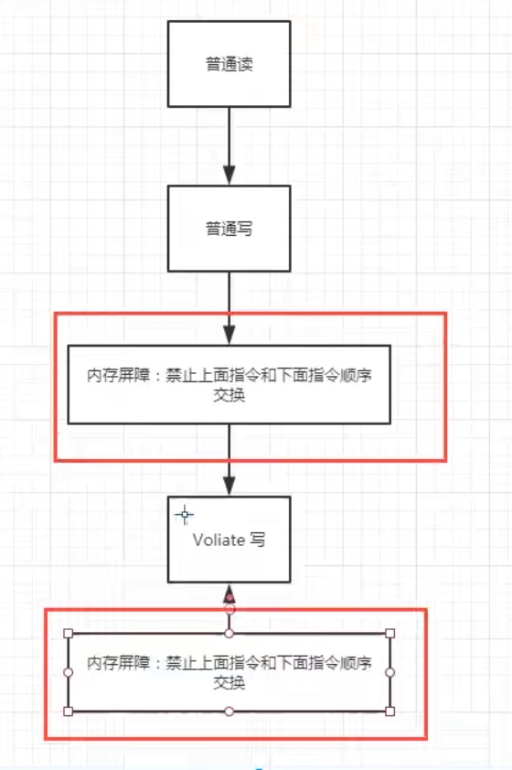

volatile是可以保证 可见性、不能保证原子性，由于内存屏障，可以避免指令重排的现象产生

既然你这么了解volatile，那么在什么地方用的最多？当然是单例模式了

## 深入单例模式

饿汉式、懒汉式：DCL懒汉式

### 饿汉式

主要是三个可以优化的地方：

多线程情况下：

- 使用双重检测锁防止lazyMan被多线程初始化多次
- 使用volatile防止指令重排，具体说明在代码注解中

```java
/**
 * 懒汉式
 * <p>
 * 单线程下，单例确实OK
 */
public class LazyMan {
    private LazyMan() {
        System.out.println(Thread.currentThread().getName() + " ok");
    }

    private volatile static LazyMan lazyMan;

    /**
     * 双重检测锁模式的懒汉式单例 简称DCL懒汉式
     * DCL懒汉式是有一个问题的
     * @return
     */
    public static LazyMan getInstance() {
        // 加锁
        if(lazyMan==null){
            synchronized (LazyMan.class){
                if (lazyMan == null) {
                    lazyMan = new LazyMan();// 不是一个原子性操作
                    /**
                     * 会经历三个阶段：
                     * 1 分配内存空间
                     * 2 执行构造方法
                     * 3 把这个对象指向这个空间
                     *
                     * 底层就有可能发生指令重排的现象
                     * 我们希望的执行顺序是：123，但是有可能是：132
                     * 比如：A线程的执行顺序是132，进来，先分配内存空间，然后把lazyMan引用指向这个空间，然后再在这个内存空间中创建这个对象
                     * 然而，在A线程执行到3的时候，来了一个B线程，此时的lazyMan已经不等于null了，直接返回lazyMan，但是此时这个对象并没有创建出来
                     * 所以必须给这个单例lazyMan添加volatile，防止它指令重排
                     */
                }
            }
        }

        return lazyMan;
    }

    public static void main(String[] args) {
        for (int i = 0; i < 10; i++) {
            new Thread(() -> {
                LazyMan.getInstance();
            }).start();
        }
    }
}
```

### 内部静态类

```java
/**
 * 静态内部类方式实现单例
 * 但是这个方式都是不安全的，因为直接用反射就可以
 */
public class Holder {
    private Holder() {
    }

    public static Holder getInstance() {
        return InnerClass.HOLDER;
    }

    public static class InnerClass {
        private static final Holder HOLDER = new Holder();
    }
}
```

### 但是这些方式都是不安全的，可以使用反射去破解掉

```java
/**
 * 懒汉式
 * <p>
 * 单线程下，单例确实OK
 * 但是这个方式都是不安全的，因为直接用反射就可以
 */
public class LazyMan {
    private LazyMan() {
        // 防止反射通过构造方法创建对象
        synchronized (LazyMan.class){
            if(lazyMan!=null){
                throw new RuntimeException("不要试图使用反射破坏单例异常");
            }
        }

        System.out.println(Thread.currentThread().getName() + " ok");
    }

    private volatile static LazyMan lazyMan;

    /**
     * 双重检测锁模式的懒汉式单例 简称DCL懒汉式
     * DCL懒汉式是有一个问题的
     *
     * @return
     */
    public static LazyMan getInstance() {
        // 加锁
        if (lazyMan == null) {
            synchronized (LazyMan.class) {
                if (lazyMan == null) {
                    lazyMan = new LazyMan();// 不是一个原子性操作
                    /**
                     * 会经历三个阶段：
                     * 1 分配内存空间
                     * 2 执行构造方法
                     * 3 把这个对象指向这个空间
                     *
                     * 底层就有可能发生指令重排的现象
                     * 我们希望的执行顺序是：123，但是有可能是：132
                     * 比如：A线程的执行顺序是132，进来，先分配内存空间，然后把lazyMan引用指向这个空间，然后再在这个内存空间中创建这个对象
                     * 然而，在A线程执行到3的时候，来了一个B线程，此时的lazyMan已经不等于null了，直接返回lazyMan，但是此时这个对象并没有创建出来
                     * 所以必须给这个单例lazyMan添加volatile，防止它指令重排
                     */
                }
            }
        }

        return lazyMan;
    }

    public static void main(String[] args) throws Exception {
        //for (int i = 0; i < 10; i++) {
        //    new Thread(() -> {
        //        LazyMan.getInstance();
        //    }).start();
        //}

        // 正常获取
        final LazyMan lazyMan = LazyMan.getInstance();

        // 反射获取
        final Constructor<LazyMan> declaredConstructor = LazyMan.class.getDeclaredConstructor(null);
        declaredConstructor.setAccessible(true);
        final LazyMan lazyMan1 = declaredConstructor.newInstance();
        System.out.println(lazyMan == lazyMan1);
    }
}
```

输出结果

```java
main ok
Exception in thread "main" java.lang.reflect.InvocationTargetException
	at sun.reflect.NativeConstructorAccessorImpl.newInstance0(Native Method)
	at sun.reflect.NativeConstructorAccessorImpl.newInstance(NativeConstructorAccessorImpl.java:62)
	at sun.reflect.DelegatingConstructorAccessorImpl.newInstance(DelegatingConstructorAccessorImpl.java:45)
	at java.lang.reflect.Constructor.newInstance(Constructor.java:423)
	at com.example.juc.single.LazyMan.main(LazyMan.java:69)
Caused by: java.lang.RuntimeException: 不要试图使用反射破坏单例异常
	at com.example.juc.single.LazyMan.<init>(LazyMan.java:16)
	... 5 more
```

但是如果它没有通过`final LazyMan lazyMan = LazyMan.getInstance();`创建对象，而是直接通过反射去创建对象，那么还是存在单例被破坏的情况出现。

```java
public static void main(String[] args) throws Exception {
    //for (int i = 0; i < 10; i++) {
    //    new Thread(() -> {
    //        LazyMan.getInstance();
    //    }).start();
    //}

    // 正常获取
    //final LazyMan lazyMan = LazyMan.getInstance();

    // 反射获取
    final Constructor<LazyMan> declaredConstructor = LazyMan.class.getDeclaredConstructor(null);
    declaredConstructor.setAccessible(true);
    final LazyMan lazyMan1 = declaredConstructor.newInstance();
    final LazyMan lazyMan2 = declaredConstructor.newInstance();
    System.out.println(lazyMan == lazyMan1);
}
```

输出结果

```shell
main ok
main ok
false
```

这个时候我们可以通过红绿灯状态位判定是不是第一次进入构造函数的

```java
/**
 * 懒汉式
 * <p>
 * 单线程下，单例确实OK
 * 但是这个方式都是不安全的，因为直接用反射就可以
 */
public class LazyMan {

    // 通过设置红绿灯状态位防止都是通过反射创建对象的情况
    private static boolean zhangsan = false;

    private LazyMan() {

        synchronized (LazyMan.class) {
            //if (lazyMan != null) {
            //    throw new RuntimeException("不要试图使用反射破坏单例异常");
            //}

            if (zhangsan == false) {
                zhangsan = true;
            } else {
                throw new RuntimeException("不要试图使用反射破坏单例异常");
            }
        }

        System.out.println(Thread.currentThread().getName() + " ok");
    }

    private volatile static LazyMan lazyMan;

    /**
     * 双重检测锁模式的懒汉式单例 简称DCL懒汉式
     * DCL懒汉式是有一个问题的
     *
     * @return
     */
    public static LazyMan getInstance() {
        // 加锁
        if (lazyMan == null) {
            synchronized (LazyMan.class) {
                if (lazyMan == null) {
                    lazyMan = new LazyMan();// 不是一个原子性操作
                    /**
                     * 会经历三个阶段：
                     * 1 分配内存空间
                     * 2 执行构造方法
                     * 3 把这个对象指向这个空间
                     *
                     * 底层就有可能发生指令重排的现象
                     * 我们希望的执行顺序是：123，但是有可能是：132
                     * 比如：A线程的执行顺序是132，进来，先分配内存空间，然后把lazyMan引用指向这个空间，然后再在这个内存空间中创建这个对象
                     * 然而，在A线程执行到3的时候，来了一个B线程，此时的lazyMan已经不等于null了，直接返回lazyMan，但是此时这个对象并没有创建出来
                     * 所以必须给这个单例lazyMan添加volatile，防止它指令重排
                     */
                }
            }
        }

        return lazyMan;
    }

    public static void main(String[] args) throws Exception {
        //for (int i = 0; i < 10; i++) {
        //    new Thread(() -> {
        //        LazyMan.getInstance();
        //    }).start();
        //}

        // 正常获取
        //final LazyMan lazyMan = LazyMan.getInstance();

        // 反射获取
        final Constructor<LazyMan> declaredConstructor = LazyMan.class.getDeclaredConstructor(null);
        declaredConstructor.setAccessible(true);
        final LazyMan lazyMan1 = declaredConstructor.newInstance();
        final LazyMan lazyMan2 = declaredConstructor.newInstance();
        System.out.println(lazyMan == lazyMan1);
    }
}
```

输出结果

```java
main ok
Exception in thread "main" java.lang.reflect.InvocationTargetException
	at sun.reflect.NativeConstructorAccessorImpl.newInstance0(Native Method)
	at sun.reflect.NativeConstructorAccessorImpl.newInstance(NativeConstructorAccessorImpl.java:62)
	at sun.reflect.DelegatingConstructorAccessorImpl.newInstance(DelegatingConstructorAccessorImpl.java:45)
	at java.lang.reflect.Constructor.newInstance(Constructor.java:423)
	at com.example.juc.single.LazyMan.main(LazyMan.java:80)
Caused by: java.lang.RuntimeException: 不要试图使用反射破坏单例异常
	at com.example.juc.single.LazyMan.<init>(LazyMan.java:26)
	... 5 more
```

但是如果被人找到了这个隐藏的`zhangsan`这个变量，那么`zhangsan`也可以被破坏了

关键代码

```java
final Field zhangsan = LazyMan.class.getDeclaredField("zhangsan");
    zhangsan.setAccessible(true);// 破坏这个字段的私有权限

    // 反射获取
    final Constructor<LazyMan> declaredConstructor = LazyMan.class.getDeclaredConstructor(null);
    declaredConstructor.setAccessible(true);// 破坏构造函数的私有权限
    final LazyMan lazyMan1 = declaredConstructor.newInstance();

    // 把第一个对象的值在改为false，因为这个属性是静态，其实就是修改了类成员属性，其他对象的这个
    zhangsan.set(lazyMan1, false);
```

整个类

```java
/**
 * 懒汉式
 * <p>
 * 单线程下，单例确实OK
 * 但是这个方式都是不安全的，因为直接用反射就可以
 */
public class LazyMan {

    // 通过设置红绿灯状态位防止都是通过反射创建对象的情况
    private static boolean zhangsan = false;

    private LazyMan() {

        synchronized (LazyMan.class) {
            //if (lazyMan != null) {
            //    throw new RuntimeException("不要试图使用反射破坏单例异常");
            //}

            if (zhangsan == false) {
                zhangsan = true;
            } else {
                throw new RuntimeException("不要试图使用反射破坏单例异常");
            }
        }

        System.out.println(Thread.currentThread().getName() + " ok");
    }

    private volatile static LazyMan lazyMan;

    /**
     * 双重检测锁模式的懒汉式单例 简称DCL懒汉式
     * DCL懒汉式是有一个问题的
     *
     * @return
     */
    public static LazyMan getInstance() {
        // 加锁
        if (lazyMan == null) {
            synchronized (LazyMan.class) {
                if (lazyMan == null) {
                    lazyMan = new LazyMan();// 不是一个原子性操作
                    /**
                     * 会经历三个阶段：
                     * 1 分配内存空间
                     * 2 执行构造方法
                     * 3 把这个对象指向这个空间
                     *
                     * 底层就有可能发生指令重排的现象
                     * 我们希望的执行顺序是：123，但是有可能是：132
                     * 比如：A线程的执行顺序是132，进来，先分配内存空间，然后把lazyMan引用指向这个空间，然后再在这个内存空间中创建这个对象
                     * 然而，在A线程执行到3的时候，来了一个B线程，此时的lazyMan已经不等于null了，直接返回lazyMan，但是此时这个对象并没有创建出来
                     * 所以必须给这个单例lazyMan添加volatile，防止它指令重排
                     */
                }
            }
        }

        return lazyMan;
    }

    public static void main(String[] args) throws Exception {
        //for (int i = 0; i < 10; i++) {
        //    new Thread(() -> {
        //        LazyMan.getInstance();
        //    }).start();
        //}

        // 正常获取
        //final LazyMan lazyMan = LazyMan.getInstance();

        final Field zhangsan = LazyMan.class.getDeclaredField("zhangsan");
        zhangsan.setAccessible(true);// 破坏这个字段的私有权限

        // 反射获取
        final Constructor<LazyMan> declaredConstructor = LazyMan.class.getDeclaredConstructor(null);
        declaredConstructor.setAccessible(true);// 破坏构造函数的私有权限
        final LazyMan lazyMan1 = declaredConstructor.newInstance();

        // 把第一个对象的值在改为false，因为这个属性是静态，其实就是修改了类成员属性，其他对象的这个
        zhangsan.set(lazyMan1, false);

        final LazyMan lazyMan2 = declaredConstructor.newInstance();
        System.out.println(lazyMan == lazyMan1);
    }
}
```

输出结果

```java
main ok
main ok
false
```

怎么解决呢？通过查看反射的源代码可以看到：

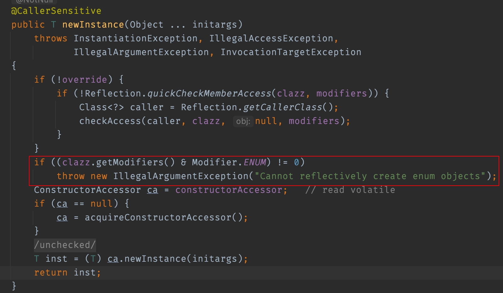

也就是说，如果通过反射创建的类型是枚举类型，就不允许创建，抛出异常

### 枚举类型单例

```java
/**
 * 枚举类型的单例
 * 枚举本身也是一个Class类
 */
public enum EnumSingle {
    INSTANCE;

    public EnumSingle getInstance() {
        return INSTANCE;
    }
}
class Test{
    public static void main(String[] args) throws Exception {
        final EnumSingle instance1 = EnumSingle.INSTANCE;
        final EnumSingle instance2 = EnumSingle.INSTANCE;

        System.out.println(instance1);
        System.out.println(instance2);
    }
}
```

测试是否能通过反射创建对象

我们通过源代码可以查看到我们创建的枚举类型中有一个私有的构造方法

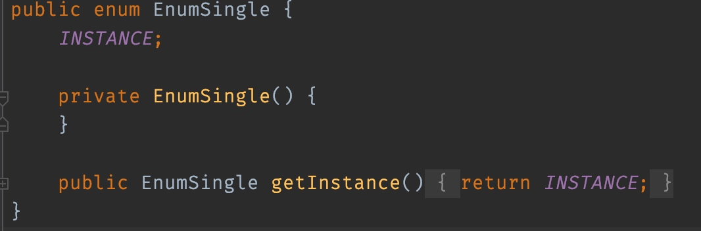

```
/**
 * 枚举类型的单例
 * 枚举本身也是一个Class类
 */
public enum EnumSingle {
    INSTANCE;

    public EnumSingle getInstance() {
        return INSTANCE;
    }
}
class Test{
    public static void main(String[] args) throws Exception {
        final EnumSingle instance1 = EnumSingle.INSTANCE;
        final EnumSingle instance2 = EnumSingle.INSTANCE;

        System.out.println(instance1);
        System.out.println(instance2);


        final Constructor<EnumSingle> declaredConstructor = EnumSingle.class.getDeclaredConstructor(null);

        declaredConstructor.setAccessible(true);

        final EnumSingle enumSingle = declaredConstructor.newInstance();
        // Exception in thread "main" java.lang.NoSuchMethodException: com.example.juc.single.EnumSingle.<init>()
        System.out.println(enumSingle);

    }
}
```

但是出现的错误是`NoSuchMethodException`没有这个方法

通过javap反编译之后，可以看到有私有的构造方法

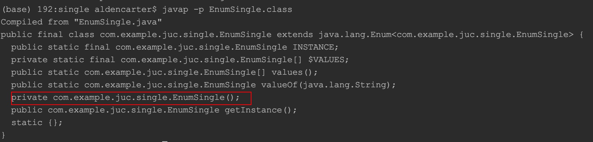

使用jad反编译class字节码文件

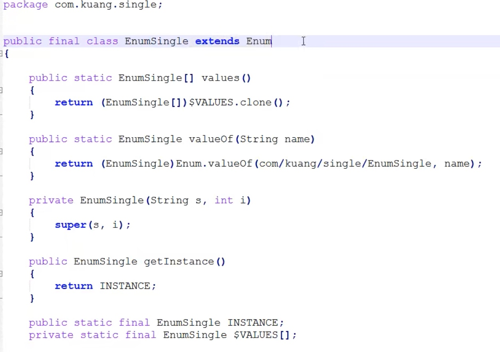

发现它有一个构造器，传入参数String和int

```java
/**
 * 枚举类型的单例
 * 枚举本身也是一个Class类
 */
public enum EnumSingle {
    INSTANCE;

    public EnumSingle getInstance() {
        return INSTANCE;
    }

    /**
     * 业务方法
     */
    public void test01(){
        System.out.println("test01");
    }
}

class Test {
    public static void main(String[] args) throws Exception {
        final EnumSingle instance1 = EnumSingle.INSTANCE;
        final EnumSingle instance2 = EnumSingle.INSTANCE;

        System.out.println(instance1);
        System.out.println(instance2);


        //final Constructor<EnumSingle> declaredConstructor = EnumSingle.class.getDeclaredConstructor(null);
        final Constructor<EnumSingle> declaredConstructor = EnumSingle.class.getDeclaredConstructor(String.class, int.class);

        declaredConstructor.setAccessible(true);

        final EnumSingle enumSingle = declaredConstructor.newInstance();
        // Exception in thread "main" java.lang.NoSuchMethodException: com.example.juc.single.EnumSingle.<init>()
        System.out.println(enumSingle);

    }
}
```

输出结果：表示枚举类不能通过反射创建

```shell
INSTANCE
INSTANCE
Exception in thread "main" java.lang.IllegalArgumentException: Cannot reflectively create enum objects
	at java.lang.reflect.Constructor.newInstance(Constructor.java:417)
	at com.example.juc.single.Test.main(EnumSingle.java:31)
```

序列化能否破坏枚举类型的单例？不能

```java
class Test {
    public static void main(String[] args) throws Exception {
        final EnumSingle instance1 = EnumSingle.INSTANCE;
        final EnumSingle instance2 = EnumSingle.INSTANCE;

        System.out.println(instance1);
        System.out.println(instance2);

        // 检测序列化能否破坏枚举类型的单例
        byte[] serialize = SerializationUtils.serialize(instance1);
        Object deserialize = SerializationUtils.deserialize(serialize);
        System.out.println(instance1 == deserialize); //true
    }
}
```

输出结果

```shell
INSTANCE
INSTANCE
true
```

## 深入理解CAS

### 什么是CAS

大厂你必须要深入研究底层，所有突破，修炼内功，操作系统，网络原理

```java
/**
 * CAS :compareAndSet比较并交换
 * CAS 是CPU的并发原语
 */
public class CASDemo {
    public static void main(String[] args) {

        // 原子类的底层使用了cas，那我们怎么去确定呢？
        AtomicInteger atomicInteger = new AtomicInteger(2020);

        /**
         * public final boolean compareAndSet(int expect, int update)
         * expect 期望
         * update 更新
         */
        // 如果这个值是2020，我就把这个值改成2021
        // 如果我期望的值达到了，那么久更新，否则，就不更新
        System.out.println(atomicInteger.compareAndSet(2020, 2021));

        System.out.println(atomicInteger.get());

        System.out.println(atomicInteger.compareAndSet(2020, 2021));

        System.out.println(atomicInteger.get());

    }
}
```

### Unsafe类

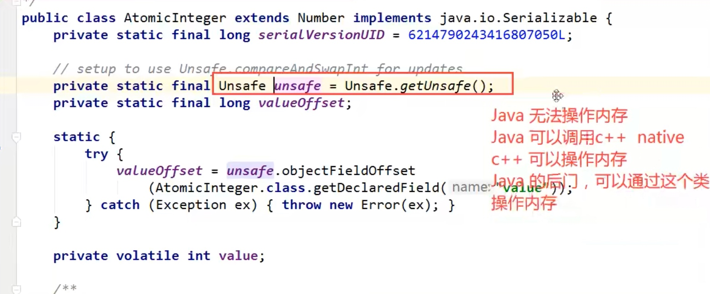

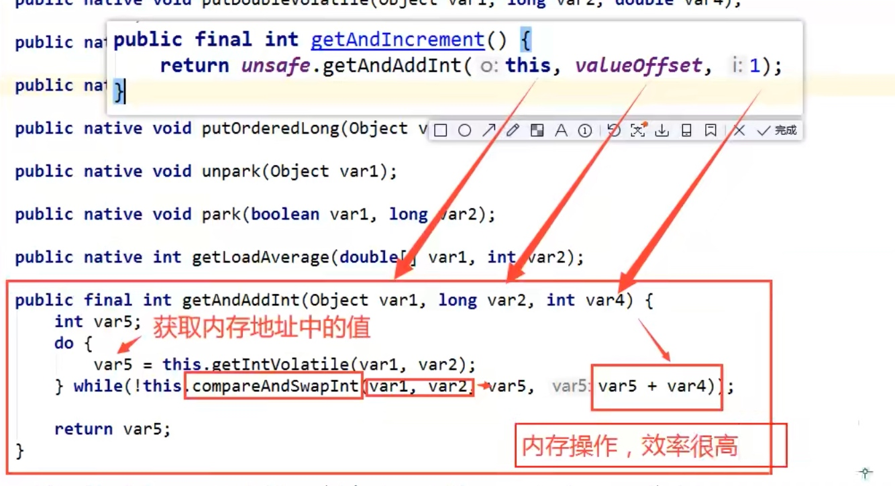

### CAS总结

比较当前工作内存中的值和主内存中的值，如果这个值是期望的，那么则执行操作，如果不是就一直循环（因为底层是自旋锁）

CAS：三个操作数：a(期望的值) c(比较的值) c(更新的值)

缺点：

- 由于底层是自旋锁，循环会浪费时间
- 一次只能保证一个共享变量的原子性
- 会存在ABA问题

### 只要涉及到CAS就会问到的ABA问题

ABA问题：狸猫换太子

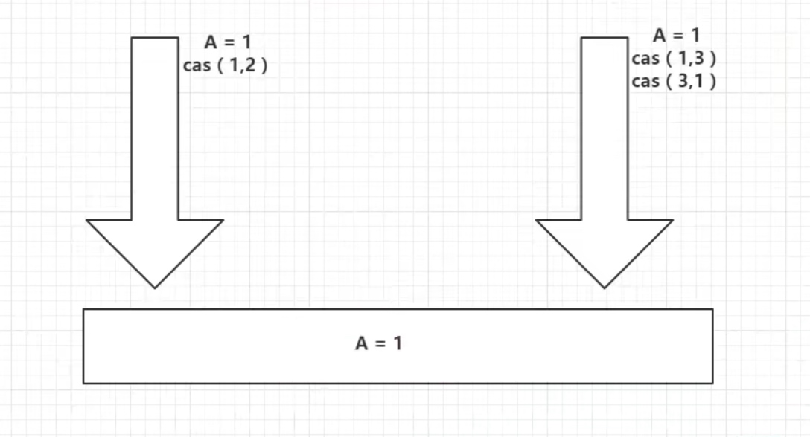

两个线程，拿到A共享变量，线程1座cas操作，期望A是1，并将它改成2，线程2期望A是1并将它改成3，随后又改了回来，虽然这个时候的A还是等于1，但是已经是被修改过的了

也就是说，他以为他没有被骗（A没有改变），但是实际上已经被骗了（被B修改了）

```java
/**
 * CAS :compareAndSet比较并交换
 * CAS 是CPU的并发原语
 */
public class CASDemo {
    public static void main(String[] args) {

        // 原子类的底层使用了cas，那我们怎么去确定呢？
        AtomicInteger atomicInteger = new AtomicInteger(2020);

        /**
         * public final boolean compareAndSet(int expect, int update)
         * expect 期望
         * update 更新
         */
        // 如果这个值是2020，我就把这个值改成2021
        // 如果我期望的值达到了，那么久更新，否则，就不更新

        // 捣乱的线程
        System.out.println(atomicInteger.compareAndSet(2020, 2021));
        System.out.println(atomicInteger.get());

        System.out.println(atomicInteger.compareAndSet(2021, 2020));
        System.out.println(atomicInteger.get());

        // 期望的线程
        System.out.println(atomicInteger.compareAndSet(2020, 2021));
        System.out.println(atomicInteger.get());
    }
}
```

对于我们平时写的sql：乐观锁

如何解决这个问题，那就是原子引用。

## 原子引用：带版本号的原子操作

Integer 使用了对象缓存机制，默认范围是-128~127，推荐使用静态工厂方法valueOf获取对象实例，而不是new，因为valueOf使用缓存，而new一定会创建新的对象分配新的内存空间

为了解决我们不知道别人已经修改过我们的数据的这个问题，添加一个版本号来作为修改的次数记录，
当线程A和线程B获取到了当前的版本号（是一样的），之后A休眠的时间比B少，出来操作（但是操作之后把值又改回了原来的值），那么此时B怎么知道我的值还是不是我原来获取的值，而不是别人改了之后又改回来的值呢？此时通过版本号就知道别人改过了。

```java
/**
 * 要求：A线程做了什么操作，B线程是知道的
 */
public class AtomicStampedReferenceDemo {
    public static void main(String[] args) {

        final AtomicStampedReference<Integer> atomicInteger = new AtomicStampedReference<>(1, 1);

        new Thread(() -> {
            final int stamp = atomicInteger.getStamp();// 获得版本号
            System.out.println("a1=>" + stamp);

            try {
                TimeUnit.SECONDS.sleep(1);
            } catch (InterruptedException e) {
                e.printStackTrace();
            }

            System.out.println("a2=>" + atomicInteger.compareAndSet(1, 2, atomicInteger.getStamp(), atomicInteger.getStamp() + 1));
            System.out.println("a2=>" + atomicInteger.getStamp());

            System.out.println("a3=>" + atomicInteger.compareAndSet(2, 1, atomicInteger.getStamp(), atomicInteger.getStamp() + 1));
            System.out.println("a3=>" + atomicInteger.getStamp());

        }, "A").start();


        // 乐观锁的原理相同
        new Thread(() -> {
            final int stamp = atomicInteger.getStamp();// 获得版本号
            System.out.println("b1=>" + stamp);

            try {
                TimeUnit.SECONDS.sleep(2);
            } catch (InterruptedException e) {
                e.printStackTrace();
            }

            System.out.println("b2=>" + atomicInteger.compareAndSet(1, 6, stamp, stamp + 1));
            System.out.println("b2=>" + atomicInteger.getStamp());

        }, "B").start();
    }
}
```

输出结果

```shell
a1=>1
b1=>1
a2=>true
a2=>2
a3=>true
a3=>3
b2=>false
b2=>3
```

## 可重入锁、公平锁、非公平锁、自旋锁、死锁

### 公平锁、非公平锁

公平锁：非常公平，不能插队，线程进来，必须先来后到
非公平锁：非常不公平，可以插队，后面来的人可以插到前面（默认都是非公平）

两个进程：一个3h执行完，一个3s执行完，3s排号的时候在3h的后面，3s的为了拿到CPU的3s需要等待3h，这有必要吗？

### 可重入锁

所有的锁都是可重入锁（也叫递归锁）

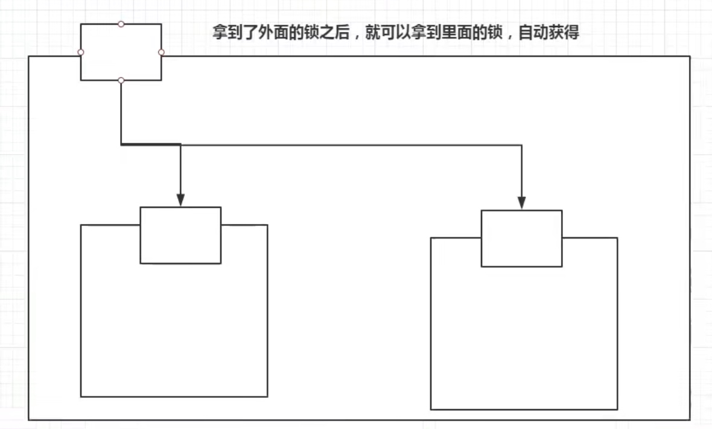

1. Synchronized

```java
/**
 * 可重入锁测试
 * Synchronized
 */
public class Demo01 {

    public static void main(String[] args) {
        final Phone phone = new Phone();
        new Thread(() -> {
            phone.sms();
        }, "A").start();
        new Thread(() -> {
            phone.sms();
        }, "B").start();
    }
}

class Phone {
    public synchronized void sms() {
        System.out.println(Thread.currentThread().getName() + " sms");
        call();//这里也有锁
    }

    public synchronized void call() {
        System.out.println(Thread.currentThread().getName() + " call");
    }
}
```

输出结果

**A线程在输出sms之后，一定会执行call表明当call自己有锁，外面还有一个sms的锁的时候，一旦A获取到了sms的锁，就会自动获取到里面的锁**

```shell
A sms
A call
B sms
B call
```

2. Lock

```java
/**
 * 可重入锁测试
 * Lock
 */
public class Demo02 {

    public static void main(String[] args) {
        final Phone2 phone = new Phone2();
        new Thread(() -> {
            phone.sms();
        }, "A").start();
        new Thread(() -> {
            phone.sms();
        }, "B").start();
    }
}

class Phone2 {
    Lock lock = new ReentrantLock();

    // 锁必须配对，否则就会死在里面
    public void sms() {
        lock.lock();//细节问题：这里锁了一次，然后调用call的时候又锁了一次，也就是A一下子获取了两把钥匙
        lock.lock();// 两把锁，就要解锁两次
        try {
            System.out.println(Thread.currentThread().getName() + " sms");
            call();//这里也有锁
        } catch (Exception ex) {
            ex.printStackTrace();
        } finally {
            lock.unlock();
            lock.unlock();
        }
    }

    public void call() {
        lock.lock();
        try {
            System.out.println(Thread.currentThread().getName() + " call");
        } catch (Exception ex) {
            ex.printStackTrace();
        } finally {
            lock.unlock();
        }
    }
}
```

### 自旋锁 SpinLock

不断的遍历尝试，直到成功为止

> sun.misc.Unsafe

中的函数：

```java
public final int getAndAddInt(Object var1, long var2, int var4) {
    int var5;
    do {
        var5 = this.getIntVolatile(var1, var2);
    } while(!this.compareAndSwapInt(var1, var2, var5, var5 + var4));

    return var5;
}
```

#### 实现自旋锁

```java
/**
 * 自旋锁
 */
public class SpinLockDemo {
    AtomicReference<Thread> atomicReference = new AtomicReference();

    // 加锁
    public void myLock() {
        final Thread thread = Thread.currentThread();
        System.out.println(thread.getName() + " myLock");

        while (atomicReference.compareAndSet(null, thread)) {
        }
    }


    // 解锁
    public void myUnLock() {
        final Thread thread = Thread.currentThread();
        System.out.println(thread.getName() + " myUnLock");

        atomicReference.compareAndSet(thread, null);
    }
}
```

```java
public class SpinLockDemoTest {

    public static void main(String[] args) {
        final SpinLockDemo lock = new SpinLockDemo();

        new Thread(() -> {
            lock.myLock();

            try {
                TimeUnit.SECONDS.sleep(3);
            } catch (Exception ex) {
                ex.printStackTrace();
            } finally {
                lock.myUnLock();
            }
        }, "A").start();
        new Thread(() -> {
            lock.myLock();

            try {
                TimeUnit.SECONDS.sleep(3);
            } catch (Exception ex) {
                ex.printStackTrace();
            } finally {
                lock.myUnLock();
            }
        }, "B").start();
    }
}
```

输出结果

```shell
A myLock
B myLock
A myUnLock
B myUnLock
```

一定的是等待A线程解锁之后B线程才能获取到锁，在这之前，B线程都只能在while循环那里一直等待获取锁

### 死锁

#### 死锁是什么

两个线程互相抢占资源，持有一个锁，并视图获取对方的锁

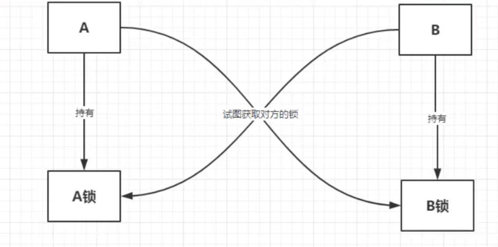

#### 死锁测试

```java
public class DeadLockDemo {

    public static void main(String[] args) {
        String lockA ="lockA";
        String lockB ="lockB";

        new Thread(new MyThread(lockA,lockB)).start();
        new Thread(new MyThread(lockB,lockA)).start();
    }
}

class MyThread implements Runnable {
    private String lockA;
    private String lockB;

    public MyThread(String lockA, String lockB) {
        this.lockA = lockA;
        this.lockB = lockB;
    }

    @Override
    public void run() {
        synchronized (lockA) {
            System.out.println(Thread.currentThread().getName() + " lock " + lockA + "=> get " + lockB);

            try {
                TimeUnit.SECONDS.sleep(2);
            } catch (InterruptedException e) {
                e.printStackTrace();
            }
            synchronized (lockB) {
                System.out.println(Thread.currentThread().getName() + " lock " + lockB + "=> get " + lockA);
            }
        }
    }
}
```

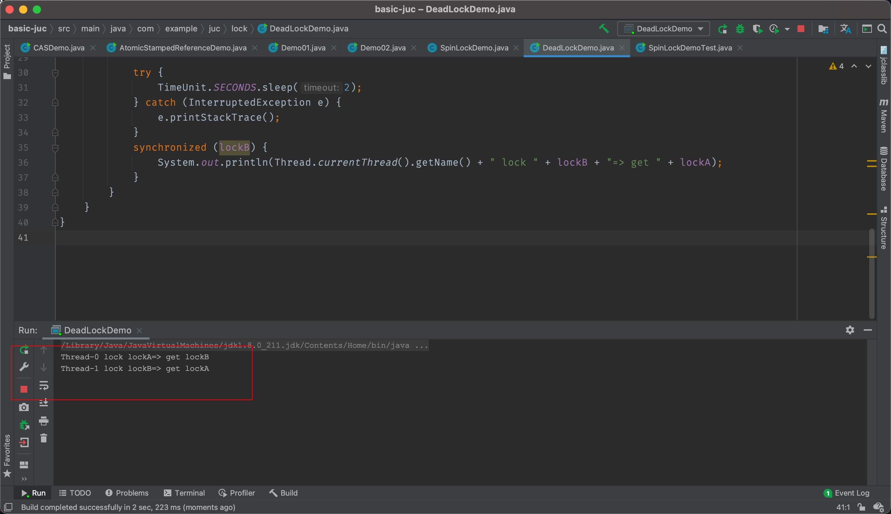

#### 怎么排除死锁

1. 使用`jps -l`定位进程号

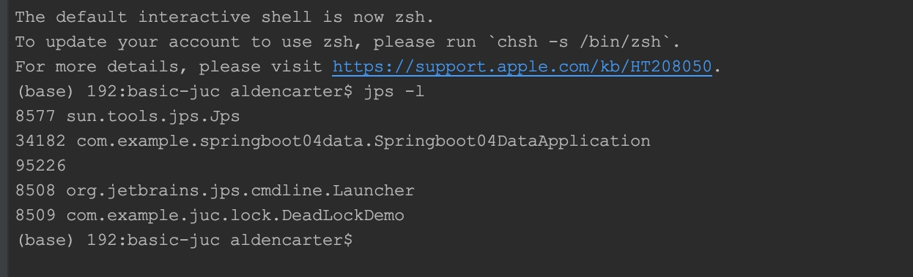

2. 使用`jstack 进程号`查看进程信息

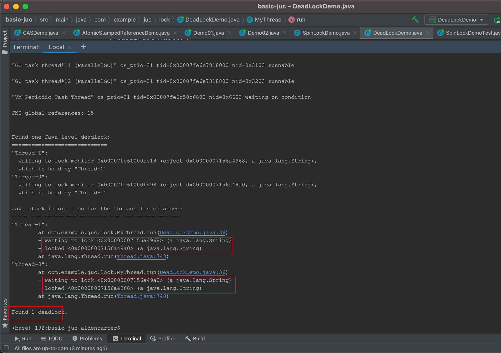

面试或者工作中，去排查问题

- 日志
- 堆栈信息


