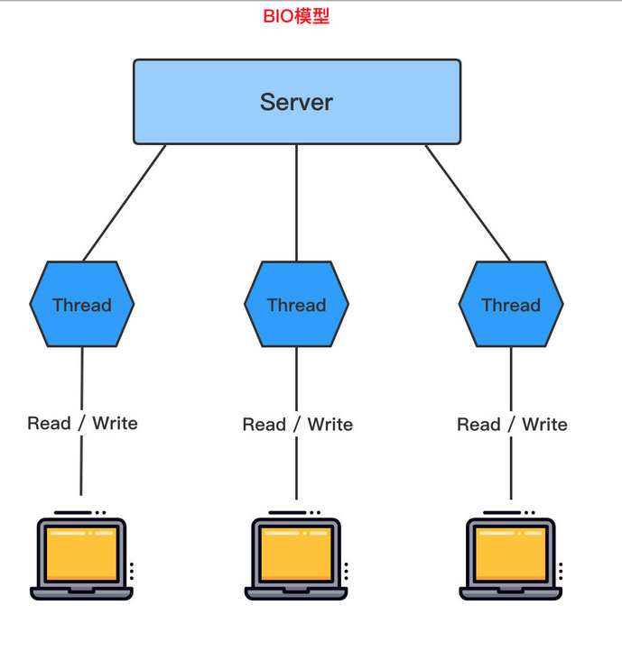
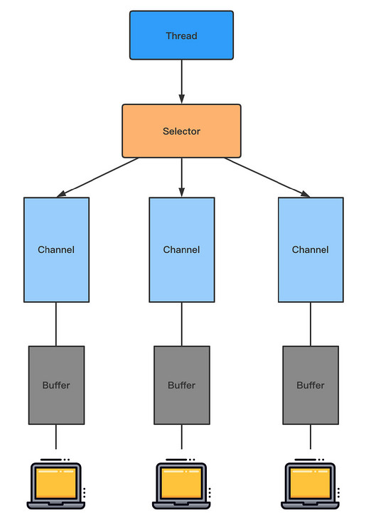
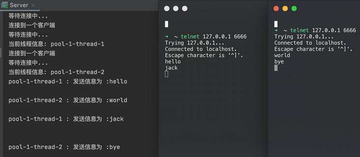
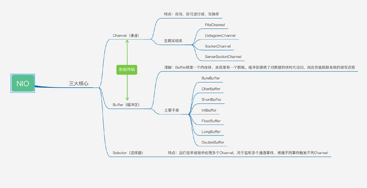
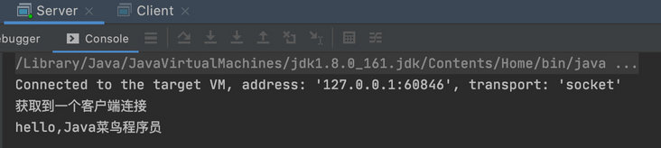

> 参考网址：https://juejin.cn/post/6844903985158045703、https://segmentfault.com/a/1190000037714804

## Java中的IO原理

首先Java中的IO都是依赖操作系统内核进行的，我们程序中的IO读写其实调用的是操作系统内核中的read&write两大系统调用

那内核是如何进行IO交互的呢？

1. 网卡收到经过网线传来的网络数据，并将网络数据写到内存中
2. 当网卡把数据写入到内存后，网卡向cpu发出一个中断信号，操作系统便能得知有新数据到来，再通过网卡中断程序去处理数据
3. 将内存中的网络数据写入到对应socket的接收缓冲区中
4. 当接收缓冲区的数据写好之后，应用程序开始进行数据处理

对应抽象到java的socket代码简单示例如下：

```java
public class SocketServer {
  public static void main(String[] args) throws Exception {
    // 监听指定的端口
    int port = 8080;
    ServerSocket server = new ServerSocket(port);
    // server将一直等待连接的到来
    Socket socket = server.accept();
    // 建立好连接后，从socket中获取输入流，并建立缓冲区进行读取
    InputStream inputStream = socket.getInputStream();
    byte[] bytes = new byte[1024];
    int len;
    while ((len = inputStream.read(bytes)) != -1) {
      //获取数据进行处理
      String message = new String(bytes, 0, len,"UTF-8");
    }
    // socket、server，流关闭操作，省略不表
  }
}
```

可以看到这个过程和底层内核的网络IO很类似，主要体现在accept()等待从网络中的请求到来然后bytes[]数组作为缓冲区等待数据填满后进行处理。**而BIO、NIO、AIO之间的区别就在于这些操作是同步还是异步，阻塞还是非阻塞**

所以我们引出同步异步，阻塞与非阻塞的概念

### 同步与异步

同步和异步指的是一个执行流程中每个方法是否必须依赖前一个方法完成后才可以继续执行。假设我们的执行流程中：依次是方法一和方法二

同步指的是调用一旦开始，调用者必须等到方法调用返回后，才能继续后续的行为。即方法二一定要等到方法一执行完成后才可以执行

异步指的是调用立刻返回，调用者不必等待方法内的代码执行结束，就可以继续后续的行为。（具体方法内的代码交由另外的线程执行完成后，可能会进行回调）。即执行方法一的时候，直接交给其他线程执行，不由主线程执行，也就不会阻塞主线程，所以方法二不必等到方法一完成即可开始执行

同步与异步关注的是方法的执行方是主线程还是其他线程，主线程的话需要等待方法执行完成，其他线程的话无需等待立刻返回方法调用，主线程可以直接执行接下来的代码

**同步与异步是从多个线程之间的协调来实现效率差异**

> 为什么需要异步呢？笔者认为异步的本质就是为了解决主线程的阻塞，所以网上很多讨论把同步异步、阻塞非阻塞进行了四种组合，其中一种就有异步阻塞这一情形，如果异步也是阻塞的？那为什么要特地进行异步操作呢？

### 阻塞与非阻塞

阻塞与非阻塞指的是单个线程内遇到同步等待时，是否在原地不做任何操作

阻塞指的是遇到同步等待后，一直在原地等待同步方法处理完成

非阻塞指的是遇到同步等待，不在原地等待，先去做其他的操作，隔断时间再来观察同步方法是否完成

**阻塞与非阻塞关注的是线程是否在原地等待**

> 笔者认为阻塞和非阻塞仅能与同步进行组合。而异步天然就是非阻塞的，而这个非阻塞是对主线程而言。（可能有人认为异步方法里面放入阻塞操作的话就是异步阻塞，但是思考一下，正是因为是阻塞操作所以才会将它放入异步方法中，不要阻塞主线程）

### 例子讲解

> 海底捞很好吃，但是经常要排队。我们就以生活中的这个例子进行讲解

- A顾客去吃海底捞，就这样干坐着等了一小时，然后才开始吃火锅。(BIO 同步阻塞)

- B顾客去吃海底捞，他一看要等挺久，于是去逛商场，每次逛一会就跑回来看有没有排到他。于是他最后既购了物，又吃上海底捞了。（NIO 同步非阻塞）

- C顾客去吃海底捞，由于他是高级会员，所以店长说，你去商场随便玩吧，等下有位置，我立马打电话给你。于是C顾客不用干坐着等，也不用每过一会儿就跑回来看有没有等到，最后也吃上了海底捞（AIO）

> 哪种方式更有效率呢？是不是一目了然呢？

## IO模型

I/O 模型简单理解为：就是使用什么样的通道进行数据的发送和接收，很大程度上决定了程序通信的性能

Java 支持 3 种网络编程模型：BIO、NIO、AIO

1. **Java BIO**：`同步并阻塞`（传统阻塞型），服务器实现模式为一个连接一个线程，即客户端有连接请求时服务器端就需要启动一个线程进行处理，如果这个连接不作任何事情会造成不必要的线程开销



2. **Java NIO**：`同步非阻塞`，服务器实现模式为一个线程处理多个请求(连接)，即客户端发送的连接请求会被注册到多路复用器上，多路复用器轮询到有 I/O 请求就会进行处理



说明：

- 每个 Channel 对应一个 Buffer

- Selector 对应一个线程，一个线程对应多个 Channel

- 该图反应了有三个 Channel 注册到该 Selector

- 程序切换到那个 Channel 是由`事件`决定的（Event）

- Selector 会根据不同的事件，在各个通道上切换

- Buffer 就是一个内存块，底层是有一个数组

- 数据的读取和写入是通过 Buffer，但是需要`flip()`切换读写模式。而 BIO 是单向的，要么输入流要么输出流

3. **Java AIO**：`异步非阻塞`，AIO 引入了异步通道的概念，采用了 Proactor 模式，简化了程序编写，有效的请求才启动线程，它的特点是先由操作系统完成后才通知服务端程序启动线程去处理，一般适用于连接数较多且连接时间较长的应用

### 使用场景分析

- BIO 方式适用于`连接数比较小且固定`的架构，这种方式对服务器资源要求比较高，并发局限于应用中，JDK1.4 之前唯一的选择，程序较为简单容易理解
- NIO 方式适用于`连接数目多且连接比较短`的架构，比如聊天服务器，弹幕系统，服务器间通讯等，编程比较复杂，JDK1.4 开始支持
- AIO 方式适用于`连接数目多且连接比较长`的架构，比如相册服务器，充分调用 OS 参与并发操作，变成比较复杂，JDK7 开始支持

### BIO

BIO全称是Blocking IO，是JDK1.4之前的传统IO模型，其相关的类和接口在 java.io 包下，本身是**同步阻塞模式**。 线程发起IO请求后，一直阻塞IO，直到缓冲区数据就绪后，再进入下一步操作。针对网络通信都是一请求一应答的方式，虽然简化了上层的应用开发，但在性能和可靠性方面存在着巨大瓶颈，试想一下如果每个请求都需要新建一个线程来专门处理，那么在高并发的场景下，机器资源很快就会被耗尽

如果这个连接不作任何事情就会造成不必要的开销，可以通过线程池机制改善

#### BIO 编程简要流程

1. 服务器驱动一个 ServerSocket
2. 客户端启动 Socket 对服务器进行通信，默认情况下服务器端需要对每一个客户端建立一个线程进行通信
3. 客户端发出请求后，先咨询服务器时候否线程响应，如果没有则会等待，或者被拒绝
4. 如果有响应，客户端线程会等待请求结束后，再继续执行

#### BIO 服务端代码案例

```java
public class Server {

    public static void main(String[] args) throws IOException {
        //创建线程池
        ExecutorService executorService = Executors.newCachedThreadPool();
        //创建serverSocket
        ServerSocket serverSocket = new ServerSocket(6666);
        for (; ; ) {
            System.out.println("等待连接中...");
            //监听,等待客户端连接
            Socket socket = serverSocket.accept();
            System.out.println("连接到一个客户端");
            executorService.execute(() -> handler(socket));
        }
    }

    //编写一个handler方法,和客户端通讯
    public static void handler(Socket socket) {
        byte[] bytes = new byte[1024];
        System.out.println("当前线程信息: " + Thread.currentThread().getName());
        try {
            //通过socket获取输入流
            InputStream inputStream = socket.getInputStream();
            //循环读取客户端发送的数据
            while (inputStream.read(bytes) != -1) {
                System.out.println(Thread.currentThread().getName()+ " : 发送信息为 :"+ new String(bytes, 0, bytes.length));
            }

        } catch (IOException e) {
            e.printStackTrace();
        } finally {
            System.out.println("关闭连接");
            try {
                socket.close();
            } catch (IOException e) {
                e.printStackTrace();
            }
        }
    }
}
```

#### 运行结果

使用终端命令

```bash
telnet 127.0.0.1 6666
```



#### BIO 问题分析

1. 每个请求都需要创建独立的线程，与对应的客户端进行数据处理
2. 当并发数大时，需要`创建大量线程来处理连接`，系统资源占用较大
3. 连接建立后，如果当前线程暂时没有数据可读，则当前线程会一直阻塞在 Read 操作上，造成线程资源浪费

### NIO

NIO也叫Non-Blocking IO 是同步非阻塞的IO模型。线程发起io请求后，立即返回（非阻塞io）。同步指的是必须等待IO缓冲区内的数据就绪，而非阻塞指的是，用户线程不原地等待IO缓冲区，可以先做一些其他操作，但是要定时轮询检查IO缓冲区数据是否就绪

Java中的NIO 是new IO的意思。其实是NIO加上IO多路复用技术。普通的NIO是线程轮询查看一个IO缓冲区是否就绪，而Java中的new IO指的是线程轮询地去查看一堆IO缓冲区中哪些就绪，这是一种IO多路复用的思想。IO多路复用模型中，将检查IO数据是否就绪的任务，交给系统级别的select或epoll模型，由系统进行监控，减轻用户线程负担

NIO主要有buffer、channel、selector三种技术的整合，通过零拷贝的buffer取得数据，每一个客户端通过channel在selector（多路复用器）上进行注册。服务端不断轮询channel来获取客户端的信息

channel上有connect,accept（阻塞）、read（可读）、write(可写)四种状态标识。根据标识来进行后续操作。所以一个服务端可接收无限多的channel。不需要新开一个线程。大大提升了性能

#### NIO Buffer 的基本使用

```java
public class BufferTest {

    public static void main(String[] args) {
        //同理对应的还有:ByteBuffer,IntBuffer,FloatBuffer,CharBuffer,ShortBuffer,DoubleBuffer,LongBuffer
        //创建一个Buffer,大小为5
        IntBuffer buffer = IntBuffer.allocate(5);
        //存放数据
        for (int i = 0; i < buffer.capacity(); i++) {
            buffer.put(i);
        }
        //切换成读模式. 读写切换
        buffer.flip();
        while (buffer.hasRemaining()) {
            System.out.println(buffer.get()); // 0 1 2 3 4
        }
    }
}
```

#### NIO 三大核心理解



##### Buffer 的机制及子类

缓冲区本质上是一个可以读写数据的内存块，可以理解为是一个`容器对象（含数组）`，该对象提供了`一组方法`，可以更轻松地使用内存块，缓冲区对象内置了一些机制，能够跟踪和记录缓冲区的状态变化情况。

Channel 提供从文件、网络读取数据的渠道，但是读取或者都必须经过 Buffer。

在 Buffer 子类中维护着一个对应类型的数组，用来存放数据：

```java
public abstract class IntBuffer
    extends Buffer
    implements Comparable<IntBuffer>
{

    // These fields are declared here rather than in Heap-X-Buffer in order to
    // reduce the number of virtual method invocations needed to access these
    // values, which is especially costly when coding small buffers.
    //
    final int[] hb;                  // Non-null only for heap buffers
    final int offset;
    boolean isReadOnly;                 // Valid only for heap buffers

    // Creates a new buffer with the given mark, position, limit, capacity,
    // backing array, and array offset
    //
    IntBuffer(int mark, int pos, int lim, int cap,   // package-private
                 int[] hb, int offset)
    {
        super(mark, pos, lim, cap);
        this.hb = hb;
        this.offset = offset;
    }

    // Creates a new buffer with the given mark, position, limit, and capacity
    //
    IntBuffer(int mark, int pos, int lim, int cap) { // package-private
        this(mark, pos, lim, cap, null, 0);
    }
}
```

| Buffer 常用子类 |          描述          |
| :-------------: | :--------------------: |
|   ByteBuffer    |  存储字节数据到缓冲区  |
|   ShortBuffer   | 存储字符串数据到缓冲区 |
|   CharBuffer    |  存储字符数据到缓冲区  |
|    IntBuffer    | 存储整数数据据到缓冲区 |
|   LongBuffer    | 存储长整型数据到缓冲区 |
|  DoubleBuffer   | 存储浮点型数据到缓冲区 |
|   FloatBuffer   | 存储浮点型数据到缓冲区 |

Buffer 中定义了四个属性来提供所其包含的数据元素

```java
// Invariants: mark <= position <= limit <= capacity
private int mark = -1;
private int position = 0;
private int limit;
private int capacity;
```

|   属性   |                             描述                             |
| :------: | :----------------------------------------------------------: |
| capacity | 容量，即可以容纳的最大数据量；在缓冲区被创建时候就被指定，无法修改 |
|  limit   | 表示缓冲区的当前终点，不能对缓冲区超过极限的位置进行读写操作，但极限是可以修改的 |
| position | 当前位置，下一个要被读或者写的索引，每次读写缓冲区数据都会改变该值，为下次读写做准备 |
|   Mark   |       标记当前 position 位置，当 reset 后回到标记位置        |

##### Channel 的基本介绍

NIO 的通道类似于流，但有如下区别：

1. 通道是双向的可以进行读写，而流是单向的只能读，或者写。
2. 通道可以实现异步读写数据。
3. 通道可以从缓冲区读取数据，也可以写入数据到缓冲区。

常用的 Channel 有：FileChannel、DatagramChannel、SocketChannel、SocketServerChannel

**FileChannel 类**

FileChannel 主要用来对本地文件进行 IO 操作，常见的方法有：

1. public int **read**(ByteBuffer dst) ：从通道中读取数据到缓冲区中。
2. public int **write**(ByteBuffer src)：把缓冲区中的数据写入到通道中。
3. public long **transferFrom**(ReadableByteChannel src,long position,long count)：从目标通道中复制数据到当前通道。
4. public long **transferTo**(long position,long count,WriteableByteChannel target)：把数据从当前通道复制给目标通道。

###### 使用 FileChannel 写入文本文件

```java
public class NIOFileChannel {

    public static void main(String[] args) throws IOException {
        String str = "Hello,Java菜鸟程序员";
        //创建一个输出流
        FileOutputStream fileOutputStream = new FileOutputStream("hello.txt");
        //获取通道
        FileChannel channel = fileOutputStream.getChannel();
        //创建缓冲区
        ByteBuffer byteBuffer = ByteBuffer.allocate(100);
        //写入byteBuffer
        byteBuffer.put(str.getBytes());
        //切换模式
        byteBuffer.flip();
        //写入通道
        channel.write(byteBuffer);
        //关闭
        channel.close();
        fileOutputStream.close();
    }
}
```

###### 使用 FileChannel 读取文本文件

```java
public class NIOFileChannel {
    public static void main(String[] args) throws IOException {
      FileInputStream fileInputStream = new FileInputStream("hello.txt");
      FileChannel channel = fileInputStream.getChannel();
      ByteBuffer byteBuffer = ByteBuffer.allocate(100);
      channel.read(byteBuffer);
      System.out.println(new String(byteBuffer.array(), 0, byteBuffer.limit())); //Hello,Java菜鸟程序员
      channel.close();
      fileInputStream.close();
    }
}
```

###### 使用 FileChannel 复制文件

```java
public class NIOFileChannel03 {

    public static void main(String[] args) throws IOException {
        FileInputStream fileInputStream = new FileInputStream("hello.txt");
        FileOutputStream fileOutputStream = new FileOutputStream("world.txt");
        FileChannel inChannel = fileInputStream.getChannel();
        FileChannel outChannel = fileOutputStream.getChannel();
        ByteBuffer byteBuffer = ByteBuffer.allocate(1);
        while (inChannel.read(byteBuffer) != -1) {
            byteBuffer.flip();
            outChannel.write(byteBuffer);
            //清空重置
            byteBuffer.clear();
        }
        fileOutputStream.close();
        fileInputStream.close();
    }
}
```

###### 使用 transferFrom 复制文件

```java
public class NIOFileChannel04 {

    public static void main(String[] args) throws IOException {
        FileInputStream fileInputStream = new FileInputStream("hello.txt");
        FileOutputStream fileOutputStream = new FileOutputStream("world.txt");
        FileChannel inChannel = fileInputStream.getChannel();
        FileChannel outChannel = fileOutputStream.getChannel();
        //从哪拷贝,从几开始到几结束 对应的还有transferTo()方法.
        outChannel.transferFrom(inChannel, 0, inChannel.size());
        outChannel.close();
        inChannel.close();
        fileOutputStream.close();
        fileInputStream.close();
    }
}
```

##### Channel 和 Buffer 的注意事项

1. ByteBuffer 支持**类型化**的 put 和 get，**put 放入什么数据类型，get 就应该使用相应的数据类型来取出**，否则可能会产生 ByteUnderflowException 异常。
2. 可以将一个普通的 Buffer 转换为只读的 Buffer：**asReadOnlyBuffer()方法**。
3. NIO 提供了 MapperByteBuffer，可以让文件直接在**内存（堆外内存）**中进行修改，而如何同步到文件由 NIO 来完成。
4. NIO 还支持通过多个 Buffer(即 Buffer 数组)完成读写操作，即**Scattering（分散）和 Gathering（聚集）**。
   - `Scattering(分散)`：在向缓冲区写入数据时，可以使用 Buffer 数组依次写入，一个 Buffer 数组写满后，继续写入下一个 Buffer 数组。
   - `Gathering(聚集)`：从缓冲区读取数据时，可以依次读取，读完一个 Buffer 再按顺序读取下一个。

##### Selector 的基本介绍

1. Java 的 NIO 使用了非阻塞的 I/O 方式。可以用一个线程处理若干个客户端连接，就会使用到 Selector（选择器）。
2. **Selector 能够检测到多个注册通道上是否有事件发生(多个 Channel 以事件的形式注册到同一个 selector)**，如果有事件发生，便获取事件然后针对每个事件进行相应的处理。
3. 只有在连接真正有读写事件发生时，才会进行读写，减少了系统开销，并且不必为每个连接都创建一个线程，不用维护多个线程。
4. 避免了多线程之间上下文切换导致的开销。

###### Selector 特点

Netty 的 I/O 线程 NioEventLoop 聚合了 Selector(选择器 / 多路复用器)，可以并发处理成百上千个客户端连接。

当线程从某客户端 Socket 通道进行读写时，若没有数据可用，该线程可以进行其他任务。

线程通常将非阻塞 I/O 的空闲时间用于其他通道上执行 I/O 操作，所以单独的线程可以管理多个输入输出通道。

由于读写操作都是非阻塞的，就可以充分提高 I/O 线程的运行效率，避免由于频繁 I/O 阻塞导致的线程挂起。

一个 I/O 线程可以并发处理 N 个客户端连接和读写操作，这从根本上解决了传统同步阻塞 I/O 一连接一线程模型，架构性能、弹性伸缩能力和可靠性都得到极大地提升。

###### Selector 常用方法

```java
public abstract class Selector implement Closeable{

    public static Selector open(); //得到一个选择器对象

    public int select(long timeout); //监控所有注册的通道，当其中的IO操作可以进行时，将对应的selectionkey加入内部集合并返回，参数设置超时时间

    public Set<SelectionKey> selectionKeys(); //从内部集合中得到所有的SelectionKey

}
```

###### Selector 相关方法说明

- `selector.select()`：//若未监听到注册管道中有事件，则持续阻塞
- `selector.select(1000)`：//阻塞 1000 毫秒，1000 毫秒后返回
- `selector.wakeup()`：//唤醒 selector
- `selector.selectNow()`： //不阻塞，立即返回

#### NIO 非阻塞网络编程过程分析

1. 当客户端连接时，会通过 SeverSocketChannel 得到对应的 SocketChannel。
2. Selector 进行监听，调用 select()方法，返回注册该 Selector 的所有通道中有事件发生的通道个数。
3. 将 socketChannel 注册到 Selector 上，**public final SelectionKey register(Selector sel, int ops)**，一个 selector 上可以注册多个 SocketChannel。
4. 注册后返回一个 SelectionKey，会和该 Selector 关联(以**集合**的形式)。
5. 进一步得到各个 SelectionKey，有事件发生。
6. 再通过 SelectionKey 反向获取 SocketChannel，使用 channnel()方法。
7. 可以通过得到的 channel，完成业务处理。

> SelectionKey 中定义了四个操作标志位：`OP_READ`表示通道中发生读事件；`OP_WRITE`—表示通道中发生写事件；`OP_CONNECT`—表示建立连接；`OP_ACCEPT`—请求新连接。

#### NIO 非阻塞网络编程代码示例

```java
public class Server {

    public static void main(String[] args) throws IOException {
        //创建serverSocketChannel
        ServerSocketChannel serverSocketChannel = ServerSocketChannel.open();
        //绑定端口
        serverSocketChannel.socket().bind(new InetSocketAddress(6666));
        //设置为非阻塞
        serverSocketChannel.configureBlocking(false);
        //得到Selector对象
        try (Selector selector = Selector.open()) {
            //把ServerSocketChannel注册到selector，事件为OP_ACCEPT
            serverSocketChannel.register(selector, SelectionKey.OP_ACCEPT);
            //如果返回的>0，表示已经获取到关注的事件
            while (selector.select() > 0) {
                Set<SelectionKey> selectionKeys = selector.selectedKeys();
                Iterator<SelectionKey> iterator = selectionKeys.iterator();
                while (iterator.hasNext()) {
                    //获得到一个事件
                    SelectionKey next = iterator.next();
                    //如果是OP_ACCEPT，表示有新的客户端连接
                    if (next.isAcceptable()) {
                        //给该客户端生成一个SocketChannel
                        SocketChannel accept = serverSocketChannel.accept();
                        accept.configureBlocking(false);
                        //将当前的socketChannel注册到selector，关注事件为读事件，同时给socket Channel关联一个buffer
                        accept.register(selector, SelectionKey.OP_READ,ByteBuffer.allocate(1024));
                        System.out.println("获取到一个客户端连接");
                    //如果是读事件
                    } else if (next.isReadable()) {
                        //通过key 反向获取到对应的channel
                        SocketChannel channel = (SocketChannel) next.channel();
                        //获取到该channel关联的buffer
                        ByteBuffer buffer = (ByteBuffer) next.attachment();
                        while (channel.read(buffer) != -1) {
                            buffer.flip();
                            System.out.println(new String(buffer.array(), 0, buffer.limit()));
                            buffer.clear();
                        }
                    }
                    iterator.remove();
                }
            }
        }
    }

}
public class Client {

    public static void main(String[] args) throws IOException {
        //得到一个网络通道
        SocketChannel socketChannel = SocketChannel.open();
        //设置为非阻塞
        socketChannel.configureBlocking(false);
        //提供服务器端的IP和端口
        InetSocketAddress inetSocketAddress = new InetSocketAddress("127.0.0.1", 6666);
        //连接服务器
        if (!socketChannel.connect(inetSocketAddress)) {
            while (!socketChannel.finishConnect()) {
                System.out.println("连接需要时间,客户端不会阻塞...先去吃个宵夜");
            }
        }
        //连接成功,发送数据
        String str = "hello,Java菜鸟程序员";
        ByteBuffer byteBuffer = ByteBuffer.wrap(str.getBytes());
        socketChannel.write(byteBuffer);
        socketChannel.close();
        System.out.println("客户端退出");
    }

}
```

##### 运行结果



##### SelectionKey 的相关方法

|                        方法                        |             描述             |
| :------------------------------------------------: | :--------------------------: |
|        public abstract Selector selector();        | 得到与之关联的 Selector 对象 |
|    public abstract SelectableChannel channel();    |      得到与之关联的通道      |
|          public final Object attachment()          |    得到与之关联的共享数据    |
| public abstract SelectionKey interestOps(int ops); |   设置或改变监听的事件类型   |
|         public final boolean isReadable();         |         通道是否可读         |
|         public final boolean isWritable();         |         通道是否可写         |
|        public final boolean isAcceptable();        |   是否可以建立连接 ACCEPT    |

#### NIO 实现群聊系统

1. 实现服务器端与客户端的数据简单通讯（非阻塞）实现多人群聊。
2. 服务器端：可以检测用户上线，离线，并实现消息转发功能。
3. 客户端：通过 Channel 可以无阻塞发送数据给其他所有用户，同时可以接收其他用户发送的消息（由服务器转发得到）。

```java
public class GroupChatClient {

    private static final String HOST = "127.0.0.1";
    private static final int PORT = 6667;
    private Selector selector;
    private SocketChannel socketChannel;
    private String username;

    public GroupChatClient() {
        try {
            selector = Selector.open();
            //连接服务器
            socketChannel = SocketChannel.open(new InetSocketAddress(HOST, PORT));
            //设置非阻塞
            socketChannel.configureBlocking(false);
            //注册
            socketChannel.register(selector, SelectionKey.OP_READ);
            username = socketChannel.getLocalAddress().toString().substring(1);
            System.out.println("客户端: " + username + ",准备就绪...");
        } catch (IOException e) {
            e.printStackTrace();
        }
    }

    /**
     * 向服务器发送数据
     *
     * @param info
     */
    public void sendInfo(String info) {
        info = username + "说: " + info;
        try {
            socketChannel.write(ByteBuffer.wrap(info.getBytes()));
        } catch (IOException e) {
            e.printStackTrace();
        }
    }

    /**
     * 读取服务端回复的消息
     */
    public void readInfo() {
        try {
            //有可用通道
            if (selector.select() > 0) {
                Iterator<SelectionKey> iterator = selector.selectedKeys().iterator();
                while (iterator.hasNext()) {
                    SelectionKey key = iterator.next();
                    if (key.isReadable()) {
                        //得到相关的通道
                        SocketChannel sc = (SocketChannel) key.channel();
                        //得到一个buffer
                        ByteBuffer buffer = ByteBuffer.allocate(1024);
                        //读取
                        sc.read(buffer);
                        //把读取到的缓冲区数据转成字符串
                        String msg = new String(buffer.array());
                        System.out.println(msg.trim());
                    }
                    iterator.remove(); //删除当前的selectionKey，防止重复操作
                }
            }
        } catch (IOException e) {
            e.printStackTrace();
        }
    }

    public static void main(String[] args) {
        //启动客户端
        GroupChatClient chatClient = new GroupChatClient();
        //启动一个线程,每隔3秒，读取从服务器端发送的数据
        new Thread(() -> {
            while (true) {
                chatClient.readInfo();
                try {
                    TimeUnit.MILLISECONDS.sleep(500);
                } catch (InterruptedException e) {
                    e.printStackTrace();
                }
            }
        }).start();

        //发送数据给服务器
        Scanner scanner = new Scanner(System.in);
        while (scanner.hasNextLine()) {
            chatClient.sendInfo(scanner.nextLine());
        }

    }

}
public class GroupChatServer {

    //定义属性
    private Selector selector;
    private ServerSocketChannel listenChannel;
    private static final int PORT = 6667;


    public GroupChatServer() {
        try {
            //获得选择器
            selector = Selector.open();
            //listenChannel
            listenChannel = ServerSocketChannel.open();
            //绑定端口
            listenChannel.socket().bind(new InetSocketAddress(PORT));
            //设置非阻塞模式
            listenChannel.configureBlocking(false);
            //将该listenChannel注册到Selector
            listenChannel.register(selector, SelectionKey.OP_ACCEPT);
        } catch (IOException e) {
            e.printStackTrace();
        }
    }


    public static void main(String[] args) {
        //创建一个服务器对象
        GroupChatServer groupChatServer = new GroupChatServer();
        //监听
        groupChatServer.listen();
    }

    /**
     * 监听
     */
    public void listen() {
        try {
            //如果返回的>0，表示已经获取到关注的事件
            while (selector.select() > 0) {
                Iterator<SelectionKey> iterator = selector.selectedKeys().iterator();
                //判断是否有事件
                while (iterator.hasNext()) {
                    //获得事件
                    SelectionKey key = iterator.next();
                    //如果是OP_ACCEPT，表示有新的客户端连接
                    if (key.isAcceptable()) {
                        SocketChannel socketChannel = listenChannel.accept();
                        //设置为非阻塞
                        socketChannel.configureBlocking(false);
                        //注册到Selector
                        socketChannel.register(selector, SelectionKey.OP_READ);
                        System.out.println("获取到一个客户端连接 : " + socketChannel.getRemoteAddress() + " 上线!");
                    } else if (key.isReadable()) {
                        //如果是读事件,就读取数据
                        readData(key);
                    }
                    iterator.remove();
                }
            }
        } catch (IOException e) {
            e.printStackTrace();
        } finally {
        }
    }

    /**
     * 读取客户端消息
     */
    private void readData(SelectionKey key) {
        SocketChannel channel = null;
        try {
            //得到channel
            channel = (SocketChannel) key.channel();
            //创建buffer
            ByteBuffer buffer = ByteBuffer.allocate(1024);
            if (channel.read(buffer) != -1) {
                String msg = new String(buffer.array());
                System.out.println(msg);
                // 转发消息给其它客户端(排除自己)
                sendInfoOtherClients(msg, channel);
            }
        } catch (Exception e) {
            try {
                System.out.println(channel.getRemoteAddress() + " 下线了!");
                // 关闭通道
                key.cancel();
                channel.close();
            } catch (IOException ioException) {
                ioException.printStackTrace();
            }
        } finally {

        }
    }

    /**
     * 转发消息给其它客户端(排除自己)
     */

    private void sendInfoOtherClients(String msg, SocketChannel self) throws IOException {
        //服务器转发消息
        System.out.println("服务器转发消息中...");
        //遍历所有注册到selector的socketChannel并排除自身
        for (SelectionKey key : selector.keys()) {
            //反向获取通道
            Channel targetChannel = key.channel();
            //排除自身
            if (targetChannel instanceof SocketChannel && targetChannel != self) {
                //转型
                SocketChannel dest = (SocketChannel) targetChannel;
                //将msg存储到buffer中
                ByteBuffer buffer = ByteBuffer.wrap(msg.getBytes());
                //将buffer中的数据写入通道
                dest.write(buffer);
            }
        }
    }

}
```

### NIO 和 BIO 对比

1. BIO 以流的方式处理数据，而 NIO 以块的方式处理数据，块 I/O 的效率比流 I/O 高很多
2. BIO 是阻塞的，而 NIO 是非阻塞的
3. BIO 基于字节流和字符流进行操作，而 NIO 基于 Channel（通道）和 Buffer（缓冲区）进行操作，数据总是从通道读取到缓冲区中，或者从缓冲区写入到通道中。Selector（选择器）用于监听多个通道事件（比如连接请求，数据到达等），因此`使用单个线程就可以监听多个客户端通道`

### AIO

AIO是真正意义上的异步非阻塞IO模型。 上述NIO实现中，需要用户线程定时轮询，去检查IO缓冲区数据是否就绪，占用应用程序线程资源，其实轮询相当于还是阻塞的，并非真正解放当前线程，因为它还是需要去查询哪些IO就绪。而真正的理想的异步非阻塞IO应该让内核系统完成，用户线程只需要告诉内核，当缓冲区就绪后，通知我或者执行我交给你的回调函数

AIO可以做到真正的异步的操作，但实现起来比较复杂，支持纯异步IO的操作系统非常少，目前也就windows是IOCP技术实现了，而在Linux上，底层还是是使用的epoll实现的
