## 概述

### 简介

程序 = 数据结构 + 算法

**前置知识**

熟练掌握一门编程语言，了解数据结构相关的知识

**分类学习**

按照数据结构、应用场景、实现策略

**学习算法的捷径-刷题**

题目来源：LeetCode

#### 什么是算法

解决问题的步骤和方法

算法：是指解题方案的准确而完整的描述，是一系列解决问题的清晰指令，算法代表着用系统的方法描述解决问题的策略机制。也就是说，能够对一定的规范的输入，在有限时间内获取所要求的输出

算法的特性

- 有穷性：算法必须能在执行有限个步骤之后终止
- 确切性：算法的每一个步骤必须有确切的定义
- 输入项：一个算法有0个或者多个输入，以描述运算对象的初识情况
- 输出项：一个算法有一个或多个输出，以反应对输入数据的加工之后的结果
- 可行性：算法中每个计算步骤都可以在有限的时间内完成（也称为有效性）

### 算法复杂度分析

#### 算法的复杂度

如何分析算法的优劣：

- 求和：1+2+3...+100=?

时间复杂度

- 执行算法所需要的计算工程量

空间复杂度

- 算法需要消耗的内存空间

我们考虑的问题

- 不同的机器，计算速度不同
- 如果我们的计算机无线快，那只要确定算法能够终止就可以了，所有的算法性能没有比较的必要了
- 如果输入的数据量很小，那一般的机器也都可以在非常的短的时间内完成，算法性能也没有必要比较了
- 计算资源有限，输入数据量很大的情况下，不同的算法耗费的时间差异极大

基本指令-程序执行消耗的时间单位

- 算术指令、数据移动指令、控制指令
- `int a =1;` 运行时间 1
- `if (a> 1) {}` 运行时间 1
- `for(int i= 0;i<N;i++) {sout(i);}` 运行时间3N+2
  - `i<N` 判断N+1次
  - `i++` 执行N次
  - `sout(i)` 执行N次
  - `int i=0` 初始化1次

#### 时间复杂度

不同的算法，运行的时间`T(n)`随着输入规模n的增长速度，是不同的

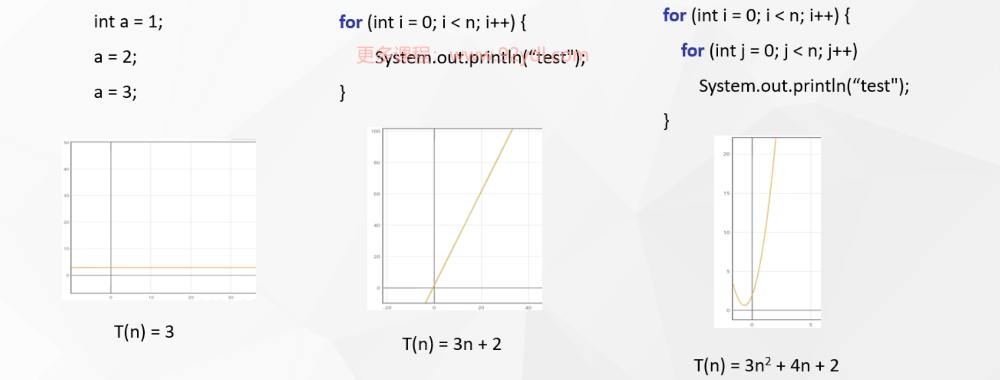

##### 复杂度的大O表示法

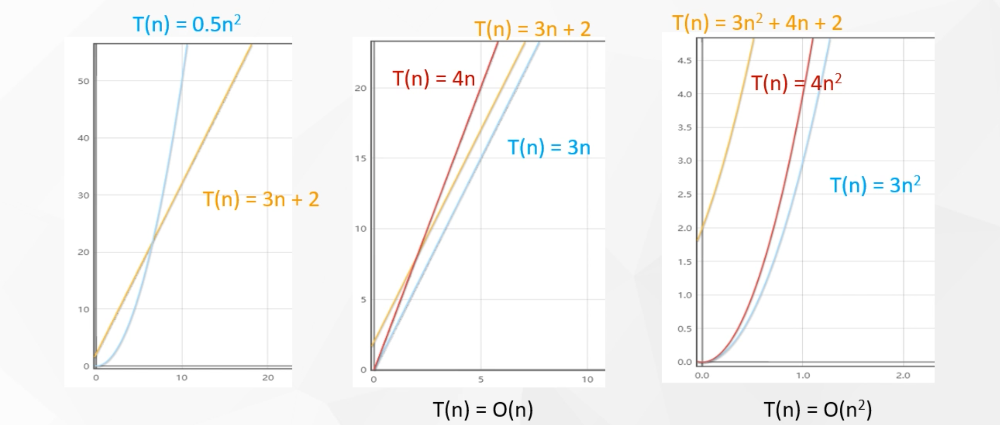

对于给定的函数`g(n)`，用`O(g(n))`来表示以下函数的集合：

- `O(g(n)) = {f(n)：存在正常量C和N0，使得对所有的N>= N0，有0<=f(n)<=Cg(n)}`

算法分析中，一般用大O符号来表示函数的渐进上界

这表示，当数据量达到一定的程度的时候，`g(n)`的增长速度不会超过`O(g(n))`限定的范围

##### 常见的算法复杂度

`O(1)\O(log(n))\O(√n)\O(n)\O(nlog(n))\O(n²)\O(e^n)`

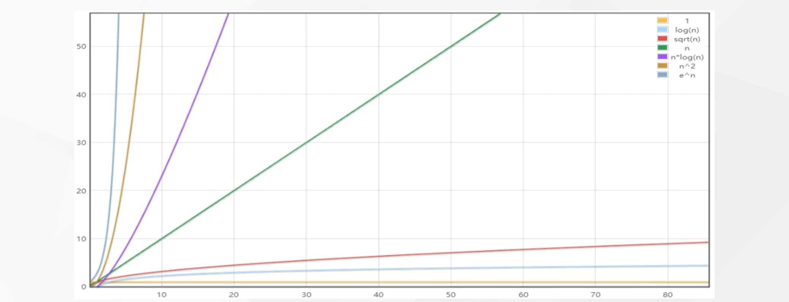

#### 空间复杂度

算法执行所占用的空间

- `Array[100]` `O(100)`
- `Array[N]` `O(N)`
- `int val=1;` 空间复杂度 `O(1)`

有时候递归调用，需要计算调用栈所占用的空间

### 算法分类

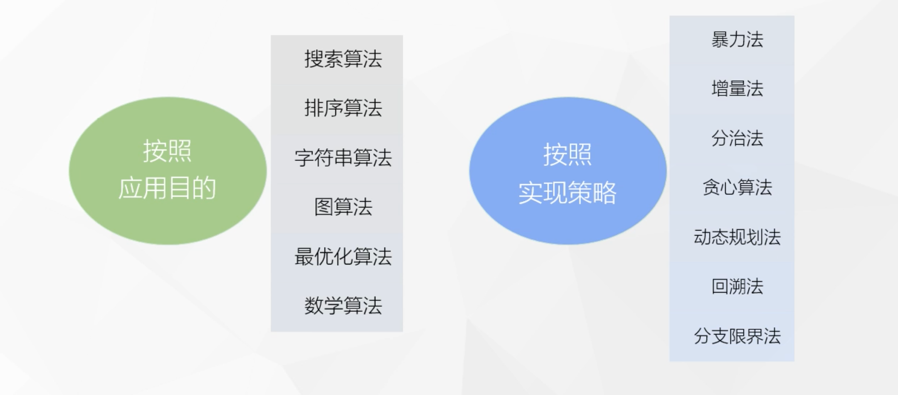

应用的目的方式的分类之后会在各个章节中在讲到该类型的时候说到，下面将会大概的说明实现策略分类方式的分类说明

#### 暴力法

穷举出所有的可能的结果

#### 增量法

输入刚开始是比较的少的，然后逐渐增加输入的数据量，比如插入排序法

#### 分治算法

1. 分而治之

- 问题的规模越小，越容易解决
- 把复杂问题不断分成多个相同或相似的子问题，直到每个子问题可以简单的进行求解
- 将所有的子问题的解合并起来，就是原问题的解

2. 分治和递归

- 产生的子问题形式往往和原问题相同，只是原问题的较小规模表达
- 使用递归手段求解子问题，可以很容地将子问题的解合并，得到原问题的解

3. 基本步骤

- 将原问题分解为若干规模较小，相互独立，与原问题形式相同的子问题
- 若子问题规模较小而容易被解决则直接解，否则递归的解决各个子问题
- 将各个子问题的解合并为原问题的解

4. 应用场景

- 二分搜索、大整数乘法、归并排序、快速排序
- 棋盘覆盖问题、循环赛日程表问题、汉诺塔问题等

#### 贪心算法

1. 贪心(Greedy)-总是做出在当前看来是最好的选择

- 不从整体考虑、只考虑眼前、得到**局部最优解**

2. 局部最优解和全局最优解

- 要保证最终得到的是全局最优解，贪心策略必须具备**无后效型**
- 股票的顶分型和下一个更高的顶分型，当前第一个顶分型已经是局部最优解

3. 适用场景

- 贪心算法直接求解全局最优，条件比较苛刻
- 哈夫曼(Huffman)编码

4. 具体实现框架

```
从问题的某一初始解出发;
while(能朝给定总目标前进一步){
    利用可行的策略，求出可行解的一个解元素;
}
由所有的解元素组合成问题的一个可行解;
```

#### 动态规划

```markdown
- 多阶段的最优解，去除了相同子问题的重复计算
- 后面的阶段要依赖之前的阶段做决策，也就是当前执行到第一阶段的时候，可能选择决策1是最优的，那么在之后的阶段中，只能依赖决策1产生的结果来进行决策，整体来看或许不是最优解
- 只能是局部最优解
```

1. 动态决策的过程

- 把原问题分成多个“阶段”，依次来做“决策”，得到当前的局部解
- 每次决策依赖于当前的“状态”，随即引起状态的转移
- 一个决策序列就是在变化的状态中产生出来的
- 这种多阶段最优化，解决问题的过程就称为**动态规范**

2. 最优化问题

- 动态规划通常用来求解最优化问题
- 可以有很多可行解，每个解都对应一个值，我们希望找到具有最优值的解

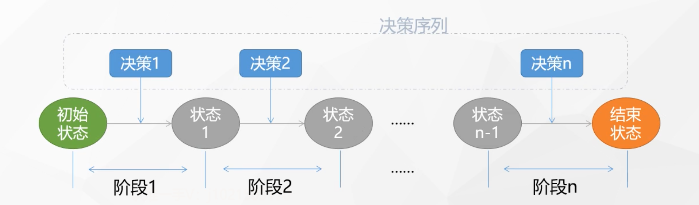

3. 应用场景

- 最优二叉搜索数、最长公共子序列、背包问题等等

#### 回溯法

1. 选优搜索法

- 按照一定的选优条件，不停的向前搜索，直到达到目标
- 如果搜索到某一步，发现之前的选择并不优，就退回一步重新选择
- 通用解题方法

2. 深度优先搜索(DFS)策略

```markdown
DFS就是对树、图的深度回溯法
```

- 在包含问题所有解的解空间树中，按照深度优先搜索的策略，从根节点出发、深度搜索解空间树
- 回溯法就是对隐式图的深度优先搜索算法

#### 分支限界法

1. 广度优先搜索（BFS）策略

- 所谓分支，就是采用广度优先的策略，一次搜索当前节点的所有分支
- 抛弃不满足约束条件的相邻节点，其余节点加入“活动点表”
- 然后从表中选择一个节点作为下一个扩展节点，继续搜索

2. 限界策略

- 为了加速搜搜的进程，一般会在每一个活节点处，计算一个函数值
- 根据这些已计算出的函数值，从当前活节点表中选择一个最有利的节点作为扩展节点，使搜索朝着解空间树上有最优解的分支推进，以便尽快的找出一个最优解

3. 回溯法 VS 分支限界法

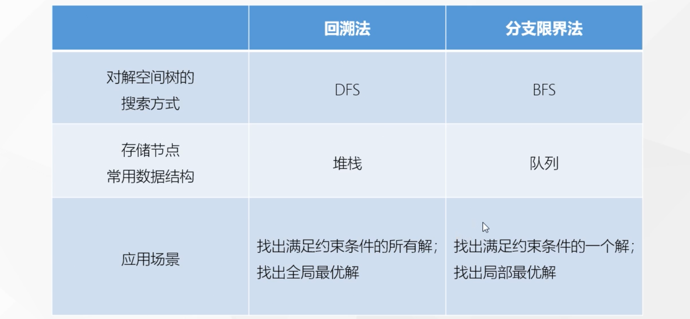

### 常见经典算法

- 二分查找
- 快速查找、归并排序
- KMP算法
- 快慢指针（双指针法）
- 普利姆（Prim）和克鲁斯卡尔（Kruskal）算法
- 迪克斯特拉（Dijkstra）算法
- 其他优化算法：模拟退火、蚁群、遗传算法

### leetcode说明

网址：

```https
https://leetcode-cn.com/problemset/all/
```

## 数组问题解析

在程序设计中，为了处理方便，尝尝需要把具有相同类型的若干元素按照有序的形式组织起来，这种形式就是数组

对数组的处理需要注意以下特点：

- 首先数组会利用索引来记录每个元素在数组中的位置，且在大多数的编程语言中，索引是从0开始计算的，事实上，这里的索引就是内存地址
- 其次，作为线性表的实现方式之一，数组中的元素在内存中是连续存储的，且每个元素占用相同大小的内存

### 两数之和

#### 题目说明

> 地址：https://leetcode-cn.com/problems/two-sum/
>
> 给定一个整数数组 nums 和一个整数目标值 target，请你在该数组中找出 和为目标值 target 的那两个整数，并返回它们的数组下标。你可以假设每种输入只会对应一个答案。但是，数组中同一个元素在答案里不能重复出现。
>
> 你可以按任意顺序返回答案。
>
> 示例 1：
>
> 输入：`nums = [2,7,11,15], target = 9`
>
> 输出：`[0,1]`
>
> 解释：因为 `nums[0] + nums[1] == 9` ，返回 `[0, 1]` 。
>
> 
>
> 示例 2：
>
> 输入：`nums = [3,2,4], target = 6`
>
> 输出：`[1,2]`
>
> 
>
> 示例 3：
>
> 输入：`nums = [3,3], target = 6`
>
> 输出：`[0,1]`
>
> 提示：
>
> - `2 <= nums.length <= 104`
>
> - `-109 <= nums[i] <= 109`
>
> - `-109 <= target <= 109`
>
> 只会存在一个有效答案
>
> 
>
> 进阶：你可以想出一个时间复杂度小于 O(n2) 的算法吗？

#### 解决办法

##### 暴力法

思考

- 直接使用两次遍历，在数组中找到对应的另一半

代码

```java
package com.exmple.algorithm.twosum;

import java.util.Arrays;

public class Solution {
    /**
     * 方法一：暴力法，穷举所有的两数集合
     *
     * 时间复杂度：O(n^2)
     *
     * @param nums
     * @param target
     * @return
     */
    public int[] twoSum(int[] nums, int target) {
        // 双重for循环
        for (int i = 0; i < nums.length; i++) {
            for (int j = i + 1; j < nums.length; j++) {
                if (nums[i] + nums[j] == target)
                    return new int[]{i, j};
            }
        }
        // 如果找不到抛出异常
        throw new RuntimeException("无解");
    }

    public static void main(String[] args) {
        final int[] sum = new Solution().twoSum(new int[]{2, 7, 11, 15}, 9);
        System.out.println(Arrays.toString(sum));
    }
}
```

时间复杂度为`O(n^2)`，能否优化

##### 两遍哈希表

思考

- 是否可以通过排序之后在获取值
  - 因为快排的时间复杂度是O(nlogn)，这样就可以通过一次遍历获取结果，时间复杂度为`O(n)`
  - 相对于二者，总的时间复杂度取较长的`O(nlogn)`
- 是否可以通过一次遍历获取就可以获取到结果（牺牲空间复杂度）
  - 线下相亲活动为例，之前暴力法是每个人都要匹配一遍
  - 每个人（数字）匹配的另一半是固定的，target就是他的标准
  - 这个时候就可以有一个媒婆，把大家根据target这个标准的另一半登记起来，然后有人要去相亲的时候，就去找媒婆看另一半是谁就好了

代码

```java
package com.exmple.algorithm.twosum;

import java.util.Arrays;
import java.util.HashMap;

public class Solution {
    /**
     * 方法二：使用hash表存储另一半
     * @param nums
     * @param target
     * @return
     */
    public int[] twoSum2(int[] nums, int target) {
        final HashMap<Integer, Integer> map = new HashMap<>();
        // 将数据全部保存入hash表
        for (int i = 0; i < nums.length; i++) {
            map.put(nums[i], i);
        }

        // 再次遍历数组，寻找每个数对应的那个数是否存在
        for (int i = 0; i < nums.length; i++) {
            final int thatNum = target - nums[i];
            // 如果那个数存在，并且不是当前数自身，就直接返回
            if (map.containsKey(thatNum) && map.get(thatNum) != i) {
                return new int[]{i, map.get(thatNum)};
            }
        }
        throw new RuntimeException("无解");
    }

    public static void main(String[] args) {
        final int[] sum = new Solution().twoSum2(new int[]{2, 2, 11, 15}, 4);
        System.out.println(Arrays.toString(sum));
    }
}
```

时间复杂度：`O(n)`

##### 一遍哈希表

思考

- 存在两次遍历，假如说当前相亲者登记的时候，需要的另一半已经登记过了，这个时候媒婆就可以直接告诉当前登记的相亲者，他的另一半已经等他很久了
- 即使是最后一个出现，往前面找的时候，也会找到对应的另一半
- 并且寻找的时候不需要遍历，因为存储在hash表中，直接拿取就可以了

代码

```java
package com.exmple.algorithm.twosum;

import java.util.Arrays;
import java.util.HashMap;

public class Solution {

    /**
     * 方法三：遍历一次hash表
     *
     * @param nums
     * @param target
     * @return
     */
    public int[] twoSum3(int[] nums, int target) {
        final HashMap<Integer, Integer> map = new HashMap<>();
        for (int i = 0; i < nums.length; i++) {
            final int thatNum = target - nums[i];
            if (map.containsKey(thatNum) && map.get(thatNum) != i) {
                return new int[]{map.get(thatNum), i};
            }

            map.put(nums[i], i);
        }
        throw new RuntimeException("无解");
    }

    public static void main(String[] args) {
        final int[] sum = new Solution().twoSum3(new int[]{2, 2, 11, 15}, 4);
        System.out.println(Arrays.toString(sum));
    }
}
```

时间复杂度：O(n)

### 三数之和

#### 题目说明

> 地址：https://leetcode-cn.com/problems/3sum/
>
> 给你一个包含 n 个整数的数组 nums，判断 nums 中是否存在三个元素 a，b，c ，使得 `a + b + c = 0`dd ？请你找出所有和为 0 且不重复的三元组。
>
> 注意：答案中不可以包含重复的三元组。
>
> 
>
> 示例 1：
>
> 输入：`·nums = [-1,0,1,2,-1,-4]`
> 输出：`[[-1,-1,2],[-1,0,1]]`
>
> 
>
> 示例 2：
>
> 输入：`nums = []`
> 输出：`[]`
>
> 示例 3：
>
> 输入：`nums = [0]`
> 输出：`[]`
>
>
> 提示：
>
> - `0 <= nums.length <= 3000`
> - `-105 <= nums[i] <= 105`

#### 解决办法

##### 暴力法

思考

直接使用暴力翻穷举

代码

```java
package com.exmple.algorithm.threenum;

import java.util.*;
import java.util.stream.Collectors;

class Solution {
    /**
     * 方法一 暴力法 穷举法
     *
     * @param nums
     * @return
     */
    public List<List<Integer>> threeSum1(int[] nums) {
        // 定义结果列表
        final List<List<Integer>> results = new ArrayList<>();
        for (int i = 0; i < nums.length - 2; i++) {
            for (int j = i + 1; j < nums.length - 1; j++) {
                for (int k = j + 1; k < nums.length; k++) {
                    if (nums[i] + nums[j] + nums[k] == 0) {
                        final List<Integer> list = Arrays.asList(nums[i], nums[j], nums[k]);
                      	// 排序，将相同的数组元素位置上处于同一位置
                        list.sort((o1, o2) -> o1 > o2 ? 1 : -1);
                        results.add(list);
                    }
                }
            }
        }
        // stream().distinct()去重
        // collect转集合
        return results.stream().distinct().collect(Collectors.toList());
    }

    public static void main(String[] args) {
        final int[] nums = {-1, 0, 1, 2, -1, -4};
        System.out.println(Arrays.toString(new Solution().threeSum1(nums).toArray()));
    }
}
```

时间复杂度：O(n^3)

##### 暴力法改进

要做去重，自然首先想到的，就是把结果保存到一张hash表里。仿照两数之和，直接存到HashMap里查找，代码如下：

```java
public List<List<Integer>> threeSum(int[] nums) {
int n = nums.length;
List<List<Integer>> result = new ArrayList<>();

Map<Integer, List<Integer>> hashMap = new HashMap<>();
    
		// 遍历数组，寻找每个元素的thatNum
    for( int i = 0; i < n; i++ ){
        int thatNum = 0 - nums[i];

        if( hashMap.containsKey(thatNum) ){
            List<Integer> tempList = new ArrayList<>(
hashMap.get(thatNum));
            tempList.add(nums[i]);
            result.add(tempList);
            continue;
        }
        for( int j = 0; j < i; j++ ){
            int newKey = nums[i] + nums[j];
            if( ! hashMap.containsKey(newKey) ){
                List<Integer> tempList = new ArrayList<>();
                tempList.add(nums[j]);
                tempList.add(nums[i]);
                hashMap.put( newKey, tempList );
            }
        }
    }
    return result;
}
```

时间复杂度降为N^2，空间复杂度O(N)。

但是，我们加一个输入`[0,0,0,0]`，会发现 结果不正确。因为尽管通过HashMap存储可以去掉相同二元组的计算结果的值，但没有去掉重复的输出（三元组）。这就导致，0对应在HashMap中有一个值`（0，List（0，0））`，第三个0来了会输出一次，第四个0来了又会输出一次。

如果希望解决这个问题，那就需要继续整个代码复杂度会变得更高。加入其它的判断来做去重

##### 双指针法

###### 思路

暴力法搜索时间复杂度为O(n^3)，要进行优化，可以通过双指针动态消除无效解来提高效率

双指针的思路，又分为左右指针和快慢指针两种

我们这里用的是左右指针。左右指针其实借鉴的就是分治的思想，简单来说，就是在数组头尾各放置一个指针，先让头部的指针（左指针）右移，移不动的时候，再让尾部的指针（右指针）左移，最终两个指针相遇，那么搜索就结束了

**双指针法铺垫**：先将给定的nums排序，复杂度为`O(nlogn)`

首先，我们可以想到，数字求和，其实根每个数的大小是有关系的，如果能先将数组排序，那后面肯定会容易很多

之前我们搜索数组，时间复杂度至少都为`O(n^2)`，而如果使用快排或者归并，排序的复杂度是`O(nlogn)`，最多也是`O(n^2)`，所以增加一步排序，不会导致整体时间复杂度上升


下面我们通过图解，来看一下具体的操作流程

**具体操作流程**

1. 初状态，定义左右指针L和R，并以指针i遍历数组元素

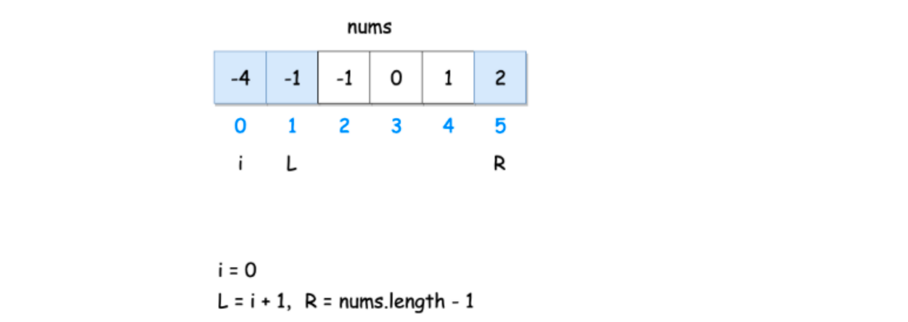

固定 3 个指针中最左（最小）数字的指针 i，双指针 L，R 分设在数组索引 `(i, len(nums))` 两端，所以初始值，`i=0；L=i+1；R=nums.length-1`。通过L、R双指针交替向中间移动，记录对于每个固定指针 i 的所有满足 nums[i] + nums[L] + nums[R] == 0 的 L,R 组合

两个基本原则：

- 当 `nums[i] > 0` 时直接break跳出：因为 `nums[R] >= nums[L] >= nums[i] > 0`，即 3 个数字都大于 0 ，在此固定指针 i 之后不可能再找到结果了。
- 当 `i > 0`且`nums[i] == nums[i - 1]`时，即遇到重复元素时，跳过此元素`nums[i]`：因为已经将 nums[i - 1] 的所有组合加入到结果中，本次双指针搜索只会得到重复组合

2. 固定i，判断sum，然后移动左右指针L和R。L，R 分设在数组索引` (i, len(nums))` 两端，当L < R时循环计算当前三数之和：`sum = nums[i] + nums[L] + nums[R]`，并按照以下规则执行双指针移动：

- 当`sum < 0`时，L ++并跳过所有重复的`nums[L]`；

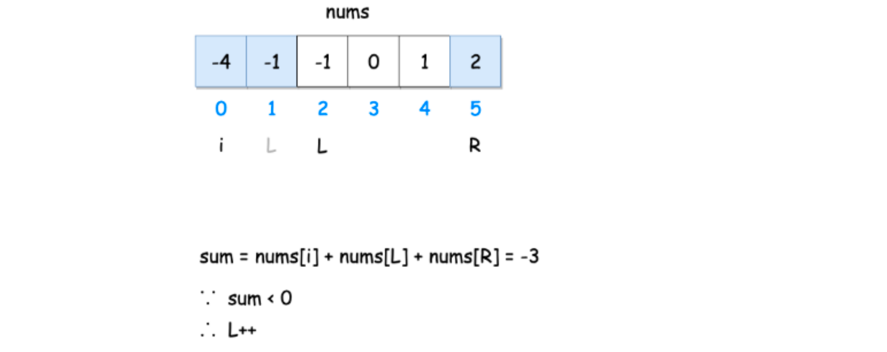

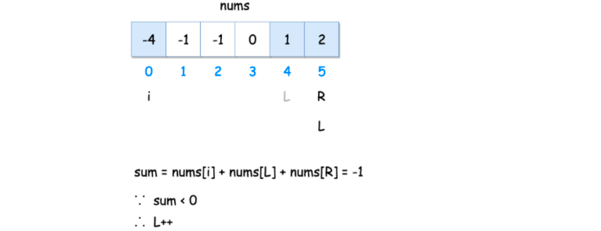

- 由于`sum<0`，L一直右移，直到跟R重合。如果依然没有结果，那么`i++`，换下一个数考虑。如果遇到相同的核心，直接跳过，因为相同的核心，其他它和其他的队友已经匹配过了

换下一个数，`i++`，继续移动双指针：

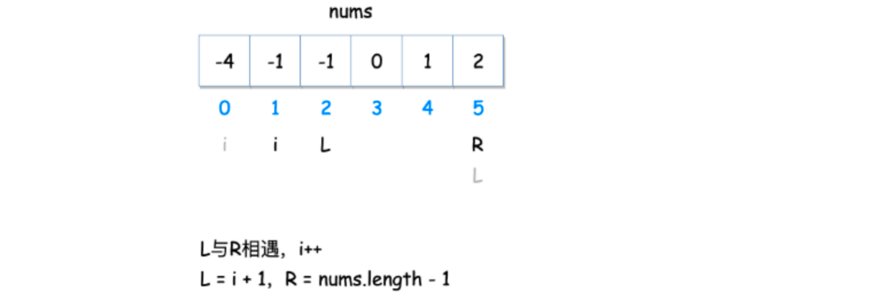

初始同样还是`L=i+1，R=nums.length-1`。同样，继续判断sum。

- 找到一组解之后，继续移动L和R，判断sum，如果小于0就右移L，如果大于0就左移R：

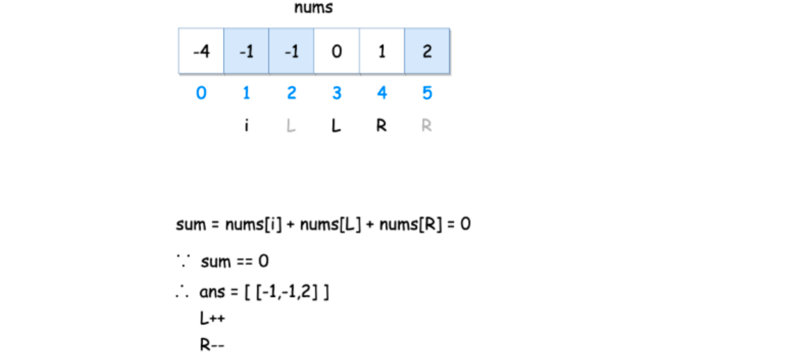

找到一组解`[-1,-1,2]`，保存，并继续右移L。判断sum，如果这时`sum=-1+0+2>0`，（R还没变，还是5），那么就让L停下，开始左移R。

- 一直移动，又找到一组解

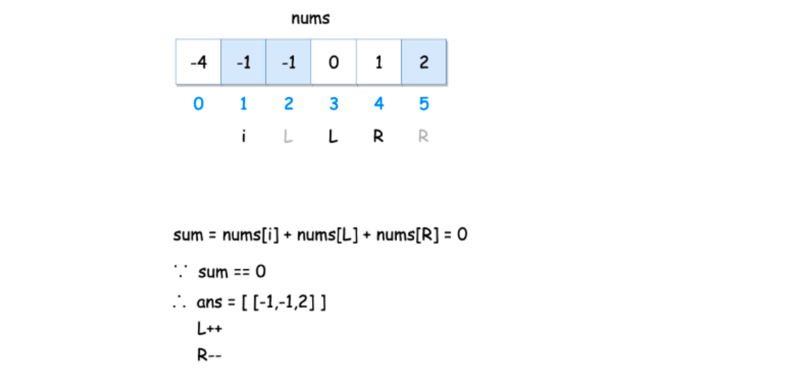

如果又找到sum=0的一组解，把当前的[-1,0,1]也保存到结果数组。继续右移L。

- 如果L和R相遇或者`L>R`，代表当前i已经排查完毕，i++；如果i指向的数跟i-1一样，那么直接继续i++，考察下一个数；

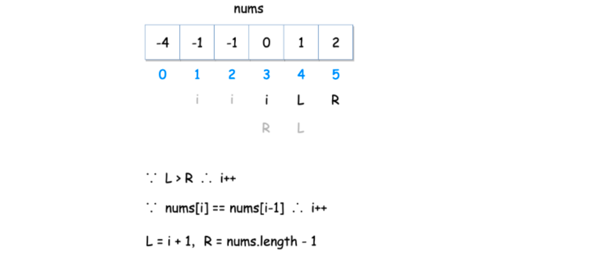

- 这时i=3，类似地，当`sum > 0`时，R左移R -= 1，并跳过所有重复的`nums[R]`；

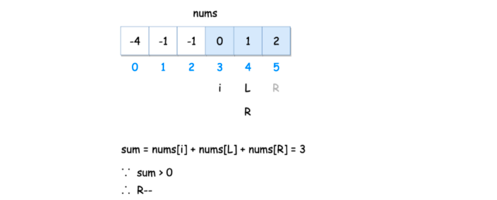

- L和R相遇，结束当前查找，`i++`。

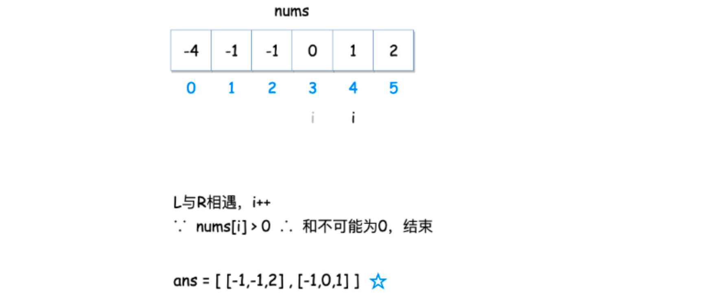

当 `nums[i] > 0` 时直接break跳出：过程结束。

所以，最终的结果，就是`[-1,-1,2],[-1,0,1]`。

###### 代码

```java
package com.exmple.algorithm.threenum;

import java.util.*;
import java.util.stream.Collectors;

class Solution {

    /**
     * 双指针法
     *
     * @param nums
     * @return
     */
    public List<List<Integer>> threeSum3(int[] nums) {
        final List<List<Integer>> results = new ArrayList<>();

        // 排序
        Arrays.sort(nums);

        // 双指针移动
        // 1 遍历每一个元素，作为当前三元组中最小的那个（最矮的那个作为核心）
        for (int i = 0; i < nums.length; i++) {
            // 如果当前数组已经大于0 直接退出循环
            if (nums[i] > 0) break;

            // 如果出现重复数据，也就是作为核心的已经遍历，直接跳过
            if (i > 0 && nums[i] == nums[i - 1]) continue;

            // 常规情况，以当前数作为核心，定义左右指针，往中间靠拢
            int lp = i + 1;
            int rp = nums.length - 1;

            // 只要左右指针不重叠，就继续移动指针
            while (lp < rp) {
                int sum = nums[i] + nums[lp] + nums[rp];
                // 判断sum与0做大小对比
                if (sum == 0) {
                    // 等于0 找到一组解
                    results.add(Arrays.asList(nums[i], nums[lp], nums[rp]));
                    lp++;
                    rp--;

                    // 如果移动之后的元素和当前元素相同，直接跳过
                    while (lp < rp && nums[lp] == nums[lp - 1]) {
                        lp++;
                    }
                    while (lp < rp && nums[rp] == nums[rp + 1]) {
                        rp--;
                    }
                } else if (sum < 0) {
                    // 小于0，较小的数增大，左指针右移
                    lp++;
                } else {
                    // 大于0，较大的数减小，右指针左移
                    rp--;
                }
            }
        }

        return results;
    }

    public static void main(String[] args) {
        final int[] nums = {-1, 0, 1, 2, -1, -4};
        System.out.println(Arrays.toString(new Solution().threeSum3(nums).toArray()));
    }
}
```

时间复杂度：O(n^2)

### 下一个排列

#### 题目说明

> 网址：https://leetcode-cn.com/problems/next-permutation/
>
> 实现获取 下一个排列 的函数，算法需要将给定数字序列重新排列成字典序中下一个更大的排列（即，组合出下一个更大的整数）。
>
> 如果不存在下一个更大的排列，则将数字重新排列成最小的排列（即升序排列）。
>
> 必须 原地 修改，只允许使用额外常数空间。
>
>  
>
> 示例 1：
>
> 输入：`nums = [1,2,3]`
> 输出：`[1,3,2]`
>
> 示例 2：
>
> 输入：`nums = [3,2,1]`
> 输出：`[1,2,3]`
> 示例 3：
>
> 输入：`nums = [1,1,5]`
> 输出：`[1,5,1]`
>
> 示例 4：
>
> 输入：`nums = [1]`
> 输出：`[1]`
>
>
> 提示：
>
> `1 <= nums.length <= 100`
> `0 <= nums[i] <= 100`
>
> 来源：力扣（LeetCode）
> 链接：https://leetcode-cn.com/problems/next-permutation
> 著作权归领扣网络所有。商业转载请联系官方授权，非商业转载请注明出处。

#### 解决办法

##### 暴力法

最简单的想法就是暴力枚举，我们找出由给定数组的元素形成的列表的每个可能的排列，并找出比给定的排列更大的排列。

但是这个方法要求我们找出所有可能的排列，这需要很长时间，实施起来也很复杂。因此，这种算法不能满足要求。 我们跳过它的实现，直接采用正确的方法。

复杂度分析

- 时间复杂度：O(n!)，可能的排列总计有 n! 个
- 空间复杂度：O(n)，因为数组将用于存储排列

时间和空间都超出了要求

#### 一遍扫描

首先，我们观察到对于任何给定序列的降序排列，就不会有下一个更大的排列。

例如，以下数组不可能有下一个排列：`[9, 5, 4, 3, 1]`

这时应该直接返回升序排列。

所以对于一般的情况，如果有一个“升序子序列”，那么就一定可以找到它的下一个排列。具体来说，需要从右边找到第一对两个连续的数字 `a[i]` 和 `a[i-1]`，它们满足 `a[i]>a[i-1]`。

所以一个思路是，找到最后一个的“正序”排列的子序列，把它改成下一个排列就行了。

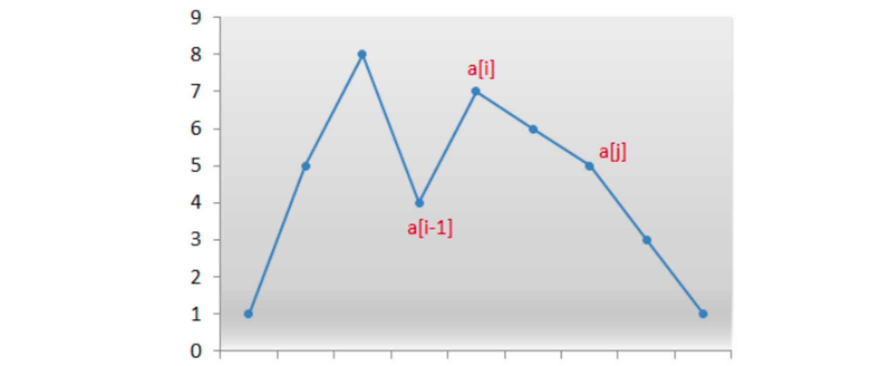

不过具体操作会发现，如果正序子序列后没数了，那么子序列的“下一个”一定就是整个序列的“下一个”，这样做没问题；但如果后面还有逆序排列的数，这样就不对了。比如

`[1,3,8,7,6,2]`

最后的正序子序列是[1,3,8]，但显然不能直接换成[1,8,3]就完事了；而是应该考虑把3换成后面比3大、但比8小的数，而且要选最小的那个（6）。接下来，还要让6之后的所有数，做一个升序排列，得到结果：

`[1,6,2,3,7,8]`

```markdown
找到升序a[i-1]和a[i]，即a[i-1]<a[i]，在a[i-1]后面的找到比a[i-1]大的最小的数，放到i-1位置上，然后后面剩下的数，升序排列，得出的数就是当前传入的数的下一个排列
```

##### 实现代码

```java
package com.exmple.algorithm.nextpermutation;

import java.util.Arrays;

public class Solution {
    public void nextPermutation(int[] nums) {
        // 从后往前找到升序子序列，找到第一次下降的数，位置记为k
        int k = nums.length - 2;
        while (k >= 0 && nums[k] >= nums[k + 1]) {
            k--;
        }

        // 得到的k就是需要调整部分的最高位
        // 如果k=-1，说明所有的数都是降序排列
        if (k == -1) {
            Arrays.sort(nums);
            return;
        }

        // 一般情况，k>=0
        // 找出要跟nums[k]替换的值，一直往后找，直到找到一个比nums[k]小的，当前值的前一个就是比nums[k]大的值中最小的
        int j = k + 2;
        while (j < nums.length && nums[j] > nums[k]) {
            j++;
        }
        // 此时找到的j-1就是后面部分比nums[k]大的值中最小的
        int temp = nums[k];
        nums[k] = nums[j - 1];
        nums[j - 1] = temp;

        // 将k+1以及之后的所有数变成升序，因为之后其实已经是降序的，所以直接前后互换
        int start = k + 1;
        int end = nums.length - 1;
        while (start < end) {
            int t = nums[start];
            nums[start] = nums[end];
            nums[end] = t;
            start++;
            end--;
        }
    }

    public static void main(String[] args) {
        final int[] nums = {1, 5, 1};
        new Solution().nextPermutation(nums);
        System.out.println(Arrays.toString(nums));
    }
}
```

时间复杂度：快排的时间复杂度`O(nlogn)`，在处理特殊情况上使用的排序，导致整体的时间复杂度上升，其实这里的特殊情况和后面的逆序改升序是一样的，所以我们直接使用双指针前后替换就可以了

```java
package com.exmple.algorithm.nextpermutation;

import java.util.Arrays;

public class Solution {
    public void nextPermutation(int[] nums) {
        // 从后往前找到升序子序列，找到第一次下降的数，位置记为k
        int k = nums.length - 2;
        while (k >= 0 && nums[k] >= nums[k + 1]) {
            k--;
        }

        // 得到的k就是需要调整部分的最高位
        // 如果k=-1，说明所有的数都是降序排列
        if (k == -1) {
            reverse(nums, 0, nums.length - 1);
            return;
        }

        // 一般情况，k>=0
        // 找出要跟nums[k]替换的值，一直往后找，直到找到一个比nums[k]小的，当前值的前一个就是比nums[k]大的值中最小的
        int j = k + 2;
        while (j < nums.length && nums[j] > nums[k]) {
            j++;
        }
        // 此时找到的j-1就是后面部分比nums[k]大的值中最小的
        swap(nums, k, j);

        // 将k+1以及之后的所有数变成升序，因为之后其实已经是降序的，所以直接前后互换
        int start = k + 1;
        int end = nums.length - 1;
        reverse(nums, start, end);
    }

    /**
     * 将降序数组的旋转的操作提取出来
     *
     * @param nums
     * @param start
     * @param end
     */
    private void reverse(int[] nums, int start, int end) {
        while (start < end) {
            swap(nums, start, end);
            start++;
            end--;
        }
    }

    /**
     * 交换两个位置的元素
     *
     * @param nums
     * @param k
     * @param j
     */
    private void swap(int[] nums, int k, int j) {
        int temp = nums[k];
        nums[k] = nums[j - 1];
        nums[j - 1] = temp;
    }

    public static void main(String[] args) {
        final int[] nums = {1, 5, 1};
        new Solution().nextPermutation(nums);
        System.out.println(Arrays.toString(nums));
    }
}
```

### 旋转图像

#### 题目说明

> 网址：https://leetcode-cn.com/problems/rotate-image/
>
> 给定一个 n × n 的二维矩阵 matrix 表示一个图像。请你将图像顺时针旋转 90 度。
>
> 你必须在 原地 旋转图像，这意味着你需要直接修改输入的二维矩阵。请不要 使用另一个矩阵来旋转图像。
>
> 示例1：
>
> 
>
> ```markdown
> 输入：matrix = [[1,2,3],[4,5,6],[7,8,9]]
> 输出：[[7,4,1],[8,5,2],[9,6,3]]
> ```
>
> 示例2：
>
> 
>
> ```markdown
> 输入：matrix = [[5,1,9,11],[2,4,8,10],[13,3,6,7],[15,14,12,16]]
> 输出：[[15,13,2,5],[14,3,4,1],[12,6,8,9],[16,7,10,11]]
> ```
>
> 示例 3：
>
> ```markdown
> 输入：matrix = [[1]]
> 输出：[[1]]
> ```
>
>
> 示例 4：
>
> ```markdown
> 输入：matrix = [[1,2],[3,4]]
> 输出：[[3,1],[4,2]]
> ```
>
>
> 提示：
>
> ```markdown
> matrix.length == n
> matrix[i].length == n
> 1 <= n <= 20
> -1000 <= matrix[i][j] <= 1000
> ```

#### 分析

旋转图像，这个应用在图片处理的过程中，非常常见。我们知道对于计算机而言，图像，其实就是一组像素点的集合（所谓点阵），所以图像旋转的问题，本质上就是一个二维数组的旋转问题。

#### 解决办法

##### 数学方法：转置在翻转

我们可以利用矩阵的特性。所谓顺时针旋转，其实就是先转置矩阵，然后翻转每一行。 

代码

```java
package com.exmple.algorithm.rotateimage;

import java.util.Arrays;

public class Solution {
    /**
     * 方法一 数学方法，先转置然后在反转每一行
     *
     * @param matrix
     */
    public void rotate1(int[][] matrix) {
        // 转置
        for (int i = 0; i < matrix.length; i++) {
            for (int j = i; j < matrix[i].length; j++) {
                int temp = matrix[i][j];
                matrix[i][j] = matrix[j][i];
                matrix[j][i] = temp;
            }
        }

        // 反转每一行
        for (int i = 0; i < matrix.length; i++) {
            int start = 0;
            int end = matrix[i].length - 1;
            while (start < end) {
                int temp = matrix[i][start];
                matrix[i][start] = matrix[i][end];
                matrix[i][end] = temp;
                start++;
                end--;
            }
        }
    }

    public static void main(String[] args) {
        final int[][] matrix = {{1, 2, 3}, {4, 5, 6}, {7, 8, 9}};
        new Solution().rotate1(matrix);
        System.out.println(Arrays.deepToString(matrix));
    }
}
```

- 时间复杂度：这个简单的方法已经能达到最优的时间复杂度O(N^2) ，因为既然是旋转，那么每个点都应该遍历到，N^2的复杂度不可避免。

- 空间复杂度：O(1)。旋转操作是原地完成的，只耗费常数空间。

##### 分治法：分为四部分旋转

方法 1 使用了两次矩阵操作，能不能只使用一次操作的方法完成旋转呢？

为了实现这一点，我们来研究每个元素在旋转的过程中如何移动。


这提供给我们了一个思路，可以将给定的矩阵分成四个矩形并且将原问题划归为旋转这些矩形的问题。这其实就是分治的思想。


具体解法也很直接，可以在每一个矩形中遍历元素，并且在长度为 4 的临时列表中移动它们。

代码

```java
package com.exmple.algorithm.rotateimage;

import java.util.Arrays;

public class Solution {

    /**
     * 方法二 ：分治思想 分为四个子矩阵分别考虑
     *
     * @param matrix
     */
    public void rotate2(int[][] matrix) {
        // 遍历四分之一矩阵，左上角
        for (int i = 0; i < matrix.length / 2 + matrix.length % 2; i++) {
            for (int j = 0; j < matrix.length / 2; j++) {
                // 对于matrix[i][j]，需要找到不同的四个矩阵中对应的另外三个位置和元素
                // 定义一个临时数组，保存对应的四个元素
                int[] tmp = new int[4];
                int row = i;
                int col = j;
                // 行列转换的规律：matrix.length-1-row->newCol, col->newRow
                for (int k = 0; k < 4; k++) {
                    tmp[k] = matrix[row][col];
                    int x = row;
                    row = col;
                    col = matrix.length - 1 - x;
                }

                // 再次遍历，将存储到tmp中存储的四个位置的数据放置到旋转之后的位置
                for (int k = 0; k < 4; k++) {
                    matrix[row][col] = tmp[(3 + k) % 4]; // 用上一个值替换当前值的位置
                    int x = row;
                    row = col;
                    col = matrix.length - 1 - x;
                }
            }
        }
    }

    public static void main(String[] args) {
        final int[][] matrix = {{1, 2, 3}, {4, 5, 6}, {7, 8, 9}};
        new Solution().rotate2(matrix);
        System.out.println(Arrays.deepToString(matrix));
    }
}
```

复杂度分析

- 时间复杂度：O(N^2) 是两重循环的复杂度。

- 空间复杂度：O(1) 由于我们在一次循环中的操作是“就地”完成的，并且我们只用了长度为 4 的临时列表做辅助。

##### 分治法：改进成单次循环

大家可能也发现了，我们其实没有必要分成4个矩阵来旋转。这四个矩阵的对应关系，其实是一目了然的，我们完全可以在一次循环内，把所有元素都旋转到位。

因为旋转的时候，是上下、左右分别对称的，所以我们遍历元素的时候，只要遍历一半行、一半列就可以了（1/4元素）。

代码

```java
package com.exmple.algorithm.rotateimage;

import java.util.Arrays;

public class Solution {

    /**
     * 方法三 ：分治思想 分为四个子矩阵分别考虑
     * <p>
     * 方法二的改进
     *
     * @param matrix
     */
    public void rotate3(int[][] matrix) {
        // 遍历四分之一矩阵
        for (int i = 0; i < matrix.length / 2 + matrix.length % 2; i++) {
            for (int j = 0; j < matrix.length / 2; j++) {
                int temp = matrix[i][j];
                // 将上一个位置的数据存储到当前位置，上一个位置的行号和当前位置的列号相加等于matrix.length-1; 上一个位置的列号等于当前位置的行号
                matrix[i][j] = matrix[matrix.length - 1 - j][i];
                // 接着替换之前的位置的值为上上个位置
                matrix[matrix.length - 1 - j][i] = matrix[matrix.length - 1 - i][matrix.length - 1 - j];
                // 替换第三个
                matrix[matrix.length - 1 - i][matrix.length - 1 - j] = matrix[j][matrix.length - 1 - i];
                // 替换第四个
                matrix[j][matrix.length - 1 - i] = temp;
            }
        }
    }

    public static void main(String[] args) {
        final int[][] matrix = {{1, 2, 3}, {4, 5, 6}, {7, 8, 9}};
        new Solution().rotate3(matrix);
        System.out.println(Arrays.deepToString(matrix));
    }
}
```

复杂度分析

- 时间复杂度：O(N^2)，是两重循环的复杂度。

- 空间复杂度：O(1)。我们在一次循环中的操作是“就地”完成的。

## 二分查找相关问题讲解

### 二分查找理论讲解

二分查找也称为折半查找，它是一种效率较高的查找方法，前提是数据结构必须先排好序，可以在对数时间复杂度内完成查找

二分查找事实上采用的就是一种分治策略，它充分利用了元素间的次序关系，可在最坏的情况下用O(logn)完成搜索任务

它的基本思想是：假设数组元素呈升序排列，将n个元素分成个数大致相同的两半，取a[n/2]与欲查找的x做比较，如果x=a[n/2]则找到x，算法终止，如果x<a[n/2]，则我们只要在数组a的左半部分继续搜索x；如果x>a[n/2]，我们只要在数组a的右半部分继续搜索x

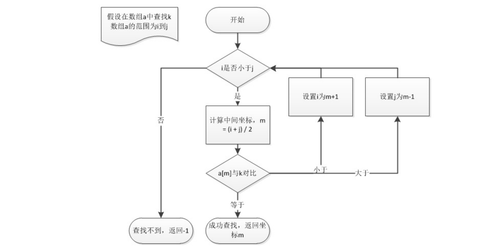

二分查找问题也是面试中经常考到的问题，虽然它的思想很简单，但写好二分查找算法并不是一件容易的事情。


接下来，我们首先用代码实现一个对int数组的二分查找。

双指针方式实现：

```java
package com.example.binary.search;

public class BinarySearch {
    public static int binarySearch(int[] a, int key) {
        // 定义初始的查找范围
        int start = 0;
        int end = a.length - 1;

        // 排除特殊情况
        if (key < a[start] || key > a[end])
            return -1;

        while (start <= end) {
            int middle = (start + end) / 2;

            if (key == a[middle])
                return middle;
            else if (key < a[middle]) {
                // 小于的话，取左半部分
                end = middle - 1;
            } else if (key > a[middle]) {
                // 大于的话，取右半部分
                start = middle + 1;
            }
        }
        return -1;
    }

    public static void main(String[] args) {
        final int[] a = {1, 2, 2, 3, 4, 4, 5, 9, 10};
        final int i = binarySearch(a, 7);
        System.out.println(i);
    }
}
```

递归实现方式

```java
package com.example.binary.search;

public class BinarySearch {

    /**
     * 递归实现二分查找
     *
     * @param a
     * @param key
     * @return
     */
    public static int binarySearch2(int[] a, int key, int start, int end) {
      	
      	// 特殊情况超出数组的范围
        if (start < 0 || end > a.length - 1)
            return -1;

        // 排除特殊情况
        if (key < a[start] || key > a[end])
            return -1;

        int middle = (start + end) / 2;

        if (key == a[middle])
            return middle;
        else if (key < a[middle]) {
            // 小于的话，取左半部分
            end = middle - 1;
        } else if (key > a[middle]) {
            // 大于的话，取右半部分
            start = middle + 1;
        }

        return binarySearch2(a, key, start, end);
    }

    public static void main(String[] args) {
        final int[] a = {1, 2, 2, 3, 4, 4, 5, 9, 10};
        final int i = binarySearch2(a, 7, 0, a.length - 1);
        System.out.println(i);
    }
}
```

我们总结一下二分查找：

- 优点是比较次数少，查找速度快，平均性能好；

- 缺点是要求待查表为有序表，且插入删除困难。

因此，二分查找方法适用于不经常变动而查找频繁的有序列表。使用条件：查找序列是顺序结构，有序。

### 力扣真题讲解

#### 搜索二维矩阵

##### 题目说明

> 编写一个高效的算法来判断 m x n 矩阵中，是否存在一个目标值。该矩阵具有如下特性：
>
> 每行中的整数从左到右按升序排列。
> 每行的第一个整数大于前一行的最后一个整数。
>
> 示例1：
>
> 
>
> ```markdown
> 输入：matrix = [[1,3,5,7],[10,11,16,20],[23,30,34,60]], target = 3
> 输出：true
> ```
>
> 示例2：
>
> 
>
> ```markdown
> 输入：matrix = [[1,3,5,7],[10,11,16,20],[23,30,34,60]], target = 13
> 输出：false
> ```
>
> 提示：
>
> `m == matrix.length`
> `n == matrix[i].length`
> `1 <= m, n <= 100`
> `-104 <= matrix[i][j], target <= 104`

##### 分析

既然这是一个查找元素的问题，并且数组已经排好序，我们自然可以想到用二分查找是一个高效的查找方式。

输入的 m x n 矩阵可以视为长度为 m x n的有序数组：

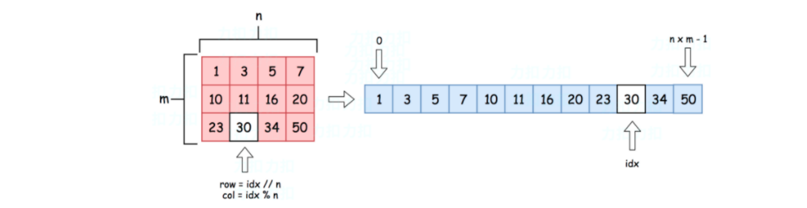

行列坐标为(row, col)的元素，展开之后索引下标为idx = row * n + col；反过来，对于一维下标为idx的元素，对应二维数组中的坐标就应该是：

`row = idx / n;  col = idx % n;`

##### 代码

```java
package com.example.binary.search.searcha2dmatrix;

/**
 * 已经有序的，可以使用二分查找，这样更快
 */
public class Solution {

    public boolean searchMatrix(int[][] matrix, int target) {
        // 判断matrix的情况
        final int m = matrix.length;
        if (m == 0)
            return false;

        final int n = matrix[0].length;

        int start = 0;
        int end = m * n - 1;

        while (start <= end) {

            int middle = (start + end) / 2;

            // 计算对应的行和列号
            final int midValue = matrix[middle / n][middle % n];

            if (target < midValue)
                end = middle - 1;
            else if (target > midValue)
                start = middle + 1;
            else
                return true;
        }

        return false;
    }

    public static void main(String[] args) {
        //final int[][] matrix = {{1, 3, 5, 7}, {10, 11, 16, 20}, {23, 30, 34, 60}};
        //final int[][] matrix = {{1, 1}};
        final int[][] matrix = {{1, 3}};
        final boolean result = new Solution().searchMatrix(matrix, 3);
        System.out.println(result);
    }
}
```

复杂度分析

- 时间复杂度 : 由于是标准的二分查找，时间复杂度为O(log(m n))。

- 空间复杂度 : 没有用到额外的空间，复杂度为O(1)。

#### 寻找重复数

##### 题目说明

> 给定一个包含 n + 1 个整数的数组 nums ，其数字都在 1 到 n 之间（包括 1 和 n），可知至少存在一个重复的整数。
>
> 假设 nums 只有 一个重复的整数 ，找出 这个重复的数 。
>
> 你设计的解决方案必须不修改数组 nums 且只用常量级 O(1) 的额外空间。
>
> 示例1：
>
> ```markdown
> 输入：nums = [1,3,4,2,2]
> 输出：2
> ```
>
> 示例2：
>
> ```markdown
> 输入：nums = [3,1,3,4,2]
> 输出：3
> ```
>
> 示例3：
>
> ```markdown
> 输入：nums = [1,1]
> 输出：1
> ```
>
> 示例4
>
> ```markdown
> 输入：nums = [1,1,2]
> 输出：1
> ```
>
> 提示
>
> ```markdown
> 1 <= n <= 105
> nums.length == n + 1
> 1 <= nums[i] <= n
> nums 中 只有一个整数 出现 两次或多次 ，其余整数均只出现 一次
> ```
>
> 进阶：
>
> - 如何证明 `nums` 中至少存在一个重复的数字?
> - 你可以设计一个线性级时间复杂度 `O(n)` 的解决方案吗？

##### 分析

怎样证明 nums 中存在至少一个重复值？其实很简单，这是“抽屉原理”（或者叫“鸽子洞原理”）的简单应用。

这里，nums 中的每个数字（n+1个）都是一个物品，nums 中可以出现的每个不同的数字（n个）都是一个 “抽屉”。把n+1 个物品放入n个抽屉中，必然至少会有一个抽屉放了2个或者2个以上的物品。所以这意味着nums中至少有一个数是重复的。

##### 解题方式

###### 方法一：保存元素法

首先我们想到，最简单的办法就是，遍历整个数组，挨个统计每个数字出现的次数。用一个HashMap保存每个数字对应的count数量，就可以直观地判断出是否重复了。

三本书放到两个抽屉中，至少有一个抽屉放入两本书

代码

```java
package com.example.binary.search.findtheduplicatenumber;

import java.util.HashMap;

public class Solution {
    /**
     * 方法一 使用map保存每个数出现的次数
     *
     * @param nums
     * @return
     */
    public int findDuplicate(int[] nums) {
        final HashMap<Integer, Integer> map = new HashMap<>();
        for (int i = 0; i < nums.length; i++) {
            // 判断当前值是否在map中出现过，如果出现过，就表示重复
            if (map.containsKey(nums[i]))
                return nums[i];
            map.put(nums[i], 1);
        }
        return -1;
    }

    public static void main(String[] args) {
        //final int[] nums = {1, 3, 4, 2, 2};
        //final int[] nums = {3, 1, 3, 4, 2};
        final int[] nums = {1, 1};
        final int duplicate = new Solution().findDuplicate(nums);
        System.out.println(duplicate);
    }
}
```

###### 保存元素法改进（存入Set）

当然我们应该还能想到，其实没必要用HashMap，直接保存到一个Set里，就知道这个元素到底有没有了

代码

```java
package com.example.binary.search.findtheduplicatenumber;

import java.util.HashSet;

public class Solution {

    /**
     * 使用hashset保存数据，判断是否出现过
     *
     * @param nums
     * @return
     */
    public int findDuplicate2(int[] nums) {
        final HashSet<Integer> set = new HashSet<>();
        for (int num : nums) {
            if (set.contains(num))
                return num;
            set.add(num);
        }
        return -1;
    }

    public static void main(String[] args) {
        //final int[] nums = {1, 3, 4, 2, 2};
        //final int[] nums = {3, 1, 3, 4, 2};
        final int[] nums = {1, 1};
        final int duplicate = new Solution().findDuplicate2(nums);
        System.out.println(duplicate);
    }
}
```

时间复杂度：O(n)，我们只对数组做了一次遍历，在HashMap和HashSet中查找的复杂度是O(1)。

空间复杂度：O(n)，我们需要一个HashMap或者HashSet来做额外存储，最坏情况下，这需要线性的存储空间。

尽管时间复杂度较小，但以上两种保存元素的方法，都用到了额外的存储空间，这个空间复杂度不能让我们满意。

###### 排序后查重

在排序后，如果前后两元素的值是相同的，就是重复元素

```java
package com.example.binary.search.findtheduplicatenumber;

import java.util.Arrays;

public class Solution {

    /**
     * 方法三 排序之后找相邻的相同元素
     *
     * @param nums
     * @return
     */
    public int findDuplicate3(int[] nums) {
        Arrays.sort(nums);

        // 遍历数组元素，每一个元素都需要跟前一个是相同的，就是重复元素
        for (int i = 1; i < nums.length; i++) {
            if (nums[i] == nums[i - 1])
                return nums[i];
        }
        return -1;
    }

    public static void main(String[] args) {
        //final int[] nums = {1, 3, 4, 2, 2};
        //final int[] nums = {3, 1, 3, 4, 2};
        final int[] nums = {1, 1};
        final int duplicate = new Solution().findDuplicate3(nums);
        System.out.println(duplicate);
    }
}
```

时间复杂度：O(nlogn)

空间复杂度：O(n)，只用到了O(1)额外的存储空间

###### 二分查找

这道题目中数组其实是很特殊的，我们可以从原始的 [1, N] 的自然数序列开始想。现在增加到了N+1个数，根据抽屉原理，肯定会有重复数。对于增加重复数的方式，整体应该有两种可能：

- 如果重复数（比如叫做target）只出现两次，那么其实就是1~N所有数都出现了一次，然后再加一个target；

- 如果重复数target出现多次，那在情况1的基础上，它每多出现一次，就会导致1~N中的其它数少一个。

例如：1~9之间的10个数的数组，重复数是6：

```markdown
1，2，5，6，6，6，6，6，7，9
```

本来最简单（重复数出现两次，其它1~9的数都出现一次）的是

```markdown
1，2，3，4，5，6，6，7，8，9
```

现在没有3、4和8，所以6会多出现3次。

我们可以发现一个规律： 

- 以target为界，对于比target小的数i，数组中所有小于等于它的数，最多出现一次（有可能被多出现的target占用了），所以总个数不会超过i。

- 对于比target大的数j，如果每个元素都只出现一次，那么所有小于等于它的元素是j个；而现在target会重复出现，所以总数一定会大于j。

用数学化的语言描述就是：

```markdown
我们把对于1~N内的某个数i，在数组中小于等于它的所有元素的个数，记为count[i]。
则：当i属于[1, target-1]范围内，count[i] <= i；当i属于[target, N]范围内，count[i] > i。
```

所以要找target，其实就是要找1~N中这个分界的数。所以我们可以对1~N的N个自然数进行二分查找，它们可以看作一个排好序的数组，但不占用额外的空间。

```markdown
二分查找查找的是下标，下标原本就是有序的
```

代码

```java
package com.example.binary.search.findtheduplicatenumber;

import java.util.Arrays;
import java.util.HashMap;
import java.util.HashSet;

public class Solution {

    /**
     * 方法四 二分查找，查找1-N自然数序列，寻找target
     *
     * @param nums
     * @return
     */
    public int findDuplicate4(int[] nums) {
        int start = 1;
        int end = nums.length - 1;
        while (start <= end) {
            // 计算中间值
            int middle = (start + end) / 2;
            // 对当前的middle 计算count值
            int count = 0;
            for (int i = 0; i < nums.length; i++) {
                if (nums[i] <= middle) count++;
            }

            // 判断count 和middle 本身的大小关系
            if (count <= middle)
                start = middle + 1; // count 小于middle 自身，表示后面有些数，不好好干活，为了让自己能重复占掉了前面的数的位置，所以start往后移
                // 等于 的话，就表示前面没有数是被占掉位置的，所以重复的数只能是在后面
            else
                end = middle;

            // 左右指针重合的时候，就是重复的那个元素的下标
            if (start == end)
                return start;
        }

        return -1;
    }

    public static void main(String[] args) {
        final int[] nums = {1, 3, 4, 2, 2};
        //final int[] nums = {3, 1, 3, 4, 2};
        //final int[] nums = {1, 1};
        final int duplicate = new Solution().findDuplicate4(nums);
        System.out.println(duplicate);
    }
}
```

复杂度分析

- 时间复杂度：O(nlog n)，其中 n 为nums[] 数组的长度。二分查找最多需要O(logn) 次，而每次判断count的时候需要O(n) 遍历 nums[] 数组求解小于等于 i 的数的个数，因此总时间复杂度为O(nlogn)。

- 空间复杂度：O(1)。我们只需要常数空间存放若干变量。

###### 快慢指针法（循环检测）

这是一种比较特殊的思路。把nums看成是顺序存储的链表，nums中每个元素的值是下一个链表节点的地址。那么如果nums有重复值，说明链表***\*存在环\****，本问题就转化为了找链表中环的入口节点，因此可以用***\*快慢指针\****解决。

比如数组

```java
[3，6，1，4，6，6，2]
```

保存为：


整体思路如下：

1. 第一阶段，寻找环中的节点

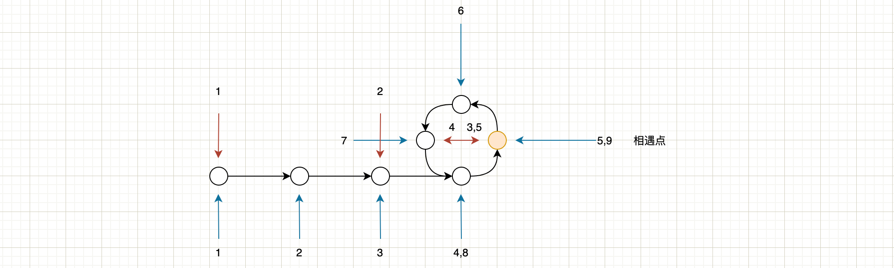

- 初始时，都指向链表第一个节点nums[0]；

- 慢指针每次走一步，快指针走两步；

- 如果有环，那么快指针一定会再次追上慢指针；相遇时，相遇节点必在环中

2. 第二阶段，寻找环的入口节点（重复的地址值）

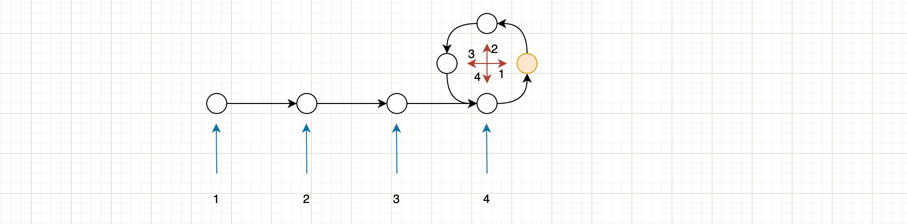

- 重新定义两个指针，让before，after分别指向链表开始节点，相遇节点
- before 和 after 每次分别走一步

- before与after相遇时，相遇点就是环的入口节点

3. 第二次相遇时，应该有：

```markdown
慢指针总路程 = 环外0到入口 + 环内入口到相遇点 (可能还有 + 环内m圈)
快指针总路程 = 环外0到入口 + 环内入口到相遇点 + 环内n圈
```

4. 并且，快指针总路程是慢指针的2倍。所以：

```markdown
环内n-m圈 = 环外0到入口 + 环内入口到相遇点。
```

5. 把环内项移到同一边，就有：

```markdown
环内相遇点到入口 + 环内n-m-1圈 = 环外0到入口
```

6. 这就很清楚了：

从环外0开始，和从相遇点开始，走同样多的步数之后，一定可以在入口处相遇。所以第二阶段的相遇点，就是环的入口，也就是重复的元素。

```markdown
# 只要存在重复元素，那么就存在闭环，在闭环中，快慢指针总会相遇
```

代码

```java
package com.example.binary.search.findtheduplicatenumber;

import java.util.Arrays;
import java.util.HashMap;
import java.util.HashSet;

public class Solution {


    /**
     * 方法五 快慢指针法
     *
     * @param nums
     * @return
     */
    public int findDuplicate5(int[] nums) {
        // 定义快慢指针
        int fast = 0, slow = 0;
        // 寻找环内的相遇点，快指针每次走两步，慢指针每次走一步，等到两个相等的时候就是相遇点
        do {
            slow = nums[slow]; // 走一步
            fast = nums[nums[fast]]; // 走两步
        } while (fast != slow);

        // 循环结束，fast和slow相等，就是相遇点

        // 寻找环的入口点
        // 另外定义两个指针，固定间距
        int before = 0, after = fast;
        while (before != after) {
            before = nums[before];
            after = nums[after];
        }
        // 循环结束，相遇点就是环的入口点，也就是重复的元素
        return before;
    }

    public static void main(String[] args) {
        final int[] nums = {1, 3, 4, 2, 2};
        //final int[] nums = {3, 1, 3, 4, 2};
        //final int[] nums = {1, 1};
        final int duplicate = new Solution().findDuplicate5(nums);
        System.out.println(duplicate);
    }
}
```

复杂度分析

- 时间复杂度：O(n)，不管是寻找环上的相遇点，还是环的入口，访问次数都不会超过数组长度。

- 空间复杂度：O(1)，我们只需要定义几个指针就可以了。

## 字符串问题讲解

字符串（String）是由零个或多个字符组成的有限序列，它是编程语言中表示文本的数据类型。

字符串与数组有很多相似之处，比如可以使用索引（下标）来得到一个字符。字符串，一般可以认为就是一个字符数组（char array）。不过字符串有其鲜明的特点，它的结构相对简单，但规模可能是非常庞大的。

在编程语言中，字符串往往由特定字符集内有限的字符组合而成。在 Java 中字符串属于对象，Java 提供了 String 类来创建和操作字符串。

### 字符串相加

#### 题目说明

> 网址：https://leetcode-cn.com/problems/add-strings/
>
> 给定两个字符串形式的非负整数 num1 和num2 ，计算它们的和并同样以字符串形式返回。
>
> 你不能使用任何內建的用于处理大整数的库（比如 BigInteger）， 也不能直接将输入的字符串转换为整数形式。
>
> 示例1：
>
> ```markdown
> 输入：num1 = "11", num2 = "123"
> 输出："134"
> ```
>
> 示例2：
>
> ```markdown
> 输入：num1 = "456", num2 = "77"
> 输出："533"
> ```
>
> 示例3：
>
> ```markdown
> 输入：num1 = "0", num2 = "0"
> 输出："0"
> ```
>
> 提示：
>
> ```mark
> 1 <= num1.length, num2.length <= 104
> num1 和num2 都只包含数字 0-9
> num1 和num2 都不包含任何前导零
> ```

#### 分析

```markdown
其实就是想要让我们自己实现BigInteger的加法
```

这里不允许直接将输入字符串转为整数，那自然想到应该把字符串按每个字符char一一拆开，相当于遍历整数上的每一个数位，然后通过“乘10叠加”的方式，就可以整合起来了。这相当于算术中的“竖式加法”。

另外题目要求不能使用BigInteger的内建库，这其实就是让我们自己实现一个大整数相加的功能。

#### 代码实现

```java
package com.example.strings.addstrings;

public class Solution {
    public String addStrings(String num1, String num2) {
        // 定义一个StringBuffer，保存最终的结果
        final StringBuffer result = new StringBuffer();
        // 定义遍历两个字符串的初始位置
        int i = num1.length() - 1;
        int j = num2.length() - 1;
        // 定义个保存进位的变量
        int carry = 0;

        // 从个位开始依次遍历所有数位，只要还有数位没有计算，就继续，其他位数补零，也就是两个数中位数少的那个，少的部分补零参与运算
        while (i >= 0 || j >= 0 || carry != 0) {
            // 取两数当前对应下标进行运算
            int n1 = i >= 0 ? num1.charAt(i) - '0' : 0;// num1.charAt(i) - '0'得到的就是当前数，其实就是把字符转成数字
            int n2 = j >= 0 ? num2.charAt(j) - '0' : 0;// num1.charAt(i) - '0'得到的就是当前数，其实就是把字符转成数字

            // 对当前数位求和
            int sum = n1 + n2 + carry;

            // 获取results值，把sum的个位保存到结果中，十位保存到carry中
            result.append(sum >= 10 ? sum % 10 : sum);
            // 获取进位
            carry = sum / 10;

            // 继续移动指针，遍历下一位
            i--;
            j--;
        }

        return result.reverse().toString();
    }

    public static void main(String[] args) {
        //final String num1 = "11", num2 = "123";
        //final String num1 = "456", num2 = "77";
        final String num1 = "0", num2 = "0";
        final String addStrings = new Solution().addStrings(num1, num2);
        System.out.println(addStrings);
    }
}
```

#### 复杂度分析

时间复杂度：O(max(len1,len2))，其中len1 =num1.length，len2 =num2.length。竖式加法的次数取决于较大数的位数。

空间复杂度：O(n)。解法中使用到了 StringBuffer，所以空间复杂度为 O(n)。

### 字符串相乘

#### 题目说明

> 网址：https://leetcode-cn.com/problems/multiply-strings/
>
> 给定两个以字符串形式表示的非负整数 `num1` 和 `num2`，返回 `num1` 和 `num2` 的乘积，它们的乘积也表示为字符串形式。
>
> 示例 1:
>
> ```markdown
> 输入: num1 = "2", num2 = "3"
> 输出: "6"
> ```
>
> 示例 2:
>
> ```markdown
> 输入: num1 = "123", num2 = "456"
> 输出: "56088"
> ```
>
> 说明：
>
> ```markdown
> num1 和 num2 的长度小于110。
> num1 和 num2 只包含数字 0-9。
> num1 和 num2 均不以零开头，除非是数字 0 本身。
> 不能使用任何标准库的大数类型（比如 BigInteger）或直接将输入转换为整数来处理。
> ```

#### 分析

跟“字符串相加”类似，这里我们要处理的，也是大整数的相乘问题。

思路也可以非常类似：我们借鉴数学中“竖式乘法”的规则，用num1分别去乘num2的每一位数字，最后再用AddStrings将乘出的结果全部叠加起来就可以了。

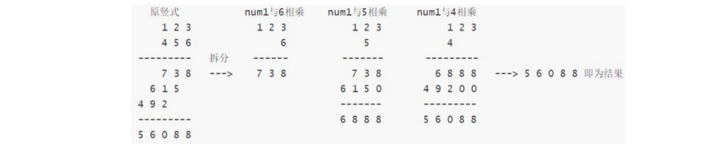

#### 具体代码实现

```java
package com.example.strings.multiplystrings;

public class Solution {
    public String multiply(String num1, String num2) {
        // 处理特殊情况，有一个乘数为零，结果就为零
        if (num1.equals("0") || num2.equals("0"))
            return "0";

        // 定义输出结果，直接定义为String，调用字符串相加的方法
        String result = "0";
        // 从个位开始遍历num2的每一位，跟num1相乘，并叠加计算结果
        for (int i = num2.length() - 1; i >= 0; i--) {
            // 取出num2当前数位作为当前乘法的第二个乘数
            int n2 = num2.charAt(i) - '0';
            // 用一个StringBuffer保存乘积结果
            final StringBuffer currResult = new StringBuffer();

            int carry = 0; // 定义进位

            // 因为结果是倒序，所以当前n2对应的数位要补的零应该先写入currResult
            for (int j = 0; j < num2.length() - 1 - i; j++) {
                currResult.append("0");
            }
            // 从个位开始遍历num1中的每一位，与n2相乘并叠加
            for (int j = num1.length() - 1; j >= 0; j--) {
                // 取出num2当前数位作为当前乘法的第一个乘数
                int n1 = num1.charAt(j) - '0';
                // 计算当前数位的乘积结果
                int product = n1 * n2 + carry;
                currResult.append(product % 10);
                carry = product / 10;
            }
            // 所有数位乘法计算完毕，如果有进位，需要将进位单独作为一位保存下来
            if (carry != 0) currResult.append(carry);

            // 现在得到了num1 和 当前位n2的最终乘积

            // 将当前乘积叠加到result中
            // 直接调用加法计算
            final com.example.strings.addstrings.Solution addStrings = new com.example.strings.addstrings.Solution();
            result = addStrings.addStrings(result, currResult.reverse().toString());
        }

        return result;
    }

    public static void main(String[] args) {
        String num1 = "123", num2 = "456";
        final String result = new Solution().multiply(num1, num2);
        System.out.println(result);
    }
}
```

#### 复杂度分析

时间复杂度：O(mn+n^2)，其中 m 和 n 分别是 num1 和 num2的长度。

做计算的时候，外层需要从右往左遍历num2，而对于num2的每一位，都需要和 num1的每一位计算乘积，因此计算乘积的总次数是 mn。字符串相加操作共有 n次，每次相加的字符串长度最长为 m+n，因此字符串相加的时间复杂度是 O(mn+n^2)。总时间复杂度是 O(mn+n^2)。 

空间复杂度：O(m+n)。空间复杂度取决于存储中间状态的字符串，由于乘积的最大长度为 m+n，因此存储中间状态的字符串的长度不会超过 m+n。

#### 算法优化

我们看到计算过程中，用到了太多的字符串相加操作，调用addStrings方法时又需要遍历字符串的每一位，这个过程显得有些繁琐。能不能用其它的方法进行简化呢？

我们发现，m位数乘以n位数，结果最多就是m+n位；所以我们可以用一个m+n长度的数组来保存计算结果。

而且，某两个数位相乘，num1[i] x num2[j] 的结果(定义为两位数，一位数的话前面补0)，其第一位位于 result[i+j]，第二位位于 result[i+j+1]。

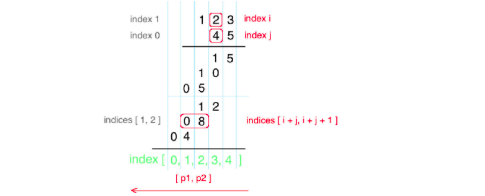

根据上面的思路，我们可以遍历num1和num2中的每一位数，相乘后叠加到result的对应位上就可以了。

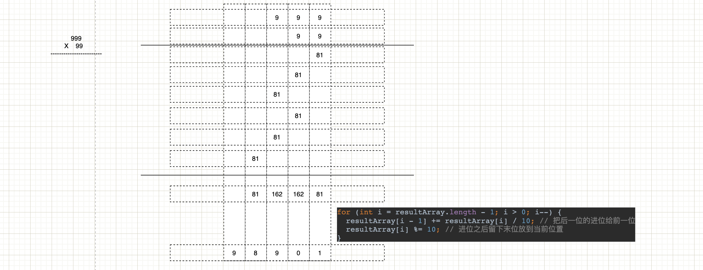

代码实现如下：

```java
package com.example.strings.multiplystrings;

import java.util.Arrays;

public class Solution {

    /**
     * 方法二 竖式乘法的优化
     *
     * @param num1
     * @param num2
     * @return
     */
    public String multiply2(String num1, String num2) {
        // 处理特殊情况，有一个乘数为零，结果就为零
        if (num1.equals("0") || num2.equals("0"))
            return "0";
        // 定义一个数组保存计算结果的每一位
        final int[] resultArray = new int[num1.length() + num2.length()];

        // 遍历num1和num2的每个数位做乘积，然后找到对应数位填入结果数组
        for (int i = num1.length() - 1; i >= 0; i--) {
            int n1 = num1.charAt(i) - '0';
            for (int j = num2.length() - 1; j >= 0; j--) {
                int n2 = num2.charAt(j) - '0';

                // 计算乘积，先不管进位，先存储到当前位置
                resultArray[i + j + 1] += n1 * n2;
            }
        }

        for (int i = resultArray.length - 1; i > 0; i--) {
            resultArray[i - 1] += resultArray[i] / 10;
            resultArray[i] %= 10;
        }

        // 将结果数组转成string返回
        final StringBuffer result = new StringBuffer();
        int start = resultArray[0] == 0 ? 1 : 0;

        for (int i = start; i < resultArray.length; i++) {
            result.append(resultArray[i]);
        }

        return result.toString();
    }

    public static void main(String[] args) {
        String num1 = "999", num2 = "99";
        final String result = new Solution().multiply2(num1, num2);
        System.out.println(result);
    }
}
```

复杂度分析

时间复杂度：O(mn)，其中 m 和 n 分别是 num1 和 num2的长度。需要计算num1 的每一位和 num2的每一位的乘积。

空间复杂度：O(m+n)，需要创建一个长度为 m+n 的数组存储乘积。

### 去除重复字母

#### 题目说明

> 网址：https://leetcode-cn.com/problems/remove-duplicate-letters/
>
> 给你一个字符串 s ，请你去除字符串中重复的字母，使得每个字母只出现一次。需保证 返回结果的字典序最小（要求不能打乱其他字符的相对位置）。
>
> 注意：该题与 1081 https://leetcode-cn.com/problems/smallest-subsequence-of-distinct-characters 相同
>
> 示例 1：
>
> ```markdown
> 输入：s = "bcabc"
> 输出："abc"
> ```
>
>
> 示例 2：
>
> ```markdown
> 输入：s = "cbacdcbc"
> 输出："acdb"
> ```
>
>
> 提示：
>
> ```markdown
> 1 <= s.length <= 104
> s 由小写英文字母组成
> ```

#### 分析

首先要知道什么叫 “字典序”。

字符串之间比较跟数字之间比较是不太一样的：字符串比较，是从头往后一个字符一个字符比较的，哪个字符串大取决于两个字符串中***\*第一个对应不相等\****的字符。

所以，任意一个以 a 开头的字符串都大于任意一个以 b 开头的字符串。

为了得到最小字典序的结果，解题过程中，我们可以将最小的字符尽可能的放在前面，把前面出现的重复字母全部删除。这其实就是一个***\*贪心策略\****。

#### 解题方式

##### 贪心策略（逐个字符处理）

这种想法就是典型的贪心策略了：我们每次都找到当前能够移到最左边的、最小的字母。这就是我们得到结果的第一个字母，它之前的所有重复字母会被删掉；然后我们从它以后的字符串中，使用相同的逻辑，继续寻找第二个最小的字母。

所以，我们在代码实现上，可以使用递归。

```java
package com.example.strings.removeduplicateletters;

import javax.crypto.spec.PSource;

public class Solution {
    /**
     * 方法一 暴力法 贪心策略递归
     *
     * @param s
     * @return
     */
    public String removeDuplicateLetters1(String s) {
        // 递归的基准情形
        if (s.length() == 0) return "";

        // 希望找到当前最左侧的字母，位置记为position
        int position = 0;
        // 遍历字符串
        for (int i = 0; i < s.length(); i++) {
            // 要求只有当前字母比已经找到的position位置要小才有资格继续判断
            if (s.charAt(i) < s.charAt(position)) {
                // 定义一个bool变量，表示当前i位置的字母是否可以替换position位置的字母
                boolean isReplace = true;

                // 遍历i 之前所有的字母，判断是否在i后面重复出现
                for (int j = position; j < i; j++) {
                    // 定义一个布尔变量，表示j位置字母是佛重复出现
                    boolean isDuplicated = false;
                    // 遍历 i 后面的所有字母，看j位置的字母是否重复出现
                    for (int k = i + 1; k < s.length(); k++) {
                        if (s.charAt(k) == s.charAt(j)) {
                            // 当前的j位置的字母出现了，没毛病
                            isDuplicated = true;
                            break;
                        }
                    }
                    // 如果任一字母不重复出现，就不能替换当前position，后面的字母不用判断
                    if (!isDuplicated) {
                        isReplace = false;
                        break;
                    }
                }

                if (isReplace) {
                    // 此时i就可以替换position位置的字母作为开始位置
                    position = i;
                }
            }
        }

        // 遍历结束，position位置的字母就是结果中最左侧的元素
        // 此时递归调用，就可以实现第二个、第三个...之后的元素判定
        // 此时应该删除后面字符串中和position位置相同的字母
        return s.charAt(position) + removeDuplicateLetters1(s.substring(position + 1).replaceAll(s.charAt(position) + "", ""));
    }

    public static void main(String[] args) {
        final String s = "cbacdcbc";
        final String letters = new Solution().removeDuplicateLetters1(s);
        System.out.println(letters);
    }
}
```

复杂度分析

- 时间复杂度：O(N^3)，因为用到了三重循环，最坏情况下时间复杂度达到了N^3。（超出运行时间限制），虽然后面递归调用，但是最多只有26个字母，最多调用26次，常数时间复杂度

- 空间复杂度：O(N)，每次给字符串切片都会创建一个新的字符串（字符串不可变），切片的数量受常数限制，最终复杂度为 O(N) * C = O(N)。

##### 贪心策略改进

我们发现，对于“是否重复出现”的判断，每次都要遍历当前字母之后的所有字符，这显然做了很多重复工作。

优化的方法，我们可以用一个count数组，保存所有26个字母在s中出现的频次。当我们遍历字符串时，每遇到一个字母，就让它对应的count减一；当当前字母对应的count减为0时，说明之后不会再重复出现了，因此即使有更小的字母也不能替代它，我们直接就可以把它作为最左侧字母输出了。

```java
package com.example.strings.removeduplicateletters;

import javax.crypto.spec.PSource;

public class Solution {

    /**
     * 方法二 贪心策略优化
     *
     * @param s
     * @return
     */
    public String removeDuplicateLetters2(String s) {
        // 递归的基准情形
        if (s.length() == 0) return "";

        // 希望找到当前最左侧的字母，位置记为position
        int position = 0;

        // 定义一个count数组，用来保存所有26个字母在字符串中出现的频次
        final int[] count = new int[26];
        for (int i = 0; i < s.length(); i++) {
            final int index = s.charAt(i) - 'a';
            count[index]++; // count[0]保存a的个数，count[1]保存b的个数
        }

        // 遍历字符串，找到当前最左端字母
        for (int i = 0; i < s.length(); i++) {
            // 把当前字符和position位置做比较，如果更小，就替换
            if (s.charAt(i) < s.charAt(position))
                position = i;
            // 每遇到一个字符，count对应位置的值就要减一
            // 如果遇到count减为0，就直接退出，以当前最小的字母作为最左端字符
            if (--count[s.charAt(i) - 'a'] == 0)
                break;
        }

        // 遍历结束，递归调用
        return s.charAt(position) + removeDuplicateLetters2(s.substring(position + 1).replaceAll(s.charAt(position) + "", ""));
    }

    public static void main(String[] args) {
        final String s = "cbacdcbc";
        final String letters = new Solution().removeDuplicateLetters2(s);
        System.out.println(letters);
    }
}
```

复杂度分析

- 时间复杂度：O(N)。 每次递归调用占用 O(N) 时间。递归调用的次数受常数限制(只有26个字母)，最终复杂度为 O(N) * C = O(N)。

- 空间复杂度：O(N)，每次给字符串切片都会创建一个新的字符串（字符串不可变），切片的数量受常数限制，最终复杂度为 O(N) * C = O(N)。

##### 贪心策略（用栈实现）

```markdown
上一实现方法当判定到当前位置的字符数量为零的时候，其实就表示
```

上面的方法由于递归的时候，用到了字符串切片的方法，导致必须要有线性的空间复杂度，而且运行时间也并不短。那还没有别的优化方法呢？

这就需要结合其它的数据结构了。我们可以用栈来存储最终返回的字符串。

代码实现如下：

```java
package com.example.strings.removeduplicateletters;

import javax.crypto.spec.PSource;
import java.util.HashMap;
import java.util.HashSet;
import java.util.Stack;

public class Solution {

    /**
     * 方法三 使用栈进行优化
     *
     * @param s
     * @return
     */
    public String removeDuplicateLetters3(String s) {
        // 定义一个字符栈，保存去重之后的结果
        final Stack<Character> stack = new Stack<>();

        // 为了快速判断一个字符是否在栈中出现过，用一个set来保存元素是否出现
        final HashSet<Character> set = new HashSet<>();

        // 为了快速判断一个字符是否在某个位置之后重复出现，用一个HashMap来保存字母出现在字字符串的最后位置
        final HashMap<Character, Integer> map = new HashMap<>();

        // 遍历字符串，将最后一次出现的位置保存进map
        for (int i = 0; i < s.length(); i++) {
            map.put(s.charAt(i), i);
        }

        // 遍历字符串，判断每个字符是否需要入栈
        for (int i = 0; i < s.length(); i++) {
            final char c = s.charAt(i);
            // 只有在c没有出现过的情况下，才判断是否入栈
            if (!set.contains(c)) {
                // c 入栈之前要判断之前栈顶元素是否在后面重复出现，如果重复出现就可以删除
                while (!stack.isEmpty() && c < stack.peek() && map.get(stack.peek()) > i) {
                    set.remove(stack.pop());
                }

                stack.push(c);
                set.add(c);
            }
        }
        // 将栈中的元素保存成字符串输出
        final StringBuffer buffer = new StringBuffer();
        for (Character character : stack) {
            buffer.append(character.charValue());
        }

        return buffer.toString();
    }

    public static void main(String[] args) {
        final String s = "cbacdcbc";
        final String letters = new Solution().removeDuplicateLetters3(s);
        System.out.println(letters);
    }
}
```

复杂度分析

- 时间复杂度：O(N)。虽然看起来是双重循环，但内循环的次数受栈中剩余字符总数的限制，因为栈中的元素不重复，不会超出字母表大小，因此最终复杂度仍为 O(N)。

- 空间复杂度：O(1)。看上去空间复杂度像是 O(N)，但实际上并不是。首先，seen 中字符不重复，其大小会受字母表大小的限制，所以是O(1)。其次，只有 stack 中不存在的元素才会被压入，因此 stack 中的元素也唯一。所以最终空间复杂度为 O(1)。

## 滑动窗口相关问题讲解

滑动窗口算法是在给定特定窗口大小的数组或字符串上执行要求的操作，它的原理与网络传输TCP协议中的滑动窗口协议（Sliding Window Protocol）基本一致。

这种技术可以将一部分问题中的嵌套循环转变为一个单循环，因此它可以减少时间复杂度。***\*滑动窗口主要应用在数组和字符串上。\****

例如，设定滑动窗口（window）大小为 3，当滑动窗口每次划过数组时，计算当前滑动窗口中元素的和，可以得到一组结果 res。

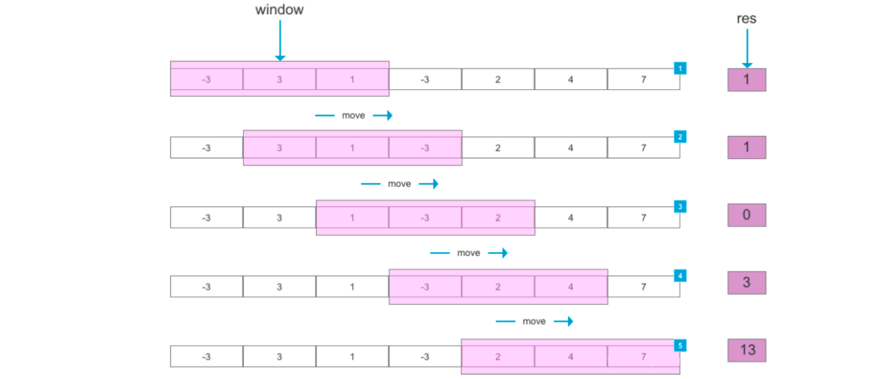

因为滑动窗口是靠窗口起始、结束两个位置来表示的，所以滑动窗口也可以看作特殊的“双指针”。

### 滑动窗口最大值

#### 题目说明

> 网址：https://leetcode-cn.com/problems/sliding-window-maximum/
>
> 给你一个整数数组 nums，有一个大小为 k 的滑动窗口从数组的最左侧移动到数组的最右侧。你只可以看到在滑动窗口内的 k 个数字。滑动窗口每次只向右移动一位。
>
> 返回滑动窗口中的最大值。
>
> 示例 1：
>
> ```markdown
> 输入：nums = [1,3,-1,-3,5,3,6,7], k = 3
> 输出：[3,3,5,5,6,7]
> ```
>
> 解释：
>
> ```markdown
> 滑动窗口的位置                最大值
> 
> ---------------               -----
> 
> [1  3  -1] -3  5  3  6  7       3
>  1 [3  -1  -3] 5  3  6  7       3
>  1  3 [-1  -3  5] 3  6  7       5
>  1  3  -1 [-3  5  3] 6  7       5
>  1  3  -1  -3 [5  3  6] 7       6
>  1  3  -1  -3  5 [3  6  7]      7
> ```
>
> 示例 2：
>
> ```markdown
> 输入：nums = [1], k = 1
> 输出：[1]
> ```
> 
> 示例 3：
>
> ```markdown
> 输入：nums = [1,-1], k = 1
> 输出：[1,-1]
> ```
> 
> 示例 4：
> ```markdown
> 输入：nums = [9,11], k = 2
> 输出：[11]
> ```
> 
> 示例 5：
> ```markdown
> 输入：nums = [4,-2], k = 2
> 输出：[4]
> ```
>
> 提示：
> ```markdown
> 1 <= nums.length <= 105
> -104 <= nums[i] <= 104
> 1 <= k <= nums.length
> ```
> 

#### 分析

这是一个典型的滑动窗口的问题。由于滑动窗口的大小k被限定在[1, nums.length]，所以我们可以直接推出窗口的个数为`nums.length - k + 1`。

#### 解题方式

##### 暴力法

最简单直接的方法，就是遍历每个滑动窗口，找到每个窗口的最大值。

```java
package com.example.strings.slidingwindowmaximum;

import com.sun.org.glassfish.external.amx.AMX;

import java.util.Arrays;

public class Solution {
    /**
     * 方法一 暴力法，遍历每个窗口，对每个窗口遍历每个元素求最大值
     *
     * @param nums
     * @param k
     * @return
     */
    public int[] maxSlidingWindow1(int[] nums, int k) {
        // 定义一个结果数组，总共有n-k+1个窗口
        final int[] result = new int[nums.length - k + 1];
        // 遍历数组，从0到n-k，作为滑动窗口的起始位置
        for (int i = 0; i <= nums.length - k; i++) {
            // 找窗口内的最大值，定义一个变量来保存
            int max = nums[i];
            // 遍历窗口中的每一个元素，比较大小
            for (int j = i + 1; j < i + k; j++) {
                if (nums[j] > max)
                    max = nums[j];
            }
            result[i] = max;
        }

        return result;
    }

    public static void main(String[] args) {
        final int[] nums = {1, 3, -1, -3, 5, 3, 6, 7};
        final int[] ints = new Solution().maxSlidingWindow1(nums, 3);
        System.out.println(Arrays.toString(ints));
    }
}
```

复杂度分析

- 时间复杂度： O(Nk)，双重循环，外层遍历数组循环N次，内层遍历窗口循环k次，所以整体就是O(N) * O(k) = O(Nk)，表现较差。在leetcode上提交，会发现超出了题目要求的运行时间限制。

- 空间复杂度：O(N-k)，输出数组用到了N-k+1的空间。

##### 使用堆

```markdown
在每次移动的时候，大部分的元素不变，所以我们可以找到一个数据类型，保持插入的数据排序
```

如何优化时间复杂度呢？可以使用堆。

构建一个大顶堆（Max Heap），那么堆顶元素 heap[0] 永远是最大的。每次移动窗口的时候，我们只要维护这个堆、在里面插入删除元素，然后返回堆顶元素heap[0]就可以了。

在代码中，我们可以用一个优先队列（Priority Queue）来实现大顶堆。

```java
public class Solution {
    /**
     * 方法二 使用大顶堆
     *
     * @param nums
     * @param k
     * @return
     */
    public int[] maxSlidingWindow2(int[] nums, int k) {
        // 定义一个结果数组
        final int[] result = new int[nums.length - k + 1];

        // 用优先队列实现一个大顶堆
        final PriorityQueue<Integer> maxHeap = new PriorityQueue<>(new Comparator<Integer>() {
            @Override
            public int compare(Integer o1, Integer o2) {
                return o2 - o1;
            }
        });

        // 准备工作，构建大顶堆，将第一个窗口元素（前K个）放入堆中
        for (int i = 0; i < k; i++) {
            maxHeap.add(nums[i]);
        }

        // 当前大顶堆的堆顶元素就是第一个窗口的最大值
        result[0] = maxHeap.peek();

        // 遍历所有的窗口
        for (int i = 1; i < nums.length - k; i++) {
            maxHeap.remove(nums[i - 1]);// 删除堆中上一个窗口的元素
            maxHeap.add(nums[i + k - 1]); // 添加当前窗口的最后一个元素进堆
            result[i] = maxHeap.peek();
        }

        return result;
    }

    public static void main(String[] args) {
        final int[] nums = {1, 3, -1, -3, 5, 3, 6, 7};
        final int[] ints = new Solution().maxSlidingWindow1(nums, 3);
        System.out.println(Arrays.toString(ints));
    }
}
```

复杂度分析：

- 时间复杂度： O(Nlog(k))，在大小因此这样改进后，算法的时间复杂度为为 k 的堆中插入一个元素只需要消耗 log(k) 时间，O(Nlog(k))。但提交依然会超出时间限制。

- 空间复杂度：O(N)，输出数组用到了O(N-k+1)的空间，大顶堆用了O(k)。

##### 使用双向队列

使用堆看起来不错，但离题目要求还有差距。能否得到O(N) 的算法呢？

我们发现，窗口在滑动过程中，其实数据发生的变化很小：只有第一个元素被删除、后面又新增一个元素，中间的大量元素是不变的。也就是说，前后两个窗口中，有大量数据是**重叠**的。

```markdown
[1, 3, -1,] -3, 5, 3, 6, 7
1, [3, -1, -3,] 5, 3, 6, 7
1, 3, [-1, -3, 5,] 3, 6, 7
```

自然想到，其实可以使用一个 **队列** 来保存窗口数据：窗口每次滑动，我们就让后面的一个元素（-3）进队，并且让第一个元素（1）出队。进出队列的操作，只要耗费常数时间。

这种场景，可以使用 **双向队列**（也叫双端队列Dequeue），该数据结构可以从两端以常数时间压入/弹出元素。

在构建双向队列的时候，可以采用删除队尾更小元素的策略，所以，得到的其实就是一个 **从大到小排序** 的队列。

这样存储的元素，可以认为是遵循“更新更大”原则的。

##### 左右扫描

 使用堆看起来不错，但离题目要求还有差距。能否得到O(N) 的算法呢？

我们发现，窗口在滑动过程中，其实数据发生的变化很小：只有第一个元素被删除、后面又新增一个元素，中间的大量元素是不变的。也就是说，前后两个窗口中，有大量数据是 **重叠** 的。

```markdown
[1, 3, -1,] -3, 5, 3, 6, 7

1, [3, -1, -3,] 5, 3, 6, 7

1, 3, [-1, -3, 5,] 3, 6, 7
```

自然想到，其实可以使用一个 **队列** 来保存窗口数据：窗口每次滑动，我们就让后面的一个元素（-3）进队，并且让第一个元素（1）出队。进出队列的操作，只要耗费常数时间。

这种场景，可以使用 **双向队列**（也叫双端队列Dequeue），该数据结构可以从两端以常数时间压入/弹出元素。

在构建双向队列的时候，可以采用删除队尾更小元素的策略，所以，得到的其实就是一个 **从大到小排序** 的队列。

这样存储的元素，可以认为是遵循“更新更大”原则的。 

具体代码如下：

```java
public class Solution {

    public int[] maxSlidingWindow3(int[] nums, int k) {
        if(k==1) return nums;

        // 定义一个结果数组
        final int[] result = new int[nums.length - k + 1];

        // 定义双向队列，保存元素的索引
        final ArrayDeque<Integer> deque = new ArrayDeque<Integer>();
        // 初始化双向队列，处理第一个窗口的数据
        for (int i = 0; i < k; i++) {
            // 如果队尾元素小于当前元素，直接删除
            while (!deque.isEmpty() && nums[i] > nums[deque.getLast()])
                deque.removeLast();
            deque.addLast(i);
        }

        result[0] = nums[deque.getFirst()];// 第一个窗口的最大值

        // 遍历窗口
        for (int i = k; i < nums.length; i++) {
            // 判断如果上一个窗口删掉的就是窗口最大值，需要将队列中的最大值删掉
            if (!deque.isEmpty() && deque.getFirst() == i - k)
                deque.removeFirst();

            // 判断新增元素是否可以删除队尾元素
            while (!deque.isEmpty() && nums[i] > nums[deque.getLast()])
                deque.removeLast();
            deque.addLast(i);

            result[i-k+1] = nums[deque.getFirst()];
        }

        return result;
    }

    public static void main(String[] args) {
        final int[] nums = {1, 3, -1, -3, 5, 3, 6, 7};
        final int[] ints = new Solution().maxSlidingWindow3(nums, 3);
        System.out.println(Arrays.toString(ints));
    }
}
```

**复杂度分析**

时间复杂度：O(N)，每个元素被处理两次：其索引被添加到双向队列中，以及被双向队列删除。

空间复杂度： O(N)，输出数组使用了 O(N−k+1) 空间，双向队列使用了O(k)。

### 最小覆盖子串


### 找到字符串中所有字母异位词


## 链表问题讲解

### 链表数据结构复习

### 力扣真题讲解

## 哈希表相关题目讲解

### 哈希表数据结构复习

### 力扣真题讲解

## 栈和队列问题讲解

### 栈和队列数据结构复习

### 力扣真题讲解

## 排序相关问题讲解

### 排序相关算法复习

### 力扣真题讲解

## 二叉树和递归问题讲解

### 树形数据结构分析

### 力扣真题讲解

## 贪心算法讲解

### 贪心算法理论讲解

### 力扣真题讲解

## 动态规划讲解

### 动态规划理论讲解

### 力扣真题讲解

## 回溯算法讲解

### 回溯算法讲解

### 力扣真题讲解

## 深度优先搜索和广度优先搜索讲解

### DFS、BFS讲解

### 力扣真题讲解

## 位运算和数学方法讲解

### 位运算基础知识讲解

### 力扣真题讲解
