## 设计模式导论

在 1994 年，由 Erich Gamma、Richard Helm、Ralph Johnson 和 John Vlissides 四人合著出版了一本名为 Design Patterns - Elements of Reusable Object-Oriented Software（中文译名：设计模式 - 可复用的面向对象软件元素） 的书，该书首次提到了软件开发中设计模式的概念。

- 对接口编程而不是对实现编程。
- 优先使用对象组合而不是继承。

设计模式基石

- 封装
- 继承
- 多态
- 顺序
- 判断
- 循环

### 设计模式总览

创建型模式（Creational Patterns）

- 单例（Singleton）模式
- 原型（Prototype）模式
- 工厂方法（FactoryMethod）模式
- 抽象工厂（AbstractFactory）模式
- 建造者（Builder）模式

结构型模式（Structural Patterns）

- 代理（Proxy）模式
- 适配器（Adapter）模式
- 桥接（Bridge）模式
- 装饰（Decorator）模式
- 外观（Facade）模式
- 享元（Flyweight）模式
- 组合（Composite）模式
- 过滤器模式（Filter Pattern）

行为型模式（Behavioral Patterns）

- 模板方法（Template Method）模式
- 策略（Strategy）模式
- 命令（Command）模式
- 职责链（Chain of Responsibility）模式
- 状态（State）模式
- 观察者（Observer）模式
- 中介者（Mediator）模式
- 迭代器（Iterator）模式
- 访问者（Visitor）模式
- 备忘录（Memento）模式
- 解释器（Interpreter）模式

设计模式是一种思想，灵活运用思想远大于死记代码、咬文爵字

### 组件的生命周期

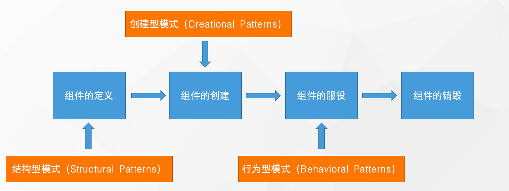

### 设计的七大原则

1. 开闭原则（Open Closed Principle，OCP）

软件实体应当对扩展开放，对修改关闭（Software entities should be open for extension，but closed for modification）

合成复用原则、里氏替换原则相辅相成，都是开闭原则的具体实现规范

扩展新类而不是修改旧类

2. 里氏替换原则（Liskov Substitution Principle，LSP）

继承必须确保超类所拥有的性质在子类中仍然成立（Inheritance should ensure that any property proved about supertype objects also holds for subtype objects）

继承父类而不去改变父类

3. 依赖倒置原则（Dependence Inversion Principle，DIP）

高层模块不应该依赖低层模块，两者都应该依赖其抽象；抽象不应该依赖细节，细节应该依赖抽象（High level modules shouldnot depend upon low level modules.Both should depend upon abstractions.Abstractions should not depend upon details. Details should depend upon abstractions）

面向接口编程，而不是面向实现类

4. 单一职责原则（Single Responsibility Principle，SRP）

一个类应该有且仅有一个引起它变化的原因，否则类应该被拆分（There should never be more than one reason for a class to change）

每个类只负责自己的事情，而不是变成万能

5. 接口隔离原则（Interface Segregation Principle，ISP）

一个类对另一个类的依赖应该建立在最小的接口上（The dependency of one class to another one should depend on the smallest possible interface）。

各个类建立自己的专用接口，而不是建立万能接口

6. 迪米特法则（Law of Demeter，LoD）

最少知识原则（Least Knowledge Principle，LKP)

只与你的直接朋友交谈，不跟“陌生人”说话（Talk only to your immediate friends and not to strangers）
无需直接交互的两个类，如果需要交互，使用中间者

过度使用迪米特法则会使系统产生大量的中介类，从而增加系统的复杂性，使模块之间的通信效率降低

7. 合成复用原则（Composite Reuse Principle，CRP）

又叫组合/聚合复用原则（Composition/Aggregate Reuse Principle，CARP）

软件复用时，要尽量先使用组合或者聚合等关联关系来实现，其次才考虑使用继承关系来实现

优先组合，其次继承

## 创建型模式

### 为什么使用创建型模式

- 创建型模式关注点“怎样创建出对象？”
- “将对象的创建与使用分离”。
- 降低系统的耦合度
- 使用者无需关注对象的创建细节
  - 对象的创建由相关的工厂来完成；（各种工厂模式）
  - 对象的创建由一个建造者来完成；（建造者模式）
  - 对象的创建由原来对象克隆完成；（原型模式）
  - 对象始终在系统中只有一个实例；（单例模式）

### 单例（Singleton）模式

一个单一的类，负责创建自己的对象，同时确保系统中只有单个对象被创建。

单例特点

- 某个类只能有一个实例；（构造器私有）
- 它必须自行创建这个实例；（自己编写实例化逻辑）
- 它必须自行向整个系统提供这个实例；（对外提供实例化方法）

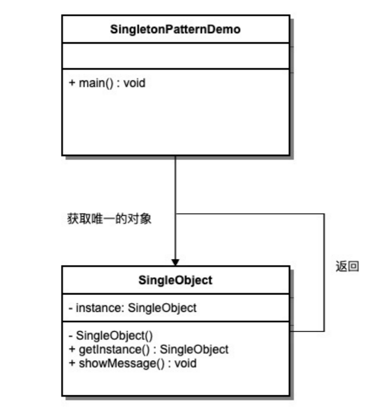

#### 应用场景

什么场景用到？

- 多线程中的线程池
- 数据库的连接池
- 系统环境信息
- 上下文（ServletContext）
- ......

面试问题

1. 系统环境信息（System.getProperties()）？

```java
final Properties properties = System.getProperties();
System.out.println(properties);
// 原始代码
private static Properties props;
private static native Properties initProperties(Properties props);

final Map<String, String> map = System.getenv();
System.out.println(map);
```

2. Spring中怎么保持组件单例的？

3. ServletContext是什么（封装Servlet的信息）？是单例吗？怎么保证？

4. ApplicationContext是什么？是单例吗？怎么保证？

- ApplicationContext： tomcat：一个应用（部署的一个war包）会有一个应用上下文
- ApplicationContext： Spring：表示整个IOC容器（怎么保证单例的）。ioc容器中有很多组件（怎么保证单例）

5. 数据库连接池一般怎么创建出来的，怎么保证单实例？

......

#### 编码实现

```java
/**
 * 该实例只能有一个
 */
public class Person {
    private String name;
    private String age;

    // 懒汉 饿汉
    private volatile static Person instance;

    // 构造器私有，外部不能实例化
    private Person() {

    }

    // 对外提供获取对象的方法
    // 1、public static synchronized Person getInstance() 锁太大 导致效率很低
    // 2、双重检查锁+内存可见性（设计模式）
    public static Person getInstance() {
        // 如果没有就创建
        if (instance == null) {
            synchronized (Person.class) {
                if (instance == null)
                    instance = new Person();
            }
        }

        return instance;
    }
}
```

### 原型（Prototype）模式

- 原型模式（Prototype Pattern）是用于创建重复的对象，同时又能保证性能。
- 本体给外部提供一个克隆体进行使用

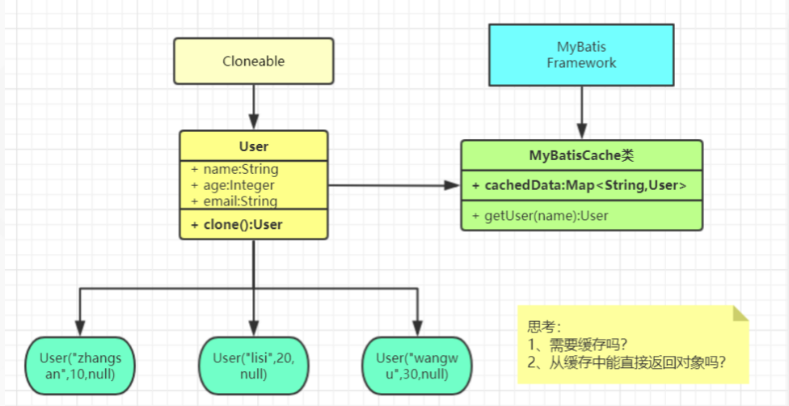

#### 应用场景

什么场景用到？

- 资源优化
- 性能和安全要求
- 一个对象多个修改者的场景。
- 一个对象需要提供给其他对象访问，而且各个调用者可能都需要修改其值时可以考虑使用原型模式拷贝多个对象供调用者使用。
- 深（两个完全对象不一样的【递归克隆】，内容却完全一样）、浅（只是属性赋值）....
- ......

原型模式已经与 Java 融为浑然一体，大家可以随手拿来使用。

#### 编码实现

Mybatis

```java
/**
 * 1. 操作数据库，从数据库里面查出很多记录（70%改变很少）
 * 2. 每次查数据库，查到以后把所有的数据都封装成一个对象，返回
 * 100000 thread 查一个记录，new User(xxxxx) : 每次创建一个对象封装并返回
 * 系统里面就会有 100000 个User,浪费内存
 * 3. 解决：缓存，查过的保存
 * 4. 返回缓存的时候，应该是返回缓存对象的复制品，而不是原型对象，防止拿到的原型对象被修改
 */
public class Mybatis {
    // 缓存user
    private Map<String, User> userCache = new HashMap<String, User>();

    public User getUser(String username) throws CloneNotSupportedException {
        User user = null;
        if (!userCache.containsKey(username)) {
            user = getUserFromDb(username);
            userCache.put(username, user);
        } else {
            // 从缓存中直接拿，脏缓存问题
            // 原型已经拿到，但不能直接给（本人）
            user = userCache.get(username);
            System.out.println("从缓存中拿");
            // 从这个对象快速得到一个克隆体
            user = user.clone();
        }
        return user;
    }

    private User getUserFromDb(String username) {
        // 从数据库查询数据
        final User user = new User();
        user.setUsername(username);
        user.setAge(18);
        return user;
    }
}
```

User

```java
public class User implements Cloneable{
    private String username;
    private Integer age;

    public String getUsername() {
        return username;
    }

    public void setUsername(String username) {
        this.username = username;
    }

    public Integer getAge() {
        return age;
    }

    public void setAge(Integer age) {
        this.age = age;
    }

    @Override
    public String toString() {
        return "User{" +
                "username='" + username + '\'' +
                ", age=" + age +
                '}';
    }

    @Override
    protected User clone() throws CloneNotSupportedException {
        final User user = new User();
        user.setUsername(this.username);
        user.setAge(this.age);
        return user;
    }
}
```

### 工厂模式

工厂模式（Factory Pattern）提供了一种创建对象的最佳方式。我们不必关心对象的创建细节，只需要根据不同情况获取不同产品即可。难点：写好我们的工厂

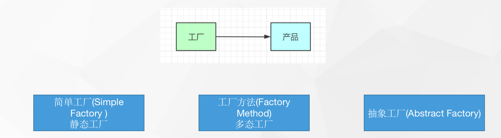

#### 简单工厂

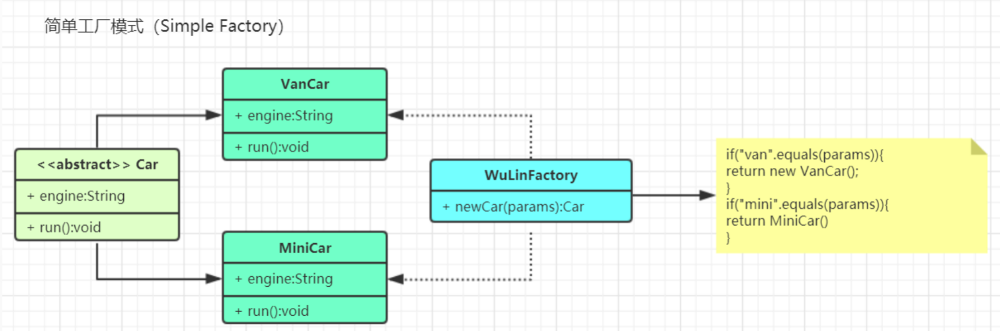

三个角色

- Factory：工厂角色， WuLinFactory
- Product：抽象产品角色，Car
- ConcreteProduct：具体产品角色， VanCar、MiniCar

缺点：违背开闭，扩展不易

##### 编码实现

产品

```java
/**
 * 工厂的产品
 */
public abstract class AbstractCar {
    String engine;

    public abstract void run();
}

/**
 * 具体产品 货车
 */
public class MiniCar extends AbstractCar {
    public MiniCar() {
        this.engine = "四缸水平对置发动机";
    }

    @Override
    public void run() {
        System.out.println(engine + "--- 跑起来了");
    }
}

/**
 * 具体产品 货车
 */
public class VanCar extends AbstractCar {
    public VanCar() {
        this.engine = "单杠柴油机";
    }

    @Override
    public void run() {
        System.out.println(engine + "--- 跑起来了");
    }
}
```

工厂

```java
/**
 * 简单工厂
 */
public class WuLingSimpleFactory {
    public AbstractCar newCar(String type) {
        if (type.equals("van"))
            return new VanCar();
        else if (type.equals("mini"))
            return new MiniCar();
        // ....
        // 当我们想要更多的产品的时候，就需要不断增加if判断，违反开闭原则
        return null;


    }
}
```

调用

```java
/**
 * 造车
 */
public class MainTest {
    public static void main(String[] args) {
        final WuLingSimpleFactory wuLingSimpleFactory = new WuLingSimpleFactory();
        final AbstractCar car = wuLingSimpleFactory.newCar("van");
        System.out.println(car);
    }
}
```

#### 工厂方法（FactoryMethod）

```markdown
怎么把东西提升到一个层次：定义抽象（抽象类，接口）
```

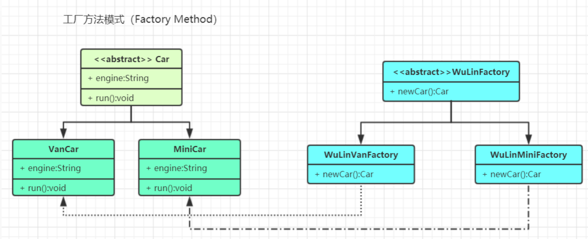

四个角色

- Product：抽象产品
- ConcreteProduct：具体产品
- Factory：抽象工厂
- ConcreteFactory：具体工厂

缺点：系统复杂度增加，产品单一

##### 编码实现

产品

```java
/**
 * 工厂的产品
 */
public abstract class AbstractCar {
    String engine;

    public abstract void run();
}

/**
 * 具体产品 货车
 */
public class MiniCar extends AbstractCar {
    public MiniCar() {
        this.engine = "四缸水平对置发动机";
    }

    @Override
    public void run() {
        System.out.println(engine + "--- 跑起来了");
    }
}

/**
 * 具体产品 货车
 */
public class VanCar extends AbstractCar {
    public VanCar() {
        this.engine = "单杠柴油机";
    }

    @Override
    public void run() {
        System.out.println(engine + "--- 跑起来了");
    }
}
```

工厂

```java
public abstract class AbstractCarFactory {
    public abstract AbstractCar newCar();
}

public class WuLingMiniCarFactory extends AbstractCarFactory{
    @Override
    public AbstractCar newCar() {
        return new MiniCar();
    }
}

public class WuLingVanCarFactory extends AbstractCarFactory{
    @Override
    public AbstractCar newCar() {
        return new VanCar();
    }
}
```

调用

```java
/**
 * 造车
 * <p>
 * 怎么把东西提升到一个层次：定义抽象（抽象类，接口）
 */
public class MainTest {
    public static void main(String[] args) {
        final AbstractCarFactory factory = new WuLingVanCarFactory();
        final AbstractCar car = factory.newCar();
        car.run();

        final AbstractCarFactory factory1 = new WuLingMiniCarFactory();
        final AbstractCar car1 = factory1.newCar();
        car1.run();
    }
}
```

#### 抽象工厂（AbstractFactory）

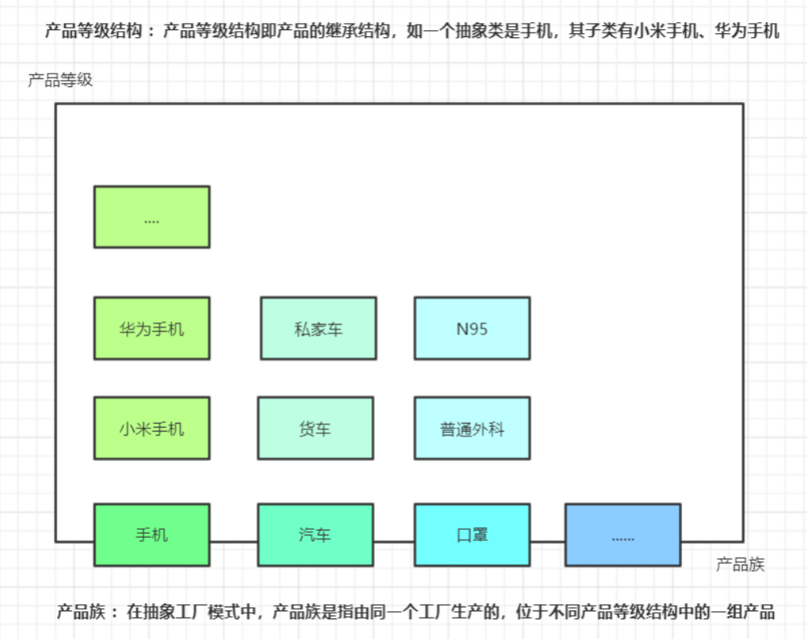

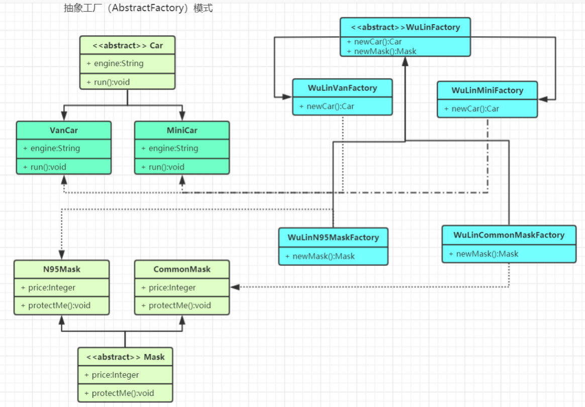

工厂模式的退化

当抽象工厂模式中每一个具体工厂类只创建一个产品对象，也就是只存在一个产品等级结构时，抽象工厂模式退化成工厂方法模式；当工厂方法模式中抽象工厂与具体工厂合并，提供一个统一的工厂来创建产品对象，并将创建对象的工厂方法设计为静态方法时，工厂方法模式退化成简单工厂模式。

##### 编码实现

产品-车

```java
/**
 * 抽象产品 车
 */
public abstract class AbstractCar {
    String engine;

    public abstract void run();
}

/**
 * 具体产品 货车
 */
public class MiniCar extends AbstractCar {
    public MiniCar() {
        this.engine = "四缸水平对置发动机";
    }

    @Override
    public void run() {
        System.out.println(engine + "--- 跑起来了");
    }
}

/**
 * 具体产品 货车
 */
public class VanCar extends AbstractCar {
    public VanCar() {
        this.engine = "单杠柴油机";
    }

    @Override
    public void run() {
        System.out.println(engine + "--- 跑起来了");
    }
}
```

产品-口罩

```java
/**
 * 抽象产品 口罩
 */
public abstract class AbstractMask {
    Integer price;

    public abstract void protectedMe();
}

/**
 * 普通口罩
 */
public class CommonMask extends AbstractMask {
    public CommonMask() {
        this.price = 2;
    }

    @Override
    public void protectedMe() {
        System.out.println("普通口罩的价格是" + price);
    }
}

/**
 * N95口罩
 */
public class N95Mask extends AbstractMask {
    public N95Mask() {
        this.price = 2;
    }

    @Override
    public void protectedMe() {
        System.out.println("N95的价格是" + price);
    }
}
```

工厂

```java
/**
 * 总厂规范
 */
public abstract class WuLingFactory {
    // 造车
    abstract AbstractCar newCar();

    // 造口罩
    abstract AbstractMask newMask();
}

public class WuLingMiniCarFactory extends WuLingFactory {
    @Override
    AbstractCar newCar() {
        return new MiniCar();
    }

    @Override
    AbstractMask newMask() {
        return null;
    }
}

public class WuLingVanCarFactory extends WuLingFactory {
    @Override
    AbstractCar newCar() {
        return new VanCar();
    }

    @Override
    AbstractMask newMask() {
        return null;
    }
}

public class WuLingCommonMaskFactory extends WuLingFactory {
    @Override
    AbstractCar newCar() {
        return null;
    }

    @Override
    AbstractMask newMask() {
        return new CommonMask();
    }
}

public class WuLingN95MaskFactory extends WuLingFactory {
    @Override
    AbstractCar newCar() {
        return null;
    }

    @Override
    AbstractMask newMask() {
        return new N95Mask();
    }
}
```

调用

```java
/**
 * 造车
 * <p>
 * 怎么把东西提升到一个层次：定义抽象（抽象类，接口）
 */
public class MainTest {
    public static void main(String[] args) {
        final WuLingFactory miniCarFactory = new WuLingMiniCarFactory();
        final AbstractCar car = miniCarFactory.newCar();
        car.run();

        final WuLingVanCarFactory vanCarFactory = new WuLingVanCarFactory();
        final AbstractCar car1 = vanCarFactory.newCar();
        car1.run();

        final WuLingN95MaskFactory n95MaskFactory = new WuLingN95MaskFactory();
        final AbstractMask mask = n95MaskFactory.newMask();
        mask.protectedMe();

        final WuLingCommonMaskFactory commonMaskFactory = new WuLingCommonMaskFactory();
        final AbstractMask mask1 = commonMaskFactory.newMask();
        mask1.protectedMe();
    }
}
```

#### 应用场景

什么场景用到？

- NumberFormat、SimpleDateFormat
- LoggerFactory
- SqlSessionFactory：MyBatis
- BeanFactory：Spring的BeanFactory（就是为了造出bean）
- ......

### 建造者（Builder）模式

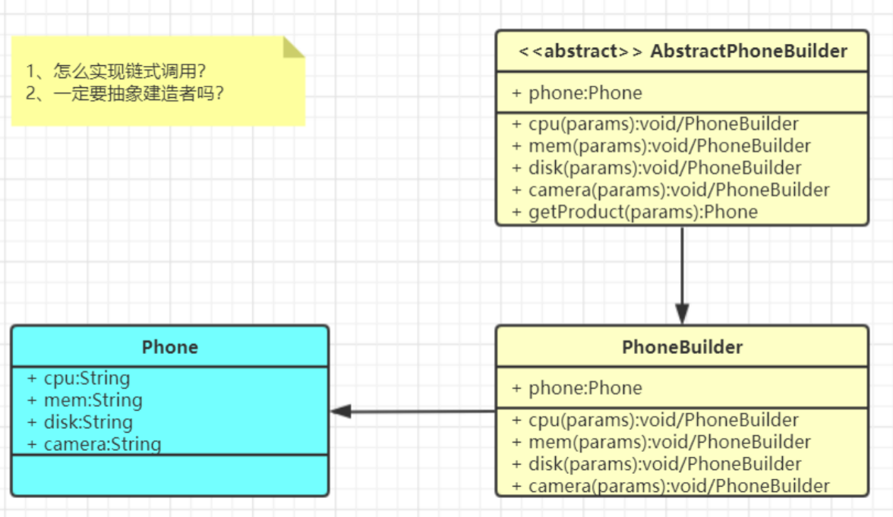

产品角色（Product）：Phone
抽象建造者（Builder）：AbstracPhoneBuilder
具体建造者(Concrete Builder）：PhoneBuilder

**创建的东西细节复杂，还必须暴露给使用者。屏蔽过程而不屏蔽细节**

#### 应用场景

什么场景用到？

- StringBuilder：append(); 给谁append呢？

- Swagger-ApiBuilder：

- 快速实现Lombok-Builder模式

- .......

编写代码的时候使用到了设计模式。类+模式

- xxxFactory  
- xxxTemplate
- xxxBuilder
- xxxFacede
- ......

#### 编码实现

建造者

```java
public abstract class AbstractBuilder {
    Phone phone;

    abstract void customCpu(String cpu);

    abstract void customMemory(String memory);

    abstract void customDisk(String disk);

    abstract void customCamera(String camera);

    Phone getPhone() {
        return phone;
    }
}

public class XiaoMiBuilder extends AbstractBuilder {
    public XiaoMiBuilder() {
        phone = new Phone();
    }

    @Override
    void customCpu(String cpu) {
        phone.setCpu(cpu);
    }

    @Override
    void customMemory(String memory) {
        phone.setMemory(memory);
    }

    @Override
    void customDisk(String disk) {
        phone.setDisk(disk);
    }

    @Override
    void customCamera(String camera) {
        phone.setCamera(camera);
    }
}
```

产品

```java
public class Phone {
    private String cpu;
    private String memory;
    private String disk;
    private String camera;

    public String getCpu() {
        return cpu;
    }

    public void setCpu(String cpu) {
        this.cpu = cpu;
    }

    public String getMemory() {
        return memory;
    }

    public void setMemory(String memory) {
        this.memory = memory;
    }

    public String getDisk() {
        return disk;
    }

    public void setDisk(String disk) {
        this.disk = disk;
    }

    public String getCamera() {
        return camera;
    }

    public void setCamera(String camera) {
        this.camera = camera;
    }

    @Override
    public String toString() {
        return "Phone{" +
                "cpu='" + cpu + '\'' +
                ", memory='" + memory + '\'' +
                ", disk='" + disk + '\'' +
                ", camera='" + camera + '\'' +
                '}';
    }
}
```

调用

```java
public class MainTest {
    public static void main(String[] args) {
        final AbstractBuilder xiaoMiBuilder = new XiaoMiBuilder();
        xiaoMiBuilder.customCpu("骁龙888");
        xiaoMiBuilder.customMemory("512G");
        xiaoMiBuilder.customDisk("1T");
        xiaoMiBuilder.customCamera("1亿像素");

        final Phone phone = xiaoMiBuilder.getPhone();
        System.out.println(phone);
    }
}
```


## 结构型模式

### 为什么使用结构型模式

结构型模式关注点“怎样组合对象/类？”所以我们关注下类的组合关系

- 类结构型模式关心类的组合，由多个类可以组合成一个更大的（继承）

- 对象结构型模式关心类与对象的组合，通过关联关系在一个类中定义另一个类的实例对象（组合）

根据“合成复用原则”，在系统中尽量使用关联关系来替代继承关系，因此大部分结构型模式都是对象结构型模式。

- 适配器模式（Adapter Pattern）：两个不兼容接口之间适配的桥梁
- 桥接模式（Bridge Pattern）：相同功能抽象化与实现化解耦，抽象与实现可以独立升级。
- 过滤器模式（Filter、Criteria Pattern）：使用不同的标准来过滤一组对象
- 组合模式（Composite Pattern）：相似对象进行组合，形成树形结构
- 装饰器模式（Decorator Pattern）：向一个现有的对象添加新的功能，同时又不改变其结构
- 外观模式（Facade Pattern）：向现有的系统添加一个接口，客户端访问此接口来隐藏系统的复杂性。
- 享元模式（Flyweight Pattern）：尝试重用现有的同类对象，如果未找到匹配的对象，则创建新对象
- 代理模式（Proxy Pattern）：一个类代表另一个类的功能

### 适配器模式（Adapter Pattern）

将一个接口转换成客户希望的另一个接口，适配器模式使接口不兼容的那些类可以一起工作，适配器模式分为类结构型模式（继承）和对象结构型模式（组合）两种，前者（继承）类之间的耦合度比后者高，且要求程序员了解现有组件库中的相关组件的内部结构，所以应用相对较少些。

适配器模式（Adapter）包含以下主要角色。

- 目标（Target）接口：可以是抽象类或接口。客户希望直接用的接口
- 适配者（Adaptee）类：隐藏的转换接口
- 适配器（Adapter）类：它是一个转换器，通过继承或引用适配者的对象，把适配者接口转换成目标接口。

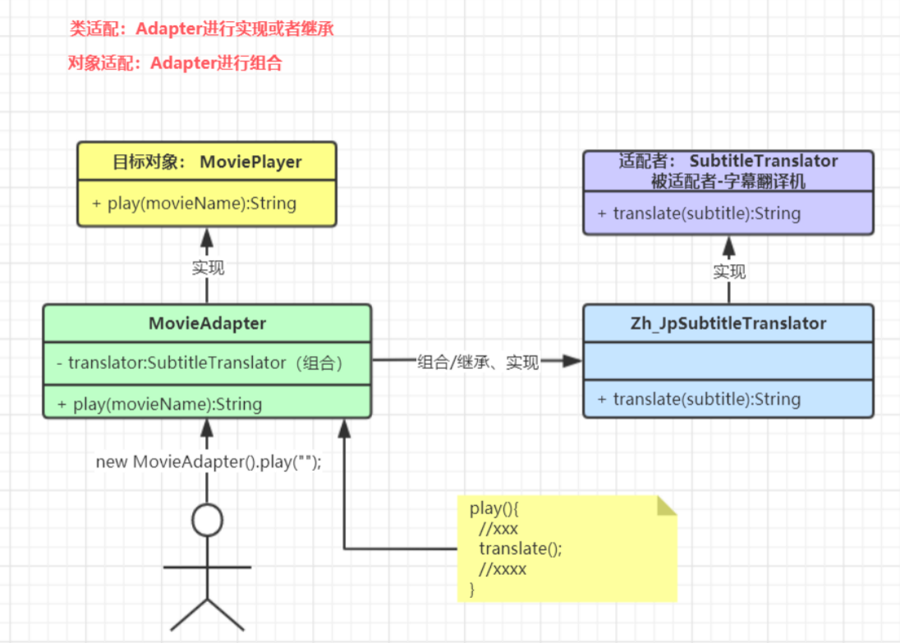

#### 应用场景

什么场景用到？

- Tomcat如何将Request流转为标准Request
- Spring AOP中的AdvisorAdapter是什么
- Spring MVC中经典的HandlerAdapter是什么
- SpringBoot 中 WebMvcConfigurerAdapter为什么存在又取消
- ......

#### 编码实现

播放器

```java
public interface Player {
    String play();
}

/**
 * 电影播放器
 * 阅读器
 * ...
 */
public class MoviePlayer implements Player {

    @Override
    public String play() {
        System.out.println("正在播放：大国崛起");
        final String content = "世界的中心总是在不断的国力对峙中转圜于大国之间";
        System.out.println(content);
        return content;
    }
}
```

翻译器

```java
/**
 * 系统原有的接口 可以翻译文字内容
 */
public interface Translator {
    String translate(String content);
}

public class Zh_JPTranslator implements Translator {
    @Override
    public String translate(String content) {
        if ("世界的中心总是在不断的国力对峙中转圜于大国之间".equals(content)) {
            return "八嘎呀路";
        }
        return "null";
    }
}
```

适配器

```java
/**
 * 客户调用方法的时候适配器操作即可
 * <p>
 * 类结构模式 ：直接继承Zh_JPTranslator
 */
public class JPMovieAdapter extends Zh_JPTranslator implements Player {

    private Player target;

    public JPMovieAdapter(Player target) {
        this.target = target;
    }

    @Override
    public String play() {
        final String play = target.play();
        // 转换字幕
        final String translate = translate(play);
        System.out.println("日文：" + translate);
        return translate;
    }
}
```

调用

```java
public class MainTest {
    public static void main(String[] args) {
        //final MoviePlayer moviePlayer = new MoviePlayer();
        //moviePlayer.play();

        // 友人想要看电影带日文字幕
        // 带翻译字幕
        final MoviePlayer target = new MoviePlayer();
        final JPMovieAdapter jpMovieAdapter = new JPMovieAdapter(target);
        jpMovieAdapter.play();
    }
}
```

### 桥接模式（Bridge Pattern）

将抽象与实现解耦，使两者都可以独立变化

在现实生活中，某些类具有两个或多个维度的变化，如图形既可按形状分，又可按颜色分。如何设计类似于 Photoshop 这样的软件，能画不同形状和不同颜色的图形呢？如果用继承方式，m 种形状和 n 种颜色的图形就有 m×n 种，不但对应的子类很多，而且扩展困难。不同颜色和字体的文字、不同品牌和功率的汽车

桥接将继承转为关联，降低类之间的耦合度，减少代码量

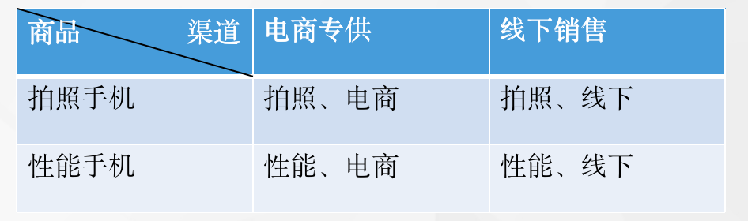

桥接（Bridge）模式包含以下主要角色。

- 抽象化（Abstraction）角色：定义抽象类，并包含一个对实现化对象的引用。
- 扩展抽象化（Refined Abstraction）角色：是抽象化角色的子类，实现父类中的业务方法，并通过组合关系调用实现化角色中的业务方法。
- 实现化（Implementor）角色：定义实现化角色的接口，供扩展抽象化角色调用。
- 具体实现化（Concrete Implementor）角色：给出实现化角色接口的具体实现。

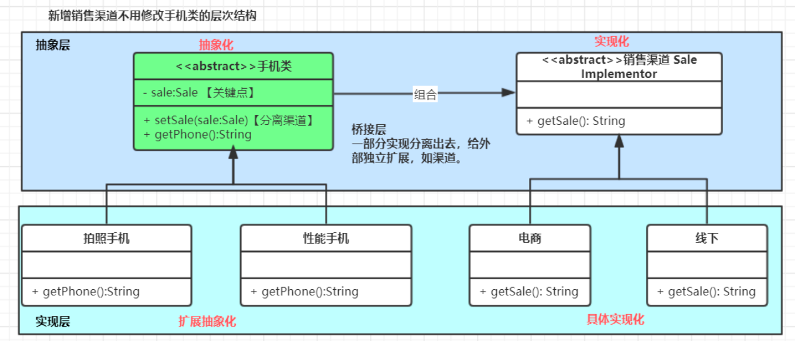

```markdown
# 一个东西多样化之后，会导致本类也会出现多样化，那么就应该把多样化特性分离出来
# 系统设计期间，如果这个类里面的一些东西，会扩展很多，这个东西就应该分离出来
```

#### 应用场景

什么场景用到？

- **当一个类存在两个独立变化的维度，且这两个维度都需要进行扩展时**。
- 当一个系统不希望使用继承或因为多层次继承导致系统类的个数急剧增加时。
- 当一个系统需要在构件的抽象化角色和具体化角色之间增加更多的灵活性时。

#### 编码实现

手机

```java
/**
 * 抽象手机类
 * 手机有各种销售渠道，价格都不一样
 */
public abstract class AbstractPhone {
    // 桥接在此
  	// 真正会引起此类变化的一个维度直接抽取出来，通过组合的方式连接起来
    AbstractSale sale; // 分离渠道（桥接的关注点）

    public AbstractSale getSale() {
        return sale;
    }

    public void setSale(AbstractSale sale) {
        this.sale = sale;
    }

    /**
     * 当前手机的描述
     *
     * @return
     */
    abstract String getPhone();
}

public class IPhone extends AbstractPhone {
    @Override
    String getPhone() {
        return "IPhone : " + sale;
    }
}

public class MiPhone extends AbstractPhone {
    @Override
    String getPhone() {
        return "MiPhone : " + sale;
    }
}
```

销售渠道和价格

```java
/**
 * 抽象的销售渠道
 */
public abstract class AbstractSale {
    private String type;
    private Integer price;

    public AbstractSale(String type, Integer price) {
        this.type = type;
        this.price = price;
    }

    @Override
    public String toString() {
        return "AbstractSale{" +
                "type='" + type + '\'' +
                ", price=" + price +
                '}';
    }
}

public class OfflineSale extends AbstractSale{
    public OfflineSale(String type, Integer price) {
        super(type, price);
    }
}

public class OnlineSale extends AbstractSale{
    public OnlineSale(String type, Integer price) {
        super(type, price);
    }
}
```

调用

```java
public class MainTest {
    public static void main(String[] args) {
        final IPhone iPhone = new IPhone();
        iPhone.setSale(new OfflineSale("线下", 9999));
        System.out.println(iPhone.getPhone());

        final IPhone iPhone1 = new IPhone();
        iPhone1.setSale(new OnlineSale("线上", 8999));
        System.out.println(iPhone1.getPhone());

        final MiPhone miPhone = new MiPhone();
        miPhone.setSale(new OfflineSale("线下", 6999));
        System.out.println(miPhone.getPhone());
    }
}
```

### 过滤器模式（Filter、Criteria Pattern）

使用不同的标准来过滤一组对象，通过逻辑运算以解耦的方式把它们连接起来。结合多个标准来获得单一标准

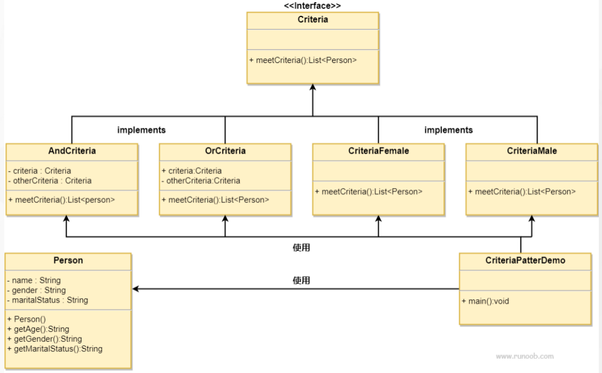

#### 应用场景

#### 编码实现

### 组合模式（Composite Pattern）

把一组相似的对象当作一个单一的对象。如：树形菜单

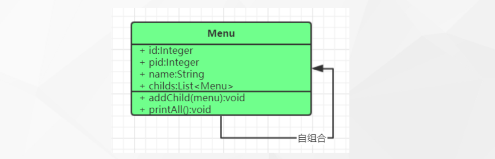

#### 应用场景

什么场景用到？

- 层级结构
- 部门组织结构
- 组合了别的对象还是组合模式吗？
- ......

#### 编码实现

就是自组合

### 装饰器模式

（Decorator/Wrapper Pattern）

```markdown
# 适配器是连接两个类，可以增强一个类，前提是已经存在两个类，但是这个两个类之间不能组合，所以需要通过一个类来组合和增强
# 装饰器是增强一个类
```


向一个现有的对象添加新的功能，同时又不改变其结构。属于对象结构型模式。

创建了一个装饰类，用来包装原有的类，并在保持类方法签名完整性的前提下，提供了额外的功能。

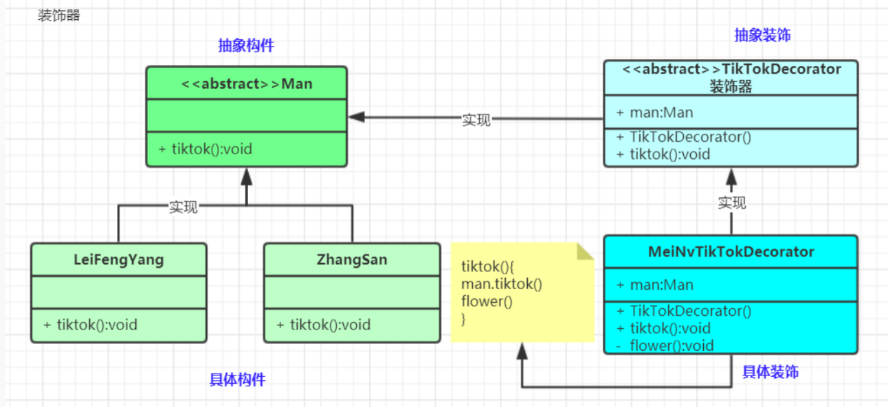

- 抽象构件（Component）角色：定义一个抽象接口以规范准备接收附加责任的对象。
- 具体构件（ConcreteComponent）角色：实现抽象构件，通过装饰角色为其添加一些职责。
- 抽象装饰（Decorator）角色：继承抽象构件，并包含具体构件的实例，可以通过其子类扩展具体构件的功能。
- 具体装饰（ConcreteDecorator）角色：实现抽象装饰的相关方法，并给具体构件对象添加附加的责任。

#### 应用场景

什么场景使用？

- SpringSession中如何进行session与redis关联？HttpRequestWrapper

  - session 数据存在了内存

  - session 数据存在Redis

  - ```markdown
    Wrapper(session){
    	getAttribute(String param){
    		redis.get(param);
    	}
    }
    ```

- MyBatisPlus提取了QueryWrapper，这是什么？

- Spring中的BeanWrapper是做什么？包装了Bean 增强了Bean的功能

- Spring Webflux中的 WebHandlerDecorator？

- ......

#### 编码实现

原控件

```java
/**
 * 抽象构件 抖音直播
 */
public interface ManTikTok {
    void tiktok();
}

/**
 * 张三直播
 */
public class LeiTikTk implements ManTikTok {
    @Override
    public void tiktok() {
        System.out.println("张三：tiktok...");
    }
}
```

装饰器

```java
/**
 * 抽象装饰器
 * <p>
 * 抖音直播装饰器
 */
public interface TiktokDecorator extends ManTikTok {
    void enable();
}

/**
 * 美颜装饰器
 * <p>
 * 装饰谁？
 */
public class MeiYanDecorator implements TiktokDecorator {
    private ManTikTok manTikTok;

    public MeiYanDecorator(ManTikTok manTikTok) {
        this.manTikTok = manTikTok;
    }

    @Override
    public void tiktok() {
        // 开启美颜
        enable();
        manTikTok.tiktok();
    }

    @Override
    public void enable() {
        System.out.println("看这个美女....");
    }
}
```

调用

```java
public class MainTest {
    public static void main(String[] args) {
        // 被装饰的对象
        final ManTikTok manTikTok = new LeiTikTk();

        final MeiYanDecorator meiYanDecorator = new MeiYanDecorator(manTikTok);
        meiYanDecorator.tiktok();
    }
}
```

### 外观模式

（Facade Pattern）

外观（Facade）模式又叫作门面模式，是一种通过为多个复杂的子系统提供一个一致的接口，而使这些子系统更加容易被访问的模式

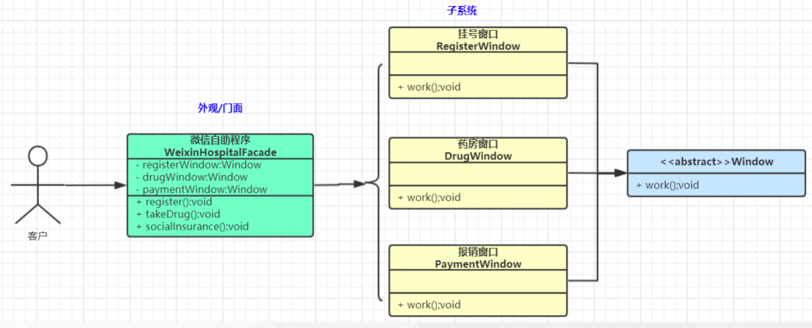

#### 应用场景

什么场景使用？

- 去医院看病，可能要去挂号、门诊、划价、取药，让患者或患者家属觉得很复杂，如果有提供接待人员，只让接待人员来处理，就很方便。以此类比......
- JAVA 的三层开发模式。
- 分布式系统的网关
- Tomcat源码中的RequestFacade干什么的？
- ......

#### 编码实现

```java
/**
 * 教育局
 */
public class Edu {
    public void assignSchool(String name) {
        System.out.println(name + "，你的孩子明天去希望小学报道...");
    }
}

/**
 * 公安局
 */
public class Police {

    public void register(String name) {
        System.out.println(name + "已办理落户");
    }
}

/**
 * 社保局
 */
public class Social {
    public void handleSocial(String name){
        System.out.println(name+"，你的社保关系已经转移....");
    }
}
```

```java
public class WeiXinFacade {
    Police police = new Police();
    Edu edu = new Edu();
    Social social = new Social();

    public void handleXXX(String name){
        police.register(name);
        edu.assignSchool(name);
        social.handleSocial(name);
    }
}
```

调用

```java
public class MainTest {
    public static void main(String[] args) {
        final WeiXinFacade weiXinFacade = new WeiXinFacade();
        weiXinFacade.handleXXX("张三");
    }
}
```

### 享元模式

（Flyweight Pattern）

享元模式(Flyweight Pattern)，运用共享技术有效地支持大量细粒度对象的复用。系统只使用少量的对象，而这些对象都很相似，状态变化很小，可以实现对象的多次复用。对象结构型

在享元模式中可以共享的相同内容称为内部状态(IntrinsicState)，而那些需要外部环境来设置的不能共享的内容称为外部状态(Extrinsic State)，由于区分了内部状态和外部状态，因此可以通过设置不同的外部状态使得相同的对象可以具有一些不同的特征，而相同的内部状态是可以共享的。

在享元模式中通常会出现工厂模式，需要创建一个享元工厂来负责维护一个享元池(Flyweight Pool)用于存储具有相同内部状态的享元对象。

享元模式包含如下角色：

- Flyweight: 抽象享元类
- ConcreteFlyweight: 具体享元类
- UnsharedConcreteFlyweight: 非共享具体享元类
- FlyweightFactory: 享元工厂类

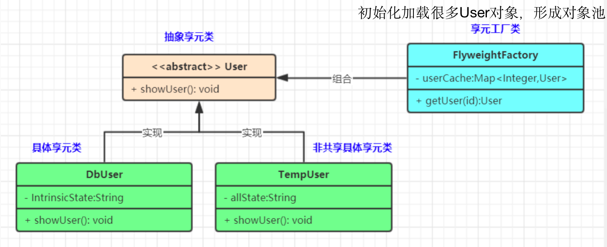

#### 应用场景

什么场景用到？

- 典型的代表：数据库连接池
- 所有的池化技术
- 享元和原型模式有什么区别？享元是预先准备好的对象进行复用，原型没法确定预先有哪些
- ......

#### 编码实现

享元对象

```java
/**
 * 抽象享元类
 */
public abstract class AbstractWaitressFlyweight {
    boolean canService = true; //能够服务

    public boolean isCanService() {
        return canService;
    }

    // 正在服务 享元的不可以共享属性留给外部进行改变的接口
    abstract void service();

    // 服务完成 享元的不可共享属性留给外部进行改变的接口
    abstract void end();
}

/**
 * 具体享元类
 */
public class BeautifulWaitress extends AbstractWaitressFlyweight {
    String id; // 工号
    String name; // 名字
    int age; // 年龄
    // 以上是不变的

    @Override
    void service() {
        System.out.println(toString() + " 正在为您服务...");
        this.canService = false;
    }

    @Override
    void end() {
        System.out.println(toString() + " 服务结束.");
        this.canService = true;
    }

    @Override
    public String toString() {
        return "BeautifulWaitress{" +
                "id='" + id + '\'' +
                ", name='" + name + '\'' +
                ", age=" + age +
                ", canService=" + canService +
                '}';
    }

    public BeautifulWaitress() {
    }

    public BeautifulWaitress(String id, String name, int age) {
        this.id = id;
        this.name = name;
        this.age = age;
    }

    public String getId() {
        return id;
    }

    public void setId(String id) {
        this.id = id;
    }
}
```

池化

```java
/**
 * 足疗店
 * <p>
 * 这里相当于享元工厂
 * 店里有很多的服务员
 */
public class ZuDao {
    private static Map<String, AbstractWaitressFlyweight> pool = new HashMap<>();

    // 享元 池子中有对象
    static {
        final BeautifulWaitress beautifulWaitress = new BeautifulWaitress("1111", "张三", 18);
        final BeautifulWaitress beautifulWaitress2 = new BeautifulWaitress("2222", "李四", 18);
        final BeautifulWaitress beautifulWaitress3 = new BeautifulWaitress("3333", "王五", 18);
        final BeautifulWaitress beautifulWaitress4 = new BeautifulWaitress("4444", "赵六", 18);
        final BeautifulWaitress beautifulWaitress5 = new BeautifulWaitress("5555", "钱七", 18);
        pool.put(beautifulWaitress.getId(), beautifulWaitress);
        pool.put(beautifulWaitress2.getId(), beautifulWaitress2);
        pool.put(beautifulWaitress3.getId(), beautifulWaitress3);
        pool.put(beautifulWaitress4.getId(), beautifulWaitress4);
        pool.put(beautifulWaitress5.getId(), beautifulWaitress5);
    }

    public void addWaitress(AbstractWaitressFlyweight waitressFlyweight) {
        pool.put(UUID.randomUUID().toString(), waitressFlyweight);
    }

    public static AbstractWaitressFlyweight getWaitress(String name) {
        final AbstractWaitressFlyweight flyweight = pool.get(name);
        if (flyweight == null) {
            for (AbstractWaitressFlyweight value : pool.values()) {
                if (value.isCanService())
                    return value;
            }
        }
        return flyweight;
    }

}
```

调用

```java
public class MainTest {
    public static void main(String[] args) {
        final AbstractWaitressFlyweight flyweight = ZuDao.getWaitress("1111");
        flyweight.service();
        flyweight.end();
    }
}
```

### 代理模式（Proxy Pattern）

代理模式(Proxy Pattern) ,给某一个对象提供一个代理，并由代理对象控制对原对象的引用,对象结构型模式。这种也是静态代理

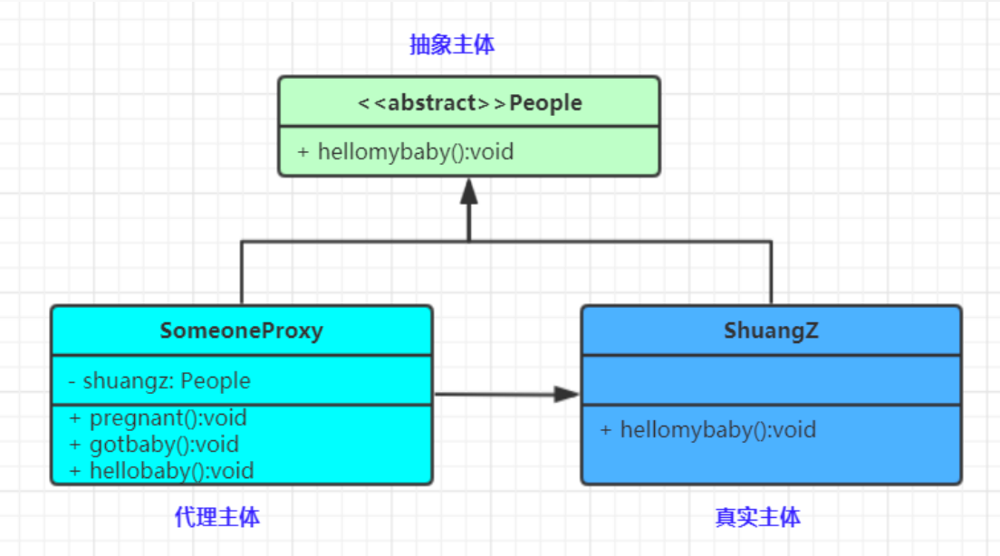

代理模式包含如下角色：

- Subject: 抽象主体角色(抽象类或接口)
- Proxy: 代理主体角色(代理对象类)
- RealSubject: 真实主体角色(被代理对象类)

#### 应用场景

- JDK动态代理
- cglib动态代理
- 代理模式和装饰器模式区别在哪里？

什么场景用到？

- MyBatis的mapper到底是什么？怎么生成的？
- Seata的DataSourceProxy是什么？
- DruidDataSource存在的Proxy模式
- ......

#### 编码实现

##### 静态代理

**静态代理就是装饰器，装饰器模式是代理模式的一种**

被代理类

```java
/**
 * 抽象主题，被代理对象
 */
public interface ManTikTok {
    void tiktok();
}

/**
 * Subject 主体
 *
 */
public class LeiTikTok implements ManTikTok{
    @Override
    public void tiktok() {
        System.out.println("主体直播...");
    }
}
```

代理类

```java
/**
 * 代理一般都是和被代理对象属于同一个接口
 */
public class TikTokProxy implements ManTikTok {
    // 被代理对象
    private ManTikTok manTikTok;

    public TikTokProxy(ManTikTok manTikTok) {
        this.manTikTok = manTikTok;
    }

    /**
     *
     */
    @Override
    public void tiktok() {
        // 增强功能
        System.out.println("我是代理者，当前正在直播...");
        manTikTok.tiktok();
    }
}
```

调用

```java
public class MainTest {
    public static void main(String[] args) {
        final TikTokProxy tikTokProxy = new TikTokProxy(new LeiTikTok());
        tikTokProxy.tiktok();
    }
}
```

##### JDK动态代理

**要求被代理的对象必须有接口**

被代理对象

```java
/**
 * 抽象主题，被代理对象
 */
public interface ManTikTok {
    void tiktok();
}

/**
 * Subject 主体
 *
 */
public class LeiTikTok implements ManTikTok {
    @Override
    public void tiktok() {
        System.out.println("主体直播...");
    }
}
```

代理对象

```java
public class JDKTikTokProxy<T> implements InvocationHandler {

    private T target;

    // 接收被代理对象
    public JDKTikTokProxy(T target) {
        this.target = target;
    }

    public static <T> T getProxy(T t) {
        // ClassLoader loader, 当前被代理对象的类加载器
        // Class<?>[] interfaces, 当前被代理对象所实现的所有接口
        // InvocationHandler h 当前被代理对象执行目标方法的时候我们h可以定义拦截增强
        final Object o = Proxy.newProxyInstance(t.getClass().getClassLoader(),
                t.getClass().getInterfaces(),
                new JDKTikTokProxy(t));
        return (T) o;
    }

    /**
     * 定义目标方法的拦截逻辑
     * <p>
     * 每个方法都会进来
     *
     * @param proxy
     * @param method
     * @param args
     * @return
     * @throws Throwable
     */
    @Override
    public Object invoke(Object proxy, Method method, Object[] args) throws Throwable {
        // 反射执行，真正执行被代理对象的方法
        System.out.println("真正执行被代理对象的方法");
        final Object invoke = method.invoke(target, args);
        System.out.println("返回值：" + invoke);
        return invoke;
    }
}
```

调用

```java
/**
 * 动态代理模式
 * <p>
 * 代理的东西不一样，每一种不同的被代理类Person、Dog、Cat 创建不同的静态代理类
 * 代理对象和目标对象的相同掉在于都是同一个接口
 */
public class MainTest {
    public static void main(String[] args) {
        final LeiTikTok leiTikTok = new LeiTikTok();
        final ManTikTok proxy = JDKTikTokProxy.getProxy(leiTikTok);
        proxy.tiktok();
      
      	final LeiTikTok proxy1 = (LeiTikTok) proxy;
        proxy1.selfMethod(); // 调用自己的方法，非接口方法，调用失败，出现错误，类型转换异常
    }
}
```

##### cglib

需要引入依赖

```xml
<!-- https://mvnrepository.com/artifact/cglib/cglib -->
<dependency>
    <groupId>cglib</groupId>
    <artifactId>cglib</artifactId>
    <version>3.3.0</version>
</dependency>
```

被代理对象

```java
/**
 * Subject 主体
 *
 */
public class LeiTikTok implements ManTikTok {
    @Override
    public void tiktok() {
        System.out.println("主体直播...");
    }

    public void selfMethod() {
        System.out.println("selfMethod");
    }
}
```

代理对象

```java
public class CglibProxy {
    public static <T> T createProxy(T t) {
        // 创建一个增强器
        final Enhancer enhancer = new Enhancer();
        // 设置父类
        enhancer.setSuperclass(t.getClass());
        // 设置方法回调
        enhancer.setCallback(new MethodInterceptor() {
            @Override
            public Object intercept(Object obj, Method method, Object[] args, MethodProxy proxy) throws Throwable {
                // 编写拦截的逻辑
                System.out.println("cglib 上场了....");
                Object invoke = proxy.invokeSuper(obj, args);
                return invoke;
            }
        }); // 核心
        return (T) enhancer.create();
    }
}
```

调用

```java
public class MainTest {
    public static void main(String[] args) {
        final LeiTikTok leiTikTok = new LeiTikTok();
        LeiTikTok proxy = CglibProxy.createProxy(leiTikTok);
        proxy.tiktok();
    }
}
```

## 行为型模式

### 为什么用行为型模式

行为型模式关注点“怎样运行对象/类？”所以我们关注下类/对象的运行时流程控制

行为型模式用于描述程序在运行时复杂的流程控制

描述多个类或对象之间怎样相互协作共同完成单个对象都无法单独完成的任务，它涉及算法与对象间职责的分配。

行为型模式分为类行为模式和对象行为模式，前者采用继承机制来在类间分派行为，后者采用组合或聚合在对象间分配行为。由于组合关系或聚合关系比继承关系耦合度低，满足“合成复用原则”，所以对象行为模式比类行为模式具有更大的灵活性。

- 模板方法（Template Method）模式：父类定义算法骨架，某些实现放在子类
- 策略（Strategy）模式：每种算法独立封装，根据不同情况使用不同算法策略
- 状态（State）模式：每种状态独立封装，不同状态内部封装了不同行为
- 命令（Command）模式：将一个请求封装为一个对象，使发出请求的责任和执行请求的责任分割开
- 职责链（Chain of Responsibility）模式：所有处理者封装为链式结构，依次调用
- 备忘录（Memento）模式：把核心信息抽取出来，可以进行保存
- 解释器（Interpreter）模式：定义语法解析规则
- 观察者（Observer）模式：维护多个观察者依赖，状态变化通知所有观察者
- 中介者（Mediator）模式：取消类/对象的直接调用关系，使用中介者维护
- 迭代器（Iterator）模式：定义集合数据的遍历规则
- 访问者（Visitor）模式：分离对象结构，与元素的执行算法

除了模板方法模式和解释器模式是类行为型模式，其他的全部属于对象行为型模式

### 模板方法（Template Method）模式

在模板模式（Template Pattern）中，一个抽象类公开定义了执行它的方法的方式模板。它的子类可以按需要重写方法实现，但调用将以抽象类中定义的方式进行。

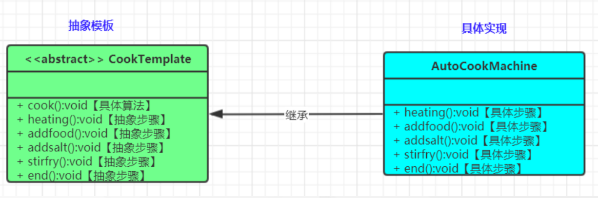

模板方法（Template Method）包含两个角色

- 抽象类/抽象模板（Abstract Class）
- 具体子类/具体实现（Concrete Class）

#### 应用场景

什么场景用到？

- Spring的整个继承体系都基本用到模板方法
- JdbcTemplate、RedisTemplate都允许我们再扩展.....
- 我们自己的系统也应该使用模板方法组织类结构
- ......

#### 编码实现

模板

```java
/**
 * 定义模板
 */
public abstract class CookTemplate {
    /**
     * 定义算法 定义好了模板
     * <p>
     * 父类可以实现某些步骤，留一些关键步骤给子类
     */
    public void cook() {
        // 定义算法步骤
        heating();
        addFood();
        addSalt();
        stirFry();
        end();
    }

    // 加热方法
    public void heating() {
        System.out.println("开火....");
    }

    // 添加食物
    public abstract void addFood();

    // 加盐
    public abstract void addSalt();

    // 翻炒
    public void stirFry() {
        System.out.println("翻炒...");
    }

    // 出锅
    public void end() {
        System.out.println("出锅...");
    }
}
```

子类实现

```java
public class AutoCookMachine extends CookTemplate {
    @Override
    public void addFood() {
        System.out.println("放了三颗小白菜...");
    }

    @Override
    public void addSalt() {
        System.out.println("放了三勺盐...");
    }
}
```

调用

```java
public class MainTest {
    public static void main(String[] args) {
        final CookTemplate autoCookMachine = new AutoCookMachine();
        autoCookMachine.cook();
    }
}
```

### 策略（Strategy）模式

策略（Strategy）模式定义了一系列算法，并将每个算法封装起来，使它们可以相互替换，且算法的变化不会影响使用算法的客户。属于对象行为模式。

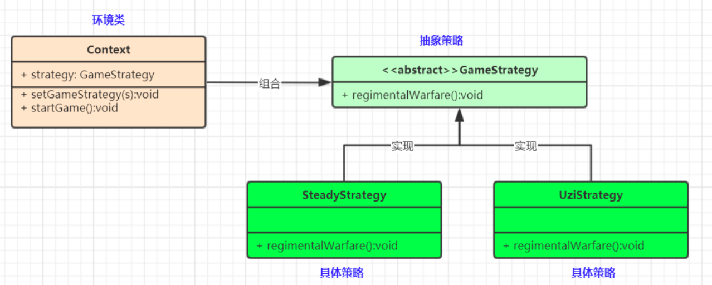

策略模式的主要角色如下。

- 抽象策略（Strategy）类：公共接口，各种不同的算法以不同的方式实现这个接口，环境角色使用这个接口调用不同的算法，一般使用接口或抽象类实现。
- 具体策略（Concrete Strategy）类：实现了抽象策略定义的接口，提供具体的算法实现。
- 环境（Context）类：持有一个策略类的引用，最终给客户端调用。

#### 应用场景

什么场景用到？

- 使用策略模式可以避免使用多重条件语句，如 if...else 语句、switch...case 语句
- 什么是Spring的 InstantiationStrategy
- 线程池拒绝策略
- ......

#### 编码实现

战队

```java
/**
 * 环境类
 */
public class TeamGNR {

    // 抽取游戏策略算法，并进行引用
    private GameStrategy gameStrategy;


    public void startGame() {
        System.out.println("游戏开始....");
        // 游戏策略
        gameStrategy.warStrategy();

        System.out.println("win....");
    }

    public void setGameStrategy(GameStrategy gameStrategy) {
        this.gameStrategy = gameStrategy;
    }
}
```

战队运用的策略

```java
/**
 * 游戏策略
 */
public interface GameStrategy {
    // 战斗策略
    void warStrategy();
}


/**
 * 稳健运营策略
 */
public class SteadyStrategy implements GameStrategy {
    @Override
    public void warStrategy() {
        System.out.println("各路小心...及时支援...");
    }
}

/**
 * 冲锋向前策略
 */
public class UziStrategy implements GameStrategy {
    @Override
    public void warStrategy() {
        System.out.println("UZI...");
    }
}
```

调用

```java
public class MainTest {
    public static void main(String[] args) {
        final TeamGNR teamGNR = new TeamGNR();

        teamGNR.setGameStrategy(new SteadyStrategy());

        teamGNR.startGame();
    }
}
```

### 状态（State）模式

状态（State）模式：对有状态的对象，把复杂的“判断逻辑”提取到不同的状态对象中，允许状态对象在其内部状态发生改变时改变其行为。

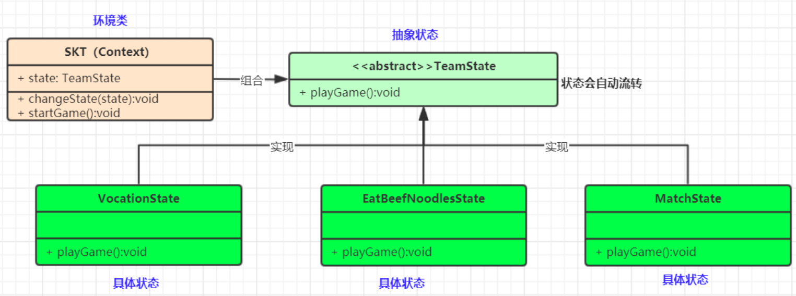

状态模式包含以下主要角色。

- 环境类（Context）角色：也称为上下文，它定义了客户端需要的接口，内部维护一个当前状态，并负责具体状态的切换。
- 抽象状态（State）角色：定义一个接口，用以封装环境对象中的特定状态所对应的行为，可以有一个或多个行为。
- 具体状态（Concrete State）角色：实现抽象状态所对应的行为，并且在需要的情况下进行状态切换。

#### 应用场景

什么场景用到？

- 策略模式和状态模式是一样的？状态模式更关注做什么，策略模式更关注怎么做
- 流程框架与状态机
- ......

#### 编码实现

战队

```java
/**
 * 环境类
 */
public class SKTTeam {
    private TeamState teamState;

    // 开始游戏
    public void startGame() {
        //状态不同会导致不同的游戏结果
        teamState.playGame();
    }

    public void setTeamState(TeamState teamState) {
        this.teamState = teamState;
    }
  
    void nextState() {
        teamState = teamState.next();
    }
}
```

战队状态

```java
/**
 * 抽象状态
 */
public interface TeamState {
    // 玩游戏
    void playGame();

    // 切换到下一个状态
    TeamState next();
}


/**
 * 牛肉面状态 饿了
 */
public class BeefNoodlesState implements TeamState {
    @Override
    public void playGame() {
        System.out.println("饱饱的一顿牛肉面...");
    }

    /**
     * 状态的流转 这才是状态策略的核心
     */
    @Override
    public TeamState next() {
        return new MatchState();
    }
}


/**
 * 竞赛状态
 */
public class MatchState implements TeamState {
    @Override
    public void playGame() {
        System.out.println("全力以赴打比赛...");
    }


    /**
     * 状态的流转 这才是状态策略的核心
     */
    @Override
    public TeamState next() {
        return new VocationState();
    }
}


/**
 * 休假状态
 */
public class VocationState implements TeamState{
    @Override
    public void playGame() {
        System.out.println("三亚旅游真舒服...饿了...不玩游戏");
    }


    /**
     * 状态的流转 这才是状态策略的核心
     */
    @Override
    public TeamState next() {
        return new BeefNoodlesState();
    }
}
```

调用

```java
public class MainTest {
    public static void main(String[] args) {
        final SKTTeam sktTeam = new SKTTeam();
        sktTeam.setTeamState(new VocationState());
        sktTeam.startGame();
      
        sktTeam.nextState();

        sktTeam.startGame();

        sktTeam.nextState();

        sktTeam.startGame();
    }
}
```

### 中介者（Mediator）模式

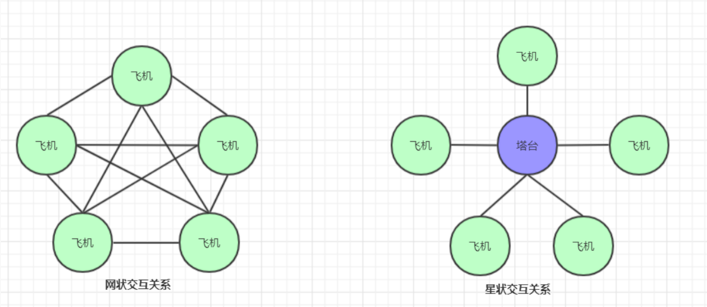

中介者模式(Mediator Pattern)：用一个中介对象来封装一系列的对象交互，中介者使各对象不需要显式地相互引用，减少对象间混乱的依赖关系，从而使其耦合松散，而且可以独立地改变它们之间的交互。对象行为型模式。

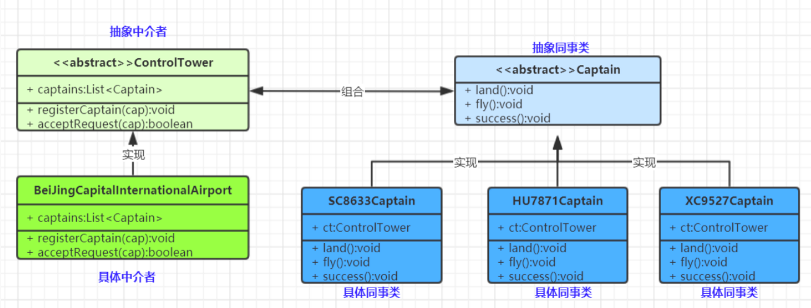

- Mediator: 抽象中介者
- ConcreteMediator: 具体中介者
- Colleague: 抽象同事类
- ConcreteColleague: 具体同事类

#### 应用场景

什么场景用到？

- SpringMVC 的 DispatcherServlet是一个中介者，他会提取Controller、Model、View来进行调用。而无需controller直接调用view之类的渲染方法
- 分布式系统中的网关
- 迪米特法则的一个典型应用
- .......

#### 编码实现

飞机

```java
/**
 * 抽象机长
 */
public abstract class Caption {
    public void setControlTower(ControlTower controlTower) {
        this.controlTower = controlTower;
    }

    ControlTower controlTower;


    // 起飞
    abstract void fly();

    // 降落
    abstract void land();

    // 完成
    abstract void success();
}

/**
 * 海南航空8778
 */
public class HU8778 extends Caption {
    @Override
    void fly() {
        System.out.println("HU8778请求起飞...");
        // 以前：问每个机长，能否起飞

        // 现在通过塔台获取嫩否起飞
        controlTower.acceptRequest(this, "fly");
    }

    @Override
    void land() {
        System.out.println("HU8778请求降落...");
        controlTower.acceptRequest(this, "land");
    }

    @Override
    void success() {
        System.out.println("完成...");
        controlTower.acceptRequest(this, "success");
    }
}


/**
 * 海南航空8633
 */
public class SC8633 extends Caption {
    @Override
    void fly() {
        System.out.println("SC8633请求起飞...");
        // 以前：问每个机长，能否起飞

        // 现在通过塔台获取嫩否起飞
        controlTower.acceptRequest(this, "fly");
    }

    @Override
    void land() {
        System.out.println("SC8633请求降落...");
        controlTower.acceptRequest(this, "land");
    }

    @Override
    void success() {
        System.out.println("完成...");
        controlTower.acceptRequest(this, "success");
    }
}

/**
 * 海南航空9527
 */
public class XC9527 extends Caption {
    @Override
    void fly() {
        System.out.println("XC9527请求起飞...");
        // 以前：问每个机长，能否起飞

        // 现在通过塔台获取嫩否起飞
        controlTower.acceptRequest(this, "fly");
    }

    @Override
    void land() {
        System.out.println("XC9527请求降落...");
        controlTower.acceptRequest(this, "land");
    }

    @Override
    void success() {
        System.out.println("完成...");
        controlTower.acceptRequest(this, "success");
    }
}
```

塔台

```java
/**
 * 塔台 中介者
 */
public class ControlTower {
    // 跑道上是否有飞机
    private boolean canDo = true;

    // 接收请求
    public void acceptRequest(Caption caption, String action) {
        if ("fly".equals(action) || "land".equals(action)) {
            if (canDo == true) {
                System.out.println("允许起飞...");
                canDo = false;
            } else {
                System.out.println("");
            }
        }
        if ("success".equals(action)) {
            canDo = true;
        }
    }
}
```

调用

```java
public class MainTest {
    public static void main(String[] args) {
        final ControlTower controlTower = new ControlTower();

        final HU8778 hu8778 = new HU8778();
        hu8778.setControlTower(controlTower);
        final XC9527 xc9527 = new XC9527();
        xc9527.setControlTower(controlTower);

        hu8778.fly();
        xc9527.fly();
    }
}
```

### 观察者（Observer）模式

观察者模式(Observer Pattern)：定义对象间的一种一对多依赖关系，使得每当一个对象状态发生改变时，其相关依赖对象皆得到通知并被自动更新。观察者模式又叫做发布-订阅（Publish/Subscribe）模式、模型-视图（Model/View）模式、源-监听器（Source/Listener）模式或从属者（Dependents）模式。对象行为型模式

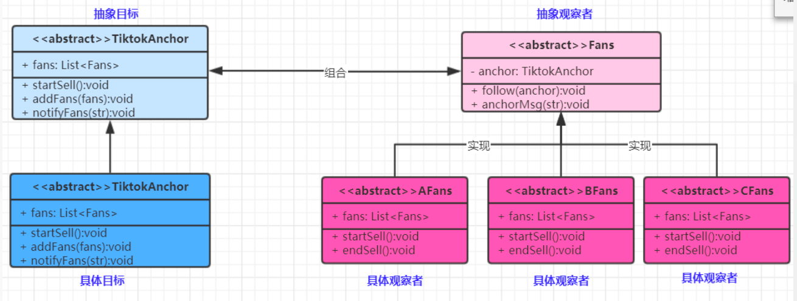

- Subject: 目标
- ConcreteSubject: 具体目标
- Observer: 观察者
- ConcreteObserver: 具体观察者

#### 应用场景

什么场景用到？

- Spring事件机制如何实现？
- Vue的双向绑定核心
- 响应式编程核心思想
- ......

#### 编码实现

主播

```java
/**
 * 抖音主播
 * <p>
 * 粉丝观察很多主播...
 */
public abstract class AbstractTikToker {
    // 添加粉丝
    abstract void addFans(AbstractFan fans);

    // 通知粉丝
    abstract void notifyFans(String msg);
}

/**
 * 主播
 */
public class MMTikToker extends AbstractTikToker {
    List<AbstractFan> fans = new ArrayList<AbstractFan>();


    // 卖货
    void startSell() {
        System.out.println("开始卖货...");
        //通知粉丝
        notifyFans("我开始卖货了...");
    }

    // 结束卖货
    void endSell() {
        System.out.println("结束卖货...");
        notifyFans("我结束卖货了,东西已经售完了...");
    }

    @Override
    void addFans(AbstractFan fan) {
        fans.add(fan);
    }

    @Override
    void notifyFans(String msg) {
        for (AbstractFan fan : fans) {
            fan.acceptMsg(msg);
        }
    }
}
```

粉丝

```java
/**
 * 抽象观察者
 */
public abstract class AbstractFan {
    abstract void acceptMsg(String msg);

    void follow(AbstractTikToker tikToker) {
        // 主播涨粉了
        tikToker.addFans(this);
    }
}

/**
 * 具体实现 人类粉丝
 */
public class HumanFan extends AbstractFan {
    @Override
    void acceptMsg(String msg) {
        System.out.println("主播说：" + msg);
    }
}

/**
 * 具体实现 机器人粉丝
 */
public class RobotFan extends AbstractFan{
    @Override
    void acceptMsg(String msg) {
        System.out.println("呸....");
    }
}
```

调用

```java
public class MainTest {
    public static void main(String[] args) {
        final MMTikToker mmTikToker = new MMTikToker();

        final RobotFan robotFan = new RobotFan();
        final RobotFan robotFan1 = new RobotFan();
        final RobotFan robotFan2 = new RobotFan();
        robotFan.follow(mmTikToker);
        robotFan1.follow(mmTikToker);
        robotFan2.follow(mmTikToker);

        final HumanFan humanFan = new HumanFan();
        final HumanFan humanFan1 = new HumanFan();
        final HumanFan humanFan2 = new HumanFan();
        humanFan.follow(mmTikToker);
        humanFan1.follow(mmTikToker);
        humanFan2.follow(mmTikToker);

        mmTikToker.startSell();
        System.out.println("卖货中....");
        mmTikToker.endSell();
    }
}
```

### 备忘录（Memento）模式

备忘录（Memento）模式：在不破坏封装性的前提下，捕获一个对象的内部状态，并在该对象之外保存这个状态，以便以后当需要时能将该对象恢复到原先保存的状态。该模式又叫快照模式。对象行为型模式

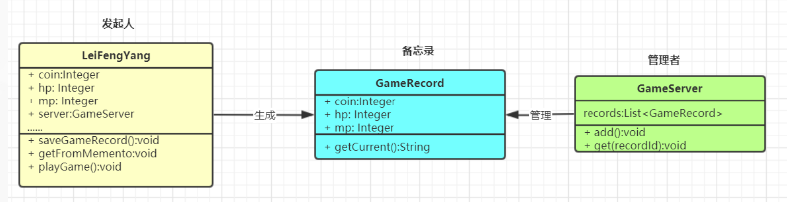

- 发起人（Originator）角色：记录当前时刻的内部状态信息，提供创建备忘录和恢复备忘录数据的功能，实现其他业务功能，它可以访问备忘录里的所有信息。
- 备忘录（Memento）角色：负责存储发起人的内部状态，在需要的时候提供这些内部状态给发起人。
- 管理者（Caretaker）角色：对备忘录进行管理，提供保存与获取备忘录的功能，但其不能对备忘录的内容进行访问与修改。

#### 应用场景

什么场景用到？

- 游戏存档
- 数据库保存点事务（savepoint）
- session活化钝化
- ......

#### 编码实现

游戏记录

```java
/**
 * 游戏记录，需要保存内部状态信息，也叫备忘录信息
 */
public class GameRecord {
    public Integer getId() {
        return id;
    }

    public void setId(Integer id) {
        this.id = id;
    }

    Integer id;// 代表生成记录的id
    Integer coin;// 剩余金币
    Integer hp;// 血量
    Integer mp;// 蓝量
    Integer level;// 等级

    // 获取当前备忘录信息
    void getCurrent(){
        System.out.println(toString());
    }

    public Integer getCoin() {
        return coin;
    }

    public void setCoin(Integer coin) {
        this.coin = coin;
    }

    public Integer getHp() {
        return hp;
    }

    public void setHp(Integer hp) {
        this.hp = hp;
    }

    public Integer getMp() {
        return mp;
    }

    public void setMp(Integer mp) {
        this.mp = mp;
    }

    public Integer getLevel() {
        return level;
    }

    public void setLevel(Integer level) {
        this.level = level;
    }

    @Override
    public String toString() {
        return "GameRecord{" +
                "coin=" + coin +
                ", hp=" + hp +
                ", mp=" + mp +
                ", level=" + level +
                '}';
    }
}
```

游戏者

```java
/**
 * 游戏者
 */
public class LeiGamer {
    Integer coin;// 剩余金币
    Integer hp;// 血量
    Integer mp;// 蓝量
    Integer level;// 等级
    // 以上的是内部状态

    GameServer gameServer = new GameServer();

    // 保存游戏记录
    void saveGameRecord() throws Exception {
        System.out.println("正在保存当前记录...");
        final GameRecord record = new GameRecord();
        BeanUtils.copyProperties(record, this);
        gameServer.add(record);
    }

    // 从备忘录获取游戏历史存档
    LeiGamer getFromMemento(Integer id) throws Exception {
        System.out.println("获取历史存档信息...");
        final LeiGamer record = gameServer.getRecord(id);
        return record;
    }

    // 玩游戏
    void playGame() {
        final int i = new Random().nextInt();
        System.out.println("玩游戏....：" + i);

        this.coin = i;
        this.hp = i;
        this.mp = i;
        this.level = i;
    }

    // 退出游戏
    void exitGame() throws Exception {
        System.out.println("退出&存档...");
        saveGameRecord();
    }
}
```

游戏服务器，管理着游戏备忘录

```java
/**
 * 游戏服务器
 * <p>
 * 管理者
 */
public class GameServer {
    // 管理备忘录
    Map<Integer, GameRecord> records = new HashMap<>();

    int i = 1;

    void add(GameRecord record) {
        record.setId(i++);
        records.put(record.getId(), record);
    }

    LeiGamer getRecord(Integer id) throws Exception {

        // 获取到备忘录里面的内容以后还要逆转
        final LeiGamer leiGamer = new LeiGamer();
        final GameRecord record = records.get(id);

        // BeanUtil 工具类，只要两个类属性一致，就可以属性对拷
        BeanUtils.copyProperties(leiGamer, record);

        return leiGamer;
    }
}
```

调用

```java
public class MainTest {
    public static void main(String[] args) throws Exception {
        final LeiGamer leiGamer = new LeiGamer();
        leiGamer.playGame();

        // 保存游戏记录
        leiGamer.saveGameRecord();

        leiGamer.playGame();

        leiGamer.playGame();

        leiGamer.saveGameRecord();

        final LeiGamer fromMemento = leiGamer.getFromMemento(1);
        fromMemento.playGame();
    }
}
```

### 解释器（Interpreter）模式

解释器（Interpreter）模式：给分析对象定义一个语言，并定义该语言的文法表示，再设计一个解析器来解释语言中的句子。也就是说，用编译语言的方式来分析应用中的实例。这种模式实现了文法表达式处理的接口，该接口解释一个特定的上下文。类行为型模式

- 抽象表达式（Abstract Expression）角色：定义解释器的接口，约定解释器的解释操作，主要包含解释方法 interpret()。
- 终结符表达式（Terminal Expression）角色：是抽象表达式的子类，用来实现文法中与终结符相关的操作，文法中的每一个终结符都有一个具体终结表达式与之相对应。
- 非终结符表达式（Nonterminal Expression）角色：也是抽象表达式的子类，用来实现文法中与非终结符相关的操作，文法中的每条规则都对应于一个非终结符表达式。
- 环境（Context）角色：通常包含各个解释器需要的数据或是公共的功能，一般用来传递被所有解释器共享的数据，后面的解释器可以从这里获取这些值。
- 客户端（Client）：主要任务是将需要分析的句子或表达式转换成使用解释器对象描述的抽象语法树，然后调用解释器的解释方法，当然也可以通过环境角色间接访问解释器的解释方法。

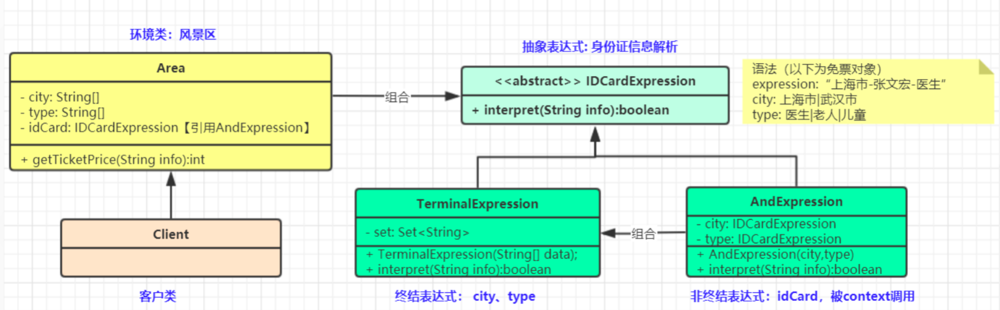

#### 应用场景

什么场景用到？

- Spring的表达式解析：#{}
- Thymeleaf等模板引擎的语法解析
- 编译原理
- ......

#### 编码实现

环境类

```java
/**
 * 环境类
 * <p>
 * 风景区
 */
public class Area {
    Set<String> city = new HashSet<>();// 免费城市
    Set<String> type = new HashSet<>();// 免费人群
    IDCardExpression idCardExpression;// 读卡器

    // 环境类持有表达式

    public Area() {
        city.addAll(Arrays.asList("武汉市", "上海市"));
        type.addAll(Arrays.asList("医生", "老人", "儿童"));

        final TerminalExpression city = new TerminalExpression(this.city, ":");
        final TerminalExpression type = new TerminalExpression(this.city, "-");

        // 以上任何一个规则满足就行
        idCardExpression = new OrExpression(city, type);
    }

    void getTicket(String expression) {
        final boolean interpret = idCardExpression.interpret(expression);
        if (interpret) {
            System.out.println("恭喜你，免票通过...");
        } else {
            System.out.println("需要买票...");
        }
    }
}
```

解析器

```java
public abstract class IDCardExpression {
    /**
     * 定义解析逻辑
     * 假设我们需要解析的信息格式为
     *  上海市:张三-医生
     *  武汉市:李四-程序员
     *  北京市:王五-老人
     */
    abstract boolean interpret(String expression);
}

public class TerminalExpression extends IDCardExpression {
    Set<String> data; // 数据
    String symbol; // 定义解析用的符号如：-

    public TerminalExpression(Set<String> data, String symbol) {
        this.data = data;
        this.symbol = symbol;
    }

    @Override
    boolean interpret(String expression) {
        // 先按照指定符号进行分割
        //上海市:张三-医生
        final String[] split = expression.split(symbol);
        for (String s : split) {
            if (data.contains(s)) {// 说明里面是免费的信息
                return true;
            }
        }
        // 不在里面不存在免费的信息
        return false;
    }
}


public class OrExpression extends IDCardExpression {

    // 组合两个终结表达式，最终的判断结果是最终表达式判断出来的，这个表达式只是一个桥梁
    private IDCardExpression cityExpression;
    private IDCardExpression typeExpression;

    public OrExpression(IDCardExpression city, IDCardExpression type) {
        this.cityExpression = city;
        this.typeExpression = type;
    }

    @Override
    boolean interpret(String expression) {
        // 定义所有终结表达式的合并逻辑
        return cityExpression.interpret(expression) || typeExpression.interpret(expression);
    }
}
```

调用

```java
public class MainTest {
    public static void main(String[] args) {
        final Area area = new Area();
        final String expression = "广州市:张三-律师";
        area.getTicket(expression);
    }
}
```

### 命令（Command）模式

命令（Command）模式：将一个请求封装为一个对象，使发出请求的责任和执行请求的责任分割开。这样两者之间通过命令对象进行沟通，这样方便将命令对象进行储存、传递、调用、增加与管理。

命令模式包含以下主要角色。

- 抽象命令类（Command）角色：声明执行命令的接口，拥有执行命令的抽象方法 execute()。
- 具体命令类（Concrete Command）角色：是抽象命令类的具体实现类，它拥有接收者对象，并通过调用接收者的功能来完成命令要执行的操作。
- 实现者/接收者（Receiver）角色：执行命令功能的相关操作，是具体命令对象业务的真正实现者。
- 调用者/请求者（Invoker）角色：是请求的发送者，它通常拥有很多的命令对象，并通过访问命令对象来执行相关请求，它不直接访问接收者。

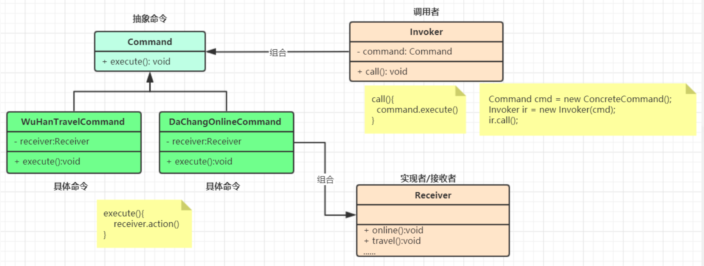

#### 应用场景

什么场景用到？

- mvc就是典型的命令模式
- 当系统需要执行一组操作时，命令模式可以定义宏命令（一个命令组合了多个命令）来实现该功能。
- 结合备忘录模式还可以实现命令的撤销和恢复
- ......

#### 编码实现

被调用者

```java
public class LeiReceiver {
    public void online() {
        System.out.println("online");
    }

    public void travel() {
        System.out.println("travel");
    }
}
```

命令

```java
/**
 * 抽象命令类
 * Service接口
 */
public interface Command {
    /**
     * 命令的执行方法
     */
    void execute();
}

/**
 * 线上课的命令
 */
public class OnlineCommand implements Command {
    private LeiReceiver receiver = new LeiReceiver();

    @Override
    public void execute() {
        System.out.println("线上课....");
        receiver.online();
    }
}

/**
 * 武汉出差的命令
 */
public class WuHanTravelCommand implements Command {
    private LeiReceiver receiver = new LeiReceiver();

    @Override
    public void execute() {
        System.out.println("武汉出差....");
        receiver.travel();
    }
}
```

发起者

```java
/**
 * 命令调用者（发起者）
 */
public class TeacherInvoker {
    public void setCommand(Command command) {
        this.command = command;
    }

    Command command;

    public void call() {
        command.execute();
    }
}
```

调用

```java
public class MainTest {
    public static void main(String[] args) {
        final TeacherInvoker teacherInvoker = new TeacherInvoker();
        teacherInvoker.setCommand(new WuHanTravelCommand());
        teacherInvoker.call();
    }
}
```


### 迭代器（Iterator）模式

迭代器（Iterator）模式：提供一个对象(迭代器)来顺序访问聚合对象(迭代数据)中的一系列数据，而不暴露聚合对象的内部表示。对象行为型模式

- 抽象聚合（Aggregate）角色：定义存储、添加、删除聚合对象以及创建迭代器对象的接口。
- 具体聚合（ConcreteAggregate）角色：实现抽象聚合类，返回一个具体迭代器的实例。
- 抽象迭代器（Iterator）角色：定义访问和遍历聚合元素的接口，通常包含 hasNext()、first()、next() 等方法。
- 具体迭代器（Concretelterator）角色：实现抽象迭代器接口中所定义的方法，完成对聚合对象的遍历，记录遍历的当前位置。

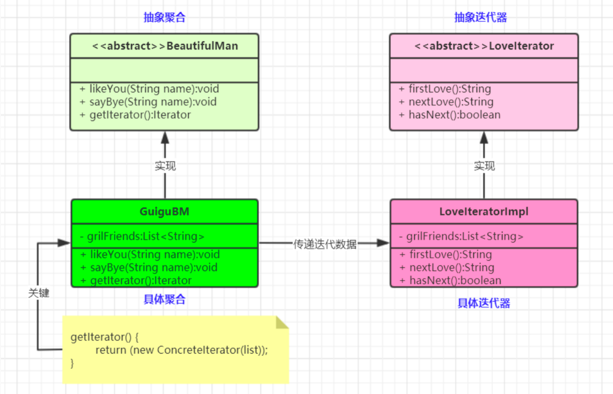

#### 应用场景

什么场景用到？

- jdk容器接口的Iterator定义
- 现实开发中，我们几乎无需编写迭代器，基本数据结构链表、树、图的迭代器已经都有了。除非要重写迭代逻辑
- ......

#### 编码实现

需要被迭代的类

```java
public abstract class BeautifulMan {
    // 不方便暴露给外界的集合，只允许外界获取而不可以操作
    private List<String> girls = new ArrayList<>();

    void likeYou(String name) {
        girls.add(name);
    }

    void sayBye(String name) {
        girls.remove(name);
    }

    /**
     * 获取迭代器
     *
     * @return
     */
    public Itr getIterator() {
        return new Iterator();
    }


    /**
     * 具体迭代器
     */
    class Iterator implements Itr {

        private int cursor = 0;// 当前指针

        @Override
        public boolean hasNext() {
            return cursor < girls.size();
        }

        @Override
        public String next() {
            // 第一次调用返回第一个数据
            // 下一次调用返回自动访问下一个数据
            return girls.get(cursor++);
        }

        @Override
        public String first() {
            return girls.get(0);
        }

        @Override
        public String current() {
            return girls.get(girls.size() - 1);
        }
    }

    interface Itr {
        // 有没有下一个
        boolean hasNext();

        // 返回下一个
        String next();

        // 返回第一个
        String first();

        // 返回当前，最后一个女朋友
        String current();
    }
}

public class ZhangSan extends BeautifulMan{
}
```

调用

```java
public class MainTest {
    public static void main(String[] args) {
        final ZhangSan zhangSan = new ZhangSan();
        zhangSan.likeYou("李四");
        zhangSan.likeYou("王五");
        zhangSan.likeYou("赵六");

        final BeautifulMan.Itr iterator = zhangSan.getIterator();
        while (iterator.hasNext()) {
            System.out.println(iterator.next());
        }
    }
}
```

### 访问者（Visitor）模式

访问者（Visitor）模式：将作用于某种数据结构中的各元素的操作分离出来封装成独立的类，使其在不改变数据结构的前提下可以添加作用于这些元素的新的操作，为数据结构中的每个元素提供多种访问方式。它将对数据的操作与数据结构进行分离，是行为类模式中最复杂的一种模式。

- 抽象访问者（Visitor）角色：定义一个访问具体元素的接口，为每个具体元素类对应一个访问操作 visit() ，该操作中的参数类型标识了被访问的具体元素。
- 具体访问者（ConcreteVisitor）角色：实现抽象访问者角色中声明的各个访问操作，确定访问者访问一个元素时该做什么。
- 抽象元素（Element）角色：声明一个包含接受操作 accept() 的接口，被接受的访问者对象作为 accept() 方法的参数。
- 具体元素（ConcreteElement）角色：实现抽象元素角色提供的 accept() 操作，其方法体通常都是 visitor.visit(this) ，另外具体元素中可能还包含本身业务逻辑的相关操作。
- 对象结构（Object Structure）角色：是一个包含元素角色的容器，提供让访问者对象遍历容器中的所有元素的方法，通常由 List、Set、Map 等聚合类实现。

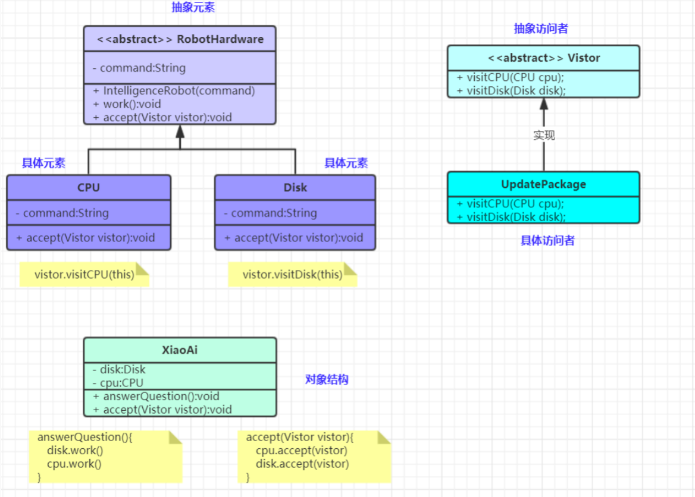

#### 应用场景

什么场景用到？

- 在访问者模式中，每增加一个新的元素类，都要在每一个具体访问者类中增加相应的具体操作，这违背了“开闭原则”。
- 违反依赖倒置原则。访问者模式依赖了具体类，而没有依赖抽象类
- 破坏封装。访问者模式中具体元素对访问者公布细节，这破坏了对象的封装性
- 应用于对象结构相对稳定，但其操作算法经常变化的程序。
- Spring反射工具中的MethodVisitor是什么？
- ......

#### 编码实现

被访问者

```java
public abstract class Hardware {
    String command;

    public Hardware(String command) {
        this.command = command;
    }

    abstract void work();

    // 定义接收软件升级包的方法，这个方法应该具体硬件去实现
    abstract void accept(Visitor visitor);
}


public class CPU extends Hardware {

    public CPU(String command) {
        super(command);
    }

    @Override
    public void work() {
        System.out.println("CPU " + command);
    }

    @Override
    public void accept(Visitor visitor) {
        // 给升级包提供一个改CPU指令等信息的办法
        visitor.visitCPU(this);
    }
}


public class Disk extends Hardware {
    public Disk(String command) {
        super(command);
    }

    @Override
    void work() {
        System.out.println("Disk " + command);
    }

    @Override
    public void accept(Visitor visitor) {
        // 给升级包提供一个改CPU指令等信息的办法
        visitor.visitDisk(this);
    }
}
```

访问者

```java
public interface Visitor {
    void visitCPU(CPU cpu);

    void visitDisk(Disk disk);
}
```

小爱机器人

```java
/**
 * 小爱机器人
 */
public class XiaoAI {
    private CPU cpu = new CPU("武汉天气");
    private Disk disk = new Disk("武汉天气");

    void answerQuestion() {
        cpu.work();
        disk.work();
    }

    public void acceptUpdate(UpdatePackage updatePackage) {
        // 升级
        updatePackage.visitCPU(cpu);
        updatePackage.visitDisk(disk);
    }
}

// 升级包
public class UpdatePackage implements Visitor {
    @Override
    public void visitCPU(CPU cpu) {
        cpu.command = ">>>> 联网查询中";
    }

    @Override
    public void visitDisk(Disk disk) {
        disk.command = ">>>> 联网存储中";
    }
}
```

调用

```java
public class MainTest {
    public static void main(String[] args) {
        final XiaoAI xiaoAI = new XiaoAI();
        xiaoAI.answerQuestion();

        final UpdatePackage updatePackage = new UpdatePackage();

        xiaoAI.acceptUpdate(updatePackage);

        xiaoAI.answerQuestion();
    }
}
```

### 职责链（Chain of Responsibility）模式

责任链（Chain of Responsibility）模式：为了避免请求发送者与多个请求处理者耦合在一起，于是将所有请求的处理者通过前一对象记住其下一个对象的引用而连成一条链；当有请求发生时，可将请求沿着这条链传递，直到有对象处理它为止。属于对象行为型模式

- 抽象处理者（Handler）角色：定义一个处理请求的接口，包含抽象处理方法和一个后继连接。
- 具体处理者（Concrete Handler）角色：实现抽象处理者的处理方法，判断能否处理本次请求，如果可以处理请求则处理，否则将该请求转给它的后继者。
- 客户类（Client）角色：创建处理链，并向链头的具体处理者对象提交请求，它不关心处理细节和请求的传递过程。

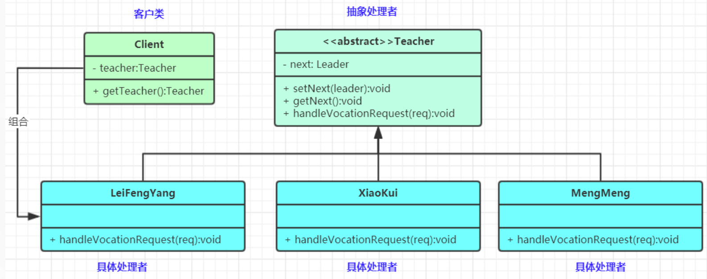

#### 应用场景

什么场景用到？

- Tomcat的Pipeline、Valve
- Filter链
- Aop责任链
- ......

#### 编码实现

##### 简单责任链

```java
public class Teacher {
    private String name;

    public Teacher(String name) {
        this.name = name;
    }

    private Teacher next;// 下一个处理的老师

    void handleRequest() {
        System.out.println(this + "正在处理");
        // 下一个继续
        if (next != null)
            next.handleRequest();
    }

    public Teacher getNext() {
        return next;
    }

    public void setNext(Teacher next) {
        this.next = next;
    }

    @Override
    public String toString() {
        return "Teacher{" +
                "name='" + name + '\'' +
                '}';
    }
}
```

调用

```java
public class MainTest {
    public static void main(String[] args) {

        final Teacher teacher = new Teacher("张三");
        final Teacher teacher1 = new Teacher("李四");
        final Teacher teacher2 = new Teacher("王五");

        teacher.setNext(teacher1);
        teacher1.setNext(teacher2);

        teacher.handleRequest();
    }
}
```

##### 复杂责任链

链式节点

```java
public interface Filter {
    void doFilter(Request request, Response response, FilterChain chain);
}

public class HttpFilter implements Filter {
    @Override
    public void doFilter(Request request, Response response, FilterChain chain) {
        System.out.println("HttpFilter之前");
        // 往下放行
        chain.doFilter(request, response, chain);
        System.out.println("HttpFilter之后");
    }
}

public class CharacterFilter implements Filter {
    @Override
    public void doFilter(Request request, Response response, FilterChain chain) {
        System.out.println("CharacterFilter之前");
        // 往下放行
        chain.doFilter(request, response, chain);
        System.out.println("CharacterFilter之后");
    }
}

public class EncodingFilter implements Filter {
    @Override
    public void doFilter(Request request, Response response, FilterChain chain) {
        System.out.println("EncodingFilter之前");
        // 往下放行
        chain.doFilter(request, response, chain);
        System.out.println("EncodingFilter之后");
    }
}
```

链条

```java
/**
 * 靠链条维护
 */
public class FilterChain implements Filter {
    int cursor = 0;
    // filter 的链
    List<Filter> filters = new ArrayList<Filter>();

    public My getTarget() {
        return target;
    }

    public void setTarget(My target) {
        this.target = target;
    }

    // 最终要执行的目标方法
    My target;

    void addFilter(Filter filter) {
        filters.add(filter);
    }

    @Override
    public void doFilter(Request request, Response response, FilterChain chain) {
        // 游标小于链路中的数量
        if (cursor < filters.size()) {
            // 第一个执行第一个filter
            final Filter filter = filters.get(cursor);
            cursor++;
            // 执行filter
            filter.doFilter(request, response, chain);
        } else {
            // 执行目标方法
            target.hello();
        }
    }
}

public class Request {
    public String getMsg() {
        return msg;
    }

    public void setMsg(String msg) {
        this.msg = msg;
    }

    String msg;

    public Request(String msg) {
        this.msg = msg;
    }
}

public class Response {
    public String getContent() {
        return content;
    }

    public void setContent(String content) {
        this.content = content;
    }

    String content;

    public Response(String content) {
        this.content = content;
    }
}
```

目标对象

```java
public class My {
    void hello() {
        System.out.println("调用my.hello()");
    }
}
```

调用

```java
// 执行顺序 1-2-3-my-3-2-1
public class MainTest {
    public static void main(String[] args) {
        final FilterChain chain = new FilterChain();
        final HttpFilter httpFilter = new HttpFilter();
        final CharacterFilter characterFilter = new CharacterFilter();
        final EncodingFilter encodingFilter = new EncodingFilter();
        chain.addFilter(httpFilter);
        chain.addFilter(characterFilter);
        chain.addFilter(encodingFilter);

        // filter 如何链式调用
        chain.setTarget(new My());

        chain.doFilter(new Request("hello world"), new Response("to the end"), chain);
    }
}
```

