## 概述

### Java主流架构技术演变之路

1. Servlet+JSP+JavaBean
2. MVC三层架构

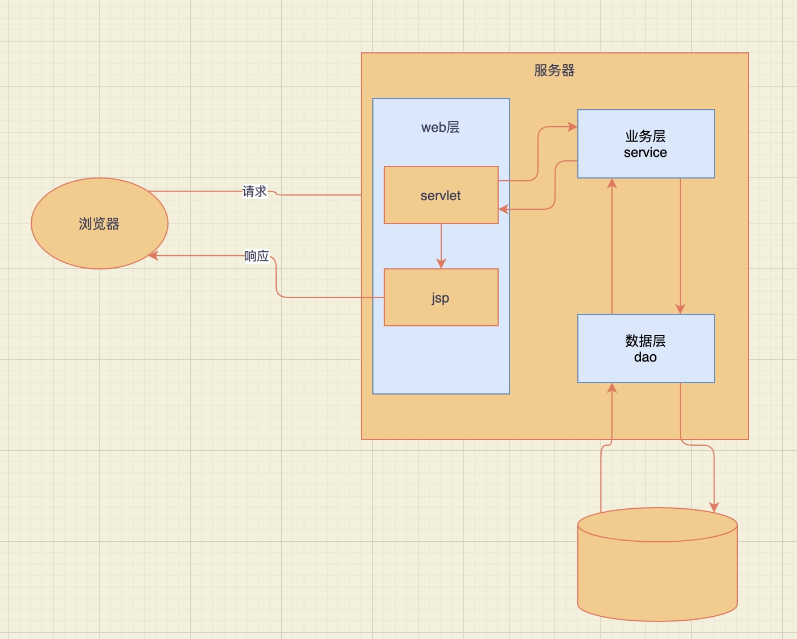

3. SSH：Spring+Struts+Hibernate
4. SSM：Spring+SpringMVC+Mybatis
5. SpringBoot：约定大于配置,配置大于编码

### spring初识

spring是非侵入式的，侵入式就是想要使用某个框架就要实现它提供的接口，但是spring通过扩展点和注解的方式实现我们想要使用它的功能。

#### 概念

1. spring是一个轻量级的Java开发框架
2. 为了解决企业级应用开发的业务逻辑层和其他各层的耦合问题
3. spring负责基础架构
4. 解决耦合是最重要的使命，提供了依赖注入（DI）和面向切面（AOP）

#### 简略核心解释

1. 轻量级的开源框架
2. 为了解决企业应用开发的业务逻辑层和其他各层之间的**耦合问题**
3. 是一个ioc和aop容器框架
   1. ioc 控制反转
   2. aop 面向切面
   3. 容器 包含并管理应用对象的生命周期

> 其实主要就是为了解决耦合问题，为了解决这个耦合问题，才产生的这个轻量级的开源框架，而这个框架为了解决这样的问题，使用了ioc控制反转的编程思想（这个思想的落地实现就是DI依赖注入）和aop面向切面编程，对于控制反转之后的对象存储在一个容器中

#### spring的模块分布

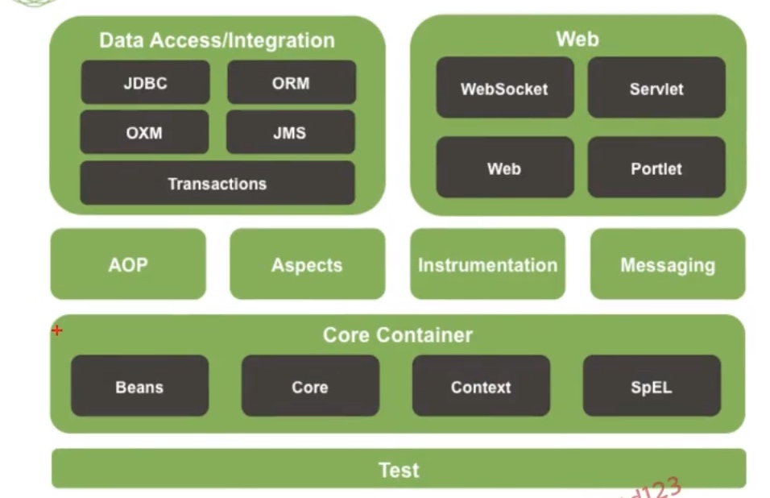

### ioc基本概念

ioc是一种设计思想，将你设计好的对象交给容器控制，而不是显式的用代码进行对象的创建，简短的一句话：对象由spring 来创建、管理、装配

#### 面向对象的三大特性

- 封装
- 继承
- 多态

#### 面向对象的五大原则

根据面向对象原则中的接口分离原则和依赖倒置原则说明如下：

##### 接口分离原则

1. 模块间通过接口隔离，而不是通过具体的类强耦合起来
2. 不要将鼠标（具体实现）直接焊在主板上，使用插槽（抽象）连接

##### 依赖倒置原则

1. 是ioc的前身
2. 具体实现依赖抽象，下层依赖上层
3. 假如主板依赖鼠标，如果鼠标坏了，主板不工作了，是不行的，依赖倒置原则使鼠标、键盘和电脑成为独立的互不相干的对象，当电脑（上层）没有鼠标可以正常启动，但鼠标（下层）没有电脑则一无是处，控制权就被反转了（IOC），所以鼠标需要依赖usb（DI）才能使用
4. 之前是正转：主板--焊接-->鼠标，电脑没有鼠标则无法启动
5. 之后是反转：电脑<--依赖--鼠标，引入di可以实现ioc
6. ioc是di的设计原理，di是ioc的具体实现
7. IUerDao和UserDaoImpl，当在Service中使用的时候，通过具体的ServiceImpl中使用IUserDao接口，依赖的是接口，而不是具体的UserDaoImpl，之后当需要的更改数据库的时候，可以更改注入到Service中的具体IUserDao的具体引用

#### ioc 的代码实现方式

- 最low的方式：导入jar + 配置xml
- 一般实现方式：maven + 注解+xml
- 最屌的实现方式：springboot + javaconfig

### mvc项目的耦合性

- 通过使用面向接口开发，降低不同层级之间的耦合性
- 变更代码会加大项目出错的概率

### 项目搭建

#### 项目的创建

idea中创建Java项目

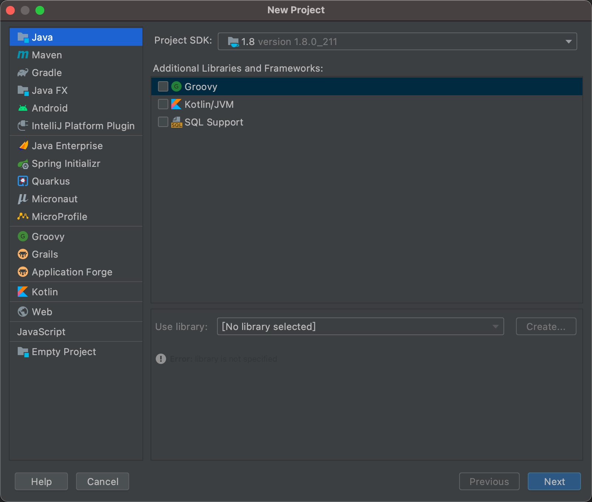

#### jar包的引入

1. 怎么找到spring的jar包

spring的仓库：https://repo.spring.io/

进入仓库->Artifactory->Artifacts->libs-reslease-local->org->springframework->spring

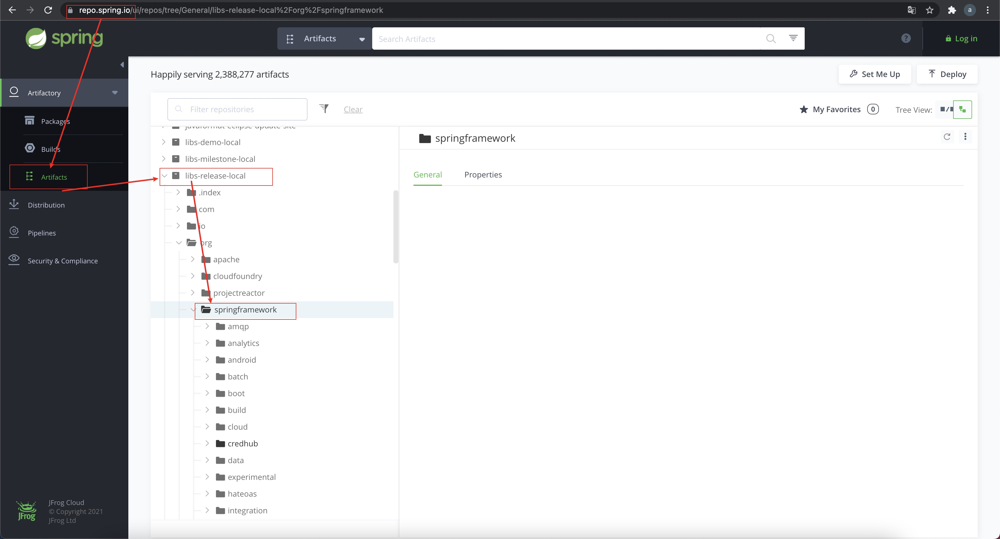

2. 下载

找到对应的版本，右键下载出现download按钮

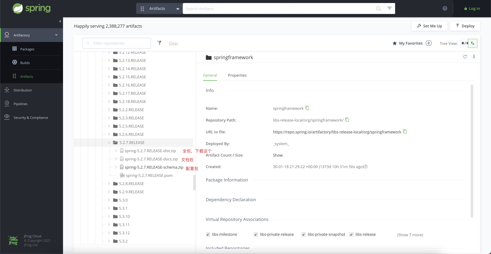

`下载最好是下载稳定版本（GA）`

3. 引入

解压之后的lib目录下，每个jar包分为三个，需要依赖包、文档包和源码包


需要的jar包

- beans 
- context 
- core
- expression（也就是spel） 表达式

idea中project structure->libraries->+->java->选中目录下的jar包->OK

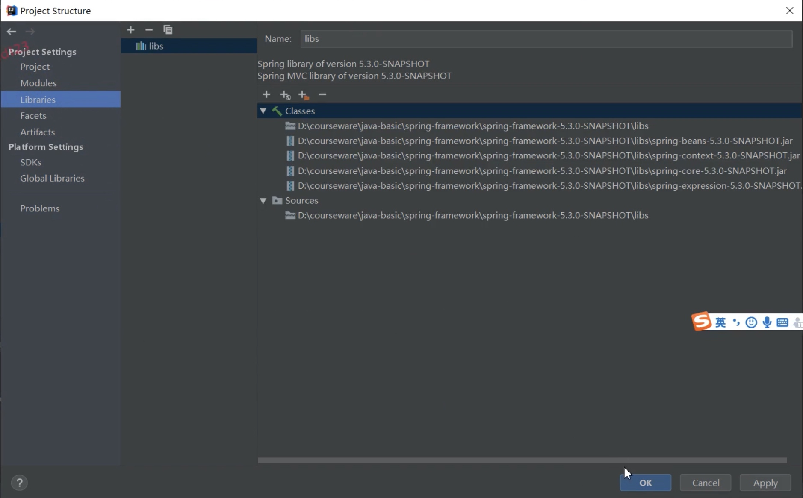

导入的四个jar包

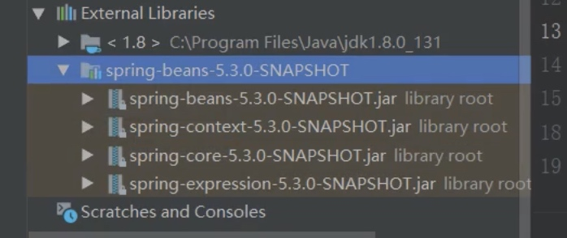

#### 使用IOC

1. 新建spring.xml配置文件（名字没有规定）

src下的resources目录右键->新建spring config

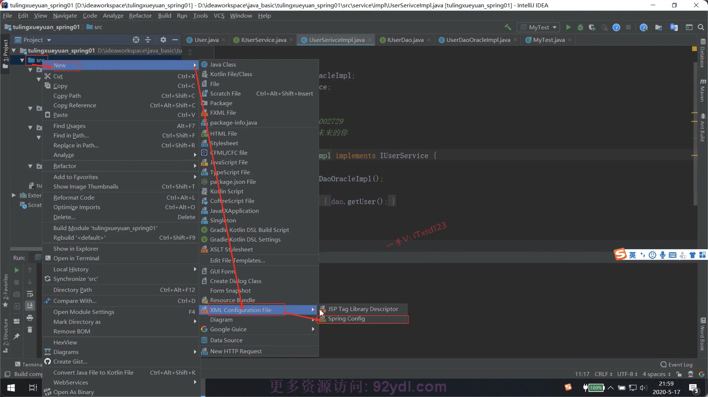

2. 为了将UserServiceImpl和UserDaoImpl分离出来，创建两个bean（bean就是注入到spring容器的实体，也就是我们创建的对象，现在交给spring创建和维护）

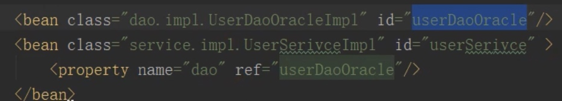

在spring.xml中编写两个bean

3. 编写代码加载spring.xml配置文件，并从spring容器中获取刚才注入的UserServiceImpl和UserDaoImpl的bean对象完成业务

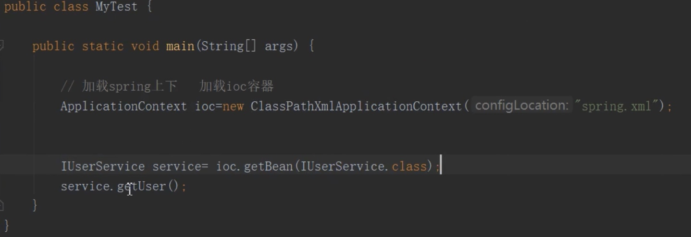

在src目录下，spring.xml不需要其他的路径

4. 出现报错解决

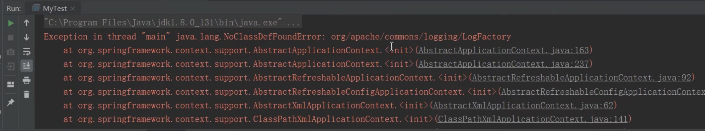

因为spring需要日志，但是我们没有导入，所以需要将spring需要的日志jar包导入进来。spring5之后，提供了jcl包来进行日志管理，在刚才下载的压缩包中找到spring-jcl.jar引入。

5. 使用配置的方式，足够的热插拔

### 总结

#### di与ioc

- ioc和di是从不同的角度去描述同一件事情，ioc是从容器的角度描述，而di是从应用程序的角度描述，也可以这样说：ioc是依赖倒置原则的设计思想，而di是具体的实现方式
- 依赖倒置原则是最初的设计理念。经过发展逐渐演变成为ioc，di是ioc的一种实现方式
- 上层的思想有落地的实现

#### ioc的优点

- 解耦
- 集中管理
- 功能可复用（减少对象的创建和内存消耗）
- 使得程序的整个个体结构可维护、灵活性、扩展性变高

> spring经过多版本的发展，在我们的项目中可以有多种方式可以进行配置

## ioc

### 项目搭建

#### 使用maven的方式创建spring项目，不用自己管理依赖和导入jar包

idea中创建maven项目

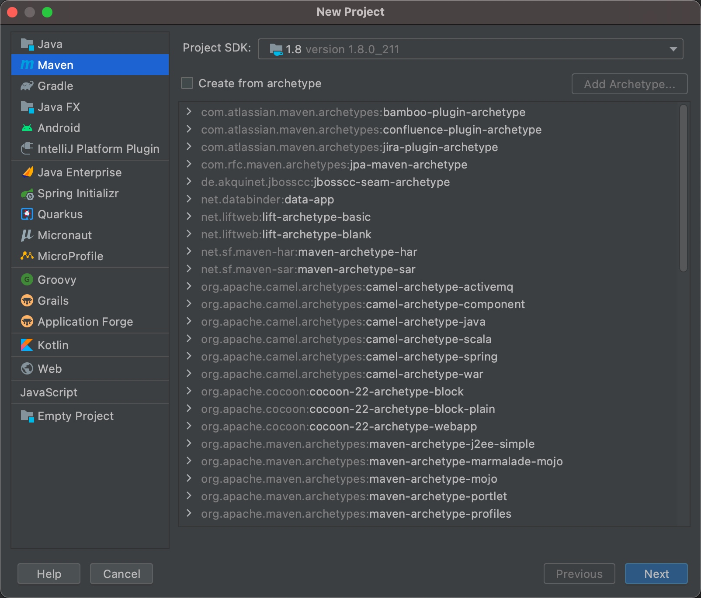

输入项目名称，修改存储位置，修改groupId。

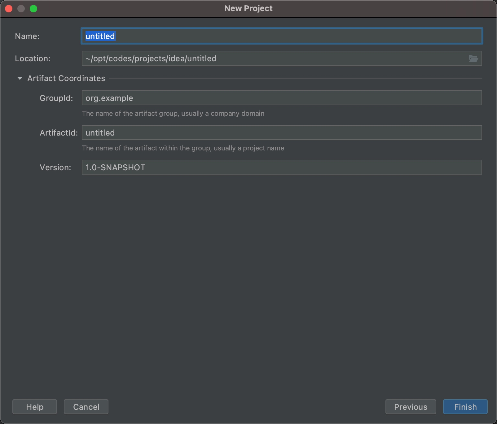

在创建好的maven项目中添加spring需要的依赖，在mvnrepositore.com仓库中，检索spring

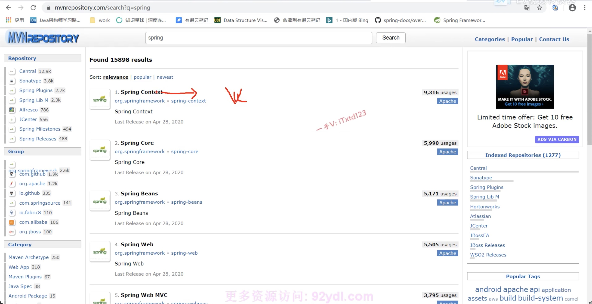

#### 引入spring-context

根据上面的步骤，在仓库中找到spring-context，找到对应的版本


复制maven配置

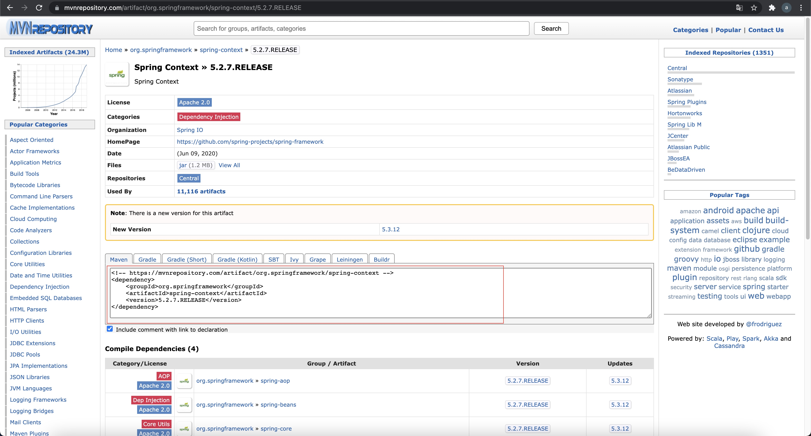

到idea中pom.xml中添加，之后点击右上角的maven导入对应的jar包

```xml
<?xml version="1.0" encoding="UTF-8"?>
<project xmlns="http://maven.apache.org/POM/4.0.0"
         xmlns:xsi="http://www.w3.org/2001/XMLSchema-instance"
         xsi:schemaLocation="http://maven.apache.org/POM/4.0.0 http://maven.apache.org/xsd/maven-4.0.0.xsd">
    <modelVersion>4.0.0</modelVersion>

    <groupId>com.ald</groupId>
    <artifactId>spring_basic_demo</artifactId>
    <version>1.0-SNAPSHOT</version>

    <properties>
        <maven.compiler.source>8</maven.compiler.source>
        <maven.compiler.target>8</maven.compiler.target>
    </properties>

    <dependencies>
        <dependency>
            <groupId>org.springframework</groupId>
            <artifactId>spring-context</artifactId>
            <version>5.2.7.RELEASE</version>
        </dependency>

        <dependency>
            <groupId>junit</groupId>
            <artifactId>junit</artifactId>
            <version>4.12</version>
            <scope>test</scope>
        </dependency>

        <dependency>
            <groupId>com.alibaba</groupId>
            <artifactId>druid</artifactId>
            <version>1.1.21</version>
        </dependency>
        <dependency>
            <groupId>mysql</groupId>
            <artifactId>mysql-connector-java</artifactId>
            <version>5.1.47</version>
        </dependency>

    </dependencies>
</project>
```

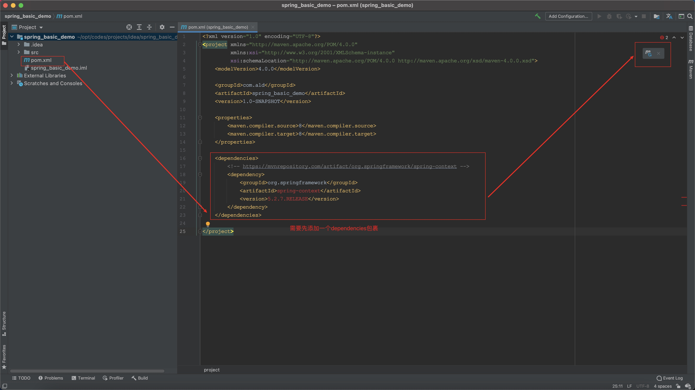

spring-context依赖其他的jar：beans\core\expression，而aop是不需要导入的，但是spring觉得我们需要，就帮我们导入了，而jcl是spring用来记录日志的用jar包

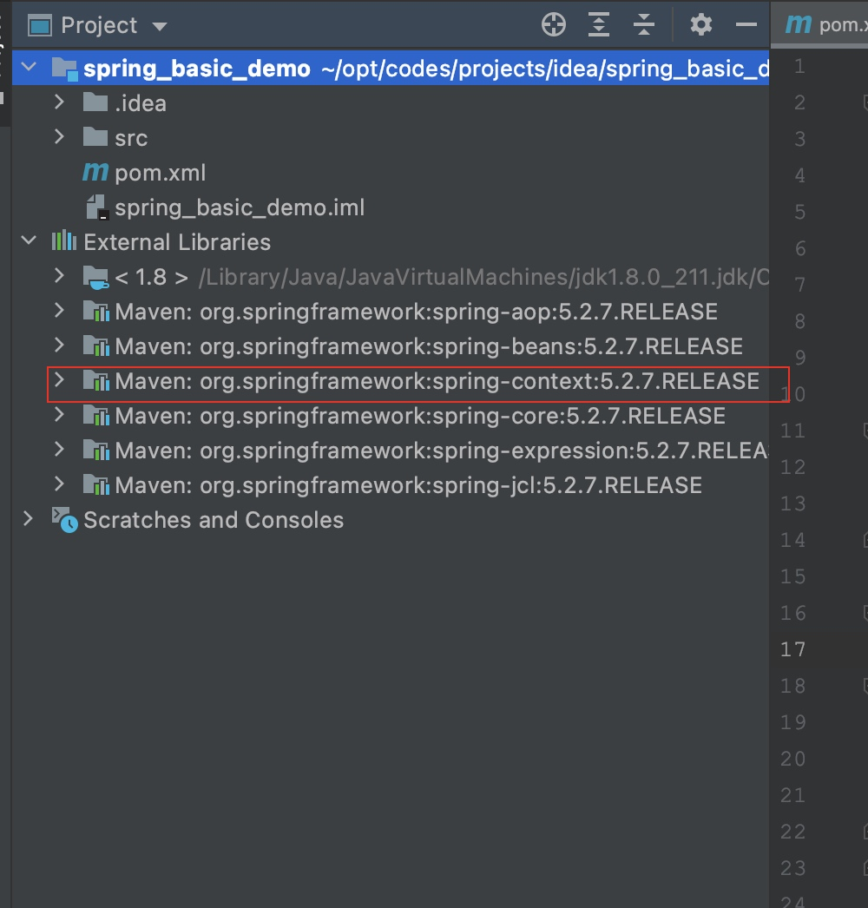

可以在pom文件中右键查看当前引入的所有jar和依赖情况

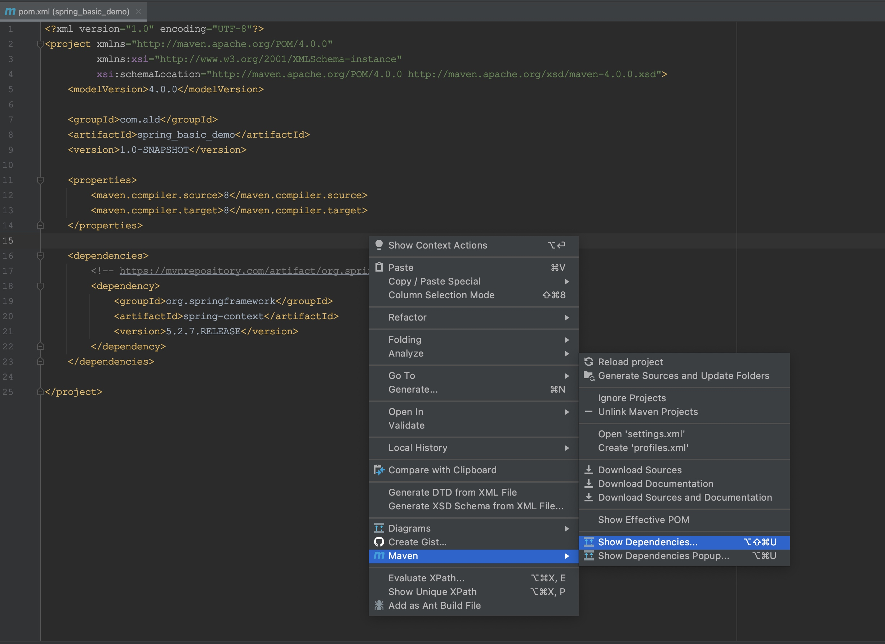

如下

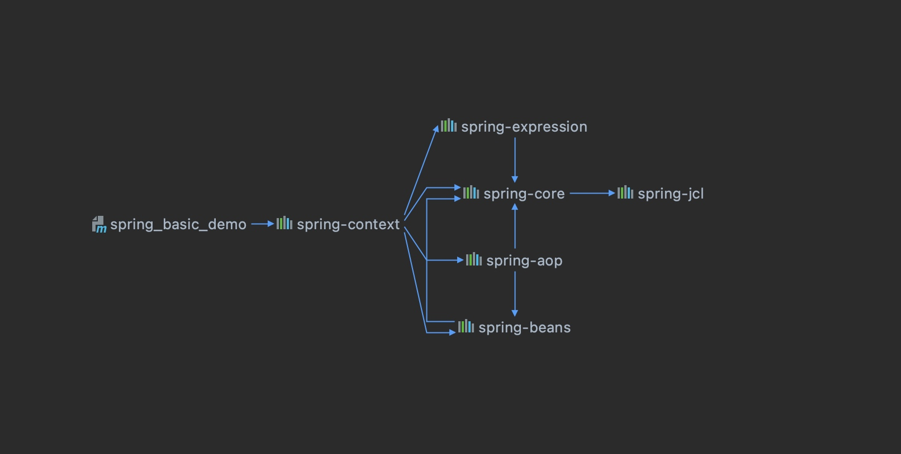

#### maven的项目结构

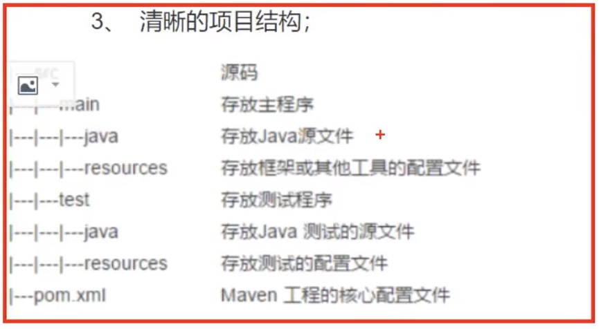

### 使用xml方式配置

#### 创建spring需要的配置文件

在main\resources目录下创建spring-ioc.xml

```xml
<?xml version="1.0" encoding="UTF-8"?>
<beans xmlns="http://www.springframework.org/schema/beans"
       xmlns:xsi="http://www.w3.org/2001/XMLSchema-instance" xmlns:p="http://www.springframework.org/schema/p"
       xmlns:c="http://www.springframework.org/schema/c"
       xsi:schemaLocation="http://www.springframework.org/schema/beans http://www.springframework.org/schema/beans/spring-beans.xsd">

</beans>
```

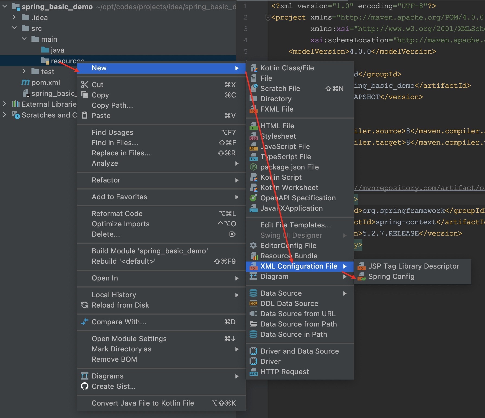

#### 测试项目是否创建成功，使用IOC示例

##### 创建包：com.ald.beans，并在包下创建User类，通过快捷键Command+n重写toString方法

```java
public class User {
    private Integer id;
    private String username;
    private String realname;
    private School school;
    private Grade grade;

    public User() {
    }

    public User(Integer id, String username, String realname, School school) {
        this.id = id;
        this.username = username;
        this.realname = realname;
        this.school = school;
    }

    public Integer getId() {
        return id;
    }

    public void setId(Integer id) {
        this.id = id;
    }

    public String getUsername() {
        return username;
    }

    public void setUsername(String username) {
        this.username = username;
    }

    public String getRealname() {
        return realname;
    }

    public void setRealname(String realname) {
        this.realname = realname;
    }

    public School getSchool() {
        return school;
    }

    public void setSchool(School school) {
        this.school = school;
    }
    
    public Grade getGrade() {
        return grade;
    }

    public void setGrade(Grade grade) {
        this.grade = grade;
    }

    @Override
    public String toString() {
        return "User{" +
                "id=" + id +
                ", username='" + username + '\'' +
                ", realname='" + realname + '\'' +
                '}';
    }

    public User(School school,Grade grade) {
        this.school = school;
        this.grade = grade;
    }
}
```

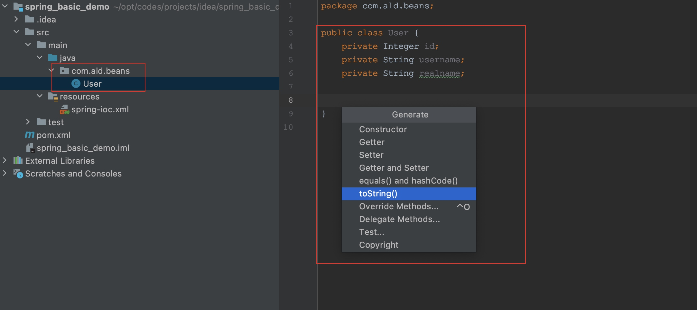

##### 在spring-ioc.xml中注入User类

```xml
<beans>
    <bean class="com.ald.beans.User" id="user"/>
</beans>
```

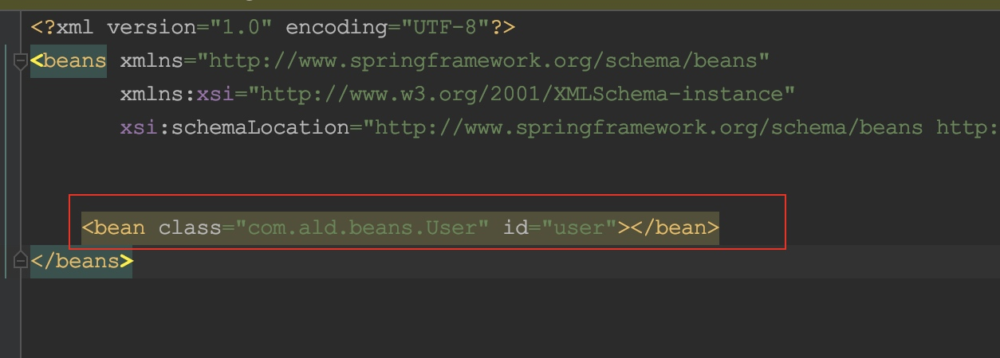

##### 在test中创建单元测试测试刚才创建的User是否可以从spring的IOC容器中得到

1. 将Junit4添加到maven环境中

```xml
<dependency>
    <groupId>junit</groupId>
    <artifactId>junit</artifactId>
    <version>4.12</version>
    <scope>test</scope>
</dependency>
```

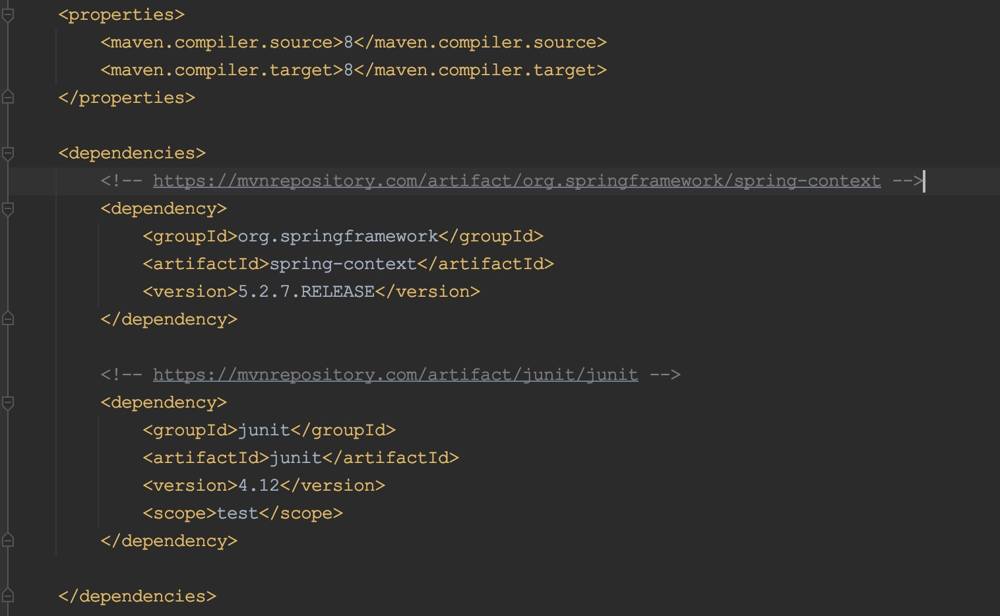

2. 创建包并编写测试代码

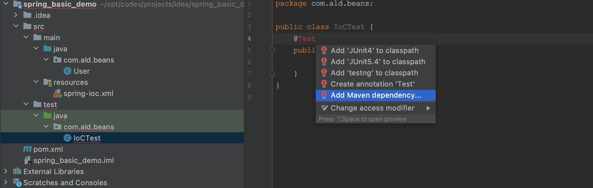

通过option+enter快捷键导入对应的类。

3. 测试函数编写与运行

```java
public class IoCTest {
    ApplicationContext context;
    @Before
    public void before() {
        context = new ClassPathXmlApplicationContext("spring-ioc.xml");
    }

    @Test
    public void test01(){
        User user = context.getBean(User.class);
        System.out.println(user.toString());
    }
}
```

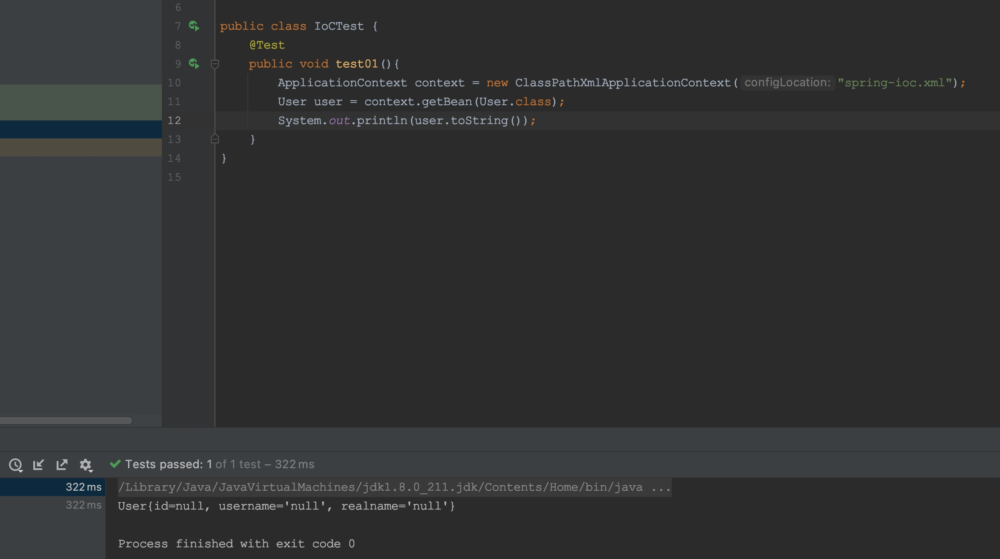

4. 获取bean的方式

- 通过类来获取bean getBean(User.class)
- 通过bean的名字或者id来获取Bean `User user=(User)ioc.getBean("user")`
- 通过名字+类型的方式 `User user=ioc.getBean("user",User.class)`

#### ioc容器

- 在spring中，由spring ioc容器管理的，构成程序的骨架的对象称为bean
- bean对象是指经过ioc容器实例化、组装和管理的对象
- bean就是应用程序中众多对象之一，bean和bean的依赖由容器所配置元数据反射而来

ApplicationContext是spring ioc容器实现的代表，它负责实例化、配置和组装bean，是spring的顶层核心接口

主要是三个常用的实现类

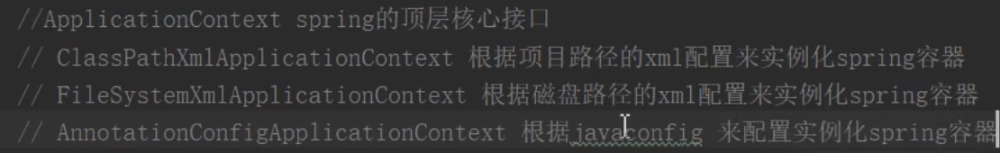

#### bean

1. 配置元数据（bean的注入）方式

- 使用xml配置，在xml中配置bean，纯xml开发
- 基于注解的方式，ssm 框架开发中使用，需要在xml文件中配置spring容器，然后再在里面设置包扫描，才能扫描到有注解的类
- 基于Java的配置方式，JavaConfig项目提供的功能已经成为spring开发的一部分，可以通过Java配置来代替xml定义外部的bean，不需要在xml文件中配置spring容器，直接通过哦一个配置类的Java文件，在Java类上添加@Configuration注解即可，加载的时候通过引入配置类.class加载spring容器

2. （上面创建的）基本spring-ioc.xml文件详解

查看beans节点下可以配置那些节点，通过按住command点击beans节点可以到xsd约束文件查看

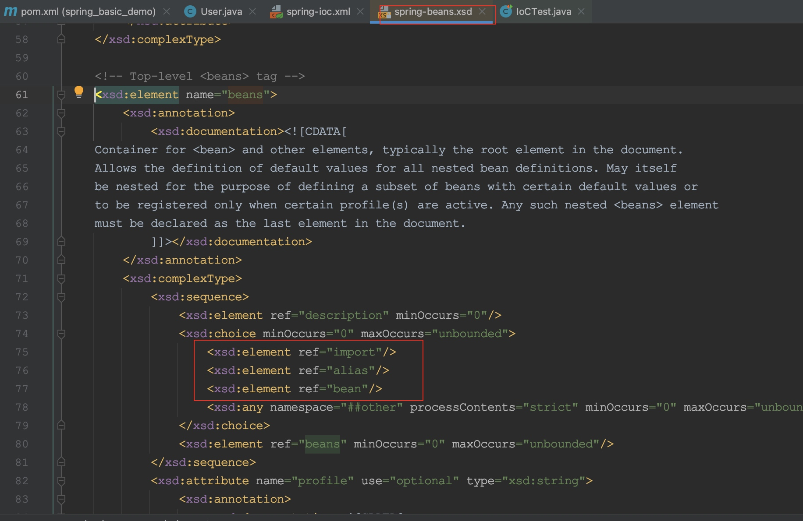

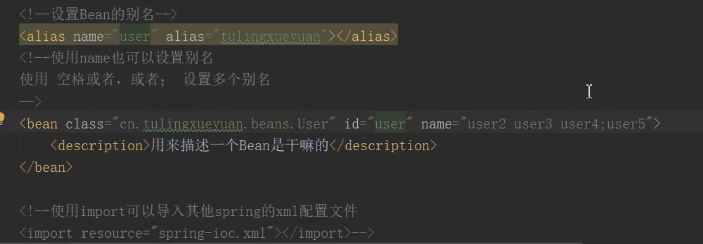

- alias 为创建的bean设置别名，方便在其他地方使用
- bean 表示一个注入到spring ioc容器中的对象
  - 使用name可以设置别名
  - class 表示这个bean对应的类文件，需要使用全路径
  - id 这个bean在spring容器中的唯一标识
- import 可以创建多个spring-ioc.xml文件，方便不同的对象注入的管理，此时，可以通过import的方式引入其他的xmlp配置文件到当前文件中

##### 依赖

依赖表示注入到spring容器中的bean对其他的bean的引用，因为所有的bean都交给spring容器去创建，就需要告诉spring容器不同bean之间的依赖关系

> 注意：这里的bean是包含基本数据类型的，即int\float\boolean等，这里把它们也当成是对象。

##### 依赖注入的方式

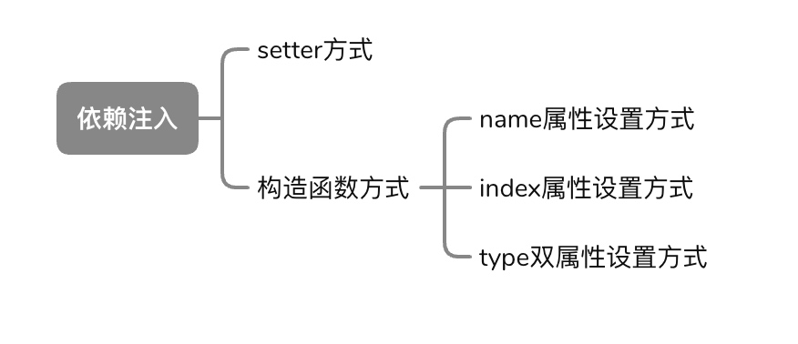

1. 基于setter方法的依赖注入

在bean类代码中编写属性的set方法，在xml配置文件中的property配置注入的值。

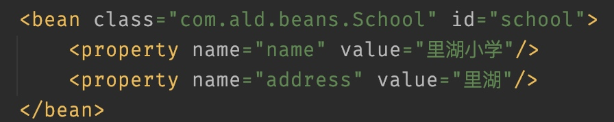

> 说明 spring在注入的时候，其中的`name="name"`是通过setXXX后面的XXX找到对应的属性注入的，不是通过属性名。

2. 基于构造函数的注入

在bean代码中编写构造方法，在xml配置文件的`constructor-arg`配置注入值。其中针对不同的位置形参的映射方式有：

- 基于name属性的设置方式，可以省略name，只有value，如果省略name，需要注意参数顺序

```java
public User(Integer id, String username, String realname, School school) {
    this.id = id;
    this.username = username;
    this.realname = realname;
    this.school = school;
}
```

```xml
<bean class="com.ald.beans.School" id="school">
    <property name="name" value="里湖小学"/>
    <property name="address" value="里湖"/>
</bean>

<bean class="com.ald.beans.User" id="user">
    <constructor-arg name="id" value="1"/>
    <constructor-arg name="username" value="zhangsan"/>
    <constructor-arg name="realname" value="张三"/>
    <constructor-arg name="school" ref="school"/>
</bean>
```

- 基于index下标的设置方式

这个可以在位置上不需要跟形参位置一一对应，根据index下表位置去映射。

```java
public User(Integer id, String username, String realname, School school) {
    this.id = id;
    this.username = username;
    this.realname = realname;
    this.school = school;
}
```

```xml
<bean class="com.ald.beans.School" id="school">
    <property name="name" value="里湖小学"/>
    <property name="address" value="里湖"/>
</bean>

<bean class="com.ald.beans.User" id="user">
    <constructor-arg index="0" value="1"/>
    <constructor-arg index="1" value="zhangsan"/>
    <constructor-arg index="2" value="张三"/>
    <constructor-arg index="3" ref="school"/>
</bean>
```

- 基于type的方式

如果传入的参数类型不同，还可以通过指定type的方式，需要指定全类名`type="java.lang.String"`。

##### 依赖和配置的细节

通过上面的配置，可以看出无论是通过setter的方式还是通过构造函数的方式，都可以注入不同的对象类型。

1. 直接值（基本类型，String等）

直接通过value注入即可

2. 对其他bean 的引用（装配）

通过ref 引入

```xml
<bean class="com.ald.beans.School" id="school">
    <property name="name" value="里湖小学"/>
    <property name="address" value="里湖"/>
</bean>

<bean class="com.ald.beans.User" id="user">
    <constructor-arg index="0" value="1"/>
    <constructor-arg index="1" value="zhangsan"/>
    <constructor-arg index="2" value="张三"/>
    <constructor-arg index="3" ref="school"/>
</bean>
```

3. 内部bean，如果这个bean是当前对象私有的，不共享到外部，那么就可以通过内部创建的方式引入

```xml
<bean class="com.ald.beans.User" id="user">
    <property name="id" value="1"/>
    <property name="username" value="zhangsan"/>
    <property name="realname" value="张三"/>
    <property name="school">
        <bean class="com.ald.beans.School">
            <property name="name" value="里湖小学"/>
            <property name="address" value="里湖"/>
        </bean>
    </property>
</bean>
```

4. 集合

List：如果泛型是基本数据类型，就使用value，如果泛型是对象，就要用bean

```xml
<property name="hobbies">
    <list>
        <value>唱歌</value>
        <value>跳舞</value>
    </list>
</property>
```

Set：和List同理

```xml
<property name="loves">
    <set>
        <value>李四</value>
        <value>王五</value>
    </set>
</property>
```

Map：使用entry标签，如果泛型是基本数据类型，就使用value，如果是对象，就是用value-ref属性

```xml
<property name="courses">
    <map>
        <entry key="chinese" value="语文"/>
        <entry key="math" value="数学"/>
    </map>
</property>
```

5. null和空字符串值

null使用`<null></null>`注入，空值直接为空即可。

6. 使用p命名空间简化基于setter属性注入xml的配置方式

输入p之后报错，通过option+enter引入p命名空间，但是复杂的数据类型的注入还是需要使用上面默认的注入方式，比如集合等。

要存在该属性的set函数，如果想要引用的话：p:xxx-ref，xxx就是注入的属性对应的名称

```xml
<beans xmlns="http://www.springframework.org/schema/beans"
       xmlns:xsi="http://www.w3.org/2001/XMLSchema-instance" 
       xmlns:p="http://www.springframework.org/schema/p"
       xsi:schemaLocation="http://www.springframework.org/schema/beans http://www.springframework.org/schema/beans/spring-beans.xsd">
    <bean class="com.ald.beans.User" id="user" p:school-ref="school"/>
</beans>
```

7. 使用c命名空间简化基于构造函数的xml配置方式

输入c之后报错，通过option+enter引入c命名空间，但是复杂的数据类型的注入还是需要使用上面默认的注入方式，比如集合等

要存在该属性的构造函数，如果想要引用的话：c:xxxx-ref，xxx就是注入的属性对应的名称

```xml
<beans xmlns="http://www.springframework.org/schema/beans"
       xmlns:xsi="http://www.w3.org/2001/XMLSchema-instance" 
       xmlns:p="http://www.springframework.org/schema/p"
       xsi:schemaLocation="http://www.springframework.org/schema/beans http://www.springframework.org/schema/beans/spring-beans.xsd">
    <bean class="com.ald.beans.User" id="user" c:school-ref="school"/>
</beans>
```

##### bean的作用域

###### 基础的作用域

- Singleton（单例），默认的，同一个id的bean只会创建一个
- Prototype（原型），多个，从spring容器中取bean时会返回复制的对象
  - 当一个线程对一个共享对象进行读写的时候，会出现线程安全问题，此时就需要用到多例（原型）

通过scope属性设置当前注入的bean的作用域

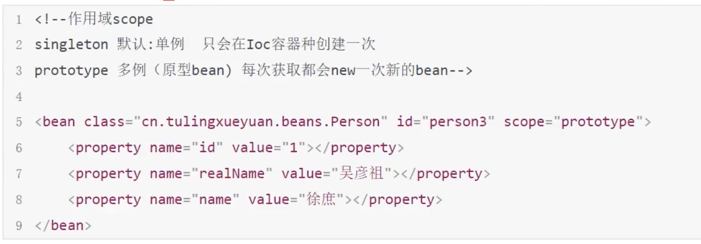

###### web应用中的作用域

spring应用在web应用上，除了上面的基础作用域，还有：

- request，一个request对应一个bean
- session，一次会话对应一个bean
- application，一个web应用对应一个bean
- websocket，一次长链接对应一个bean

##### 实例化bean

实例化bean的方式有两种，分别是使用**构造函数实例化**和**使用工厂实例话**

> 这里说的实例化bean，就是创建bean的方式，我们上面说到的通过上面构造函数和setter方式，那是给对象中的属性赋值，是在创建bean对象之后，在spring源码中，默认是通过无参构造函数的方式创建bean对象的动态代理的（有jdk动态代理和cglib动态代理）。

##### 使用构造函数实例化（默认）

通过这种方式，在spring源码中通过动态代理的方式实例化，我们无法进行干预。

##### 使用工厂方法实例化

1. 静态工厂

我们通过创建工厂，并创建静态的方法返回对应的实例化对象给spring注入到容器中

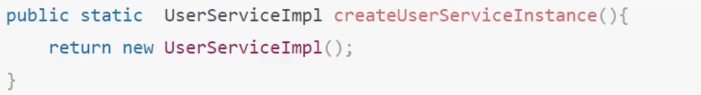

然后在xml配置文件中，通过`factory-method="createUserSErviceInstance"`设置为我们创建的bean，这样我们就可以干预bean的创建了。

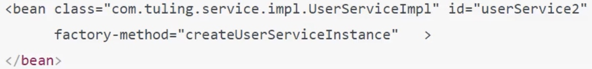

2. 实例化工厂

和上面的静态工厂没有什么区别，创建工厂类，然后创建能够返回给spring注入的bean对象

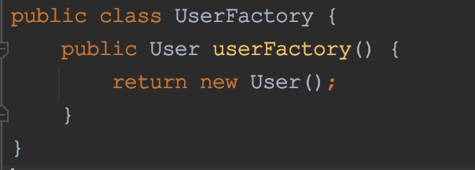

然后在xml配置文件中，我们先注入工厂bean，再通过设置`factory-bean="userFactory"`和设置对应的工厂方法`factory-method="userFactory"`

```java
<bean class="com.ald.beans.UserFactory" id="userFactory"/>
<bean class="com.ald.beans.User" id="user2" factory-bean="userFactory" factory-method="userFactory"/>
```

##### 自动注入

之前还需要手动编写属性注入引用，现在只需要配置属性`autowire=""`方式就可以实现自动注入属性。

自动注入可以通过不同的方式进行属性的匹配

1. byType：`autowire="byType"`，根据类型注入，当出现多个属性的类型一致的对象或者没有该类型的时候，会报错

没有该类型，5.2.7版本不会报错，当配置中没有形参中需要的参数的时候，会自己配置为null

多个属性的类型一致的对象

- 配置中只有一个该类型bean，形参列表中有多个该类型的形参，会一起注入
- 如果在配置文件中存在多个将要被注入的bean，那么会出现提示，注入失败

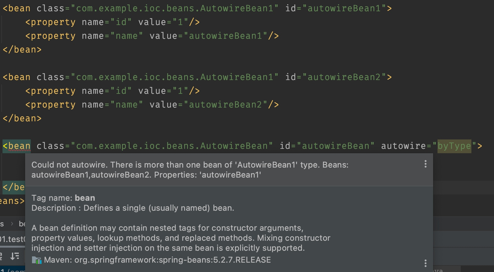

```java
// AutowireBean
private AutowireBean1 autowireBean1;
private AutowireBean1 autowireBean2;

// 输出
{id=1, name='autowireBean', autowireBean1=AutowireBean1{id=1, name='autowireBean1'}, autowireBean2=AutowireBean1{id=1, name='autowireBean1'}}
```

2. byName：根据setXXX的名字注入
3. constructor：根据构造函数注入

**优先根据名字匹配，如果名字没有匹配到就会根据类型去匹配，此时如果出现多个类型，则注入失败，不知道要选择哪一个作为注入**

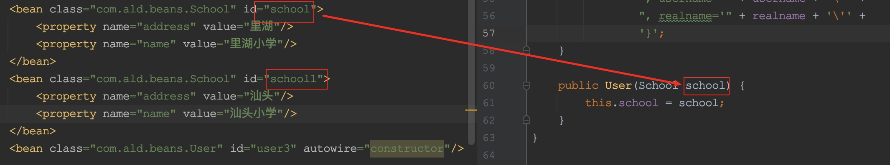


根据类型去匹配，出现多个类型，则注入失败，不知道要选择哪一个作为注入

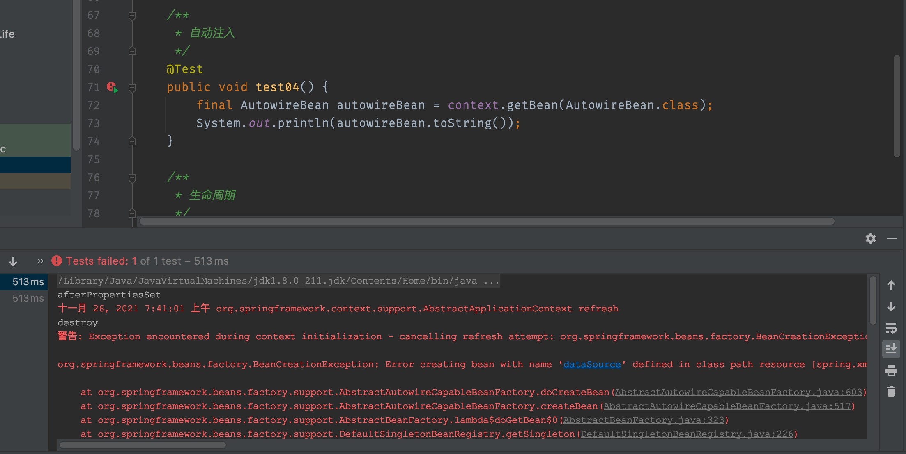

多个参数时，要么都注入，要么都不注入。同时注入

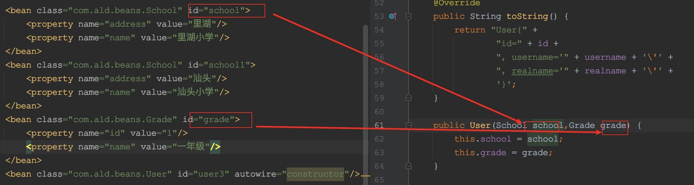

以上注入失败的，可以通过设置其中一个注入的bean上设置属性`primary="true"`（5.2.7设置了无效），设置这个bean为主，当spring需要使用的时候就会优先使用这个bean；或者设置不参与注入的bean属性添加`autowrie-candidate="false"`（5.2.7设置有效），表示不参与注入

##### 自定义bean特性（生命周期）

bean生命周期回调，会先调用接口的回调，然后在调用配置的回调。

1. 实现InitializingBean和DisposableBean回调接口，当spring容器中创建和销毁时会被调用

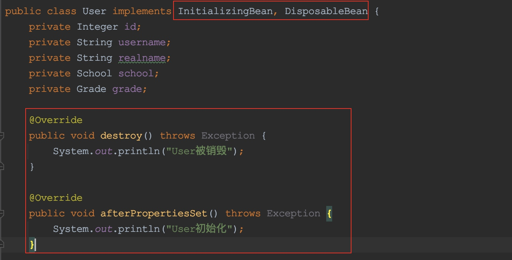

测试销毁方法：使用context.close()方法强制关闭spring容器

2. 自定义init()和destroy()方法（基于配置的方式）

java代码中编写

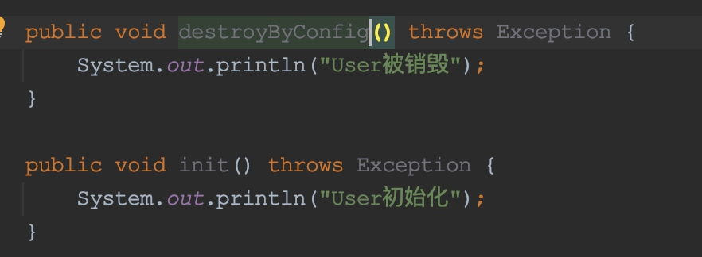

xml配置中编写


3. @PostConstruct和@PostDestroy注解标注在方法上，当初始化和销毁的时候就会调用该方法

##### spring创建第三方bean对象

我们经常使用到某些外部的单实例对象，例如数据库连接池。

###### 方式一：直接将配置值编写进配置文件中

pom依赖中加入数据库和连接池的jar

```xml
<dependency>
    <groupId>com.alibaba</groupId>
    <artifactId>druid</artifactId>
    <version>1.1.21</version>
</dependency>
<dependency>
    <groupId>mysql</groupId>
    <artifactId>mysql-connector-java</artifactId>
    <version>5.1.47</version>
</dependency>
```

xml配置中编写bean，和我们自己编写的bean没有什么区别

```xml
<bean class="com.alibaba.druid.pool.DruidDataSource" id="dataSource">
    <property name="username" value="root"/>
    <property name="password" value="root"/>
    <property name="url" value="jdbc:mysql://localhost:3306/demo"/>
    <property name="driver" value="com.mysql.jdbc.Driver"/>
</bean>
```

driverClassName的value的查找方式

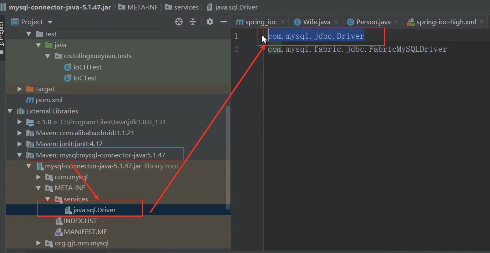

###### 方式二：通过加载属性文件加载配置值

创建db.properties，不要掺杂任何的空格

```xml
jdbc.username=root
jdbc.password=123456
jdbc.url=jdbc:mysql://localhost:3306/test?useUnicode=true&amp;characterEncoding=UTF-8
jdbc.driver=com.mysql.jdbc.Driver
```

通过编写property-placeholder添加属性文件，并通过${mysql.username}的方式使用属性文件中的属性值

```xml
<context:property-placeholder location="classpath:jdbc.properties"/>

<bean class="com.alibaba.druid.pool.DruidDataSource" id="dataSource">
    <property name="username" value="${jdbc.username}"/>
    <property name="password" value="${jdbc.password}"/>
    <property name="url" value="${jdbc.url}"/>
    <property name="driver" value="${jdbc.driver}"/>
</bean>
```

##### SpEL表达式的使用

SpEL：spring expression language，spring的表达式语言，支持运行时查询操作对象，使用#{....}作为语法规则，所有的大括号中的字符都认为是SpEL

使用示例

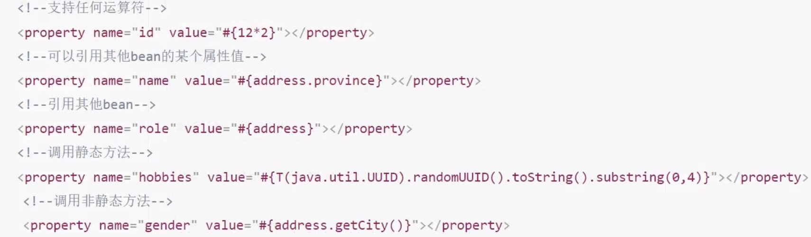

通过#{}注入对象或者使用对象中的属性（.的方式）；调用方法；调用静态方法

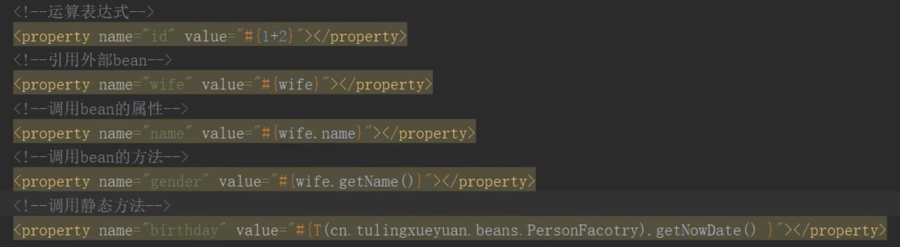

### 使用注解方式

#### xml+注解方式

spring2.5支持基于注解的元数据配置，因为这种方式方式常用在ssm(spring+springmvc+mybaits)中，所以我们搭建一个类似的项目。

#### 项目搭建

1. 创建maven项目

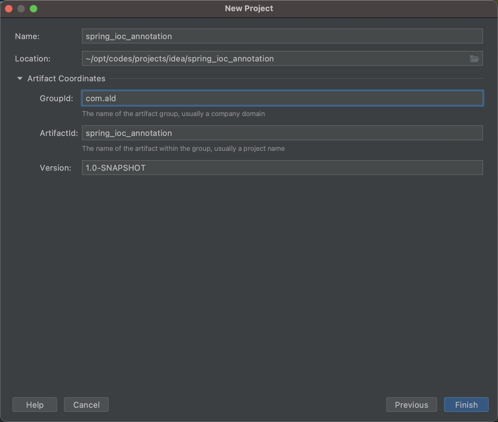

2. pom文件中导入spring-context依赖，引入之后记得点击右上角刷新或者点开maven刷新环境

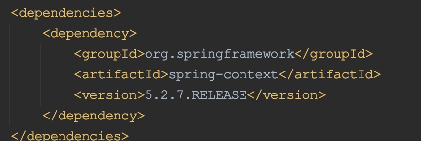

3. 创建spring_ioc.xml

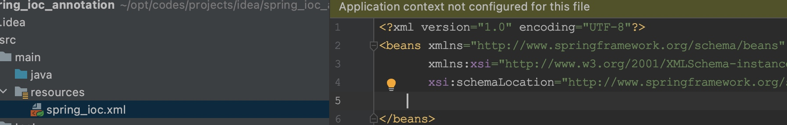

4. 创建User相关的三层架构

- UserController
- UserService
- UserDao

目录结构

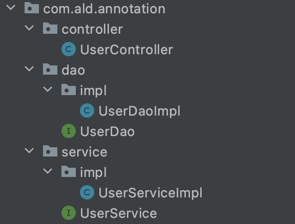

5. 测试项目是否搭建完成

配置文件中注入userController

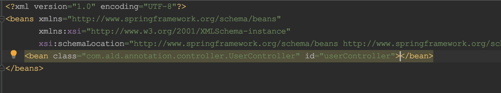

编写测试类

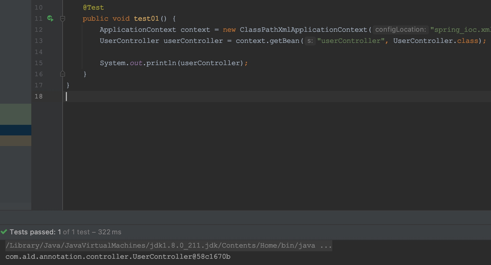

#### 类路径扫描和管理组件

1. @Component注解和它的语义化注解（不能标注在接口上，因为spring源码解析的时候判定为接口就会跳过，不创建bean）

- @Repository 注解用于满足存储库（数据访问对象或DAO）的情况，这个注解的用途是**自动转换异常**
- @Component 可以管理任何组件，标记非三层的普通的类注册为Bean组件
- @Service 标记在业务逻辑层，注册为Bean组件
- @Controller 标记控制层的组件，注册为Bean组件

2. 使用上面的注解标识User的三层架构代码

UserController

```java
@Controller
public class UserController {
    @Autowired
    private BaseService<User> userService;

    public void getBean(){

    }
}
```

UserServiceImple，Service层是需要标识在实现层，spring是不扫描接口的

```java
@Service
public class UserServiceImpl implements BaseService<User> {

    @Override
    public User getBean() {
        return null;
    }
}
```

UserDaoImpl同理

```java
@Repository
public class UserDaoImpl implements UserDao {
}
```

3. 为了能让spring容器能够识别出注解，需要在配置文件中添加扫描的配置

base-package表示扫描该包下的所有的注解类

```xml
<context:component-scan base-package="com.ald.annotation" use-default-filters="true"/>
```

use-default-filters=""，可选true\false，默认值为true，表示会扫描指定包下的所有类；false表示不会扫描（和下面的include刚好一起）

这个只是示例，实际中不会这么使用

```xml
<context:component-scan base-package="com.ald.annotation" use-default-filters="false">
        <context:include-filter type="annotation" expression="org.springframework.stereotype.Controller"/>
        <context:exclude-filter type="annotation" expression="org.springframework.stereotype.Service"/>
    </context:component-scan>
```

- include-filter：表示将会扫描含有该`@Controller`注解的类作为bean注入到spring容器中
- exclude-filter：表示将不会扫描含有该`@Service`注解的类作为bean注入到spring容器中

type的不同值

- annotation：默认，根据注解的完整类名限定设置排除\包括
- assignable：根据类的完整限定名设置排除\包括

type还有三个不怎么使用的属性值：

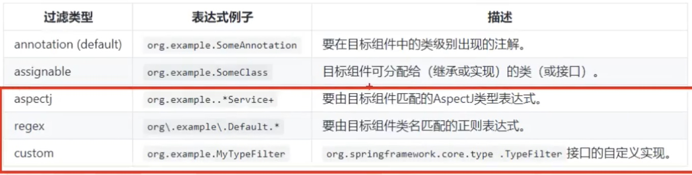

4. 不是非要每个层对应的标识

并不是每个@Controller、@Service、@Repository都必须标注在对应的三层中，他们都是@Component的语义化注解

可以利于spring的管理

- 可以灵活的排除标记了Controller的注解，表示按注解的方式排除，不扫描Controller注解的类
- 通过context:include-filter设置包含引入，扫描标识符


#### 使用注解将一个类注册为Bean的步骤

1. 设置扫描`context:component-scan`
2. 在对应的类上加上对应的注解
3. 使用上面的注解会将类名第一个字母的小写作为名称注入

#### 设置注入属性的值

##### @Value

硬编码值

```java
@Value("张三")
private String name;
```

还可以写${}（获取属性配置文件中的值）\#{}（编写SpEL表达式）

```java
@Value("${jdbc.username}")
private String name;
```

##### @Autowired

###### 注入规则

```java
//Controller
@Controller
public class UserController {
    @Autowired
    private UserService userService;

    public void getBean(){

    }
}

//Service
@Service
public class UserServiceImpl implements UserService {

    @Override
    public User getBean() {
        return null;
    }
}
```

@Service会默认注入名字是userServiceImpl

- 默认优先根据类型去匹配（这个和xml的不同，xml的是优先根据名称去注入）
- 如果多个class类型一致，则会根据名字去注入，如果名字也找不到，就会报错

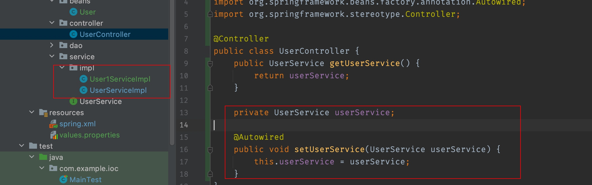

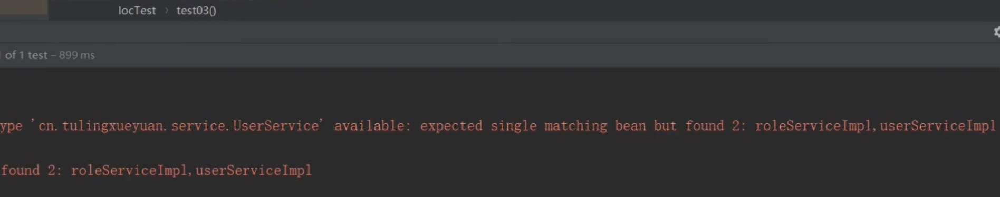

**报错解决办法**

1. 修改对应的bean名称，将`private UserService userService;`改成`private UserService userServiceImpl;`，当然在这里是能根据类型找到并注入成功的，这里只是示例说明

```java
// UserController
private UserService userService;

@Autowired
public void setUserService(UserService userServiceImpl) {
    this.userService = userServiceImpl;
}
```

2. 可以修改注入的bean的名字，将`@Service`改成`@Service("userService")`，这样就在注入到spring容器的时候，名字就是userService

```java
@Service("userService")
public class UserServiceImpl implements UserService {
}
```

3. 通过添加@Qualifier("userServiceImpl")设置属性的名字，告诉spring容器去找对应的bean

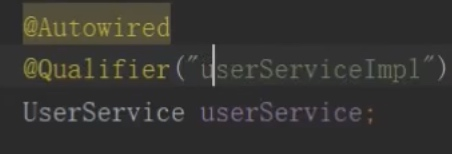

```java
@Autowired
//@Qualifier("userServiceImpl") // 当出现多个类型一致可选的bean时候，设置先预选userServiceImpl名称的bean
public void setUserService(UserService userService) {
    this.userService = userService;
}
```

4. 在注入Service的时候，通过@Primary设置将当前类设置为主要类，当spring需要该类型的bean时，设置了该注解的优先

```java
@Service
@Primary
public class UserServiceImpl implements UserService {
}
```

**这是根据属性的名字去匹配的，不是前面xml的setter的setXXX**

###### 使用泛型作为自动注入限定符

使用场景：我们编写一个公共的顶级BaseDao接口定义了基本的增删查改，此时对应的业务逻辑的UserDao继承BaseDao，在方法中返回对应的类型时，UserDao返回User，SchoolDao返回School，当需要使用自动注入的时候：BaseDao baseDao应该注入的是哪个实现类呢？

```java
//base dao
//可以在BaseDao中标注泛型T
public interface BaseDao<T> {
    T getBean(Integer id);
}

//user dao
//然后在实现该接口中明确该泛型
@Repository
public class UserDaoImpl implements BaseDao<User> {
    @Override
    public User getBean(Integer id) {

    }
}

//school dao
//然后在实现该接口中明确该泛型
@Repository
public class SchoolDaoImpl implements BaseDao<School> {
    @Override
    public School getBean(Integer id) {
    }
}

//user service
@Service
public class UserServiceImpl implements UserService {

    // 在使用Autowire自动注入的时候，添加对应的泛型
    @Resource
    BaseDao<User> userDao;

    @Override
    public User getBean() {
        return null;
    }
}

// school service
@Service
public class SchoolServiceImpl implements SchoolService {

    // 在使用Autowire自动注入的时候，添加对应的泛型
    @Resource
    BaseDao<School> userDao;

    @Override
    public School getBean() {
        return null;
    }
}
```

##### @Resource

和Autowire一样

二者的区别

- Resource依赖jdk，优先根据名字匹配
- Autowired依赖spring，优先根据类型匹配

就是他们在不同的包里面，resource是jdk提供的，但是autowired是spring提供的

##### 怎么看一个注解可以标注在什么地方

按住command键，鼠标点击进入，查看Target

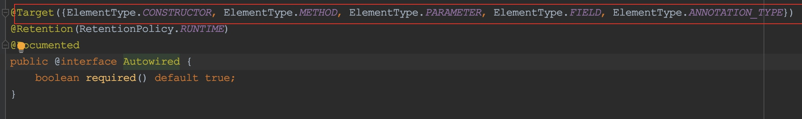

#### 其他的配置

##### @DependsOn==depends-on

配置依赖于某个bean，被依赖的bean会优先加载

##### @Lazy==lazy-init

设置当前bean懒加载，默认值的是true

##### @Scope

默认值是singleton，还有一个值prototype（原型）

#### 生命周期回调

@PostContruct（创建）和@PreDestroy（销毁）标注在方法上面，和上面的xml方式中一样

```java
@PostConstruct
public void init() {}

@PreDestroy
public void destroy() {}
```

#### 引用第三方bean，比如数据库等

要么在xml中注入，要么只能在纯注解中注入。

### 纯注解（javaConfig）方式

从spring3.0开始由spring Config项目提供，作为spring项目的一部分

#### 项目搭建（SSM）

和前面的一样xml+注解方式一样

#### 基本概念@Bean和@Configuration、@Scope

##### @Configuration

在根目录创建IoCJavaConfig.java（在任何目录都可以），@Configuration代替了之前的xml配置文件

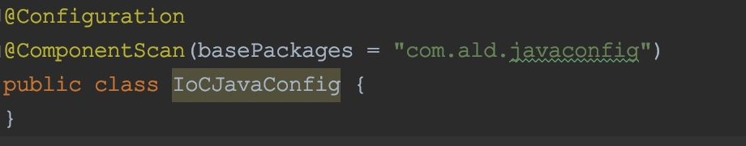

通过AnnotationConfigApplicationContext加载配置类

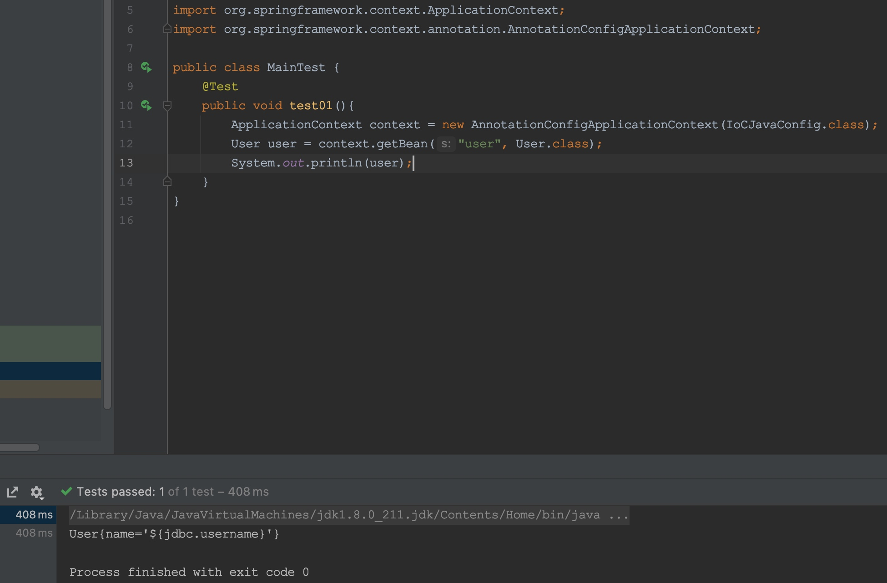

##### @Bean

通过在IoCJavaConfig文件中编写Bean实现自己编写的bean或者第三方的bean注入到spring容器中

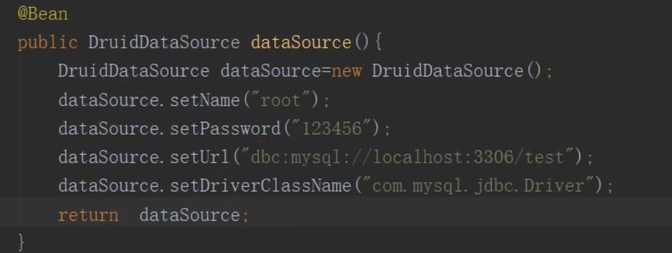

如果在我们自己编写的类中已经通过在类上方标注了@Component或者其他注解注入了bean到spring容器中，然后再IoCJavaConfig中再使用@Bean的方式注入对象，则会进行覆盖

它也提供了一些属性和之前的xml配置一样


设置别名


使用注解已经没有id的概念了

##### @Scope

作用域，和之前的一样

#### @PropertySource

引入配置属性，通过在IoCJavaConfig配置类上方添加该注解引入配置，classpath:可加可不加，不加下面编写的@Value没有提示


将属性注入到变量中

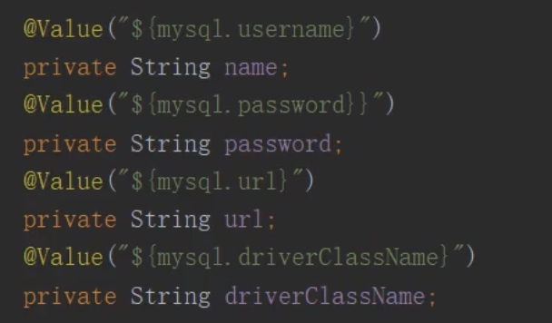

#### @Import的四种用法

1. 和xml配置的import标签一样，引入其他的配置文件中的信息，但是又比标签的方式更加强，如果想引入多个配置类，可以通过{“配置1.java”,"配置2.java"}引入

  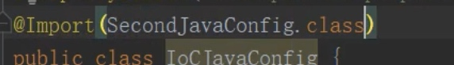

2. 如果@Import引入的类没有标注可以注入到spring容器的注解的话，@Import会自动将引入的类注入到spring容器中，也就是将引入的类注册为bean，比如：@Import(User.class)

3. 可以实现ImportSelector，这个在spingboot中非常重要，要引入的类不用添加注解注入到spring，而是通过Import的方式注入

   1. 编写类实现ImportSelector重写方法，必须是类的完整路径

     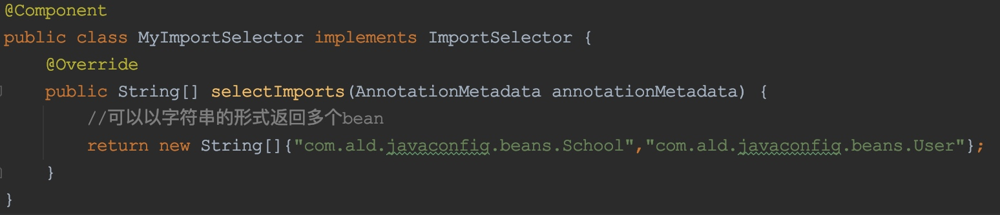

   2. 在IoCJavaConfig中使用@Import引入

     

   3. 通过这种方式注入的bean，只能通过`Person.class`的方式获取bean对象，因为没有设置名字

4. 实现ImportBeanDefinitionRegistrar注入bean

   1. 编写MyImportBeanDefinitionRegistrar实现ImportBeanDefinitionRegistrar接口，重写registerBeanDefinitions方法将一个bean注册成BeanDefinition，这样spring可以将这个BeanDefinition初始化成一个bean注入到spring容器中

     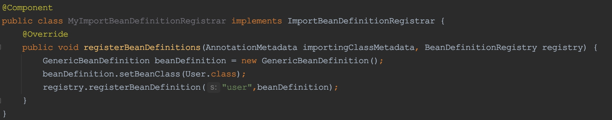

   2. 在IoCJavaConfig配置类中通过@Import引入

     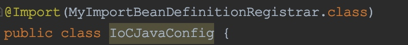

#### 怎么去自动依赖外部Bean？

比如DruidDataSource类中依赖Role对象，直接在形参中加入想要注入的bean即可在方法中使用

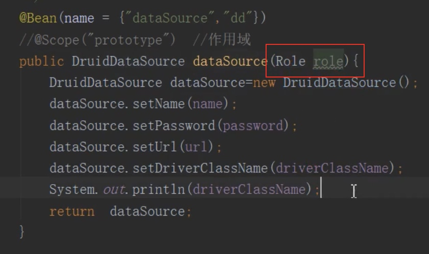

#### 怎么去依赖一个内部Bean？

直接调用方法

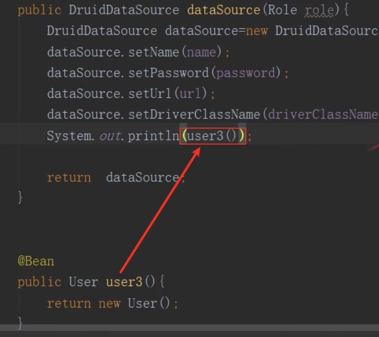

### 总结

将一个Bean注入到spring容器中有哪几种办法

- xml：\<bean\>
- @Component：包含@Component衍生出来的语义化注解
- @Bean：用在javaConfig中注入bean
- @Import

## aop

### 介绍和使用

#### 前置知识

- AOP：Aspect  Oriented Programming 面向切面编程
- OOP：Object Oriented Programming 面向想对象编程

AOP是基于OOP基础之上的新的编程思想，OOP面向的主要是类，而AOP面向的主要对象是切面，在处理日志、安全管理、事务管理等方面有非常重要的作用

AOP是spring中重要的核心点，虽然IOC容器没有依赖AOP，但是AOP提供了非常强大的功能，用来对IOC做补充

通俗点的话就是在程序运行期间，将跟主要业务没有关系的公共功能的代码不修改之前的代码的情况下增强到之前写好的方法中的指定位置。这种编程方式叫AOP

#### AOP概念

AOP的底层就是代理，代理是一种模式，可以分为静态代理和动态代理

##### 静态代理(需要我们自己创建代理类)

弊端：需要为每个被代理的类创建一个代理类，虽然这种方式可以实现，但是成本太高

代理玩游戏的示例

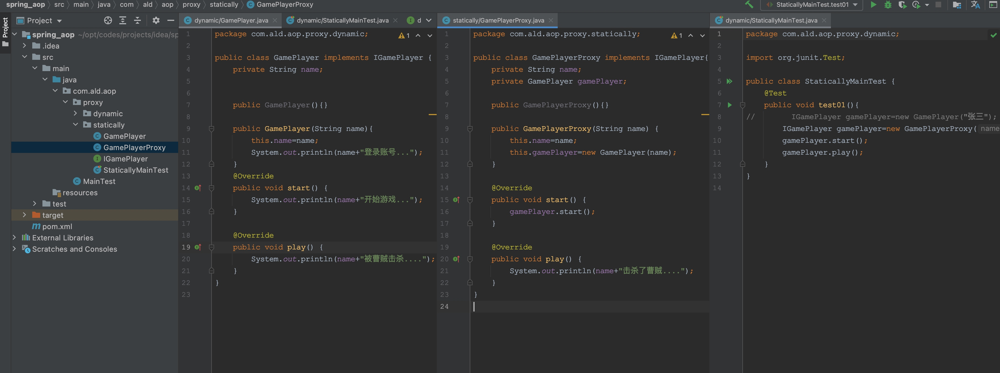

通过Proxy代理类继承和被代理类相同的接口，并持有被代理类的对象实现

##### 动态代理（动态创建的代理类Proxy）

AOP通过代理需要增强的对象实现对批量的类中的方法增强的目的，实现的方式有下面动态代理的两种

###### jdk动态代理

通过jdk给我们提供的反射Proxy.newProxyInstance创建公共的代理类GamePlayerInvocationHandler

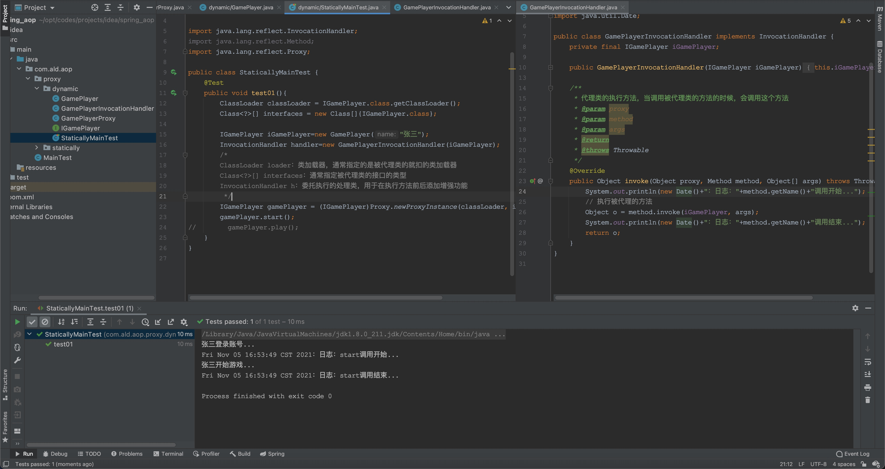

**缺点：被代理的类要实现了接口**

###### cglib动态代理

不需要接口，通过创建被代理的类的子类实现代理功能，通过继承被代理类实现代理

##### AOP切面的基本知识（[文学上的]概念）

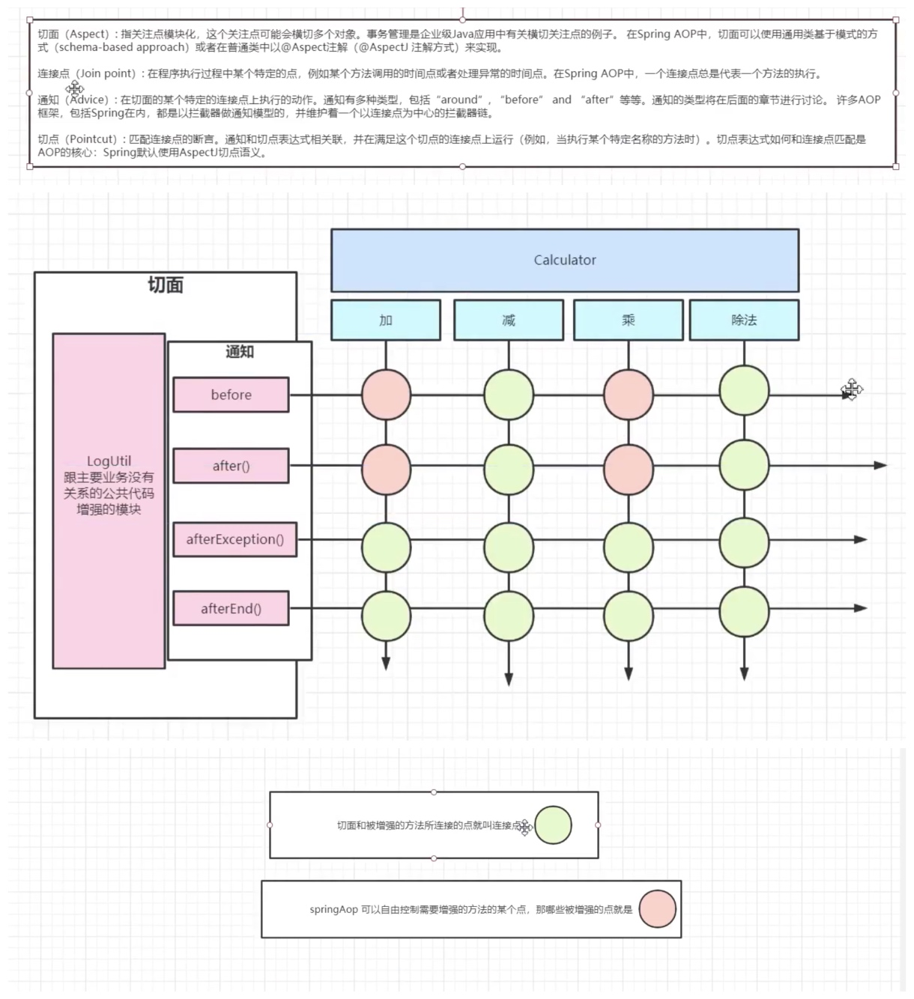

1. 横切关注点

影响应用多处的功能（安全、事务、日志等），横切关注点指的是一些具有横越多个模块的行为，使用传统的软件开发方法不能够达到有效的模块化的一类特殊关注点。

比如，日志，它作为一个单独的模块，与业务逻辑相分离，不属于任何一个模块，但是任何一个模块都需要日志，并且可以在每个业务执行前后通过日志的方式记录下当前的操作，这时候日志相当于从业务功能中横切，日志是横切关注点，事务也是横切关注点

2. 通知（增强处理）

就是你**抽取出来的通用功能**，也就是安全、事务、日志等里面的方法，这些方法主要是实现了某些功能，可以应用到业务方法的某个位置上，是我们事先定义好，然后在需要的地方引用的方法。

比如，日志，我们想要在每个方法上，进入方法前记录一下，正常返回记录一下，异常退出记录一下，这样每个方法中都有这些记录的操作，这时候就可以抽取出来。

通知是指拦截到连接点之后要执行的代码，包括了“around”、“before”和“after”等不同类型的通知。Spring AOP框架以拦截器来实现通知模型，并维护一个以连接点为中心的拦截器链。

```java
// @Before说明这是一个前置通知，log函数中是要前置执行的代码，JoinPoint是连接点，
@Before("pointcut()")
public void log(JoinPoint joinPoint) { 
}
```

3. 连接点

spring允许你引用通知的地方，**基本每个方法的前、后以及前后都包括，或抛出异常时都可以是连接点**，spring只支持方法连接点

程序执行过程中明确的点，如方法的调用或特定的异常被抛出。连接点由两个信息确定：

- 方法(表示程序执行点，即在哪个目标方法)
- 相对点(表示方位，即目标方法的什么位置，比如调用前，后等)

```java
@Before("pointcut()")
public void log(JoinPoint joinPoint) { //这个JoinPoint参数就是连接点
}
```

4. 切入点

上面说的连接点的基础上，来定义切入点，我们的一个类里，有15个方法，那就有十几个连接点，但是我们并不想在所有方法附近都使用通知，只是想让其中几个，在调用这几个方法之前、之后或者抛出异常时干点什么，那么就用切入点来定义这几个方法，让切点来筛选连接点，选中你想要引入通知的方法。

切入点是对连接点进行拦截的条件定义。切入点表达式如何和连接点匹配是AOP的核心，Spring缺省使用AspectJ切入点语法。 一般认为，所有的方法都可以认为是连接点，但是我们并不希望在所有的方法上都添加通知，而切入点的作用就是提供一组规则(使用 AspectJ pointcut expression language 来描述) 来匹配连接点，给满足规则的连接点添加通知

```java
@Pointcut("execution(* com.remcarpediem.test.aop.service..*(..))")
public void pointcut() {
}
```

上边切入点的匹配规则是 com.remcarpediem.test.aop.service包下的所有类的所有函数。

5. 切面

切面是一个横切关注点的模块化，一个切面能够包含同一个类型的不同增强方法，比如说事务处理和日志处理可以理解为两个切面。切面由切入点和通知组成，它既包含了横切逻辑的定义，也包括了切入点的定义。 Spring AOP就是负责实施切面的框架，它将切面所定义的横切逻辑织入到切面所指定的连接点中。

```java
@Component
@Aspect
public class LogAspect {
}
```

可以简单地认为, 使用 @Aspect 注解的类就是切面。

6. 目标对象(Target)

目标对象指将要被增强的对象，即包含主业务逻辑的类对象。或者说是被一个或者多个切面所通知的对象。

7. 织入(Weaving)

织入是将切面和业务逻辑对象连接起来, 并创建通知代理的过程。织入可以在编译时，类加载时和运行时完成。在编译时进行织入就是静态代理，而在运行时进行织入则是动态代理。

8. 实例说明

整个 aspect 可以描述为: **满足 pointcut 规则的 joinpoint 会被添加相应的 advice 操作**。我们来看下边这个例子

```java
@Component
@Aspect // 切面
public class LogAspect {
    private final static Logger LOGGER = LoggerFactory.getLogger(LogAspect.class.getName());
    // 切入点，表达式是指com.remcarpediem.test.aop.service
    // 包下的所有类的所有方法
    @Pointcut("execution(* com.remcarpediem.test.aop.service..*(..))")
    public void aspect() {}
    // 通知，在符合aspect切入点的方法前插入如下代码，并且将连接点作为参数传递
    @Before("aspect()")
    public void log(JoinPoint joinPoint) { // 连接点作为参数传入
        if (LOGGER.isInfoEnabled()) {
            // 获得类名，方法名，参数和参数名称。
            Signature signature = joinPoint.getSignature();
            String className = joinPoint.getTarget().getClass().getName();
            String methodName = joinPoint.getSignature().getName();
            Object[] arguments = joinPoint.getArgs();
            MethodSignature methodSignature = (MethodSignature) joinPoint.getSignature();

            String[] argumentNames = methodSignature.getParameterNames();

            StringBuilder sb = new StringBuilder(className + "." + methodName + "(");

            for (int i = 0; i< arguments.length; i++) {
                Object argument = arguments[i];
                sb.append(argumentNames[i] + "->");
                sb.append(argument != null ? argument.toString() : "null ");
            }
            sb.append(")");
            LOGGER.info(sb.toString());
        }
    }
}
```

#### AOP的使用

1. 引入jar

需要引入AspectJ依赖，在mvnrepository搜索AspectJ，spring的AOP不是自己实现的，是引用的AspectJ的，添加到pom文件中

```xml
<dependency>
    <groupId>org.aspectj</groupId>
    <artifactId>aspectjweaver</artifactId>
    <version>1.9.5</version>
</dependency>
```

引入AspectJ和spring配合的依赖spring-aspects，mvnrepository搜索spring-aspects


选择和spring-context一样的版本添加到pom文件中

```xml
<dependency>
    <groupId>org.springframework</groupId>
    <artifactId>spring-aspects</artifactId>
    <version>5.2.7.RELEASE</version>
</dependency>
```

2. 编写LogUtil日志类

```java
@Aspect
@Component
public class LogUtil {

    // 将切入点规则统一抽离
    @Pointcut("execution(* com.ald.aop.service..*.*(..))")
    public void pointcut(){}
    /**
     * 在目标方法执行前：前置通知
     */
    @Before("pointcut()")
    public void before(JoinPoint joinPoint){
        //获取方法名
        Signature method = joinPoint.getSignature();

        //获取所有的参数
        Object[] args = joinPoint.getArgs();
//        System.out.println("log--------before--------");
        //Method method,Object[] args
        System.out.println("前置通知："+method.getName()+"方法，参数是："+((args==null)?"": Arrays.asList(args).toString()));
    }

    /**
     * 在目标方法正常返回之后：后置返回通知
     * 只有正常执行的才会执行这个函数，相当于在try{........... afterReturning();}的最后调用这个函数
     */
    @AfterReturning(value = "execution(* com.ald.aop.service..*.*(..))",returning="result")
    public void afterReturning(JoinPoint joinPoint,Object result){
        //获取方法名
        Signature method = joinPoint.getSignature();

        //获取所有的参数
        Object[] args = joinPoint.getArgs();
//        System.out.println("log--------afterReturning--------");
        //Method method,Object[] args

        //获取返回值
        System.out.println("后置返回获取到的参数是："+result.toString());
        System.out.println("返回通知："+method.getName()+"方法，参数是："+((args==null)?"": Arrays.asList(args).toString()));
    }

    /**
     * 在目标方法抛出异常之后开始运行：异常通知
     */
    @AfterThrowing(value = "execution(* com.ald.aop.service..*.*(..))",throwing="exception")
    public void afterThrowing(JoinPoint joinPoint,Exception exception){
        //获取方法名
        Signature method = joinPoint.getSignature();

        //获取所有的参数
        Object[] args = joinPoint.getArgs();

        //获取异常通知
        System.out.println("异常通知："+exception);

        //输出异常栈
        StringWriter sw=new StringWriter();
        exception.printStackTrace(new PrintWriter(sw,true));
        System.out.println("异常栈信息："+sw.getBuffer().toString());

        System.out.println("异常通知："+method.getName()+"方法，参数是："+((args==null)?"": Arrays.asList(args).toString()));
    }

    /**
     * 在目标方法执行后：后置通知（无论方法是否报错都会执行）
     */
    @After("execution(* com.ald.aop.service..*.*(..))")
    public void after(JoinPoint joinPoint){
        //获取方法名
        Signature method = joinPoint.getSignature();

        //获取所有的参数
        Object[] args = joinPoint.getArgs();
//        System.out.println("log--------after--------");
        //Method method,Object[] args
        System.out.println("后置通知："+method.getName()+"方法，参数是："+((args==null)?"": Arrays.asList(args).toString()));
    }

    /**
     * 环绕通知
     */
    @Around("pointcut()")
    public Object around(ProceedingJoinPoint joinPoint){
        //获取方法名
        String methodName = joinPoint.getSignature().getName();

        //所有的参数
        Object[] args = joinPoint.getArgs();
        Object returnValue="";
        try{
            System.out.println("around：前置通知："+methodName+"方法执行，参数："+Arrays.asList(args));
            returnValue = joinPoint.proceed();
            System.out.println("around：后置返回通知："+methodName+"方法执行，参数："+Arrays.asList(args));
        }catch (Throwable throwable){
            System.out.println("around：异常通知："+throwable);
        }finally {
            System.out.println("around：后置通知："+returnValue);
        }

        return returnValue;
    }
}
```

使用`@Aspect`声明为切面，将切面交给spring容器去管理，声明的方式分别是@Aspect和@Component，在需要使用的通知上添加要切入的方法：`@Before("execution(* com.ald.aop.service..*.*(..))")
`

3. 在spring—aop.xml配置文件中扫描包和开启AOP的注解

```xml
<?xml version="1.0" encoding="UTF-8"?>
<beans xmlns="http://www.springframework.org/schema/beans"
       xmlns:xsi="http://www.w3.org/2001/XMLSchema-instance"
       xmlns:context="http://www.springframework.org/schema/context"
       xmlns:aop="http://www.springframework.org/schema/aop"
       xsi:schemaLocation="http://www.springframework.org/schema/beans http://www.springframework.org/schema/beans/spring-beans.xsd http://www.springframework.org/schema/context https://www.springframework.org/schema/context/spring-context.xsd http://www.springframework.org/schema/aop https://www.springframework.org/schema/aop/spring-aop.xsd">
    
    <!--设置扫描包-->
    <context:component-scan base-package="com.ald.aop"/>

    <!--因为使用的是注解方式的AOP，所以要开启注解AOP-->
    <aop:aspectj-autoproxy/>
</beans>
```

4. 编写测试类并使用

其中add是调用了userService的方法，log日志成功输出

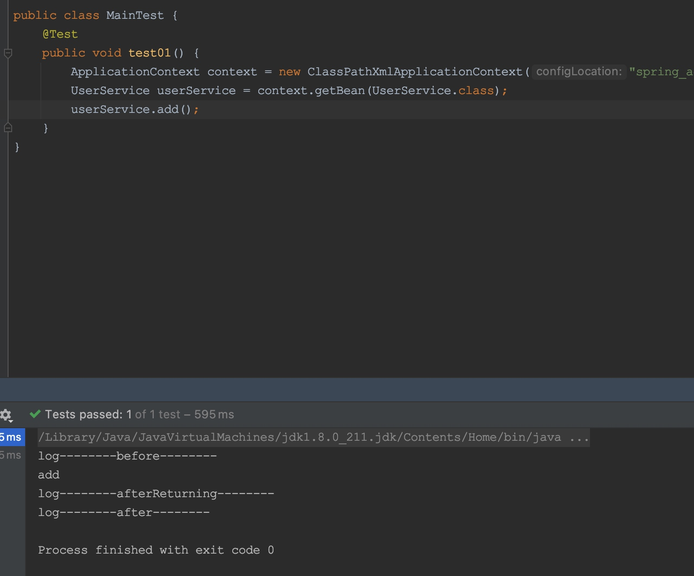

5. 可以看到我们获取到的userService已经不是我们注入的userService，而是AOP创建的代理类

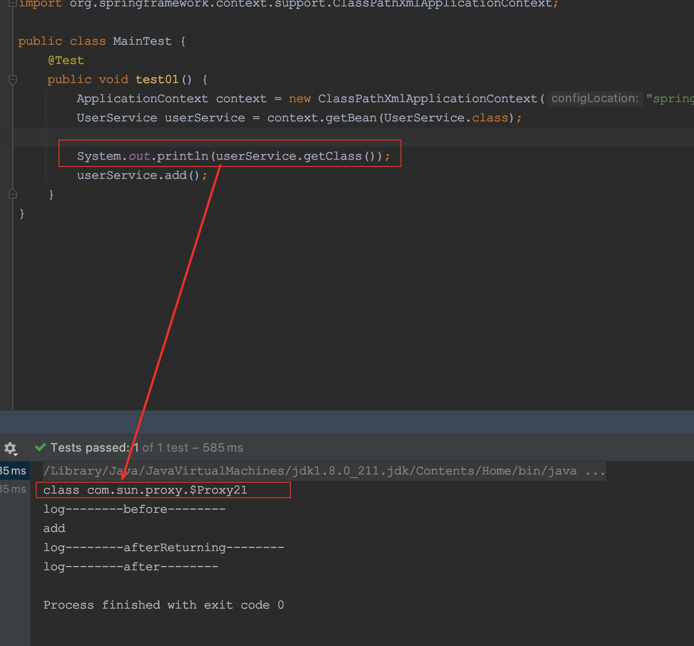

6. 当代理类没有实现接口，AOP就会使用cglib的方式实现动态代理

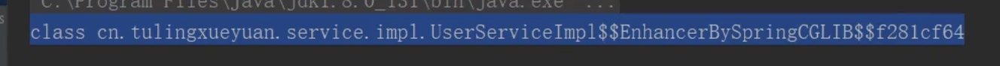

7. 如果我们获取刚才注入的UserService是获取不到的，因为配置了动态代理，AOP会将注入到IOC容器中的UserServiceImpl拦截，注入代理对象

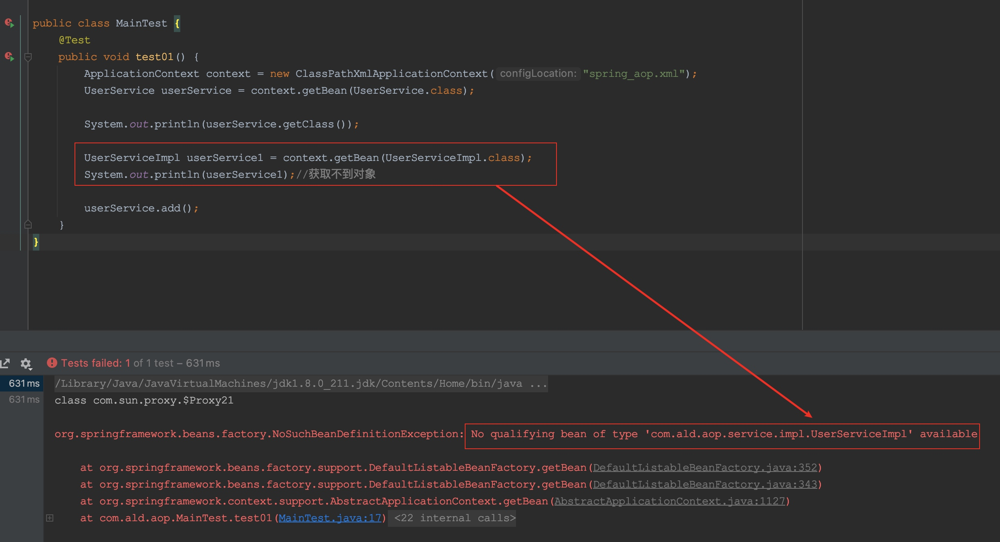

### 使用详解

#### 基于注解的AOP使用

##### 切点表达式

###### 语法

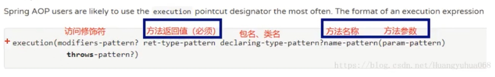

**说明**

1. \* 表示通识符，表示匹配所有

2. 语法中带?的表示可写可不写

3. 访问修饰符，可以不写，表示匹配任何一个访问修饰符

4. 返回值

- 如果是jdk定义的类名，可以不写完整性类名，因为它会自己去环境变量中寻找对应的类
- 如果是自己写的需要写完整性类名（全路径）
- 如果没有返回值，写void

5. 包名

- \* 代表任何包名
- .. 代表子孙包
- 比如：com.\*==com.ald==com.任意名字，但是只能匹配一级，com.ald.aop就无法匹配，所以要匹配到com.ald.aop，就要使用com.\*.\*
- com.ald...*==com.ald.aop.service

6. 类名

- \* 代表所有的类名
- 也可以写\*Service==UserServiceImpl==RoleServiceImpl

7. 方法名

- 可以写\*，代表任何方法
- 也可以模糊匹配*Add==userAdd==roleAdd

8. 参数

- 如果是jdk自带的类型可以不用写完整限定名
- 如果是自定义类型需要写上完整限定名
- 如果需要匹配任意参数可以写..

**示例**

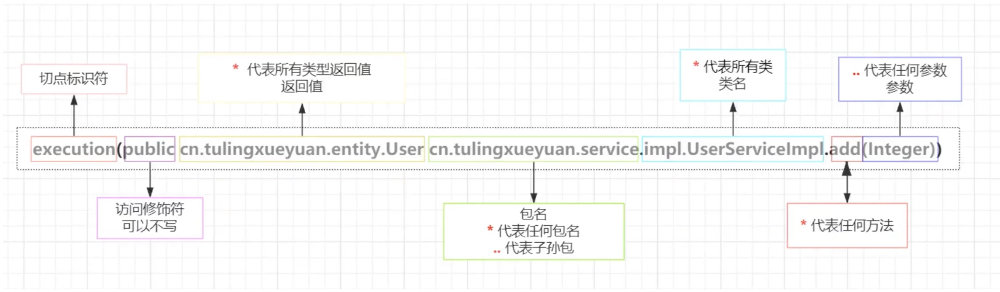

###### spring aop支持使用以下的Aspect切点标识符，用于切点表达式

1. execution：用于匹配方法执行连接点，这是使用spring AOP时使用的主要切点标识符，细粒度的

2. within：只能匹配类这个级别，只能指定类，类下面的某个具体的方法无法指定，粗粒度的

3. this：用来匹配是否实现某个接口，`this(com.xyz.service.AccountService)`表示实现了AccountService

4. target：使用“target(类型全限定名)”匹配当前目标对象类型的执行方法；注意是目标对象的类型匹配，这样就不包括引入接口也类型匹配；注意target中使用的表达式必须是类型全限定名，不支持通配符。`target(cn.javass.spring.chapter6.service.IPointcutService)`表示当前目标对象（非AOP对象）实现了 IPointcutService接口的任何方法

5. args：只按参数去匹配，`args (java.io.Serializable,..)`表示任何一个以接受“传入参数类型为 java.io.Serializable” 开头，且其后可跟任意个任意类型的参数的方法执行，args指定的参数类型是在运行时动态匹配的

6. @within：表示类上有某一个注解就会被匹配到（只在spring AOP中的方法执行）
   如，`@within(org.springframework.transaction.annotation.Transaction)`表示目标对象的定义类型上有@Transtactional注解时的任意连接点

7. @args：`@args(com.xyz.security.Classsified)`表示有单一参数且在运行时传入的参数类型有`@Classified`注解的任意连接点（只在spring AOP中的方法执行）

8. @within：使用“@within(注解类型)”匹配所以持有指定注解类型内的方法；注解类型也必须是全限定类型名；比如`@within(cn.javass.spring.chapter6.Secure)`任何目标对象对应的类型持有Secure注解的类方法；必须是在目标对象上声明这个注解，在接口上声明的对它不起作用

9. @annotation：限定方法上是否加了某个注解，一般用在自定义注解的情况，使用“@annotation(注解类型)”匹配当前执行方法持有指定注解的方法；注解类型也必须是全限定类型名，比如`@annotation(cn.javass.spring.chapter6.Secure )`当前执行方法上持有注解 cn.javass.spring.chapter6.Secure将被匹配

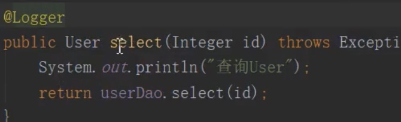
	
要注意添加的注解的限定

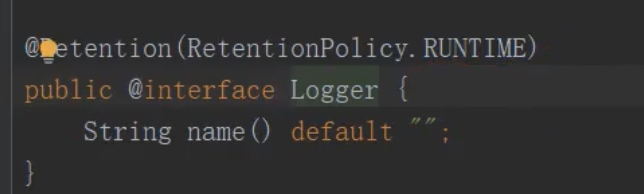

###### 合并切点表达式

可以使用&& 和 || 和 ! 等符号进行合并操作，也可以通过名字来指向切点表达式

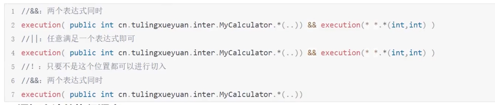

##### 通知方法的执行顺序

> **我这个和网上的执行顺序不一样，之后在看看**

1. 五种通知的执行顺序

环绕通知→前置通知→正常返回通知/异常返回通知→后置通知

2. 正常执行

before-afterReturning-after

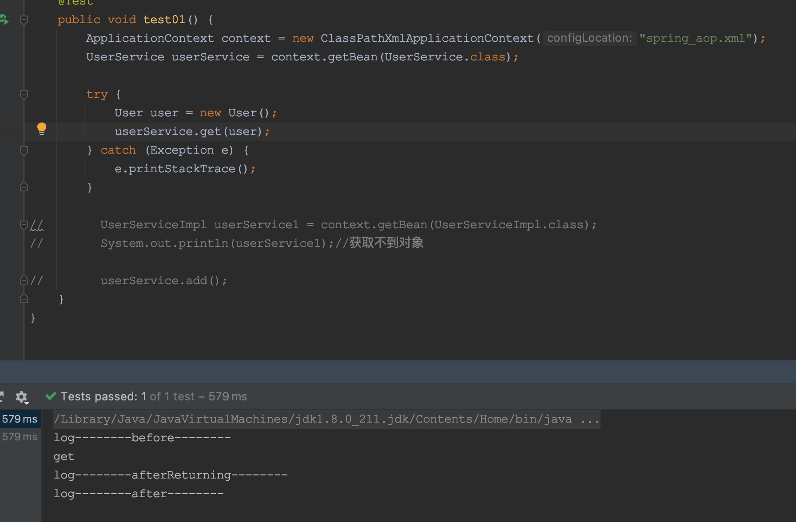

3. 异常执行

before-afterThrowing-after

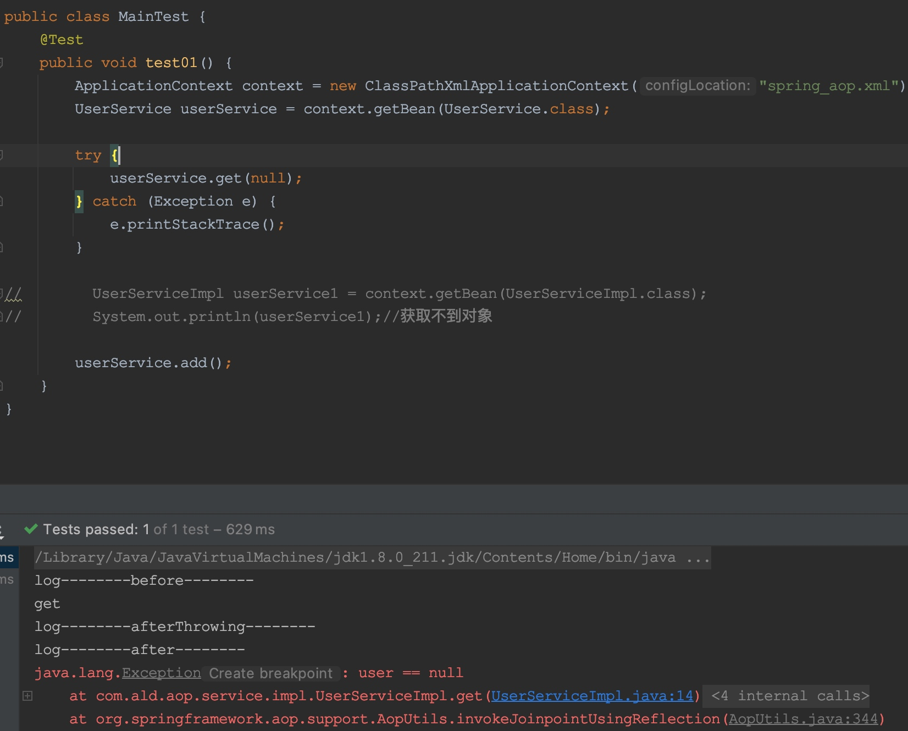

4. 如果对应在try-catch-finally中的位置

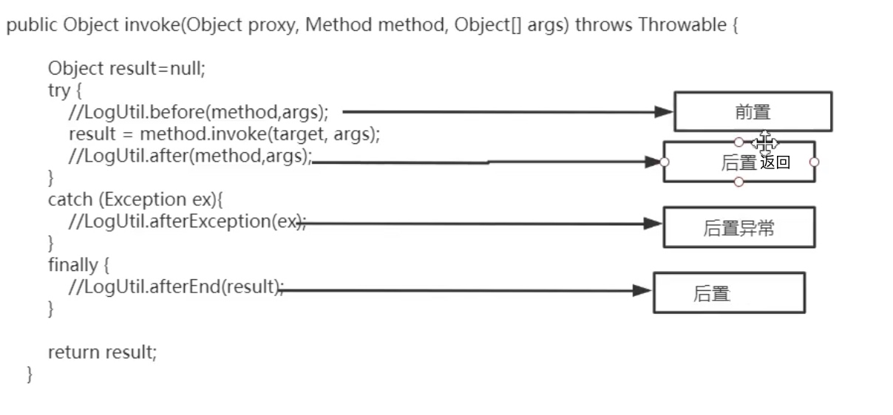

5. 后置返回是在主业务代码没有发生任何异常的时候才会调用

##### 获取方法的详细信息

###### 获取被切方法的参数信息

在通知中添加参数`JoinPoint joinPoint`，aop将被切方法、参数等信息存储在JoinPoint中

```java
/**
 * 在目标方法执行前：前置通知
 */
@Before("pointcut()")
public void before(JoinPoint joinPoint){
    //获取方法名
    Signature method = joinPoint.getSignature();

    //获取所有的参数
    Object[] args = joinPoint.getArgs();
//        System.out.println("log--------before--------");
    //Method method,Object[] args
    System.out.println("前置通知："+method.getName()+"方法，参数是："+((args==null)?"": Arrays.asList(args).toString()));
}
```

###### 获取返回参数

只有@AfterReturning才有返回值，添加returning="result"，并在形参中添加Object result

```java
/**
     * 在目标方法正常返回之后：后置返回通知
     * 只有正常执行的才会执行这个函数，相当于在try{........... afterReturning();}的最后调用这个函数
     */
    @AfterReturning(value = "execution(* com.ald.aop.service..*.*(..))",returning="result")
public void afterReturning(JoinPoint joinPoint,Object result){
    //获取方法名
    Signature method = joinPoint.getSignature();

    //获取所有的参数
    Object[] args = joinPoint.getArgs();
//        System.out.println("log--------afterReturning--------");
    //Method method,Object[] args

    //获取返回值
    System.out.println("后置返回获取到的参数是："+result.toString());
    System.out.println("返回通知："+method.getName()+"方法，参数是："+((args==null)?"": Arrays.asList(args).toString()));
}
```

###### 获取异常信息

只有@AfterThrowing才有异常信息，添加throwing="exception"到注解中，添加Exception exception到形参中

```java
/**
     * 在目标方法抛出异常之后开始运行：异常通知
     */
    @AfterThrowing(value = "execution(* com.ald.aop.service..*.*(..))",throwing="exception")
public void afterThrowing(JoinPoint joinPoint,Exception exception){
    //获取方法名
    Signature method = joinPoint.getSignature();

    //获取所有的参数
    Object[] args = joinPoint.getArgs();

    //获取异常通知
    System.out.println("异常通知："+exception);

    //输出异常栈
    StringWriter sw=new StringWriter();
    exception.printStackTrace(new PrintWriter(sw,true));
    System.out.println("异常栈信息："+sw.getBuffer().toString());

    System.out.println("异常通知："+method.getName()+"方法，参数是："+((args==null)?"": Arrays.asList(args).toString()));
}
```

###### 获取切入方法的注解

如果在被切方法上加入了注解@Logger，然后是匹配@Logger方法通知的执行，就可以获取到被切函数的注解，其中logger和形参中的一致

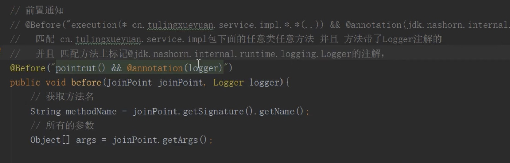

##### spring对方法的要求

spring对通知方法的要求并不是很高，可以任意改变方法的返回值和访问修饰符，但是唯一不能改变的就是方法的参数，会出现参数绑定的错误哦，原因在于通知方法是spring利用反射调用的，每次方法调用得确定这个方法的参数的值

##### 表达式的抽取

如果在使用杂过程中，多个方法的表达式是一致的话，那么可以考虑将切入点表达式抽取出来，随便声明一个没有实现的返回void的空方法，给方法上标注@Pointcut注解，定义pointcut方法，然后在通知方法注解中调用即可

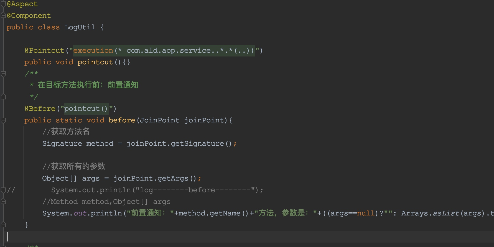

##### 环绕通知

环绕通知的执行顺序是优先于普通通知的，具体的执行顺序如下：

环绕前置→普通前置→目标方法执行→环绕通知正常结束/出现错误→环绕后置→普通返回或者异常→普通后置

需要注意的是，如果出现了异常，那么环绕通知会处理或者捕获异常，普通异常通知是接收不到的，因此最好的方式是在环绕异常通知中向外抛出异常

示例

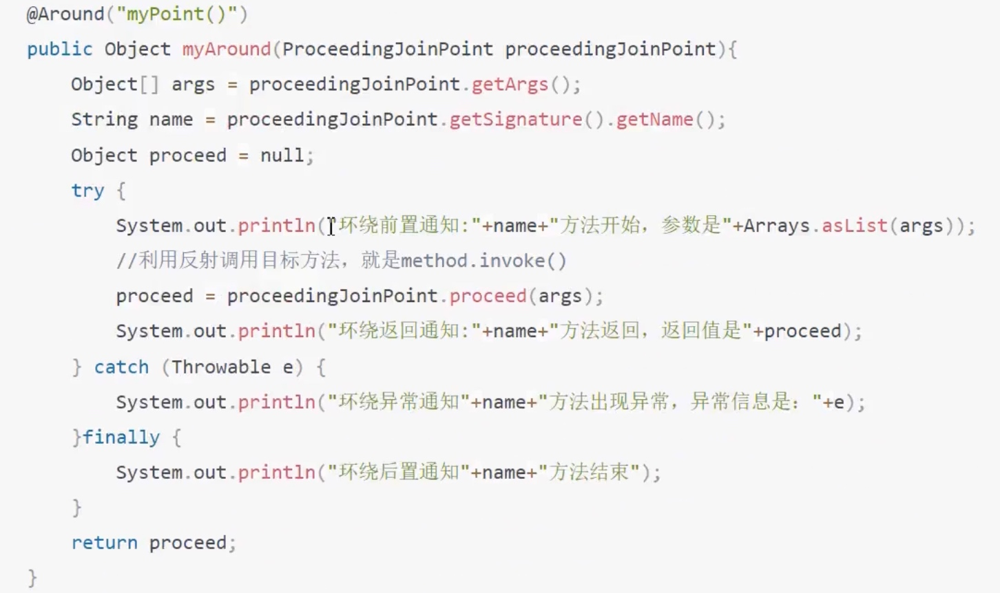
	

###### 测试

在LogUtil中编写环绕通知的代码

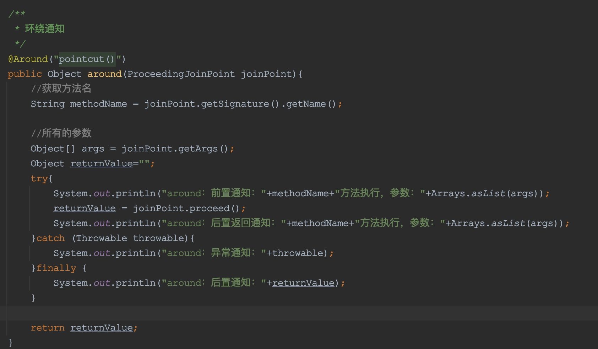

编写测试代码

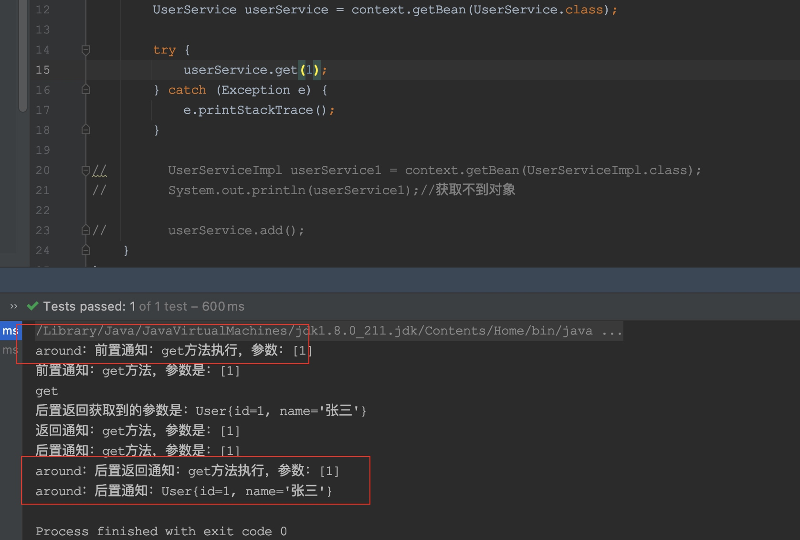

#### 基于xml的AOP使用

除了在配置Aspect时是配置在spring-aop.xml配置文件中外，基本上使用方式和前面的一致

1. 编写通知切面类

添加@Component注解，将这个切面注入到ioc容器中，方便在spring-aop.xml中使用，也可以通过xml注入

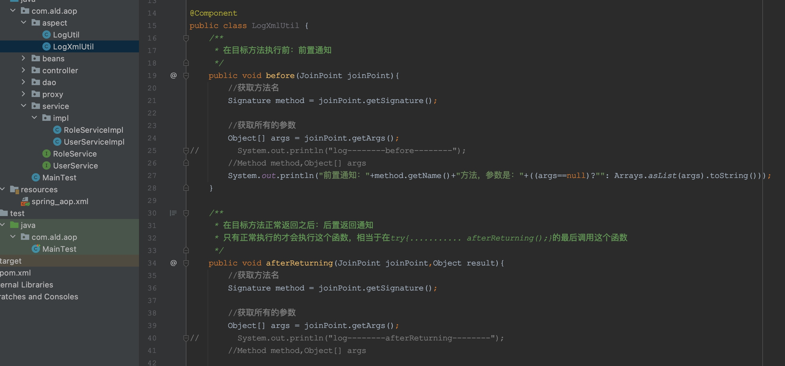

2. 在spring-aop.xml中去除上面的Aspect的注解方式的配置去除


3. 添加aop:config标签并编写通知

```xml
<aop:config>
    <!--logXmlUtil是注入到spring容器的日志切面-->
    <aop:aspect ref="logXmlUtil">
        <!--定义切入点规则，只要符合这个规则就会被织入通知-->
        <aop:pointcut id="pointcut" expression="execution(* com.ald.aop.service.impl.*.*(..))"/>
        <!--配置通知-->
        <aop:before method="before" pointcut-ref="pointcut"/>
        <!--returning 是当切入的业务正常返回时，通知方法中可以拿到的返回值-->
        <aop:after-returning method="afterReturning" pointcut-ref="pointcut" returning="result"/>
        <!--throwing 是当切入的业务出现错误时，通知方法中可以拿到的异常-->
        <aop:after-throwing method="afterThrowing" pointcut-ref="pointcut" throwing="exception"/>
        <aop:after method="after" pointcut-ref="pointcut"/>
        <aop:around method="around" pointcut-ref="pointcut"/>
    </aop:aspect>
</aop:config>
```

4. 测试结果

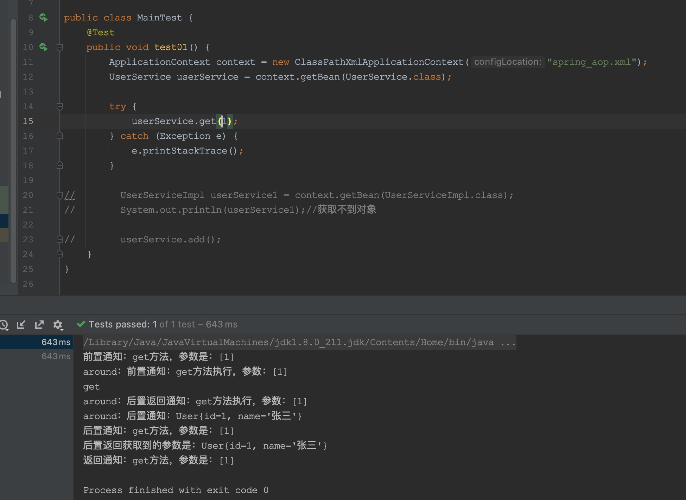

5. 我们还可以添加多个切入点的规则，使用逻辑运算连接（&& || !）

&&在xml中需要转义

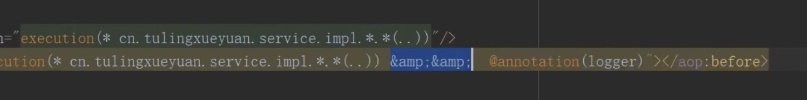

## 事务

### 什么是事务

把一组业务当成一个业务来做，要么都成功，要么都失败，保证业务曹组的完整性的一种数据库机制。

事务是基于AOP实现的。

### spring jdbcTemplate（为了后面的事务引入）

#### 定义

在spring中为了更加方便的操作JDBC，在JDBC的基础上定义了一个抽象层，此设计的目的是为了不同类型的JDBC操作提供了模板方法，每个模板方法都能控制整个过程，并允许覆盖过程中的特定任务，通过这种方式，可以尽可能保留灵活性，将数据库存储的工作量降到最低

#### jdbcTemplate的引入和使用

##### 创建maven项目

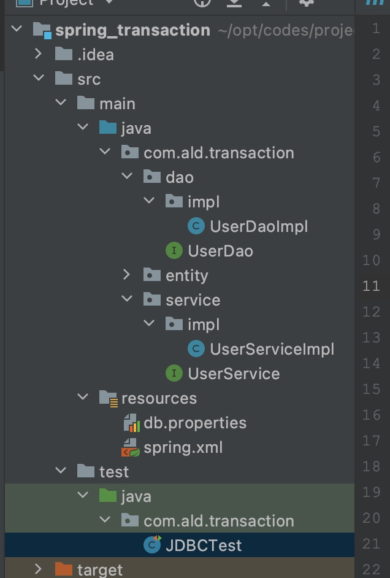

##### 添加依赖

需要添加的依赖有：

- spring-context依赖
- junit依赖
- druid连接池依赖
- mysql依赖
- spring-aop依赖（spring-context依赖已经引入，不用显式引入）
- aspectjweaver依赖
- spring-aspects依赖
- spring-orm依赖（事务和jdbcTemplate使用），spring的数据资源：orm作为JDBC和Transactions的入口，只需要添加ORM依赖，会自动导入JDBC和Transactions依赖
  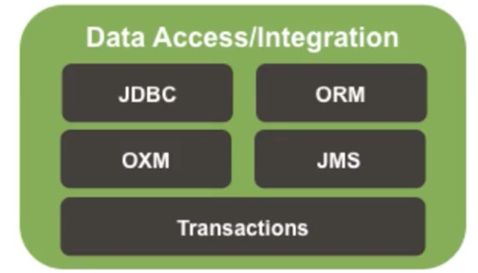

pom.xml文件内容

```xml
<dependencies>
    <!--spring-context-->
    <dependency>
        <groupId>org.springframework</groupId>
        <artifactId>spring-context</artifactId>
        <version>5.2.7.RELEASE</version>
    </dependency>

    <!--junit-->
    <dependency>
        <groupId>junit</groupId>
        <artifactId>junit</artifactId>
        <version>4.12</version>
        <!-- 如果想要在非test目录下能够做测试，需要改为编译时期（compile），原本是测试时期（test） -->
        <scope>compile</scope>
    </dependency>

    <!--druid-->
    <dependency>
        <groupId>com.alibaba</groupId>
        <artifactId>druid</artifactId>
        <version>1.1.21</version>
    </dependency>

    <!--mysql-->
    <dependency>
        <groupId>mysql</groupId>
        <artifactId>mysql-connector-java</artifactId>
        <version>5.1.47</version>
    </dependency>

    <!--aspectjweaver：aop是这个提供的-->
    <dependency>
        <groupId>org.aspectj</groupId>
        <artifactId>aspectjweaver</artifactId>
        <version>1.9.5</version>
        <!-- 去除runtime <scope>runtime</scope>-->
    </dependency>

    <!--aspects：是 spring 和 aspect 整合的工具-->
    <dependency>
        <groupId>org.springframework</groupId>
        <artifactId>spring-aspects</artifactId>
        <version>5.2.7.RELEASE</version>
    </dependency>

    <!--spring-orm：spring-orm 是spring-jdbc 和 spring-tx(transactions) 的入口
        spring-orm 依赖与 spring-jdbc 和 spring-tx(transactions)
    -->
    <dependency>
        <groupId>org.springframework</groupId>
        <artifactId>spring-orm</artifactId>
        <version>5.2.7.RELEASE</version>
    </dependency>
</dependencies>
```

添加之后的结果

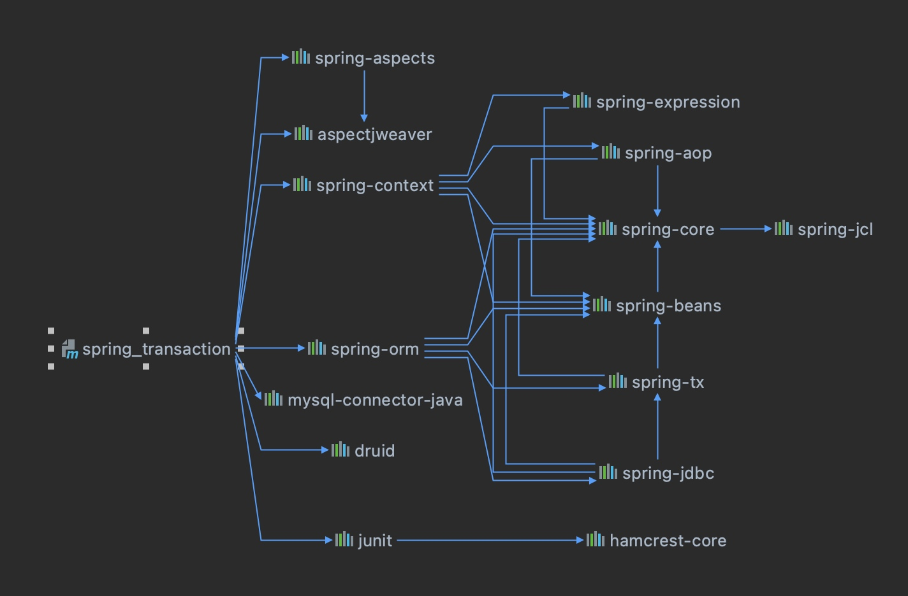

##### 创建SSM项目结构和数据库表

User相关的

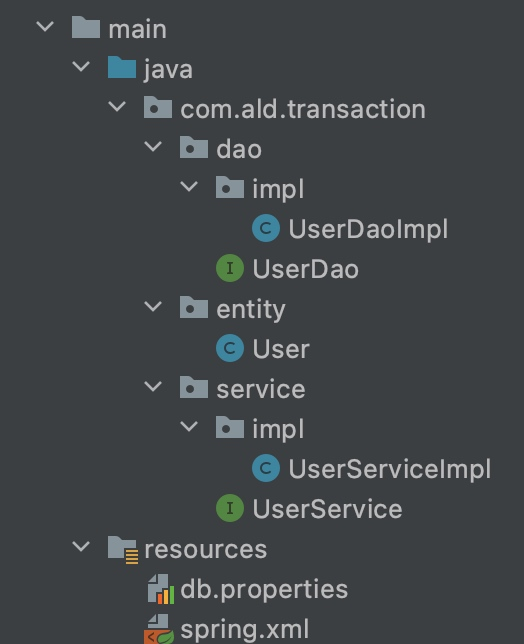

数据库user表

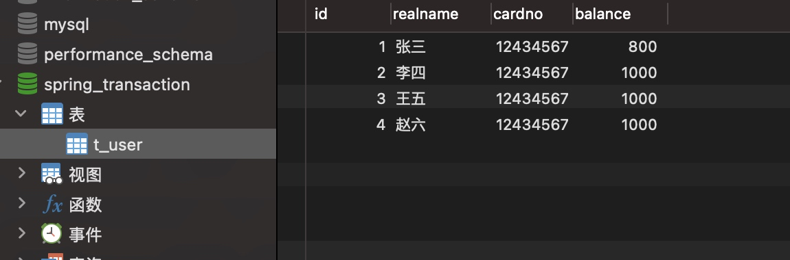

##### 创建spring.xml、配置扫包策略和配置jdbcTemplate

创建spring.xml文件

1. 扫描包

```xml
<!--扫描包-->
<context:component-scan base-package="com.ald.transaction"/>
```

2. 配置druid数据库连接池和注入jdbcTemplate到spring容器

配置数据连接信息文件db.properties

```properties
jdbc.username=root
jdbc.password=root
jdbc.url=jdbc:mysql://localhost:3306/spring_transaction?useUnicode=true&characterEncoding=UTF-8
jdbc.driverClassName=com.mysql.jdbc.Driver
```

引入spring.xml并配置druid数据库连接池

```xml
<!--引入外部的数据库的连接信息-->
<context:property-placeholder location="classpath:db.properties"/>

<!--配置druid数据源-->
<bean class="com.alibaba.druid.pool.DruidDataSource" id="dataSource">
    <property name="username" value="${jdbc.username}"/>
    <property name="password" value="${jdbc.password}"/>
    <property name="url" value="${jdbc.url}"/>
    <property name="driverClassName" value="${jdbc.driverClassName}"/>
</bean>
```

注入jdbcTemplate到spring容器

```xml
<!--配置jdbcTemplate-->
<bean class="org.springframework.jdbc.core.JdbcTemplate" id="jdbcTemplate">
    <property name="dataSource" ref="dataSource" />
</bean>
```

##### 测试项目是否成功

测试dataSource

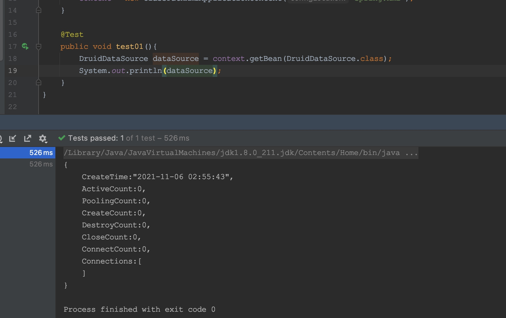

测试jdbcTemplate查询数据

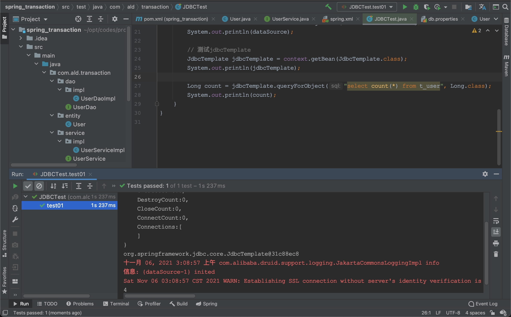

#### jdbcTemplate的基本增删查改

##### 增

```java
/**
 * 新增
 */
@Test
public void test05(){
    // 测试jdbcTemplate
    JdbcTemplate jdbcTemplate = context.getBean(JdbcTemplate.class);
    String sql = "insert into t_user(realname,cardno,balance) values(?,?,?)";
    int result = jdbcTemplate.update(sql, "张三丰", "12345679", 800);
    // 输出验证
    System.out.println(result);
}
```

##### 删

```java
/**
 * 删除
 */
@Test
public void test06(){
    // 测试jdbcTemplate
    JdbcTemplate jdbcTemplate = context.getBean(JdbcTemplate.class);
    String sql = "delete from t_user where id =?";
    int result = jdbcTemplate.update(sql, 6);
    // 输出验证
    System.out.println(result);
}
```

##### 改

```java
/**
 * 修改
 */
@Test
public void test07(){
    // 测试jdbcTemplate
    JdbcTemplate jdbcTemplate = context.getBean(JdbcTemplate.class);
    String sql = "update t_user set realname=? where id =?";
    int result = jdbcTemplate.update(sql, "宋青书",6);
    // 输出验证
    System.out.println(result);
}
```

##### 查

###### 查单行单列

```java
/**
 * 查询单个值
 */
@Test
public void test02(){
    // 测试jdbcTemplate
    JdbcTemplate jdbcTemplate = context.getBean(JdbcTemplate.class);

    Long count = jdbcTemplate.queryForObject("select count(*) from t_user", Long.class);
    System.out.println(count);
}
```

###### 查一个实体

```java
/**
 * 查询实体类
 */
@Test
public void test03(){
    JdbcTemplate jdbcTemplate = context.getBean(JdbcTemplate.class);

    String sql = "select * from t_user where id = 1";
    // 如果字段名和属性名一致的话，使用BeanPropertyRowMapper直接进行映射即可
//        User user = jdbcTemplate.queryForObject(sql, new BeanPropertyRowMapper<>(User.class));
//        System.out.println(user);

    // 不一致的情况
    User user1 = jdbcTemplate.queryForObject(sql, (resultSet, i) -> {
        User user = new User();
        user.setId(resultSet.getInt("id"));
        user.setRealname(resultSet.getString("realname"));
        user.setCardno(resultSet.getString("cardno"));
        user.setBalance(resultSet.getInt("balance"));
        return user;
    });

    System.out.println(user1);
}
```

###### 查询List<实体>

```java
/**
 * 查询List\<实体\>
 */
@Test
public void test04(){
    // 测试jdbcTemplate
    JdbcTemplate jdbcTemplate = context.getBean(JdbcTemplate.class);
    String sql = "select * from t_user";
    // 只需要BeanPropertyRowMapper<>(这里只需要填写泛型类型)
    List<User> users = jdbcTemplate.query(sql, new BeanPropertyRowMapper<>(User.class));
    // 输出验证
    System.out.println(Arrays.toString(users.toArray()));
}
```

#### NamedParameterJdbcTemplate：具名参数

在经典的 JDBC 用法中, SQL 参数是用占位符 ? 表示，并且受到位置的限制，定位参数的问题在于，一旦参数的顺序发生变化，就必须改变参数绑定。

在 Spring JDBC 框架中, 绑定 SQL 参数的另一种选择是使用具名参数(named parameter).

具名参数: SQL 按名称(以冒号开头)而不是按位置进行指定，具名参数更易于维护，也提升了可读性。具名参数由框架类在运行时用占位符取代

具名参数只在 NamedParameterJdbcTemplate 中得到支持。NamedParameterJdbcTemplate可以使用全部jdbcTemplate方法，除此之外，我们来看看使用它的具名参数案例。

注入NamedParmameterJdbcTemplate到spring容器

```xml
<bean class="org.springframework.jdbc.core.namedparam.NamedParameterJdbcTemplate" id="namedParameterJdbcTemplate">
    <constructor-arg type="javax.sql.DataSource" ref="dataSource"/>
</bean>
```

测试使用

```java
/**
 * 具名参数处理
 */
@Test
public void test08(){
    // 测试jdbcTemplate
    NamedParameterJdbcTemplate namedParameterJdbcTemplate = context.getBean(NamedParameterJdbcTemplate.class);
    String sql = "delete from t_user where id =:id";
    Map<String, Object> map = new HashMap<>();
    map.put("id",7);
    int result = namedParameterJdbcTemplate.update(sql, map);
    // 输出验证
    System.out.println(result);
}
```

#### 在数据绑定层的使用方式

可以在这一层直接注入JdbcTemplate，虽然JdbcTemplate也是单线程的，可以保证线程安全，但是为了保证数据不紊乱，最好就是注入dataSource的方式获取到jdbcTemplate，一个dao对应一个jdbcTemplate

```java
@Repository
public class UserDaoImpl implements UserDao {
    private JdbcTemplate jdbcTemplate;

    @Autowired
    public void setDataSource(DruidDataSource dataSource){
        this.jdbcTemplate =new JdbcTemplate(dataSource);
    }

    @Override
    public User getUser() {
        String sql = "select * from t_user where id = 1";
        return jdbcTemplate.queryForObject(sql, new BeanPropertyRowMapper<>(User.class));
    }
}
```

然后在UserService中注入UserDao并调用

```java
@Service
public class UserServiceImpl implements UserService {

    @Autowired
    private UserDao userDao;

    @Override
    public User getUser(){
        return userDao.getUser();
    }
}
```

在Test中测试

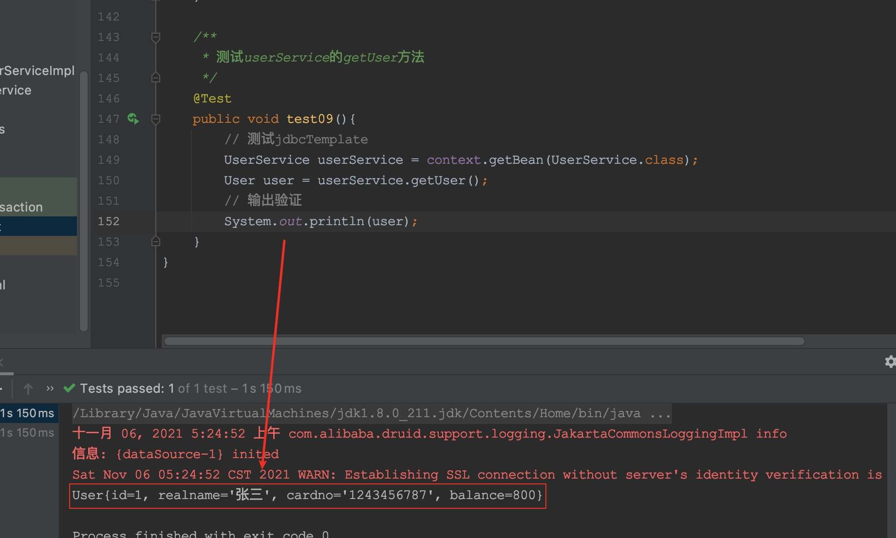

### 事务的4大特性（ACID）

#### A原子性

多个业务的操作下，归结为一个事务时，要么都成功，要么都失败

#### C一致性

事务的前后的数据要保证数据的完整性，张三转给李四100，两个在转账之前的钱总和是2000的话，转账之后的总和还是2000

#### I隔离性

在并发情况下，事务之间要相互隔离

#### D持久性

数据一旦保存就是持久性的

### 事务控制方面分类

#### 编程式事务

在代码中直接加入处理事务的逻辑，可以在需要事务的代码中显式的调用beginTransaction()、commit()、rollback()等事务管理相关的方法

connection.autoCommit(false)设置不自动提交

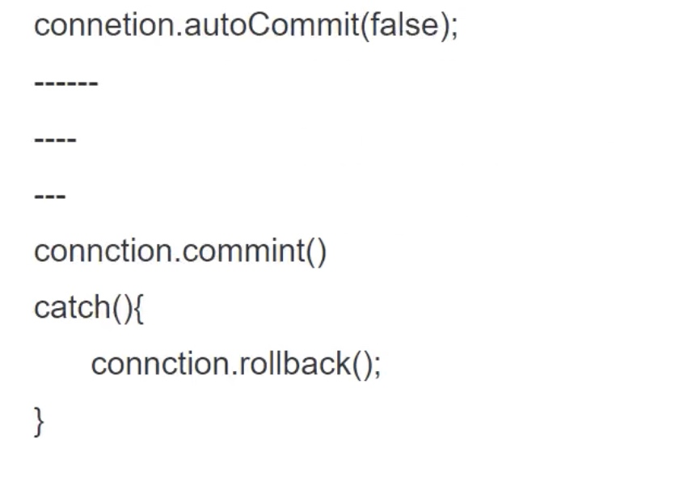

#### 声明式事务

在方法的外部添加注解或者直接在配置文件中定义，将事务管理从业务代码中分离出来，以声明的方式来实现事务管理。spring的AOP恰好可以完成此功能：**事务管理代码的固定模式作为一种横切面关注点，通过AOP的方式模块化，进而实现声明式事务**

事务的本质都是对connection进行管理的，这个不需要由我们来做，spring已经帮我们做好了

- 可以在前置通知里面开启事务
- 在后置通知里面提交事务
- 在异常通知里面回滚事务

##### 使用事务的步骤

1. 在spring.xml中配置事务管理器

```xml
<!--配置事务管理器-->
    <bean class="org.springframework.jdbc.datasource.DataSourceTransactionManager" id="transactionManager">
    <property name="dataSource" ref="dataSource"/>
</bean>
```

2. 开启事务的注解驱动

要选择来自于tx的

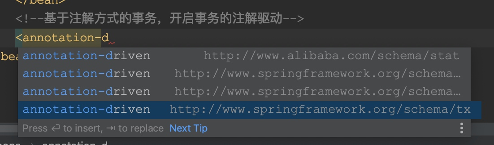

```xml
<!--基于注解方式的事务，开启事务的注解驱动-->
<tx:annotation-driven transaction-manager="transactionManager"/>
```

3. 编写张三扣钱李四加钱的转账操作

```java
//UserServiceImpl
@Service
public class UserServiceImpl implements UserService {

    @Autowired
    private UserDao userDao;

    /**
     * 转账
     */
    @Transactional
    public void trans(){
        sub();//张三扣钱

        int i=1/0;//模拟报错方法

        save();//李四加钱
    }

    /**
     * 扣钱
     */
    public void sub(){
        userDao.sub();
    }

    /**
     * 存钱
     */
    public void save() {
        userDao.save();
    }
}

//UserDao
@Repository
public class UserDaoImpl implements UserDao {
    private JdbcTemplate jdbcTemplate;

    @Autowired
    public void setDataSource(DruidDataSource dataSource){
        this.jdbcTemplate =new JdbcTemplate(dataSource);
    }

    /**
     * 张三扣钱
     */
    @Override
    public void save() {
        String sql = "update t_user set balance =balance-200 where id=1";
        jdbcTemplate.update(sql);
    }

    /**
     * 李四加钱
     */
    @Override
    public void sub() {
        String sql = "update t_user set balance =balance+200 where id=2";
        jdbcTemplate.update(sql);
    }
}
```

4. 使用@Transactional注解加在我们需要使用事务的方法前面

trans方法上添加@Transactional

```java
/**
 * 转账
 */
@Transactional
public void trans(){
    sub();//张三扣钱

    int i=1/0;//模拟报错方法

    save();//李四加钱
}
```

5. @Transactional可以标记在类上，表示当前类都运用事务，如果类和方法上面都是注解，那么会优先以方法为准

6. 一般应该放在Service层


##### 事务配置的属性

###### isolation：设置事务的隔离级别

用来解决并发事务所产生的一些问题，并发就是同一个时间多个线程同时进行请求共享变量

1. 什么时候会产生并发问题

在并发情况下，对同一个数据（共享资源|临界资源）（变量、对象）进行读写操作才会产生并发问题

2. 并发会产生什么问题

a. 脏读

读取别人未提交的事务，别人已经修改数据，但是未提交，此时，本人读取到的数据就是别人未提交的脏数据

一个事务读取另一个事务没有提交的数据，会在本事务中产生数据不一致的问题

解决办法：

设置@Transactional(ioslation=Isolation.READ_COMMITTED)，读已提交，要求Transaction01只能读取Transaction02已经提交的数据

b. 不可重复读

本人读取了数据，然后别人修改了数据并提交了数据，之后本人在读取数据，重复读取数据得到的结果不一致，但是对本人来说，这又不是脏数据，因为已经提交了。

一个事务中多次读取相同的数据，但是读取的结果不一样，会在本事务中产生数据不一致的问题

解决办法：

设置@Transactional(ioslation=Isotation.REPEATABLE_READ)，可重复读，确保Transaction01可以多次从一个字段中读取到相同的值，即Transaction01执行期间禁止其他事务对这个字段进行更新（行锁）

行锁：本人当前操作的对象是这一行，那么别人就不能对这个行进行更新，即写操作

c. 幻读

本人读取了数据，是10行并统计了所有人的某一个字段的总和，别人插入了数据，现在11行，导致前后不一致

解决办法：

设置@Transactional(isolation=Isolation.SERIALIZABLE)，表锁，串行化，确保Transaction01可以多次从一个表中读取到相同的行，在Transaction01执行期间，禁止其他事务对这个表进行添加、更新、删除操作，可以避免任何并发问题，但性能十分低下

3. 以上产生的问题以及四种隔离级别

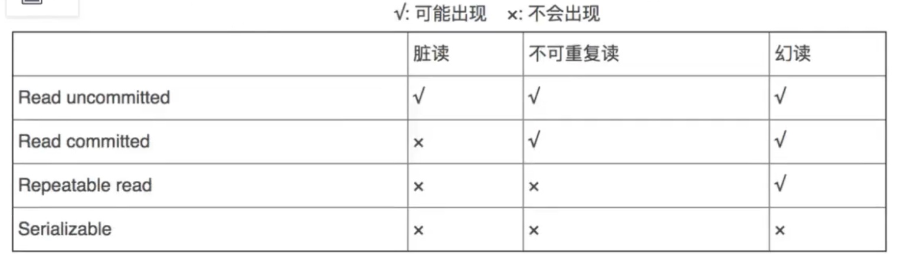


4. 查询当前数据的隔离级别

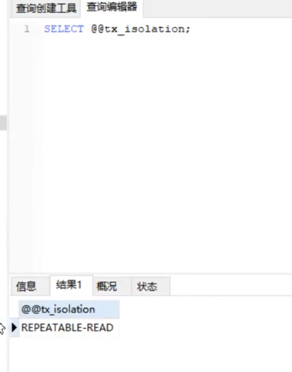

select @@tx_isolation

###### propagation：事务的传播行为

事务的传播性是指当一个事务方法被另一个事务方法调用时，这个事务应该如何进行，即一个事务套着另外一个事务的情况，比如一个Service调用另一个Service，且这两个Service中的方法都有事务
		
spring的事务传播性有7种

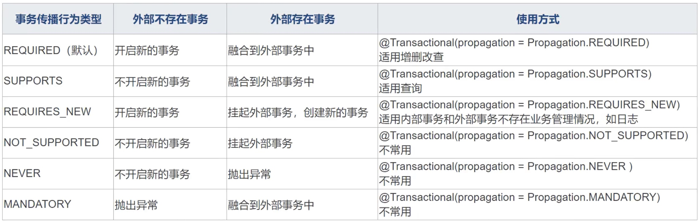

常用的传播行为

- required：默认
- supports：外部事务是增删改，内部的事务是查操作
- requires_new：外部不存在就开启新事务，外部存在事务就会挂起外部事务，创建新的事务，日志，哪怕业务失败了回滚了，日志都不应该回滚，所以内部的事务和外部的事务没有业务关联，使用这个requires_new的时候，需要保证内部事务的方法和外部事务的方法不再同一个类中。只要涉及到挂起的话，都需要在不同的类中

###### 其他的可能会用到的属性

- noRollbackFor：哪些异常事务可以不回滚
- noRollbackForClassName：填写的参数是全类名
- rollbackFor：哪些异常事务需要回滚
- rollbackForClassName：填写的参数是全类名
- readOnly：设置事务是否为只读事务
- timeout：事务超出指定执行时长后自动终止并回滚，单位是秒，超时抛出异常

### 声明式事务两个重要点

- 设置隔离级别
- 事务的传播特性

### 基于xml的事务配置

配置示例

```xml
<!--配置事务管理器-->
<bean class="org.springframework.jdbc.datasource.DataSourceTransactionManager" id="transactionManager">
    <property name="dataSource" ref="dataSource"/>
</bean>
<!--基于注解方式的事务，开启事务的注解驱动-->
<!--    <tx:annotation-driven transaction-manager="transactionManager"/>-->

<!--用于声明事务切入的所有方法-->
<aop:config>
    <aop:pointcut id="transactionCut" expression="execution(* com.ald.transaction.service.impl.*.*(..))"/>
</aop:config>

<!--用来明确切点匹配到的方法哪些方法需要使用事务-->
<tx:advice>
    <tx:attributes>
        <!--可以使用通配符-->
        <tx:method name="add*"/>
        <tx:method name="update*"/>
        <tx:method name="delete*"/>
        <!--设置只读事务，事务传播行为是SUPPORTS-->
        <tx:method name="get*" read-only="true" propagation="SUPPORTS"/>
    </tx:attributes>
</tx:advice>
```

可以和注解一起共用，如果基于注解的和xml的都配置了，会以注解的优先。
