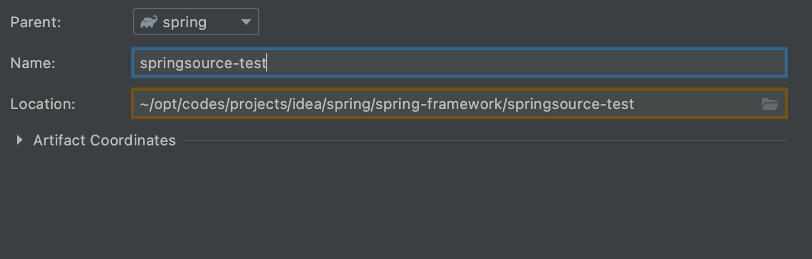

```markdown
# 课程大纲
1. spring源码整体脉络介绍及源码编译
2. springIOC的源码深入学习
	- IOC容器加载过程-Bean的生命周期源码深度剖析
	- 循环依赖的终极讲解
	- 内置后置PostProcess处理器深度讲解
	- 监听器原理学习-Listener
3. springAOP的源码深入学习
	- 概念：AOP、AspectJ、Spring AOP的前世今生
	- 源码：加载切面、创建代理、调用代理
4. Spring声明式事务源码深入学习
	- 源码：加载切面、创建代理、调用代理

# 课程内容
1. spring源码的学习介绍
2. spring源码的整体脉络梳理
3. 什么是BeanFactroy
4. BeanFactory和ApplicationContext的区别
5. 图述SpringIOC的加载过程
6. 图述Bean的生命周期
7. spring源码编译过程演示
```

## 整体脉络介绍和编译

### 介绍

spring体系架构（基于4.x），我们所讲的源码在体系中的位置


核心容器

- Beans 对bean的维护管理，创建等
- Core 核心工具，BeanUtils等
- Context 上下文、事件、多语言、国际化等
- SpEL EL表达式

AOP 切面

Aspects spring的AOP不是自家的产品，只是引用Aspects的一些注解和切面表达式

### 整体脉络

```markdown
# IOC是控制反转，是一种设计理念，用来解决层层之间或者类类之间的耦合问题
之前是通过组合或者继承的方式调用需要引用的类，加入有一天需要将被引用的类改变成其他的类，此时就需要修改很多的引用的类中的对象，改动的地方非常的多，所以我们对代码的变更越少越好
所以我们引入控制反转的思想，spring使用DI（自动注入）的方式实现了IOC（控制反转），实现解耦和集中管理我们的对象
```

springIOC加载流程图


```markdown
# 在开发中，如何实现将我们的Bean交给spring管理呢？
1. 配置类、或者xml的方式 @注解 javaconfig
2. 加载spring上下文
- xml:ClassPathXmlApplicationContext("xml")
- 注解：AnnotationConfigApplicationContext(Config.class)
3. getBean(xxx)获取我们的Bean
```

```markdown
# 我们的配置生成Bean最核心的类是：BeanFactory，是spring顶层核心接口，使用了简单工厂模式，根据一个名字去生产不同的实例，负责生产不同的Bean
当我们调用getBean的时候
@Override
public Object getBean(String name) throws BeansException {
  assertBeanFactoryActive();
  return getBeanFactory().getBean(name);
}
ApplicationContext不生产Bean，只是Bean的搬运工，是BeanFactory工厂生产的
```

```markdown
# spring不同的配置方式，读取配置的方式肯定是不同（xml、配置类、注解），不同的读取方式
# 需要读取成一个统一的东西BeanDefinition，BeanDefinition是spring顶层核心接口，封装了生产Bean的一切原料
# BeanDefinition通过BeanDefinitionResgistry存储到BeanDefinitionMap
- 配置文件xml的不同读取方式，使用策略模式读取不同的配置(Resource、ResourceLoader)
```

如果我们把spring的Bean的装配类比成装修的话，如下


BeanDefinition的加载顺序：

- BeanDefinitionScanner 负责扫描所有的配置
- BeanDefinitioReader 负责读取配置
- BeanDefinitionResgistry 将BeanDefinition存储到BeanDefinitionMap

```markdown
# 选择BeanFactory还是ApplicationContext?
应该优先使用ApplicationContext
因为ApplicationContext包括BeanFactory的所有功能，和BeanFactory相比更值得推荐，除了一些特定的场景，例如在资源受限的设备上运行的内嵌的应用
ApplicationContext拥有BeanFactory不拥有的功能：
- 生命周期管理，管理资源与资源的之间的依赖
- 自动注册BeanPostProcessor
- 自动注册BeanFactoryPostProcessor
- 便利的MessageSource访问（国际化）
- 内置ApplicationEvent发布机制
```

```markdown
# 当我们调用getBean的时候，Bean通过BeanDefinition的注册Bean的流程
1. 实例化，反射创建Bean（此时我们的Bean还是一个空壳，@Autowired注入的对象还没有装配），实例化一般有两种
	- 一种是反射
	- 一种是通过工厂方法，@Bean也是工厂方法
	反射在实例化的过程是由spring去控制的，工厂方法是自己去new的，工厂方法更加的灵活，因为在工厂方法中，我们想怎么做就怎么做
2. 填充属性（@Autowired、@Value），在填充属性的时候，会出现循环依赖的问题
3. 初始化（initMethod、destroy）
4. 将创建的Bean放置到put到Map<BeanName,value>单例池中，getBean就是从Map中获取
```

 循环依赖的问题


```markdown
# 解决循环依赖非常简单，只要让循环中断就好了，spring使用了三级缓存，说白了就是三个Map
Bean是存储到一级缓存里面
```

```markdown
# 扩展点，只有ApplicationContext才有，BeanFactory中没有
# 除了IOC，其他的实现都得用扩展点来实现，比如AOP、Transaction
1. 注册BeanDefinition的时候，可以修改它，这里有一个扩展接口，spring提供了扩展接口，让我们对BeanDefinition进行扩展，也就是BeanFactoryPostProcessor（Bean工厂的后置处理器）
2. BeanDefinitionRegistryPostProcessor，是用来注册BeanDefinition
3. BeanPostProcessor，Bean的后置处理器，会出现的几个位置：
	- 实例化的时候、之后
	- 填充属性的时候、之后
	- 初始化之前、之后
	- ...
	总共会调用九次Bean的后置处理器
```

我们可以通过实现Bean的后置处理器，达到扩展的目的，比如重写InstantiationAwareBeanPostProcessor来自己创建Bean的目的，一旦返回对应，spring就会使用我们返回的对象，不会在通过反射去创建对象


BeanFactoryPostProcessor重写方法postProrcessBeanFactory，将BeanClass修改，达到修改指定的BeanDefinition，让创建出来的对象指向我们指定的BeanClassName

```markdown
# 换图纸
```


BeanDefinitionRegistryPostProcessor重写方法postProcessBeanDefinitionRegistory，然后在方法中创建BeanDefinition并添加到BeanDefinitionRegistry的Map集合中

```markdown
# 添加图纸
```


```markdown
# 初始化其中的Aware，主要是为了能让我们感知到spring在对一些属性或者事件进行操作的时候，通知我们，这样我们就能做出对应的操作
```

```markdown
# 如果这些东西消化了，那么应该可以回答以下问题
1. 描述下BeanFactory
2. BeanFactory和ApplicationContext的区别
3. 简述springIOC的加载过程
4. 简述Bean的生命周期
5. Spring中有哪些扩展接口及调用时机
```

### 编译

```markdown
# 编译的问题
1. 网络问题，因为网络问题导致依赖下载失败
2. 开发环境配置的问题
3. 如果实在是源码不能正常的编译运行，可以通过创建spring项目，然后查看源代码的方式
```

#### 环境配置

因为spring是使用gradle搭建的，所以需要先配置gradle环境

> 参考网址：https://www.cnblogs.com/ycyzharry/p/11089016.html
>
> 测试结果
>
> 
>
> 可以将gradle的本地仓库修改成maven的本地仓库，这样就可以不用重复下载jar文件
>
> 在环境变量中配置
>
> ```bash
> export GRADLE_USER_HOME=/Users/aldencarter/opt/codes/environments/m2/repository
> ```
>
> 即可

spring项目保存在GitHub`https://github.com/spring-projects/spring-framework`，选择版本之后下载


推荐下载Release版本

> **前置工作**
>
> 如果选择自己的gradle出现错误，可以选用idea自身的gradle，idea会根据项目来选择对应的gradle
>
> 最后idea会自动编译spring源码，编译成功以后，所有的模块都会有个小小的蓝色图标，表示编译成功，至此spring源码导入完成
>
> gradle/wapper/gradle-wapper.properties中包含了项目所需要的信息
>
> 
>
> 如果需要设置阿里的镜像，可以通过修改build.gradle中的远程仓库
>
> 
>
> 

克隆spring-framework的GitHub项目到自己的GitHub仓库，这样在修改注解的之后，可以保存到自己的GitHub仓库中，根据`import-into-idea.md`的配置，导入到idea中


> **导入到idea步骤**
>
> 1. 编译compile TestJava模块
>
> 在终端中打开源码所在文件夹，输入命令（mac中需要加./）：`./gradlew :spring-oxm:compileTestJava`
>
> 显示Build Success就表示编译完成了
>
> 
>
> 使用idea打开项目
>
> 
>
> - 勾选Use auto-import
> - Use Gradle ‘Wrapper’ task ...，表示使用远程gradle版本
>

#### 编写代码测试IOC功能

创建gradle模块


名字`springsource-test`，该名字需要和spring原模块不重复



**测试配置文件方式**

1. 引入依赖

我们可以去`https://mvnrepository.com/`查找，选择gradle方式，添加到模块的`build.gradle`的`dependencies`中

```json
dependencies {
    testImplementation 'org.junit.jupiter:junit-jupiter-api:5.6.0'
    testRuntimeOnly 'org.junit.jupiter:junit-jupiter-engine'

    //引入Spring的核心容器
    compile(project(":spring-context"))
    compileOnly 'org.projectlombok:lombok:1.18.10'
    annotationProcessor 'org.projectlombok:lombok:1.18.10'
}
```

整个build.gradle

```json
plugins {
    id 'java'
}

group 'org.springframework'
version '5.2.9.RELEASE'

repositories {
    mavenCentral()
}

dependencies {
    testImplementation 'org.junit.jupiter:junit-jupiter-api:5.6.0'
    testRuntimeOnly 'org.junit.jupiter:junit-jupiter-engine'

    //引入Spring的核心容器
    compile(project(":spring-context"))
    compileOnly 'org.projectlombok:lombok:1.18.10'
    annotationProcessor 'org.projectlombok:lombok:1.18.10'
}

test {
    useJUnitPlatform()
}

//上面这个配置主要是去掉-WError, 不然warn会视为error,导致编译失败. 也可以修改springframework根目录下的build.gradle文件,把-WError去掉
configure(allprojects) { project ->
    compileJava.options*.compilerArgs =
            ["-Xlint:varargs", "-Xlint:fallthrough", "-Xlint:rawtypes",                "-Xlint:deprecation", "-Xlint:unchecked"]
}
```

2. 编写spring.xml

```xml
<?xml version="1.0" encoding="UTF-8"?>
<beans xmlns="http://www.springframework.org/schema/beans"
      xmlns:context="http://www.springframework.org/schema/context"
      xmlns:xsi="http://www.w3.org/2001/XMLSchema-instance"
      xsi:schemaLocation="http://www.springframework.org/schema/beans http://www.springframework.org/schema/beans/spring-beans.xsd
                     http://www.springframework.org/schema/context http://www.springframework.org/schema/context/spring-context-2.5.xsd">
   <context:component-scan base-package="com.ald.spring" />
</beans>
```

3. 创建User实体类

```java
@Data
@ToString
@Component
public class User {
	private String name;
}
```

4. 创建AppMain并引入测试

```java
public class AppMain {
	public static void main(String[] args) {
		ApplicationContext context = new ClassPathXmlApplicationContext("spring.xml");
		User user = context.getBean(User.class);
		System.out.println(user);
	}
}

// 或者
public class AppTest {
    @Test
    public void MyTestBeanTest() {
        BeanFactory bf = new XmlBeanFactory( new ClassPathResource("spring-config.xml"));
        MyTestBean myTestBean = (MyTestBean) bf.getBean("myTestBean");
        System.out.println(myTestBean.getName());
    }
}

// 其实直接使用BeanFactory作为容器对于Spring的使用并不多见，因为企业级应用项目中大多会使用的是ApplicationContext（后面我们会讲两者的区别，这里只是测试）
```

5. 启动测试

测试成功


**测试注解方式**

> 源码环境默认是不支持中文的，需要在VM配置中添加`-Dfile.encoding=UTF-8`将环境修改成UTF8编码
>
> 

1. 编写Person

```java
@Data
@ToString
public class User {
	private String name;
}
```

2. 编写配置

```java
@Configuration
public class MainConfig {
	@Bean
	public User user() {
		final User user = new User();
		user.setName("张三");
		return user;
	}
}
```

3. 编写测试

```java
public class AnnotationMainTest {
	public static void main(String[] args) {
		final ApplicationContext applicationContext = new AnnotationConfigApplicationContext(MainConfig.class);
		final User user = applicationContext.getBean(User.class);
		System.out.println(user);
	}
}
```

## IOC容器加载过程

```markdown
# 课程内容
1. IOC容器加载过程源码深度剖析
2. BeanFactory和FactoryBean的区别
3. Bean的生命周期源码深度剖析
4. 初识源码中的各种扩展点
5. BeanDefinition的详解
6. Spring源码编译过程演示
```

网址：https://www.processon.com/view/link/5f5075c763768959e2d109df#map


### Bean生命周期剖析

> spring中文文档：https://github.com/DocsHome/spring-docs
>
> 参考网址：https://github.com/DocsHome/spring-docs/blob/master/pages/core/IoC-container.md#context-introduction-ctx-vs-beanfactory
>
> **选择`BeanFactory`还是`ApplicationContext`?**
>
> 本节介绍`BeanFactory`和`ApplicationContext`容器级别之间的差异以及影响。
>
> 您应该使用`ApplicationContext`，除非您有充分的理由不这样做，使用`GenericApplicationContext`及其子类`AnnotationConfigApplicationContext`作为自定义引导的常见实现。 这些是Spring用于所有常见目的的核心容器的主要入口点：加载配置文件，触发类路径扫描，以编程方式注册bean定义和带注解的类，以及（从5.0开始）注册功能bean定义。
>
> 因为`ApplicationContext`包括`BeanFactory`的所有功能，和`BeanFactory`相比更值得推荐，除了一些特定的场景，例如在资源受限的设备上运行的内嵌的应用。 在`ApplicationContext`（例如`GenericApplicationContext`实现）中，按照约定（即通过bean名称或bean类型 - 特别是后处理器）检测到几种bean， 而普通的`DefaultListableBeanFactory`对任何特殊bean都是不可知的。
>
> 对于许多扩展容器功能，例如注解处理和AOP代理， [`BeanPostProcessor`扩展点是必不可少的。如果仅使用普通的`DefaultListableBeanFactory`，则默认情况下不会检测到并激活此类后置处理器。 这种情况可能令人困惑，因为您的bean配置实际上没有任何问题。 相反，在这种情况下，容器需要至少得多一些额外的处理。](https://github.com/DocsHome/spring-docs/blob/master/pages/core/IoC-container.md#beans-factory-extension-bpp)
>
> 下表列出了`BeanFactory`和`ApplicationContext`接口和实现提供的功能。
>
> Table 9.特性矩阵
>
> | Feature                              | `BeanFactory` | `ApplicationContext` |
> | ------------------------------------ | ------------- | -------------------- |
> | Bean Bean实例化/装配                 | Yes           | Yes                  |
> | 集成的生命周期管理                   | No            | Yes                  |
> | 自动注册 `BeanPostProcessor`         | No            | Yes                  |
> | 自动注册 `BeanFactoryPostProcessor`  | No            | Yes                  |
> | 便利的 `MessageSource` 访问 (国际化) | No            | Yes                  |
> | 内置`ApplicationEvent` 发布机制      | No            | Yes                  |
>
> 要使用 `DefaultListableBeanFactory`显式注册bean的后置处理器，您需要以编程方式调用 `addBeanPostProcessor`，如以下示例所示：
>
> ```
> DefaultListableBeanFactory factory = new DefaultListableBeanFactory();
> // populate the factory with bean definitions
> 
> // now register any needed BeanPostProcessor instances
> factory.addBeanPostProcessor(new AutowiredAnnotationBeanPostProcessor());
> factory.addBeanPostProcessor(new MyBeanPostProcessor());
> 
> // now start using the factory
> ```
>
> 要将`BeanFactoryPostProcessor` 应用于普通的`DefaultListableBeanFactory`，需要调用其`postProcessBeanFactory`方法，如以下示例所示：
>
> ```
> DefaultListableBeanFactory factory = new DefaultListableBeanFactory();
> XmlBeanDefinitionReader reader = new XmlBeanDefinitionReader(factory);
> reader.loadBeanDefinitions(new FileSystemResource("beans.xml"));
> 
> // bring in some property values from a Properties file
> PropertyPlaceholderConfigurer cfg = new PropertyPlaceholderConfigurer();
> cfg.setLocation(new FileSystemResource("jdbc.properties"));
> 
> // now actually do the replacement
> cfg.postProcessBeanFactory(factory);
> ```
>
> 在这两种情况下，显示注册步骤都不方便，这就是为什么各种`ApplicationContext`变体优先于Spring支持的应用程序中的普通`DefaultListableBeanFactory`， 尤其是在典型企业设置中依赖`BeanFactoryPostProcessor` 和 `BeanPostProcessor`实例来扩展容器功能时。
>
> `AnnotationConfigApplicationContext`具有注册的所有常见注解后置处理器，并且可以通过配置注解（例如`@EnableTransactionManagement`）在封面下引入其他处理器。 在Spring的基于注解的配置模型的抽象级别，bean的后置处理器的概念变成仅仅是内部容器细节。

当我们运行这一段代码的时候，spring就会去扫描我们的包，然后将配置类的一些配置扫描到IOC容器中，注册成为一个Bean，最后我们就可以拿到这个Bean去使用了

```java
public class AnnotationMainTest {
	public static void main(String[] args) {
		final ApplicationContext applicationContext = new AnnotationConfigApplicationContext(MainConfig.class);
		final User user = applicationContext.getBean(User.class);

		final ApplicationContext context = user.getContext();
		System.out.println(context == applicationContext);
		System.out.println(user);
	}
}
```

基本使用的配置有两种方式

- xml配置文件
- 配置类

这两种容器不同，基本只有在加载配置不同，Bean工厂基本相同

```java
public AnnotationConfigApplicationContext(Class<?>... componentClasses) {
  // 调用构造函数
  this();
  // 注册我们的配置类
  register(componentClasses);
  // IOC容器刷新接口
  refresh();
}
```

1. `this();`调用无参构造函数

```java
public AnnotationConfigApplicationContext() {
  /**
		 * 创建一个读取注解的Bean定义读取器
		 * 什么是Bean定义？BeanDefinition
		 *
		 * 完成了spring内部BeanDefinition的注册（主要是后置处理器）
		 * AnnotatedBeanDefinitionReader用来读取配置类
		 */
  this.reader = new AnnotatedBeanDefinitionReader(this);
  /**
		 * 创建BeanDefinition扫描器
		 *
		 * 可以用来扫描包或者类，继而转换为bd
		 *
		 * spring默认的扫描包不是这个scanner对象
		 * 而是自己new的一个ClassPathBeanDefinitionScanner
		 * spring在执行工厂后置处理器ConfigurationClassProcessor时，去扫描包时会new一个ClassPathBeanDefinitionScanner
		 *
		 * 这里的scanner仅仅是为程序员可以手动调用AnnotationConfigApplicationContext对象的scann方法
		 * `context.scann("包名")`
		 */
  this.scanner = new ClassPathBeanDefinitionScanner(this);
}
```

AnnotatedBeanDefinitionReader会注册一些内置的后置处理器

```java
public AnnotatedBeanDefinitionReader(BeanDefinitionRegistry registry, Environment environment) {
  Assert.notNull(registry, "BeanDefinitionRegistry must not be null");
  Assert.notNull(environment, "Environment must not be null");
  // 把ApplicationContext对象赋值给AnnotationBeanDefinitionReader
  this.registry = registry;
  // 用户处理条件注解 @Conditional on name
  this.conditionEvaluator = new ConditionEvaluator(registry, environment, null);
  // 注册一些内置的后置处理器
  AnnotationConfigUtils.registerAnnotationConfigProcessors(this.registry);
}
```

```markdown
# 注册一些内置的后置处理器的作用
是为了支撑我们这个AnnotationConfigurationApplicationContext所以的一些前置处理，一些创世纪的类，就跟亚当跟夏娃一样的
比如说，ConfigurationClassPostProcessor，在这个类中，会解析@Configuration的配置类，还会解析@ComponentScan、@ComponentScans注解扫描的包，以及解析@Import等注解；AutowiredAnnotationBeanPostProcessor就是解析@Autowired和@Value
```


当调用子类的无参构造函数，首先会调用父类的无参构造函数

```java
public GenericApplicationContext() {
  /**
    * 调用父类的构造函数，为ApplicationContext spring上下文对象初始BeanFactory
    * 为啥是DefaultListableBeanFactory?
    * 我们去看BeanFactory接口的时候发现DefaultListableBeanFactory是最底层的实现，功能是最全的
    */
  this.beanFactory = new DefaultListableBeanFactory();
}
```

DefaultListableBeanFactory基本可以说是功能最强大的BeanFactory


```java
public class DefaultListableBeanFactory extends AbstractAutowireCapableBeanFactory
		implements ConfigurableListableBeanFactory, BeanDefinitionRegistry, Serializable{
  // xxx
}
```

- 因为实现了BeanFactory，提供了Bean的获取
- 因为实现了BeanDefinitionRegistry，所以可以将BeanDefinition添加到Map中

```markdown
# 步骤
1. 创建BeanFactory
2. 创建BeanDefinitionReader，BeanDefinitionReader注册了很多创世纪的类，其中就包括一个很重要的类：ConfigurationClassPostProceessor，如果不注册这个，那么我们的配置类将无法解析，是通过一种扩展点的方式去解析配置类
```

2. `register(componentClasses);`注册配置类

将配置类注册成BeanDefinition

```java
// beanClass 配置类
private <T> void doRegisterBean(Class<T> beanClass, @Nullable String name,
                                @Nullable Class<? extends Annotation>[] qualifiers, @Nullable Supplier<T> supplier,
                                @Nullable BeanDefinitionCustomizer[] customizers) {

  AnnotatedGenericBeanDefinition abd = new AnnotatedGenericBeanDefinition(beanClass);
  if (this.conditionEvaluator.shouldSkip(abd.getMetadata())) {
    return;
  }

  abd.setInstanceSupplier(supplier);
  ScopeMetadata scopeMetadata = this.scopeMetadataResolver.resolveScopeMetadata(abd);
  abd.setScope(scopeMetadata.getScopeName());
  String beanName = (name != null ? name : this.beanNameGenerator.generateBeanName(abd, this.registry));

  AnnotationConfigUtils.processCommonDefinitionAnnotations(abd);
  if (qualifiers != null) {
    for (Class<? extends Annotation> qualifier : qualifiers) {
      if (Primary.class == qualifier) {
        abd.setPrimary(true);
      }
      else if (Lazy.class == qualifier) {
        abd.setLazyInit(true);
      }
      else {
        abd.addQualifier(new AutowireCandidateQualifier(qualifier));
      }
    }
  }
  if (customizers != null) {
    for (BeanDefinitionCustomizer customizer : customizers) {
      customizer.customize(abd);
    }
  }

  BeanDefinitionHolder definitionHolder = new BeanDefinitionHolder(abd, beanName);
  definitionHolder = AnnotationConfigUtils.applyScopedProxyMode(scopeMetadata, definitionHolder, this.registry);
  // 注册 最终会调用DefaultListableBeanFactory中的registerBeanDefinition方法去注册
  // DefaultDefinitionBeanFactory维护着一系列信息，比如beanDefinitionNames、beanDefinitionMap
  // beanDefinitionNames 是一个List<String>，用来保存beanName
  // beanDefinitionMap 是一个Map，用来保存beanName和beanDefinition
  BeanDefinitionReaderUtils.registerBeanDefinition(definitionHolder, this.registry);
}
```

3. `refresh();`刷新容器

https://www.processon.com/view/link/5f18298a7d9c0835d38a57c0

refresh是IOC中最重要的一个函数，体现了Bean的生命周期

```java
/**
 * 体现了IOC的整个生命周期
 * @throws BeansException
 * @throws IllegalStateException
 */
@Override
public void refresh() throws BeansException, IllegalStateException {
  synchronized (this.startupShutdownMonitor) {
    // Prepare this context for refreshing.
    // 1、准备上下文
    prepareRefresh();

    // Tell the subclass to refresh the internal bean factory.
    // 2、获取告诉子类初始化bean工厂
    // xml方式的配置是在这里解析的
    ConfigurableListableBeanFactory beanFactory = obtainFreshBeanFactory();

    // Prepare the bean factory for use in this context.
    // 3、对bean工厂进行填充属性
    prepareBeanFactory(beanFactory);

    try {
      // Allows post-processing of the bean factory in context subclasses.
      // 4、留个子类去实现该接口
      postProcessBeanFactory(beanFactory);

      // Invoke factory processors registered as beans in the context.
      // 调用我们的bean工厂的后置处理器，1将class扫描成bean定义 2bean工厂的后置处理器调用
      invokeBeanFactoryPostProcessors(beanFactory);

      // Register bean processors that intercept bean creation.
      // 注册我们bean的后置处理器
      registerBeanPostProcessors(beanFactory);

      // Initialize message source for this context.
      // 初始化国际化资源处理器
      initMessageSource();

      // Initialize event multicaster for this context.
      // 创建事件多插器
      initApplicationEventMulticaster();

      // Initialize other special beans in specific context subclasses.
      // 这个方法同样也是留个子类实现的springboot也是从这个方法进行启动Tomcat的
      onRefresh();

      // Check for listener beans and register them.
      // 把我们的事件监听器注册到多插器上
      registerListeners();

      // Instantiate all remaining (non-lazy-init) singletons.
      // 实例化我们剩余的单实例bean
      finishBeanFactoryInitialization(beanFactory);

      // Last step: publish corresponding event.
      // 最后容器刷新 发布刷新事件（spring cloud也是从这里启动的）
      finishRefresh();
    }

    catch (BeansException ex) {
      if (logger.isWarnEnabled()) {
        logger.warn("Exception encountered during context initialization - " +
                    "cancelling refresh attempt: " + ex);
      }

      // Destroy already created singletons to avoid dangling resources.
      destroyBeans();

      // Reset 'active' flag.
      cancelRefresh(ex);

      // Propagate exception to caller.
      throw ex;
    }

    finally {
      // Reset common introspection caches in Spring's core, since we
      // might not ever need metadata for singleton beans anymore...
      resetCommonCaches();
    }
  }
}
```

obtainFreshBeanFactory函数

```java
protected ConfigurableListableBeanFactory obtainFreshBeanFactory() {
  /**
		 * xml加载spring会在这里加载beanDefinition
		 * javaconfig只是刷新了beanFactory
		 */
  refreshBeanFactory();
  return getBeanFactory();
}
```

```markdown
# IOC主要涉及到的方法finishBeanFactoryInitialization(beanFactory);
实例化我们剩余的单实例bean
将我们的BeanDefinition去调用getBean生产成Bean
```

```markdown
# 先了解两个方法：invokeBeanFactoryPostProcessors(beanFactory);、finishBeanFactoryInitialization(beanFactory);
```

#### invokeBeanFactoryPostProcessors

调用我们的bean工厂的后置处理器

- 将class扫描成bean定义
- bean工厂的后置处理器调用

```markdown
# 刚才我们在new AnnotationBeanDefinitionReader的时候，创建了ConfigurationClassPostProcessor后置处理器，然后就会在invokeBeanFactoryPostProcessors方法中解析配置类
```

调试的时候，invokeBeanFactoryPostProcessors会执行的BeanFactoryPostPorcessor后置处理器，这个时候我们就可以看到我们BeanDefinition已经添加到beanDefinitionMap中了


#### finishBeanFactoryInitialization(beanFactory);

```markdown
# 将循环我们的所有的BeanDefinition，最终将我们的BeanDefinition注册成Bean
```

```java
protected void finishBeanFactoryInitialization(ConfigurableListableBeanFactory beanFactory) {
  // Initialize conversion service for this context.
  // 为我们的bean工厂创建类型转化器 Covert
  if (beanFactory.containsBean(CONVERSION_SERVICE_BEAN_NAME) &&
      beanFactory.isTypeMatch(CONVERSION_SERVICE_BEAN_NAME, ConversionService.class)) {
    beanFactory.setConversionService(
      beanFactory.getBean(CONVERSION_SERVICE_BEAN_NAME, ConversionService.class));
  }

  // Register a default embedded value resolver if no bean post-processor
  // (such as a PropertyPlaceholderConfigurer bean) registered any before:
  // at this point, primarily for resolution in annotation attribute values.
  if (!beanFactory.hasEmbeddedValueResolver()) {
    beanFactory.addEmbeddedValueResolver(strVal -> getEnvironment().resolvePlaceholders(strVal));
  }

  // Initialize LoadTimeWeaverAware beans early to allow for registering their transformers early.
  //  处理关于AspectJ
  String[] weaverAwareNames = beanFactory.getBeanNamesForType(LoadTimeWeaverAware.class, false, false);
  for (String weaverAwareName : weaverAwareNames) {
    getBean(weaverAwareName);
  }

  // Stop using the temporary ClassLoader for type matching.
  beanFactory.setTempClassLoader(null);

  // Allow for caching all bean definition metadata, not expecting further changes.
  // 冻结所有的 bean 定义 说明注册的 bean 定义将不被修改或者任何进一步的处理
  beanFactory.freezeConfiguration();

  // Instantiate all remaining (non-lazy-init) singletons.
  // 实例化剩余的单实例 bean
  beanFactory.preInstantiateSingletons();
}
```

```java
public void preInstantiateSingletons() throws BeansException {
  if (logger.isTraceEnabled()) {
    logger.trace("Pre-instantiating singletons in " + this);
  }

  // Iterate over a copy to allow for init methods which in turn register new bean definitions.
  // While this may not be part of the regular factory bootstrap, it does otherwise work fine.
  // 读取我们容器中所有的 bean 定义的名称
  List<String> beanNames = new ArrayList<>(this.beanDefinitionNames);

  // Trigger initialization of all non-lazy singleton beans...
  // 循环我们所有的 bean 定义名称
  for (String beanName : beanNames) {
    RootBeanDefinition bd = getMergedLocalBeanDefinition(beanName);
    if (!bd.isAbstract() && bd.isSingleton() && !bd.isLazyInit()) {
      // 是不是工厂 bean
      if (isFactoryBean(beanName)) {
        Object bean = getBean(FACTORY_BEAN_PREFIX + beanName);
        if (bean instanceof FactoryBean) {
          FactoryBean<?> factory = (FactoryBean<?>) bean;
          boolean isEagerInit;
          if (System.getSecurityManager() != null && factory instanceof SmartFactoryBean) {
            isEagerInit = AccessController.doPrivileged(
              (PrivilegedAction<Boolean>) ((SmartFactoryBean<?>) factory)::isEagerInit,
              getAccessControlContext());
          }
          else {
            isEagerInit = (factory instanceof SmartFactoryBean &&
                           ((SmartFactoryBean<?>) factory).isEagerInit());
          }
          if (isEagerInit) {
            getBean(beanName);
          }
        }
      }
      else {
        getBean(beanName);
      }
    }
  }

  // Trigger post-initialization callback for all applicable beans...
  for (String beanName : beanNames) {
    Object singletonInstance = getSingleton(beanName);
    if (singletonInstance instanceof SmartInitializingSingleton) {
      SmartInitializingSingleton smartSingleton = (SmartInitializingSingleton) singletonInstance;
      if (System.getSecurityManager() != null) {
        AccessController.doPrivileged((PrivilegedAction<Object>) () -> {
          smartSingleton.afterSingletonsInstantiated();
          return null;
        }, getAccessControlContext());
      }
      else {
        smartSingleton.afterSingletonsInstantiated();
      }
    }
  }
}
```

getBean调用doGetBean方法

```java
protected <T> T doGetBean(
			String name, @Nullable Class<T> requiredType, @Nullable Object[] args, boolean typeCheckOnly)
			throws BeansException {

  /**
		 * 在这里 传入进来的name 可能是别名，也有可能是工厂bean的name，所以在这里需要转换
		 */
  String beanName = transformedBeanName(name);
  Object bean;

  // Eagerly check singleton cache for manually registered singletons.
  /**
		 * /*
		 * 如果 sharedInstance 是普通的单例 bean，下面的方法会直接返回。但如果
		 * sharedInstance 是 FactoryBean 类型的，则需调用 getObject 工厂方法获取真正的
		 * bean 实例。如果用户想获取 FactoryBean 本身，这里也不会做特别的处理，直接返回
		 * 即可。毕竟 FactoryBean 的实现类本身也是一种 bean，只不过具有一点特殊的功能而已。
		 */
  Object sharedInstance = getSingleton(beanName);
  if (sharedInstance != null && args == null) {
    if (logger.isTraceEnabled()) {
      if (isSingletonCurrentlyInCreation(beanName)) {
        logger.trace("Returning eagerly cached instance of singleton bean '" + beanName +
                     "' that is not fully initialized yet - a consequence of a circular reference");
      }
      else {
        logger.trace("Returning cached instance of singleton bean '" + beanName + "'");
      }
    }
    bean = getObjectForBeanInstance(sharedInstance, name, beanName, null);
  }

  else {
    // Fail if we're already creating this bean instance:
    // We're assumably within a circular reference.
    /**
			 * spring 只能解决单例对象的setter注入的循环依赖，不能解决构造器注入
			 * 判断是否是单例Bean，如果是多例的bean就会抛出异常
			 */
    if (isPrototypeCurrentlyInCreation(beanName)) {
      throw new BeanCurrentlyInCreationException(beanName);
    }

    // Check if bean definition exists in this factory.
    /**
			 * 判断AbstractBeanFacotry工厂是否有父工厂(一般情况下是没有父工厂因为abstractBeanFactory直接是抽象类,不存在父工厂)
			 * 一般情况下,只有Spring 和SpringMvc整合的时才会有父子容器的概念,
			 * 比如我们的Controller中注入Service的时候，发现我们依赖的是一个引用对象，那么他就会调用getBean去把service找出来
			 * 但是当前所在的容器是web子容器，那么就会在这里的 先去父容器找
			 */
    BeanFactory parentBeanFactory = getParentBeanFactory();
    // 若存在父工厂，且当前的bean工厂不存在当前的bean定义，那么bean定义是存在与父容器中
    if (parentBeanFactory != null && !containsBeanDefinition(beanName)) {
      // Not found -> check parent.
      // 获取bean的原始名称
      String nameToLookup = originalBeanName(name);
      // 若为abstractBeanFactory类型，委托父类处理
      if (parentBeanFactory instanceof AbstractBeanFactory) {
        return ((AbstractBeanFactory) parentBeanFactory).doGetBean(
          nameToLookup, requiredType, args, typeCheckOnly);
      }
      else if (args != null) {
        // Delegation to parent with explicit args.
        // 委托给构造函数 getBean()处理
        return (T) parentBeanFactory.getBean(nameToLookup, args);
      }
      else if (requiredType != null) {
        // No args -> delegate to standard getBean method.
        return parentBeanFactory.getBean(nameToLookup, requiredType);
      }
      else {
        return (T) parentBeanFactory.getBean(nameToLookup);
      }
    }

    /**
			 * 方法参数 typeCheckOnly ，是用来判断调用 #getBean(...) 方法时，表示是否为仅仅进行类型检查获取 Bean 对象
			 * 如果不是仅仅做类型检查，而是创建 Bean 对象，则需要调用 #markBeanAsCreated(String beanName) 方法，进行记录
			 */
    if (!typeCheckOnly) {
      markBeanAsCreated(beanName);
    }

    try {
      /**
				 * 从容器中获取 beanName 相应的 GenericBeanDefinition 对象，并将其转换为 RootBeanDefinition 对象
				 *   <bean id="tulingParentCompent" class="com.tuling.testparentsonbean.TulingParentCompent" abstract="true">
				 <property name="tulingCompent" ref="tulingCompent"></property>
				 </bean>
				 <bean id="tulingSonCompent" class="com.tuling.testparentsonbean.TulingSonCompent" parent="tulingParentCompent"></bean>
				 */
      RootBeanDefinition mbd = getMergedLocalBeanDefinition(beanName);
      checkMergedBeanDefinition(mbd, beanName, args);

      // Guarantee initialization of beans that the current bean depends on.
      // dependsOn 依赖bean的名称，如果是依赖于其他的，则需要先创建
      /**
				 *
				 * @Bean
				public DependsA dependsA() {
				return new DependsA();
				}

				 @Bean
				 @DependsOn(value = {"dependsA"})
				 public DependsB dependsB() {
				 return new DependsB();
				 }
				  * 处理dependsOn的依赖(这个不是我们所谓的循环依赖 而是bean创建前后的依赖)
				 */
      //依赖bean的名称
      String[] dependsOn = mbd.getDependsOn();
      if (dependsOn != null) {
        // 如果给定的依赖bean已经注册为依赖给定的bean
        // 即循环依赖的情况，抛出 BeanCreationException 异常
        for (String dep : dependsOn) {
          if (isDependent(beanName, dep)) {
            throw new BeanCreationException(mbd.getResourceDescription(), beanName,
                                            "Circular depends-on relationship between '" + beanName + "' and '" + dep + "'");
          }
          // 保存的是依赖beanName之间的映射关系：依赖beanName -> beanName的集合
          registerDependentBean(dep, beanName);
          try {
            // 获取dependOn的bean
            getBean(dep);
          }
          catch (NoSuchBeanDefinitionException ex) {
            throw new BeanCreationException(mbd.getResourceDescription(), beanName,
                                            "'" + beanName + "' depends on missing bean '" + dep + "'", ex);
          }
        }
      }

      // Create bean instance.
      // 创建单例Bean
      if (mbd.isSingleton()) {
        // 把beanName和一个singletonFactory 并且传入一个回调对象用于回调
        // 把我们的bean标记成正在创建，防止循环依赖
        sharedInstance = getSingleton(beanName, () -> {
          try {
            // 进入创建Bean的逻辑
            return createBean(beanName, mbd, args);
          }
          catch (BeansException ex) {
            // Explicitly remove instance from singleton cache: It might have been put there
            // eagerly by the creation process, to allow for circular reference resolution.
            // Also remove any beans that received a temporary reference to the bean.
            // 创建bean的过程中发生异常，需要销毁关于当前bean的所有信息
            destroySingleton(beanName);
            throw ex;
          }
        });
        bean = getObjectForBeanInstance(sharedInstance, name, beanName, mbd);
      }

      else if (mbd.isPrototype()) {
        // It's a prototype -> create a new instance.
        Object prototypeInstance = null;
        try {
          beforePrototypeCreation(beanName);
          prototypeInstance = createBean(beanName, mbd, args);
        }
        finally {
          afterPrototypeCreation(beanName);
        }
        bean = getObjectForBeanInstance(prototypeInstance, name, beanName, mbd);
      }

      else {
        String scopeName = mbd.getScope();
        if (!StringUtils.hasLength(scopeName)) {
          throw new IllegalStateException("No scope name defined for bean ´" + beanName + "'");
        }
        Scope scope = this.scopes.get(scopeName);
        if (scope == null) {
          throw new IllegalStateException("No Scope registered for scope name '" + scopeName + "'");
        }
        try {
          Object scopedInstance = scope.get(beanName, () -> {
            beforePrototypeCreation(beanName);
            try {
              return createBean(beanName, mbd, args);
            }
            finally {
              afterPrototypeCreation(beanName);
            }
          });
          bean = getObjectForBeanInstance(scopedInstance, name, beanName, mbd);
        }
        catch (IllegalStateException ex) {
          throw new BeanCreationException(beanName,
                                          "Scope '" + scopeName + "' is not active for the current thread; consider " +
                                          "defining a scoped proxy for this bean if you intend to refer to it from a singleton",
                                          ex);
        }
      }
    }
    catch (BeansException ex) {
      cleanupAfterBeanCreationFailure(beanName);
      throw ex;
    }
  }

  // Check if required type matches the type of the actual bean instance.
  if (requiredType != null && !requiredType.isInstance(bean)) {
    try {
      T convertedBean = getTypeConverter().convertIfNecessary(bean, requiredType);
      if (convertedBean == null) {
        throw new BeanNotOfRequiredTypeException(name, requiredType, bean.getClass());
      }
      return convertedBean;
    }
    catch (TypeMismatchException ex) {
      if (logger.isTraceEnabled()) {
        logger.trace("Failed to convert bean '" + name + "' to required type '" +
                     ClassUtils.getQualifiedName(requiredType) + "'", ex);
      }
      throw new BeanNotOfRequiredTypeException(name, requiredType, bean.getClass());
    }
  }
  return (T) bean;
}
```

createBean方法

```java
protected Object createBean(String beanName, RootBeanDefinition mbd, @Nullable Object[] args)
			throws BeanCreationException {

  if (logger.isTraceEnabled()) {
    logger.trace("Creating instance of bean '" + beanName + "'");
  }
  RootBeanDefinition mbdToUse = mbd;

  // Make sure bean class is actually resolved at this point, and
  // clone the bean definition in case of a dynamically resolved Class
  // which cannot be stored in the shared merged bean definition.
  Class<?> resolvedClass = resolveBeanClass(mbd, beanName);
  if (resolvedClass != null && !mbd.hasBeanClass() && mbd.getBeanClassName() != null) {
    mbdToUse = new RootBeanDefinition(mbd);
    mbdToUse.setBeanClass(resolvedClass);
  }

  // Prepare method overrides.
  try {
    mbdToUse.prepareMethodOverrides();
  }
  catch (BeanDefinitionValidationException ex) {
    throw new BeanDefinitionStoreException(mbdToUse.getResourceDescription(),
                                           beanName, "Validation of method overrides failed", ex);
  }

  try {
    // Give BeanPostProcessors a chance to return a proxy instead of the target bean instance.
    /**
			 * 第1个bean后置处理器
			 *
			 * 通过bean的后置处理器来进行后置处理生成代理对象，一般情况下在此处不会生成代理对象
			 * 为什么不能生成代理对象，不管是我们的jdk代理还是cglib代理都不会在此处进行代理，因为我们的
			 * 真实对象没有生成，所以在这里不会生成代理对象，那么在这一步是我们aop和事务的关键，因为在这里
			 * 解析我们的aop切面信息进行缓存
			 */
    Object bean = resolveBeforeInstantiation(beanName, mbdToUse);
    if (bean != null) {
      return bean;
    }
  }
  catch (Throwable ex) {
    throw new BeanCreationException(mbdToUse.getResourceDescription(), beanName,
                                    "BeanPostProcessor before instantiation of bean failed", ex);
  }

  try {
    /**
			 * 该步骤是我们真正的创建我们的bean的实例对象的过程
			 */
    Object beanInstance = doCreateBean(beanName, mbdToUse, args);
    if (logger.isTraceEnabled()) {
      logger.trace("Finished creating instance of bean '" + beanName + "'");
    }
    return beanInstance;
  }
  catch (BeanCreationException | ImplicitlyAppearedSingletonException ex) {
    // A previously detected exception with proper bean creation context already,
    // or illegal singleton state to be communicated up to DefaultSingletonBeanRegistry.
    throw ex;
  }
  catch (Throwable ex) {
    throw new BeanCreationException(
      mbdToUse.getResourceDescription(), beanName, "Unexpected exception during bean creation", ex);
  }
}
```

整体的过程


> 当我们需要使用FactoryBean的时候，需要实现FactoryBean接口
>
> ```java
> public class MyTestBean implements FactoryBean<User> {
> 	private String name = "张三";
> 
> 	public String getName() {
> 		return name;
> 	}
> 
> 	public void setName(String name) {
> 		this.name = name;
> 	}
> 
> 	@Override
> 	public User getObject() throws Exception {
> 		return new User();
> 	}
> 
> 	@Override
> 	public Class<?> getObjectType() {
> 		return User.class;
> 	}
> }
> ```
>
> 在调用getBean的时候，会根据我们getObject返回我们创建的对象，这样就可以自定义创建
>
> 像上面的代码就会返回User对象
>
> ```markdown
> # 此时如果想要得到原本MyTestBean的话，可以通过&得到
> context.getBean("&myTestBean")
> ```
>
> ```markdown
> # 这个FactoryBean有什么作用？
> 当我们集成mybatis的时候，Mapper接口，需要把接口所对应的那个实现类注册到容器当中，此时就可以通过FactoryBean得到对应的动态代理出来的实现类注入到spring IOC容器当中
> mybatis会根据接口和xml文件生成一个实现类，这个实现为了能注入到spring IOC容器当中，就可以使用FactoryBean
> ```
>
> ```markdown
> # 是FactoryBean的话，会先创建原型Bean，也就是FactoryBean的实现对象
> ```

> **实例化方式**
>
> - 反射
>   - 通过无参构造函数 默认
>   - 通过有参构造函数
> - 工厂，就是@Bean的方式
>
> 

### 内置PostProcessor后置处理器深度解析

```markdown
# 课程内容
1. BeanFactoryPostProcessor调用过程源码深度剖析
2. 配置类的解析过程源码深度剖析
3. 配置类@Configuration加与不加的区别
4. 重复beanName的覆盖规则
5. @ComponentScan的解析原理
6. BeanDefinition的详解
```

```markdown
# 注解的方式为什么比xml更加高级
注解的方式使用的是扩展点的方式解析，可以动态插拔；而xml配置是通过代码耦合在spring解析代码中
```

> **扩展：xml的方式的配置的读取、注册的过程**
>
> xml方式的配置读取，主要是在refresh的第二个步骤
>
> ```java
> // 2、获取告诉子类初始化bean工厂
> // xml方式的配置是在这里解析的
> ConfigurableListableBeanFactory beanFactory = obtainFreshBeanFactory();
> ```
>
> ```java
> protected ConfigurableListableBeanFactory obtainFreshBeanFactory() {
>   /**
> 		 * xml加载spring会在这里加载beanDefinition
> 		 * javaconfig只是刷新了beanFactory
> 		 */
>   refreshBeanFactory();
>   return getBeanFactory();
> }
> ```
>
> xml方式的refreshBeanFactory实现是AbstractRefreshableApplicationContext
>
> ```java
> protected final void refreshBeanFactory() throws BeansException {
>   // 若已经存在了，就执行销毁等操作
>   if (hasBeanFactory()) {
>     destroyBeans();
>     closeBeanFactory();
>   }
>   try {
>     /**
> 			 * 为我们的spring应用上下文对象创建我们的beanFactory
> 			 * DefaultListableBeanFactory 是 BeanFactory 的子类，这个是功能最强大的，实现了 BeanFactory 和 BeanDefinitionRegistry
> 			 * BeanFactory Bean 工厂
> 			 * BeanDefinitionRegistry Bean 的配置（图纸）
> 			 */
>     DefaultListableBeanFactory beanFactory = createBeanFactory();
>     // 为容器创建序列化ID
>     beanFactory.setSerializationId(getId());
>     customizeBeanFactory(beanFactory);
>     // 加载我们的 bean 定义（图纸），把 beanFactory 传进去，因为 beanFactory 实现了 BeanDefinitionRegistry接口
>     /**
> 			 * 通过不同方式加载 beanDefinition：
> 			 * AbstractXmlApplicationContext：xml 解析
> 			 * AnnotationConfigWebApplicationContext：注解解析
> 			 * GroovyWebApplicationContext
> 			 * XmlWebApplicationContext
> 			 */
>     loadBeanDefinitions(beanFactory);
>     this.beanFactory = beanFactory;
>   }
>   catch (IOException ex) {
>     throw new ApplicationContextException("I/O error parsing bean definition source for " + getDisplayName(), ex);
>   }
> }
> ```
>
> AbstractXmlApplicationContext是xml解析的实现
>
> ```java
> protected void loadBeanDefinitions(DefaultListableBeanFactory beanFactory) throws BeansException, IOException {
>   // Create a new XmlBeanDefinitionReader for the given BeanFactory.
>   // 读取配置直接耦合在代码中
>   XmlBeanDefinitionReader beanDefinitionReader = new XmlBeanDefinitionReader(beanFactory);
> 
>   // Configure the bean definition reader with this context's
>   // resource loading environment.
>   beanDefinitionReader.setEnvironment(this.getEnvironment());
>   beanDefinitionReader.setResourceLoader(this);
>   beanDefinitionReader.setEntityResolver(new ResourceEntityResolver(this));
> 
>   // Allow a subclass to provide custom initialization of the reader,
>   // then proceed with actually loading the bean definitions.
>   initBeanDefinitionReader(beanDefinitionReader);
>   loadBeanDefinitions(beanDefinitionReader); // 根据读取器 XmlBeanDefinitionReader 加载 bean 定义
> }
> ```
>
> ```java
> protected void loadBeanDefinitions(XmlBeanDefinitionReader reader) throws BeansException, IOException {
>   Resource[] configResources = getConfigResources();
>   if (configResources != null) { // 通过读取器开始加载
>     reader.loadBeanDefinitions(configResources);
>   }
>   String[] configLocations = getConfigLocations();
>   if (configLocations != null) { // 获得 xml 路径 通过读取器开始加载
>     reader.loadBeanDefinitions(configLocations);
>   }
> }
> ```
>
> ```java
> public int loadBeanDefinitions(Resource... resources) throws BeanDefinitionStoreException {
>   Assert.notNull(resources, "Resource array must not be null");
>   int count = 0;
>   for (Resource resource : resources) {
>     count += loadBeanDefinitions(resource);
>   }
>   return count;
> }
> ```
>
> ```java
> public int loadBeanDefinitions(String... locations) throws BeanDefinitionStoreException {
>   Assert.notNull(locations, "Location array must not be null");
>   int count = 0;
>   /**
> 		 * 因为 xml 的路径是多个的，所以需要通过循环去添加
> 		 */
>   for (String location : locations) {
>     count += loadBeanDefinitions(location);
>   }
>   return count;
> }
> ```
>
> ```java
> public int loadBeanDefinitions(EncodedResource encodedResource) throws BeanDefinitionStoreException {
>   Assert.notNull(encodedResource, "EncodedResource must not be null");
>   if (logger.isTraceEnabled()) {
>     logger.trace("Loading XML bean definitions from " + encodedResource);
>   }
> 
>   Set<EncodedResource> currentResources = this.resourcesCurrentlyBeingLoaded.get();
> 
>   if (!currentResources.add(encodedResource)) {
>     throw new BeanDefinitionStoreException(
>       "Detected cyclic loading of " + encodedResource + " - check your import definitions!");
>   }
> 
>   try (InputStream inputStream = encodedResource.getResource().getInputStream()) {
>     InputSource inputSource = new InputSource(inputStream);
>     if (encodedResource.getEncoding() != null) {
>       inputSource.setEncoding(encodedResource.getEncoding());
>     }
>     return doLoadBeanDefinitions(inputSource, encodedResource.getResource());
>   }
>   catch (IOException ex) {
>     throw new BeanDefinitionStoreException(
>       "IOException parsing XML document from " + encodedResource.getResource(), ex);
>   }
>   finally {
>     currentResources.remove(encodedResource);
>     if (currentResources.isEmpty()) {
>       this.resourcesCurrentlyBeingLoaded.remove();
>     }
>   }
> }
> ```
>
> 读取成Document对象，并注册BeanDefinition
>
> ```java
> protected int doLoadBeanDefinitions(InputSource inputSource, Resource resource)
> 			throws BeanDefinitionStoreException {
> 
>   try {
>     // 读取成document
>     Document doc = doLoadDocument(inputSource, resource);
>     // 通过读取到的Document对象注册BeanDefinition
>     int count = registerBeanDefinitions(doc, resource);
>     if (logger.isDebugEnabled()) {
>       logger.debug("Loaded " + count + " bean definitions from " + resource);
>     }
>     return count;
>   }
>   catch (BeanDefinitionStoreException ex) {
>     throw ex;
>   }
>   catch (SAXParseException ex) {
>     throw new XmlBeanDefinitionStoreException(resource.getDescription(),
>                                               "Line " + ex.getLineNumber() + " in XML document from " + resource + " is invalid", ex);
>   }
>   catch (SAXException ex) {
>     throw new XmlBeanDefinitionStoreException(resource.getDescription(),
>                                               "XML document from " + resource + " is invalid", ex);
>   }
>   catch (ParserConfigurationException ex) {
>     throw new BeanDefinitionStoreException(resource.getDescription(),
>                                            "Parser configuration exception parsing XML from " + resource, ex);
>   }
>   catch (IOException ex) {
>     throw new BeanDefinitionStoreException(resource.getDescription(),
>                                            "IOException parsing XML document from " + resource, ex);
>   }
>   catch (Throwable ex) {
>     throw new BeanDefinitionStoreException(resource.getDescription(),
>                                            "Unexpected exception parsing XML document from " + resource, ex);
>   }
> }
> ```
>
> registerBeanDefinitions方法接着调用doRegisterBeanDefinitions
>
> ```java
> protected void doRegisterBeanDefinitions(Element root) {
>   // Any nested <beans> elements will cause recursion in this method. In
>   // order to propagate and preserve <beans> default-* attributes correctly,
>   // keep track of the current (parent) delegate, which may be null. Create
>   // the new (child) delegate with a reference to the parent for fallback purposes,
>   // then ultimately reset this.delegate back to its original (parent) reference.
>   // this behavior emulates a stack of delegates without actually necessitating one.
>   BeanDefinitionParserDelegate parent = this.delegate;
>   this.delegate = createDelegate(getReaderContext(), root, parent);
> 
>   if (this.delegate.isDefaultNamespace(root)) {
>     String profileSpec = root.getAttribute(PROFILE_ATTRIBUTE);
>     if (StringUtils.hasText(profileSpec)) {
>       String[] specifiedProfiles = StringUtils.tokenizeToStringArray(
>         profileSpec, BeanDefinitionParserDelegate.MULTI_VALUE_ATTRIBUTE_DELIMITERS);
>       // We cannot use Profiles.of(...) since profile expressions are not supported
>       // in XML config. See SPR-12458 for details.
>       if (!getReaderContext().getEnvironment().acceptsProfiles(specifiedProfiles)) {
>         if (logger.isDebugEnabled()) {
>           logger.debug("Skipped XML bean definition file due to specified profiles [" + profileSpec +
>                        "] not matching: " + getReaderContext().getResource());
>         }
>         return;
>       }
>     }
>   }
> 
>   preProcessXml(root);// 两个空方法，留给需要的人实现使用
>   parseBeanDefinitions(root, this.delegate);// 真正解析 bean 定义，通过 Document 对象
>   postProcessXml(root);// 两个空方法，留给需要的人实现使用
> 
>   this.delegate = parent;
> }
> ```
>
> ```java
> protected void parseBeanDefinitions(Element root, BeanDefinitionParserDelegate delegate) {
>   if (delegate.isDefaultNamespace(root)) {
>     NodeList nl = root.getChildNodes();
>     for (int i = 0; i < nl.getLength(); i++) {
>       Node node = nl.item(i);
>       if (node instanceof Element) {
>         Element ele = (Element) node;
>         if (delegate.isDefaultNamespace(ele)) {
>           // <xml xxxx>一类的默认节点
>           parseDefaultElement(ele, delegate);
>         }
>         else {
>           // 是spring定义的节点，比如<beans>、<bean>等
>           delegate.parseCustomElement(ele);
>         }
>       }
>     }
>   }
>   else {
>     delegate.parseCustomElement(root);
>   }
> }
> ```
>
> 是我们自定义的节点，就会接着调用delegate.parseCustomElement(ele);
>
> ```java
> public BeanDefinition parseCustomElement(Element ele, @Nullable BeanDefinition containingBd) {
>   String namespaceUri = getNamespaceURI(ele);
>   if (namespaceUri == null) {
>     return null;
>   }
>   // 根据命名空间映射到对应的那个 handler 处理类 META-INF\spring.handlers
>   NamespaceHandler handler = this.readerContext.getNamespaceHandlerResolver().resolve(namespaceUri);
>   if (handler == null) {
>     error("Unable to locate Spring NamespaceHandler for XML schema namespace [" + namespaceUri + "]", ele);
>     return null;
>   }
>   return handler.parse(ele, new ParserContext(this.readerContext, this, containingBd));
> }
> ```
>
> handler.parse会调用对应节点的解析类parse方法，比如如果命名空间是context，就会找到spring-context模块中的spring.handlers的配置
>
> 
>
> 我们点进context命名空间的Handler：`org.springframework.context.config.ContextNamespaceHandler`
>
> 可以看到不同的节点名称的解析
>
> 
>
> 进入component-scan的解析类ComponentScanBeanDefinitionParser
>
> ```java
> public BeanDefinition parse(Element element, ParserContext parserContext) {
>   String basePackage = element.getAttribute(BASE_PACKAGE_ATTRIBUTE);
>   basePackage = parserContext.getReaderContext().getEnvironment().resolvePlaceholders(basePackage);
>   String[] basePackages = StringUtils.tokenizeToStringArray(basePackage,
>                                                             ConfigurableApplicationContext.CONFIG_LOCATION_DELIMITERS);
> 
>   // Actually scan for bean definitions and register them.
>   // BeanDefinitionSacanner
>   ClassPathBeanDefinitionScanner scanner = configureScanner(parserContext, element);
>   Set<BeanDefinitionHolder> beanDefinitions = scanner.doScan(basePackages);
>   registerComponents(parserContext.getReaderContext(), beanDefinitions, element);
> 
>   return null;
> }
> ```
>
> 然后调用doScan
>
> ```java
> protected Set<BeanDefinitionHolder> doScan(String... basePackages) {
>   Assert.notEmpty(basePackages, "At least one base package must be specified");
>   // 创建 bean 定义的 holder 对象用于保存扫描后生成的 bean 定义对象
>   Set<BeanDefinitionHolder> beanDefinitions = new LinkedHashSet<>();
>   // 循环我们的包路径集合
>   for (String basePackage : basePackages) {
>     // 找到候选的 Components，之前说的接口不能被扫描进来，就是因为这里排除掉接口
>     Set<BeanDefinition> candidates = findCandidateComponents(basePackage);
>     for (BeanDefinition candidate : candidates) {
>       ScopeMetadata scopeMetadata = this.scopeMetadataResolver.resolveScopeMetadata(candidate);
>       candidate.setScope(scopeMetadata.getScopeName());
>       // 设置我们的 beanName
>       String beanName = this.beanNameGenerator.generateBeanName(candidate, this.registry);
>       // 处理 Autowired 相关的
>       if (candidate instanceof AbstractBeanDefinition) {
>         postProcessBeanDefinition((AbstractBeanDefinition) candidate, beanName);
>       }
>       // 处理 jsr250 相关的组件
>       if (candidate instanceof AnnotatedBeanDefinition) {
>         AnnotationConfigUtils.processCommonDefinitionAnnotations((AnnotatedBeanDefinition) candidate);
>       }
>       // 把我们解析出来的组件 bean 定义注册到我们的IOC容器中
>       if (checkCandidate(beanName, candidate)) {
>         BeanDefinitionHolder definitionHolder = new BeanDefinitionHolder(candidate, beanName);
>         definitionHolder =
>           AnnotationConfigUtils.applyScopedProxyMode(scopeMetadata, definitionHolder, this.registry);
>         beanDefinitions.add(definitionHolder);
>         registerBeanDefinition(definitionHolder, this.registry);
>       }
>     }
>   }
>   return beanDefinitions;
> }
> ```

> **配置类方式的读取**
>
> 1. AnnotationConfigApplicationContext构造函数中创建了AnnotatedBeanDefinitionReader
>
> 2. 在AnnotatedBeanDefinitionReader构造函数中注册 ConfigurationClassPostProcessor后置处理器，ConfigurationClassPostProcessor就是用来解析配置类的，当然在AnnotatedBeanDefinitionReader构造函数还注册了其他的后置处理器和其他的
>
> 
>
> 3. 然后在refresh方法中invokeBeanFactoryPostProcessors(beanFactory);方法调用后置处理器
>
> ```java
> protected void invokeBeanFactoryPostProcessors(ConfigurableListableBeanFactory beanFactory) {
>   // 获取两处存储BeanFactoryPostProcessor的对象，传入供接下来的调用
>   // 参数1. 当前Bean工厂 参数2. 我们自己调用addBeanFactoryPostProcessor的自定义BeanFactoryPostProcessor
>   PostProcessorRegistrationDelegate.invokeBeanFactoryPostProcessors(beanFactory, getBeanFactoryPostProcessors());
> 
>   // Detect a LoadTimeWeaver and prepare for weaving, if found in the meantime
>   // (e.g. through an @Bean method registered by ConfigurationClassPostProcessor)
>   if (beanFactory.getTempClassLoader() == null && beanFactory.containsBean(LOAD_TIME_WEAVER_BEAN_NAME)) {
>     beanFactory.addBeanPostProcessor(new LoadTimeWeaverAwareProcessor(beanFactory));
>     beanFactory.setTempClassLoader(new ContextTypeMatchClassLoader(beanFactory.getBeanClassLoader()));
>   }
> }
> ```
>
> PostProcessorRegistrationDelegate.invokeBeanFactoryPostProcessors调用
>
> ```java
> public static void invokeBeanFactoryPostProcessors(
> 			ConfigurableListableBeanFactory beanFactory, List<BeanFactoryPostProcessor> beanFactoryPostProcessors) {
> 
>   //调用BeanDefinitionRegistryPostProcessor的后置处理器 Begin
>   // 定义已处理的后置处理器
>   Set<String> processedBeans = new HashSet<>();
> 
>   //判断我们的beanFactory实现了BeanDefinitionRegistry(实现了该结构就有注册和获取Bean定义的能力）
>   if (beanFactory instanceof BeanDefinitionRegistry) {
>     //强行把我们的bean工厂转为BeanDefinitionRegistry，因为待会需要注册Bean定义
>     BeanDefinitionRegistry registry = (BeanDefinitionRegistry) beanFactory;
>     //保存BeanFactoryPostProcessor类型的后置   BeanFactoryPostProcessor 提供修改
>     List<BeanFactoryPostProcessor> regularPostProcessors = new ArrayList<>();
>     //保存BeanDefinitionRegistryPostProcessor类型的后置处理器 BeanDefinitionRegistryPostProcessor 提供注册
>     List<BeanDefinitionRegistryPostProcessor> registryProcessors = new ArrayList<>();
> 
>     //循环我们传递进来的beanFactoryPostProcessors
>     for (BeanFactoryPostProcessor postProcessor : beanFactoryPostProcessors) {
>       //判断我们的后置处理器是不是BeanDefinitionRegistryPostProcessor
>       if (postProcessor instanceof BeanDefinitionRegistryPostProcessor) {
>         //进行强制转化
>         BeanDefinitionRegistryPostProcessor registryProcessor =
>           (BeanDefinitionRegistryPostProcessor) postProcessor;
>         //调用他作为BeanDefinitionRegistryPostProcessor的处理器的后置方法
>         registryProcessor.postProcessBeanDefinitionRegistry(registry);
>         //添加到我们用于保存的BeanDefinitionRegistryPostProcessor的集合中
>         registryProcessors.add(registryProcessor);
>       }
>       else {//若没有实现BeanDefinitionRegistryPostProcessor 接口，那么他就是BeanFactoryPostProcessor
>         //把当前的后置处理器加入到regularPostProcessors中
>         regularPostProcessors.add(postProcessor);
>       }
>     }
> 
>     //定义一个集合用户保存当前准备创建的BeanDefinitionRegistryPostProcessor
>     List<BeanDefinitionRegistryPostProcessor> currentRegistryProcessors = new ArrayList<>();
> 
>     //第一步:去容器中获取BeanDefinitionRegistryPostProcessor的bean的处理器名称
>     String[] postProcessorNames =
>       beanFactory.getBeanNamesForType(BeanDefinitionRegistryPostProcessor.class, true, false);
>     //循环筛选出来的匹配BeanDefinitionRegistryPostProcessor的类型名称
>     for (String ppName : postProcessorNames) {
>       //判断是否实现了PriorityOrdered接口的
>       if (beanFactory.isTypeMatch(ppName, PriorityOrdered.class)) {
>         //显示的调用getBean()的方式获取出该对象然后加入到currentRegistryProcessors集合中去
>         currentRegistryProcessors.add(beanFactory.getBean(ppName, BeanDefinitionRegistryPostProcessor.class));
>         //同时也加入到processedBeans集合中去
>         processedBeans.add(ppName);
>       }
>     }
>     //对currentRegistryProcessors集合中BeanDefinitionRegistryPostProcessor进行排序
>     sortPostProcessors(currentRegistryProcessors, beanFactory);
>     // 把当前的加入到总的里面去
>     registryProcessors.addAll(currentRegistryProcessors);
>     /**
> 			 * 在这里典型的BeanDefinitionRegistryPostProcessor就是ConfigurationClassPostProcessor
> 			 * 用于进行bean定义的加载 比如我们的包扫描，@import  等等。。。。。。。。。
> 			 */
>     invokeBeanDefinitionRegistryPostProcessors(currentRegistryProcessors, registry);
>     //调用完之后，马上clea掉
>     currentRegistryProcessors.clear();
>     //---------------------------------------调用内置实现PriorityOrdered接口ConfigurationClassPostProcessor完毕--优先级No1-End----------------------------------------------------------------------------------------------------------------------------
>     //去容器中获取BeanDefinitionRegistryPostProcessor的bean的处理器名称（内置的和上面注册的）
>     postProcessorNames = beanFactory.getBeanNamesForType(BeanDefinitionRegistryPostProcessor.class, true, false);
>     //循环上一步获取的BeanDefinitionRegistryPostProcessor的类型名称
>     for (String ppName : postProcessorNames) {
>       //表示没有被处理过,且实现了Ordered接口的
>       if (!processedBeans.contains(ppName) && beanFactory.isTypeMatch(ppName, Ordered.class)) {
>         //显示的调用getBean()的方式获取出该对象然后加入到currentRegistryProcessors集合中去
>         currentRegistryProcessors.add(beanFactory.getBean(ppName, BeanDefinitionRegistryPostProcessor.class));
>         //同时也加入到processedBeans集合中去
>         processedBeans.add(ppName);
>       }
>     }
>     //对currentRegistryProcessors集合中BeanDefinitionRegistryPostProcessor进行排序
>     sortPostProcessors(currentRegistryProcessors, beanFactory);
>     //把他加入到用于保存到registryProcessors中
>     registryProcessors.addAll(currentRegistryProcessors);
>     //调用他的后置处理方法
>     invokeBeanDefinitionRegistryPostProcessors(currentRegistryProcessors, registry);
>     //调用完之后，马上clea掉
>     currentRegistryProcessors.clear();
>     //-----------------------------------------调用自定义Order接口BeanDefinitionRegistryPostProcessor完毕-优先级No2-End-----------------------------------------------------------------------------------------------------------------------------
>     //调用没有实现任何优先级接口的BeanDefinitionRegistryPostProcessor
>     //定义一个重复处理的开关变量 默认值为true
>     boolean reiterate = true;
>     //第一次就可以进来
>     while (reiterate) {
>       //进入循环马上把开关变量给改为false
>       reiterate = false;
>       //去容器中获取BeanDefinitionRegistryPostProcessor的bean的处理器名称
>       postProcessorNames = beanFactory.getBeanNamesForType(BeanDefinitionRegistryPostProcessor.class, true, false);
>       //循环上一步获取的BeanDefinitionRegistryPostProcessor的类型名称
>       for (String ppName : postProcessorNames) {
>         //没有被处理过的
>         if (!processedBeans.contains(ppName)) {
>           //显示的调用getBean()的方式获取出该对象然后加入到currentRegistryProcessors集合中去
>           currentRegistryProcessors.add(beanFactory.getBean(ppName, BeanDefinitionRegistryPostProcessor.class));
>           //同时也加入到processedBeans集合中去
>           processedBeans.add(ppName);
>           //再次设置为true
>           reiterate = true;
>         }
>       }
>       //对currentRegistryProcessors集合中BeanDefinitionRegistryPostProcessor进行排序
>       sortPostProcessors(currentRegistryProcessors, beanFactory);
>       //把他加入到用于保存到registryProcessors中
>       registryProcessors.addAll(currentRegistryProcessors);
>       //调用他的后置处理方法
>       invokeBeanDefinitionRegistryPostProcessors(currentRegistryProcessors, registry);
>       //进行clear
>       currentRegistryProcessors.clear();
>     }
>     //-----------------------------------------调用没有实现任何优先级接口自定义BeanDefinitionRegistryPostProcessor完毕--End-----------------------------------------------------------------------------------------------------------------------------
>     //调用 BeanDefinitionRegistryPostProcessor.postProcessBeanFactory方法
>     invokeBeanFactoryPostProcessors(registryProcessors, beanFactory);
>     //调用BeanFactoryPostProcessor 自设的（没有）
>     invokeBeanFactoryPostProcessors(regularPostProcessors, beanFactory);
>   }
> 
>   else {
>     //若当前的beanFactory没有实现了BeanDefinitionRegistry 说明没有注册Bean定义的能力
>     // 那么就直接调用BeanDefinitionRegistryPostProcessor.postProcessBeanFactory方法
>     invokeBeanFactoryPostProcessors(beanFactoryPostProcessors, beanFactory);
>   }
> 
>   //-----------------------------------------所有BeanDefinitionRegistryPostProcessor调用完毕--End-----------------------------------------------------------------------------------------------------------------------------
> 
> 
>   //-----------------------------------------处理BeanFactoryPostProcessor --Begin-----------------------------------------------------------------------------------------------------------------------------
> 
>   //获取容器中所有的 BeanFactoryPostProcessor
>   String[] postProcessorNames =
>     beanFactory.getBeanNamesForType(BeanFactoryPostProcessor.class, true, false);
> 
>   //保存BeanFactoryPostProcessor类型实现了priorityOrdered
>   List<BeanFactoryPostProcessor> priorityOrderedPostProcessors = new ArrayList<>();
>   //保存BeanFactoryPostProcessor类型实现了Ordered接口的
>   List<String> orderedPostProcessorNames = new ArrayList<>();
>   //保存BeanFactoryPostProcessor没有实现任何优先级接口的
>   List<String> nonOrderedPostProcessorNames = new ArrayList<>();
>   for (String ppName : postProcessorNames) {
>     //processedBeans包含的话，表示在上面处理BeanDefinitionRegistryPostProcessor的时候处理过了
>     if (processedBeans.contains(ppName)) {
>       // skip - already processed in first phase above
>     }
>     //判断是否实现了PriorityOrdered 优先级最高
>     else if (beanFactory.isTypeMatch(ppName, PriorityOrdered.class)) {
>       priorityOrderedPostProcessors.add(beanFactory.getBean(ppName, BeanFactoryPostProcessor.class));
>     }
>     //判断是否实现了Ordered  优先级 其次
>     else if (beanFactory.isTypeMatch(ppName, Ordered.class)) {
>       orderedPostProcessorNames.add(ppName);
>     }
>     //没有实现任何的优先级接口的  最后调用
>     else {
>       nonOrderedPostProcessorNames.add(ppName);
>     }
>   }
>   //  排序
>   sortPostProcessors(priorityOrderedPostProcessors, beanFactory);
>   // 先调用BeanFactoryPostProcessor实现了 PriorityOrdered接口的
>   invokeBeanFactoryPostProcessors(priorityOrderedPostProcessors, beanFactory);
> 
>   //再调用BeanFactoryPostProcessor实现了 Ordered.
>   List<BeanFactoryPostProcessor> orderedPostProcessors = new ArrayList<>();
>   for (String postProcessorName : orderedPostProcessorNames) {
>     orderedPostProcessors.add(beanFactory.getBean(postProcessorName, BeanFactoryPostProcessor.class));
>   }
>   sortPostProcessors(orderedPostProcessors, beanFactory);
>   invokeBeanFactoryPostProcessors(orderedPostProcessors, beanFactory);
> 
>   //调用没有实现任何方法接口的
>   List<BeanFactoryPostProcessor> nonOrderedPostProcessors = new ArrayList<>();
>   for (String postProcessorName : nonOrderedPostProcessorNames) {
>     nonOrderedPostProcessors.add(beanFactory.getBean(postProcessorName, BeanFactoryPostProcessor.class));
>   }
>   invokeBeanFactoryPostProcessors(nonOrderedPostProcessors, beanFactory);
>   //-----------------------------------------处理BeanFactoryPostProcessor --End-----------------------------------------------------------------------------------------------------------------------------
> 
>   // Clear cached merged bean definitions since the post-processors might have
>   // modified the original metadata, e.g. replacing placeholders in values...
>   beanFactory.clearMetadataCache();
> 
>   //------------------------- BeanFactoryPostProcessor和BeanDefinitionRegistryPostProcessor调用完毕 --End-----------------------------------------------------------------------------------------------------------------------------
> 
> }
> ```
>
> 
>
> 调用ConfigurationClassPostProcessor后置处理器来解析配置，其中两个比较重要的方法
>
> ```java
> public void processConfigBeanDefinitions(BeanDefinitionRegistry registry) {
>   List<BeanDefinitionHolder> configCandidates = new ArrayList<>();
>   //获取IOC 容器中目前所有bean定义的名称
>   String[] candidateNames = registry.getBeanDefinitionNames();
> 
>   //循环我们的上一步获取的所有的bean定义信息
>   for (String beanName : candidateNames) {
>     //通过bean的名称来获取我们的bean定义对象
>     BeanDefinition beanDef = registry.getBeanDefinition(beanName);
>     //判断是否有没有解析过
>     if (ConfigurationClassUtils.isFullConfigurationClass(beanDef) ||
>         ConfigurationClassUtils.isLiteConfigurationClass(beanDef)) {
>       if (logger.isDebugEnabled()) {
>         logger.debug("Bean definition has already been processed as a configuration class: " + beanDef);
>       }
>     }
>     //进行正在的解析判断是不是完全的配置类 还是一个非正式的配置类
>     else if (ConfigurationClassUtils.checkConfigurationClassCandidate(beanDef, this.metadataReaderFactory)) {
>       //满足添加 就加入到候选的配置类集合中
>       configCandidates.add(new BeanDefinitionHolder(beanDef, beanName));
>     }
>   }
> 
>   // 若没有找到配置类 直接返回
>   if (configCandidates.isEmpty()) {
>     return;
>   }
> 
>   //对我们的配置类进行Order排序
>   configCandidates.sort((bd1, bd2) -> {
>     int i1 = ConfigurationClassUtils.getOrder(bd1.getBeanDefinition());
>     int i2 = ConfigurationClassUtils.getOrder(bd2.getBeanDefinition());
>     return Integer.compare(i1, i2);
>   });
> 
>   // 创建我们通过@CompentScan导入进来的bean name的生成器
>   // 创建我们通过@Import导入进来的bean的名称
>   SingletonBeanRegistry sbr = null;
>   if (registry instanceof SingletonBeanRegistry) {
>     sbr = (SingletonBeanRegistry) registry;
>     if (!this.localBeanNameGeneratorSet) {
>       BeanNameGenerator generator = (BeanNameGenerator) sbr.getSingleton(CONFIGURATION_BEAN_NAME_GENERATOR);
>       if (generator != null) {
>         //设置@CompentScan导入进来的bean的名称生成器(默认类首字母小写）也可以自己定义，一般不会
>         this.componentScanBeanNameGenerator = generator;
>         //设置@Import导入进来的bean的名称生成器(默认类首字母小写）也可以自己定义，一般不会
>         this.importBeanNameGenerator = generator;
>       }
>     }
>   }
> 
>   if (this.environment == null) {
>     this.environment = new StandardEnvironment();
>   }
> 
>   //创建一个配置类解析器对象
>   ConfigurationClassParser parser = new ConfigurationClassParser(
>     this.metadataReaderFactory, this.problemReporter, this.environment,
>     this.resourceLoader, this.componentScanBeanNameGenerator, registry);
> 
>   //用于保存我们的配置类BeanDefinitionHolder放入上面筛选出来的配置类
>   Set<BeanDefinitionHolder> candidates = new LinkedHashSet<>(configCandidates);
>   //用于保存我们的已经解析的配置类，长度默认为解析出来默认的配置类的集合长度
>   Set<ConfigurationClass> alreadyParsed = new HashSet<>(configCandidates.size());
>   //do while 会进行第一次解析
>   do {
>     //真正的解析我们的配置类
>     parser.parse(candidates);
>     parser.validate();
> 
>     //解析出来的配置类
>     Set<ConfigurationClass> configClasses = new LinkedHashSet<>(parser.getConfigurationClasses());
>     configClasses.removeAll(alreadyParsed);
> 
>     // Read the model and create bean definitions based on its content
>     if (this.reader == null) {
>       this.reader = new ConfigurationClassBeanDefinitionReader(
>         registry, this.sourceExtractor, this.resourceLoader, this.environment,
>         this.importBeanNameGenerator, parser.getImportRegistry());
>     }
>     // 此处才把@Bean的方法和@Import 注册到BeanDefinitionMap中
>     this.reader.loadBeanDefinitions(configClasses);
>     //加入到已经解析的集合中
>     alreadyParsed.addAll(configClasses);
> 
>     candidates.clear();
>     //判断我们ioc容器中的是不是>候选原始的bean定义的个数
>     if (registry.getBeanDefinitionCount() > candidateNames.length) {
>       //获取所有的bean定义
>       String[] newCandidateNames = registry.getBeanDefinitionNames();
>       //原始的老的候选的bean定义
>       Set<String> oldCandidateNames = new HashSet<>(Arrays.asList(candidateNames));
>       Set<String> alreadyParsedClasses = new HashSet<>();
>       //赋值已经解析的
>       for (ConfigurationClass configurationClass : alreadyParsed) {
>         alreadyParsedClasses.add(configurationClass.getMetadata().getClassName());
>       }
> 
>       for (String candidateName : newCandidateNames) {
>         //表示当前循环的还没有被解析过
>         if (!oldCandidateNames.contains(candidateName)) {
>           BeanDefinition bd = registry.getBeanDefinition(candidateName);
>           //判断有没有被解析过
>           if (ConfigurationClassUtils.checkConfigurationClassCandidate(bd, this.metadataReaderFactory) &&
>               !alreadyParsedClasses.contains(bd.getBeanClassName())) {
>             candidates.add(new BeanDefinitionHolder(bd, candidateName));
>           }
>         }
>       }
>       candidateNames = newCandidateNames;
>     }
>   }
>   //存在没有解析过的 需要循环解析
>   while (!candidates.isEmpty());
> 
>   // Register the ImportRegistry as a bean in order to support ImportAware @Configuration classes
>   if (sbr != null && !sbr.containsSingleton(IMPORT_REGISTRY_BEAN_NAME)) {
>     sbr.registerSingleton(IMPORT_REGISTRY_BEAN_NAME, parser.getImportRegistry());
>   }
> 
>   if (this.metadataReaderFactory instanceof CachingMetadataReaderFactory) {
>     // Clear cache in externally provided MetadataReaderFactory; this is a no-op
>     // for a shared cache since it'll be cleared by the ApplicationContext.
>     ((CachingMetadataReaderFactory) this.metadataReaderFactory).clearCache();
>   }
> }
> 
> /**
> 	 * Post-processes a BeanFactory in search of Configuration class BeanDefinitions;
> 	 * any candidates are then enhanced by a {@link ConfigurationClassEnhancer}.
> 	 * Candidate status is determined by BeanDefinition attribute metadata.
> 	 * @see ConfigurationClassEnhancer
> 	 */
> public void enhanceConfigurationClasses(ConfigurableListableBeanFactory beanFactory) {
>   Map<String, AbstractBeanDefinition> configBeanDefs = new LinkedHashMap<>();
>   for (String beanName : beanFactory.getBeanDefinitionNames()) {
>     BeanDefinition beanDef = beanFactory.getBeanDefinition(beanName);
>     /*
> 			 只有full版配置类才会创建cglib代理
> 			 虽然我们在指定配置的时候不标注@Configuration也行，所以加不加注解的区别就在这里
> 			 那么加了@Configuration和不加有本质上有什么区别的？
> 			 当在配置类中一个@Bean 使用方法的方式引用另一个Bean如果不加注解就会重复加载Bean
> 			 如果加了@Configuration  则会在这里创建cglib代理，当调用@Bean方法时会先检测容器中是否存在*/
>     if (ConfigurationClassUtils.isFullConfigurationClass(beanDef)) {
>       if (!(beanDef instanceof AbstractBeanDefinition)) {
>         throw new BeanDefinitionStoreException("Cannot enhance @Configuration bean definition '" +
>                                                beanName + "' since it is not stored in an AbstractBeanDefinition subclass");
>       }
>       else if (logger.isWarnEnabled() && beanFactory.containsSingleton(beanName)) {
>         logger.warn("Cannot enhance @Configuration bean definition '" + beanName +
>                     "' since its singleton instance has been created too early. The typical cause " +
>                     "is a non-static @Bean method with a BeanDefinitionRegistryPostProcessor " +
>                     "return type: Consider declaring such methods as 'static'.");
>       }
>       configBeanDefs.put(beanName, (AbstractBeanDefinition) beanDef);
>     }
>   }
>   if (configBeanDefs.isEmpty()) {
>     // nothing to enhance -> return immediately
>     return;
>   }
> 
>   ConfigurationClassEnhancer enhancer = new ConfigurationClassEnhancer();
>   for (Map.Entry<String, AbstractBeanDefinition> entry : configBeanDefs.entrySet()) {
>     AbstractBeanDefinition beanDef = entry.getValue();
>     // If a @Configuration class gets proxied, always proxy the target class
>     beanDef.setAttribute(AutoProxyUtils.PRESERVE_TARGET_CLASS_ATTRIBUTE, Boolean.TRUE);
>     try {
>       // Set enhanced subclass of the user-specified bean class
>       Class<?> configClass = beanDef.resolveBeanClass(this.beanClassLoader);
>       if (configClass != null) {
>         Class<?> enhancedClass = enhancer.enhance(configClass, this.beanClassLoader);
>         if (configClass != enhancedClass) {
>           if (logger.isDebugEnabled()) {
>             logger.debug(String.format("Replacing bean definition '%s' existing class '%s' with " +
>                                        "enhanced class '%s'", entry.getKey(), configClass.getName(), enhancedClass.getName()));
>           }
>           // 重新修改Bean定义的Class，在创建Bean的实例时将会实例cglib的类
>           beanDef.setBeanClass(enhancedClass);
>         }
>       }
>     }
>     catch (Throwable ex) {
>       throw new IllegalStateException("Cannot load configuration class: " + beanDef.getBeanClassName(), ex);
>     }
>   }
> }
> ```
>
> ```markdown
> # 只有full版配置类才会创建cglib代理
> # 虽然我们在指定配置的时候不标注@Configuration也行，所以加不加注解的区别就在这里
> # 那么加了@Configuration和不加有本质上有什么区别的？
> 当在配置类中一个@Bean 使用方法的方式引用另一个Bean如果不加注解就会重复加载Bean
> 如果加了@Configuration  则会在这里创建cglib代理，当调用@Bean方法时会先检测容器中是否存在
> ```
>
> ```java
> public class MainConfig {
> 
>     @Bean("car")
>     public Car car(){
> 
>         Car car = new Car();
>         car.setName("xushu");
>         car.setTank(tank());// 如果不去ioc 容器中拿   是不是每次都会创建新的
>         // 如果注解了@Configuration，都会先根据方法名  getBean("car")
>         return car;
>     }
> 
>     @Bean
>     public Tank tank(){
>         return new Tank();
>     }
> }
> ```
>
> 真的解析类是ConfigurationClassParser#doProcessConfigurationClass
>
> ```java
> protected final SourceClass doProcessConfigurationClass(ConfigurationClass configClass, SourceClass sourceClass)
> 			throws IOException {
> 
>   // Recursively process any member (nested) classes first
>   processMemberClasses(configClass, sourceClass);
> 
>   //处理我们的@propertySource注解的
>   for (AnnotationAttributes propertySource : AnnotationConfigUtils.attributesForRepeatable(
>     sourceClass.getMetadata(), PropertySources.class,
>     org.springframework.context.annotation.PropertySource.class)) {
>     if (this.environment instanceof ConfigurableEnvironment) {
>       processPropertySource(propertySource);
>     }
>     else {
>       logger.warn("Ignoring @PropertySource annotation on [" + sourceClass.getMetadata().getClassName() +
>                   "]. Reason: Environment must implement ConfigurableEnvironment");
>     }
>   }
> 
>   //解析我们的 @ComponentScan 注解
> 
>   //从我们的配置类上解析处ComponentScans的对象集合属性
>   Set<AnnotationAttributes> componentScans = AnnotationConfigUtils.attributesForRepeatable(
>     sourceClass.getMetadata(), ComponentScans.class, ComponentScan.class);
>   if (!componentScans.isEmpty() &&
>       !this.conditionEvaluator.shouldSkip(sourceClass.getMetadata(), ConfigurationPhase.REGISTER_BEAN)) {
>     //循环解析 我们解析出来的AnnotationAttributes
>     for (AnnotationAttributes componentScan : componentScans) {
>       //把我们扫描出来的类变为bean定义的集合 真正的解析
>       Set<BeanDefinitionHolder> scannedBeanDefinitions =
>         this.componentScanParser.parse(componentScan, sourceClass.getMetadata().getClassName());
>       //循环处理我们包扫描出来的bean定义
>       for (BeanDefinitionHolder holder : scannedBeanDefinitions) {
>         BeanDefinition bdCand = holder.getBeanDefinition().getOriginatingBeanDefinition();
>         if (bdCand == null) {
>           bdCand = holder.getBeanDefinition();
>         }
>         //判断当前扫描出来的bean定义是不是一个配置类,若是的话 直接进行递归解析
>         if (ConfigurationClassUtils.checkConfigurationClassCandidate(bdCand, this.metadataReaderFactory)) {
>           //递归解析 因为@Component算是lite配置类
>           parse(bdCand.getBeanClassName(), holder.getBeanName());
>         }
>       }
>     }
>   }
> 
>   // 处理 @Import annotations
>   processImports(configClass, sourceClass, getImports(sourceClass), true);
> 
>   // 处理 @ImportResource annotations
>   AnnotationAttributes importResource =
>     AnnotationConfigUtils.attributesFor(sourceClass.getMetadata(), ImportResource.class);
>   if (importResource != null) {
>     String[] resources = importResource.getStringArray("locations");
>     Class<? extends BeanDefinitionReader> readerClass = importResource.getClass("reader");
>     for (String resource : resources) {
>       String resolvedResource = this.environment.resolveRequiredPlaceholders(resource);
>       configClass.addImportedResource(resolvedResource, readerClass);
>     }
>   }
> 
>   // 处理 @Bean methods 获取到我们配置类中所有标注了@Bean的方法
>   Set<MethodMetadata> beanMethods = retrieveBeanMethodMetadata(sourceClass);
> 
>   for (MethodMetadata methodMetadata : beanMethods) {
>     configClass.addBeanMethod(new BeanMethod(methodMetadata, configClass));
>   }
> 
>   // 处理配置类接口 默认方法的@Bean
>   processInterfaces(configClass, sourceClass);
> 
>   // 处理配置类的父类的 ，循环再解析
>   if (sourceClass.getMetadata().hasSuperClass()) {
>     String superclass = sourceClass.getMetadata().getSuperClassName();
>     if (superclass != null && !superclass.startsWith("java") &&
>         !this.knownSuperclasses.containsKey(superclass)) {
>       this.knownSuperclasses.put(superclass, configClass);
>       // Superclass found, return its annotation metadata and recurse
>       return sourceClass.getSuperClass();
>     }
>   }
> 
>   // 没有父类解析完成
>   return null;
> }
> ```
>
> 
>
> 如果是Mybatis的话就需要重写ClassPathScanningCandidateComponentProvider的方法isCandidateComponent，因为需要将Mapper接口也扫描进来
>
> ```java
> protected boolean isCandidateComponent(AnnotatedBeanDefinition beanDefinition) {
>   AnnotationMetadata metadata = beanDefinition.getMetadata();
>   // metadata.isIndependent()=顶级类、嵌套类、静态内部类
>   // metadata.isConcrete() =非接口、非抽象类
>   // metadata.isAbstract() && metadata.hasAnnotatedMethods(Lookup.class.getName() = 抽象类并且必须方法中有@LookUp
>   return (metadata.isIndependent() && (metadata.isConcrete() ||
>                                        (metadata.isAbstract() && metadata.hasAnnotatedMethods(Lookup.class.getName()))));
> }
> ```
>
> ```markdown
> # 排除和过滤的一些细节
> 
> ```
>
> 

### 循环依赖解析

```markdown
# 课程内容
1. 手写spring循环依赖的整个过程
2. spring怎么解决循环依赖
3. 为什么要二级缓存和三级缓存
4. spring有没有解决构造函数的循环依赖
5. spring有没有解决多例下的循环依赖
```

所谓的循环依赖是指，A 依赖 B，B 又依赖 A，它们之间形成了循环依赖。或者是 A 依赖 B，B 依赖 C，C 又依赖 A。它们之间的依赖关系如下：


#### 手写spring源码到底是怎么解决的

InstanceA和InstanceB互相依赖

```java
@Component
@Scope("prototype")
public class InstanceA implements IApi {

    @Autowired
    private InstanceB instanceB;

    public InstanceB getInstanceB() {
        return instanceB;
    }

    public void setInstanceB(InstanceB instanceB) {
        this.instanceB = instanceB;
    }

    public InstanceA(InstanceB instanceB) {
        this.instanceB = instanceB;
    }


    public InstanceA() {
        System.out.println("InstanceA实例化");
    }

	@Override
	public void say() {
		System.out.println("I'm A");
	}
}

@Component
public class InstanceB  {


    @Autowired
    private InstanceA instanceA;


    public InstanceA getInstanceA() {
        return instanceA;
    }


    public void setInstanceA(InstanceA instanceA) {
        this.instanceA = instanceA;
    }

    public InstanceB(InstanceA instanceA) {
        this.instanceA = instanceA;
    }


    public InstanceB() {
        System.out.println("InstanceB实例化");
    }

}
```

按照spring的步骤，应该是

- 读取BeanDefinition并注册到BeanDefinitionRegistry
- 调用getBean创建出实例，getBean的过程大概有几个步骤
  - 实例化
  - 属性赋值
  - 初始化
  - 添加到单例池

```java
public class MyMainStart {
	// beanDefinition集合
	private static Map<String, BeanDefinition> beanDefinitionMap = new ConcurrentHashMap<>(256);

	public static void loadBeanDefinition() {
		final RootBeanDefinition beanDefinition = new RootBeanDefinition(InstanceA.class);
		final RootBeanDefinition beanDefinition1 = new RootBeanDefinition(InstanceB.class);

		beanDefinitionMap.put("instanceA", beanDefinition);
		beanDefinitionMap.put("instanceB", beanDefinition1);
	}

	public static void main(String[] args) throws Exception {
		// 加载了BeanDefinition
		loadBeanDefinition();

		// 循环创建Bean
		for (String beanName : beanDefinitionMap.keySet()) {

			// 先创建A
			getBean(beanName);
		}
	}

	// 一级缓存（单例池）
	public static Map<String, Object> singletonObjects = new ConcurrentHashMap<>();

	/**
	 * 获取Bean
	 *
	 * @param beanName
	 * @return
	 */
	public static Object getBean(String beanName) throws Exception {
		// 实例化
		final RootBeanDefinition beanDefinition = (RootBeanDefinition) beanDefinitionMap.get(beanName);
		final Class<?> beanClass = beanDefinition.getBeanClass();
		final Object instanceBean = beanClass.newInstance();// 通过无参构造函数

		// 属性赋值
		final Field[] declaredFields = beanClass.getDeclaredFields();
		for (Field declaredField : declaredFields) {
			final Autowired annotation = declaredField.getAnnotation(Autowired.class);
			if (annotation != null) {
				// 说明属性上面有Autowired注解
				declaredField.setAccessible(true); //打开属性的访问权限
				// 需要先创建出Autowired依赖的对象
				// byname bytype byconstrator三种方式
				// 这里写简单一点，通过byname的方式
				final String name = declaredField.getName();
				final Object fieldObject = getBean(name); // 拿到B的Bean
				declaredField.set(instanceBean, fieldObject);
			}
		}

		// 初始化
		// 判断当前的Bean有没有实现初始化的接口，这里关注的是循环依赖，就不写了

		// 添加到一级缓存（单例池）
		singletonObjects.put(beanName, instanceBean);

		return instanceBean;
	}
}
```

```markdown
# 上面的代码会出现什么问题呢？
循环依赖导致getBean不能退出，出现死循环
> 所以我们要加一个出口
```

假如我们加一个判定，如果一级缓存中已经存在我们依赖的Bean，那么就退出，是否还会出现问题呢？

```markdown
# 会的，因为我们一级缓存中的添加进去的bean是在循环之后加的，一级缓存并没有参与到循环终止
```

```java
public static Object getBean(String beanName) throws Exception {

  // 判定加一个出口，防止循环依赖
  final Object singleton = getSingleton(beanName);
  if (singleton != null) {
    return singleton;
  }

  // 1. A进来，单例池中没有找到，走这一步
  // 3. B进来，单例池中没有找到，走这一步
  // 实例化
  final RootBeanDefinition beanDefinition = (RootBeanDefinition) beanDefinitionMap.get(beanName);
  final Class<?> beanClass = beanDefinition.getBeanClass();
  final Object instanceBean = beanClass.newInstance();// 通过无参构造函数

  // 属性赋值
  final Field[] declaredFields = beanClass.getDeclaredFields();
  for (Field declaredField : declaredFields) {
    final Autowired annotation = declaredField.getAnnotation(Autowired.class);
    if (annotation != null) {
      // 说明属性上面有Autowired注解
      declaredField.setAccessible(true); //打开属性的访问权限
      // 需要先创建出Autowired依赖的对象
      // byname bytype byconstrator三种方式
      // 这里写简单一点，通过byname的方式
      final String name = declaredField.getName();
      // 2. A中属性依赖B，需要getBean(B)
      // 4. B中属性依赖A，需要getBean(A)
      final Object fieldObject = getBean(name); // 拿到B的Bean
      declaredField.set(instanceBean, fieldObject);
    }
  }

  // 初始化
  // 判断当前的Bean有没有实现初始化的接口，这里关注的是循环依赖，就不写了

  // 添加到一级缓存（单例池）
  singletonObjects.put(beanName, instanceBean);

  return instanceBean;
}

private static Object getSingleton(String beanName) {
  if (singletonObjects.containsKey(beanName))
    return singletonObjects.get(beanName);
  return null;
}
```

为了让一级缓存能参与到循环的判定，我们将对象放入一级缓存的代码放到依赖之前

```java
public class MyMainStart {
	// beanDefinition集合
	private static Map<String, BeanDefinition> beanDefinitionMap = new ConcurrentHashMap<>(256);

	public static void loadBeanDefinition() {
		final RootBeanDefinition beanDefinition = new RootBeanDefinition(InstanceA.class);
		final RootBeanDefinition beanDefinition1 = new RootBeanDefinition(InstanceB.class);

		beanDefinitionMap.put("instanceA", beanDefinition);
		beanDefinitionMap.put("instanceB", beanDefinition1);
	}

	public static void main(String[] args) throws Exception {
		// 加载了BeanDefinition
		loadBeanDefinition();

		// 循环创建Bean
		for (String beanName : beanDefinitionMap.keySet()) {
			getBean(beanName);
		}

		final InstanceA instanceA = (InstanceA)getBean("instanceA");
		instanceA.say();
	}

	// 一级缓存（单例池）
	public static Map<String, Object> singletonObjects = new ConcurrentHashMap<>();

	/**
	 * 获取Bean
	 *
	 * @param beanName
	 * @return
	 */
	public static Object getBean(String beanName) throws Exception {

		// 判定加一个出口，防止循环依赖
		final Object singleton = getSingleton(beanName);
		if (singleton != null) {
			return singleton;
		}

		// 1. A进来，单例池中没有找到，走这一步
		// 3. B进来，单例池中没有找到，走这一步
		// 实例化
		final RootBeanDefinition beanDefinition = (RootBeanDefinition) beanDefinitionMap.get(beanName);
		final Class<?> beanClass = beanDefinition.getBeanClass();
		final Object instanceBean = beanClass.newInstance();// 通过无参构造函数

		// 添加到一级缓存（单例池）
    // 这里提前，就可以在上面判断的时候，能找到依赖的对象
		singletonObjects.put(beanName, instanceBean);

		// 属性赋值
		final Field[] declaredFields = beanClass.getDeclaredFields();
		for (Field declaredField : declaredFields) {
			final Autowired annotation = declaredField.getAnnotation(Autowired.class);
			if (annotation != null) {
				// 说明属性上面有Autowired注解
				declaredField.setAccessible(true); //打开属性的访问权限
				// 需要先创建出Autowired依赖的对象
				// byname bytype byconstrator三种方式
				// 这里写简单一点，通过byname的方式
				final String name = declaredField.getName();
				// 2. A中属性依赖B，需要getBean(B)
				// 4. B中属性依赖A，需要getBean(A)
				final Object fieldObject = getBean(name); // 拿到B的Bean
				declaredField.set(instanceBean, fieldObject);
			}
		}

		// 初始化
		// 判断当前的Bean有没有实现初始化的接口，这里关注的是循环依赖，就不写了


		return instanceBean;
	}

	private static Object getSingleton(String beanName) {
		if (singletonObjects.containsKey(beanName))
			return singletonObjects.get(beanName);
		return null;
	}
}
```

```markdown
# 为什么一级缓存可以解决循环依赖的问题，还需要二三级缓存呢？
假如说，我们在创建bean的时候是多线程，当一个线程创建Bean A的时候，将A实例放入到一级缓存中，另外一个线程getBean(A)的时候，这个时候A是一个不完整的Bean，所以说我们是肯定要改进的
# 加入二级缓存来处理，纯净态Bean (存储不完整的Bean用于解决循环依赖中多线程读取一级缓存的脏数据)
```

只要是是在一级或者二级缓存中能找到bean，就可以

```java
public class MyMainStart {
	// beanDefinition集合
	private static Map<String, BeanDefinition> beanDefinitionMap = new ConcurrentHashMap<>(256);

	public static void loadBeanDefinition() {
		final RootBeanDefinition beanDefinition = new RootBeanDefinition(InstanceA.class);
		final RootBeanDefinition beanDefinition1 = new RootBeanDefinition(InstanceB.class);

		beanDefinitionMap.put("instanceA", beanDefinition);
		beanDefinitionMap.put("instanceB", beanDefinition1);
	}

	public static void main(String[] args) throws Exception {
		// 加载了BeanDefinition
		loadBeanDefinition();

		// 循环创建Bean
		for (String beanName : beanDefinitionMap.keySet()) {
			getBean(beanName);
		}

		final InstanceA instanceA = (InstanceA) getBean("instanceA");
		instanceA.say();
	}

	// 一级缓存（单例池）
	// 完整的Bean
	public static Map<String, Object> singletonObjects = new ConcurrentHashMap<>();

	// 二级缓存，解决多线程问题，纯净态Bean (存储不完整的Bean用于解决循环依赖中多线程读取一级缓存的脏数据)
	// 为了将成熟Bean和纯净Bean分离开来，避免读取到不完整的Bean
	// 假如说，我们在创建bean的时候是多线程，当一个线程创建Bean A的时候，将A实例放入到一级缓存中，另外一个线程getBean(A)的时候，这个时候A是一个不完整的Bean，所以说我们是肯定要改进的
	public static Map<String, Object> earlySingletonObjects = new ConcurrentHashMap<>();

	/**
	 * 获取Bean
	 *
	 * @param beanName
	 * @return
	 */
	public static Object getBean(String beanName) throws Exception {

		// 判定加一个出口，防止循环依赖
		final Object singleton = getSingleton(beanName);
		if (singleton != null) {
			return singleton;
		}

		// 1. A进来，单例池中没有找到，走这一步
		// 3. B进来，单例池中没有找到，走这一步
		// 实例化
		final RootBeanDefinition beanDefinition = (RootBeanDefinition) beanDefinitionMap.get(beanName);
		final Class<?> beanClass = beanDefinition.getBeanClass();
		final Object instanceBean = beanClass.newInstance();// 通过无参构造函数

		// 添加到二级缓存
		earlySingletonObjects.put(beanName, instanceBean);

		// 属性赋值
		final Field[] declaredFields = beanClass.getDeclaredFields();
		for (Field declaredField : declaredFields) {
			final Autowired annotation = declaredField.getAnnotation(Autowired.class);
			if (annotation != null) {
				// 说明属性上面有Autowired注解
				declaredField.setAccessible(true); //打开属性的访问权限
				// 需要先创建出Autowired依赖的对象
				// byname bytype byconstrator三种方式
				// 这里写简单一点，通过byname的方式
				final String name = declaredField.getName();
				// 2. A中属性依赖B，需要getBean(B)
				// 4. B中属性依赖A，需要getBean(A)
				final Object fieldObject = getBean(name); // 拿到B的Bean
				declaredField.set(instanceBean, fieldObject);
			}
		}

		// 初始化
		// 判断当前的Bean有没有实现初始化的接口，这里关注的是循环依赖，就不写了

		// 添加到一级缓存（单例池）
		singletonObjects.put(beanName, instanceBean);

		return instanceBean;
	}

	private static Object getSingleton(String beanName) {
		if (singletonObjects.containsKey(beanName))
			return singletonObjects.get(beanName);
		else if (earlySingletonObjects.containsKey(beanName))
			return earlySingletonObjects.get(beanName);
		return null;
	}
}
```

```markdown
# 三级缓存
假设A使用了AOP，那么就需要给A创建动态代理，需要在实例化之后创建动态代理，将A的代理类放入到spring IOC容器中

# AOP的动态代理在哪里创建？
有两个中方式，一种是在初始化之后；一种是在实例化之后，当出现循环依赖的时候，就会在实例化之后创建
# 那么怎么样，才能在出现循环依赖的时候在实例化之后创建动态代理呢？
这里就需要修改代码，可以使用一二级缓存解决AOP问题或者使用三级缓存
```

所以我们可以将代码修改成，也就是使用一二级缓存解决AOP的问题

```java
public class JdkDynimcProxy implements InvocationHandler {

	private Object target;

	public JdkDynimcProxy(Object target) {
		this.target = target;
	}

	public <T> T getProxy() {
		return (T) Proxy.newProxyInstance(target.getClass().getClassLoader(), target.getClass().getInterfaces(), this);
	}

	@Override
	public Object invoke(Object proxy, Method method, Object[] args) throws Throwable {
		System.out.println("测试");
		return method.invoke(target,args);
	}
}
```

```java
public class MyMainStart {
	// beanDefinition集合
	private static Map<String, BeanDefinition> beanDefinitionMap = new ConcurrentHashMap<>(256);

	public static void loadBeanDefinition() {
		final RootBeanDefinition beanDefinition = new RootBeanDefinition(InstanceA.class);
		final RootBeanDefinition beanDefinition1 = new RootBeanDefinition(InstanceB.class);

		beanDefinitionMap.put("instanceA", beanDefinition);
		beanDefinitionMap.put("instanceB", beanDefinition1);
	}

	public static void main(String[] args) throws Exception {
		// 加载了BeanDefinition
		loadBeanDefinition();

		//注册bean的后置处理器
		// ...

		// 循环创建Bean
		for (String beanName : beanDefinitionMap.keySet()) {
			getBean(beanName);
		}

		final InstanceA instanceA = (InstanceA) getBean("instanceA");
		instanceA.say();
	}

	// 一级缓存（单例池）
	// 完整的Bean
	public static Map<String, Object> singletonObjects = new ConcurrentHashMap<>();

	// 二级缓存，解决多线程问题
	// 为了将成熟Bean和纯净Bean分离开来，避免读取到不完整的Bean
	// 假如说，我们在创建bean的时候是多线程，当一个线程创建Bean A的时候，将A实例放入到一级缓存中，另外一个线程getBean(A)的时候，这个时候A是一个不完整的Bean，所以说我们是肯定要改进的
	public static Map<String, Object> earlySingletonObjects = new ConcurrentHashMap<>();

	// 三级缓存
	//

	/**
	 * 获取Bean
	 *
	 * @param beanName
	 * @return
	 */
	public static Object getBean(String beanName) throws Exception {

		// 判定加一个出口，防止循环依赖
		final Object singleton = getSingleton(beanName);
		if (singleton != null) {
			return singleton;
		}

		// 实例化
		final RootBeanDefinition beanDefinition = (RootBeanDefinition) beanDefinitionMap.get(beanName);
		final Class<?> beanClass = beanDefinition.getBeanClass();
		Object instanceBean = beanClass.newInstance();// 通过无参构造函数

		// 添加到二级缓存
		earlySingletonObjects.put(beanName, instanceBean);

		// 创建动态代理（耦合、BeanPostProcessor）
		// spring还是希望正常的Bean 还是在初始化后创建
		// 只在循环依赖的情况下在实例化后创建
		// 所以我们需要判断当前是不是循环依赖
		//instanceBean = new JdkProxyBeanPostProcessor().getEarlyBeanReference(instanceBean, beanName);

		// 添加到二级缓存
		earlySingletonObjects.put(beanName, instanceBean);

		// 属性赋值
		final Field[] declaredFields = beanClass.getDeclaredFields();
		for (Field declaredField : declaredFields) {
			final Autowired annotation = declaredField.getAnnotation(Autowired.class);
			if (annotation != null) {
				// 说明属性上面有Autowired注解
				declaredField.setAccessible(true); //打开属性的访问权限
				// 需要先创建出Autowired依赖的对象
				// byname bytype byconstrator三种方式
				// 这里写简单一点，通过byname的方式
				final String name = declaredField.getName();
				final Object fieldObject = getBean(name); // 拿到B的Bean
				declaredField.set(instanceBean, fieldObject);
			}
		}

		// 初始化
		// 判断当前的Bean有没有实现初始化的接口，这里关注的是循环依赖，就不写了

		// 到这里已经创建完成了
		// 正常情况下，是在初始化之后创建动态代理

		// 添加到一级缓存（单例池）
		singletonObjects.put(beanName, instanceBean);

		return instanceBean;
	}

	private static Object getSingleton(String beanName) {
		// 先从一级缓存中拿
		if (singletonObjects.containsKey(beanName))
			return singletonObjects.get(beanName);
			// 再去二级缓存中拿
		else if (earlySingletonObjects.containsKey(beanName)) {
			// 如果进入这个判定，表示一级缓存中没有，二级缓存中有，表示出现了依赖，
			// 也就是在执行getBean的过程，从头到尾出现了中断导致bean没有存到一级缓存中
			// 就说明是循环依赖
			final Object o = new JdkProxyBeanPostProcessor().getEarlyBeanReference(earlySingletonObjects.get(beanName), beanName);
			earlySingletonObjects.put(beanName, o);
			return o;
			//return earlySingletonObjects.get(beanName);
		}
		return null;
	}
}
```

```markdown
# 既然上面可以解决AOP问题，为什么还需要三级缓存呢？
当我们使用后置处理器创建动态代理的时候，如果说在getBean的时候调用后置处理器，是否觉得不是很合理，后置处理器应该是在创建Bean的过程中增强Bean的
private static Object getSingleton(String beanName) {
  // 先从一级缓存中拿
  if (singletonObjects.containsKey(beanName))
  	return singletonObjects.get(beanName);
  // 再去二级缓存中拿
  else if (earlySingletonObjects.containsKey(beanName)) {
    // 如果进入这个判定，表示一级缓存中没有，二级缓存中有，表示出现了依赖，
    // 也就是在执行getBean的过程，从头到尾出现了中断导致bean没有存到一级缓存中
    // 就说明是循环依赖
    final Object o = new JdkProxyBeanPostProcessor().getEarlyBeanReference(earlySingletonObjects.get(beanName), beanName);
    earlySingletonObjects.put(beanName, o);
    return o;
    //return earlySingletonObjects.get(beanName);
  }
  return null;
}
> 也就是说，一个方法就处理一个事情，getSingleton只处理获取Bean对象的事，而不是调用后置处理器来增强Bean
# 总结：
- 单一原则
- 解耦

# 那么我们怎么在getSingleton中判断符合出现依赖的情况的时候调用getBean中的`instanceBean = new JdkProxyBeanPostProcessor().getEarlyBeanReference(instanceBean, beanName);`代码呢?
这个时候就可以使用函数接口回调了，三级缓存就是为了保存这个函数接口的
```

```java
public class JdkProxyBeanPostProcessor implements SmartInstantiationAwareBeanPostProcessor {

	public Object getEarlyBeanReference(Object bean, String beanName) throws BeansException {

		// 假设B 被切点命中 需要创建代理
		if(bean instanceof InstanceA/*判断是不是被增强的类，是不是需要创建动态代理*/) {
			JdkDynimcProxy jdkDynimcProxy = new JdkDynimcProxy(bean);
			return  jdkDynimcProxy.getProxy();
		}
		return bean;
	}
}
```

```java
public class MyMainStart {
	// beanDefinition集合
	private static Map<String, BeanDefinition> beanDefinitionMap = new ConcurrentHashMap<>(256);

	public static void loadBeanDefinition() {
		final RootBeanDefinition beanDefinition = new RootBeanDefinition(InstanceA.class);
		final RootBeanDefinition beanDefinition1 = new RootBeanDefinition(InstanceB.class);

		beanDefinitionMap.put("instanceA", beanDefinition);
		beanDefinitionMap.put("instanceB", beanDefinition1);
	}

	public static void main(String[] args) throws Exception {
		// 加载了BeanDefinition
		loadBeanDefinition();

		//注册bean的后置处理器
		// ...

		// 循环创建Bean
		for (String beanName : beanDefinitionMap.keySet()) {
			getBean(beanName);
		}

		final InstanceA instanceA = (InstanceA) getBean("instanceA");
		instanceA.say();
	}

	// 一级缓存（单例池）
	// 完整的Bean
	public static Map<String, Object> singletonObjects = new ConcurrentHashMap<>();

	// 二级缓存，解决多线程问题
	// 为了将成熟Bean和纯净Bean分离开来，避免读取到不完整的Bean
	// 假如说，我们在创建bean的时候是多线程，当一个线程创建Bean A的时候，将A实例放入到一级缓存中，另外一个线程getBean(A)的时候，这个时候A是一个不完整的Bean，所以说我们是肯定要改进的
	public static Map<String, Object> earlySingletonObjects = new ConcurrentHashMap<>();

	// 三级缓存
	public static Map<String, ObjectFactory> singletonFactories = new ConcurrentHashMap<>();

	// 循环依赖的标识
	public static Set<String> singletonsCurrentlyInCreation = new HashSet<>();

	/**
	 * 获取Bean
	 *
	 * @param beanName
	 * @return
	 */
	public static Object getBean(String beanName) throws Exception {

		// 判定加一个出口，防止循环依赖
		final Object singleton = getSingleton(beanName);
		if (singleton != null) {
			return singleton;
		}

		// 标记正在创建
		if (singletonsCurrentlyInCreation.contains(beanName)) {
			singletonsCurrentlyInCreation.add(beanName);
		}

		// 实例化
		final RootBeanDefinition beanDefinition = (RootBeanDefinition) beanDefinitionMap.get(beanName);
		final Class<?> beanClass = beanDefinition.getBeanClass();
		Object instanceBean = beanClass.newInstance();// 通过无参构造函数

		// 添加到二级缓存
		// earlySingletonObjects.put(beanName, instanceBean);

		// 创建动态代理（耦合、BeanPostProcessor）
		// spring还是希望正常的Bean 还是在初始化后创建
		// 只在循环依赖的情况下在实例化后创建
		// 所以我们需要判断当前是不是循环依赖
		//Object o = new JdkProxyBeanPostProcessor().getEarlyBeanReference(instanceBean, beanName);
		singletonFactories.put(beanName, () -> new JdkProxyBeanPostProcessor().getEarlyBeanReference(earlySingletonObjects.get(beanName), beanName));

		// 添加到二级缓存
		// 如果使用了三级缓存，就表示是AOP了，那么这里存一个二级缓存的话，那么完全没有意义
		// 如果出现动态代理，那么二级缓存中存储就应该是动态代理出来的bean，而不是原来的bean
		// 那么怎么通过二级缓存判定是否是循环依赖呢
		//earlySingletonObjects.put(beanName, instanceBean);

		// 属性赋值
		final Field[] declaredFields = beanClass.getDeclaredFields();
		for (Field declaredField : declaredFields) {
			final Autowired annotation = declaredField.getAnnotation(Autowired.class);
			if (annotation != null) {
				// 说明属性上面有Autowired注解
				declaredField.setAccessible(true); //打开属性的访问权限
				// 需要先创建出Autowired依赖的对象
				// byname bytype byconstrator三种方式
				// 这里写简单一点，通过byname的方式
				final String name = declaredField.getName();
				final Object fieldObject = getBean(name); // 拿到B的Bean
				declaredField.set(instanceBean, fieldObject);
			}
		}

		// 初始化
		// 判断当前的Bean有没有实现初始化的接口，这里关注的是循环依赖，就不写了

		// 到这里已经创建完成了
		// 正常情况下，是在初始化之后创建动态代理

		// 假如A自己也是AOP，那么也需要动态代理
		if (earlySingletonObjects.containsKey(beanName)) {
			instanceBean = earlySingletonObjects.get(beanName);
		}
		// 添加到一级缓存（单例池）
		singletonObjects.put(beanName, instanceBean);

		// remove 二级缓存和三级缓存
		earlySingletonObjects.remove(beanName);
		singletonFactories.remove(beanName);

		return instanceBean;
	}

	private static Object getSingleton(String beanName) {
		// 先从一级缓存中拿
		final Object bean = singletonObjects.get(beanName);
		// 说明是循环依赖
		if (bean == null && singletonsCurrentlyInCreation.contains(beanName)) {
			// 如果二级缓存中存在，先从二级缓存中拿
			if (earlySingletonObjects.containsKey(beanName)) {
				return earlySingletonObjects.get(beanName);
			}

			// 从三级缓存中拿
			final ObjectFactory factory = singletonFactories.get(beanName);
			if (factory != null) {
				final Object o = factory.getObject();
				earlySingletonObjects.put(beanName, o);
				return o;
			}
		}

		return bean;
	}
}
```

这个时候我们就可以来看一下spring是如何解决循环依赖的，在refresh的finishBeanFactoryInitialization函数调用

```java
public void preInstantiateSingletons() throws BeansException {
  if (logger.isDebugEnabled()) {
    logger.debug("Pre-instantiating singletons in " + this);
  }

  //获取我们容器中所有bean定义的名称
  List<String> beanNames = new ArrayList<>(this.beanDefinitionNames);

  //循环我们所有的bean定义名称
  for (String beanName : beanNames) {
    //合并我们的bean定义，转换为统一的RootBeanDefinition类型(在)， 方便后续处理
    RootBeanDefinition bd = getMergedLocalBeanDefinition(beanName);
    /**
			 * 根据bean定义判断是不是抽象的&& 不是单例的 &&不是懒加载的
			 */
    if (!bd.isAbstract() && bd.isSingleton() && !bd.isLazyInit()) {
      //是不是工厂bean
      if (isFactoryBean(beanName)) {
        // 是factoryBean会先生成实际的bean  &beanName 是用来获取实际bean的
        Object bean = getBean(FACTORY_BEAN_PREFIX + beanName);
        if (bean instanceof FactoryBean) {
          final FactoryBean<?> factory = (FactoryBean<?>) bean;
          boolean isEagerInit;
          if (System.getSecurityManager() != null && factory instanceof SmartFactoryBean) {
            isEagerInit = AccessController.doPrivileged((PrivilegedAction<Boolean>)
                                                        ((SmartFactoryBean<?>) factory)::isEagerInit,
                                                        getAccessControlContext());
          }
          else {
            isEagerInit = (factory instanceof SmartFactoryBean &&
                           ((SmartFactoryBean<?>) factory).isEagerInit());
          }
          //调用真正的getBean的流程
          if (isEagerInit) {
            getBean(beanName);
          }
        }
      }
      else {//非工厂Bean 就是普通的bean
        getBean(beanName);
      }
    }
  }

  //或有的bean的名称 ...........到这里所有的单实例的bean已经记载到单实例bean到缓存中
  for (String beanName : beanNames) {
    //从单例缓存池中获取所有的对象
    Object singletonInstance = getSingleton(beanName);
    //判断当前的bean是否实现了SmartInitializingSingleton接口
    if (singletonInstance instanceof SmartInitializingSingleton) {
      final SmartInitializingSingleton smartSingleton = (SmartInitializingSingleton) singletonInstance;
      if (System.getSecurityManager() != null) {
        AccessController.doPrivileged((PrivilegedAction<Object>) () -> {
          smartSingleton.afterSingletonsInstantiated();
          return null;
        }, getAccessControlContext());
      }
      else {
        //触发实例化之后的方法afterSingletonsInstantiated
        smartSingleton.afterSingletonsInstantiated();
      }
    }
  }
}
```

```markdown
# 为什么三级缓存？
三级缓存存储的接口函数，给回调使用，为了解耦，和单一职责的体现
```

MainStart测试类，是教程提供的代码

```java
public class MainStart {

    public static void main(String[] args) throws Exception {

        // 已经加载循环依赖
        String beanName="com.tuling.circulardependencies.InstanceA";

        getBean(beanName);

        //ApplicationContext 已经加载spring容器

        InstanceA a= (InstanceA) getBean(beanName);

        a.say();
    }


    // 一级缓存 单例池   成熟态Bean
    private static Map<String, Object> singletonObjects = new ConcurrentHashMap<>(256);

    // 二级缓存   纯净态Bean (存储不完整的Bean用于解决循环依赖中多线程读取一级缓存的脏数据)
    // 所以当有了三级缓存后，它还一定要存在，  因为它要存储的 aop创建的动态代理对象,  不可能重复创建
    private static Map<String, Object> earlySingletonObjects = new ConcurrentHashMap<>(256);

    // 三级缓存
    private static Map<String, ObjectFactory> factoryEarlySingletonObjects = new ConcurrentHashMap<>(256);


    // 标识当前是不是循环依赖   如果正在创建并且从一级缓存中没有拿到是不是说明是依赖
    private static Set<String> singletonsCurrentlyInCreation =
            Collections.newSetFromMap(new ConcurrentHashMap<>(16));

    /**
     * 创建Bean
     * @param beanName
     * @return
     */
    private static Object getBean(String beanName) throws Exception {

        Class<?> beanClass = Class.forName(beanName);


        Object bean=getSingleton(beanName);

        if(bean!=null){
            return bean;
        }


        // 开始创建Bean

        singletonsCurrentlyInCreation.add(beanName);

        // 1.实例化
        Object beanInstanc = beanClass.newInstance();

        ObjectFactory factory= () -> {
            JdkProxyBeanPostProcessor beanPostProcessor=new JdkProxyBeanPostProcessor();
            return beanPostProcessor.getEarlyBeanReference(bean,beanName);
        };
        factoryEarlySingletonObjects.put(beanName,factory);
        //  只是循环依赖才创建动态代理？   //创建动态代理

        // Spring 为了解决 aop下面循环依赖会在这个地方创建动态代理 Proxy.newProxyInstance
        // Spring 是不会将aop的代码跟ioc写在一起
        // 不能直接将Proxy存入二级缓存中
        // 是不是所有的Bean都存在循环依赖  当存在循环依赖才去调用aop的后置处理器创建动态代理

        // 存入二级缓存
       // earlySingletonObjects.put(beanName,beanInstanc);

        // 2.属性赋值 解析Autowired
        // 拿到所有的属性名
        Field[] declaredFields = beanClass.getDeclaredFields();


        // 循环所有属性
        for (Field declaredField : declaredFields) {
            // 从属性上拿到@Autowired
            Autowired annotation = declaredField.getAnnotation(Autowired.class);

            // 说明属性上面有@Autowired
            if(annotation!=null){
                Class<?> type = declaredField.getType();

                //com.tuling.circulardependencies.InstanceB
                getBean(type.getName());
            }

        }


        // 3.初始化 (省略）
        // 创建动态代理

        // 存入到一级缓存
        singletonObjects.put(beanName,beanInstanc);
        return beanInstanc;
    }

    private  static Object getSingleton(String beanName){
        Object bean = singletonObjects.get(beanName);
        // 如果一级缓存没有拿到  是不是就说明当前是循环依赖创建
        if(bean==null && singletonsCurrentlyInCreation.contains(beanName)){
              // 调用bean的后置处理器创建动态代理


            bean=earlySingletonObjects.get(beanName);
            if(bean==null){
                ObjectFactory factory = factoryEarlySingletonObjects.get(beanName);
                factory.getObject();

            }

        }
        return bean;
    }

    private  static  Object getEarlyBeanReference(String beanName, Object bean){

        JdkProxyBeanPostProcessor beanPostProcessor=new JdkProxyBeanPostProcessor();
         return beanPostProcessor.getEarlyBeanReference(bean,beanName);
    }

}
```

> **spring有没有解决构造函数的循环依赖？**
>
> 没有，构造函数在我们的实例化的过程中，`Object beanInstanc = beanClass.newInstance();`，假如是存在构造函数的依赖，那么spring是会报错的

> **spring有没有解决多例下的循环依赖？**
>
> 多例根单例创建的区别是：多例创建是不存到缓存中的
>
> ```java
> /**
>  	* spring 只能解决单例对象的setter 注入的循环依赖,不能解决构造器注入
>  	*/
> if (isPrototypeCurrentlyInCreation(beanName)) {
>   throw new BeanCurrentlyInCreationException(beanName);
> }
> ```

### EndGame

```markdown
# 课程内容
1. spring读取不完整Bean的最终解决原理
2. 监听器原理学习-Listener
3. 内置Bean的后置处理器
4. BeanDefinition的一些玩法
```

> 解决循环依赖就是使用三级缓存，一级缓存就是存储完整的Bean，二级缓存用来存储早期的Bean，也就是纯净的Bean，没有存入引用Bean的Bean，三级缓存存储的函数接口，主要是为了解耦
>
> 二级缓存+三级缓存解决了AOP的动态代理的问题
>
> **spring读取不完整Bean的最终解决原理**
>
> 假如说spring容器完全创建完之后，通过getBean获取到的Bean那么都是完整的Bean
>
> 假如spring正在创建Bean的过程中，多线程进来进行getBean，所出现的不完整的Bean，上面虽然说可以使用二级缓存来解决多线程获取Bean不完整Bean的问题，其实还是有问题
>
> 
>
> 要解决这个问题，其实很简单，只要两个锁就可以了
>
> ```java
> public class MyMainStart {
> 	// beanDefinition集合
> 	private static Map<String, BeanDefinition> beanDefinitionMap = new ConcurrentHashMap<>(256);
> 
> 	public static void loadBeanDefinition() {
> 		final RootBeanDefinition beanDefinition = new RootBeanDefinition(InstanceA.class);
> 		final RootBeanDefinition beanDefinition1 = new RootBeanDefinition(InstanceB.class);
> 
> 		beanDefinitionMap.put("instanceA", beanDefinition);
> 		beanDefinitionMap.put("instanceB", beanDefinition1);
> 	}
> 
> 	public static void main(String[] args) throws Exception {
> 		// 加载了BeanDefinition
> 		loadBeanDefinition();
> 
> 		//注册bean的后置处理器
> 		// ...
> 
> 		// 循环创建Bean
> 		for (String beanName : beanDefinitionMap.keySet()) {
> 			getBean(beanName);
> 		}
> 
> 		final InstanceA instanceA = (InstanceA) getBean("instanceA");
> 		instanceA.say();
> 	}
> 
> 	// 一级缓存（单例池）
> 	// 完整的Bean
> 	public static Map<String, Object> singletonObjects = new ConcurrentHashMap<>();
> 
> 	// 二级缓存，解决多线程问题
> 	// 为了将成熟Bean和纯净Bean分离开来，避免读取到不完整的Bean
> 	// 假如说，我们在创建bean的时候是多线程，当一个线程创建Bean A的时候，将A实例放入到一级缓存中，另外一个线程getBean(A)的时候，这个时候A是一个不完整的Bean，所以说我们是肯定要改进的
> 	public static Map<String, Object> earlySingletonObjects = new ConcurrentHashMap<>();
> 
> 	// 三级缓存
> 	public static Map<String, ObjectFactory> singletonFactories = new ConcurrentHashMap<>();
> 
> 	// 循环依赖的标识
> 	public static Set<String> singletonsCurrentlyInCreation = new HashSet<>();
> 
> 	/**
> 	 * 获取Bean
> 	 *
> 	 * @param beanName
> 	 * @return
> 	 */
> 	public static Object getBean(String beanName) throws Exception {
> 
> 		// 判定加一个出口，防止循环依赖
> 		final Object singleton = getSingleton(beanName);
> 		if (singleton != null) {
> 			return singleton;
> 		}
> 
> 		Object instanceBean;
> 
> 		// 将整个bean的创建过程加一把锁
> 		synchronized (earlySingletonObjects) {
> 
> 			if (singletonFactories.containsKey(beanName)) {
> 				return singletonObjects.get(beanName);
> 			}
> 
> 			// 标记正在创建
> 			if (singletonsCurrentlyInCreation.contains(beanName)) {
> 				singletonsCurrentlyInCreation.add(beanName);
> 			}
> 
> 			// 实例化
> 			final RootBeanDefinition beanDefinition = (RootBeanDefinition) beanDefinitionMap.get(beanName);
> 			final Class<?> beanClass = beanDefinition.getBeanClass();
> 			instanceBean = beanClass.newInstance();// 通过无参构造函数
> 
> 			// 添加到二级缓存
> 			//earlySingletonObjects.put(beanName, instanceBean);
> 
> 			// 创建动态代理（耦合、BeanPostProcessor）
> 			// spring还是希望正常的Bean 还是在初始化后创建
> 			// 只在循环依赖的情况下在实例化后创建
> 			// 所以我们需要判断当前是不是循环依赖
> 			//Object o = new JdkProxyBeanPostProcessor().getEarlyBeanReference(instanceBean, beanName);
> 			singletonFactories.put(beanName, () -> new JdkProxyBeanPostProcessor().getEarlyBeanReference(earlySingletonObjects.get(beanName), beanName));
> 
> 			// 添加到二级缓存
> 			// 如果使用了三级缓存，就表示是AOP了，那么这里存一个二级缓存的话，那么完全没有意义
> 			// 如果出现动态代理，那么二级缓存中存储就应该是动态代理出来的bean，而不是原来的bean
> 			// 那么怎么通过二级缓存判定是否是循环依赖呢
> 			//earlySingletonObjects.put(beanName, instanceBean);
> 
> 			// 属性赋值
> 			final Field[] declaredFields = beanClass.getDeclaredFields();
> 			for (Field declaredField : declaredFields) {
> 				final Autowired annotation = declaredField.getAnnotation(Autowired.class);
> 				if (annotation != null) {
> 					// 说明属性上面有Autowired注解
> 					declaredField.setAccessible(true); //打开属性的访问权限
> 					// 需要先创建出Autowired依赖的对象
> 					// byname bytype byconstrator三种方式
> 					// 这里写简单一点，通过byname的方式
> 					final String name = declaredField.getName();
> 					final Object fieldObject = getBean(name); // 拿到B的Bean
> 					declaredField.set(instanceBean, fieldObject);
> 				}
> 			}
> 
> 			// 初始化
> 			// 判断当前的Bean有没有实现初始化的接口，这里关注的是循环依赖，就不写了
> 
> 			// 到这里已经创建完成了
> 			// 正常情况下，是在初始化之后创建动态代理
> 
> 			// 假如A自己也是AOP，那么也需要动态代理
> 			if (earlySingletonObjects.containsKey(beanName)) {
> 				instanceBean = earlySingletonObjects.get(beanName);
> 			}
> 			// 添加到一级缓存（单例池）
> 			singletonObjects.put(beanName, instanceBean);
> 
> 			// remove 二级缓存和三级缓存
> 			earlySingletonObjects.remove(beanName);
> 			singletonFactories.remove(beanName);
> 		}
> 
> 		return instanceBean;
> 	}
> 
> 	private static Object getSingleton(String beanName) {
> 		// 先从一级缓存中拿
> 		final Object bean = singletonObjects.get(beanName);
> 		// 说明是循环依赖
> 		if (bean == null && singletonsCurrentlyInCreation.contains(beanName)) {
> 
> 			synchronized (singletonObjects) {
> 				// 如果二级缓存中存在，先从二级缓存中拿
> 				if (earlySingletonObjects.containsKey(beanName)) {
> 					return earlySingletonObjects.get(beanName);
> 				}
> 
> 				// 从三级缓存中拿
> 				final ObjectFactory factory = singletonFactories.get(beanName);
> 				if (factory != null) {
> 					final Object o = factory.getObject();
> 					earlySingletonObjects.put(beanName, o);
> 					return o;
> 				}
> 			}
> 		}
> 
> 		return bean;
> 	}
> }
> ```
>
> 源码中也是通过加锁的方式
>
> getSingleton
>
> ```java
> protected Object getSingleton(String beanName, boolean allowEarlyReference) {
>   /**
> 		 * 第一步:我们尝试去一级缓存(单例缓存池中去获取对象,一般情况从该map中获取的对象是直接可以使用的)
> 		 * IOC容器初始化加载单实例bean的时候第一次进来的时候 该map中一般返回空
> 		 */
>   Object singletonObject = this.singletonObjects.get(beanName);
>   /**
> 		 * 若在第一级缓存中没有获取到对象,并且singletonsCurrentlyInCreation这个list包含该beanName
> 		 * IOC容器初始化加载单实例bean的时候第一次进来的时候 该list中一般返回空,但是循环依赖的时候可以满足该条件
> 		 */
>   if (singletonObject == null && isSingletonCurrentlyInCreation(beanName)) {
>     synchronized (this.singletonObjects) {
>       /**
> 				 * 尝试去二级缓存中获取对象(二级缓存中的对象是一个早期对象)
> 				 * 何为早期对象:就是bean刚刚调用了构造方法，还来不及给bean的属性进行赋值的对象(纯净态)
> 				 * 就是早期对象
> 				 */
>       singletonObject = this.earlySingletonObjects.get(beanName);
>       /**
> 				 * 二级缓存中也没有获取到对象,allowEarlyReference为true(参数是有上一个方法传递进来的true)
> 				 */
>       if (singletonObject == null && allowEarlyReference) {
>         /**
> 					 * 直接从三级缓存中获取 ObjectFactory对象 这个对接就是用来解决循环依赖的关键所在
> 					 * 在ioc后期的过程中,当bean调用了构造方法的时候,把早期对象包裹成一个ObjectFactory
> 					 * 暴露到三级缓存中
> 					 */
>         ObjectFactory<?> singletonFactory = this.singletonFactories.get(beanName);
>         //从三级缓存中获取到对象不为空
>         if (singletonFactory != null) {
>           /**
> 						 * 在这里通过暴露的ObjectFactory 包装对象中,通过调用他的getObject()来获取我们的早期对象
> 						 * 在这个环节中会调用到 getEarlyBeanReference()来进行后置处理
> 						 */
>           singletonObject = singletonFactory.getObject();
>           //把早期对象放置在二级缓存,
>           this.earlySingletonObjects.put(beanName, singletonObject);
>           //ObjectFactory 包装对象从三级缓存中删除掉
>           this.singletonFactories.remove(beanName);
>         }
>       }
>     }
>   }
>   return singletonObject;
> }
> ```
>
> ```markdown
> # 假如说没有二级缓存的话，那么就得把一级缓存锁上，会导致读取Bean的时候效率低，特别是在多线程的时候
> # 没有循环依赖，就不会访问二三级缓存，只有循环依赖才会访问二三级缓存
> ```

#### 监听器

Spring事件体系包括三个组件：事件，事件监听器，事件广播器

```markdown
在我们的使用过程中很少去使用到这个，主要是学习一下它的设计思想
```

内置事件中由系统内部进行发布，只需注入监听器


比如，关闭的时候发布ContextClosedEvent事件

```java
protected void doClose() {
  // Check whether an actual close attempt is necessary...
  if (this.active.get() && this.closed.compareAndSet(false, true)) {
    if (logger.isInfoEnabled()) {
      logger.info("Closing " + this);
    }

    LiveBeansView.unregisterApplicationContext(this);

    try {
      // Publish shutdown event.
      publishEvent(new ContextClosedEvent(this));
    }
    catch (Throwable ex) {
      logger.warn("Exception thrown from ApplicationListener handling ContextClosedEvent", ex);
    }

    // Stop all Lifecycle beans, to avoid delays during individual destruction.
    if (this.lifecycleProcessor != null) {
      try {
        this.lifecycleProcessor.onClose();
      }
      catch (Throwable ex) {
        logger.warn("Exception thrown from LifecycleProcessor on context close", ex);
      }
    }

    // Destroy all cached singletons in the context's BeanFactory.
    destroyBeans();

    // Close the state of this context itself.
    closeBeanFactory();

    // Let subclasses do some final clean-up if they wish...
    onClose();

    // Reset local application listeners to pre-refresh state.
    if (this.earlyApplicationListeners != null) {
      this.applicationListeners.clear();
      this.applicationListeners.addAll(this.earlyApplicationListeners);
    }

    // Switch to inactive.
    this.active.set(false);
  }
}
```


> **自定义监听器示例**
>
> 原理就是观察者模式
>
> 1. 编写事件
>
> ```java
> /**
>  * 事件
>  */
> public class OrderEvent extends ApplicationEvent {
> 	private String name;
> 
> 	/**
> 	 * Create a new ApplicationEvent.
> 	 *
> 	 * @param source the object on which the event initially occurred (never {@code null})
> 	 */
> 	public OrderEvent(Object source, String name) {
> 		super(source);
> 		this.name = name;
> 	}
> 
> 	public String getName() {
> 		return this.name;
> 	}
> }
> ```
>
> 2. 编写监听器
>
> 基于实现接口
>
> ```java
> /**
>  * 监听器
>  */
> @Component
> public class OrderEventListener implements ApplicationListener<OrderEvent> {
> 	@Override
> 	public void onApplicationEvent(OrderEvent event) {
> 		if (event.getName().equals("减库存")) {
> 			System.out.println("减库存....");
> 		}
> 	}
> }
> ```
>
> 基于注解
>
> ```java
> @Component
> public class OrderEventListener {// implements ApplicationListener<OrderEvent>
> 	//@Override
> 	// 基于注解的
> 	@EventListener(OrderEvent.class)
> 	public void onApplicationEvent(OrderEvent event) {
> 		if (event.getName().equals("减库存")) {
> 			System.out.println("减库存....");
> 		}
> 	}
> }
> ```
>
> 3. 调用测试
>
> ```java
> public class MyMainClass {
> 	public static void main(String[] args) {
> 		final AnnotationConfigApplicationContext context = new AnnotationConfigApplicationContext(MainConfig.class);
> 
> 		// 下单
> 		final Order order = new Order();
> 		order.setId(1);
> 		System.out.println("下单");
> 		// 发布订单事件，大的应用使用MQ，小的应用才使用
> 		context.publishEvent(new OrderEvent(order, "减库存"));
> 		System.out.println("日志...");
> 	}
> }
> ```
>
> 4. Order
>
> ```java
> public class Order {
> 	private Integer id;
> 
> 	public Integer getId() {
> 		return id;
> 	}
> 
> 	public void setId(Integer id) {
> 		this.id = id;
> 	}
> }
> ```
>
> 5. 测试结果
>
> 如果我们发布事件，那么OrderListener就会监听到我们发布的事件，触发对应的事件
>
> 这些事件在refresh函数中调用的
>
> ```java
> // 最后容器刷新 发布刷新事件(Spring cloud也是从这里启动的)
> finishRefresh();
> ```
>
> ```java
> protected void finishRefresh() {
>   // Clear context-level resource caches (such as ASM metadata from scanning).清除上下文级别的资源缓存（例如来自扫描的ASM元数据）
>   clearResourceCaches();
> 
>   // Initialize lifecycle processor for this context.
>   // 注册lifecycleProcessor 声明周期处理器
>   //  	作用：当ApplicationContext启动或停止时，它会通过LifecycleProcessor来与所有声明的bean的周期做状态更新
>   initLifecycleProcessor();
> 
>   // Propagate refresh to lifecycle processor first.
>   // 为实现了SmartLifecycle并且isAutoStartup 自动启动的Lifecycle调用start()方法
>   getLifecycleProcessor().onRefresh();
> 
>   // Publish the final event.
>   // 发布容器启动完毕事件
>   publishEvent(new ContextRefreshedEvent(this));
> 
>   // Participate in LiveBeansView MBean, if active.
>   //  注册当前spring容器到LiveBeansView
>   //  提供servlet(LiveBeansViewServlet)在线查看所有的bean json 、 为了支持Spring Tool Suite的智能提示
>   LiveBeansView.registerApplicationContext(this);
> }
> ```
>
> ```markdown
> # 怎么样可以在所有的Bean创建完后做扩展代码？
> 可以利用监听器
> ```

**疑问**

1. 同样的事件能有多个监听器 -- 可以的

2. 事件监听器一定要写一个类去实现吗 -- 其实是可以不需要的，spring有个注解@EventListener，修饰在方法

上，稍后给出使用方法

3. 事件监听操作和发布事件的操作是同步的吗？ -- 是的，所以如果有事务，监听操作也在事务内

4. 可以作为异步处理吗？ --可以 看源码有解释。：


##### 监听器原理

原理：观察者模式

spring的事件监听有三个部分组成： 

- **事件**（ApplicationEvent) 负责对应相应监听器 事件源发生某事件是特定事件监听器被触发的原因。 

- **监听器(**ApplicationListener) 对应于观察者模式中的**观察者**。监听器监听特定事件,并在内部定义了事件发生后的响应逻辑。 

- **事件发布器**（ApplicationEventMulticaster ）对应于观察者模式中的**被观察者/主题，负责通知观察者** 对外提供发布事件和增删事件监听器的接口,维护事件和事件监听器之间的映射关系,并在事件发生时负责通知相关监听器。

**Spring事件机制是观察者模式的一种实现，但是除了发布者和监听者者两个角色之外，还有一个EventMultiCaster的角色负责把事件转发给监听者，工作流程如下：**


**也就是说上面代码中发布者调用`applicationEventPublisher.publishEvent(msg); `是会将事件发送给了EventMultiCaster， 而后由EventMultiCaster注册着所有的Listener，然后根据事件类型决定转发给那个Listener。**

##### 源码流程


#### refresh函数解析

主要是通过这个函数，来讲解监听器，但是也会涉及到不是监听器的内容

Spring在ApplicationContext接口的抽象实现类AbstractApplicationContext中完成了事件体系的搭建。 

AbstractApplicationContext拥有一个applicationEventMulticaster成员变量， applicationEventMulticaster提供了容器监听器的注册表。 

AbstractApplicationContext在refresh()这个容器启动方法中搭建了事件的基础设施,其中AbstractApplicationContext的refresh方法实现如下: 

```java
public void refresh() throws BeansException, IllegalStateException {
  synchronized (this.startupShutdownMonitor) {
    //1:准备刷新上下文环境
    prepareRefresh();

    //2:获取告诉子类初始化Bean工厂  不同工厂不同实现
    ConfigurableListableBeanFactory beanFactory = obtainFreshBeanFactory();

    //3:对bean工厂进行填充属性
    prepareBeanFactory(beanFactory);

    try {
      // 第四:留个子类去实现该接口
      postProcessBeanFactory(beanFactory);

      // 调用我们的bean工厂的后置处理器. 1. 会在此将class扫描成beanDefinition  2.bean工厂的后置处理器调用
      invokeBeanFactoryPostProcessors(beanFactory);

      // 注册我们bean的后置处理器
      registerBeanPostProcessors(beanFactory);

      // 初始化国际化资源处理器.
      initMessageSource();

      // 创建事件多播器
      initApplicationEventMulticaster();

      // 这个方法同样也是留个子类实现的springboot也是从这个方法进行启动tomcat的.
      onRefresh();

      //把我们的事件监听器注册到多播器上
      registerListeners();

      // 实例化我们剩余的单实例bean.
      finishBeanFactoryInitialization(beanFactory);

      // 最后容器刷新 发布刷新事件(Spring cloud也是从这里启动的)
      finishRefresh();
    }

    catch (BeansException ex) {
      if (logger.isWarnEnabled()) {
        logger.warn("Exception  encountered during context initialization - " +
                    "cancelling refresh attempt: " + ex);
      }

      // Destroy already created singletons to avoid dangling resources.
      destroyBeans();

      // Reset 'active' flag.
      cancelRefresh(ex);

      // Propagate exception to caller.
      throw ex;
    }

    finally {
      // Reset common introspection caches in Spring's core, since we
      // might not ever need metadata for singleton beans anymore...
      resetCommonCaches();
    }
  }
}
```

用户可以在配置文件中为容器定义一个自定义的事件广播器，只要实现ApplicationEventMulticaster就可以了，Spring会通过 反射的机制将其注册成容器的事件广播器，如果没有找到配置的外部事件广播器，Spring自动使用 SimpleApplicationEventMulticaster作为事件广播器。 

1. prepareRefresh

准备刷新上下文环境

```java
protected void prepareRefresh() {
  // Switch to active.
  this.startupDate = System.currentTimeMillis();
  this.closed.set(false);
  // 需要激活它才能使用，如果没有激活的话，那么就不能获取getBean和创建Bean
  // 只有这个地方设置为true，激活容器
  this.active.set(true);

  if (logger.isInfoEnabled()) {
    logger.info("Refreshing " + this);
  }

  /**
		 * 相传该方法在网上很多人说该方法没有用,因为这个方法是留个子类实现的,由于是对spring源码的核心
		 * 设计理念没有弄清楚,正式由于spring提供了大量的可扩展的接口提供给我们自己来实现
		 * 比如我们自己写一个类重写了initPropertySources方法，在该方法中设置了一个环境变量的值为A
		 * 启动的时候，我的环境变量中没有该值就会启动抛出异常
		 */
  initPropertySources();

  /**
		 * 用来校验我们容器启动必须依赖的环境变量的值
		 */
  getEnvironment().validateRequiredProperties();

  /**
		 * 创建一个早期事件监听器对象
		 */
  if (this.earlyApplicationListeners == null) {
    this.earlyApplicationListeners = new LinkedHashSet<>(this.applicationListeners);
  }
  else {
    // Reset local application listeners to pre-refresh state.
    this.applicationListeners.clear();
    this.applicationListeners.addAll(this.earlyApplicationListeners);
  }

  /**
		 * 创建一个容器用于保存早期待发布的事件集合
		 * 什么是早期事件?
		 * 就是我们的事件监听器还没有注册到多播器上的时候都称为早期事件
		 * 早期事件不需要手动publishEvent发布， 在registerListeners中会自动发布， 发布完早期事件就不存在了。
		 */
  this.earlyApplicationEvents = new LinkedHashSet<>();
}
```

2. obtainFreshBeanFactory

xml加载spring会在这里加载beanDefinition，javaconfig只是刷新了beanFactory

- javaconfig使用的扩展点的方式
- xml使用的直接耦合到代码中

```java
protected ConfigurableListableBeanFactory obtainFreshBeanFactory() {
  /**
		 *  xml加载spring会在这里加载beanDefinition ClassPathXmlApplicationContext
		 *  javaconfig只是刷新了beanFactory，设置了序列化ID
		 */
  refreshBeanFactory();
  //返回我们的bean工厂
  ConfigurableListableBeanFactory beanFactory = getBeanFactory();
  if (logger.isDebugEnabled()) {
    logger.debug("Bean factory for " + getDisplayName() + ": " + beanFactory);
  }
  return beanFactory;
}
```

3. prepareBeanFactory

对bean工厂进行填充属性，注册解析接口方式的监听器的BeanPostProcessor

```java
/**
	 * 为我们的bean工厂填充内部属性
	 * @param beanFactory the BeanFactory to configure
	 */
protected void prepareBeanFactory(ConfigurableListableBeanFactory beanFactory) {
  //设置bean工厂的类加载器为当前application应用的加载器
  beanFactory.setBeanClassLoader(getClassLoader());
  //为bean工厂设置我们标准的SPEL表达式解析器对象StandardBeanExpressionResolver
  beanFactory.setBeanExpressionResolver(new StandardBeanExpressionResolver(beanFactory.getBeanClassLoader()));
  //为我们的bean工厂设置了一个propertityEditor 属性资源编辑器对象(用于后面的给bean对象赋值使用)
  beanFactory.addPropertyEditorRegistrar(new ResourceEditorRegistrar(this, getEnvironment()));

  //注册了一个完整的ApplicationContextAwareProcessor 后置处理器用来处理ApplicationContextAware接口的回调方法
  beanFactory.addBeanPostProcessor(new ApplicationContextAwareProcessor(this));


  /**
		 *
		 * 忽略以下接口的bean的 接口函数方法。 在populateBean时
		 * 因为以下接口都有setXXX方法， 这些方法不特殊处理将会自动注入容器中的bean
		 * 因为spring bean有一个自动装配的设置，auto-wired byname bytype
		 */
  beanFactory.ignoreDependencyInterface(EnvironmentAware.class);
  beanFactory.ignoreDependencyInterface(EmbeddedValueResolverAware.class);
  beanFactory.ignoreDependencyInterface(ResourceLoaderAware.class);
  beanFactory.ignoreDependencyInterface(ApplicationEventPublisherAware.class);
  beanFactory.ignoreDependencyInterface(MessageSourceAware.class);
  beanFactory.ignoreDependencyInterface(ApplicationContextAware.class);

  /**
		 * 当注册了依赖解析后，例如当注册了对 BeanFactory.class 的解析依赖后，
		 * 当 bean 的属性注 入的时候， 一旦检测到属性为 BeanFactory 类型便会将 beanFactory 的实例注入进去。
		 * 知道为什么可以
		 * @Autowired
		 * ApplicationContext  applicationContext  就是因为这里设置了
		 */
  beanFactory.registerResolvableDependency(BeanFactory.class, beanFactory);
  beanFactory.registerResolvableDependency(ResourceLoader.class, this);
  beanFactory.registerResolvableDependency(ApplicationEventPublisher.class, this);
  beanFactory.registerResolvableDependency(ApplicationContext.class, this);

  //注册了一个事件监听器探测器后置处理器接口
  beanFactory.addBeanPostProcessor(new ApplicationListenerDetector(this));

  // 处理aspectj的
  if (beanFactory.containsBean(LOAD_TIME_WEAVER_BEAN_NAME)) {
    beanFactory.addBeanPostProcessor(new LoadTimeWeaverAwareProcessor(beanFactory));
    // Set a temporary ClassLoader for type matching.
    beanFactory.setTempClassLoader(new ContextTypeMatchClassLoader(beanFactory.getBeanClassLoader()));
  }

  //注册了bean工厂的内部的bean
  if (!beanFactory.containsLocalBean(ENVIRONMENT_BEAN_NAME)) {
    //环境
    beanFactory.registerSingleton(ENVIRONMENT_BEAN_NAME, getEnvironment());
  }
  if (!beanFactory.containsLocalBean(SYSTEM_PROPERTIES_BEAN_NAME)) {
    //环境系统属性
    beanFactory.registerSingleton(SYSTEM_PROPERTIES_BEAN_NAME, getEnvironment().getSystemProperties());
  }
  if (!beanFactory.containsLocalBean(SYSTEM_ENVIRONMENT_BEAN_NAME)) {
    //系统环境
    beanFactory.registerSingleton(SYSTEM_ENVIRONMENT_BEAN_NAME, getEnvironment().getSystemEnvironment());
  }
}
```

- ApplicationContextAwareProcessor，Bean的后置处理器，注册了一个完整的ApplicationContextAwareProcessor 后置处理器用来处理ApplicationContextAware接口的回调方法

4. initApplicationEventMulticaster

多播器作为的是一个被观察者

用户可以在配置文件中为容器定义一个自定义的事件广播器，只要实现ApplicationEventMulticaster就可以了，Spring会通过 反射的机制将其注册成容器的事件广播器，如果没有找到配置的外部事件广播器，Spring自动使用 SimpleApplicationEventMulticaster作为事件广播器。

```java
/**
	 * 从bean工厂中获取或者直接显示的new一个多播器赋值给我们的applicatoinContext对象
	 * 采用典型的设计模式就是观察者模式  多播器作为的是一个被观察者
	 * @see org.springframework.context.event.SimpleApplicationEventMulticaster
	 */
protected void initApplicationEventMulticaster() {
  //获取我们的bean工厂对象
  ConfigurableListableBeanFactory beanFactory = getBeanFactory();
  //判断容器中是没有有我们的applicationEventMulticaster 应用多播器组件
  if (beanFactory.containsLocalBean(APPLICATION_EVENT_MULTICASTER_BEAN_NAME)) {
    //直接显示的调用我们的getBean获取出来赋值给我们的applicationContext对象
    this.applicationEventMulticaster =
      beanFactory.getBean(APPLICATION_EVENT_MULTICASTER_BEAN_NAME, ApplicationEventMulticaster.class);
    if (logger.isDebugEnabled()) {
      logger.debug("Using ApplicationEventMulticaster [" + this.applicationEventMulticaster + "]");
    }
  }
  //容器中没有的话
  else {
    //spring ioc显示的new 一个SimpleApplicationEventMulticaster对象保存在applicatoinContext对象中
    this.applicationEventMulticaster = new SimpleApplicationEventMulticaster(beanFactory);
    //并且注入到容器中
    beanFactory.registerSingleton(APPLICATION_EVENT_MULTICASTER_BEAN_NAME, this.applicationEventMulticaster);
    if (logger.isDebugEnabled()) {
      logger.debug("Unable to locate ApplicationEventMulticaster with name '" +
                   APPLICATION_EVENT_MULTICASTER_BEAN_NAME +
                   "': using default [" + this.applicationEventMulticaster + "]");
    }
  }
}
```

注册事件监听器

```java
protected void registerListeners() {
  //获取容器中所有的监听器对象
  // 这个时候正常流程是不会有监听器的
  // （因为监听器不会在这之前注册，在initApplicationEventMulticaster后在registerListeners之前，只有一个可能在：在onRefresh里面注册了监听器）
  for (ApplicationListener<?> listener : getApplicationListeners()) {
    //把监听器挨个的注册到我们的多播器上去
    getApplicationEventMulticaster().addApplicationListener(listener);
  }

  //获取bean定义中的监听器对象
  String[] listenerBeanNames = getBeanNamesForType(ApplicationListener.class, true, false);
  //把监听器的名称注册到我们的多播器上
  for (String listenerBeanName : listenerBeanNames) {
    getApplicationEventMulticaster().addApplicationListenerBean(listenerBeanName);
  }

  //在这里获取我们的早期事件
  Set<ApplicationEvent> earlyEventsToProcess = this.earlyApplicationEvents;
  // 在这里赋null。  也就是值此之后都将没有早期事件了
  this.earlyApplicationEvents = null;
  if (earlyEventsToProcess != null) {
    //通过多播器进行播发早期事件
    for (ApplicationEvent earlyEvent : earlyEventsToProcess) {
      getApplicationEventMulticaster().multicastEvent(earlyEvent);
    }
  }
}
```

Spring根据反射机制，使用ListableBeanFactory的getBeansOfType方法，从BeanDefinitionRegistry中找出所有实现 org.springframework.context.ApplicationListener的Bean，将它们注册为容器的事件监听器，实际的操作就是将其添加到事件广播器所提供的监听器注册表中。

发布事件

跟着 finishRefresh();方法进入publishEvent(new ContextRefreshedEvent(this));方法如下: 

```java
protected void publishEvent(Object event, @Nullable ResolvableType eventType) {
  Assert.notNull(event, "Event must not be null");
  if (logger.isTraceEnabled()) {
    logger.trace("Publishing event in " + getDisplayName() + ": " + event);
  }

  // Decorate event as an ApplicationEvent if necessary
  ApplicationEvent applicationEvent;
  if (event instanceof ApplicationEvent) {
    applicationEvent = (ApplicationEvent) event;
  }
  else {
    applicationEvent = new PayloadApplicationEvent<>(this, event);
    if (eventType == null) {
      eventType = ((PayloadApplicationEvent<?>) applicationEvent).getResolvableType();
    }
  }

  // Multicast right now if possible - or lazily once the multicaster is initialized
  // 这里是唯一添加早期事件的地方。所以一定要发布事件才能添加早期事件
  // 只有当执行力refresh-->registerListeners 才会将earlyApplicationEvents赋为null,所以registerListeners之前发布的事件都是早期事件
  if (this.earlyApplicationEvents != null) {
    this.earlyApplicationEvents.add(applicationEvent);
  }
  else {
    getApplicationEventMulticaster().multicastEvent(applicationEvent, eventType);
  }

  // Publish event via parent context as well...
  // 如果是父容器，也会向父容器里广播一份
  if (this.parent != null) {
    if (this.parent instanceof AbstractApplicationContext) {
      ((AbstractApplicationContext) this.parent).publishEvent(event, eventType);
    }
    else {
      this.parent.publishEvent(event);
    }
  }
}
```

在AbstractApplicationContext的publishEvent方法中， Spring委托ApplicationEventMulticaster将事件通知给所有的事件监听器

**Spring默认的事件广播器SimpleApplicationEventMulticaster**

```java
public void multicastEvent(final ApplicationEvent event, @Nullable ResolvableType eventType) {
  ResolvableType type = (eventType != null ? eventType : resolveDefaultEventType(event));
  //从多播器中获取出所有的监听器
  for (final ApplicationListener<?> listener : getApplicationListeners(event, type)) {
    //判断多播器中是否支持异步多播的
    Executor executor = getTaskExecutor();
    if (executor != null) {
      //异步播发事件
      executor.execute(() -> invokeListener(listener, event));
    }
    else {//同步播发
      invokeListener(listener, event);
    }
  }
}

protected void invokeListener(ApplicationListener<?> listener, ApplicationEvent event) {
  ErrorHandler errorHandler = getErrorHandler();
  if (errorHandler != null) {
    try {
      doInvokeListener(listener, event);
    }
    catch (Throwable err) {
      errorHandler.handleError(err);
    }
  }
  else {
    doInvokeListener(listener, event);
  }
}
```

遍历注册的每个监听器，并启动来调用每个监听器的onApplicationEvent方法。由于SimpleApplicationEventMulticaster的taskExecutor的实现类是SyncTaskExecutor，因此，事件监听器对事件的处理，是同步进行的。 

从代码可以看出，applicationContext.publishEvent()方法，需要同步等待各个监听器处理完之后，才返回。

也就是说，Spring提供的事件机制，默认是同步的。如果想用异步的，可以自己实现ApplicationEventMulticaster接口，并在Spring容器中注册id为applicationEventMulticaster的Bean。例如下面所示: 

```java
public class AsyncApplicationEventMulticaster extends AbstractApplicationEventMulticaster {
	private TaskExecutor taskExecutor = new SimpleAsyncTaskExecutor();

	public void setTaskExecutor(TaskExecutor taskExecutor) {
		this.taskExecutor = (taskExecutor != null ? taskExecutor : new SimpleAsyncTaskExecutor());
	} 

	protected TaskExecutor getTaskExecutor() {
		return this.taskExecutor;
	}

	@SuppressWarnings("unchecked")
	public void multicastEvent(final ApplicationEvent event) {
		for (Iterator<ApplicationListener> it = getApplicationListeners().iterator(); it.hasNext(); ) {
			final ApplicationListener listener = it.next();
			getTaskExecutor().execute(new Runnable() {
				public void run() {
					listener.onApplicationEvent(event);
				}
			});
		}
	}
}
```

spring配置： 

```java
@Bean(name = "applicationEventMulticaster")
public ApplicationEventMulticaster simpleApplicationEventMulticaster() {
  SimpleApplicationEventMulticaster eventMulticaster = new SimpleApplicationEventMulticaster();  //ThreadPoolTaskExecutor  
  eventMulticaster.setTaskExecutor(new SimpleAsyncTaskExecutor());
  return eventMulticaster;
}
```

Spring发布事件之后，所有注册的事件监听器，都会收到该事件，因此，事件监听器在处理事件时，需要先判断该事件是否是自己关心的。 

Sping事件体系所使用的设计模式是：观察者模式。ApplicationListener是观察者接口，接口中定义了onApplicationEvent方法，该方法的作用是对ApplicationEvent事件进行处理。

## AOP解析


