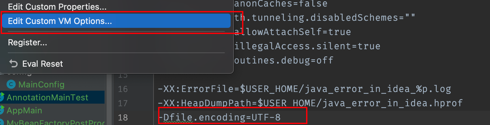
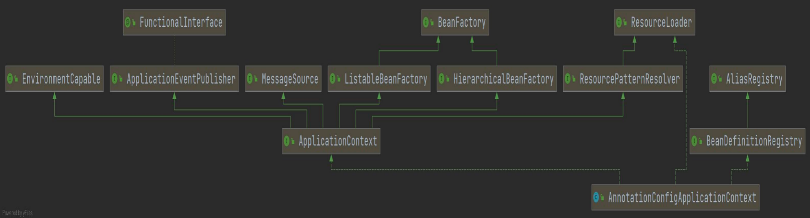

## 环境搭建

### gradle环境搭建

因为spring是使用gradle搭建的，所以需要先配置gradle环境

> 参考网址：https://www.cnblogs.com/ycyzharry/p/11089016.html
>
> 测试结果
>
> 
>
> 可以将gradle的本地仓库修改成maven的本地仓库，这样就可以不用重复下载jar文件
>
> 在环境变量中配置
>
> ```bash
> export GRADLE_USER_HOME=/Users/aldencarter/opt/codes/environments/m2/repository
> ```
>
> 即可

### spring源码环境搭建

克隆spring-framework的GitHub项目，根据`import-into-idea.md`的配置，导入到idea中


如果选择自己的gradle出现错误，可以选用idea自身的gradle，idea会根据项目来选择对应的gradle

最后idea会自动编译spring源码，编译成功以后，所有的模块都会有个小小的蓝色图标，表示编译成功，至此spring源码导入完成

### 创建测试模块

创建gradle模块


名字`springsource-test`，该名字需要和spring原模块不重复


#### 测试配置文件方式

1. 引入依赖

我们可以去`https://mvnrepository.com/`查找，选择gradle方式，添加到模块的`build.gradle`的`dependencies`中

```json
dependencies {
    testImplementation 'org.junit.jupiter:junit-jupiter-api:5.6.0'
    testRuntimeOnly 'org.junit.jupiter:junit-jupiter-engine'

    //引入Spring的核心容器
    compile(project(":spring-context"))
    compileOnly 'org.projectlombok:lombok:1.18.10'
    annotationProcessor 'org.projectlombok:lombok:1.18.10'
}
```

整个build.gradle

```json
plugins {
    id 'java'
}

group 'org.springframework'
version '5.2.9.RELEASE'

repositories {
    mavenCentral()
}

dependencies {
    testImplementation 'org.junit.jupiter:junit-jupiter-api:5.6.0'
    testRuntimeOnly 'org.junit.jupiter:junit-jupiter-engine'

    //引入Spring的核心容器
    compile(project(":spring-context"))
    compileOnly 'org.projectlombok:lombok:1.18.10'
    annotationProcessor 'org.projectlombok:lombok:1.18.10'
}

test {
    useJUnitPlatform()
}

//上面这个配置主要是去掉-WError, 不然warn会视为error,导致编译失败. 也可以修改springframework根目录下的build.gradle文件,把-WError去掉
configure(allprojects) { project ->
    compileJava.options*.compilerArgs =
            ["-Xlint:varargs", "-Xlint:fallthrough", "-Xlint:rawtypes",                "-Xlint:deprecation", "-Xlint:unchecked"]
}
```

2. 编写spring.xml

```xml
<?xml version="1.0" encoding="UTF-8"?>
<beans xmlns="http://www.springframework.org/schema/beans"
      xmlns:context="http://www.springframework.org/schema/context"
      xmlns:xsi="http://www.w3.org/2001/XMLSchema-instance"
      xsi:schemaLocation="http://www.springframework.org/schema/beans http://www.springframework.org/schema/beans/spring-beans.xsd
                     http://www.springframework.org/schema/context http://www.springframework.org/schema/context/spring-context-2.5.xsd">
   <context:component-scan base-package="com.ald.spring" />
</beans>
```

3. 创建User实体类

```java
@Data
@ToString
@Component
public class User {
	private String name;
}
```

4. 创建AppMain并引入测试

```java
public class AppMain {
	public static void main(String[] args) {
		ApplicationContext context = new ClassPathXmlApplicationContext("spring.xml");
		User user = context.getBean(User.class);
		System.out.println(user);
	}
}

// 或者
public class AppTest {
    @Test
    public void MyTestBeanTest() {
        BeanFactory bf = new XmlBeanFactory( new ClassPathResource("spring-config.xml"));
        MyTestBean myTestBean = (MyTestBean) bf.getBean("myTestBean");
        System.out.println(myTestBean.getName());
    }
}

// 其实直接使用BeanFactory作为容器对于Spring的使用并不多见，因为企业级应用项目中大多会使用的是ApplicationContext（后面我们会讲两者的区别，这里只是测试）
```

5. 启动测试

测试成功


#### 测试注解方式

> 源码环境默认是不支持中文的，需要在VM配置中添加`-Dfile.encoding=UTF-8`将环境修改成UTF8编码
>
> 

编写Person

```java
@Data
@ToString
public class User {
	private String name;
}
```

编写配置

```java
@Configuration
public class MainConfig {
	@Bean
	public User user() {
		final User user = new User();
		user.setName("张三");
		return user;
	}
}
```

编写测试

```java
public class AnnotationMainTest {
	public static void main(String[] args) {
		final ApplicationContext applicationContext = new AnnotationConfigApplicationContext(MainConfig.class);
		final User user = applicationContext.getBean(User.class);
		System.out.println(user);
	}
}
```

## 核心注解

核心注解自查


```markdown
注：@Indexed 需要引入依赖
<dependency>
	<groupId>org.springframework</groupId>
	<artifactId>spring-context-indexer</artifactId>
	<optional>true</optional>
</dependency>
```

## 整体架构

核心组件接口分析

基础接口

- Resource+ResourceLoader 资源和资源加载器
- BeanFactory  Bean工厂
- BeanDefinition Bean定义信息
- BeanDefinitionReader Bean定义信息读取器
- BeanDefinitionRegistry 
- ApplicationContext
- Aware
  

生命周期-后置处理器

- BeanFactoryPostProcessor
- InitializingBean
- BeanPostProcessor

### 流程流转


### 整体架构


```markdown
在xml配置文件中，写了
<bean id="user" class="com.ald.spring.bean.User">
	<property name="name" value="张三"/>
</bean>
对应的就是一个BeanDefinition
- 资源加载器ResourceLoader帮我们加载Bean配置信息之后，交给BeanDefinitionReader
- BeanDefinitionReader读取Bean配置信息，放到BeanDefinitionRegistry资料馆（档案馆）中，即bean定义信息注册中心，其实就是一个map，里面存储了每个bean是怎么定义的
- 将bean的定义信息，通过遍历创建成对象，也就是车间流水线
- 在创建完成之后，放入到对应的池中，方便后续的使用
```

### 接口分析

#### Resource

spring底层中将所有的配置都可以称为资源，其中包括配置文件、配置类、bean类


```markdown
# 使用策略模式
资源加载有很不同的途径，此时就可以抽取出这些不同的途径，将其抽象成策略，根据不同的途径调用不同的解析策略
```

可以从哪里获取到资源：

- 类资源路径：ContextResource下的：ClassRelativeContextResource、ClassPathContextResource、ServletContextResource、FileSystemContextResource
- 网络资源：HttpResource下的：FileNamVersionedReource、EncodedResource、GzippedResource
- 文件系统：FPS等位置，FileUrlResource、PathResource
- ...

> ResourceLoader 加载资源的加载器
>
> 
>
> 用于**加载资源（例如类路径或文件系统资源）的策略接口**。需要 {@link org.springframework.context.ApplicationContext} 来提供此功能，以及扩展的 {@link org.springframework.core.io.support.ResourcePatternResolver} 支持。 {@link DefaultResourceLoader} 是一个独立的实现，可以在 ApplicationContext 之外使用，也被 {@link ResourceEditor} 使用。 在 ApplicationContext 中运行时，可以使用特定上下文的资源加载策略从字符串中填充类型为 Resource 和 Resource 数组的 Bean 属性。

#### BeanFactory

用于访问 Spring bean 容器的根接口。

> 该接口由包含许多 bean 定义的对象实现，每个定义由一个字符串名称唯一标识。根据 bean 定义，工厂将返回包含**对象的独立实例（原型设计模式）或单个共享实例（单例设计模式的更好替代方案，其中实例是范围内的单例）工厂）**。将返回哪种类型的实例取决于 bean 工厂配置：API 相同。从 Spring 2.0 开始，根据具体的应用程序上下文（例如 Web 环境中的“请求”和“会话”范围），可以使用更多范围


```markdown
# 工厂方法模式
通过不同的工厂创建不同的bean
```

BeanFactory

- HierarchicalBeanFactory：定义父子工厂（父子容器）  接口

- ListableBeanFacotory：实现是DefaultListableBeanFactory，保存了ioc容器中的核心信息

- AutowireCapableBeanFactory：提供自动装配能力

AnnotationApplicationContext组合了档案馆(`private final DefaultListableBeanFactory beanFactory;`)，他有自动装配能力

```markdown
spring通过组合模式，可以允许有无数的工厂，每一个工厂都可以制造出不同的东西，不同的工厂之间实现隔离，但是目前还没有出现使用多个工厂的项目
```

##### 面试问题

ApplicationContext和BeanFactory什么区别？

> 参考网址：https://juejin.cn/post/6844903877574131726
>
> 1. 什么是springBean
>
> 这是一个非常简单而又很复杂的问题，通常来说，Spring beans 就是被 Spring 容器所管理的 Java 对象，来看一个简单的例子
>
> ```java
> package com.zoltanraffai;  
> public class HelloWorld { 
>    private String message;  
>    public void setMessage(String message){ 
>       this.message  = message; 
>    }  
>    public void getMessage(){ 
>       System.out.println("My Message : " + message); 
>    } 
> }
> ```
>
> 在基于 XML 的配置中， beans.xml 为 Spring 容器管理 bean 提供元数据
>
> 2. 什么是spring容器
>
> Spring 容器负责实例化，配置和装配 Spring beans，下面来看如何为 IoC 容器配置我们的 HelloWorld POJO
>
> ```java
> <?xml version = "1.0" encoding = "UTF-8"?>
> <beans xmlns = "http://www.springframework.org/schema/beans"
>    xmlns:xsi = "http://www.w3.org/2001/XMLSchema-instance"
>    xsi:schemaLocation = "http://www.springframework.org/schema/beans
>    http://www.springframework.org/schema/beans/spring-beans-3.0.xsd">
>    <bean id = "helloWorld" class = "com.zoltanraffai.HelloWorld">
>       <property name = "message" value = "Hello World!"/>
>    </bean>
> </beans>
> ```
>
> 现在，它已经被 Spring 容器管理了，接下来的问题是：我们怎样获取它？
>
> 3. BeanFactory和ApplicationContext的不同点
>
> **BeanFactory接口**
>
> 这是一个用来访问 Spring 容器的 root 接口，要访问 Spring 容器，我们将使用 Spring 依赖注入功能，使用 BeanFactory 接口和它的子接口 **特性：**
>
> - Bean 的实例化/串联 通常情况，BeanFactory 的实现是使用**懒加载**的方式，这意味着 beans 只有在我们通过 getBean() 方法直接调用它们时才进行实例化 实现 BeanFactory 最常用的 API 是 XMLBeanFactory 这里是如何通过 BeanFactory 获取一个 bean 的例子：
>
> ```java
> import org.springframework.core.io.ClassPathResource;  
> import org.springframework.beans.factory.InitializingBean; 
> import org.springframework.beans.factory.xml.XmlBeanFactory; 
> public class HelloWorldApp{ 
>    public static void main(String[] args) { 
>       XmlBeanFactory factory = new XmlBeanFactory (new ClassPathResource("beans.xml")); 
>       HelloWorld obj = (HelloWorld) factory.getBean("helloWorld");    
>       obj.getMessage();    
>    }
> }
> ```
>
> **ApplicationContext接口**
>
> ApplicationContext 是 Spring 应用程序中的中央接口，用于向应用程序提供配置信息 它继承了 BeanFactory 接口，所以 ApplicationContext 包含 BeanFactory 的所有功能以及更多功能！它的主要功能是支持大型的业务应用的创建 **特性：**
>
> - Bean instantiation/wiring
> - Bean 的实例化/串联
> - 自动的 **BeanPostProcessor 注册**
> - 自动的 **BeanFactoryPostProcessor 注册**
> - 方便的 **MessageSource 访问（i18n）**
> - ApplicationEvent 的发布 与 BeanFactory 懒加载的方式不同，它是**预加载**，所以，每一个 bean 都在 ApplicationContext 启动之后实例化 这里是 ApplicationContext 的使用例子：
>
> ```java
> import org.springframework.core.io.ClassPathResource;  
> import org.springframework.beans.factory.InitializingBean; 
> import org.springframework.beans.factory.xml.XmlBeanFactory; 
> public class HelloWorldApp{ 
>    public static void main(String[] args) { 
>       ApplicationContext context=new ClassPathXmlApplicationContext("beans.xml"); 
>       HelloWorld obj = (HelloWorld) context.getBean("helloWorld");    
>       obj.getMessage();    
>    }
> }
> ```
>
> 4. 总结
>
> ```markdown
> # ApplicationContext 包含 BeanFactory 的所有特性，通常推荐使用前者。但是也有一些限制情形，比如移动应用内存消耗比较严苛，在那些情景中，使用更轻量级的 BeanFactory 是更合理的。然而，在大多数企业级的应用中，ApplicationContext 是你的首选
> ```

#### BeanDefinition

BeanDefinition Bean定义信息，包含了将要注入到spring容器的bean的信息


#### BeanDefinitionReader


> BeanDefinition信息的注册时在干什么？
>
> 

#### BeanDefinitionRegistry


```markdown
# DefaultListableBeanFactory档案馆实现了BeanDefinitionRegistry Bean定义的注册中心
BeanDefinitionReader利用Document解析把xml解析成Document，传给BeanDefinitionDocumentReader，解析成BeanDefinition，存储到BeanDefinitionRegistry
```

#### ApplicationContext

基础继承关系



```java
public interface ApplicationContext extends EnvironmentCapable, ListableBeanFactory, HierarchicalBeanFactory,
		MessageSource, ApplicationEventPublisher, ResourcePatternResolver{...}
```

可见ApplicationContext是在BeanFactory基础上定义的，实际上ApplicationContext是BeanFactory的一个超全集。

- ioc事件派发器
- 国际化解析
- bean工厂功能---自动装配被组合进来的
- 资源解析功能

直接通过注入的方式拿到`ApplicationContext`

```java
@Data
@ToString
public class User {
	private String name;

	@Autowired
	ApplicationContext context;

	public ApplicationContext getContext() {
		return context;
	}
}

public class AnnotationMainTest {
	public static void main(String[] args) {
		final ApplicationContext applicationContext = new AnnotationConfigApplicationContext(MainConfig.class);
		final User user = applicationContext.getBean(User.class);

		final ApplicationContext context = user.getContext();
		System.out.println(context == applicationContext);
		System.out.println(user);
	}
}

输出结果是true
```

#### Aware

Aware 翻译过来可以理解为"察觉的；注意到的；感知的" ，XxxxAware 也就是对....感知的

```markdown
# Aware接口：帮我们装配spring底层的一些组件
```


> 在大多数情况下，我们应该避免使用任何 Aware 接口，除非我们需要它们。实现这些接口会将代码耦合到Spring框架

```java
@Data
@ToString
public class User implements ApplicationContextAware {
	private String name;

	ApplicationContext context;

	public ApplicationContext getContext() {
		return context;
	}

	@Override
	public void setApplicationContext(ApplicationContext applicationContext) throws BeansException {
		this.context = applicationContext;
	}
}

public class AnnotationMainTest {
	public static void main(String[] args) {
		final ApplicationContext applicationContext = new AnnotationConfigApplicationContext(MainConfig.class);
		final User user = applicationContext.getBean(User.class);

		final ApplicationContext context = user.getContext();
		System.out.println(context == applicationContext);
		System.out.println(user);
	}
}

输出结果是true
```

### BeanFactoryPostProcessor

声明周期后置处理


> 参考网址：https://blog.csdn.net/caihaijiang/article/details/35552859
>
> BeanFactoryPostProcessor和BeanPostProcessor，这两个接口，都是Spring初始化bean时对外暴露的扩展点。两个接口名称看起来很相似，但作用及使用场景却不同，分析如下：
>
> 1. BeanFactoryPostProcessor
>
> 该接口的定义如下：
>
> ```java
> public interface BeanFactoryPostProcessor {
>  
> 	/**
> 	 * Modify the application context's internal bean factory after its standard
> 	 * initialization. All bean definitions will have been loaded, but no beans
> 	 * will have been instantiated yet. This allows for overriding or adding
> 	 * properties even to eager-initializing beans.
> 	 * @param beanFactory the bean factory used by the application context
> 	 * @throws org.springframework.beans.BeansException in case of errors
> 	 */
> 	void postProcessBeanFactory(ConfigurableListableBeanFactory beanFactory) throws BeansException;
>  
> }
> ```
>
> 实现该接口，可以在spring的bean创建之前，修改bean的定义属性。也就是说，Spring允许BeanFactoryPostProcessor在容器实例化任何其它bean之前读取配置元数据，并可以根据需要进行修改，例如可以把bean的scope从singleton改为prototype，也可以把property的值给修改掉。可以同时配置多个BeanFactoryPostProcessor，并通过设置'order'属性来控制各个BeanFactoryPostProcessor的执行次序。
> 注意：BeanFactoryPostProcessor是在spring容器加载了bean的定义文件之后，在bean实例化之前执行的。接口方法的入参是ConfigurrableListableBeanFactory，使用该参数，可以获取到相关bean的定义信息，例子：
> spring bean的定义：
>
> ```java
> <?xml version="1.0" encoding="UTF-8" ?>
> <beans xmlns="http://www.springframework.org/schema/beans"
> 	xmlns:xsi="http://www.w3.org/2001/XMLSchema-instance" xmlns:context="http://www.springframework.org/schema/context"
> 	xmlns:p="http://www.springframework.org/schema/p" xmlns:tx="http://www.springframework.org/schema/tx"
> 	xmlns:aop="http://www.springframework.org/schema/aop"
> 	xsi:schemaLocation="http://www.springframework.org/schema/beans http://www.springframework.org/schema/beans/spring-beans-2.5.xsd
> 				http://www.springframework.org/schema/context http://www.springframework.org/schema/context/spring-context-2.5.xsd
> 				http://www.springframework.org/schema/tx http://www.springframework.org/schema/tx/spring-tx-2.5.xsd"
> 	default-autowire="byName">
> 	
> 	<bean id="myJavaBean" class="com.ali.caihj.postprocessor.MyJavaBean">
> 		<property name="desc" value="测试一下啦" />
> 		<property name="remark" value="这是备注信息啦啦啦" />
> 	</bean>
> 	<bean id="myBeanFactoryPostProcessor" class="com.ali.caihj.postprocessor.MyBeanFactoryPostProcessor" />
> </beans>
> ```
>
> 自定义的BeanFactoryPostProcessor：
>
> ```java
> public class MyBeanFactoryPostProcessor implements BeanFactoryPostProcessor {
>  
>     public void postProcessBeanFactory(ConfigurableListableBeanFactory beanFactory) throws BeansException {
>         System.out.println("调用MyBeanFactoryPostProcessor的postProcessBeanFactory");
>         BeanDefinition bd = beanFactory.getBeanDefinition("myJavaBean");
>         System.out.println("属性值============" + bd.getPropertyValues().toString());
>         MutablePropertyValues pv =  bd.getPropertyValues();  
>         if (pv.contains("remark")) {  
>             pv.addPropertyValue("remark", "把备注信息修改一下");  
>         }  
>         bd.setScope(BeanDefinition.SCOPE_PROTOTYPE);
>     }
>  
> }
> ```
>
> spring中，有内置的一些BeanFactoryPostProcessor实现类，常用的有：
>
> - org.springframework.beans.factory.config.PropertyPlaceholderConfigurer
> - org.springframework.beans.factory.config.PropertyOverrideConfigurer
> - org.springframework.beans.factory.config.CustomEditorConfigurer：用来注册自定义的属性编辑器
>
> 2. BeanPostProcessor
>
> 该接口的定义如下：
>
> ```java
> public interface BeanPostProcessor {
>  
> 	/**
> 	 * Apply this BeanPostProcessor to the given new bean instance <i>before</i> any bean
> 	 * initialization callbacks (like InitializingBean's <code>afterPropertiesSet</code>
> 	 * or a custom init-method). The bean will already be populated with property values.
> 	 * The returned bean instance may be a wrapper around the original.
> 	 * @param bean the new bean instance
> 	 * @param beanName the name of the bean
> 	 * @return the bean instance to use, either the original or a wrapped one
> 	 * @throws org.springframework.beans.BeansException in case of errors
> 	 * @see org.springframework.beans.factory.InitializingBean#afterPropertiesSet
> 	 */
> 	Object postProcessBeforeInitialization(Object bean, String beanName) throws BeansException;
>  
> 	/**
> 	 * Apply this BeanPostProcessor to the given new bean instance <i>after</i> any bean
> 	 * initialization callbacks (like InitializingBean's <code>afterPropertiesSet</code>
> 	 * or a custom init-method). The bean will already be populated with property values.
> 	 * The returned bean instance may be a wrapper around the original.
> 	 * <p>In case of a FactoryBean, this callback will be invoked for both the FactoryBean
> 	 * instance and the objects created by the FactoryBean (as of Spring 2.0). The
> 	 * post-processor can decide whether to apply to either the FactoryBean or created
> 	 * objects or both through corresponding <code>bean instanceof FactoryBean</code> checks.
> 	 * <p>This callback will also be invoked after a short-circuiting triggered by a
> 	 * {@link InstantiationAwareBeanPostProcessor#postProcessBeforeInstantiation} method,
> 	 * in contrast to all other BeanPostProcessor callbacks.
> 	 * @param bean the new bean instance
> 	 * @param beanName the name of the bean
> 	 * @return the bean instance to use, either the original or a wrapped one
> 	 * @throws org.springframework.beans.BeansException in case of errors
> 	 * @see org.springframework.beans.factory.InitializingBean#afterPropertiesSet
> 	 * @see org.springframework.beans.factory.FactoryBean
> 	 */
> 	Object postProcessAfterInitialization(Object bean, String beanName) throws BeansException;
>  
> }
> ```
>
> BeanPostProcessor，可以在spring容器实例化bean之后，在执行bean的初始化方法前后，添加一些自己的处理逻辑。这里说的初始化方法，指的是下面两种：
>
> - bean实现了InitializingBean接口，对应的方法为afterPropertiesSet
>
> - 在bean定义的时候，通过init-method设置的方法
>
> **注意：BeanPostProcessor是在spring容器加载了bean的定义文件并且实例化bean之后执行的。BeanPostProcessor的执行顺序是在BeanFactoryPostProcessor之后。**
>
> spring中，有内置的一些BeanPostProcessor实现类，例如：
>
> - org.springframework.context.annotation.CommonAnnotationBeanPostProcessor：支持@Resource注解的注入
> - org.springframework.beans.factory.annotation.RequiredAnnotationBeanPostProcessor：支持@Required注解的注入
> - org.springframework.beans.factory.annotation.AutowiredAnnotationBeanPostProcessor：支持@Autowired注解的注入
> - org.springframework.orm.jpa.support.PersistenceAnnotationBeanPostProcessor：支持@PersistenceUnit和@PersistenceContext注解的注入
> - org.springframework.context.support.ApplicationContextAwareProcessor：用来为bean注入ApplicationContext等容器对象
>
> 这些注解类的BeanPostProcessor，在spring配置文件中，可以通过这样的配置 <context:component-scan base-package="*.*" /> ，自动进行注册。（spring通过ComponentScanBeanDefinitionParser类来解析该标签）
> 

### InitializingBean、DisposableBean

InitialingBean是一个接口，提供了一个唯一的方法afterPropertiesSet()。

DisposableBean也是一个接口，提供了一个唯一的方法destory()。

这两个接口是一组的，功能类似，因此放在一起：前者顾名思义在Bean属性都设置完毕后调用afterPropertiesSet()方法做一些初始化的工作，后者在Bean生命周期结束前调用destory()方法做一些收尾工作。下面看一下例子，为了能明确地知道afterPropertiesSet()方法的调用时机，加上一个属性，给属性set方法，在set方法中打印一些内容：

```java
 
public class LifecycleBean implements InitializingBean, DisposableBean
{
    @SuppressWarnings("unused")
    private String    lifeCycleBeanName;
    
    public void setLifeCycleBeanName(String lifeCycleBeanName)
    {
        System.out.println("Enter LifecycleBean.setLifeCycleBeanName(), lifeCycleBeanName = " + lifeCycleBeanName);
        this.lifeCycleBeanName = lifeCycleBeanName;
    }
 
    public void destroy() throws Exception
    {
        System.out.println("Enter LifecycleBean.destroy()");
    }
 
    public void afterPropertiesSet() throws Exception
    {
        System.out.println("Enter LifecycleBean.afterPropertiesSet()");
    }
    
    public void beanStart()
    {
        System.out.println("Enter LifecycleBean.beanStart()");
    }
    
    public void beanEnd()
    {
        System.out.println("Enter LifecycleBean.beanEnd()");
    }
}
```


关于这两个接口，我总结几点：

- InitializingBean接口、Disposable接口可以和init-method、destory-method配合使用，接口执行顺序优先于配置

- InitializingBean接口、Disposable接口底层使用类型强转.方法名()进行直接方法调用，init-method、destory-method底层使用反射，前者和Spring耦合程度更高但效率高，后者解除了和Spring之间的耦合但是效率低，使用哪个看个人喜好

- afterPropertiesSet()方法是在Bean的属性设置之后才会进行调用，某个Bean的afterPropertiesSet()方法执行完毕才会执行下一个Bean的afterPropertiesSet()方法，因此不建议在afterPropertiesSet()方法中写处理时间太长的方法

关于在spring  容器初始化 bean 和销毁前所做的操作定义方式还有以下种：

- 第一种：通过@PostConstruct和@PreDestroy注解实现初始化和销毁bean之前进行的操作。

注：@PostConstruct和@PreDestroy 标注不属于 Spring，它是在J2EE库- common-annotations.jar。

- 第二种：通过在xml中定义init-method和destory-method方法。

### BeanPostProcessor

`bean`后处理器允许自定义修改`spring` `bean factory`创建的新`bean`实例。如果你想在`Spring`容器完成实例化、配置和初始化`bean`之后实现一些定制逻辑，我们可以插入一个或多个`BeanPostProcessor`实现。

如果有多个`BeanPostProcessor`实例，我们可以通过设置`order`属性或实现`Ordered`接口来控制执行顺序。


`BeanPostProcessor`接口由两个回调方法组成，即`postprocessbeforeinitialize()`和`postprocessafterinitialize()`。

对于由容器创建的每个`bean`实例，后处理器都会在调用容器初始化方法之前以及在任何bean初始化回调之后都从容器获得回调。

`bean`后处理器通常检查回调接口，或者使用代理包装`bean`。例如一些`Spring AOP`基础结构类（例如`AbstractAdvisingBeanPostProcessor`）实现了`bean`后处理器，提供代理包装逻辑。

#### 如何创建BeanPostProcessor

`spring`中创建一个`bean`后处理器:

1. 实现`BeanPostProcessor`接口。
2. 实现回调方法。

```java
import org.springframework.beans.BeansException;
import org.springframework.beans.factory.config.BeanPostProcessor;
 
public class CustomBeanPostProcessor implements BeanPostProcessor
{
    public Object postProcessBeforeInitialization(Object bean, String beanName) throws BeansException
    {
        System.out.println("Called postProcessBeforeInitialization() for :" + beanName);
        return bean;
    }
     
    public Object postProcessAfterInitialization(Object bean, String beanName) throws BeansException
    {
        System.out.println("Called postProcessAfterInitialization() for :" + beanName);
        return bean;
    }
}
```

#### 如何注册BeanPostProcessor

`ApplicationContext`自动检测实现`BeanPostProcessor`接口的配置元数据中定义的所有`bean`。它将这些`bean`注册为后处理器，以便以后在创建`bean`时调用它们

然后`Spring`将在调用初始化回调方法之前和之后将每个`bean`实例传递给这两个方法，在这两个方法中，你可以按自己喜欢的方式处理`bean`实例。

```xml
<beans>
     <bean id="customBeanPostProcessor" class="com.howtodoinjava.demo.processors.CustomBeanPostProcessor" />
</beans>
```

#### BeanPostProcessor被调用时

通常，`spring`的`DI`容器会执行以下操作来创建一个`bean`：

1. 通过构造函数或工厂方法重新创建`bean`实例
2. 设置属性值值和对其它`bean`的引用
3. 调用所有`*Aware`接口中定义的`setter`方法
4. 将`bean`实例传递给每个`bean`后处理器的`postProcessBeforeInitialization（）`方法
5. 调用初始化回调方法
6. 将`Bean`实例传递到每个`Bean`后处理器的`postProcessAfterInitialization（）`方法
7. 这个`bean`已经可以被使用了
8. 当容器关闭时，调用销毁回调方法

#### spring BeanPostProcessor示例

为了展示示例用法，我使用了`EmployeeDAOImpl`类，如下所示:

```java
public class EmployeeDAOImpl implements EmployeeDAO
{
    public EmployeeDTO createNewEmployee()
    {
        EmployeeDTO e = new EmployeeDTO();
        e.setId(1);
        e.setFirstName("Lokesh");
        e.setLastName("Gupta");
        return e;
    }
     
    public void initBean() {
        System.out.println("Init Bean for : EmployeeDAOImpl");
    }
     
    public void destroyBean() {
        System.out.println("Init Bean for : EmployeeDAOImpl");
    }
}
```

该`bean`及其后处理器的配置如下：

```xml
<bean id="customBeanPostProcessor" class="com.howtodoinjava.demo.processors.CustomBeanPostProcessor" />
     
<bean id="dao" class="com.howtodoinjava.demo.dao.EmployeeDAOImpl"  init-method="initBean" destroy-method="destroyBean"/>
```

现在，启动`DI`容器并查看输出：

```java
ApplicationContext context = new ClassPathXmlApplicationContext("beans.xml");
```

输出：

```bash
Called postProcessBeforeInitialization() for : dao
Init Bean for : EmployeeDAOImpl
Called postProcessAfterInitialization() for : dao
```

很显然，在初始化方法之前和之后调用了BeanPostProcessor方法

## 源码解析


