## 概述

### 数据库操作框架的历程

1. jdbc

mybatis就是对jdbc的封装

- 优点：运行期：快捷、高效
- 缺点：编辑期：代码量大、繁琐异常处理，不支持数据库跨平台

核心API

- DriverManager 连接数据库
- Connection 连接数据库的抽象
- Statment 执行SQL
- ResultSet 数据结果集

可以自己实现工具类BaseDao

2. DBUtils：封装了对JDBC的操作

3. ORM 对象关系映射

- Object：java 对象
- Relational：关系型数据库
- Mapping：映射

4. Hibernate

- 优点
  - 完全可以利用对象生成数据库，代码优先
  - 直接操作实体类就可以实现对数据库表的操作
  - 完美的跨数据库平台，因为只是对实体的操作

- 缺点
  - 因为不用SQL，所以在优化SQL上不能优化
  - 复杂的SQL语句使用纯面向对象的操作比较难，学习门槛高

5. mybatis

### 什么是mybatis

持久层框架，半自动的ORM，自己编写SQL语句，通过简单的xml或注解来配置和映射原始类型、接口和POJO为数据库中的记录

优点

- SQL代码从程序中分离，可重用
- 提供xml标签，支持编写动态SQL
- 提供映射，支持对象与数据库的ORM字段关系映射
- 支持缓存、支持连接池

缺点

- SQL编写工作量大
- 数据库移植性比较差

### 快速搭建mybatis项目

#### 前置

github mybatis项目开源，可通过搜索找到源码

mybatis3官网：https://mybatis.org/mybatis-3/

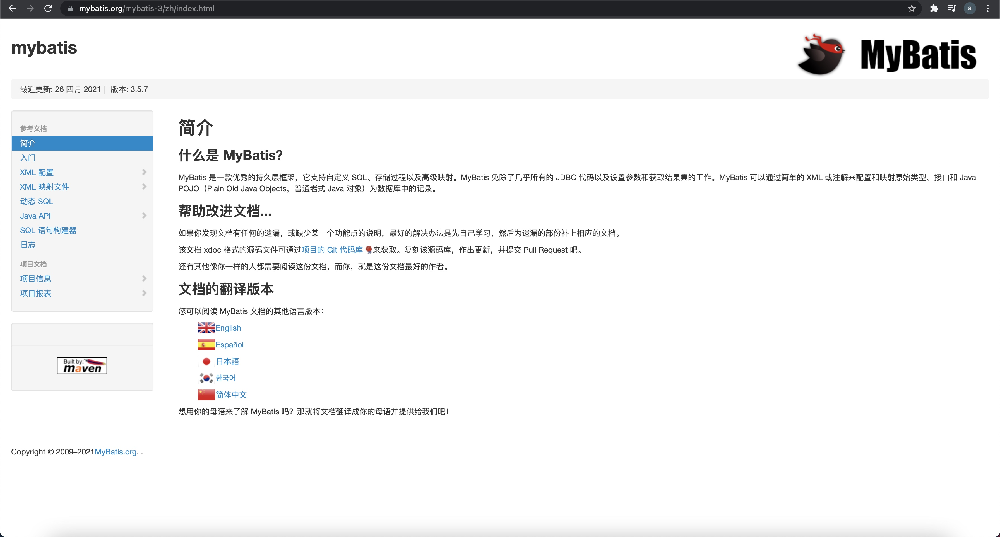

#### 安装

1. 添加mybatis依赖和mysql依赖

```xml
<!--mybatis的核心依赖-->
<dependency>
    <groupId>org.mybatis</groupId>
    <artifactId>mybatis</artifactId>
    <version>3.5.5</version>
</dependency>

<!--mysql 对应版本的驱动-->
<dependency>
    <groupId>mysql</groupId>
    <artifactId>mysql-connector-java</artifactId>
    <version>5.1.47</version>
</dependency>
```

2. msyql jar与数据库的版本对应

查找方式

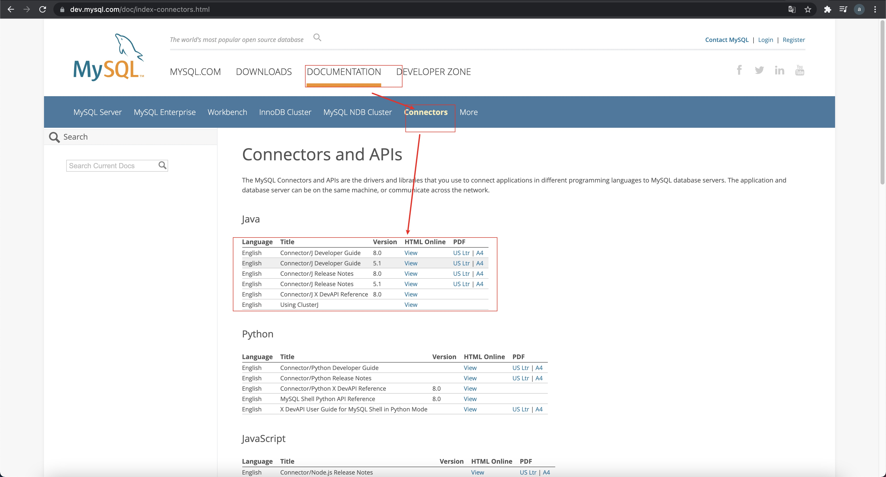

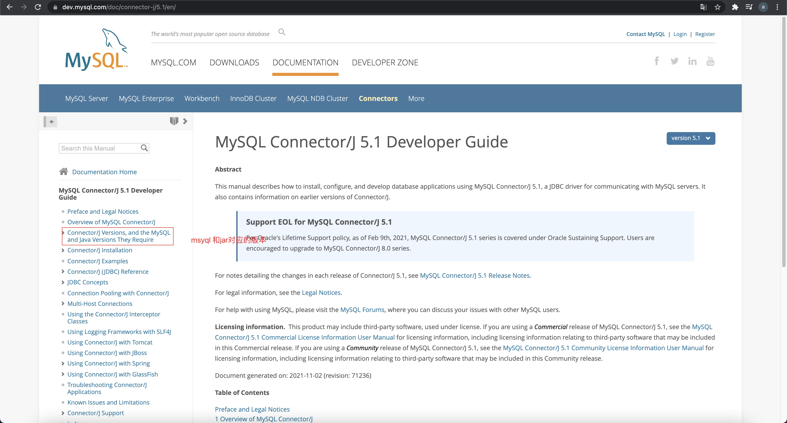

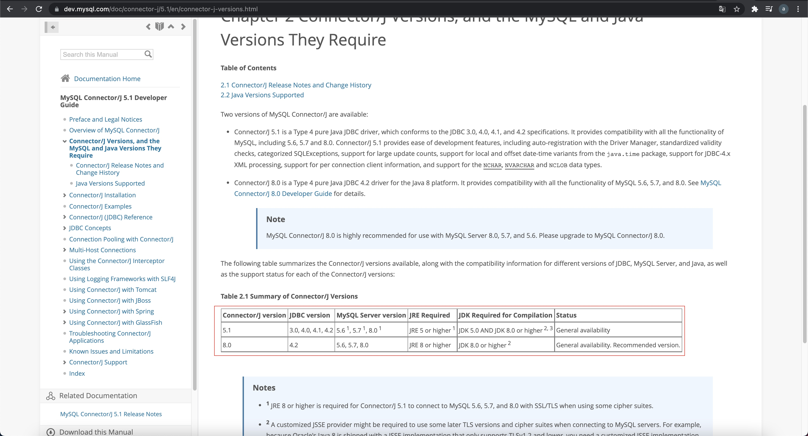

#### 从xml中构建SqlSessionFactory

1. 创建mybatis.xml全局配置文件

```xml
<?xml version="1.0" encoding="UTF-8" ?>
<!DOCTYPE configuration
        PUBLIC "-//mybatis.org//DTD Config 3.0//EN"
        "http://mybatis.org/dtd/mybatis-3-config.dtd">
<configuration>
    <environments default="development">
        <environment id="development">
            <transactionManager type="JDBC"/>
            <dataSource type="POOLED">
                <property name="driver" value="com.mysql.jdbc.Driver"/>
                <property name="url" value="jdbc:mysql://localhost:3306/mybatis?useUnicode=true&amp;characterEncoding=UTF-8"/>
                <property name="username" value="root"/>
                <property name="password" value="123456"/>
            </dataSource>
        </environment>
    </environments>
    <mappers>
        <!--对应resources目录中的EmpMapper.xml
        <mapper resource="EmpMapper.xml"/>
    </mappers>
</configuration>
```

2. 创建Emp实体类和数据库中的表对应

```java
public class Emp {
    private Integer id;
    private String username;

    @Override
    public String toString() {
        return "Emp{" +
                "id=" + id +
                ", username='" + username + '\'' +
                '}';
    }

    public Integer getId() {
        return id;
    }

    public void setId(Integer id) {
        this.id = id;
    }

    public String getUsername() {
        return username;
    }

    public void setUsername(String username) {
        this.username = username;
    }
}
```

3. 创建EmpMapper.xml配置文件

在resources目录下创建EmpMapper.xml文件

```xml
<?xml version="1.0" encoding="UTF-8" ?>
<!DOCTYPE mapper
        PUBLIC "-//mybatis.org//DTD Mapper 3.0//EN"
        "http://mybatis.org/dtd/mybatis-3-mapper.dtd">
<mapper namespace="EmpMapper">
    <select id="selectEmp" resultType="com.ald.mybatis.pojo.Emp">
        select * from Emp where id = #{id}
    </select>

    <insert id="insertEmp">
        INSERT INTO `mybatis`.`emp` (`username`) VALUES (#{username});
    </insert>

    <update id="updateEmp">
        UPDATE `mybatis`.`emp` SET `username` = #{username} WHERE `id` = #{id};
    </update>

    <delete id="deleteEmp">
        delete from emp where id=#{id}
    </delete>
</mapper>
```

4. 创建测试类，并编写测试方法

```java
public class MybatisTest {
    SqlSessionFactory sqlSessionFactory;
    @Before
    public void before(){
        String resource = "mybatis.xml";
        InputStream inputStream = null;
        try {
            inputStream = Resources.getResourceAsStream(resource);
            sqlSessionFactory = new SqlSessionFactoryBuilder().build(inputStream);
        } catch (IOException e) {
            e.printStackTrace();
        }
    }
    /**
     * 基于statementId 的方式去执行sql
     * @throws IOException
     */
    @Test
    public void test01() throws IOException {
        // 从xml构建 SqlSessionFactory
        try (SqlSession session = sqlSessionFactory.openSession()) {
            Emp emp = (Emp) session.selectOne("EmpMapper.selectEmp", 1);
            System.out.println(emp);
        }
    }
}
```

6. 总结：创建mybatis-hello的步骤

从xml中构建SqlSessionFactory

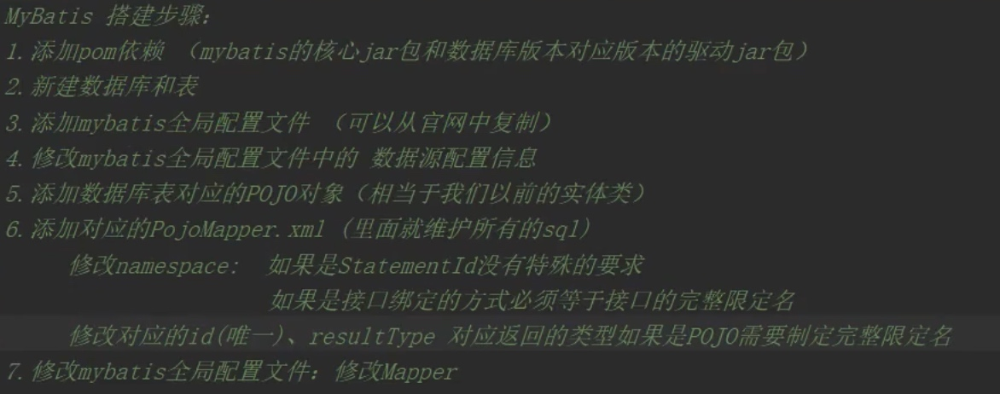

#### 上面是基于StatementId的方式去执行sql，还有一种是语句接口绑定的方式

1. 在上面的基础上创建EmpMapper接口

```java
public interface EmpMapper {
    // 根据 id 查询实体
    Emp selectEmp(Integer id);

    Integer insertEmp(Emp emp);

    Integer updateEmp(Emp emp);

    Integer deleteEmp(Integer id);
}
```

2. 将Empmapper.xml的命名空间改成创建的EmpMapper的全路径，并将该文件移动到resources\com\ald\mybatis\mapper目录下（没有就创建该目录）

EmpMapper.xml和EmpMapper.class必须在同一个文件夹当中，所以在resources中创建和EmpMapper.class一样的目录，并将EmpMapper.xml移动到创建的文件夹中

```xml
<?xml version="1.0" encoding="UTF-8" ?>
<!DOCTYPE mapper
        PUBLIC "-//mybatis.org//DTD Mapper 3.0//EN"
        "http://mybatis.org/dtd/mybatis-3-mapper.dtd">
<!--需要修改成接口的全类名-->
<mapper namespace="com.ald.mybatis.mapper.EmpMapper">
    <select id="selectEmp" resultType="com.ald.mybatis.pojo.Emp">
        select * from Emp where id = #{id}
    </select>

    <insert id="insertEmp">
        INSERT INTO `mybatis`.`emp` (`username`) VALUES (#{username});
    </insert>

    <update id="updateEmp">
        UPDATE `mybatis`.`emp` SET `username` = #{username} WHERE `id` = #{id};
    </update>

    <delete id="deleteEmp">
        delete from emp where id=#{id}
    </delete>
</mapper>
```

3. 修改mybatis.xml配置文件为接口方式

```xml
<?xml version="1.0" encoding="UTF-8" ?>
<!DOCTYPE configuration
        PUBLIC "-//mybatis.org//DTD Config 3.0//EN"
        "http://mybatis.org/dtd/mybatis-3-config.dtd">
<configuration>
    <environments default="development">
        <environment id="development">
            <transactionManager type="JDBC"/>
            <dataSource type="POOLED">
                <property name="driver" value="com.mysql.jdbc.Driver"/>
                <property name="url" value="jdbc:mysql://localhost:3306/mybatis?useUnicode=true&amp;characterEncoding=UTF-8"/>
                <property name="username" value="root"/>
                <property name="password" value="123456"/>
            </dataSource>
        </environment>
    </environments>
    <mappers>
        <!--将xml文件方式修改成接口方式-->
        <mapper class="com.ald.mybatis.mapper.EmpMapper"/>
    </mappers>
</configuration>
```

4. 编写测试类，并编写测试方法

```java
public class MybatisTest {
    SqlSessionFactory sqlSessionFactory;
    @Before
    public void before(){
        String resource = "mybatis.xml";
        InputStream inputStream = null;
        try {
            inputStream = Resources.getResourceAsStream(resource);
            sqlSessionFactory = new SqlSessionFactoryBuilder().build(inputStream);
        } catch (IOException e) {
            e.printStackTrace();
        }
    }

    /**
     * 基于接口绑定的方式
     * @throws IOException
     */
    @Test
    public void test02() throws IOException {
        try (SqlSession session = sqlSessionFactory.openSession()) {
            EmpMapper mapper = session.getMapper(EmpMapper.class);
            Emp emp = mapper.selectEmp(1);
            System.out.println(emp);
        }
    }
}
```

5. 结果

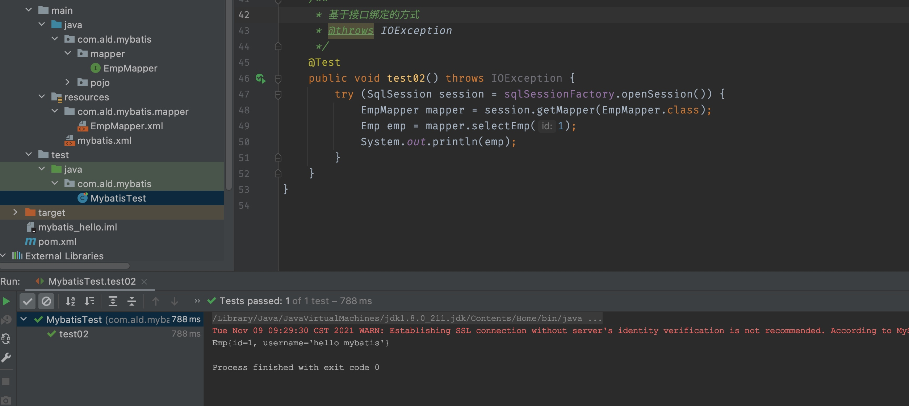

6. 总结：创建基于接口方式的步骤

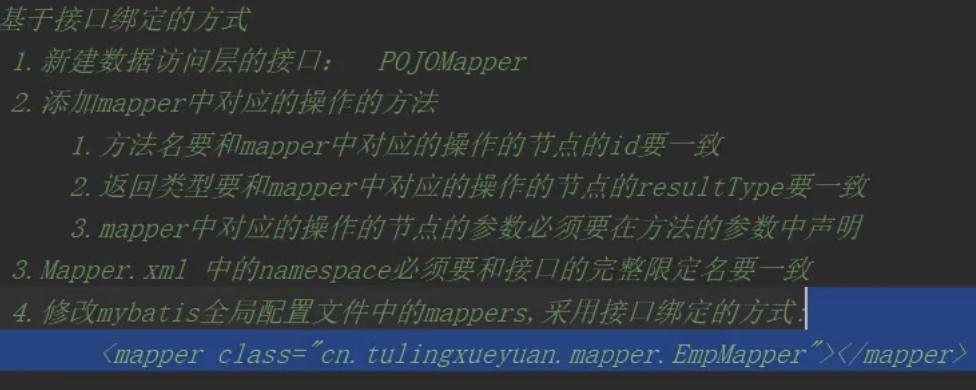

#### 注解的方式

可以不用EmpMapper.xml，然后直接在EmpMapper接口中的方法上添加注解

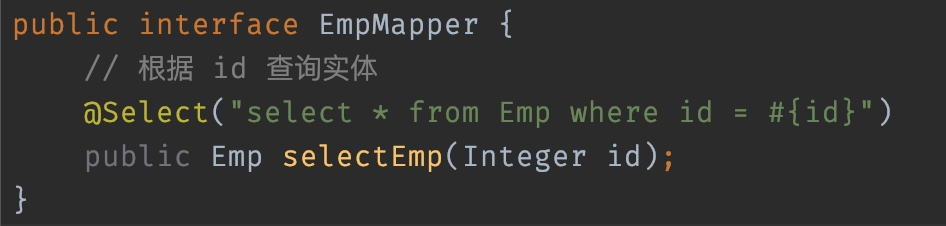

> 注解的方式增加了耦合，所有最好使用xml的方式

## sqlSession讲解

### 预处理

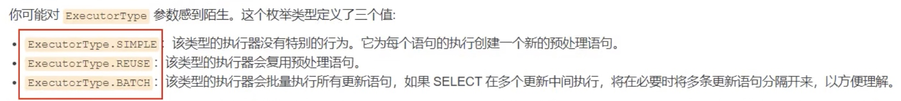


### 测试方法说明

```java
public class MybatisTest {

    Logger LOGGER = LoggerFactory.getLogger(this.getClass());

    @Test
    public void test01() throws IOException {
        //根据全局配置文件的xml构建SqlSessionFactory
        // 集成了ssm之后就不用编写这些，只需要注入到spring容器中就可以了
        String config="mybatis-config.xml";

        //将xml构建成输入流
        InputStream inputStream = Resources.getResourceAsStream(config);

        //建成SqlSessionFactory:将全局配置文件和所有的mapper全部加载到Configuration
        SqlSessionFactory sqlSessionFactory=new SqlSessionFactoryBuilder().build(inputStream);

        // SqlSession负责执行具体的数据库操作
        /**
         * 给openSession设置不同的参数会给SqlSession后续的数据库操作造成不同的影响
         * 事务作用域将会开启（也就是不自动提交）sqlSessionFactory.openSession(true) 设置为自动提交
         * 将由当前环境配置的DataSource实例中获取Connection对象 Connection var1
         * 事务隔离级别将会使用驱动或者数据源的默认配置 TransactionIsolationLevel var1
         * 预处理语句不会被复用，也不会批量处理更新 ExecutorType var1
         */
        try(SqlSession sqlSession = sqlSessionFactory.openSession()){
            // mybatis在getMapper就会给我们创建动态代理
            EmpMapper mapper = sqlSession.getMapper(EmpMapper.class);
            Emp emp = mapper.selectEmp(3);
            System.out.println(emp);
        }catch (Exception ex){
            LOGGER.error(ex.getMessage());
        }
    }
}
```

## 集成日志框架

### 日志框架的历程

jdk1.4之前没有任何日志框架，想要输出都要sout

#### 框架

1. log4j 开源

- 初级
  - 将日志按照级别输出，按照包或者类来输出
  - 将日志输出到文件当中，按照日期或者文件大小来进行归档，记录日志同时发送邮件给开发人员
  - 自定义格式，让日志更美观
  - 性能：不阻塞主业务，异步

所有的开发人员一起来维护这个框架，apache收入囊下

2. jdk自己日志框架 JUL java util.logging

#### 门面

1. 开发slf4j 日志门面，集成其他框架，不实现日志功能
2. jdk 开发 JCL jakata common logging

#### 迭代

1. 基于log4j开发出来一个logback
2. apache 基于log4j开发出一个log4j

#### 选择那个日志门面和日志实现

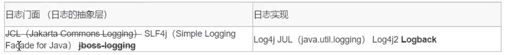

- slf4j
- logback

### 集成到mybatis中

1. 添加maven依赖

classic依赖core，是和slf4j的适配器

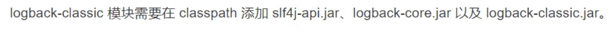

```xml
<!--log start-->
<dependency>
    <groupId>org.slf4j</groupId>
    <artifactId>slf4j-api</artifactId>
    <version>1.7.30</version>
</dependency>
<dependency>
    <groupId>ch.qos.logback</groupId>
    <artifactId>logback-classic</artifactId>
    <version>1.2.3</version>
</dependency>
<!--log end-->
```

2. 日志输出到控制台，mybatis底层已经实现了日志的输出

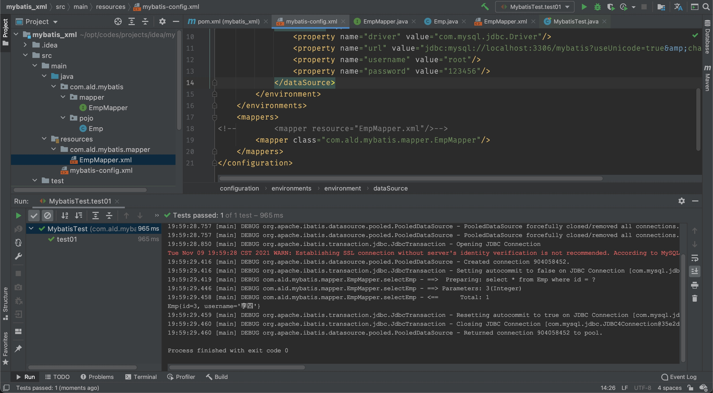

3. logback日志初始化步骤

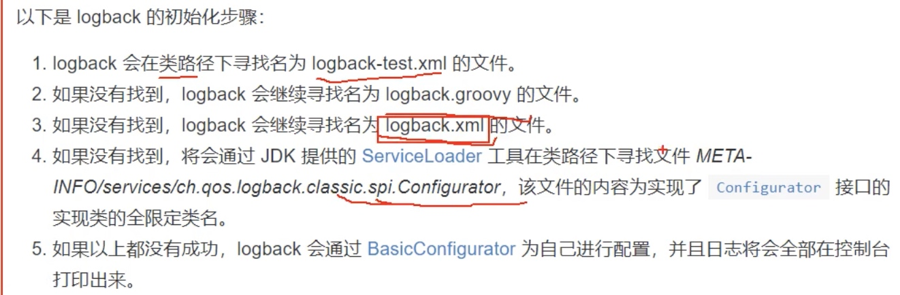

4. logback日志的使用

a. 使用门面作为多态

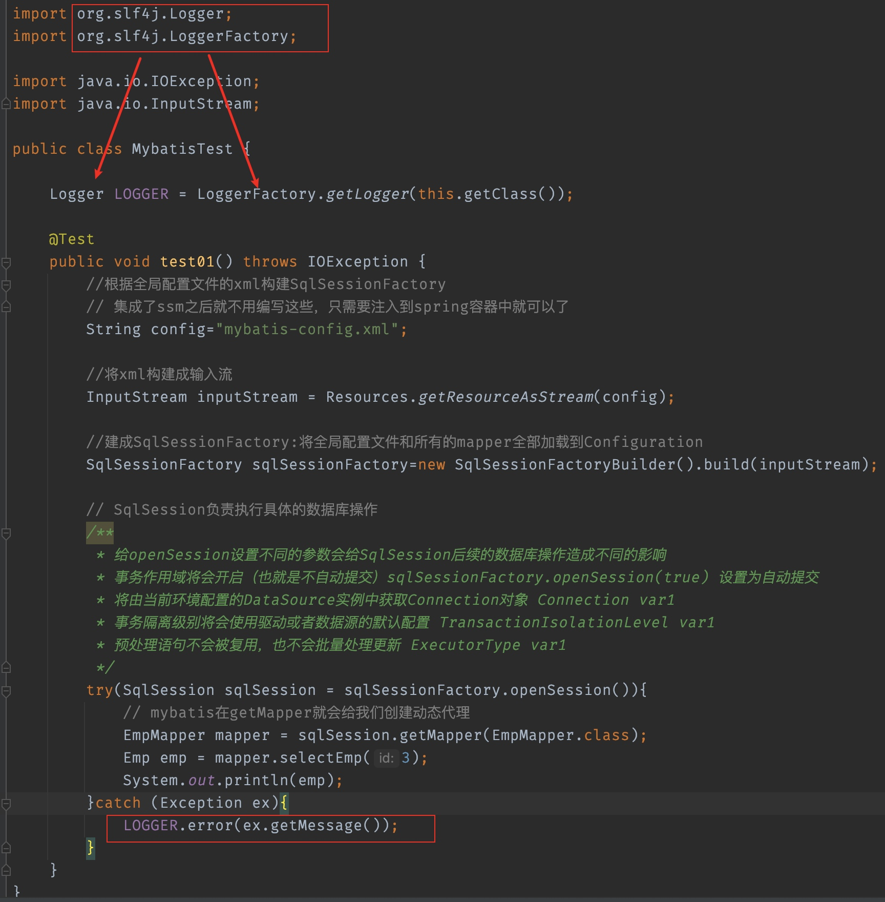

b. 日志级别，没有配置任何的日志级别的时候，默认是DEBUG


只要是日志级别大于当前设置的级别，就会输出

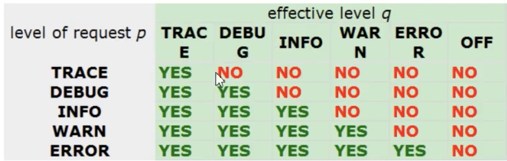

c. 日志配置

创建logback.xml

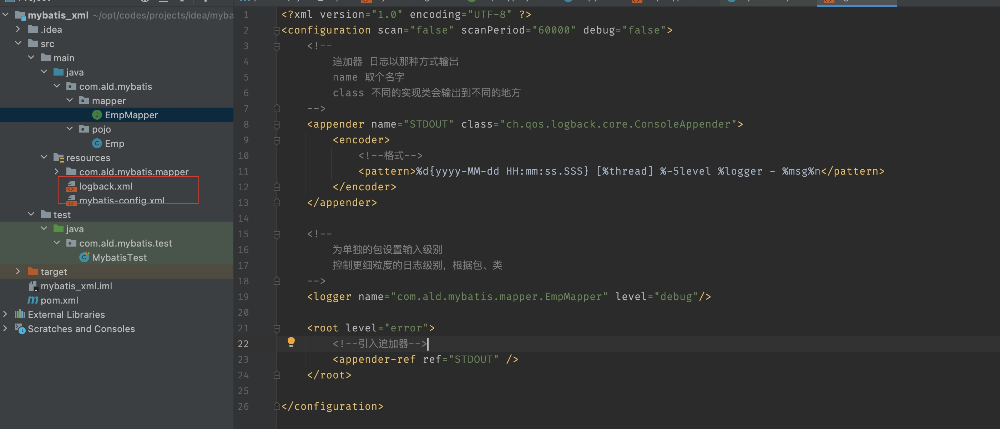

```xml
<?xml version="1.0" encoding="UTF-8" ?>
<configuration scan="false" scanPeriod="60000" debug="false">
    <!--
        追加器 日志以那种方式输出
        name 取个名字
        class 不同的实现类会输出到不同的地方
    -->
    <appender name="STDOUT" class="ch.qos.logback.core.ConsoleAppender">
        <encoder>
            <!--格式-->
            <pattern>%d{yyyy-MM-dd HH:mm:ss.SSS} [%thread] %-5level %logger - %msg%n</pattern>
        </encoder>
    </appender>

    <!--
        为单独的包设置输入级别
        控制更细粒度的日志级别，根据包、类
    -->
    <logger name="com.ald.mybatis.mapper.EmpMapper" level="debug"/>

    <root level="error">
        <!--引入追加器-->
        <appender-ref ref="STDOUT" />
    </root>

</configuration>
```

控制更细粒度的日志输出

```xml
<!--
    为单独的包设置输入级别
    控制更细粒度的日志级别，根据包、类
-->
<logger name="com.ald.mybatis.mapper.EmpMapper" level="debug"/>
```


## 全局配置文件和Mapper配置文件详解

### 全局配置文件

官网地址：https://mybatis.org/mybatis-3/zh/configuration.html

mybatis-config.xml解释

```xml
<?xml version="1.0" encoding="UTF-8" ?>
<!DOCTYPE configuration
        PUBLIC "-//mybatis.org//DTD Config 3.0//EN"
        "http://mybatis.org/dtd/mybatis-3-config.dtd">
<!--就是DOCTYPE后面对应的根节点-->
<configuration>
    <!--配置mysql连接信息 通过${}引用-->
    <properties resource="db.properties"/>

    <!--mybatis 的设置选项，可以改变mybatis的运行时行为-->
    <settings>
        <!--是否允许在sql中使用别名，默认是允许，当设置别名后会根据sql的别名和属性名进行映射（不会去设置）
        <setting name="useColumnLabel" value="false"/>-->

        <!--用于当字段名和属性名自动映射不匹配时，发生的动作
            默认 NONE 什么都不发生，没有映射就不赋值
            WARNING: 输出警告日志
            FAILING: 映射失败 (抛出 SqlSessionException)
        <setting name="autoMappingUnknownColumnBehavior" value="FAILING"/>-->

        <!--设置默认配置的执行器
            SIMPLE 就是普通的执行器，每一次执行sql语句都会去预编译sql语句
            REUSE 执行器会重用预处理语句（PreparedStatement），只会预处理一次，如果sql语句不是动态的发生变化的话，可以使用
            BATCH 执行器不仅重用语句还会执行批量更新
        <setting name="defaultExecutorType" value="REUSE"/>-->

        <!--设置超时时间，它决定数据库驱动等待数据库响应的秒数
        <setting name="defaultStatementTimeout" value="1"/>-->

        <!--mapUnderscoreToCamelCase 是否开启驼峰命名自动映射，
            即从经典数据库列名 A_COLUMN 映射到经典 Java 属性名 aColumn-->
        <setting name="mapUnderscoreToCamelCase" value="true"/>

        <!-- 当往数据库插入数据某个属性为null时映射到数据库的类型
            默认：OTHER mysql是可以识别出来OTHER类型的
                 NULL 如果是oracle 一定要设置成NULL，oracle识别不出OTHER类型
                 VARCHAR 当数据为空时，为数据库设置一个空字符串
        <setting name="jdbcTypeForNull" value="OTHER"/>-->

        <!--加入mybatis框架中实现了多个日志框架，可以使用LogImpl来设置使用的日志框架
            如果使用slf4j可以不用设置该配置，因为slf4j本事就是负责整合选择那种日志框架的
            如果没有使用日志门面，使用了多个日志框架，最好指定使用那个框架
            一般不用设置
        <setting name="logImpl" value="LOG4J"/>-->

        <!--开启延时加载-->
        <setting name="lazyLoadingEnabled" value="true"/>

        <!--当开启时，使用pojo中任意属性都会启用立即加载-->
        <setting name="aggressiveLazyLoading" value="false"/>
    </settings>

    <!-- 类型别名可为Java类型设置一个缩写名字，它仅用于xml配置，意在降低冗余的全限定类名书写 -->
    <typeAliases>
        <!-- 根据包设置里面所有类的别名：会将类的名字作为别名，忽略大小写

            除了可以设置自定义的类的别名以外，mybatis还内置很多常见的类型的别名
         -->
        <package name="com.ald.mybatis.pojo"/>
    </typeAliases>

    <!-- 插件：可以把它理解成mybatis的拦截器
        可以拦截4大对象:Executor\ParameterHandler\ResultSetHandler\StatementHandler
        可以拦截sql 给sql去加一些公共的功能
    -->
    <plugins>
        <plugin interceptor="org.mybatis.example.ExamplePlugin">
            <property name="someProperty" value="100"/>
        </plugin>
    </plugins>


    <!-- environments是个复数，可以多个环境
        default默认数据库环境
        development 选择environment中的环境
        可以通过切换环境切换测试环境、开发环境和生产环境
    -->
    <environments default="development">
        <!--environment 配置数据库环境，id指定当前数据库环境的唯一标识，会被父节点的default所设置-->
        <environment id="development">
            <!--事务管理器的类型
                type JDBC 使用JDBC的事务管理
                     MANAGED 不运用事务
            -->
            <transactionManager type="JDBC"/>
            <!--数据源
                type 指定连接池
                    POOLED 指定使用mybatis的连接池
                    UNPOOLED 不使用连接池
                    JNDI JNDI连接池 可以在Tomcat中使用
            -->
            <dataSource type="POOLED">
                <property name="driver" value="${mysql.driver}"/>
                <property name="url" value="${mysql.url}"/>
                <property name="username" value="${mysql.username}"/>
                <property name="password" value="${mysql.password}"/>
            </dataSource>
        </environment>

        <environment id="test">
            <!--事务管理器的类型
                type JDBC 使用JDBC的事务管理
                     MANAGED 不运用事务
            -->
            <transactionManager type="JDBC"/>
            <!--数据源
                type 指定连接池
                    POOLED 指定使用mybatis的连接池
                    UNPOOLED 不使用连接池
                    JNDI JNDI连接池 可以在Tomcat中使用
            -->
            <dataSource type="POOLED">
                <property name="driver" value="com.mysql.jdbc.Driver"/>
                <property name="url" value="jdbc:mysql://localhost:3306/mybatis_test?useUnicode=true&amp;characterEncoding=UTF-8"/>
                <property name="username" value="root"/>
                <property name="password" value="123456"/>
            </dataSource>
        </environment>
    </environments>

    <!---数据库厂商的标识，mybatis提供用于跨数据库平台
    type="DB_VENDOR" 利用数据库厂商的名称来区分
    根据不同的数据库调用不同的sql
    -->
    <databaseIdProvider type="DB_VENDOR">
        <property name="MySQL" value="mysql"/>
        <property name="Oracle" value="oracle" />
    </databaseIdProvider>

    <!--设置映射器-->
    <mappers>
        <!--四种映射方式
            1\mapper resource 设置Mapper.xml这种方式适用于根据statementId进行操作
            2\mapper class 设置Mapper接口 这种方式适用接口绑定的方式
            3\mapper url 使用磁盘的绝对路径 基本没用
            4\package 根据包设置Mapper接口，设置包下所有的类都是Mapper接口，扫描包下所有的接口都是Mapper接口
        -->
        <!-- <mapper resource="EmpMapper.xml.bak"/>-->
        <mapper class="com.ald.mybatis.mapper.EmpMapper"/>
    </mappers>
</configuration>
```

#### properties：配置mysql连接信息

db.properties

```properties
mysql.driver=com.mysql.jdbc.Driver
mysql.url=jdbc:mysql://localhost:3306/mybatis?useUnicode=true&amp;characterEncoding=UTF-8
mysql.username="root
mysql.password=123456
```

mybaits-config.xml

```xml
<!--配置mysql连接信息 通过${}引用-->
<properties resource="db.properties"/>

<!-- environments是个复数，可以多个环境
    default默认数据库环境
    development 选择environment中的环境
    可以通过切换环境切换测试环境、开发环境和生产环境
-->
<environments default="development">
    <!--environment 配置数据库环境，id指定当前数据库环境的唯一标识，会被父节点的default所设置-->
    <environment id="development">
        <!--事务管理器的类型
            type JDBC 使用JDBC的事务管理
                 MANAGED 不运用事务
        -->
        <transactionManager type="JDBC"/>
        <!--数据源
            type 指定连接池
                POOLED 指定使用mybatis的连接池
                UNPOOLED 不使用连接池
                JNDI JNDI连接池 可以在Tomcat中使用
        -->
        <dataSource type="POOLED">
            <property name="driver" value="${mysql.driver}"/>
            <property name="url" value="${mysql.url}"/>
            <property name="username" value="${mysql.username}"/>
            <property name="password" value="${mysql.password}"/>
        </dataSource>
    </environment>
</environments>
```

#### settings：设置信息

有properties不能写在properties上面

```xml
<!--mybatis 的设置选项，可以改变mybatis的运行时行为-->
<settings>
    <!--是否允许在sql中使用别名，默认是允许，当设置别名后会根据sql的别名和属性名进行映射（不会去设置）
    <setting name="useColumnLabel" value="false"/>-->

    <!--用于当字段名和属性名自动映射不匹配时，发生的动作
        默认 NONE 什么都不发生，没有映射就不赋值
        WARNING: 输出警告日志
        FAILING: 映射失败 (抛出 SqlSessionException)
    <setting name="autoMappingUnknownColumnBehavior" value="FAILING"/>-->

    <!--设置默认配置的执行器
        SIMPLE 就是普通的执行器，每一次执行sql语句都会去预编译sql语句
        REUSE 执行器会重用预处理语句（PreparedStatement），只会预处理一次，如果sql语句不是动态的发生变化的话，可以使用
        BATCH 执行器不仅重用语句还会执行批量更新
    <setting name="defaultExecutorType" value="REUSE"/>-->

    <!--设置超时时间，它决定数据库驱动等待数据库响应的秒数
    <setting name="defaultStatementTimeout" value="1"/>-->

    <!--mapUnderscoreToCamelCase 是否开启驼峰命名自动映射，
        即从经典数据库列名 A_COLUMN 映射到经典 Java 属性名 aColumn-->
    <setting name="mapUnderscoreToCamelCase" value="true"/>

    <!-- 当往数据库插入数据某个属性为null时映射到数据库的类型
        默认：OTHER mysql是可以识别出来OTHER类型的
             NULL 如果是oracle 一定要设置成NULL，oracle识别不出OTHER类型
             VARCHAR 当数据为空时，为数据库设置一个空字符串
    <setting name="jdbcTypeForNull" value="OTHER"/>-->

    <!--加入mybatis框架中实现了多个日志框架，可以使用LogImpl来设置使用的日志框架
        如果使用slf4j可以不用设置该配置，因为slf4j本事就是负责整合选择那种日志框架的
        如果没有使用日志门面，使用了多个日志框架，最好指定使用那个框架
        一般不用设置
    <setting name="logImpl" value="LOG4J"/>-->

    <!--开启延时加载-->
    <setting name="lazyLoadingEnabled" value="true"/>

    <!--当开启时，使用pojo中任意属性都会启用立即加载-->
    <setting name="aggressiveLazyLoading" value="false"/>
</settings>
```

#### typeAliases

类型别名可为 Java 类型设置一个缩写名字，它仅用于 XML 配置

将包下的所有类都使用别名，类名作为别名，忽略大小写

```xml
<!-- 类型别名可为Java类型设置一个缩写名字，它仅用于xml配置，意在降低冗余的全限定类名书写 -->
<typeAliases>
    <!-- 根据包设置里面所有类的别名：会将类的名字作为别名，忽略大小写

        除了可以设置自定义的类的别名以外，mybatis还内置很多常见的类型的别名
     -->
    <package name="com.ald.mybatis.pojo"/>
</typeAliases>
```

也可以使用注解方式来使用别名

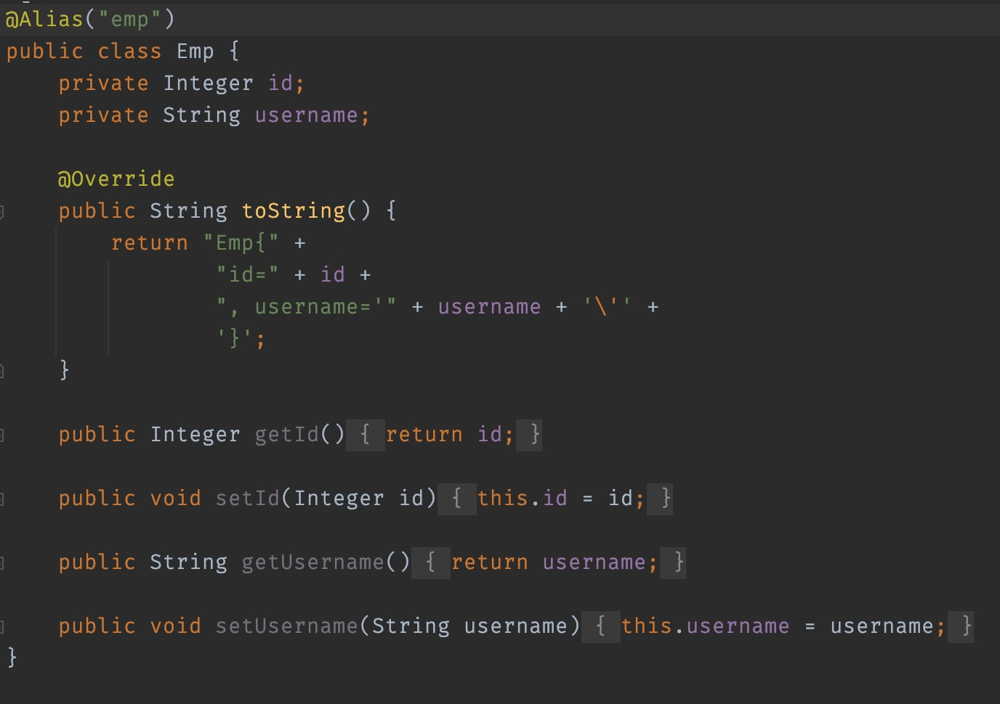

使用

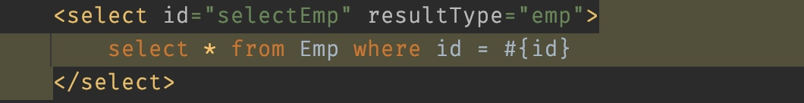

除了可以设置自定义的类的别名以外，mybatis还内置很多常见的类型的别名

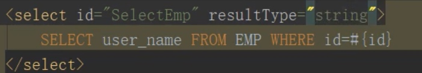

下面是常见的Java类型内建类型的别名，不区分大小写

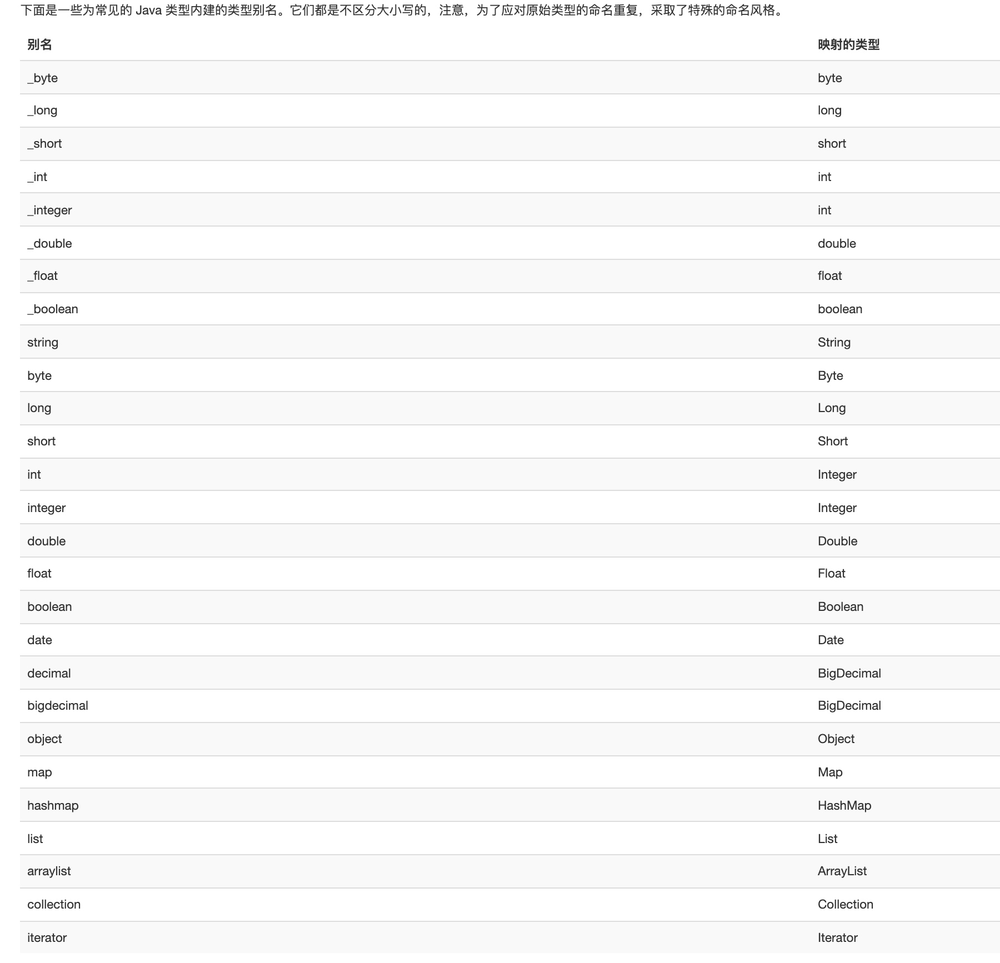

#### objectFactory（对象工厂）

每次 MyBatis 创建结果对象的新实例时，它都会使用一个对象工厂（ObjectFactory）实例来完成实例化工作

#### plugins（插件）：

允许你在映射语句执行过程中的某一点进行拦截调用

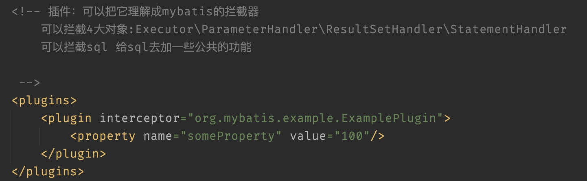

#### databaseIdProvider（数据库厂商标识）

数据库厂商标识：mybatis提供用于跨数据库平台

获取数据库的厂商名称

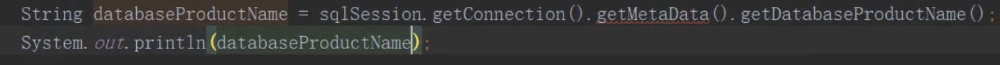

配置databaseIdProvider

```xml
<databaseIdProvider type="DB_VENDOR">
    <property name="MySQL" value="mysql"/>
    <property name="Oracle" value="oracle" />
</databaseIdProvider>
```

配置给不同的数据库厂商编写数据库语句

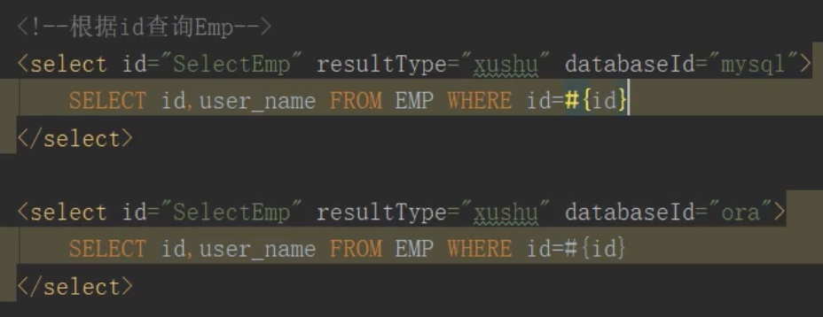

### Mapper配置文件

官网地址：https://mybatis.org/mybatis-3/zh/sqlmap-xml.html

#### namesapce：命名空间

一般情况下，一个mapper映射文件对应一个不同的命名空间，利于管理和维护，如果使用的是接口，就要必须输入对应接口的完整命名空间

```xml
<mapper namespace="com.ald.mybatis.mapper.EmpMapper"></mapper>
```

#### 增删改

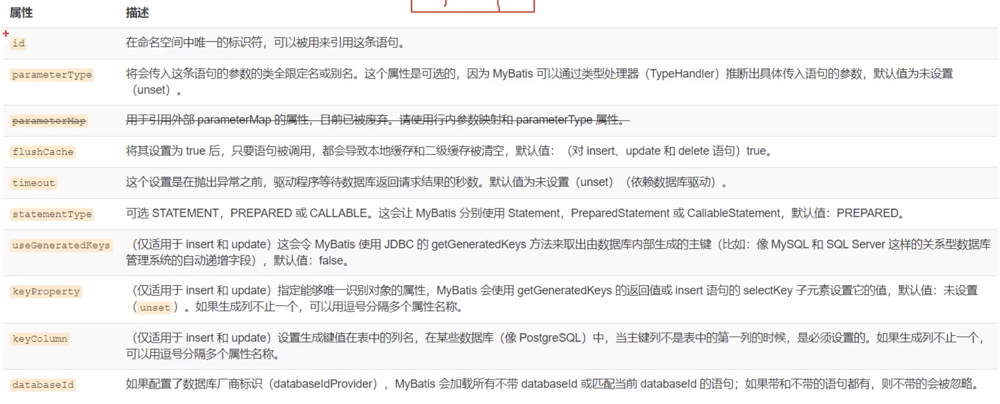

```xml
<!-- 插入
    id  在命名空间中唯一的标识符，可以被用来引用这条语句，不可以重复，
        在方法中做方法重载也不行应用多个相同id的语句，一定要保证方法名不同
        除非设置dataBaseId表示应用到不同的数据库
    parameterType 用来设置该SQL的参数类型，因为mybatis会根据接口方法的参数自动读取到对应参数
                  可以忽略
    statementType 设置当前的statement ,
                  STATEMENT Statement 不支持参数解析
                  PREPARED PreparedStatement 支持预解析 默认的，防止SQL注入
                  CALLABLE CallableStatement 执行存储过程，不利于数据的维护、迁移
    useGeneratedKeys 获取插入后的自动增长的主键（只能用子啊mysql 和 SQL server）
                     默认值是false
    keyProperty 将自动增长的列赋值到那个属性中，数据库要支持自动增长
                要获取自动增长的主键可以使用这两个属性：useGeneratedKeys="true" keyProperty="id"
    keyColumn 因为有可能存在多列组合主键的情况，指定获取其中的哪一个字段
    databaseId 用于配置databaseProvider 数据库厂商的id 指定不同的数据库下调用不同的sql
 -->
<insert id="insertEmp" useGeneratedKeys="true" keyProperty="id">
    <!-- selectKey 可以在增删改之前或之后运行，Oracle不可以自动设置主键，可以使用这个去查出最后一个id
               并给到insert语句拿到新增的id，数据库不支持自动增长可以使用
          order
            BEFORE 插入之前运行
            AFTER 插入之后运行
          keyProperty 将当前结果放到那个pojo属性中
          resultType 返回值
    -->
    <selectKey order="BEFORE" resultType="int">
        select  max(id)+1 from emp
    </selectKey>
    INSERT INTO `mybatis`.`emp` (`username`) VALUES (#{username});
</insert>

<update id="updateEmp">
    UPDATE `mybatis`.`emp` SET `username` = #{username} WHERE `id` = #{id};
</update>

<delete id="deleteEmp">
    delete from emp where id=#{id}
</delete>
```

增删改返回值除了可以声明为int，还可以声明为boolean(如果大于1就返回true)

#### 查

处理比较多，这里列出来，下一章会详细讲到

```xml
<!--
    获取参数的方式
    #{} ===> jdbc String sql="select * from Emp where id = ?"
        1、会经过jdbc当中的PreparedStatement 的编译，会根据不同的数据类型来编译成对应的数据库所对应的数据 String ==> "",int ==>123
        2、能够有效的防止sql注入 推荐使用
        特殊用法：
            自带的很多的内置参数的属性，通常不会去使用。了解
                javaType、jdbcType、mode、numericScale、resultMap、typeHandler
                比如：需要改变默认的NULL==>OTHER，可以使用#{id.javaType=NULL}，当传入的为null的时候，不会在Oracle中映射为NULL而不是空字符串
                     想保留小数点后两位：#{id,numericScale=2}

    ${} ===> jdbc String sql="select * from Emp where id = "+id
        1、不会进行预编译，会直接将输入进来的数据拼接在sql中
        2、存在sql注入的风险，不推荐使用
        特殊用法：
            1、调试情况下可以临时使用，因为可以在控制台中输出运行的语句，可以拿到数据库中执行
            2、实现一些特殊功能：在保证数据的安全性的情况下，给开发人员使用，比如：动态表、动态列、动态sql，因为#{}的方式会将字符串编译成带双引号的，不能变成表名

-->

<!--
    参数传递的处理：
        单个参数：selectEmp(Integer id)
            mybatis不会有什么强制的要求，可以输入任何字符获取参数，不需要和接口的中的对应
        多个参数：selectEmp(Integer id,String username)
            会进行封装，会传递进来的参数封装成map，一个值就会对应2个map项，
                id===>{key:arg0,value:id的值}，{key:param1,value:id的值}
                username===>{key:arg1,value:username的值}，{key:param2,value:username的值}
            所以可以使用
                id===>#{arg0} 或者 #{param1}
                username===>#{arg1} 或者 #{param2}
            除了使用这种方式还有别的方式，因为这种方式参数名没有意义，还可以使用注解的方式声明传入的参数名称
                Emp selectEmp(@Param("id") Integer id);//当然还是可以使用param的方式获取（arg方式失效）
        javaBean参数：
            单个javaBean：selectEmp(Emp emp)
                获取方式：
                    emp.id===>#{id}
                    emp.username==>#{username}
            多个javaBean：selectEmp(Integer num,Emp emp)
                没有使用注解的情况下：
                    num===>#{arg0} 或者 #{param1}
                    emp.id===>#{arg1.id} 或者 #{param2.id}
                使用了注解的情况：可以使用param和定义的别名，但是不能使用arg
        集合或者数组参数：selectEmps(List<String> usernames)，加了注解的情况下和上面的一样，只能用params和别名，但是不能用arg
            如果是list，mybatis会自动封装为一个map：
                {key:"list",value:usernames}
                    usernames[0]===>#{list[0]} //现在先是这种方式，后面可以使用动态sql，也就是for循环的方式迭代
            如果是数组，mybatis会自动封装为一个map：
                {key:"array",value:usernames}
                    usernames[0]===>#{array[0]}
        map方式
            和javaBean的方式一样，
            一般情况下：
                插入或修改这种参数和javaBean属性的操作是全对应的情况，
                请求进来的参数没有和javaBean对应（规范的javaBean应该是和表是一一对应的，所以会出现你传入的查询参数和javaBean不一致的情况），就用map
                请求进来的参数，没有和javaBean对应上，但是使用频率很高，就使用to dto（单独的这些参数创建一个对应的javaBean出来）
-->

<!--
    如果返回的是一行数据，就可以死使用pojo接收，也可以使用map接收
    如果返回多行数据，就可以使用List<pojo>或者List<map>，resultType指定泛型的类型就可以了，
        即resultType="com.ald.mybatis.pojo.Emp"或者resultType="Map"，然后在接口中声明为List<Emp>或者List<Map>
    基础类型或者包装类型就直接指定别名就可以了

-->


<resultMap id="common_map" type="com.ald.mybatis.mapper.EmpMapper" autoMapping="false">
    <id column="id" property="id"/>
    <result column="user_name" property="username"/>
    <result column="create_date" property="cjsj"/>
</resultMap>
<!--1、声明resultMap自定义结果集
    id 唯一标识，需要和select上的resultMap进行对应
    type 需要映射的pojo对象，可以设置别名
    autoMapping 自动映射，（默认=true）只要字段名和属性名遵循映射规则就可以自动映射，但是不建议，
                哪怕属性名和字段名对应上了，也要显式的配置映射
    extends 如果多个resultMap有重复映射，可以声明一个父resultMap，将公共的映射提取出来，可以减少子resultMap的映射冗余
-->
<resultMap id="emp_map" type="com.ald.mybatis.mapper.EmpMapper" autoMapping="false" extends="common_map">
    <!--主键必须使用id节点，对底层的存储有性能作用
            column 需要映射的数据库字段
            property 需要映射的pojo属性名
        result中也是一样的
    -->
    <id column="id" property="id"/>
    <result column="user_name" property="username"/>
    <result column="create_date" property="cjsj"/>
</resultMap>
<!--2、使用resultMap关联自定义结果集的id-->
<select id="selectEmp" resultType="emp_map">
    select * from Emp where id = #{id}
</select>
```

## 输出参数、输出结果处理

### 参数的获取方式

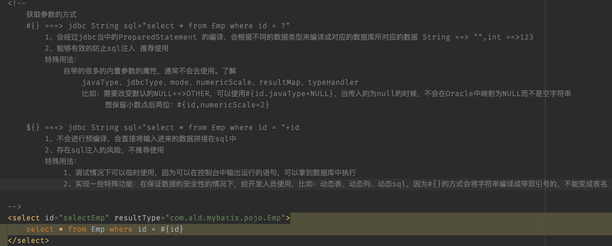

### 参数的传递方式

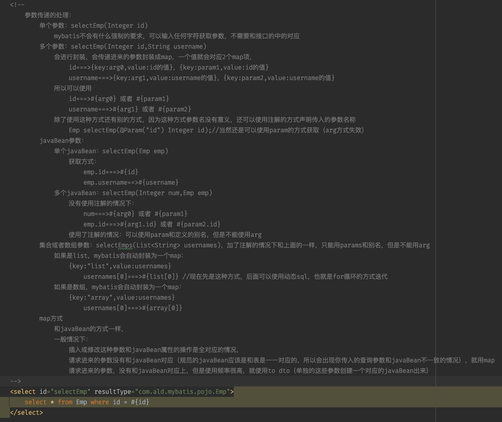

### 结果处理

#### 处理集返回结果

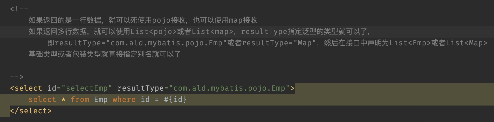

#### 自定义结果集-resultMap

基本用法，resultMap和resultType只能同时使用一个

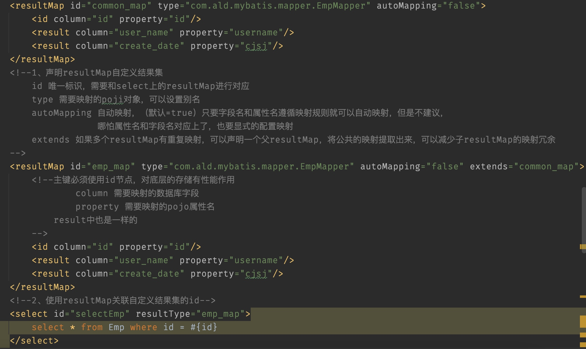

##### 高阶结果映射

1. 联合查询

创建对应的查询语句和resultMap，实现表连接的方式实现表关联

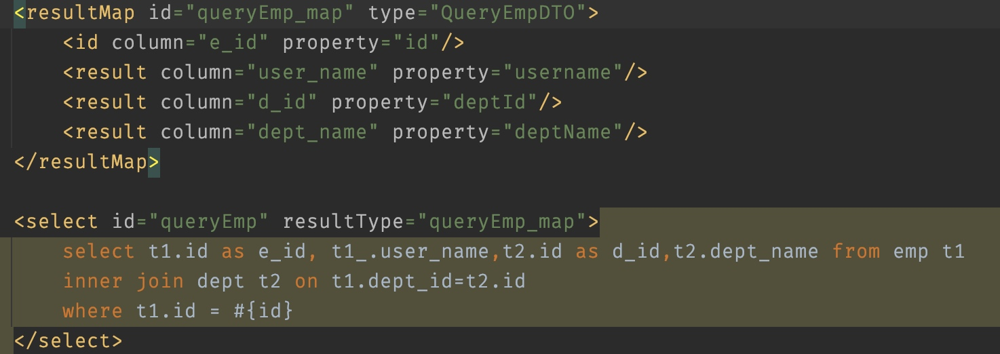

创建对应的DTO

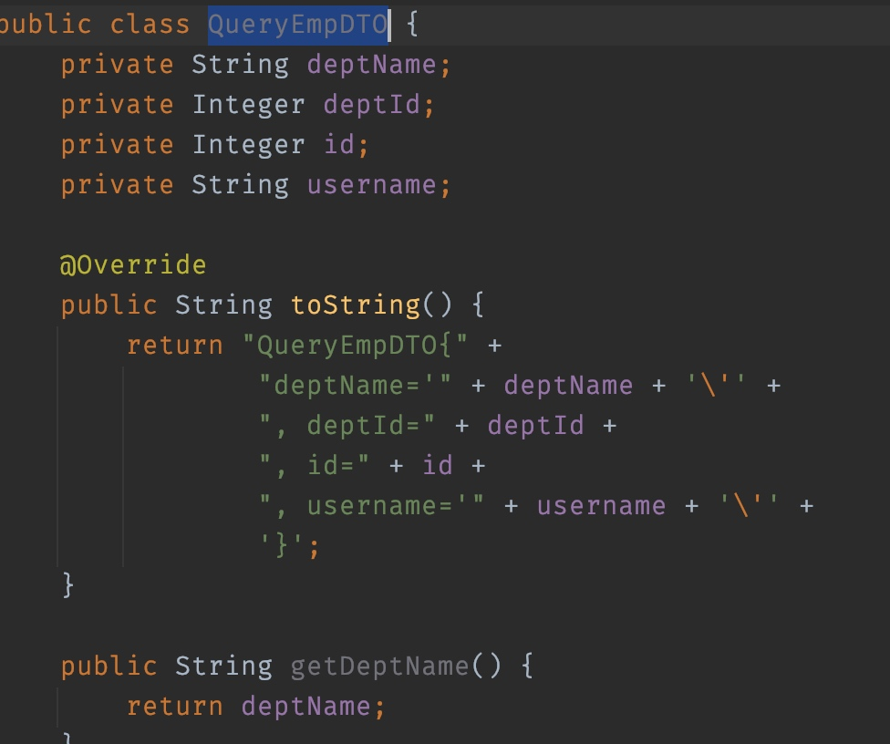

2. 嵌套结果

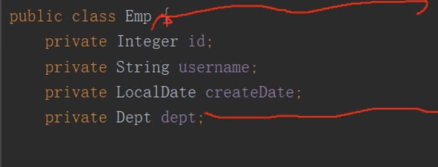

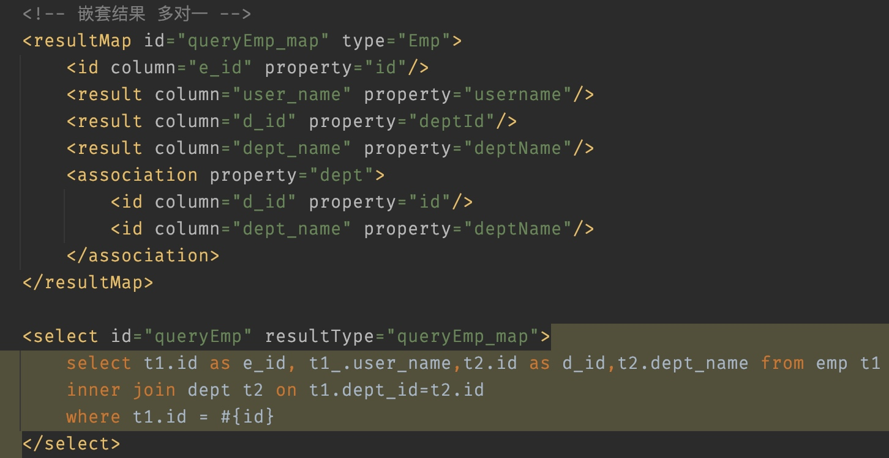

3. 嵌套查询（分布查询）：：嵌套查询支持懒加载（延迟加载）

`<association property="dept" column="dept_id" select="com.ald.mybatis.mapper.DeptMapper.selectDept"/>`链接到DeptMapper.xml文件中

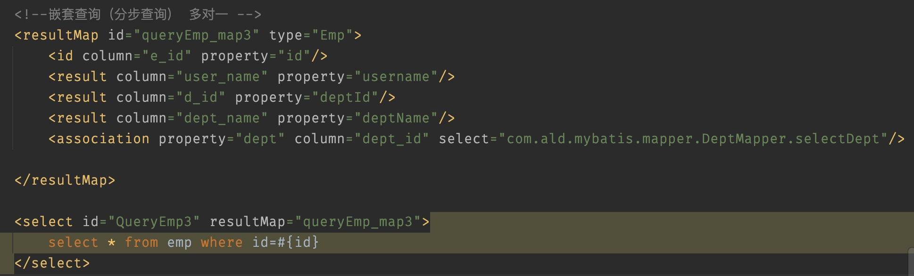

DeptMapper.xml文件

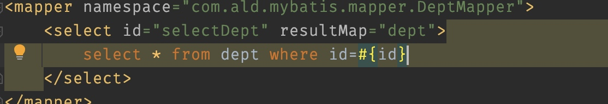

4. 延迟查询

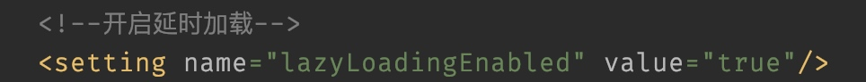


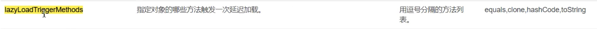

a. 三个设置延迟加载的属性总结

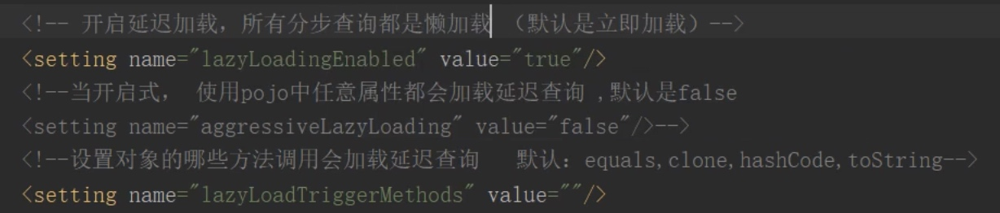

b. 设置其中一个方法不懒加载

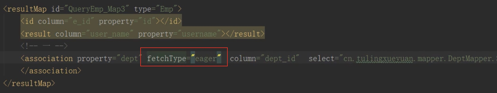

> 要设置懒加载一定是嵌套查询
> 要启动懒加载可以在全局文件中设置`lazyLoadingEnabled=true`

5. 多对一结果映射

从部门查员工

使用Listj接收

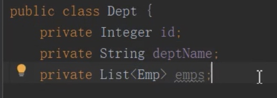

- 可以通过嵌套结果
- 也可以通过嵌套查询方式获取

a. 联合查询的方式

sql语句

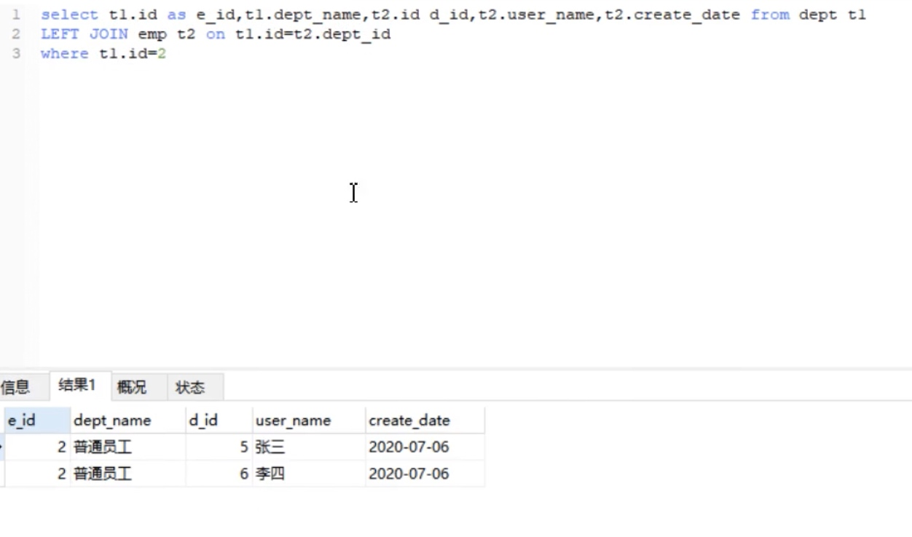

查询普通员工部门的所有员工

EmpMapper.xml

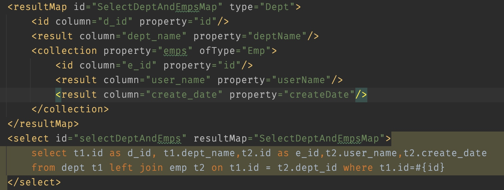

b. 嵌套查询

EmpMapper.xml

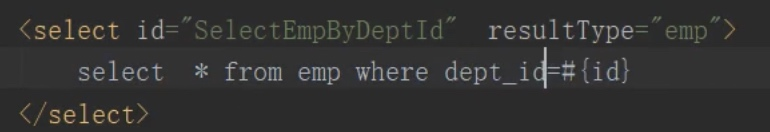

DemtMapper.xml

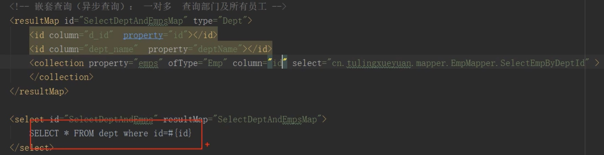

collection标签解释

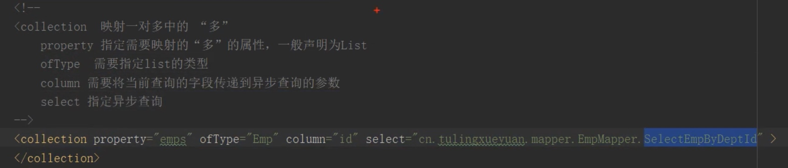

c. 结果

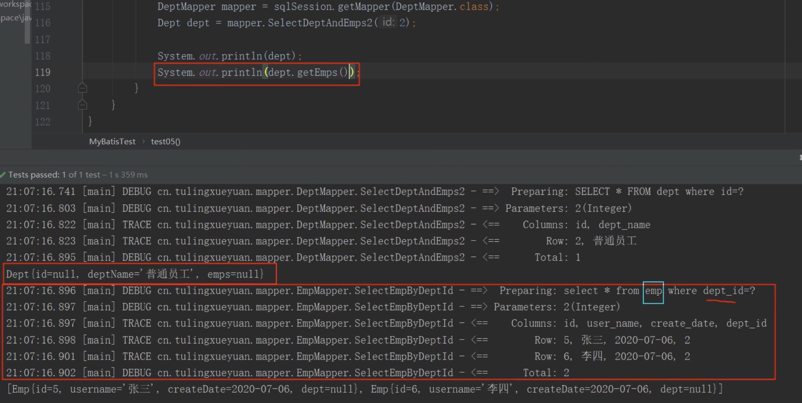

6. 


## 动态sql

官方网址：https://mybatis.org/mybatis-3/zh/dynamic-sql.html

### 多条件查询

编写多条件 使用and连接

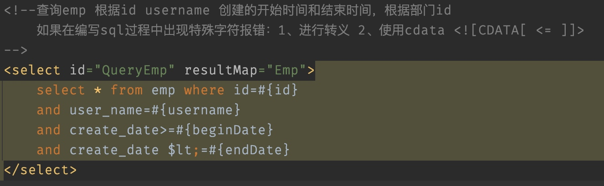

使用List接收

### if

使用if动态拼接条件

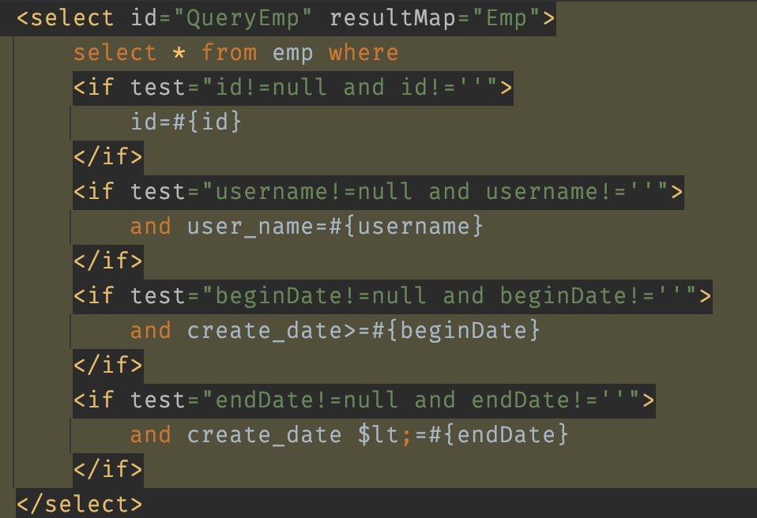

修改一下：日期不能使用字符串的方式判定，去除后面的=''

### where

会添加where到语句中，并删除多余的and

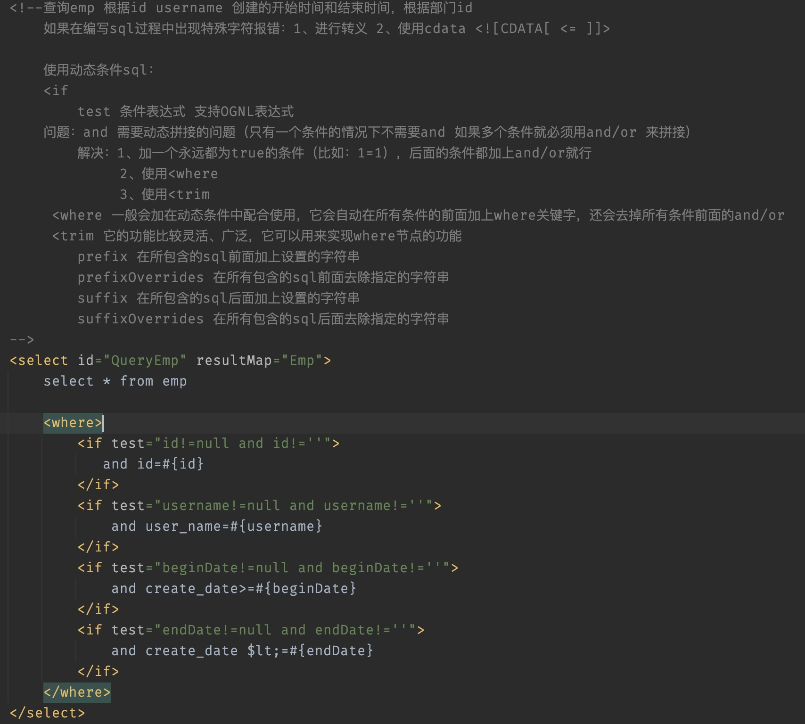

### trim

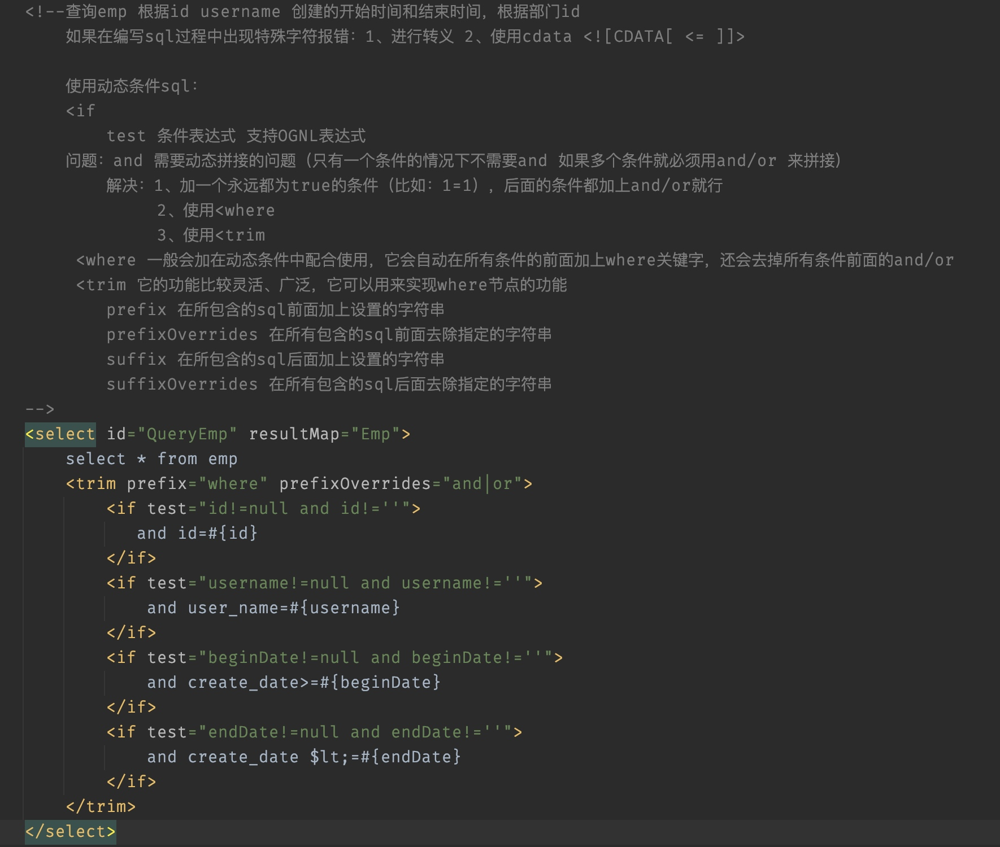
	

### foreach

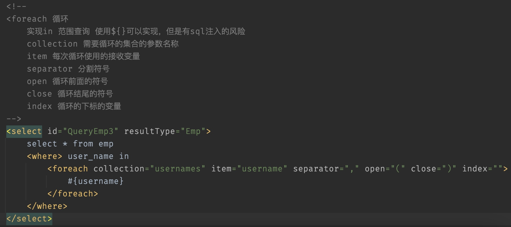
	

### choose\when\otherwise

类似于Java语言中的switch-case


### set，用在update语句

在使用通用更新的时候，因为是拼接的sql语句，此时会出现不需要更新的字段也会出现在更新语句中，并且为null的情况，此时为了不让它覆盖掉数据库中的原始数据，需要判定是否为null或者空，来决定是否拼接到更新语句中

1. trim实现更新方式


2. set方式


> 说明：用在update语句上，会自动加上set关键字，会自动去除最后一个字段的逗号

### bind


### sql片段


解决sql中重复的代码冗余，可以提取出来放在sql片段中


通过property传入参数，要使用$符号获取参数，因为#会给参数加上”“


	

### 批量插入

#### 循环逐条插入（性能最差）

xml sql语句


Java代码


耗时


#### 设置session为BATCH

在上面的基础上修改，但是修改Batch在集成ssm之后很难单个设置，所以最好使用foreach标签


耗时


#### 使用foreach标签，可移植性小，Oracle不支持

sql xml


耗时


如果把inert放到foreach中，让数据库一次执行多条语句，会报错，因为数据库驱动不支持一次执行多条语句


解决方案

设置allowMultiQueries为true


拼在url后面


耗时


## 一级、二级缓存

默认情况下，只启用本地的会话缓存，它仅仅对一个会话中的数据进行缓存，要启用全局的二级缓存，只需要sql映射文件中添加一行

### 一级缓存的使用

设置为Statement相当于关闭一级缓存


缓存的实现


#### 特性

- 默认就开启了
- 作用域是基于sqlSession的（默认），一次数据库操作会话
- 缓存默认实现类`PerpetualCache`，使用map进行存储的
  - key==>hashcode+sqlId+sql+hashcode+development
- 查询完就会被存储

#### 失效的情况

- 不同的sqlSession会使一级缓存失效
- 同一个sqlSession，查询语句不一样，也会使得一级缓存失效
- 同一个sqlSession的情况下，两次查询期间执行了增删改
- 同一个sqlSession，查询语句一样，执行手动清除缓存

### 二级缓存

是全局作用域缓存，默认不开启，需要手动进行配置，mybatis提供二级缓存的接口以及实现，缓存实现的时候要求实体实现Serializable接口，二级缓存在sqlSession关闭或者提交之后才会生效

mybais默认就是这么设置的，如果出现启用了二级缓存，但是却没有缓存的情况，看一下是否被设置为了false


#### 缓存的使用

##### 特性

1. 默认开启了，没有实现


2. 作用域：基于全局范围，应用级别


3. 缓存默认实现类 PerpetualCache，使用map进行存储的，但是二级缓存根据不同的mapper命名空间多包了一层map

存储在`org.apache.ibatis.session.Configuration`

key：mapper命名空间，value：PerpetualCache.map

key==>hashcode+sqlId+sql+hashcode+development

4. 事务提交的时候（sqlSession关闭）存储到二级缓存

##### 实现

1. 开启二级缓存`<setting name="cacheEnabled" value="true"/>`
2. 在需要用到二级缓存的映射文件中加入`<cache></cache>`，基于Mapper映射文件来实现缓存的，基于Mapper映射文件的命名空间来存储的
3. 在需要使用到二级缓存的javaBean中实现序列化接口implements Serializable

##### 失效的情况

1. 同一个命名空间进行了增删改的操作，会导致二级缓存失效

但是如果不想清空的话，可以将sql语句设置flushCache为true，默认是false，当执行该sql就会清空二级缓存，false就不会清空二级缓存


2. 让查询的结果不缓存到二级缓存中

true 使用；false 不使用


##### 案例

部门表和员工表，如果是部门表联合查询员工表，想让员工表在执行增删改之后让联合查询的二级缓存刷新

可以使用缓存依赖到部门表


#### 缓存的属性

1. eviction：当缓存达到一定数量的时候（size的数量），以那种方式进行回收缓存

可选值

- LRU – 最近最少使用：移除最长时间不被使用的对象。
- FIFO – 先进先出：按对象进入缓存的顺序来移除它们。
- SOFT – 软引用：基于垃圾回收器状态和软引用规则移除对象。
- WEAK – 弱引用：更积极地基于垃圾收集器状态和弱引用规则移除对象。

2. flushInterval
   刷新时间 毫秒

3. size
   可以缓存的数量

4. readOnly

设置数据是否只读

- true 读取缓存的数据性能更高，任何操作都会修改缓存中的数据
- false 默认，读取缓存的数据性能更低，会将数据拷贝一份


5. type

二级缓存的实现类，默认就是这个（可省略）：`org.apache.ibatis.cache.impl.PerpetualCache`

- 如果想要使用其他第三方的缓存，可以修改这个的值
- 但是第三方必须要实现mybatis的Cache接口

#### 二级缓存的作用范围


#### 整合第三方缓存

mybatis的缓存是存储在jvm内存中的，太占内存了

##### 使用缓存中间件

可选的有memcached、redis、ehcache等

**使用redis**

1. 下载安装（解压版）

2. 集成到mybatis


添加依赖


创建文件redis.properties


将二级缓存实现类修改成`org.mybatis.caches.redis.RedisCache`


使用方式哪里找


3. 可视化工具

readis studio


### 缓存是先从一级中拿还是先从二级中拿？

两次二级都没有命中，说明两次查询二级缓存中都没有拿到，但是这个查询只查了数据库一次，说明第二次是从一级缓存中拿到的，所以说是**先从二级缓存中拿**


一旦提交事务之后，就能从二级中命中了


## 分页插件

官方网址：https://github.com/pagehelper/Mybatis-PageHelper

### 概念

mybatis插件可以在不修改原来的代码的情况下，通过拦截的方式，改变四大核心对象的行为，比如处理参数，处理sql，处理结果

#### mybatis四大核心对象


执行器

- simple
- reuse
- batch

#### mybatis插件典型适用场景

- 分页功能：通过拦截StatementHandler的prepare方法，改变要执行的sql语句为分页语句即可
- 日志功能
- 性能监控

#### 基本可以控制sql各个阶段

- 执行阶段：Executor
- 参数处理阶段：ParameterHandler
- 语法构建阶段：StatementHandler
- 结果集阶段：ResultSetHandler

### 分页插件使用

#### 使用方式

引入依赖


在mybatis配置xml中配置拦截器插件


查询之前设置PageHelper.startPage...


将Page转成PageInfo，获取到更多的api


#### 参数


1. helperDialect：设置当前数据库的方言，默认会自动检查当前数据库环境使用的数据库方言
2. offsetAsPageNum
3. pageSizeZero
4. reasonable
5. params
6. supportMethodsArguments
7. autoRuntimeDialect

### PageHelper原理


- 插件是层层拦截的，我们又需要用到另一种设置模式--责任链模式
- mybatis内部对于插件的处理确实使用了代理模式
- 我们自己编写的插件才知道要从哪里去拦截
- mybatis代理的是底层的四大对象

四大对象可代理的函数


## 逆向工程

项目网址：https://github.com/mybatis/generator

idea有插件

### 引入pom依赖


### 编写配置文件

