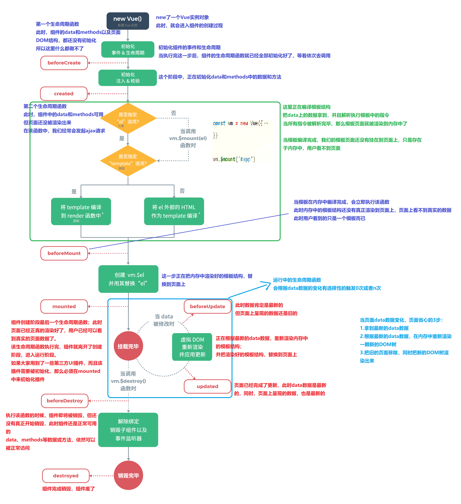

## vue引言

> 渐进式的JavaScript框架 -- 官网

特点： 

- 渐进式
  - 易用 html css javascript
  - 高效 开发前端页面 非常高效
  - 灵活 开发灵活 多样性
- 总结：
  - vue是一个JavaScript框架，boostrap是一个html和css框架
- 后端服务端开发人员：
  - vue渐进式JavaScript框架：让我们操作很少的dom，甚至不需要操作页面中的dom元素，就很容易的完成数据和视图的绑定 双向绑定 MVVM
  - 注意：日后在使用Vue的过程中，页面中不要在引入jQuery框架

htmlcss--->javascript---->jquery--->angulaerjs--->vue

> vue作者 尤雨溪

### vue入门

> 官网地址：https://cn.vuejs.org/v2/guide/

### 下载vue.js

开发版本：

```html
<!-- 开发环境版本，包含了有帮助的命令行警告 -->
<script src="https://cdn.jsdelivr.net/npm/vue@2/dist/vue.js"></script>
```

生产版本：

```html
<!-- 生产环境版本，优化了尺寸和速度 -->
<script src="https://cdn.jsdelivr.net/npm/vue@2"></script>
```

## vue第一个入门项目

```html
<!DOCTYPE html>
<html lang="en">
<head>
    <meta charset="UTF-8">
    <title>vue第一个入门案例</title>
</head>
<body>
<div id="app">
    {{ msg }} {{ username }} {{ pwd }}
</div>
<!-- 开发环境版本，包含了有帮助的命令行警告 -->
<script src="https://cdn.jsdelivr.net/npm/vue@2/dist/vue.js"></script>
<!--这段代码要保证在dom渲染之后-->
<script>
    const app = new Vue({
        el: "#app", // 用来给Vue实例定义一个作用范围
        data: { // 用来给Vue实例定义一些相关的数据
            msg: "hello world",
            username: "张三",
            pwd: "12345"
        },
    });
</script>
</body>
</html>
```

总结：

- vue实例(对象)中el属性：代表Vue的作用范围，日后在使用Vue的作用范围内都可以使用Vue的语法
- Vue实例(对象)中data属性：用来给Vue实例绑定一些相关的数据，绑定的数据可以通过`{{变量名}}`在Vue作用范围内取出
- 在使用`{{}}`进行获取data中数据时，可以在`{{}}`中书写表达式、运算符、调用相关方法以及逻辑表达式
- el属性中可以书写任意的css选择器`[jquery选择器]`，但是在使用Vue开发是推荐使用id选择器

## vue基础语法

### v-text和v-html

#### v-text

> v-text 用来获取data中数据以文本的形式渲染到指定的标签内部，类似于JavaScript中的innerText

```html
<body>
<div id="app">
    <span v-text="msg"></span>
</div>
<!-- 开发环境版本，包含了有帮助的命令行警告 -->
<script src="https://cdn.jsdelivr.net/npm/vue@2/dist/vue.js"></script>
<!--这段代码要保证在dom渲染之后-->
<script>
    const app = new Vue({
        el: "#app",
        data: {
            msg: "hello vue",
        },
    });
</script>
</body>
```

总结：

- {{}} 插值表达式和v-text获取数据的区别在于

  - 使用v-text取值会将标签中原有的数据覆盖，使用插值表达式的形式不会覆盖标签原有的数据
  - 使用v-text可以避免在网络环境比较差的情况下出现的插值闪烁

  

#### v-html

> v-html 用来获取data中数据，将数据中含有的html标签先解析在渲染到指定的标签的内部 类似于JavaScript中的innerHTML

```html
<body>
<div id="app">
    <p>v-text：<span v-html="msg"></span></p>
</div>
<!-- 开发环境版本，包含了有帮助的命令行警告 -->
<script src="https://cdn.jsdelivr.net/npm/vue@2/dist/vue.js"></script>
<!--这段代码要保证在dom渲染之后-->
<script>
    const app = new Vue({
        el: "#app",
        data: {
            msg: "<h1>hello vue</h1>",
        },
    });
</script>
</body>
```

### vue中事件绑定

(v-on)

#### 绑定事件基本语法

```html
<body>
<div id="app">
    <!--
        1. 页面中提供按钮
        2. 按钮绑定单击事件 onclick onmouseover onmove onkeyup ....
        3. 在单击事件中修改年龄的值，同时渲染页面
    -->
    <p>
        <span v-text="msg"></span>
        <input type="button" value="点我修改msg" v-on:click="changeMsg">
    </p>
</div>
<!-- 开发环境版本，包含了有帮助的命令行警告 -->
<script src="https://cdn.jsdelivr.net/npm/vue@2/dist/vue.js"></script>
<!--这段代码要保证在dom渲染之后-->
<script>
    const app = new Vue({
        el: "#app",
        data: {
            msg: "hello vue",
        },
        methods: { // methods 用来定义Vue中的事件
            changeMsg: function () {
                alert("单击触发")
                this.msg = "hello world"
            }
        }
    });
</script>
</body>
```

总结：

> 事件三要素：
>
> - 事件源：发生事件dom元素
> - 事件：发生特定的动作 click....
> - 监听器：发生特定动作之后的事件处理程序，通常是js中的函数

- 在Vue中绑定事件是通过v-on指令来完成的，v-on:事件名 如 v-on:click
- 在v-on:事件名的赋值语句中是当前事件触发调用的函数名
- 在Vue中事件的函数统一定义在Vue实例的methods属性中

- 在Vue定义的事件中，this指的是当前Vue实例，日后可以在事件中通过this获取Vue实例中的相关数据

#### vue中事件的简化写法

```html
<body>
<div id="app">
    <!--
        1. 页面中提供按钮
        2. 按钮绑定单击事件 onclick onmouseover onmove onkeyup ....
        3. 在单击事件中修改年龄的值，同时渲染页面
    -->
    <p>
        <span v-text="msg"></span>
        <!--<input type="button" value="点我修改msg" v-on:click="changeMsg">-->
        <!--通过@方式绑定事件-->
        <input type="button" value="点我修改msg" @click="changeMsg">
    </p>
</div>
<!-- 开发环境版本，包含了有帮助的命令行警告 -->
<script src="https://cdn.jsdelivr.net/npm/vue@2/dist/vue.js"></script>
<!--这段代码要保证在dom渲染之后-->
<script>
    const app = new Vue({
        el: "#app",
        data: {
            msg: "hello vue",
        },
        methods: { // methods 用来定义Vue中的事件
            changeMsg: function () {
                alert("单击触发")
                // 在函数中获取data的中的值 在事件函数中this就是vue实例
                this.msg = "hello world"
            }
        }
    });
</script>
</body>
```

总结：

- 日后可以在Vue中通过@符号形式简化绑定事件方式

#### vue事件函数两种写法

```html
<body>
<div id="app">
    <!--
        1. 页面中提供按钮
        2. 按钮绑定单击事件 onclick onmouseover onmove onkeyup ....
        3. 在单击事件中修改年龄的值，同时渲染页面
    -->
    <p>
        <span v-text="msg"></span>
        <input type="button" value="点我修改msg" v-on:click="changeMsg">
    </p>
</div>
<!-- 开发环境版本，包含了有帮助的命令行警告 -->
<script src="https://cdn.jsdelivr.net/npm/vue@2/dist/vue.js"></script>
<!--这段代码要保证在dom渲染之后-->
<script>
    const app = new Vue({
        el: "#app",
        data: {
            msg: "hello vue",
        },
        methods: { // methods 用来定义Vue中的事件
            // changeMsg: function () {
            //     alert("单击触发")
            //     // 在函数中获取data的中的值 在事件函数中this就是vue实例
            //     this.data.msg = "hello world"
            // }
            changeMsg() {
                    alert("单击触发")
                    // 在函数中获取data的中的值 在事件函数中this就是vue实例
                    this.msg = "hello world"
            }
        }
    });
</script>
</body>
```

总结：

- 在Vue中，事件存在两种写法，一种是：函数名:function(){} 一种是：函数名(){} 推荐

#### vue事件参数传递

```html
<body>
<div id="app">
    <!--
        1. 页面中提供按钮
        2. 按钮绑定单击事件 onclick onmouseover onmove onkeyup ....
        3. 在单击事件中修改年龄的值，同时渲染页面
    -->
    <p>
        <span>{{msg}}</span>
        <input type="button" value="点我修改msg" @click="changeMsg('消息')">
    </p>
</div>
<!-- 开发环境版本，包含了有帮助的命令行警告 -->
<script src="https://cdn.jsdelivr.net/npm/vue@2/dist/vue.js"></script>
<!--这段代码要保证在dom渲染之后-->
<script>
    const app = new Vue({
        el: "#app",
        data: {
            msg: "hello vue",
        },
        methods: { // methods 用来定义Vue中的事件
            changeMsg: function (message) {
                alert(message)
                // 在函数中获取data的中的值 在事件函数中this就是vue实例
                this.msg = message
            }
        }
    });
</script>
</body>
```

总结：

- 在使用事件时，可以直接在事件调用处给事件进行参数传递，在事件定义处，通过定义对应的变量接收传递的参数

### v-show v-if v-bind

#### v-show

> v-show 用来控制页面中的某个元素是否展示，底层控制是标签display属性

```html
<body>
<div id="app">
    <p>
        <input type="button" value="点我修改msg展示" v-on:click="changeMsg"><br>
        <span v-show="showMsg" v-text="msg"></span>
    </p>
</div>
<!-- 开发环境版本，包含了有帮助的命令行警告 -->
<script src="https://cdn.jsdelivr.net/npm/vue@2/dist/vue.js"></script>
<!--这段代码要保证在dom渲染之后-->
<script>
    const app = new Vue({
        el: "#app",
        data: {
            msg: "hello vue",
            showMsg: true,
        },
        methods: { // methods 用来定义Vue中的事件
            changeMsg: function () {
                // 在函数中获取data的中的值 在事件函数中this就是vue实例
                this.showMsg = !this.showMsg;
            }
        }
    });
</script>
</body>
```

总结：

- 在使用v-show时可以直接书写boolean值控制元素展示，也可以通过变量控制标签展示和隐藏
- 在v-show中可以通过boolean表达式控制标签的展示和隐藏

#### v-if

> v-if 用来控制页面元素是否展示，底层控制是DOM元素 操作DOM

```html
<body>
<div id="app">
    <p>
        <input type="button" value="点我修改msg展示" v-on:click="changeMsg"><br>
        <span v-if="showMsg" v-text="msg"></span>
    </p>
</div>
<!-- 开发环境版本，包含了有帮助的命令行警告 -->
<script src="https://cdn.jsdelivr.net/npm/vue@2/dist/vue.js"></script>
<!--这段代码要保证在dom渲染之后-->
<script>
    const app = new Vue({
        el: "#app",
        data: {
            msg: "hello vue",
            showMsg: true,
        },
        methods: { // methods 用来定义Vue中的事件
            changeMsg: function () {
                // 在函数中获取data的中的值 在事件函数中this就是vue实例
                this.showMsg = !this.showMsg;
            }
        }
    });
</script>
</body>
```

#### v-bind

> v-bind 用来给标签绑定属性响应属性

```html
<body>
<div id="app">
    <p>
        
    </p>
</div>
<!-- 开发环境版本，包含了有帮助的命令行警告 -->
<script src="https://cdn.jsdelivr.net/npm/vue@2/dist/vue.js"></script>
<!--这段代码要保证在dom渲染之后-->
<script>
    const app = new Vue({
        el: "#app",
        data: {
            msg: "hello vue",
            showCss: true,
        }
    });
</script>
</body>
```

总结：

- 它是一个 vue 指令，用于绑定 html 属性

#### v-bind简化写法

> vue为了方便我们日后绑定标签的属性提供了对属性绑定的简化写法 如 `v-bind:属性名` 简化之后 `:属性名`

### v-for的使用

> v-for 用来对对象进行遍历（数组也是对象的一种）

> idea webstorm等可以配置模板文件：
>
> 
>
> 这样在创建的时候可以直接创建代码结构

```html
<body>
<div id="app">
    <!--通过v-for遍历-->
    <span v-for="(u,index) in users" :key="index">
        <span>{{u.name}}--{{u.age}}--{{index}}</span>
        <br>
    </span>
</div>
<!-- 引入vue -->
<script src="https://cdn.jsdelivr.net/npm/vue@2/dist/vue.js"></script>
<script>
    const app = new Vue({
        el: "#app",
        data: {
            users: [
                {
                    name: "张三",
                    age: 12
                },
                {
                    name: "李四",
                    age: 13
                },
                {
                    name: "王五",
                    age: 14
                }
            ]
        },
        methods: {}
    });
</script>
</body>
```

总结：

- 在使用v-for的时候，一定要注意加入:key用来给vue内部提供重用和排序的唯一key

### v-model双向绑定

> v-model 作用用来绑定标签元素的值与vue实例对象中data数据保持一致，从而实现双向的数据绑定

```html
<body>
<div id="app">
    <input type="text" v-model:value="value">
</div>
<!-- 引入vue -->
<script src="https://cdn.jsdelivr.net/npm/vue@2/dist/vue.js"></script>
<script>
    const app = new Vue({
        el: "#app",
        data: {
            value:"",
        },
        methods: {}
    });
</script>
</body>
```

总结：

- 使用v-model实现数据的双向绑定
- 所谓双向绑定，就是表单中的数据变化导致vue实例中的data中的数据改变 vue实例data中数据变化到值表单中的数据变化

MVVM架构 双向绑定机制

- Model 数据 vue实例中绑定的数据
- VM viewModel 监听器，一旦Model中的数据改变或者View中的数据改变都会通知对方
- View 页面 页面展示的数据

### 事件修饰符

> 修饰符 用来和事件连用，用来决定事件触发条件或者阻止事件的触发机制
>
> 官方网址：https://cn.vuejs.org/v2/guide/events.html#%E4%BA%8B%E4%BB%B6%E4%BF%AE%E9%A5%B0%E7%AC%A6

常用的事件修饰符

- `.stop`
- `.prevent`
- `.capture`
- `.self`
- `.once`
- `.passive`

#### stop事件修饰符

> 用来阻止事件冒泡的

```html
<!-- 阻止单击事件继续传播 -->
<a v-on:click.stop="doThis"></a>
```

#### prevent事件修饰符

> 用来阻止标签的默认行为
>
> - 阻止连接跳转
> - 阻止表单提交
> - 等

```html
<!-- 提交事件不再重载页面 -->
<form v-on:submit.prevent="onSubmit"></form>

<!-- 修饰符可以串联 -->
<a v-on:click.stop.prevent="doThat"></a>
```

#### self事件修饰符

> 用来针对于当前标签的事件触发

```html
<!-- 只当在 event.target 是当前元素自身时触发处理函数 -->
<!-- 即事件不是从内部元素触发的 -->
<div v-on:click.self="doThat">...</div>
```

#### once事件修饰符

> 让指定的事件只触发一次

```html
<!-- 点击事件将只会触发一次 -->
<a v-on:click.once="doThis"></a>
```

### 按键修饰符

> 作用：用来与键盘中的事件绑定在一起，用来修饰特定的按键事件

常用的按键修饰符

- `.enter`
- `.tab`
- `.delete` (捕获“删除”和“退格”键)
- `.esc`
- `.space`
- `.up`
- `.down`
- `.left`
- `.right`

#### enter回车键

> 用来在触发回车按键之后触发

```html
<body>
<div id="app">
    <input type="text" @keyup.enter="onKeyup">
</div>
<!-- 引入vue -->
<script src="https://cdn.jsdelivr.net/npm/vue@2/dist/vue.js"></script>
<script>
    const app = new Vue({
        el: "#app",
        data: {},
        methods: {
            onKeyup(){
                alert("enter抬起")
            }
        }
    });
</script>
</body>
```

#### tab键

> 用来捕获tab键执行到当前标签时才会触发

## axios

### 引言

> axios是一个异步请求技术，核心作用就是用来在页面中发送异步请求数据，并获取对应数据在页面中渲染 页面的局部更新数据 类似于Ajax

### axios第一个程序

> 中文网站：https://www.kancloud.cn/yunye/axios/234845
>
> 引入：`<script src="https://unpkg.com/axios/dist/axios.min.js"></script>`

#### get请求方式

```javascript
// 为给定 ID 的 user 创建请求
axios.get('/user?ID=12345')
  .then(function (response) {
  console.log(response);
})
  .catch(function (error) {
  console.log(error);
});

// 可选地，上面的请求可以这样做
axios.get('/user', {
  params: {
    ID: 12345
  }
})
  .then(function (response) {
  console.log(response);
})
  .catch(function (error) {
  console.log(error);
});
```

#### post请求方式

```javascript
axios.post('/user', {
  firstName: 'Fred',
  lastName: 'Flintstone'
})
  .then(function (response) {
  console.log(response);
})
  .catch(function (error) {
  console.log(error);
});
```

#### axios并发请求

> 并发请求：将多个请求在同一时刻发送到后端服务接口，最后在集中处理每个请求的响应结果

```javascript
function getUserAccount() {
  return axios.get('/user/12345');
}

function getUserPermissions() {
  return axios.get('/user/12345/permissions');
}

axios.all([getUserAccount(), getUserPermissions()])
  .then(axios.spread(function (acct, perms) {
  // 两个请求现在都执行完成
  // acct getUserAccount的返回值
  // perms getUserPermissions的返回值
}));
```

## vue生命周期

> 生命周期钩子 --->生命周期函数



vue生命周期总结

- 初始化阶段

- 运行阶段
- 销毁阶段

```html
<body>
<div id="app">
    <span id="sp">{{ msg }}</span>
    <input type="button" value="修改数据" @click="changeData">
</div>
<!-- 引入vue -->
<script src="https://cdn.jsdelivr.net/npm/vue@2/dist/vue.js"></script>
<script>
    const app = new Vue({
        el: "#app",
        data: {
            msg: "hello world"
        },
        methods: {
            changeData() {
                this.msg = "hello vue"
            }
        },
        beforeCreate() {// 1. 生命周期第一个函数，该函数在执行时vue实例仅仅完成了自身事件的绑定和生命周期函数的初始化工作，vue实例中还没有 data el methods相关属性
            console.log("beforeCreate")
        },
        created() {// 2. 生命周期中第二个函数，该函数在执行时vue实例已经初始化了data属性和methods中相关方法
            console.log("created : " + this.msg)
        },
        beforeMount() {// 3. 生命周期中第三个函数，该函数在执行时vue将el中指定作用范围作为模板编译，
            console.log("beforeMount : " + document.getElementById("sp").innerText);
        },
        mounted() {// 4. 生命周期中第四个函数，该函数已经在执行过程中，已经将数据渲染到界面中并且已经更新了页面
            console.log("mounted : " + document.getElementById("sp").innerText);
        },
        beforeUpdate() {// 5. 生命周期中第五个函数，该函数是data中的数据发生变化时执行，这个事件执行时，仅仅是vue实例中data数据发生变化，页面显示的依然是元素数据
            console.log("beforeUpdate : " + this.msg + "; document : " + document.getElementById("sp").innerText);
        },
        updated() {// 6. 生命周期中第六个函数，该函数执行时data中的数据发生变化，页面中的数据已经更新了，已经和data中的一致了
            console.log("updated : " + this.msg + "; document : " + document.getElementById("sp").innerText);
        },
        beforeDestroy() {// 7. 生命周期第七个函数，该函数执行时，Vue中所有的数据 methods component 都还没有被销毁
        },
        destroy() {//8. 生命周期第八个函数，该函数执行时，Vue实例彻底销毁
        }
    });
</script>
</body>
```

## vue中的组件

(Component)

### 组件作用

组件作用：用来减少vue实例对象中代码量，日后在使用vue开发的过程中，可以根据不同的业务功能将页面划分成不同的多个组件，然后由多个组件去组成整个页面的布局，便于日后使用vue进行开发时页面管理，方便开发人员维护

### 组件使用

#### 全局组件注册

全局组件注册给Vue实例后，日后可以在任意Vue实例的范围内使用该组件

```html
<body>
<div id="app">
    <!--使用全局组件-->
    <login></login>
</div>
<!-- 引入vue -->
<script src="https://cdn.jsdelivr.net/npm/vue@2/dist/vue.js"></script>
<script>
    // 全局注册组件：参数1 组件名称，参数2：组件配置对象template 用来书写组件的html代码（在template中必须存在一个容器）
    Vue.component('login', {
        template: '<div><h1>用户登录</h1></div>'
    })
    const app = new Vue({
        el: "#app",
        data: {},
        methods: {}
    });
</script>
</body>
```

注意：

- `Vue.component`用来开发全局组件
  - 参数1 组件的名称
  - 参数2 组件配置{} `template:''`用来书写组件的html代码 template中必须有且只有一个root元素
- 使用时需要在Vue的作用范围内根据组件名使用全局组件
- 如果在注册组件的过程中使用了驼峰命名的方式，在使用组件的时候，必须将驼峰所有单词小写，加入`-`，比如：`userLogin`--->`user-login`

#### 局部组件注册

通过将组件注册给对应Vue实例中一个Component属性来完成组件注册，这种方式不会对Vue实例造成重复污染

1. 第一种开发方式

```html
<body>
<div id="app">
    <login></login>
    <register></register>
</div>
<!-- 引入vue -->
<script src="https://cdn.jsdelivr.net/npm/vue@2/dist/vue.js"></script>
<script>
    let register = {
        template: '<div><h1>用户注册</h1></div>'
    }
    const app = new Vue({
        el: "#app",
        data: {},
        methods: {},
        components: { // 用来注册局部组件
            // 方式一
            login: { // 具体局部组件名称
                template: '<div><h1>用户登录</h1></div>'
            },
            // 方式二
            register: register
        }
    });
</script>
</body>
```

2. 第二种开发方式

```html
<body>
<div id="app">
    <login></login>
    <register></register>
    <info></info>
</div>
<!--通过模板标签形式注册局部组件-->
<template id="userInfoTemplate">
    <h1>用户信息</h1>
</template>
<!-- 引入vue -->
<script src="https://cdn.jsdelivr.net/npm/vue@2/dist/vue.js"></script>
<script>
    let info = {
        template: '#userInfoTemplate'
    }
    const app = new Vue({
        el: "#app",
        data: {},
        methods: {},
        components: { // 用来注册局部组件
            info: info
        }
    });
</script>
</body>
```

声明局部组件模板，template标签 注意：在vue实例作用域范围外声明

### props的使用

作用：props用来给组件传递相应的静态数据或者动态数据的

#### 传递静态数据

在组件上声明静态数据传递给组件内部

```html
<body>
<div id="app">
    <info name="张三"></info>
</div>
<!-- 引入vue -->
<script src="https://cdn.jsdelivr.net/npm/vue@2/dist/vue.js"></script>
<script>
    let info = {
        template: '<div><h1>欢迎：{{name}}</h1></div>',
        props: ['name']
    }
    const app = new Vue({
        el: "#app",
        data: {},
        methods: {},
        components: { // 用来注册局部组件
            info: info
        }
    });
</script>
</body>
```

总结：

- 使用组件可以在组件上定义多个属性以及对应数据
- 在组件内部可以使用props数组声明多个定义在组件上的属性名 日后可以在组件将传入的值当成data中的数据来看待

#### 传递动态数据

在组件上声明动态数据传递给组件内部

```html
<body>
<div id="app">
  	<!--使用v-bind的形式，绑定vue实例中data属性，日后data属性发生变化，组件内部数据跟着变化-->
    <info :name="name"></info>
</div>
<!-- 引入vue -->
<script src="https://cdn.jsdelivr.net/npm/vue@2/dist/vue.js"></script>
<script>
    let info = {
        template: '<div><h1>欢迎：{{name}}</h1></div>',
        props: ['name']
    }
    const app = new Vue({
        el: "#app",
        data: {
            name:"张三"
        },
        methods: {},
        components: { // 用来注册局部组件
            info: info
        }
    });
</script>
</body>
```

#### 单向数据流

> 所有的 prop 都使得其父子 prop 之间形成了一个**单向下行绑定**：父级 prop 的更新会向下流动到子组件中，但是反过来则不行。这样会防止从子组件意外变更父级组件的状态，从而导致你的应用的数据流向难以理解。
>
> 额外的，每次父级组件发生变更时，子组件中所有的 prop 都将会刷新为最新的值。这意味着你**不**应该在一个子组件内部改变 prop。如果你这样做了，Vue 会在浏览器的控制台中发出警告。

### 组件中定义数据和事件使用

1. 组件中定义属于自己的数据

```javascript
let info = {
  template: '<div><h1>欢迎：{{name}}，{{msg}}</h1></div>',
  data() {// 使用data函数方式定义组件的数据
    return {
      msg: "你好世界"
    }// 组件自己内部数据
  },
  props: ['name']
}
```

2. 组件中事件的定义

```javascript
let info = {
  template: '<div><h1>欢迎：{{name}}，{{msg}}</h1> <input type="button" value="点击" @click="change"></div>',
  data() {// 使用data函数方式定义组件的数据 在templateHtml代码中
    return {
      msg: "你好世界"
    }// 组件自己内部数据
  },
  methods: {
    change() {
      this.msg = "hello world"
    }
  },
  props: ['name']
}
```

总结：

- 组件中定义事件和直接在Vue中定义事件基本一致，直接在组件内部对应的html代码中加入@事件名=函数名方式即可
- 在组件内部使用methods属性用来定义对应的事件函数即可，事件函数中this指向的是当前组件实例

### 将事件传递给子组件

向子组件中传递事件并在子组件中调用该事件

在子组件中调用传递过来的相关事件必须使用this.$emit("")方式调用

```html
<body>
<div id="app">
    <login :name="name" @father-method="fatherMethod"></login>
</div>
<!-- 引入vue -->
<script src="https://cdn.jsdelivr.net/npm/vue@2/dist/vue.js"></script>
<script>
    const login = {
        template: '<div><h1>{{name}}，{{hello}}</h1> <input type="button" value="点我" @click="sonMethod"></div>',
        props: ['name'],
        data() {
            return {
                hello: "你好世界"
            }
        },
        methods: {
            sonMethod() {
                this.$emit('father-method')
            }
        },
    }
    const app = new Vue({
        el: "#app",
        data: {
            name: "张三"
        },
        methods: {
            fatherMethod() {
                console.log("fatherMethod");
            }
        },
        components: {
            login,
        }
    });
</script>
</body>
```

如果出现错误：

> `vue.js:640 [Vue tip]: Event "fathermethod" is emitted in component <Login> but the handler is registered for "fatherMethod". Note that HTML attributes are case-insensitive and you cannot use v-on to listen to camelCase events when using in-DOM templates. You should probably use "father-method" instead of "fatherMethod".`
>
> 出现报错，表示You should probably use "father-method" instead of "fatherMethod".
>
> 将@fatherMathod="fatherMathod"改成@father-method="fatherMathod"，并在调用的时候改成this.$emit('father-method')

## 路由

(VueRouter)

### 路由

路由：就是根据请求的路径按照一定的路由规则进行请求的转发，从而帮助我们实现统一请求的管理

### 作用

用来实现在vue中实现组件之间的动态切换

### 使用路由

```javascript
// cdn方式引入
<!--引入 vue-router-->
<script src="https://unpkg.com/vue-router@2.0.0/dist/vue-router.js"></script>
```

1. 引入路由

```html
<!--引入 vue-router-->
<script src="https://unpkg.com/vue-router@2.0.0/dist/vue-router.js"></script>
```

2. 创建组件对象

```javascript
// 声明组件模板
const login = {
  template: '<h1>登录</h1>'
}

const register = {
  template: '<h1>注册</h1>'
}
```

3. 定义路由对象规则

```javascript
// 创建路由对象
const router = new VueRouter({
  routes: [
    {path: '/login', component: login},
    {path: '/register', component: register},
  ]
})
```

- path 访问路径
- component 路径对应的组件

4. 将路由对象注册到vue实例

```javascript
const app = new Vue({
  el: "#app",
  router: router,// 设置路由对象
  data: {},
  methods: {}
});
```

5. 在页面中显示路由组件

```html
<!--显示路由的组件-->
<router-view></router-view>
```

6. 根据连接切换路由

```html
<a href="#/login">点我登录</a>
<a href="#/register">点我注册</a>
```

7. 整个页面

```html
<body>
<div id="app">
    <a href="#/login">点我登录</a>
    <a href="#/register">点我注册</a>
    <!--显示路由的组件-->
    <router-view></router-view>
</div>
<!-- 引入vue -->
<script src="https://cdn.jsdelivr.net/npm/vue@2/dist/vue.js"></script>
<!--引入 vue-router-->
<script src="https://unpkg.com/vue-router@2.0.0/dist/vue-router.js"></script>
<script>
    // 声明组件模板
    const login = {
        template: '<h1>登录</h1>'
    }

    const register = {
        template: '<h1>注册</h1>'
    }
    // 创建路由对象
    const router = new VueRouter({
        routes: [
            {path: '/login', component: login},
            {path: '/register', component: register},
        ]
    })

    const app = new Vue({
        el: "#app",
        router: router,// 设置路由对象
        data: {},
        methods: {}
    });
</script>
</body>
```

### router-link使用

作用：用来替代我们在切换路由的时候使用a标签切换路由

好处：可以自动给路由路径加上#号

```html
<div id="app">
    <!--router-link 好处：书写路径不需要## tag 渲染出来的标签类型-->
    <router-link to="/login" tag="button">点我登录</router-link>
    <router-link to="/register" tag="button">点我注册</router-link>
    <!--显示路由的组件-->
    <router-view></router-view>
</div>
```

总结：

- router-link 用来替换使用a标签实现路由切花
- router-link to 属性用来书写路由路径 tag 用来将router-link渲染成指定的标签

> tag无效：
>
> 在vue-cli4中，删除了 `<router-link>` 中的 event 和 tag 属性。原因就是这些属性经常一起使用，以使用与 `<a>` 标签不同的东西，但这些属性是在 v-slot API 之前引入的，并且没有足够的使用，因此没有足够的理由为每个人增加 bundle 包的大小

### 默认路由

作用：用来在第一次进入界面时显示一个默认的组件

```javascript
// 创建路由对象
const router = new VueRouter({
  routes: [
    //{path: '/', component: login}, // 默认路由，不推荐这么写
    {path: '/', redirect: '/login'}, // 默认路由方式二
    {path: '/login', component: login},
    {path: '/register', component: register},
  ]
})
```

### 路由中参数传递

#### 第一种传递方式

传统方式

1. 通过?号形式拼接参数

```html
<router-link to="/login?id=21&name=zhangsan">点我登录</router-link>
```

2. 组件中获取参数

```javascript
// 声明组件模板
const login = {
  template: '<h1>登录</h1>',
  data() {
    return {}
  },
  methods: {},
  created() {
    // 组件中获取参数
    console.log(this.$route.query.id)
    console.log(this.$route.query.name)
  },
}
```

#### 第二种传递方式

restful方式

1. 通过使用路径方式进行传参

```html
<router-link to="/register/21/张三">点我注册</router-link>
```

2. 组件中获取参数

```javascript
{path: '/register/:id/:name', component: register},
```

```javascript
const register = {
  template: '<h1>注册</h1>',
  data() {
    return {}
  },
  methods: {},
  created() {
    console.log(this.$route.params.id)
    console.log(this.$route.params.name)
  },
}
```

### 嵌套路由

```html
<body>
<div id="app">
    <!--router-link 好处：书写路径不需要#-->
    <router-link to="/product">商品管理</router-link>
    <!--显示路由的组件-->
    <router-view></router-view>
</div>
<template id="product">
    <div>
        <h1>商品管理</h1>
        <router-link to="/product/add">商品添加</router-link>
        <router-link to="/product/edit">商品编辑</router-link>

        <router-view></router-view>
    </div>
</template>
<!-- 引入vue -->
<script src="https://cdn.jsdelivr.net/npm/vue@2/dist/vue.js"></script>
<!--引入 vue-router-->
<script src="https://unpkg.com/vue-router@2.0.0/dist/vue-router.js"></script>
<script>
    // 声明组件模板
    const product = {
        template: '#product',
        data() {
            return {}
        },
        methods: {},
        created() {
        },
    }

    const add = {
        template: '<h1>商品添加</h1>',
        data() {
            return {}
        },
        methods: {},
        created() {
        },
    }
    const edit = {
        template: '<h1>商品编辑</h1>',
        data() {
            return {}
        },
        methods: {},
        created() {
        },
    }
    // 创建路由对象
    const router = new VueRouter({
        routes: [
            {
                path: '/product',
                component: product,
                children: [
                    {path: 'add', component: add},
                    {path: 'edit', component: edit},
                ]
            },
        ]
    })

    const app = new Vue({
        el: "#app",
        router,// 设置路由对象
        data: {},
        methods: {}
    });
</script>
</body>
```

## vue-cli脚手架

### 什么是cli

> **命令行界面**（英语：**C**ommand-**L**ine **I**nterface，缩写：**CLI**）是在[图形用户界面](https://zh.wikipedia.org/wiki/图形用户界面)得到普及之前使用最为广泛的[用户界面](https://zh.wikipedia.org/wiki/用户界面)，它通常不支持[鼠标](https://zh.wikipedia.org/wiki/鼠标)，用户通过[键盘](https://zh.wikipedia.org/wiki/键盘)输入指令，计算机接收到指令后，予以执行。也有人称之为**字符用户界面**（character user interface, CUI）。

### 什么是vue-cli

> 官方网址：https://cli.vuejs.org/zh/
>
> Vue CLI 是一个基于 Vue.js 进行快速开发的完整系统。使用了脚手架之后我们开发的页面将是一个完整的系统(项目)。

### vue-cli优势

- 通过 `@vue/cli` 实现的交互式的项目脚手架，通过执行命令方式下载相关依赖
- 通过 `@vue/cli` + `@vue/cli-service-global` 实现的零配置原型开发
- 一个运行时依赖 (`@vue/cli-service`)，该依赖：
  - 可升级；
  - 基于webpack构建，并带有合理的默认配置 项目打包方式
  - 可以通过项目内的配置文件进行配置
  - 可以通过插件进行扩展
- 一个丰富的官方插件集合，集成了前端生态中最好的工具 nodejs vue vuerouter webpack yarn
- 一套完全图形化的创建和管理Vue.js项目的用户界面

### 环境安装

#### 环境准备

1. 下载安装nodejs

> https://nodejs.org/zh-cn/

2. 配置环境变量

mac如果是使用安装包进行安装的话，会帮我们配置

3. 验证安装结果

- nodejs：`node -v`
- npm：`npm -v`

4. npm介绍

node package maanger nodejs包管理工具，前端主流的技术都可以使用npm进行统一管理，类似于maven

- maven 管理Java后端依赖 远程仓库(中心仓库) 阿里云镜像
- npm 管理前端系统依赖 远程仓库(中心仓库) 配置淘宝镜像

5. 配置淘宝镜像

> 阿里云官方：https://npmmirror.com/

安装

```bash
npm config set registry https://registry.npm.taobao.org
```

查看是否安装成功

```bash
npm config get registry
```

或者安装cnpm

```bash
npm install -g cnpm --registry=https://registry.npm.taobao.org
```

然后使用命令

```bash
cnpm install xxx
```

就可以安装依赖对应的依赖了

6. 配置npm下载依赖存储位置(本地仓库)

查看当前安装的位置

```bash
npm config ls
```

把 npm的 global 路径修改到其他盘符下

```bash
npm config set cache "~/opt/codes/environments/noderepo/npm_cache"
npm config set prefix "~/opt/codes/environments/noderepo/npm_global"

## 执行之后，在查看已经变成我们配置的目录
(base) aldencarter@aldencarter ~ % npm config ls
; "user" config from /Users/aldencarter/.npmrc

cache = "/Users/aldencarter/opt/codes/environments/noderepo/npm_cache" 
prefix = "/Users/aldencarter/opt/codes/environments/noderepo/npm_global" 
```

接下来执行的 `npm install -g  xxx` 命令就会放到D盘

#### 安装脚手架

> 3版本安装教程：https://cli.vuejs.org/zh/guide/installation.html
>
> 关于旧版本
>
> Vue CLI 的包名称由 `vue-cli` 改成了 `@vue/cli`。 如果你已经全局安装了旧版本的 `vue-cli` (1.x 或 2.x)，你需要先通过 `npm uninstall vue-cli -g` 或 `yarn global remove vue-cli` 卸载它。
>
> 卸载3版本的脚手架：`npm uninstall @vue/cli -g`

安装2.x版本的脚手架

```bash
npm install -g vue-cli
## 如果安装了淘宝镜像，可以使用
cnpm install -g vue-cli
```

#### 搭建vue脚手架项目

1. 命令

```bash
vue init webpack project-name
```

2. 创建hello的vue项目

```bash
(base) aldencarter@aldencarter webstrom % vue init webpack hello

? Project name hello
? Project description A Vue.js project
? Author aldencarter <aldencarter.tt@gmail.com>
? Vue build standalone
? Install vue-router? Yes
? Use ESLint to lint your code? No
? Set up unit tests No
? Setup e2e tests with Nightwatch? No
? Should we run `npm install` for you after the project has been created? (recommended) npm

   vue-cli · Generated "hello".


## Installing project dependencies ...
## ========================
## 虽然这里会出现err但是会影响使用
npm ERR! code ECONNRESET
npm ERR! syscall read
npm ERR! errno ECONNRESET
npm ERR! network Invalid response body while trying to fetch https://registry.npmjs.org/autoprefixer: read ECONNRESET
npm ERR! network This is a problem related to network connectivity.
npm ERR! network In most cases you are behind a proxy or have bad network settings.
npm ERR! network 
npm ERR! network If you are behind a proxy, please make sure that the
npm ERR! network 'proxy' config is set properly.  See: 'npm help config'

npm ERR! A complete log of this run can be found in:
npm ERR!     /Users/aldencarter/opt/codes/environments/noderepo/npm_cache/_logs/2021-12-11T16_28_14_163Z-debug.log

## Project initialization finished!
## ========================

To get started:

  cd hello
  npm run dev
  
Documentation can be found at https://vuejs-templates.github.io/webpack
```

3. 项目结构

```markdown
## 项目结构
	hello								项目名
    -build						使用webpack打包使用build依赖
    -config						做整个项目配置目录
    -node_modules			管理项目中使用的依赖
    -src							书写vue的源代码
    		-assets				存放静态资源
        -components		书写vue组件
        -router				配置项目路由
        -App.vue			项目中的根组件
        -main.js			项目主入口
    -static						其他静态
    -.babelrc					将es6语法转为es5运行
    -.editorconfig		项目编辑配置
    -.gitignore				git版本控制忽略文件
    -.postcssrc.js		源码相关js
    -index.html				项目主页
    -package.json			类似于pom.xml 依赖管理 不建议手动修改
    -README.md				项目说明
```

4. 如何运行

在文件中，包含了项目的一些基本配置，其中就说明了该如何运行被构建这个项目

```json
"scripts": {
  "dev": "webpack-dev-server --inline --progress --config build/webpack.dev.conf.js",
  "start": "npm run dev",
  "build": "node build/build.js"
},
```

启动项目，其实就是执行`npm run dev`语句

```bash
npm start
```

如果在启动的时候出现依赖包没有找到的错误，需要先执行`npm install`或`cnpm install`把项目初始化出来

```bash
> hello@1.0.0 start
> npm run dev


> hello@1.0.0 dev
> webpack-dev-server --inline --progress --config build/webpack.dev.conf.js

sh: webpack-dev-server: command not found
```

执行cnpm install之后重新启动


5. vue-cli中项目开发方式

> 注意：一切皆组件 一个组件中包含 js代码、html代码、css样式

- vue-cli开发方式是在项目中开发一个个的组件对应一个个业务功能模块，然后可以将多个功能组件组合到一起形成一个前端系统
- 在使用vue-cli开发时，不再书写html，而是一个个的xxx.vue名字的组件，打包编译后会变成一个个html文件

#### 如何开发vue-cli的项目

`在vue-cli中一切皆组件`

## 在脚手架中使用axios

### 安装

```bash
npm install axios --save-dev
```

### 配置

1. 在main.js中引入axios

```javascript
import axios from 'axios'
```

2. 将axios改写为vue的原型属性

这样我们就可以通过Vue对象全局中拿到axios

```javascript
Vue.prototype.$axios=axios
```

3. 全局配置baseUrl

也可以不配置，但是配置了，如果后面后端接口改了，直接修改这个baseUrl就可以了

```javascript
Vue.prototype.$axiso.defaluts.baseUrl='' // baseUrl将在每次请求的时候自动加在请求的url前面，除非url是一个绝对的url
```

4. 使用

```javascript
let _this=this
_this.$axios.post(url).then(function(resp){}).catch(function(error){})
```

> rap2前端请求接口，mock

## vuex

