## 前面学习的思考

学习的整个流程下来：

- javase OOP
- Mysql 持久化
- html+css+js+jquery+框架：为什么前端界面设计的不好，框架不熟悉，css不好
- Javaweb：可以独立开发mvc三层架构的原始网站
- ssm：框架，简化了我们的开发流程，配置也开始复杂
- spring再简化：springnboot，微服务架构也开始流行起来

### 学习概述

1. springboot
   1. 是什么
   2. 配置如何编写 yaml
   3. 自动装配原理，重要，谈资
   4. 集成web开发：业务的核心
   5. 集成数据库 Druid
   6. 分布式开发 Dubbo+zookeeper
   7. swagger接口文档
   8. 任务调度
   9. spring security
2. linux
3. springcloud
   1. 微服务
   2. springcloud入门
   3. restful
   4. eureka 注册中心
   5. 负载均衡
      1. ribbon
      2. feign
   6. hystrix 服务容灾
   7. zuul 路由网关
   8. Springcloud config : git结合

## springboot概述

### spring是什么

为了降低企业级应用开发的简洁性

- 基于pojo的轻量级和最小侵入性编程
- 通过ioc、依赖注入和面向解接口实现松耦合
- 基于切面aop和惯例进行声明式编程
- 通过切面和模板减少样式代码

### springboot是什么

就是一个javaweb的开发框架，约定大于配置

所有的技术框架的发展都是遵循一个主线的规律，从一个复杂应用场景衍生出一种规范框架

springboot基于spring开发的，springboot本身并不提供spring框架的核心特性以及扩展功能，只是用快速、敏捷的开发新一代的开发框架，同时他集成了大量的第三方配置库，例如redis、mongodb、jpa、rabbitMQ、quratz等等，springboot应用中这些第三方库几乎可以零配置的开箱即用

springboot的特点：

- 为所有spring开发者更快的入门
- 开箱即用，提供各种默认的配置来简化项目配置
- 内嵌式容器简化web项目
- 没有冗余的代码生成和xml配置的要求

### 微服务

#### 微服务是什么

是一种架构风格，他要求我们在开发一个应用的手，这个应用必须构建成一系列小服务的组合，可以通过http（只是其中一种）的方式进行互通，是和单体架构应用相区别的应用

业务：service：userService转成模块userService模块

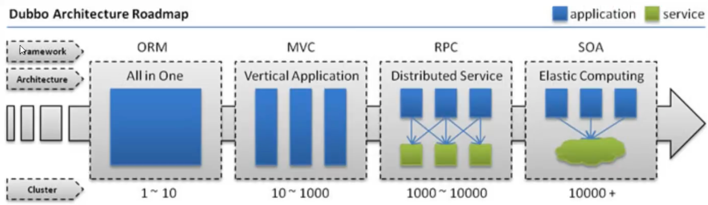

- mvc三层架构
- mvvm架构
- 微服务架构

#### 单体应用

我们将一个应用中的所有的应用服务都封装在一个应用中，无论是ERP、CRM或是其他的什么系统，都是把数据访问、web访问等等各个功能放到一个war包下

- 这样做的好处是：易于开发和测试，方便部署，当需要扩展的时候，只需要将war包复制多份，然后放到多个服务器上，再做个负载均衡就可以了
- 缺点：对修改来说非常困难

### 微服务架构

就是打破之前的all in one的架构方式，把每个功能元素独立开来，把独立出来的功能元素进行动态组合，需要的功能元素才拿来组合，需要多一些时可以整合多个功能元素，所以微服务架构是对功能元素进行复制，而没有对整个应用进行复制

这样做的好处：

- 节省了调用资源
- 每个功能元素的服务都是一个可替换的、可独立升级的软件代码

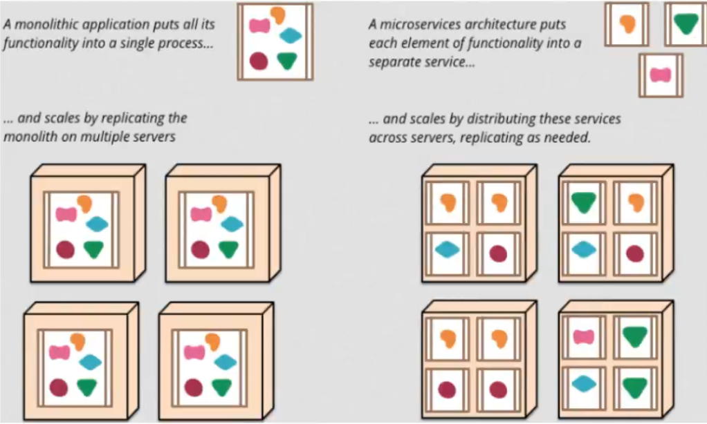

#### 如何构建微服务

spring为我们带来了构建大型分布式微服务的全套、全程的产品

- 构建一个个功能独立的微服务应用单元，可以使用springboot，帮助我们构建一个应用
- 大型分布式网络服务的调用，这部分由spring cloud来完成，实现分布式
- 在分布式中间，进行流式数据计算、批处理、我们有spring cloud data flow
- spring为我们提供了整个从开始构建应用到大型分布式应用的全流程方案


## 第一个springboot程序

环境：

- jdk8
- maven 3.8
- springboot 最新版
- idea

### 创建方式

1. 官方提供了快速生成的网站，idea集成了这个网站：https://start.spring.io/

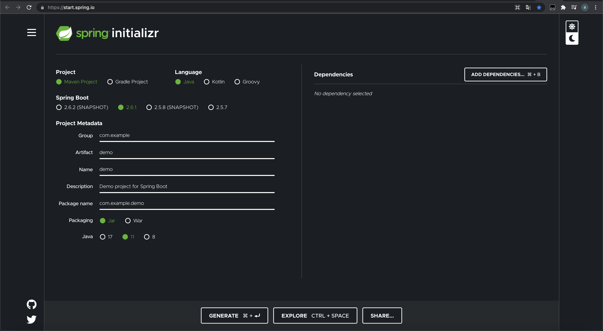

2. idea方式创建springboot项目

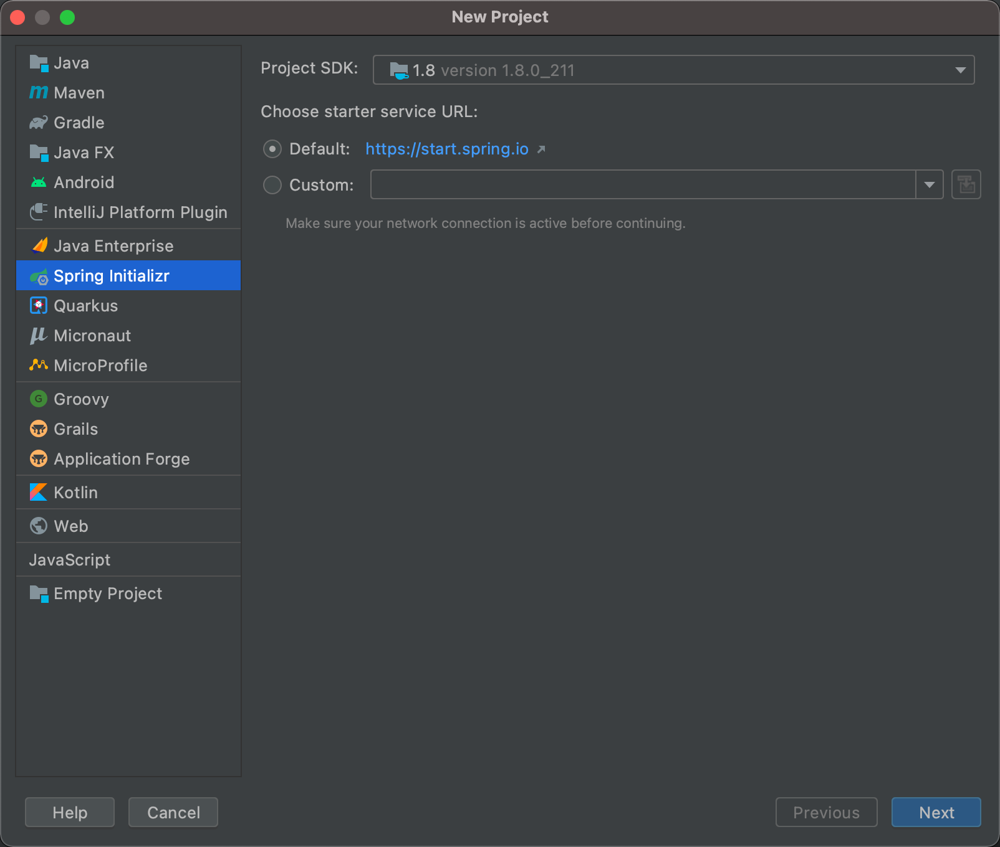

创建HelloController控制类，并创建hello action，启动访问，返回hello world

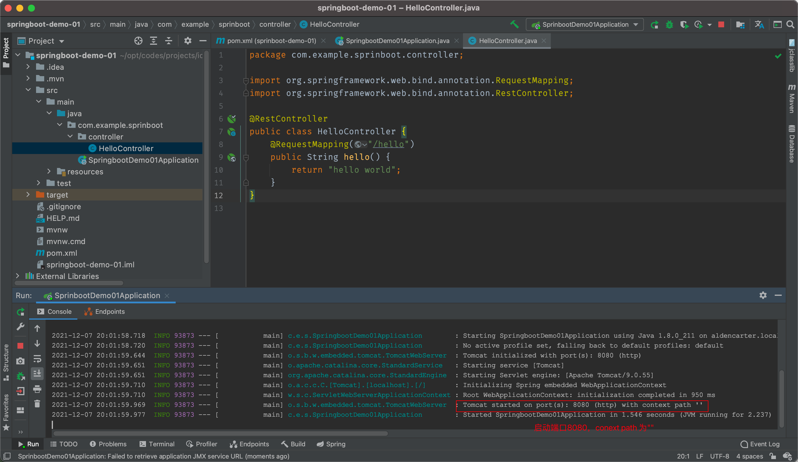

pom.xml文件的一些信息：

```xml
<parent>
  <groupId>org.springframework.boot</groupId>
  <artifactId>spring-boot-starter-parent</artifactId>
  <version>2.6.1</version>
  <relativePath/> <!-- lookup parent from repository -->
</parent>
<groupId>com.example</groupId>
<artifactId>springboot-demo-01</artifactId>
<version>0.0.1-SNAPSHOT</version>
<name>springboot-demo-01</name>
<description>Demo project for Spring Boot</description>
<properties>
  <java.version>1.8</java.version>
</properties>
<dependencies>
  <!--所有的springboot的启动器-->
  <dependency>
    <groupId>org.springframework.boot</groupId>
    <artifactId>spring-boot-starter</artifactId>
  </dependency>

  <!--测试时使用-->
  <dependency>
    <groupId>org.springframework.boot</groupId>
    <artifactId>spring-boot-starter-test</artifactId>
    <scope>test</scope>
  </dependency>
  <!--web依赖：tomcat dispatcherServlet web.xml配置等继承而来-->
  <dependency>
    <groupId>org.springframework.boot</groupId>
    <artifactId>spring-boot-starter-web</artifactId>
  </dependency>
</dependencies>

<build>
  <plugins>
    <!--maven打包等插件-->
    <plugin>
      <groupId>org.springframework.boot</groupId>
      <artifactId>spring-boot-maven-plugin</artifactId>
    </plugin>
  </plugins>
</build>
```

主要由四个部分：

- 项目元数据信息：创建的时候输入的project metadata部分，也就是maven项目的基本元素，包括：groupId、artifactId、version、name、description等
- parent：继承`spring-boot-starter-parent`的依赖管理，控制版本与打包等内容
- dependencies：项目具体依赖，
  - 这里包含了`spring-boot-starter-web`用于实现http接口（该依赖中包含了spring mvc），官网对它的描述是：使用spring mvc构建web（包括restful）应用程序的入门者，使用tomcat作为默认的嵌入式容器，
  - `spring-boot-starter-test`用于编写单元测试的依赖包
- build：构建配置部分，默认使用了`spring-boot-maven-plugin`，配合`spring-boot-starter-parent`就可以把spring boot应用打包成jar来直接运行

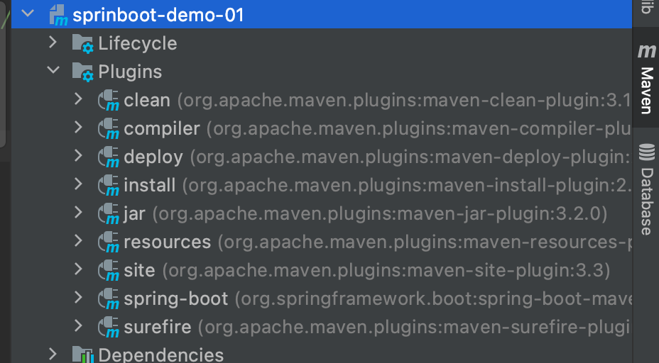

## 自动装配原理初探

### 基本流程

#### pom.xml

存放了继承了父项目的依赖

- `spring-boot-dependencies`核心依赖在父工程中
- 我们在写或者引入一些springboot依赖的时候，不需要指定版本，因为这里已经在工程中定义了

#### 启动器

```xml
<!--所有的springboot的启动器-->
<dependency>
  <groupId>org.springframework.boot</groupId>
  <artifactId>spring-boot-starter</artifactId>
</dependency>
<!--测试时使用-->
<dependency>
  <groupId>org.springframework.boot</groupId>
  <artifactId>spring-boot-starter-test</artifactId>
  <scope>test</scope>
</dependency>
<!--web依赖：tomcat dispatcherServlet web.xml配置等继承而来-->
<dependency>
  <groupId>org.springframework.boot</groupId>
  <artifactId>spring-boot-starter-web</artifactId>
</dependency>
```

- 启动器，说白了就是你要在什么场景下使用springboot，当我们引入这些依赖之后，springboot在进行扫包的时候扫描出这些依赖，那么就会把这些场景中的一些默认配置和一些bean注入到spring容器中给我们使用
  - 比如：`spring-boot-starter-web`它就会帮我们导入web环境所有的依赖
  - springboot会将所有的功能场景变成一个个的启动器
- 我们要使用什么功能，就只需要找到对应的启动器就好了

#### 主程序

```java
/**
 * @SpringBootApplication 标注这个类是一个springboot应用
 */
@SpringBootApplication
public class SpringbootDemo01Application {
    public static void main(String[] args) {
        /**
         * 将springboot应用启动
         */
        SpringApplication.run(SpringbootDemo01Application.class, args);
    }
}
```

##### 注解

`@SpringBootApplication`中继承了两个注解，两个注解的下分别有各自的使用方式

```java
@SpringBootConfiguration // springboot配置
	- @Configuration // spring配置类
    - @Component // 说明这也是一个spring的组件
@EnableAutoConfiguration // 自动配置
    - @AutoConfigurationPackage // 自动配置包
    	- @Import(AutoConfigurationPackages.Registrar.class) // 导入选择器
    - @Import(AutoConfigurationImportSelector.class) // 获取我们需要在哪些场景使用，也就是我们在pom文件中导入了那些依赖和一些上下文环境
```

`AutoConfigurationPackages.Registrar`通过继承我们可以看到

- `ImportBeanDefinitionRegistrar`主要是Bean定义注册器
- `DeterminableImports`是保证注册到Bean定义的类是可以注入到spring容器的对象

```java
/**
 * ImportBeanDefinitionRegistrar
**/
static class Registrar implements ImportBeanDefinitionRegistrar, DeterminableImports {

  @Override
  public void registerBeanDefinitions(AnnotationMetadata metadata, BeanDefinitionRegistry registry) {
    register(registry, new PackageImports(metadata).getPackageNames().toArray(new String[0]));
  }

  @Override
  public Set<Object> determineImports(AnnotationMetadata metadata) {
    return Collections.singleton(new PackageImports(metadata));
  }

}
```

在springboot启动的时候，会把所有的场景的注册器和配置信息都加载进来，然后在`AutoConfigurationImportSelector`中根据我们在pom文件中引入了那些依赖在确定要把哪些bean注入到spring容器和加载哪些配置信息到我们的场景环境中

> 要不然你以为真的不需要配置，"约定大于配置"都是别人帮你把配置先定义好了

```java
/**
	 * Return the {@link AutoConfigurationEntry} based on the {@link AnnotationMetadata}
	 * of the importing {@link Configuration @Configuration} class.
	 * @param annotationMetadata the annotation metadata of the configuration class
	 * @return the auto-configurations that should be imported
	 * 获取候选的配置，
	 */
protected AutoConfigurationEntry getAutoConfigurationEntry(AnnotationMetadata annotationMetadata) {
  if (!isEnabled(annotationMetadata)) {
    return EMPTY_ENTRY;
  }
  AnnotationAttributes attributes = getAttributes(annotationMetadata);
  List<String> configurations = getCandidateConfigurations(annotationMetadata, attributes);
  configurations = removeDuplicates(configurations);
  Set<String> exclusions = getExclusions(annotationMetadata, attributes);
  checkExcludedClasses(configurations, exclusions);
  configurations.removeAll(exclusions);
  configurations = getConfigurationClassFilter().filter(configurations);
  fireAutoConfigurationImportEvents(configurations, exclusions);
  return new AutoConfigurationEntry(configurations, exclusions);
}
```

获取的这些场景在`org/springframework/boot/spring-boot-autoconfigure/2.6.1/spring-boot-autoconfigure-2.6.1.jar!/META-INF/spring.factories`中，也就是在maven依赖中

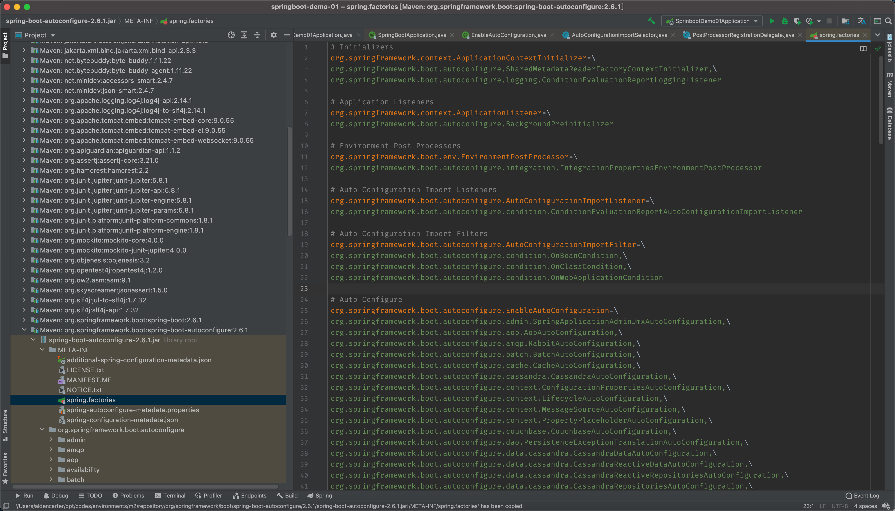

其中，可以看到有很多的场景：

当前正在使用的场景`org.springframework.boot.autoconfigure.web.servlet.WebMvcAutoConfiguration`

```java
@Configuration(proxyBeanMethods = false)
@ConditionalOnWebApplication(type = Type.SERVLET)
@ConditionalOnClass({ Servlet.class, DispatcherServlet.class, WebMvcConfigurer.class })
@ConditionalOnMissingBean(WebMvcConfigurationSupport.class)
@AutoConfigureOrder(Ordered.HIGHEST_PRECEDENCE + 10)
@AutoConfigureAfter({ DispatcherServletAutoConfiguration.class, TaskExecutionAutoConfiguration.class,
		ValidationAutoConfiguration.class })
public class WebMvcAutoConfiguration {
}
```

- `@ConditionalOnClass({ Servlet.class, DispatcherServlet.class, WebMvcConfigurer.class })`只有当前项目中存在这些类的时候（也就是我们引入`spring-boot-starter-web`）的时候，才会加载web场景
- 每一个场景下都有一个加载器和一个配置文件

###### 结论

springboot所有自动配置都是在启动的时候扫描并加载，`spring.factories`所有的自动配置类都在这里面，但是不一定生效，要判断条件成立，只要导入了对应的starter，就有对应的启动器了，有了启动器，我们自动装配就会生效，然后添加到spring容器中

- springboot在启动的时候，从类路径下/META-INF/spring.facotories获取指定的值
- 将这些自动配置的类导入容器，自动配置就会生效，帮我们进行自动配置
- 以前我们需要自动配置的东西，现在springboot我们做
- 整合javaee，解决方案和自动配置的东西都在spring-boot-autoconfiguration-xxxx.jar这个包下
- 它会把所有需要导入的组件，以类名的方式返回，这些组件就会被添加到spring容器中
- spring.facotories中存在xxxAutoConfiguration的文件，就是这些类给spring容器中导入这个场景需要的组件并自动配置`@Configuration`

##### 启动器运行流程

```java
SpringApplication.run(SpringbootDemo01Application.class, args);
```

这个类主要做了以下四件事情

- 推断应用的类型是普通的项目还是web项目
- 查找并加载所有可用初始化器，设置到initializers属性中
- 找出所有的应用程序监听器，设置到listeners属性中
- 推断并设置main方法的定义类，找到运行的主类


## 配置文件

### yaml语法

#### 基础

springboot可以通过`.properies`或者`.yaml`文件来配置，spring官方推荐`.yaml`方式，springboot使用一个全局的配置文件，配置文件名称是固定的

- application.properties
  - 语法结构：key=value
- application.yaml
  - 语法结构：key: value

配置文件的作用：**修改springboot自动配置的默认值，因为springboot在底层都给我们自动配置好了**

```yaml
## key: value
## 普通的key-value
name: zhangsan

## 对象
student1:
  name: zhangsan
  age: 18
## 对象行内写法
student2: {name: zhangsan,age: 18}

## 数组
students1:
  - zhangsan
  - lisi
  - wangwu
## 行内写法
students2: [zhangsan,lisi,wangwu]
```

**对空格的要求十分高**

#### 注入到实体类

1. 编写yaml文件属性

```yaml
## city
city:
  name: 广州
  province: 广东
```

2. 编写实体类

```java
@Data
@Component
@ConfigurationProperties(prefix = "city")
public class City {
    private String name;
    private String province;
}
```

3. 测试代码

```java
@SpringBootTest
class SpringbootDemo01ApplicationTests {
    @Autowired
    private User city;

    @Test
    void contextLoads() {
        System.out.println(city.toString());
    }
}
```

4. 运行结果

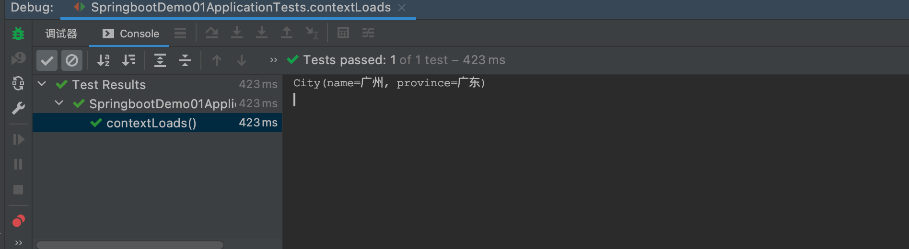

5. 如果出现这个提示，可以配置然后产生提示，也可以不配置，不影响程序的运行

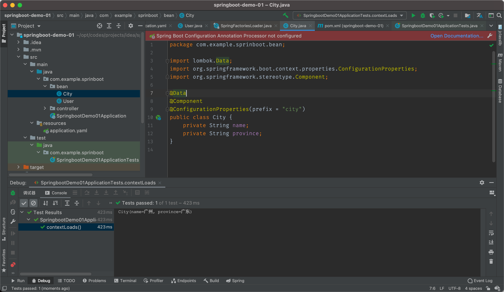

解决办法：添加依赖

```xml
<!--Configuration Annotation Proessor not found-->
<dependency>
  <groupId>org.springframework.boot</groupId>
  <artifactId>spring-boot-configuration-processor</artifactId>
  <optional>true</optional>
</dependency>
```

6. 如果不使用`@ConfigurationProperties`，使用`@Value`注入map、list、对象会导致注入失败

虽然网上都说，这样可以注入，我亲身实践过了，肯定是不能的。会抛出 `Caused by: java.lang.IllegalArgumentException: Could not resolve placeholder 'user.map' in value "${user.map}"`异常。要想注入必须要使用`@ConfigurationProperties`，即使是使用el表达式

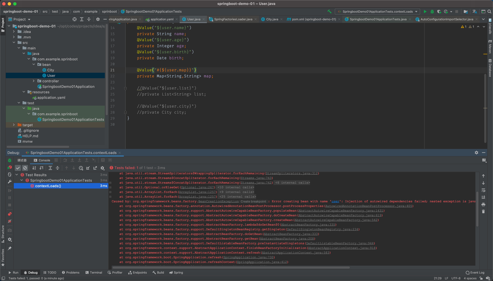

#### 总结

yaml与properties比较

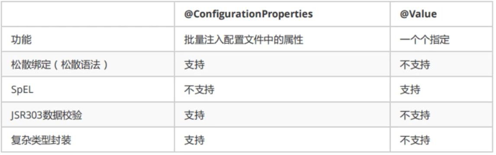

- cp只需要写一次即可，value注解则需要每个字段都添加
- 松散绑定：`val-ue`驼峰绑定到`valVe`
- JSR303数据校验，我们可以在字段增加一层过滤器验证，可以保证数据的合法性
- 复杂类型的封装，yaml中可以封装对象，使用`@Value`就不支持

**结论**

- 配置yaml和配置properties都可以获取得到值，推荐yaml
- 如果我们在某个业务中，只需要获取配置文件中的某个值，可以使用@Value
- 如果说，我们专门编写了一个javaBean来和配置文件进行映射，就直接使用`@ConfigurationProperties(prefix = "city")`

### 多环境配置

实现配置切换有三种：

- 一是同一个配置文件里面写不同的配置，然后在主配置中选择加载哪一种配置
- 二是直接写多个配置文件，在主配置文件里面选择配置哪一种配置
- 三是项目上线之后，直接通过命令的方式，将配置修改为我们需要的配置类型

#### 方式一

```yaml
## 主配置
spring:
  profiles:
    active: dev ## 选择开发环境的配置
---
## 选配一
server:
  port: 2222 ## 配置的测试环境的端口
spring:
  profiles: test ## 测试环境配置的名称

---
## 选配二
server:
  port: 1111 ## 配置的开发环境的端口
spring:
  profiles: dev ## 开发环境配置的名称
```

#### 方式二

1. 创建3个配置文件，主配置文件文件名为`application.yml`，测试环境配置文件名为`application-test.yml`，开发环境配置文件名为`application-dev.yml`
2. 然后在`application.yml`中选择要使用的环境：`test`为测试环境，`dev`为开发环境

#### 方式三

这个方式的前提肯定是我们配置了上面两种方式的其中一种的前提下

```bash
java -jar projectName.jar --spring.profiles.active=dev
```

### 配置文件位置

现在我们的配置文件是在`resources/application.yaml`，除了这个位置，官方配置中还可以放在：

- file:./config
- file:./
- classpath:/config/
- classpath:/

其中，file表示根目录，classpath表示resources目录，优先级：file:./config > file:./ > classpath:/config/ > classpath:/

### 配置文件可以写什么

我们可以通过查看源代码的方式，通过启动器中装载了什么东西来查看springboot的配置文件中可以写配置

上面我们知道springboot通过`org/springframework/boot/spring-boot-autoconfigure/2.6.1/spring-boot-autoconfigure-2.6.1.jar!/META-INF/spring.factories`中的自动注入配置类来注入我们需要的bean到spring容器中

我们通过`HttpEncodingAutoConfiguration`来看，如果引入这个配置，配置文件可以写什么

```java
/**
 * {@link EnableAutoConfiguration Auto-configuration} for configuring the encoding to use
 * in web applications.
 *
 * @author Stephane Nicoll
 * @author Brian Clozel
 * @since 2.0.0
 */
@Configuration(proxyBeanMethods = false)
@EnableConfigurationProperties(ServerProperties.class) // 允许自动配置的参数类
@ConditionalOnWebApplication(type = ConditionalOnWebApplication.Type.SERVLET)
@ConditionalOnClass(CharacterEncodingFilter.class)
@ConditionalOnProperty(prefix = "server.servlet.encoding", value = "enabled", matchIfMissing = true)
// 只有开启这个配置才能使用，默认是开启
public class HttpEncodingAutoConfiguration {

    private final Encoding properties;

    public HttpEncodingAutoConfiguration(ServerProperties properties) {
        this.properties = properties.getServlet().getEncoding();
    }

    /**
     * 编码过滤器，也就是我们在spring mvc中在web.xml中配置的过滤器
     *
     * @return
     */
    @Bean
    @ConditionalOnMissingBean
    public CharacterEncodingFilter characterEncodingFilter() {
        CharacterEncodingFilter filter = new OrderedCharacterEncodingFilter();
        filter.setEncoding(this.properties.getCharset().name());
        filter.setForceRequestEncoding(this.properties.shouldForce(Encoding.Type.REQUEST));
        filter.setForceResponseEncoding(this.properties.shouldForce(Encoding.Type.RESPONSE));
        return filter;
    }

    /**
     * 区域字符集映射定制器
     *
     * @return
     */
    @Bean
    public LocaleCharsetMappingsCustomizer localeCharsetMappingsCustomizer() {
        return new LocaleCharsetMappingsCustomizer(this.properties);
    }

    static class LocaleCharsetMappingsCustomizer
            implements WebServerFactoryCustomizer<ConfigurableServletWebServerFactory>, Ordered {

        private final Encoding properties;

        LocaleCharsetMappingsCustomizer(Encoding properties) {
            this.properties = properties;
        }

        @Override
        public void customize(ConfigurableServletWebServerFactory factory) {
            if (this.properties.getMapping() != null) {
                factory.setLocaleCharsetMappings(this.properties.getMapping());
            }
        }

        @Override
        public int getOrder() {
            return 0;
        }
    }
}
```

Conditional注解扩展：

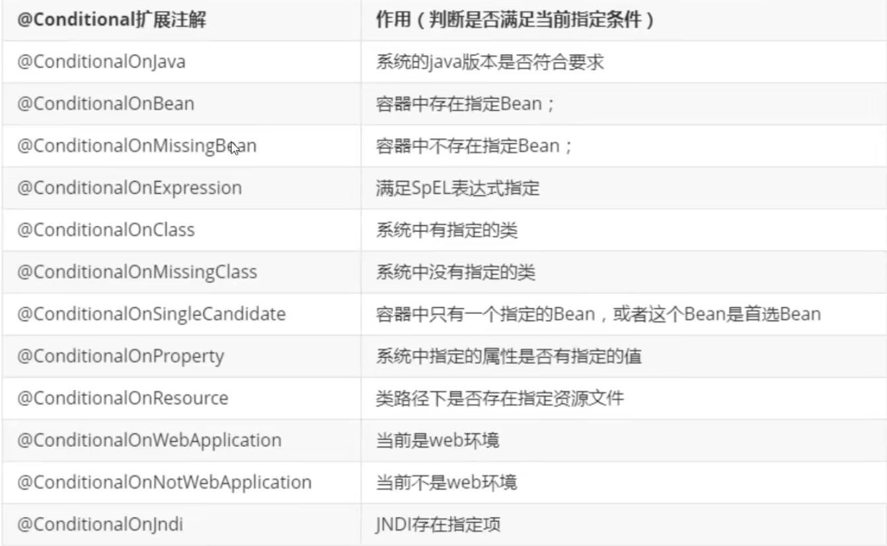

当我们要设置当前springboot web应用的端口的时候，在`application.yaml`中配置

```yaml
server:
  port: 8080
```

会覆盖`ServerProperties`中默认的配置

```java
@ConfigurationProperties(prefix = "server", ignoreUnknownFields = true)
public class ServerProperties {

	/**
	 * Server HTTP port.
	 */
	private Integer port;
}
```

当应用启动的时候`ServletWebServerFactoryCustomizer`自定义器中的方法`customize`会被调用

```java
@Override
public void customize(ConfigurableServletWebServerFactory factory) {
  PropertyMapper map = PropertyMapper.get().alwaysApplyingWhenNonNull();
  map.from(this.serverProperties::getPort).to(factory::setPort);
  map.from(this.serverProperties::getAddress).to(factory::setAddress);
  map.from(this.serverProperties.getServlet()::getContextPath).to(factory::setContextPath);
  map.from(this.serverProperties.getServlet()::getApplicationDisplayName).to(factory::setDisplayName);
  map.from(this.serverProperties.getServlet()::isRegisterDefaultServlet).to(factory::setRegisterDefaultServlet);
  map.from(this.serverProperties.getServlet()::getSession).to(factory::setSession);
  map.from(this.serverProperties::getSsl).to(factory::setSsl);
  map.from(this.serverProperties.getServlet()::getJsp).to(factory::setJsp);
  map.from(this.serverProperties::getCompression).to(factory::setCompression);
  map.from(this.serverProperties::getHttp2).to(factory::setHttp2);
  map.from(this.serverProperties::getServerHeader).to(factory::setServerHeader);
  map.from(this.serverProperties.getServlet()::getContextParameters).to(factory::setInitParameters);
  map.from(this.serverProperties.getShutdown()).to(factory::setShutdown);
  for (WebListenerRegistrar registrar : this.webListenerRegistrars) {
    registrar.register(factory);
  }
  if (!CollectionUtils.isEmpty(this.cookieSameSiteSuppliers)) {
    factory.setCookieSameSiteSuppliers(this.cookieSameSiteSuppliers);
  }
}
```

当应用启动的时候，springboot会检测当前是什么场景下的启动器，比如当前是web场景，就会使用`ServletWebServerApplicationContext`配置web环境

> 其实就是spring容器，人家定义了接口`AbstractApplicationContext`，什么也不做，就看是哪个来实现它的接口，谁实现，我就调用谁的场景来配置

重点是spring源码中的这个方法：

```java
@Override
	public void refresh() throws BeansException, IllegalStateException {
		synchronized (this.startupShutdownMonitor) {
			StartupStep contextRefresh = this.applicationStartup.start("spring.context.refresh");

			// Prepare this context for refreshing.
			prepareRefresh();

			// Tell the subclass to refresh the internal bean factory.
			ConfigurableListableBeanFactory beanFactory = obtainFreshBeanFactory();

			// Prepare the bean factory for use in this context.
			prepareBeanFactory(beanFactory);

			try {
				// Allows post-processing of the bean factory in context subclasses.
				postProcessBeanFactory(beanFactory);

				StartupStep beanPostProcess = this.applicationStartup.start("spring.context.beans.post-process");
				// Invoke factory processors registered as beans in the context.
				invokeBeanFactoryPostProcessors(beanFactory);

				// Register bean processors that intercept bean creation.
				registerBeanPostProcessors(beanFactory);
				beanPostProcess.end();

				// Initialize message source for this context.
				initMessageSource();

				// Initialize event multicaster for this context.
				initApplicationEventMulticaster();

				// Initialize other special beans in specific context subclasses.
				onRefresh();

				// Check for listener beans and register them.
				registerListeners();

				// Instantiate all remaining (non-lazy-init) singletons.
				finishBeanFactoryInitialization(beanFactory);

				// Last step: publish corresponding event.
				finishRefresh();
			}
			catch (BeansException ex) {
				if (logger.isWarnEnabled()) {
					logger.warn("Exception encountered during context initialization - " +
							"cancelling refresh attempt: " + ex);
				}

				// Destroy already created singletons to avoid dangling resources.
				destroyBeans();

				// Reset 'active' flag.
				cancelRefresh(ex);

				// Propagate exception to caller.
				throw ex;
			}

			finally {
				// Reset common introspection caches in Spring's core, since we
				// might not ever need metadata for singleton beans anymore...
				resetCommonCaches();
				contextRefresh.end();
			}
		}
	}
```

重点是try中的9个方法调用，太复杂了，之后学spring源码在补充或者写到别处去

- postProcessBeanFactory 在后置扩展点处理bean工厂的预处理，比如，在此web应用中，给spring容器添加三个作用域scope：
  - request
  - session
  - application
- invokeBeanFactoryPostProcessors 调用
- registerBeanPostProcessors
- initMessageSource
- initApplicationEventMulticaster
- onRefresh
- registerListeners
- finishBeanFactoryInitialization
- finishRefresh

#### 总结

在我们的配置文件能配置的属性，存在一个固有的规律：xxxAutoConfiguraton都会和xxxProperties配置文件绑定，由xxxAutoConfiguraton去帮我们装配，并且有默认值，而xxxProperties可以和配置文件进行绑定，我们就可以使用自定义的配置了

- springboot启动会加载大量的自动配置类
- 我们看我们需要的功能有没有在springboot中默认写好的自动配置类当中
- 我们在来看这个自动配置类中到底配置了那些组件，只要我们要用的组件有默认配置，我们就不用手动配置了，除非是自定义处理
- 给容器中自动配置类添加组件的时候，会从properties类中获取某些属性。我们只需要在配置文件中指定这些属性的值即可

那么多自动配置类，必须在一定条件下才能生效，我们怎么知道那些自动配置类生效了呢？**我们可以通过启用`debug=true`属性，来让控制台输出自动配置报告**

- Positive matches：自动配置类启用，找到了这个场景的自动配置类
- Negative matches：自动配置类不启用，也就是没有找到
- Unconditional classes：没有条件的类，也就是虽然找到，但是在当前的判定下，不使用这个场景

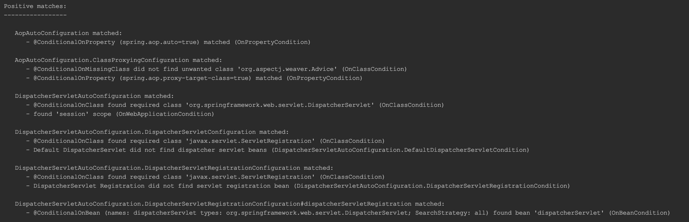

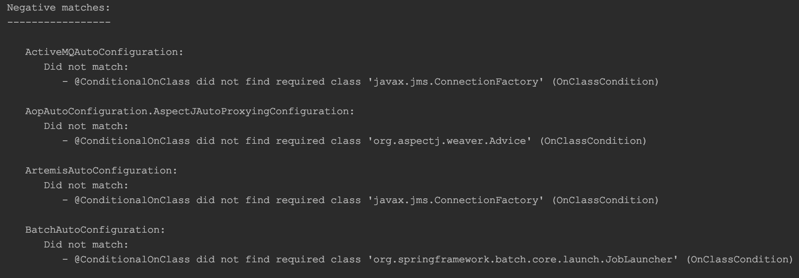

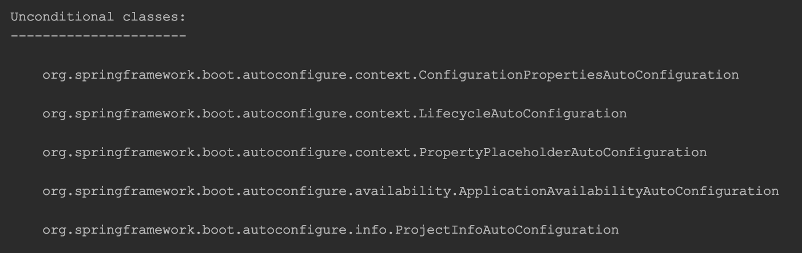

## JSR303校验

springboot中可以使用`@Validated`来校验数据，如果数据异常则会统一抛出异常，方便异常中心统一处理

> 参照链接：https://juejin.cn/post/6844904162480619534

### 约束注解

Bean Validation规范内嵌的约束注解


### 使用方式

1. 引入依赖

```xml
<!--validation-->
<dependency>
  <groupId>org.springframework.boot</groupId>
  <artifactId>spring-boot-starter-validation</artifactId>
</dependency>
```

2. 给参数对象添加校验注解

```java
@Data
public class User {
    
    private Integer id;
    @NotBlank(message = "用户名不能为空")
    private String username;
    @Pattern(regexp = "^(?![0-9]+$)(?![a-zA-Z]+$)[0-9A-Za-z]{8,16}$", message = "密码必须为8~16个字母和数字组合")
    private String password;
    @Email
    private String email;
    private Integer gender;
}
```

3. Controller 中需要校验的参数Bean前添加 @Valid 开启校验功能，紧跟在校验的Bean后添加一个BindingResult，BindingResult封装了前面Bean的校验结果

```java
@RestController
@RequestMapping("/user")
public class UserController {
    @PostMapping("/save")
    public Result save (@Valid User user , BindingResult bindingResult)  {
        if (bindingResult.hasErrors()) {
            Map<String , String> map = new HashMap<>();
            bindingResult.getFieldErrors().forEach( (item) -> {
                String message = item.getDefaultMessage();
                String field = item.getField();
                map.put( field , message );
            } );
            return Result.build( 400 , "非法参数 !" , map);
        }
        return Result.ok();
    }
}
```

### 异常统一处理

参数校验不通过时，会抛出 BingBindException 异常，可以在统一异常处理中，做统一处理，这样就不用在每个需要参数校验的地方都用 BindingResult 获取校验结果了

```java
@Slf4j
@RestControllerAdvice(basePackages = "com.example.springboot.controller")
public class GlobalExceptionControllerAdvice {
    @ExceptionHandler(value= {MethodArgumentNotValidException.class , BindException.class})
    public Result handleVaildException(Exception e){
        BindingResult bindingResult = null;
        if (e instanceof MethodArgumentNotValidException) {
            bindingResult = ((MethodArgumentNotValidException)e).getBindingResult();
        } else if (e instanceof BindException) {
            bindingResult = ((BindException)e).getBindingResult();
        }
        Map<String,String> errorMap = new HashMap<>(16);
        bindingResult.getFieldErrors().forEach((fieldError)->
                errorMap.put(fieldError.getField(),fieldError.getDefaultMessage())
        );
        return Result.build(400 , "非法参数 !" , errorMap);
    }
}
```

### 分组解决校验

新增和修改对于实体的校验规则是不同的，例如id是自增的时，新增时id要为空，修改则必须不为空；新增和修改，若用的恰好又是同一种实体，那就需要用到分组校验

1. 校验注解都有一个groups属性，可以将校验注解分组，我们看下@NotNull的源码

```java
@Target({ METHOD, FIELD, ANNOTATION_TYPE, CONSTRUCTOR, PARAMETER, TYPE_USE })
@Retention(RUNTIME)
@Repeatable(List.class)
@Documented
@Constraint(validatedBy = { })
public @interface NotNull {

	String message() default "{javax.validation.constraints.NotNull.message}";

	Class<?>[] groups() default { };

	Class<? extends Payload>[] payload() default { };

	@Target({ METHOD, FIELD, ANNOTATION_TYPE, CONSTRUCTOR, PARAMETER, TYPE_USE })
	@Retention(RUNTIME)
	@Documented
	@interface List {

		NotNull[] value();
	}
}
```

2. 从源码可以看出 groups 是一个Class<?>类型的数组，那么就可以创建一个Groups

```java
public class Groups {
    public interface Add{}
    public interface  Update{}
}
```

3. 给参数对象的校验注解添加分组

```java
@Data
public class User {
    @Null(message = "新增不需要指定id" , groups = Groups.Add.class)
    @NotNull(message = "修改需要指定id" , groups = Groups.Update.class)
    private Integer id;
    @NotBlank(message = "用户名不能为空")
    @NotNull
    private String username;
    @Pattern(regexp = "^(?![0-9]+$)(?![a-zA-Z]+$)[0-9A-Za-z]{8,16}$", message = "密码必须为8~16个字母和数字组合")
    private String password;
    @Email
    private String email;
    private Integer gender;
}
```

4. Controller 中原先的@Valid不能指定分组 ，需要替换成@Validated

```java
@RestController
@RequestMapping("/user")
public class UserController {

    @PostMapping("/save")
    public Result save (@Validated(Groups.Add.class) User user)  {
        return Result.ok();
    }
}
```

### 自定义校验注解

虽然JSR303和springboot-validator 已经提供了很多校验注解，但是当面对复杂参数校验时，还是不能满足我们的要求，这时候我们就需要 自定义校验注解。

例如User中的gender，用 1代表男 2代表女，我们自定义一个校验注解@ListValue，指定取值只能1和2

1. 创建约束规则

```java
@Documented
@Constraint(validatedBy = { ListValueConstraintValidator.class })
@Target({ METHOD, FIELD, ANNOTATION_TYPE })
@Retention(RUNTIME)
public @interface ListValue {
    String message() default "";

    Class<?>[] groups() default { };

    Class<? extends Payload>[] payload() default { };

    int[] vals() default { };
}
```

一个标注(annotation) 是通过@interface关键字来定义的。这个标注中的属性是声明成类似方法的样式的。根据Bean Validation API规范的要求：

- message属性, 这个属性被用来定义默认得消息模版, 当这个约束条件被验证失败的时候,通过 此属性来输出错误信息
- groups 属性, 用于指定这个约束条件属于哪(些)个校验组. 这个的默认值必须是Class<?>类型数组
- payload 属性, Bean Validation API 的使用者可以通过此属性来给约束条件指定严重级别. 这个属性并不被API自身所使用

除了这三个强制性要求的属性(message, groups 和 payload) 之外，我们还添加了一个属性用来指定所要求的值。此属性的名称vals在annotation的定义中比较特殊，如果只有这个属性被赋值了的话，那么，在使用此annotation到时候可以忽略此属性名称

另外， 我们还给这个annotation标注了一些元标注( meta annotatioins)：

- @Target({ METHOD, FIELD, ANNOTATION_TYPE }): 表示此注解可以被用在方法, 字段或者annotation声明上
- @Retention(RUNTIME): 表示这个标注信息是在运行期通过反射被读取的
- @Constraint(validatedBy = ListValueConstraintValidator.class): 指明使用哪个校验器(类) 去校验使用了此标注的元素
- @Documented: 表示在对使用了该注解的类进行javadoc操作到时候, 这个标注会被添加到 javadoc当中

2. 创建约束校验器

```java
import javax.validation.ConstraintValidator;
import javax.validation.ConstraintValidatorContext;
import java.util.HashSet;
import java.util.Set;

public class ListValueConstraintValidator implements ConstraintValidator<ListValue,Integer> {
    private Set<Integer> set = new HashSet<>();
    /**
     * 初始化方法
     */
    @Override
    public void initialize(ListValue constraintAnnotation) {
        int[] vals = constraintAnnotation.vals();
        for (int val : vals) {
            set.add(val);
        }
    }

    /**
     * 判断是否校验成功
     *
     * @param value 需要校验的值
     * @param context
     * @return
     */
    @Override
    public boolean isValid(Integer value, ConstraintValidatorContext context) {
        return set.contains(value);
    }
}
```

ListValueConstraintValidator定义了两个泛型参数，第一个是这个校验器所服务到标注类型(在我们的例子中即ListValue)，第二个这个校验器所支持到被校验元素的类型 (即Integer)

如果一个约束标注支持多种类型的被校验元素的话，那么需要为每个所支持的类型定义一个ConstraintValidator，并且注册到约束标注中

这个验证器的实现就很平常了，initialize() 方法传进来一个所要验证的标注类型的实例，在本例中，我们通过此实例来获取其vals属性的值，并将其保存为Set集合中供下一步使用

isValid()是实现真正的校验逻辑的地方，判断一个给定的int对于`@ListValue`这个约束条件来说是否是合法的

3. 在参数对象中使用`@ListValue`注解

```java
@Data
public class User {

    @Null(message = "新增不需要指定id" , groups = Groups.Add.class)
    @NotNull(message = "修改需要指定id" , groups = Groups.Update.class)
    private Integer id;
    @NotBlank(message = "用户名不能为空")
    @NotNull
    private String username;
    @Pattern(regexp = "^(?![0-9]+$)(?![a-zA-Z]+$)[0-9A-Za-z]{8,16}$", message = "密码必须为8~16个字母和数字组合")
    private String password;
    @Email
    private String email;
    @ListValue( message = "性别应指定相应的值" , vals = {1,2} , groups = {Groups.Add.class , Groups.Update.class})
    private Integer gender;
}
```

## springboot web开发

> jar：webapp
>
> 自动装配
>
> springboot到底帮我们配置了什么？我们能不能修改？能修改那些东西？能不能扩展？肯定可以
>
> - xxxAutoConfiguration 向容器中自动配置组件
> - xxxProperties 自动配置类，装配配置文件中自定义的一些内容
>
> 要解决的问题：
>
> - 导入静态资源
> - 首页
> - jsp，模板引擎
> - 装配扩展spring mvc
> - 增删改查
> - 拦截器
> - 国际化

### 常用订制

#### 静态资源导入

##### 创建springboot项目

勾选`spring web`

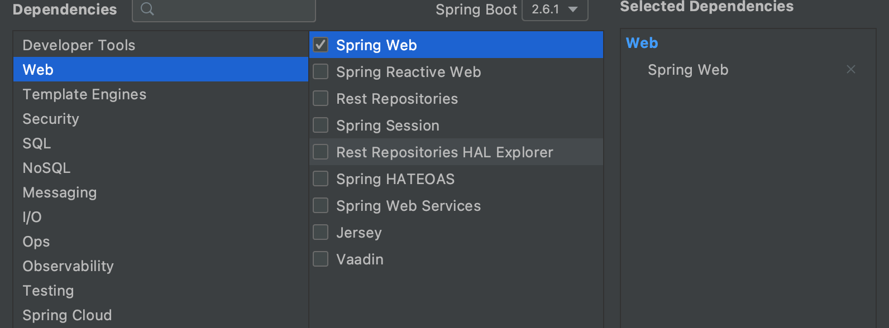

##### 静态资源可放位置

`WebMvcAutoConfiguration`下的`WebMvcAutoConfigurationAdapter`中的方法`addResourceHandlers`是用于配置静态资源的

```java
@Override
public void addResourceHandlers(ResourceHandlerRegistry registry) {
  // 如果我们在application.yaml中自己配置的话，那么它就会使用我们的自己的配置，下面的配置就失效了
  if (!this.resourceProperties.isAddMappings()) {
    // resourceProperties 就是这几个：Resources.CLASSPATH_RESOURCE_LOCATIONS = { "classpath:/META-INF/resources/","classpath:/resources/", "classpath:/static/", "classpath:/public/" };
    // classpath在此处指的是resources下的目录，也就是打包运行时的项目目录（classes）
    logger.debug("Default resource handling disabled");
    return;
  }
  // 添加webjars下的静态资源
  addResourceHandler(registry, "/webjars/**", "classpath:/META-INF/resources/webjars/");
  // 添加上面注释中中的四个放置静态资源的位置，只要是请求路径中的任意资源（/**）只要能和Resources.CLASSPATH_RESOURCE_LOCATIONS中的这些资源可以匹配到，就可以得到这些资源
  // this.mvcProperties.getStaticPathPattern()是/**
  addResourceHandler(registry, this.mvcProperties.getStaticPathPattern(), (registration) -> {
    registration.addResourceLocations(this.resourceProperties.getStaticLocations());
    if (this.servletContext != null) {
      ServletContextResource resource = new ServletContextResource(this.servletContext, SERVLET_LOCATION);
      registration.addResourceLocations(resource);
    }
  });
}
```

1. 使用webjars导入静态资源（平时不会使用）

> **什么是webjars？**
>
> 官网：https://www.webjars.org/
>
> 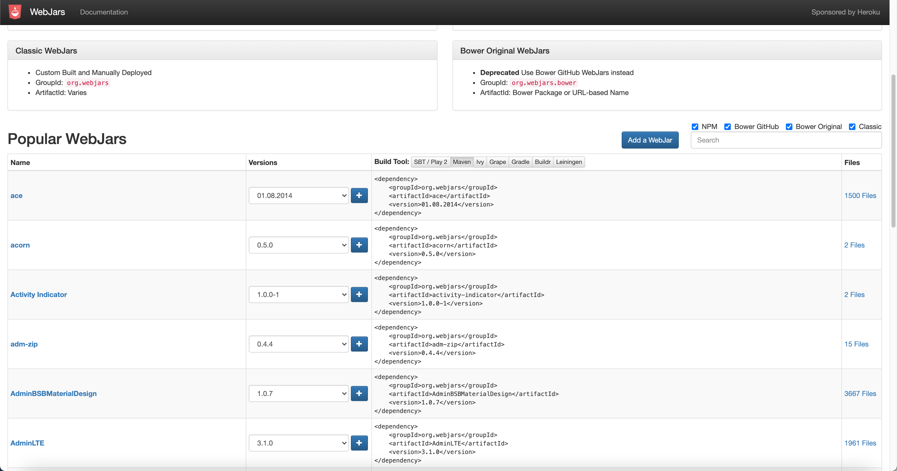
>
> **WebJars are client-side web libraries (e.g. jQuery & Bootstrap) packaged into JAR (Java Archive) files.**
>
> - Explicitly and easily manage the client-side dependencies in JVM-based web applications
> - Use JVM-based build tools (e.g. Maven, Gradle, sbt, ...) to download your client-side dependencies
> - Know which client-side dependencies you are using
> - Transitive dependencies are automatically resolved and optionally loaded via RequireJS
> - Deployed on [Maven Central](http://search.maven.org/)
> - Public CDN, generously provided by: [jsdelivr](http://www.jsdelivr.com/)
>
> 翻译：
>
> WebJars 是打包到 JAR（Java 存档）文件中的客户端 Web 库（例如 jQuery 和 Bootstrap）。
>
> - 明确且轻松地管理基于 JVM 的 Web 应用程序中的客户端依赖项
> - 使用基于 JVM 的构建工具（例如 Maven、Gradle , sbt, ...) 下载您的客户端依赖项
> - 了解您正在使用哪些客户端依赖项
> - 传递依赖项自动解析并通过 RequireJS 选择性加载
> - 部署在 Maven Central• 公共 CDN，由以下机构慷慨提供：[jsdelivr](http://www.jsdelivr.com/)

也就是说webjar其实就是（在本项目）通过maven引入依赖的方式来管理一些静态资源，比如：js、css等。前台在向后端请求资源的时候，只需要使用`/webjar/**`来请求，比如：

在引入jquery之后

```xml
<dependency>
    <groupId>org.webjars.npm</groupId>
    <artifactId>jquery</artifactId>
    <version>3.6.0</version>
</dependency>
```

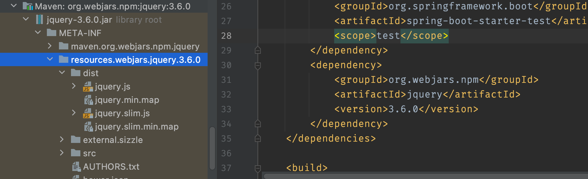

再使用`http://localhost:8080/webjars/jquery/3.6.0/dist/jquery.js`就可以访问到资源

2. `/**`匹配到`Resources.CLASSPATH_RESOURCE_LOCATIONS`

classpath在此处指的是resources下的目录，也就是打包运行时的项目目录（classes）

只要是请求路径中的任意资源（/**）只要能和`Resources.CLASSPATH_RESOURCE_LOCATIONS = { "classpath:/META-INF/resources/","classpath:/resources/", "classpath:/static/", "classpath:/public/" };`中的这些资源可以匹配到，就可以得到这些资源

- /META-INF/resources/ -> resuources/META-INF/resources/
- /resources/ -> resources/resources/
- /static/ -> resources/static/
- /public/ -> resources/public/

优先级：`"classpath:/META-INF/resources/","classpath:/resources/", "classpath:/static/", "classpath:/public/"`

3. 如果我们在application.yaml中自己配置的话，那么它就会使用我们的自己的配置，下面的配置就失效了

```yaml
spring:
  mvc:
    static-path-pattern: /hello
```

#### 首页和图标订制

##### 首页订制

我们还是看`WebMvcAutoConfiguration`的源码

```java
@Bean
public WelcomePageHandlerMapping welcomePageHandlerMapping(ApplicationContext applicationContext,
                                                           FormattingConversionService mvcConversionService, ResourceUrlProvider mvcResourceUrlProvider) {
  WelcomePageHandlerMapping welcomePageHandlerMapping = new WelcomePageHandlerMapping(
    new TemplateAvailabilityProviders(applicationContext), applicationContext, getWelcomePage(),
    this.mvcProperties.getStaticPathPattern());
  welcomePageHandlerMapping.setInterceptors(getInterceptors(mvcConversionService, mvcResourceUrlProvider));
  welcomePageHandlerMapping.setCorsConfigurations(getCorsConfigurations());
  return welcomePageHandlerMapping;
}
// ***
private Resource getWelcomePage() {
  for (String location : this.resourceProperties.getStaticLocations()) {
    Resource indexHtml = getIndexHtml(location);
    if (indexHtml != null) {
      return indexHtml;
    }
  }
  ServletContext servletContext = getServletContext();
  if (servletContext != null) {
    return getIndexHtml(new ServletContextResource(servletContext, SERVLET_LOCATION));
  }
  return null;
}

private Resource getIndexHtml(String location) {
  return getIndexHtml(this.resourceLoader.getResource(location));
}
/**
 * 看传入的参数顺序，优先级自然不用说了
 * /META-INF/resources/
 * /resources/
 * /static/
 * /public/
 */
private Resource getIndexHtml(Resource location) {
  try {
    Resource resource = location.createRelative("index.html");
    if (resource.exists() && (resource.getURL() != null)) {
      return resource;
    }
  }
  catch (Exception ex) {
  }
  return null;
}
```

一般静态资源都是放在public或者static目录下，其实我们这里也可以看出来，如果是想要访问html资源，是不能放在tempaltes目录下的，templates都是需要经过controller中的action来跳转的

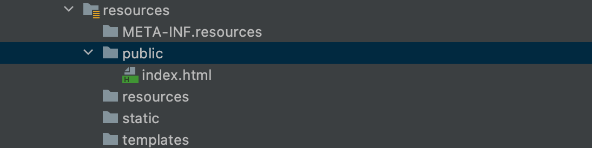

##### 图标订制

1. springboot不同版本对favicon的支持

在早些版本进行默认支持，是默认开启的

```properties
spring.mvc.favicon.enabled=false ### 关闭
```

但在Spring Boot项目的issues中提出，如果提供默认的Favicon可能会导致网站信息泄露。如果用户不进行自定义的Favicon的设置，而Spring Boot项目会提供默认的上图图标，那么势必会导致泄露网站的开发框架

因此，在Spring Boot2.2.x中，将默认的favicon.ico移除，同时也不再提供上述application.properties中的属性配置

2. 自定义favicon

正常情况下，直接将命名为favicon.ico的网站图标放在resources或static目录即可显示，但如果使用的版本无法显示

首先排除浏览器缓存的问题。在撰写本文时多次遇到浏览器缓存导致无法展示的情况。一般操作步骤，清除浏览器缓存，重启浏览器，即可展示

同时，如果需要在页面中通过代码进行引入。下面展示使用Thymeleaf时的引入方式：

```html
<!DOCTYPE html>
<html lang="en" xmlns:th="http://www.thymeleaf.org">
<head>
    <meta charset="UTF-8"/>
    <title>Hello Favicon</title>
    <link rel="icon" th:href="@{/favicon.ico}" type="image/x-icon"/>
    <link rel="bookmark" th:href="@{/favicon.ico}" type="image/x-icon"/>
</head>
<body>
<h1>Hello Favicon!</h1>
</body>
</html>
```

如果使用其他前端框架，可使用如下方式：

```html
<!DOCTYPE html>
<html lang="en">
<head>
    <meta charset="UTF-8"/>
    <title>Hello Favicon</title>
    <link rel="icon" href="/favicon.ico" type="image/x-icon"/>
    <link rel="bookmark" href="/favicon.ico" type="image/x-icon"/>
</head>
<body>
<h1>Hello Favicon!</h1>
</body>
</html>
```

如果在浏览器中打开网页并没有展示出效果，并不代表程序没起效。这时，可采用直接访问favicoin的形式来验证，另外，在web项目中，如果自定义了Web相关组件或拦截器也有可能导致无法显示或404，可对其进行有针对性的排查，当出现访问失败的时候，可以先查看target目录下是否有favicon.ico，如果没有先清除项目，然后在重新启动项目

```http
http://localhost:8080/favicon.ico
```

在浏览器访问上述链接，如果能够展示图标，则说明已经可以正常访问了

### thymeleaf模板引擎

为了使用户界面与业务数据（内容）分离而产生的，它可以生成特定格式的文档，用于网站的模板引擎就会生成一个标准的html文档

现在在springboot上使用的比较频繁的模板引擎有：

- thymeleaf
- freemaker

模板引擎再多其实它们的思想都是一样的，就是通过解析html标签，将后端给的数据填充到html上，并传给前端浏览器

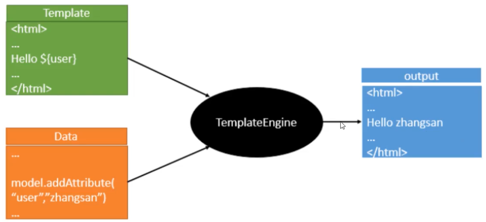

#### thymeleaf的使用

1. 引入

对于springboot来说，其实就是一个starter的事

- 官网：https://www.thymeleaf.org/
- spring文档中的依赖：https://docs.spring.io/spring-boot/docs/current/reference/htmlsingle/#using.build-systems.starters

导入依赖

```xml
<dependency>
  <groupId>org.springframework.boot</groupId>
  <artifactId>spring-boot-starter-thymeleaf</artifactId>
</dependency>
```

thymeleaf的所有页面都是写在templates目录下。

2. 配置

我们现在还不知道thymeleaf有什么默认配置、我们可以配置什么参数等，所以我们先来看一下它的配置类和配置属性类

ThymeleafAutoConfiguration

**ThymeleafProperties**

```java
// 默认编码
private static final Charset DEFAULT_ENCODING = StandardCharsets.UTF_8;
// 默认的前缀
public static final String DEFAULT_PREFIX = "classpath:/templates/";
// 默认的后缀
public static final String DEFAULT_SUFFIX = ".html";
```

springboot官方提供的配置内容如下

```properties
## THYMELEAF (ThymeleafAutoConfiguration)
spring.thymeleaf.cache=true ## Whether to enable template caching.
spring.thymeleaf.check-template=true ## Whether to check that the template exists before rendering it.
spring.thymeleaf.check-template-location=true ## Whether to check that the templates location exists.
spring.thymeleaf.enabled=true ## Whether to enable Thymeleaf view resolution for Web frameworks.
spring.thymeleaf.enable-spring-el-compiler=false ## Enable the SpringEL compiler in SpringEL expressions.
spring.thymeleaf.encoding=UTF-8 ## Template files encoding.
spring.thymeleaf.excluded-view-names= ## Comma-separated list of view names (patterns allowed) that should be excluded from resolution.
spring.thymeleaf.mode=HTML ## Template mode to be applied to templates. See also Thymeleaf's TemplateMode enum.
spring.thymeleaf.prefix=classpath:/templates/ ## Prefix that gets prepended to view names when building a URL.
spring.thymeleaf.reactive.chunked-mode-view-names= ## Comma-separated list of view names (patterns allowed) that should be the only ones executed in CHUNKED mode when a max chunk size is set.
spring.thymeleaf.reactive.full-mode-view-names= ## Comma-separated list of view names (patterns allowed) that should be executed in FULL mode even if a max chunk size is set.
spring.thymeleaf.reactive.max-chunk-size=0 ## Maximum size of data buffers used for writing to the response, in bytes.
spring.thymeleaf.reactive.media-types= ## Media types supported by the view technology.
spring.thymeleaf.servlet.content-type=text/html ## Content-Type value written to HTTP responses.
spring.thymeleaf.suffix=.html ## Suffix that gets appended to view names when building a URL.
spring.thymeleaf.template-resolver-order= ## Order of the template resolver in the chain.
spring.thymeleaf.view-names= ## Comma-separated list of view names (patterns allowed) that can be resolved.
```

上面的配置有些我们可能不常使用，因为Springboot官方做了默认配置大部分能够满足我们的使用需求，但如果你的项目有特殊需求也需要妥善使用这些配置

比如`spring.thymeleaf.cache=false`是否允许页面缓存的配置，我们在开发时候要确保页面是最新的所以需要禁用缓存；而在上线运营时可能页面不常改动为了减少服务端压力以及提升客户端响应速度会允许页面缓存的使用

再比如在开发虽然我们大部分使用UTF-8多一些，我们可以使用`spring.thymeleaf.encoding=UTF-8`来确定页面的编码，但如果你的项目是GBK编码就需要将它改成GBK

另外Springboot默认模板引擎文件是放在templates目录下：`spring.thymeleaf.prefix=classpath:/templates/`,如果你有需求将模板引擎也可修改配置，将templates改为自己需要的目录。同理其他的配置如果需要自定义化也可参照上面配置进行修改

3. 创建一个action和对应要跳转的test.html文件

```java
@Controller
public class TestController {
    @RequestMapping("/test")
    public ModelAndView test(ModelAndView modelAndView) {
      	modelAndView.addObject("name", "张三");
        modelAndView.setViewName("test");
        return modelAndView;
    }
}
```

4. 创建并编写html页面

要使用thymeleaf就要先导入语法约束的命名空间

```html
<html lang="en" xmlns:th="http://www.thymeleaf.org">
```

```html
<!DOCTYPE html>
<html lang="en" xmlns:th="http://www.thymeleaf.org">
<head>
    <meta charset="UTF-8">
    <title>Title</title>
</head>
<body>
<div>
    <!--所有的html元素都可以被thymeleaf接管，th:xxx-->
    <h1 th:text="${name}"></h1>
</div>
</body>
</html>
```

那么带着`th:text="${name}"`的h1元素的内容就会被渲染成我们的数据

#### thymeleaf的基本语法

##### 常用标签

Thymeleaf通过特殊的标签来寻找属于Thymeleaf的部分，并渲染该部分内容，而除了上面展示过的`th:text`之外还有很多常用标签，并且Thymeleaf也主要通过标签来识别替换对应位置内容，Thymeleaf标签有很多很多，功能也很丰富，这里列举一些比较常用的标签如下：

| 标签      | 作用               | 示例                                                         |
| :-------- | :----------------- | :----------------------------------------------------------- |
| th:id     | 替换id             | `<input th:id="${user.id}"/>`                                |
| th:text   | 文本替换           | `<p text:="${user.name}">bigsai</p>`                         |
| th:utext  | 支持html的文本替换 | `<p utext:="${htmlcontent}">content</p>`                     |
| th:object | 替换对象           | `<div th:object="${user}"></div>`                            |
| th:value  | 替换值             | `<input th:value="${user.name}" >`                           |
| th:each   | 迭代               | `<tr th:each="student:${user}" >`                            |
| th:href   | 替换超链接         | `<a th:href="@{index.html}">超链接</a>`                      |
| th:src    | 替换资源           | `<script type="text/javascript" th:src="@{index.js}"></script>` |

##### 表达式

标准表达式功能的快速摘要，所有的这些表达式都是可以组合或者嵌套的：

- 简单的表达：
  - 变量表达式： `${...}`
  - 选择变量表达式： `*{...}`
  - 消息表达： `#{...}`
  - 链接 URL 表达式： `@{...}`
  - 片段表达式： `~{...}`
- 文字
  - 文本字面量：`'one text'`, `'Another one!'`,...
  - 数字字面量：`0`, `34`, `3.0`, `12.3`,...
  - 布尔文字：`true`,`false`
  - 空字面量： `null`
  - 文字标记：`one`, `sometext`, `main`,...
- 文字操作：
  - 字符串连接： `+`
  - 字面替换： `|The name is ${name}|`
- 算术运算：
  - 二元运算符：`+`, `-`, `*`, `/`,`%`
  - 减号（一元运算符）： `-`
- 布尔运算：
  - 二元运算符：`and`,`or`
  - 布尔否定（一元运算符）：`!`,`not`
- 比较与相等：
  - 比较器：`>`, `<`, `>=`, `<=`( `gt`, `lt`, `ge`, `le`)
  - 等式运算符：`==`, `!=`( `eq`, `ne`)
- 条件运算符：
  - 如果-那么： `(if) ? (then)`
  - 如果-那么-其他： `(if) ? (then) : (else)`
  - 默认： `(value) ?: (defaultvalue)`
- 特殊令牌：
  - 无操作： `_`

1. 链接表达式：`@{...}`

在Thymeleaf 中，如果想引入链接比如link，href，src，需要使用`@{资源地址}`引入资源。其中资源地址可以static目录下的静态资源，也可以是互联网中的绝对资源

- 引入css

```html
<link rel="stylesheet" th:href="@{index.css}">
```

- 引入js

```html
<script type="text/javascript" th:src="@{index.js}"></script>
```

- 超链接

```html
<a th:href="@{index.html}">超链接</a>
```

2. 变量表达式：`${...}`

在Thymeleaf中可以通过${…}进行取值，这点和ONGL表达式语法一致。例如咱们创建这么一个对象：

```java
@Data
@NoArgsConstructor
@AllArgsConstructor
public class User {
    private String name;
    private Integer age;
    private String detail;
}
```

然后创建一个action将数据传输到页面

```java
@Controller
public class TestController {

    @GetMapping("/test")
    public String test(Model model) {
        //普通字符串
        model.addAttribute("desc", "TestController.test");

        //对象
        final User user = new User("张三", 18, "我是大傻逼");
        model.addAttribute("user", user);

        //集合
        final ArrayList<User> list = new ArrayList<>();
        list.add(new User("张三1", 18, "我是大傻逼1"));
        list.add(new User("张三2", 18, "我是大傻逼2"));
        list.add(new User("张三3", 18, "我是大傻逼3"));
        model.addAttribute("list", list);

        // map
        final HashMap<String, String> map = new HashMap<>();
        map.put("province", "广东省");
        map.put("city", "广州市");
        model.addAttribute("map", map);

        return "test";
    }
}
```

视图解析接收到数据并解析test.html填充数据

```html
<!DOCTYPE html>
<html lang="en" xmlns:th="http://www.thymeleaf.org">
<head>
    <meta charset="UTF-8">
    <title>Title</title>
</head>
<body>
<div>
    <!--所有的html元素都可以被thymeleaf接管，th:xxx-->
    字符串：
    <h1 th:text="'来自：'+${desc}"></h1>
    <hr>
    对象：
    <h1 th:text="${user.name}"></h1>
    <h1 th:text="${user.age}"></h1>
    <h1 th:text="${user.detail}"></h1>
    <hr>
    List集合：
    <h1 th:each="one:${list}">
        <h2 th:text="${one}"></h2>
    </h1>
    <hr>
    Map直接取值：
    <h1>
        <span th:text="${map.get('province')}"></span> :
        <span th:text="${map.get('city')}"></span>
    </h1>
    Map遍历：
    <h1 th:each="one:${map}">
        <span th:text="${one.key}"></span> :
        <span th:text="${one.value}"></span>
    </h1>
</div>
</body>
</html>
```

结果：

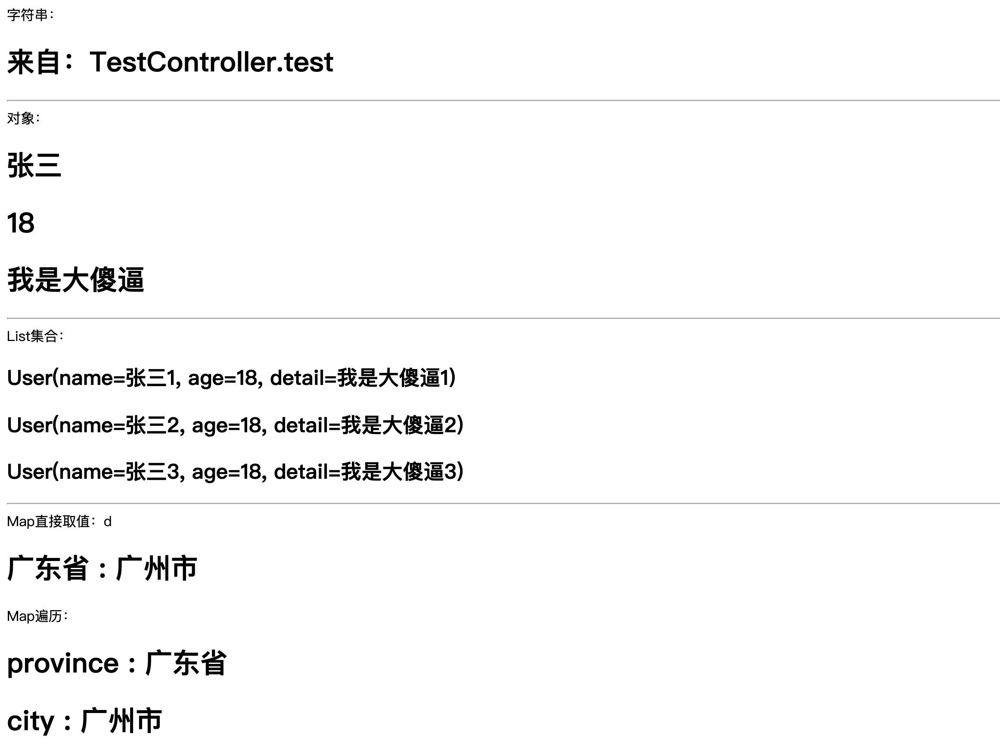

3. 选择变量表达式： `*{...}`

变量表达式不仅可以写成${...}，而且还可以写成*{...}。

但是，有一个重要的区别：星号语法对选定对象而不是整个上下文评估表达式。也就是说，只要没有选定的对象，美元(`${…}`)和星号(`*{...}`)的语法就完全一样。`*{…}`也可和`${…}`混用。

什么是选定对象？使用`th:object`属性的表达式的结果。就可以选定对象，具体实例如下：

```html
<div>
    对象：
    <div th:object="${user}">
        <p th:text="*{name}"></p>
        <p th:text="*{age}"></p>
        <p th:text="*{detail}"></p>
    </div>
    混用：
    <div>
        <p>Name: <span th:text="*{user.name}"></span></p>
        <p>Age: <span th:text="${user.age}"></span></p>
        <p>Detail: <span th:text="${user.detail}"></span></p>
    </div>
</div>
```

页面结果


4. 消息表达：` #{...}`

文本外部化是从模板文件中提取模板代码的片段，以便可以将它们保存在单独的文件(通常是.properties文件)中，文本的外部化片段通常称为“消息”。通俗易懂的来说`#{…}`语法就是用来**读取配置文件中数据**的。在Thymeleaf你可以使用`#{...}`语法获取消息

可以应用在国际化和错误消息提示等方面

#### thymeleaf的模板布局

##### 引用模板片段

1. 定义和引用片段

在我们的模板中，我们经常希望包含来自其他模板的部分，如页脚、页眉、菜单…

为了做到这一点，Thymeleaf需要我们定义这些部分，包括“片段”，这可以使用th:fragment属性来完成。

假设我们想添加一个标准的版权页脚，那么我们就创建一个包含以下代码的/templates/footer.html文件：

```html
<!DOCTYPE html>
<html xmlns:th="http://www.thymeleaf.org">
  <body>
 
    <div th:fragment="copy">
      &copy; 2011 The Good Thymes Virtual Grocery
    </div>
  </body>
</html>
```

上面的代码定义了一个名为copy的片段，我们可以使用th:insert或th:replace属性(以及th:include，尽管自Thymeleaf3.0以后不再推荐使用它)中的一个来将它包含在主页中：

```html
<body>

  ...

  <div th:insert="~{footer :: copy}"></div>
  
</body>
```

请注意，th:insert需要一个片段表达式 (~{...})，这是一个返回片段的表达式。不过，在上面的例子中，它是一个非复杂的片段表达式，所以(~{,}) 是可选的，所以上面的代码相当于：

```html
<body>

  ...

  <div th:insert="footer :: copy"></div>
  
</body>
```

2. 引入片段语法规范

有三种不同的格式

- `~{templatename::selector}`引入名为`templatename`的模板上应用指定的标记选择器产生的片段，比如：`~{footer :: copy}`
- `~{templatename}`引入名为templatename的完整模板
-  `~{::selector}`或`~{this::selector}`从同一个模板插入一个片段，匹配选择器。如果在表达式出现的模板上找不到，模板调用(插入)的堆栈将向最初处理的模板(根)遍历，直到选择器在某种程度上匹配

上面例子中的模板名和选择器都可以是全功能表达式(甚至是条件表达式！)，比如

```html
<div th:insert="footer :: (${user.isAdmin}? #{footer.admin} : #{footer.normaluser})"></div>
```

3. 引用不带th:fragment的片段

我们可以包含不使用任何th:fragment属性的片段：

```html
<div id="copy-section">
  &copy; 2011 The Good Thymes Virtual Grocery
</div>
```

我们可以使用上面的片段，只需通过它的id属性引用它，类似于CSS选择器:

```html
<body>
  ...
  <div th:insert="~{footer :: #copy-section}"></div>
</body>
```

4. th:insert,和th:replace(和th:include)之间的差异

- th:insert是最简单的:它将简单地插入指定的片段作为其宿主标签的主体

- th:replace实际上用指定的片段替换它的主机标签

- th:include与th:insert类似，但它并不插入片段，而是只插入该片段的内容

像这样的一个HTML片段

```html
<footer th:fragment="copy">
  &copy; 2011 The Good Thymes Virtual Grocery
</footer>
```

在host `<div>`标签中包含三次，如下所示:

```html
<body>
  <div th:insert="footer :: copy"></div>

  <div th:replace="footer :: copy"></div>

  <div th:include="footer :: copy"></div>
  
</body>
```

将导致:

```html
<body>

  ...

  <div>
    <footer>
      &copy; 2011 The Good Thymes Virtual Grocery
    </footer>
  </div>

  <footer>
    &copy; 2011 The Good Thymes Virtual Grocery
  </footer>
	
  <div>
    &copy; 2011 The Good Thymes Virtual Grocery
  </div>
  
</body>
```

##### 可传递参数片段

为了为模板片段创建一个更像函数的机制，用th:fragment定义的片段可以指定一组参数

```html
<div th:fragment="frag (onevar,twovar)">
    <p th:text="${onevar} + ' - ' + ${twovar}">...</p>
</div>
```

这需要使用这两种语法之一从th:insert或th:replace调用片段:

```html
<div th:replace="::frag (${value1},${value2})">...</div>
<div th:replace="::frag (onevar=${value1},twovar=${value2})">...</div>
```

请注意，顺序在最后一个选项中并不重要:

```html
<div th:replace="::frag (twovar=${value2},onevar=${value1})">...</div>
```

1. 不带片段参数的片段局部变量

即使片段的定义没有像这样的参数:

```html
<div th:fragment="frag">
    ...
</div>
```

我们可以使用上面指定的第二种语法来调用它们(并且只有第二种语法):

```html
<div th:replace="::frag (onevar=${value1},twovar=${value2})">
```

这相当于将th:replace和th:with组合:

```html
<div th:replace="::frag" th:with="onevar=${value1},twovar=${value2}">
```

请注意，无论片段是否有参数签名，这种局部变量的规范都不会导致上下文在执行之前被清空。片段仍然能够像当前一样访问调用模板中使用的每个上下文变量

2. th:assert 对于in-template声明

th:assert属性可以指定一个逗号分隔的表达式列表，这些表达式应该被求值并为每次求值生成true，否则会引发异常。

```html
<div th:assert="${onevar},(${twovar} != 43)">...</div>
```

这对于验证片段签名处的参数非常有用:

```html
<header th:fragment="contentheader(title)" th:assert="${!#strings.isEmpty(title)}">...</header>
```

##### 不仅仅是片段插入

1. 可传递参数片段用来引入网页需要的资源

请注意下面片段中title和links变量的使用:

```html
<head th:fragment="common_header(title,links)">
  <title th:replace="${title}">The awesome application</title>
  <!-- Common styles and scripts -->
  <link rel="stylesheet" type="text/css" media="all" th:href="@{/css/awesomeapp.css}">
  <link rel="shortcut icon" th:href="@{/images/favicon.ico}">
  <script type="text/javascript" th:src="@{/sh/scripts/codebase.js}"></script>
  <!--/* Per-page placeholder for additional links */-->
  <th:block th:replace="${links}" />
</head>
```

我们现在可以称这个片段为:

```html
<head th:replace="base :: common_header(~{::title},~{::link})">

  <title>Awesome - Main</title>

  <link rel="stylesheet" th:href="@{/css/bootstrap.min.css}">
  <link rel="stylesheet" th:href="@{/themes/smoothness/jquery-ui.css}">

</head>
```

结果将使用我们调用模板中的实际`<title>`和`<link>` 标记作为title和link变量的值，导致我们的片段在插入过程中被定制:

```html
<head>
  <title>Awesome - Main</title>
  <!-- Common styles and scripts -->
  <link rel="stylesheet" type="text/css" media="all" href="/awe/css/awesomeapp.css">
  <link rel="shortcut icon" href="/awe/images/favicon.ico">
  <script type="text/javascript" src="/awe/sh/scripts/codebase.js"></script>

  <link rel="stylesheet" href="/awe/css/bootstrap.min.css">
  <link rel="stylesheet" href="/awe/themes/smoothness/jquery-ui.css">

</head>
```

2. 使用空片段

一个特殊的片段表达式，即空片段(~{})，可以用于指定无标记。使用前面的例子:

```html
<head th:replace="base :: common_header(~{::title},~{})">

  <title>Awesome - Main</title>

</head>
```

注意片段(links)的第二个参数是如何设置为空片段的，因此不会为< th:block th:replace="${links}" />块写入任何内容:

```html
<head>

  <title>Awesome - Main</title>

  <!-- Common styles and scripts -->
  <link rel="stylesheet" type="text/css" media="all" href="/awe/css/awesomeapp.css">
  <link rel="shortcut icon" href="/awe/images/favicon.ico">
  <script type="text/javascript" src="/awe/sh/scripts/codebase.js"></script>

</head>
```

3. 使用no-operation令牌

如果我们只想让片段使用其当前标记作为默认值，则no-op也可以用作片段的参数。同样，使用common_header示例:

```html
<head th:replace="base :: common_header(_,~{::link})">

  <title>Awesome - Main</title>

  <link rel="stylesheet" th:href="@{/css/bootstrap.min.css}">
  <link rel="stylesheet" th:href="@{/themes/smoothness/jquery-ui.css}">

</head>
```

查看标题参数(common_header片段的第一个参数)如何设置为no-op (_)，这将导致片段的这一部分根本不被执行(title = no-operation):

```html
<title th:replace="${title}">The awesome application</title>
```

结果是:

```html
<head>

  <title>The awesome application</title>

  <!-- Common styles and scripts -->
  <link rel="stylesheet" type="text/css" media="all" href="/awe/css/awesomeapp.css">
  <link rel="shortcut icon" href="/awe/images/favicon.ico">
  <script type="text/javascript" src="/awe/sh/scripts/codebase.js"></script>

  <link rel="stylesheet" href="/awe/css/bootstrap.min.css">
  <link rel="stylesheet" href="/awe/themes/smoothness/jquery-ui.css">

</head>
```

4. 片段的高级条件插入

emtpy片段和无操作令牌的可用性允许我们以非常简单和优雅的方式执行片段的条件插入。

例如，我们可以这样做，以便只有当用户是管理员时才插入我们的公共::adminhead片段，如果不是，则不插入任何内容(emtpy片段):

```html
<div th:insert="${user.isAdmin()} ? ~{common :: adminhead} : ~{}">...</div>
```

此外，我们可以使用no-operation标记，以便仅在满足指定条件时插入片段，但如果不满足条件，则保留标记而不做修改:

```html
<div th:insert="${user.isAdmin()} ? ~{common :: adminhead} : _">
    Welcome [[${user.name}]], click <a th:href="@{/support}">here</a> for help-desk support.
</div>
```

此外，如果我们已经配置了模板解析器来检查模板资源的存在-通过它们的检查存在标志——我们可以在默认操作中使用片段本身的存在作为条件:

```html
<!-- The body of the <div> will be used if the "common :: salutation" fragment  -->
<!-- does not exist (or is empty).                                              -->
<div th:insert="~{common :: salutation} ?: _">
    Welcome [[${user.name}]], click <a th:href="@{/support}">here</a> for help-desk support.
</div>
```

##### 移除模板片段

可以通过th:remove移除不想的标签，这个标签可以应用在当页面不存在这些的时候，就不要显示一些预先存在页面中的静态代码块，比如，页面使用表格来修饰数据，当不存在数据时，就不应该该显示表头

th:remove可以有五种不同的行为方式，具体取决于其值：

- all:移除包含标签及其所有子标签。

- body: 不要移除包含标签，而是移除它的所有子标签。

- tag: 移除包含标签，但不要移除其子标签。

- all-but-first: 移除包含标签的所有子标签，第一个除外。

- none : 什么都不做。该值对于动态评估非常有用。

th:remove属性可以采用任何Thymeleaf标准表达式，只要它返回一个允许的字符串值(all, tag, body, all-but-first或none)。

这意味着移除可能是有条件的，例如:

```html
<a href="/something" th:remove="${condition}? tag : none">Link text not to be removed</a>
```

还要注意，th:remove认为null是none的同义词，因此以下操作与上面的示例相同:

```html
<a href="/something" th:remove="${condition}? tag">Link text not to be removed</a>
```

在这种情况下，如果${condition}为false，将返回null，因此不会执行删除

##### 布局继承

为了能够将单个文件作为布局，可以使用片段。使用th:fragment和th:replace的具有标题和内容的简单布局示例:

```html
<!DOCTYPE html>
<html th:fragment="layout (title, content)" xmlns:th="http://www.thymeleaf.org">
<head>
    <title th:replace="${title}">Layout Title</title>
</head>
<body>
    <h1>Layout H1</h1>
    <div th:replace="${content}">
        <p>Layout content</p>
    </div>
    <footer>
        Layout footer
    </footer>
</body>
</html>
```

该示例声明了一个名为layout的片段，该片段以标题和内容作为参数。两者都将在继承它的页面上被下面示例中提供的片段表达式替换。

```html
<!DOCTYPE html>
<html th:replace="~{layoutFile :: layout(~{::title}, ~{::section})}">
<head>
    <title>Page Title</title>
</head>
<body>
<section>
    <p>Page content</p>
    <div>Included on page</div>
</section>
</body>
</html>
```

在这个文件中，html标签将被布局替换，但是在布局中标题和内容将分别被标题块和节块替换。

如果需要，布局可以由几个片段组成，如页眉和页脚。

### 扩展和装配MVC

#### springmvc自动配置

SpringBoot对我们的`SpringMVC`做了哪些配置，包括`如何扩展`，`如何定制`

- 官方文档：https://docs.spring.io/spring-boot/docs/2.5.6/reference/htmlsingle/#boot-features-spring-mvc-auto-configu%20ration
- springboot为springmvc提供了自动配置，可以与大多数的应用完美配合
- 以下是sprinboot对springmvc的默认配置类：`org.springframework.boot.autoconfigure.web.servlet.WebMvcAutoConfiguration`

自动配置在springmvc的默认值之上添加了以下功能：

- 包含ContentNegotiatingViewResolver和BeanNameViewResolver –> 视图解析器
- 支持服务静态资源，包括对WebJars的支持 –> 静态资源文件夹路径
- 自动注册Converter、GenericConverter和Formatterbeans–> 转换器，格式化器
- 支持HttpMessageConverters –> SpringMVC用来转换Http请求和响应的：User—JSON
- 自动注册MessageCodesResolver –> 定义错误代码生成规则
- 静态index.html支持 –> 静态首页访问
- 定制Favicon.ioc支持 –> 网站图标
- 自动使用ConfigurableWebBindingInitializerbean

如何修改springmvc的默认配置：

- 如果想保留 Spring Boot MVC 的功能，并且需要添加其他 MVC配置（拦截器，格式化程序和视图控制器等），可以添加自己的`WebMvcConfigurer`类型的`@Configuration`类，但不能带`@EnableWebMvc`注解

- 如果您想自定义`RequestMappingHandlerMapping`、`RequestMappingHandlerAdapter`或者`ExceptionHandlerExceptionResolver`实例，可以声明一个`ExceptionHandlerExceptionResolver`实例来提供这些组件

- 如果您想完全掌控 Spring MVC，可以添加自定义注解了`@EnableWebMvc`的`@Configuration`配置类

#### 视图解析器

根据方法的`返回值`得到视图对象（View），视图对象决定如何`渲染`（转发？重定向？）

- 自动配置了ViewResolver
- ContentNegotiatingViewResolver：组合所有的视图解析器的

我们打开springboot项目下web的自动配置类`WebMvcAutoConfiguration`，其中就有注入视图解析器的代码`ContentNegotiatingViewResolver`叫什么内容协商视图解析器，会根据不同的视图来找到最合适的视图解析器来解析内容

```java
@Bean
@ConditionalOnBean(ViewResolver.class)
@ConditionalOnMissingBean(name = "viewResolver", value = ContentNegotiatingViewResolver.class)
public ContentNegotiatingViewResolver viewResolver(BeanFactory beanFactory) {
  ContentNegotiatingViewResolver resolver = new ContentNegotiatingViewResolver();
  resolver.setContentNegotiationManager(beanFactory.getBean(ContentNegotiationManager.class));
  // ContentNegotiatingViewResolver uses all the other view resolvers to locate
  // a view so it should have a high precedence
  resolver.setOrder(Ordered.HIGHEST_PRECEDENCE);
  return resolver;
}
```

当我们在浏览器获取网站资源的时候，就会调用`ContentNegotiatingViewResolver.resolveViewName`来获取到最适合的视图解析器

```java
@Override
@Nullable
public View resolveViewName(String viewName, Locale locale) throws Exception {
  RequestAttributes attrs = RequestContextHolder.getRequestAttributes();
  Assert.state(attrs instanceof ServletRequestAttributes, "No current ServletRequestAttributes");
  List<MediaType> requestedMediaTypes = getMediaTypes(((ServletRequestAttributes) attrs).getRequest());
  if (requestedMediaTypes != null) {
    List<View> candidateViews = getCandidateViews(viewName, locale, requestedMediaTypes);
    View bestView = getBestView(candidateViews, requestedMediaTypes, attrs);
    if (bestView != null) {
      return bestView;
    }
  }

  String mediaTypeInfo = logger.isDebugEnabled() && requestedMediaTypes != null ?
    " given " + requestedMediaTypes.toString() : "";

  if (this.useNotAcceptableStatusCode) {
    if (logger.isDebugEnabled()) {
      logger.debug("Using 406 NOT_ACCEPTABLE" + mediaTypeInfo);
    }
    return NOT_ACCEPTABLE_VIEW;
  }
  else {
    logger.debug("View remains unresolved" + mediaTypeInfo);
    return null;
  }
}
```

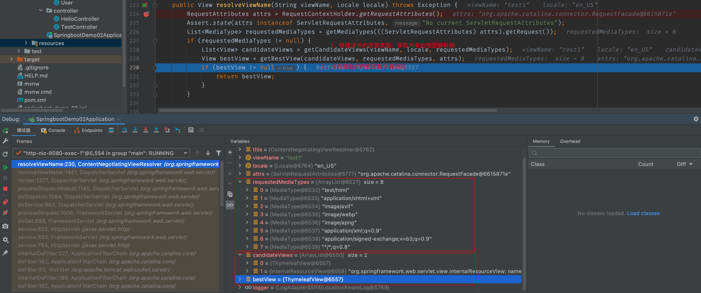

那么视图解析器又是从哪里来的呢？在``时，就会创建一些视图解析器，其中包括我们自定义的视图解析器

```java
@Override
protected void initServletContext(ServletContext servletContext) {
  // ViewResolver.class 从spring容器中获取到所有是实现了ViewResolver.class接口的bean，这些都是是一些视图解析器
  Collection<ViewResolver> matchingBeans =
    BeanFactoryUtils.beansOfTypeIncludingAncestors(obtainApplicationContext(), ViewResolver.class).values();
  // 如果视图解析器集合为空，就会去初始化
  if (this.viewResolvers == null) {
    this.viewResolvers = new ArrayList<>(matchingBeans.size());
    for (ViewResolver viewResolver : matchingBeans) {
      if (this != viewResolver) {
        this.viewResolvers.add(viewResolver);
      }
    }
  }
  // 如果视图解析器集合不为空，就会把当前spring容器中存在的但是不在viewResolvers中的视图解析器初始化并添加到viewResolvers中
  else {
    for (int i = 0; i < this.viewResolvers.size(); i++) {
      ViewResolver vr = this.viewResolvers.get(i);
      if (matchingBeans.contains(vr)) {
        continue;
      }
      String name = vr.getClass().getName() + i;
      obtainApplicationContext().getAutowireCapableBeanFactory().initializeBean(vr, name);
    }
  }
  AnnotationAwareOrderComparator.sort(this.viewResolvers);
  this.cnmFactoryBean.setServletContext(servletContext);
}
```

那么如果我们想要自定义视图解析器，就可以定义一个类继承ViewResolver然后注入到spring容器中，通过mvc的自动配置就可以自动的将其组合进来

自定义一个视图解析器，并添加到容器中，mvc会自动将这个视图解析器,添加到`候选视图解析器`中

添加到容器的方式有：

- 直接在带有@Configuration注解的类中注入bean
- 通过自定义WebMvcConfigurer.configureViewResolvers来注册视图解析器
- 通过@Component的方式

```java
// CustomViewResolver 自定义视图解析器
public class CustomViewResolver implements ViewResolver {
    @Override
    public View resolveViewName(String viewName, Locale locale) throws Exception {
        System.out.println(viewName);
        System.out.println(locale);
        return null;
    }
}

/**
 * webmvc自定义配置
 * <p>
 * 如果想保留 Spring Boot MVC 的功能，并且需要添加其他 MVC配置（拦截器，格式化程序和视图控制器等），
 * 可以添加自己的`WebMvcConfigurer`类型的`@Configuration`类，但不能带`@EnableWebMvc`注解
 */
@Configuration
public class CustomWebMvcConfigurer implements WebMvcConfigurer {
    @Override
    public void configureViewResolvers(ViewResolverRegistry registry) {
        registry.viewResolver(new CustomViewResolver());
    }
}
```

当我们从浏览器请求资源的时候，就会匹配最适合视图解析器，此时会将我自定义的视图解析器的函数进行调用，以查看是否是当前请求资源的视图解析器

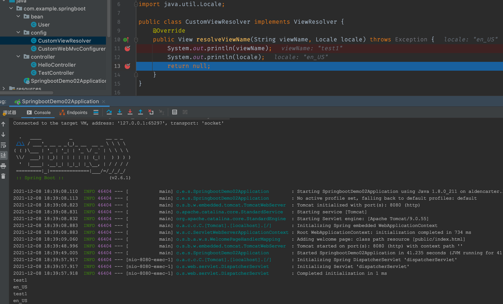

#### 转换器和格式化器

- `Converter`：转换器， `public String hello(User user)`类型转换使用Converter（表单数据转为user<前端的数据转为JavaBean要用到>）
- `Formatter`：格式化器，2017.12.17===>Date

##### 转换器

在`WebMvcAutoConfiguration`中

```java
@Bean
@Override
public FormattingConversionService mvcConversionService() {
  // 时期时间格式化解析器
  Format format = this.mvcProperties.getFormat();
  WebConversionService conversionService = new WebConversionService(new DateTimeFormatters()
                                                                    .dateFormat(format.getDate()).timeFormat(format.getTime()).dateTimeFormat(format.getDateTime()));
  // 添加到FormatterRegistry注册中，在这个函数中，会调用ApplicationConversionService.addBeans(registry, this.beanFactory);
  // addBeans会把所有在spring容器中的实现了指定接口的格式化器添加到FormatterRegistry中
  addFormatters(conversionService);
  return conversionService;
}
```

`dateTimeFormat(format.getDateTime())`的日期时间类型在`WebMvcProperties.Format`中，也就是说，如果我们在配置文件中配置日期时间格式，那么springmvc就会按照我们配置的格式类型来解析从前端传上来的时间字符串

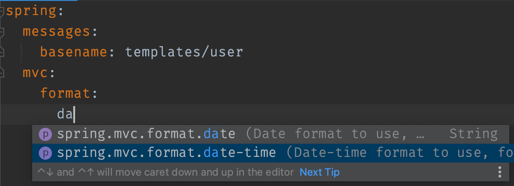

在这个函数中，会调用ApplicationConversionService.addBeans(registry, this.beanFactory)，addBeans会把所有在spring容器中的实现了指定接口的格式化器添加到FormatterRegistry中，也就是说我们自己添加的格式化器转换器, 我们只需要放在容器中即可

```java
// WebMvcAutoConfiguration
@Override
public void addFormatters(FormatterRegistry registry) {
  ApplicationConversionService.addBeans(registry, this.beanFactory);
}

// ApplicationConversionService
/**
	 * Add {@link GenericConverter}, {@link Converter}, {@link Printer}, {@link Parser}
	 * and {@link Formatter} beans from the specified context.
	 * @param registry the service to register beans with
	 * @param beanFactory the bean factory to get the beans from
	 * @since 2.2.0
	 */
public static void addBeans(FormatterRegistry registry, ListableBeanFactory beanFactory) {
  Set<Object> beans = new LinkedHashSet<>();
  // 只要是继承些并注入到spring容器中，即可
  beans.addAll(beanFactory.getBeansOfType(GenericConverter.class).values());
  beans.addAll(beanFactory.getBeansOfType(Converter.class).values());
  beans.addAll(beanFactory.getBeansOfType(Printer.class).values());
  beans.addAll(beanFactory.getBeansOfType(Parser.class).values());
  for (Object bean : beans) {
    if (bean instanceof GenericConverter) {
      registry.addConverter((GenericConverter) bean);
    }
    else if (bean instanceof Converter) {
      registry.addConverter((Converter<?, ?>) bean);
    }
    else if (bean instanceof Formatter) {
      registry.addFormatter((Formatter<?>) bean);
    }
    else if (bean instanceof Printer) {
      registry.addPrinter((Printer<?>) bean);
    }
    else if (bean instanceof Parser) {
      registry.addParser((Parser<?>) bean);
    }
  }
}
```

#### HttpMessageConverts

- `HttpMessageConverter `SpringMVC用来转换Http请求和响应的，User—JSON(将JavaBean 转为 JSON数据)
- `HttpMessageConverters` 是从容器中确定，获取所有的HttpMessageConverter

自己给容器中添加HttpMessageConverter，只需要将自己的组件注册容器中（@Bean,@Component等注册方式）

#### 扩展springmvc

以前我们在spring mvc中配置都是在xxx.xml文件中，或者需要在xml文件中配置自动扫包策略等等

```xml
<!-- 视图请求映射(当发送/hello请求,会跳转到success页面) -->
<mvc:view-controller path="/hello" view-name="success"/>
```

现在，编写一个配置类（@Configuration），是WebMvcConfigurer类型；不能标注@EnableWebMvc，既保留了所有的自动配置，也能用我们扩展的配置

我们要做的就是编写一个`@Configuration`注解类，并且类型要为`WebMvcConfigurer`，还不能标注`@EnableWebMvc`注解； 我们去自己写一个，我们新建一个包叫config，写一个类`CustomWebMvcConfigurer`

```java
@Configuration
public class CustomWebMvcConfigurer implements WebMvcConfigurer {

    @Override
    public void addViewControllers(ViewControllerRegistry registry) {
        // 当请求路径是/hello时，映射到/test
        registry.addViewController("/hello").setViewName("test");
    }
}
```

这样一来, 我们就没必要在写; 通过上面的方式就可以实现了`视图映射`

##### 原理

我们知道WebMvcAutoConfiguration是SpringMVC的自动配置类，而`WebMvcAutoConfigurationAdapter`类是WebMvcAutoConfiguration中的一个内部类，通过import的方式引入更多的配置`@Import(EnableWebMvcConfiguration.class)`，而这个类也是WebMvcAutoConfiguration内部类

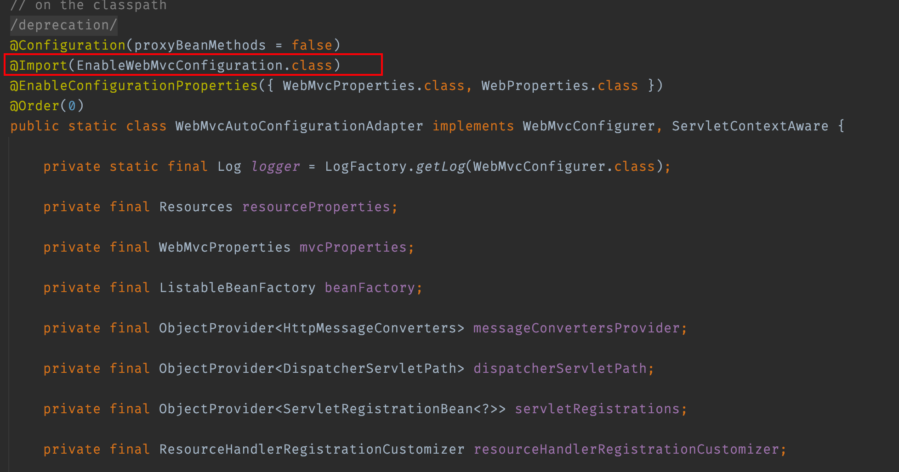

通过查看EnableWebMvcConfiguration这个类继承的父类`DelegatingWebMvcConfiguration`

```java
@Autowired(required = false)
// 会把所有配置都加入到configurers中
public void setConfigurers(List<WebMvcConfigurer> configurers) {
  if (!CollectionUtils.isEmpty(configurers)) {
    this.configurers.addWebMvcConfigurers(configurers);
  }
}

// 添加格式化器
@Override
protected void addFormatters(FormatterRegistry registry) {
  this.configurers.addFormatters(registry);
}

// 添加拦截器
@Override
protected void addInterceptors(InterceptorRegistry registry) {
  this.configurers.addInterceptors(registry);
}

// 添加资源映射器
@Override
protected void addResourceHandlers(ResourceHandlerRegistry registry) {
  this.configurers.addResourceHandlers(registry);
}

// 好像是跨域映射吧
@Override
protected void addCorsMappings(CorsRegistry registry) {
  this.configurers.addCorsMappings(registry);
}

// 添加视图控制器
@Override
protected void addViewControllers(ViewControllerRegistry registry) {
  this.configurers.addViewControllers(registry);
}
```

容器中所有的WebMvcConfigurer都会一起起作用，我们的配置类也会被调用

#### 全面接管springmvc

如果SpringBoot对SpringMVC的自动配置不需要了，所有都是由我们自己来配置，所有的SpringMVC的自动配置都失效了，我们只需要在配置类中添加`@EnableWebMvc`即可

#### 如何修改springboot的默认配置

模式：

- SpringBoot在自动配置很多组件的时候，先看容器中有没有用户自己配置的（@Bean、@Component）如果有就用用户配置的，如果没有，才自动配置；如果有些组件可以有多个（ViewResolver）将用户配置的和自己默认的组合起来

- 在SpringBoot中会有非常多的xxxConfigurer帮助我们进行扩展配置

- 在SpringBoot中会有很多的xxxCustomizer帮助我们进行定制配置

## 异步任务

> 参照网址：https://blog.csdn.net/weixin_39800144/article/details/79046237

在springboot web使用过程，有些业务是不需要等待它完成之后在返回请求的数据的，比如，发送邮件异步任务、定时任务等

### 引入

场景：现在需要上传一个Excel表格，数据量几万条，而且，上传解析后还需要进行计算，然后插入数据库。

分析：上传和解析，都很简单，但是，这里如果使用同步方式，那么：上传-->解析-->运算-->插入数据库；这个过程，前台的页面都是等待状态的，用户会以为页面卡死了。所以，这里需要做异步处理：

- 上传-->返回正在解析的标志；

- 解析-->运算-->插入数据库；

此时，当用户上传完文件后，页面立马跳转，解析，运算等工作，继续在后台进行，而用户可以不用等待。

这里简单记录一下，springBoot的异步使用方式

### 同步方式

1. controller

```java
/**
  * 同步处理
  * @return
  */
@RequestMapping(value = "test2",method = RequestMethod.GET)
public String test2(){
  loginService.getTest2();
  logger.info(Thread.currentThread().getName()+"==========主线程名");
  return "同步,正在解析......";
}
```

2. service

```java
/**同步方法*/
@Override
public void getTest2(){
  Building building = new Building();
  synchronized (building){
    try {
      for (int i = 1;i <= 100;i++){
        logger.info(Thread.currentThread().getName()+"----------同步：>"+i);
        building.wait(200);
      }
    }catch (Exception ex){
      ex.printStackTrace();
    }
  }
}
```

这种同步的方式处理，会发现，当这100此循环完成后，页面才会返回 ：同步,正在解析......。当后台在循环处理时，前台的页面始终处于等待状态

### 异步方式

#### 线程池

使用线程池，创建新的线程去处理

1. controller

```java
/**
  * 异步处理1：线程池，创建新线程处理
  * @return
  */
@RequestMapping(value = "test3",method = RequestMethod.GET)
public String test3(){
  ExecutorService service = Executors.newFixedThreadPool(5);
  RunnableTask1 task1 = new RunnableTask1();
  service.execute(task1);
  logger.info("=========》当前线程名："+Thread.currentThread().getName());
  return "异步,正在解析......";
}
```

2. RunnableTask1 线程任务

```java
public class RunnableTask1 implements Runnable{
    private final Logger logger = LoggerFactory.getLogger(getClass());
 
    @Override
    public void run(){
        Building building = new Building();
        synchronized (building){
            try {
                for (int i = 1;i <= 100;i++){
                    System.out.println(Thread.currentThread().getName()+"----------异步：>"+i);
                    building.wait(200);
                }
            }catch (Exception ex){
                ex.printStackTrace();
            }
        }
    }
}
```

主线程，和处理任务的线程，不是一个线程，也就是，当页面请求后，主线程会返回我们想要返回的标识，这里返回的是一个字符串：异步，正在解析......，而线程池新开了一个线程，在后台处理业务逻辑

所以，此时访问接口后，会立马返回，页面不用等待，处理逻辑在后台默默进行

#### springboot注解方式

是springBoot自身的一种异步方式，使用注解实现，非常方便，我们在想要异步执行的方法上加上`@Async`注解，在controller上加上`@EnableAsync`，即可。注意，这里的异步方法，**只能在自身之外调用，在本类调用是无效的**

1. controller

```java
@RestController
@RequestMapping("tmall")
public class LoginController {
    private final org.slf4j.Logger logger = LoggerFactory.getLogger(getClass());
    @Autowired
    private LoginService loginService;
    /**
     * 异步处理2：使用springBoot自带async注解
     */
    @RequestMapping(value = "test1",method = RequestMethod.GET)
    public String test1(){
        loginService.getTest1();
        logger.info("============>"+Thread.currentThread().getName());
        return "异步,正在解析......";
    }
}
```

2. service

```java
/**异步方法
 * 有@Async注解的方法，默认就是异步执行的，会在默认的线程池中执行，但是此方法不能在本类调用；启动类需添加直接开启异步执@EnableAsync。
 * 
 */
    @Async
    @Override
    public String getTest1(){
        Building building = new Building();
        synchronized (building){
            try {
                for (int i = 1;i <= 100;i++){
                    logger.info(Thread.currentThread().getName()+"----------异步：>"+i);
                    building.wait(200);
                }
                return "执行异步任务完毕";
            }catch (Exception ex){
                ex.printStackTrace();
            }
        }
        return Thread.currentThread().getName()+"执行完毕";
    }
}
```

3. 在启动类中添加注解`@EnableAsync`

```java
/**
 * 开启异步注解
 */
@EnableAsync
@SpringBootApplication
public class SpringbootDemo02Application {
    public static void main(String[] args) {
        SpringApplication.run(SpringbootDemo02Application.class, args);
    }
}
```

页面发出请求后，主线程会返回，而内置的线程池会新开线程，在后台执行任务。此时页面不用等待，可以继续其他操作

## 邮件任务

springbooot对邮件也进行了封装，也是一个starter启动器

### 概述

#### 引入

依赖

```xml
<dependency>
  <groupId>org.springframework.boot</groupId>
  <artifactId>spring-boot-starter-mail</artifactId>
</dependency>
```

通过maven依赖关系我们可以知道在当前版本（2.6.1）下，使用jakarta实现邮件任务

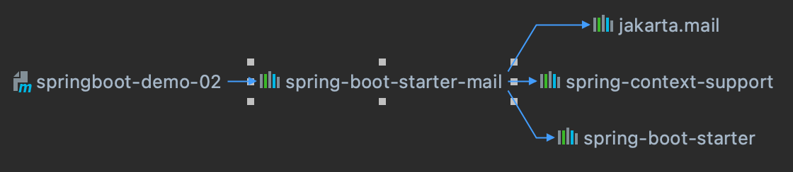

#### 基础原理

在这个启动器中，springboot和针对其他的启动器一样，都是做一些自动配置和属性值的可覆盖赋值的操作

- MailSenderAutoConfiguration
- MailProperties 一些可以配置参数都在这里

### 基本使用

在使用邮件发送之前，需要将邮箱的stmp服务开启，从邮箱的设置中可以看到邮箱的stmp和pop等的服务地址

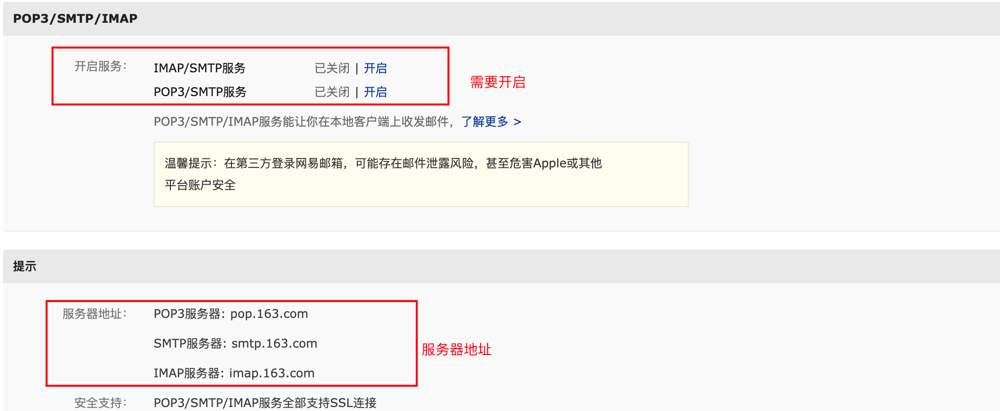

配置连接参数，进入MailProperties查看如果不写有默认值并且是自己需要的，就可以不用配置了

```yaml
spring:
  mail:
    host: smtp.163.com
    port: 25
    username: xxx@163.com
    password: xxx授权码
```

我们添加mail启动器之后，会自动将`JavaMailSender`注入到spring容器中

```java
@Configuration(proxyBeanMethods = false)
@ConditionalOnProperty(prefix = "spring.mail", name = "host")
class MailSenderPropertiesConfiguration {

	@Bean
	@ConditionalOnMissingBean(JavaMailSender.class)
	JavaMailSenderImpl mailSender(MailProperties properties) {
		JavaMailSenderImpl sender = new JavaMailSenderImpl();
		applyProperties(properties, sender);
		return sender;
	}
}
```

#### 发送简单邮件

我们引入mail启动器之后，JavaMailSender自动注入到spring容器中，所以我们通过@Autowired引入即可使用，如果只是发送简单类型的邮件，直接使用SimpleMailMessage即可。

```java
@Autowired
private JavaMailSender mailSender;

@Test
void testMail() {
  final SimpleMailMessage simpleMessage = new SimpleMailMessage();
  simpleMessage.setFrom("xxxx@163.com");// 发送邮箱
  simpleMessage.setTo("xxxxx@qq.com"); // 接收邮箱
  simpleMessage.setSubject("test");  // 主题
  simpleMessage.setText("content"); // 内容

  mailSender.send(simpleMessage);
}
```

#### 发送复杂邮件

发送复杂类型的邮件，需要使用MimeMessage类型，并且需要通过MimeMessageHelper配置发送的邮件内容

```java
@Autowired
private JavaMailSender mailSender;

@Test
void testMail1() throws MessagingException {
  final MimeMessage mimeMessage = mailSender.createMimeMessage();
  final MimeMessageHelper messageHelper = new MimeMessageHelper(mimeMessage, true);

  messageHelper.setFrom("xxx@163.com");
  messageHelper.setTo("xxxxx@qq.com");
  messageHelper.setSubject("test");
  messageHelper.setText("content");

  messageHelper.addAttachment("1.jpg", new File("/opt/1.jpg")); // 添加附件

  mailSender.send(mimeMessage);
}
```

## 定时任务

定时任务可以说是企业应用中最经常使用的任务之一了，比如日志输出、秒杀任务的倒计时等

定时任务的几种实现方式：

- Timer：这是java自带的`java.util.Timer`类，这个类允许你调度一个`java.util.TimerTask`任务。使用这种方式可以让你的程序按照某一个频度执行，但不能在指定时间运行。一般用的较少
- ScheduledExecutorService：也jdk自带的一个类；是基于线程池设计的定时任务类，每个调度任务都会分配到线程池中的一个线程去执行，也就是说，任务是并发执行，互不影响
- Spring Task：Spring3.0以后自带的task，可以将它看成一个轻量级的Quartz，而且使用起来比Quartz简单许多
- Quartz：这是一个功能比较强大的的调度器，可以让你的程序在指定时间执行，也可以按照某一个频度执行，配置起来稍显复杂

### Timer

这个目前在项目中用的较少，具体的介绍可以查看api

```java
public static void main(String[] args) {
  final TimerTask task = new TimerTask() {
    @Override
    public void run() {
      System.out.println("task：" + new Date());
    }
  };

  final Timer timer = new Timer();
  // 安排指定的任务在指定的时间开始进行重复的固定延迟执行。这里是每1秒执行一次
  timer.schedule(task,1000,1000);
}
```

在@Test注解的方法中运行不输出数据，猜测应该是和没有守护线程有关

### ScheduledExecutorService

ScheduledExecutorService的主要作用就是可以将定时任务与线程池功能结合使用

#### scheduleAtFixedRate实现周期执行

```java
public class ScheduledExecutorServiceTest {
    public static void main(String[] args) {
        ScheduledExecutorService executorService = Executors.newSingleThreadScheduledExecutor();
        executorService.scheduleAtFixedRate(new Runnable() {
            @Override
            public void run() {
                System.out.println("run "+ System.currentTimeMillis());
            }
        }, 0, 100, TimeUnit.MILLISECONDS);
    }
}
```

#### 使用Callable延迟运行

ScheduledExecutorService使用Callable延迟运行

```java
import java.util.ArrayList;
import java.util.List;
import java.util.concurrent.*;

public class CallableRun {
    public static void main(String[] args) {
        try {
            List<Callable> callableList = new ArrayList<>();
            callableList.add(new MyCallableA());
            callableList.add(new MyCallableB());
            ScheduledExecutorService executorService = Executors.newSingleThreadScheduledExecutor();
            ScheduledFuture futureA = executorService.schedule(callableList.get(0), 4L, TimeUnit.SECONDS);
            ScheduledFuture futureB = executorService.schedule(callableList.get(1), 4L, TimeUnit.SECONDS);

            System.out.println("            X = " + System.currentTimeMillis());
            System.out.println("返回值A：" + futureA.get());
            System.out.println("返回值B：" + futureB.get());
            System.out.println("            Y = " + System.currentTimeMillis());

            executorService.shutdown();
        } catch (InterruptedException e) {
            e.printStackTrace();
        } catch (ExecutionException e) {
            e.printStackTrace();
        }
    }

    static class MyCallableA implements Callable<String> {
        @Override
        public String call() throws Exception{
            try {
                System.out.println("callA begin " + Thread.currentThread().getName() + ", " + System.currentTimeMillis());
                TimeUnit.SECONDS.sleep(3); // 休眠3秒
                System.out.println("callA end " + Thread.currentThread().getName() + ", " + System.currentTimeMillis());
            } catch (Exception e) {
                e.printStackTrace();
            }
            return "returnA";
        }
    }

    static class MyCallableB implements Callable<String>  {
        @Override
        public String call() throws Exception{
            System.out.println("callB begin " + Thread.currentThread().getName() + ", " + System.currentTimeMillis());
            System.out.println("callB end " + Thread.currentThread().getName() + ", " + System.currentTimeMillis());
            return "returnB";
        }
    }
}
```

#### scheduleWithFixedDelay

使用scheduleWithFixedDelay()方法实现周期性执行

```java
import java.util.concurrent.Executors;
import java.util.concurrent.ScheduledExecutorService;
import java.util.concurrent.TimeUnit;

public class RunMain {
    public static void main(String[] args) {
        ScheduledExecutorService executorService = Executors.newSingleThreadScheduledExecutor();
        System.out.println("          x = " + System.currentTimeMillis());
        executorService.scheduleWithFixedDelay(new MyRunable(), 1, 2, TimeUnit.SECONDS);
        System.out.println("          y = " + System.currentTimeMillis());
    }

    static class MyRunable implements Runnable {
        @Override
        public void run() {
            try {
                System.out.println("     begin = " + System.currentTimeMillis() + ", name: " + Thread.currentThread().getName());
                TimeUnit.SECONDS.sleep(4);
                System.out.println("     end = " + System.currentTimeMillis() + ", name: " + Thread.currentThread().getName());
            } catch (InterruptedException e) {
                e.printStackTrace();
            }
        }
    }
}
```

### Spring Task

#### 单线程执行

1. 在项目启动类上添加 @EnableScheduling 注解，开启对定时任务的支持

```java
@EnableScheduling
@SpringBootApplication
public class SpringbootDemo02Application {
    public static void main(String[] args) {
        SpringApplication.run(SpringbootDemo02Application.class, args);
    }
}
```

其中，@EnableScheduling注解的作用是发现注解@Scheduled的任务并后台执行

2. 编写定时任务类和方法，定时任务类通过 Spring IOC 加载，使用 @Component 注解，定时方法使用 @Scheduled 注解

```java
@Component
public class ScheduledTask {
    @Scheduled(fixedRate = 3000)
    public void scheduledTask() {
        System.out.println("任务执行时间：" + LocalDateTime.now());
    }
}
```

fixedRate 是 long 类型，表示任务执行的间隔毫秒数，以上代码中的定时任务每 3 秒执行一次

3. 运行定时工程，项目启动和运行日志如下，可见每 3 秒打印一次日志执行记录

```bash
任务执行时间：2021-12-09T00:22:34.179
任务执行时间：2021-12-09T00:22:37.179
任务执行时间：2021-12-09T00:22:40.179
```

#### 多线程执行

如果只有一个定时任务，像上面的配置这样做肯定没问题，当定时任务增多，如果一个任务卡死，会导致其他任务也无法执行

在传统的Spring项目中，我们可以在xml配置文件添加task的配置，而在SpringBoot项目中一般使用config配置类的方式添加配置，所以新建一个AsyncConfig类

```java
@Configuration
@EnableAsync
public class AsyncConfig {
     /*
    此处成员变量应该使用@Value从配置中读取
     */
    private int corePoolSize = 10;
    private int maxPoolSize = 200;
    private int queueCapacity = 10;
    @Bean
    public Executor taskExecutor() {
        ThreadPoolTaskExecutor executor = new ThreadPoolTaskExecutor();
        executor.setCorePoolSize(corePoolSize);
        executor.setMaxPoolSize(maxPoolSize);
        executor.setQueueCapacity(queueCapacity);
        executor.initialize();
        return executor;
    }
}
```

- `@Configuration`：表明该类是一个配置类
- `@EnableAsync`：开启异步事件的支持

然后在定时任务的类或者方法上添加`@Async` 。最后重启项目，每一个任务都是在不同的线程中

#### @Scheduled详解

在上面的入门例子中，使用了@Scheduled(fixedRate = 3000) 注解来定义每过 3 秒执行的任务，对于 @Scheduled 的使用可以总结如下几种方式：

- @Scheduled(fixedRate = 3000) ：上一次开始执行时间点之后 3 秒再执行（fixedRate 属性：定时任务开始后再次执行定时任务的延时（需等待上次定时任务完成），单位毫秒）
- @Scheduled(fixedDelay = 3000) ：上一次执行完毕时间点之后 3 秒再执行（fixedDelay 属性：定时任务执行完成后再次执行定时任务的延时（需等待上次定时任务完成），单位毫秒）
- @Scheduled(initialDelay = 1000, fixedRate = 3000) ：第一次延迟1秒后执行，之后按fixedRate的规则每 3 秒执行一次（initialDelay 属性：第一次执行定时任务的延迟时间，需配合fixedDelay或者fixedRate来使用）
- @Scheduled(cron="0 0 2 1 * ? *") ：通过cron表达式定义规则

##### cron表达式

cron表达式格式：

{秒数} {分钟} {小时} {日期} {月份} {星期} {年份(可为空)}

例  "0 0 12 ? * WED" 在每星期三下午12:00 执行（年份通常 省略）

1. 每个字段的允许值

| 字段     | 允许值           | 允许的特殊字符  |
| -------- | ---------------- | --------------- |
| 秒       | 0~59             | , - * /         |
| 分       | 0~59             | , - * /         |
| 小时     | 0~23             | , - * /         |
| 日期     | 1~31             | , - * ? / L W C |
| 月份     | 1~12或者JAN~DEC  | , - * /         |
| 星期     | 1~7 或者 SUN~SAT | , - * ? / L C ## |
| 年(可选) | 1970~2099        | , - * /         |

2. 表达式生成器

有很多的cron表达式在线生成器，这里给大家推荐几款

- http://www.pdtools.net/tools/becron.jsp

- http://cron.qqe2.com/

3. 常用的cron表达式

常用的cron表达式有：

- 0 0 2 1 * ? * ：表示在每月 1 日的凌晨 2 点执行
- 0 15 10 ? * MON-FRI ：表示周一到周五每天上午 10:15 执行
- 0 15 10 ? 6L 2019-2020 ：表示 2019-2020 年的每个月的最后一个星期五上午 10:15 执行
- 0 0 10,14,16 * * ? ：每天上午 10 点，下午 2 点，4 点执行
- 0 0/30 9-17 * * ? ：朝九晚五工作时间内每半小时执行
- 0 0 12 ? * WED ：表示每个星期三中午 12 点执行
- 0 0 12 * * ? ：每天中午 12点执行
- 0 15 10 ? * * ：每天上午 10:15 执行
- 0 15 10 * * ? ：每天上午 10:15 执行
- 0 15 10 * * ? * ：每天上午 10:15 执行
- 0 15 10 * * ? 2019 ：2019 年的每天上午 10:15 执行

### Quartz

引入依赖

```xml
<dependency>
    <groupId>org.springframework.boot</groupId>
    <artifactId>spring-boot-starter-quartz</artifactId>
</dependency>
```

1. 创建任务类TestQuartz，该类主要是继承了QuartzJobBean

```java
public class TestQuartz extends QuartzJobBean {
    /**
     * 执行定时任务
     * @param jobExecutionContext
     * @throws JobExecutionException
     */
    @Override
    protected void executeInternal(JobExecutionContext jobExecutionContext) throws JobExecutionException {
        System.out.println("quartz task "+new Date());
    }
}
```

2. 创建配置类`QuartzConfig`

```java
@Configuration
public class QuartzConfig {
    @Bean
    public JobDetail teatQuartzDetail(){
        return JobBuilder.newJob(TestQuartz.class).withIdentity("testQuartz").storeDurably().build();
    }

    @Bean
    public Trigger testQuartzTrigger(){
        SimpleScheduleBuilder scheduleBuilder = SimpleScheduleBuilder.simpleSchedule()
                .withIntervalInSeconds(10)  //设置时间周期单位秒
                .repeatForever();
        return TriggerBuilder.newTrigger().forJob(teatQuartzDetail())
                .withIdentity("testQuartz")
                .withSchedule(scheduleBuilder)
                .build();
    }
}
```

3. 启动项目
