```markdown
# 课程内容
1. 为什么springboot的jar可以直接运行
2. springboot是如何启动spring容器源码解析
3. springboot是如何启动内置Tomcat源码解析
4. 外置Tomcat是如何启动springboot源码解析
5. 到底什么是SPI机制
```

```markdown
# 工具技巧
1. idea ctrl 左键进入方法后,如何返回上一个方法
macos是command + option + left
```

## 启动流程解析

> 1. 如果springboot项目中没有添加maven插件，会导致启动失败，报出错误：
>
> 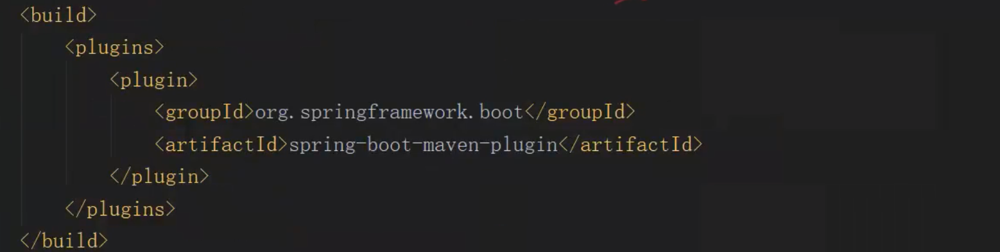
>
> 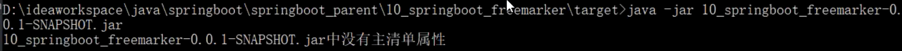
>
> 这个插件帮我们编写了一个MANIFEST.MF的文件，并且把我们依赖的jar文件也打包到我们打包的springboot项目的jar文件中
>
> MANIFEST.MF文件定义了一些启动的信息
>
> 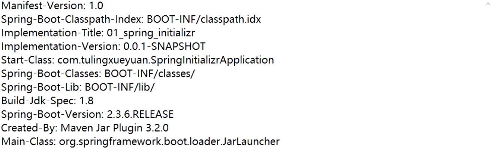
>
> `jar包中包含jar文件，这个jar文件就叫做fat jar`
>
> 我们即使自己打包一个jar文件，把依赖的jar也放进去，编写了MANIFEST.MF文件，还是不能启动springboot打包出来的jar包
>
> ```markdown
> # 还需要classLoader
> 因为java中没有提供任何标准的方式能够加载jar文件中的嵌套jar（即，它们本身包含在jar中的jar文件），如果我们没有办法去加载jar文件中的jar包，也就是代表没有办法加载依赖
> 所以我们可以看到MANIFEST文件中除了指定启动的StartClass之外，还指定了MainClass，这个MainClass其实就是帮我们加载了jar包中的jar依赖以及jar中的class，这个是springboot自己提供的
> ```
>
> 也就是当我们运行jar文件的时候，java只会去找MainClass，来加载，而StartClass是springboot需要主函数入口
>
> 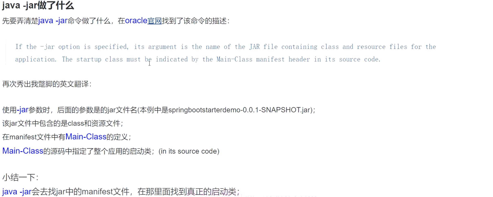
>
> JarLauncher定义了一些位置，帮我们去加载依赖的jar和class文件
>
> 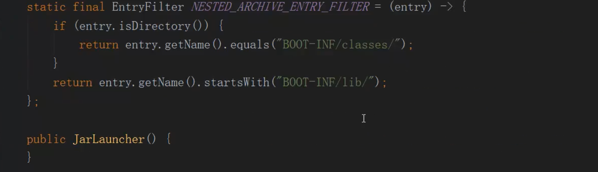
>
> 加载完之后，就会找到StartClass文件，然后使用反射去调用应用程序的main方法
>
> **总结**
>
> 当我们添加了spring-boot-plugin的插件之后，当我们打包的时候，他就会帮我们把依赖的jar文件和MANIFEST.MF文件打包进fat jar文件中；
>
> 当我们运行java -jar的时候，就会通过反射运行JarLauncher中main方法
>
> 
>
> ```markdown
> # JarFile、JarURLConnection及URLStreamHandler都是类加载机制中类
> ```
>
> WarLauncher通过加载WEB-INF/classes目录及WEB-INF/lib和WEB-INF/lib-provided目录下的jar文件，实现了war文件的直接启动及web容器的启动

> 1. 怎么调试一个jar文件
>
> idea中如何调试一个jar文件
>
> 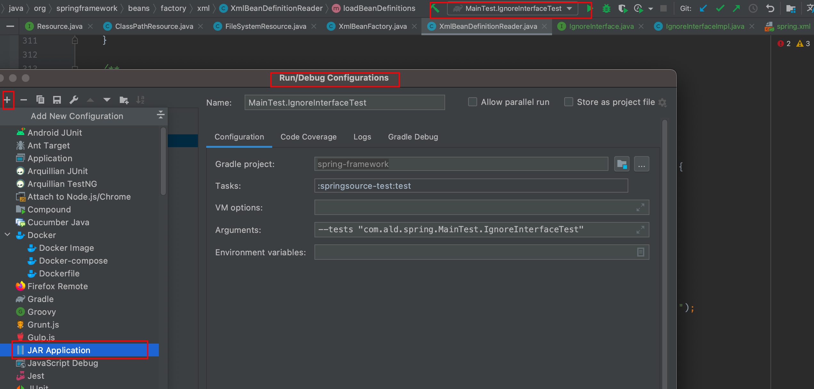
>
> 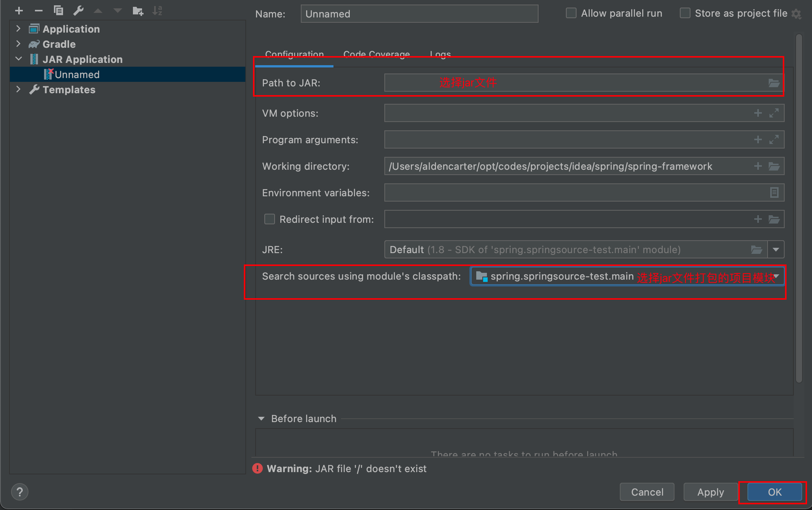
>
> 之后点击调试按钮（DEBUG）就可以进入调试模式了

> 1. spring容器的加载过程
>
> spring容器的加载，都是靠我们去new一个spring容器的上下文ApplicationContext
>
> ```java
> ApplicationContext context=new ClassPathXmlApplicationContext("xml文件");
> // 或者
> ApplicationContext context=new AnnotationConfigApplicationContext(配置类.class);
> ```
>
> 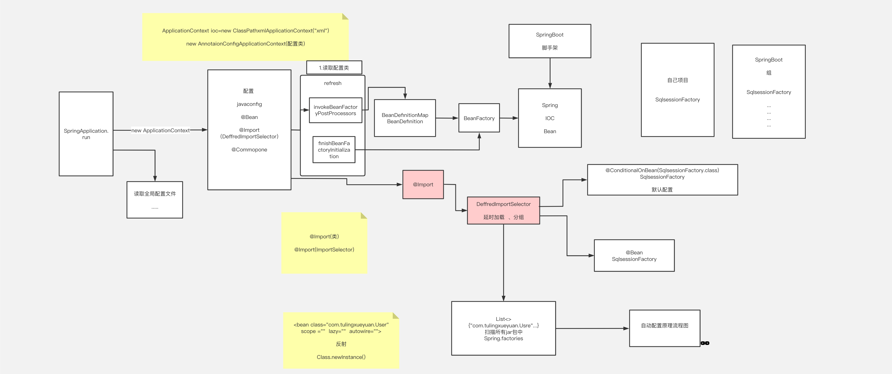
>
> 但是我们在启动的springboot的项目，并没有看到spring容器的的创建（new）过程呢？
>
> ```markdown
> # 其实当我们在`SpringApplication.run(SpringbootDemo01Application.class, args);`的时候，就会帮我们去new出ApplicationContext，并且把我们当前的启动类当做一个配置类来运行
> 当然new出来的ApplicationContext是AnnotationConfigApplicationContext
> ```
>
> 当我们在new Spring容器的上下文的时候，会有一个非常重要的方法refresh，这个方法会将我们配置的bean信息加载成BeanDefinition，不管是通过任何方式加载配置，都会运行refresh方法
>
> 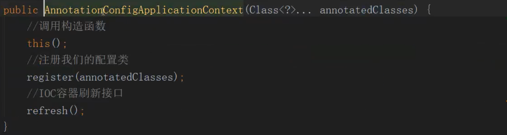
>
> ```java
> /**
> 	 * 体现了IOC的整个生命周期
> 	 * @throws BeansException
> 	 * @throws IllegalStateException
> 	 */
> 	@Override
> 	public void refresh() throws BeansException, IllegalStateException {
> 		synchronized (this.startupShutdownMonitor) {
> 			// Prepare this context for refreshing.
> 			// 1、准备上下文
> 			prepareRefresh();
> 
> 			// Tell the subclass to refresh the internal bean factory.
> 			// 2、获取告诉子类初始化bean工厂
> 			ConfigurableListableBeanFactory beanFactory = obtainFreshBeanFactory();
> 
> 			// Prepare the bean factory for use in this context.
> 			// 3、对bean工厂进行填充属性
> 			prepareBeanFactory(beanFactory);
> 
> 			try {
> 				// Allows post-processing of the bean factory in context subclasses.
> 				// 4、留个子类去实现该接口
> 				postProcessBeanFactory(beanFactory);
> 
> 				// Invoke factory processors registered as beans in the context.
> 				// 调用我们的bean工厂的后置处理器，1将class扫描成bean定义 2bean工厂的后置处理器调用
> 				invokeBeanFactoryPostProcessors(beanFactory);
> 
> 				// Register bean processors that intercept bean creation.
> 				// 调用我们bean的后置处理器
> 				registerBeanPostProcessors(beanFactory);
> 
> 				// Initialize message source for this context.
> 				// 初始化国际化资源处理器
> 				initMessageSource();
> 
> 				// Initialize event multicaster for this context.
> 				// 创建事件多插器
> 				initApplicationEventMulticaster();
> 
> 				// Initialize other special beans in specific context subclasses.
> 				// 这个方法同样也是留个子类实现的springboot也是从这个方法进行启动Tomcat的
> 				onRefresh();
> 
> 				// Check for listener beans and register them.
> 				// 把我们的事件监听器注册到多插器上
> 				registerListeners();
> 
> 				// Instantiate all remaining (non-lazy-init) singletons.
> 				// 实例化我们剩余的单实例bean
> 				finishBeanFactoryInitialization(beanFactory);
> 
> 				// Last step: publish corresponding event.
> 				// 最后容器刷新 发布刷新事件（spring cloud也是从这里启动的）
> 				finishRefresh();
> 			}
> 
> 			catch (BeansException ex) {
> 				if (logger.isWarnEnabled()) {
> 					logger.warn("Exception encountered during context initialization - " +
> 							"cancelling refresh attempt: " + ex);
> 				}
> 
> 				// Destroy already created singletons to avoid dangling resources.
> 				destroyBeans();
> 
> 				// Reset 'active' flag.
> 				cancelRefresh(ex);
> 
> 				// Propagate exception to caller.
> 				throw ex;
> 			}
> 
> 			finally {
> 				// Reset common introspection caches in Spring's core, since we
> 				// might not ever need metadata for singleton beans anymore...
> 				resetCommonCaches();
> 			}
> 		}
> 	}
> ```
>
> ```markdown
> # springboot重写了spring的refresh的方法，拓展了onRefresh();方法，然后在这个方法里面生成一个内嵌的Tomcat容器
> ```
>
> 

> 1. 当我们调用SpringApplication.run的时候，会new SpringApplication
>
> 网址：https://www.processon.com/view/link/60d865e85653bb049a4b77ff#map
>
> new springApplication的内容解读
>
> 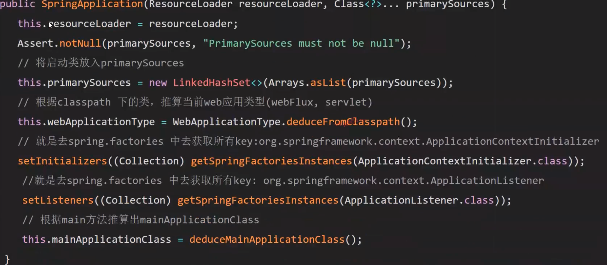
>
> - 将启动类存起来
>
> ```markdown
> # 为了在加载spring IOC容器的时候，可以将这个类启动类作为配置类使用，spring需要一个配置类，才能加载整个IOC容器
> 为什么启动类可以当做配置类，因为启动类中有一个@Configuration注解，并且配置类中配置了@ComponentScan，注明了让spring容器该怎么去扫描
> ```
>
> 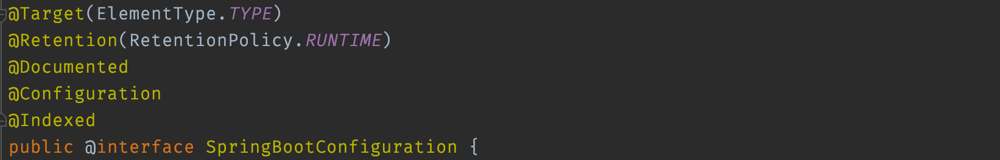
>
> 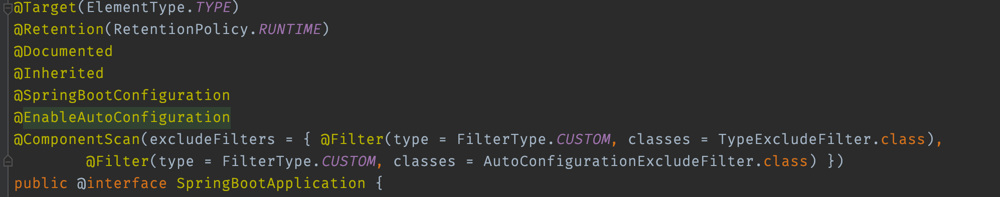
>
> - 推断当前web应用类型（WebFlux、servlet）
>
> ```markdown
> # 怎么去推断的？
> 和自动加载扩展一样的，就是判断有没有对应的class文件，也就是有没有在maven中引入的
> ClassUtils.isPresent来判断
> private static final String WEBFLUX_INDICATOR_CLASS = "org.springframework.web.reactive.DispatcherHandler";
> ```
>
> 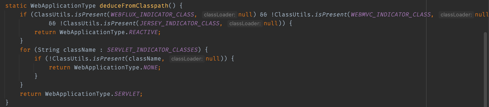
>
> - 去spring.factories中获取所有的ApplicationContextInitializer、ApplicationListener
>
> ```markdown
> #  读取的是ApplicationContextInitializer这个接口的所有的类，对外扩展
> # 读取的是ApplicationListener这个key所有的类，监听器
> 为了解耦，都是利用监听器来解耦的，比如读取配置全局文件(application.properties、application.yaml、boostrap.yaml等)，都是利用监听器来解耦的
> ```
>
> ```xml
> # Initializers
> org.springframework.context.ApplicationContextInitializer=\
> org.springframework.boot.autoconfigure.SharedMetadataReaderFactoryContextInitializer,\
> org.springframework.boot.autoconfigure.logging.ConditionEvaluationReportLoggingListener
> 
> # Application Listeners
> org.springframework.context.ApplicationListener=\
> org.springframework.boot.autoconfigure.BackgroundPreinitializer
> ```
>
> **总结**
>
> - 获取启动类：根据启动类加载IOC容器
> - 获取web应用类型
> - spring.factories读取了对外扩展的ApplicationContextInitializer、ApplicationListener，主要是对外扩展，对内解耦（比如全局配置文件就是通过Listener来加载的、热部署插件也是通过这种方式扩展的）
> - 根据main推算出所在的类
>
> 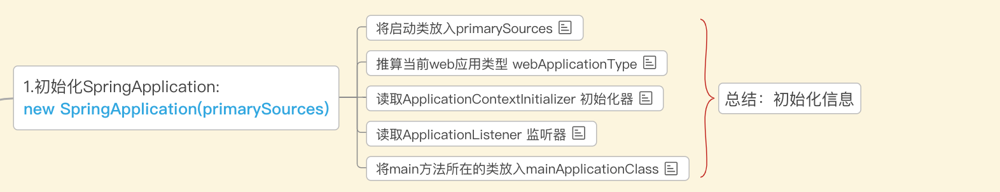

> 1. run函数的调用步骤
>
> ```java
> public static ConfigurableApplicationContext run(Class<?>[] primarySources, String[] args) {
>   return new SpringApplication(primarySources).run(args);
> }
> 
> public ConfigurableApplicationContext run(String... args) {
>   // 记录开始时间
>   long startTime = System.nanoTime();
>   DefaultBootstrapContext bootstrapContext = createBootstrapContext();
>   ConfigurableApplicationContext context = null;
>   configureHeadlessProperty();
>   // 发布启动启动事件，用于扩展，会去通知对应的监听器，这样，监听器就可以拿到对应的事件做出对应的反应
>   // 主要是使用监听者模式
>   SpringApplicationRunListeners listeners = getRunListeners(args);
>   listeners.starting(bootstrapContext, this.mainApplicationClass);
>   try {
>     ApplicationArguments applicationArguments = new DefaultApplicationArguments(args);
>     // 读取所有的全局配置文件，通过监听器实现的
>     ConfigurableEnvironment environment = prepareEnvironment(listeners, bootstrapContext, applicationArguments);
>     // 设置忽略bean:spring.beaninfo.ignore
>     configureIgnoreBeanInfo(environment);
>     // 打印banner
>     Banner printedBanner = printBanner(environment);
>     // 创建spring上下文AnnotationConfigServletWebServerApplicationContext
>     context = createApplicationContext();
>     context.setApplicationStartup(this.applicationStartup);
>     // 预初始化上下文，就是把配置类读取成beanDefinition
>     prepareContext(bootstrapContext, context, environment, listeners, applicationArguments, printedBanner);
>     // 刷新容器，就会调用重写spring的refresh方法，到AbstractApplicationContext
>     // 这个方法就会去加载IOC容器
>     // 然后在invokeBeanFactoryPostProcessors方法中取解析配置类，把他们解析成BeanDefinition
>     refreshContext(context);
>     afterRefresh(context, applicationArguments);
>     Duration timeTakenToStartup = Duration.ofNanos(System.nanoTime() - startTime);
>     if (this.logStartupInfo) {
>       new StartupInfoLogger(this.mainApplicationClass).logStarted(getApplicationLog(), timeTakenToStartup);
>     }
>     listeners.started(context, timeTakenToStartup);
>     callRunners(context, applicationArguments);
>   }
>   catch (Throwable ex) {
>     handleRunFailure(context, ex, listeners);
>     throw new IllegalStateException(ex);
>   }
>   try {
>     Duration timeTakenToReady = Duration.ofNanos(System.nanoTime() - startTime);
>     listeners.ready(context, timeTakenToReady);
>   }
>   catch (Throwable ex) {
>     handleRunFailure(context, ex, null);
>     throw new IllegalStateException(ex);
>   }
>   return context;
> }
> ```
>
> - 创建内嵌Tomcat是在重写的onRefresh方法中，我们一起来看看
>
> ```markdown
> # springboot重写了onRefresh方法，其中有createWebServer方法，创建了内嵌Tomcat容器，如下
> ```
>
> ```java
> private void createWebServer() {
>   WebServer webServer = this.webServer;
>   // 先判断是否已经存在Tomcat servlet Context，因为有时候是从外部传入的Tomcat servlet Context的
>   ServletContext servletContext = getServletContext();
>   if (webServer == null && servletContext == null) {
>     StartupStep createWebServer = this.getApplicationStartup().start("spring.boot.webserver.create");
>     // 不存在就会创建WebServerFactry，并通过工厂获取到webServer，在getWebServer中就会创建Tomcat，创建过程和下面在spring源码中测试Tomcat类似
>     ServletWebServerFactory factory = getWebServerFactory();
>     createWebServer.tag("factory", factory.getClass().toString());
>     this.webServer = factory.getWebServer(getSelfInitializer());
>     createWebServer.end();
>     getBeanFactory().registerSingleton("webServerGracefulShutdown",
>                                        new WebServerGracefulShutdownLifecycle(this.webServer));
>     getBeanFactory().registerSingleton("webServerStartStop",
>                                        new WebServerStartStopLifecycle(this, this.webServer));
>   }
>   else if (servletContext != null) {
>     try {
>       getSelfInitializer().onStartup(servletContext);
>     }
>     catch (ServletException ex) {
>       throw new ApplicationContextException("Cannot initialize servlet context", ex);
>     }
>   }
>   initPropertySources();
> }
> ```
>
> 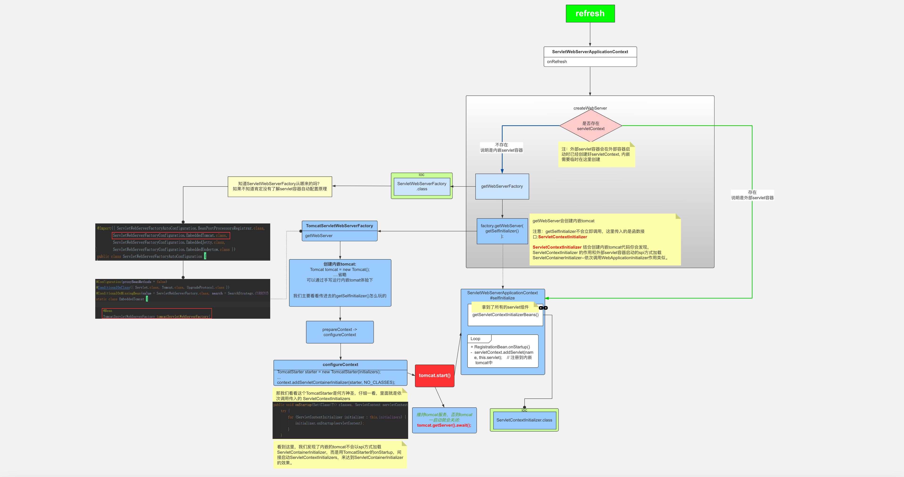
>
> springboot中如何注册servlet?
>
> 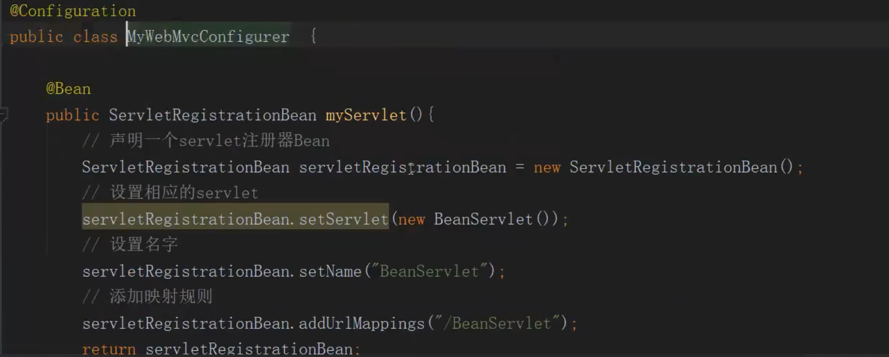
>
> ```markdown
> # 通过ServletRegistrationBean去注册，ServletRegistrationBean继承了RegistrationBean，RegistrationBean实现了ServletContextInitializer接口
> ```
>
> 如果是在spring源码中测试的，需要添加Tomcat的依赖依赖
>
> 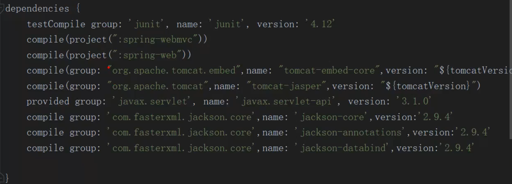
>
> 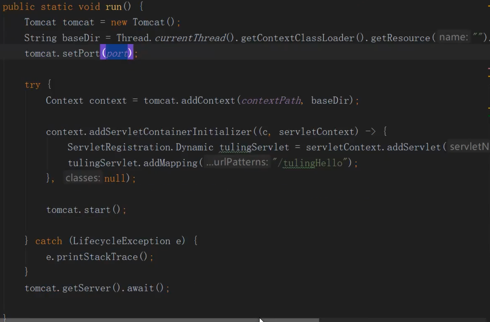
>
> ```markdown
> - 创建一个新的Tomcat
> - 设置路径
> - 设置端口
> - 配置上下文
> - 添加Servlet，addServletContainerInitializer里面有一个onStartup方法，当我们调用tomcat.start方法的时候，会调用我们传进去的回调方法
> - 启动Tomcat
> - 保持Tomcat是运行的状态
> ```

> 1. 外置Tomcat是如何启动springboot？
>
> ```markdown
> # 我们把我们的应用程序打成一个jar包，放到Tomcat的webapp中，运行Tomcat的时候（tomcat.start()），tomcat就会解压我们的war包，然后启动Tomcat
> ```
>
> ```markdown
> # 我们以前启动Tomcat的web项目，都是配置web.xml中的DispatcherServlet这个servlet才能启动整个web应用程序，那么将springboot项目放到外置的Tomcat中运行，怎么样才能让Tomcat启动SpringApplication.run()方法呢？
> 其实就是利用SPI来完成的
> ```
>
> ```markdown
> # 那么要实现通过外置的Tomcat启动springboot项目，有一个关键的步骤就是需要排除内置的Tomcat，需要在starter-web中排除
> # 一旦排除了内置的Tomcat，那么之前引入的web的自动配置类（DispatcherServletAutoConfiguration、ServletWebServerFactoryAutoConfiguration）就不会生效了，内置的不生效，那么外置就可以通过SPI传进来
> ```
>
> 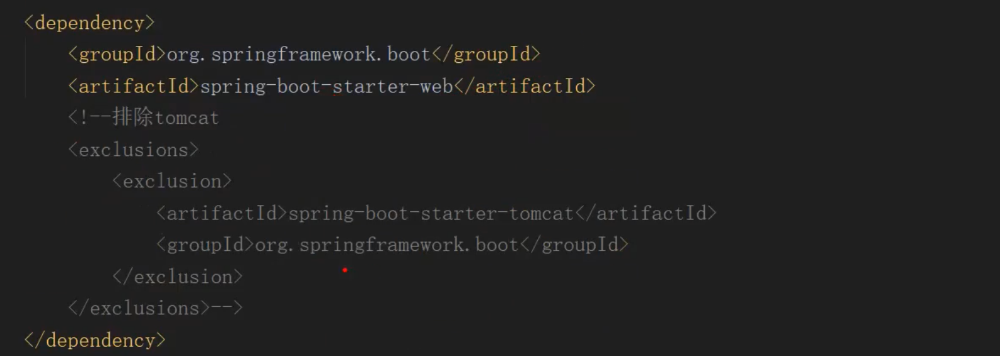
>
> 另一种排除内置Tomcat的方式是
>
> 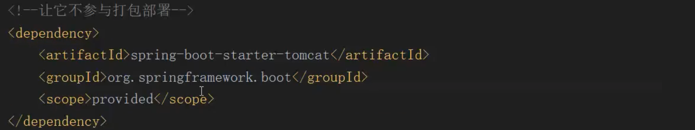
>
> 排除掉之后，将打包方式修改成war
>
> 并重写SpringBootServletInitializer的configure方法
>
> 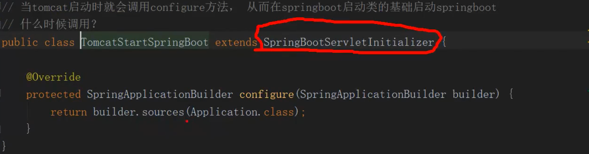
>
> ```markdown
> # 在重写方法中，告诉SpringBootServletInitializer那个是启动类，SpringBootServletInitializer会在下面说明是WebApplicationInitializer的实现类
> ```
>
> 然后就可以将这个springboot项目依附于外置的Tomcat去运行了
>
> 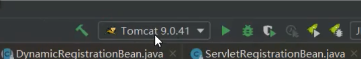
>
> 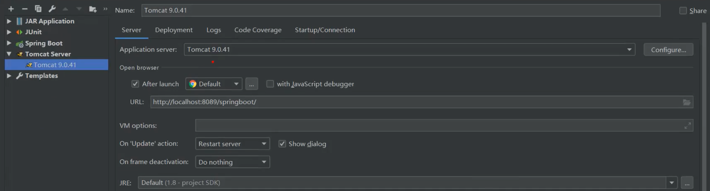
>
> 当我们运行的时候，就会去META-INF/services文件夹下找ServletContainerInitializer这个接口的SPI文件
>
> 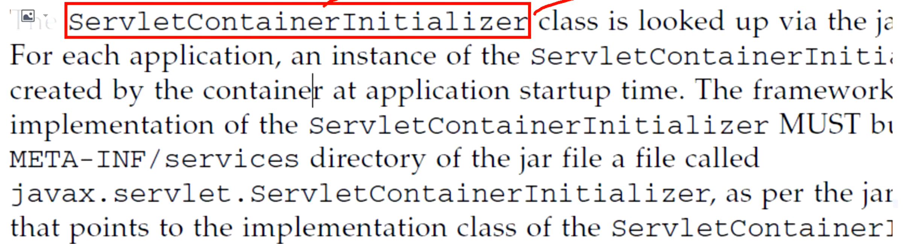
>
> 找到这个文件，Tomcat就会拿到这个实现类，并运行onStartup方法
>
> 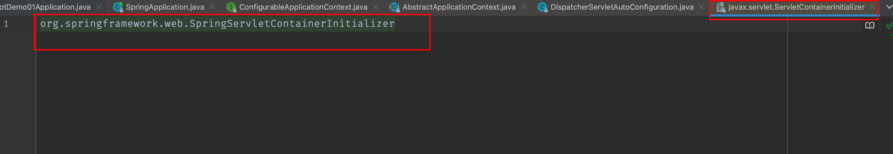
>
> 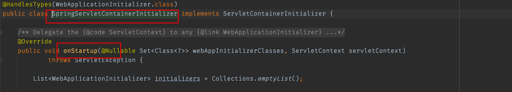
>
> ```markdown
> # @HandlesTypes(WebApplicationInitializer.class)这个注解告诉Tomcat：
> 你要帮我找到这个接口类型WebApplicationInitializer的所有的实现类，然后帮我传到onStartup方法里面去
> ```
>
> 在onStartup中，会依次循环调用我们的感兴趣的类的实例的onStartup方法
>
> 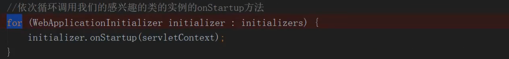
>
> ```markdown
> # 比如说，WebApplicationInitializer有一个重要的实现类AbstractDispathcerHandlerInitializer，就会调用它的onStartup方法，然后调用registerDispatcherServlet(servletContext);注册DispatcherServlet到spring中
> ```
>
> 那么它是怎么运行我们的SpringApplication的main方法的呢？
>
> ```markdown
> # WebApplicationInitializer有一个实现类SpringBootServletInitializer，会在这里面运行main方法
> WebApplicationContext rootApplicationContext = createRootApplicationContext(servletContext);
> ```
>
> 
>
> ```markdown
> # JDBC的驱动也是使用SPI的方式实现调用，解耦
> # dobbu也是
> ```
>
> 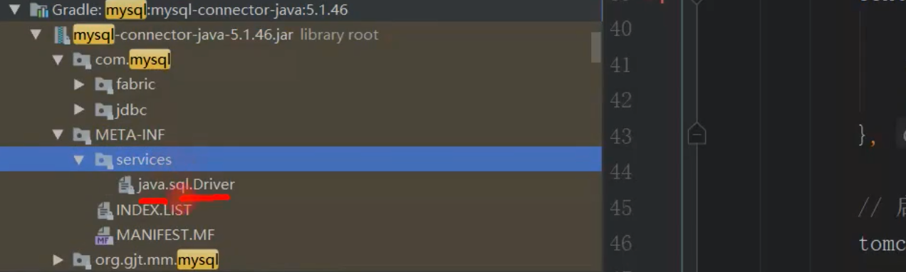

> 1. 所以说，什么是SPI？
>
> 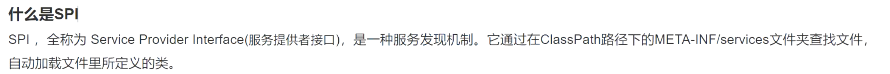
>
> 通过服务提供者的接口，从而找到对应的实现类
>
> 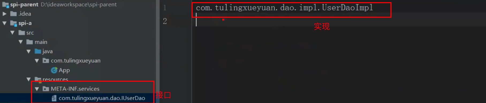
>
> JDK提供ServiceLoader接口来加载SPI，会自动的根据传入的接口类从所有的jar包中找到对应实现
>
> 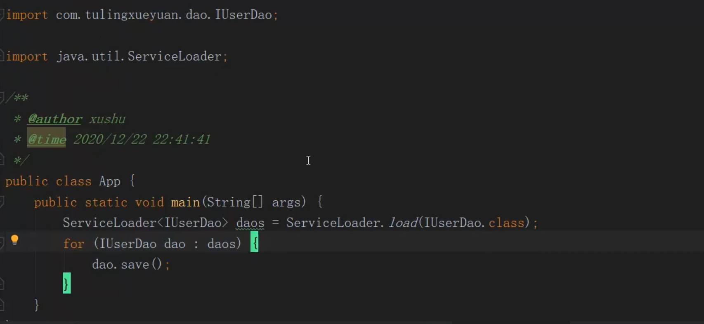
>
> 这个IUserDao的实现类在spi-b中，当我们打成jar的时候，就会引入
>
> 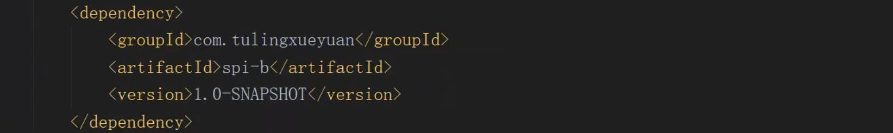
>
> 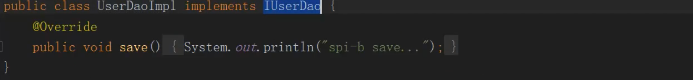
>
> ```markdown
> # spi如果有两个实现类的话，只会找到第一个
> ```

## 自动装配核心

```markdown
# 课程内容
1. 从spring的IOC到springboot的自动配置原理
2. DeferredImportSelector对Bean加载顺序的影响
3. SpringBoot自动配置源码深入分析
4. 如何在自动配置类上进行订制扩展
5. 实现自定义Starter完成自动配置
```

> 1. 从spring的IOC到springboot的自动配置原理
>
> 网址：https://www.processon.com/view/link/5fc0abf67d9c082f447ce49b
>
> 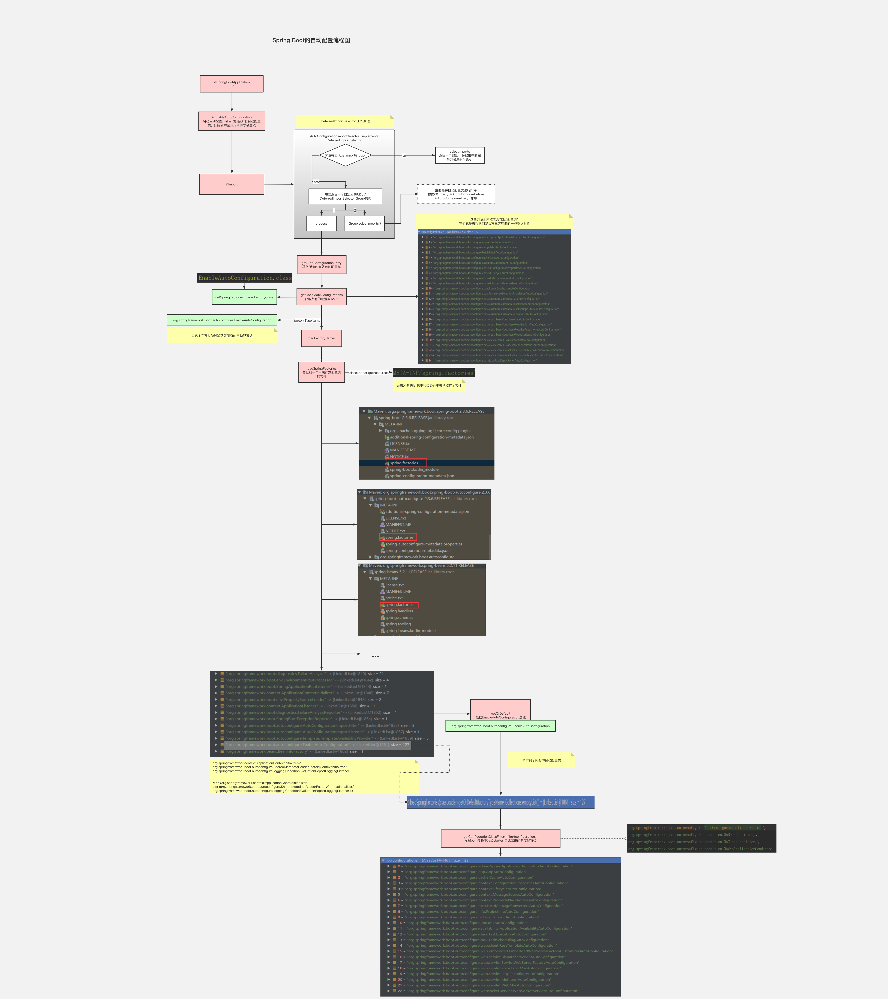
>
> ```markdown
> # springboot的一些基础概念
> 1. springboot是一个脚手架，像之前在整合spring+springmvc+mybatis的时候，需要编写很多配置，springboot就是为了简化这个过程而出现的
> 2. 通过javaconfig实现配置
> 3. 约定大于配置
> 4. bean管理还是由spring的IOC进行管理的，springboot只是帮助我们配置的
> ```
>
> 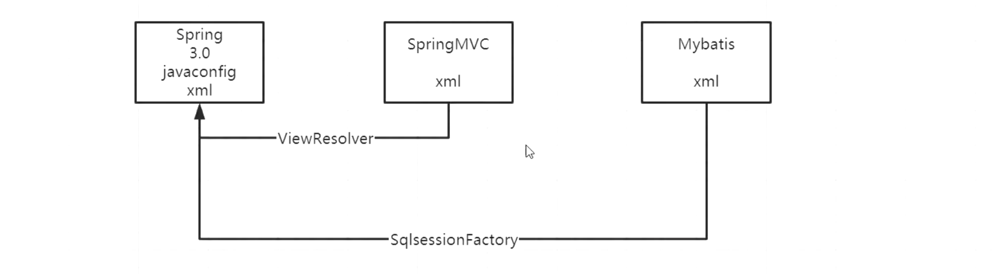
>
> ```markdown
> # spring IOC容器加载一般分为两个部分
> 1. 将配置中的bean读取并解析成BeanDefinition
> 2. BeanFactory读取BeanDefinition创建Bean存储到IOC容器中
> ```

> 
> 1. DeferredImportSelector对Bean加载顺序的影响
> ```markdown
> # 假如说我们需要管理很多的Bean，那么会怎么管理呢？
> 1. javaConfig有@Bean、@Import
> 2. Spring集成任何的框架都是通过@EnableXXXX，@EnableXXX里面就会有一个@Import的注解，@Import就是集成这个框架的所在
> 所以说我们要是进行管理的很多的Bean，其实通过@Import就可以导入更多的配置，并通过配置引入BeanDefinition，就可以注册成Bean
> 
> # @Import的使用
> 1. 可以直接导入一个类@Import(类)，这个类就会直接转成BeanDefinition，注册成Bean
> 2. 或者导入一个实现了ImportSelector接口的实现类，如果是一次性要导入很多的Bean的话，可以通过ImportSelector，但是没办法控制注入的顺序在默认的配置下面，也就是覆盖默认的配置，如果需要实现控制注入的顺序的话，需要使用到ImportSelector的一个变种DeferredImportSelector，当我们集成框架的时候，是有默认的配置，如果我们自己配置了，就会优先使用我们的配置，是通过注解@CondationalOnBean来实现的，当@CondationalOnBean检测到我们自己配置了参数的时候，就不会使用默认的配置
> DeferredImportSelector会在解析了@Bean、@Import、@Component之后在解析，也就是最后解析的，有以下的特性
> - 延迟特性，排在默认配置的后面，实现覆盖
> - 分组特性，根据不同的组别，拥有不同的配置，在排序的时候，只影响自己项目的排序，而不影响其他项目的顺序
> 3. 或者导入一个实现了ImportBeanDefinitionRegistrar接口的实现类
> ```
>
> 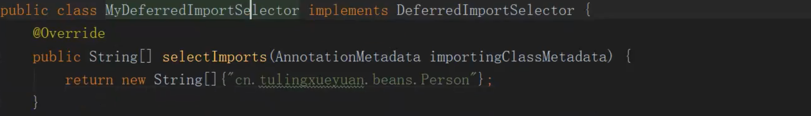
>
> - 重写selectImports，返回需要注入的Bean类的全路径数组
>

>
> 1. SpringBoot自动配置源码深入分析
> springboot管理的Bean非常的多，所以为了扩展性，不把这些Bean直接写入到代码中，而是把这些bean管理在了spring.factories文件中，然后读取加载
>
> ```java
> /**
> 	 * Return the {@link AutoConfigurationEntry} based on the {@link AnnotationMetadata}
> 	 * of the importing {@link Configuration @Configuration} class.
> 	 * @param annotationMetadata the annotation metadata of the configuration class
> 	 * @return the auto-configurations that should be imported
> 	 */
> protected AutoConfigurationEntry getAutoConfigurationEntry(AnnotationMetadata annotationMetadata) {
>   if (!isEnabled(annotationMetadata)) {
>     return EMPTY_ENTRY;
>   }
>   AnnotationAttributes attributes = getAttributes(annotationMetadata);
>   // 根据导入的依赖，只有当项目中含有这个Class的时候，才会进行注入
>   // 也就是@ConditionOnXXX注解来判定
>   // 当注册成BeanDefinition之后，解析到@ConditionOnBean，如果没有包含有对应的依赖，就不会注册成Bean到IOC容器
>   List<String> configurations = getCandidateConfigurations(annotationMetadata, attributes);
>   // 排重
>   configurations = removeDuplicates(configurations);
>   // 获取排除的的配置，也就是没有引入的依赖的配置
>   Set<String> exclusions = getExclusions(annotationMetadata, attributes);
>   checkExcludedClasses(configurations, exclusions);
>   // 移除排除的配置
>   configurations.removeAll(exclusions);
>   // 去除过滤的配置
>   configurations = getConfigurationClassFilter().filter(configurations);
>   fireAutoConfigurationImportEvents(configurations, exclusions);
>   return new AutoConfigurationEntry(configurations, exclusions);
> }
> ```
>
> 如果想知道那些会被注册成Bean，那些没有，可以在配置文件`application.yaml`中配置`debug: true`就可以看到具体的内容
>
> 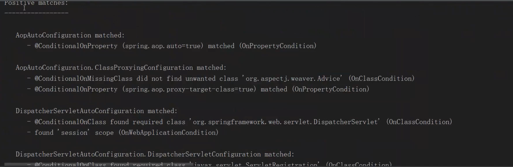
>
> ```java
> @Configuration(proxyBeanMethods = false)
> // ConditionalOnProperty属性配置匹配生效
> // havingValue当前持有的值
> // matchIfMissing如果没有配置，也会生效，用在一些spring必须依赖的类，比如当前的AOP
> @ConditionalOnProperty(prefix = "spring.aop", name = "auto", havingValue = "true", matchIfMissing = true)
> public class AopAutoConfiguration {
> 
> 	@Configuration(proxyBeanMethods = false)
>   // 有Advice才会生效
> 	@ConditionalOnClass(Advice.class)
> 	static class AspectJAutoProxyingConfiguration {
> 
> 		@Configuration(proxyBeanMethods = false)
> 		@EnableAspectJAutoProxy(proxyTargetClass = false)
> 		@ConditionalOnProperty(prefix = "spring.aop", name = "proxy-target-class", havingValue = "false")
>     // JDK方式的动态代理
> 		static class JdkDynamicAutoProxyConfiguration {
> 
> 		}
> 
> 		@Configuration(proxyBeanMethods = false)
> 		@EnableAspectJAutoProxy(proxyTargetClass = true)
> 		@ConditionalOnProperty(prefix = "spring.aop", name = "proxy-target-class", havingValue = "true",
> 				matchIfMissing = true)
>     // CGlib的代理方式，springboot2.0开始默认是CGlib动态代理方式，即使是在导入了JDK的代理方式的情况下
> 		static class CglibAutoProxyConfiguration {
> 
> 		}
> 
> 	}
> 
> 	@Configuration(proxyBeanMethods = false)
> 	@ConditionalOnMissingClass("org.aspectj.weaver.Advice")
> 	@ConditionalOnProperty(prefix = "spring.aop", name = "proxy-target-class", havingValue = "true",
> 			matchIfMissing = true)
> 	static class ClassProxyingConfiguration {
> 
> 		@Bean
> 		static BeanFactoryPostProcessor forceAutoProxyCreatorToUseClassProxying() {
> 			return (beanFactory) -> {
> 				if (beanFactory instanceof BeanDefinitionRegistry) {
> 					BeanDefinitionRegistry registry = (BeanDefinitionRegistry) beanFactory;
> 					AopConfigUtils.registerAutoProxyCreatorIfNecessary(registry);
> 					AopConfigUtils.forceAutoProxyCreatorToUseClassProxying(registry);
> 				}
> 			};
> 		}
> 
> 	}
> 
> }
> ```

>1. 如何在自动配置类上进行订制扩展
>
>```markdown
># 不同的类订制方式是不同的，比如说，如果在自动配置类上有@ConditionalOnBean，那么就可以在自己的配置类上编写同类型的Bean进行覆盖
>@Bean
>public XXXConfiguration getXXXConfiguration(){
>	retrun new XXXConfiguration();
>}
># 或者会有一些根据全局配置文件来进行设置的
>```
>

> 
>1. 实现自定义Starter完成自动配置
>
>通过扩展spring.factories完成自己的Starter
>
>1. 在META-INF中创建spring.factoies，添加对应键值对
>
>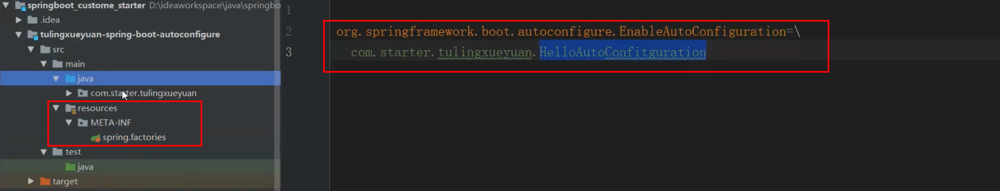
>
>2. 并编写自己的配置，HellAutoConfiguration给web应用添加一个首页
>
>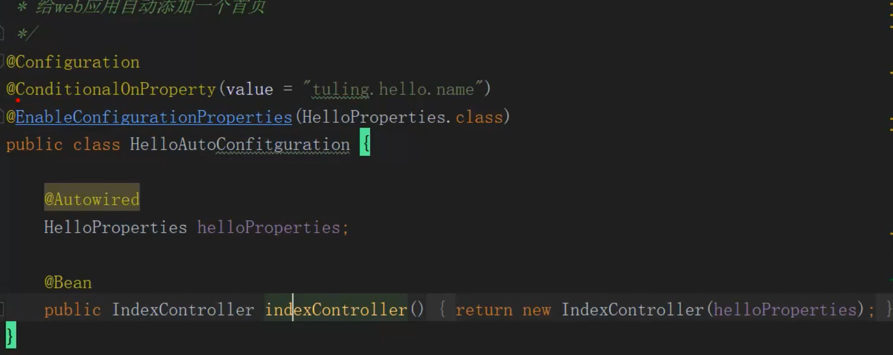
>
>3. IndexController访问项目的根目录就会返回index
>
>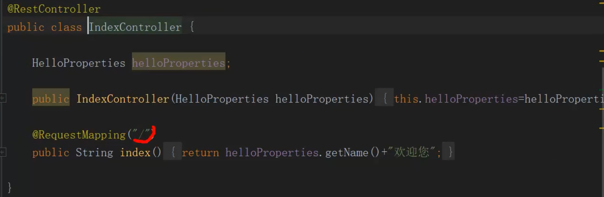
>
>如果@ConditionalOnClass(XXX.class)没有引入报红怎么打包的？
>
>利用maven的optional设置为true
>
>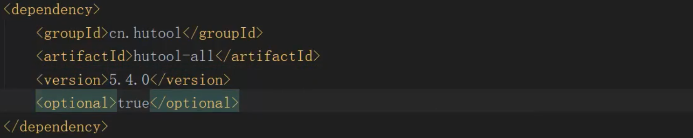
>
>当我们在项目中去依赖自己订制的starter的时候，就不会去把hutool依赖过来，我们能看到的效果就是报红的
>
>```markdown
># 大概意思就是当我们在使用自己定义的启动器的时候，如果使用了optional配置true，就不会传播到自己的项目中，也就是不会依赖过来
># 如果没有添加optional的特性，那么被依赖的项目的依赖也会传播过来，传播特性
>```
>


