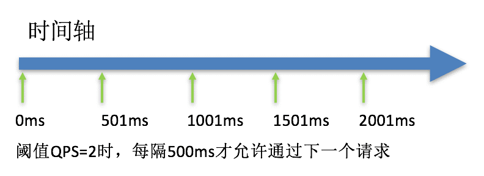

> springcloud版本：Hoxton SR6

## 概述

springcloud 提供了一系列的工具集来帮助我们服务系统中的服务治理和服务监控。

### 什么是微服务

> 官网：https://martinfowler.com/microservices/
>
> In short, the microservice architectural style is an approach to developing a single application as **a suite of small services**, each **running in its own process** and communicating with lightweight mechanisms, often an HTTP resource API. These services are **built around business capabilities** and **independently deployable** by fully automated deployment machinery. There is a **bare minimum of centralized management** of these services, which may be written in different programming languages and use different data storage technologies.
>
> -- [James Lewis and Martin Fowler (2014)](https://martinfowler.com/articles/microservices.html)

```markdown
- a suite of small services													- 一系列微小服务
- running in its own process												- 运行在自己的进程里
- built around business capabilities								- 围绕自己的业务开发
- independently deployable													- 独立部署
- bare minimum of centralized management						- 基于分布式管理
```

- 官方定义：微服务就是由一系列围绕自己业务开发的微小服务构成，他们独立不是在自己的进程里，基于分布式的管理

```markdown
App项目：
	- 单体应用：分类模块、视频模块、评论模块、用户模块、统计模块.... 这些如果是在一个项目中，运行在同一个服务器中就叫单体应用
	- 微服务：独立应用—>计算机进程里面->独立部署，所有的服务才能组成整个应用，基于分布式的服务管理应用
```

- 通俗定义：微服务是一种架构，这种架构是将单个的整体应用程序分割成更小的项目关联的独立的服务。一个服务通常实现一组独立的特性或者功能，包含自己的业务逻辑和适配器。各个微服务之间的关联通过暴露api来实现。这些独立的微服务不需要部署在同一个虚拟机、同一个系统和同一个应用服务器中

### 为什么是微服务

#### 单体应用


单体应用优缺点：

优点：

- 单一架构模式在项目初期很小的时候开发方便，测试方便，部署方便，运行良好

缺点：

- 应用随着时间的推进，加入的功能越来越多，最终会变得巨大，一个项目中很可能数百万行的代码，相互之间繁琐的jar包依赖
- 久而久之，开发效率低，代码维护困难
- 还有一个如果想整体应用采用新的技术，新的框架或者语言，都是不可能的
- 任意模块的漏洞或者错误都会影响这个应用，降低系统的可靠性

#### 微服务架构应用


微服务优缺点：

优点：

- 将服务拆分成多个单一职责的小的服务，进行单独部署，服务之间通过网络进行通信
- 每个服务应该有自己的单独的管理团队，高度自治
- 服务各自有自己的单独的职责，服务之间松耦合，避免因一个模块的问题导致服务崩溃

缺点：

- 开发人员处理分布式系统的复杂性
- 多服务运维难度，随着服务的增加，运维的压力也在增大
- 服务治理 和 服务监控 是关键

#### 架构的演变

#### 架构的演变过程

单一应用架构->垂直应用架构->分布式服务架构->流动计算架构 | 微服务架构->未知

> 官网：https://dubbo.apache.org/zh/


演变：

1. All in One Application 单一架构

起初当网站流量很小的时候，将所有的功能都写在一个应用里面，对整个应用进行部署，以减少部署节点和成本。对于这个架构简化增删改查的工作量的数据访问架构（ORM）是关键

2. Vertical Application 垂直架构

当访问量逐渐增大，单一应用增加机器带来的加速度越来越小，提升效率的方法之一是将应用拆分成互不相干的几个应用，以提升效率。此时，用于加速前端页面开发的web框架（MVC）是关键

3. Distributed Service 分布式服务架构

当垂直应用越来越多，应用之间交互不可避免，将核心业务抽取出来，作为独立的服务，逐渐形成稳定的服务中心，使前端应用更快的响应多变的市场需求。此时，用于提高业务复用及整合的分布式服务框架（RPC）是关键

4. Elastic Comuting 流动计算架构即微服务架构

当服务越来越多，容量的评估，小服务资源的浪费等问题逐渐显现，此时需要增加一个调度中心基于访问压力实时管理集群容量，提高集群利用率。此时，用于提高机器利用率的资源调度和治理中心（SOA）是关键

> 好的架构并不是设计出来的，而是进化出来的

### 微服务的解决方案

#### dubbo（阿里系）

1. 初出茅庐

2011年末，阿里巴巴在GitHub上开源了基于Java的分布式服务治理框架dubbo，之后它成为了国内该类开源项目的佼佼者，许多开发者对其表示青睐，同时，先后有不少公司在实践中基于dubbo进行分布式系统架构，目前杂GitHub上，它的fork、star数均已破万。dubbo致力于提供高性能和透明化的RPC远程服务调用方案，以及SOA服务治理方案，使得应用可通过高性能RPC实现服务的输出、输入功能和spring框架无缝集成。dubbo包含远程通讯、集群容错和自动发现三个核心部分

2. 停止维护

2012年10月23日发布Dubbo2.5.3版本，至此之后，阿里基本停止了对Dubbo的主要升级；仅在13、14年进行过几次更新维护版本然后就停止了所有的维护工作；同时Dubbo对Srping的支持也停留在了Spring 2.5.6版本上。在阿里停止维护和升级Dubbo期间，当当网开始维护自己的Dubbo分支版本Dubbox，支持了新版本的Spring，并对外开源了Dubbox

3. 死而复生

2017年9月7日发布Dubbo的2.5.4版本，距离上一个版本2.5.3发布已经接近快5年时间了。在随后的几个月中，阿里Dubbo开发团队以差不多每月一版本的速度开始快速升级迭代，修补了Dubbo老版本多年来存在的诸多bug，并对Spring等组件的支持进行了全面升级

4. Dubbo 3.0启动

2018年1月8日，Dubbo创始人之一梁飞在Dubbo交流群里透露了Dubbo 3.0正在动工的消息。Dubbo 3.0内核与Dubbo2.0完全不同，但兼容Dubbo 2.0。Dubbo 3.0将以Streaming为内核，不再是Dubbo时代的RPC，但是RPC会在Dubbo3.0中变成远程Streaming对接的一种可选形态。Dubbo 3.0将支持可选Service Mesh，多加一层IPC，这主要是为了兼容老系统，而内部则会优先尝试内嵌模式。代理模式Ops可独立升级框架，减少业务侵入，而内嵌模式可以带业务测试、部署节点少、稳定性检测方便。同时，可以将Dubbo3.0启动为独立进程，由dubbo-mesh进行IPC，路由、负载均衡和熔断机制将由独立进程控制

5. 将Dubbo开源贡献给Apache

2018年2月15日，阿里将Dubbo开源贡献给Apache，即incubator-dubbo。2019 年 5 月 20 日，Apache 软件基金会在马萨诸塞州维克菲尔德宣布，Apache Dubbo 升级为顶级项目

**结论：**当前由于RPC协议、注册中心元数据不匹配等问题，在面临微服务基础框架选型时dubbo与spring Cloud是只能二选一，这也是为什么大家总是拿dubbo和spring cloud做对比的原因之一。dubbo之后会积极寻找适配到spring Cloud生态，比如作为spring Cloud的二进制通信方案来发挥dubbo的性能优势，或者dubbo通过模块化以及对http的支持适配到spring Cloud中


#### springcloud

spring Cloud Netflix：基于美国netflix公司开源的组件进行封装，提供了微服务一站式的解决方案

spring Cloud alibaba：在spring cloud netflix 基础上封装了阿里巴巴微服务解决方案

spring Cloud spring：目前spring官方其实正在逐渐吸收Netflix组件的精华，并在此基础上进行二次封装优化，打造spring专有的解决方案

### 什么是springcloud

#### 官方定义

> 官方网址：https://docs.spring.io/spring-cloud/docs/Hoxton.SR12/reference/html/
>
> Spring Cloud provides tools for developers to quickly build some of the common patterns in distributed systems (e.g. configuration management, service discovery, circuit breakers, intelligent routing, micro-proxy, control bus). Coordination of distributed systems leads to boiler plate patterns, and using Spring Cloud developers can quickly stand up services and applications that implement those patterns.
>
> Release Train Version: **Hoxton.SR12**
>
> Supported Boot Version: **2.3.12.RELEASE**
>
> 翻译：
>
> Spring Cloud 为开发人员提供了快速构建分布式系统中一些常用模式的工具（例如配置管理、服务发现、断路器、智能路由、微代理、控制总线）。分布式系统的协调导致了样板模式，使用 Spring Cloud 开发人员可以快速建立实现这些模式的服务和应用程序
>
> 通俗理解：
>
> **springcloud是一个含有多个子项目的开发工具集**，集合了众多的开源框架，它利用了springboot开发的便利性实现了很多功能，如服务注册、服务发现、负载均衡等。springcloud在整合过程中主要是针对Netflix开源组件的封装。springcloud的出现真正的简化了分布式架构的开发
>
> ```markdown
> collections：
> 	- 组件1 子项目
> 	- 组件2 子项目
> 	- 组件3 子项目
> ```

微服务基于独立业务拆分成一个微小的服务，每个服务独立部署，运行在自己的进程里面，服务之间使用http rest的方式进行通信

在单体应用的时候，存在分类模块、视频模块、用户模块....

在微服务架构应用的时候，存在分类服务 视频服务 用户服务....其实开发这些服务并不难，只需要创建很多springboot项目就可以了

微服务架构下存在的问题？

- 要有个组件帮助我们记录服务、监控服务、服务发现，也叫服务的注册和发现组件 服务的注册中心组件
- 服务的调用问题，http rest方式调用，如何调用？服务调用时如何实现服务的负载均衡（多次请求分均到不同的节点上）？
- 服务的雪崩效应如何处理？（比如用户上传视频的时候，就会通过用户服务调用视频服务，视频服务调用分类服务，当分类服务处理得比较慢又不断有新的请求的时候，就会导致分类服务崩溃，视频服务就会等待分类服务处理完，而视频服务又会不断接收到用户服务的请求，此时就会导致视频服务的线程资源被耗尽，久而久之，用户服务也会线程耗尽）
- 服务的配置文件管理（在微服务下，做集群部署，这个时候如何让配置文件的统一管理）
- 网关组件（单体应用的时候，给其他的请求都是统一入口：locoalhost:8080，但是如果在微服务下，每个服务都有自己的接口，那么在前端或者app调用的时候，总不能说调用那个服务就写那个接口吧，所以就需要一个统一网关，实现路由的转发，前端的请求到网关，然后网关转发到不同服务上）

#### 核心架构及其组件

1. 核心组件说明

- eureka server、consul(go语言开发的)、nacos(alibaba) 服务注册中心组件
- rabbion & openfeign 服务负载均衡 和 服务调用组件
- hystrix & hystrix dashboard 服务断路器（服务在出现雪崩的时候，将调用链路断掉） 和 服务监控组件
- zuul、gateway 服务网关组件
- config 统一配置中心组件
- bus 消息总线组件 实现统一配置文件的自动刷新功能
- stream 用来解决消息中间件不一致的问题
- ....


## 环境搭建

### 版本命名

> 官方网址：https://github.com/spring-cloud/spring-cloud-release/wiki/Release-Train-Naming-Convention
>
> **介绍**
>
> Spring Cloud 是一个伞形项目，由独立的项目组成，原则上不同的发布节奏。为了管理投资组合，发布了一个 BOM（物料清单），其中包含对单个项目的一组精选的依赖项。
>
> **历史命名**
>
> 从历史上看，发布系列有名称，而不是版本，以避免与子项目混淆。名称是按字母顺序排列（因此您可以按时间顺序对它们进行排序）和伦敦地铁站的名称（“Angel”是第一个版本，“Brixton”是第二个，等等……）。当单个项目的点发布积累到临界质量时，或者如果其中一个项目存在需要对所有人可用的严重错误，发布系列将推出名称以“.SRX”结尾的“服务版本”，其中“X”是一个数字。
>
> 命名的发布系列是：
>
> - 天使
> - 布里克斯顿
> - 卡姆登
> - 达尔斯顿
> - 边缘软件
> - 芬奇利
> - 格林威治
> - 霍克斯顿
>
> Hoxton 将是最后一个命名的发布列车。请参阅[Supported-Versions](https://github.com/spring-cloud/spring-cloud-release/wiki/Supported-Versions)了解其支持时间表。
>
> **Calver 发布火车**
>
> 从 2020 年开始，[Spring 团队转向](https://spring.io/blog/2020/04/30/updates-to-spring-versions)了[Calendar Versioning](https://calver.org/)（或简称 calver）风格的发布火车版本。对于 Spring Cloud，这是从[2020.0.0-M1](https://spring.io/blog/2020/04/17/spring-cloud-2020-0-0-m1-released)开始的。
>
> 我们会按照`YYYY.MINOR.MICRO` [计划](https://calver.org/#scheme)在那里`MINOR`是一个递增的数字，开始于每年为零。该`MICRO`段对应于先前使用的后缀：`.0`类似于`.RELEASE`和`.2`类似于`.SR2`。预发布后缀也将从使用 a 更改`.`为 a`-`作为分隔符，例如，`2020.0.0-M1`和`2020.0.0-RC2`。我们还将停止为快照添加前缀`BUILD-`- 例如`2020.0.0-SNAPSHOT`。
>
> 我们将继续使用伦敦地铁站名称作为代号。这些名称将不再用于发布到 Maven 存储库的版本中。
>
> Calver 发布火车
>
> - 2020.0（代号`Ilford`）
>

### 版本选择

> 官方网址：https://spring.io/projects/spring-cloud#overview
>
> 如果您想要将 Spring Cloud 添加到该应用程序的现有 Spring Boot 应用程序，第一步是确定您应该使用的 Spring Cloud 版本。您在应用中使用的版本取决于您使用的 Spring Boot 版本
>
> 下表概述了哪个版本的 Spring Cloud 映射到哪个版本的 Spring Boot
>
> **发布系列 Spring Boot 兼容性**
>
> | Release Train                                                | Boot Version                          |
> | :----------------------------------------------------------- | :------------------------------------ |
> | [2021.0.x](https://github.com/spring-cloud/spring-cloud-release/wiki/Spring-Cloud-2021.0-Release-Notes) aka Jubilee | 2.6.x                                 |
> | [2020.0.x](https://github.com/spring-cloud/spring-cloud-release/wiki/Spring-Cloud-2020.0-Release-Notes) aka Ilford | 2.4.x, 2.5.x (Starting with 2020.0.3) |
> | [Hoxton](https://github.com/spring-cloud/spring-cloud-release/wiki/Spring-Cloud-Hoxton-Release-Notes) | 2.2.x, 2.3.x (Starting with SR5)      |
> | [Greenwich](https://github.com/spring-projects/spring-cloud/wiki/Spring-Cloud-Greenwich-Release-Notes) | 2.1.x                                 |
> | [Finchley](https://github.com/spring-projects/spring-cloud/wiki/Spring-Cloud-Finchley-Release-Notes) | 2.0.x                                 |
> | [Edgware](https://github.com/spring-projects/spring-cloud/wiki/Spring-Cloud-Edgware-Release-Notes) | 1.5.x                                 |
> | [Dalston](https://github.com/spring-projects/spring-cloud/wiki/Spring-Cloud-Dalston-Release-Notes) | 1.5.x                                 |
>
> ```markdown
> Spring Cloud Dalston、Edgware、Finchley 和 Greenwich 都已达到生命周期终止状态，不再受支持
> ```

### 环境搭建

仅仅是先开发springCloud的环境，而不是开发某一个组件

1. 说明

- springboot 2.2.5.RELEASE+
- springcloud Hoxton SR6
- java8+
- maven 3.8.1
- idea 2020.02

2. 创建springboot项目 指定版本为2.2.5

```xml
<parent>
  <groupId>org.springframework.boot</groupId>
  <artifactId>spring-boot-starter-parent</artifactId>
  <version>2.2.5.RELEASE</version>
  <relativePath/> <!-- lookup parent from repository -->
</parent>
```

3. 引入springcloud的版本管理

> 因为springCloud在下载maven仓库的时候，会下载不下来，所以springCloud官方危维护了一个仓库，下载springCloud的相关依赖的时候，需要从springcloud的仓库下载，所以在开发springCloud的相关组件的时候都要配置springCloud依赖

```xml
<properties>
  <java.version>1.8</java.version>
  <spring-cloud.version>Hoxton.SR6</spring-cloud.version>
</properties>

<!-- 全局管理springcloud版本， 并不会引入具体的依赖，只是 -->
<dependencyManagement>
  <dependencies>
    <dependency>
      <groupId>org.springframework.cloud</groupId>
      <artifactId>spring-cloud-dependencies</artifactId>
      <version>${spring-cloud.version}</version>
      <type>pom</type>
      <scope>import</scope>
    </dependency>
  </dependencies>
</dependencyManagement>
```

4. 完成上述操作之后springboot与springcloud环境搭建完成

接下来就是使用到具体的springcloud组件，在项目中引入具体组件即可

## 服务注册中心

**无论使用那个服务注册中心，微服务之间的调用是不变的**

### 什么是服务注册中心

所谓服务注册中心就是在整个的微服务架构中单独提出一个服务，这个服务不完成系统的业务功能，仅仅用来完成对整个微服务系统的服务注册和服务发现，以及对服务健康状态的监控和管理功能


服务注册中心

- 可以对所有的微服务的信息进行存储，如微服务的名称、IP、端口等
- 可以在进行服务调用时通过服务发现查询可用的微服务列表及网络地址进行服务调用
- 可以对所有微服务进行心跳检测，如发现某实例长时间无法访问，就会从服务注册表中移除该实例

### 常用的服务注册中心

springcloud支持的多种注册中心eureka、consul、zookeeper、以及阿里巴巴推出的nacos组件。这些注册中心在本质上都是用来管理服务注册和发现以及服务状态的检查

#### Eureka

> 官网地址：https://github.com/Netflix/eureka/wiki
>
> Eureka是Netflix开发的服务发现框架，本身是一个基于rest的服务，springCloud将它继承在其子项目spring-cloud-netflix中，以实现springcloud的服务注册和发现功能
>
> Eureka包含两个组件：Eureka Server和Eureka Client
>
> ```markdown
> 单体应用-->分类服务、商品服务、订单服务和用户服务等
> Eureka Server组件就是服务注册中心组件 管理所有的服务 支持所有服务注册
> Eureka Client组件就是一个个的服务：分类服务、商品服务、订单服务（微服务）
> ```
>
> **Eureka仅仅是过渡，之后基本使用的是consul或者阿里巴巴的nacos**

##### 开发Eureka Server

> 官方网址：https://docs.spring.io/spring-cloud-netflix/docs/2.2.9.RELEASE/reference/html/#spring-cloud-eureka-server

1. 创建项目并引入eureka server依赖

先创建maven或者springboot项目`springcloud-demo-01`，然后在`springcloud-demo-01`下创建module，名字`springcloud-erueka-server-demo-8761`，其中`8761`是eruaka的端口号

将版本修改成2.2.5.RELEASE，并添加springcloud的环境依赖（这里应该是让这个module的父类是helloworld项目，这样就可以不用添加这些重复的springcloud的环境依赖了，但是既然这么配置，就先这么配置吧）

```xml
<properties>
  <java.version>1.8</java.version>
  <spring-cloud.version>Hoxton.SR6</spring-cloud.version>
</properties>

<!-- 全局管理springcloud版本， 并不会引入具体的依赖，只是 -->
<dependencyManagement>
  <dependencies>
    <dependency>
      <groupId>org.springframework.cloud</groupId>
      <artifactId>spring-cloud-dependencies</artifactId>
      <version>${spring-cloud.version}</version>
      <type>pom</type>
      <scope>import</scope>
    </dependency>
  </dependencies>
</dependencyManagement>
```

引入eureka-server依赖

```xml
<!--引入eureka依赖-->
<dependency>
  <groupId>org.springframework.cloud</groupId>
  <artifactId>spring-cloud-starter-netflix-eureka-server</artifactId>
</dependency>
```

2. 编写配置application.yaml

```yaml
server:
  port: 8761  ## 执行服务端口
spring:
  application:
    name: springcloud-helloworld-01 ## 指定服务名称 唯一标识
eureka:
  client:
    service-url:
      defaultZone: http://localhost:8761/eureka ## 指定服务注册中心的地址，默认就是这地址：http://localhost:8761/eureka/
```

3. 开启eureka server，入口类加入注解

```java
@SpringBootApplication
@EnableEurekaServer
public class SpringcloudEurekaServerDemo8761Application {

    public static void main(String[] args) {
        SpringApplication.run(SpringcloudEurekaServerDemo8761Application.class, args);
    }

}
```

4. 启动并访问eureka的服务注册页面

```http
http://localhost:8761
```

在启动的过程中会出现`com.netflix.discovery.shared.transport.TransportException: Cannot execute request on any known server`的错误，这个先不用管


能看到这个页面标识已经启动成功了，其中`SPRINGCLOUD-EUREKA-SERVER-DEMO-8761`就是我们自己当前项目

5. 虽然能看到管理界面，但是为什么项目启动控制台报错？


出现上述的问题：eureka组件包含eurekaserver 和 eurekaclient，server 是一个服务注册中心，用来接收客户端的注册。client的特性会让当前启动的服务把自己作为eureka的客户端进行服务中心的注册，当项目启动时服务注册中心还没有创建好，所有找不到服务的客户端组件就直接报错了，当启动成功服务注册中心创建好了，日后client也能进行注册，就不再报错了

**既认为自己是服务端，又认为自己是客户端，当客户端启动的时候找不到服务端，所以报错，上面的`SPRINGCLOUD-EUREKA-SERVER-DEMO-8761`被注册显示就是原因**

6. 关闭eureka自己注册自己

```yaml
eureka:
  client:
    service-url:
      defaultZone: http://localhost:8761/eureka ## 指定服务注册中心的地址，默认就是这地址：http://localhost:8761/eureka/
    fetch-registry: false  ## 关闭作为客户端时从eureka server获取服务信息
    register-with-eureka: false ## 不再将自己同时作为客户端进行注册
```

##### 开发Eureka Client

> 官方网址：https://docs.spring.io/spring-cloud-netflix/docs/2.2.9.RELEASE/reference/html/#service-discovery-eureka-clients

项目拆分出来的一个个微服务

1. 创建项目并引入eureka client依赖

在项目`springcloud-demo-01`下创建module，名字`springcloud-eureka-client-demo-8888`，其中8888是端口

引入springcloud的环境配置

```xml
<properties>
  <java.version>1.8</java.version>
  <spring-cloud.version>Hoxton.SR6</spring-cloud.version>
</properties>
<!-- 全局管理springcloud版本， 并不会引入具体的依赖，只是 -->
<dependencyManagement>
  <dependencies>
    <dependency>
      <groupId>org.springframework.cloud</groupId>
      <artifactId>spring-cloud-dependencies</artifactId>
      <version>${spring-cloud.version}</version>
      <type>pom</type>
      <scope>import</scope>
    </dependency>
  </dependencies>
</dependencyManagement>
```

引入eureka-client依赖

```xml
<!--引入eureka依赖-->
<dependency>
  <groupId>org.springframework.cloud</groupId>
  <artifactId>spring-cloud-starter-netflix-eureka-client</artifactId>
</dependency>
```

2. 编写配置application.yaml

```yaml
server:
  port: 8888
spring:
  application:
    name: springcloud-eureka-client-demo-8888
eureka:
  client:
    service-url:
      defaultZone: http://localhost:8761/eureka ## 向这个地址进行注册
```

3. 开启eureka客户端加入注解

```java
@SpringBootApplication
@EnableEurekaClient
public class SpringcloudEurekaClientDemo018888Application {

    public static void main(String[] args) {
        SpringApplication.run(SpringcloudEurekaClientDemo018888Application.class, args);
    }

}
```

4. 启动

启动eureka server，再启动eureka client（没有先后顺序，erueka会根据心跳服务自动检测）


已经成功注册到eureka server

5. idea(2020.2版本)为了方便我们启动这些微服务，提供了dashboard


然后需要调整`Run Configeration Type -> Spring Boot`才能出现springboot启动项


##### Eureka自我保护机制

1. 服务频繁启动时，eureka server出现警告


2. 自我保护机制

> 官网地址：https://github.com/Netflix/eureka/wiki/Server-Self-Preservation-Mode
>
> **为防止错误的因为网络原因导致的移除错误，而引入自我保护机制**
>
> 默认情况下，如果eureka server在一定时间内（默认90秒）没有接收到某个微服务实例的心跳，eureka server将会移除该实例。但是当网络分区发生故障时，微服务与eureka server之间无法正常通信，而微服务本身是正常运行的，此时不应该移除这个微服务，所以引发了自我保护机制。eureka server在运行期间会去统计心跳失败比例在15分钟之内是否低于85%，如果低于85%，eureka server会将这些实例保护起来，让这些实例不会过期。这种设计的哲学原理就是“宁可信其有不可信其无”。自我保护模式正是一种针对网络波动的安全保护措施，使用自我保护模式能使eureka集群更加健壮、稳定的运行

3. 在eureka server端关闭自我保护机制

```yaml
eureka:  
  server:
    enable-self-preservation: false ## 关闭自我保护
    eviction-interval-timer-in-ms: 3000 ## 超时3s自动清除
```

4. 可以在客户端修改微服务缩短服务心跳的时间

```yaml
eureka: 
  instance:
    lease-expiration-duration-in-seconds: 10 ## 用来修改eureka server默认接收心跳的最大时间 默认是90s
    lease-renewal-interval-in-seconds: 5 ## 指定客户端多久向eureka server发送一次心跳 默认30s
```

5. 一旦关闭自我保护机制，也就出现提示eureka并不建议我们关闭这个机制


##### Eureka停止更新

> 官方停止更新说明：https://github.com/Netflix/eureka/wiki
>
> 在1.x版本项目还是活跃的，但是2.x版本停止维护
>
> 
>
> eureka 2.0 的现有开源工作已停止。作为 2.x 分支上现有工作存储库的一部分发布的代码库和工件被视为使用风险自负。Eureka 1.x 是 Netflix 服务发现系统的核心部分，仍然是一个活跃的项目

#### Consul

> consul简介：https://www.consul.io/

consul是一个可以提供服务发现、健康检查、多数据中心、key/value存储功能的分布式框架，用于实现分布式系统的服务发现与配置。与其他分布式服务注册与发现的方案，使用起来也较为简单。consul用golang实现，因此具有天然的可移植性（支持Linux、window和Mac），安装包仅包含一个可执行文件，方便部署

consul启动之后就是服务注册中心，从代码层面来说，就不用去开发了，只需要开发微服务客户端去注册就好了

##### 安装Consul

1. 下载consul

>  下载地址：https://www.consul.io/downloads

mac版本的解压出来之后，只有只一个文件，（其他版本也是的）

```bash
(base) aldencarter@aldencarter springcloud-demo-01 % ll | grep consul
-rwxr-xr-x@  1 aldencarter  staff  110521136 11 11 23:01 consul*
```

2. 配置环境变量

配不配置环境变量都无所谓，只是为能在任何地方输入命令的时候终端能够识别

将consul所在的目录配置到换进变量中

```bash
vim ~/.bash_profile

## 添加
export CONSUL_HOME=consul的地址
export PATH=$PATH:$CONSUL_HOME/

## 让配置生效
source ~/.bash_profile
```

测试是否配置成功

```bash
consul -v
```

2. 启动

如果不配置环境变量，直接进入它的目录启动

```bash
./consul agent -dev ## 以开发测试的模式启动
```

结果

```bash
(base) aldencarter@aldencarter springcloud-demo-01 % ./consul agent -dev
==> Starting Consul agent...
           Version: '1.10.4'
           Node ID: '0e23df49-a3f3-f6a4-9f98-e31cf4b6bc6a'
         Node name: 'aldencarter.local'
        Datacenter: 'dc1' (Segment: '<all>')
            Server: true (Bootstrap: false)
       Client Addr: [127.0.0.1] (HTTP: 8500, HTTPS: -1, gRPC: 8502, DNS: 8600)
      Cluster Addr: 127.0.0.1 (LAN: 8301, WAN: 8302)
           Encrypt: Gossip: false, TLS-Outgoing: false, TLS-Incoming: false, Auto-Encrypt-TLS: false

==> Log data will now stream in as it occurs:

2021-12-16T03:36:27.246+0800 [WARN]  agent: Node name "aldencarter.local" will not be discoverable via DNS due to invalid characters. Valid characters include all alpha-numerics and dashes.
2021-12-16T03:36:27.251+0800 [WARN]  agent.auto_config: Node name "aldencarter.local" will not be discoverable via DNS due to invalid characters. Valid characters include all alpha-numerics and dashes.
2021-12-16T03:36:27.254+0800 [INFO]  agent.server.raft: initial configuration: index=1 servers="[{Suffrage:Voter ID:0e23df49-a3f3-f6a4-9f98-e31cf4b6bc6a Address:127.0.0.1:8300}]"
2021-12-16T03:36:27.255+0800 [INFO]  agent.server.raft: entering follower state: follower="Node at 127.0.0.1:8300 [Follower]" leader=
2021-12-16T03:36:27.256+0800 [INFO]  agent.server.serf.wan: serf: EventMemberJoin: aldencarter.local.dc1 127.0.0.1
2021-12-16T03:36:27.256+0800 [INFO]  agent.server.serf.lan: serf: EventMemberJoin: aldencarter.local 127.0.0.1
2021-12-16T03:36:27.256+0800 [INFO]  agent.router: Initializing LAN area manager
2021-12-16T03:36:27.257+0800 [INFO]  agent.server: Adding LAN server: server="aldencarter.local (Addr: tcp/127.0.0.1:8300) (DC: dc1)"
2021-12-16T03:36:27.258+0800 [WARN]  agent: grpc: addrConn.createTransport failed to connect to {dc1-127.0.0.1:8300 0 aldencarter.local <nil>}. Err :connection error: desc = "transport: Error while dialing dial tcp 127.0.0.1:0->127.0.0.1:8300: operation was canceled". Reconnecting...
2021-12-16T03:36:27.258+0800 [WARN]  agent: grpc: addrConn.createTransport failed to connect to {dc1-127.0.0.1:8300 0 aldencarter.local.dc1 <nil>}. Err :connection error: desc = "transport: Error while dialing dial tcp 127.0.0.1:0->127.0.0.1:8300: operation was canceled". Reconnecting...
2021-12-16T03:36:27.258+0800 [INFO]  agent.server: Handled event for server in area: event=member-join server=aldencarter.local.dc1 area=wan
2021-12-16T03:36:27.260+0800 [INFO]  agent: Started DNS server: address=127.0.0.1:8600 network=tcp
2021-12-16T03:36:27.260+0800 [INFO]  agent: Started DNS server: address=127.0.0.1:8600 network=udp
2021-12-16T03:36:27.260+0800 [INFO]  agent: Starting server: address=127.0.0.1:8500 network=tcp protocol=http
2021-12-16T03:36:27.261+0800 [INFO]  agent: Started gRPC server: address=127.0.0.1:8502 network=tcp
2021-12-16T03:36:27.261+0800 [WARN]  agent: DEPRECATED Backwards compatibility with pre-1.9 metrics enabled. These metrics will be removed in a future version of Consul. Set `telemetry { disable_compat_1.9 = true }` to disable them.
2021-12-16T03:36:27.261+0800 [INFO]  agent: started state syncer
2021-12-16T03:36:27.261+0800 [INFO]  agent: Consul agent running!
2021-12-16T03:36:27.304+0800 [WARN]  agent.server.raft: heartbeat timeout reached, starting election: last-leader=
2021-12-16T03:36:27.304+0800 [INFO]  agent.server.raft: entering candidate state: node="Node at 127.0.0.1:8300 [Candidate]" term=2
2021-12-16T03:36:27.305+0800 [DEBUG] agent.server.raft: votes: needed=1
2021-12-16T03:36:27.305+0800 [DEBUG] agent.server.raft: vote granted: from=0e23df49-a3f3-f6a4-9f98-e31cf4b6bc6a term=2 tally=1
2021-12-16T03:36:27.305+0800 [INFO]  agent.server.raft: election won: tally=1
2021-12-16T03:36:27.305+0800 [INFO]  agent.server.raft: entering leader state: leader="Node at 127.0.0.1:8300 [Leader]"
2021-12-16T03:36:27.305+0800 [INFO]  agent.server: cluster leadership acquired
2021-12-16T03:36:27.305+0800 [INFO]  agent.server: New leader elected: payload=aldencarter.local
2021-12-16T03:36:27.305+0800 [DEBUG] agent.server: Cannot upgrade to new ACLs: leaderMode=0 mode=0 found=true leader=127.0.0.1:8300
2021-12-16T03:36:27.307+0800 [DEBUG] agent.server.autopilot: autopilot is now running
2021-12-16T03:36:27.307+0800 [DEBUG] agent.server.autopilot: state update routine is now running
2021-12-16T03:36:27.307+0800 [INFO]  agent.leader: started routine: routine="federation state anti-entropy"
2021-12-16T03:36:27.307+0800 [INFO]  agent.leader: started routine: routine="federation state pruning"
2021-12-16T03:36:27.308+0800 [DEBUG] connect.ca.consul: consul CA provider configured: id=07:80:c8:de:f6:41:86:29:8f:9c:b8:17:d6:48:c2:d5:c5:5c:7f:0c:03:f7:cf:97:5a:a7:c1:68:aa:23:ae:81 is_primary=true
2021-12-16T03:36:27.317+0800 [INFO]  agent.server.connect: initialized primary datacenter CA with provider: provider=consul
2021-12-16T03:36:27.317+0800 [INFO]  agent.leader: started routine: routine="intermediate cert renew watch"
2021-12-16T03:36:27.317+0800 [INFO]  agent.leader: started routine: routine="CA root pruning"
2021-12-16T03:36:27.317+0800 [DEBUG] agent.server: successfully established leadership: duration=11.753063ms
2021-12-16T03:36:27.317+0800 [INFO]  agent.server: member joined, marking health alive: member=aldencarter.local
2021-12-16T03:36:27.512+0800 [DEBUG] agent: Skipping remote check since it is managed automatically: check=serfHealth
2021-12-16T03:36:27.512+0800 [INFO]  agent: Synced node info
2021-12-16T03:36:27.512+0800 [DEBUG] agent: Node info in sync
2021-12-16T03:36:27.628+0800 [INFO]  agent.server: federation state anti-entropy synced
2021-12-16T03:36:30.297+0800 [DEBUG] agent: Skipping remote check since it is managed automatically: check=serfHealth
2021-12-16T03:36:30.297+0800 [DEBUG] agent: Node info in sync
2021-12-16T03:37:50.942+0800 [DEBUG] agent: Skipping remote check since it is managed automatically: check=serfHealth
2021-12-16T03:37:50.942+0800 [DEBUG] agent: Node info in sync
2021-12-16T03:38:27.258+0800 [DEBUG] agent.router.manager: Rebalanced servers, new active server: number_of_servers=1 active_server="aldencarter.local.dc1 (Addr: tcp/127.0.0.1:8300) (DC: dc1)"
2021-12-16T03:38:27.258+0800 [DEBUG] agent.router.manager: Rebalanced servers, new active server: number_of_servers=1 active_server="aldencarter.local (Addr: tcp/127.0.0.1:8300) (DC: dc1)"
2021-12-16T03:39:45.864+0800 [DEBUG] agent: Skipping remote check since it is managed automatically: check=serfHealth
2021-12-16T03:39:45.864+0800 [DEBUG] agent: Node info in sync
2021-12-16T03:41:01.856+0800 [DEBUG] agent: Skipping remote check since it is managed automatically: check=serfHealth
2021-12-16T03:41:01.856+0800 [DEBUG] agent: Node info in sync
2021-12-16T03:41:11.747+0800 [DEBUG] agent.router.manager: Rebalanced servers, new active server: number_of_servers=1 active_server="aldencarter.local.dc1 (Addr: tcp/127.0.0.1:8300) (DC: dc1)"
2021-12-16T03:41:16.621+0800 [DEBUG] agent.router.manager: Rebalanced servers, new active server: number_of_servers=1 active_server="aldencarter.local (Addr: tcp/127.0.0.1:8300) (DC: dc1)"
```

3. 访问consul的web服务地址

```http
http://localhost:8500 ## consul 的默认端口是8500
```


出现这个表示启动成功

默认consul也是自己注册自己的，这个不用管

##### 开发Consul客户端即微服务

> 官方网址：https://spring.io/projects/spring-cloud-consul#overview

1. 创建项目并引入consul客户端依赖

在`springcloud-demo-01`项目下创建module，名字`springcloud-consul-client-demo-8889`，其中8889是这个微服务的端口

添加springcloud环境依赖配置

```xml
<properties>
  <java.version>1.8</java.version>
  <spring-cloud.version>Hoxton.SR6</spring-cloud.version>
</properties>
<!-- 全局管理springcloud版本， 并不会引入具体的依赖，只是 -->
<dependencyManagement>
  <dependencies>
    <dependency>
      <groupId>org.springframework.cloud</groupId>
      <artifactId>spring-cloud-dependencies</artifactId>
      <version>${spring-cloud.version}</version>
      <type>pom</type>
      <scope>import</scope>
    </dependency>
  </dependencies>
</dependencyManagement>
```

添加consul依赖

```xml
<!--引入consul依赖-->
<dependency>
  <groupId>org.springframework.cloud</groupId>
  <artifactId>spring-cloud-starter-consul-discovery</artifactId>
</dependency>
```

2. 编写application.yaml配置

```yaml
server:
  port: 8889

spring:
  application:
    name: springcloud-consul-client-demo-8889
  cloud:
    consul:
      host: localhost
      port: 8500
      discovery:
        service-name: ${spring.application.name} ## 可以修改在consul的注册名，但是一般不建议修改，最好和application名称一致
```

3. 入口类添加注解

其实引入consul这个依赖之后，这个注解加不加都行

```java
@SpringBootApplication
@EnableDiscoveryClient
public class SpringcloudConsulClientDemo8889Application {

    public static void main(String[] args) {
        SpringApplication.run(SpringcloudConsulClientDemo8889Application.class, args);
    }

}
```

4. 查看consul的web管理界面

可以看到已经注册到consul服务器了


这个叉号是consul与客户端之间的健康检查，如果想要可以关闭这个健康检查，**但是不推荐关闭**

```yaml
spring:
  cloud:
    consul:
      discovery:
        register-health-check: false ## 关闭默认的健康检查，不关心可不可用
```

##### consul开启健康检查

 为什么已经将微服务启动之后，consul还会觉得客户端不能用呢？我们少了一个健康检查的依赖

默认情况下，consul监控健康是开启的，但是必须依赖健康监控依赖才能正确监控健康状态，所以直接启动会显示错误，引入健康检查依赖之后服务正常

```xml
<!--consul 健康检查的依赖 必须要引入，如果没有引入这个依赖，即使服务可用，但是在服务在consul服务注册中心获取不到服务状态-->
<dependency>
  <groupId>org.springframework.boot</groupId>
  <artifactId>spring-boot-starter-actuator</artifactId>
</dependency>
```

引入依赖之后重新启动，已经正常了


#### 不同注册中心的区别

1. CAP定理

> CAP定理：CAP定理又称为CAP原则，指的是一个在分布式系统中，一致性（Consistency）、可用性（Availability）、分区容错性（Partition tolernace）。CAP原则指的是，这三个要素最多只能同时实现两个，不能三者兼顾
>
> - 一致性C：在分布式系统中的所有数据备份，在同一时刻是否是同样的值。（等同于所有节点访问同一份最新的数据副本）
> - 可用性A：在集群中一部分节点故障后，集群整体是否还能响应客户端的读写请求。（对数据具备高可用性）
> - 分区容错性P：就是高可用性，一个节点崩了，并不影响其他节点。（100个节点，挂了几个，不影响服务，越多机器越好）
>
> 所以针对C和A来说永远的是矛盾的

下面的几个服务注册中心都会满足其中一到两个要素

2. eureka特点

eureka中没有使用任何的数据强一致性算法保证不同集群间的server的数据保持一致，仅通过数据拷贝的方式争取注册中心数据的最终一致性，虽然放弃数据强一致性但是换来了server的可用性，降低了注册的代价，提高了集群的健壮性，eureka只要保证一个节点上有需要的的数据，那么就可以对外提供服务

3. consul特点

基于raft算法，consul提供**强一致性**的注册中心服务，但是由于leader节点承担了所有的处理工作，势必加大了注册和发现的代价，降低了服务的可用性。通过gossip协议，consul可以很好的监控consul集群的运行，同时可以方便通知各类事件，如leader选择发生、server地址变更等，即使是大部分的节点都有这个数据，只要有一个节点不存在完整的数据，都不能对外提供服务

4. zookeeper特点

基于zab协议，zookeeper可以用于构建具备**数据强一致性**的服务注册与发现中心，而与此相比的牺牲了服务的可用性和提高了注册需要的时间，即使是大部分的节点都有这个数据，只要有一个节点不存在完整的数据，都不能对外提供服务


## 服务间通信方式

接下来在整个微服务架构中，我们比较关心的就是服务间该如何调用，有那些调用方式呢


> 总结：在springcloud中服务间调用方式主要是使用http restful方式进行服务间的调用

### 基于RestTemplate的服务调用

spring框架提供的RestTemplate类可用于在应用中调用rest服务，它简化了与http服务的通信方式，统一了restful的标准，封装了http链接，我们只需要传入url及返回值类型即可，相较于之前常用的httpClient，RestTemplate是一种更优雅的调用restful服务的方式

#### RestTemplate服务调用

1. 创建两个服务

```markdown
- springcloud-consul-users-demo-9999 代表用户服务 端口号为 9999
- springcloud-consul-product-demo-9998 代表商品服务 端口号为 9998
```

2. 注册到consul注册中心

添加依赖和springcloud环境依赖

```xml
<properties>
  <java.version>1.8</java.version>
  <spring-cloud.version>Hoxton.SR6</spring-cloud.version>
</properties>

<!-- 全局管理springcloud版本， 并不会引入具体的依赖，只是 -->
<dependencyManagement>
  <dependencies>
    <dependency>
      <groupId>org.springframework.cloud</groupId>
      <artifactId>spring-cloud-dependencies</artifactId>
      <version>${spring-cloud.version}</version>
      <type>pom</type>
      <scope>import</scope>
    </dependency>
  </dependencies>
</dependencyManagement>

<dependencies>

  <!--引入consul依赖-->
  <dependency>
    <groupId>org.springframework.cloud</groupId>
    <artifactId>spring-cloud-starter-consul-discovery</artifactId>
  </dependency>

  <!--consul 健康检查的依赖 必须要引入，如果没有引入这个依赖，即使服务可用，但是在服务在consul服务注册中心获取不到服务状态-->
  <dependency>
    <groupId>org.springframework.boot</groupId>
    <artifactId>spring-boot-starter-actuator</artifactId>
  </dependency>
</dependencies>
```

配置consul服务

```yaml
server:
  port: 9998
spring:
  application:
    name: springcloud-consul-product-demo-9998
  cloud:
    consul:
      host: localhost
      port: 8500
```

3. 在商品服务中暴露服务

其实就是编写Controller和Controller中的方法

```java
@RestController
@Slf4j
public class ProductController {

    @Value("${server.port}")
    private Integer port;

    @GetMapping("/product/showMsg")
    public String showMsg() {
        log.info("进入商品服务，展示商品信息：" + port);
        return "进入商品服务，展示商品信息：" + port;
    }

    @GetMapping("/product/findAll")
    public Map<String, Object> findAll() {
        Map<String, Object> map = new HashMap<>();
        log.info("进入商品服务，查询所有商品信息");
        map.put("status", true);
        map.put("msg", "查询所有商品信息成功，当前服务端口" + port);
        return map;
    }
}
```

4. 在用户服务中调用商品服务

编写Controller和Controller中的方法，通过RestTemplate调用服务，根据不同的请求方式，调用不同的方法（get、post...）

```java
@RestController
@Slf4j
public class UserController {

    @GetMapping("/user/showProductMsg")
    public String showProductMsg() {

        // 1. 第一种服务端调用方式 服务的地址：http://localhost:9998/product/showMsg 返回值 String类型
        final RestTemplate restTemplate = new RestTemplate();
        /**
         * 参数1 请求路径
         * 参数2 返回值类型
         */
        final String msg = restTemplate.getForObject("http://localhost:9998/product/showMsg", String.class);

        log.info("调用成功，返回的信息：" + msg);
        return msg;
    }

    @GetMapping("/user/findAllProduct")
    public String findAllProduct() {
        log.info("进入用户服务....");
        final RestTemplate restTemplate = new RestTemplate();
        final String forObject = restTemplate.getForObject("http://localhost:9998/product/findAll", String.class);
        log.info(forObject);
        return forObject;
    }
}
```

5. 此时如果我们调用用户服务之后就会成功调用商品服务的函数


6. **问题：**

这种方式直接调用RestTemplate的方式缺点：

- 直接通过连接的方式调用服务，没有经过注册中心，无法做到解耦，各个服务之间的耦合性太强
- 在多个集群的情况下，无法做到负载均衡，如果指向性的通过连接调用某个，一旦当这个服务宕机，但是此服务的其他集群运行正常的情况下，调用失败

**不推荐但是可以实现的方案**

当然，我们可以自己在调用者端编写一个random函数，随机调用我们想要调用的服务连接，但是这种方式无法做到负载均衡

```java
public String randomHost() {
  List<String> list = new ArrayList<>();
  list.add("localhost:9997");
  list.add("localhost:9998");
  final int i = new Random().nextInt(2);
  return list.get(i);
}
```


> idea单份代码启动多个服务的操作：这里只是使用user测试，我们真正要复制的其实是product
>
> 当我们想要同一份代码启动多个服务模拟集群的时候，没有必要同样一份代码复制多个项目出来
>
> 1. 在run dashboard中右键想要启动多个服务的项目，选择`Copy Configuration`
>
> 
>
> 2. 在弹出的窗口中重命名和通过传入参数的方式修改接口
>
> 
>
> 3. 此时就会复制出一个带着同样的代码的服务
>
> 
>
> 4. 两个都启动之后，在consul web管理界面点击对应的项目名称进入，就可以看到两个服务
>
> 
>
> 

### 基于Ribbon的服务调用

> 官方网址：https://github.com/Netflix/ribbon/wiki
>
> springcloud ribbon是一个基于http和TCP的**客户端**负债均衡工具，它基于Netflix Ribbon实现。通过springcloud的封装，可以让我们轻轻松松的将面向服务的rest模板请求自动转换成客户端负债均衡的服务调用
>
> ```markdown
> 帮我们从服务注册中心拿到服务的列表，通过一定的负债均衡的算法找出最合适的调用服务的连接，也就是restTemplate+Ribbon实现负载均衡
> ```

#### Ribbon服务调用

##### 项目中引入依赖

1. 说明：

> 官网：https://spring.io/projects/spring-cloud-consul#overview
>
> Spring Cloud Consul features:
>
> - Service Discovery: instances can be registered with the Consul agent and clients can discover the instances using Spring-managed beans
> - Supports Ribbon, the client side load-balancer via Spring Cloud Netflix 默认集成了Ribbon
> - Supports Spring Cloud LoadBalancer - a client side load-balancer provided by the Spring Cloud project
> - Supports Zuul, a dynamic router and filter via Spring Cloud Netflix
> - Distributed Configuration: using the Consul Key/Value store
> - Control Bus: Distributed control events using Consul Events

- 如果使用的eureka client 和 consul client，无须引入依赖，因为在eureka、consul中默认集成了Ribbon组件
- 如果使用的client中没有Ribbon依赖需要显式引入如下依赖

```xml
<!--引入Ribbon-->
<dependency>
  <groupId>org.springframework.cloud</groupId>
  <artifactId>spring-cloud-starter-netflix-ribbon</artifactId>
</dependency>
```

2. 查看consul client中的依赖Ribbon


##### 使用restTemplate + Ribbon进行服务调用

```markdown
- 使用discovery client 		进行客户端调用
- 使用loadBalancerClient	进行客户端调用
- 使用@LoadBalance				进行客户端调用
```

###### 使用discovery client

进行客户端调用，这种方式没有实现负载均衡

```java
@Autowired
private DiscoveryClient discoveryClient;

public String randomHost() {
  // 2. Ribbon的调用方式又有三种：discovery client;loadBalanceclient;@LoadBalance
  /**
         * 参数：服务名称
         * 返回服务在注册中心上的所有主机列表
         * 没有提供负载均衡
         */
  final List<ServiceInstance> instances = discoveryClient.getInstances("springcloud-consul-product-demo-9998");
  for (ServiceInstance instance : instances) {
    log.info(instance.getHost());
    log.info(String.valueOf(instance.getPort()));
  }
  final int i = new Random().nextInt(instances.size());
  return instances.get(i).getHost() + ":" + instances.get(i).getPort();
}

@GetMapping("/user/findAllProduct")
public String findAllProduct() {
  log.info("进入用户服务....");
  final String host = randomHost();
  final RestTemplate restTemplate = new RestTemplate();
  final String forObject = restTemplate.getForObject("http://" + host + "/product/findAll", String.class);
  log.info(forObject);
  return forObject;
}
```

###### 使用loadBalancerClient

进行客户端调用，实现了负载均衡

```java
@Autowired
private LoadBalancerClient loadBalancerClient;

@GetMapping("/user/showProductMsg")
public String showProductMsg() {

  // 3. 使用loadBalance client
  /**
    * 可以拉取列表，还可以返回一个负载均衡后的机器
    */
  final ServiceInstance instance = loadBalancerClient.choose("springcloud-consul-product-demo-9998"); // 默认使用轮询策略选择一个服务
  log.info(instance.getHost());
  log.info(String.valueOf(instance.getPort()));

  final RestTemplate restTemplate = new RestTemplate();

  String url = "http://" + instance.getHost() + ":" + instance.getPort() + "/product/showMsg";
  /**
    * 参数1 请求路径
    * 参数2 返回值类型
    */
  final String msg = restTemplate.getForObject(url, String.class);

  log.info("调用成功，返回的信息：" + msg);
  return msg;
}
```

###### 使用@LoadBalance

进行客户端调用，实现了负载均衡

1. 创建Configuration，将实现了负载均衡的RestTemplate注入到spring容器中

```java
@Configuration
public class RestTemplateConfig {
    /**
     * 在工厂中创建一个restTemplate对象
     *
     * @return
     */
    @Bean
    @LoadBalanced  // 实现负载均衡
    public RestTemplate getRestTemplate() {
        return new RestTemplate();
    }
}
```

2. 使用

```java
@Autowired
private RestTemplate restTemplate; // 具有负载均衡功能的restTemplate

@GetMapping("/user/showProductMsg")
public String showProductMsg() {
  // 4. @loadBalance + restTemplate
  // 将本来应该写url的地方改成项目名，也就是注入到consul中的名字
  final String msg = restTemplate.getForObject("http://springcloud-consul-product-demo-9998/product/showMsg", String.class); // 默认使用轮询策略选择一个服务

  log.info("调用成功，返回的信息：" + msg);
  return msg;
}
```

3. 这种方式的负载均衡并不是每次都去请求consul获取到连接

会在客户端存在缓存，所以一旦请求的服务宕机了，调用者这边的缓存还存在这个机器，会导致调用失败，只有等到下次心跳检测剔除之后，缓存才会重新拉取；服务重新启动恢复也是同理

#### Ribbon负载均衡策略

一般用轮询的就够了，如果真的想要修改的话：AvailablityFilteringRule、WeightedResponseTimeRule这两个是在微服务中用的比较多的d

负载均衡算法：

```markdown
- RoundRobinRule							轮询策略 按照顺序循环选择Server
- RandomRule									随机策略 随机选择Server
- AvailablityFilteringRule 		可用过滤策略，会先过滤由于多次访问故障而处于断路器跳闸状态的服务，还有并发的连接数量超过阈值的服务，然后对剩余的服务列表按照轮询策略进行访问
- WeightedResponseTimeRule		响应时间加权策略，根据平均响应事件计算所有服务的权重，响应时间越快服务权重越大被选中的概率就越高，刚启动时如果统计信息不足，则使用RoundRobinRule策略，等统计信息足够会切花到
- RetryRule										重试策略，先按照RoundRobinRule的策略获取服务，如果获取失败则在指定时间内进行重试，获取可用的服务
- BastAviableRule							最低并发策略，会先过滤掉由于多次访问故障而处于断路器跳闸状态的服务，然后选择一个并发量最小的服务
```


#### 修改服务的默认负载均衡策略

负载均衡是在客户端的，所以我们要修改负载均衡策略，应该在客户端修改

修改方式：

```yam
服务id: 
	ribbon:
		NFLoadBalancerRuleClassName: com.netflix.loadbalancer.RandomRule
```

比如在用户服务中修改调用商品服务的负载均衡策略

```yaml
springcloud-consul-product-demo-9998:
  ribbon:
    NFLoadbalancerRuleClassName: com.netflix.loadbalancer.RandomRule
```

#### Ribbon停止维护

> 官网：https://github.com/Netflix/ribbon
>
> 

### OpenFeign组件的使用

> 思考：使用RestTemplate+Ribbon已经可以完成对端的调用，为什么还要使用feign呢？
>
> ```java
> String restTemplateForObject = restTemplate.getForObject("httP://服务名/url?参数"+name,String.class);
> ```
>
> 存在的问题：
>
> - 每次调用服务都需要写这些代码，存在大量的代码冗余
> - 服务地址如果修改，维护成本增高
> - 使用时不够灵活

#### OpenFeign组件

> 官网地址：https://spring.io/projects/spring-cloud-openfeign
>
> feign是一个声明式的伪http客户端，它使得写http客户端变得更加简单，使用feign，只需要创建一个接口并注解。它具有可插拔的注解特性（可以使用springmvc的注解），可以使用feign注解和JAX-RS注解。feign支持可插拔的编码器和解码器。feign默认继承了Ribbon，默认实现了负载均衡的效果，并且springcloud为feign添加springmvc注解的支持

##### OpenFeign服务调用

1. 服务调用方法引入依赖OpenFeign依赖

用户服务调用商品服务，openfeign作为客户端组件，只需要在用户组件中引入

```xml
<!--引入openFeign依赖-->
<dependency>
  <groupId>org.springframework.cloud</groupId>
  <artifactId>spring-cloud-starter-openfeign</artifactId>
</dependency>
```

2. 入口类加入注解开启OpenFeign

```java
@SpringBootApplication
@EnableDiscoveryClient //加不加都无所谓，启动服务的注册和服务的发现功能，新版本在引入依赖之后默认开启
@EnableFeignClients // 开启openFeign支持
public class SpringcloudConsulUsersDemo9999Application {

    public static void main(String[] args) {
        SpringApplication.run(SpringcloudConsulUsersDemo9999Application.class, args);
    }

}
```

3. 创建一个客户端调用接口

```java
package com.example.users.clients;

import org.springframework.cloud.openfeign.FeignClient;
import org.springframework.web.bind.annotation.GetMapping;

/**
 * 调用商品服务的openFeign服务
 */
// @FeignClient 用来标识当前接口是一个 feign 客户端组件
// value值就是服务的id，也就是注册在consul注册中心的id
@FeignClient("springcloud-consul-product-demo-9998")
public interface ProductClient {

    @GetMapping("/product/showMsg")
    String showMsg();
}
```

4. 使用

直接调用这个接口的方法

```java
@RestController
@Slf4j
public class UserController {

    @Autowired
    private ProductClient productClient;

    @GetMapping("/prduct/showMsg")
    public String showMsg() {
        final String msg = productClient.showMsg();
        System.out.println(msg);
        return msg;
    }
}
```

5. 访问


##### 调用服务并传参

说明：服务和服务之间通信，不仅仅是调用，往往在调用的过程中还伴随着参数传递，接下来中都爱你看看OpenFeign在调用服务时如何传递参数

###### GET方式调用服务传递参数

GET方式调用服务传递参数

- 在商品服务中加入需要传递参数的服务方法来进行测试
- 在用户服务中进行调用商品服务中需要传递参数的服务方法进行测试

1. 商品服务中添加如下方法

```java
@GetMapping("/product/findOne")
public Map<String, Object> findOne(String productId) {
  log.info("商品服务查询商品信息调用成功，当前服务端口：[{}]", port);
  log.info("当前接收商品信息的ID：" + productId);
  Map<String, Object> map = new HashMap<>();
  map.put("msg", "商品服务查询商品信息调用成功，当前服务端口：" + port);
  map.put("status", true);
  map.put("productId", productId);
  return map;
}
```

2. 用户服务中编写调用的接口函数

参数变量必须通过@RequestParam注解进行修饰，如果不加注解就会出现错误

```java
/**
 * 注意：使用openfeign 的get方式ch传递参数，参数变量必须通过@RequestParam注解进行修饰
 * @param productId
 * @return
 */
@GetMapping("/product/findOne")
Map<String, Object> findOne(@RequestParam("productId") String productId);
```

4. 编写用户服务Controller中函数

```java
@GetMapping("/user/findOneProduct")
public Map<String, Object> findOneProduct(String productId) {
  final Map<String, Object> one = productClient.findOne(productId);
  log.info(one.toString());
  return one;
}
```

5. 调用测试


###### POST方式调用服务传递参数

POST方式调用服务传递参数

- 在商品服务中加入需要传递参数的服务方法来进行测试
- 在用户服务中进行调用商品服务中需要传递参数的服务方法进行测试

**传递简单参数：**

1. 商品服务中添加如下方法

```java
@PostMapping("/product/save")
public Map<String, Object> save(String name) {
  log.info("商品服务查询商品信息调用成功，当前服务端口：[{}]", port);
  log.info("当前接收商品信息的名称为：" + name);
  Map<String, Object> map = new HashMap<>();
  map.put("msg", "商品服务查询商品信息调用成功，当前服务端口：" + port);
  map.put("status", true);
  map.put("productId", name);
  return map;
}
```

2. 用户服务中编写调用的接口函数

参数变量必须通过@RequestParam注解进行修饰，如果不加注解就会出现错误

```java
/**
 * 测试post传递参数
 * 同样需要使用@RequestParam修饰
 *
 * @param name
 * @return
 */
@PostMapping("/product/save")
Map<String, Object> save(@RequestParam("name") String name);
```

4. 编写用户服务Controller中函数

```java
/**
 * 测试post调用服务
 * @param name
 * @return
 */
@GetMapping("/user/saveProduct")
public Map<String, Object> saveProduct(String name) {
  final Map<String, Object> one = productClient.save(name);
  log.info(one.toString());
  return one;
}
```

5. 调用测试


**传递复杂参数（对象）：**

1. 商品服务中添加如下方法

`@RequestBody`的作用是将json格式字符串转为对应的对象信息

```java
/**
 * 接收方使用@RequestBody声明
 * \@RequestBody的作用是将json格式字符串转为对应的对象信息
 *
 * @param product
 * @return
 */
@PostMapping("/product/update")
public Map<String, Object> update(@RequestBody Product product) {
  log.info("商品服务查询商品信息调用成功，当前服务端口：[{}]", port);
  log.info("当前接收商品信息为：" + product.toString());
  Map<String, Object> map = new HashMap<>();
  map.put("msg", "商品服务查询商品信息调用成功，当前服务端口：" + port);
  map.put("status", true);
  map.put("product", product);
  return map;
}
```

2. 用户服务中编写调用的接口函数

要求服务提供方和服务调用方使用`@RequestBody`进行参数声明

```java
/**
 * 要求服务提供方和服务调用方使用@RequestBody进行参数声明
 *
 * @param product
 * @return
 */
@PostMapping("/product/update")
Map<String, Object> update(@RequestBody Product product);
```

4. 编写用户服务Controller中函数

```java
/**
 * 测试post调用服务
 *
 * @return
 */
@GetMapping("/user/updateProduct")
public Map<String, Object> updateProduct() {
  final Product product = new Product("1", "张三", 12.0, new Date());
  final Map<String, Object> one = productClient.update(product);
  log.info(one.toString());
  return one;
}
```

5. 调用测试


##### OpenFeign超时设置

> 超时说明：openFeign在进行服务调用时，要求服务提供方处理业务逻辑时间必须在1s内返回，如果超过1S没有返回则OpenFeign会直接报错，不会等待服务执行，但是往往在处理业务逻辑是可能会超过1S，因此需要修改OpenFeign的默认服务调用超时时间
>
> 超过1S则会报错
>
> 

修改OpenFeign默认超时时间

```yaml
feign:
  client:
    config:
      springcloud-consul-product-demo-9998:
        connectTimeout: 5000                ## 配置指定服务连接超时
        readTimeout: 5000                   ## 配置指定服务等待超时
##     default:
##       connectTimeout: 5000                ## 配置所有服务连接超时
##       readTimeout: 5000                   ## 配置所有服务等待超时
```

##### OpenFeign调用详细日志展示

> 说明：往往在服务调用时我们需要详细展示feign的日志，默认feign在调用时并不是最详细日志输出，因此在调用程序时应该开启feign的详细日志展示。feign对日志的处理非常灵活，可为每个feign客户端指定日志记录策略，每个客户都会创建一个logger，默认情况下logger的名称是feign的全限定名需要注意的是，feign日志打印只会在DEBUG级别做出响应
>
> 我们可以为feign客户端配置各自的logger.level对象，告诉feign记录那些日志logger.level有以下几种值
>
> - `NONE` 不记录任何日志
> - `BASIC` 不仅仅记录请求方法，url，响应状态代码以及执行时间
> - `HEADERS` 记录Basic级别的基础上，记录请求和响应的header
> - `FULL` 记录请求和响应的header，body和元数据

1. 开启日志展示

```yaml
feign:
  client:
    config:
      springcloud-consul-product-demo-9998:
        loggerLevel: full                   ## 开启指定服务日志展示
##     default:
##       loggerLevel: full                   ## 全局开启服务日志展示

logging:
  level:
    com.example.users.clients: debug         ## 指定feign调用客户端对象所在包，必须是debug级别
```

2. 测试服务调用查看日志


## Hystrix组件使用

### Hystrix组件

> 官网：https://github.com/Netflix/Hystrix/wiki
>
> 
>
> In a distributed environment, inevitably some of the many service dependencies will fail. Hystrix is a library that helps you control the interactions between these distributed services by adding latency tolerance and fault tolerance logic. Hystrix does this by isolating points of access between the services, stopping cascading failures across them, and providing fallback options, all of which improve your system’s overall resiliency.
>
> 翻译：
>
> 在分布式环境中，许多服务依赖中的一些不可避免地会失败。 Hystrix 是一个库，它通过添加延迟容错和容错逻辑来帮助您控制这些分布式服务之间的交互。 Hystrix 通过隔离服务之间的访问点、阻止它们之间的级联故障并提供回退选项来实现这一点，所有这些都提高了系统的整体弹性
>
> 通俗定义：Hystrix是一个用于处理分布式系统的延迟和容错的开源库，在分布式系统中，许多的依赖不可避免的会调用失败、超时、异常等，Hystrix能够保证在一个依赖出现问题的情况下，不会导致整体服务失败，避免级联故障（服务雪崩现象），提高了分布式系统的弹性

#### 服务雪崩

> 由于某个服务故障，导致级联服务故障

##### 概念

在微服务之间进行服务调用是由于某个服务故障，导致级联服务故障的现象，称为雪崩效应。雪崩效应描述的是提供方不可用，导致消费方不可用并将不可用逐渐放大的过程

##### 图解

如存在如下的调用链路


而此时，Service A的流量波动很大，流量经常会突然性增加，那么在这种情况下，就算Service A能扛得住请求，Service B和Service C未必能扛得住这突发的请求。此时，如果Service C因为扛不住请求，变得不可用。那么Service B的请求也会阻塞，慢慢耗尽Service B的线程资源，Service B就会变得不可用。紧接着，Service A也会不可用，这一过程如下图所示


> 并发测试工具：jmeter
>
> 官网网址：https://jmeter.apache.org/
>
> **并发测试**
>
> 1. 下载
>
> 
>
> 2. 启动并修改界面语言为中文
>
> ```bash
> (base) aldencarter@aldencarter bin % pwd
> /Users/aldencarter/opt/codes/softwares/apache-jmeter-5.4.1/bin
> (base) aldencarter@aldencarter bin % ./jmeter
> ================================================================================
> Don't use GUI mode for load testing !, only for Test creation and Test debugging.
> For load testing, use CLI Mode (was NON GUI):
>    jmeter -n -t [jmx file] -l [results file] -e -o [Path to web report folder]
> & increase Java Heap to meet your test requirements:
>    Modify current env variable HEAP="-Xms1g -Xmx1g -XX:MaxMetaspaceSize=256m" in the jmeter batch file
> Check : https://jmeter.apache.org/usermanual/best-practices.html
> ================================================================================
> ```
>
> 将语言修改成中文
>
> 
>
> 3. 先创建一个计划，并右键计划创建一个线程组
>
> 
>
> 修改线程组中线程数、间隔时间和循环次数
>
> 
>
> 4. 创建http请求
>
> 右键线程池，取样器中创建http请求
>
> 
>
> 5. 点击执行
>
> 在右上角可以看到执行的线程数量

#### 服务熔断

> 是对调用链路的一种保护，在服务端，也就是被调用端引入并实现

##### 概念

"熔断器"本身是一种开关装置，当某个服务单元发生故障之后，通过断路器的故障监控，某个异常条件被触发，直接熔断整个服务。向调用方法返回一个符合预期的、可处理的备选响应(Fallback)，而不是长时间的等待或者抛出调用方法无法处理的异常。就保证了服务调用方的线程不会被长时间占用，避免故障在分布式系统中蔓延，乃至雪崩。如果目标服务情况好转则恢复调用。服务熔断是解决服务雪崩的重要手段

```markdown
这个快速返回是由开发人员去指定的
当熔断到一定的程度（也就是在调用请求在一定程度上调用失败的时候），断路器就会彻底打开，在指定的单位时间内都不允许调用这个服务，即使你是一个正常的参数；过了一段时间，断路器会放行一定的请求来测试当前服务是否已经可用，如果测试通过，就会放行所有请求并允许调用
```

##### 服务熔断图示


#### 服务降级

> 是对系统的一种保护，在客户端，也就是调用端引入并实现

##### 概念

服务压力剧增的时候根据当前的业务情况及流量对一些服务和页面有策略的降级，以此缓解服务器的压力，以保证核心任务的进行。同时保证部分甚至大部分任务客户能够得到正确的响应，也就是当前的请求处理不了或者出错了，给一个默认的返回

通俗的说：关闭系统的中边缘服务，保证系统核心服务的正常运行，称之为服务降级。比如：双十一，为了保证订单和库存服务这些重点服务运行，一些边缘的服务（删除地址、确认收货、删除订单、取消支付等）是不能用的，节省了CPU、内存

##### 服务降级图示


#### 降级和熔断总结

##### 共同点

- 目的很一致，都是从可用性可靠性着想，为防止系统的整体缓慢甚至崩溃，采用的技术手段
- 最终表现类似，对于两者来说，最终让用户体验到的某些功能暂时不可达或者不可用
- 粒度一般是服务级别的，当然，业界也有不少更细粒度的做法，比如做到数据持久层（允许查询、不允许修改）
- 自治性要求很高，熔断模式一般都是服务基于策略的自动触发，降级虽说可人工干预，但在微服务架构下，完全靠人显然是不可能的，开关预置、配置中心都是必要手段

##### 异同点

- 触发原因不太一样，服务熔断一般是某个服务（下游服务）故障引起的，而服务降级一般是从整体负荷考虑
- 管理目标的层次不太一样，熔断其实是一个框架级的处理，每个微服务都需要（无层级之分），而降级一般需要对业务有层级之分（比如降级一般是从最外围服务开始）

##### 总结

熔断必会触发降级，所以熔断也是降级的一种，区别在于熔断是对调用链路的一种保护，而降级是对系统过载的一种保护处理

#### 服务熔断的实现

##### 实现思路

实现思路：

- 引入hystrix依赖，并开启熔断器（断路器）
- 模拟降级方法
- 进行调用测试

##### 引入依赖

在商品服务中引入依赖，当前有出现异常的时候，快速返回

```xml
<!--引入hystrix熔断-->
<dependency>
  <groupId>org.springframework.cloud</groupId>
  <artifactId>spring-cloud-starter-netflix-hystrix</artifactId>
</dependency>
```

##### 开启断路器

```java
@SpringBootApplication
@EnableDiscoveryClient
@EnableCircuitBreaker //开启断路器
public class SpringcloudConsulProductDemo9998Application {

    public static void main(String[] args) {
        SpringApplication.run(SpringcloudConsulProductDemo9998Application.class, args);
    }

}
```

##### 使用HystrixCommand注解实现断路

```java
/**
 	* 测试熔断
  *
  * @return
  */
@GetMapping("/product/break")
@HystrixCommand(fallbackMethod = "testBreakFall")
public String testBreak(Integer id) {
  // 模拟熔断，也就是这个服务调用崩溃了
  if (id < 0) {
    throw new RuntimeException("非法参数，id不能小于0");
  }
  return "访问成功，当前查询的id为：" + id;
}

// 熔断快速回调 和目标方法testBreak的参数和返回值保持一致
public String testBreakFall(Integer id) {
  return "当前数据不合法" + id +"触发熔断，快速返回";
}
```

##### 调用测试


##### 总结

从上面演示过程中会发现如果触发一定条件断路器会自动打开，过了一段时间正常之后又会关闭。那么断路器打开的条件是什么呢？

> 当熔断到一定的程度（也就是在调用请求在一定程度上调用失败的时候），断路器就会彻底打开，在指定的单位时间内都不允许调用这个服务，即使你是一个正常的参数；过了一段时间，断路器会放行一定的请求来测试当前服务是否已经可用，如果测试通过，就会放行所有请求并允许调用
>
> **测试：**
>
> 1. 每秒多次的并发访问提交错误的参数，可以通过浏览器多次请求，也可以通过jmeter请求
>
> 
>
> 2. 在使用错误的请求参数请求服务后，触发了服务熔断，即使我们传递的是正确的参数，此时也会被断路器熔断
>
> 
>
> 当然这些只是我们测试出来的，现在我们来看官网是怎么定义的

##### 断路器打开条件

> 官网：https://docs.spring.io/spring-cloud-netflix/docs/2.2.10.RELEASE/reference/html/#circuit-breaker-hystrix-clients
>
> A service failure in the lower level of services can cause cascading failure all the way up to the user. When calls to a particular service exceed `circuitBreaker.requestVolumeThreshold` (default: 20 requests) and the failure percentage is greater than `circuitBreaker.errorThresholdPercentage` (default: >50%) in a rolling window defined by `metrics.rollingStats.timeInMilliseconds` (default: 10 seconds), the circuit opens and the call is not made. In cases of error and an open circuit, a fallback can be provided by the developer.
>
> 原文翻译之后，总结打开关闭的条件：
>
> 1. 当满足一定的阈值的时候（默认是10秒内超过20个请求）
>
> 2. 当失败率达到一定的时候（默认是10秒内超过50%的请求失败）
>
> 3. 到达以上阈值，断路器将会开启
>
> 4. 当开启的时候，所有的请求都不会进行转发
>
> 5. 一段时间之后（默认是5秒），这个时候断路器是半开状态，会让其中一个请求进行转发，如果转发成功，断路器会关闭，若失败，继续开启，重复4和5
>
> 

##### 默认的服务FallBack处理方法

如果为每一个服务方法开发一个降级，对于我们来说，可能会出现大量的代码冗余，而且对这些非业务代码直接耦合到业务代码中，耦合了过多的非业务方法，不利于维护，这个时候就需要加入默认服务降级处理方法

```java
/**
 * 测试熔断
 * defaultFallback 表示默认的熔断
 * @return
 */
@GetMapping("/product/break")
@HystrixCommand(defaultFallback = "defaultFallBack")
public String testBreak(Integer id) {
  // 模拟熔断，也就是这个服务调用崩溃了
  if (id < 0) {
    throw new RuntimeException("非法参数，id不能小于0");
  }
  return "访问成功，当前查询的id为：" + id;
}

public String defaultFallBack() {
  return "当前数据不合法，触发熔断，快速返回";
}
```

#### 服务降级的实现

```markdown
比如说：在被调用者商品服务关闭的情况下，保证调用者用户服务的正常运行
```

##### 实现思路

客户端openFeign+Hystrix实现服务降级

- 引入Hystrix依赖
- 配置文件开启Feign支持Hystrix
- 在Feign客户端调用加入fallback指定降级处理
- 开发降级处理方法

```markdown
## 为什么是客户端完成服务降级呢？
比如，用户服务在调用商品服务的时候，正常来讲的是可以正产调用的，但时候由于整个某一个业务时间节点，用户服务是一个中心节点，有很多通过用户服务去调用其他的重点服务，商品服务是一个边缘服务，此时，当用户通过浏览器调用用户服务中的请求，用户服务在调用商品服务的时候，为了保证用户服务这个中心节点能处理更多的其他的重点请求，先在用户服务中截断向商品服务这个边缘服务的请求，也就是说把商品服务的等级降低了，等到其他重点业务不那么繁忙的时候，再取消降级
或者也可以这么说：当我们把用户服务和商品服务部署到机器上的时候，可能一台机器上部署多个微服务，在docker中就可以实现，此时如果我们关闭边缘服务，可以空出网络、硬件、CPU等系统资源给重点服务使用
```

##### 引入Hystrix依赖

```xml
<!--引入hystrix-->
<dependency>
  <groupId>org.springframework.cloud</groupId>
  <artifactId>spring-cloud-starter-netflix-hystrix</artifactId>
</dependency>
```

##### 开启openFeign支持服务降级

```yaml
feign: 
	hystrix: 
		enabled: true ## 开启openFeign支持降级
```

##### 在openFeign客户端中加入Hystrix

```java
/**
 * 调用商品服务的openFeign服务
 */
// @FeignClient 用来标识当前接口是一个 feign 客户端组件
// value值就是服务的id，也就是注册在consul注册中心的id
// fallback = ProductFallBack.class 配置出现服务降级的处理类
@FeignClient(value = "springcloud-consul-product-demo-9998",fallback = ProductClientFallBack.class)
public interface ProductClient {

    @GetMapping("/product/showMsg")
    String showMsg();

    // 根据商品的id查询商品信息

    /**
     * 注意：使用openfeign 的get方式ch传递参数，参数变量必须通过@RequestParam注解进行修饰
     *
     * @param productId
     * @return
     */
    @GetMapping("/product/findOne")
    Map<String, Object> findOne(@RequestParam("productId") String productId);

    /**
     * 测试post传递参数
     * 同样需要使用@RequestParam修饰
     *
     * @param name
     * @return
     */
    @PostMapping("/product/save")
    Map<String, Object> save(@RequestParam("name") String name);

    /**
     * 要求服务提供方和服务调用方使用@RequestBody进行参数声明
     *
     * @param product
     * @return
     */
    @PostMapping("/product/update")
    Map<String, Object> update(@RequestBody Product product);
}
```

##### 开发FallBack处理类

```java
/**
 * 对里面的所有方法做不同降级处理策略
 */
@Component // 加入到spring容器
public class ProductClientFallBack implements ProductClient {
    private Map<String, Object> result = new HashMap<>();

    @Override
    public String showMsg() {
        return "当前服务已经被降级";
    }

    @Override
    public Map<String, Object> findOne(String productId) {
        result.put("status", false);
        result.put("msg", "findOne：当前服务不可用，服务已被降级");
        return result;
    }

    @Override
    public Map<String, Object> save(String name) {
        result.put("status", false);
        result.put("msg", "save：当前服务不可用，服务已被降级");
        return result;
    }

    @Override
    public Map<String, Object> update(Product product) {
        result.put("status", false);
        result.put("msg", "update：当前服务不可用，服务已被降级");
        return result;
    }
}
```

##### 测试

当我们把用户和商品都启动的之后，服务是正常的


然后我们关闭商品服务这个边缘服务，在访问


**注意：如果服务端降级和客户端降级同时开启，要求服务端降级方法的返回值必须与客户端方法降级的返回值一致**

#### Hystrix Dashboard

##### 说明

Hystrix Dashboard的一个主要优点是它收集了关于每个HystrixCommand的一组度量。Hystrix仪表盘以高效的方式显示每个断路器的运行状况


##### 项目中引入依赖

可以新建一个项目去使用仪表盘，或者在老项目上构建仪表盘。

1. 创建新项目，先引入springcloud相关的依赖

创建新项目`springcloud-hystrix-dashboard-9990`，添加web依赖

```xml
<properties>
  <java.version>1.8</java.version>
  <spring-cloud.version>Hoxton.SR6</spring-cloud.version>
</properties>

<!-- 全局管理springcloud版本， 并不会引入具体的依赖，只是 -->
<dependencyManagement>
  <dependencies>
    <dependency>
      <groupId>org.springframework.cloud</groupId>
      <artifactId>spring-cloud-dependencies</artifactId>
      <version>${spring-cloud.version}</version>
      <type>pom</type>
      <scope>import</scope>
    </dependency>
  </dependencies>
</dependencyManagement>
```

其中9990是端口，需要修改

```yaml
server:
  port: 9990
```

2. 引入Hystrix Dashboard依赖

```xml
<!--引入Hystrix dashboard-->
<dependency>
  <groupId>org.springframework.cloud</groupId>
  <artifactId>spring-cloud-starter-netflix-hystrix-dashboard</artifactId>
</dependency>
```

它作为一个监测服务，只是提供了一个UI界面让我们能知道断路器的运行状况，所以没有必要引入其他需要注册到注册中心的依赖

##### 入口类中添加注解开启Hystrix Dashboard

```java
@SpringBootApplication
@EnableHystrixDashboard //开启监控面板
public class SpringcloudHystrixDashboard9990Application {

    public static void main(String[] args) {
        SpringApplication.run(SpringcloudHystrixDashboard9990Application.class, args);
    }

}
```

##### 启动hystrix dashboard应用

```http
http://localhost:9990/hystrix
```


##### 监听服务

我们只需要在开始界面上输入要监听的服务的信息


但是，一旦我们点击了开始监听，进入主页面，就会出现


或者出现，一直加载中的情况


##### 监控的项目中入口类中加入监控路径配置(新版本坑)并启动监控项目

在老版本中只需要输入服务的网址就可以监听服务断路器信息，但是在新版本中需要在被监听的项目中添加对应网址的请求响应

在启动类或者任何带着@Configuration注解的类中添加以下方法，把Hystrix Dashboard Servlet注册到spring容器

```java
@Bean
public ServletRegistrationBean getServlet() {
  final HystrixMetricsStreamServlet streamServlet = new HystrixMetricsStreamServlet();
  final ServletRegistrationBean<HystrixMetricsStreamServlet> registrationBean = new ServletRegistrationBean<>(streamServlet);

  registrationBean.setLoadOnStartup(1);
  registrationBean.addUrlMappings("/hystrix.stream");
  registrationBean.setName("HystrixMetricsStreamServlet");
  return registrationBean;
}
```

##### 点击监控之后一直loading

打开控制台发现报错


这是因为hystrix dashboard用了最新的jquery版本，已经不再支持这种写法了

**错误定位：**

新版本中springcloud将jquery版本升级为3.4.1，定位到monitor.ftlh文件中，js的写法如下：

`$(window).load(function())`，jquery3.4.1已经废弃了这个写法


**解决方案：**

修改monitor.flth为如下调用方式：


`$(window).on("load",function())`，有两个位置

修改后，将修改的monitor.ftlh替换jar包中的源文件

编译jar源文件，重新打包引入后，界面正常响应


##### 重新启动项目

正常访问商品服务

`http://localhost:9998/product/break?id=1`


我们用并发访问`http://localhost:9998/product/break?id=-1`测试，测试当出现异常的时候，断路器的状态


当在10s之内出现20个请求失败，就会打开断路器

每5秒放行一个请求，只要成功，就会关闭断路器


#### Hystrix停止维护

> 官方网站：https://github.com/Netflix/Hystrix
>
> Hystrix is no longer in active development, and is currently in maintenance mode.
>
> Hystrix 不再处于积极开发阶段，目前处于维护模式
>
> Hystrix (at version 1.5.18) is stable enough to meet the needs of Netflix for our existing applications. Meanwhile, our focus has shifted towards more adaptive implementations that react to an application’s real time performance rather than pre-configured settings (for example, through [adaptive concurrency limits](https://medium.com/@NetflixTechBlog/performance-under-load-3e6fa9a60581)). For the cases where something like Hystrix makes sense, we intend to continue using Hystrix for existing applications, and to leverage open and active projects like [resilience4j](https://github.com/resilience4j/resilience4j) for new internal projects. We are beginning to recommend others do the same.
>
> Hystrix（版本 1.5.18）足够稳定，可以满足 Netflix 对我们现有应用程序的需求。同时，我们的重点已转向更具适应性的实现，这些实现对应用程序的实时性能做出反应，而不是预先配置的设置（例如，通过自适应并发限制）。对于像 Hystrix 之类的东西有意义的情况，我们打算继续将 Hystrix 用于现有应用程序，并在新的内部项目中利用诸如 resilience4j 之类的开放和活跃项目。我们开始建议其他人也这样做
>
> resilience4j是springcloud开发的替代Hystrix的替代品

## Gateway组件使用

### 什么是服务网关

#### 说明

网关统一服务入口，可方便实现对平台众多服务平台接口进行管控，对访问服务的身份认证、防报文重放与防数据篡改、功能调用的业务鉴权、响应数据的脱敏、流量与并发控制，甚至基于API调用的计量或者计费等等

网关=路由转发+过滤器

```markdown
路由转发：接收一切外界请求，转发到后端的微服务上去
在服务网关中可以完成一系列的横切功能，例如权限校验、限流以及监控等，这些都可以通过过滤器完成
```

#### 为什么需要网关

- 网关可以实现服务的统一管理
- 网关可以解决微服务中通用代码的冗余问题（如权限控制、流量控制、限流等）

#### 网关组价在微服务中架构


### 服务网关组件

#### zuul

##### 官方地址

> 官方网址：https://github.com/Netflix/zuul/wiki
>
> Zuul is the front door for all requests from devices and web sites to the backend of the Netflix streaming application. As an edge service application, Zuul is built to enable dynamic routing, monitoring, resiliency and security. It also has the ability to route requests to multiple Amazon Auto Scaling Groups as appropriate.
>
> 翻译：
>
> Zuul 是从设备和网站到 Netflix 流媒体应用程序后端的所有请求的前门。作为边缘服务应用程序，Zuul 旨在实现动态路由、监控、弹性和安全性。它还能够根据需要将请求路由到多个 Amazon Auto Scaling 组

##### 版本说明

目前zuul组件已经从1.0更新到2.0，但是作为springcloud官方不再推荐使用zull2.0，但是依然支持zuul1.2

##### springcloud官方集成zuul文档

> 官方地址：https://docs.spring.io/spring-cloud-netflix/docs/2.2.10.RELEASE/reference/html/#router-and-filter-zuul

#### gateway

> 官方网址：https://spring.io/projects/spring-cloud-gateway
>
> This project provides a library for building an API Gateway on top of Spring WebFlux. Spring Cloud Gateway aims to provide a simple, yet effective way to route to APIs and provide cross cutting concerns to them such as: security, monitoring/metrics, and resiliency.
>
> 翻译：
>
> 该项目提供了一个用于在 Spring WebFlux 之上构建 API 网关的库。 Spring Cloud Gateway 旨在提供一种简单而有效的方式来路由到 API 并为它们提供交叉关注点，例如：安全性、监控/指标和弹性

 **特性**

- 基于springboot2.x和spring webFlux 和Reactor构建 响应式异步非阻塞IO模型
- 动态路由
- 请求过滤

**Spring Cloud Gateway 底层使用了高性能的通信框架Netty**

##### 路由匹配规则

Spring Cloud Gateway 是通过 Spring WebFlux 的 HandlerMapping 做为底层支持来匹配到转发路由，Spring Cloud Gateway 内置了很多 Predicates 工厂，这些 Predicates 工厂通过不同的 HTTP 请求参数来匹配，多个 Predicates 工厂可以组合使用


gateway的主要功能之一是转发请求，转发规则的定义主要包含三个部分

|                         |                                                              |
| :---------------------- | :----------------------------------------------------------- |
| Route（路由）           | 路由是网关的基本单元，由ID、URI、一组Predicate、一组Filter组成，根据Predicate进行匹配转发。 |
| Predicate（谓语、断言） | 路由转发的判断条件，目前SpringCloud Gateway支持多种方式，常见如：Path、Query、Method、Header等，写法必须遵循 key=vlue的形式 |
| Filter（过滤器）        | 过滤器是路由转发请求时所经过的过滤逻辑，可用于修改请求、响应内容 |

其中Route和Predicate必须同时申明

##### 开发网关动态路由

无论是访问什么服务，都是通过网关访问，网关帮我们路由到对应微服务

网关配置有两种方式：

- 一种是快捷方式
- 一种是完全展开方式

###### 快捷方式配置

1. 创建项目引入依赖

创建springboot module，名字`springcloud-gateway-8989`，其中8989是端口

引入springcloud的相关依赖，并修改module的springboot版本为2.2.5

```xml
<properties>
  <java.version>1.8</java.version>
  <spring-cloud.version>Hoxton.SR6</spring-cloud.version>
</properties>

<!-- 全局管理springcloud版本， 并不会引入具体的依赖，只是 -->
<dependencyManagement>
  <dependencies>
    <dependency>
      <groupId>org.springframework.cloud</groupId>
      <artifactId>spring-cloud-dependencies</artifactId>
      <version>${spring-cloud.version}</version>
      <type>pom</type>
      <scope>import</scope>
    </dependency>
  </dependencies>
</dependencyManagement>
```

添加gateway依赖

```xml
<!--引入gateway-->
<dependency>
  <groupId>org.springframework.cloud</groupId>
  <artifactId>spring-cloud-starter-gateway</artifactId>
</dependency>
```

添加consul的相关依赖

```xml
<!--引入consul依赖-->
<dependency>
  <groupId>org.springframework.cloud</groupId>
  <artifactId>spring-cloud-starter-consul-discovery</artifactId>
</dependency>

<!--consul 健康检查的依赖 必须要引入，如果没有引入这个依赖，即使服务可用，但是在服务在consul服务注册中心获取不到服务状态-->
<dependency>
  <groupId>org.springframework.boot</groupId>
  <artifactId>spring-boot-starter-actuator</artifactId>
</dependency>
```

**使用网关不能使用web包**

2. 快捷方式配置路由

```yaml
server:
  port: 8989
spring:
  application:
    name: springcloud-gateway-8989
  cloud:
    consul:
      host: localhost
      port: 8500
      discovery:
        service-name: ${spring.application.name}
    gateway:
      routes:
        - id: user_route              ## 指定路由唯一标识
          uri: http://localhost:9999  ## 指定路由服务的地址
          predicates:
            - Path=/user/**           ## 指定路由规则

        - id: product_route           ## 指定路由唯一标识
          uri: http://localhost:9998  ## 指定路由服务的地址
```

添加启动类

```java
@SpringBootApplication
@EnableDiscoveryClient
public class SpringcloudGateway8989Application {

    public static void main(String[] args) {
        SpringApplication.run(SpringcloudGateway8989Application.class, args);
    }

}
```

3. 测试网关路由转发

测试通过网关访问用户服务：`http://localhost:8989/user/saveProduct?name=%E5%BC%A0%E4%B8%89`


测试通过网关访问商品服务：`http://localhost:8989/product/break?id=1`


###### Java方式配置

```java
@Configuration
public class GatewayConfig {
    @Bean
    public RouteLocator customRouteLocator(RouteLocatorBuilder builder) {
        return builder.routes()
                .route("user_route", r -> r.path("/user/**").uri("http://localhost:9999"))
                .route("test_route", r -> r.path("/test/**").uri("http://localhost:9999"))
                .build();
    }
}
```

##### 查看网关路由规则列表

gateway提供路由访问规则列表的web界面，但是默认是关闭的，如果想要查看服务器路由规则可以配置文件中开启

```yaml
management:
  endpoints:
    web:
      exposure:
        include: "*"      ## 开启所有web端点暴露
```

访问路由管理列表地址：`http://localhost:8989/actuator/gateway/routes`


##### 配置路由服务负载均衡

现有的路由配置方式，都是基于服务地址写死的路由转发，能不能根据服务名臣进行路由转发的同时实现负载均衡呢？

动态路由基于负载均衡转发配置

```yaml
spring:
  application:
    name: springcloud-gateway-8989
  cloud:
    consul:
      host: localhost
      port: 8500
      discovery:
        service-name: ${spring.application.name}
    gateway:
      routes:
        - id: user_route              ## 指定路由唯一标识
##          uri: http://localhost:9999  ## 指定路由服务的地址
          uri: lb://springcloud-consul-users-demo-9999 ## lb:load balance
          predicates:
            - Path=/user/**           ## 指定路由规则

        - id: product_route           ## 指定路由唯一标识
##          uri: http://localhost:9998  ## 指定路由服务的地址
          uri: lb://springcloud-consul-product-demo-9998
          predicates:
            - Path=/product/**        ## 指定路由规则
      discovery:											## 和lb配合开启负载均衡
        locator:
          enabled: true               ## 开启根据服务名动态获取路由
```

##### 常用路由predicate(断言，验证)

> 官方网址：https://docs.spring.io/spring-cloud-gateway/docs/2.2.10.BUILD-SNAPSHOT/reference/html/#gateway-request-predicates-factories
>
> 参照网址：https://www.cnblogs.com/crazymakercircle/p/11704077.html
>
> Predicate 来源于 Java 8，是 Java 8 中引入的一个函数，Predicate 接受一个输入参数，返回一个布尔值结果。该接口包含多种默认方法来将 Predicate 组合成其他复杂的逻辑（比如：与，或，非）。可以用于接口请求参数校验、判断新老数据是否有变化需要进行更新操作
>
> 在 Spring Cloud Gateway 中 Spring 利用 Predicate 的特性实现了各种路由匹配规则，有通过 Header、请求参数等不同的条件来进行作为条件匹配到对应的路由。网上有一张图总结了 Spring Cloud 内置的几种 Predicate 的实现
>
> 
>
> 说白了 Predicate 就是为了实现一组匹配规则，方便让请求过来找到对应的 Route 进行处理，接下来我们接下 Spring Cloud GateWay 内置几种 Predicate 的使用
>
> 转发规则（predicates），假设转发uri都设定为***[http://localhost:9023](http://localhost:9023/)***
>
> | 规则    | 实例                                                         | 说明                                                         |
> | :------ | :----------------------------------------------------------- | :----------------------------------------------------------- |
> | Path    | - Path=/gate/**,/rule/**                                     | ### 当请求的路径为gate、rule开头的时，转发到http://localhost:9023服务器上 |
> | Before  | - Before=2017-01-20T17:42:47.789-07:00[America/Denver]       | 在某个时间之前的请求才会被转发到 http://localhost:9023服务器上 |
> | After   | - After=2017-01-20T17:42:47.789-07:00[America/Denver]        | 在某个时间之后的请求才会被转发                               |
> | Between | - Between=2017-01-20T17:42:47.789-07:00[America/Denver],2017-01-21T17:42:47.789-07:00[America/Denver] | 在某个时间段之间的才会被转发                                 |
> | Cookie  | - Cookie=chocolate, ch.p                                     | 名为chocolate的表单或者满足正则ch.p的表单才会被匹配到进行请求转发 |
> | Header  | - Header=X-Request-Id, \d+                                   | 携带参数X-Request-Id或者满足\d+的请求头才会匹配              |
> | Host    | - Host=www.hd123.com                                         | 当主机名为www.hd123.com的时候直接转发到http://localhost:9023服务器上 |
> | Method  | - Method=GET                                                 | 只有GET方法才会匹配转发请求，还可以限定POST、PUT等请求方式   |
>
> - Before、After、between的时间可以根据`ZonedDateTime`来获取
>

组合使用

```yaml
server:
  port: 8080
spring:
  application:
    name: api-gateway
  cloud:
    gateway:
      routes:
        - id: gateway-service
          uri: https://www.baidu.com
          order: 0
          predicates:
            - Host=**.foo.org
            - Path=/headers
            - Method=GET
            - Header=X-Request-Id, \d+
            - Query=foo, ba.
            - Query=baz
            - Cookie=chocolate, ch.p
```

##### 常用的Filter以及自定义Filter

> https://docs.spring.io/spring-cloud-gateway/docs/2.2.10.BUILD-SNAPSHOT/reference/html/#gatewayfilter-factories
>
> 路由过滤器允许以某种方式修改传入的http请求或者传出的http响应。路由筛选的作用域是特定路由。springcloud gateway包括许多内置的GatewayFilter工厂
>
> **作用**
>
> 当我们有很多服务时，比如下图中的user-service、order-service、product-service等服务，客户端请求各个服务的api时，每个服务都需要做相同的事情，比如鉴权、限流、日志输出等
>
> 
>
> 
>
> **过滤规则**
>
> | 过滤规则            | 实例                           | 说明                                                         |
> | :------------------ | :----------------------------- | :----------------------------------------------------------- |
> | PrefixPath          | - PrefixPath=/app              | 在请求路径前加上app，对请求的路径添加前缀/app                |
> | RewritePath         | - RewritePath=/test, /app/test | 访问localhost:9022/test,请求会转发到localhost:8001/app/test  |
> | SetPath             | SetPath=/app/{path}            | 通过模板设置路径，转发的规则时会在路径前增加app，{path}表示原请求路径 |
> | RedirectTo          |                                | 重定向                                                       |
> | RemoveRequestHeader |                                | 去掉某个请求头信息                                           |
>
> 注：当配置多个filter时，优先定义的会被调用，剩余的filter将不会生效

###### 使用内置的过滤器


使用

```yaml
spring:
  application:
    name: springcloud-gateway-8989
  cloud:
    consul:
      host: localhost
      port: 8500
      discovery:
        service-name: ${spring.application.name}
    gateway:
      routes:
        - id: product_route           ## 指定路由唯一标识
          uri: http://localhost:9998  ## 指定路由服务的地址
          predicates:
            - Path=/product/**        ## 指定路由规则
          filters:
            - AddRequestParameter=id,34
            - AddResponseHeader=username,zhangsan
```

###### 使用自定义filter

和springmvc中的过滤器差不多，需要多实现一个接口`Ordered`，执行这个过滤器的执行优先级

```java
/**
 * 自定义过滤器
 */
@Configuration
@Slf4j
public class CustomGlobalFilter implements GlobalFilter, Ordered {
    /**
     * 自定过滤：假设传递参数中含有username这个属性
     *
     * @param exchange 涵盖了request 和 response 
     * @param chain 就是过滤器的chain
     * @return 其实就是Void 返回值没有实际的具体意义
     */
    @Override
    public Mono<Void> filter(ServerWebExchange exchange, GatewayFilterChain chain) {
        log.info("进入自定义filter");
        if (exchange.getRequest().getQueryParams().get("username") != null) {
            log.info("用户身份信息合法，放行请求继续执行");
            return chain.filter(exchange); // 继续执行下一个filter
        }
        log.info("非法用户，拒接访问");
        return exchange.getResponse().setComplete();
    }

    /**
     * filter 执行优先级
     *
     * @return 数字越小filter越先执行 -1 最先执行
     */
    @Override
    public int getOrder() {
        return 0;
    }
}
```

#### Springcloud gateway 高级功能

> 参考：https://blog.csdn.net/zhangkaixuan456/article/details/108644949

##### 实现熔断降级

>
>为什么要实现熔断降级？
>
>在分布式系统中，网关作为流量的入口，因此会有大量的请求进入网关，向其他服务发起调用，其他服务不可避免的会出现调用失败（超时、异常），失败时不能让请求堆积在网关上，需要快速失败并返回给客户端，想要实现这个要求，就必须在网关上做熔断、降级操作
>
>为什么在网关上请求失败需要快速返回给客户端？
>
>因为当一个客户端请求发生故障的时候，这个请求会一直堆积在网关上，当然只有一个这种请求，网关肯定没有问题（如果一个请求就能造成整个系统瘫痪，那这个系统可以下架了），但是网关上堆积多了就会给网关乃至整个服务都造成巨大的压力，甚至整个服务宕掉。因此要对一些服务和页面进行有策略的降级，以此缓解服务器资源的的压力，以保证核心业务的正常运行，同时也保持了客户和大部分客户的得到正确的相应，所以需要网关上请求失败需要快速返回给客户端
>
>```yaml
>spring:
>  cloud:
>    gateway:
>      routes:
>        - id: rateLimit_route
>          uri: http://localhost:8000
>          order: 0
>          predicates:
>            - Path=/test/**
>          filters:
>            - StripPrefix=1
>            - name: Hystrix
>              args:
>                name: fallbackCmdA
>                fallbackUri: forward:/fallbackA
> 
> hystrix.command.fallbackCmdA.execution.isolation.thread.timeoutInMilliseconds: 5000
>```
>
>这里的配置，使用了两个过滤器：
>
>1. 过滤器StripPrefix，作用是去掉请求路径的最前面n个部分截取掉。
>
>StripPrefix=1就代表截取路径的个数为1，比如前端过来请求/test/good/1/view，匹配成功后，路由到后端的请求路径就会变成`http://localhost:8888/good/1/view`
>
>2. 过滤器Hystrix，作用是通过Hystrix进行熔断降级
>
>当上游的请求，进入了Hystrix熔断降级机制时，就会调用fallbackUri配置的降级地址。需要注意的是，还需要单独设置Hystrix的commandKey的超时时间
>
>fallbackUri配置的降级地址的代码如下：
>
>```java
>package org.gateway.controller;
> 
>import org.gateway.response.Response;
>import org.springframework.web.bind.annotation.GetMapping;
>import org.springframework.web.bind.annotation.RestController;
> 
>@RestController
>public class FallbackController {
> 
>    @GetMapping("/fallbackA")
>    public Response fallbackA() {
>        Response response = new Response();
>        response.setCode("100");
>        response.setMessage("服务暂时不可用");
>        return response;
>    }
>}
>```

##### 分布式限流

`待补充`

#### 网关配置跨域

##### 通过配置

```yaml
spring:
  cloud:
    gateway:
      discovery:
        locator:
          enabled: true
          lowerCaseServiceId: true
      ## 跨域
      globalcors:
        corsConfigurations:
          '[/**]':
            allowedHeaders: "*"
            allowedOrigins: "*"
            allowedMethods:
            - GET
            - POST
            - DELETE
            - PUT
            - OPTION
```

##### 通过代码

```java
@Bean
public CorsWebFilter corsFilter() {
  CorsConfiguration config = new CorsConfiguration();
  // cookie跨域
  config.setAllowCredentials(Boolean.TRUE);
  config.addAllowedMethod("*");
  config.addAllowedOrigin("*");
  config.addAllowedHeader("*");
  // 配置前端js允许访问的自定义响应头
  config.addExposedHeader("setToken");

  UrlBasedCorsConfigurationSource source = new UrlBasedCorsConfigurationSource(new PathPatternParser());
  source.registerCorsConfiguration("/**", config);

  return new CorsWebFilter(source);
}
```

## config组件使用

### 什么是Config

> 官方网址：https://spring.io/projects/spring-cloud-config
>
> Spring Cloud Config 为分布式系统中的外部化配置提供服务器端和客户端支持
>
> Config配置，又称为统一配置中心，顾名思义，就是将配置统一管理，配置统一管理的好处是在日后大规模集群部署服务应用时相同的服务配置一致，日后在修改配置只需要统一修改全部同步，不需要一个一个服务手动维护

统一配置中心组价流程图


### Config Server开发

#### 创建新工程，并引入依赖

修改版本为2.2.5并添加spingcloud的全局依赖

```xml
<properties>
  <java.version>1.8</java.version>
  <spring-cloud.version>Hoxton.SR6</spring-cloud.version>
</properties>

<!-- 全局管理springcloud版本， 并不会引入具体的依赖，只是 -->
<dependencyManagement>
  <dependencies>
    <dependency>
      <groupId>org.springframework.cloud</groupId>
      <artifactId>spring-cloud-dependencies</artifactId>
      <version>${spring-cloud.version}</version>
      <type>pom</type>
      <scope>import</scope>
    </dependency>
  </dependencies>
</dependencyManagement>
```

添加consul相关依赖

```xml
<!--引入consul依赖-->
<dependency>
  <groupId>org.springframework.cloud</groupId>
  <artifactId>spring-cloud-starter-consul-discovery</artifactId>
</dependency>

<!--consul 健康检查的依赖 必须要引入，如果没有引入这个依赖，即使服务可用，但是在服务在consul服务注册中心获取不到服务状态-->
<dependency>
  <groupId>org.springframework.boot</groupId>
  <artifactId>spring-boot-starter-actuator</artifactId>
</dependency>
```

添加config依赖

```xml
<!--引入统一配置中心-->
<dependency>
  <groupId>org.springframework.cloud</groupId>
  <artifactId>spring-cloud-config-server</artifactId>
</dependency>
```

#### 开启统一配置中心服务

```java
@SpringBootApplication
@EnableDiscoveryClient
@EnableConfigServer
public class SpringcloudConfigServer7878Application {

    public static void main(String[] args) {
        SpringApplication.run(SpringcloudConfigServer7878Application.class, args);
    }

}
```

#### github创建一个仓库


```markdown
## 创建之后的分支是main，如果不想修改config server的获取和提交的分支，需要修改为master(springcloud config默认是master)
```

复制仓库http地址：`https://github.com/aldencarter/springcloud-config-server-7878.git`

#### 配置远程仓库

在同一配置中心服务中修改配置文件指向远程仓库

```yaml
spring:
  application:
    name: springcloud-config-server-7878
  cloud:
    consul:
      discovery:
        service-name: ${spring.application.name}
      host: localhost
      port: 8500
    config:
      server:
        git:
          uri: https://github.com/aldencarter/springcloud-config-server-7878.git
##          username:      ## 私有仓库访问用户名
##          password:      ## 私有仓库访问密码
```

#### 启动配置中心服务


#### 测试拉取远端配置

在github创建配置文件`order.properties`，三种文件类型

- `http://localhost:7878/order-xxx.properties`
- `http://localhost:7878/order-xxx.json`
- `http://localhost:7878/order-xxx.yaml`

三种配置方式：

- 生产环境：`order-prod.yaml`
- 开发环境：`order-dev.yaml`
- 测试环境：`order-test.yaml`

首先我们先要测试server端是否可以读取到github上面的配置信息，直接访问：`http://localhost:7878/order/dev` ，返回的信息如下


上述的返回的信息包含了配置文件的位置、版本、配置文件的名称以及配置文件中的具体内容，说明server端已经成功获取了git仓库的配置信息

如果直接查看配置文件中的配置信息可访问：`http://localhost:8770/order-dev.properties`，返回：


```markdown
当我们只是创建了一个公共的配置文件(也就是-后面什么都不加)的情况下，我们寻找不同环境下的配置文件的时候，如果找不到，会返回公共配置
如果能找到对应环境的配置，就会把公共配置和对应环境的配置叠加整合返回
```

#### 拉取远端配置规则

```markdown
- label/name-profile.yaml
	label		代表去哪个分支获取，默认使用master分支
	name		代表读取哪个具体的配置文件名称
	profile	代表读取配置文件环境
```


#### 查看拉取配置详细信息

```http
http://localhost:7878/client/dev
[client:代表远端配置名称]
[dev:代表远程配置的环境]
```

#### 指定分支和本地仓库位置

```properties
spring.cloud.config.server.git.basedir=/localrepo ## 指定本地仓库位置，一定要是一个空目录，在首次会将该目录清空
spring.cloud.config.server.git.default-label=master	## 指定分支，新版本的github创建的分支是main，而springcloud config默认是master要注意，要不然获取不到配置
```

### Config Client开发

本来应该在前面的用户服务或者商品服务中配置的，但是现在测试为了耦合之前的项目，创建一个新module，其实是之前的项目配置东西太多了，太乱了

#### 项目初始化

修改项目版本为2.2.5，并引入spring cloud环境依赖

```xml
<properties>
  <java.version>1.8</java.version>
  <spring-cloud.version>Hoxton.SR6</spring-cloud.version>
</properties>

<!-- 全局管理springcloud版本， 并不会引入具体的依赖，只是 -->
<dependencyManagement>
  <dependencies>
    <dependency>
      <groupId>org.springframework.cloud</groupId>
      <artifactId>spring-cloud-dependencies</artifactId>
      <version>${spring-cloud.version}</version>
      <type>pom</type>
      <scope>import</scope>
    </dependency>
  </dependencies>
</dependencyManagement>
```

添加consul相关的依赖

```xml
<!--引入consul依赖-->
<dependency>
  <groupId>org.springframework.cloud</groupId>
  <artifactId>spring-cloud-starter-consul-discovery</artifactId>
</dependency>

<!--consul 健康检查的依赖 必须要引入，如果没有引入这个依赖，即使服务可用，但是在服务在consul服务注册中心获取不到服务状态-->
<dependency>
  <groupId>org.springframework.boot</groupId>
  <artifactId>spring-boot-starter-actuator</artifactId>
</dependency>
```

启动类添加注解`@EnableDiscoveryClient`，其实这个注解加不加都可以

```java
@SpringBootApplication
@EnableDiscoveryClient
public class SpringcloudConfigClient7879Application {

    public static void main(String[] args) {
        SpringApplication.run(SpringcloudConfigClient7879Application.class, args);
    }

}
```

启动项目查看是否已经注册到consul


#### 引入依赖

```xml
<!--引入config client开发-->
<dependency>
	<groupId>org.springframework.cloud</groupId>
  <artifactId>spring-cloud-starter-config</artifactId>
</dependency>
```

####  远程仓库创建配置文件

```markdown
- client.properties												## 用来存放公共配置
	spring:
    application:
      name: springcloud-config-client-7879
    cloud:
      consul:
        discovery:
          service-name: ${spring.application.name}
        host: localhost
        port: 8500

- client-dev.properties										## 用来存放开发相关的配置，注意这里以端口为例，以后不同配置分别存放
	server:
  	port: 7880

- cliet-prod.properties										## 用来存放生产相关的配置
	server:
  	port: 7879
```


测试访问配置文件


测试获取clients-dev配置文件


#### 编写配置文件

```yaml
spring:
  cloud:
    config:
      discovery:
        enabled: true                                 ## 开启统一配置中心服务
        service-id: springcloud-config-server-7878    ## 指定统一配置服务中心的服务唯一标识
      label: master                                   ## 指定从仓库那个分支拉取配置
      name: clients                                   ## 指定拉取配置文件的名称
      profile: dev                                    ## 指定拉取配置文件的环境
```

#### 出现问题

1. 当我们完成上面的配置之后，启动项目，出现报错

```markdown
Caused by: java.lang.IllegalArgumentException: Consul service ids must not be empty, must start with a letter, end with a letter or digit, and have as interior characters only letters, digits, and hyphen: null

当我们启动服务的时候，它要往consul中去注册的时候，必须要有一个服务的名字，但是当前启动的时候，spring consul如果检测到我们的配置文件中没有服务名称，就不会启动服务，也就不会有后续的拉取服务配置的操作，所以，我们服务的名字还是要放在本地的配置中
```

综上，整个服务的配置应该是

```yaml
spring:
  application:
    name: springcloud-config-client-7879
  cloud:
    config:
      discovery:
        enabled: true                                 ## 开启统一配置中心服务
        service-id: springcloud-config-server-7878    ## 指定统一配置服务中心的服务唯一标识
      label: master                                   ## 指定从仓库那个分支拉取配置
      name: clients                                   ## 指定拉取配置文件的名称
      profile: dev                                    ## 指定拉取配置文件的环境
```

2. spring项目在启动的时候加载配置文件，一旦检测到配置了需要去远端加载配置，就会去加载配置，但是这个时候启动的操作不会等到配置文件拉取完

此时就会出现报错的情况出现：8080已经被占用（项目模拟从8080端口启动）

那么我们就要修改，等待拉取完远端的配置文件之后，在加载拉取的配置来启动

```markdown
## 扩展
在springboot中有两种配置文件
- bootstrap.properties				## 预启动的配置文件，优先级要高于application.properties
- application.properties
```

所以我们可以将application的配置文件名修改成bootstrap，这样在预启动的时候就可以把远程配置拉取下来，这样在启动的时候，就会拉取文件


#### 启动测试

完成了上面的错误处理和配置之后，我们编写一个Controller来验证我们的拉取是否成功

```java
@RestController
public class HelloController {
    @Value("${server.port}")
    private Integer port;

    @GetMapping("/hello/hello")
    public Map<String, Object> hello() {
        Map<String, Object> map = new HashMap<>();
        map.put("status", true);
        map.put("msg", "远端拉取配置测试 : " + port);
        return map;
    }
}
```

启动项目，我们能看到当前运行的端口是`7880`，也就是说已经拉取到了`dev`环境对应的配置文件


我们访问对应的连接`http://localhost:7880/hello/hello`，已经成功访问对应测试端口的接口


### 手动配置刷新

```markdown
只有当项目启动的时候才会去拉取服务，那么如何做到当远端配置发生改变的时候能自动拉取配置呢
```

#### 说明

```markdown
作为开发人员肯定是知道那些配置文件修改了配置，那么这个时候就可以让运维人员去手动刷新配置文件，这个就是手动刷新
```

在生产环境中，微服务可能非常多，每次修改完远端配置之后，不可能对所有的服务进行重新启动，这个时候需要让修改的配置能够拉取远端修改之后的配置，从而不用每次重启服务才能生效，进一步的提高微服务系统的维护效率。在springcloud中也为我们提供了手动刷新配置和自动刷新配置两种策略，这里我们先试试手动刷新配置文件

> 还有一种自动刷新要结合spring cloud bus来实现自动刷新

```markdown
在修改远端配置文件之后，我们需要向需要刷新配置文件的服务发送一个post请求，明确告诉它刷新配置，那么发送的请求的url是固定的，是springcloud给我们的一个刷新配置的url，这个url默认是不允许我们访问的，所以我们需要暴露所有的端点，其中就包括了刷新配置的url端点
```

#### 添加刷新暴露端点

在config client端加入刷新暴露端点，如果下面的方式出现错误，可以尝试去除双引号

```yaml
management:
  endpoints:
    web:
      exposure:
        include: "*"
```

#### 在需要刷新代码的类中加入刷新配置的注解

如果想让代码能获取到重新拉取配置文件的内容的话，在需要的Controller中添加`@RefreshScope`注解，因为代码在刚开加载的时候，在class文件中都是读取远程配置文件中的，这个时候都是默认写死在class文件中，加入`@RefreshScope`可以让字节码文件重新编译加载

> 在业务代码中，如果注入的了配置文件中的值，就需要加入这个注解

```java
@RestController
@RefreshScope
public class HelloController {
    @Value("${server.port}")
    private Integer port;

    @Value("${name}")
    private String name;	//本次就修改这个作为测试，我们需要在远端配置文件中添加个配置

    @GetMapping("/hello/hello")
    public Map<String, Object> hello() {
        Map<String, Object> map = new HashMap<>();
        map.put("status", true);
        map.put("msg", "远端拉取配置测试 : " + port + ", name : " + name);
        return map;
    }
}
```

我们在远端配置文件添加name配置


#### 启动测试

启动项目，我们先不修改远端配置文件，访问`http://localhost:7880/hello/hello`


然后我们修改name的值


接着我们终于可以发送这个POST的请求了

```bash
curl -X POST http://localhost:7880/actuator/refresh
```


再次访问`http://localhost:7880/hello/hello`，已经变成了我们修改的值


> 为了解决这个多次手动刷新的问题，springcloud官方又提供了bus组件，可以实现一次手动POST，多个服务更新

## Bus组件的使用

### 什么是Bus

> 官方网址：https://spring.io/projects/spring-cloud-bus
>
> Spring Cloud Bus links nodes of a distributed system with a lightweight message broker. This can then be used to broadcast state changes (e.g. configuration changes) or other management instructions. AMQP and Kafka broker implementations are included with the project. Alternatively, any [Spring Cloud Stream](https://spring.io/projects/spring-cloud-stream) binder found on the classpath will work out of the box as a transport.
>
> 翻译：
>
> Spring Cloud Bus 将分布式系统的节点与轻量级消息代理连接起来。然后可以使用它来广播状态更改（例如配置更改）或其他管理指令。 AMQP 和 Kafka 代理实现包含在项目中。或者，在类路径上找到的任何 Spring Cloud Stream 绑定器都可以作为传输开箱即用
>
> 通俗定义：
>
> bus称之为springcloud中消息总线，主要用来在微服务系统中实现远端配置更新时通过广播的形式通知所有客户端刷新配置信息，避免手动重启服务的工作

### 实现配置刷新原理

```markdown
springcloud官方提供了bus组件，可以实现一次手动POST，多个服务更新
`如果想要在实现自动刷新的话，可以结合浏览器的特性，这个远程git仓库有一个特性，当远端的仓库中有任何一个文件发生变化的时候（提交的时候），自动的向我们的服务发送一个POST请求，这个其实就是webhooks功能`
```


### 搭建rabbitmq服务

> 官方安装文档：https://www.rabbitmq.com/install-rpm.html
>
> 官方文档有很多种安装方式，本次使用yum方式安装
>
> 环境：centos7

#### 添加rabbitmq需要的yum.repo

以下示例设置了一个存储库，该存储库将从 PackageCloud 安装 RabbitMQ 及其 Erlang 依赖项，并针对 CentOS 7。与 CentOS 8 指令略有不同

将一下的存储库添加`/etc/yum.repos.d/rabbitmq.repo`文件

```bash
vim /etc/yum.repos.d/11.rabbitmq.repo ## 如果之前没有安装过vim的话，可以使用vi 或者通过yum install -y vim安装
```

添加内容

```shell
## In /etc/yum.repos.d/11.rabbitmq.repo

##
### Zero dependency Erlang
##

[rabbitmq_erlang]
name=rabbitmq_erlang
baseurl=https://packagecloud.io/rabbitmq/erlang/el/7/$basearch
repo_gpgcheck=1
gpgcheck=1
enabled=1
## PackageCloud's repository key and RabbitMQ package signing key
gpgkey=https://packagecloud.io/rabbitmq/erlang/gpgkey
       https://github.com/rabbitmq/signing-keys/releases/download/2.0/rabbitmq-release-signing-key.asc
sslverify=1
sslcacert=/etc/pki/tls/certs/ca-bundle.crt
metadata_expire=300

[rabbitmq_erlang-source]
name=rabbitmq_erlang-source
baseurl=https://packagecloud.io/rabbitmq/erlang/el/7/SRPMS
repo_gpgcheck=1
gpgcheck=0
enabled=1
gpgkey=https://packagecloud.io/rabbitmq/erlang/gpgkey
sslverify=1
sslcacert=/etc/pki/tls/certs/ca-bundle.crt
metadata_expire=300

##
### RabbitMQ server
##

[rabbitmq_server]
name=rabbitmq_server
baseurl=https://packagecloud.io/rabbitmq/rabbitmq-server/el/7/$basearch
repo_gpgcheck=1
gpgcheck=1
enabled=1
## PackageCloud's repository key and RabbitMQ package signing key
gpgkey=https://packagecloud.io/rabbitmq/rabbitmq-server/gpgkey
       https://github.com/rabbitmq/signing-keys/releases/download/2.0/rabbitmq-release-signing-key.asc
sslverify=1
sslcacert=/etc/pki/tls/certs/ca-bundle.crt
metadata_expire=300

[rabbitmq_server-source]
name=rabbitmq_server-source
baseurl=https://packagecloud.io/rabbitmq/rabbitmq-server/el/7/SRPMS
repo_gpgcheck=1
gpgcheck=0
enabled=1
gpgkey=https://packagecloud.io/rabbitmq/rabbitmq-server/gpgkey
sslverify=1
sslcacert=/etc/pki/tls/certs/ca-bundle.crt
metadata_expire=300
```

#### Install Packages with Yum

刷新依赖库

```bash
yum update -y
```

Next, install the packages

添加erlang环境需要的两个依赖

```bash
### install these dependencies from standard OS repositories
yum install socat logrotate -y
```

安装erlang环境和rabbitmq

```bash
yum install erlang 11.rabbitmq-server -y ## 如果获取密钥失败的话，翻吧
```

#### 启动测试

启动rabbitmq

```bash
[root@localhost ~]## systemctl start 11.rabbitmq-server
```

查看rabbitmq状态

```bash
[root@localhost ~]## rabbitmqctl status
Status of node rabbit@localhost ...
Runtime

## 进程pid
OS PID: 130734
OS: Linux
Uptime (seconds): 33
Is under maintenance?: false
RabbitMQ version: 3.9.11 ## 版本
Node name: rabbit@localhost ## 节点名称，在erlang中有节点和应用的概念

## erlang 配置信息

Erlang configuration: Erlang/OTP 23 [erts-11.2.2.7] [source] [64-bit] [smp:2:2] [ds:2:2:10] [async-threads:1] [hipe]
Erlang processes: 267 used, 1048576 limit
Scheduler run queue: 1
Cluster heartbeat timeout (net_ticktime): 60

## 11.rabbitmq 插件
Plugins

Enabled plugin file: /etc/11.rabbitmq/enabled_plugins
Enabled plugins:

## 数据存储目录
Data directory

Node data directory: /var/lib/11.rabbitmq/mnesia/rabbit@localhost
Raft data directory: /var/lib/11.rabbitmq/mnesia/rabbit@localhost/quorum/rabbit@localhost

## 配置文件
Config files


## 日志
Log file(s)

 * /var/log/11.rabbitmq/rabbit@localhost.log
 * /var/log/11.rabbitmq/rabbit@localhost_upgrade.log
 * <stdout>

## 警报
Alarms

(none)

## 内存信息
Memory

Total memory used: 0.0703 gb
Calculation strategy: rss
Memory high watermark setting: 0.4 of available memory, computed to: 0.4078 gb

code: 0.0242 gb (34.16 %)
other_proc: 0.0187 gb (26.4 %)
other_system: 0.0128 gb (18.04 %)
allocated_unused: 0.0103 gb (14.49 %)
other_ets: 0.003 gb (4.2 %)
atom: 0.0013 gb (1.87 %)
metrics: 0.0002 gb (0.31 %)
binary: 0.0002 gb (0.27 %)
mnesia: 0.0001 gb (0.13 %)
plugins: 0.0 gb (0.05 %)
quorum_ets: 0.0 gb (0.04 %)
msg_index: 0.0 gb (0.04 %)
stream_queue_procs: 0.0 gb (0.0 %)
stream_queue_replica_reader_procs: 0.0 gb (0.0 %)
connection_channels: 0.0 gb (0.0 %)
connection_other: 0.0 gb (0.0 %)
connection_readers: 0.0 gb (0.0 %)
connection_writers: 0.0 gb (0.0 %)
mgmt_db: 0.0 gb (0.0 %)
queue_procs: 0.0 gb (0.0 %)
queue_slave_procs: 0.0 gb (0.0 %)
quorum_queue_procs: 0.0 gb (0.0 %)
reserved_unallocated: 0.0 gb (0.0 %)
stream_queue_coordinator_procs: 0.0 gb (0.0 %)

File Descriptors

Total: 2, limit: 32671
Sockets: 0, limit: 29401

Free Disk Space

Low free disk space watermark: 0.05 gb
Free disk space: 41.1812 gb

Totals

Connection count: 0 ## 连接数量
Queue count: 0 ## 队列数量
Virtual host count: 1 ## 主机数量

## 监听端口
Listeners

Interface: [::], port: 25672, protocol: clustering, purpose: inter-node and CLI tool communication ## 应该是通信的端口
Interface: [::], port: 5672, protocol: amqp, purpose: AMQP 0-9-1 and AMQP 1.0 ## AMQP端口
```

##### 开启rabbitmq的web管理界面远程访问

###### 开启rabbitmq的web访问

```bash
11.rabbitmq-plugins enable rabbitmq_management
```

###### 为了能让guest能在web管理界面登录，关闭防火墙

```bash
service iptables stop ## 或者systemctl stop firewalld 如果是要开启不开启防火墙的话，直接使用systemctl disable firewalld
```

###### 添加远程访问的用户

在`/etc/rabbitmq`中创建`rabbitmq.conf`配置文件，并添加如下内容

```bash
[
{rabbit, [{tcp_listeners, [5672]}, {loopback_users, ["admin"]}]}
].
```

- admin是添加的用户名
- . 是必须的

官方表示，rabbitmq会在启动的时候从这些位置读取配置信息


**这个官方骗人，rabbitmq.conf名字的配置文件启动失败，要rabbitmq.config才行**

使用以下命令添加admin用户到rabbitmq，并赋予它管理员权限

```bash
## RabbitMQ新增账号密码
rabbitmqctl add_user admin 123456
## 设置成管理员角色
rabbitmqctl set_user_tags admin administrator
## 设置权限
rabbitmqctl set_permissions -p "/" admin ".*" ".*" ".*"
## 查看用户列表
rabbitmqctl list_users
```

执行结果

```bash
[root@mq1 ~]## rabbitmqctl add_user admin 123456
Adding user "admin" ...
Done. Don't forget to grant the user permissions to some virtual hosts! See 'rabbitmqctl help set_permissions' to learn more.
[root@mq1 ~]## rabbitmqctl set_user_tags admin administrator
Setting tags for user "admin" to [administrator] ...
[root@mq1 ~]## rabbitmqctl set_permissions -p "/" admin ".*" ".*" ".*"
Setting permissions for user "admin" in vhost "/" ...
[root@mq1 ~]## rabbitmqctl list_users
Listing users ...
user	tags
admin	[administrator]
guest	[administrator]
```

###### 重启rabbitmq

```bash
systemctl restart 11.rabbitmq-server
```

###### 访问测试

```http
http://172.16.187.16:15672
```

输入刚才创建用户的信息登录成功


#### 实现自动配置刷新

##### 在所有的项目中引入bus依赖

当前我们只有一个client 和一个server

```xml
<dependency>
	<groupId>org.springframework.cloud</groupId>
  <artifactId>spring-cloud-starter-bus-amqp</artifactId>
</dependency>
```

##### 配置统一配置中心连接到rabbitmq

```yaml
spring.11.rabbitmq.host=172.16.187.16				## 连接主机
spring.11.rabbitmq.port=5672									## 连接端口
spring.11.rabbitmq.username=admin						## 连接用户名
spring.11.rabbitmq.password=123456						## 连接密码
```

##### 远端配置中加入连接到rabbitmq

```yaml
spring:
	rabbitmq:
    host: 172.16.187.16
    port: 5672
    username: admin
    password: 123456
```

修改之后


##### 启动统一配置中心服务

```markdown
加入bus组件之后客户端启动报错
原因：springcloud中默认连接不到远程服务器不会报错，但是在使用bus消息总线时必须开启连接远程服务失败报错
需要在客户端的配置中添加配置，开启连接不到远程服务器立即报错
spring.cloud.config.fail-fast=true ## 让它快速失败，当我们的消息总线连接出现问题的时候，也不影响微服务的正常运行
```


当我们启动之配置中心服务之后，就会在rabbitmq中新生成一个队列，之后就是通过这个队列进行广播消息


##### 执行post接口刷新配置

之后当我们的某一个或者多个服务的远程配置需要更新，那么只需要向config-server发送一个post请求，它下面需要更新的服务配置会自动拉取配置文件

此时我们需要也是需要在config-server中暴露端点

```properties
management.endpoints.web.exposure.include=* ## 这个如果是properties配置的话，需要去除双引号，如果是yaml的话可以加上双引号
```

修改远程配置后在配置中心服务通过执行post接口刷新配置

```bash
curl -X POST http://localhost:7878/actuator/bus-refresh
```

##### 测试

还是和不用bus的时候一样，访问`http://localhost:7880/hello/hello`，返回


然后我们在git上修改配置文件中的name值


发送POST请求

```bash
curl -X POST http://localhost:7878/actuator/bus-refresh
```

然后我们再次请求`http://localhost:7880/hello/hello`，已经修改成我们配置的lisi


通过上述的配置就实现了配置手动多服务刷新配置

#### 指定服务刷新配置

##### 说明

默认情况下，使用`curl -X POST http://localhost:7878/actuator/bus-refresh`这种方式刷新配置是全部广播形式，也就是所有的微服务都能接收到刷新配置通知，但有时候我们修改的仅仅是某个服务器的配置，这个时候对于其他服务的通知是多余的，因此就需要指定服务进行通知

##### 指定服务刷新配置实现

指定端口刷新某个具体的服务

```bash
curl -X POST http://localhost:7878/actuator/bus-refresh/springcloud-config-client-7879:7879
```

指定服务ID刷新服务集群节点

```bash
curl -X POST http://localhost:7878/actuator/bus-refresh/springcloud-config-client-7879
```

其中，configclient代表刷新服务的唯一标识

#### 集成webhook实现自动刷新

webhooks其实就是给git仓库添加一个监听事件，可以是当用户修改配置文件点击修改提交之后，触发该事件

##### 配置webhooks

1. 添加webhooks


2. 在webhooks中添加刷新配置接口


其实就是让webhooks在我们提交配置文件的时候，触发`http://localhost:7878/actuator/bus-refresh`这个请求，替代我们发送POST请求

3. 当我们使用内网穿透配置url，并配置webhooks的时候，会自动发送一条请求给配置的连接验证，会出现错误


解决办法：

因为webhooks在发送的时候会把很多的信息发送给服务端，springcloud新版本(H.SR6)有一个bug，

只需要添加过滤器

```java
@Component
public class WebHooksFilter implements Filter {
    @Override
    public void init(FilterConfig filterConfig) throws ServletException {

    }

    @Override
    public void destroy() {

    }

    @Override
    public void doFilter(ServletRequest servletRequest, ServletResponse servletResponse, FilterChain filterChain) throws IOException, ServletException {
        HttpServletRequest httpServletRequest = (HttpServletRequest) servletRequest;
        String url = new String(httpServletRequest.getRequestURI());

        if(!url.endsWith("/bus-refresh")){
      filterChain.doFilter(servletRequest,servletResponse);
            return;
        }
        RequestWrapper requestWrapper = new RequestWrapper(httpServletRequest);
        filterChain.doFilter(requestWrapper, servletResponse);
    }

    private class RequestWrapper extends HttpServletRequestWrapper {
        public RequestWrapper(HttpServletRequest request) {
            super(request);
        }

        @Override
        public ServletInputStream getInputStream() throws IOException {
            byte[] bytes = new byte[0];
            ByteArrayInputStream byteArrayInputStream = new ByteArrayInputStream(bytes);
            ServletInputStream servletInputStream = new ServletInputStream() {
                @Override
                public int read() throws IOException {
                    return byteArrayInputStream.read();
                }

                @Override
                public boolean isFinished() {
                    return byteArrayInputStream.read() == -1 ? true : false;
                }

                @Override
                public boolean isReady() {
                    return false;
                }

                @Override
                public void setReadListener(ReadListener listener) {

                }
            };
            return servletInputStream;
        }
    }
}
```

##### 内网穿透

当我们使用webhooks的时候，是不能访问我们局域网内部的服务的，为了能测试webhooks是否可以使用，我们的做法可以有两个选择：

- 内网穿透
- 购买公网服务器

内网穿透，在不通过公网IP地址让在不同的局域网下的网络能互通，也就是能让本机的服务端口暴露出去让互联网中的请求能发送到本机的服务端口上处理

> 内网穿透简单来说就是将内网外网通过natapp隧道打通,让内网的数据让外网可以获取。比如常用的办公室软件等，一般在办公室或家里，通过拨号上网，这样办公软件只有在本地的局域网之内才能访问，那么问题来了，如果是手机上，或者公司外地的办公人员，如何访问到办公软件呢？这就需要natapp内网穿透工具了。运行natapp隧道之后，natapp会分配一个专属域名/端口,办公软件就已经在公网上了,在外地的办公人员可以在任何地方愉快的访问办公软件了

```markdown
可以使用natapp
```

## maven改造springcloud项目

### 存在问题

根据之前的学习过程，我们在项目和编码上有较大的冗余和耦合，可以发现有下面的问题

- 项目依赖代码耦合程度较大，maven依赖配置重合
- springcloud版本不固定，过于松散，可能会出现版本不兼容
- 存在一些公共的代码，比如工具类、实体类等

### 解决办法

我们可以使用maven的父子项目来解决一些maven依赖重复的问题，将重复的依赖、版本控制放到父项目中，将一些公共的代码抽取到公共的项目中


### 构建

#### 创建父项目

1. 创建maven项目，父项目不使用任何骨架，父项目中不写代码，仅仅用来管理依赖


```markdown
## 组织名这里填写错误了，应该是com.example.cloud  也就是com.公司名.产品名
```

2. 可以为了项目代码的整洁，直接将父项目这些删除


3. 全局维护springcloud版本，添加依赖声明

```xml
<properties>
  <maven.compiler.source>8</maven.compiler.source>
  <maven.compiler.target>8</maven.compiler.target>
  <spring-cloud.version>Hoxton.SR6</spring-cloud.version>
</properties>

<!--下载springcloud依赖公共版本-->
<!-- 全局管理springcloud版本， 并不会引入具体的依赖，只是声明 -->
<dependencyManagement>
  <dependencies>
    <dependency>
      <groupId>org.springframework.cloud</groupId>
      <artifactId>spring-cloud-dependencies</artifactId>
      <version>${spring-cloud.version}</version>
      <type>pom</type>
      <scope>import</scope>
    </dependency>
  </dependencies>
</dependencyManagement>
```

4. 父项目继承springboot项目，并维护springboot的统一版本

```xml
<!--全局定义父项目springboot-->
<parent>
  <groupId>org.springframework.boot</groupId>
  <artifactId>spring-boot-starter-parent</artifactId>
  <version>2.2.5.RELEASE</version>
  <relativePath/> <!-- lookup parent from repository -->
</parent>
```

#### 创建公共项目

1. 在父项目中创建module

填写module名称和组织名


```markdown
## 组织名这里填写错误了，应该是com.example.cloud  也就是com.公司名.产品名
```

创建之后pom.xml文件如果被忽略的话（maven模块不能被识别），取消以下勾选


如果出现目录不匹配的情况，可以配置


2. 那么我们就的一些公共类的代码就可以放在这个module中了


3. 因为公共项目中的代码基本上所有的服务子模块都使用到了，我们可以在子模块中每个引入或者是直接在父项目中引入，子项目就会继承父项目的依赖

这里选择直接在父项目中引入

```xml
<dependencies>
  <dependency>
    <groupId>com.example.cloud</groupId>
    <artifactId>springcloud-maven-common</artifactId>
    <version>1.0-SNAPSHOT</version>
  </dependency>
</dependencies>
```

#### 创建业务服务

这里以user为例

1. 创建maven项目


```markdown
## 组织名这里填写错误了，应该是com.example.springcloud  也就是com.公司名.产品名
```

2. 因为我们不是使用`spring initializr`创建的模块，所以入口类需要自己创建

入口类需要添加`@SpringBootApplication`注解，所以我们将web依赖添加进来

```markdown
当我们通过spring initializr创建一个空白项目，也就是什么都不勾选的时候，为什么可以使用@SpringBootApplication注解呢？
因为创建空白项目的时候会引入一个依赖
<dependency>
  <groupId>org.springframework.boot</groupId>
  <artifactId>spring-boot-starter</artifactId>
</dependency>
而我们在创建的时候如果勾选了web依赖，则会引入
<dependency>
  <groupId>org.springframework.boot</groupId>
  <artifactId>spring-boot-starter-web</artifactId>
</dependency>
也就是说，web中已经包含了可以启动的starter，也可以添加@SpringBootApplication注解了
```

这样我们就可以创建入口类并添加注解了

```java
package com.example.cloud.user;

import org.springframework.boot.autoconfigure.SpringBootApplication;

@SpringBootApplication
public class SpringcloudMavenUserApplication {
    public static void main(String[] args) {
				SpringApplication.run(SpringcloudMavenUserApplication.class, args);
    }
}
```

3. 创建application.yaml文件

这样我们的配置就可以在这里编写了

```yaml
server:
  port: 8089
spring:
  application:
    name: springcloud-maven-user
```

4. product模块做了同样的操作之后就可以启动模块了


5. 开启dashboard


#### 给业务服务添加注册中心consul

因为所有的服务都需要注册到注册中心，所以我们直接把依赖添加到common模块中

```xml
<!--引入consul依赖-->
<dependency>
  <groupId>org.springframework.cloud</groupId>
  <artifactId>spring-cloud-starter-consul-discovery</artifactId>
</dependency>

<!--consul 健康检查的依赖 必须要引入，如果没有引入这个依赖，即使服务可用，但是在服务在consul服务注册中心获取不到服务状态-->
<dependency>
  <groupId>org.springframework.boot</groupId>
  <artifactId>spring-boot-starter-actuator</artifactId>
</dependency>
```

在需要注册到注册中心的服务添加配置

```yaml
spring:
  cloud:
    consul:
      host: localhost
      port: 8500
      discovery:
        service-name: ${spring.application.name}
```

在启动类上添加注解开启consul（其实不用添加也是可以的），以user模块为例

```java
@SpringBootApplication
@EnableDiscoveryClient
public class SpringcloudMavenUserApplication {
    public static void main(String[] args) {
        SpringApplication.run(SpringcloudMavenUserApplication.class, args);
    }
}
```

启动服务，已经注册到consul中心


之后要添加的什么服务基本都是前面的步骤了

## 项目练习

### 概述

接下来会使用springcloud构建ems前后端分离项目练习，ems员工管理系统

目前的项目架构方式


```markdown
这里还没有包含数据持久化和其他方面的信息，只是将springcloud学习和整合的部分在项目中的位置绘制出来
```

### 项目结构

构建方式还是和第9章中一样，一般是先把业务功能开发完之后在添加网关、统一配置管理等非耦合在业务功能中的服务，所以我们先按照下面的模块创建

```markdown
ems-parent
	- ems-common				公共模块，包含工具类和实体类等
	- ems-emp						员工管理模块
	- ems-user					用户管理模块
	- ems-file					文件管理模块，主要用于文件上传下载
```

#### 创建项目和模块

按照第9章创建


#### 父项目引入依赖

```xml
<!--全局定义父项目springboot-->
<parent>
  <groupId>org.springframework.boot</groupId>
  <artifactId>spring-boot-starter-parent</artifactId>
  <version>2.2.5.RELEASE</version>
  <relativePath/> <!-- lookup parent from repository -->
</parent>

<properties>
  <maven.compiler.source>8</maven.compiler.source>
  <maven.compiler.target>8</maven.compiler.target>
  <spring-cloud.version>Hoxton.SR6</spring-cloud.version>
  <lombok.version>1.18.12</lombok.version>
</properties>

<!--下载springcloud依赖公共版本-->
<!-- 全局管理springcloud版本， 并不会引入具体的依赖，只是声明 -->
<dependencyManagement>
  <dependencies>
    <dependency>
      <groupId>org.springframework.cloud</groupId>
      <artifactId>spring-cloud-dependencies</artifactId>
      <version>${spring-cloud.version}</version>
      <type>pom</type>
      <scope>import</scope>
    </dependency>
  </dependencies>
</dependencyManagement>
```

#### 引入web依赖

因为三个业务服务都依赖spring-boot-web、consul注册中心相关的依赖，所以我们将web依赖放到common模块中

```xml
<!--引入spring-boot-starter-web依赖-->
<dependency>
  <groupId>org.springframework.boot</groupId>
  <artifactId>spring-boot-starter-web</artifactId>
</dependency>
<!--引入consul依赖-->
<dependency>
  <groupId>org.springframework.cloud</groupId>
  <artifactId>spring-cloud-starter-consul-discovery</artifactId>
</dependency>

<!--consul 健康检查的依赖 必须要引入，如果没有引入这个依赖，即使服务可用，但是在服务在consul服务注册中心获取不到服务状态-->
<dependency>
  <groupId>org.springframework.boot</groupId>
  <artifactId>spring-boot-starter-actuator</artifactId>
</dependency>
<!--引入lombok-->
<dependency>
  <groupId>org.projectlombok</groupId>
  <artifactId>lombok</artifactId>
  <version>${lombok.version}</version>
</dependency>
```

#### 开发入口类

以user模块为例，其他模块file、emp都是如此

```java
@SpringBootApplication
public class EmsUserApplication {
    public static void main(String[] args) {
        SpringApplication.run(EmsUserApplication.class, args);
    }
}
```

#### 编写配置文件

以user模块为例，其他模块file、emp都是如此

```yaml
server:
  port: 8989

spring:
  application:
    name: ems-user
  cloud:
    consul:
      host: localhost
      port: 8500
      discovery:
        service-name: ${spring.application.name}
```

其中，各个端口为：

- user 8989
- file 8990
- emp 8991

### 启动测试

```markdown
如果启动出现：java: JDK isn't specified for module错误，删除.idea文件关闭idea，重新打开项目
```

启动之后，我们就可以在注册中心看到我们的服务了


### 对各个服务编写对应的接口

#### 用户模块

##### 验证码接口

我们之前在编写验证的时候，都是向前端输出流，将图片输出到前端页面上，但是在前后分离的项目中，就不能以流的方式输出了，可以选择base64的方式输出

###### 接口说明

```markdown
- 地址 http://localhost:8992/user/getImage
- 请求方式：GET
- 请求参数：无
- 响应结果：{"msg":"获取成功","status":true,"data":"必须是验证码的base64格式，如：`data:image/png;base4,.....`"}
```


##### 用户注册

###### 接口说明

```markdown
- 地址：http://localhost:8992/user/register?code=xxxx&Codekey=xxxx
- 请求方式：POST
- 参数：{sex:"男",realname:"张三",password:"123456",username:"zhansan"}(json格式)
- 响应结果：
	- 成功：{"msg":"注册成功","state":true}
	- 失败：{"msg":"用户名已经存在","state":false}
```


##### 用户登录

###### 接口说明

```markdown
- 地址：http://localhost:8992/user/login
- 请求方式：POST
- 参数：{username:"zhangsan",password:"123456"}(json格式)

```


#### 员工模块


##### 员工列表


##### 保存员工信息


##### 查看员工信息


##### 更新员工信息


**待更新**


## spring cloud alibaba

**就是工具集，本次使用的版本：2.2.1**

```markdown
为什么要使用alibaba，执勤学习的springcloud支持的Netflix开源的很多组件都已经停止更新维护了，所以就出现了一些替代品
- nacos 注册中心
- 服务通信方式没有任何变化
- sentinel 流量控制替代hystrix
- gateway网关没有变化
- config和bus进行进一步封装
也就是说spring alibaba是在之前spring cloud netflix工具集组件的基础之上开发出来的工具集组件，有一些还是用之前的组件，也就是和之前相辅相成
```

### 简介

> 官方网址：https://spring.io/projects/spring-cloud-alibaba
>
> Spring Cloud Alibaba provides a one-stop solution for distributed application development. It contains all the components required to develop distributed applications, making it easy for you to develop your applications using Spring Cloud.
>
> With Spring Cloud Alibaba, you only need to add some annotations and a small amount of configurations to connect Spring Cloud applications to the distributed solutions of Alibaba, and build a distributed application system with Alibaba middleware.
>
> 翻译：
>
> Spring Cloud Alibaba 为分布式应用开发提供一站式解决方案。它包含了开发分布式应用所需的所有组件，让您可以轻松地使用 Spring Cloud 开发您的应用
>
> 使用 Spring Cloud Alibaba，您只需添加一些注解和少量配置即可将 Spring Cloud 应用连接到分布式阿里巴巴的解决方案，并与阿里巴巴中间件构建分布式应用系统

### 环境搭建

#### 构建项目并引入依赖

创建springboot项目，并修改项目的springboot版本为2.2.5版本

```xml
<!--定义springcloud alibaba的版本-->
  <properties>
  <java.version>1.8</java.version>
  <spring.cloud.alibaba.version>2.2.1.RELEASE</spring.cloud.alibaba.version>
  </properties>

  <!--全局引入springcloud alibaba下载依赖地址，并不会引入依赖-->
  <dependencyManagement>
  <dependencies>
  <dependency>
  <groupId>com.alibaba.cloud</groupId>
  <artifactId>spring-cloud-alibaba-dependencies</artifactId>
  <version>${spring.cloud.alibaba.version}</version>
  <type>pom</type>
  <scope>import</scope>
  </dependency>
  </dependencies>
  </dependencyManagement>
```

### nacos

```markdown
服务注册中心，用来替代eureka或者consul，我们之前用的是consul所以主要是替代consul
nacos : name configurations
- name server 服务注册中心
- configurations 统一配置中心
```

#### 什么是nacos

> 官网：https://nacos.io/zh-cn/
>
> 
>
> nacos致力于帮助您发现、配置和管理微服务。nacos提供了一组简单的的特性集，帮助您是实现动态服务发现、服务配置、服务元数据及流量管理
>
> **总结：nacos就是微服务架构中服务注册中心以及统一配置中心，用来替代原来的(eureka、consul)以及config组件**

#### 安装nacos

##### 准备环境

```markdown
- 64 bit os，支持 linux/unix/mac/windows，推荐linux/unix/mac
- 64 bit jdk 1.8+ 下载 & 配置
- maven 3.2.x+ 下载 & 配置
```

##### 下载nacos

本次下载1.3.1版本

> github地址：https://github.com/alibaba/nacos
>
> 

##### 解压安装包到指定位置

目录结构

```markdown
- bin				启动nacos服务的脚本目录
- conf			nacos的配置文件目录
- target		nacos的启动依赖存放目录
- data			nacos启动成功后保存数据的目录
```

##### 启动安装服务

linux/unix/mac启动，打开终端进入nacos的bin目录执行如下命令

```bash
./startup.sh -m standalone ## 先单机模式运行
```

windows启动

```bash
执行cmd startup.cmd或者双击startup.cmd运行文件
```

执行

```bash
(base) aldencarter@aldencarter bin % ./startup.sh -m standalone
/Library/Java/JavaVirtualMachines/jdk1.8.0_211.jdk/Contents/Home/bin/java  -Xms512m -Xmx512m -Xmn256m -Dnacos.standalone=true -Dnacos.member.list= -Djava.ext.dirs=/Library/Java/JavaVirtualMachines/jdk1.8.0_211.jdk/Contents/Home/jre/lib/ext:/Library/Java/JavaVirtualMachines/jdk1.8.0_211.jdk/Contents/Home/lib/ext -Xloggc:/Users/aldencarter/opt/codes/environments/nacos/logs/nacos_gc.log -verbose:gc -XX:+PrintGCDetails -XX:+PrintGCDateStamps -XX:+PrintGCTimeStamps -XX:+UseGCLogFileRotation -XX:NumberOfGCLogFiles=10 -XX:GCLogFileSize=100M -Dloader.path=/Users/aldencarter/opt/codes/environments/nacos/plugins/health,/Users/aldencarter/opt/codes/environments/nacos/plugins/cmdb -Dnacos.home=/Users/aldencarter/opt/codes/environments/nacos -jar /Users/aldencarter/opt/codes/environments/nacos/target/nacos-server.jar  --spring.config.location=classpath:/,classpath:/config/,file:./,file:./config/,file:/Users/aldencarter/opt/codes/environments/nacos/conf/ --logging.config=/Users/aldencarter/opt/codes/environments/nacos/conf/nacos-logback.xml --server.max-http-header-size=524288
nacos is starting with standalone
nacos is starting，you can check the /Users/aldencarter/opt/codes/environments/nacos/logs/start.out
```

我们可以通过`/Users/aldencarter/opt/codes/environments/nacos/logs/start.out`日志文件来查看启动时候的日志信息


从日志中我们可以知道：

- nacos默认占用8848端口
- 访问网址在/nacos

##### 访问nacos的web服务管理界面

访问`http://localhost:8848/nacos/#/login`，需要登录

> 通过地址：https://nacos.io/zh-cn/docs/console-guide.html，可以知道默认的账号密码是：`nacos/nacos`


菜单信息

- 配置管理：配置中心，和命名空间结合应用
- 服务管理：nacos作为微服务的注册中心
- 权限管理：为nacos的登录用户进行权限管理
- 命名空间
- 集群管理：管理nacos的集群

#### 开发服务注册到nacos

nacos作为微服务的注册中心，我们只需要开发微服务作为客户端注册到nacos中心

##### 引入alibaba基础配置环境

```xml
<!--定义springcloud alibaba的版本-->
<properties>
  <java.version>1.8</java.version>
  <spring.cloud.alibaba.version>2.2.1.RELEASE</spring.cloud.alibaba.version>
</properties>


<!--全局引入springcloud alibaba下载依赖地址，并不会引入依赖-->
<dependencyManagement>
  <dependencies>
    <dependency>
      <groupId>com.alibaba.cloud</groupId>
      <artifactId>spring-cloud-alibaba-dependencies</artifactId>
      <version>${spring.cloud.alibaba.version}</version>
      <type>pom</type>
      <scope>import</scope>
    </dependency>
  </dependencies>
</dependencyManagement>
```

##### 添加nacos服务注册与发现的依赖

```xml
<!--引入nacos依赖-->
<dependency>
  <groupId>com.alibaba.cloud</groupId>
  <artifactId>spring-cloud-starter-alibaba-nacos-discovery</artifactId>
</dependency>
```

##### 添加nacos服务注册与发现的配置

```yaml
server:
  port: 8789
spring:
  application:
    name: springcloud-alibaba-nacos-demo-8789
  cloud:
    nacos:
      server-addr: localhost:8848   ## 指定nacos服务地址
      discovery:
        server-addr: ${spring.cloud.nacos.server-addr}  ## 指定注册中心地址
management:
  endpoint:
    web:
      exposure:
        include: "*"  ## 暴露所有的web端点
```

##### 启动类添加注解

```java
@SpringBootApplication
@EnableDiscoveryClient // 新版本springcloud默认开启服务注册和发现可以不加入
public class SpringcloudAlibabaNacosDemo8789Application {

    public static void main(String[] args) {
        SpringApplication.run(SpringcloudAlibabaNacosDemo8789Application.class, args);
    }

}
```

##### 查看nacos的服务列表

启动之后就可以查看是否注册到nacos注册中心


##### 测试服务间的调用

> 同namespace下不同分组之间的服务调用问题，不可调用
>
> 我是namespace做环境隔离。想通过group做不同业务隔离的。我以为group只是用来做分组。没想到也做服务隔离。看来只能服务注册与发现不做分组了
>
> https://github.com/alibaba/nacos/issues/3193

###### 创建用户服务和商品服务

引入对应的依赖，记得修改springboot版本为2.2.5.RELEASE

```xml
<!--定义springcloud alibaba的版本-->
<properties>
  <java.version>1.8</java.version>
  <spring.cloud.alibaba.version>2.2.1.RELEASE</spring.cloud.alibaba.version>
</properties>


<!--全局引入springcloud alibaba下载依赖地址，并不会引入依赖-->
<dependencyManagement>
  <dependencies>
    <dependency>
      <groupId>com.alibaba.cloud</groupId>
      <artifactId>spring-cloud-alibaba-dependencies</artifactId>
      <version>${spring.cloud.alibaba.version}</version>
      <type>pom</type>
      <scope>import</scope>
    </dependency>
  </dependencies>
</dependencyManagement>

<dependencies>

  <!--引入nacos依赖-->
  <dependency>
    <groupId>com.alibaba.cloud</groupId>
    <artifactId>spring-cloud-starter-alibaba-nacos-discovery</artifactId>
  </dependency>
</dependencies>
```

配置连接到nacos的配置信息

```yaml
server:
  port: 9099
spring:
  application:
    name: springcloud-alibaba-nacos-user
  cloud:
    nacos:
      server-addr: localhost:8848
      discovery:
        server-addr: ${spring.cloud.nacos.server-addr}
management:
  endpoint:
    web:
      exposure:
        include: "*"
```

启动测试


##### RestTemplate+Ribbon调用

###### 在product中创建`ProductController`创建方法供user调用

```java
@RestController
@Slf4j
public class ProductController {

    @Value("${server.port}")
    private Integer port;

    @GetMapping("/product/find")
    public Map<String, Object> find(@RequestParam("id") String id) {
        final Map<String, Object> map = new HashMap<>();
        log.info("进入商品服务，接收的商品ID为：" + id);
        map.put("status", true);
        map.put("msg", "商品服务查询成功，查询id为：" + id + "当前处理服务的端口号：" + port);
        return map;
    }
}
```

###### 在user中创建`UserController`创建方法调用product的中的方法

1. RestTempalte方式

```java
@RestController
@Slf4j
public class UserController {

    @GetMapping("/user/findProduct")
    public Map<String, Object> findProduct(@RequestParam("productId") Integer productId) {
        // 第一种方式：restTemplate方式调用
        final RestTemplate restTemplate = new RestTemplate();
        final Map map = restTemplate.getForObject("http://localhost:9098/product/find?id=" + productId, Map.class);
        log.info("返回的信息：[{}]", map);
        return map;
    }
}
```

2. 负载均衡实现restTemplate+Ribbon

Ribbon依赖已经默认在nacos中引入了


在UserController中添加Ribbon代码实现负载均衡

```java
@RestController
@Slf4j
public class UserController {

    @Autowired
    private DiscoveryClient discoveryClient;

    @Autowired
    private LoadBalancerClient loadBalancerClient;

    @Autowired
    private RestTemplate customRestTemplate;

    @GetMapping("/user/findProduct")
    public Map<String, Object> findProduct(@RequestParam("productId") Integer productId) {
        // 第一种方式：restTemplate方式调用
        //final RestTemplate restTemplate = new RestTemplate();
        //final Map map = restTemplate.getForObject("http://localhost:9098/product/find?id=" + productId, Map.class);
        //log.info("返回的信息：[{}]", map);

        // 第二种方式：restTemplate+ribbon 负载均衡客户端 1. DiscoveryClient 2. LoadBalanceClient 3. @LoadBalance
        // 1. DiscoveryClient 返回所有的实例供我们自己选择
        //final List<ServiceInstance> instances = discoveryClient.getInstances("springcloud-alibaba-nacos-product");
        //for (ServiceInstance instance : instances) {
        //    // 从返回的instances中选择一个作为服务的调用
        //    log.info("服务地址：[{}]", instance.getUri());
        //}

        // 2. LoadBalanceClient 返回一个最合适的实例，根据选择算法，默认是轮询算法
        //final ServiceInstance instance = loadBalancerClient.choose("springcloud-alibaba-nacos-product");
        //log.info("选中的服务地址：[{}]", instance.getUri());
        // 这个时候就可以使用这个负载均衡的实例去请求对应的服务了
        //final Map forObject = restTemplate.getForObject(instance.getUri() + "/product/find?id=" + productId, Map.class);

        // 3.  @LoadBalance
        final Map forObject = customRestTemplate.getForObject("http://springcloud-alibaba-nacos-product/product/find?id=" + productId, Map.class);

        log.info("注解方式负载均衡获取到的值：[{}]", forObject);

        // nacos做到了高效的感知，原来我们使用Ribbon的时候是会在客户端缓存服务实例的，现在nacos能自动的感知到服务的启动和关停，以便刷新我们的缓存，动态感知

        return forObject;
    }
}
```

RestTemplate注入添加负载均衡

```java
@Configuration
public class RestTemplateConfig {

    @Bean
    @LoadBalanced //代表创建一个负载均衡的restTemplate的对象
    public RestTemplate getRestTemplate() {
        return new RestTemplate();
    }
}
```

##### OpenFeign+Ribbon实现负载均衡和请求URL解耦

为了整合openfeign，我们最好是把springcloud的依赖声明也添加进来，进行管理

```xml
<!--定义springcloud alibaba的版本-->
    <properties>
        <java.version>1.8</java.version>
        <spring.cloud.alibaba.version>2.2.1.RELEASE</spring.cloud.alibaba.version>
        <spring-cloud.version>Hoxton.SR6</spring-cloud.version>
    </properties>

    <dependencyManagement>
        <dependencies>
          <!--全局引入springcloud alibaba下载依赖地址，并不会引入依赖-->
            <dependency>
                <groupId>com.alibaba.cloud</groupId>
                <artifactId>spring-cloud-alibaba-dependencies</artifactId>
                <version>${spring.cloud.alibaba.version}</version>
                <type>pom</type>
                <scope>import</scope>
            </dependency>
						<!--全局引入springcloud下载依赖地址，并不会引入依赖-->
            <dependency>
                <groupId>org.springframework.cloud</groupId>
                <artifactId>spring-cloud-dependencies</artifactId>
                <version>${spring-cloud.version}</version>
                <type>pom</type>
                <scope>import</scope>
            </dependency>
        </dependencies>
    </dependencyManagement>
```

在RestTempalate+Ribbon的基础上引入openfeign依赖，nacos中没有openFeign

```xml
<!--引入openfeign-->
<dependency>
  <groupId>org.springframework.cloud</groupId>
  <artifactId>spring-cloud-starter-openfeign</artifactId>
</dependency>
```

启动类添加注解

```java
@SpringBootApplication
@EnableDiscoveryClient
@EnableFeignClients
public class SpringcloudAlibabaNacosUser9099Application {

    public static void main(String[] args) {
        SpringApplication.run(SpringcloudAlibabaNacosUser9099Application.class, args);
    }

}
```

编写调用接口

```java
/**
 * 调用商品feign接口
 * 括号中声明需要调用的服务名称
 */
@FeignClient("springcloud-alibaba-nacos-product")
public interface ProductClient {
    /**
     * 声明调用的方法，和被调用者的方法一致，只需要复制过来就好
     *
     * @param id
     * @return
     */
    @GetMapping("/product/find")
    Map<String, Object> find(@RequestParam("id") String id);
}
```

那么我们就可以在调用的时候直接注入ProductClient，直接调用就好

```java
@RestController
@Slf4j
public class UserController {

    @Autowired
    private ProductClient productClient;

    @GetMapping("/user/findProduct")
    public Map<String, Object> findProduct(@RequestParam("productId") Integer productId) {

        // feign 调用
        final Map<String, Object> forObject = productClient.find(productId);

        log.info("openfeign + 负载均衡获取到的值：[{}]", forObject);

        return forObject;
    }
}
```

#### 使用nacos作为配置中心

nacos取消了git作为配置文件存储、去除了bus总线，将配置文件存储在nacos中


##### 从nacos获取配置

配置管理菜单


1. 配置列表

public 默认命名空间，在多个项目的配置文件存储到nacos上的时候，为了不让配置文件发送冲突，就以命名空间来区分 default_group

###### 创建项目并引入nacos配置中心依赖

创建web的springboot模块，作为微服务使用，先引入springcloud和springalibaba的依赖声明

```xml
<!--定义springcloud alibaba的版本-->
<properties>
  <java.version>1.8</java.version>
  <spring.cloud.alibaba.version>2.2.1.RELEASE</spring.cloud.alibaba.version>
</properties>

<!--全局引入springcloud alibaba下载依赖地址，并不会引入依赖-->
<dependencyManagement>
  <dependencies>
    <dependency>
      <groupId>com.alibaba.cloud</groupId>
      <artifactId>spring-cloud-alibaba-dependencies</artifactId>
      <version>${spring.cloud.alibaba.version}</version>
      <type>pom</type>
      <scope>import</scope>
    </dependency>
  </dependencies>
</dependencyManagement>

<dependencies>
  <!--引入nacos依赖-->
  <dependency>
    <groupId>com.alibaba.cloud</groupId>
    <artifactId>spring-cloud-starter-alibaba-nacos-discovery</artifactId>
  </dependency>
</dependencies>
```

引入nacos配置的依赖

```xml
<dependency>
	<groupId>com.alibaba.cloud</groupId>
  <artifactId>spring-cloud-starter-alibaba-nacos-config</artifactId>
</dependency>
```

###### 配置配置中心地址

1. 先在nacos的配置管理->配置列表中创建配置


远程配置信息：

```properties
server.port=9066
spring.cloud.nacos.discovery.server-addr=${spring.cloud.nacos.server-addr}
```

2. 修改微服务项目获取nacos远端配置，注意需要先把application改成boostrap(使用bootstrap.yaml表示预配置)

```properties
spring.cloud.nacos.server-addr=localhost:8848                             ## 远程配置中心的地址
spring.cloud.nacos.config.server-addr=${spring.cloud.nacos.server-addr}   ## 去指定nacos地址读取配置
spring.cloud.nacos.config.group=DEFAULT_GROUP                             ## 读取配置的分组
spring.cloud.nacos.config.file-extension=properties                       ## 指定读取文件后缀
spring.application.name=configclient                                      ## 指定读取文件的前缀
spring.profiles.active=prod                                               ## 指定读取文件的具体环境
spring.cloud.nacos.config.namespace=public 																## 命名空间
```

3. 启动

启动终端输出运行的端口为：


##### DataId

在 Nacos Spring Cloud 中，`dataId` 的完整格式如下：

```plain
${prefix}-${spring.profiles.active}.${file-extension}
```

- `prefix` 默认为 `spring.application.name` 的值，也可以通过配置项 `spring.cloud.nacos.config.prefix`来配置
- `spring.profiles.active` 即为当前环境对应的 profile，详情可以参考 [Spring Boot文档](https://docs.spring.io/spring-boot/docs/current/reference/html/boot-features-profiles.html#boot-features-profiles)。 **注意：当 `spring.profiles.active` 为空时，对应的连接符 `-` 也将不存在，dataId 的拼接格式变成 `${prefix}.${file-extension}`**
- `file-exetension` 为配置内容的数据格式，可以通过配置项 `spring.cloud.nacos.config.file-extension` 来配置。目前只支持 `properties` 和 `yaml` 类型

##### 实现自动配置刷新

nacos能自动完成配置的刷新，在我们编写配置文件发布之后，微服务就可以获取到我们配置之后的配置，是根据文件内容的MD5来比较的。我们编写一个Controller来测试

```java
@RestController
@Slf4j
@RefreshScope // 在需要获取刷新后的配置添加这个注解
public class TestController {
    @Value("${user.name}")
    private String name;

    @GetMapping("/test/getName")
    public Map<String, Object> getName() {
        Map<String, Object> map = new HashMap<>();
        map.put("status", true);
        map.put("msg", "获取到的名字为：" + name);
        return map;
    }
}
```

我们在nacos中添加user.name=zhangsan，访问Controller接口


然后我们将name改成lisi，访问Controller接口


已经修改成功了

##### 命名空间

> 用于进行租户粒度的配置隔离。不同的命名空间下，可以存在相同的 Group 或 Data ID 的配置。Namespace 的常用场景之一是不同环境的配置的区分隔离，例如开发测试环境和生产环境的资源（如配置、服务）隔离等

新建命名空间


##### 配置分类

> Nacos 中的一组配置集，是组织配置的维度之一。通过一个有意义的字符串（如 Buy 或 Trade ）对配置集进行分组，从而区分 Data ID 相同的配置集。当您在 Nacos 上创建一个配置时，如果未填写配置分组的名称，则配置分组的名称默认采用 DEFAULT_GROUP 。配置分组的常见场景：不同的应用或组件使用了相同的配置类型，如 database_url 配置和 MQ_topic 配置

```markdown
## 应该怎么分类
## 方式一
项目名:ems namespace    服务名: group  user-prod/dev/test.properties

## 方式二
生产环境 namespace			项目名:ems group		user/product/order-prod.properties
```

### sentinel 流量卫兵

> 官网：https://sentinelguard.io/zh-cn/

#### 什么是sentinel

##### 说明


> 随着微服务的流行，服务和服务之间的稳定性变得越来越重要。Sentinel 是面向分布式服务架构的流量控制组件，主要以流量为切入点，从流量控制、熔断降级、系统自适应保护等多个维度来帮助您保障微服务的稳定性
>
> 通俗：用来在微服务系统中保护微服务的正常运行。如：服务雪崩、服务熔断、服务降级，就是用来替换hystrix

##### 特性

- 丰富的应用场景：Sentinel 承接了阿里巴巴近10年的双十一大促流量的核心场景，例如秒杀、消息削峰填谷、集群流量控制、实时熔断下游不可用应用等
- 完备的实时监控：Sentinel 同时提供实时的监控功能。你可以在控制台中看到接入应用的单台机器秒级数据，甚至 500 台以下规模的集群的汇总运行情况
- 广泛的开源生态：Sentinel 提供开箱即用的与其它开源框架/库的整合模块，例如与 Spring Cloud、Dubbo、gRPC 的整合。只需要引入相应的依赖并进行简单的配置即可快速地接入 Sentinel
- 完善的SPI扩展点：Sentinel 提供简单易用、完善的 SPI 扩展接口。您可以通过实现扩展接口来快速地定制逻辑。例如定制规则管理、适配动态数据源等


#### sentinel使用

sentinel提供了两个服务组件：

- 一个是sentinel用来实现微服务系统终端服务熔断、降级等功能。这点和hystrix类似
- 一个是sentinel dashboard用来监控微服务系统中流量调用等情况。这点和hystrix类似

##### sentinel dashboard的安装

###### 下载

https://github.com/alibaba/Sentinel/releases


###### 启动

仪表盘是一个jar包可以直接过Java命令启动，如：`java -jar`方式运行 默认端口 8080

```dash
java -Dserver.port=9191 -jar sentinel-dashboard-1.7.2.jar
```


启动之后我们根据设置的端口访问`http://localhost:9191`

> 从 Sentinel 1.6.0 起，Sentinel 控制台引入基本的**登录**功能，默认用户名和密码都是 `sentinel`。可以参考 [鉴权模块文档](https://sentinelguard.io/zh-cn/docs/dashboard.html#鉴权) 配置用户名和密码


##### sentinel实时监控服务

###### 创建项目引入依赖

基本的nacos依赖也是需要先引入

```xml
<!--定义springcloud alibaba的版本-->
<properties>
  <java.version>1.8</java.version>
  <spring.cloud.alibaba.version>2.2.1.RELEASE</spring.cloud.alibaba.version>
</properties>

<!--全局引入springcloud alibaba下载依赖地址，并不会引入依赖-->
<dependencyManagement>
  <dependencies>
    <dependency>
      <groupId>com.alibaba.cloud</groupId>
      <artifactId>spring-cloud-alibaba-dependencies</artifactId>
      <version>${spring.cloud.alibaba.version}</version>
      <type>pom</type>
      <scope>import</scope>
    </dependency>
  </dependencies>
</dependencyManagement>

<dependencies>

  <!--引入nacos服务依赖-->
  <dependency>
    <groupId>com.alibaba.cloud</groupId>
    <artifactId>spring-cloud-starter-alibaba-nacos-discovery</artifactId>
  </dependency>
</dependencies>
```

引入sentinel

```xml
<!--引入sentinel-->
<dependency>
  <groupId>com.alibaba.cloud</groupId>
  <artifactId>spring-cloud-starter-alibaba-sentinel</artifactId>
</dependency>
```

###### 配置

引入依赖之后就会产生sentinel的监控日志，所以需要配置让sentinel dashboard知道该怎么找到这些数据。在配置添加这些配置

```properties
## sentinel dashboard 和 sentinel 配置 需要把下面的注释去除
spring.cloud.sentinel.enabled=true      ## 开启sentinel 默认开启
spring.cloud.sentinel.transport.dashboard=localhost:9191    ## 连接到dashboard
spring.cloud.sentinel.transport.port=8719   ## 与dashboard通信的端口，默认写死在源码中
```

###### 启动测试

sentinel在启动的时候在dashboard中是检测不到的，会延迟加载，只有在调用之后才会开始初始化sentinel，所以当我调用Controller中的请求``后，终端输出


在sentinel dashboard中就可以看到微服务的信息，当我们发起更多的请求的就会显示实时监控信息


##### sentinel流量控制

```markdown
流控规则仅仅当前本次启动的应用可用，一旦重启应用就需要重新配置
```

> 流量控制在网络传输中是一个常用的概念，它用于调整网络包的发送数据。然而，从系统稳定性角度考虑，在处理请求的速度上，也有非常多的讲究
>
> 任意时间到来的请求往往是随机不可控的，而系统的处理能力是有限的。我们需要根据系统的处理能力对流量进行控制
>
> Sentinel 作为一个调配器，可以根据需要把随机的请求调整成合适的形状，如下图所示：
>
> 
>
> 流量控制有以下几个角度:
>
> - 资源的调用关系，例如资源的调用链路，资源和资源之间的关系；
> - 运行指标，例如 QPS、线程池、系统负载等；
> - 控制的效果，例如直接限流、冷启动、排队等。
>
> Sentinel 的设计理念是让您自由选择控制的角度，并进行灵活组合，从而达到想要的效果

流量控制（flow control），其原理是监控应用流量的QPS或者并发线程数等指标，当达到指定的阈值时对流量进行控制，以避免被瞬时的流量高峰冲垮，从而保障应用的高可用性

同一个资源可以创建多条限流规则，flowslot会对该资源的所有限流规则依次遍历，直到有规则触发限流或者所有规则遍历完成

一条限流规则主要由下面的几个因素组成，我们可以组合这些元素来实现不同的限流效果：

- resource：资源名，即限流规则的作用对象 服务路径，可以其别名，之后对这个别名的规则限定，就是对这个资源的限定
- count：限流阈值
- grade：限流阈值类型（QPS或者并发线程数）
- limitApp：流控针对的调用来源，若为default则不区分调用来源
- strategy：调用关系限流策略 直接 关联 链路
- controlBehavior：流量控制效果（直接拒绝、Warm Up、匀速 排队）

流量控制主要由两种统计类型，一种是统计并发线程数，另外一种则是统计QPS

###### QPS限流

进入入口：可以是菜单的流控控制，也可以在簇点链路中点击对应资源点击添加


```markdown
QPS 每秒的请求数量，不能超过阈值，比如：1秒内的请求数量不能超过10个等
```

比如，设置一个QPS限流，在菜单中的流控规则菜单->新增流控规则


- 资源名表示请求的路径
- 针对来源表示可以对特定的来源进行限定
- 阈值类型可以选择QPS或者线程数
- 单机阈值表示每个机器当前这个资源可以每秒可以处理的请求数

这么设置之后，我们尝试在1秒内发送多个请求给这个连接，会发现根据我们选择的流控效果来处理多余的请求


###### 线程数限流

进入入口：可以是菜单的流控控制，也可以在簇点链路中点击对应资源点击添加

```markdown
某一个时刻并发的线程不能超过阈值，在10点10分10秒的这个时刻处理请求的线程数不能超过10个
```

比如我们将刚才的线程数的流控修改成线程数据


然后我们使用并发测试jmeter来测试

将ramp-up设置为0，表示针对这20开启的线程运行的时间间隔为0，并且循环次数是永远表示一直请求资源


添加http请求，请求的url为`http://localhost:9066/test/getName`，参数如下


jmeter启动之后，我们通过浏览器去请求，可以看到已经被流控了

```markdown
只有一个线程在当前时间处理当前请求，所以当我们通过浏览器发送请求，就会可能导致流控
```


###### 流控模式

1. 直接

标识流量控制规则到达阈值直接触发流量控制

2. 关联

当两个资源之间具有资源争抢或者依赖关系的时候，这两个资源便具有了关联，比如对数据库同一个字段的读操作和写操作存在争抢，读的速度过高会影响写的速度，写的速度过高会影响读的速度，如果放任读写操作争抢资源，则争抢本身带来的开销会降低整体的吞吐量。可使用关联限定限流来避免具有关联关系的资源之间过渡的争抢，举例来说，read_db 和 write_db这两个资源分别代表数据库读写，我们可以给read_db设置限流规则来达到写优先的目的：设置 strategy 为 RuleConstant.STRATEGY_RELATE 同时设置refResource 为write_db。这样当写库操作过于频繁时，读数据的请求会被限流


3. 链路限流

> https://sentinelguard.io/zh-cn/docs/flow-control.html

```markdown
用户服务->商品服务->订单服务，多个服务之间的
```

比如，如下图，对商品服务调用订单系统的这条链路上进行限流，但是对商品服务调用其他服务不限流，也不会影响用户服务调用订单服务，这样就可以保证用户服务调用订单服务能被更多处理


设置方式，也就是入口资源product是商品，当product入口资源通过链路调用到订单资源order的时候会快速失败


###### 流控效果

1. 直接拒绝

`RuleConstant.CONTROL_BEHAVIOR_DEFAULT`方式。该方式是默认的流量控制方式，当QPS超过任意规则的阈值后，新的请求就会被立即拒绝，拒绝方式为抛出`FlowException`。这种方式适用于对系统处理能力确切已知的情况下，比如通过压测确定了系统的准确水位时。具体的例子参见 [FlowqpsDemo](https://github.com/alibaba/Sentinel/blob/master/sentinel-demo/sentinel-demo-basic/src/main/java/com/alibaba/csp/sentinel/demo/flow/FlowQpsDemo.java)

2. Warm Up

`RuleConstant.CONTROL_BEHAVIOR_WARM_UP`方式。该方式主要用于系统长期处于低水位的情况下，当流量突然增加时，直接把系统拉升到高水位可能瞬间把系统压垮。通过"冷启动"，让通过的流量缓慢增加，在一定时间内逐渐增加到阈值上限，给冷系统一个预热的时间，避免冷系统被压垮的情况。具体的例子参见 [WarmUpFlowDemo](https://github.com/alibaba/Sentinel/blob/master/sentinel-demo/sentinel-demo-basic/src/main/java/com/alibaba/csp/sentinel/demo/flow/WarmUpFlowDemo.java)

通常冷启动的过程系统允许通过的 QPS 曲线如下图所示


设计界面，会有一个因子，每秒增加多少，默认是3，比如，当前服务每秒需要处理20个请求，设置预热时长10秒，那么刚开始只处理20/3=6个到7个请求，其他的全部放弃，10秒之后稳定接收处理20个请求


3. 匀速排队

`RuleConstant.CONTROL_BEHAVIOR_RATE_LIMITER`方式。这种方式严格控制了请求通过的间隔时间，也即是让请求以均匀的速度通过，对应的是漏桶算法。具体的例子参见 [PaceFlowDemo](https://github.com/alibaba/Sentinel/blob/master/sentinel-demo/sentinel-demo-basic/src/main/java/com/alibaba/csp/sentinel/demo/flow/PaceFlowDemo.java)

该方式的作用如下图所示



这种方式主要用于处理间隔性突发的流量，例如消息队列。想象一下这样的场景，在某一秒有大量的请求到来，而接下来的几秒则处于空闲状态，我们希望系统能够在接下来的空闲期间逐渐处理这些请求，而不是在第一秒直接拒绝多余的请求


1秒只允许通过一个，1秒执行1个，等待时间是5秒，那么当前来了10个请求，一个一个排队，当处理了5个之后，超时时间到，那么之后的6-10就是会被丢弃，直接报错

##### 熔断降级

> Sentinel除了流量控制以外，对调用链路中不稳定的资源进行熔断降级也是保障高可用的重要措施之一。由于调用关系的复杂性，如果调用链路中的某个资源不稳定，最终会导致请求发生堆积。Sentinel 熔断降级会在调用链路中某个资源出现不稳定状态时（例如调用超时或异常比例升高），对这个资源的调用进行限制，让请求快速失败，避免影响到其它的资源而导致级联错误。当资源被降级后，在接下来的降级时间窗口之内，对该资源的调用都自动熔断（默认行为是抛出 DegradeException）


Sentinel 和 Hystrix 的原则是一致的: 当调用链路中某个资源出现不稳定，例如，表现为 timeout，异常比例升高的时候，则对这个资源的调用进行限制，并让请求快速失败，避免影响到其它的资源，最终产生雪崩的效果

###### 降级策略

1. 平均响应时间 (DEGRADE_GRADE_RT)

当资源的平均响应时间超过阈值（DegradeRule 中的 count，以 ms 为单位）之后，资源进入准降级状态。接下来如果持续进入 5 个请求，它们的 RT 都持续超过这个阈值，那么在接下的时间窗口（DegradeRule 中的 timeWindow，以 s 为单位）之内，对这个方法的调用都会自动地返回（抛出 DegradeException）。在下一个时间窗口到来时, 会接着再放入5个请求, 再重复上面的判断


比如设置


当进入平均响应时间超过阈值100ms，接下来5个请求都超过这个阈值100ms，那么就会降级30s

```markdown
## 新版本(1.8.0 及以上版本)将这个修改成了如下
慢调用比例 (SLOW_REQUEST_RATIO)：选择以慢调用比例作为阈值，需要设置允许的慢调用 RT（即最大的响应时间），请求的响应时间大于该值则统计为慢调用。当单位统计时长（statIntervalMs）内请求数目大于设置的最小请求数目，并且慢调用的比例大于阈值，则接下来的熔断时长内请求会自动被熔断。经过熔断时长后熔断器会进入探测恢复状态（HALF-OPEN 状态），若接下来的一个请求响应时间小于设置的慢调用 RT 则结束熔断，若大于设置的慢调用 RT 则会再次被熔断
```

2. 异常比例 (DEGRADE_GRADE_EXCEPTION_RATIO)

当资源的每秒异常总数占通过量的比值超过阈值（DegradeRule 中的 count）之后，资源进入降级状态，即在接下的时间窗口（DegradeRule中的 timeWindow，以 s 为单位）之内，对这个方法的调用都会自动地返回。异常比率的阈值范围是 [0.0, 1.0]，代表 0% - 100%


比如设置


如果1秒每发了10个请求，其中有一个1个请求出现了异常，那么就会打开断路器

```markdown
## 新版本(1.8.0 及以上版本)将这个修改成了如下
异常比例 (ERROR_RATIO)：当单位统计时长（statIntervalMs）内请求数目大于设置的最小请求数目，并且异常的比例大于阈值，则接下来的熔断时长内请求会自动被熔断。经过熔断时长后熔断器会进入探测恢复状态（HALF-OPEN 状态），若接下来的一个请求成功完成（没有错误）则结束熔断，否则会再次被熔断。异常比率的阈值范围是 [0.0, 1.0]，代表 0% - 100%
```

3. 异常数 (DEGRADE_GRADE_EXCEPTION_COUNT)

当资源近 1 分钟的异常数目超过阈值之后会进行熔断

比如设置：


1分钟之内异常数超过2个，就会触发断路器

```markdown
## 新版本(1.8.0 及以上版本)将这个修改成了如下
异常数 (ERROR_COUNT)：当单位统计时长内的异常数目超过阈值之后会自动进行熔断。经过熔断时长后熔断器会进入探测恢复状态（HALF-OPEN 状态），若接下来的一个请求成功完成（没有错误）则结束熔断，否则会再次被熔断
```

##### sentinelResource注解

###### 概念

> 网址：https://github.com/alibaba/Sentinel/wiki/%E6%B3%A8%E8%A7%A3%E6%94%AF%E6%8C%81

> 注意：注解方式埋点不支持 private 方法。

`@SentinelResource` 用于定义资源，并提供可选的异常处理和 fallback 配置项。 `@SentinelResource` 注解包含以下属性：

- `value`：资源名称，必需项（不能为空）

- `entryType`：entry 类型，可选项（默认为 `EntryType.OUT`）

- `blockHandler` / `blockHandlerClass`: `blockHandler` 对应处理 `BlockException` 的函数名称，可选项。blockHandler 函数访问范围需要是 `public`，返回类型需要与原方法相匹配，参数类型需要和原方法相匹配并且最后加一个额外的参数，类型为 `BlockException`。blockHandler 函数默认需要和原方法在同一个类中。若希望使用其他类的函数，则可以指定 `blockHandlerClass` 为对应的类的 `Class` 对象，注意对应的函数必需为 static 函数，否则无法解析

- `fallback`/`fallbackClass`：fallback 函数名称，可选项，用于在抛出异常的时候提供 fallback 处理逻辑。fallback 函数可以针对所有类型的异常（除了`exceptionsToIgnore`里面排除掉的异常类型）进行处理。fallback 函数签名和位置要求
    - 返回值类型必须与原函数返回值类型一致
    - 方法参数列表需要和原函数一致，或者可以额外多一个 `Throwable` 类型的参数用于接收对应的异常
    - fallback 函数默认需要和原方法在同一个类中。若希望使用其他类的函数，则可以指定`fallbackClass` 为对应的类的 `Class` 对象，注意对应的函数必需为 static 函数，否则无法解析

- `defaultFallback`（since 1.6.0）：默认的 fallback 函数名称，可选项，通常用于通用的 fallback 逻辑（即可以用于很多服务或方法）。默认 fallback 函数可以针对所有类型的异常（除了`exceptionsToIgnore`里面排除掉的异常类型）进行处理。若同时配置了 fallback 和 defaultFallback，则只有 fallback 会生效。defaultFallback 函数签名要求
    - 返回值类型必须与原函数返回值类型一致
    - 方法参数列表需要为空，或者可以额外多一个 `Throwable` 类型的参数用于接收对应的异常
    - defaultFallback 函数默认需要和原方法在同一个类中。若希望使用其他类的函数，则可以指定`fallbackClass` 为对应的类的 `Class` 对象，注意对应的函数必需为 static 函数，否则无法解析

- `exceptionsToIgnore`（since 1.6.0）：用于指定哪些异常被排除掉，不会计入异常统计中，也不会进入 fallback 逻辑中，而是会原样抛出

1.8.0 版本开始，`defaultFallback` 支持在类级别进行配置

> 注：1.6.0 之前的版本 fallback 函数只针对降级异常（`DegradeException`）进行处理，**不能针对业务异常进行处理**。

特别地，若 blockHandler 和 fallback 都进行了配置，则被限流降级而抛出 `BlockException` 时只会进入 `blockHandler` 处理逻辑。若未配置 `blockHandler`、`fallback` 和 `defaultFallback`，则被限流降级时会将 `BlockException` **直接抛出**（若方法本身未定义 throws BlockException 则会被 JVM 包装一层 `UndeclaredThrowableException`）

###### 实操

编写测试代码

```java
@RestController
@Slf4j
@RefreshScope
public class TestController {
    @Value("${user.name}")
    private String name;

    @GetMapping("/test/getName")
    @SentinelResource(value = "aa", blockHandler = "testBlockHandler") //value 给资源添加别名，必须值，blockHandler 处理降级|流控异常自定义的方法
    public String getName(Integer id) {
        if (id < 0) throw new RuntimeException("非法参数");
        Map<String, Object> map = new HashMap<>();
        map.put("status", true);
        map.put("msg", "获取到的名字为：" + name + " 获取到的id为：" + id);
        return JSONObject.toJSONString(map);
    }

    /**
     * @param id 接收参数必须和原方法一致
     * @param e  出现的异常
     * @return 返回值和原方法一致
     */
    public String testBlockHandler(Integer id, BlockException e) {
        Map<String, Object> map = new HashMap<>();
        map.put("status", false);
        if (e instanceof FlowException)
            map.put("msg", "服务已经被流控 " + id);
        else if (e instanceof DegradeException)
            map.put("msg", "服务已经被降级 " + id);

        return JSONObject.toJSONString(map);
    }
}
```

然后编写降级规则


当我们请求一次`http://localhost:9066/test/getName?id=-1`，导致出现异常，那么就会断路30s，即使是我们输入的id是正确的，也会抛出异常


第一次触发异常的时候会直接将异常信息发给客户，针对这种业务异常，也是需要处理的


通过使用fallback来处理

```java
@RestController
@Slf4j
@RefreshScope
public class TestController {
    @Value("${user.name}")
    private String name;

    @GetMapping("/test/getName")
    @SentinelResource(value = "aa", blockHandler = "testBlockHandler", fallback = "testFallBack")
    //value 给资源添加别名，必须值，blockHandler 处理降级|流控异常自定义的方法
    public String getName(Integer id) {
        if (id < 0) throw new RuntimeException("非法参数");
        Map<String, Object> map = new HashMap<>();
        map.put("status", true);
        map.put("msg", "获取到的名字为：" + name + " 获取到的id为：" + id);
        return JSONObject.toJSONString(map);
    }

    /**
     * @param id 接收参数必须和原方法一致
     * @param e  出现的异常
     * @return 返回值和原方法一致
     */
    public String testBlockHandler(Integer id, BlockException e) {
        Map<String, Object> map = new HashMap<>();
        map.put("status", false);
        if (e instanceof FlowException)
            map.put("msg", "服务已经被流控 " + id);
        else if (e instanceof DegradeException)
            map.put("msg", "服务已经被降级 " + id);

        return JSONObject.toJSONString(map);
    }

    public String testFallBack(Integer id, Throwable e) {
        Map<String, Object> map = new HashMap<>();
        map.put("status", false);
        map.put("msg", "出现运行时异常 " + e.getMessage() + " id值为 " + id);

        return JSONObject.toJSONString(map);
    }
}
```

不用加入任何的流控、降级都会处理这个错误，启动之后测试


## 整合环境公共依赖

### 整合图例

spring cloud + spring cloud alibaba


### 构建注册项目

#### 创建父项目

创建maven空项目


##### 配置项目依赖

将maven空项目的父项目设置为springboot的依赖项目

```xml
<parent>
  <groupId>org.springframework.boot</groupId>
  <artifactId>spring-boot-starter-parent</artifactId>
  <version>2.2.5.RELEASE</version>
  <relativePath/> <!-- lookup parent from repository -->
</parent>
```

引入springcloud和springcloud alibaba声明依赖

```xml
<properties>
  <maven.compiler.source>8</maven.compiler.source>
  <maven.compiler.target>8</maven.compiler.target>
  <java.version>1.8</java.version>
  <spring.cloud.alibaba.version>2.2.1.RELEASE</spring.cloud.alibaba.version>
  <spring-cloud.version>Hoxton.SR6</spring-cloud.version>
</properties>

<!--全局引入springcloud alibaba下载依赖地址，并不会引入依赖-->
<dependencyManagement>
  <dependencies>
    <dependency>
      <groupId>com.alibaba.cloud</groupId>
      <artifactId>spring-cloud-alibaba-dependencies</artifactId>
      <version>${spring.cloud.alibaba.version}</version>
      <type>pom</type>
      <scope>import</scope>
    </dependency>

    <dependency>
      <groupId>org.springframework.cloud</groupId>
      <artifactId>spring-cloud-dependencies</artifactId>
      <version>${spring-cloud.version}</version>
      <type>pom</type>
      <scope>import</scope>
    </dependency>
  </dependencies>
</dependencyManagement>
```

#### 创建common模块

公共依赖项目common放置公共实体类、工具类、公共依赖等，创建maven


#### 创建用户模块

创建空module，基本和公共模块一致`dangdang_user`，将该模块修改成springboot-web项目

##### 创建并成springboot项目

添加web依赖，因为之后其他项模块都依赖web，所以我们将它放到common模块中，然后在user模块中引入common依赖

```xml
<dependency>
  <groupId>org.springframework.boot</groupId>
  <artifactId>spring-boot-starter-web</artifactId>
</dependency>
```

添加启动类

```java
@SpringBootApplication
public class UserApplication {
    public static void main(String[] args) {
        SpringApplication.run(UserApplication.class, args);
    }
}
```

添加application.yaml配置文件

```yaml
server:
  port: 9091
spring:
  application:
    name: dangdang_user
```

启动测试，已经成功运行在9091端口


##### 将该服务注册到nacos注册中心

引入nacos注册依赖，现在我们先引入到user模块中，因为之后多个模块都依赖nacos注册依赖，我们将它转移到common模块中

```xml
<!--引入nacos注册依赖-->
<dependency>
  <groupId>com.alibaba.cloud</groupId>
  <artifactId>spring-cloud-starter-alibaba-nacos-discovery</artifactId>
</dependency>
```

配置nacos连接信息

```yaml
server:
  port: 9091
spring:
  application:
    name: dangdang_user
  cloud:
    nacos:
      server-addr: localhost:8848
      discovery:
        server-addr: ${spring.cloud.nacos.server-addr}
management:
  endpoint:
    web:
      exposure:
        include: "*" ## 为什么没有提示呢？因为没有引入spring-boot-starter-actuator
```

启动测试，已经运行注册到了nacos注册中心


#### 创建图书模块

创建和配置方式和用户模块一致，这里不赘述，最后启动和注册到nacos注册中心


### 服务间通信以及通信监听

#### 通信

##### 配置和编码

为了实现负载均衡+请求URL从业务代码中解耦，我们选用 Ribbon+OpenFeign的方式来进行服务间的调用通信

这里我们使用user服务调用book服务作为测试，即`UserController.findBook->BookController.find`

user模块引入依赖，因为Ribbon+OpenFeign的依赖基本每个服务都会引入，所以我们放置到common模块中，而Ribbon已经在nacos引入，所以我们只需要引入openFeign依赖

```xml
<!--引入Ribbon依赖-->
<dependency>
  <groupId>org.springframework.cloud</groupId>
  <artifactId>spring-cloud-starter-openfeign</artifactId>
</dependency>
```

在book模块中创建`BookController.find`给`UserController.findBook`测试调用

```java
@RestController
public class BookController {

    @Value("${server.port}")
    private Integer port;

    @GetMapping("/book/find")
    public String find(Integer id) {
        Map<String, Object> map = new HashMap<>();
        map.put("status", true);
        map.put("msg", "查询到的id为：" + id + " 本次处理该事务的端口为：" + port);
        return JSON.toJSONString(map);
    }
}
```

这样book模块的部分就暂时做完了，接下来开始完成user模块的部分

在user模块启动类添加`@EnableFeignClients`注解

```java
@SpringBootApplication
@EnableDiscoveryClient // 可加可不加，默认开启
@EnableFeignClients
public class UserApplication {
    public static void main(String[] args) {
        SpringApplication.run(UserApplication.class, args);
    }
}
```

编写BookClient接口实现对`BookController.find`的调用封装

```java
@FeignClient(value = "dangdang_book")
public interface BookClient {
    @GetMapping("/book/find")
    String find(@RequestParam("id") Integer id);
}
```

```markdown
这里需要注意一个问题：服务的名字不能带有`_`，所以我们把`spring.application.name`都改成中划线，项目名字先不改了，以后直接修改成是中横线的，如果使用了`_`就会出现报错Service id not legal hostname
```

编写`UserController.findBook`调用`BookClient.find`，从而实现对`BookController.find`的调用

```java
@RestController
public class UserController {

    @Autowired
    private BookClient bookClient;

    @GetMapping("/user/findBook")
    public String findBook(Integer id) {
        return bookClient.find(id);
    }
}
```

##### 启动和测试

使用dashboard启动服务之后，都已经正确运行，为了能测试负载均衡，我们将book模块复制一份，多启动一个服务


通过浏览器访问`http://localhost:9091/user/findBook?id=100`并在每次刷新后发现，本次处理该事务的端口在`9092和9093`之间轮询


#### 通信监听

通信监听就是为了处理服务熔断和降级等服务之间的调用可能会出现的问题，可以使用的组件有hystrix、sentinel，因为hystrix已经停止维护，所以我们选用sentinel

##### 配置和编码

引入依赖，因为基本所有的服务都需要使用sentinel，所有我们将依赖放到common模块，然后在服务模块中引入就好

```xml
<!--引入sentinel-->
<dependency>
  <groupId>com.alibaba.cloud</groupId>
  <artifactId>spring-cloud-starter-alibaba-sentinel</artifactId>
</dependency>
```

配置sentinel

```yaml
server:
  port: 9091
spring:
  application:
    name: dangdang-user
  cloud:
    nacos:
      server-addr: localhost:8848
      discovery:
        server-addr: ${spring.cloud.nacos.server-addr}
    sentinel:		## 这里
      enabled: true
      transport:
        dashboard: localhost:9191
        port: 8719
management:
  endpoint:
    web:
      exposure:
        include: "*" ## 为什么没有提示呢？因为没有引入spring-boot-starter-actuator
```

这样我们就已经引入并配置了sentinel，可以启动项目测试了

##### 启动和测试

通过dashboard启动项目，在控制台可以看到


然后我们通过请求上面我们编写`UserController.findBook`连接`http://localhost:9091/user/findBook?id=100`，触发sentinel的监控，就可以在sentinel dashboard中看到我们服务了


###### 流控测试

我们尝试在`/user/findBook`这个请求中添加一个流控


然后我们开启jmeter来测试流控是否是1秒内只能接收一个请求


当我们让jmeter每秒发送一个请求到`http://localhost:9091/user/findBook?id=100`并且我们自己也通过浏览器发送请求，这二者就会争抢这唯一的1个请求，我们哪里争得过自动化，所以我们比较容易失败，触发了流控

###### 降级测试

为了让降级能够触发异常，并且比较好测试，我们在`UserController.findBook`中根据传入的id参数来决定是否触发异常，所以我们修改代码如下

```java
@RestController
public class UserController {

    @Autowired
    private BookClient bookClient;

    @GetMapping("/user/findBook")
    public String findBook(Integer id) {
        if (id < 0)
            throw new RuntimeException("id小于0 " + id);
        return bookClient.find(id);
    }
}
```

重新启动服务，然后在sentinel dashboard中配置降级测试


我们让它只要有1个异常触发就打开断路器30秒，然后我们请求`http://localhost:9091/user/findBook?id=-1`触发异常


之后我们即使是传递正确的值，也会被断路器拦截，然后快速返回


当然之后还有自定义异常处理等，这里就不重复前面学习的时候的代码了

### 统一配置中心

为了能让我们的配置热部署到已经启动的项目，并且能让我们统一管理配置，我们可以使用nacos统一配置中心（当然也还有之前的spring cloud config+bus，但是在这方面nacos的配置明显的更加方便）

#### 配置和编码

引入依赖

```xml
<!--引入nacos配置依赖-->
<dependency>
  <groupId>com.alibaba.cloud</groupId>
  <artifactId>spring-cloud-starter-alibaba-nacos-config</artifactId>
</dependency>
```

在nacos配置中心编写微服务的配置，分别需要编写的user和book的配置，其中分别包含了test、prod、dev，这里我们先编写dev开发环境下的配置文件

为了能够区分不同应用的配置，我们创建namespace


然后在配置列表中选择创建的命名空间，然后新建配置


```markdown
我们先创建一个没有什么意义的配置来测试是否能够正确获取远程配置
```

user模块中配置连接到nacos配置中心，`可以和之前的比较一下那些地方不一样`

```yaml
server:
  port: 9091
spring:
  application:
    name: dangdang-user
  cloud:
    nacos:
      server-addr: localhost:8848
      discovery:
        server-addr: ${spring.cloud.nacos.server-addr}
        namespace: 710c5079-7914-4f90-a0a6-95f80712c14a
      config:
        server-addr: ${spring.cloud.nacos.server-addr}
        group: dangdang-user
        prefix: dangdang-user
        file-extension: yaml
        namespace: 710c5079-7914-4f90-a0a6-95f80712c14a
        enabled: true
    sentinel:
      enabled: true
      transport:
        dashboard: localhost:9191
        port: 8719
  profiles:
    active: dev
management:
  endpoint:
    web:
      exposure:
        include: "*" ## 为什么没有提示呢？因为没有引入spring-boot-starter-actuator
```

我们在`UserController`中尝试获取刚才我们远程配置的信息`user.name=zhangsan`

```java
@RestController
@RefreshScope
public class UserController {

    @Autowired
    private BookClient bookClient;

    @Value("${user.name}")
    private String name;

    @GetMapping("/user/findBook")
    public String findBook(Integer id) {
        System.out.println("获取到的name值：" + name);
        if (id < 0)
            throw new RuntimeException("id小于0 " + id);
        return bookClient.find(id);
    }
}
```

这样我们就可以获取到配置name值了


接下来我们就可以把一些不是远程配置的配置放到远程配置中心了

远端配置

```yaml
user:
    name: zhangsan
server:
  port: 9091
spring:
  cloud:
    nacos:
      server-addr: localhost:8848
      discovery:
        server-addr: ${spring.cloud.nacos.server-addr}
        namespace: 710c5079-7914-4f90-a0a6-95f80712c14a
    sentinel:
      enabled: true
      transport:
        dashboard: localhost:9191
        port: 8719
management:
  endpoint:
    web:
      exposure:
        include: "*" ## 为什么没有提示呢？因为没有引入spring-boot-starter-actuator
```

本地配置

```yaml
spring:
  application:
    name: dangdang-user
  cloud:
    nacos:
      server-addr: localhost:8848
      config:
        server-addr: ${spring.cloud.nacos.server-addr}
        group: dangdang-user
        prefix: dangdang-user
        file-extension: yaml
        namespace: 710c5079-7914-4f90-a0a6-95f80712c14a
        enabled: true
  profiles:
    active: dev
```

#### 启动和测试

然后重新启动，也运行在正确的端口上


我们查看nacos注册中心，也可看到服务


在发送一个请求之后，sentinel也显示了当前服务的对应信息


### 网关

#### 路由配置

##### 配置和编码

创建空白mvaen项目


引入nacos和gateway依赖，我们先把maven改造成能注册到nacos中心的服务，`这里提前引入gateway依赖是因为nacos没有启动器，而gateway有启动器，我们先提前引入，gateway就像是web一样`

```xml
<!--引入nacos注册依赖-->
<dependency>
  <groupId>com.alibaba.cloud</groupId>
  <artifactId>spring-cloud-starter-alibaba-nacos-discovery</artifactId>
</dependency>
<!--引入gateway依赖-->
<dependency>
  <groupId>org.springframework.cloud</groupId>
  <artifactId>spring-cloud-starter-gateway</artifactId>
</dependency>
```

添加配置注册到nacos，做远程配置的话，还要引入nacos-config，和上面的操作一致，这里就不做了

```yaml
server:
  port: 8989
spring:
  application:
    name: dangdang-gateway
  cloud:
    nacos:
      server-addr: localhost:8848
      discovery:
        server-addr: "${spring.cloud.nacos.server-addr}"
        namespace: 710c5079-7914-4f90-a0a6-95f80712c14a
```

添加启动类

```java
@SpringBootApplication
@EnableDiscoveryClient
public class GatewayApplication {
    public static void main(String[] args) {
        SpringApplication.run(GatewayApplication.class, args);
    }
}
```

启动并查看是否有注册到nacos


已经注册到nacos，接下来我们就可以路由信息，可以通过配置文件配置，也可以通过Java代码的方式配置

```yaml
server:
  port: 8989
spring:
  application:
    name: dangdang-gateway
  cloud:
    nacos:
      server-addr: localhost:8848
      discovery:
        server-addr: "${spring.cloud.nacos.server-addr}"
        namespace: 710c5079-7914-4f90-a0a6-95f80712c14a
    gateway:
      discovery:
        locator:
          enabled: true ## 开启根据服务名获取路由
      routes:
        - id: user_route
          uri: lb://dangdang-user
          predicates:
            - Path=/user/**
        - id: book_route
          uri: lb://dangdang-book
          predicates:
            - Path=/book/**
```

配置开启服务服务发现`discovery.locator.enabled=true`，实现负载均衡

##### 启动和测试

启动项目，我们就可以通过8989端口网关路由到对应的服务上去了

访问user模块`http://localhost:8989/user/findBook?id=100`


访问book模块`http://localhost:8989/book/find?id=100`


已经成功路由到对应的服务上

#### 过滤配置

这里我们就是用自定义过滤器来测试就好了

##### 配置和编码


自定义过滤器

```java
/**
 * 自定义过滤器
 */
@Configuration
@Slf4j
public class CustomGlobalFilter implements GlobalFilter, Ordered {
    /**
     * 自定过滤：假设传递参数中含有username这个属性
     *
     * @param exchange 涵盖了request 和 response 
     * @param chain 就是过滤器的chain
     * @return 其实就是Void 返回值没有实际的具体意义
     */
    @Override
    public Mono<Void> filter(ServerWebExchange exchange, GatewayFilterChain chain) {
        log.info("进入自定义filter");
        if (exchange.getRequest().getQueryParams().get("username") != null) {
            log.info("用户身份信息合法，放行请求继续执行");
            return chain.filter(exchange); // 继续执行下一个filter
        }
        log.info("非法用户，拒接访问");
        return exchange.getResponse().setComplete();
    }

    /**
     * filter 执行优先级
     *
     * @return 数字越小filter越先执行 -1 最先执行
     */
    @Override
    public int getOrder() {
        return 0;
    }
}
```

##### 启动和测试

启动之后测试


至此，已经基本配置完成，当然，还有很多的细节是没有处理好的
