# 导学

```markdown
使用到的技术
- springboot
- springcloud
- springcloud alibaba
- docker
- redis
- elasticsearch
- linux
- vue
- axios
```

# 需求分析
```markdown
存在那些功能 有那些模块
视频模块
- 视频列表
- 视频详情
- 视频评论
  分类模块
- 类别列表
- 根据类别查询视频
用户模块
- 发布视频
- 搜索视频
- 用户登录
- 用户视频点赞
- 用户收藏视频
- 用户不喜欢视频
- 我的历史记录
- 我的收藏
- 用户登录
- 编辑用户信息
- 已登录
- 退出登录
- 短信验证码功能
```

# 概要设计

```markdown
库表设计 1. 分析系统多少张表 2. 表与表之间的关系 3. 确定表中字段
视频表
用户表
粉丝关注表
分类表（自连接）
评论表（自连接）
点赞表、不点赞（redis存储）
收藏表
历史记录表
```

## 数据库设计

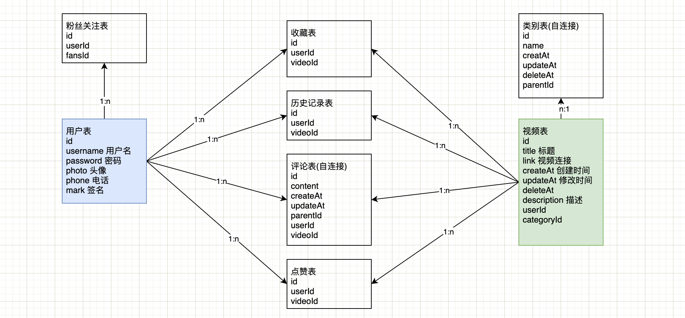

## 数据库SQL

```sql
/*
 Navicat Premium Data Transfer

 Source Server         : docker-mysql
 Source Server Type    : MySQL
 Source Server Version : 80023
 Source Host           : localhost:3307
 Source Schema         : yingxue

 Target Server Type    : MySQL
 Target Server Version : 80023
 File Encoding         : 65001

 Date: 09/07/2021 09:10:19
*/

SET NAMES utf8mb4;
SET FOREIGN_KEY_CHECKS = 0;

-- ----------------------------
-- Table structure for admin
-- ----------------------------
DROP TABLE IF EXISTS `admin`;
CREATE TABLE `admin` (
  `id` int NOT NULL AUTO_INCREMENT COMMENT '用户id',
  `username` varchar(40) DEFAULT NULL COMMENT '用户名',
  `password` varchar(255) DEFAULT NULL COMMENT '用户密码',
  `avatar` varchar(255) DEFAULT NULL COMMENT '用户头像地址',
  `created_at` datetime DEFAULT NULL COMMENT '创建时间',
  `updated_at` datetime DEFAULT NULL COMMENT '更新时间',
  `deleted_at` datetime DEFAULT NULL COMMENT '删除时间',
  PRIMARY KEY (`id`)
) ENGINE=InnoDB DEFAULT CHARSET=utf8;

-- ----------------------------
-- Table structure for category
-- ----------------------------
DROP TABLE IF EXISTS `category`;
CREATE TABLE `category` (
  `id` int NOT NULL AUTO_INCREMENT,
  `name` varchar(16) NOT NULL COMMENT '名称',
  `parent_id` int DEFAULT NULL COMMENT '父级分类id',
  `created_at` datetime NOT NULL,
  `updated_at` datetime NOT NULL,
  `deleted_at` datetime DEFAULT NULL,
  PRIMARY KEY (`id`),
  KEY `fk_category_category_1` (`parent_id`),
  CONSTRAINT `fk_category_category_1` FOREIGN KEY (`parent_id`) REFERENCES `category` (`id`)
) ENGINE=InnoDB AUTO_INCREMENT=14 DEFAULT CHARSET=utf8 COMMENT='分类';

-- ----------------------------
-- Table structure for comment
-- ----------------------------
DROP TABLE IF EXISTS `comment`;
CREATE TABLE `comment` (
  `id` int NOT NULL AUTO_INCREMENT,
  `uid` int NOT NULL COMMENT '用户id',
  `video_id` int NOT NULL COMMENT '视频id',
  `content` text NOT NULL COMMENT '内容',
  `parent_id` int DEFAULT NULL COMMENT '父评论id',
  `created_at` datetime NOT NULL,
  `updated_at` datetime NOT NULL,
  `deleted_at` datetime DEFAULT NULL,
  PRIMARY KEY (`id`),
  KEY `fk_comment_user_1` (`uid`),
  KEY `fk_comment_video_1` (`video_id`),
  CONSTRAINT `comment_ibfk_1` FOREIGN KEY (`uid`) REFERENCES `user` (`id`),
  CONSTRAINT `comment_ibfk_2` FOREIGN KEY (`video_id`) REFERENCES `video` (`id`)
) ENGINE=InnoDB AUTO_INCREMENT=20 DEFAULT CHARSET=utf8 COMMENT='评论';

-- ----------------------------
-- Table structure for favorite
-- ----------------------------
DROP TABLE IF EXISTS `favorite`;
CREATE TABLE `favorite` (
  `id` int NOT NULL AUTO_INCREMENT,
  `uid` int NOT NULL COMMENT '用户id',
  `video_id` int NOT NULL COMMENT '视频id',
  `created_at` datetime DEFAULT NULL,
  `updated_at` datetime DEFAULT NULL,
  `deleted_at` datetime DEFAULT NULL,
  PRIMARY KEY (`id`),
  KEY `fk_favorite_user_1` (`uid`),
  KEY `fk_favorite_video_1` (`video_id`),
  CONSTRAINT `fk_favorite_user_1` FOREIGN KEY (`uid`) REFERENCES `user` (`id`),
  CONSTRAINT `fk_favorite_video_1` FOREIGN KEY (`video_id`) REFERENCES `video` (`id`)
) ENGINE=InnoDB DEFAULT CHARSET=utf8 COMMENT='收藏';

-- ----------------------------
-- Table structure for following
-- ----------------------------
DROP TABLE IF EXISTS `following`;
CREATE TABLE `following` (
  `id` int NOT NULL AUTO_INCREMENT,
  `uid` int NOT NULL COMMENT '用户id',
  `following_id` int NOT NULL COMMENT '被关注用户id',
  `created_at` datetime NOT NULL,
  `updated_at` datetime NOT NULL,
  `deleted_at` datetime DEFAULT NULL,
  PRIMARY KEY (`id`),
  KEY `fk_following_user_1` (`uid`),
  KEY `fk_following_user_2` (`following_id`),
  CONSTRAINT `fk_following_user_1` FOREIGN KEY (`uid`) REFERENCES `user` (`id`),
  CONSTRAINT `fk_following_user_2` FOREIGN KEY (`following_id`) REFERENCES `user` (`id`)
) ENGINE=InnoDB DEFAULT CHARSET=utf8 COMMENT='关注';

-- ----------------------------
-- Table structure for played
-- ----------------------------
DROP TABLE IF EXISTS `played`;
CREATE TABLE `played` (
  `id` int NOT NULL AUTO_INCREMENT,
  `uid` int NOT NULL COMMENT '用户id',
  `video_id` int NOT NULL COMMENT '视频id',
  `created_at` datetime NOT NULL,
  `updated_at` datetime NOT NULL,
  `deleted_at` datetime DEFAULT NULL,
  PRIMARY KEY (`id`),
  KEY `fk_played_user_1` (`uid`),
  KEY `fk_played_video_1` (`video_id`),
  CONSTRAINT `fk_played_user_1` FOREIGN KEY (`uid`) REFERENCES `user` (`id`),
  CONSTRAINT `fk_played_video_1` FOREIGN KEY (`video_id`) REFERENCES `video` (`id`)
) ENGINE=InnoDB DEFAULT CHARSET=utf8 COMMENT='播放历史';

-- ----------------------------
-- Table structure for user
-- ----------------------------
DROP TABLE IF EXISTS `user`;
CREATE TABLE `user` (
  `id` int NOT NULL AUTO_INCREMENT,
  `name` varchar(16) NOT NULL COMMENT '用户名',
  `avatar` varchar(256) NOT NULL COMMENT '头像链接',
  `intro` varchar(256) NOT NULL COMMENT '简介',
  `phone` varchar(11) DEFAULT NULL COMMENT '手机号',
  `phone_linked` tinyint(1) NOT NULL COMMENT '是否绑定手机号',
  `openid` varchar(28) DEFAULT NULL COMMENT '微信openid',
  `wechat_linked` tinyint(1) NOT NULL COMMENT '是否绑定微信',
  `following_count` int NOT NULL COMMENT '关注数',
  `followers_count` int NOT NULL COMMENT '粉丝数',
  `created_at` datetime NOT NULL,
  `updated_at` datetime NOT NULL,
  `deleted_at` datetime DEFAULT NULL,
  PRIMARY KEY (`id`)
) ENGINE=InnoDB AUTO_INCREMENT=10 DEFAULT CHARSET=utf8 COMMENT='用户';

-- ----------------------------
-- Table structure for video
-- ----------------------------
DROP TABLE IF EXISTS `video`;
CREATE TABLE `video` (
  `id` int NOT NULL AUTO_INCREMENT,
  `title` varchar(64) NOT NULL COMMENT '标题',
  `intro` varchar(256) NOT NULL COMMENT '简介',
  `uid` int NOT NULL COMMENT 'up主id',
  `cover` varchar(256) NOT NULL COMMENT '视频封面链接',
  `link` varchar(256) NOT NULL COMMENT '视频播放链接',
  `category_id` int NOT NULL COMMENT '分类id',
  `created_at` datetime NOT NULL,
  `updated_at` datetime NOT NULL,
  `deleted_at` datetime DEFAULT NULL,
  PRIMARY KEY (`id`),
  KEY `fk_video_user_1` (`uid`),
  KEY `fk_video_tag_1` (`category_id`),
  CONSTRAINT `fk_video_tag_1` FOREIGN KEY (`category_id`) REFERENCES `category` (`id`),
  CONSTRAINT `fk_video_user_1` FOREIGN KEY (`uid`) REFERENCES `user` (`id`)
) ENGINE=InnoDB AUTO_INCREMENT=19 DEFAULT CHARSET=utf8 COMMENT='视频';

SET FOREIGN_KEY_CHECKS = 1;
```

# 编码

```markdown
后台系统开发
技术选型：springboot + springcloud + vue + docker (nacos....) + msyql + redis + elasticsearch

后台的项目结构：
yingxue-admin 			维护后端系统全局父项目
- yingxue-common		用来存放后端系统公共代码工具类
- yingxue-user			完成用户列表
- yingxue-category	完成类别接口
- yingxue-video			完成视频接口
- yingxue-admins			完成后端管理员操作
- yingxue-gateway		后端系统网关服务 路由转发+跨域处理 localhost:8888

前端系统开发
技术选型：springboot + springcloud + vue + docker (nacos....) + msyql + redis + elasticsearch
项目结构：
yingxue-api 				全局父项目
- yingxue-common
- yingxue-user
- yingxue-category
- yingxie-video
- yingxue-gateway
```

## 环境搭建

```markdown
0. 库表入库
1. 构建项目结构
2. 每个微服务构建一个独立的springboot应用
3. 启动nacos 将每个应用作为微服务注册到nacos
4. 创建服务网关 配置对应的路由规则 + 跨域
5. 根据及接口文档开发接口 api-admin.html 连接对应的数据库
6. 启动后端界面连接网关进行请求交互 去后端打包之后admin-dist/js/app.js修改网关端口
```

### docker环境搭建

> **记录教程中的操作**
>
> 在创建项目之前，我们需要先把nacos部署到docker中，所以我们必须要先启动并编写docker-compose
>
> 这里docker和docker-compose的安装相关的信息就不概述了
>
> 创建docker-compse.yaml文件
>
> ```yaml
> version: "3.3"
> 
> networks:
>   yingxue_network:
> 
> services:
>   nacos:
>     image: nacos/nacos-server:2.0.2
>     container_name: nacos
>     ports:
>     - "8848:8848"
>     environment:
>       - "JVM_XMS=256m"
>       - "JVM_XMX=256m"
>       - "NODE=standalone"
>     networks:
>       - yingxue_network
> ```
>
> 然后idea中找到tools->deployment->browse remote host浏览远程主机
>
> 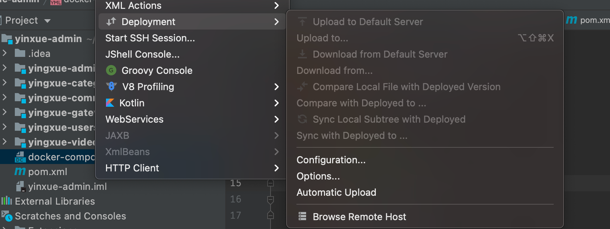
>
> 添加远程主机
>
> 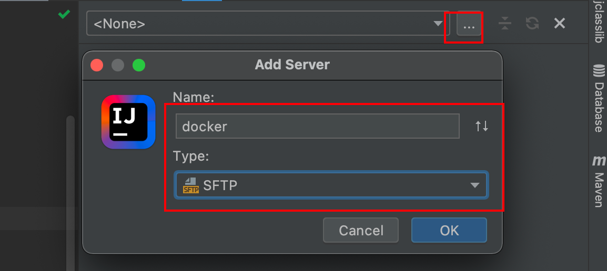
>
> 通过ssh连接
>
> 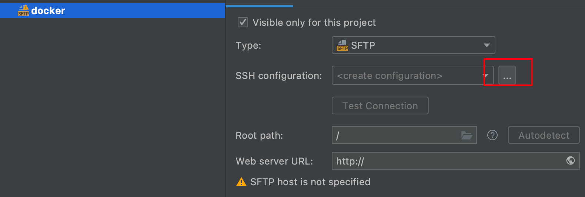
>
> 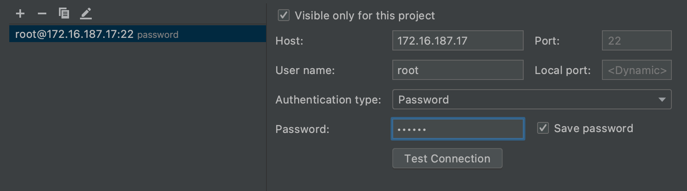
>
> 直接定位到root目录
>
> 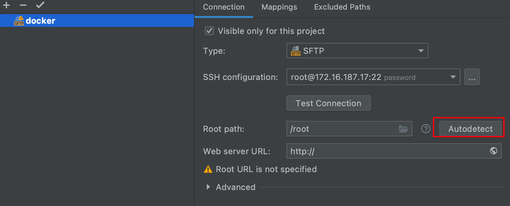
>
> 创建一个存储目录
>
> 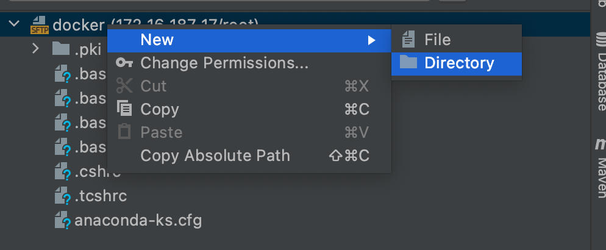
>
> 然后直接将docker-compose.yaml拖动到创建的目录中
>
> 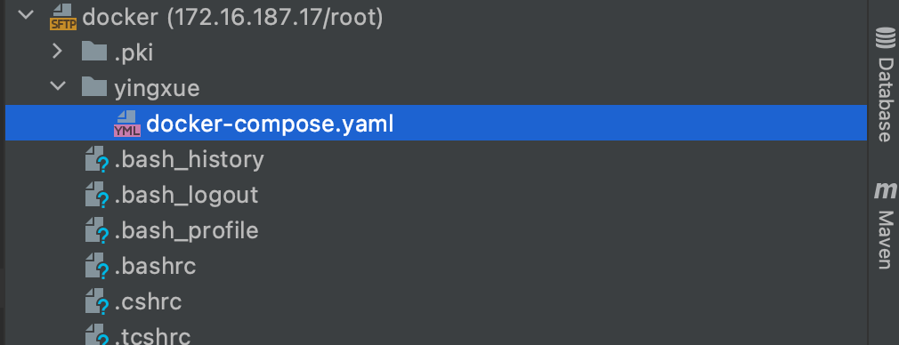
>
> 通过ssh终端连接到远程centos
>
> 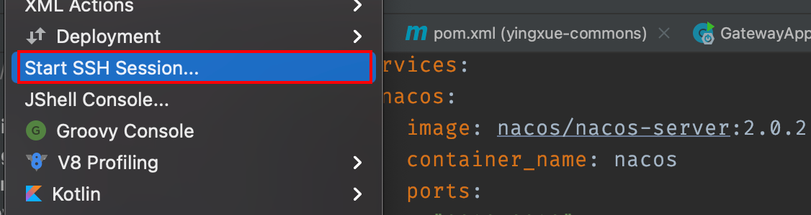
>
> 当前目录
>
> ```bash
> [root@localhost ~]# ll
> total 4
> -rw-------. 1 root root 1253 Dec 12 16:14 anaconda-ks.cfg
> drwxr-xr-x. 2 root root   33 Dec 21 22:05 yingxue
> [root@localhost ~]# cd yingxue/
> [root@localhost yingxue]# ll
> total 4
> -rw-r--r--. 1 root root 282 Dec 21 21:57 docker-compose.yaml
> [root@localhost yingxue]# pwd
> /root/yingxue
> ```
>
> 这样我们就可以创建并启动了
>
> ```bash
> [root@localhost yingxue]# docker-compose up -d
> Creating network "yingxue_yingxue_network" with the default driver
> Pulling nacos (nacos/nacos-server:2.0.2)...
> 2.0.2: Pulling from nacos/nacos-server
> 5ad559c5ae16: Pulling fs layer
> 87660f13664e: Pull complete
> 10ec6d7a8fca: Pull complete
> 80cdb3124bd7: Pull complete
> 68111ec3c1e2: Pull complete
> da2dd5f79b11: Pull complete
> e5d776bff84f: Pull complete
> 2ae62a61c8c3: Pull complete
> ba4ec60b268b: Pull complete
> 28b6ab459a07: Pull complete
> 9a03b1668b6d: Pull complete
> Digest: sha256:ac66d2fbc1ba432beff88beb165e5012686863d72a5e0f25da06e23c5e7b329d
> Status: Downloaded newer image for nacos/nacos-server:2.0.2
> Creating nacos ... done
> ```
>
> 查看一下情况，之后发现安装失败，去官方网站，安装就好
>
> ```http
> https://nacos.io/zh-cn/docs/quick-start-docker.html
> ```
>
> 通过mysql方式启动`docker-compose -f example/standalone-mysql-5.7.yaml up`，但是需要将`standalone-mysql-5.7.yaml`文件修改成适合自己的版本
>
> ```yaml
> version: "3.3" # 这里
> services:
>   nacos:
>     image: nacos/nacos-server:2.0.2 # 这里
>     container_name: nacos-standalone-mysql
>     env_file:
>       - ../env/nacos-standlone-mysql.env
>     volumes:
>       - ./standalone-logs/:/home/nacos/logs
>       - ./init.d/custom.properties:/home/nacos/init.d/custom.properties
>     ports:
>       - "8848:8848"
>       - "9848:9848"
>       - "9555:9555"
>     depends_on:
>       - mysql
>     restart: on-failure
>   mysql:
>     container_name: mysql
>     image: nacos/nacos-mysql:5.7
>     env_file:
>       - ../env/mysql.env
>     volumes:
>       - ./mysql:/var/lib/mysql
>     ports:
>       - "3306:3306"
> #  prometheus:
> #    container_name: prometheus
> #    image: prom/prometheus:latest
> #    volumes:
> #      - ./prometheus/prometheus-standalone.yaml:/etc/prometheus/prometheus.yml
> #    ports:
> #      - "9090:9090"
> #    depends_on:
> #      - nacos
> #    restart: on-failure
> #  grafana:
> #    container_name: grafana
> #    image: grafana/grafana:latest
> #    ports:
> #      - 3000:3000
> #    restart: on-failure
> ```
>
> 然后通过后台启动
>
> ```bash
> [root@localhost nacos-docker]# docker-compose -f example/standalone-mysql-5.7.yaml up -d
> Starting mysql ... done
> Starting nacos-standalone-mysql ... done
> ```
>
> 查看情况
>
> ```bash
> [root@localhost nacos-docker]# docker ps
> CONTAINER ID   IMAGE                      COMMAND                  CREATED         STATUS         PORTS                                                                                                                             NAMES
> 702d4603e622   nacos/nacos-server:2.0.2   "bin/docker-startup.…"   3 minutes ago   Up 3 minutes   0.0.0.0:8848->8848/tcp, :::8848->8848/tcp, 0.0.0.0:9555->9555/tcp, :::9555->9555/tcp, 0.0.0.0:9848->9848/tcp, :::9848->9848/tcp   nacos-standalone-mysql
> 418ce8e1aea3   nacos/nacos-mysql:5.7      "docker-entrypoint.s…"   3 minutes ago   Up 3 minutes   0.0.0.0:3306->3306/tcp, :::3306->3306/tcp, 33060/tcp                                                                              mysql
> ```
>
> 通过命名查看`docker logs -f 70`
>
> 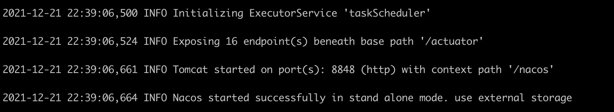
>
> 已经成功启动，关闭防火墙之后访问``
>
> 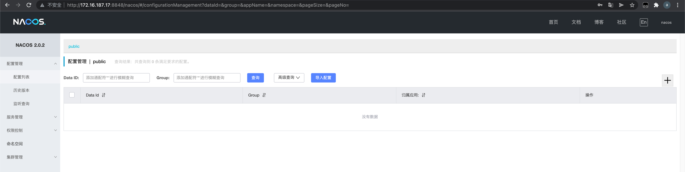

#### mysql、nacos、redis环境搭建

我们可以通过docker-compose方式搭建

```yaml
version: "3.3"

networks:
  yingxue_network:

services:
  nacos:
    image: nacos/nacos-server:2.0.2
    container_name: nacos
    ports:
      - "8848:8848"
    environment:
      - "JVM_XMS=256m"
      - "JVM_XMX=256m"
      - "MODE=standalone"
    volumes:
      - ./standalone-logs/:/home/nacos/logs
    networks:
      - yingxue_network

  mysql:
    image: mysql:5.7
    container_name: mysql
    ports:
      - "3306:3306"
    networks:
      - yingxue_network
    volumes:
      - ./mysql:/var/lib/mysql
      - ./yingxue.sql:/docker-entrypoint-initdb.d/yingxue.sql
    environment:
      - "MYSQL_ROOT_PASSWORD=123456"
      - "MYSQL_DATABASE=yingxue"
  redis:
    image: redis:5.1.10
    container_name: redis
    ports:
      - "6379:6379"
    volumes:
      - ./redis:/data
```

然后上传数据库文件和docker-compose.yaml文件到服务，通过命令`docker-compose -d up`启动，查看服务已经启动了

```bash
[root@localhost yingxue]# docker ps
CONTAINER ID   IMAGE                      COMMAND                  CREATED          STATUS          PORTS                                                  NAMES
88ebc944823e   redis:5.0.10               "docker-entrypoint.s…"   53 seconds ago   Up 52 seconds   0.0.0.0:6379->6379/tcp, :::6379->6379/tcp              redis
3a79e64b0b2c   c8cd99bb135c               "bin/docker-startup.…"   33 minutes ago   Up 33 minutes   8848/tcp                                               strange_neumann
a49704b6aa63   mysql:5.7                  "docker-entrypoint.s…"   40 minutes ago   Up 29 minutes   0.0.0.0:3306->3306/tcp, :::3306->3306/tcp, 33060/tcp   mysql
8f9364936245   nacos/nacos-server:2.0.2   "bin/docker-startup.…"   40 minutes ago   Up 29 minutes   0.0.0.0:8848->8848/tcp, :::8848->8848/tcp              nacos
```

这个时候我们使用Navicat连接查看表数据，已经创建成功了

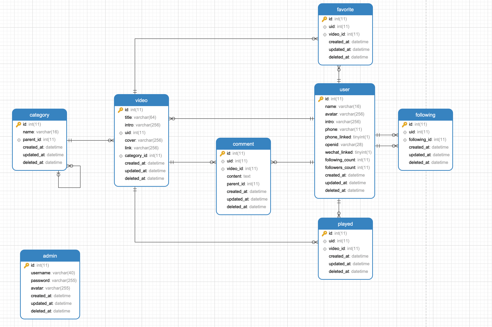

### 构建项目结构

#### 构建父项目

和之前一样，先创建空白的maven父项目，然后将父项目添加依赖

```xml
<packaging>pom</packaging>
<!-- 将当前项目父项目设置为springboot -->
<parent>
  <groupId>org.springframework.boot</groupId>
  <artifactId>spring-boot-starter-parent</artifactId>
  <version>2.2.5.RELEASE</version>
</parent>
<properties>
  <maven.compiler.source>8</maven.compiler.source>
  <maven.compiler.target>8</maven.compiler.target>
  <java.version>1.8</java.version>
  <spring.cloud.alibaba.version>2.2.1.RELEASE</spring.cloud.alibaba.version>
  <spring-cloud.version>Hoxton.SR6</spring-cloud.version>
</properties>

<!--声明springcloud & springcloud alibaba依赖-->
<dependencyManagement>
  <dependencies>
    <dependency>
      <groupId>com.alibaba.cloud</groupId>
      <artifactId>spring-cloud-alibaba-dependencies</artifactId>
      <version>${spring.cloud.alibaba.version}</version>
      <type>pom</type>
      <scope>import</scope>
    </dependency>

    <dependency>
      <groupId>org.springframework.cloud</groupId>
      <artifactId>spring-cloud-dependencies</artifactId>
      <version>${spring-cloud.version}</version>
      <type>pom</type>
      <scope>import</scope>
    </dependency>
  </dependencies>
</dependencyManagement>
```

#### 构建业务服务模块

分别创建amdins、category、users、videos模块，并将这些业务模块构建成springboot项目

1. 首先我们先将项目改造成springboot项目

为此我们需要引入springboot-web依赖，因为此依赖基本所有的模块都需要，所以我们放置到commons中，然后在业务模块中引入即可

```xml
<!--引入springboot-web-->
<dependency>
  <groupId>org.springframework.boot</groupId>
  <artifactId>spring-boot-starter-web</artifactId>
</dependency>
```

然后就可以创建并编写配置文件了

```yaml
server:
  port: 9091
spring:
  application:
    name: yingxue-admins
```

创建并编写启动类

```java
@SpringBootApplication
public class AdminsApplication {
    public static void main(String[] args) {
        SpringApplication.run(AdminsApplication.class, args);
    }
}
```

启动测试，根据控制台输出信息，判定已经正确修改为springboot-web项目

2. 将业务服务注册到nacos中

为了将服务注册到nacos中，我们需要引入nacos-discovery依赖，同样放到commons中

```xml
<!--引入nacos注册服务依赖-->
<dependency>
  <groupId>com.alibaba.cloud</groupId>
  <artifactId>spring-cloud-starter-alibaba-nacos-discovery</artifactId>
</dependency>
```

编写配置文件

```yaml
server:
  port: 9091
spring:
  application:
    name: yingxue-admins
  cloud: # 这里
    nacos:
      server-addr: 172.16.187.17:8848
      discovery:
        server-addr: ${spring.cloud.nacos.server-addr}
        namespace: 48eed5ff-6ebb-4ba1-a1bb-0b5ee07a5969 # 需要先在nacos中添加命名空间，才会有这个namespace
```

启动类添加`@EnableDiscoveryClient`注解，其实加不加都可以，默认开启的

```java
@SpringBootApplication
@EnableDiscoveryClient
public class AdminsApplication {
    public static void main(String[] args) {
        SpringApplication.run(AdminsApplication.class, args);
    }
}
```

启动服务，我们可以看到已经注册到了nacos中

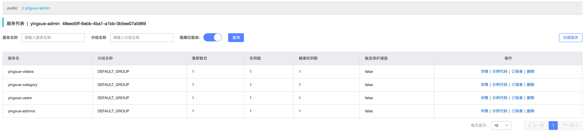

#### 构建网关模块

创建gateway模块

添加依赖

```xml
<dependencies>
  <!--引入commons依赖-->
  <dependency>
    <groupId>com.example</groupId>
    <artifactId>yingxue-commons</artifactId>
    <version>1.0-SNAPSHOT</version>
    <exclusions>
      <!--排除springboot-web-->
      <exclusion>
        <groupId>org.springframework.boot</groupId>
        <artifactId>spring-boot-starter-web</artifactId>
      </exclusion>
    </exclusions>
  </dependency>

  <dependency>
    <groupId>org.springframework.cloud</groupId>
    <artifactId>spring-cloud-starter-gateway</artifactId>
  </dependency>
</dependencies>
```

创建并编写配置文件

```yaml
server:
  port: 9999
spring:
  application:
    name: yingxue-gateway
  cloud:
    nacos:
      server-addr: 172.16.187.17:8848
      discovery:
        namespace: 48eed5ff-6ebb-4ba1-a1bb-0b5ee07a5969
    gateway:
      discovery:
        locator:
          enabled: true
      routes: # 用来配置路由规则 id uri path
        # admins
        - id: admins_router
          uri: lb://yingxue-admins
          predicates:
            - Path=/admins/**
          filters:
            - StripPrefix=1   # 去掉请求前缀filter int数字， 1 表示去掉一级  2 表示去掉2级，这样就可以不用在admins服务中都写上admins前缀了

        # category
        - id: category_router
          uri: lb://yingxue-category
          predicates:
            - Path=/category/**
          filters:
            - StripPrefix=1

        # users
        - id: users_router
          uri: lb://yingxue-users
          predicates:
            - Path=/users/**
          filters:
            - StripPrefix=1

        # videos
        - id: videos_router
          uri: lb://yingxue-videosd
          predicates:
            - Path=/videos/**
          filters:
            - StripPrefix=1
      # 跨域
      globalcors:
        cors-configurations:
          '[/**]':
            allowedHeaders: "*"
            allowedOrigins: "*"
            allowedMethods:
              - GET
              - POST
              - DELETE
              - PUT
              - OPTION
```

创建并编写启动类

```java
@SpringBootApplication
@EnableDiscoveryClient
public class GatewayApplication {
    public static void main(String[] args) {
        SpringApplication.run(GatewayApplication.class, args);
    }
}
```

启动服务，我们可以看到已经注册到nacos中

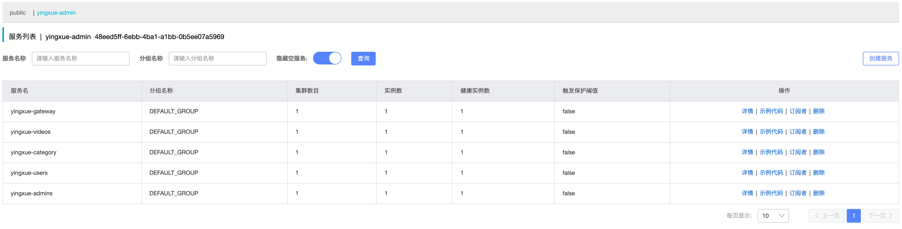

## 业务功能实现

### admins模块

#### 登录接口

接口文档

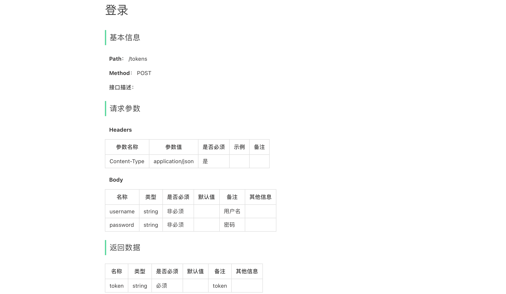

##### 数据库造数据

密码使用md5加密

```sql
SELECT MD5(123456);
```

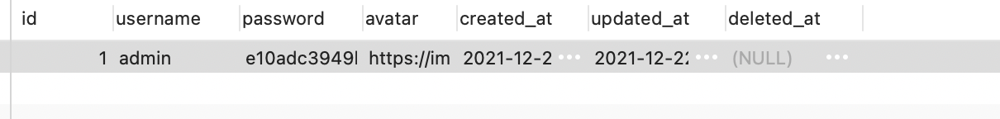

##### 编码

添加依赖

我们先在父项目中添加版本声明

```xml
<!-- 版本 --->
<mysql.connection.java.version>5.1.47</mysql.connection.java.version>
<mybatis.spring.boot.starter.version>2.2.0</mybatis.spring.boot.starter.version>
<druid.version>1.1.21</druid.version>

<!-- 引入依赖 --->
<dependency>
  <groupId>mysql</groupId>
  <artifactId>mysql-connector-java</artifactId>
  <version>${mysql.connection.java.version}</version>
</dependency>

<dependency>
  <groupId>org.mybatis.spring.boot</groupId>
  <artifactId>mybatis-spring-boot-starter</artifactId>
  <version>${mybatis.spring.boot.starter.version}</version>
</dependency>

<dependency>
  <groupId>com.alibaba</groupId>
  <artifactId>druid</artifactId>
  <version>${druid.version}</version>
</dependency>
```

然后在admin中引入

```xml
<dependency>
  <groupId>mysql</groupId>
  <artifactId>mysql-connector-java</artifactId>
</dependency>

<dependency>
  <groupId>org.mybatis.spring.boot</groupId>
  <artifactId>mybatis-spring-boot-starter</artifactId>
</dependency>

<dependency>
  <groupId>com.alibaba</groupId>
  <artifactId>druid</artifactId>
</dependency>
```

编写配置

```yaml
server:
  port: 9091
spring:
  application:
    name: yingxue-admins
  cloud:
    nacos:
      server-addr: 172.16.187.17:8848
      discovery:
        server-addr: ${spring.cloud.nacos.server-addr}
        namespace: 48eed5ff-6ebb-4ba1-a1bb-0b5ee07a5969
  datasource:
    type: com.alibaba.druid.pool.DruidDataSource
    driver-class-name: com.mysql.jdbc.Driver
    url: jdbc:mysql://172.16.187.17:3306/yingxue?characterEncoding=UTF-8&useSSL=false
    username: root
    password: 123456
mybatis:
  mapper-locations: classpath:mapper/*.xml
  type-aliases-package: com.example.yingxue.admins.db.pojo
logging:
  level:
    com.example.yingxue.admins.db.dao: debug
```

easy-code插件

## 后端服务总结

### redis

````markdown
1. redis 内存型数据库，注意：Redis服务器不可能只存储和用户认证相关的数据，Redis服务器一定是存储业务数据

推荐使用Redis方式：在书写业务相关的数据时一定要加入对应业务key信息，一般是一个固定写死的常量

写入redis : 方式一 TOKEN_D6B14119718AF38710E643E3F2A7C880 方式二 TOKEN:D6B14119718AF38710E643E3F2A7C880
为了解耦我们通常会创建常量包，并创建RedisRrefix来存储常用的前缀
```java
public interface RedisPrefix {
    String TOKEN_KEY = "TOKEN";
}
```
2. RedisTemplate的使用问题
当我们在使用RedisTemplate的时候
```java
redisTemplate.setKeySerializer(new StringRedisSerializer());
redisTemplate.opsForValue().set(token, adminDB, 30, TimeUnit.MINUTES);
```
这么使用是错误的，过于繁杂
问题：
- redisTemplate 操作对象 key value 都是对象 key String value 对象
- redisTemplate 存放的对象必须序列化
改造：
- key 使用String序列化方式
- value 放入对象 使用JSON序列化的方式
```java
@Configuration
public class RedisTemplateConfig {

    @Autowired
    public RedisTemplateConfig(RedisTemplate redisTemplate) {
        // 创建jackson序列化方式
        final Jackson2JsonRedisSerializer<Object> jackson2JsonRedisSerializer = new Jackson2JsonRedisSerializer<>(Object.class);

        // 创建object mapper
        final ObjectMapper objectMapper = new ObjectMapper();
        // 允许访问对象中的所有属性
        objectMapper.setVisibility(PropertyAccessor.ALL, JsonAutoDetect.Visibility.ANY);
        // 转换json的过程中保存类的信息
        objectMapper.activateDefaultTyping(LaissezFaireSubTypeValidator.instance, ObjectMapper.DefaultTyping.NON_FINAL, JsonTypeInfo.As.WRAPPER_ARRAY);
        jackson2JsonRedisSerializer.setObjectMapper(objectMapper);

        // 设置value的序列化规则 和 key 序列化规则
        final StringRedisSerializer stringRedisSerializer = new StringRedisSerializer();
        redisTemplate.setKeySerializer(stringRedisSerializer);
        redisTemplate.setValueSerializer(jackson2JsonRedisSerializer);

        // 设置hash类型的key value 序列化方式
        redisTemplate.setHashKeySerializer(stringRedisSerializer);
        redisTemplate.setHashValueSerializer(jackson2JsonRedisSerializer);

        // 工厂创建redisTemplate对象之后在进行配置
        redisTemplate.afterPropertiesSet();
    }
}
```
````

### FilterFacoty

使用网关过滤器做用户权限认证

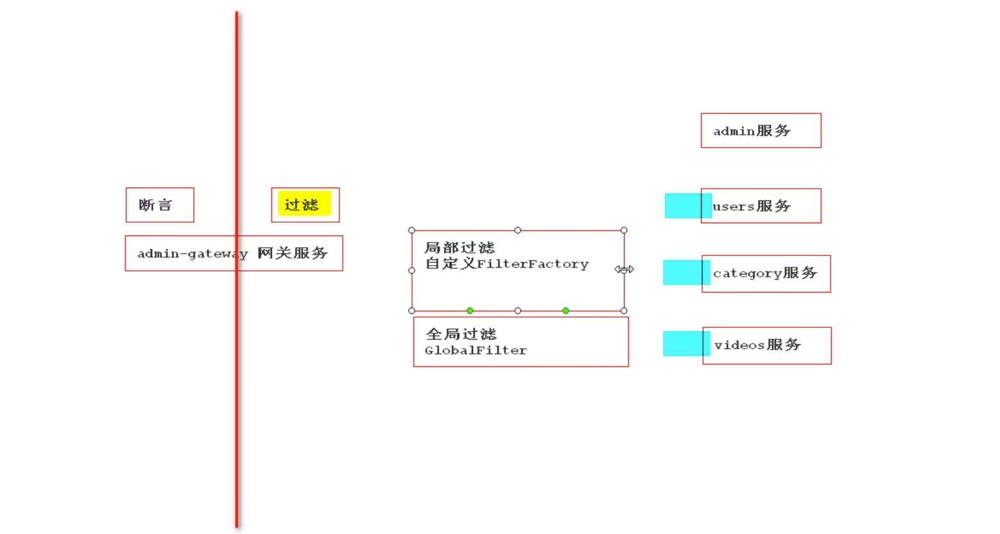

````markdown
# 自定义过滤器
```java
/**
 * 自定义token工厂
 * 创建好之后，使用只需要filters: - Token= 即可
 */
@Component
@Slf4j
public class TokenGatewayFilterFactory extends AbstractGatewayFilterFactory<TokenGatewayFilterFactory.Config> {

    @Autowired
    private RedisTemplate redisTemplate;

    public TokenGatewayFilterFactory() {
        super(Config.class);
    }

    /**
     * 用于过滤
     *
     * @param config 就是本类中Config创建的对象，已经完成了对Config中的属性的赋值
     * @return
     */
    @Override
    public GatewayFilter apply(Config config) {
        return new GatewayFilter() {
            @Override
            public Mono<Void> filter(ServerWebExchange exchange, GatewayFilterChain chain) {
                if (config.requiredToken) {
                    if (exchange.getRequest().getQueryParams().get("token") == null)
                        throw new RuntimeException("非法令牌");

                    final String token = exchange.getRequest().getQueryParams().get("token").get(0);
                    log.info("token:{}", token);

                    // 根据token信息去redis获取信息
                    if (!redisTemplate.hasKey(token)) {
                        throw new RuntimeException("不合法的令牌");
                    }
                }

                return chain.filter(exchange);
            }
        };
    }

    /**
     * 用来配置将使用filter时指定值赋值给Config中的那个属性
     *
     * @return
     */
    @Override
    public List<String> shortcutFieldOrder() {
        return Arrays.asList("requiredToken"); // 返回一个有序的列表 和Token= 的内容顺序一致
    }

    /**
     * 用来在配置的时候传递参数
     */
    public static class Config {
        private boolean requiredToken;


        public boolean isRequiredToken() {
            return requiredToken;
        }

        public void setRequiredToken(boolean requiredToken) {
            this.requiredToken = requiredToken;
        }
    }
}
```
# 使用
filters:
	- StripPrefix=1   # 去掉请求前缀filter int数字， 1 表示去掉一级  2 表示去掉2级，这样就可以不用在admins服务中都写上admins前缀了
	- Token=true # 使用token验证
# 网关异常处理
```java
@Configuration
@Order(-1) //按照字数的自然顺序执行 -1 代表最高，优先在所有的filter之前执行
public class GlobalExceptionConfiguration implements ErrorWebExceptionHandler {
    //日志对象
    private static final Logger log = LoggerFactory.getLogger(GlobalExceptionConfiguration.class);

    @Override //参数1: request response   ex:出现异常时异常对象
    public Mono<Void> handle(ServerWebExchange exchange, Throwable ex) {
        Map<String, String> result = new HashMap<>();

        //1.获取响应对象
        ServerHttpResponse response = exchange.getResponse();

        //2.response是否结束  多个异常处理时候
        if (response.isCommitted()) {
            return Mono.error(ex);
        }

        //2.设置响应头类型
        response.getHeaders().setContentType(MediaType.APPLICATION_JSON);

        //3.设置响应状态吗
        if (ex instanceof IllegalTokenException) {
            response.setStatusCode(HttpStatus.FORBIDDEN);
        } else {
            response.setStatusCode(HttpStatus.INTERNAL_SERVER_ERROR);
        }

        //4.设置响应内容
        return response
                .writeWith(Mono.fromSupplier(() -> {
                    DataBufferFactory bufferFactory = response.bufferFactory();
                    result.put("msg", ex.getMessage());
                    ObjectMapper objectMapper = new ObjectMapper();
                    try {
                        return bufferFactory.wrap(objectMapper.writeValueAsBytes(result));
                    } catch (JsonProcessingException e) {
                        e.printStackTrace();
                        return null;
                    }
                }));
    }
}
```
```java
/**
 * 自定义异常
 */
public class IllegalTokenException extends RuntimeException {

    public IllegalTokenException(String message) {
        super(message);
    }
}
```
````


# 测试


# 上线

```markdown
# 微服务系统的部署

```

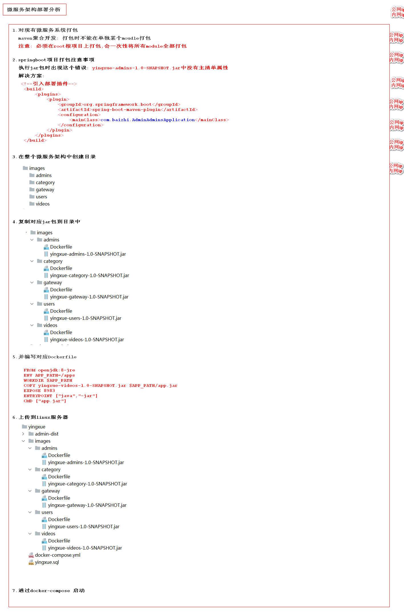

# 维护


