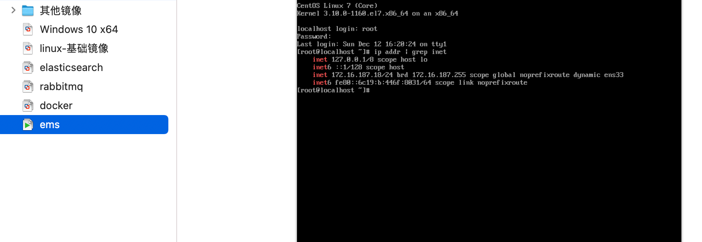
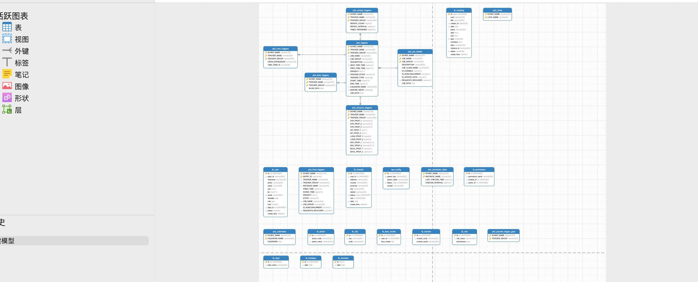
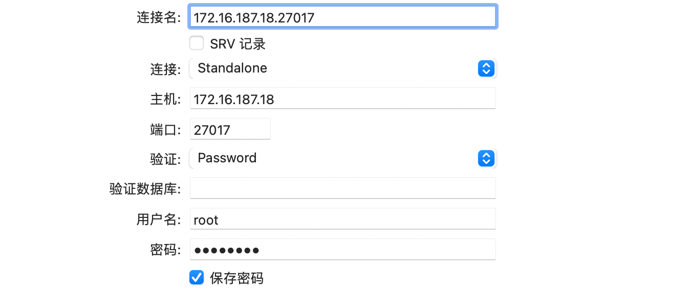
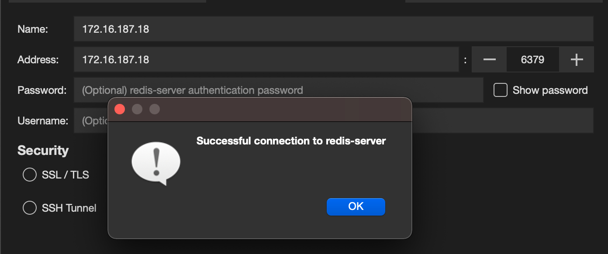
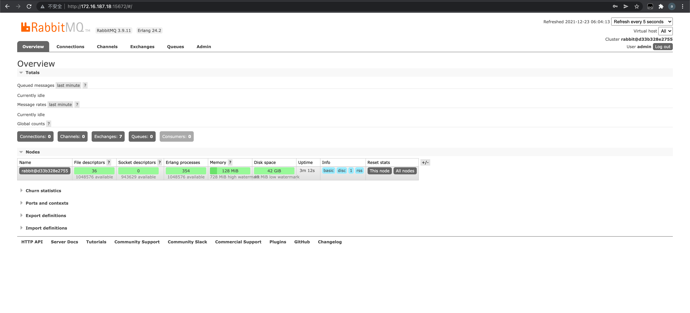
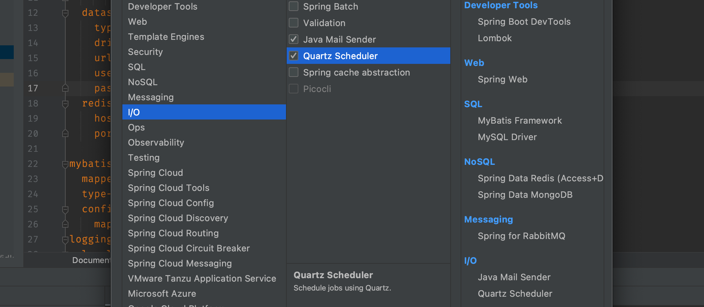
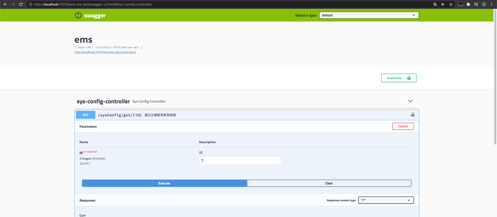
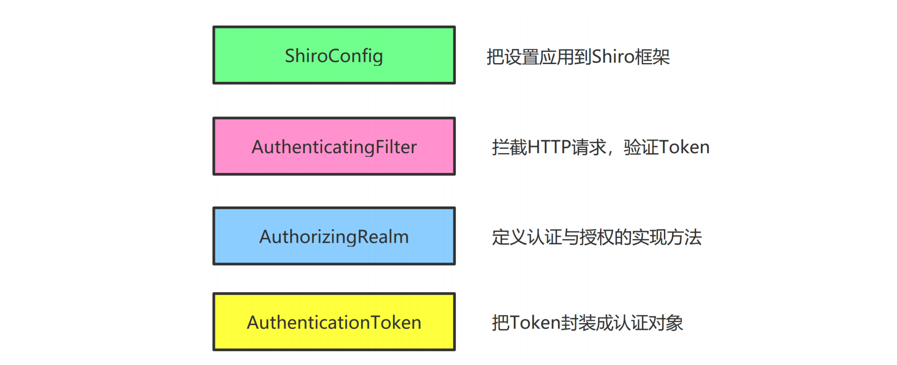

## 开发环境

### 开发环境概述

1. Java开发工具

- idea
- jdk8
- maven3.9

2. 小程序开发工具

- hbuilderx
- 小程序开发工具

3. 数据库

- mysql 5.7 直接安装到docker
- mongdb 6 直接安装到docker
- redis 3.0 直接安装到docker

4. 虚拟机

- vmware 12，为了运行docker镜像

### 搭建开发环境

#### linux和docker准备

IDE工具本地已经有了，直接在docker里面安装数据库

需要先把VMware中的基础镜像克隆一个出来



安装docker、docker-compose


#### 安装MySQL、Redis、MongoDB、rabbitmq

> 如果出现错误：
>
> ```bash
> ERROR: Failed to Setup IP tables: Unable to enable SKIP DNAT rule:  (iptables failed: iptables --wait -t nat -I DOCKER -i br-5b815d94459f -j RETURN: iptables: No chain/target/match by that name.
>  (exit status 1))
> ```
>
> 就是在docker开启期间动了防火墙，需要重启docker

##### 安装

直接通过docker-compose来安装mysql、redis、mongodb，因为之后还用到了消息队列rabbitmq，所以顺便也一起装了

```yaml
version: "3.3"

networks:
  ems_network:

services:
  mysql:
    image: mysql:5.7
    container_name: mysql
    ports:
      - "3306:3306"
    networks:
      - ems_network
    volumes:
      - ./mysql/data:/var/lib/mysql
      - ./ems.sql:/docker-entrypoint-initdb.d/ems.sql
    environment:
      - "MYSQL_ROOT_PASSWORD=123456"
      - "MYSQL_DATABASE=ems"

  redis:
    image: redis
    container_name: redis
    ports:
      - "6379:6379"
    networks:
      - ems_network
    volumes:
      - ./redis/data:/data
      - ./redis/config:/usr/local/etc/redis

  mongo:
    image: mongo
    container_name: mongo
    ports:
      - "27017:27017"
    networks:
      - ems_network
    environment:
      MONGO_INITDB_ROOT_USERNAME: root
      MONGO_INITDB_ROOT_PASSWORD: 123456

  rabbitmq:
    image: rabbitmq
    container_name: 11.rabbitmq
    ports:
      - "5672:5672"
      - "15672:15672"
    networks:
      - ems_network
    volumes:
      - ./11.rabbitmq/home:/var/lib/11.rabbitmq
      - ./11.rabbitmq/config:/etc/11.rabbitmq
```

创建本次环境的目录

```bash
[root@localhost ~]## cd /opt/
[root@localhost opt]## ll
总用量 0
drwx--x--x. 4 root root 28 12月 23 01:53 containerd
[root@localhost opt]## mkdir dev-env
[root@localhost opt]## ll
总用量 0
drwx--x--x. 4 root root 28 12月 23 01:53 containerd
drwxr-xr-x. 2 root root  6 12月 23 02:31 dev-env
[root@localhost opt]## cd dev
-bash: cd: dev: 没有那个文件或目录
[root@localhost opt]## cd dev-env/
[root@localhost dev-env]## ll
总用量 0
[root@localhost dev-env]## mkdir ems
[root@localhost dev-env]## cd ems/
[root@localhost ems]## ll
总用量 0
[root@localhost ems]## pwd
/opt/dev-env/ems
```

安装并启动测试

```bash
docker-compose up ## 先前台运行查看是否有报错
```

执行结果

```bash
Creating 11.rabbitmq ... done
Creating mongo    ... done
Creating redis    ... done
Creating mysql    ... done
```

##### 测试安装结果

1. 测试MySQL

使用本地数据库管理软件Navicat连接到MySQL，成功连接，并已经执行了ems.sql创建库表



2. 测试MongoDB

使用本地数据库管理软件Navicat连接MongoDB，成功连接




3. 测试Redis

测试Redis和测试rabbitmq需要修改配置，// 这里先停止服务，修改配置之后在重新启动。

刚才我们把Redis的配置目录挂载到Linux中，现在我们只需要在该目录中配置就可以

```bash
[root@localhost config]## pwd
/opt/dev-env/ems/redis/config
```

从官网下载redis.conf的配置文件`http://download.redis.io/redis-stable/redis.conf`

放到config目录下，并做如下配置

- 禁用Linux的防火墙：Linux(CentOS7)里执行命令`systemctl stop/disable firewalld.service`
- redis.conf中注释掉`bind 127.0.0.1`,然后`protected-mode no`

```markdown
## docker 模式下使用`daemonize yes`使用模式不能运行，启动错误
```

修改完成之后重新执行

```bash
[root@localhost ems]## docker-compose up -d
mysql is up-to-date
Recreating redis ...
mongo is up-to-date
Recreating redis ... done
```

使用rdm连接，连接成功



4. 测试rabbitmq

这个比Redis简单多了，只需要开启web管理界面，然后新增一个管理用户，使用这个用户登录即可

> 出于安全的考虑，guest这个默认的用户只能通过http://localhost:15672 来登录，不能使用IP地址登录，也就是不能远程访问，在这里可以新建一个账号，赋予管理员权限，实现远程访问
>
> 默认rabbitmq在启动之后会去读取`/etc/rabbitmq/`目录下的名为`rabbitmq.config`的配置文件
>
> rabbitmq的系统配置文件一般是rabbitmq.conf，可以登录后台查看它的路径，如果你是源码安装，最初这个文件是没有的，需要手动创建
>
> 如果是apt安装他的位置在/etc/rabbitmq/目录下，它规定了rabbitmq的众多参数设定
>
> > 如果你没有找到的话也没关系，去github上拷贝一份模版配置，手动创建 `/etc/rabbitmq/rabbitmq.config` 配置文件，然后将你拷贝的配置放进去也是ok的
> >
> > rabbitmq github addr：https://github.com/rabbitmq/rabbitmq-server/blob/v3.8.9/docs/
>
> > 官方：强烈不建议允许默认的用户可远程登陆MQ，用过RabbitMQ的程序员都知道默认用户名和密码是啥，这会让你的系统的安全性大大降低！
> >
> > 推荐的做法是：删除默认用户、使用新的安全凭证创建新的用户
>
> 添加以下配置信息
>
> ```bash
> [
> {rabbit, [{tcp_listeners, [5672]}, {loopback_users, ["admin"]}]}
> ].
> ```
>
> 新增远程访问管理账号：admin
>
> ```bash
> [root@localhost 11.rabbitmq]## rabbitmqctl add_user admin 12345
> Adding user "admin" ...
> Done. Don't forget to grant the user permissions to some virtual hosts! See 'rabbitmqctl help set_permissions' to learn more.
> [root@localhost 11.rabbitmq]## rabbitmqctl set_user_tags admin administrator
> Setting tags for user "admin" to [administrator] ...
> [root@localhost 11.rabbitmq]## rabbitmqctl set_permissions -p "/" admin ".*" ".*" ".*"
> Setting permissions for user "admin" in vhost "/" ...
> [root@localhost 11.rabbitmq]## rabbitmqctl list_users
> Listing users ...
> user	tags
> admin	[administrator]
> guest	[administrator]
> ```
>
> **如果不能访问，记得关闭防火墙**



#### 安装idea插件

lombok和easy code插件

其中easy code可以通过数据库生成dao、xml、pojo、service、serviceImpl、controller，包含了基本的增删查改，当然，还可以通过自己的配置来生成更多的模板代码

## 编码

### 后台编码

#### 项目搭建

创建springboot项目，勾选依赖库



然后添加druid数据库连接池依赖在，整个pom依赖如下

```xml
<?xml version="1.0" encoding="UTF-8"?>
<project xmlns="http://maven.apache.org/POM/4.0.0" xmlns:xsi="http://www.w3.org/2001/XMLSchema-instance"
         xsi:schemaLocation="http://maven.apache.org/POM/4.0.0 https://maven.apache.org/xsd/maven-4.0.0.xsd">
    <modelVersion>4.0.0</modelVersion>
    <parent>
        <groupId>org.springframework.boot</groupId>
        <artifactId>spring-boot-starter-parent</artifactId>
        <version>2.6.2</version>
        <relativePath/> <!-- lookup parent from repository -->
    </parent>
    <groupId>com.example</groupId>
    <artifactId>ems-wx-api</artifactId>
    <version>0.0.1-SNAPSHOT</version>
    <name>ems</name>
    <description>Demo project for Spring Boot</description>
    <properties>
        <java.version>1.8</java.version>
    </properties>
    <dependencies>
        <dependency>
            <groupId>org.springframework.boot</groupId>
            <artifactId>spring-boot-starter-amqp</artifactId>
        </dependency>
        <dependency>
            <groupId>org.springframework.boot</groupId>
            <artifactId>spring-boot-starter-data-mongodb</artifactId>
        </dependency>
        <dependency>
            <groupId>org.springframework.boot</groupId>
            <artifactId>spring-boot-starter-data-redis</artifactId>
        </dependency>
        <dependency>
            <groupId>org.springframework.boot</groupId>
            <artifactId>spring-boot-starter-mail</artifactId>
        </dependency>
        <dependency>
            <groupId>org.springframework.boot</groupId>
            <artifactId>spring-boot-starter-quartz</artifactId>
        </dependency>
        <dependency>
            <groupId>org.springframework.boot</groupId>
            <artifactId>spring-boot-starter-web</artifactId>
        </dependency>
        <dependency>
            <groupId>org.mybatis.spring.boot</groupId>
            <artifactId>mybatis-spring-boot-starter</artifactId>
            <version>2.2.0</version>
        </dependency>

        <dependency>
            <groupId>org.springframework.boot</groupId>
            <artifactId>spring-boot-devtools</artifactId>
            <scope>runtime</scope>
            <optional>true</optional>
        </dependency>
        <dependency>
            <groupId>mysql</groupId>
            <artifactId>mysql-connector-java</artifactId>
            <scope>runtime</scope>
        </dependency>
        <dependency>
            <groupId>org.projectlombok</groupId>
            <artifactId>lombok</artifactId>
            <optional>true</optional>
        </dependency>
        <dependency>
            <groupId>org.springframework.boot</groupId>
            <artifactId>spring-boot-starter-test</artifactId>
            <scope>test</scope>
        </dependency>
        <dependency>
            <groupId>org.springframework.amqp</groupId>
            <artifactId>spring-rabbit-test</artifactId>
            <scope>test</scope>
        </dependency>
        <dependency>
            <groupId>com.alibaba</groupId>
            <artifactId>druid</artifactId>
            <version>1.1.21</version>
        </dependency>
    </dependencies>

    <build>
        <plugins>
            <plugin>
                <groupId>org.springframework.boot</groupId>
                <artifactId>spring-boot-maven-plugin</artifactId>
                <configuration>
                    <excludes>
                        <exclude>
                            <groupId>org.projectlombok</groupId>
                            <artifactId>lombok</artifactId>
                        </exclude>
                    </excludes>
                </configuration>
            </plugin>
        </plugins>
    </build>

</project>
```

#### 配置springboot项目

```yaml
server:
  port: 7070
  tomcat:
    uri-encoding: UTF-8
    threads:
      max: 200
      min-spare: 30
    connection-timeout: 5000ms
  servlet:
    context-path: /ems-wx-api
spring:
  datasource:
    type: com.alibaba.druid.pool.DruidDataSource
    druid:
      driver-class-name: com.mysql.jdbc.Driver
      url: jdbc:mysql://172.16.187.18:3306/ems?useUnicode=true&characterEncoding=UTF-8&serverTimezone=Asia/Shanghai
      username: root
      password: 123456
      initial-size: 8
      max-active: 16
      min-idle: 8
      max-wait: 60000
      test-while-idle: true
      test-on-borrow: false
      test-on-return: false
  redis: ## redis
    host: 172.16.187.18
    port: 6379
    jedis:
      pool:
        max-active: 1000
        max-wait: -1ms
        max-idle: 16 ## 最大的空闲连接
        min-idle: 8 ## 最小空闲连接
  data:
    mongodb: ## mongo
      host: 172.16.187.18
      port: 27017
      database: ems
      authentication-database: root
      password: 123456
  rabbitmq: ## 11.rabbitmq
    host: 172.16.187.18
    port: 5672
    virtual-host: /ems
    username: admin
    password: 123456
mybatis:
  configuration:
    map-underscore-to-camel-case: true
    log-impl: org.apache.ibatis.logging.stdout.StdOutImpl
  type-aliases-package: com.example.ems.db.pojo
  mapper-locations: classpath*:mapper/*.xml
logging:
  level:
    root: info
    com.example.ems.db.dao: warn
```

#### 整合高级功能

##### 自定义异常

```java
@Data
public class EmosException extends RuntimeException {
    private String msg;
    private Integer code = 500;

    public EmosException(String msg) {
        super();
        this.msg = msg;
    }

    public EmosException(String msg, Throwable e) {
        super(msg, e);
        this.msg = msg;
    }

    public EmosException(String msg, Integer code) {
        super(msg);
        this.msg = msg;
        this.code = code;
    }

    public EmosException(String msg, Integer code, Throwable e) {
        super(msg, e);
        this.msg = msg;
        this.code = code;
    }
}
```

##### 封装R对象

```java
public class R extends HashMap<String, Object> {
    public R() {
        put("code", HttpStatus.SC_OK);
        put("msg", "success");
    }

    public static R error() {
        return error(HttpStatus.SC_INTERNAL_SERVER_ERROR, "未知异常，请联系管理员");
    }

    public static R error(String msg) {
        return error(HttpStatus.SC_INTERNAL_SERVER_ERROR, msg);
    }

    public static R error(int code, String msg) {
        R r = new R();
        r.put("code", code);
        r.put("msg", msg);
        return r;
    }

    public static R ok(String msg) {
        R r = new R();
        r.put("msg", msg);
        return r;
    }

    public static R ok(Map<String, Object> map) {
        R r = new R();
        r.putAll(map);
        return r;
    }

    public static R ok() {
        return new R();
    }

    public R put(String key, Object value) {
        super.put(key, value);
        return this;
    }
}
```

##### Swagger

引入依赖

```xml
<dependency>
  <groupId>io.springfox</groupId>
  <artifactId>springfox-swagger2</artifactId>
  <version>2.9.2</version>
</dependency>
<dependency>
  <groupId>io.springfox</groupId>
  <artifactId>springfox-swagger-ui</artifactId>
  <version>2.9.2</version>
</dependency>
```

编写Swagger配置

```java
@Configuration
@EnableSwagger2
public class SwaggerConfig {
    @Bean
    public Docket createRestApi() {
        Docket docket = new Docket(DocumentationType.SWAGGER_2);

        // ApiInfoBuilder 用于在Swagger界面上添加各种信息
        ApiInfoBuilder builder = new ApiInfoBuilder();
        builder.title("EMOS在线办公系统");
        ApiInfo apiInfo = builder.build();
        docket.apiInfo(apiInfo);

        // ApiSelectorBuilder 用来设置哪些类中的方法会生成到REST API中
        ApiSelectorBuilder selectorBuilder = docket.select();
        selectorBuilder.paths(PathSelectors.any()); //所有包下的类
        //使用@ApiOperation的方法会被提取到REST API中
        selectorBuilder.apis(RequestHandlerSelectors.withMethodAnnotation(ApiOperation.class));
        docket = selectorBuilder.build();

        /*
         * 下面的语句是开启对JWT的支持，当用户用Swagger调用受JWT认证保护的方法，
         * 必须要先提交参数（例如令牌）
         */
        //规定用户需要输入什么参数
        ApiKey apiKey = new ApiKey("token", "token", "header");
        //存储用户必须提交的参数
        List<ApiKey> apikey = new ArrayList<>();
        apikey.add(apiKey);
        docket.securitySchemes(apikey);

        //如果用户JWT认证通过，则在Swagger中全局有效
        AuthorizationScope scope = new AuthorizationScope("global", "accessEverything");
        AuthorizationScope[] scopes = {scope};
        //存储令牌和作用域
        SecurityReference reference = new SecurityReference("token", scopes);
        List refList = new ArrayList();
        refList.add(reference);

        SecurityContext context = SecurityContext.builder().securityReferences(refList).build();
        List cxtList = new ArrayList();
        cxtList.add(context);
        docket.securityContexts(cxtList);

        return docket;
    }
}
```

给要测试的接口增加注解

```java
@RestController
@RequestMapping("/user")
@Api("用户模块web接口") //这个
public class UserController {

    @Autowired
    private UserService userService;

    @Autowired
    private JwtUtil jwtUtil;

    @Autowired
    private RedisTemplate redisTemplate;

    @Value("${emos.jwt.cache-expire}")
    private Integer cacheExpire;

    @PostMapping("/register")
    @ApiOperation("注册用户") //这个
    public R register(@Valid @RequestBody RegisterForm form) {
        final int id = userService.registerUser(form.getRegisterCode(), form.getCode(), form.getNickname(), form.getPhoto());
        final String token = jwtUtil.createToken(id);
        final Set<String> permissions = userService.searchUserPermissions(id);
        saveCacheToken(token, id);
        return R.ok("用户注册成功").put("token", token).put("permissions", permissions);
    }

    private void saveCacheToken(String token, int id) {
        redisTemplate.opsForValue().set(token, id + "", cacheExpire, TimeUnit.DAYS);
    }

    @PostMapping("/login")
    @ApiOperation("登录系统")
    public R login(@Valid @RequestBody LoginForm form) {
        final Integer id = userService.login(form.getCode());
        final String token = jwtUtil.createToken(id);
        final Set<String> permissions = userService.searchUserPermissions(id);
        saveCacheToken(token, id);
        return R.ok("登录成功").put("token", token).put("permissions", permissions);
    }
}
```

这个时候我们在访问`http://localhost:7070/ems-wx-api/swagger-ui.html`就可以开始测试API接口了



##### 添加后端验证

使用validation库实现对上传的数据的进行校验

引入依赖

```xml
<dependency>
  <groupId>org.springframework.boot</groupId>
  <artifactId>spring-boot-starter-validation</artifactId>
</dependency>
```

这个时候就可以在接收的实体类上添加注解实现对属性的校验了

```java
@ApiModel
@Data
public class TestSayHelloForm {
    @NotEmpty
    @Pattern(regexp = "^[\\u4e00-\\u9fa5]{2,15}$",message = "姓名必须是2到15个字符")
    @ApiModelProperty("姓名")
    private String name;
}
```

##### 抵御XSS攻击

> XSS攻击通常指的是通过利用网页开发时留下的漏洞，通过巧妙的方法注入恶意指令代码到网 页，使用户加载并执行攻击者恶意制造的网页程序。这些恶意网页程序通常是JavaScript，但实 际上也可以包括Java、 VBScript、ActiveX、 Flash 或者甚至是普通的HTML。攻击成功后，攻击 者可能得到包括但不限于更高的权限（如执行一些操作）、私密网页内容、会话和cookie等各种 内容。 
>
> 例如用户在发帖或者注册的时候，在文本框中输入`<script>alert('xss')</script>`，这段代码如果不经过转义处理，而直接保存到数据库。将来视图层渲染HTML的时候，把这段代码输出到页面上，那么 `<script>` 标签的内容就会被执行。
>
> 通常情况下，我们登陆到某个网站。如果网站使用 HttpSession 保存登陆凭证，那么SessionId 会以 Cookie 的形式保存在浏览器上。如果黑客在这个网页发帖的时候，填写的JavaScript 代码是用来获取 Cookie 内容的，并且把 Cookie 内容通过Ajax发送给黑客自己的电脑。于是只要有人在这个网站上浏览黑客发的帖子，那么视图层渲染HTML页面，就会执行注入的XSS脚本，于是你的 Cookie 信息就泄露了。黑客在自己的电脑上构建出 Cookie ，就可以冒充已经登陆的用户。
>
> 即便很多网站使用了JWT，登陆凭证（ Token令牌 ）是存储在浏览器上面的。所以用XSS脚本可以轻松的从Storage中提取出 Token ，黑客依然可以轻松的冒充已经登陆的用户。
>
> 所以避免XSS攻击最有效的办法就是对用户输入的数据进行转义，然后存储到数据库里面。等到视图层渲染HTML页面的时候。转义后的文字是不会被当做JavaScript执行的，这就可以抵御XSS攻击。

###### 引入依赖

因为 Hutool 工具包带有XSS转义的工具类，所以我们要导入 Hutool ，然后利用 Servlet 规范提供的请求包装类，定义数据转义功能

```xml
<dependency>
  <groupId>cn.hutool</groupId>
  <artifactId>hutool-all</artifactId>
  <version>5.4.0</version>
</dependency>
```

###### 定义请求的包装类

我们平时写Web项目遇到的 HttpServletRequest ，它其实是个接口。如果我们想要重新定义请求类，扩展这个接口是最不应该的。因为 HttpServletRequest 接口中抽象方法太多了，我们逐一实现起来太耗费时间。所以我们应该挑选一个简单一点的自定义请求类的方式。那就是继承HttpServletRequestWrapper 父类。

JavaEE只是一个标准，具体的实现由各家应用服务器厂商来完成。比如说 Tomcat 在实现Servlet 规范的时候，就自定义了 HttpServletRequest 接口的实现类。同时JavaEE规范还定义了 HttpServletRequestWrapper ，这个类是请求类的包装类，用上了装饰器模式。不得不说这里用到的设计模式真的非常棒，无论各家应用服务器厂商怎么去实现 HttpServletRequest 接口，用户想要自定义请求，只需要继承 HttpServletRequestWrapper ，对应覆盖某个方法即可，然后把请求传入请求包装类，装饰器模式就会替代请求对象中对应的某个方法。用户的代码和服务器厂商的代码完全解耦，我们不用关心 HttpServletRequest 接口是怎么实现的，借助于包装类我们可以随意修改请求中的方法。

```java
public class XssHttpServletRequestWrapper extends HttpServletRequestWrapper {
    public XssHttpServletRequestWrapper(HttpServletRequest request) {
        super(request);
    }

    /**
     * 解决属性
     *
     * @param name
     * @return
     */
    @Override
    public String getParameter(String name) {
        String value = super.getParameter(name);
        if (!StrUtil.hasEmpty(value)) {
            value = HtmlUtil.filter(value);
        }
        return value;
    }

    /**
     * 解决属性值
     *
     * @param name
     * @return
     */
    @Override
    public String[] getParameterValues(String name) {
        String[] values = super.getParameterValues(name);
        if (values != null) {
            for (int i = 0; i < values.length; i++) {
                String value = values[i];
                if (!StrUtil.hasEmpty(value)) {
                    value = HtmlUtil.filter(value);
                }
                values[i] = value;
            }
        }
        return values;
    }

    /**
     * 解决Map
     *
     * @return
     */
    @Override
    public Map<String, String[]> getParameterMap() {
        Map<String, String[]> parameters = super.getParameterMap();
        Map<String, String[]> map = new LinkedHashMap<>();
        if (parameters != null) {
            for (String key : parameters.keySet()) {
                String[] values = parameters.get(key);
                for (int i = 0; i < values.length; i++) {
                    String value = values[i];
                    if (!StrUtil.hasEmpty(value)) {
                        value = HtmlUtil.filter(value);
                    }
                    values[i] = value;
                }
                map.put(key, values);
            }
        }
        return map;
    }

    /**
     * 请求头
     *
     * @param name
     * @return
     */
    @Override
    public String getHeader(String name) {
        String value = super.getHeader(name);
        if (!StrUtil.hasEmpty(value)) {
            value = HtmlUtil.filter(value);
        }
        return value;
    }


    /**
     * 流
     *
     * @return
     * @throws IOException
     */
    @Override
    public ServletInputStream getInputStream() throws IOException {
        InputStream in = super.getInputStream();
        StringBuffer body = new StringBuffer();
        InputStreamReader reader = new InputStreamReader(in, StandardCharsets.UTF_8);
        BufferedReader buffer = new BufferedReader(reader);
        String line = buffer.readLine();
        while (line != null) {
            body.append(line);
            line = buffer.readLine();
        }
        buffer.close();
        reader.close();
        in.close();
        Map<String, Object> map = JSONUtil.parseObj(body.toString());
        Map<String, Object> resultMap = new HashMap<>(map.size());
        for (String key : map.keySet()) {
            Object val = map.get(key);
            if (map.get(key) instanceof String) {
                resultMap.put(key, HtmlUtil.filter(val.toString()));
            } else {
                resultMap.put(key, val);
            }
        }

        String str = JSONUtil.toJsonStr(resultMap);
        final ByteArrayInputStream bain = new ByteArrayInputStream(str.getBytes());

        return new ServletInputStream() {
            @Override
            public boolean isFinished() {
                return false;
            }

            @Override
            public boolean isReady() {
                return false;
            }

            @Override
            public void setReadListener(ReadListener readListener) {

            }

            @Override
            public int read() throws IOException {
                return bain.read();
            }
        };
    }
}
```

###### 创建过滤器，把所有的请求对象传入包装类

为了让刚刚定义的包装类生效，我们还要在 com.example.emos.wx.config.xss 中创建XssFilter 过滤器。过滤器拦截所有请求，然后把请求传入包装类，这样包装类就能覆盖所有请求的参数方法，用户从请求中获得数据，全都经过转义。

```java
@WebFilter(urlPatterns = "/*")
public class XssFilter implements Filter {
    @Override
    public void init(FilterConfig filterConfig) throws ServletException {

    }

    @Override
    public void doFilter(ServletRequest request, ServletResponse response, FilterChain chain) throws IOException, ServletException {
        final XssHttpServletRequestWrapper xssRequest = new XssHttpServletRequestWrapper((HttpServletRequest) request);
        chain.doFilter(xssRequest, response);
    }

    @Override
    public void destroy() {

    }
}
```

###### 给主类添加注解

为了能让我们的过滤器生效，要在主类添加`@SpringBootApplication`注解

##### Shiro和JWT

###### 创建JWT工具类

1. 引入依赖库

```xml
<dependency>
  <groupId>com.auth0</groupId>
  <artifactId>java-jwt</artifactId>
  <version>3.10.3</version>
</dependency>
<!--下面是shiro-->
<dependency>
  <groupId>org.apache.shiro</groupId>
  <artifactId>shiro-web</artifactId>
  <version>1.5.3</version>
</dependency>
<dependency>
  <groupId>org.apache.shiro</groupId>
  <artifactId>shiro-spring</artifactId>
  <version>1.5.3</version>
</dependency>
<dependency>
  <groupId>org.springframework.boot</groupId>
  <artifactId>spring-boot-configuration-processor</artifactId>
  <optional>true</optional>
</dependency>
<dependency>
  <groupId>org.apache.commons</groupId>
  <artifactId>commons-lang3</artifactId>
  <version>3.11</version>
</dependency>
<dependency>
  <groupId>org.apache.httpcomponents</groupId>
  <artifactId>httpcore</artifactId>
  <version>4.4.13</version>
</dependency>
<dependency>
  <groupId>org.springframework.boot</groupId>
  <artifactId>spring-boot-starter-aop</artifactId>
</dependency>
```

2. 定义密钥和过期时间

我建议大家把密钥和过期时间定义到springboot配置文件中，然后再值注入到JavaBean中，这样维护起来比较方便

```yaml
emos:
  jwt:
    secret: 123456 ## 秘钥
    expire: 5 ## 令牌过期时间（天）
    cache-expire: 10 ## 令牌缓存时间（天数）
```

3. 创建JWT工具类

```java
@Component
@Slf4j
public class JwtUtil {
    //密钥
    @Value("${emos.jwt.secret}")
    private String secret;
    //过期时间（天）
    @Value("${emos.jwt.expire}")
    private int expire;

    public String createToken(int userId) {
        Date date = DateUtil.offset(new Date(), DateField.DAY_OF_YEAR, expire).toJdkDate();
        Algorithm algorithm = Algorithm.HMAC256(secret); //创建加密算法对象
        JWTCreator.Builder builder = JWT.create();
        String token = builder.withClaim("userId", userId).withExpiresAt(date).sign(algorithm);
        return token;
    }

    public int getUserId(String token) {
        try {
            DecodedJWT jwt = JWT.decode(token);
            return jwt.getClaim("userId").asInt();
        } catch (Exception e) {
            throw new EmosException("令牌无效");
        }
    }

    public void verifierToken(String token) {
        Algorithm algorithm = Algorithm.HMAC256(secret); // 创建加密算法对象
        JWTVerifier verifier = JWT.require(algorithm).build();
        verifier.verify(token);
    }
}
```

###### 把令牌封装成认证对象

上一小节，我们通过JwtUtil类可以生成 Token ，这个 Token 我们是要返回给客户端的。接下来我们要把 JWT 和 Shiro框架 对接起来，这样 Shiro框架 就会拦截所有的Http请求，然后验证请求提交的 Token 是否有效。



客户端提交的Token不能直接交给Shiro框架，需要先封装成 AuthenticationToken 类型的对象，所以我们我们需要先创建 AuthenticationToken 的实现类。

```java
public class OAuth2Token implements AuthenticationToken {
    private String token;

    public OAuth2Token(String token) {
        this.token = token;
    }

    @Override
    public Object getPrincipal() {
        return token;
    }

    @Override
    public Object getCredentials() {
        return token;
    }
}
```

OAuth2Realm 类是 AuthorizingRealm 的实现类，我们要在这个实现类中定义认证和授权的方法。因为认证与授权模块设计到用户模块和权限模块，现在我们还没有真正的开发业务模块，所以我们这里先暂时定义空的认证去授权方法，把Shiro和JWT整合起来，在后续章节我们再实现认证与授权。 

```java
@Component
public class OAuth2Realm extends AuthorizingRealm {
    @Autowired
    private JwtUtil jwtUtil;

    @Autowired
    private UserService userService;

    @Override
    public boolean supports(AuthenticationToken token) {
        return token instanceof OAuth2Token;
    }

    /**
     * 授权（验证权限时调用）
     *
     * @param collection
     * @return
     */
    @Override
    protected AuthorizationInfo doGetAuthorizationInfo(PrincipalCollection collection) {
        SimpleAuthorizationInfo info = new SimpleAuthorizationInfo();
        // 查询用户的权限列表
        final TbUser user = (TbUser) collection.getPrimaryPrincipal();
        final Integer userId = user.getId();
        final Set<String> permissions = userService.searchUserPermissions(userId);
        // 把权限列表添加到info对象中
        info.setStringPermissions(permissions);
        return info;
    }

    /**
     * 验证（验证登录时调用）
     *
     * @param token
     * @return
     * @throws AuthenticationException
     */
    @Override
    protected AuthenticationInfo doGetAuthenticationInfo(AuthenticationToken token) throws AuthenticationException {
        // 从令牌中获取userId，然后检测该账户是否被冻结
        String accessToken = (String) token.getPrincipal();

        int userId = jwtUtil.getUserId(accessToken);

        // 查询用户信息
        final TbUser user = userService.searchById(userId);
        if (user == null) {// 如果是null就是查询不到或者离职
            throw new LockedAccountException("账号已经被锁定，请联系管理员");
        }

        // 往info对象中添加用户信息、token字符串
        SimpleAuthenticationInfo info = new SimpleAuthenticationInfo(user, accessToken, getName());

        return info;
    }
}
```

###### 刷新令牌该如何设计

1. 为什么要刷新Token的过期时间？


##### 精简返回给客户端的异常


### 前台编码