## 概念

### 数据库的相关概念

DB 数据库（database）

DBMS 数据库管理系统（database management system）

SQL 结构化查询语言（structure query language），专门用来和数据库通信的语言

### 数据库存储数据的特点

- 将数据库放到表中，表在放到库库中
- 一个数据库中可以有多张表，每个表有一个名字，表名具有唯一性
- 表具有一些特性，定义了数据在表中如何存储，类似于Java中的类的设计
- 表字段，类似于Java中的属性
- 按行存储，类似Java的对象

### DBMS分为两类

- 基于共享文件系统的DBMS
- 基于客户机-服务器的DBMS（mysql、Oracle）

安装数据库一般安装服务端

### mysql基本使用

#### msyql 的安装

按照教程安装即可

#### 配置文件详解

my.ini

- port：可以修改端口号
- datadir：数据存储路径
- charcter-set-server：数据库编码
- dafault-storage-engine：存储引擎

如果修改的话，需要重启mysql服务

#### mysql的启动和停止

终端启动和停止

```shell
## 启动MySQL服务
sudo /usr/local/MySQL/support-files/mysql.server start

## 停止MySQL服务
sudo /usr/local/mysql/support-files/mysql.server stop

## 重启MySQL服务
sudo /usr/local/mysql/support-files/mysql.server restart
```

直接在设置中启动和停止

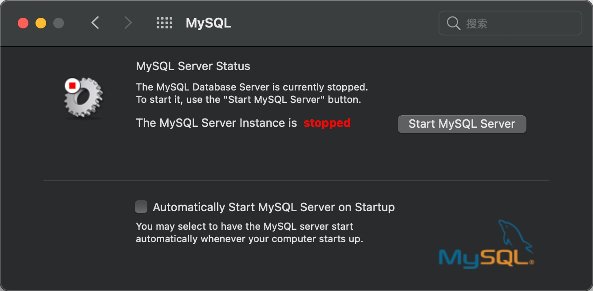

#### mysql 服务端的登录和退出

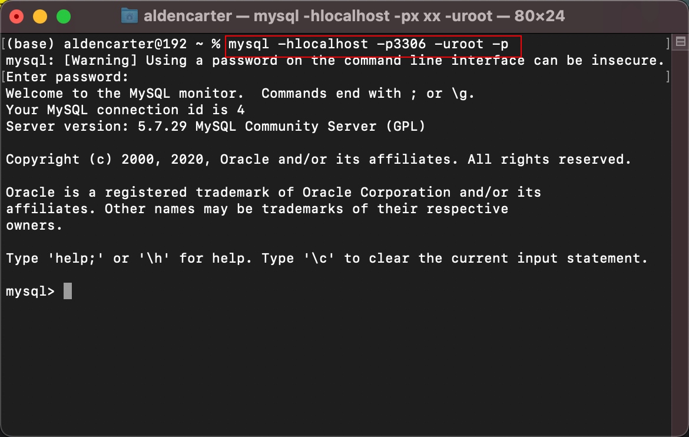

```shell
## 如果是连接远程的，需要输入地址和端口
mysql -hlocalhost -p3306 -uroot -p

## 如果是连接本地
mysql -uroot -p

## 退出
exit
```

#### mysql常见命令

- show databases; 显示所有的数据库
- use test; 使用test数据库
- show tables; 显示所有的表
- show tables form test1; 显示test1中所有表
- select database(); 查看当前在那个库
- select version(); 查看数据库版本（在登录之后）
- msyql --version 查看数据库版本（没有登录在终端，也可以是mysql -V）

#### mysql 的语法规范

- 不区分大小写，建议关键字大写，其他的表名、列名小写
- 每条命令使用分号结尾
- 每条命令根据需要，可以进行缩进或者换行
- 注释
    - 单行注释：## 注释文字
    - 多行注释：-- 注释文字
    - 多行注释：/* 注释文字 */

## DQL语言学习

DQL：Data Query Language 数据查询语言

### 练习的数据库介绍

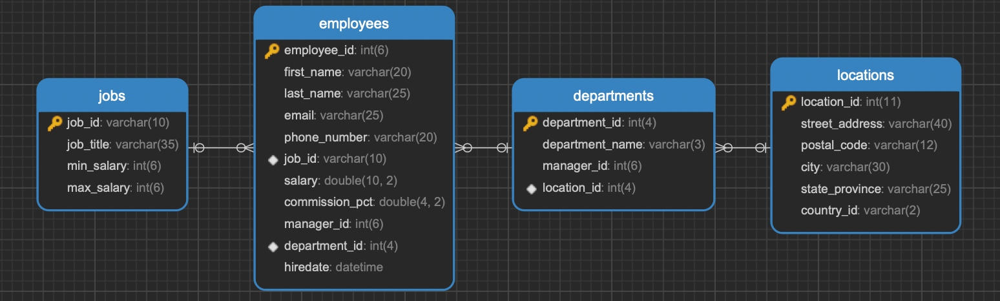

#### employees表

员工表

- 员工编号
- 名
- 姓
- 邮箱
- 电话号码
- 工种编号（职业类别）
- 月薪
- 奖金率
- 上级领导的员工编号
- 部门编号
- 入职日期

#### departments表

部门表

- 部门编号
- 部门名称
- 部门领导的员工编号
- 位置编号

#### locations表

位置表

- 位置编号
- 所属街道
- 邮编
- 城市
- 州/省
- 国家编号

#### jobs表

工种表

- 工种编号
- 工种名称
- 最低工资
- 最高工资

### 基础查询

#### 使用

```sql
/*
select  查询列表 from 表名;

特点：
1 查询列表可以是：表中的字段、常量值、表达式、函数
2 查询的结果是一个虚拟的表格
*/

use myemployees;

## 1. 查询单个字段
select last_name from employees;

## 2. 查询表中的多个字段
select last_name,salary,email from employees;

## 3. 查询表中的所有字段，可以写上所有的字段，也可以使用*
select * from employees;

## 4. 查询常量值 
select 100;
select 'john';

## 5. 查询表达式 
select 100*89;

## 6. 查询函数 
select VERSION(); ## 查询mysql版本

## 7. 起别名 
## 便于理解 
## 如果要查询的字段有重名的情况，使用别名可以区分
## 方式一 使用 as
select 100*89 as result;
select last_name as 姓,first_name as 名 from employees;
## 方式二 使用空格
select last_name 姓,first_name 名 from employees;
## 如果别名有空格等特殊符号，使用双引号
select last_name "out put" from employees;

## 8. 去重
## 案例：查询员工表中涉及到的所有的部门编号
select DISTINCT department_id from employees;

## 9. +号的作用，仅仅只有一个功能：运算符
select 100+90;
## 假如有其中一方是字符型，试图将字符型转换成数值型，如果转换成功，则继续做加法运算，如果转换失败，则将字符串型的数值转成0，继续做加法运算
select '22'+22;
select 'john'+22;
## 只要其中一方为null，则结果肯定为null
select null+10;
## 案例 查询员工名和姓连接成一个字段，并显示为 姓名
## + 号是将两边的操作数转变成数字之后在相加
select CONCAT(last_name,' ',first_name) as 姓名 from employees;
```

#### 练习

```sql
## 1. 下面的语句是否可以执行成功
SELECT last_name,job_id,salary AS sal FROM employees; ## 可以
## 2. 下面的语句是否可以执行成功
SELECT*FROM employees; ## 可以
## 3. 找出下面语句中的错误
SELECT employee_id,last_name,salary*12 AS "ANNUAL SALARY" FROM employees; 
## 4. 显示表 departments 的结构，并查询其中的全部数据
DESC departments; SELECT*FROM departments; 
## 5. 显示出表 employees 中的全部 job_id（不能重复）
SELECT DISTINCT job_id FROM employees; 
## 6. 显示出表 employees 的全部列，各个列之间用逗号连接，列头显示成 OUT_PUT
SELECT CONCAT(first_name,',',last_name,',',job_id) AS out_put FROM employees;
```

### 条件查询

#### 使用

```sql
## 条件查询
/*
语法：
select 查询列表 from 表名 where 筛选条件

筛选条件分类：
1. 按条件表达式筛选
	> < = !=(<>) <= >=
2. 按逻辑表达式筛选，用于连接条件表达式
	&& || ! and or not
3. 模糊查询
	like\between and\in\is null
*/

## 1. 按条件表达式筛选
## 案例1 查询工资>12000的员工信息
select * from employees where salary>12000;
## 案例2 查询部门编号不等于90号的员工名和部门编号
select last_name, department_id from employees where department_id<>90;

## 2. 按逻辑表达式筛选
## 案例1 查询工资在10000到20000之间的员工名、工资以及奖金
select last_name,salary,commission_pct from employees where salary>=10000 and salary<=20000;

## 案例2 查询部门编号不在90和110之间，或者 工资高于15000的员工信息
select * from employees where department_id<90 or department_id>110 or salary>15000;
select * from employees where not(department_id>=90 and department_id<=110) or salary>15000;

## 3. 模糊查询
## like 一般和通配符搭配使用
## % 任意多个字符，包含0个字符串
## _ 任意单个字符
## 案例1 查询员工名中包含字符a的员工信息
select * from employees where last_name like '%a%';
## 案例2 查询员工名中第三个字符为n，第五个字符为l的员工名和工资
select last_name, salary from employees where last_name like "__n_l%";
## 案例3 查询员工名中第二个字符为_的员工名
select last_name from employees where last_name like "_\_%"; ## \是转义
select last_name from employees where last_name like "_$_%" ESCAPE '$'; ## 表示 $是转义字符

## between and
## 使用between and 可以提高语句的简洁度
## 包含临界值
## 表示从...开始到...，不要调换顺序
## 案例1 查询员工编号在100 到120 之间的员工信息 
select * from employees where employee_id>=100 and employee_id<=120;
select * from employees where employee_id BETWEEN 100 and 120;

## in
## 用于去判断某字段的值是否属于in列表中的某一项
## 使用in提高语句简洁度
## in列表的值类型必须统一，或者是兼容
## in列表不支持通配符
## 案例 查询员工的工种编号是 IT_PROG、AD_VP、AD_PRES 中的一个员工名和工种编号
select last_name, job_id from employees where job_id="IT_PROG" or job_id="AD_VP" or job_id="AD_PRES";
select last_name,job_id from employees where job_id in("IT_PROG","AD_VP","AD_PRES");

## is null
## = 或者 <>不能判断null
## is null 或者 is not null 可以判断null
## 案例1 查询没有奖金的员工名和奖金率
select last_name,commission_pct from employees where commission_pct is null;
## 案例2 查询有奖金的员工名和奖金率
select last_name,commission_pct from employees where commission_pct is not null;

## 使用安全等于<=>
select last_name,commission_pct from employees where commission_pct <=> null;
## 案例 查询工资为120000的员工信息
select last_name,salary from employees where salary <=> 12000;

## is null vs <=>
## is null 仅仅可以判断null值，可读性较高
## <=> 既可以判断null值，又可以判断普通的数值，可读性较低

## 案例 查询员工号为176的员工的姓名和部门号和年薪
select last_name,department_id,salary*12*(1+ifnull(commission_pct,0)) as 年薪 from employees where employee_id=176;
```

#### 练习

```sql
## 查询没有奖金，且工资小于18000的salary和last_name
select salary,last_name from employees where commission_pct <=> null and salary<18000;
select salary,last_name from employees where commission_pct is null and salary<18000;

## 查询employees表中，job_id不为 IT 或者 工资为12000的员工信息
select * from employees where job_id <> "IT" or salary =12000;

## 查看部门departments表的结构
desc departments;

## 查询部门departments表中涉及到了那些位置编号
select distinct location_id from departments;
```

经典面试题：
请问：`select * from employees;`和`select * from employees where commission_pct like '%%' and last_name like '%%';`结果是否一样？

不一样，如果判断的字段有null值就不一样了。

如果是使用 or 连接所有的字段的话，就一样了，因为插入进表的行，总有一个字段是不为null的。

### 排序查询

#### 使用

```sql
/*
语法：
select 查询列表 from 表 [where 筛序条件] order by 排序列表 [asc|desc]

特点：
asc 代表是升序，desc代表是降序，如果不写，默认是升序
order by 子句中可以支持单个字段、多个字段、表达式、函数、别名
order by 子句一般是放在查询语句的最后，但limit子句除外
*/

## 案例1 查询员工信息，要求工资从高到低排序
select * from employees order by salary desc;
select * from employees order by salary asc;

## 案例2 查询部门编号>=90的员工信息，按入职时间先后排序
select * from employees where department_id >=90 ORDER BY hiredate;

## 案例3 按表达式排序，按年薪的高低显示员工的信息和年薪
select *,salary*12*(1+ifnull(commission_pct,0)) as 年薪 from employees order by salary*12*(1+ifnull(commission_pct,0)) desc;
select *,salary*12*(1+ifnull(commission_pct,0)) as 年薪 from employees order by 年薪 desc;

## 案例5 按姓名的长度显示员工的姓名和工资[按函数排序]
select LENGTH(last_name) 字节长度, last_name,salary from employees ORDER BY LENGTH(last_name) desc;

## 案例6 查询员工信息，要求先按工资排序[升序]，再按员工编号排序[降序]【按多个字段排序】
select * from employees ORDER BY salary asc, employee_id desc;
```

#### 练习

```sql
## 查询员工的姓名和部门号和年薪，按年薪降序，按姓名升序
select last_name,department_id,(salary*12*(1+IFNULL(commission_pct,0))) as 年薪 from employees ORDER BY 年薪 desc, last_name asc;

## 选择工资不在8000到17000的员工的姓名和工资，按工资降序
select last_name,salary from employees where salary<8000 or salary>17000 ORDER BY salary desc;
select last_name,salary from employees where salary not BETWEEN 8000 and 17000 ORDER BY salary desc;

## 查询邮箱中包含e的员工信息，并先按邮箱的字节数降序，再按部门号升序
select * from employees WHERE email like "%e%" ORDER BY LENGTH(email) desc, department_id asc;
```

### 常见函数

#### 使用

```sql
/*
常见函数

概念：类似于Java的方法，将一组逻辑语句封装在方法体中，对外暴露方法名
好处：1、因此了实现细节 2、提高了代码的重用性

调用：select 函数名(实参列表) [from 表];
特点：
1、叫什么（函数名）
2、干什么（函数功能）
分类：
1、单行函数，比如 concat、length、ifnull等
	字符函数
	数学函数
	日期函数
	其他函数
	流程控制函数
2、分组函数，功能做统计使用，又称为统计函数、聚合函数、组函数
*/

## 字符函数
## LENGTH(str)
select LENGTH('john');
select LENGTH('张三丰hhh');

SHOW VARIABLES LIKE '%char%';## 查看当前数据库使用的字符集

## CONCAT(str1,str2,...) 拼接字符串
select CONCAT(last_name,'_',first_name) FROM employees;

## UPPER(str)、LOWER(str)
SELECT UPPER('john');
SELECT LOWER('JOHN');
## 案例 将姓变成大写，名变成小写，然后拼接
SELECT CONCAT(UPPER(last_name),'_',LOWER(first_name)) FROM employees;

## SUBSTR(str FROM pos FOR len)
## 注意：索引从1开始
## 截取从指定索引处后面的所有字符
SELECT SUBSTR('李莫愁爱上了陆展元',7) out_put; ## 陆展元
## 截取从指定索引位置处指定长度的字符
select SUBSTR('李莫愁爱上了陆展元',1,3) out_put; ## 李莫愁

## 案例 姓名汇总首字符大写，其他字符小写，然后用下划线拼接
SELECT CONCAT(UPPER(SUBSTR(last_name,1,1)),"_",LOWER(SUBSTR(last_name,2))) from employees;

## INSTR(str,substr) 返回子串在大的字符串中的第一次出现的索引值，如果不存在返回0
SELECT INSTR('杨不悔爱上了殷六侠','殷六侠') as out_put;

## TRIM([remstr FROM] str)
SELECT TRIM('    张翠山   ') as out_put;
SELECT TRIM('a' FROM 'aaaaaaaa张aaaaaa翠aaaaaa山aaaaaaaa') as out_put; ## 张aaaaaa翠aaaaaa山

## LPAD(str,len,padstr)
## 用指定的字符左填充指定的长度，10表示总长度 如果字符串长度超过指定的总长度，就会截取
SELECT LPAD('殷素素',10,'*') as out_put;

## RPAD(str,len,padstr)
## 用指定的字符左填充指定的长度，10表示总长度 如果字符串长度超过指定的总长度，就会截取
SELECT RPAD('殷素素',10,'*') as out_put;

## REPLACE(str,from_str,to_str)
SELECT REPLACE('张无忌爱上了周芷若周芷若周芷若周芷若','周芷若','赵敏');

## 数学函数

## ROUND(X) 四舍五入
SELECT ROUND(1.65);## 2
SELECT ROUND(1.45);## 1
SELECT ROUND(-1.65);## -2
SELECT ROUND(-1.45);## -1
SELECT ROUND(1.567,2)## 小数点后保留2位 1.57

## ceil 向上取整 返回大于等于该参数的最小整数
SELECT CEIL(1.0003); ## 2
SELECT CEIL(1.000); ## 1
SELECT CEIL(-1.0003); ## -1

## FLOOR(X) 向下取整，返回小于等于该参数的最大整数
SELECT FLOOR(-9.99); ## -10

## TRUNCATE(X,D) 截断 小数点后保留几位
SELECT TRUNCATE(1.65444444,1);

## MOD(N,M) 取余
## MOD(N,M) N-N/M*M
SELECT MOD(10,3);## 1
SELECT 10%3;## 1
SELECT MOD(-10,3);## -1
SELECT MOD(10,-3);## 1
SELECT MOD(-10,-3);## -1


## 日期函数

## NOW() 返回当前系统日期+时间
SELECT NOW();
## CURDATE() 返回当前系统日期，不包含时间
SELECT CURDATE();
## 返回当前的时间，不包含日期
SELECT CURTIME();

## 可以获取指定的部分 年、月、日、小时、分钟、秒
SELECT YEAR(NOW());
SELECT YEAR('1998-1-1');
SELECT YEAR(hiredate) from employees;
SELECT MONTH(NOW());## 11
SELECT MONTHNAME(NOW());## November

## STR_TO_DATE(str,format) 将日期格式的字符转换成指定格式的日期
SELECT STR_TO_DATE('1998-3-2','%Y-%c-%d') as out_put;
## 查询入职日期为1992-4-3的员工信息
SELECT * from employees where hiredate = STR_TO_DATE('4-3 1992','%c-%d %Y');

## DATE_FORMAT(date,format) 将日期转换成字符
SELECT DATE_FORMAT(NOW(),'%Y年%m月%d日') as out_put;

## 查询有奖金的员工名和入职日期（xx月/xx日 xx年）
SELECT last_name,DATE_FORMAT(hiredate,'%m月 %d日 %y年') 入职日期 from employees where commission_pct <=> NULL;

## 其他函数
SELECT VERSION();
SELECT DATABASE();
SELECT USER();

## 流程控制函数
## if 函数，if else 的效果
SELECT IF(10>5,'大','小');
SELECT last_name,commission_pct, IF(commission_pct is NULL,'没奖金','有奖金') from employees;

## case 函数的使用一：switch case的效果
/*
case 要判断的字段或表达式
when 常量值1 then 要显示的值1或语句1;
when 常量值2 then 要显示的值1或语句2;
...
else 要显示的值或语句n;
end
*/

/*
案例 查询员工的工资，要求
部门号=30 显示的工资为1.1倍
部门号=40 显示的工资为1.2倍
部门号=50 显示的工资为1.3倍
其他部门 显示的工资为原工资
*/
SELECT salary 原始工资,department_id,
CASE department_id
WHEN 30 THEN salary*1.1
WHEN 40 THEN salary*1.2
WHEN 50 THEN salary*1.3
ELSE salary
END as 新工资
from employees;

## case 函数的使用二 类似于多重if
/*
CASE
WHEN 条件1 then 要显示的值1或者语句1
WHEN 条件2 then 要显示的值1或者语句2
WHEN 条件3 then 要显示的值1或者语句3
ELSE 要显示的值n或语句n
END
*/
/*
案例 查询员工的工资的情况
如果工资>20000 显示A级别
如果工资>15000 显示B级别
如果工资>10000 显示C级别
否则，显示D级别
*/
SELECT salary,
CASE 
	WHEN salary>20000 THEN 'A'
	WHEN salary>15000 THEN 'B'
	WHEN salary>10000 THEN 'C'
	ELSE 'D'
		
END as 工资级别
FROM employees;
```

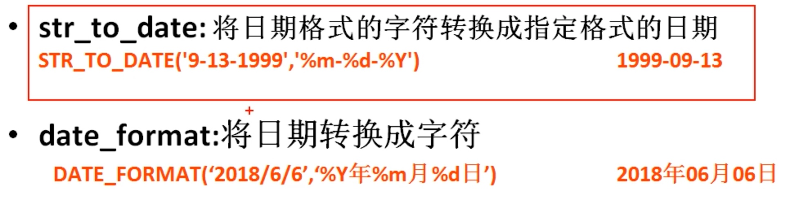

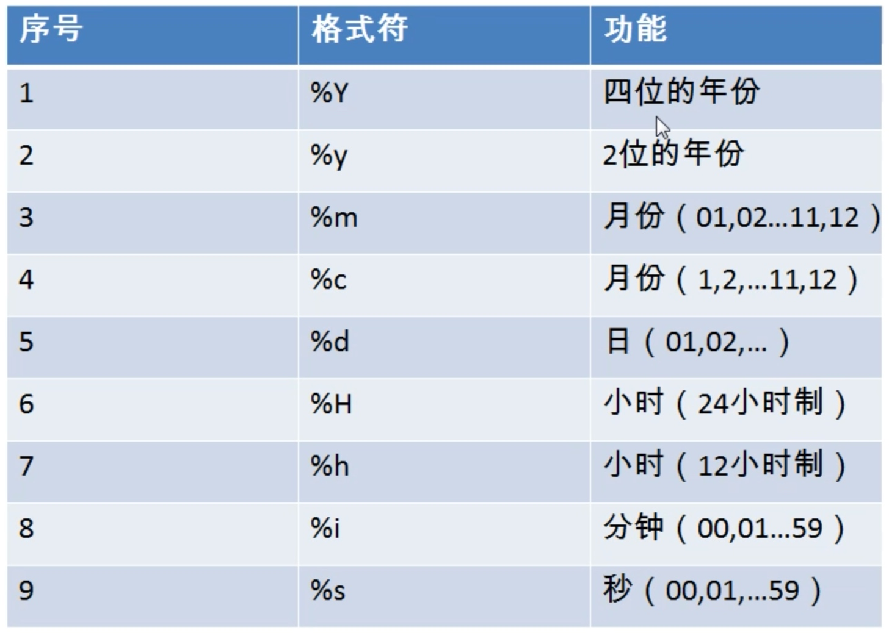

#### 练习

```sql
## 显示系统时间
SELECT NOW();

## 查询员工号，姓名，工资，以及工资提高百分之20%后的结果
SELECT employee_id,last_name,salary,salary*(1+0.2) as 'new salary' FROM employees;

## 将员工的姓名按首字母排序，并写出姓名的长度
SELECT LENGTH(last_name),last_name from employees ORDER BY SUBSTR(last_name,1,1);

## 做一个查询产生下面的结果
SELECT CONCAT(last_name,' earns ',TRUNCATE(salary,0),' monthly but wants ',TRUNCATE(salary*3,0)) FROM employees;

## 使用case-when，按照下面的条件
SELECT job_id,
CASE job_id
	WHEN 'AD_PRES' THEN 'A'
	WHEN 'ST_MAN' THEN 'B'
	WHEN 'IT_PROG' THEN 'C'
	ELSE 'D'
END AS grade FROM employees;
```

### 分组函数

#### 使用

这里的分组函数不是之后的group by 而是一些max min sum count avg

```sql
/*
功能：用作统计使用，又称为聚合函数或者统计函数或组函数

分类
	sum
	avg
	max
	min
	count
特点：
1、sum、avg一般用于处理数值型
	max min count 可以处理任何类型
2、是否忽略null值？
	都忽略null，也就是计算的时候不让null参与计算
3、可以和distinct搭配实现去重
4、count一般用作统计行数
5、和分组函数一同查询的字段要求是group by后的字段
*/

## 1 简单使用
SELECT SUM(salary) from employees;
SELECT AVG(salary) from employees;
SELECT MIN(salary) FROM employees;
SELECT MAX(salary) FROM employees;
SELECT COUNT(salary) FROM employees;

SELECT SUM(salary), AVG(salary) from employees;

## 2 参数支持哪些类型
## SELECT SUM(last_name) ,AVG(last_name) from employees; 不支持，数值型
## SELECT max(last_name),MIN(last_name) from employees; 支持
## SELECT max(hiredate),MIN(hiredate) FROM employees; 支持
## SELECT COUNT(last_name) FROM employees 支持
SELECT count(commission_pct) FROM employees; ## 如果出现为null的，只能计算不为Null的值

## 4 和distinct搭配
SELECT SUM(DISTINCT salary),SUM(salary) FROM employees;

## 5 count函数的详细介绍
select count(salary) from employees;

SELECT count(*) from employees;

SELECT count(1) FROM employees;## 如果是给常量字符串等也是表示统计总行数，也就是表示在每一行上加上一个这个值
## 效率的问题：
## 之前是这个MYISAM存储引擎 使用count(*)效率最高，因为里面有一个内置的计数器
## 现在是INNODB这个引擎 经过测试count(*) 和 count(1) 效率差不多，比count(字段)要高一些，因为要多判断一次是否为null

## 6 和分组函数一同查询的字段有限制
## SELECT AVG(salary),employee_id FROM employees;一般不这么操作，因为返回只有一行
````

#### 练习

```sql
## 查询公司员工工资的最大值，最小值，平均值，总和
SELECT MAX(salary),MIN(salary),AVG(salary),SUM(salary) FROM employees;

## 查询员工表中的最大入职时间和最小入职时间的相差天数
SELECT DATEDIFF(MAX(hiredate),MIN(hiredate)) from employees;

## 查询部门编号为90的员工个数
SELECT count(*) from employees WHERE department_id = 90;
```

### 分组查询

#### 使用

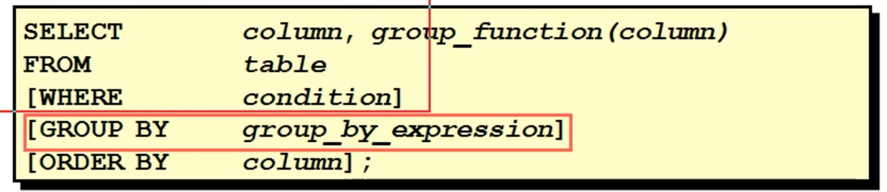

```sql
/**
分组查询 group by

语法：
select 分组函数,列（要求出现在group by的后面）
from 表
[where 筛选条件]
GROUP BY 分组的列表
[ORDER BY 子句]

注意：
	查询列表必须特殊，要求是分组函数和group by后出现的字段
特点：
1、分组查询中的筛选条件分为两类：
								数据源					位置							连接的关键字
分组前筛选				原始表					GROUP BY前面			WHERE
分组后筛选				分组后的结果集		GROUP BY后面			HAVING

分组函数做条件肯定是放在having子句中
能用分组前筛选的，优先考虑使用分组前筛选

2、GROUP BY 子句支持单个字段分组，多个字段分组（多个字段之间使用,分开，没有顺序要求），表达式或者函数
3、也可以添加排序（排序放在整个分组的最后）
*/

## 查询每个部门的平均工资
SELECT AVG(salary) FROM employees GROUP BY department_id;

## 案例1 查询每个工种的最高工资
SELECT MAX(salary),job_id FROM employees GROUP BY job_id;

## 案例2 查询每个位置上的部门个数
SELECT count(*),location_id from departments GROUP BY location_id;

## 添加筛选条件
## 案例1 查询邮箱中包含a字符的，每个部门的平均工资
SELECT AVG(salary),department_id FROM employees WHERE email like '%a%' GROUP BY department_id;

## 案例2 查询有奖金的每个领导手下员工的最高工资
SELECT MAX(salary),manager_id from employees WHERE commission_pct is not null GROUP BY manager_id;

## 添加复杂的筛选条件 分组后在进行条件判定
## 案例1 查询那个部门的员工个数>2
## 1、查询每个部门的员工个数
## 2、根据第一个结果进行筛选，查询那个部门的员工个数>2
SELECT COUNT(*),department_id FROM employees GROUP BY department_id HAVING COUNT(*)>2;

## 案例2 查询每个工种有奖金的员工的最高工资>12000的工种编号和最高工资
## 查询每个工种有奖金的员工的最高工资
SELECT MAX(salary),job_id FROM employees GROUP BY job_id;
SELECT MAX(salary),job_id FROM employees WHERE commission_pct is not null GROUP BY job_id HAVING MAX(salary)> 12000;

## 案例3 查询领导编号>102的每个领导手下的员工最低工资>5000的领导编号是哪个，以及其最低工资
## 1 查询每个领导手下的员工最低工资
SELECT MIN(salary),manager_id from employees GROUP BY manager_id;
## 2 添加筛选条件：编号>102 ### 原表就有，所以放在where 后面
SELECT MIN(salary),manager_id from employees WHERE manager_id>102 GROUP BY manager_id;
## 3 添加筛选条件：最低工资>5000 ### 原表没有，所有使用having
SELECT manager_id,MIN(salary) FROM employees WHERE manager_id > 102 GROUP BY manager_id HAVING MIN(salary)>5000;

## 按表达式或者函数分组

## 案例 按员工姓名的长度分组，查询每一组的员工个数，筛选员工个数>5的有哪些
SELECT COUNT(*),LENGTH(last_name) FROM employees GROUP BY LENGTH(last_name) HAVING COUNT(*) > 5;

## 按多个字段进行分组
## 案例：查询每个部门每个工种的员工的平均工资
SELECT AVG(salary),department_id,job_id from employees GROUP BY department_id,job_id;

## 添加排序
## 案例：查询每个部门每个工种的员工的平均工资，并且按平均工资的高低显示出来
SELECT AVG(salary),department_id,job_id from employees GROUP BY department_id,job_id ORDER BY AVG(salary) desc;
```

#### 练习

```sql
## 查询各个job_id的员工工资的最大值、最小值、平均值、总和，并按job_id升序
SELECT MAX(salary),MIN(salary),AVG(salary),SUM(salary),job_id from employees GROUP BY job_id ORDER BY job_id asc;

## 查询员工最高工资和最低工资的差距
SELECT MAX(salary)-MIN(salary) DIFFERENCE FROM employees;

## 查询各个管理者手下员工的最低工资，其中最低工资不能低于6000，没有管理者的员工不计算在内
SELECT MIN(salary),manager_id from employees WHERE manager_id is not null GROUP BY manager_id HAVING MIN(salary)>=6000; 

## 查询所有部门的编号，员工数量和工资平均值，并按平均工资降序
SELECT department_id,count(*),AVG(salary) FROM employees GROUP BY department_id ORDER BY AVG(salary) desc;

## 选择具有各个job_id的员工人数
SELECT count(*),job_id from employees GROUP BY job_id;
```
### 连接查询

#### 使用

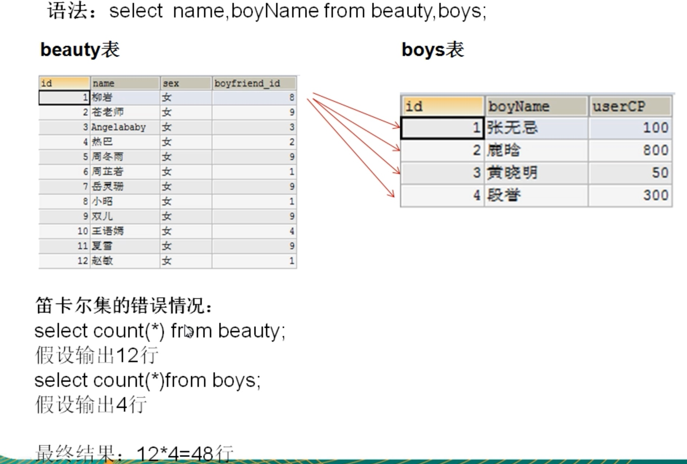

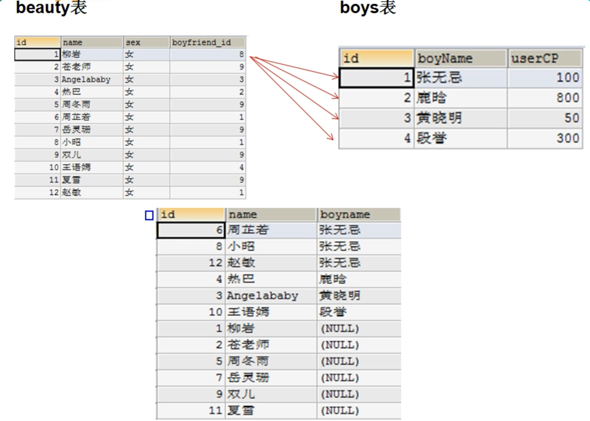

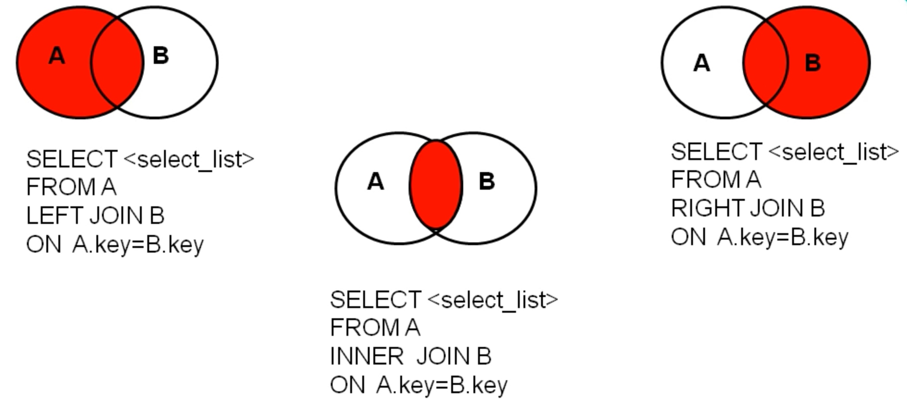

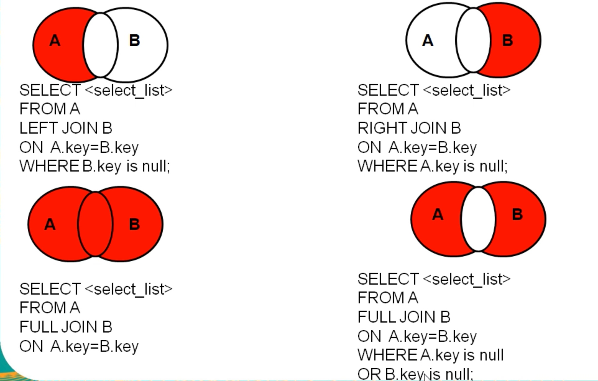

```sql
/*
进阶6 连接查询
含义：又称为多表查询，当查询的字段来自于多个表时，就会用到连接查询

笛卡尔乘积：表1 有m行，表2 有n行，结果=m*n行
发生原因：没有有效的连接条件
如何避免：添加上有效的连接条件

分类：
	按年代分类：
		sql92标准：仅仅支持内连接
		sql99标准「推荐」：「mysql」支持内连接+外连接（左外和右外）+交叉连接
	按功能分类：
		内连接
			等值连接
			非等值连接
			自连接
		外连接
			左外连接
			右外连接
			全外连接
		交叉连接

*/

SELECT `name`,boyName FROM boys,beauty;

SELECT `name`,boyName FROM boys,beauty WHERE beauty.boyfriend_id=boys.id;

## 一、sql92标准
## 1、 等值连接
/*
1 多表等值连接的结果为多表的交集部分
2 n表连接，至少需要n-1个连接条件
3 多表的顺序没有要求
4 一般需要为表起别名
5 可以搭配前面介绍的所有子句使用，比如排序、分组、筛选
*/
## 案例1 查询女神名对应的男神名
SELECT `name`,boyName FROM boys,beauty WHERE beauty.boyfriend_id=boys.id;

use myemployees;

## 案例2 查询员工名和对应的部门名
SELECT employees.last_name,departments.department_name from employees,departments WHERE employees.department_id=departments.department_id;

## 2、为表起别名
## 提高语句的简洁度
## 区分多个重名的字段
## 如果为表起了别名，则查询的字段就不能使用原来的表名去限定

## 查询员工名、工种号、工种名
SELECT e.last_name,e.job_id,j.job_title from employees as e,jobs as j WHERE e.job_id=j.job_id;

## 3、两个表格顺序是否可以调换？可以

#4、可以加筛选吗？
## 案例：查询有奖金的员工名、部门名
select employees.last_name,departments.department_name,employees.commission_pct from employees,departments WHERE employees.department_id=departments.department_id and commission_pct is not null;
#案例2：查询城市名中第二个字符为o的部门名和城市名
SELECT departments.department_name,locations.city from departments,locations WHERE departments.location_id=locations.location_id and UPPER(SUBSTR(locations.city,2,1))='O';

## 5、可以加分组吗？
## 案例1 查询每个城市的部门个数
SELECT count(*),locations.city from locations,departments WHERE locations.location_id=departments.location_id GROUP BY locations.location_id;
## 案例2 查询出有奖金的每个部门的部门名和部门的领导编号和该部门的最低工资
SELECT departments.department_name,departments.manager_id,MIN(employees.salary) FROM departments,employees WHERE departments.department_id=employees.department_id 
and employees.commission_pct is not null GROUP BY departments.department_id;
SELECT departments.department_name,departments.manager_id,MIN(employees.salary) FROM departments,employees WHERE departments.department_id=employees.department_id 
and employees.commission_pct is not null GROUP BY departments.department_name,departments.manager_id;

## 6、可以加排序
## 案例：查询每个工种的工种名和员工的个数，并且按员工的个数降序
SELECT jobs.job_title,count(*) FROM jobs,employees WHERE jobs.job_id=employees.job_id GROUP BY jobs.job_id ORDER BY COUNT(*) desc;

## 7、可以实现三表连接？

## 案例：查询员工名、部门名和所在的城市
SELECT employees.last_name,departments.department_name,locations.city from employees,departments,locations WHERE employees.department_id=departments.department_id and departments.location_id = locations.location_id;

## 2、非等值连接

#案例1 查询员工的工资和工资级别
SELECT employees.salary,job_grades.grade_level from employees,job_grades WHERE employees.salary BETWEEN job_grades.lowest_sal AND job_grades.highest_sal;

## 3、自连接
## 案例：查询员工名和上级的名字
SELECT e.last_name,m.last_name FROM employees e,employees m WHERE e.manager_id =m.employee_id;

## 二、sql99语法
/*

语法：
	select 查询列表
	from 表1 别名 
	[连接类型] join 表2 别名 on 连接条件
	[where 筛选条件]
	[GROUP BY 分组]
	[HAVING 筛选条件]
	[ORDER BY 排序列表]
内连接	inner
外连接
	左外 left [outer]
	右外 right [outer]
	全外 full [outer] (msyql不支持)
交叉连接	cross

*/

## 一、内连接
/*
SELECT 查询列表
from 表1 别名
INNER JOIN 表2 别名
on 连接条件

分类：
等值
非等值
自连接

*/

## 1 等值连接
## 案例1 查询员工名、部门名（调换位置）
SELECT employees.last_name,departments.department_name
FROM employees INNER JOIN departments on employees.department_id=departments.department_id;
## 案例2 查询名字中包含e的员工名和工种名（筛选）
SELECT employees.last_name,jobs.job_title
FROM employees INNER JOIN jobs on employees.job_id=jobs.job_id
WHERE employees.last_name LIKE "%e%";
## 案例3 查询部门个数>3的城市名和部门个数（分组+筛选）
SELECT locations.city,count(*)
FROM locations INNER JOIN departments on locations.location_id = departments.location_id
GROUP BY locations.location_id HAVING COUNT(*)>3;
## 案例4 查询那个部门的部门员工个数>3的部门名和员工个数，并按个数降序（排序）
SELECT departments.department_name,COUNT(*)
FROM departments INNER JOIN employees ON departments.department_id=employees.department_id
GROUP BY departments.department_id HAVING COUNT(*)>3
ORDER BY COUNT(*) desc;
## 案例5 查询员工名、部门名、工种名，并按部门名降序
SELECT employees.last_name,departments.department_name,jobs.job_title
FROM employees INNER JOIN departments ON employees.department_id= departments.department_id
INNER JOIN jobs ON employees.job_id=jobs.job_id
ORDER BY departments.department_name desc;

## 二、非等值连接
#查询员工的工资级别
SELECT employees.last_name,job_grades.grade_level
FROM employees INNER JOIN job_grades ON employees.salary 
BETWEEN job_grades.lowest_sal AND job_grades.highest_sal;

## 查询每个工资级别的个数>20个，并且按工资级别降序排序
SELECT COUNT(*),job_grades.grade_level
FROM employees INNER JOIN job_grades ON employees.salary 
BETWEEN job_grades.lowest_sal AND job_grades.highest_sal
GROUP BY job_grades.grade_level
HAVING COUNT(*)>20
ORDER BY job_grades.grade_level desc;

## 三、自连接
#查询员工的名字、上级的名字
SELECT e.last_name,m.last_name
FROM employees e INNER JOIN employees m ON e.manager_id =m.employee_id;

#查询姓名中包含字符k的员工的名字、上级的名字
SELECT e.last_name,m.last_name
FROM employees e INNER JOIN employees m ON e.manager_id =m.employee_id
WHERE e.last_name LIKE '%k%';

## 二、外连接
/*
应用场景：用于查询一个表中有，另一个表没有的记录
特点：
	1、外连接的查询结果为主表中的所有记录，如果从表中有和他匹配的，则显示匹配的值；如果从表中没有和他匹配的，则显示null
		外连接的查询结果=内连接结果+主表中有而从表中没有记录
	2、左外连接中，left 左边的是主表
		右外连接中，right 右边的是主表
	3、左外和右外交换两个表的顺序，可以实现同样的效果
	4、全外连接=内连接的结果+表1中有但表2中没有的+表2中有但是表1中没有的
*/
## 引入：查询没有男朋友的女神名
USE girls;

SELECT beauty.`name`,boys.*
FROM beauty LEFT OUTER JOIN boys ON beauty.boyfriend_id =boys.id;

SELECT beauty.`name`,boys.*
FROM beauty LEFT OUTER JOIN boys ON beauty.boyfriend_id =boys.id
WHERE boys.id is null;

## 案例1 查询哪个部门没有员工
## 左外
USE myemployees;
SELECT departments.*
FROM departments LEFT JOIN employees ON departments.department_id = employees.department_id
WHERE employees.employee_id is null;
## 右外
SELECT departments.*
FROM employees RIGHT JOIN departments ON departments.department_id = employees.department_id
WHERE employees.employee_id is null;

## 交叉连接，笛卡尔乘积
USE girls;
SELECT beauty.*,boys.*
FROM beauty CROSS JOIN boys;

## sql92 vs sql99
/*
功能：sql99支持的较多
可读性：sql99实现连接条件和筛选条件的分离，可读性比较高
*/
```

#### 练习

```sql
## 显示员工表的最大工资，工资平均值
SELECT MAX(salary),AVG(salary) FROM employees;

## 查询员工表的employee_id,job_id,last_name，按department_id降序，salary升序
SELECT employee_id,job_id,last_name FROM employees ORDER BY department_id desc,salary asc;

## 查询员工表的job_id中包含a 和 e的，并且a在e的前面
SELECT job_id from employees WHERE job_id LIKE '%a%e%';

## 显示当前日期，以及去除前后空格，截取子字符串的函数
SELECT NOW();
SELECT TRIM("    还在那高三     ");
SELECT SUBSTR("2223の日丰富的非典型",1,4);

## 显示所有员工的姓名、部门号和部门名称
SELECT employees.last_name,employees.department_id,departments.department_name FROM employees,departments 
WHERE employees.department_id=departments.department_id;

## 查询90号部门员工的job_id和90号部门的location_id
SELECT employees.job_id,locations.location_id FROM employees,departments,locations 
WHERE employees.department_id=departments.department_id and departments.location_id=locations.location_id 
and departments.department_id=90;

## 选择所有有奖金的员工的last_name,department_name,location_id,city
SELECT employees.last_name,departments.department_name,locations.location_id,locations.city FROM employees,departments,locations
WHERE employees.department_id=departments.department_id and departments.location_id=locations.location_id
AND employees.commission_pct is not null;

## 选择city在 Toronto 工作的员工的last_name,job_id,department_id,department_name
SELECT employees.last_name,employees.job_id,departments.department_id,departments.department_name
FROM employees,departments,locations
WHERE employees.department_id=departments.department_id
AND departments.location_id=locations.location_id
AND locations.city='Toronto';

## 查询每个工种、每个部门的部门名、工种名和最低工资
SELECT departments.department_name,jobs.job_title,MIN(salary)
FROM departments,jobs,employees
WHERE departments.department_id=employees.department_id
AND employees.job_id=jobs.job_id
GROUP BY jobs.job_id,departments.department_id;

## 查询每个国家下的部门个数大于2的国家编号
SELECT locations.country_id 
FROM locations,departments
WHERE locations.location_id =departments.location_id
GROUP BY locations.country_id
HAVING COUNT(departments.department_id)>2;

## 选择指定员工的姓名、员工号，以及他的管理者的姓名和员工号
SELECT CONCAT(e.last_name," ",e.employee_id),m.last_name as "Emp\#",m.employee_id as "manager Mrg\#"
FROM employees e,employees m
WHERE e.manager_id=m.employee_id;

## 查询编号>3个女神的男朋友信息，如果有则列出详细，如果没有，用null填充
SELECT beauty.*,boys.*
FROM beauty LEFT JOIN boys ON beauty.boyfriend_id = boys.id
WHERE beauty.id>3;

## 查询哪个城市没有部门
SELECT locations.*
FROM locations LEFT JOIN departments ON locations.location_id=departments.department_id
WHERE departments.department_id is null;

## 查询部门名为SAL或IT的员工信息
SELECT employees.*
FROM employees INNER JOIN departments ON employees.department_id=departments.department_id
WHERE departments.department_name= 'SAL' OR departments.department_name ="IT";
```

### 子查询

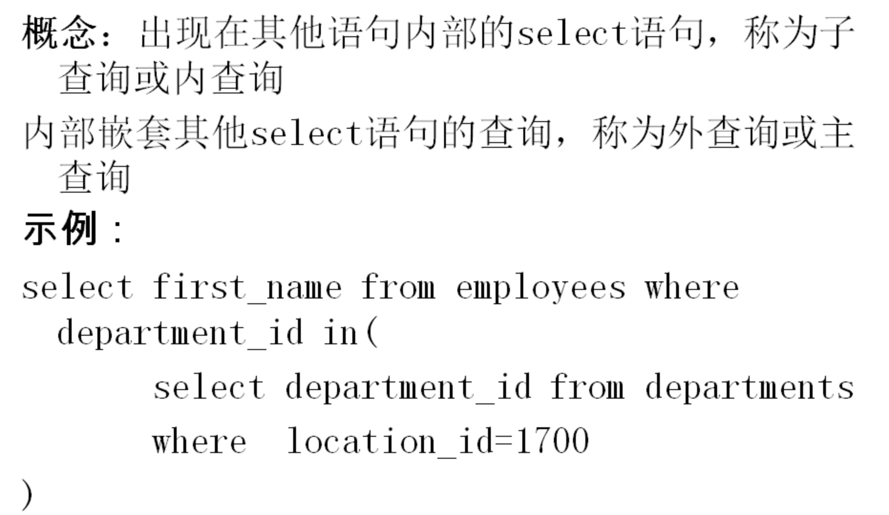

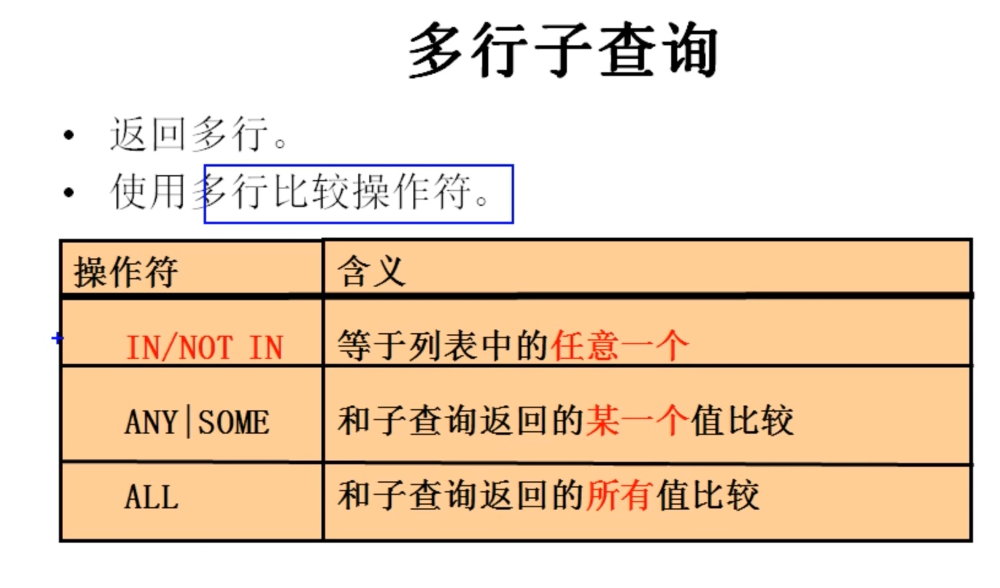

```sql
/*
进阶7 子查询

含义：出现在其他语句中的select语句，称为子查询或者内查询
外部的查询语句，称为主查询或者外查询

分类：
按子查询出现的位置：
	select后面
		仅仅支持标量子查询
	from后面
		表子查询
	where或having后面 ⭐
		标量子查询	✅ （单行）
		列子查询	✅	（多行）
		行子查询
	exists后面（相关子查询）
		表子查询
按结果集的行列数
	标量子查询（结果集只有一行一列）
	列子查询（结果集只有一列多行）
	行子查询（结果集只有一行多列）
	表子查询（结果集随便，一般为多行多列）
*/

## 一、where或者having后面
## 1、标量子查询（单行子查询）
## 2、列子查询（多行子查询）
## 3、行子查询（一行多列）
-- 特点：
-- 	1、子查询放在小括号内
-- 	2、子查询一般放在条件的右侧
-- 	3、标量子查询，一般搭配着单行操作符使用
-- 		> < >= <= = <>
-- 	4、列子查询，一般搭配着多行操作符使用
-- 		in any/some all
--  5、子查询的执行优先于主查询查询，主查询的条件用到了子查询的结果
-- 1、标量子查询
-- 案例1 谁的工资比 Abel 高？
-- 查询Abel的工资
SELECT salary FROM employees
WHERE last_name = 'Abel'
-- 查询员工的信息，满足salary>上面的结果
SELECT * FROM employees 
WHERE salary>(SELECT salary FROM employees
WHERE last_name = 'Abel');

-- 案例2 返回job_id与141号员工相同，salary 比143号员工多的员工姓名、job_id和工资
-- 查询141号员工的job_id
SELECT job_id FROM employees
WHERE employee_id=141
-- 查询143号员工的salary
SELECT salary FROM employees
WHERE employee_id=143
-- 总查询
SELECT employees.last_name,employees.job_id,employees.salary FROM employees
WHERE employees.job_id = (SELECT job_id FROM employees
WHERE employee_id=141)
AND employees.salary>(SELECT salary FROM employees
WHERE employee_id=143)

-- 案例3 返回公司工资最小的员工的last_name,job_id和salary
-- 查询最少工资
SELECT MIN(salary) FROM employees
-- 总查询
SELECT last_name,job_id,salary FROM employees
WHERE salary=(SELECT MIN(salary) FROM employees);

-- 案例4 查询最低工资大于50号部门最低工资的部门ID和其最低工资
-- 查询50号部门的最低工资
SELECT MIN(salary) FROM employees,departments WHERE employees.department_id=departments.department_id AND departments.department_id=50
-- 总查询
SELECT departments.department_id,MIN(salary) FROM employees,departments
WHERE employees.department_id = departments.department_id
GROUP BY employees.department_id 
HAVING MIN(salary)>(SELECT MIN(salary) FROM employees,departments WHERE employees.department_id=departments.department_id AND departments.department_id=50);

-- 2、列子查询（多行子查询）
## 案例1 返回location_id是1400或1700的部门中的所有员工姓名
-- 查询location_id是1400或1700的部门编号
SELECT DISTINCT department_id FROM departments WHERE departments.location_id in (1400,1700)
-- 查询员工姓名是部门编号是上面的结果
SELECT employees.last_name FROM employees WHERE employees.department_id in (SELECT department_id FROM departments WHERE departments.location_id in (1400,1700));

-- 案例2 返回其他工种中比job_id为'IT_PROG'工种任一工资低的员工的员工号、姓名、job_id以及salary
-- 查询job_id为'IT_PROG'工种任一工资
SELECT DISTINCT employees.salary FROM employees WHERE employees.job_id = 'IT_PROG'
-- 总查询
SELECT employees.employee_id,employees.last_name,employees.job_id,employees.salary FROM employees
WHERE employees.job_id != 'IT_PROG' 
AND employees.salary < ANY(SELECT employees.salary FROM employees WHERE employees.job_id = 'IT_PROG');
#或者
SELECT employees.employee_id,employees.last_name,employees.job_id,employees.salary FROM employees
WHERE employees.job_id != 'IT_PROG' 
AND employees.salary < (SELECT MAX(employees.salary) FROM employees WHERE employees.job_id = 'IT_PROG');

-- 案例3 返回其他工种中比job_id为"IT_PROG"工种所有工资都低的员工的员工号、姓名、job_id以及salary
SELECT employees.employee_id,employees.last_name,employees.job_id,employees.salary FROM employees
WHERE employees.job_id != 'IT_PROG' 
AND employees.salary < (SELECT MIN(employees.salary) FROM employees WHERE employees.job_id = 'IT_PROG');

-- 3、行子查询（结果集一行多列或者多行多列）【用得较少】
-- 案例：查询员工编号最小并且工资最高的员工信息

-- 行子查询
SELECT * FROM employees
WHERE (employees.employee_id,employees.salary)=(
	SELECT MIN(employees.employee_id),MAX(employees.salary) FROM employees
)
-- 等同于：
-- 查询员工编号最小
SELECT MIN(employees.employee_id) FROM employees
-- 查询最高工资
SELECT MAX(employees.salary) FROM employees
-- 查询员工信息
SELECT * FROM employees
WHERE employees.employee_id=(
SELECT MIN(employees.employee_id) FROM employees
) AND employees.salary=(
SELECT MAX(employees.salary) FROM employees
)

-- 二、放在select后面
-- 仅仅支持标量子查询（一行一列）
-- 案例：查询每个部门的员工个数[部门表是主表，如果部门中没有员工，就应该显示0]
-- 应该是部门中的所有字段+员工个数
SELECT departments.*,(
	SELECT COUNT(*) FROM employees
	WHERE employees.department_id=departments.department_id
) FROM departments;


-- 案例2 查询员工号=102的部门名
SELECT (
SELECT departments.department_name FROM departments WHERE departments.department_id=employees.department_id
) as 部门名 FROM employees WHERE employees.employee_id=102;

-- 三、from后面
-- 将子查询结果充当一张表
## 案例：查询每个部门的平均工资的工资等级
-- 查询每个部门的平均工资
SELECT department_id,AVG(salary) FROM employees GROUP BY department_id
-- 总查询
SELECT e.department_id, e.a, job_grades.* FROM (
	SELECT department_id,AVG(salary) a FROM employees 
	GROUP BY department_id
) e INNER JOIN job_grades ON e.a BETWEEN job_grades.lowest_sal AND job_grades.highest_sal;

-- 四、exists后面（相关子查询）
-- 存在，表示()中的结果是否存在
-- 语法:exists(完整的查询语句)
-- 结果：1或者0
SELECT EXISTS(SELECT employees.employee_id FROM employees);

## 案例1 查询有员工的部门名
SELECT department_name
FROM departments
WHERE EXISTS(
	SELECT * FROM employees WHERE departments.department_id=employees.department_id
);
```

### 分页查询

```sql
/*
应用场景：要显示的数据，一页显示不全，需要分页提交sql请求
语法：
	select 查询列表
	from 表名
	[join type join 表2
	on 连接条件
	where 筛选条件
	group by 分组字段
	having 分组后的筛选
	order by 排序的字段]
	limit offset,size;
	offset 要显示的条目的起始索引（从0开始）
	size 要显示的条目个数

特点：
	limit 语句放在查询语句的最后
	公式：
		要显示的页数 page,每页的条目数size
		select 查询列表 from 表 limit (page-1)*size,size;
*/

-- 案例1 查询前5条员工信息
SELECT * FROM employees limit 0,5;
SELECT * FROM employees limit 5; ## 如果是从0开始，offset可以省略

-- 案例2 查询第11条~第25条
SELECT * FROM employees LIMIT 10,15;

-- 案例3 有奖金的员工信息，并且工资较高的前10名显示出来
SELECT * FROM employees
WHERE commission_pct is not NULL
ORDER BY salary DESC
LIMIT 10;
```

### union联合查询

```sql
/*
进阶9 联合查询
union 联合、合并：将多条查询语句的结果合并成一个结果
语法：
	查询语句1
	UNION
	查询语句2
	UNION
	...

应用场景：
要查询的结果来自于不同的表，且多个表没有直接的连接关系，但查询的信息一致时

特点：
1 要求多条查询语句的查询列数是一致的
2 要求多条查询语句的查询的每一列的类型和顺序最好是一致的
*/
-- 引入的案例：查询部门编号>90 或者邮箱中包含a的员工信息
SELECT * FROM employees WHERE email LIKE "%a%" OR department_id>90;
SELECT * FROM employees WHERE email LIKE "%a%" 
UNION
SELECT * FROM employees WHERE department_id>90;
```

## DML语言学习

DML：Data Manipulation Language 数据操纵语言

### 插入

```sql
-- 一 插入语句
/*
语法：
表名
列名
新值

insert into 表名(列名,.....) values(值1....);
*/
## 1、插入的值类型要与列的类型一致或兼容
INSERT INTO beauty(id,`name`,sex,borndate,phone,photo,boyfriend_id)
VALUES(13,'唐艺昕','女','1990-4-23','1898888888',NULL,2);

## 2、不为null的值必须插入值，可以为null的列如何插入值的？
-- 方式一
INSERT INTO beauty(id,`name`,sex,borndate,phone,photo,boyfriend_id)
VALUES(13,'唐艺昕','女','1990-4-23','1898888888',NULL,2);
-- 方式二
INSERT INTO beauty(id,`name`,sex,borndate,phone,boyfriend_id)
VALUES(14,'金星','女','1990-4-23','1398888888',9);

## 3、列的顺序是否可以调换顺序？可以
INSERT INTO beauty(`name`,sex,id,phone) VALUES('蒋欣','女',16,'110');

-- 4、列数和值个数必须一致
INSERT INTO beauty(`name`,sex,id,phone) VALUES('关晓彤','女',17,'110');

-- 5、可以省略列名，默认是所有列，而且列的顺序和表中列的顺序一致
INSERT INTO beauty VALUES(18,'张飞','男',NULL,'119',NULL,NULL);

-- 方式二
/*
语法：insert into 表名 set 列名=值,列名=值,.....
*/

INSERT INTO beauty SET id=19,`name`='刘涛',phone='999';

-- 两种方式大PK
-- 1、方式一支持插入多行，方式二不支持
INSERT INTO beauty VALUES(13,'唐艺昕','女','1990-4-23','1898888888',NULL,2),
(13,'唐艺昕','女','1990-4-23','1898888888',NULL,2),
(13,'唐艺昕','女','1990-4-23','1898888888',NULL,2);
-- 2、方式一支持子查询，方式二不支持
INSERT INTO beauty(id,`name`,phone) SELECT 26,'宋茜','119119';
```

### 修改

```sql
-- 修改语句
-- 1、修改表单的记录
update 表名 set 列=新值,列=新值,..... where 筛选条件;
-- 案例1 修改beauty表中姓唐的女神电话为 1389990909
UPDATE beauty SET phone = 1389990909 WHERE beauty.`name` like '%唐%';
-- 案例2 修改boys表中id号为2 的名称为张飞，魅力值为10

-- 2、修改多表的记录
-- 语法：
-- sql92语法
-- update 表1 别名,表2 别名 set 列=值,... where 连接条件
-- sql99语法（表1 别名 inner|left|right join 表2 别名 on 连接条件 作为一张新表）
-- update 表1 别名 inner|left|right join 表2 别名 on 连接条件 set 列=值,..... where 筛选条件;
-- 案例1 修改张无忌女朋友的手机号为114
update beauty INNER JOIN boys on beauty.boyfriend_id = boys.id set beauty.phone='114' WHERE boys.boyName='张无忌';
-- 案例2 修改没有男票的女神的男票编号都为2号
update beauty LEFT JOIN boys ON beauty.boyfriend_id = boys.id SET beauty.boyfriend_id=2 WHERE boys.id is NULL;
```

### 删除

```sql
-- 三、删除语句
-- 方式一 delete
-- 语法：
-- 1、单表的删除
-- delete from 表名 where 筛选条件
-- 案例1 删除手机号以9结尾的女神信息
DELETE FROM beauty WHERE phone LIKE '%9';


-- 2、多表的删除
-- sql 92 
-- 如果要删除表1就填写表1的别名，如果要删除表2就删除表2的别名
-- delete 表1的别名,表2的别名 FROM 表1 别名，表2 别名 where 连接条件 and 筛选条件
-- sql 99
-- delete 表1的别名,表2的别名 FROM 表1 别名 inner|left|right join 表2 别名 on 连接条件 WHERE 筛选条件;
-- 案例：删除张无忌的女朋友信息
delete b FROM beauty b inner join boys bo on b.boyfriend_id=bo.id WHERE bo.boyName='张无忌';

-- 删除黄晓明和他女朋友的信息
delete b,bo FROM beauty b inner join boys bo on b.boyfriend_id=bo.id WHERE bo.boyName='黄晓明';


-- 方式二：truncate
-- 语法：truncate table 表名;
-- 删除所有数据
TRUNCATE TABLE boys;

-- delete vs truncate
-- 1、delete 可以加where 条件，truncate不能加
-- 2、truncate 删除，效率高一点
-- 3、假如说要删除的表中有自增长列，如果使用delete删除后，在插入数据，自增长列的值不会重置，truncate会重置
-- 4、truncate删除没有返回值，delete 删除有返回值
-- 5、truncate删除不能回滚，delete删除可以回滚
```

## DDL语言学习

DDL：Data Definition Language 数据库定义语言

### 库和表的管理

### 数据类型

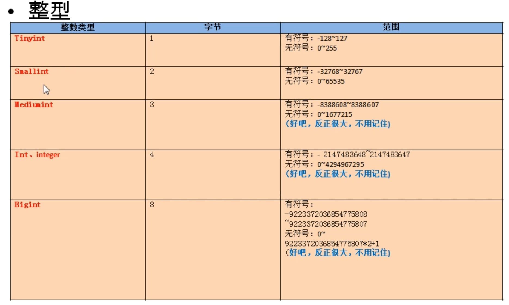

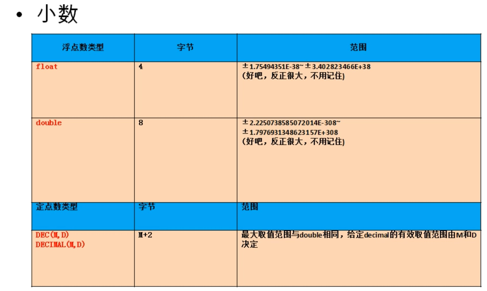

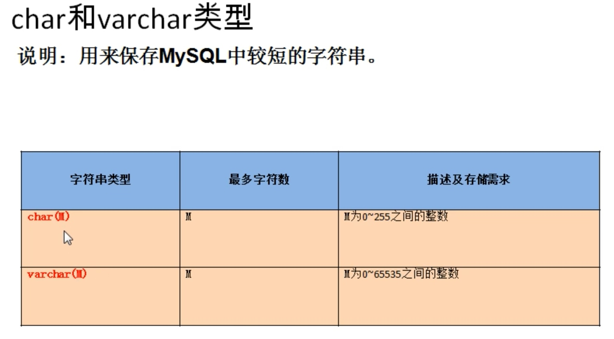


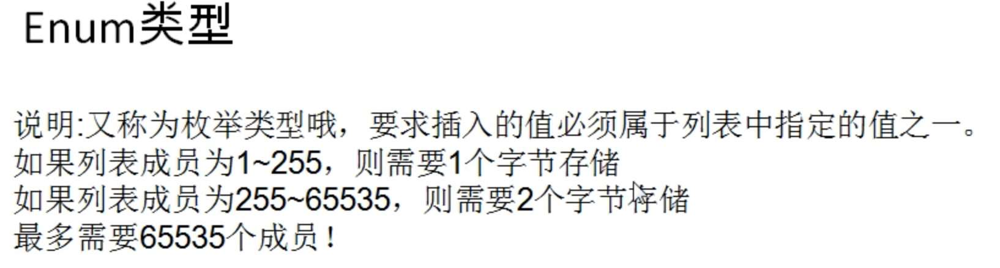

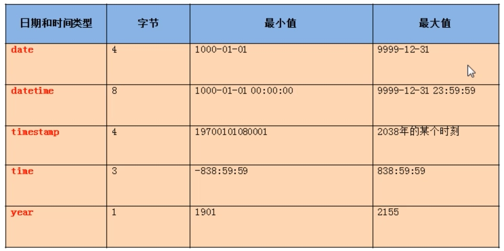

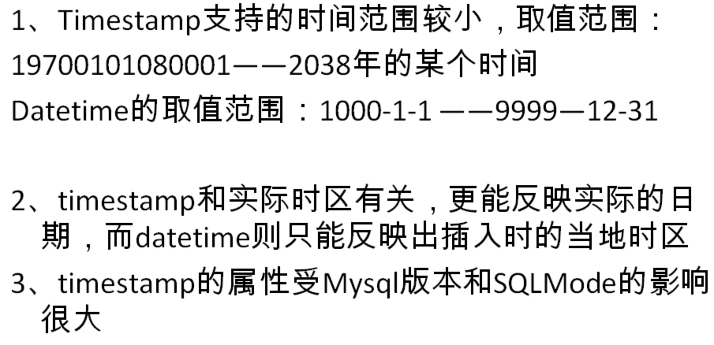

### 使用

```sql
/*
DDL 数据定义语言
库和表的管理
一、库的管理
创建、修改、删除
二、表的管理
创建、修改、删除

创建：create
修改：alter
删除：drop
*/

-- 库的创建
-- 1、库的创建
-- 语法：create database [if not exists] 库名;
-- 案例1 创建库Books
CREATE DATABASE IF NOT EXISTS books;

-- 2、库的修改
-- 更改库的字符集
ALTER DATABASE books CHARACTER SET gbk;

-- 3、库的删除
DROP DATABASE IF EXISTS books;


-- 二、表的管理
-- 1、表的创建
/*
create table 表名(
	列名 列的类型[(长度)约束],
	列名 列的类型[(长度)约束],
	列名 列的类型[(长度)约束],
	...
	列名 列的类型[(长度)约束]
);
*/

-- 案例：创建表Book
CREATE TABLE book(
	id INT,## 编号
	bName VARCHAR(20),## 图书名
	price DOUBLE,## 价格
	authorId INT,## 作者编号
	publishDate DATETIME ## 出版日期
);

DESC book;

-- 案例 创建表author
CREATE TABLE author(
	id INT,
	at_name VARCHAR(20),
	nation VARCHAR(10)
);

DESC author;

-- 2、表的修改
-- ALTER TABLE 表名 add|drop|modify|change column 列名 [列类型 约束];
-- 1）、修改列名
ALTER TABLE book CHANGE COLUMN publishDate pubDate DATETIME;

-- 2）、修改列的类型或约束
-- 案例：修改表book的pubDate字段类型为TIMESTAMP
ALTER TABLE book MODIFY COLUMN pubDate TIMESTAMP;

-- 3）、添加新列
-- 案例：给author表添加年薪列
ALTER TABLE author ADD COLUMN annual DOUBLE;

-- 4）、删除列
ALTER TABLE author DROP COLUMN annual;

-- 5）、修改表名
ALTER TABLE author RENAME TO book_author;

-- 3、表的删除
DROP TABLE IF EXISTS book_author;
SHOW TABLES;

-- 通用的写法
DROP DATABASE IF EXISTS 旧库名;
CREATE DATABASE 新库名;

DROP TABLE IF EXISTS 旧表名;
CREATE TABLE 表名();

-- 4、表的复制
-- 1）、仅仅复制表的结构
CREATE TABLE copy LIKE author;
-- 2）、复制表的结构+数据
create TABLE copy2 SELECT * FROM author;
-- 3）、只复制部分数据
CREATE TABLE copy3 SELECT id,au_name FROM author WHERE nation='中国';
-- 4）、仅仅复制某些字段（只需要某些列字段，不需要数据）
CREATE TABLE copy4 SELECT id,author FROM author WHERE 1=2; ## 指定字段，where中的条件不成立，就不复制数据，也可以改成 WHERE 0；

-- 常见的数据类型
/*
数值型：
	整数
	小数
		定点数
		浮点数
字符型
	较短的文本 char varchar
	较长的文本 text blob(较长的二进制数据)
日期型

*/

-- 一、整型
/*
分类:
	tinyint 1
	smallint 2
	mediumint 3
	int/integer 4
	bigint 8
特点：
1、如果不设置无符号还是有符号，则默认是有符号，如果想设置无符号，需要添加unsigned关键字
2、如果插入的数值超出了整型的范围，会报out of range，并且插入临界值
3、如果不设置长度，会有默认的长度
	长度代表了显示的最大宽度，如果不够会用0在左边填充，但是必须搭配zerofill使用
	t1 INT(7) ZEROFILL,## 0000123
*/
-- 1、如何设置无符号和有符号
create TABLE tab_int(
	t1 INT, ## 有符号 默认
	t2 INT UNSIGNED ## 无符号 如果插入的值是负数，则置为0
);

-- 二、小数
/*
分类：
1、浮点型
	float(m,d)
	double(m,d)
2、定点型
	dec(m,d)
	decimal(m,d)
特点：
	1）、m和d，m代表整数部位+小数部位的长度；d代表小数部位的长度，如果超过范围则插入临界值
	2）、m和d都可以省略，
		如果是decimal，则M默认为10，D默认为0，如果超过了则插入临界值；
		如果是float 或者 double，则会根据插入的数值的精度来决定精度，也就是只要不超出它的限定的范围就可以
	3）、decimal定点型的精度较高，如果要求插入的数值精度较高如货币运算

*/

-- 数据类型选择原则：
/*
所选择的类型越简单越好，能保存数值的类型越小越好
*/

-- 三、字符型
/*
较短的文本
	char
	varchar
	其他：
		binary和varbinary用于保存较短的二进制
		enum用于保存枚举的
		set用于保存集合
较长的文本
	text
	blob(较大的二进制)

特点：
					写法							M的意思													特点						空间的耗费		效率
char			char(M)					最大的字符数，可以省略，默认为1			固定长度的字符		比较耗费			高
varchar		varchar(M)			最大的字符数											可变长度的字符		比较节省			低

*/
CREATE TABLE tab_char(
	c1 ENUM('a','b','c','d') ## 枚举类型
);

INSERT INTO tab_char VALUE('a');## 正常插入
INSERT INTO tab_char VALUE('A');## 正常插入
INSERT INTO tab_char VALUE('m');## 报警告，插入失败，为空值

CREATE TABLE tab_set(
	c1 set('a','b','c','d') ## 枚举类型
);

INSERT INTO tab_set VALUE('a');## 正常插入
INSERT INTO tab_set VALUE('a,b');## 正常插入
INSERT INTO tab_set VALUE('A,B');## 正常插入

-- 四、日期型
/*
分类
	date 只保存日期
	time 只保存时间
	year 只保存年
	datetime 保存日期+时间
	timestamp 保存日期+时间
特点：
										字节						范围								时区等的影响
	datetime					8							1000~9999					不受
	timestamp					4							1970~2038					受
*/
CREATE TABLE tab_date(
	t1 datetime,
	t2 TIMESTAMP,
);

INSERT INTO tab_date VALUES(NOW(),NOW());

SHOW VARIABLES LIKE 'time_zone'; ## 查询数据库时区

SET time_zone='+9:00'; ## 设置数据库的时区

-- 常见的约束
/*
含义：一种限制，用于限制表中的数据，为了保证表中的数据准确和可靠性
分类：六大约束
	not null 非空约束，用于保证该字段的值不能为空
		比如姓名、学号等
	default 默认，用于保证该字段有默认值
		比如性别
	primary key 主键，用于保证该字段的值具有唯一性，并且非空
		比如学号、员工编号
	unique 唯一，用于保证该字段的值具有唯一性，可以为空
		比如座位号
	check 检查约束[mysql中不支持]
		比如年龄、性别
	foreign key 外键，用于限制两个表的关系，用于保证该字段的值必须来自于主表关联列的值
		在从表添加外键约束，用于引用主表中某列的值
		比如学生表的专业编号、员工表的部门编号、员工表的工种编号
添加约束的时机：
	1、创建表时
	2、修改表时
约束添加的分类：
	列级约束
		六大约束语法上都支持，但外键约束没有效果
	表级约束
		除了非空、默认，其他的都支持

主键和唯一的大对比：
									保证唯一性				是否允许为空				一个表中可以有多少个		是否允许组合（多个列组合成一个主键|唯一）
	主键							是								不允许							至多有1个							允许，但不推荐
	唯一							是								允许（只有一个）			可以有多个						允许，但不推荐
外键：
	1、要求在从表上设置关系
	2、从表的外键列的类型和主表的主键列的类型必须一致或者兼容，名称无要求
	3、主表的关联列必须是一个key(一般是主键或唯一)
	4、插入数据时，先插入主表，在插入从表；删除数据时，先删除从表，在删除主表
*/
CREATE TABLE 表名(
	字段名 字段类型 约束,
	字段名 字段类型,
	表级约束
);

-- 一、创建表时添加约束
-- 1、添加列级约束
/*
语法：
	直接在字段名和类型后面追加约束类型即可
	支持：默认、非空、主键、唯一
*/
CREATE DATABASE students;
USE students;

CREATE TABLE major(
	id INT PRIMARY KEY,
	majorName VARCHAR(20)
);

CREATE TABLE stuinfo(
	id INT PRIMARY KEY,## 主键
	stuName VARCHAR(20) NOT NULL,## 非空，mysql不支持
	gender CHAR(1) CHECK(gender='男' or gender='女') ,## 检查
	seat INT UNIQUE,## 座位 唯一
	age INT DEFAULT 18,## 默认约束
	majorId INT REFERENCES major(id) ## 外键
);

DESC students.sutinfo;
## 查看stuinfo表中的所有的索引，包括主键、外键、唯一
SHOW INDEX FROM students.sutinfo;

-- 2、添加表级约束
/*
语法：在各个字段的最下面
[constraint 约束名] 约束类型(字段名)
*/
-- 什么时候用列级约束，什么时候用表级约束？
-- 通用的写法
CREATE TABLE IF NOT EXISTS stuinfo(
	id INT PRIMARY KEY,
	stuname VARCHAR(20) NOT NULL,
	gender CHAR(1),
	age INT DEFAULT 18,
	seat INT UNIQUE,
	majorId INT,
	CONSTRAINT fk_stuinfo_major FOREIGN KEY(majorId) REFERENCES major(id)
);

DROP TABLE if EXISTS stuinfo;

CREATE TABLE stuinfo(
	id INT,
	stuname VARCHAR(20),
	gender CHAR(1),
	seat INT,
	age INT,
	majorId INT,
	CONSTRAINT pk PRIMARY KEY(id),#主键
	CONSTRAINT uq UNIQUE(seat),## 唯一值
	CONSTRAINT ck CHECK(gender='男' or gender='女'),## 检查约束 MySQL不支持
	CONSTRAINT fk_stuinfo_major FOREIGN KEY(majorId) REFERENCES major(id)## 外键
);

CREATE TABLE stuinfo(
	id INT,
	stuname VARCHAR(20),
	gender CHAR(1),
	seat INT,
	age INT,
	majorId INT,
	PRIMARY KEY(id),#主键
	UNIQUE(seat),## 唯一值
	CHECK(gender='男' or gender='女'),## 检查约束 MySQL不支持
	FOREIGN KEY(majorId) REFERENCES major(id)## 外键
);

CREATE TABLE stuinfo(
	id INT,
	stuname VARCHAR(20),
	gender CHAR(1),
	seat INT,
	seat1 INT,
	age INT,
	majorId INT,
	PRIMARY KEY(id,`name`),#组合主键
	UNIQUE(seat,seat1),## 唯一值
	CHECK(gender='男' or gender='女'),## 检查约束 MySQL不支持
	FOREIGN KEY(majorId) REFERENCES major(id)## 外键
);


-- 二、修改表时添加约束
/*
1、添加列级约束
ALTER TABLE 表名 MODIFY COLUMN 字段名 字段类型 新约束;
2、添加表级约束
ALTER TABLE 表名 ADD [CONSTRAINT 约束名] 约束类型(字段名) [外键引用]
*/
-- 1、添加非空约束
DROP TABLE if EXISTS stuinfo;
CREATE TABLE stuinfo(
	id INT,
	stuname VARCHAR(20),
	gender CHAR(1),
	seat INT,
	age INT,
	majorId INT
);
ALTER TABLE stuinfo MODIFY COLUMN stuname VARCHAR(20) NOT NULL;
-- 2、添加默认约束
ALTER TABLE stuinfo MODIFY COLUMN age INT DEFAULT 18;
-- 3、添加主键
## 列级约束
ALTER TABLE stuinfo MODIFY COLUMN id INT PRIMARY KEY; 
## 表级约束
ALTER TABLE stuinfo ADD PRIMARY KEY(id)
-- 4、添加唯一键
## 列级约束
ALTER TABLE stuinfo MODIFY COLUMN seat INT UNIQUE;
## 表级约束
ALTER TABLE stuinfo ADD UNIQUE(seat);
-- 5、添加外键
ALTER TABLE stuinfo ADD [CONSTRAINT fk_stuinfo_major] FOREIGN KEY(majorId) REFERENCES major(id);

DESC stuinfo;

-- 三、修改表时删除约束

-- 1、删除非空约束
ALTER TABLE stuinfo MODIFY COLUMN stuname VARCHAR(20);## 设置为原来的默认
-- 2、删除默认约束
ALTER TABLE stuinfo MODIFY COLUMN age INT; ## 不加就是使用默认
-- 3、删除主键
## 列级约束
ALTER TABLE stuinfo MODIFY COLUMN id INT;
## 表级约束
ALTER TABLE stuinfo DROP PRIMARY KEY;
-- 4、删除唯一
## 列级约束
ALTER TABLE stuinfo MODIFY COLUMN seat INT;
## 表级约束
ALTER TABLE stuinfo DROP INDEX seat;
SHOW INDEX FROM stuinfo;## 查询唯一键
-- 5、删除外键
ALTER TABLE stuinfo DROP FOREIGN KEY majorId;

/*
列级约束与表级约束异同
								位置							支持的约束类型（去除了检查约束）					是否可以起约束名
列级约束					列的后面					语法上都支持，但外键没有效果							不可以
表级约束					所有列的后面			默认和非空不支持，其他都支持							可以（主键没有效果）

*/

-- 标识列
/*
又称为自增长列
含义：可以不用手动的插入值，系统提供默认的序列值
特点：
1、标识列必须和主键搭配吗？不一定，但要求是一个key
2、一个表中可以有多少个标识列？只有一个
3、标识列的类型是否有限制？只能是数值类型
4、标识列可以通过set auto_increment_increment=3;设置步长
	可以通过手动插入值的时候设置初始值
*/

-- 一、创建表时设置标识列
CREATE TABLE tab_identity(
	id INT PRIMARY KEY AUTO_INCREMENT,
	`name` VARCHAR(20)
);
INSERT INTO tab_identity VALUES(NULL,'john');
INSERT INTO tab_identity(id,`name`) VALUES(NULL,'john');
INSERT INTO tab_identity(`name`) VALUES('john');

SHOW VARIABLES LIKE '%auto_increment%';## 查询自增长开始和步长，mysql不支持设置起始值，但是支持设置步长
## 可以通过插入第一个的时候设置1000，然后之后插入的都使用null会自动从1000开始计算
INSERT INTO tab_identity(id,`name`) VALUES(1000,'john');

-- 二、修改表时设置标识列
ALTER TABLE tab_identity MODIFY COLUMN id INT PRIMARY KEY AUTO_INREMENT;

-- 三、修改表时删除标识列
ALTER TABLE tab_identity MODIFY COLUMN id INT;
```

### 练习

```sql
--  向表emp2的id列中添加primary key约束（my_emp_id_pk）
## 列级约束（不支持自定义名字）
ALTER TABLE emp2 MODIFY COLUMN id INT PRIMARY KEY;
## 表级约束
ALTER TABLE emp2 ADD CONSTRAINT my_emp_id_pk PRIMARY KEY(id);

-- 向表dept2的id列中添加primary key约束（my_dept_id_pk）
## 列级约束（不支持自定义名字）
ALTER TABLE dept2 MODIFY COLUMN id INT PRIMARY KEY;
## 表级约束
ALTER TABLE dept2 ADD CONSTRAINT my_dept_id_pk PRIMARY KEY(id);

-- 向表emp2中添加列 dept_id，并在其中定义foreign key约束，与之相关联的列是dept2表中的id列
ALTER TABLE emp2 ADD COLUMN dept_id INT;
ALTER TABLE emp2 ADD CONSTRAINT fk_emp2_dept2 FOREIGN KEY(dept_id) REFERENCES dept2(id);
```

## TCL学习

TCL：Transaction Control Language 事务控制语言

### 存储引擎

在mysql中的数据用各种不同的技术存储在文件（内存）中

通过`show engines;`来查看MySQL支持的存储引擎

在MySQL中用的最多的存储引擎有：innodb、myisam、memory等，其中innodb支持事务，myisam、memory等不支持事务

### 事务的ACID属性

原子性（Atomicity）：原子性是指事务是一个不可分割的工作单位，事务中的操作要么都发生，要么都不发生

一致性（Consistency）：事务必须使数据库从一个一致性状态变换到另外一个一致性状态

隔离性（Isolation）：事务的隔离性是指一个事务的执行不能被其他事务干扰，即一个事务内部的操作及使用的数据对并发的其他事务是隔离的，并发执行的各个事务之间不能互相干扰

持久性（Durability）：永久性是指一个事务一旦被提交，他对数据库的数据的改变是永久性的，接下来的其他操作和数据库故障不应该对其他有任何影响

```sql
-- TCL语言
/*
Transaction Control Language 事务控制语言
事务：
一个或者一组sql语句组成一个执行单元，这个执行单元要么全部执行，要么全部不执行
案例：转账
张三丰	1000
郭襄		1000

UPDATE 表 set 张三丰的余额=500 where name='张三丰';
意外
UPDATE 表 set 郭襄的余额=1500 where name='郭襄';

安装软件：回滚，把刚才的执行的操作回退到开始位置

事务的创建

隐时事务：事务没有明显的开启和结束的标记
比如：insert update delete语句

显式事务：事务具有明显的开启和结束的标记
前提：必须先设置自动提交功能为禁用

步骤1：开启事务
set autocommit=0;
start TRANSACTION;## 可选
步骤2：编写事务中的sql语句(SELECT、INSERT、UPDATE、DELETE)
语句1
语句2
...
步骤3：结束事务
commint; #提交事务
rollback; #回滚事务

savepoint 节点名; 设置保存点

事务的隔离级别：（√表示不存在该种情况）
													脏读							不可重复读					幻读
read uncommintted					×								×									×
read committed						√								×									×
repeatable read						√								√									×
serializable							√								√									√

mysql 中默认是repeatable read，Oracle默认是 read committed
查看隔离级别
	select @@tx_isolation
设置隔离级别
	set session|global transaction isolation level 隔离级别;
*/
 
SHOW ENGINES;

SHOW VARIABLES LIKE "%autocommit%"; ## on

SET autocommit=0; ## 关闭事务，只针对当前的会话有效

-- 演示事务的使用步骤
DROP TABLE IF EXISTS account;

CREATE TABLE account(
	id INT PRIMARY KEY AUTO_INCREMENT,
	username VARCHAR(20),
	balance DOUBLE
);

INSERT INTO account(username,balance) VALUES('张三丰',1000),('郭襄',1000);

-- 关闭自动提交
SET autocommit=0;
-- 开始事务（可以不用写，默认自动开始）
START TRANSACTION;
-- 编写sql语句
UPDATE account SET balance = 500 WHERE username='张三丰';
UPDATE account SET balance = 1500 WHERE username='郭襄';
-- 结束事务
COMMIT;

-- 3、演示savepoint的使用
SET autocommit=0;
START TRANSACTION;
DELETE FROM account WHERE id=25;
SAVEPOINT a; ## 设置保存点
DELETE FROM account WHERE id=28;
ROLLBACK TO a; ## 回滚到a这个保存点

 -- 3、演示savepoint的使用
SET autocommit=0;
START TRANSACTION;
DELETE FROM account WHERE id=25;
SAVEPOINT a; ## 设置保存点
DELETE FROM account WHERE id=28;
ROLLBACK TO a; ## 回滚到a这个保存点

-- delete 和 truncate 在事务使用时的区别
-- 演示delete，可以回滚
SET autocommit =0;
START TRANSACTION;
DELETE FROM account;
ROLLBACK;
-- 演示truncate，不能回滚
SET autocommit=0;
START TRANSACTION;
TRUNCATE account;
ROLLBACK;
```

### 数据库的隔离级别

对于同时运行的多个事务，当这些事务访问数据库中相同的数据时，如果没有采取必要的隔离机制，就会导致各种并发问题：

- 脏读：对于两个事务T1、T2，T1读取了已经被T2更新但还没有被提交的字段，之后，若T2回滚，T1读取的内容就是临时且无效的。（读未提交）
- 不可重复读：对两个事务T1、T2，T1读取了一个字段，然后T2更新了该字段之后，T1再次读取同一个字段，值就不同了
- 幻读：对于两个事务T1、T2，T1从一个表中读取了一个字段，然后T2在该表中插入了一些新的行，之后，如果T1再次读取同一个表，就会多出几行

#### 数据库提供四种事务隔离级别

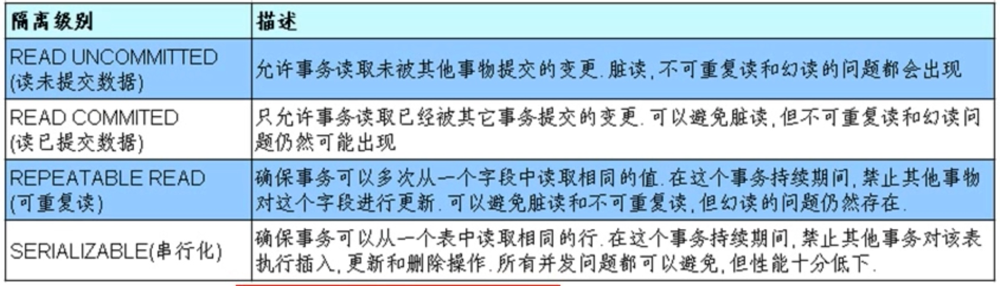

- read uncommint、 read commit 和 repeatable read是行锁，主要是针对更新数据
- serializable 是表锁，主要是针对插入和删除数据


要验证事务的隔离性，可以开启两个控制台连接到数据，然后设置事务隔离级别，之后设置自动提交为0，然后开启事务，编写语句，下面设置事务隔离级别是两个终端都设置

- 读未提交（read uncommintted）测试：设置事务隔离级别为`read uncommitted`，然后更新数据但不提交事务，通过另一个终端查看，可以看到当前已经更新了数据
- 读已提交（read committed）测试：设置事务隔离级别为`read committed`，然后更新数据但不提交事务，通过另一个终端查看，不可以看到当前已经更新了数据，但是当我们提交事务之后，通过另一个终端可以看到更新的数据了
- 可重复读（repeatable read）测试：设置事务隔离级别为`repeatable read`，然后在另一个终端中先查询数据，然后在本终端中更新数据并提交数据，在另一个终端中再次查询数据，与前一次查询的数据一般无二，没有发生变化
- 串行化（serializable）：设置事务隔离级别为`serializable`，然后开启事务，插入数据，当我们没有提交事务的时候，使用另一个终端查询数据，会等待在当前界面，直到我们在本终端提交了事务

事务需要使用到的命令：

- 查看事务隔离级别：`select @@tx_isolation;`
- 设置事务隔离级别：`set session transaction isolation level read uncommitted;`，设置事务隔离级别为读未提交
- 设置事务隔离级别：`set global transaction isolation level read committed`
- 设置编码集：`set names gbk;`

## 视图

 ### 概念

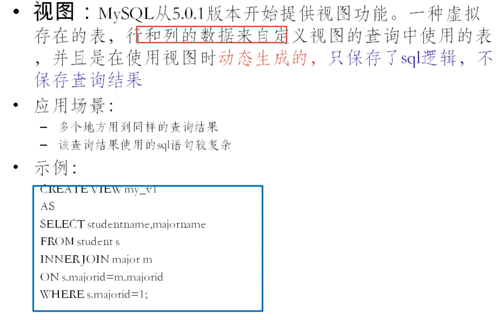

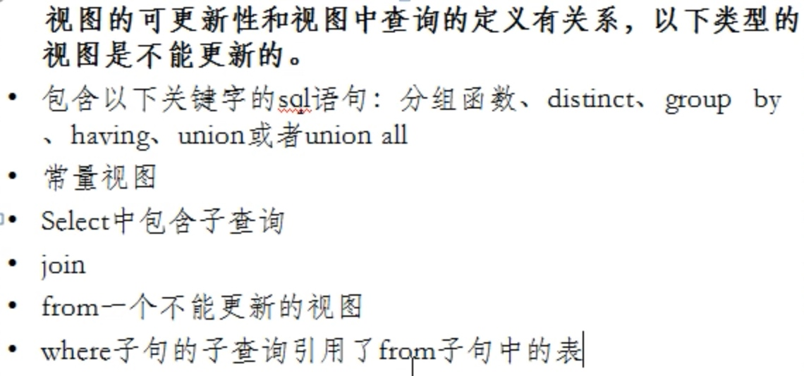

### 使用

```sql
-- 视图
/*
含义：虚拟的表，和普通表一样的使用。
行和列的数据来自定义视图的查询中使用的表，并且是在使用视图时动态生成的，视图只保存了sql逻辑，当需要使用的时候，在通过查询的sql语句去动态生成。
mysql 5.1版本出现的新特性，是通过表动态生成的数据。

比如：中学分好多班级（每个班和普通表一样），但是有一天教育局领导过来视察，为了应付领导视察，校长就说，把年级里成绩好的学生临时拼成一个班（视图）
，让领导去视察这个班级，之后，等领导走了之后，解散这个班级。

视图的好处：
	重用sql语句
	简化复杂的sql操作，不必知道它的查询细节
	保护数据，提高安全性（中国移动要保护用户的手机用户信息，但是和其他的外包合作的开发的时候，需要提供手机号和用户名，但是不想提供其他的信息，这个时候就可以使用视图）
	
视图和表的比较
						创建语法的关键字						是否实际占用物理空间				使用
视图					create view							只是保存了sql的逻辑				增删改查，只是一般不能增删改
表						create table						保存了数据								增删改查
*/

-- 案例：查询姓张的学生名和专业名
SELECT stuname,majorname FROM stuinfo s INNER JOIN major m ON s.majorId=m.id WHERE s.stuname LIKE '张%';
## 创建视图
CREATE VIEW v1 AS 
SELECT stuname,majorname FROM stuinfo s INNER JOIN major m ON s.majorId=m.id;
## 使用视图
SELECT * FROM v1 WHERE stuname LIKE '张%';

-- 一、创建视图
/*
语法：
CREATE VIEW 视图名
AS
查询语句
*/
USE myemployees;
-- 案例：查询姓名中包含a字符的员工名、部门名和工种信息
-- 创建
CREATE VIEW myv1
AS
SELECT last_name,department_name,job_title FROM
employees,departments,jobs
WHERE employees.department_id=departments.department_id AND employees.job_id=jobs.job_id;
-- 使用
SELECT * FROM myv1 WHERE last_name LIKE '%a%';

-- 案例 查询各部门的平均工资级别
-- 创建视图 查看每个部门的平均工资
CREATE VIEW myv2
AS
SELECT AVG(salary) ag,department_id FROM employees GROUP BY department_id;
-- 使用
SELECT myv2.ag,g.grade_level FROM myv2 INNER JOIN job_grades g ON ag BETWEEN g.lowest_sal AND g.highest_sal;

-- 二、视图的修改
-- 方式一：
/*
CREATE OR REPLACE VIEW 视图名
AS
查询语句;
*/
CREATE OR REPLACE VIEW myv2
AS
SELECT AVG(salary) ag,department_id FROM employees GROUP BY department_id;
-- 方式二
/*
语法
ALTER VIEW 视图名
AS
查询语句;
*/
ALTER VIEW myv2
AS
SELECT AVG(salary) ag,department_id FROM employees GROUP BY department_id;

-- 三、删除视图
/*
语法：drop view 视图名,视图名,...;
*/
DROP VIEW myv2;

-- 四、 查看视图
DESC myv2;
SHOW CREATE VIEW myv2;

-- 五、视图的更新（更改视图中的数据）
CREATE OR REPLACE VIEW myv1
AS
SELECT last_name,email,salary*12*(1+IFNULL(commission_pct,0)) "annual salary" FROM employees;

CREATE OR REPLACE VIEW myv2
AS
SELECT last_name,email "annual salary" FROM employees;
-- 1、插入数据
INSERT INTO myv1 VALUES('张飞','zf@qq.com',1000000);## 报目标的语法不能更新，换一个能更新的
INSERT INTO myv2 VALUES('张飞','zf@qq.com');## 也会插入到原始表中

-- 2、修改
UPDATE myv2 SET last_name ='张无忌' WHERE last_name='张飞'; ## 也会更新到原始表中

-- 3、删除
DELETE FROM myv2 WHERE last_name='张无忌'; ## 也会删除原始表中的数据

/*
具备以下特点的视图时不允许更新的
	包含以下关键字的SQL语句：分组函数、distinct、group by、having、union或者union all
	常量视图
	select 中包含子查询
	join
	from一个不能更新的视图
	where子句的子查询引用了from子句中的表
*/
-- 包含以下关键字的SQL语句：分组函数、distinct、group by、having、union或者union all
CREATE OR replace VIEW myv1
AS
SELECT MAX(salary) m,department_id
FROM employees GROUP BY department_id;
## 更新失败
UPDATE myv1 SET m=900 WHERE department_id=10;

-- 常量视图
CREATE OR replace VIEW myv1
AS
SELECT 'john' `name`;
## 更新失败
UPDATE myv1 SET `name`='lacy';

-- select 中包含子查询
CREATE OR replace VIEW myv1
AS
SELECT department_id,(SELECT max(salary) FROM employees) 最高工资 FROM departments;
## 更新失败
UPDATE myv1 SET 最高工资=100000;

-- join，sql92的逗号连接也不行
CREATE OR REPLACE VIEW myv1
AS
SELECT last_name,department_name FROM employees e JOIN departments d ON e.department_id =d.department_id;
## 更新
UPDATE myv1 SET last_name ='张飞' WHERE last_name ='Whalen' ## 可以更新数据
INSERT INTO myv1 VALUES('陈真','xxxx') ## 不能插入数据

-- from一个不能更新的视图
CREATE OR REPLACE VIEW myv2
AS
SELECT * FROM myv1;## myv1不能更新

-- where子句的子查询引用了from子句中的表
CREATE OR REPLACE VIEW myv1
AS
SELECT last_name,email,salary
FROM employees WHERE employee_id IN(SELECT manager_id FROM employees WHERE manager_id is not null);
```

## 变量

```sql
/*
变量
系统变量
	全局变量
	会话变量
自定义变量
	用户变量
	局部变量
*/
-- 一、系统变量
-- 说明：变量由系统提供，不是用户定义，属于服务器层面
-- 注意：
-- 	如果全局级别，则需要加GLOBAL，如果是会话级别，则需要加SESSION，如果不写，则默认SESSION
/*
全局变量
	作用域：服务器每次启动将为所有的全局变量赋初始值，针对于所有的会话（连接）有效，但是不能跨重启
*/
-- 使用的语法：
-- 1、查看所有的系统变量，系统和会话的变量
SHOW [GLOBAL|SESSION] VARIABLES;## 如果两个都不写的话，默认表示查看会话变量
SHOW GLOBAL VARIABLES;
-- 2、查看满足条件的部分系统变量
SHOW [GLOBAL|SESSION] VARIABLES LIKE '%char%';## 查看包含char的系统变量的值
SHOW GLOBAL VARIABLES LIKE '%char%';
-- 3、查看指定的某个系统变量的值
SELECT @@GLOBAL|[SESSION].系统变量名;## 如果不写GLOBAL，默认是会话变量
SELECT @@GLOBAL.AUTOCOMMIT;
SELECT @@TX_ISOLATION;
-- 4、为某个系统变量赋值
## 方式一 我测试这种方式报错
SET @@GLOBAL|SESSION 系统变量名=值;
SET @@GLOBAL.AUTOCOMMIT=1;
## 方式二
SET @@GLOBAL|[SESSION].系统变量名=值;

/*
会话变量
作用域：仅仅针对于当前会话（连接）有效
*/
-- 使用的语法：
-- 1、查看所有的系统变量，系统和会话的变量
SHOW [GLOBAL|SESSION] VARIABLES;## 如果两个都不写的话，默认表示查看会话变量
SHOW SESSION VARIABLES;
-- 2、查看满足条件的部分系统变量
SHOW [GLOBAL|SESSION] VARIABLES LIKE '%char%';## 查看包含char的系统变量的值
SHOW SESSION VARIABLES LIKE '%char%';
-- 3、查看指定的某个系统变量的值
SELECT @@GLOBAL|[SESSION].系统变量名;## 如果不写GLOBAL，默认是会话变量
SELECT @@SESSION.AUTOCOMMIT;
SELECT @@TX_ISOLATION;
-- 4、为某个系统变量赋值
## 方式一 我测试这种方式报错
SET @@GLOBAL|SESSION 系统变量名=值;
SET @@SESSION.AUTOCOMMIT=1;
## 方式二
SET @@GLOBAL|[SESSION].系统变量名=值;

-- 二、自定义变量
/*
说明：变量是用户自定义的，不是由系统创建的
使用：
	声明
	赋值
	使用（查看、比较、运算等）
*/
/*
1、用户变量
	作用域：针对于当前会话（连接）有效，同于会话变量的作用域
	应用在所有的地方
*/
-- 1）声明
-- 赋值的操作符为：= 或者:=
SET @用户变量名=值;
SET @用户变量名:=值
SELECT @用户变量名:=值;
-- 2）赋值（更新用户变量的值）
-- 方式一：通过SET或SELECT
SET @用户变量名=值;
SET @用户变量名:=值
SELECT @用户变量名:=值;
-- 案例：
-- 声明并初始化
SET @MYNAME='JOHN';
SET @MYNAME=100;
-- 方式二：通过SELECT INTO
SELECT 字段 INTO 变量名 FROM 表;
SET @MYCOUNT=1;
-- 赋值
SELECT COUNT(*) INTO @MYCOUNT FROM employees;## 将员工表的总个数赋值给MYCOUNT
-- 3）、使用（查看用户变量的值）
SELECT @用户变量名;
-- 查看
SELECT @MYCOUNT;
/*
2、局部变量
	函数中
	作用域：仅仅在定义它的begin end中有效
	应用在begin end中的第一句话
*/

-- 1）、声明
DECLARE 变量名 类型
DELETE 变量名 类型 DEFAULT 值;
-- 2)、赋值
-- 方式一：通过SET或SELECT
SET 局部变量名=值;
SET 局部变量名:=值
SELECT @局部变量名:=值;
-- 方式二：通过SELECT INTO
SELECT 字段 INTO 局部变量名 FROM 表;
-- 3）、使用
SELECT 局部变量名;

对比用户变量和局部变量
									作用域							定义和使用											语法
用户变量						当前会话						会话中的任何地方									必须加@符号，不用限定类型
局部变量						BEGIN END中				只能在BEGIN END中的第一句				一般不用加@符号，需要限定类型

-- 案例 声明两个变量并赋初值，求两个变量之和
-- 1 用户变量
SET @M=1;
SET @N=2;
SET @MYSUM= @M+@N;
SELECT @MYSUM;

-- 2 局部变量
DECLARE M INT DEFAULT 1;
DECLARE N INT DEFAULT 2;
DECLARE MYSUM INT;
SET MYSUM=M+N;
SELECT MYSUM;
```

## 存储过程和函数

### 存储过程

```sql
-- 存储过程和函数
/*
需要在终端中运行

存储过程和函数 类似于Java中的方法
好处：
	1、提高代码的重用性
	2、简化操作

*/

-- 存储过程
/*
含义：一组预先编译好的sql语句的和集合，理解成批处理语句
1、提高了代码重用性
2、简化操作
3、减少了编译次数并且减少了和数据库服务器的连接次数，提高了效率
*/

-- 一、创建语法
CREATE PROCEDURE 存储过程名(参数列表)
BEGIN
	存储过程体（一组合法的sql语句）
END
注意：
	1、参数列表包含三部分
		参数模式 参数名 参数类型
		举例：IN stuname VARCHAR(20)
		参数模式：
			IN：该参数可以作为输入
			OUT：该参数可以作为返回值
			INOUT：该参数既可以作为输入又可以作为输出，也就是该参数既需要传入值，又可以返回值
	2、如果存储过程体仅仅只有一句话，BEGIN END可以省略
	3、存储过程体中的每条sql语句的结尾要求必须加分号。存储过程的结尾可以使用 DELIMITER 重新设置
		语法：
			DELIMITER 结束标记
			DELIMITER $
-- 调用语法
CALL 存储过程名(实参列表);

-- 1、空参列表
-- 案例：插入到admin表中五条记录
-- 创建
DELIMITER $
CREATE RPOCEDURE myp1()
BEGIN
	INSERT INTO `admin`(username,`password`) 
	VALUES('john1','0000'),('john2','0000'),('john3','0000'),('john4','0000'),('john5','0000');
END $
-- 调用
CALL myp1()$

-- 2、创建带in模式的存储过程
-- 案例：创建存储过程实现根据女神名，查询对应的男神信息
CREATE PROCEDURE myp2(IN beautyName VARCHAR(20))
BEGIN
	SELECT bo.*
	FROM boys bo
	RIGHT JOIN beauty b ON bo.id = b.boyfriend_id
	WHERE b.`name`=beautyName;
END $

-- 调用
CALL myp2('柳岩')$

-- 设置控制台字符集
SET NAMES GBK;

-- 案例：创建存储过程实现，用户是否登录成功
CREATE PROCEDURE myp3(IN username VARCHAR(20),IN `password` VARCHAR(20))
BEGIN
	DECLARE result VARCHAR(20) DEFAULT '';
	SELECT COUNT(*) INTO result ## 赋值
	FROM `admin`
	WHERE admin.username=username
	AND admin.`password` = `password`;
	SELECT result; #使用
END $

CREATE PROCEDURE myp3(IN username VARCHAR(20),IN `password` VARCHAR(20))
BEGIN
	DECLARE result VARCHAR(20) DEFAULT 0;
	SELECT COUNT(*) INTO result ## 赋值
	FROM `admin`
	WHERE admin.username=username
	AND admin.`password` = `password`;
	SELECT IF(result>0,'成功','失败'); #使用
END $

-- 调用
CALL myp3('张飞','8888')$

-- 3、创建带out模式的存储过程
-- 案例：根据女神名，返回对应的男神名
CREATE PROCEDURE myp5(IN beautyName VARCHAR(20),OUT boyName VARCHAR(20))
BEGIN
	SELECT boys.boyName INTO boyName
	FROM beauty INNER JOIN boys ON beauty.boyfriend_id=boys.id
	WHERE beauty.`name`=beautyName;
END $
-- 调用
SET @bName$
CALL myp5('小昭',@bName)$
SELECT @bName$

-- 案例：根据女神名，返回对应的男神名和男神魅力值
CREATE PROCEDURE myp6(IN beautyName VARCHAR(20),OUT boyName VARCHAR(20),OUT userCP INT)
BEGIN
	SELECT boys.boyName,boys.userCP INTO boyName,userCP
	FROM beauty INNER JOIN boys ON beauty.boyfriend_id=boys.id
	WHERE beauty.`name`=beautyName;
END $
-- 调用
CALL myp6('小昭',@bName,@userCP)$

-- 4、创建带inout模式参数的存储过程
-- 案例：传入a和b两个值，最终a和b都翻倍并返回

CREATE PROCEDURE myp8(INOUT a INT,INOUT b INT)
BEGIN
	SET a=a*2;
	SET b=b*2;
END $

-- 调用
SET @a=2;
SET @b=4;
CALL myp8(@a,@b)$

-- 二、存储过程的删除
语法：
	DROP PROCEDURE 存储过程名;

-- 三、查看存储过程
SHOW CREATE PROCEDURE myp2;
```

### 函数

```sql
/*
函数：
在终端中运行
含义：一组预先编译好的SQL语句和集合，理解成批处理语句
1、提高代码的重用性
2、简化操作哦
3、减少编译次数并且减少了和数据库服务器的连接次数，提高了效率

区别：

存储过程：可以有0个返回，也可以有多个返回
函数：有且仅有一个返回

*/

-- 一、创建语法
/*
注意：
1. 参数列表 包含两部分：
参数名 参数类型

2. 函数体：肯定会return语句，如果没有会报错，如果return语句没有放在函数体的最后也不会报错，但不建议
return 值;

3. 函数体中仅有一句话，则可以省略begin end

4. 使用 delimiter语句设置结束标记
*/
DELIMITER $
CREATE FUNCTION 函数名(参数列表) RETURNS 返回类型
BEGIN
	函数体
END $

-- 二、调用语法
SELECT 函数名(参数列表);

-- 案例演示
-- 案例：返回公司的员工个数
CREATE FUNCTION myf1() RETURNS INT
BEGIN
	DECLARE c INT DEFAULT 0; ## 定义变量
	SELECT COUNT(*) INTO c ## 为变量赋值
	FROM employees;
	RETURN c;
END $

SELECT myf1();

-- 案例：根据员工名，返回它的工资
CREATE FUNCTION myf2(empName VARCHAR(20)) RETURNS DOUBLE
BEGIN
	SET @sal=0; ## 用户变量
	DECLARE s DOUBLE DEFAULT 0;
	SELECT employees.salary INTO s ## 或者 @sal
	FROM employees 
	WHERE employees.last_name = empName
END $ 

SELECT myf1('K_ing')$

-- 案例 根据部门名，返回该部门的平均工资
CREATE FUNCTION myf3(depName VARCHAR(20)) RETURNS DOUBLE
BEGIN
	DECLARE ags DOUBLE DEFAULT 0;
	SELECT AVG(employees.salary) INTO ags
	FROM employees
	INNER JOIN departments
	ON employees.department_id = departments.department_id
	WHERE departments.department_name=depName;
	RETURN ags;
END $

SELECT myf3('K_ing')$

-- 三、查看函数
DECLARE ;
SHOW CREATE FUNCTION myf3;

-- 四、删除函数
DROP FUNCTION myf3;

-- 案例：创建函数，实现传入两个float，返回二者之和
DECLARE $
CREATE FUNCTION myf4(a FLOAT,b FLOAT) RETURNS FLOAT
BEGIN
	DECLARE mysum FLOAT DEFAULT 0;
	SET mysum=a+b;
	RETURN mysum
END $
```

## 流程控制

### 使用

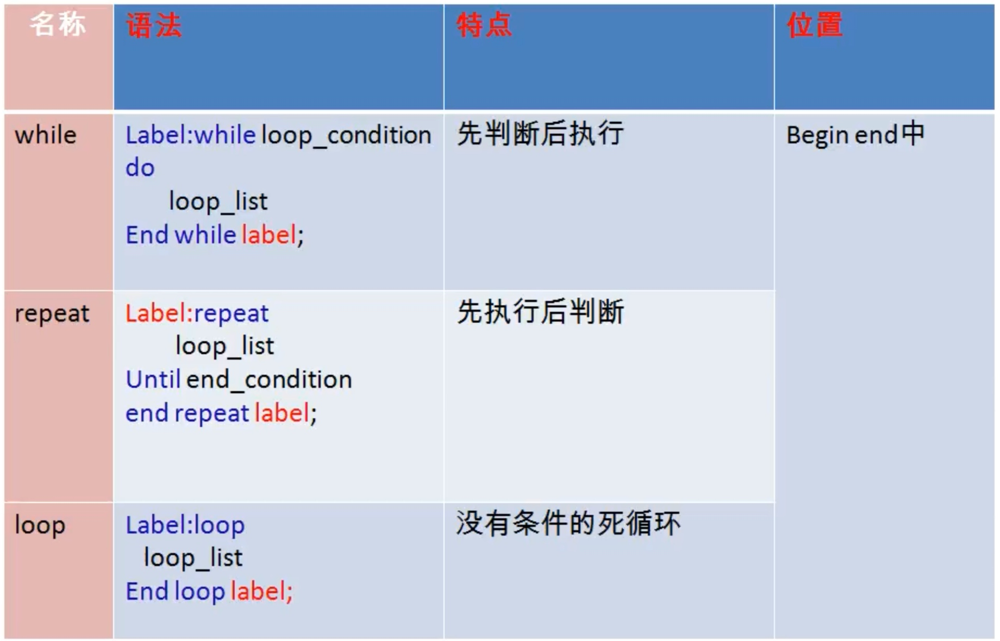

```sql
-- 流程控制结构
/*
顺序执行：程序从上往下依次执行
分支结构：程序从两条或者多条路径中选择一条去执行
循环结构：程序在满足一定调教的基础上，重复执行一段代码
*/

-- 一、分支结构
/*
1、if函数
功能：实现简单的双分支
语法：
SELECT IF(表达式1,表达式2,表达式3)
执行顺序：
如果表达式1成立，则if函数返回表达式2的值，否则返回表达式3的值
应用：任何地方
*/

/*
2、case结构
情况1；类似于Java中的switch语句，一般用于实现等值判断
	语法：
		case 变量|表达式|字段
		when 要判断的值 then 返回的值1;
		when 要判断的值 then 返回的值2;
		...
		else 要返回的值n;
		end case;

情况2：类似于Java中的多重if语句，一般用于实现区间判断
	语法：
		case 变量|表达式|字段
		when 要判断的条件1 then 返回的值1或语句1;
		when 要判断的条件2 then 返回的值2或语句2;
		...
		else 要返回的值n或语句n;
		end case;
特点：
1、
	可以作为表达式，嵌套在其他语句中使用，可以放在任何地方，begin end中或者begin end的外面
	可以作为独立的语句使用，只能放在begin end中
2、
	如果执行when中的值或者条件成立，则执行对应的then后面的语句，并且结束case
	如果都不满足，则执行else中的语句或值
3、else可以省略，如果else省略了，并且所有的when条件都不满足，则返回null
*/

-- 案例：
-- 创建存储过程，根据传入的成绩，来显示等级，比如传入的成绩：90-100，显示A；80-90，显示B；60-80，显示C，否则显示D
DELIMITER $
CREATE PROCEDURE teste_case(IN score INT)
BEGIN
	CASE
	WHEN score>=90 AND score<=100 THEN SELECT 'A';
	WHEN score>=80 AND score<=90 THEN SELECT 'B';
	WHEN score>=60 AND score<=80 THEN SELECT 'C';
	ELSE SELECT 'D';
	END CASE;
END $

CALL test_case(95)$

/*
if结构
功能：实现多重分支
if 条件1 then 语句1
elseif 条件2 then 语句2;
...
[else 语句n;]
end if
应用在begin end中
*/
-- 案例：根据传入的成绩，来显示等级，比如传入的成绩：90-100，返回A；80-90，返回B；60-80，返回C，否则返回D

CREATE FUNCTION test_if(score INT) RETURNS CHAR(1)
BEGIN
	IF score>=90 AND score<=100 THEN RETURN 'A';
	ELSEIF score>=80 AND score<=90 THEN RETURN 'B';
	ELSEIF score>=60 AND score<=80 THEN RETURN 'C';
	ELSE RETURN 'D';
	END IF;
END $

SELECT test_if(86);

/*
二、循环结构
分类：
	while、loop、repeat
循环控制：
	iterate 类似于continue，继续，结束本次循环，继续下一次
	leave 类似于 break，跳出，结束当前所在的循环
*/

/*
1、while
语法：
[标签:]while 循环条件 do
	循环体
end while [标签];
联想：
while(循环条件){
	循环体;
}
*/
-- 1、没有添加循环控制语句
-- 案例：批量插入，根据次数插入到admin表中多条记录
DELIMITER $
CREATE PROCEDURE pro_while1(IN insertCount INT)
BEGIN
	DECLARE i INT DEFAULT 1;
	WHILE i<=insertCount DO
		INSERT INTO admin(username,`password`) VALUES(CONCAT('Rose',i),'666');
		SET i = i+1;
	END WHILE;
END $

CALL pro_while1(100)$

-- 2、添加leave语句
-- 案例：批量插入，根据次数插入到admin表中多条记录，如果次数大于20，则停止
CREATE PROCEDURE pro_while1(IN insertCount INT)
BEGIN
	DECLARE i INT DEFAULT 1;
	a:WHILE i<=insertCount DO
		INSERT INTO admin(username,`password`) VALUES(CONCAT('Rose',i),'666');
		IF i>=20 THEN LEAVE a;
		END IF;
		SET i = i+1;
	END WHILE a;
END $

CALL pro_while1(100)$

-- 3、添加iterate语句
-- 案例：批量插入，根据次数插入到admin表中多条记录，只插入偶数次
CREATE PROCEDURE pro_while1(IN insertCount INT)
BEGIN
	DECLARE i INT DEFAULT 0;
	a:WHILE i<=insertCount DO
		SET i = i+1;
		IF MOD(i,2)!=0 THEN ITERATE a;
		END IF;
		INSERT INTO admin(username,`password`) VALUES(CONCAT('Rose',i),'666');
	END WHILE a;
END $

CALL pro_while1(100)$

/*
2、loop
语法：
[标签:]loop
	循环体;
end loop [标签];
可以用来模拟简单的死循环
*/

/*
3、repeat
[标签:]repeat
	循环体;
until 结束循环的条件
end repeat [标签];
*/
```

### 练习

```sql
/*
一、已知表 stringcontent
其中字段：
id 自增长
content varchar(20)

向该表插入指定个数的，随机的字符串
*/
DROP TABLE IF EXISTS stringcontent;
CREATE TABLE IF NOT EXISTS stringcontent(
	id INT PRIMARY KEY AUTO_INCREMENT,
	content VARCHAR(20)
);

DELIMITER $;
CREATE PROCEDURE test_randstr_ineset(IN insertCount INT)
BEGIN
	DECLARE i INT DEFAULT 1;
	DECLARE str VARCHAR(26) DEFAULT 'abcdefghijklmnopqrstuvwxyz';
	DECLARE startIndex INT DEFAULT 1;## 代表起始索引
	DECLARE len INT DEFAULT 1;## 代表截取的字符的长度
	WHILE i<=insertCount DO
		SET	len=FLOOR(RAND()*(20-startIndex+1)+1); #产生一个随机的整数，代表截取的长度，1~(26-startIndex+1)
		SET startIndex=FLOOR(RAND()*26+1); ## 产生一个随机的整数，代表起始索引1~26
		INSERT INTO stringContent(content) VALUES(SUBSTR(str,startIndex,len));
		SET i=i+1;
	END WHILE;
END $
```
