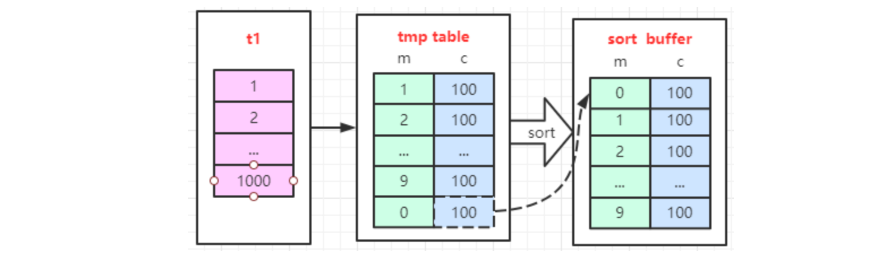

## 前置知识

### sql的执行顺序

在平常的工作中，后端开发或者数据库管理员应该是接触到SQL编写场景最频繁的用户，虽然,我们能够正常的通过需求完成SQL语句的编写，但是还是存在许多的小伙伴对SQL的执行顺序不了解的

其实，了解SQL的执行顺序对我们编写SQL、理解SQL、优化SQL都有很大的帮助，所以在在开始讲解Group by的使用之前，先简单了解下SQL执行的一个顺序

```sql
select...distinct...count()...from...table_name...on..join...where...group by...having...order by...limit
```

sql的执行顺序

```markdown
from -> on -> join -> where -> group by -> having -> count(聚合函数) -> select -> distinct -> order by -> limit
```

执行的顺序步骤解释

1. from: 表示数据的来源

2. on: 表示数据的关联表,执行完后生成一个临时表t1,提供给下一步的操作使用

3. join: 将join表的数据补充到on执行完成的临时表t1中,如: left join则将坐标剩余的数据添加到临时表t1中,如果join超过3个,则重复on...join之间的步骤。

4. where: 根据携带的条件,从临时表中筛选出符合条件的数据,并生成临时表t2。

5. groub by: 根据携带的条件,将临时表t2进行相应的数据分组,并形成临时表t3,**如果语句包含了group by则它后面的字段必须出现在select中或者出现在聚合函数中,否则会报SQL语法错误**。

6. having: 筛选分组后临时表t3的数据,得到临时表t4。

7. count等聚合函数: 对临时表进行指定字段的聚合函数操作,形成临时表t5。

8. select: 从临时表筛选出需要返回的数据,形成临时表t6。

9. distinct: 对临时表t6进行指定的去重筛选,形成临时表t7。

10. order by: 对临时表t7排序,形成临时表t8。

11. limit: 筛选返回的数据条数

#### SQL执行顺序的一些疑问

1. 是先执行group by还是先执行select

通过上面的SQL顺序执行可知,其实是限制性分组group by再进行查询数据的筛选。

2. 为什么group by和select同时使用时,select中的字段必须出现在group by后或者聚合函数中。

 在SQL执行顺序中可以发现,是先执行group by再执行select,所以此时数据就可以能存在分组的一个字段对应非分组字段的多条数据,如果此时查询非分组字段,则可能出现歧义。**如:使用班级分组,但是查询班级中的学生,此时一个班级对应多个学生,无法在分组的同时又查询单个学生,所以会出现歧义。**

3. 如何实现数据去重

**在SQL中可以通过关键字distinct去重,也可以通过group by分组实现去重**,但实际上,如果数据量很大的话,**使用distinct去重的效率会很慢,使用Group by去重的效率会更高**,而且,很多distinct关键字在很多数据库中只支持对某个字段去重,无法实现对多个字段去重,如Postgresql数据库。**(测试数据300w+,使用distinct去重需要十几秒,使用group by去重只需要几秒)**

### explain

> 参照网址：https://segmentfault.com/a/1190000023565685

使用优化器可以模拟优化器执行SQL查询语句，从而知道MySQL怎么处理你的SQL语句的，分析你的查询语句和表结构的性能瓶颈

explain能够干什么

- 读取表的顺序
- 哪些索引能够被使用
- 数据读取操作的操作类型
- 哪些索引能够被实际使用
- 表之间的引用
- 每张表有多少行被物理查询

#### 应用实例

1. 创建一个学习使用的数据库

```sql
CREATE DATABASE /*!32312 IF NOT EXISTS*/`mydb` /*!40100 DEFAULT CHARACTER SET utf8 */;

USE `mydb`;

/*Table structure for table `course` */

DROP TABLE IF EXISTS `course`;

CREATE TABLE `course` (
  `id` int(10) NOT NULL AUTO_INCREMENT,
  `name` varchar(20) DEFAULT NULL,
  PRIMARY KEY (`id`)
) ENGINE=InnoDB AUTO_INCREMENT=21 DEFAULT CHARSET=utf8;

/*Data for the table `course` */

insert  into `course`(`id`,`name`) values 
(1,'语文'),(2,'高等数学'),(3,'视听说'),(4,'体育'),(5,'马克思概况'),(6,'民族理论'),(7,'毛中特'),(8,'计算机基础'),(9,'深度学习'),(10,'Java程序设计'),(11,'c语言程序设计'),(12,'操作系统'),(13,'计算机网络'),(14,'计算机组成原理'),(15,'数据结构'),(16,'数据分析'),(17,'大学物理'),(18,'数字逻辑'),(19,'嵌入式开发'),(20,'需求工程');

/*Table structure for table `stu_course` */

DROP TABLE IF EXISTS `stu_course`;

CREATE TABLE `stu_course` (
  `sid` int(10) NOT NULL,
  `cid` int(10) NOT NULL,
  PRIMARY KEY (`sid`,`cid`)
) ENGINE=InnoDB DEFAULT CHARSET=utf8;

/*Data for the table `stu_course` */

insert  into `stu_course`(`sid`,`cid`) values 
(1,2),(1,4),(1,14),(1,16),(1,19),(2,4),(2,8),(2,9),(2,14),(3,13),(3,14),(3,20),(4,5),(4,8),(4,9),(4,11),(4,16),(5,4),(5,8),(5,9),(5,11),(5,12),(5,16),(6,2),(6,14),(6,17),(7,1),(7,8),(7,15),(8,2),(8,3),(8,7),(8,17),(9,1),(9,7),(9,16),(9,20),(10,4),(10,12),(10,14),(10,20),(11,3),(11,9),(11,16),(12,3),(12,7),(12,9),(12,12),(13,1),(13,5),(13,13),(14,1),(14,3),(14,18),(15,1),
(15,9),(15,15),(16,2),(16,7);

/*Table structure for table `student` */

DROP TABLE IF EXISTS `student`;

CREATE TABLE `student` (
  `id` int(10) NOT NULL AUTO_INCREMENT,
  `name` varchar(20) DEFAULT NULL,
  `age` int(2) DEFAULT NULL,
  PRIMARY KEY (`id`),
  KEY `name` (`name`),
  KEY `name_age` (`name`,`age`),
  KEY `id_name_age` (`id`,`name`,`age`)
) ENGINE=InnoDB AUTO_INCREMENT=31 DEFAULT CHARSET=utf8;

/*Data for the table `student` */

insert  into `student`(`id`,`name`,`age`) values 
(25,'乾隆',17),(14,'关羽',43),(13,'刘备',12),(28,'刘永',12),(21,'后裔',12),(30,'吕子乔',28),(18,'嬴政',76),(22,'孙悟空',21),(4,'安其拉',24),(6,'宋江',22),(26,'康熙',51),(29,'张伟',26),(20,'张郃',12),(12,'张飞',32),(27,'朱元璋',19),(11,'李世民',54),(9,'李逵',12),(8,'林冲',43),(5,'橘右京',43),(24,'沙和尚',25),(23,'猪八戒',22),(15,'王与',21),(19,'王建',23),(10,'王莽',43),(16,'秦叔宝',43),(17,'程咬金',65),(3,'荆轲',21),(2,'诸葛亮',71),(7,'钟馗',23),(1,'鲁班',21);
```

这个数据库实际上的业务是:学生表 - 选课表 - 课程表

2. 如何使用explain

使用而`explain`很简单就是，在你书写的SQL语句加一个单词 - `explain`，然后将 `explain `+ SQL执行后会出现一个表，这个表会告诉你MySQL优化器是怎样执行你的SQL的

就比如执行下面一句语句：

```sql
EXPLAIN SELECT * FROM student
```

MySQL会给你反馈下面一个信息：

```brainfuck
    id  select_type  table    partitions  type    possible_keys  key       key_len  ref       rows  filtered  Extra        
------  -----------  -------  ----------  ------  -------------  --------  -------  ------  ------  --------  -------------
     1  SIMPLE       student  (NULL)      index   (NULL)         name_age  68       (NULL)      30    100.00  Using index  
```

具体这些信息是干什么的，会对你有什么帮助，会在下面告诉你

#### explain各个字段

- id ：select查询的序列号，包含一组数字，表示查询中执行select子句或操作表的顺序
- select_type ：查询类型 或者是 其他操作类型
- table ：正在访问哪个表
- partitions ：匹配的分区
- type ：访问的类型
- possible_keys ：显示可能应用在这张表中的索引，一个或多个，但不一定实际使用到
- key ：实际使用到的索引，如果为NULL，则没有使用索引
- key_len ：表示索引中使用的字节数，可通过该列计算查询中使用的索引的长度
- ref ：显示索引的哪一列被使用了，如果可能的话，是一个常数，哪些列或常量被用于查找索引列上的值
- rows ：根据表统计信息及索引选用情况，大致估算出找到所需的记录所需读取的行数
- filtered ：查询的表行占表的百分比
- Extra ：包含不适合在其它列中显示但十分重要的额外信息

上面介绍了每个字段的意思，可以大体看一下，下面会逐一介绍每个字段表示的啥？该关注什么？

##### id与table字段

为什么要将`id`和`table`放在一起讲呢？因为通过这两个字段可以**完全**判断出你的每一条SQL语句的执行顺序和表的查询顺序

先看`id`后看`table`，`id`和`table`在SQL执行判断过程中的关系就像是足球联赛的积分榜，首先一个联赛的球队排名应该先看积分，积分越高的球队排名越靠前，当两支或多只球队的积分一样高怎么办呢？那我们就看净胜球，净胜球越多的球队，排在前面

而在`explain`中你可以把id看作是球队积分，`table`当作是净胜球

```sql
EXPLAIN
SELECT 
    S.id,S.name,S.age,C.id,C.name
FROM course C JOIN stu_course SC ON C.id = SC.cid
JOIN student S ON S.id = SC.sid
```

结果是这样：

```pgsql
    id  select_type  table   partitions  type    possible_keys        key      key_len  ref      
------  -----------  ------  ----------  ------  -------------------  -------  -------  ----------- 
     1  SIMPLE       SC      (NULL)      index   PRIMARY              PRIMARY  8        (NULL)     
     1  SIMPLE       C       (NULL)      eq_ref  PRIMARY              PRIMARY  4        mydb.SC.cid 
     1  SIMPLE       S       (NULL)      eq_ref  PRIMARY,id_name_age  PRIMARY  4        mydb.SC.sid
```

我们看到`id`全是1，那就说明光看id这个值是看不出来每个表的读取顺序的，那我们就来看`table`这一行，它的读取顺序是**自上向下**的，所以，这三个表的读取顺序应当是：SC - C - S

再来看一条SQL

```sql
EXPLAIN
SELECT * 
FROM course AS C 
WHERE C.`id` = (
    SELECT SC.`cid` 
    FROM stu_course AS SC 
    WHERE SC.`sid` = 
    (
        SELECT 
            S.`id` 
        FROM student AS S
        WHERE  S.`name` = "安其拉"
    ) ORDER BY SC.`cid` LIMIT 1
)
```

这条语句是查询结果是：一个叫安其拉的学生选的课里面，课程`id`最小的一门课的信息，然后来看一下`explain`的结果吧

```pgsql
    id  select_type  table   partitions  type    possible_keys  key      key_len  ref    
------  -----------  ------  ----------  ------  -------------  -------  -------  ------  
     1  PRIMARY      C       (NULL)      const   PRIMARY        PRIMARY  4        const   
     2  SUBQUERY     SC      (NULL)      ref     PRIMARY        PRIMARY  4        const  
     3  SUBQUERY     S       (NULL)      ref     name,name_age  name     63       const 
```

此时我们发现id是不相同的，所以我们很容易就看出表读取的顺序了是吧！C - SC - S

注意！！！！！！你仔细看一下最里面的子查询是查询的哪个表，是S这张表，然后外面一层呢？是SC这张表，最外面这一层呢？是C这张表，所以执行顺序应该是啥呢？是....是.....难道是S - SC - C吗？是`id`越大的`table`读取越在前面吗？是的！这就像刚才说的足球联赛积分，分数越高的球队的排序越靠前

当然还有下面这种情况

```sql
EXPLAIN
SELECT * 
FROM course AS C 
WHERE C.`id` IN (
    SELECT SC.`cid` 
    FROM stu_course AS SC 
    WHERE SC.`sid` = 
    (
        SELECT 
            S.`id` 
        FROM student AS S
        WHERE  S.`name` = "安其拉"
    )
)
```

这个查询是：查询安其拉选课的课程信息

```pgsql
    id  select_type  table   partitions  type    possible_keys  key      key_len  ref           
------  -----------  ------  ----------  ------  -------------  -------  -------  ----------- 
     1  PRIMARY      SC      (NULL)      ref     PRIMARY        PRIMARY  4        const       
     1  PRIMARY      C       (NULL)      eq_ref  PRIMARY        PRIMARY  4        mydb.SC.cid 
     3  SUBQUERY     S       (NULL)      ref     name,name_age  name     63       const        
```

结果很明确：先看`id`应该是S表最先被读取，SC和C表`id`相同，然后table中SC更靠上，所以第二张读取的表应当是SC，最后读取C

##### select_type字段

1. `SIMPLE` 简单查询，不包括子查询和`union`查询

```sql
EXPLAIN 
SELECT * FROM student JOIN stu_course ON student.`id` = sid
```

```pgsql
    id  select_type  table       partitions  type    possible_keys        key      
------  -----------  ----------  ----------  ------  -------------------  --------  
     1  SIMPLE       student     (NULL)      index   PRIMARY,id_name_age  name_age  
     1  SIMPLE       stu_course  (NULL)      ref     PRIMARY              PRIMARY  
```

2. `PRIMARY` 当存在子查询时，最外面的查询被标记为主查询

3. `SUBQUERY` 子查询

```sql
EXPLAIN
SELECT SC.`cid` 
FROM stu_course AS SC 
WHERE SC.`sid` = 
(
    SELECT 
        S.`id` 
    FROM student AS S
    WHERE  S.`name` = "安其拉"
)
```

```pgsql
    id  select_type  table   partitions  type    possible_keys  key      key_len  ref      
------  -----------  ------  ----------  ------  -------------  -------  -------  ------ 
     1  PRIMARY      SC      (NULL)      ref     PRIMARY        PRIMARY  4        const  
     2  SUBQUERY     S       (NULL)      ref     name,name_age  name     63       const   
```

4. `UNION` 当一个查询在`UNION`关键字之后就会出现`UNION`

5. `UNION RESULT` 连接几个表查询后的结果

```sql
EXPLAIN
SELECT * FROM student WHERE id = 1
UNION
SELECT * FROM student WHERE id = 2
```

```sql
    id  select_type   table       partitions  type    possible_keys        key      
------  ------------  ----------  ----------  ------  -------------------  ------- 
     1  PRIMARY       student     (NULL)      const   PRIMARY,id_name_age  PRIMARY  
     2  UNION         student     (NULL)      const   PRIMARY,id_name_age  PRIMARY 
(NULL)  UNION RESULT  <union1,2>  (NULL)      ALL     (NULL)               (NULL)   
```

上面可以看到第三行`table`的值是`<union1,2>`

6. `DERIVED` 在`FROM`列表中包含的子查询被标记为`DERIVED`（衍生），MySQL会递归执行这些子查询，把结果放在临时表中

MySQL5.7+ 进行优化了，增加了derived_merge（派生合并），默认开启，可加快查询效率，[如果你想了解更详细的派生合并请点击这里](https://link.segmentfault.com/?enc=S7QhPKSVRWQvn4kE0LdLuw%3D%3D.QkbZogFeaU0%2Bk8kzqLmUHGxBRWebHkCMb9lMp8yI8HNEmnG5IJuh0KCp28oZxyfBByrHjMutyGONKrTizK%2FpcQ%3D%3D)，当你的MySQL是5.7及以上版本时你要将derived_merge关闭后才能看到`DERIVED` 状态

```sql
set session optimizer_switch='derived_merge=off';
set global optimizer_switch='derived_merge=off'; 
EXPLAIN
SELECT * FROM 
(
    SELECT * 
    FROM student AS S JOIN stu_course AS SC 
    ON S.`id` = SC.`sid`
) AS SSC
```

```pgsql
    id  select_type  table       partitions  type    possible_keys        key       
------  -----------  ----------  ----------  ------  -------------------  -------- 
     1  PRIMARY      <derived2>  (NULL)      ALL     (NULL)               (NULL)    
     2  DERIVED      S           (NULL)      index   PRIMARY,id_name_age  name_age 
     2  DERIVED      SC          (NULL)      ref     PRIMARY              PRIMARY
```

上面我们观察，最外层的主查询的表是`<derived2>`,而S和SC表的`select_type`都是`DERIVED`,这说明S和SC都被用来做衍生查询，而这两张表查询的结果组成了名为`<derived2>`的衍生表，而衍生表的命名就是`<select_type + id>`

##### partitions字段

该列显示的为分区表命中的分区情况。非分区表该字段为空（null）。

##### type字段

首先说一下这个字段，要记住以下10个状态，（从左往右，越靠左边的越优秀）

```pgsql
NULL > system > const > eq_ref > ref > ref_or_null > index_merge > range > index > ALL
```

1. `NULL` MySQL能够在优化阶段分解查询语句，在执行阶段用不着再访问表或索引

有没有这样一种疑惑，不查询索引也不查询表那你的数据是从哪里来的啊？谁说`SELECT`语句必须查询某样东西了？

```sql
EXPLAIN SELECT 5*7
```

```pgsql
    id  select_type  table   partitions  type    possible_keys  key     
------  -----------  ------  ----------  ------  -------------  ------ 
     1  SIMPLE       (NULL)  (NULL)      (NULL)  (NULL)         (NULL) 
```

我就简简单单算个数

但是！！如果只是这样的话我们还`explain`个毛线啊！我很闲吗？

存在这样一种情况，大家都知道索引是将数据在B+Tree中进行排序了，所以你的查询速率才这么高，那么B+树的最边上的叶子节点是不是要么是最大值要么是最小值啊？既然你都知道了，那MySQL比你更知道啊！当你要查询最大值或者最小值时，MySQL会直接到你的索引得分叶子节点上直接拿，所以不用访问表或者索引

```sql
EXPLAIN SELECT MAX(id) FROM student
    id  select_type  table   partitions  type    possible_keys  key    
------  -----------  ------  ----------  ------  -------------  ------ 
     1  SIMPLE       (NULL)  (NULL)      (NULL)  (NULL)         (NULL) 
```

但是！你要记住，`NULL`的前提是你已经建立了索引

2. `SYSTEM` 表只有一行记录（等于系统表），这是`const`类型的特列，平时不大会出现，可以忽略
3. `const` 表示通过索引一次就找到了

`const`用于比较`primary key`或`uique`索引，因为只匹配一行数据，所以很快，如主键置于`where`列表中，MySQL就能将该查询转换为一个常量

简单来说，`const`是直接按主键或唯一键读取

```sql
EXPLAIN
SELECT * FROM student AS S WHERE id = 10
```

```brainfuck
id  select_type  table   partitions  type    possible_keys  key      
------  -----------  ------  ----------  ------  -------------  -------  
1  SIMPLE       S       (NULL)      const   PRIMARY        PRIMARY  
```

4. `eq_ref` 用于联表查询的情况，按联表的主键或唯一键联合查询

多表`join`时，对于来自前面表的每一行，在**当前表中只能找到一行**。这可能是除了`system`和`const`之外最好的类型。当主键或唯一非`NULL`索引的所有字段都被用作`join`联接时会使用此类型

```sql
EXPLAIN
SELECT * FROM student AS S JOIN stu_course AS SC ON  S.`id` = SC.`cid` 
```

```pgsql
id  select_type  table   partitions  type    possible_keys  key     
------  -----------  ------  ----------  ------  -------------  -------  
     1  SIMPLE       SC      (NULL)      index   (NULL)         PRIMARY  
     1  SIMPLE       S       (NULL)      eq_ref  PRIMARY        PRIMARY 
```

以上面查询为例，我们观察`id`和`table`会知道，先是从SC表中取出一行数据，然后再S表查找匹配的数据，我们观察，SC中取出cid和S表中的id比较，毫无疑问因为id是S表中的主键（不重复），所以只能出现一个id与cid的值相同。所以！满足条件 S 表的 `type`为`eq_ref`

5. `ref` 可以用于单表扫描或者连接

如果是连接的话，驱动表的一条记录能够在被驱动表中通过非唯一（主键）属性所在索引中匹配多行数据，或者是在单表查询的时候通过非唯一（主键）属性所在索引中查到一行数据

```sql
EXPLAIN 
SELECT * FROM student AS S JOIN stu_course AS SC ON S.id = SC.`sid`
```

不要在意SQL，以上SQL没有实际查询的意义只是用于表达用例

```pgsql
    id  select_type  table   partitions  type    possible_keys  key      
------  -----------  ------  ----------  ------  -------------  -------  
     1  SIMPLE       S       (NULL)      ALL     PRIMARY        (NULL)   
     1  SIMPLE       SC      (NULL)      ref     PRIMARY        PRIMARY  
```

SC的主键索引是（cid,sid）所以sid列中肯定是重复的数据，虽然在后面的`key`中显示使用了主键索引。然后，就很明确了S.id一行能在SC表中通过索引查询到多行数据

下面是单表了，写一个例子，但是不细讲了

```sql
EXPLAIN
SELECT * FROM student AS S WHERE S.`name` = "张飞"
    id  select_type  table   partitions  type    possible_keys  key        
------  -----------  ------  ----------  ------  -------------  ---------- 
     1  SIMPLE       S       (NULL)      ref     index_name     index_name
```

注意`name`字段是有索引的

6. `ref_or_null` 类似ref，但是可以搜索值为`NULL`的行

```sql
EXPLAIN
SELECT * FROM student AS S WHERE S.`name` = "张飞" OR S.`name` IS NULL
```

```brainfuck
id  select_type  table   partitions  type         possible_keys  key        
------  -----------  ------  ----------  -----------  -------------  ----------  
     1  SIMPLE       S       (NULL)      ref_or_null  index_name     index_name  
```

7. `index_merge` 表示查询使用了两个以上的索引，最后取交集或者并集

常见`and `，`or`的条件使用了不同的索引，官方排序这个在`ref_or_null`之后，但是实际上由于要读取多个索引，性能可能大部分时间都不如`range`

```sql
EXPLAIN
SELECT * FROM student AS S WHERE S.`name` LIKE "张%" OR S.`age` = 30
```

```brainfuck
    id  select_type  table   partitions  type         possible_keys         key                   
------  -----------  ------  ----------  -----------  --------------------  -------------------- 
     1  SIMPLE       S       (NULL)      index_merge  index_name,index_age  index_name,index_age 
```

8. `range` 索引范围查询

常见于使用 =, <>, >, >=, <, <=, IS NULL, <=>, BETWEEN, IN()或者like等运算符的查询中

```sql
EXPLAIN
SELECT S.`age` FROM student  AS S WHERE S.`age` > 30
```

```brainfuck
id  select_type  table   partitions  type    possible_keys         key         
------  -----------  ------  ----------  ------  --------------------  ----------  
     1  SIMPLE       S       (NULL)      range   index_name,index_age  index_name 
```

9. `index` `index`只遍历索引树，通常比`All`快

因为，索引文件通常比数据文件小，也就是虽然`all`和`index`都是读全表，但`index`是从索引中读取的，而`all`是从硬盘读的

```sql
EXPLAIN
SELECT S.`name` FROM student AS S 
```

```brainfuck
    id  select_type  table   partitions  type    possible_keys  key         
------  -----------  ------  ----------  ------  -------------  ----------  
     1  SIMPLE       S       (NULL)      index   (NULL)         index_name  
```

10. `ALL` 如果一个查询的`type`是`All`,并且表的数据量很大，那么请解决它

##### possible_keys字段

这个表里面存在且可能会被使用的索引，可能会在这个字段下面出现，但是一般都以`key`为准

##### key字段

实际使用的索引，如果为`null`,则没有使用索引，否则会显示你使用了哪些索引，查询中若使用了覆盖索引（查询的列刚好是索引），则该索引仅出现在`key`列表

##### ref字段

显示哪些列被使用了，如果可能的话，最好是一个常数。哪些列或常量被用于查找索引列上的值

##### rows字段和Filter字段

`rows`是根据表的统计信息和索引的选用情况，优化器大概帮你估算出你执行这行函数所需要查询的行数。

`Filter`是查询的行数与总行数的比值。其实作用与`rows`差不多，都是数值越小，效率越高

##### Extra字段

这一字段包含不适合在其他列显示，但是也非常重要的额外信息

1. `Using filesort`

表示当SQL中有一个地方需要对一些数据进行排序的时候，优化器找不到能够使用的索引，所以只能使用外部的索引排序，外部排序就不断的在磁盘和内存中交换数据，这样就摆脱不了很多次磁盘IO，以至于SQL执行的效率很低。反之呢？由于索引的底层是B+Tree实现的，他的叶子节点本来就是有序的，这样的查询能不爽吗？

```sql
EXPLAIN
SELECT * FROM course AS C ORDER BY C.`name` 
```

```pgsql
 type    possible_keys  key     key_len  ref       rows  filtered  Extra           
 ------  -------------  ------  -------  ------  ------  --------  ----------------
 ALL     (NULL)         (NULL)  (NULL)   (NULL)      20    100.00  Using filesort  
```

没有给`C.name`建立索引，所以在根据`C.name`排序的时候，他就使用了外部排序

2. `Using tempporary` 

表示在对MySQL查询结果进行排序时，使用了临时表,,这样的查询效率是比外部排序更低的，常见于`order by`和`group by`

```sql
EXPLAIN
SELECT C.`name` FROM course AS C GROUP BY C.`name`
```

```pgsql
possible_keys  key     key_len  ref       rows  filtered  Extra                            
-------------  ------  -------  ------  ------  --------  ---------------------------------
(NULL)         (NULL)  (NULL)   (NULL)      20    100.00  Using temporary; Using filesort  
```

上面这个查询就是同时触发了`Using temporary`和`Using filesort`，可谓是雪上加霜

3. `Using index` 表示使用了索引，很优秀

4. `Using where` 使用了`where`但是好像没啥用

5. `Using join buffer` 表明使用了连接缓存,比如说在查询的时候，多表`join`的次数非常多，那么将配置文件中的缓冲区的`join buffer`调大一些

6. `impossible where` 筛选条件没能筛选出任何东西

7. `distinct` 优化`distinct`操作，在找到第一匹配的元组后即停止找同样值的动作


## group by优化

> 参考网址：http://www.codebaoku.com/it-mysql/it-mysql-199346.html

在MySQL中，新建立一张表，该表有三个字段，分别是id，a，b，插入1000条每个字段都相等的记录，如下：

```sql
mysql> show create table t1\G
*************************** 1. row ***************************
  Table: t1
Create Table: CREATE TABLE `t1` (
`id` int(11) NOT NULL,
`a` int(11) DEFAULT NULL,
`b` int(11) DEFAULT NULL,
PRIMARY KEY (`id`),
KEY `a` (`a`)
) ENGINE=InnoDB DEFAULT CHARSET=utf8
1 row in set (0.00 sec)
mysql> select * from t1 limit 10;
+----+------+------+
| id | a  | b  |
+----+------+------+
| 1 |  1 |  1 |
| 2 |  2 |  2 |
| 3 |  3 |  3 |
| 4 |  4 |  4 |
| 5 |  5 |  5 |
| 6 |  6 |  6 |
| 7 |  7 |  7 |
| 8 |  8 |  8 |
| 9 |  9 |  9 |
| 10 |  10 |  10 |
+----+------+------+
10 rows in set (0.00 sec)
```

当我们执行下面包含group by的SQL时，查看执行计划，可以看到：

```sql
mysql> explain select id%10 as m, count(*) as c from t1 group by m limit 10;
+----+-------------+-------+------------+-------+---------------+------+---------+------+------+----------+----------------------------------------------+
| id | select_type | table | partitions | type | possible_keys | key | key_len | ref | rows | filtered | Extra                    |
+----+-------------+-------+------------+-------+---------------+------+---------+------+------+----------+----------------------------------------------+
| 1 | SIMPLE   | t1  | NULL    | index | PRIMARY,a   | a  | 5    | NULL | 1000 |  100.00 | Using index; Using temporary; Using filesort |
+----+-------------+-------+------------+-------+---------------+------+---------+------+------+----------+----------------------------------------------+
1 row in set, 1 warning (0.00 sec)
```

最后面的Extra字段有：

- using index：覆盖索引
- using temporary：使用了内存临时表
- using filesort：使用了排序操作

为了更好的理解这个group by语句的执行过程，我画一个图来表示：



对照上面这个表，我们不难发现，这个group by的语句执行流程是下面这样的：

1. 首先创建内存临时表，内存表里有两个字段m和c，主键是m；m是id%10，而c是统计的count(*) 个数

2. 扫描表t1的索引a，依次取出叶子节点上的id值，计算id%10的结果，记为x；此时如果临时表中没有主键为x的行，就插入一个记录(x,1);如果表中有主键为x的行，就将x这一行的c值加1

3. 遍历完成后，再根据字段m做排序，得到结果集返回给客户端。（注意，这个排序的动作是group by自动添加的）

如果我们不想让group by语句帮我们自动排序，可以添加上order by null在语句的末尾，这样就可以去掉order by之后的排序过程了。如下：

```sql
mysql> explain select id%10 as m, count(*) as c from t1 group by m order by null;
+----+-------------+-------+------------+-------+---------------+------+---------+------+------+----------+------------------------------+
| id | select_type | table | partitions | type | possible_keys | key | key_len | ref | rows | filtered | Extra            |
+----+-------------+-------+------------+-------+---------------+------+---------+------+------+----------+------------------------------+
| 1 | SIMPLE   | t1  | NULL    | index | PRIMARY,a   | a  | 5    | NULL | 1000 |  100.00 | Using index; Using temporary |
+----+-------------+-------+------------+-------+---------------+------+---------+------+------+----------+------------------------------+
1 row in set, 1 warning (0.00 sec)
```

可以看到，explain最后面的using filesort字样已经不见了。再来看下结果：

```sql
mysql> select id%10 as m, count(*) as c from t1 group by m;
+------+-----+
| m  | c  |
+------+-----+
|  0 | 100 |
|  1 | 100 |
|  2 | 100 |
|  3 | 100 |
|  4 | 100 |
|  5 | 100 |
|  6 | 100 |
|  7 | 100 |
|  8 | 100 |
|  9 | 100 |
+------+-----+
10 rows in set (0.00 sec)
mysql> select id%10 as m, count(*) as c from t1 group by m order by null;
+------+-----+
| m  | c  |
+------+-----+
|  1 | 100 |
|  2 | 100 |
|  3 | 100 |
|  4 | 100 |
|  5 | 100 |
|  6 | 100 |
|  7 | 100 |
|  8 | 100 |
|  9 | 100 |
|  0 | 100 |
+------+-----+
10 rows in set (0.00 sec)
```

当我们不加order by null的时候，group by会自动为我们进行排序，所以m=0的记录会在第一条的位置，如果我们加上order by null，那么group by就不会自动排序，那么m=0的记录就在最后面了

我们当前这个语句，表t1中一共有1000条记录，对10取余，只有10个结果，在内存临时表中还可以放下，内存临时表在MySQL中，通过tmp_table_size来控制

```sql
mysql> show variables like "%tmp_table%";
+----------------+----------+
| Variable_name | Value  |
+----------------+----------+
| max_tmp_tables | 32    |
| tmp_table_size | 39845888 |
+----------------+----------+
2 rows in set, 1 warning (0.00 sec)
```

当我们的结果足够大，而内存临时表不足以保存的时候，MySQL就会使用磁盘临时表，整个访问的速度就变得很慢了。那么针对group by操作，我们如何优化？

### group by优化之索引

从上面的描述中不难看出，group by进行分组的时候，创建的临时表都是带一个唯一索引的。如果数据量很大，group by的执行速度就会很慢，要想优化这种情况，还得分析为什么group by 需要临时表？

这个问题其实是因为group by的逻辑是统计不同的值出现的次数，由于每一行记录做group by之后的结果都是无序的，所以就需要一个临时表存储这些中间结果集。如果我们的所有值都是排列好的，有序的，那情况会怎样呢？

例如，我们有个表的记录id列是：

```markdown
0,0,0,1,1,2,2,2,2,3,4,4，
```

当我们使用group by的时候，就直接从左到右，累计相同的值即可。这样就不需要临时表了。

上面的结构我们也不陌生，当我们以在某个数据列上创建索引的时候，这个列本身就是排序的，当group by是以这个列为条件的时候，那么这个过程就不需要排序，因为索引是自然排序的。为了实现这个优化，我们给表t1新增一个列z，如下：

```sql
mysql> alter table t1 add column z int generated always as(id % 10), add index(z);
Query OK, 0 rows affected (0.02 sec)
Records: 0 Duplicates: 0 Warnings: 0

mysql> select z as m, count(*) as c from t1 group by z;
+------+-----+
| m  | c  |
+------+-----+
|  0 | 100 |
|  1 | 100 |
|  2 | 100 |
|  3 | 100 |
|  4 | 100 |
|  5 | 100 |
|  6 | 100 |
|  7 | 100 |
|  8 | 100 |
|  9 | 100 |
+------+-----+
10 rows in set (0.00 sec)

mysql> explain select z as m, count(*) as c from t1 group by z;
+----+-------------+-------+------------+-------+---------------+------+---------+------+------+----------+-------------+
| id | select_type | table | partitions | type | possible_keys | key | key_len | ref | rows | filtered | Extra    |
+----+-------------+-------+------------+-------+---------------+------+---------+------+------+----------+-------------+
| 1 | SIMPLE   | t1  | NULL    | index | z       | z  | 5    | NULL | 1000 |  100.00 | Using index |
+----+-------------+-------+------------+-------+---------------+------+---------+------+------+----------+-------------+
1 row in set, 1 warning (0.00 sec)
```

我们新增字段z，z的值是id%10之后的值，并且创建索引，再通过group by对这个z列进行分组，可以看到，结果中已经没有临时表了

所以，使用索引可以帮助我们去掉group by依赖的临时表

### group by优化---直接排序

如果我们已经知道表的数据量特别大，内存临时表肯定不足以容纳排序的时候，其实我们可以通过告知group by进行磁盘排序，而直接跳过内存临时表的排序过程。

其实在MySQL中是有这样的方法的：在group by语句中加入SQL_BIG_RESULT这个提示（hint），就可以告诉优化器：这个语句涉及的数据量很大，请直接用磁盘临时表。当我们使用这个语句的时候，MySQL将自动利用数组的方法来组织磁盘临时表中的字段，而不是我们所周知的B+树。关于这个知识点，这里给出官方文档的介绍：

> *SQL_BIG_RESULT or SQL_SMALL_RESULT can be used with GROUP BY or DISTINCT to tell the optimizer that the result set has many rows or is small, respectively. For SQL_BIG_RESULT, MySQL directly uses disk-based temporary tables if they are created, and prefers sorting to using a temporary table with a key on the GROUP BY elements. For SQL_SMALL_RESULT, MySQL uses in-memory temporary tables to store the resulting table instead of using sorting. This should not normally be needed.*

整个group by的处理过程将会变成：

1. 初始化sort_buffer，确定放入一个整型字段，记为m

2. 扫描表t1的索引a，依次取出里面的id值, 将 id%100的值存入sort_buffer中
3. 扫描完成后，对sort_buffer的字段m做排序（如果sort_buffer内存不够用，就会利用磁盘临时文件辅助排序）
4. 排序完成后，就得到了一个有序数组。类似0,0,0,1,1,2,2,3,3,3,4,4,4,4这样
5. 根据有序数组，得到数组里面的不同值，以及每个值的出现次数

**MySQL什么时候会使用内部临时表？**

1. 如果语句执行过程可以一边读数据，一边直接得到结果，是不需要额外内存的，否则就需要额外的内存，来保存中间结果

2. 如果执行逻辑需要用到二维表特性，就会优先考虑使用临时表。比如union需要用到唯一索引约束， group by还需要用到另外一个字段来存累积计数

