> 官方网址：https://reactnative.dev/docs
>
> 参考网址：https://www.twle.cn/c/yufei/reactnative/reactnative-basic-index.html
>
> 参考网址：https://clwy.cn/guide/documents/clwy-react-native

## 基础

### 概述

> React Native 是一个使用 [JavaScript](https://www.twle.cn/l/yufei/javascript/javascript-basic-index.html) 和 [React](https://www.twle.cn/l/yufei/react/react-basic-index.html) 来编写跨终端移动应用 ( [Android](https://www.twle.cn/l/yufei/android/android-basic-index.html) 或 iOS ） 的一种解决方案
>
> 现在绝大多数 App 都采用混合模型开发，固定的，基础的组件使用 Java 或 Swift 等原生语言开发，而偏运营的组件和页面则采用 React Native 等 H5 形式开发。
>
> 现在的 iOS 审核速度已经很快了，几乎一天就有结果，但是之前，可能要审核一周，半个月，甚至还会不通过，然后又要重新开始进入审核等待，这对于大部分需要频繁更新的 App 来说是不可接受的。
>
> 在这种情况下，React Native 出现了，它的首打功能就是 **热更新技术**。
>
> **热更新** 技术可以稍微的绕过应用商店的审核而直接更新。这样就可以达到快速上线功能的目的。
>
> 对于 React Native，官方的介绍可能更能体现出它的诞生前因后果。
>
> 1. React Native 让我们可以只使用 `JavaScript` 语言就能构建出手机 APP。
>
> 2. React Native 采用 React 作为底层框架，如果你会 React 那么就很容易上手 React Native。
>
> 3. React Native 采用声明性组件中创建丰富的移动 UI。
>
>    使用 React Native，你不是在构建移动 Web 应用程序，也不是在构建 HTML5 应用程序，更不是在构建混合应用程序。你是在构建了一个真正的移动应用程序，与使用 Objective-C 或 Java 构建的应用程序没啥区别的。
>
> 4. React Native 使用与原生 iOS 和 Android 应用相同的基本 UI 构建块。如果你熟悉原生 iOS 或 Android 开发，那么只需要使用 JavaScript 和 React 将这些构建块放在一起。

### 环境配置

```markdown
此页面将帮助您安装和构建您的第一个 React Native 应用程序。

如果您不熟悉移动开发，最简单的入门方法是使用 Expo CLI。Expo 是一套围绕 React Native 构建的工具，虽然它有很多特性，但对我们来说最相关的特性是它可以让你在几分钟内编写一个 React Native 应用程序。您只需要最新版本的 Node.js 和手机或模拟器。如果您想在安装任何工具之前直接在 Web 浏览器中试用 React Native，您可以试用Snack。

如果您已经熟悉移动开发，您可能想使用 React Native CLI。它需要 Xcode 或 Android Studio 才能开始。如果您已经安装了这些工具之一，您应该能够在几分钟内启动并运行。如果未安装它们，您应该花费大约一个小时来安装和配置它们。

也就是说可以通过两种方式来创建react native应用
- expo cli 缺少本地应用的一些调用
- react native cli 完全可以运行在本地环境中
```

这里我就不看expo cli了，需要的可以进入官网了解`https://reactnative.dev/docs/environment-setup`，下面选择react native cli来配置和创建react native应用

> React Native 的环境配置有点复杂，具体来说分为三大部分
>
> 1. `Node.js` 以及 `NPM` 或 `Yarn` 的安装与配置。
> 2. `Android` 开发环境以及 `Android` 虚拟机的安装与配置
> 3. `iOS` 开发环境以及 `iOS` 虚拟机的安装与配置。
>
> **Node.js**
>
> ```markdown
> - Node.js直接按照官网的下载安装即可
> ```
>
> **Android**
>
> 略过

#### IOS环境安装

##### Xcode安装

1. 下载安装Xcode

`iOS` 的开发环境也只需要安装 `XCode` 就可以了，方式有两种

- 一种是直接通过App Store搜索Xcode下载，但是这种要求是最新的mac系统
- 一种是通过下载Xcode安装包进行安装

选择第二种，进入官网，或者进入`https://xcodereleases.com/`这个网址，可以看到mac和xcode的对应版本

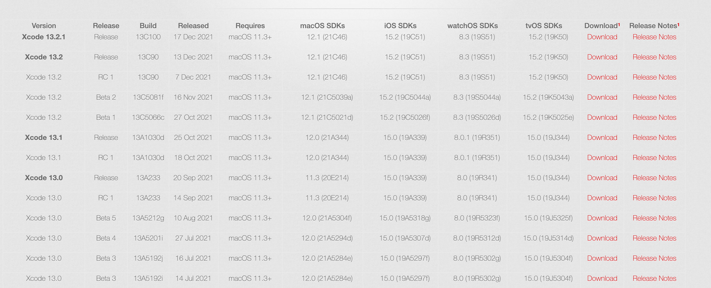

下载对应的版本之后，注意：在下载的时候可能也是非常的慢，可以将下载链接提取出来放到下载器进行下载，解压出来放到对应的目录中即可

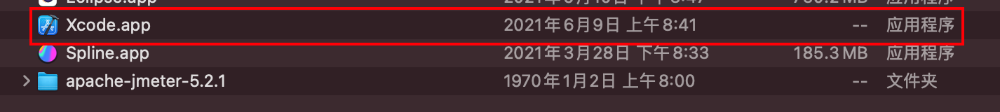

2. 启动Xcode，查看是否安装了Command Line Tools

需要先确认是否安装了Command Line Tools，在菜单中选择：Xocde->Preferences->Locations，查看是否已经安装，刚开始进入的时候，可能没有选中，可以选择对应版本的Command Line Tools

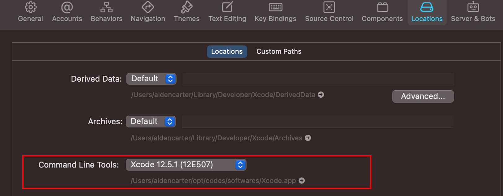

3. 安装IOS模拟器

选择Components，选择自己想要下载的IOS版本，然后点击左边的下载，此时应该是下载速度比较慢，可以打开控制台，监听网络请求，找出下载的文件网址，可以通过搜索`DVTDownloadable`过滤

得到的应该是大概这样的记录

```markdown
16/9/14 下午4:24:06.179 Xcode[11725]:  DVTDownloadable: Download Cancelled. Downloadable: https://devimages.apple.com.edgekey.net/downloads/xcode/simulators/com.apple.pkg.iPhoneSimulatorSDK9_3-9.3.1.1460411551.dmg. 
```

我们可以通过下载器，将这个文件下载下来，注意：`https://devimages.apple.com.edgekey.net/downloads/xcode/simulators/com.apple.pkg.iPhoneSimulatorSDK9_3-9.3.1.1460411551.dmg`下载链接是没有最后的`.`，并且文件名也不能改变，然后放置到`~/Library/Caches/com.apple.dt.Xcode/Downloads`下，注意，com.apple.dt.Xcode看起来不像是一个文件夹，反而像是一个文件，所以你要用显示包内容打开，如果这里没有Downloads文件夹，就直接创建一个就好了，然后把文件放进去

回到步骤1的页面，再次点击下载你刚才要下载的那个iOS模拟器版本，这个时候进度点就会很快了，毕竟已经下载完了，这个时候主要在做验证和安装的工作，一会儿之后就安装成功了

##### Installing dependencies

在依赖的安装上，我们除了需要node.js之外，还需要安装Watchman、CocoaPods

1. 我们建议使用[Homebrew](http://brew.sh/)安装 Watchman 。安装 Homebrew 后，在终端中运行以下命令：

```bash
brew install watchman
```

[Watchman](https://facebook.github.io/watchman)是 Facebook 的一个工具，用于观察文件系统中的变化。强烈建议您安装它以获得更好的性能

2. 安装CocoaPods

> 官网：https://cocoapods.org/
>
> CocoaPods 是 Swift 和 Objective-C Cocoa 项目的依赖管理器。它拥有超过 87,000 个库，并在超过 300 万个应用程序中使用。CocoaPods 可以帮助您优雅地扩展您的项目

[CocoaPods](https://cocoapods.org/)是使用 Ruby 构建的，并且可以使用 macOS 上可用的默认 Ruby 进行安装。您可以使用 Ruby 版本管理器，但我们建议您使用 macOS 上可用的标准 Ruby，除非您知道自己在做什么。

使用默认的 Ruby 安装将需要您`sudo`在安装 gems 时使用。（不过，这只是 gem 安装期间的问题。）

```markdown
这个好像不用安装也可以，我都忘了有没有安装了
```

有关更多信息，请访问[CocoaPods 入门指南](https://guides.cocoapods.org/using/getting-started.html)

#### 内置的命令行界面

React Native 有一个内置的命令行界面。我们建议您在运行时使用`npx`Node.js 附带的访问当前版本，而不是全局安装和管理特定版本的 CLI 。使用`npx react-native <command>`，将在运行命令时下载并执行当前稳定版本的 CLI。

### 创建项目

> 如果您之前安装了全局`react-native-cli`包，请删除它，因为它可能会导致意外问题。

您可以使用 React Native 的内置命令行界面来生成一个新项目。让我们创建一个名为“AwesomeProject”的新 React Native 项目：

```bash
npx react-native init AwesomeProject
```

使用特定版本或模板

```bash
npx react-native init AwesomeProject --version X.XX.X
```

您还可以使用自定义 React Native 模板（如 TypeScript）启动项目，并带有`--template`参数：

```bash
npx react-native init AwesomeTSProject --template react-native-template-typescript
```

> **注意**如果上述命令失败，您的电脑上可能安装了旧版本`react-native`或`react-native-cli`全局安装。尝试卸载 cli 并使用`npx`

### 启动项目

#### Start Metro

首先，您需要启动 Metro，这是 React Native 附带的 JavaScript 打包器。Metro“接受一个入口文件和各种选项，并返回一个包含所有代码及其依赖项的单个 JavaScript 文件。”— [Metro Docs](https://facebook.github.io/metro/docs/concepts)

要启动 Metro，请`npx react-native start`在 React Native 项目文件夹中运行：

```bash
npx react-native start
```

`react-native start` 启动 Metro Bundler

> 如果您使用 Yarn 包管理器，则可以在现有项目中运行 React Native 命令时使用`yarn`代替`npx`。

> 如果您熟悉 Web 开发，Metro 很像 webpack——用于 React Native 应用程序。与 Kotlin 或 Java 不同，JavaScript 不会被编译，React Native 也不会被编译。捆绑与编译不同，但它可以帮助提高启动性能并将一些特定于平台的 JavaScript 转换为更广泛支持的 JavaScript。

#### Start your application

让 Metro Bundler 在自己的终端中运行。在 React Native 项目文件夹中打开一个新终端。运行以下命令：

```bash
npx react-native run-ios
```

您应该很快就会看到您的新应用程序在 iOS 模拟器中运行

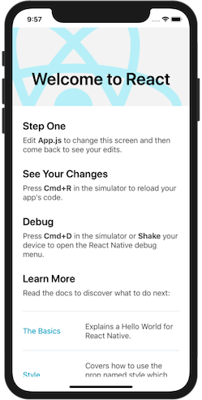

`npx react-native run-ios`是运行应用程序的一种方式。您也可以直接从 Xcode 中运行它

### 项目结构

打开项目后，我们可以看到文件目录结构如下

```markdown
hello
├── App.js
├── __tests__
├── android
├── app.json
├── babel.config.js
├── index.js
├── ios
├── metro.config.js
├── node_modules
├── package.json
└── yarn.lock
```

1. web项目基础

```markdown
├── babel.config.js
├── node_modules
├── package-lock.json
├── package.json
└── yarn.lock
```

2. fackbook工程结构文件

```markdown
├── metro.config.js
```

这个是 FaceBook 的工程构件文件，这个不需要做任何修改，我们基本也没机会修改它

3. 原生代码

```markdown
├── android
├── ios
```

这两个目录是 React Native 原生组件和其它需要原生代码的目录。包含了该项目 iOS 和 Android 平台下所有的原生代码

4. 测试文件目录

```
├── __tests__
```

这个目录是测试文件目录。如果你要进行单元测试，可以将测试代码放在这个目录下

5. react native项目文件

```
├── App.js
├── app.json
├── index.js
```

整个项目中，最重要的就是这三个文件

其实也可以说是react的项目基础文件，rn就是以react为基础开发出来的

| 文件     | 说明                                                         |
| -------- | ------------------------------------------------------------ |
| App.js   | 项目的实际 React Native 源码，主要是存放入口组件 `App` 的源码 |
| app.json | 项目的配置文件                                               |
| index.js | 项目的入口文件，如果需要全局加载和全局配置，可以把代码写在这里 |

- `app.json` 是项目的配置文件，存放了一些公共的配置项。

新创建的项目，`app.json` 内容如下

```json
{
  "name": "hello",
  "displayName": "hello"
}
```

| 属性        | 说明                                                         |
| ----------- | ------------------------------------------------------------ |
| name        | 用于配置项目的名称                                           |
| displayName | 用于配制生成 iOS 和 Android 项目时的显示名称，也就是桌面上图标下面的名称。 |

- `index.js` 是项目的入口文件，一些初始化的加载和初始化配置都放在这里。

新创建的项目，`index.js` 内容如下

```javascript
/**
 * @format
 */

import {AppRegistry} from 'react-native';
import App from './App';
import {name as appName} from './app.json';

AppRegistry.registerComponent(appName, () => App);
```

代码很简单，就是加载 `App.js` 中的 `App` 组件，然后使用 `AppRegistry.registerComponent()` 函数注册组件和初始化。

一般情况下，如果需要全局加载和全局配置，可以把代码写在这里

- `App.js` 是项目的实际 React Native 源码，主要是存放入口组件 `App` 。

新创建的项目，`App.js` 内容如下

```javascript
/**
 * Sample React Native App
 * https://github.com/facebook/react-native
 *
 * @format
 * @flow
 */

import React, {Fragment} from 'react';
import {
  SafeAreaView,
  StyleSheet,
  ScrollView,
  View,
  Text,
  StatusBar,
} from 'react-native';

import {
  Header,
  LearnMoreLinks,
  Colors,
  DebugInstructions,
  ReloadInstructions,
} from 'react-native/Libraries/NewAppScreen';

const App = () => {
  return (
    <Fragment>
      <StatusBar barStyle="dark-content" />
      <SafeAreaView>
        <ScrollView
          contentInsetAdjustmentBehavior="automatic"
          style={styles.scrollView}>
          <Header />
          {global.HermesInternal == null ? null : (
            <View style={styles.engine}>
              <Text style={styles.footer}>Engine: Hermes</Text>
            </View>
          )}
          <View style={styles.body}>
            <View style={styles.sectionContainer}>
              <Text style={styles.sectionTitle}>Step One</Text>
              <Text style={styles.sectionDescription}>
                Edit <Text style={styles.highlight}>App.js</Text> to change this
                screen and then come back to see your edits.
              </Text>
            </View>
            <View style={styles.sectionContainer}>
              <Text style={styles.sectionTitle}>See Your Changes</Text>
              <Text style={styles.sectionDescription}>
                <ReloadInstructions />
              </Text>
            </View>
            <View style={styles.sectionContainer}>
              <Text style={styles.sectionTitle}>Debug</Text>
              <Text style={styles.sectionDescription}>
                <DebugInstructions />
              </Text>
            </View>
            <View style={styles.sectionContainer}>
              <Text style={styles.sectionTitle}>Learn More</Text>
              <Text style={styles.sectionDescription}>
                Read the docs to discover what to do next:
              </Text>
            </View>
            <LearnMoreLinks />
          </View>
        </ScrollView>
      </SafeAreaView>
    </Fragment>
  );
};

const styles = StyleSheet.create({
  scrollView: {
    backgroundColor: Colors.lighter,
  },
  engine: {
    position: 'absolute',
    right: 0,
  },
  body: {
    backgroundColor: Colors.white,
  },
  sectionContainer: {
    marginTop: 32,
    paddingHorizontal: 24,
  },
  sectionTitle: {
    fontSize: 24,
    fontWeight: '600',
    color: Colors.black,
  },
  sectionDescription: {
    marginTop: 8,
    fontSize: 18,
    fontWeight: '400',
    color: Colors.dark,
  },
  highlight: {
    fontWeight: '700',
  },
  footer: {
    color: Colors.dark,
    fontSize: 12,
    fontWeight: '600',
    padding: 4,
    paddingRight: 12,
    textAlign: 'right',
  },
});

export default App;
```


## 工作流程


## 设计

### style

使用 React Native，您可以使用 JavaScript 来设计您的应用程序。所有核心组件都接受一个名为`style`. 样式名称和[值](https://reactnative.dev/docs/colors)通常与 CSS 在 Web 上的工作方式相匹配，但是名称使用驼峰式大小写，例如`backgroundColor`而不是`background-color`

该`style`道具可以是一个普通的老式JavaScript对象。这就是我们通常使用的示例代码。您还可以传递样式数组 - 数组中的最后一个样式具有优先权，因此您可以使用它来继承样式

随着组件越来越复杂，`StyleSheet.create`在一个地方定义多个样式通常会更简洁。下面是一个例子：

```javascript
import { StyleSheet, Text, View } from 'react-native';

const LotsOfStyles = () => {
    return (
      <View style={styles.container}>
        <Text style={styles.red}>just red</Text>
        <Text style={styles.bigBlue}>just bigBlue</Text>
        <Text style={[styles.bigBlue, styles.red]}>bigBlue, then red</Text>
        <Text style={[styles.red, styles.bigBlue]}>red, then bigBlue</Text>
      </View>
    );
};

const styles = StyleSheet.create({
  container: {
    marginTop: 50,
  },
  bigBlue: {
    color: 'blue',
    fontWeight: 'bold',
    fontSize: 30,
  },
  red: {
    color: 'red',
  },
});

export default LotsOfStyles;
```

运行结果

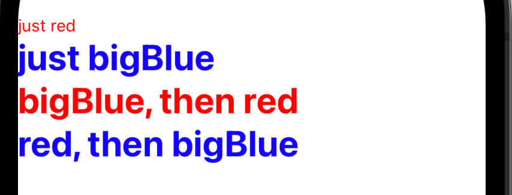

### height and width

组件的高度和宽度决定了它在屏幕上的大小

1. 固定尺寸

设置组件尺寸的一般方法是添加固定`width`和`height`样式。React Native 中的所有维度都是无单位的，代表与密度无关的像素

```javascript
import React from 'react';
import { View } from 'react-native';

const FixedDimensionsBasics = () => {
  return (
    <View>
      <View style={{
        width: 50, height: 50, backgroundColor: 'powderblue'
      }} />
      <View style={{
        width: 100, height: 100, backgroundColor: 'skyblue'
      }} />
      <View style={{
        width: 150, height: 150, backgroundColor: 'steelblue'
      }} />
    </View>
  );
};

export default FixedDimensionsBasics;
```

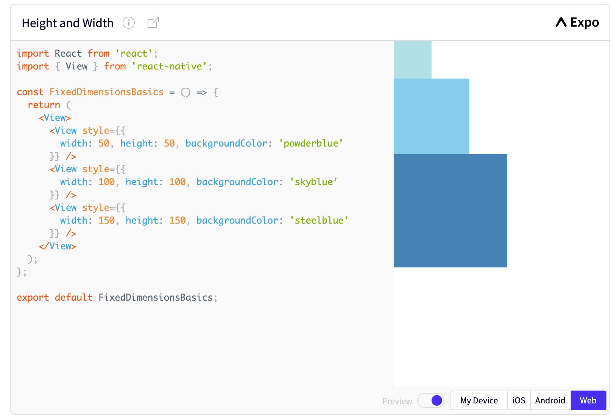

> 没有从点到物理测量单位的通用映射。这意味着具有固定尺寸的组件在不同的设备和屏幕尺寸上可能不会具有相同的物理尺寸。但是，对于大多数用例，这种差异是不明显的。

2. flex尺寸

在组件的样式中使用 flex 可以让组件根据可用空间动态扩展和收缩。通常，您将使用 flex: 1，它告诉组件填充所有可用空间，并在具有相同父级的其他组件之间平均共享。给定的 flex 越大，组件与其兄弟组件相比所占的空间比例就越高。

> 如果父组件的尺寸大于 0，则组件只能扩展以填充可用空间。如果父组件没有固定的宽度和高度或 flex，则父组件的尺寸将为 0，并且 flex 子组件将不可见。

```javascript
import React from 'react';
import { View } from 'react-native';

const FlexDimensionsBasics = () => {
  return (
    // Try removing the `flex: 1` on the parent View.
    // The parent will not have dimensions, so the children can't expand.
    // What if you add `height: 300` instead of `flex: 1`?
    <View style={{ flex: 1 }}>
      <View style={{ flex: 1, backgroundColor: 'powderblue' }} />
      <View style={{ flex: 2, backgroundColor: 'skyblue' }} />
      <View style={{ flex: 3, backgroundColor: 'steelblue' }} />
    </View>
  );
};

export default FlexDimensionsBasics;
```

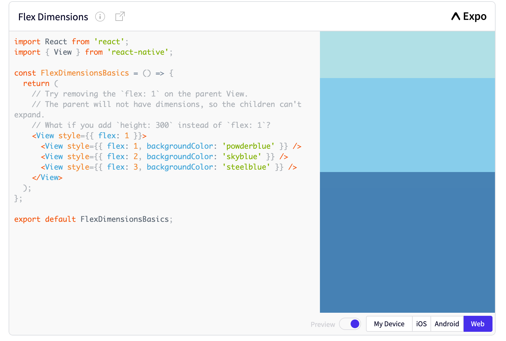

3. 百分比布局

如果你想以填充屏幕的特定部分，但你不希望使用的`flex`布局，您可以用**百分比值**在组件的样式。与弹性尺寸类似，百分比尺寸需要具有定义尺寸的父级。

```bash
import React from 'react';
import { View } from 'react-native';

const PercentageDimensionsBasics = () => {
  // Try removing the `height: '100%'` on the parent View.
  // The parent will not have dimensions, so the children can't expand.
  return (
    <View style={{ height: '100%' }}>
      <View style={{
        height: '15%', backgroundColor: 'powderblue'
      }} />
      <View style={{
        width: '66%', height: '35%', backgroundColor: 'skyblue'
      }} />
      <View style={{
        width: '33%', height: '50%', backgroundColor: 'steelblue'
      }} />
    </View>
  );
};

export default PercentageDimensionsBasics;
```


### layout with flexbox

组件可以使用 Flexbox 算法指定其子组件的布局。Flexbox 旨在在不同的屏幕尺寸上提供一致的布局。

您通常使用的组合`flexDirection`，`alignItems`以及`justifyContent`实现正确的布局。

> Flexbox 在 React Native 中的工作方式与在 Web 上的 CSS 中的工作方式相同，但有一些例外。默认值不同，`flexDirection`默认为`column`代替`row`，`alignContent`默认为`flex-start`代替`stretch`，`flexShrink`默认为`0`代替`1`，`flex`参数仅支持单个数字。

1. flex

[`flex`](https://reactnative.dev/docs/layout-props#flex)将定义您的项目将如何沿主轴**“填充”**可用空间。空间将根据每个元素的 flex 属性进行划分。

在下面的示例中，红色、黄色和绿色视图都是已`flex: 1`设置的容器视图中的子视图。红色视图使用`flex: 1`，黄色视图使用`flex: 2`，绿色视图使用`flex: 3`。**1+2+3 = 6**，这意味着红色视图将获得`1/6`空间，黄色`2/6`的空间和绿色`3/6`的空间。

```javascript
import React from "react";
import { StyleSheet, Text, View } from "react-native";

const Flex = () => {
  return (
    <View style={[styles.container, {
      // Try setting `flexDirection` to `"row"`.
      flexDirection: "column"
    }]}>
      <View style={{ flex: 1, backgroundColor: "red" }} />
      <View style={{ flex: 2, backgroundColor: "darkorange" }} />
      <View style={{ flex: 3, backgroundColor: "green" }} />
    </View>
  );
};

const styles = StyleSheet.create({
  container: {
    flex: 1,
    padding: 20,
  },
});

export default Flex;
```

2. Flex Direction

[`flexDirection`](https://reactnative.dev/docs/layout-props#flexdirection)控制节点的子节点的布局方向。这也称为主轴。交叉轴是垂直于主轴的轴，或包线所在的轴。

- `column`（**默认值**）从上到下对齐子项。如果启用了换行，则下一行将从容器顶部第一个项目的右侧开始。
- `row`将孩子从左到右对齐。如果启用换行，则下一行将从容器左侧的第一项下方开始。
- `column-reverse`将孩子从下到上对齐。如果启用了换行，则下一行将从容器底部第一项的右侧开始。
- `row-reverse`将孩子从右到左对齐。如果启用换行，则下一行将从容器右侧的第一项下方开始。

```javascript
import React, { useState } from "react";
import { StyleSheet, Text, TouchableOpacity, View } from "react-native";

const FlexDirectionBasics = () => {
  const [flexDirection, setflexDirection] = useState("column");

  return (
    <PreviewLayout
      label="flexDirection"
      values={["column", "row", "row-reverse", "column-reverse"]}
      selectedValue={flexDirection}
      setSelectedValue={setflexDirection}
    >
      <View
        style={[styles.box, { backgroundColor: "powderblue" }]}
      />
      <View
        style={[styles.box, { backgroundColor: "skyblue" }]}
      />
      <View
        style={[styles.box, { backgroundColor: "steelblue" }]}
      />
    </PreviewLayout>
  );
};

const PreviewLayout = ({
  label,
  children,
  values,
  selectedValue,
  setSelectedValue,
}) => (
  <View style={{ padding: 10, flex: 1 }}>
    <Text style={styles.label}>{label}</Text>
    <View style={styles.row}>
      {values.map((value) => (
        <TouchableOpacity
          key={value}
          onPress={() => setSelectedValue(value)}
          style={[
            styles.button,
            selectedValue === value && styles.selected,
          ]}
        >
          <Text
            style={[
              styles.buttonLabel,
              selectedValue === value && styles.selectedLabel,
            ]}
          >
            {value}
          </Text>
        </TouchableOpacity>
      ))}
    </View>
    <View style={[styles.container, { [label]: selectedValue }]}>
      {children}
    </View>
  </View>
);

const styles = StyleSheet.create({
  container: {
    flex: 1,
    marginTop: 8,
    backgroundColor: "aliceblue",
  },
  box: {
    width: 50,
    height: 50,
  },
  row: {
    flexDirection: "row",
    flexWrap: "wrap",
  },
  button: {
    paddingHorizontal: 8,
    paddingVertical: 6,
    borderRadius: 4,
    backgroundColor: "oldlace",
    alignSelf: "flex-start",
    marginHorizontal: "1%",
    marginBottom: 6,
    minWidth: "48%",
    textAlign: "center",
  },
  selected: {
    backgroundColor: "coral",
    borderWidth: 0,
  },
  buttonLabel: {
    fontSize: 12,
    fontWeight: "500",
    color: "coral",
  },
  selectedLabel: {
    color: "white",
  },
  label: {
    textAlign: "center",
    marginBottom: 10,
    fontSize: 24,
  },
});

export default FlexDirectionBasics;
```

3. Layout Direction

布局[`direction`](https://reactnative.dev/docs/layout-props#direction)指定层次结构中子项和文本的布局方向。布局方向也会影响边`start`和`end`引用的内容。默认情况下，React Native 以 LTR 布局方向进行布局。在这种模式下`start`是指左，`end`指的是右。

- `LTR`（**默认值**）文本和子项从左到右排列。应用于元素开头的边距和填充应用于左侧。
- `RTL`文本和子项从右到左排列。应用于元素开头的边距和填充应用于右侧。

```javascript
import React, { useState } from "react";
import { View, TouchableOpacity, Text, StyleSheet } from "react-native";

const DirectionLayout = () => {
  const [direction, setDirection] = useState("ltr");

  return (
    <PreviewLayout
      label="direction"
      selectedValue={direction}
      values={["ltr", "rtl"]}
      setSelectedValue={setDirection}>
      <View
        style={[styles.box, { backgroundColor: "powderblue" }]}
      />
      <View
        style={[styles.box, { backgroundColor: "skyblue" }]}
      />
      <View
        style={[styles.box, { backgroundColor: "steelblue" }]}
      />
    </PreviewLayout>
  );
};

const PreviewLayout = ({
  label,
  children,
  values,
  selectedValue,
  setSelectedValue,
}) => (
  <View style={{ padding: 10, flex: 1 }}>
    <Text style={styles.label}>{label}</Text>
    <View style={styles.row}>
      {values.map((value) => (
        <TouchableOpacity
          key={value}
          onPress={() => setSelectedValue(value)}
          style={[
            styles.button,
            selectedValue === value && styles.selected,
          ]}
        >
          <Text
            style={[
              styles.buttonLabel,
              selectedValue === value && styles.selectedLabel,
            ]}
          >
            {value}
          </Text>
        </TouchableOpacity>
      ))}
    </View>
    <View style={[styles.container, { [label]: selectedValue }]}>
      {children}
    </View>
  </View>
);

const styles = StyleSheet.create({
  container: {
    flex: 1,
    marginTop: 8,
    backgroundColor: "aliceblue",
  },
  box: {
    width: 50,
    height: 50,
  },
  row: {
    flexDirection: "row",
    flexWrap: "wrap",
  },
  button: {
    paddingHorizontal: 8,
    paddingVertical: 6,
    borderRadius: 4,
    backgroundColor: "oldlace",
    alignSelf: "flex-start",
    marginHorizontal: "1%",
    marginBottom: 6,
    minWidth: "48%",
    textAlign: "center",
  },
  selected: {
    backgroundColor: "coral",
    borderWidth: 0,
  },
  buttonLabel: {
    fontSize: 12,
    fontWeight: "500",
    color: "coral",
  },
  selectedLabel: {
    color: "white",
  },
  label: {
    textAlign: "center",
    marginBottom: 10,
    fontSize: 24,
  },
});

export default DirectionLayout;
```

4. Justify Content

[`justifyContent`](https://reactnative.dev/docs/layout-props#justifycontent)描述如何在其容器的主轴内对齐子项。例如，您可以使用此属性在`flexDirection`设置为的容器内水平居中`row`或在`flexDirection`设置为的容器内垂直居中`column`。

- `flex-start`（**默认值**）将容器的子项与容器主轴的起点对齐。
- `flex-end` 将容器的子项与容器主轴的末端对齐。
- `center` 将容器的子项与容器主轴的中心对齐。
- `space-between` 在容器的主轴上均匀地隔开孩子，在孩子之间分配剩余的空间。
- `space-around`在容器的主轴上均匀地隔开孩子，将剩余的空间分布在孩子周围。与 相比`space-between`， using`space-around`将导致空间被分配到第一个孩子的开头和最后一个孩子的结尾。
- `space-evenly`沿主轴在对齐容器内均匀分布子项。每对相邻项之间的间距，主起始边和第一项，以及主结束边和最后一项，都完全相同。

```javascript
import React, { useState } from "react";
import { View, TouchableOpacity, Text, StyleSheet } from "react-native";

const JustifyContentBasics = () => {
  const [justifyContent, setJustifyContent] = useState("flex-start");

  return (
    <PreviewLayout
      label="justifyContent"
      selectedValue={justifyContent}
      values={[
        "flex-start",
        "flex-end",
        "center",
        "space-between",
        "space-around",
        "space-evenly",
      ]}
      setSelectedValue={setJustifyContent}
    >
      <View
        style={[styles.box, { backgroundColor: "powderblue" }]}
      />
      <View
        style={[styles.box, { backgroundColor: "skyblue" }]}
      />
      <View
        style={[styles.box, { backgroundColor: "steelblue" }]}
      />
    </PreviewLayout>
  );
};

const PreviewLayout = ({
  label,
  children,
  values,
  selectedValue,
  setSelectedValue,
}) => (
  <View style={{ padding: 10, flex: 1 }}>
    <Text style={styles.label}>{label}</Text>
    <View style={styles.row}>
      {values.map((value) => (
        <TouchableOpacity
          key={value}
          onPress={() => setSelectedValue(value)}
          style={[styles.button, selectedValue === value && styles.selected]}
        >
          <Text
            style={[
              styles.buttonLabel,
              selectedValue === value && styles.selectedLabel,
            ]}
          >
            {value}
          </Text>
        </TouchableOpacity>
      ))}
    </View>
    <View style={[styles.container, { [label]: selectedValue }]}>
      {children}
    </View>
  </View>
);

const styles = StyleSheet.create({
  container: {
    flex: 1,
    marginTop: 8,
    backgroundColor: "aliceblue",
  },
  box: {
    width: 50,
    height: 50,
  },
  row: {
    flexDirection: "row",
    flexWrap: "wrap",
  },
  button: {
    paddingHorizontal: 8,
    paddingVertical: 6,
    borderRadius: 4,
    backgroundColor: "oldlace",
    alignSelf: "flex-start",
    marginHorizontal: "1%",
    marginBottom: 6,
    minWidth: "48%",
    textAlign: "center",
  },
  selected: {
    backgroundColor: "coral",
    borderWidth: 0,
  },
  buttonLabel: {
    fontSize: 12,
    fontWeight: "500",
    color: "coral",
  },
  selectedLabel: {
    color: "white",
  },
  label: {
    textAlign: "center",
    marginBottom: 10,
    fontSize: 24,
  },
});

export default JustifyContentBasics;
```

5. Align Items

[`alignItems`](https://reactnative.dev/docs/layout-props#alignitems)描述如何沿容器的横轴对齐子项。它非常类似于`justifyContent`但不是应用于主轴，而是`alignItems`应用于交叉轴。

- `stretch`（**默认值**）拉伸容器的子项以匹配`height`容器的横轴。
- `flex-start`将容器的子项与容器横轴的起点对齐。
- `flex-end`将容器的子项与容器横轴的末端对齐。
- `center`将容器的子项与容器的交叉轴的中心对齐。
- `baseline`沿公共基线对齐容器的子项。可以将单个孩子设置为其父母的参考基线。

```javascript
import React, { useState } from "react";
import {
  View,
  TouchableOpacity,
  Text,
  StyleSheet,
} from "react-native";

const AlignItemsLayout = () => {
  const [alignItems, setAlignItems] = useState("stretch");

  return (
    <PreviewLayout
      label="alignItems"
      selectedValue={alignItems}
      values={[
        "stretch",
        "flex-start",
        "flex-end",
        "center",
        "baseline",
      ]}
      setSelectedValue={setAlignItems}
    >
      <View
        style={[styles.box, { backgroundColor: "powderblue" }]}
      />
      <View
        style={[styles.box, { backgroundColor: "skyblue" }]}
      />
      <View
        style={[
          styles.box,
          {
            backgroundColor: "steelblue",
            width: "auto",
            minWidth: 50,
          },
        ]}
      />
    </PreviewLayout>
  );
};

const PreviewLayout = ({
  label,
  children,
  values,
  selectedValue,
  setSelectedValue,
}) => (
  <View style={{ padding: 10, flex: 1 }}>
    <Text style={styles.label}>{label}</Text>
    <View style={styles.row}>
      {values.map((value) => (
        <TouchableOpacity
          key={value}
          onPress={() => setSelectedValue(value)}
          style={[
            styles.button,
            selectedValue === value && styles.selected,
          ]}
        >
          <Text
            style={[
              styles.buttonLabel,
              selectedValue === value &&
                styles.selectedLabel,
            ]}
          >
            {value}
          </Text>
        </TouchableOpacity>
      ))}
    </View>
    <View
      style={[
        styles.container,
        { [label]: selectedValue },
      ]}
    >
      {children}
    </View>
  </View>
);

const styles = StyleSheet.create({
  container: {
    flex: 1,
    marginTop: 8,
    backgroundColor: "aliceblue",
    minHeight: 200,
  },
  box: {
    width: 50,
    height: 50,
  },
  row: {
    flexDirection: "row",
    flexWrap: "wrap",
  },
  button: {
    paddingHorizontal: 8,
    paddingVertical: 6,
    borderRadius: 4,
    backgroundColor: "oldlace",
    alignSelf: "flex-start",
    marginHorizontal: "1%",
    marginBottom: 6,
    minWidth: "48%",
    textAlign: "center",
  },
  selected: {
    backgroundColor: "coral",
    borderWidth: 0,
  },
  buttonLabel: {
    fontSize: 12,
    fontWeight: "500",
    color: "coral",
  },
  selectedLabel: {
    color: "white",
  },
  label: {
    textAlign: "center",
    marginBottom: 10,
    fontSize: 24,
  },
});

export default AlignItemsLayout;
```

6. Align Self

[`alignSelf`](https://reactnative.dev/docs/layout-props#alignself)具有相同的选项和效果，`alignItems`但不影响容器内的子项，您可以将此属性应用于单个子项以更改其在其父项中的对齐方式。`alignSelf`覆盖父级设置的任何选项`alignItems`。

```javascript
import React, { useState } from "react";
import { View, TouchableOpacity, Text, StyleSheet } from "react-native";

const AlignSelfLayout = () => {
  const [alignSelf, setAlignSelf] = useState("stretch");

  return (
    <PreviewLayout
      label="alignSelf"
      selectedValue={alignSelf}
      values={["stretch", "flex-start", "flex-end", "center", "baseline"]}
      setSelectedValue={setAlignSelf}>
        <View
          style={[styles.box, {
            alignSelf,
            width: "auto",
            minWidth: 50,
            backgroundColor: "powderblue",
          }]}
        />
      <View
        style={[styles.box, { backgroundColor: "skyblue" }]}
      />
      <View
        style={[styles.box, { backgroundColor: "steelblue" }]}
      />
    </PreviewLayout>
  );
};

const PreviewLayout = ({
  label,
  children,
  values,
  selectedValue,
  setSelectedValue,
}) => (
  <View style={{ padding: 10, flex: 1 }}>
    <Text style={styles.label}>{label}</Text>
    <View style={styles.row}>
      {values.map((value) => (
        <TouchableOpacity
          key={value}
          onPress={() => setSelectedValue(value)}
          style={[
            styles.button,
            selectedValue === value && styles.selected,
          ]}
        >
          <Text
            style={[
              styles.buttonLabel,
              selectedValue === value &&
                styles.selectedLabel,
            ]}
          >
            {value}
          </Text>
        </TouchableOpacity>
      ))}
    </View>
    <View style={styles.container}>
      {children}
    </View>
  </View>
);

const styles = StyleSheet.create({
  container: {
    flex: 1,
    marginTop: 8,
    backgroundColor: "aliceblue",
    minHeight: 200,
  },
  box: {
    width: 50,
    height: 50,
  },
  row: {
    flexDirection: "row",
    flexWrap: "wrap",
  },
  button: {
    paddingHorizontal: 8,
    paddingVertical: 6,
    borderRadius: 4,
    backgroundColor: "oldlace",
    alignSelf: "flex-start",
    marginHorizontal: "1%",
    marginBottom: 6,
    minWidth: "48%",
    textAlign: "center",
  },
  selected: {
    backgroundColor: "coral",
    borderWidth: 0,
  },
  buttonLabel: {
    fontSize: 12,
    fontWeight: "500",
    color: "coral",
  },
  selectedLabel: {
    color: "white",
  },
  label: {
    textAlign: "center",
    marginBottom: 10,
    fontSize: 24,
  },
});

export default AlignSelfLayout;
```

7. Align Content

[alignContent](https://reactnative.dev/docs/layout-props#aligncontent)定义沿横轴的线分布。这仅在使用 将项目包装到多行时有效`flexWrap`。

- `flex-start`（**默认值**）将环绕的线与容器横轴的起点对齐。
- `flex-end` 将环绕的线与容器横轴的末端对齐。
- `stretch`（*在 web 上使用 Yoga 时的默认值*）拉伸包裹线以匹配容器横轴的高度。
- `center` 在容器的交叉轴的中心对齐包裹线。
- `space-between` 在容器的横轴上均匀地间隔包裹线，将剩余的空间分布在线之间。
- `space-around`在容器的横轴上均匀地间隔包裹线，将剩余空间分布在线条周围。与 相比`space-between`， using`space-around`会导致空间被分配到第一行的开头和最后一行的结尾。

```javascript
import React, { useState } from "react";
import { View, TouchableOpacity, Text, StyleSheet } from "react-native";

const AlignContentLayout = () => {
  const [alignContent, setAlignContent] = useState("flex-start");

  return (
    <PreviewLayout
      label="alignContent"
      selectedValue={alignContent}
      values={[
        "flex-start",
        "flex-end",
        "stretch",
        "center",
        "space-between",
        "space-around",
      ]}
      setSelectedValue={setAlignContent}>
      <View
        style={[styles.box, { backgroundColor: "orangered" }]}
      />
      <View
        style={[styles.box, { backgroundColor: "orange" }]}
      />
      <View
        style={[styles.box, { backgroundColor: "mediumseagreen" }]}
      />
      <View
        style={[styles.box, { backgroundColor: "deepskyblue" }]}
      />
      <View
        style={[styles.box, { backgroundColor: "mediumturquoise" }]}
      />
      <View
        style={[styles.box, { backgroundColor: "mediumslateblue" }]}
      />
      <View
        style={[styles.box, { backgroundColor: "purple" }]}
      />
    </PreviewLayout>
  );
};

const PreviewLayout = ({
  label,
  children,
  values,
  selectedValue,
  setSelectedValue,
}) => (
  <View style={{ padding: 10, flex: 1 }}>
    <Text style={styles.label}>{label}</Text>
    <View style={styles.row}>
      {values.map((value) => (
        <TouchableOpacity
          key={value}
          onPress={() => setSelectedValue(value)}
          style={[
            styles.button,
            selectedValue === value && styles.selected,
          ]}
        >
          <Text
            style={[
              styles.buttonLabel,
              selectedValue === value &&
                styles.selectedLabel,
            ]}
          >
            {value}
          </Text>
        </TouchableOpacity>
      ))}
    </View>
    <View
      style={[
        styles.container,
        { [label]: selectedValue },
      ]}
    >
      {children}
    </View>
  </View>
);

const styles = StyleSheet.create({
  container: {
    flex: 1,
    flexWrap: "wrap",
    marginTop: 8,
    backgroundColor: "aliceblue",
    maxHeight: 400,
  },
  box: {
    width: 50,
    height: 80,
  },
  row: {
    flexDirection: "row",
    flexWrap: "wrap",
  },
  button: {
    paddingHorizontal: 8,
    paddingVertical: 6,
    borderRadius: 4,
    backgroundColor: "oldlace",
    alignSelf: "flex-start",
    marginHorizontal: "1%",
    marginBottom: 6,
    minWidth: "48%",
    textAlign: "center",
  },
  selected: {
    backgroundColor: "coral",
    borderWidth: 0,
  },
  buttonLabel: {
    fontSize: 12,
    fontWeight: "500",
    color: "coral",
  },
  selectedLabel: {
    color: "white",
  },
  label: {
    textAlign: "center",
    marginBottom: 10,
    fontSize: 24,
  },
});

export default AlignContentLayout;
```

8. Flex Wrap

该[`flexWrap`](https://reactnative.dev/docs/layout-props#flexwrap)属性设置在容器上，它控制当子级沿主轴溢出容器的大小时会发生什么。默认情况下，子项被强制为一行（可以缩小元素）。如果允许包装，则项目会在需要时沿主轴包装成多行。

换行时，`alignContent`可用于指定如何在容器中放置行

```javascript
import React, { useState } from "react";
import { View, TouchableOpacity, Text, StyleSheet } from "react-native";

const FlexWrapLayout = () => {
  const [flexWrap, setFlexWrap] = useState("wrap");

  return (
    <PreviewLayout
      label="flexWrap"
      selectedValue={flexWrap}
      values={["wrap", "nowrap"]}
      setSelectedValue={setFlexWrap}>
      <View
        style={[styles.box, { backgroundColor: "orangered" }]}
      />
      <View
        style={[styles.box, { backgroundColor: "orange" }]}
      />
      <View
        style={[styles.box, { backgroundColor: "mediumseagreen" }]}
      />
      <View
        style={[styles.box, { backgroundColor: "deepskyblue" }]}
      />
      <View
        style={[styles.box, { backgroundColor: "mediumturquoise" }]}
      />
      <View
        style={[styles.box, { backgroundColor: "mediumslateblue" }]}
      />
      <View
        style={[styles.box, { backgroundColor: "purple" }]}
      />
    </PreviewLayout>
  );
};

const PreviewLayout = ({
  label,
  children,
  values,
  selectedValue,
  setSelectedValue,
}) => (
  <View style={{ padding: 10, flex: 1 }}>
    <Text style={styles.label}>{label}</Text>
    <View style={styles.row}>
      {values.map((value) => (
        <TouchableOpacity
          key={value}
          onPress={() => setSelectedValue(value)}
          style={[
            styles.button,
            selectedValue === value && styles.selected,
          ]}
        >
          <Text
            style={[
              styles.buttonLabel,
              selectedValue === value &&
                styles.selectedLabel,
            ]}
          >
            {value}
          </Text>
        </TouchableOpacity>
      ))}
    </View>
    <View
      style={[
        styles.container,
        { [label]: selectedValue },
      ]}
    >
      {children}
    </View>
  </View>
);

const styles = StyleSheet.create({
  container: {
    flex: 1,
    marginTop: 8,
    backgroundColor: "aliceblue",
    maxHeight: 400,
  },
  box: {
    width: 50,
    height: 80,
  },
  row: {
    flexDirection: "row",
    flexWrap: "wrap",
  },
  button: {
    paddingHorizontal: 8,
    paddingVertical: 6,
    borderRadius: 4,
    backgroundColor: "oldlace",
    marginHorizontal: "1%",
    marginBottom: 6,
    minWidth: "48%",
    textAlign: "center",
  },
  selected: {
    backgroundColor: "coral",
    borderWidth: 0,
  },
  buttonLabel: {
    fontSize: 12,
    fontWeight: "500",
    color: "coral",
  },
  selectedLabel: {
    color: "white",
  },
  label: {
    textAlign: "center",
    marginBottom: 10,
    fontSize: 24,
  },
});

export default FlexWrapLayout;
```

9. Flex Basis, Grow, and Shrink

- [`flexBasis`](https://reactnative.dev/docs/layout-props#flexbasis)是一种与轴无关的方式，用于沿主轴提供项目的默认大小。设置子节点的`flexBasis`类似于设置`width`子节点的 ，如果它的父节点是带有 的容器，`flexDirection: row`或者设置`height`子节点的，如果它的父节点是带有 的容器`flexDirection: column`。该`flexBasis`项目的是该项目的默认大小，该项目之前的任何大小`flexGrow`和`flexShrink`进行计算。

- [`flexGrow`](https://reactnative.dev/docs/layout-props#flexgrow)描述了容器内的任何空间应如何沿主轴分布在其子项之间。布置完它的孩子之后，容器将根据其孩子指定的 flex 增长值分配任何剩余空间。

  `flexGrow`接受任何 >= 0 的浮点值，0 是默认值。容器将在其子项之间分配任何剩余空间，这些空间由子项的`flexGrow`值加权。

- [`flexShrink`](https://reactnative.dev/docs/layout-props#flexshrink)描述了在子项的总大小超出主轴上容器的大小的情况下，如何沿主轴收缩子项。如果任何溢出大小被认为是负剩余空间，`flexShrink`则非常相似`flexGrow`并且可以以相同的方式考虑。这两个属性也可以很好地协同工作，允许孩子根据需要成长和缩小。

  `flexShrink`接受任何 >= 0 的浮点值，0 是默认值（在网络上，默认值为 1）。容器将根据子项的`flexShrink`值缩小其子项。

```javascript
import React, { useState } from "react";
import {
  View,
  Text,
  TextInput,
  StyleSheet,
} from "react-native";

const App = () => {
  const [powderblue, setPowderblue] = useState({
    flexGrow: 0,
    flexShrink: 1,
    flexBasis: "auto",
  });
  const [skyblue, setSkyblue] = useState({
    flexGrow: 1,
    flexShrink: 0,
    flexBasis: 100,
  });
  const [steelblue, setSteelblue] = useState({
    flexGrow: 0,
    flexShrink: 1,
    flexBasis: 200,
  });
  return (
    <View style={styles.container}>
      <View
        style={[
          styles.container,
          {
            flexDirection: "row",
            alignContent: "space-between",
          },
        ]}
      >
        <BoxInfo
          color="powderblue"
          {...powderblue}
          setStyle={setPowderblue}
        />
        <BoxInfo
          color="skyblue"
          {...skyblue}
          setStyle={setSkyblue}
        />
        <BoxInfo
          color="steelblue"
          {...steelblue}
          setStyle={setSteelblue}
        />
      </View>
      <View style={styles.previewContainer}>
        <View
          style={[
            styles.box,
            {
              flexBasis: powderblue.flexBasis,
              flexGrow: powderblue.flexGrow,
              flexShrink: powderblue.flexShrink,
              backgroundColor: "powderblue",
            },
          ]}
        />
        <View
          style={[
            styles.box,
            {
              flexBasis: skyblue.flexBasis,
              flexGrow: skyblue.flexGrow,
              flexShrink: skyblue.flexShrink,
              backgroundColor: "skyblue",
            },
          ]}
        />
        <View
          style={[
            styles.box,
            {
              flexBasis: steelblue.flexBasis,
              flexGrow: steelblue.flexGrow,
              flexShrink: steelblue.flexShrink,
              backgroundColor: "steelblue",
            },
          ]}
        />
      </View>
    </View>
  );
};

const BoxInfo = ({
  color,
  flexBasis,
  flexShrink,
  setStyle,
  flexGrow,
}) => (
  <View style={[styles.row, { flexDirection: "column" }]}>
    <View
      style={[
        styles.boxLabel,
        {
          backgroundColor: color,
        },
      ]}
    >
      <Text
        style={{
          color: "#fff",
          fontWeight: "500",
          textAlign: "center",
        }}
      >
        Box
      </Text>
    </View>
    <Text style={styles.label}>flexBasis</Text>
    <TextInput
      value={flexBasis}
      style={styles.input}
      onChangeText={(fB) =>
        setStyle((value) => ({
          ...value,
          flexBasis: isNaN(parseInt(fB))
            ? "auto"
            : parseInt(fB),
        }))
      }
    />
    <Text style={styles.label}>flexShrink</Text>
    <TextInput
      value={flexShrink}
      style={styles.input}
      onChangeText={(fS) =>
        setStyle((value) => ({
          ...value,
          flexShrink: isNaN(parseInt(fS))
            ? ""
            : parseInt(fS),
        }))
      }
    />
    <Text style={styles.label}>flexGrow</Text>
    <TextInput
      value={flexGrow}
      style={styles.input}
      onChangeText={(fG) =>
        setStyle((value) => ({
          ...value,
          flexGrow: isNaN(parseInt(fG))
            ? ""
            : parseInt(fG),
        }))
      }
    />
  </View>
);

const styles = StyleSheet.create({
  container: {
    flex: 1,
    paddingHorizontal: 10,
  },
  box: {
    flex: 1,
    height: 50,
    width: 50,
  },
  boxLabel: {
    minWidth: 80,
    padding: 8,
    borderRadius: 4,
    marginTop: 8,
  },
  label: {
    marginTop: 6,
    fontSize: 16,
    fontWeight: "100",
  },
  previewContainer: {
    flex: 1,
    flexDirection: "row",
    backgroundColor: "aliceblue",
  },
  row: {
    flex: 1,
    flexDirection: "row",
    flexWrap: "wrap",
    alignItems: "center",
    marginBottom: 10,
  },
  input: {
    borderBottomWidth: 1,
    paddingVertical: 3,
    width: 50,
    textAlign: "center",
  },
});

export default App;
```

10. Width and Height

该`width`属性指定元素内容区域的宽度。同样，该`height`属性指定元素内容区域的高度。

双方`width`并`height`可以采取以下值：

- `auto`（**默认值**）React Native 根据元素的内容计算其宽度/高度，无论是其他子元素、文本还是图像。
- `pixels`以绝对像素为单位定义宽度/高度。根据组件上设置的其他样式，这可能是也可能不是节点的最终尺寸。
- `percentage` 分别以其父级宽度或高度的百分比定义宽度或高度。

```javascript
import React, { useState } from "react";
import {
  View,
  SafeAreaView,
  TouchableOpacity,
  Text,
  StyleSheet,
} from "react-native";

const WidthHeightBasics = () => {
  const [widthType, setWidthType] = useState("auto");
  const [heightType, setHeightType] = useState("auto");

  return (
    <PreviewLayout
      widthType={widthType}
      heightType={heightType}
      widthValues={["auto", 300, "80%"]}
      heightValues={["auto", 200, "60%"]}
      setWidthType={setWidthType}
      setHeightType={setHeightType}
    >
      <View
        style={{
          alignSelf: "flex-start",
          backgroundColor: "aliceblue",
          height: heightType,
          width: widthType,
          padding: 15,
        }}
      >
        <View
          style={[
            styles.box,
            { backgroundColor: "powderblue" },
          ]}
        />
        <View
          style={[
            styles.box,
            { backgroundColor: "skyblue" },
          ]}
        />
        <View
          style={[
            styles.box,
            { backgroundColor: "steelblue" },
          ]}
        />
      </View>
    </PreviewLayout>
  );
};

const PreviewLayout = ({
  children,
  widthType,
  heightType,
  widthValues,
  heightValues,
  setWidthType,
  setHeightType,
}) => (
  <SafeAreaView style={{ flex: 1, padding: 10 }}>
    <View style={styles.row}>
      <Text style={styles.label}>width </Text>
      {widthValues.map((value) => (
        <TouchableOpacity
          key={value}
          onPress={() => setWidthType(value)}
          style={[
            styles.button,
            widthType === value && styles.selected,
          ]}
        >
          <Text
            style={[
              styles.buttonLabel,
              widthType === value && styles.selectedLabel,
            ]}
          >
            {value}
          </Text>
        </TouchableOpacity>
      ))}
    </View>
    <View style={styles.row}>
      <Text style={styles.label}>height </Text>
      {heightValues.map((value) => (
        <TouchableOpacity
          key={value}
          onPress={() => setHeightType(value)}
          style={[
            styles.button,
            heightType === value && styles.selected,
          ]}
        >
          <Text
            style={[
              styles.buttonLabel,
              heightType === value && styles.selectedLabel,
            ]}
          >
            {value}
          </Text>
        </TouchableOpacity>
      ))}
    </View>
    {children}
  </SafeAreaView>
);

const styles = StyleSheet.create({
  box: {
    width: 50,
    height: 50,
  },
  row: {
    flexDirection: "row",
    flexWrap: "wrap",
  },
  button: {
    padding: 8,
    borderRadius: 4,
    backgroundColor: "oldlace",
    alignSelf: "flex-start",
    marginRight: 10,
    marginBottom: 10,
  },
  selected: {
    backgroundColor: "coral",
    shadowOpacity: 0,
    borderWidth: 0,
  },
  buttonLabel: {
    fontSize: 12,
    fontWeight: "500",
    color: "coral",
  },
  selectedLabel: {
    color: "white",
  },
  label: {
    textAlign: "center",
    marginBottom: 10,
    fontSize: 24,
  },
});

export default WidthHeightBasics;
```

11. Absolute & Relative Layout

`position`元素的类型定义了它在其父元素中的定位方式。

- `relative`(**默认值**) 默认情况下，元素是相对定位的。此装置的一个元件根据布局的正常流动定位，然后基于所述偏移值相对于该位置`top`，`right`，`bottom`，和`left`。偏移量不会影响任何兄弟元素或父元素的位置。
- `absolute`当绝对定位时，元素不会参与正常的布局流程。相反，它的布局独立于其兄弟姐妹。的位置被确定基于所述`top`，`right`，`bottom`，和`left`的值。

```javascript
import React, { useState } from "react";
import {
  View,
  SafeAreaView,
  TouchableOpacity,
  Text,
  StyleSheet,
} from "react-native";

const PositionLayout = () => {
  const [position, setPosition] = useState("relative");

  return (
    <PreviewLayout
      label="position"
      selectedValue={position}
      values={["relative", "absolute"]}
      setSelectedValue={setPosition}
    >
      <View
        style={[
          styles.box,
          {
            top: 25,
            left: 25,
            position,
            backgroundColor: "powderblue",
          },
        ]}
      />
      <View
        style={[
          styles.box,
          {
            top: 50,
            left: 50,
            position,
            backgroundColor: "skyblue",
          },
        ]}
      />
      <View
        style={[
          styles.box,
          {
            top: 75,
            left: 75,
            position,
            backgroundColor: "steelblue",
          },
        ]}
      />
    </PreviewLayout>
  );
};

const PreviewLayout = ({
  label,
  children,
  values,
  selectedValue,
  setSelectedValue,
}) => (
  <View style={{ padding: 10, flex: 1 }}>
    <Text style={styles.label}>{label}</Text>
    <View style={styles.row}>
      {values.map((value) => (
        <TouchableOpacity
          key={value}
          onPress={() => setSelectedValue(value)}
          style={[
            styles.button,
            selectedValue === value && styles.selected,
          ]}
        >
          <Text
            style={[
              styles.buttonLabel,
              selectedValue === value &&
                styles.selectedLabel,
            ]}
          >
            {value}
          </Text>
        </TouchableOpacity>
      ))}
    </View>
    <View style={styles.container}>{children}</View>
  </View>
);

const styles = StyleSheet.create({
  container: {
    flex: 1,
    marginTop: 8,
    backgroundColor: "aliceblue",
    minHeight: 200,
  },
  box: {
    width: 50,
    height: 50,
  },
  row: {
    flexDirection: "row",
    flexWrap: "wrap",
  },
  button: {
    paddingHorizontal: 8,
    paddingVertical: 6,
    borderRadius: 4,
    backgroundColor: "oldlace",
    alignSelf: "flex-start",
    marginHorizontal: "1%",
    marginBottom: 6,
    minWidth: "48%",
    textAlign: "center",
  },
  selected: {
    backgroundColor: "coral",
    borderWidth: 0,
  },
  buttonLabel: {
    fontSize: 12,
    fontWeight: "500",
    color: "coral",
  },
  selectedLabel: {
    color: "white",
  },
  label: {
    textAlign: "center",
    marginBottom: 10,
    fontSize: 24,
  },
});

export default PositionLayout;
```

### images

1. 静态图片资源

React Native 提供了一种统一的方式来管理 Android 和 iOS 应用程序中的图像和其他媒体资产。要将静态图像添加到您的应用程序，请将其放在源代码树中的某个位置并像这样引用它：

```javascript
<Image source={require('./my-icon.png')} />
```

解析图像名称的方式与解析 JS 模块的方式相同。在上面的示例中，捆绑程序将`my-icon.png`在与需要它的组件相同的文件夹中查找。

您可以使用`@2x`和`@3x`后缀为不同的屏幕密度提供图像。如果您有以下文件结构：

```
.
├── button.js
└── img
    ├── check.png
    ├── check@2x.png
    └── check@3x.png
```

`button.js`代码包含：

```javascript
<Image source={require('./img/check.png')} />
```

捆绑器将捆绑并提供与设备屏幕密度相对应的图像。例如，`check@2x.png`, 将用于 iPhone 7，而`check@3x.png`将用于 iPhone 7 Plus 或 Nexus 5。如果没有与屏幕密度匹配的图像，将选择最接近的最佳选项。

为了使其工作，`require`必须静态地知道图像名称。

```javascript
// GOOD
<Image source={require('./my-icon.png')} />;

// BAD
var icon = this.props.active
  ? 'my-icon-active'
  : 'my-icon-inactive';
<Image source={require('./' + icon + '.png')} />;

// GOOD
var icon = this.props.active
  ? require('./my-icon-active.png')
  : require('./my-icon-inactive.png');
<Image source={icon} />;
```

请注意，以这种方式需要的图像源包括图像的大小（宽度、高度）信息。如果您需要动态缩放图像（即通过 flex），您可能需要手动设置`{ width: undefined, height: undefined }`样式属性。

2. 静态非图像资源

上述`require`语法也可用于在项目中静态包含音频、视频或文档文件。最常见的文件类型的支持，包括`.mp3`，`.wav`，`.mp4`，`.mov`，`.html`和`.pdf`。有关完整列表，请参阅[捆绑程序默认值](https://github.com/facebook/metro/blob/master/packages/metro-config/src/defaults/defaults.js#L14-L44)。

您可以通过在[Metro 配置中](https://facebook.github.io/metro/docs/configuration)添加[`assetExts`解析器选项](https://facebook.github.io/metro/docs/configuration#resolver-options)来添加对其他类型的支持。

一个警告是视频必须使用绝对定位而不是`flexGrow`，因为当前没有为非图像资产传递大小信息。对于直接链接到 Xcode 或 Android 的 Assets 文件夹的视频，不会出现此限制。

3. 图片来自混合应用程序的资源

如果你正在构建一个混合应用程序（一些 UI 在 React Native 中，一些 UI 在平台代码中），你仍然可以使用已经捆绑到应用程序中的图像。

对于通过 Xcode 资产目录或 Android drawable 文件夹中包含的图像，使用不带扩展名的图像名称：

```javascript
<Image
  source={{ uri: 'app_icon' }}
  style={{ width: 40, height: 40 }}
/>
```

对于 Android assets 文件夹中的图像，使用`asset:/`方案：

```javascript
<Image
  source={{ uri: 'asset:/app_icon.png' }}
  style={{ width: 40, height: 40 }}
/>
```

这些方法不提供安全检查。由您来保证这些图像在应用程序中可用。您还必须手动指定图像尺寸。

4. 网络图片

您将在应用程序中显示的许多图像在编译时不可用，或者您需要动态加载一些图像以保持二进制大小。与静态资源不同，*您需要手动指定图像的尺寸*。强烈建议您也使用 https 以满足iOS 上的[应用程序传输安全](https://reactnative.dev/docs/running-on-device#app-transport-security)要求。

```javascript
// GOOD
<Image source={{uri: 'https://reactjs.org/logo-og.png'}}
       style={{width: 400, height: 400}} />

// BAD
<Image source={{uri: 'https://reactjs.org/logo-og.png'}} />
```

如果您想设置诸如 HTTP 动词、标题或正文以及图像请求之类的内容，您可以通过在源对象上定义这些属性来实现：

```javascript
<Image
  source={{
    uri: 'https://reactjs.org/logo-og.png',
    method: 'POST',
    headers: {
      Pragma: 'no-cache'
    },
    body: 'Your Body goes here'
  }}
  style={{ width: 400, height: 400 }}
/>
```

5. Uri Data Images

有时，您可能会从 REST API 调用中获取编码的图像数据。您可以使用`'data:'`uri 方案来使用这些图像。与网络资源相同，*您需要手动指定图像的尺寸*。

> 这仅推荐用于非常小的动态图像，例如来自数据库的列表中的图标。

```javascript
// include at least width and height!
<Image
  style={{
    width: 51,
    height: 51,
    resizeMode: 'contain'
  }}
  source={{
    uri:
      ''
  }}
/>
```

6. 高速缓存控制（仅适用于iOS）

在某些情况下，您可能只想显示已经在本地缓存中的图像，即低分辨率占位符，直到更高的分辨率可用。在其他情况下，您并不关心图像是否过时，并且愿意显示过时的图像以节省带宽。该`cache`源属性使您能够控制如何与高速缓存中的网络层交互。

- `default`: 使用原生平台默认策略。
- `reload`：URL 的数据将从原始源加载。不应使用现有的缓存数据来满足 URL 加载请求。
- `force-cache`：现有的缓存数据将用于满足请求，无论其年龄或到期日期如何。如果缓存中没有与请求对应的现有数据，则从原始源加载数据。
- `only-if-cached`：现有的缓存数据将用于满足请求，无论其年龄或到期日期如何。如果缓存中没有对应于 URL 加载请求的现有数据，则不会尝试从原始源加载数据，并且认为加载失败。

```javascript
<Image
  source={{
    uri: 'https://reactjs.org/logo-og.png',
    cache: 'only-if-cached'
  }}
  style={{ width: 400, height: 400 }}
/>
```

### color reference

1. 颜色表示

红，绿，蓝（RGB）

React Native 支持`rgb()`和`rgba()`十六进制和函数表示法：

- `'#f0f'` (#rgb)
- `'#ff00ff'` （#rrggbb）
- `'#f0ff'` （#rgba）
- `'#ff00ff00'` （#rrggbbaa）
- `'rgb(255, 0, 255)'`
- `'rgba(255, 0, 255, 1.0)'`

色相饱和度亮度（HSL）

React Native 支持`hsl()`并`hsla()`采用函数式表示法：

- `'hsl(360, 100%, 100%)'`
- `'hsla(360, 100%, 100%, 1.0)'`

颜色整型

React Native 也支持颜色作为`int`值（在 RGB 颜色模式下）：

- `0xff00ff00` (0xrrggbbaa)

> **注意：\***这可能看起来类似于 Android[ Color](https://developer.android.com/reference/android/graphics/Color) ints 表示，但在 Android 上值以 SRGB 颜色模式 (0xaarrggbb) 存储。

命名的颜色

在 React Native 中，您还可以使用颜色名称字符串作为值。

> **注意：\*** React Native 只支持小写颜色名称。不支持大写颜色名称。

`transparent`[](https://reactnative.dev/docs/colors#transparent)

这是 的快捷方式`rgba(0,0,0,0)`，就像在[CSS3 中一样](https://www.w3.org/TR/css-color-3/#transparent)。

## 组件

React Native 提供了许多内置的[核心组件，](https://reactnative.dev/docs/intro-react-native-components)供您在您的应用程序中使用

### 基本组件

大多数应用程序最终将使用这些基本组件之一

#### View

构建 UI 的最基本组件`View`是一个容器，它支持具有[flexbox](https://reactnative.dev/docs/flexbox)、[样式](https://reactnative.dev/docs/style)、[一些触摸处理](https://reactnative.dev/docs/handling-touches)和[可访问性](https://reactnative.dev/docs/accessibility)控件的布局。`View`直接映射到本地视图相当于在任何平台阵营本地运行上，无论是一`UIView`，`<div>`，`android.view`，等。

`View` 旨在嵌套在其他视图中，并且可以有 0 到多个任何类型的子视图。

```javascript
import React, { Component } from "react";
import { View, Text } from "react-native";

class App extends Component {
  render() {
    return (
      <View
        style={{
          flexDirection: "row",
          height: 100,
          padding: 20
        }}
      >
        <View style={{ backgroundColor: "blue", flex: 0.3 }} />
        <View style={{ backgroundColor: "red", flex: 0.5 }} />
        <Text>Hello World!</Text>
      </View>
    );
  }
}

export default App;
```

> `View`s 旨在用于[`StyleSheet`](https://reactnative.dev/docs/style)提高清晰度和性能，尽管也支持内联样式。

##### 属性

`<View>` 组件支持很多属性，但最常见的还是 `style` 属性。

`style` 属性用于设置视图的样式，类似于 [HTML](https://www.twle.cn/l/yufei/html/html-basic-index.html) 中的 `style` 属性。

`style` 属性值必须是一个对象，例如要设置背景色，则需要使用 `backgroundColor` 属性。

```javascript
<View style={{backgroundColor:'red'}}>
</View>
```

##### 使用范例

React Native 中的视图组件 View 一般用于布局，也就是我们上面所说的划分一个一个豆腐块。

下面的代码，我们演示了下 `View` 组件的基本使用方式，我们只需要修改 `App.js` 即可。

```javascript
import React, { Component } from 'react'
import { View, Text } from 'react-native'

const App = () => {
   return (
      <View>
         <View>
            <Text>简单教程，简单编程</Text>
         </View>
         <View style={{marginTop:8,padding:8,backgroundColor:'blue'}}>
            <Text style={{color:'white'}}>简单教程，简单编程</Text>
         </View>
         <View style={{marginTop:8,padding:8,width:200,backgroundColor:'red'}}>
            <Text style={{color:'white'}}>简单教程，简单编程</Text>
         </View>
      </View>
   )
}
export default App
```

##### View 组件的使用场景

经过我们上面的举例，View 组件的使用场景应该很明了了。

- `<View>` 可以作为一个容器。当我们需要将元素包装在容器中时，可以使用 `<View>` 作为容器元素。
- 当一个元素只支持包含一个子元素，而我们又需要它支持多个子元素的时候，我们可以把这些子元素使用 `<View>` 来包装。然后在把 `<View>` 元素作为那个元素的子元素。
- 当相同的或不相同的两个或多个元素需要不同的展现样式的时候，我们可以把它们分别包装在不同的 `<View>` 中。 然后分别设置每一个 `<View>` 元素的样式，比如 `style` 属性。
- `<View>` 还支持多点触摸事件。我们可以使用这个特性来达到多点触摸的功能。

#### Text

在 React Native 中如果要显示一段文本，可以使用 React Native 内置的文本组件 `<Text>`。

文本组件 `Text` 只能用来显示文本，如果要显示网页，可以使用网页组件 `WebView`。

虽然文本组件可能将部分文本显示为电话号码或者网址等可以点击的样子，但毕竟有限。没有 WebView 来的强大。

```javascript
import React, { Component } from 'react';
import { View, Text, Image, StyleSheet } from 'react-native'

const App = () => {
   return (
      <View style = {styles.container}>
         <Text style = {styles.text}>
            <Text style = {styles.capitalLetter}>
               简
            </Text>

            <Text>
               单教程
            </Text>

            <Text>
               简单<Text style = {styles.wordBold}>编程</Text> 简单教程致力于简化 IT 技术的学习难度为使命，
            </Text>

            <Text style = {styles.italicText}>通过整合市面上的教程，然后挑选，去除难以理解的部分
            </Text>

            <Text style = {styles.textShadow}>
               简单教程竟不是孤立存在的，它的成长离不开广大战友们的支持。
            </Text>
         </Text>
      </View>
   )
}
export default App

const styles = StyleSheet.create ({
   container: {
      alignItems: 'center',
      marginTop: 100,
      padding: 20
   },
   text: {
      color: '#41cdf4',
   },
   capitalLetter: {
      color: 'red',
      fontSize: 20
   },
   wordBold: {
      fontWeight: 'bold',
      color: 'black'
   },
   italicText: {
      color: '#37859b',
      fontStyle: 'italic'
   },
   textShadow: {
      textShadowColor: 'red',
      textShadowOffset: { width: 2, height: 2 },
      textShadowRadius : 5
   }
})
```

##### 属性说明

| 属性               | 类型   | 是否必填 | 说明                                                         |
| ------------------ | ------ | -------- | ------------------------------------------------------------ |
| selectable         | bool   | false    | 是否可选中，`true` 为真，`false` 为否                        |
| numberOfLines      | number | false    | 用于在计算文本布局（包括换行）后使用省略号截断文本，使得总行数不超过此数字 |
| ellipsizeMode      | string | false    | 如果设置了 `numberOfLines`，那么该属性用于设置文本如何被截断 |
| dataDetectorType   | string | false    | 用于设置如何转换文本中的某些子文本                           |
| color              | color  | 否       | 用于设置文本的颜色                                           |
| fontFamily         | string | 否       | 用于设置文本的字体                                           |
| fontSize           | number | 否       | 用于设置文字的大小                                           |
| fontStyle          | string | 否       | 用于设置文字是否倾斜，`normal` 正常，`italic` 倾斜，默认为 `normal` |
| fontWeight         | string | 否       | 文字的粗细，可以设置的值有: 'normal', 'bold', '100', '200', '300', '400', '500', '600', '700', '800', '900' |
| lineHeight         | number | 否       | 用于设置文本的行高                                           |
| textAlign          | string | 否       | 用于设置文本的对其方式，可选的值有 'auto', 'left', 'right', 'center', 'justify'。Android 下只有 `left` 即使设置了其它值扔就是 `left` |
| textDecorationLine | string | 否       | 用于设置文本的下划线类型，可选的值有 'none', 'underline', 'line-through', 'underline line-through' |
| textShadowColor    | color  | 否       | 用于设置文本的阴影色                                         |
| textShadowOffset   | object | 否       | 用于设置阴影的偏移量，格式为 `{width: number,height: number}` |
| textShadowRadius   | number | 否       | 用于设置阴影的圆角度。                                       |
| letterSpacing      | number | 否       | 用于设置字与字之间的距离                                     |
| textTransform      | string | 否       | 用于设置文本转换格式，可选的值有 'none', 'uppercase', 'lowercase', 'capitalize' |

#### Image

原生 iOS 使用 `UIImage` 来显示一张图片，原生 Android 开发使用 `ImageView` 来显示图片。

React Native 对 `UIImage` 和 `ImageView` 进行封装，提供了 Image 组件用来显示图片。

Image 组件还同时解决了访问网络图片复杂的问题，把显示网络图片给简化了。

React Native 内建了图片组件 Image 来显示图片，这个组件既可以显示本地图片，也可以显示网络图片，还可以显示 base64 格式的图片。

Image 组件既可以显示本地图片也可以显示网络图片，但它们的语法格式有点不同。

显示本地图片的语法格式为

```javascript
<Image 
   style  = {image_style}
   source = {require('./image_path')} 
   resizeMode = {"cover"|"contain"|"stretch"|"repeat"|"center"}
/>
```

显示网络图片的语法格式为

```javascript
<Image 
   style  = {image_style}
   source={{uri: 'image_url'}
   resizeMode = {"cover"|"contain"|"stretch"|"repeat"|"center"}
/>
```

显示 base64 格式的图片的语法格式为

```javascript
<Image 
   style  = {image_style}
   source={{uri: 'uri: data:image/png;base64,[image_base64_data]'}
   resizeMode = {"cover"|"contain"|"stretch"|"repeat"|"center"}
/>
```

> 注意： 显示网络图片和显示 base64 格式的图片，`style` 样式中一定要包含 `width` 和 `height` 属性。

##### 属性说明

Image 组件有很多属性，但常用的且跨平台的属性真心不多，我们列举几个常用的介绍下。

1. `style` 属性。

除了默认的跟 `<View>` 相同的属性外，`<Image>` 中的 `style` 属性还支持一下属性

| 属性                    | 类型   | 说明                                                         |
| ----------------------- | ------ | ------------------------------------------------------------ |
| borderTopRightRadius    | number | 设置右上角的圆角度数，默认值为 0                             |
| borderBottomLeftRadius  | number | 设置左下角的圆角度数，默认值为 0                             |
| borderBottomRightRadius | number | 设置右下角的圆角度数，默认值为 0                             |
| borderTopLeftRadius     | number | 设置左上角的圆角度数，默认值为 0                             |
| borderRadius            | number | 统一设置四个角的圆角度数，默认值为 0                         |
| borderColor             | color  | 设置边框的颜色                                               |
| borderWidth             | number | 设置边框的宽度，默认值为 0                                   |
| backgroundColor         | color  | 设置图片组件的背景色                                         |
| opacity                 | number | 设置图片组件的透明度                                         |
| overflow                | string | 当组件超出屏幕宽高时是否可见， 'visible' 显示, 'hidden' 隐藏 |
| backfaceVisibility      | string | 定义当组件不面向屏幕时是否可见， 'visible' 显示, 'hidden' 隐藏 |
| tintColor               | color  | 将所有非透明的图片像素改为此颜色                             |
| resizeMode              | string | 设置图片如何适应图片容器，可选的值有： 'cover', 'contain', 'stretch', 'repeat', 'center' |

2. `source` 属性。

`source` 属性用于设置图片的地址，图片地址可以是本地图片，网络图片和 base64 格式的图片。

使用方式我们上面已经介绍过了。

3. `loadingIndicatorSource` 属性。

`loadingIndicatorSource` 属性用于加载网络图片时的 placeholder 图片。也可以说是图片加载指示器。

它的使用格式和 `source` 属性一样，但不能是网络图片，只能是本地图片或 base64 格式图片。

4. `resizeMethod` 属性。

`resizeMethod` 属性用于设置图片如何适配图片组件。默认值为 `auto`。

可选的值有： 'cover', 'contain', 'stretch', 'repeat', 'center'。

| 值     | 说明                                                         |
| ------ | ------------------------------------------------------------ |
| auto   | 由系统自己在 `resize` 或 `scale` 之间选择                    |
| resize | 显示之前先进行重新调整大小，当图片超出组件太多的时间建议使用此值 |
| scale  | 缩放图片，当地图片比组件小或者图片和组件差不多大小时使用此值 |

#### TextInput

输入组件 `TextInput` 就是让用户输入数据的，比如输入登录有户名，输入登录密码。

除了简单的单行输入框外，还可以用于输入大量的文本，比如输入用户反馈，输入用户说明等等。

可以说，React Native 中的输入组件 `TextInput` 是 [HTML](https://www.twle.cn/l/yufei/html/html-basic-index.html) 中的 `<input>` 和 `<textarea>` 的结合体。

输入组件 TextInput 是一个可视组件，使用语法如下

```javascript
<TextInput 
   style = {styles}
   underlineColorAndroid = "{transparent|"
   placeholder = "Email"
   placeholderTextColor = "{#9a73ef}"
   numberOfLines={1}
   editable={true|false}

   keyboardType={"default"|"number-pad"|"decimal-pad"|
      "numeric"|"email-address"|"phone-pad"}

   secureTextEntry={true|false}
   multiline={true|false}
   returnKeyType = {"done"|"go"|"next"|"search"|"send"}
   autoCapitalize = "none"
   onChangeText = {function(text){}}/>
```

看起来属性有点多，我们挑几个通用的常用的做个介绍

| 属性                  | 类型                                                         | 说明                                                         |
| --------------------- | ------------------------------------------------------------ | ------------------------------------------------------------ |
| style                 | [style](https://www.twle.cn/c/yufei/reactnative/reactnative-basic-styling.html) | 用于定制组件的样式                                           |
| underlineColorAndroid | color                                                        | Android 中下划线的颜色，透明则为 `transparent`               |
| placeholder           | string                                                       | 占位符                                                       |
| placeholderTextColor  | color                                                        | 占位符的颜色                                                 |
| multiline             | bool                                                         | 是否多行，默认为单行                                         |
| numberOfLines         | number                                                       | 设置了 `multiline` 后要设置的行数                            |
| editable              | bool                                                         | 是否可编辑                                                   |
| keyboardType          | string                                                       | 键盘类型，可选的值有 "default","number-pad","decimal-pad", "numeric","email-address","phone-pad" |
| secureTextEntry       | bool                                                         | 是否属于密码框类型                                           |
| returnKeyType         | string                                                       | 键盘上的返回键类型，可选的值有 "done","go","next","search","send" |
| autoCapitalize        | string                                                       | 字母大写模式，可选的值有:'none', 'sentences', 'words', 'characters' |
| onChangeText          | function                                                     | 文本变更后的回调函数，参数为输入框里的文本                   |

```javascript
import React, { Component } from 'react'
import { View, Text, TouchableOpacity, TextInput, StyleSheet } from 'react-native'

class Inputs extends Component {
   state = {
      email: '',
      password: '',
      intro:'',
   }
   handleEmail = (text) => {
      this.setState({ email: text })
   }
   handlePassword = (text) => {
      this.setState({ password: text })
   }

   handleIntro = (text) => {
      this.setState({ intro: text })
   }

   register = (email, pass,intro) => {
      alert('email: ' + email + '\npassword: ' + pass + "\nintro:" + intro)
   }
   render() {
      return (
         <View style = {styles.container}>
            <TextInput 
               style = {styles.input}
               underlineColorAndroid = "transparent"
               placeholder = "请输入邮箱"
               placeholderTextColor = "#ccc"
               autoCapitalize = "none"
               keyboardType = "email-address"
               returnKeyType = "next"
               onChangeText = {this.handleEmail}/>

            <TextInput 
               style = {styles.input}
               underlineColorAndroid = "transparent"
               placeholder = "请输入密码"
               placeholderTextColor = "#ccc"
               autoCapitalize = "none"
               returnKeyType = "next"
               secureTextEntry = {true}
               onChangeText = {this.handlePassword}/>

            <TextInput 
               style = {[styles.input,{height:100}]}
               underlineColorAndroid = "transparent"
               placeholder = "请输入描述"
               placeholderTextColor = "#ccc"
               autoCapitalize = "none"
               multiline = {true}
               numberOfLines = {4}
               textAlignVertical="top"
               returnKeyType="done"
               onChangeText = {this.handleIntro}/>

            <TouchableOpacity
               style = {styles.submitButton}
               onPress = {
                  () => this.register(this.state.email, this.state.password)
               }>
               <Text style = {styles.submitButtonText}>注册</Text>
            </TouchableOpacity>
         </View>
      )
   }
}
export default Inputs

const styles = StyleSheet.create({
   container: {
      paddingTop: 23
   },
   input: {
      margin: 15,
      paddingLeft:8,
      height: 40,
      borderColor: '#eeeeee',
      borderWidth: 1
   },
   submitButton: {
      backgroundColor: '#7a42f4',
      padding: 10,
      alignItems:'center',
      margin: 15,
      height: 40,
   },
   submitButtonText:{
      color: 'white'
   }
})
```

#### ScrollView

`<ScrollView>` 滚动视图组件，顾名思义，就是当内容超过指定的高度时会可以通过滑动来显示，右边还会显示滚动条。

`<ScrollView>` 的使用很简单，只要包括在要滚动的组件外面就可以了。

```javascript
import React, { Component } from 'react';
import { Text, View, ScrollView, StyleSheet} from 'react-native';

class App extends Component {
   state = {
      languages: [
         {'name': 'Python', 'id': 1},
         {'name': 'Perl', 'id': 2},
         {'name': 'PHP', 'id': 3},
         {'name': 'Ruby', 'id': 4},
         {'name': 'Scala', 'id': 5},
         {'name': 'JavaScript', 'id': 6},
         {'name': 'Rust', 'id': 7},
         {'name': 'Go', 'id': 8},
         {'name': 'Java', 'id': 9},
         {'name': 'C++', 'id': 10},
         {'name': 'C', 'id': 11},
         {'name': 'Awk', 'id': 12},
         {'name': 'Sed', 'id': 13},
         {'name': 'TypeScript', 'id': 14},
         {'name': 'C#', 'id': 15},
         {'name': 'F#', 'id': 16},
         {'name': 'CSS', 'id': 17},
         {'name': 'HTML', 'id': 18},
         {'name': 'React Native', 'id': 19}
      ]
   }
   render() {
      return (
         <View style={styles.list}>
            <ScrollView>
               {
                  this.state.languages.map((item, index) => (
                     <View key = {item.id} style = {styles.item}>
                        <Text>{item.name}</Text>
                     </View>
                  ))
               }
            </ScrollView>
         </View>
      )
   }
}
export default App

const styles = StyleSheet.create ({

   list: {
      backgroundColor:'#eeeeee',
   },
   item: {
      flexDirection: 'row',
      justifyContent: 'space-between',
      alignItems: 'center',
      padding: 30,
      marginBottom: 8,
      backgroundColor: '#ffffff'
   }
})
```

### 用户交互

这些常见的用户交互控件将在任何平台上呈现。

#### Button

一个基本的按钮组件，应该在任何平台上都能很好地呈现。支持最低级别的自定义。

如果此按钮看起来不适合您的应用程序，您可以使用[TouchableOpacity](https://reactnative.dev/docs/touchableopacity)或[TouchableWithoutFeedback](https://reactnative.dev/docs/touchablewithoutfeedback)构建自己的按钮。如需灵感，请查看[此按钮组件](https://github.com/facebook/react-native/blob/master/Libraries/Components/Button.js)的[源代码](https://github.com/facebook/react-native/blob/master/Libraries/Components/Button.js)。或者，看看[社区构建的各种按钮组件](https://js.coach/?menu[collections]=React Native&page=1&query=button)。

```javascript
import React from 'react';
import { StyleSheet, Button, View, SafeAreaView, Text, Alert } from 'react-native';

const Separator = () => (
  <View style={styles.separator} />
);

const App = () => (
  <SafeAreaView style={styles.container}>
    <View>
      <Text style={styles.title}>
        The title and onPress handler are required. It is recommended to set accessibilityLabel to help make your app usable by everyone.
      </Text>
      <Button
        title="Press me"
        onPress={() => Alert.alert('Simple Button pressed')}
      />
    </View>
    <Separator />
    <View>
      <Text style={styles.title}>
        Adjust the color in a way that looks standard on each platform. On  iOS, the color prop controls the color of the text. On Android, the color adjusts the background color of the button.
      </Text>
      <Button
        title="Press me"
        color="#f194ff"
        onPress={() => Alert.alert('Button with adjusted color pressed')}
      />
    </View>
    <Separator />
    <View>
      <Text style={styles.title}>
        All interaction for the component are disabled.
      </Text>
      <Button
        title="Press me"
        disabled
        onPress={() => Alert.alert('Cannot press this one')}
      />
    </View>
    <Separator />
    <View>
      <Text style={styles.title}>
        This layout strategy lets the title define the width of the button.
      </Text>
      <View style={styles.fixToText}>
        <Button
          title="Left button"
          onPress={() => Alert.alert('Left button pressed')}
        />
        <Button
          title="Right button"
          onPress={() => Alert.alert('Right button pressed')}
        />
      </View>
    </View>
  </SafeAreaView>
);

const styles = StyleSheet.create({
  container: {
    flex: 1,
    justifyContent: 'center',
    marginHorizontal: 16,
  },
  title: {
    textAlign: 'center',
    marginVertical: 8,
  },
  fixToText: {
    flexDirection: 'row',
    justifyContent: 'space-between',
  },
  separator: {
    marginVertical: 8,
    borderBottomColor: '#737373',
    borderBottomWidth: StyleSheet.hairlineWidth,
  },
});

export default App;
```

##### 属性

- onPress 点击处理事件
- title 显示的文本

#### Switch

如果要在两个值之间切换，或者要在两个状态之间切换，我们可以使用 React Native 提供的 **开关组件 Switch**。

开关组件，顾名思义，就像我们日常电灯的开关一样：**按一下开，再按一下关，再按一下又开**。

Switch 只有两个值 `true` 和 `false`，都是布尔类型。

- `true` 表示开关的 **开**状态。
- `false` 表示开关的 **关** 状态，默认值。

这两个值是固定的，我们不能变更。

如果我们要改变开关的初始状态，可以使用 `value` 属性来设置初始值，不过只能设置为 `true` 或 `false`。

> 注意：`value` 是必填属性，如果不设置，开关的状态看起来用于处于 **关** 状态。

Switch 还有两个事件回调函数 `onValueChange` 和 `onChange`。前者当开关的值发生改变时触发，参数是 **开关变更后的新值**。 后者当用户尝试改变开关状态时触发，参数是 **事件**。

开关的外观基本是固定的，我们不能改变，唯一能做的就是改变颜色。这里有三个颜色可以改变，一个是导轨的颜色，分为 **开** 状态下导轨的颜色和 **关** 状态下导轨的颜色。还有一个是 **滑块** 的颜色。

因此，如果你要设置导轨的颜色，需要传递一个对象，格式如下

```
{false:color,true:color}
```

例如

```
{false:'#eeeeee',true:'#333333'}
```

当开关处于开状态下时的导轨颜色为 `#333333`，处于关状态下时的颜色为 `#eeeeee`。

React Native Switch 最基本的使用，仅仅作为状态展示组件，那么只需要一个属性即可，那就是 `value` 用于设置开关的初始值。

```javascript
import React, { Component } from 'react'
import { View, Text, Switch, StyleSheet } from 'react-native'

export default class App  extends Component {
    constructor() {
        super();
        this.label = {false:'关',true:'开'}
        this.state = {
            switch1Value: true,
        }
    }

    render() {
        return (
            <View style = {styles.container}>
                <Switch  
                    value= {this.state.switch1Value} 
                />
                <View>
                    <Text>Switch 当前的状态是：{this.label[this.state.switch1Value]}</Text>
                </View>
            </View>
        )
    }
}

const styles = StyleSheet.create ({
    container: {
        flex: 1,
        alignItems: 'center',
        marginTop: 100
   }
})
```

Switch 组件如果要响应我们的触摸操作，就需要使用 `onValueChange` 来设置 `value` 的值。

```javascript
import React, { Component } from 'react'
import { View, Text, Switch, StyleSheet } from 'react-native'

export default class App  extends Component {
    constructor() {
        super();
        this.label = {false:'关',true:'开'}
        this.state = {
            switch1Value: true,
        }
    }

    toggleSwitch = (value) => {
        this.setState({switch1Value: value})
    }

    render() {
        return (
            <View style = {styles.container}>
                <Switch 
                    onValueChange = {this.toggleSwitch} 
                    value= {this.state.switch1Value} 
                />
                <View><Text>Switch 当前的状态是：{this.label[this.state.switch1Value]}</Text></View>
            </View>
        )
    }
}

const styles = StyleSheet.create ({
    container: {
        flex: 1,
        alignItems: 'center',
        marginTop: 100
   }
})
```

如果我们还需要对外观的颜色加以定制，可以设置 `thumbColor` 和 `trackColor` 。

```javascript
import React, { Component } from 'react'
import { View, Text, Switch, StyleSheet } from 'react-native'

export default class App  extends Component {
    constructor() {
        super();
        this.label = {false:'关',true:'开'}
        this.state = {
            switch1Value: true,
        }
    }

    toggleSwitch = (value) => {
        this.setState({switch1Value: value})
    }

    render() {
        return (
            <View style = {styles.container}>
                <Switch 
                    thumbColor={"#000000"}
                    trackColor={{false:"#eeeeee",true:"#999999"}}
                    onValueChange = {this.toggleSwitch} 
                    value= {this.state.switch1Value} 
                />
                <View><Text>Switch 当前的状态是：{this.label[this.state.switch1Value]}</Text></View>
            </View>
        )
    }
}

const styles = StyleSheet.create ({
    container: {
        flex: 1,
        alignItems: 'center',
        marginTop: 100
   }
})
```

#### ActivityIndicator

React Native 中的活动指示器组件 ActivityIndicator 就长下面这样。

> 嗯，不是全部，只是其中一个转圈圈的。

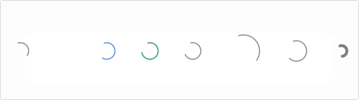

有一些比较耗时的操作，可能需要用户等待，那么就可以用 **活动指示器组件 ActivityIndicator** 告诉用户你需要等待。

其实，任何从用户点击开始，不能立刻给予用户反馈的操作，都需要使用 **活动指示器组件 ActivityIndicator** 告诉用户等待片刻。

| 属性      | 类型    | 是否必须 | 说明                                                        |
| --------- | ------- | -------- | ----------------------------------------------------------- |
| animating | boolean | 否       | 是否显示活动指示器。默认为 `true`，`false` 则表示隐藏       |
| color     | color   | 否       | ⭕️ 的颜色，默认情况下，`iOS` 为灰色，`Android` 为 **深青色** |
| size      | string  | 否       | 只有两个选项 `large` 和 `small`，默认是 `small`             |

```javascript
import React, { Component } from 'react';
import { ActivityIndicator, View, Text, TouchableOpacity, StyleSheet } from 'react-native';

class App extends Component {

   render() {
      return (
         <View style = {styles.container}>
            <ActivityIndicator style = {styles.activityIndicator}/>
         </View>
      )
   }
}

export default App

const styles = StyleSheet.create ({
   container: {
      marginTop: 70
   },
   activityIndicator: {
      flex: 1,
      justifyContent: 'center',
      alignItems: 'center',
      height: 80
   }
})
```

#### Alert

弹出框 `<Alert>` 是浮于当前界面之上的，用于阻止用户的下一步操作，直到用户点击了弹出框上的任意按钮为止。

弹出框 `<Alert>` 一般用于弹出 **提示**、**弹出警告**、**弹出确认** 等需要用户注意和确认的动作。

1. 弹出提示

弹出提示框一般只有一个 **确认** 按钮，用户点击 **确认** 就是 **我知道了的** 意思。

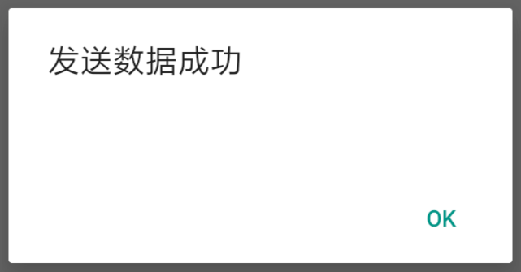

```javascript
import React from 'react'
import { Alert, Text, TouchableOpacity, StyleSheet } from 'react-native'

const App = () => {

    const showAlert = () =>{
        Alert.alert('发送数据成功')
    }

    return (
        <TouchableOpacity onPress = {showAlert} style = {styles.button}>
            <Text>发送</Text>
        </TouchableOpacity>
    )
}

export default App

const styles = StyleSheet.create ({
    button: {
        backgroundColor: '#4ba37b',
        width: 100,
        borderRadius: 50,
        alignItems: 'center',
        marginTop: 100
    }
})
```

2. 弹出警告

弹出警告框一般有两个按钮 **确认** 和 **取消**， **取消** 按钮在右边，方便用户点击。

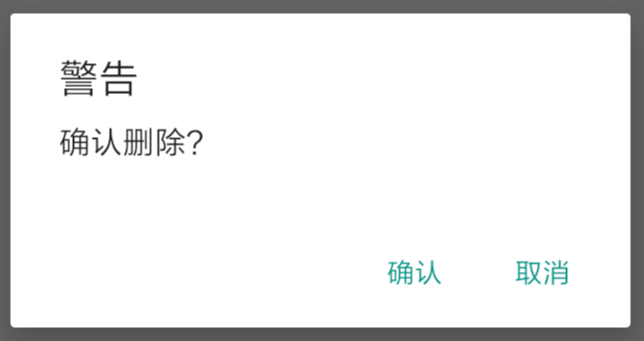

```javascript
import React from 'react'
import { Alert, Text, TouchableOpacity, StyleSheet } from 'react-native'

const App = () => {

    const showTip = () => {
        Alert.alert('删除数据成功')
    }

    const showAlert = () =>{
        Alert.alert(
            '警告',
            '确认删除？',
            [
                {text: '确认', onPress: () => showTip()},
                {text: '取消', style: 'cancel'}, 
            ],
            {cancelable: false}
        )
    }

    return (
        <TouchableOpacity onPress = {showAlert} style = {styles.button}>
            <Text>删除</Text>
        </TouchableOpacity>
    )
}

export default App

const styles = StyleSheet.create ({
    button: {
        backgroundColor: '#4ba37b',
        width: 100,
        borderRadius: 50,
        alignItems: 'center',
        marginTop: 100
    }
})
```

3. 弹出确认

弹出确认框一般有两个按钮 **确认** 和 **取消**， **确认** 按钮在右边，方便用户点击。

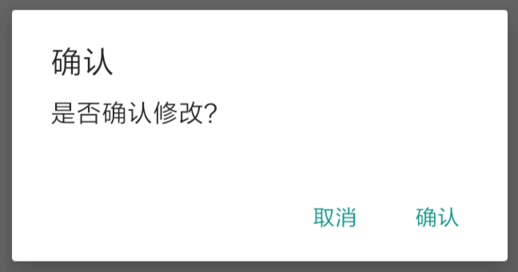

```javascript
import React from 'react'
import { Alert, Text, TouchableOpacity, StyleSheet } from 'react-native'

const App = () => {

    const showTip = () => {
        Alert.alert('修改数据成功')
    }

    const showAlert = () =>{
        Alert.alert(
            '确认',
            '是否确认修改？',
            [
                {text: '取消', style: 'cancel'},
                {text: '确认', onPress: () => showTip()},
            ],
            {cancelable: false}
        )
    }

    return (
        <TouchableOpacity onPress = {showAlert} style = {styles.button}>
            <Text>修改</Text>
        </TouchableOpacity>
    )
}

export default App

const styles = StyleSheet.create ({
    button: {
        backgroundColor: '#4ba37b',
        width: 100,
        borderRadius: 50,
        alignItems: 'center',
        marginTop: 100
    }
})
```

#### Picker

如果要从多个 **已知的选项** 中选择一个，那么可以使用 React Native 内置的 **选择器 `<Picker>`**。

选择器 `<Picker>` 类似于 [HTML 中的 select 标签](https://www.twle.cn/l/yufei/html/html-basic-forms.html) 。

| 属性          | 说明                           |
| ------------- | ------------------------------ |
| selectedValue | 用于设置默认的选中项目         |
| onValueChange | 用于设置选中项变更时的触发操作 |

#####  `onValueChange` 属性

`onValueChange` 属性用于设置 `<Picker>` 中的选项变更时触发的操作。

`onValueChange` 属性的触发的事件原型如下

```
function(itemValue,itemPosition) {
// 具体的处理逻辑
}
```

| 参数         | 说明                                            |
| ------------ | ----------------------------------------------- |
| itemValue    | 选中项 `<Picker.Item>` 的 `value` 值            |
| itemPosition | 选中项 `<Picker.Item>` 的位置，第一个位置为 `0` |

`<Picker.Item>` 用于设置每一个选项，使用语法如下

```
<Picker.Item label = "男"   value = "male" />
```

| 属性  | 说明                   |
| ----- | ---------------------- |
| label | 用于设置显示出来的名称 |
| value | 用于设置选项的值       |

```javascript
import React, { Component } from 'react';
import { View, Text, Picker, StyleSheet } from 'react-native'

class App extends Component {

   users = [
      {label: '请选择性别',value:''},
      {label: '男',value:'male'},
      {label: '女',value:'female'},
      {label: '其它',value:'other'}
   ]
   state = {user: ''}
   updateUser = (user) => {
      this.setState({ user: user })
   }
   render() {
      return (
         <View style={styles.container}>
            <Text style = {styles.label}>请选择性别</Text>
            <Picker 
               selectedValue = {this.state.user} 
               onValueChange = {this.updateUser}>
            {  
               this.users.map((o,index) =>
                  <Picker.Item label={o.label} value = {o.value}/>
               )
            }
            </Picker>
            <Text style = {styles.label}>你的选择是</Text>
            <Text style = {styles.text}>{this.state.user}</Text>
         </View>
      )
   }
}
export default App

const styles = StyleSheet.create({

   container: {
      margin:50,
   },
   label: {
      fontSize: 14,
      color:'#333333'
   },
   text: {
      fontSize: 30,
      alignSelf: 'center',
      color: 'red'
   }
})
```

### 列表视图

与更通用的不同[`ScrollView`](https://reactnative.dev/docs/scrollview)，以下列表视图组件仅呈现当前显示在屏幕上的元素。这使它们成为显示长数据列表的高效选择。

#### FlatList

TODO


#### SectionList

TODO


### 安卓专用


参考官网

### IOS专用


参考官网

### 其他

#### Animated

React Native 动画组件 `Animated` 是对 Android 和 iOS 动画的封装，以统一的接口的提供了为 React Native 提供了动画功能。

动画组件 Animated 提供的是一种值动画，也就是属性改变动画。也就是通过动态的不断的改变控件的某个属性的值来达到动画的目的。

当我们需要创建一个动画时，我们必须先初始化一个值。React Native Animated 组件提供了两种值类型

| 值类型               | 说明       |
| -------------------- | ---------- |
| `Animated.Value()`   | 单个值变化 |
| `Animated.ValueXY()` | 两个值变化 |

Animated 组件提供了三种类型来控制动画的缓动过程。

| 函数                | 说明                                                         |
| ------------------- | ------------------------------------------------------------ |
| `Animated.decay()`  | 以摩擦力模型来控制动画的缓动，简单的说就是以初始速度开始并逐渐减速到停止 |
| `Animated.spring()` | 使用弹簧物理模型来控制动画的缓动                             |
| `Animated.timing()` | 使用时间来控制动画的缓动                                     |

默认情况下， React Native 只能对以下组件提供动画功能

```
Animated.Image
Animated.ScrollView
Animated.Text
Animated.View
Animated.FlatList
Animated.SectionList
```

如果其它组件也需要动画动能，那么需要使用 `createAnimatedComponent()` 函数来开启动画功能。

总之，React Native 动画组件 Animated 有点复杂，详细功能可以直接参考文档。

##### Animated 的创建过程

1. 首先，一般给要创建动画的组件设置一个初始的样式，这个通过 `style` 属性来解决。

例如下面的代码为某个 `box` 组件设置了初始化的 **背景色**、**长** 和 **框**。

```
const styles = StyleSheet.create({

    box: {
        backgroundColor: 'blue',
        width: 50,
        height: 100
    }
})
```

1. 其次，在组件即将加载的生命周期函数 `componentWillMount()` 中初始化动画。

```
componentWillMount = () => {
    this.animatedWidth = new Animated.Value(50)
    this.animatedHeight = new Animated.Value(100)
}
```

初始化动画使用 `Animated.Value()` 或 `Animated.ValueXY()` 来实现。

例如

```
new Animated.Value(50)
```

这是什么意思呢？ 比如我们要实现动画：**长从 50 变化到 100**。 那么动画初始化的时候就需要把值 `50` 传递给 `Animated.Value(50)`

1. 使用动画类型来定义动画滑动的过程。这个一般包装在某个函数里面

```
animatedBox = () => {
    Animated.timing(this.animatedWidth, {
        toValue: 200,
        duration: 1000
    }).start()
    Animated.timing(this.animatedHeight, {
        toValue: 500,
        duration: 500
    }).start()
}
```

`Animated.timing()` 用于定义随时间变化的函数。它的函数原型如下

```
static timing(value, config)
```

各个参数说明如下

| 参数   | 说明                                           |
| ------ | ---------------------------------------------- |
| value  | 要实现缓动的值。也就是我们第一步中初始化的动画 |
| config | 配置动画缓动的各种参数                         |

`config` 可配置的参数如下

| 参数            | 说明                                                         |
| --------------- | ------------------------------------------------------------ |
| toValue         | 用于设置动画结束的值                                         |
| duration        | 动画时长，单位为 **毫秒**，默认值是 `500`。                  |
| easing          | 时间缓动曲线函数。默认值为渐入渐出 `Easing.inOut` 别名 `Easing.ease` |
| delay           | 延迟多少毫秒才开始动画，默认值是 `0`                         |
| isInteraction   | 此动画是否在 InteractionManager 上创建 "交互句柄"。默认为 `true` |
| useNativeDriver | 是否使用原生动画来实现，默认值是 `false`。                   |

`.start()` 方法用于开始一个动画。

2. 将初始化的动画和属性包装成一个样式。我们后面会用这个样式去覆盖动画组件的默认样式。

```
const animatedStyle = { width: this.animatedWidth, height: this.animatedHeight }
```

3. 重点来了，接下来我们要使用 `<Animated.xxx>` 组件定一个自定义动画组件。然后把这个自定义动画组件包裹在想要设置动画的组件里。

```
<TouchableOpacity style = {styles.container} onPress = {this.animatedBox}>
	<Animated.View style = {[styles.box, animatedStyle]}/>
</TouchableOpacity>
```

`<TouchableOpacity>` 是我们想要实现的动画的组件。`onPress = {this.animatedBox}` 设置表示当点击的时候才开始动画。

`<Animated.View>` 是系统内置的可添加动画的组件。它的实际意思就是说这个动画其实是一个针对 `<View>` 组件属性的动画。它的 `style` 属性有两个值。

```
style = {[styles.box, animatedStyle]}
```

这两个值是合并的意思，就是 `animatedStyle` 里设置的样式会覆盖 `styles.box` 设置的样式。

##### 范例

```javascript
import React, { Component } from 'react'
import { View, StyleSheet, Animated, TouchableOpacity } from 'react-native'

class App extends Component {
   componentWillMount = () => {
      this.animatedWidth = new Animated.Value(50)
      this.animatedHeight = new Animated.Value(100)
   }
   animatedBox = () => {
      Animated.timing(this.animatedWidth, {
         toValue: 200,
         duration: 1000
      }).start()
      Animated.timing(this.animatedHeight, {
         toValue: 500,
         duration: 500
      }).start()
   }
   render() {
      const animatedStyle = {
            width: this.animatedWidth, 
            height: this.animatedHeight }
      return (
         <TouchableOpacity 
            style = {styles.container} 
            onPress = {this.animatedBox}>
            <Animated.View style = {[styles.box, animatedStyle]}/>
         </TouchableOpacity>
      )
   }
}
export default App

const styles = StyleSheet.create({
   container: {
      justifyContent: 'center',
      alignItems: 'center'
   },
   box: {
      backgroundColor: 'blue',
      width: 50,
      height: 100
   }
})
```

#### Dimensions


#### KeyboardAvoidingView


#### Linking


#### Modal


#### PixelRatio


#### PefreshControl


#### StatusBar

**状态栏 StatusBar** 就是手机屏幕最顶上一个区域，包含 **运营商名称**、**网络情况**、**电池情况那一条**。

在 React Native 中我们可以定制 **状态栏** StatusBar 。当然了，说是定制，无非以下几点

1. 显示或隐藏状态栏。
2. 设置主题色：亮色系还是暗色系。
3. 设置显示或隐藏时是否启用动画。

React Native 提供了 `<StatusBar>` 组件来做上面这些事情。

React Native 中的 `StatusBar` 采用覆盖规则，我们可以在一个页面中定义多个 `<StatusBar>` 。 后面定义的 `<StatusBar>` 的属性会覆盖前一个 `<StatusBar>` 设置的属性。

##### 静态方法

除了可以使用属性来设置状态栏外，React Native 中的 **StatusBar** 还提供了一些静态方法用来设置状态栏。

1. setHidden()

`setHidden()` 用于设置显示或隐藏状态栏。

`setHidden()` 的函数原型如下

```
static setHidden(hidden: boolean, [animation]: StatusBarAnimation)
```

参数说明

| 参数      | 类型               | 是否必填 | 说明                                   |
| --------- | ------------------ | -------- | -------------------------------------- |
| hidden    | boolean            | 是       | 是否隐藏状态栏，`true` 是，`false` 否  |
| animation | StatusBarAnimation | 否       | 可选，设置显示或隐藏状态改变时的动画。 |

1. setBarStyle()

`setBarStyle()` 用于设置状态栏的主题色。

`setBarStyle()` 的函数原型如下

```
static setBarStyle(style: StatusBarStyle, [animated]: boolean)
```

参数说明

| 参数     | 类型           | 是否必填 | 说明                 |
| -------- | -------------- | -------- | -------------------- |
| style    | StatusBarStyle | 是       | 要设置的状态栏主题色 |
| animated | boolean        | 否       | 主题色改变时是否动画 |

##### 枚举常量

1. StatusBarStyle

`StatusBarStyle` 枚举常量定义了状态栏可用的主题色.

值说明

| 值            | 说明                                                         |
| ------------- | ------------------------------------------------------------ |
| default       | 默认主题色，iOS 上是 `dark-content` ，Android 是 `light-content` |
| light-content | 暗色的背景，亮色的文字和图标                                 |
| dark-content  | 亮色的背景，暗色的文字和图标( Android 要求 API >= 23 )       |

2. StatusBarAnimation

`StatusBarAnimation` 枚举常量定义了状态栏可用的动画效果。

值说明

| 值    | 说明               |
| ----- | ------------------ |
| none  | 默认，没有动画效果 |
| fade  | 渐隐渐现动画效果   |
| slide | 渐入渐出动画效果   |


##### 范例

```javascript
import React, { Component } from 'react';
import { StatusBar } from 'react-native'

const App = () => {
   return (
      <StatusBar barStyle = "dark-content" hidden={false} />
   )
}
export default App
```

```javascript
import React, { Component } from 'react';
import {View, Text, StatusBar, StyleSheet, TouchableOpacity} from 'react-native'

class App extends Component {

   state = {
      hidden:false,
      barStyle:'default'
   }

    changeHidden = () =>{
      var hidden = this.state.hidden ? false : true;
        this.setState({ hidden: hidden })
    }

    changeBarStyle = () =>{
      var  barStyle = this.state.barStyle == 'light-content' ? 'dark-content' : 'light-content';
        this.setState({ barStyle: barStyle })
    }

    render() {
      return (
         <View>
            <StatusBar barStyle = {this.state.barStyle} hidden={this.state.hidden} />
            <TouchableOpacity style={styles.button} onPress = {this.changeHidden}>
               <Text>显示或隐藏</Text>
           </TouchableOpacity>
           <TouchableOpacity style={styles.button} onPress = {this.changeBarStyle}>
               <Text>改变主题色</Text>
           </TouchableOpacity>
        </View>
      )
   }
}
export default App

const styles = StyleSheet.create ({
    button: {
        backgroundColor: '#4ba37b',
        width: 100,
        borderRadius: 50,
        alignItems: 'center',
        marginTop: 100
    }
})
```

## 交互方式

### 点击事件

#### Button

用户主要通过触摸与移动应用程序进行交互。他们可以使用多种手势组合，例如点击按钮、滚动列表或放大地图。React Native 提供了处理各种常见手势的组件，以及一个全面的[手势响应系统](https://reactnative.dev/docs/gesture-responder-system)以允许更高级的手势识别，但您最有可能感兴趣的一个组件是基本的 Button。

[Button](https://reactnative.dev/docs/button)提供了一个基本的按钮组件，可以在所有平台上很好地呈现。显示按钮的最小示例如下所示：

```javascript
<Button
  onPress={() => {
    alert('You tapped the button!');
  }}
  title="Press Me"
/>
```

```javascript
import React, { Component } from 'react';
import { Button, StyleSheet, View } from 'react-native';

export default class ButtonBasics extends Component {
  _onPressButton() {
    alert('You tapped the button!')
  }

  render() {
    return (
      <View style={styles.container}>
        <View style={styles.buttonContainer}>
          <Button
            onPress={this._onPressButton}
            title="Press Me"
          />
        </View>
        <View style={styles.buttonContainer}>
          <Button
            onPress={this._onPressButton}
            title="Press Me"
            color="#841584"
          />
        </View>
        <View style={styles.alternativeLayoutButtonContainer}>
          <Button
            onPress={this._onPressButton}
            title="This looks great!"
          />
          <Button
            onPress={this._onPressButton}
            title="OK!"
            color="#841584"
          />
        </View>
      </View>
    );
  }
}

const styles = StyleSheet.create({
  container: {
   flex: 1,
   justifyContent: 'center',
  },
  buttonContainer: {
    margin: 20
  },
  alternativeLayoutButtonContainer: {
    margin: 20,
    flexDirection: 'row',
    justifyContent: 'space-between'
  }
});
```

#### Touchables

如果基本按钮看起来不适合您的应用程序，您可以使用 React Native 提供的任何“Touchable”组件构建自己的按钮。“Touchable”组件提供捕捉点击手势的能力，并且可以在手势被识别时显示反馈。然而，这些组件不提供任何默认样式，因此您需要做一些工作才能让它们在您的应用程序中看起来很好。

你使用哪个“Touchable”组件取决于你想提供什么样的反馈：

- 通常，您可以在 Web 上使用按钮或链接的任何地方使用[**TouchableHighlight**](https://reactnative.dev/docs/touchablehighlight)。当用户按下按钮时，视图的背景将变暗。
- 您可以考虑在 Android 上使用[**TouchableNativeFeedback**](https://reactnative.dev/docs/touchablenativefeedback)来显示响应用户触摸的墨水表面反应波纹。
- [**TouchableOpacity**](https://reactnative.dev/docs/touchableopacity)可用于通过降低按钮的不透明度来提供反馈，允许在用户按下时透视背景。
- 如果您需要处理点击手势但不想显示任何反馈，请使用[**TouchableWithoutFeedback**](https://reactnative.dev/docs/touchablewithoutfeedback)。

在某些情况下，您可能希望检测用户何时按下并保持视图一段时间。这些长按可以通过将函数传递给`onLongPress`任何“可触摸”组件的道具来处理。

```javascript
import React, { Component } from 'react';
import { Platform, StyleSheet, Text, TouchableHighlight, TouchableOpacity, TouchableNativeFeedback, TouchableWithoutFeedback, View } from 'react-native';

export default class Touchables extends Component {
  _onPressButton() {
    alert('You tapped the button!')
  }

  _onLongPressButton() {
    alert('You long-pressed the button!')
  }


  render() {
    return (
      <View style={styles.container}>
        <TouchableHighlight onPress={this._onPressButton} underlayColor="white">
          <View style={styles.button}>
            <Text style={styles.buttonText}>TouchableHighlight</Text>
          </View>
        </TouchableHighlight>
        <TouchableOpacity onPress={this._onPressButton}>
          <View style={styles.button}>
            <Text style={styles.buttonText}>TouchableOpacity</Text>
          </View>
        </TouchableOpacity>
        <TouchableNativeFeedback
            onPress={this._onPressButton}
            background={Platform.OS === 'android' ? TouchableNativeFeedback.SelectableBackground() : ''}>
          <View style={styles.button}>
            <Text style={styles.buttonText}>TouchableNativeFeedback {Platform.OS !== 'android' ? '(Android only)' : ''}</Text>
          </View>
        </TouchableNativeFeedback>
        <TouchableWithoutFeedback
            onPress={this._onPressButton}
            >
          <View style={styles.button}>
            <Text style={styles.buttonText}>TouchableWithoutFeedback</Text>
          </View>
        </TouchableWithoutFeedback>
        <TouchableHighlight onPress={this._onPressButton} onLongPress={this._onLongPressButton} underlayColor="white">
          <View style={styles.button}>
            <Text style={styles.buttonText}>Touchable with Long Press</Text>
          </View>
        </TouchableHighlight>
      </View>
    );
  }
}

const styles = StyleSheet.create({
  container: {
    paddingTop: 60,
    alignItems: 'center'
  },
  button: {
    marginBottom: 30,
    width: 260,
    alignItems: 'center',
    backgroundColor: '#2196F3'
  },
  buttonText: {
    textAlign: 'center',
    padding: 20,
    color: 'white'
  }
});
```

### 导航

移动应用程序很少由单个屏幕组成。管理多个屏幕的呈现和转换通常由所谓的导航器处理。

本指南涵盖了 React Native 中可用的各种导航组件。如果您开始使用导航，您可能想要使用[React Navigation](https://reactnative.dev/docs/navigation#react-navigation)。React Navigation 提供了一个简单的导航解决方案，能够在 Android 和 iOS 上呈现常见的堆栈导航和选项卡式导航模式。

如果您正在将 React Native 集成到已经本地管理导航的应用程序中，或者正在寻找 React Navigation 的替代方案，以下库在两个平台上都提供了本机导航：[react-native-navigation](https://github.com/wix/react-native-navigation)。

#### 安装和设置

```bash
npm install @react-navigation/native @react-navigation/native-stack
```

接下来，安装所需的对等依赖项。您需要根据您的项目是 Expo 托管项目还是裸 React Native 项目来运行不同的命令。

- 如果您有 Expo 管理的项目，请使用`expo`以下命令安装依赖项：

```shell
expo install react-native-screens react-native-safe-area-context
```

- 如果您有一个裸 React Native 项目，请使用`npm`以下命令安装依赖项：

```shell
npm install react-native-screens react-native-safe-area-context
```

对于带有裸 React Native 项目的 iOS，请确保已安装[Cocoapods](https://cocoapods.org/)。然后安装 pods 以完成安装：

```shell
cd ios
pod install
cd ..
```

现在，您需要将整个应用程序包装在NavigationContainer. 通常您会在您的入口文件中执行此操作，例如index.js或App.js：

```javascript
import * as React from 'react';
import { NavigationContainer } from '@react-navigation/native';

const App = () => {
  return (
    <NavigationContainer>
      {/* Rest of your app code */}
    </NavigationContainer>
  );
};

export default App;
```

#### 用法

现在您可以创建一个带有主屏幕和个人资料屏幕的应用程序：

```jsx
import * as React from 'react';
import { NavigationContainer } from '@react-navigation/native';
import { createNativeStackNavigator } from '@react-navigation/native-stack';

const Stack = createNativeStackNavigator();

const MyStack = () => {
  return (
    <NavigationContainer>
      <Stack.Navigator>
        <Stack.Screen
          name="Home"
          component={HomeScreen}
          options={{ title: 'Welcome' }}
        />
        <Stack.Screen name="Profile" component={ProfileScreen} />
      </Stack.Navigator>
    </NavigationContainer>
  );
};
```

复制

在此示例中，使用该组件定义了2 个屏幕（`Home`和`Profile`）`Stack.Screen`。同样，您可以定义任意数量的屏幕。

您可以设置选项，如在每个画面的画面标题`options`的道具`Stack.Screen`。

每个屏幕`component`都有一个作为 React 组件的prop。这些组件接收一个名为的道具`navigation`，该道具具有链接到其他屏幕的各种方法。例如，您可以使用`navigation.navigate`转到`Profile`屏幕：

```javascript
const HomeScreen = ({ navigation }) => {
  return (
    <Button
      title="Go to Jane's profile"
      onPress={() =>
        navigation.navigate('Profile', { name: 'Jane' })
      }
    />
  );
};
const ProfileScreen = ({ navigation, route }) => {
  return <Text>This is {route.params.name}'s profile</Text>;
};
```

此`native-stack`导航器使用本机 API：`UINavigationController`在 iOS 和`Fragment`Android 上，因此构建的导航`createNativeStackNavigator`将与基于这些 API 本地构建的应用程序的行为相同并具有相同的性能特征。

React Navigation 还具有用于不同类型导航器的包，例如选项卡和抽屉。您可以使用它们在您的应用程序中实现各种模式。

## 数据

### 组件状态 state

总所周知，React 组件的数据由 `props` 和 `state` 两大部分组成。

`props` 和 `state` 之间的共同点就是它们都是一个对象或者说一个字典 `{}`。

它们之间也有着显著的区别。

- `state` 由 React 组件自己内部管理，是可变的。组件可以随时更新 `state` 的数据，组件外部则无法访问和更新。

- `props` 是 React 组件的属性，是组件外部传递给组件的数据。对于组件来说，这些数据是不可变的。组件只能读取不能更改。只能由调用组件的外部代码来更改。

  `props` 一般情况下由组件自描述，也就是组件描述自己能够接受哪些数据。但外部可以无视，可以传递比组件自描述更多的数据。至于组件自己用不用，那是组件自己的问题，外部组件无权干涩。

本章节我们简单介绍下 `state` ，`props` 会在 [React Native 组件属性 props](https://www.twle.cn/c/yufei/reactnative/reactnative-basic-props.html) 中介绍。

#### React Native 组件状态 state

组件状态 state 是一个 [JavaScript](https://www.twle.cn/l/yufei/javascript/javascript-basic-index.html) 对象或字典 `{}`。

##### 初始化 state

在 ES6 时代，组件状态就是组件内部的一个变量。

初始化的方式有两种：

1. 类的实例属性

   ```
   class App extends React.Component {
       state = {
           name: '简单教程',
           site: 'https://www.twle.cn'
       }
   }
   ```

2. 在类的构造函数中初始化

   ```
   class App extends React.Component {
   
       constructor()
       {
           super()
           this.state = {
               name: '简单教程',
               site: 'https://www.twle.cn'
           }
       }
   }
   ```

##### 使用 state

因为 state 是一个对象或者字典，因此读取 `state` 的值其实就是访问对象的属性。可以通过对象属性语法来访问 state 的值。

例如通过 `this.state.name` 访问名称，通过 `this.state.site` 访问站点网址。

但 React 中一般通过对象解析语法来访问 state，也就是通过下面的方式来获取 state 的值

```
const {name,site} = this.state
```

这样能保证我们读取的状态值是 **不可变的**。

例如

```
import React, { Component } from 'react'
import { Text, View, StyleSheet} from 'react-native'

export default class App extends React.Component {
    state = {
        name: '简单教程',
        site: 'https://www.twle.cn'
    }

    render() {
        const {name,site} = this.state
        return (
            <View style={styles.container}>
                <Text>站点名称：{name}</Text>
                <Text>站点网址：{site}</Text>
            </View>
        )
    }
}


const styles = StyleSheet.create ({
   container: {
      margin:10
   },
})
```

运行效果如下

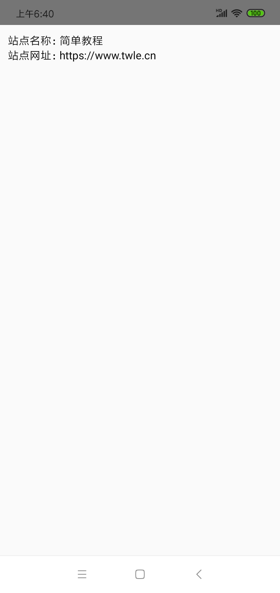

##### 更新 state

React 提供了 `this.setState({key:value})` 函数来更新状态 state。

`setState()` 函数的参数是一个对象或哈希表/字典，是要更新的键值对。

例如要把站点名称改成 `简单教程，简单编程`，则可以如下使用 `setState()`

```
this.setState({name:'简单教程，简单编程'})
```

例如

```
import React, { Component } from 'react'
import { Text, View, StyleSheet} from 'react-native'

export default class App extends React.Component {
    state = {
        name: '简单教程',
        site: 'https://www.twle.cn'
    }

    updateState = () => {
        const name = this.state.name == '简单教程' ? '简单教程，简单编程' : '简单教程'
        this.setState({name:name})
    }

    render() {
        const {name,site} = this.state
        return (
            <View style={styles.container}>
                <Text onPress={this.updateState}>站点名称：{name}</Text>
                <Text>站点网址：{site}</Text>
            </View>
        )
    }
}


const styles = StyleSheet.create ({
   container: {
      margin:10
   },
})
```

### 组件属性 props

组件的调用者可以通过 **属性** 将数据传递给组件，然后组件内部可以通过 **组件属性 props** 来获取调用者传递的数据。

调用者通过属性传递数据

```
<SiteNameComponent onPress={this.updateState} name={name} />
```

组件内部通过组件属性 `props` 来获取传递给组件的数据

```
const SiteNameComponent = (props) => {
   return (
      <View>
         <Text onPress = {props.onPress}>
            {props.name}
         </Text>
      </View>
   )
}
```

因为数据可以通过属性来传递，组件可以没有状态，不用状态来保存任何中间数据。对于没有状态的组件，我们称之为 **表现组件**。

因此我们可以将组件分为两大类：

1. **容器组件**

   容器组件是普通的组件，使用 **ES6 类** 来实现，既包括组件属性，也包含 **组件状态**。

   最重要的是 **容器组件有自己的状态和行为处理函数**。

2. **纯表现组件**

   纯表现组件只用于展现数据，数据来源可以是写死的固定不变的，也可以是通过属性传递给组件的。

   纯表现组件没有自己的内部状态，所有数据都因为外部而变。

#### 容器组件

容器组件是最普通的组件，使用 ES6 类 来实现，既包括组件属性，也包含组件状态。

##### 使用原则

1. 如果一个组件需要更新自己的状态，那么该组件就是容器组件。
2. 容器组件有着自己的状态 `state`，也可以通过属性 `props` 接收外部的数据来更新自己的状态。
3. 如果不需要保存状态，建议不要使用容器组件。

##### 范例

容器组件是最普通的组件， React Native 内置的大部分组件都是容器组件，它们多有一个 state 来保存状态。

下面的代码，我们使用容器组件来实现站点名称的展示，我们通过属性将外部数据作为初始值传递给组件，然后组件自己内部处理用户的点击。

```
import React, { Component } from 'react'
import { Text, View, StyleSheet,Alert} from 'react-native'

class SiteNameComponent extends React.Component {

    constructor(props) {
        super(props)
        this.state = { name: props.name }
    }

    updateState = () => {
        const name = this.state.name == '简单教程' ? '简单教程，简单编程' : '简单教程'
        this.setState({name:name})
    }

    render() {
        const { name } = this.state
        return (
        <View>
            <Text onPress={this.updateState}>{name}</Text>
        </View>
        )
    }
}

export default class App extends React.Component {

    render() {
        return (
            <View style={styles.container}>
                <SiteNameComponent name={'简单教程'} />
            </View>
        )
    }
}

const styles = StyleSheet.create ({
   container: {
      margin:10
   },
})
```

当我们点击文本的时候会通过 `{props.onPress}` 来切换站点名称。

#### 纯函数式组件

**纯函数式组件** 也是 **表现组件** 中的一种，是 React 为了简化 **类组件** 而引入的。

大部分的组件，只用于显示数据，不用处理逻辑，不用内部响应用户触摸和点击，对于这类组件，我们使用 **类** 来写就显得有点复杂了。

```
import React, { Component } from 'react'
import { Text, View } from 'react-native'

export default class App extends React.Component {

    render() {
        return (
            <View>
                <Text onPress = {props.updateState}>
                    {props.myState}
            </Text>
        </View>
    )
}
```

对于这种组件，我们可以简化，可以使用函数式语法来简化。

一般情况下，我们使用 ES6 的箭头语法来实现**函数式组件**。

```
import React, { Component } from 'react'
import { Text, View } from 'react-native'

export default App = (props) => {
   return (
      <View>
         <Text onPress = {props.updateState}>
            {props.myState}
         </Text>
      </View>
   )
}
```

> **纯函数式组件** 其实就是类组件把 `render()` 函数提出来而已。

##### 使用原则

1. **纯函数式组件** 只能用于 **显示数据** 目的。
2. **纯函数式组件** 不需要组件状态 state，也不能有组件状态 state。
3. **纯函数式组件** 只通过 **组件属性 props** 接收数据和相关处理函数。

React Native 组件的最佳实战就是 **多用组件属性而少用组件状态**。 你应该尽可能的使用 **纯函数式组件**。

##### 范例

我们对上面的范例进行改造下，改成使用 **纯函数式组件** 来展现数据。

我们使用组件属性 `{props.name}` 来显示站点名称，使用 `{props.onPress}` 来响应用户的点击。

```
import React, { Component } from 'react'
import { Text, View, StyleSheet} from 'react-native'

const SiteNameComponent = (props) => {
   return (
      <View>
         <Text onPress = {props.onPress}>
            {props.name}
         </Text>
      </View>
   )
}

export default class App extends React.Component {
    state = {
        name: '简单教程',
    }

    updateState = () => {
        const name = this.state.name == '简单教程' ? '简单教程，简单编程' : '简单教程'
        this.setState({name:name})
    }

    render() {
        const {name} = this.state
        return (
            <View style={styles.container}>
                <SiteNameComponent onPress={this.updateState} name={name} />
            </View>
        )
    }
}

const styles = StyleSheet.create ({
   container: {
      margin:10
   },
})
```

当我们点击文本的时候会通过 `{props.onPress}` 来切换站点名称。

### 存储数据组件 AsyncStorage

React Native 提供了 `AsyncStorage` 组件用于存储数据。

在 `0.60` 版本之前，这个组件是内置的，`0.60` 版本把它移到了 [react-native-community/react-native-async-storage](https://github.com/react-native-community/react-native-async-storage)。

AsyncStorage 是一个简单的，未加密的，异步的，持久的键值存储系统。

AsyncStorage 是一个全局的存储系统，没有实例这一概念。要存储数据就往里面扔，要读取数据就发起请求。

AsyncStorage 对外提供了简单的 [JavaScript](https://www.twle.cn/l/yufei/javascript/javascript-basic-index.html) 接口。每一个接口都是 **异步** 的，每一个接口都返回一个 `Promise` 对象。

#### React Native 存储数据组件 AsyncStorage

##### 安装组件

虽然之前的版本都是内置，但 0.60 版本将组件移到了 [react-native-community/react-native-async-storage](https://github.com/react-native-community/react-native-async-storage)。

为了兼容所有版本，我们推荐安装 [react-native-community/react-native-async-storage](https://github.com/react-native-community/react-native-async-storage)。

```
yarn add @react-native-community/async-storage
```

或

```
npm i @react-native-community/async-storage
```

##### 链接组件

**React Native 0.60+ 版本会自动链接**。

但之前的版本则需要我们手动链接

```
react-native link @react-native-community/async-storage
```

如果你从低版本升级到 0.60+ 版本，反而要删除链接，命令如下

```
react-native unlink @react-native-community/async-storage
```

##### 引入组件

```
import AsyncStorage from '@react-native-community/async-storage';
```

##### 对外提供的方法

| 方法            | 说明                                              |
| --------------- | ------------------------------------------------- |
| `getItem()`     | 根据给定的 key 来读取数据                         |
| `setItem()`     | 将一个键值对添加到系统中，如果已经存在 key 则覆盖 |
| `removeItem()`  | 根据给定的 key 删除指定的键值对                   |
| `getAllKeys()`  | 返回数据库中所有的 **键**                         |
| `multiGet()`    | 根据给定的 key 列表获取多个键值对                 |
| `multiSet()`    | 将多个键值对存储到系统中                          |
| `multiRemove()` | 根据多个 key 删除多个键值对                       |
| `clear()`       | 清空整个数据库系统                                |

每一个接口的详细信息，可以 [官方 API 文档](https://github.com/react-native-community/async-storage)

##### 使用示例

存储数据

```
storeData = async () => {
  try {
    await AsyncStorage.setItem('@storage_Key', 'stored value')
  } catch (e) {
    // 保存失败
  }
}
```

读取数据

```
getData = async () => {
  try {
    const value = await AsyncStorage.getItem('@storage_Key')
    if(value !== null) {
      // 之前存储的数据
    }
  } catch(e) {
    // 读取数据失败
  }
}
```

##### 最佳实战

- 数据可能不存在，推荐在 `constructor()` 构造函数中先初始化一个默认值
- 推荐把读取数据的逻辑放到 `componentDidMount()` 中。

#### 范例

下面的代码演示了如何在存储数据组件 AsyncStorage 中存储和读取数据。

##### App.js

```
import React, { Component } from 'react'
import { Text, View, Alert,TextInput, StyleSheet,TouchableHighlight } from 'react-native'
import AsyncStorage from '@react-native-community/async-storage';

export default class App extends Component {
   state = {
      'name': '你好 www.twle.cn',
      'inputText':'你好，简单教程',
   }

   async readName() {
        try {
          const value = await AsyncStorage.getItem('name')
          if(value !== null) {
              this.setState({ 'name': value })
          }
          Alert.alert("读取数据成功")
        } catch(e) {
          console.log(e);
          Alert.alert("读取数据失败!")
        }
   }

   setName = () => {
      AsyncStorage.setItem('name', this.state.inputText);
      Alert.alert("保存成功!")
   }
   render() {
      return (
         <View style = {styles.container}>
            <TextInput 
              style = {styles.textInput} 
              autoCapitalize = 'none' 
              value={this.state.inputText} />
            <View style={{flexDirection:'row'}}>
                <TouchableHighlight style={[styles.button,{marginRight:8}]} onPress={this.setName}>
                    <Text style={styles.buttonTxt}>保存</Text>
                </TouchableHighlight>
                <TouchableHighlight style={[styles.button,{backgroundColor:'blue'}]} onPress={this.readName.bind(this)}>
                    <Text style={styles.buttonTxt}>读取</Text>
                </TouchableHighlight>
            </View>
            <View style={{marginTop:8}}>
                <Text>当前的值：{this.state.name}</Text>
            </View>
         </View>
      )
   }
}

const styles = StyleSheet.create ({
   container: {
      margin:10
   },
   textInput: {
      margin: 5,
      height: 44,
      width:'100%',
      borderWidth: 1,
      borderColor: '#dddddd'
   },
   button: {
      flex:1,
      height:44,
      justifyContent:'center',
      alignItems:'center',
      width:100,
      backgroundColor: 'red'
   },
   buttonTxt:{
      justifyContent:'center',
      color:'#ffffff'
   }
})
```

## React Navigation

### 安装与基础使用

#### 安装依赖

```bash
yarn add @react-navigation/native
yarn add react-native-screens react-native-safe-area-context
yarn add @react-navigation/native-stack
```

如果是ios，需要安装

```bash
npx pod-install ios
```

#### 第一个页面

修改 `App.js`

```javascript
import * as React from 'react';
import { View, Text } from 'react-native';
import { NavigationContainer } from '@react-navigation/native';
import { createNativeStackNavigator } from '@react-navigation/native-stack';

function HomeScreen() {
  return (
    <View style={{ flex: 1, alignItems: 'center', justifyContent: 'center' }}>
      <Text>这里是首页</Text>
    </View>
  );
}

const Stack = createNativeStackNavigator();

function App() {
  return (
    <NavigationContainer>
      <Stack.Navigator>
        <Stack.Screen
          name="Home"
          component={HomeScreen}
          options={{ title: '首页' }}
        />
      </Stack.Navigator>
    </NavigationContainer>
  );
}

export default App;
```

运行结果

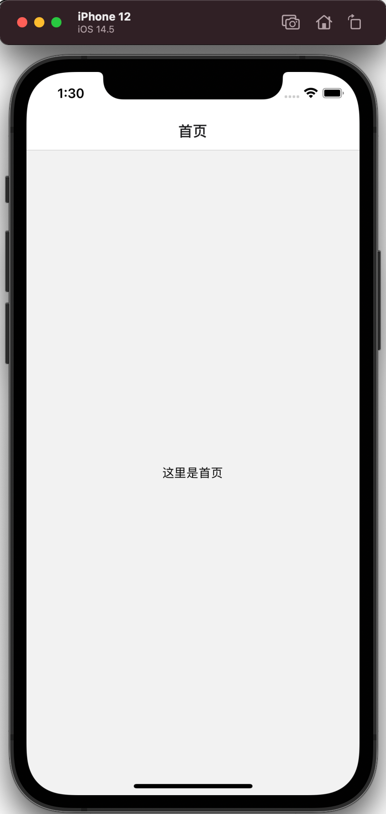

### 页面间跳转

#### 方法列表

| 用法                             | 说明                                                         |
| :------------------------------- | :----------------------------------------------------------- |
| `navigation.navigate('Details')` | `Details`是另一页面的 `name` 如果已经在`Details`页面了，则不能再次跳转 |
| `navigation.push('Details')`     | 已经在`Details`页面了，还可以继续跳转`Details`               |
| `navigation.goBack()`            | 返回上一页                                                   |
| `navigation.popToTop()`          | 返回到一个 Stack 的第一个页面                                |

#### `navigation.navigate` 跳转

```javascript
import * as React from 'react';
import { View, Text, Button } from 'react-native';
import { NavigationContainer } from '@react-navigation/native';
import { createNativeStackNavigator } from '@react-navigation/native-stack';

function HomeScreen({ navigation }) {
  return (
    <View style={{ flex: 1, alignItems: 'center', justifyContent: 'center' }}>
      <Text>这里是首页</Text>

      <Button
        title="跳转到详情页"
        onPress={() => navigation.navigate('Details')}
      />
    </View>
  );
}

function DetailsScreen() {
  return (
    <View style={{ flex: 1, alignItems: 'center', justifyContent: 'center' }}>
      <Text>这里是详情页</Text>
    </View>
  );
}

const Stack = createNativeStackNavigator();

function App() {
  return (
    <NavigationContainer>
      <Stack.Navigator>
        <Stack.Screen
          name="Home"
          component={HomeScreen}
          options={{ title: '首页' }}
        />
        <Stack.Screen name="Details" component={DetailsScreen} />
      </Stack.Navigator>
    </NavigationContainer>
  );
}

export default App;
```

运行结果

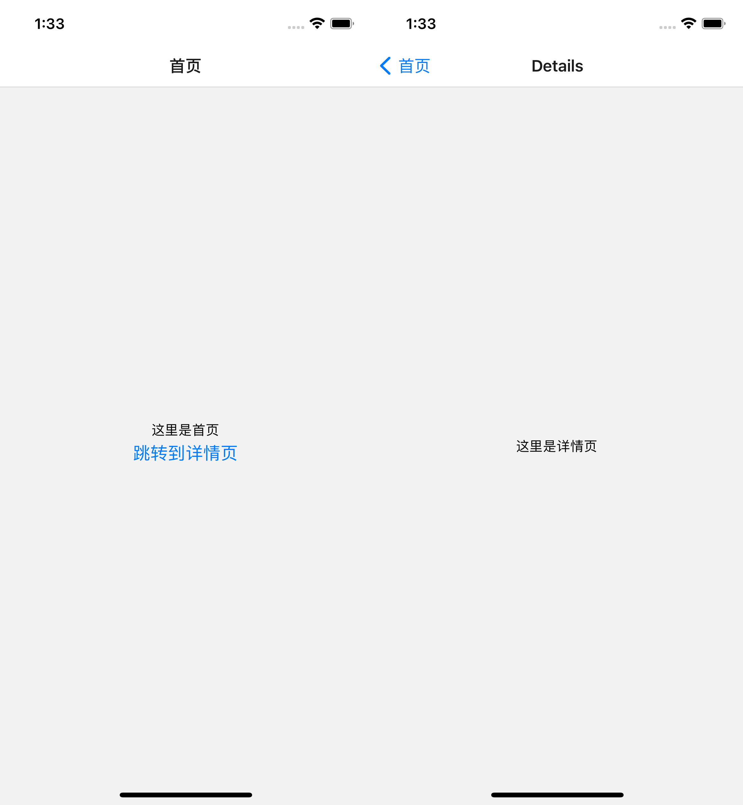

#### `navigation.push` 再次跳转

```javascript
function DetailsScreen({ navigation }) {
  return (
    <View style={{ flex: 1, alignItems: 'center', justifyContent: 'center' }}>
      <Text>这里是详情页</Text>
      <Text style={{ marginTop: 10 }}>已经在Details页面了</Text>
      <Button
        title="使用navigate不能再次跳转了"
        onPress={() => navigation.navigate('Details')}
      />

      <Button
        title="但使用push，可以无限跳转下去..."
        onPress={() => navigation.push('Details')}
      />
    </View>
  );
}
```

#### `navigation.goBack` 返回上一页

```javascript
function DetailsScreen({ navigation }) {
  return (
    <View style={{ flex: 1, alignItems: 'center', justifyContent: 'center' }}>
      <Text>这里是详情页</Text>

      <Button
        title="再次跳转到详情页..."
        onPress={() => navigation.push('Details')}
      />

      <Button title="返回上一页" onPress={() => navigation.goBack()} />
    </View>
  );
}
```

#### `navigation.popToTop` 返回到 Stack 的第一个页面

```javascript
function DetailsScreen({ navigation }) {
  return (
    <View style={{ flex: 1, alignItems: 'center', justifyContent: 'center' }}>
      <Text>这里是详情页</Text>

      <Button
        title="再次跳转到详情页..."
        onPress={() => navigation.push('Details')}
      />

      <Button title="返回上一页" onPress={() => navigation.goBack()} />

      <Button
        title="返回到一个 Stack 的第一个页面"
        onPress={() => navigation.popToTop()}
      />
    </View>
  );
}
```

### 页面间参数的传递

#### 方法列表

| 用法                                                         | 说明                                    |
| :----------------------------------------------------------- | :-------------------------------------- |
| `navigation.navigate('Details', {    id: 12, otherParam: '还可以同时传递其他参数' });` | 传`id`和`otherParam`参数到`Details`页面 |
| `navigation.setParams({ otherParam: '我换成其他的了', })`    | 通过代码，手动设置参数                  |
| `initialParams=\{\{ id: 99 \}\}`                                 | 初始参数，需要配置到`Stack`中           |
| `navigation.navigate({    name: 'Home', params: { post: postText }, merge: true })` | 传递参数到上一个页面                    |

#### 传递参数到下一个页面

```javascript
import * as React from 'react';
import { View, Text, Button } from 'react-native';
import { NavigationContainer } from '@react-navigation/native';
import { createNativeStackNavigator } from '@react-navigation/native-stack';

function HomeScreen({ navigation }) {
  return (
    <View style={{ flex: 1, alignItems: 'center', justifyContent: 'center' }}>
      <Text>这里是首页</Text>

      <Button
        title="跳转到详情页"
        onPress={() => {
          navigation.navigate('Details', {
            id: 12,
            otherParam: '还可以同时传递其他参数',
          });
        }}
      />
    </View>
  );
}

function DetailsScreen({ route, navigation }) {
  const { id, otherParam } = route.params;

  return (
    <View style={{ flex: 1, alignItems: 'center', justifyContent: 'center' }}>
      <Text>这里是详情页</Text>

      <Text>你传过来的id是: {JSON.stringify(id)}</Text>
      <Text>你传过来的otherParam是: {JSON.stringify(otherParam)}</Text>
    </View>
  );
}

const Stack = createNativeStackNavigator();

function App() {
  return (
    <NavigationContainer>
      <Stack.Navigator>
        <Stack.Screen
          name="Home"
          component={HomeScreen}
          options={{ title: '首页' }}
        />
        <Stack.Screen name="Details" component={DetailsScreen} />
      </Stack.Navigator>
    </NavigationContainer>
  );
}

export default App;
```

#### 更新页面参数

```javascript
function DetailsScreen({ route, navigation }) {
  const { id, otherParam } = route.params;

  return (
    <View style={{ flex: 1, alignItems: 'center', justifyContent: 'center' }}>
      <Text>这里是详情页</Text>

      <Text>你传过来的id是: {JSON.stringify(id)}</Text>
      <Text>你传过来的otherParam是: {JSON.stringify(otherParam)}</Text>

      <Button
        title="设置参数"
        onPress={() =>
          navigation.setParams({
            otherParam: '我换成其他的了',
          })
        }
      />
    </View>
  );
}
```

#### 初始参数

```javascript
<Stack.Screen
  name="Details"
  component={DetailsScreen}
  initialParams={{ id: 99 }}
/>
```

#### 传递参数到上一个页面

```javascript
import * as React from 'react';
import { View, Text, Button, TextInput } from 'react-native';
import { NavigationContainer } from '@react-navigation/native';
import { createNativeStackNavigator } from '@react-navigation/native-stack';

function HomeScreen({ navigation, route }) {
  React.useEffect(() => {
    if (route.params?.post) {
      // Post updated, do something with `route.params.post`
      // For example, send the post to the server
    }
  }, [route.params?.post]);

  return (
    <View style={{ flex: 1, alignItems: 'center', justifyContent: 'center' }}>
      <Button
        title="发布一篇文章"
        onPress={() => navigation.navigate('CreatePost')}
      />
      <Text style={{ margin: 10 }}>你发的内容是: {route.params?.post}</Text>
    </View>
  );
}

function CreatePostScreen({ navigation, route }) {
  const [postText, setPostText] = React.useState('');
  return (
    <>
      <TextInput
        multiline
        placeholder="你在想什么？快点写！"
        style={{ height: 200, padding: 10, backgroundColor: 'white' }}
        value={postText}
        onChangeText={setPostText}
      />
      <Button
        title="完成"
        onPress={() => {
          // Pass and merge params back to home screen
          navigation.navigate({
            name: 'Home',
            params: { post: postText },
            merge: true,
          });
        }}
      />
    </>
  );
}

const Stack = createNativeStackNavigator();

function App() {
  return (
    <NavigationContainer>
      <Stack.Navigator>
        <Stack.Screen name="Home" component={HomeScreen} />
        <Stack.Screen name="CreatePost" component={CreatePostScreen} />
      </Stack.Navigator>
    </NavigationContainer>
  );
}

export default App;
```

运行结果

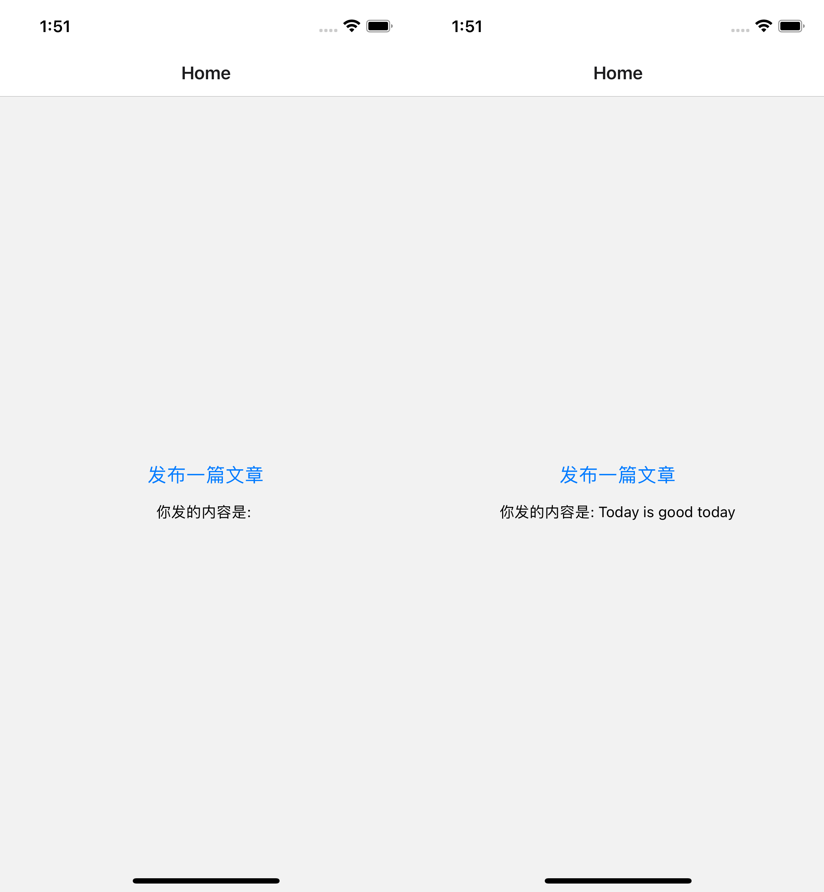

### 配置顶部 Header Bar

#### 方法列表

| 用法                                                       | 说明                                               |
| :--------------------------------------------------------- | :------------------------------------------------- |
| `options={({ route }) => ({ title: route.params.title })}` | 在`stack`中配置，会取得上一页传递过来的`title`参数 |
| `navigation.setOptions({ title: '标题更新了!' })}`         | 通过代码，手动设置`title`                          |

#### 使用路由参数来配置 Header Bar

```javascript
import * as React from 'react';
import { View, Text, Button } from 'react-native';
import { NavigationContainer } from '@react-navigation/native';
import { createNativeStackNavigator } from '@react-navigation/native-stack';

function HomeScreen({ navigation }) {
  return (
    <View style={{ flex: 1, alignItems: 'center', justifyContent: 'center' }}>
      <Text>这里是首页</Text>
      <Button
        title="跳转到详情页"
        onPress={() =>
          navigation.navigate('Details', { title: '我自定义的标题' })
        }
      />
    </View>
  );
}

function DetailsScreen({ navigation }) {
  return (
    <View style={{ flex: 1, alignItems: 'center', justifyContent: 'center' }}>
      <Text>这里是详情页</Text>
      <Button title="返回上一页" onPress={() => navigation.goBack()} />
    </View>
  );
}

const Stack = createNativeStackNavigator();

function App() {
  return (
    <NavigationContainer>
      <Stack.Navigator>
        <Stack.Screen
          name="Home"
          component={HomeScreen}
          options={{ title: '首页' }}
        />
        <Stack.Screen
          name="Details"
          component={DetailsScreen}
          options={({ route }) => ({ title: route.params.title })}
        />
      </Stack.Navigator>
    </NavigationContainer>
  );
}

export default App;
```

#### 使用 js 代码动态变更标题

```javascript
function HomeScreen({ navigation }) {
  return (
    <View style={{ flex: 1, alignItems: 'center', justifyContent: 'center' }}>
      <Text>这里是首页</Text>
      <Button
        title="跳转到详情页"
        onPress={() =>
          navigation.navigate('Details', { title: '我自定义的标题' })
        }
      />

      <Button
        title="修改标题"
        onPress={() => navigation.setOptions({ title: '标题更新了!' })}
      />
    </View>
  );
}
```

#### Header Bar 样式修改

```javascript
function App() {
  return (
    <NavigationContainer>
      <Stack.Navigator>
        <Stack.Screen
          name="Home"
          component={HomeScreen}
          options={{
            title: '首页',
            headerStyle: {
              backgroundColor: '#f4511e',
            },
            headerTintColor: '#fff',
          }}
        />
        <Stack.Screen
          name="Details"
          component={DetailsScreen}
          options={({ route }) => ({ title: route.params.title })}
        />
      </Stack.Navigator>
    </NavigationContainer>
  );
}
```

#### 多个页面共享的 Header Bar 样式

```javascript
function App() {
  return (
    <NavigationContainer>
      <Stack.Navigator
        screenOptions={{
          headerStyle: {
            backgroundColor: '#f4511e',
          },
          headerTintColor: '#fff',
          headerTitleStyle: {
            fontWeight: 'bold',
          },
        }}>
        <Stack.Screen
          name="Home"
          component={HomeScreen}
          options={{ title: '首页' }}
        />
        <Stack.Screen
          name="Details"
          component={DetailsScreen}
          options={({ route }) => ({ title: route.params.title })}
        />
      </Stack.Navigator>
    </NavigationContainer>
  );
}
```

#### 使用自定义组件，设置 Header Bar

```javascript
import * as React from 'react';
import { View, Text, Button, Image } from 'react-native';
import { NavigationContainer } from '@react-navigation/native';
import { createNativeStackNavigator } from '@react-navigation/native-stack';

function HomeScreen({ navigation }) {
  return (
    <View style={{ flex: 1, alignItems: 'center', justifyContent: 'center' }}>
      <Text>这里是首页</Text>
    </View>
  );
}

function LogoTitle() {
  return (
    <Image
      style={{ width: 150, height: 38 }}
      source={{ uri: 'https://images.clwy.cn/common/logo.png' }}
    />
  );
}

const Stack = createNativeStackNavigator();

function App() {
  return (
    <NavigationContainer>
      <Stack.Navigator>
        <Stack.Screen
          name="Home"
          component={HomeScreen}
          options={{ headerTitle: props => <LogoTitle {...props} /> }}
        />
      </Stack.Navigator>
    </NavigationContainer>
  );
}

export default App;
```

### 配置顶部按钮 Header Buttons

#### 顶部按钮

```javascript
import * as React from 'react';
import { View, Text, Button, Image } from 'react-native';
import { NavigationContainer } from '@react-navigation/native';
import { createNativeStackNavigator } from '@react-navigation/native-stack';

function HomeScreen({ navigation }) {
  return (
    <View style={{ flex: 1, alignItems: 'center', justifyContent: 'center' }}>
      <Text>这里是首页</Text>
    </View>
  );
}

function LogoTitle() {
  return (
    <Image
      style={{ width: 150, height: 38 }}
      source={{ uri: 'https://images.clwy.cn/common/logo.png' }}
    />
  );
}

const Stack = createNativeStackNavigator();

function App() {
  return (
    <NavigationContainer>
      <Stack.Navigator>
        <Stack.Screen
          name="Home"
          component={HomeScreen}
          options={{
            headerTitle: props => <LogoTitle {...props} />,
            headerRight: () => (
              <Button
                onPress={() => alert('This is a button!')}
                title="新闻"
                color="#1f99b0"
              />
            ),
          }}
        />
      </Stack.Navigator>
    </NavigationContainer>
  );
}

export default App;
```


[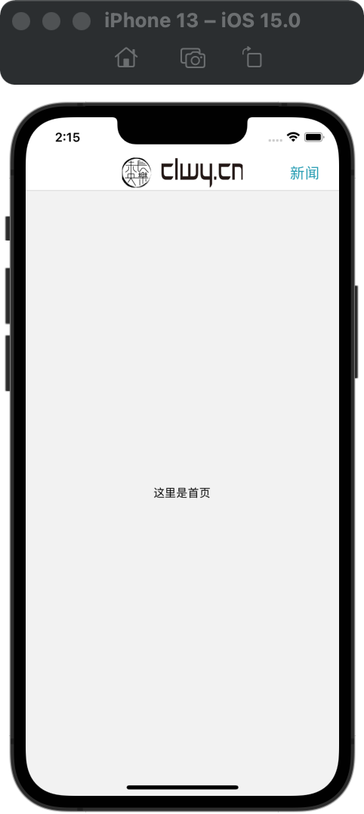](https://images.clwy.cn/user/1/attachment/2021/9d2b3ce7-094e-4c87-9304-29bf9315d354.png)


#### 顶部按钮与页面内容进行交互

```javascript
import * as React from 'react';
import { Text, Button, Image } from 'react-native';
import { NavigationContainer } from '@react-navigation/native';
import { createNativeStackNavigator } from '@react-navigation/native-stack';

function HomeScreen({ navigation }) {
  const [count, setCount] = React.useState(0);

  React.useLayoutEffect(() => {
    navigation.setOptions({
      headerRight: () => (
        <Button onPress={() => setCount(c => c + 1)} title="增加计数" />
      ),
    });
  }, [navigation]);

  return <Text style={{ fontSize: 24 }}>计数: {count}</Text>;
}

function LogoTitle() {
  return (
    <Image
      style={{ width: 150, height: 38 }}
      source={{ uri: 'https://images.clwy.cn/common/logo.png' }}
    />
  );
}

const Stack = createNativeStackNavigator();

function App() {
  return (
    <NavigationContainer>
      <Stack.Navigator>
        <Stack.Screen
          name="Home"
          component={HomeScreen}
          options={({ navigation, route }) => ({
            headerTitle: props => <LogoTitle {...props} />,
          })}
        />
      </Stack.Navigator>
    </NavigationContainer>
  );
}

export default App;
```


[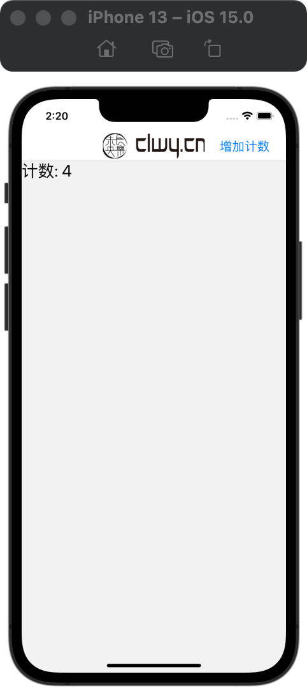](https://images.clwy.cn/user/1/attachment/2021/c90c6f81-0c32-4dc2-a5fe-e7e7a5238d19.png)


> 提示：既然有`headerRight`，当然也有`headerLeft`，用于配置左边的按钮

## 底部 Tab 栏

### 安装

```bash
yarn add @react-navigation/bottom-tabs
```

### 基础的 Tab

```javascript
import * as React from 'react';
import { Text, View } from 'react-native';
import { NavigationContainer } from '@react-navigation/native';
import { createBottomTabNavigator } from '@react-navigation/bottom-tabs';

function HomeScreen() {
  return (
    <View style={{ flex: 1, justifyContent: 'center', alignItems: 'center' }}>
      <Text>这里是首页</Text>
    </View>
  );
}

function SettingsScreen() {
  return (
    <View style={{ flex: 1, justifyContent: 'center', alignItems: 'center' }}>
      <Text>这里是设置页</Text>
    </View>
  );
}

const Tab = createBottomTabNavigator();

export default function App() {
  return (
    <NavigationContainer>
      <Tab.Navigator>
        <Tab.Screen name="Home" component={HomeScreen} />
        <Tab.Screen name="Settings" component={SettingsScreen} />
      </Tab.Navigator>
    </NavigationContainer>
  );
}
```

运行结果

[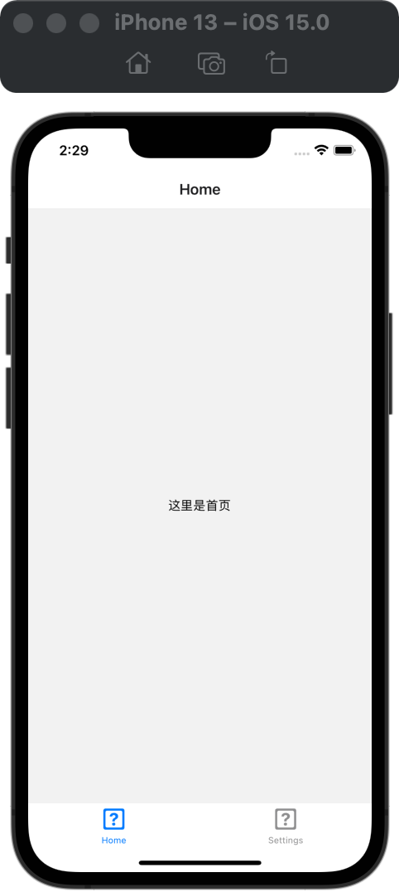](https://images.clwy.cn/user/1/attachment/2021/c4783a34-c758-4fa5-a66a-8eee0a460e56.png)

### 自定义 Tab 样式，设置图标

使用前，需要先配置好 [react-native-vector-icons](https://clwy.cn/guide/pages/clwy-react-native-v1-vector-icons) 图标库

```javascript
import * as React from 'react';
import { Text, View } from 'react-native';
import Ionicons from 'react-native-vector-icons/Ionicons';
import { createBottomTabNavigator } from '@react-navigation/bottom-tabs';
import { NavigationContainer } from '@react-navigation/native';

function HomeScreen() {
  return (
    <View style={{ flex: 1, justifyContent: 'center', alignItems: 'center' }}>
      <Text>这里是首页!</Text>
    </View>
  );
}

function SettingsScreen() {
  return (
    <View style={{ flex: 1, justifyContent: 'center', alignItems: 'center' }}>
      <Text>这里是设置页!</Text>
    </View>
  );
}

const Tab = createBottomTabNavigator();

export default function App() {
  return (
    <NavigationContainer>
      <Tab.Navigator
        	screenOptions={({ route }) => ({
          	tabBarIcon: ({ focused, color, size }) => {
              let iconName;

              if (route.name === 'Home') {
                iconName = focused ? 'home' : 'home-outline';
              } else if (route.name === 'Settings') {
                iconName = focused ? 'settings' : 'settings-outline';
              }

              return <Ionicons name={iconName} size={size} color={color} />;
            },
            tabBarActiveTintColor: '#1f99b0',
            tabBarInactiveTintColor: 'gray',
        })}>
        <Tab.Screen name="Home" component={HomeScreen} />
        <Tab.Screen name="Settings" component={SettingsScreen} />
      </Tab.Navigator>
    </NavigationContainer>
  );
}
```

- `route.name` 为当前路由名称
- `focused` 表示当前页面是否是激活状态

运行结果

[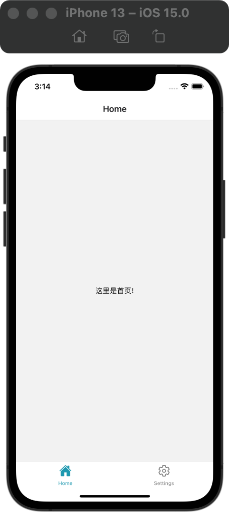](https://images.clwy.cn/user/1/attachment/2021/0e02d913-8b60-41e4-8336-52b137af2a6b.png)

### 小徽章

```javascript
<Tab.Screen
  name="Home"
  component={HomeScreen}
  options={{
    tabBarBadge: 4,
    tabBarBadgeStyle: {
      color: '#fff',
      backgroundColor: '#67c1b5',
    },
  }}
/>
```

运行结果

[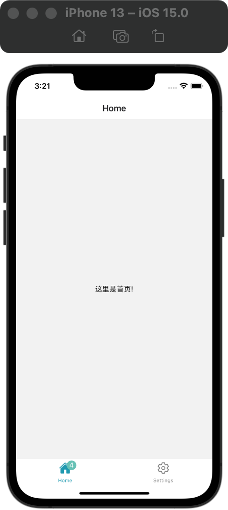](https://images.clwy.cn/user/1/attachment/2021/2dd9bf6c-8216-43a5-97cb-e41a94c476f7.png)

### Tabs 间的跳转

```javascript
import { Text, View, Button } from 'react-native';


function HomeScreen({ navigation }) {
  return (
    <View style={{ flex: 1, justifyContent: 'center', alignItems: 'center' }}>
      <Text>这里是首页!</Text>

      <Button
        title="跳转到设置页"
        onPress={() => navigation.navigate('Settings')}
      />
    </View>
  );
}

function SettingsScreen({ navigation }) {
  return (
    <View style={{ flex: 1, justifyContent: 'center', alignItems: 'center' }}>
      <Text>这里是设置页!</Text>

      <Button title="跳转到首页" onPress={() => navigation.navigate('Home')} />
    </View>
  );
}
```

运行结果

[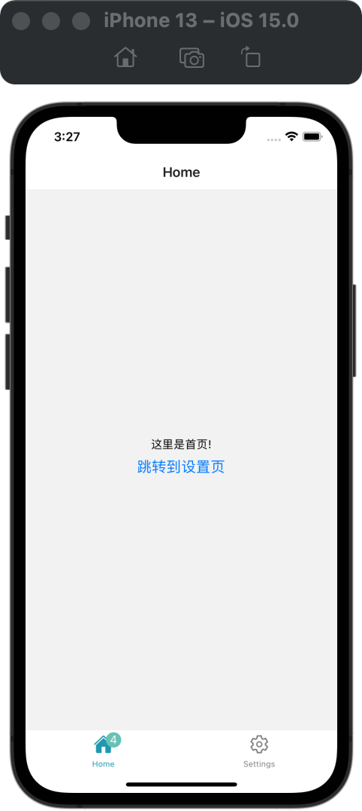](https://images.clwy.cn/user/1/attachment/2021/367da413-4fe2-4ad0-a21b-68acd6660a0c.png)

[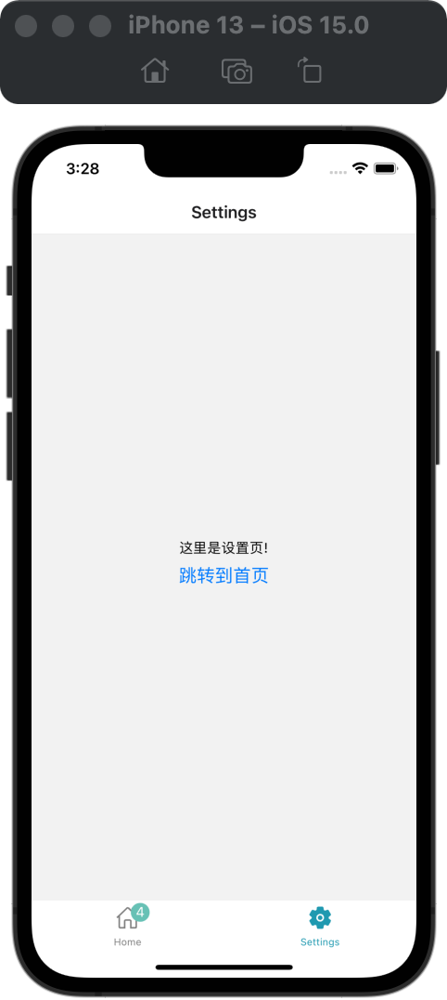](https://images.clwy.cn/user/1/attachment/2021/f66a1c96-a2fe-4af7-8045-7290b1475662.png)

### 每个 Tab 里，都有多个页面

```javascript
import * as React from 'react';
import { Text, View, Button } from 'react-native';
import Ionicons from 'react-native-vector-icons/Ionicons';
import { createNativeStackNavigator } from '@react-navigation/native-stack';
import { createBottomTabNavigator } from '@react-navigation/bottom-tabs';
import { NavigationContainer } from '@react-navigation/native';

function DetailsScreen() {
  return (
    <View style={{ flex: 1, justifyContent: 'center', alignItems: 'center' }}>
      <Text>这里是详情页!</Text>
    </View>
  );
}

function HomeScreen({ navigation }) {
  return (
    <View style={{ flex: 1, justifyContent: 'center', alignItems: 'center' }}>
      <Text>这里是首页!</Text>

      <Button
        title="跳转到详情页"
        onPress={() => navigation.navigate('Details')}
      />
    </View>
  );
}

function SettingsScreen({ navigation }) {
  return (
    <View style={{ flex: 1, justifyContent: 'center', alignItems: 'center' }}>
      <Text>这里是设置页!</Text>

      <Button
        title="跳转到详情页"
        onPress={() => navigation.navigate('Details')}
      />
    </View>
  );
}

const HomeStack = createNativeStackNavigator();

function HomeStackScreen() {
  return (
    <HomeStack.Navigator>
      <HomeStack.Screen name="Home" component={HomeScreen} />
      <HomeStack.Screen name="Details" component={DetailsScreen} />
    </HomeStack.Navigator>
  );
}

const SettingsStack = createNativeStackNavigator();

function SettingsStackScreen() {
  return (
    <SettingsStack.Navigator>
      <SettingsStack.Screen name="Settings" component={SettingsScreen} />
      <SettingsStack.Screen name="Details" component={DetailsScreen} />
    </SettingsStack.Navigator>
  );
}

const Tab = createBottomTabNavigator();

export default function App() {
  return (
    <NavigationContainer>
      <Tab.Navigator
        	screenOptions={({ route }) => ({
          headerShown: false,
          tabBarIcon: ({ focused, color, size }) => {
            let iconName;

            if (route.name === 'HomeStack') {
              iconName = focused ? 'home' : 'home-outline';
            } else if (route.name === 'SettingsStack') {
              iconName = focused ? 'settings' : 'settings-outline';
            }

            return <Ionicons name={iconName} size={size} color={color} />;
          },
          tabBarActiveTintColor: '#1f99b0',
          tabBarInactiveTintColor: 'gray',
        })}>
        <Tab.Screen
          name="HomeStack"
          component={HomeStackScreen}
          options={{
            tabBarBadge: 4,
            tabBarBadgeStyle: {
              color: '#fff',
              backgroundColor: '#67c1b5',
            },
          }}
        />
        <Tab.Screen name="SettingsStack" component={SettingsStackScreen} />
      </Tab.Navigator>
    </NavigationContainer>
  );
}
```

嵌套层级为：

- Tab.Navigator
  - HomeStackScreen
    - HomeScreen
    - DetailsScreen
  - SettingsStackScreen
    - SettingsScreen
    - DetailsScreen
- `headerShown: false` 可以隐藏`Stack`的顶部栏，这里如果不隐藏，就会出现双层顶部


[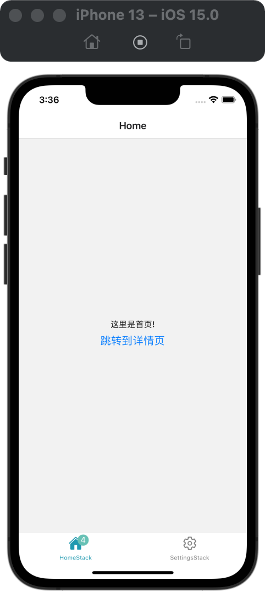](https://images.clwy.cn/user/1/attachment/2021/b0590a9a-c6dc-4d74-841b-336ca4f0bcc8.png)


## 全屏模态框 Modal

### 实现代码

```javascript
import * as React from 'react';
import { View, Text, Button } from 'react-native';
import { NavigationContainer } from '@react-navigation/native';
import { createNativeStackNavigator } from '@react-navigation/native-stack';

function HomeScreen({ navigation }) {
  return (
    <View style={{ flex: 1, alignItems: 'center', justifyContent: 'center' }}>
      <Text style={{ fontSize: 30 }}>这里是首页</Text>

      <Button
        title="跳转到详情页"
        onPress={() => navigation.navigate('Details')}
      />

      <Button
        onPress={() => navigation.navigate('MyModal')}
        title="打开 Modal"
      />
    </View>
  );
}

function ModalScreen({ navigation }) {
  return (
    <View style={{ flex: 1, alignItems: 'center', justifyContent: 'center' }}>
      <Text style={{ fontSize: 30 }}>这里是 modal!</Text>
      <Button onPress={() => navigation.goBack()} title="关闭" />
    </View>
  );
}

function DetailsScreen() {
  return (
    <View style={{ flex: 1, justifyContent: 'center', alignItems: 'center' }}>
      <Text>这里是详情页</Text>
    </View>
  );
}

const RootStack = createNativeStackNavigator();

function App() {
  return (
    <NavigationContainer>
      <RootStack.Navigator>
        <RootStack.Group>
          <RootStack.Screen name="Home" component={HomeScreen} />
          <RootStack.Screen name="Details" component={DetailsScreen} />
        </RootStack.Group>

        <RootStack.Group screenOptions={{ presentation: 'modal' }}>
          <RootStack.Screen name="MyModal" component={ModalScreen} />
        </RootStack.Group>
      </RootStack.Navigator>
    </NavigationContainer>
  );
}

export default App;
```

嵌套层级为：

- RootStack.Navigator
  - RootStack.Group（正常 Stack 形式）
    - HomeScreen
    - DetailsScreen
  - RootStack.Group（Modal 形式）
    - ModalScreen


[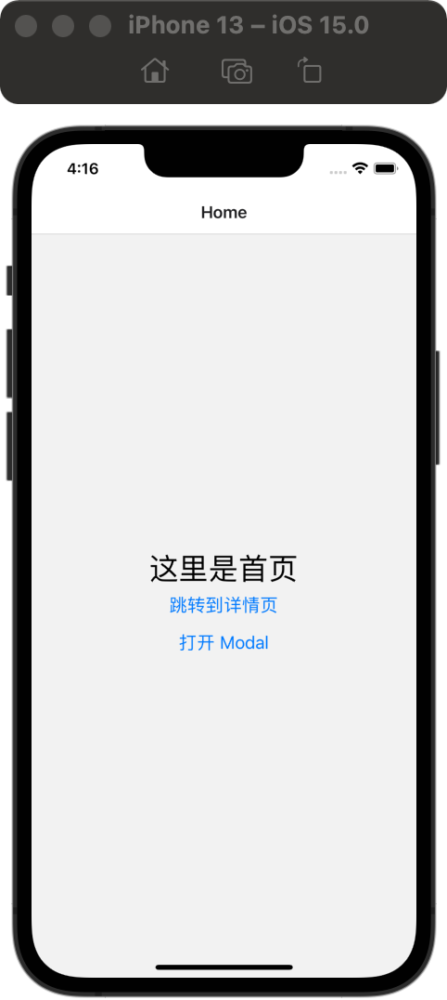](https://images.clwy.cn/user/1/attachment/2021/a55d5974-e7c7-4fa8-b9fc-dee1ec712f34.png)

[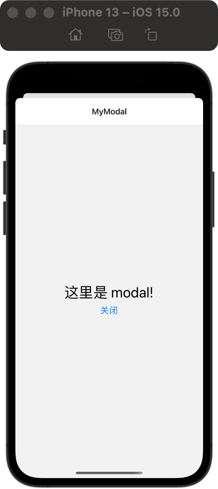](https://images.clwy.cn/user/1/attachment/2021/cc2c61cc-846e-4c1c-8ec8-5f3feb313856.png)

[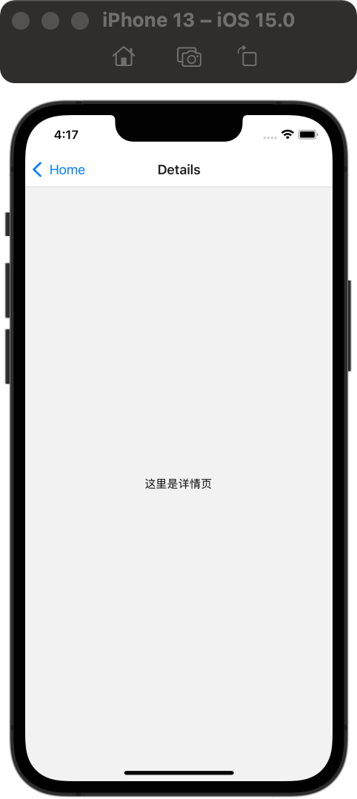](https://images.clwy.cn/user/1/attachment/2021/8f9e6d3c-47ca-4d68-a467-20daba3f7781.png)

## 抽屉 Drawer

### 安装

```bash
yarn add @react-navigation/drawer react-native-gesture-handler react-native-reanimated
```

在`index.js`最顶部

```javascript
import 'react-native-gesture-handler';
```

**iOS**下

```bash
cd ios && pod install && cd ..
```

### 使用

```javascript
import * as React from 'react';
import { View, Text } from 'react-native';
import { NavigationContainer } from '@react-navigation/native';
import { createDrawerNavigator } from '@react-navigation/drawer';

function Home() {
  return (
    <View style={{ flex: 1, justifyContent: 'center', alignItems: 'center' }}>
      <Text>这里是首页</Text>
    </View>
  );
}

function Article() {
  return (
    <View style={{ flex: 1, justifyContent: 'center', alignItems: 'center' }}>
      <Text>这里是文章页</Text>
    </View>
  );
}

const Drawer = createDrawerNavigator();

function MyDrawer() {
  return (
    <Drawer.Navigator>
      <Drawer.Screen name="首页" component={Home} />
      <Drawer.Screen name="文章" component={Article} />
    </Drawer.Navigator>
  );
}

export default function App() {
  return (
    <NavigationContainer>
      <MyDrawer />
    </NavigationContainer>
  );
}
```


[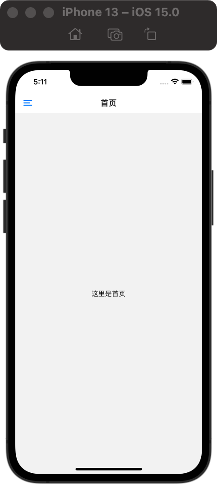](https://images.clwy.cn/user/1/attachment/2021/2b977b73-dd8e-4c66-8244-11eb987f1503.png)


[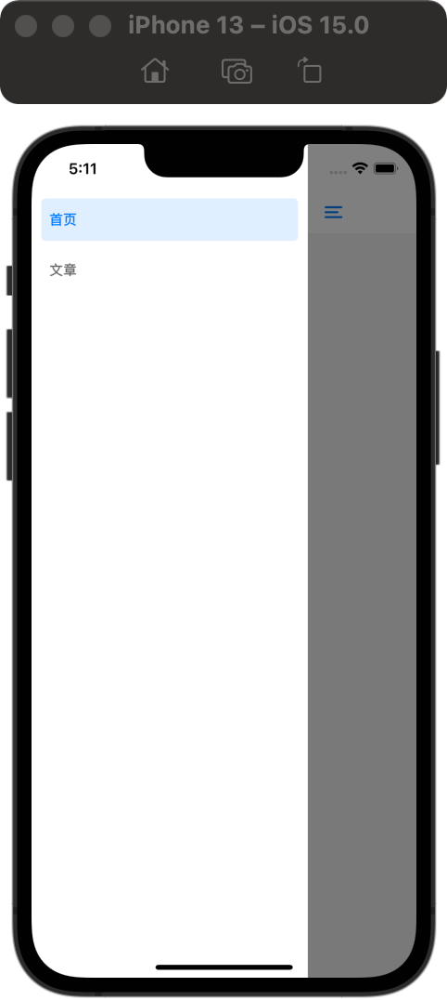](https://images.clwy.cn/user/1/attachment/2021/1ff3c638-2d4a-43f6-ac7a-df69cf762ffb.png)

## 深层嵌套 Stack 的跳转、传参

### 案例

嵌套层级为：

- Tab.Navigator
  - HomeStackScreen
    - HomeScreen
    - ArticlesScreen
  - SettingsStackScreen
    - SettingsScreen
    - DetailsScreen

```javascript
import * as React from 'react';
import { Text, View, Button } from 'react-native';
import { createNativeStackNavigator } from '@react-navigation/native-stack';
import { createBottomTabNavigator } from '@react-navigation/bottom-tabs';
import { NavigationContainer } from '@react-navigation/native';

function HomeScreen({ navigation }) {
  return (
    <View style={{ flex: 1, justifyContent: 'center', alignItems: 'center' }}>
      <Text>这里是首页!</Text>

      <Button
        title="跳转到文章页"
        onPress={() => navigation.navigate('Articles')}
      />

      <Button
        title="跳转到SettingsStack的详情页"
        onPress={() =>
          navigation.navigate('SettingsStack', { screen: 'Details' })
        }
      />
    </View>
  );
}

function ArticlesScreen() {
  return (
    <View style={{ flex: 1, justifyContent: 'center', alignItems: 'center' }}>
      <Text>这里是文章页!</Text>
    </View>
  );
}

function SettingsScreen({ navigation }) {
  return (
    <View style={{ flex: 1, justifyContent: 'center', alignItems: 'center' }}>
      <Text>这里是设置页!</Text>

      <Button
        title="跳转到详情页"
        onPress={() => navigation.navigate('Details')}
      />

      <Button
        title="跳转到HomeStack的文章页"
        onPress={() => navigation.navigate('HomeStack', { screen: 'Articles' })}
      />
    </View>
  );
}

function DetailsScreen() {
  return (
    <View style={{ flex: 1, justifyContent: 'center', alignItems: 'center' }}>
      <Text>这里是详情页!</Text>
    </View>
  );
}

const HomeStack = createNativeStackNavigator();

function HomeStackScreen() {
  return (
    <HomeStack.Navigator>
      <HomeStack.Screen name="Home" component={HomeScreen} />
      <HomeStack.Screen name="Articles" component={ArticlesScreen} />
    </HomeStack.Navigator>
  );
}

const SettingsStack = createNativeStackNavigator();

function SettingsStackScreen() {
  return (
    <SettingsStack.Navigator>
      <SettingsStack.Screen name="Settings" component={SettingsScreen} />
      <SettingsStack.Screen name="Details" component={DetailsScreen} />
    </SettingsStack.Navigator>
  );
}

const Tab = createBottomTabNavigator();

export default function App() {
  return (
    <NavigationContainer>
      <Tab.Navigator
        screenOptions={({ route }) => ({
          headerShown: false,
        })}>
        <Tab.Screen name="HomeStack" component={HomeStackScreen} />
        <Tab.Screen name="SettingsStack" component={SettingsStackScreen} />
      </Tab.Navigator>
    </NavigationContainer>
  );
}
```

运行结果

[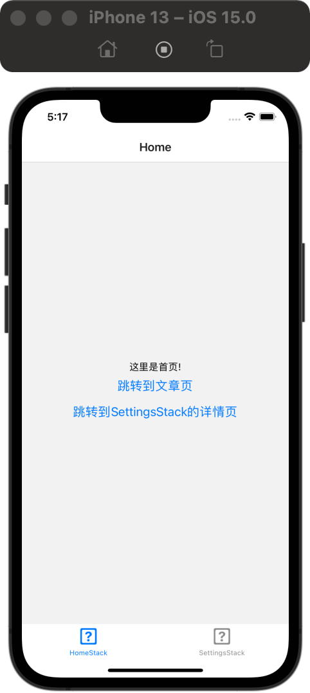](https://images.clwy.cn/user/1/attachment/2021/40d44ceb-b55f-4a7d-95f4-5b2dcbe6f3bb.png)

### 传递参数

```javascript
navigation.navigate('HomeStack', {
  screen: 'Article',
  params: { title: '长乐未央' },
});
```

## 正式项目开发

### 基础准备

#### 项目搭建

##### 新建项目

```bash
npx react-native init app
```

##### 安装依赖

包括以下内容：

- `react navigation`基础模块
- `stack`
- `bottom-tabs`
- 刘海屏安全区域
- 对手势的支持
- 图标库
- storage 存储

```bash
cd app

yarn add @react-navigation/native react-native-screens react-native-safe-area-context @react-navigation/native-stack @react-navigation/bottom-tabs react-native-vector-icons @react-native-async-storage/async-storage
```

##### 修改index.js

```javascript
import { AppRegistry } from 'react-native';
import App from './App';
import { name as appName } from './app.json';

// 图标库
import SimpleLineIcons from 'react-native-vector-icons/SimpleLineIcons';
import Ionicons from 'react-native-vector-icons/Ionicons';
import EvilIcons from 'react-native-vector-icons/EvilIcons';
import MaterialIcons from 'react-native-vector-icons/MaterialIcons';

AppRegistry.registerComponent(appName, () => App);

SimpleLineIcons.loadFont();
Ionicons.loadFont();
EvilIcons.loadFont();
MaterialIcons.loadFont();
```

##### ios配置

1. 修改`/ios/Podfile`

增加一下内容到最底部，用于配置图标库

```
pod 'RNVectorIcons', :path => '../node_modules/react-native-vector-icons'
```

2. 安装原生包

```bash
cd ios && pod update && pod install && cd ..
# npx pod-install ios
```

##### android配置

1. 编辑`android/app/src/main/java/你的包名/MainActivity.java`

增加到`MainActivity Class` 内部

```java
@Override
protected void onCreate(Bundle savedInstanceState) {
  super.onCreate(null);
}
```

并在顶部引用

```java
import android.os.Bundle;
```

2. 修改 `android/app/build.gradle`

增加以下内容到最底部

```
apply from: "../../node_modules/react-native-vector-icons/fonts.gradle"
```

##### 运行

修改App.js

```javascript
import * as React from 'react';
import { View, Text } from 'react-native';
import { NavigationContainer } from '@react-navigation/native';
import { createNativeStackNavigator } from '@react-navigation/native-stack';
import Ionicons from 'react-native-vector-icons/Ionicons';

function HomeScreen() {
  return (
    <View style={{ flex: 1, alignItems: 'center', justifyContent: 'center' }}>
      <Ionicons name="heart-outline" size={30} color="red" />
      <Text>你好世界</Text>
    </View>
  );
}

const Stack = createNativeStackNavigator();

function App() {
  return (
    <NavigationContainer>
      <Stack.Navigator>
        <Stack.Screen
          name="Home"
          component={HomeScreen}
          options={{ title: '首页' }}
        />
      </Stack.Navigator>
    </NavigationContainer>
  );
}

export default App;
```

运行结果

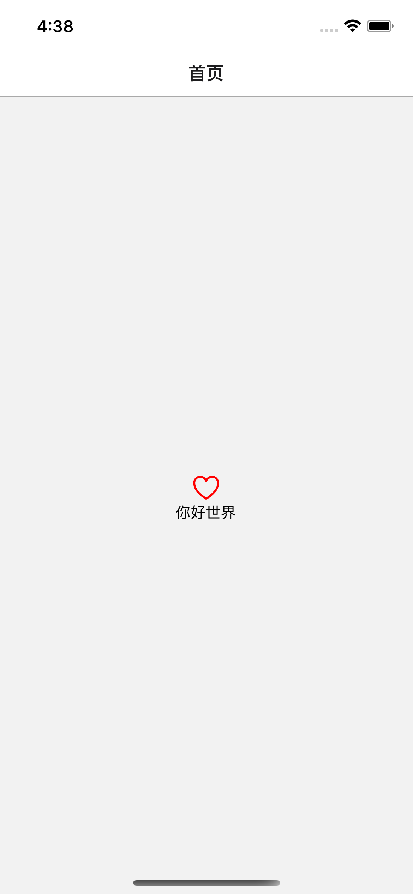


#### 项目结构

在项目根目录下，新建如下文件夹结构

- src
  - components（存放自定义组件）
    - discover（发现 stack 相关组件)
    - setting（设置 stack 相关组件)
    - shared（共享的组件)
    - user（用户 stack 相关组件)
    - video（视频 stack 相关组件)
  - constants（自定义的一些参数、例如接口地址、颜色的配置）
  - hooks（自定义 hooks，例如用于接口请求）
  - navigation（所有的导航器）
    - options（导航器相关的配置）
    - stacks（各个页面组成的 stack 配置）
  - reducers（登录相关的 reducer）
  - screens（各个页面）
    - discover（发现 stack 所有页面）
    - information（新闻 stack 所有页面）
    - search（搜索 stack 所有页面）
    - setting（设置 stack 所有页面）
    - teacher（教师 stack 所有页面）
    - user（用户 stack 所有页面）
    - video（视频 stack 所有页面）
  - utils（自定义工具，例如对 fetch 的封装）

#### 自定义接口、颜色值配置

##### 后端接口地址

新建`src/constants/Api.js`文件

```javascript
const dev = false;
const Api = dev ? 'http://127.0.0.1:3000' : 'https://clwy.cn';

export default Api;
```

根据运行模式，选择对应的接口地址。

##### 常用颜色

新建`src/constants/Colors.js`文件

```javascript
export default {
  primary: '#1f99b0',
  premium: '#1f99b0',
  free: '#d3d7e0',
  moderator: '#56b1e0',
  maintainer: '#ff7f6f',
  admin: '#eac62a',
  yellow: '#eac62a',
  white: '#fff',
  black: '#404044',
  navbarBottom: '#a7a7aa',
  tabBarInactiveText: '#999',
  tabBarActiveText: '#404044',
  date: '#787C7D',
  headerTitle: '#2A2929',
  headerButton: '#7A7D7E',
};
```

#### 新建所有 Screen 页面

##### Screen 页面示例图

发现discover相关的 Screen

- 新增src/screens/discover/HomeScreen.js

新闻information相关的 Screen

- 新增src/screens/information/HomeScreen.js

- 新增src/screens/information/ArticlesScreen.js

搜索search相关的 Screen

- 新增src/screens/search/HomeScreen.js

- 新增src/screens/search/ResultsScreen.js

设置setting相关的 Screen

- 新增src/screens/setting/HomeScreen.js

- 新增src/screens/setting/DetailsScreen.js

教师teacher相关的 Screen

- 新增src/screens/teacher/HomeScreen.js

用户user相关的 Screen

- 新增src/screens/user/HomeScreen.js

视频video相关的 Screen

- 新增src/screens/video/HomeScreen.js

- 新增src/screens/video/CoursesScreen.js

- 新增src/screens/video/ChaptersScreen.js

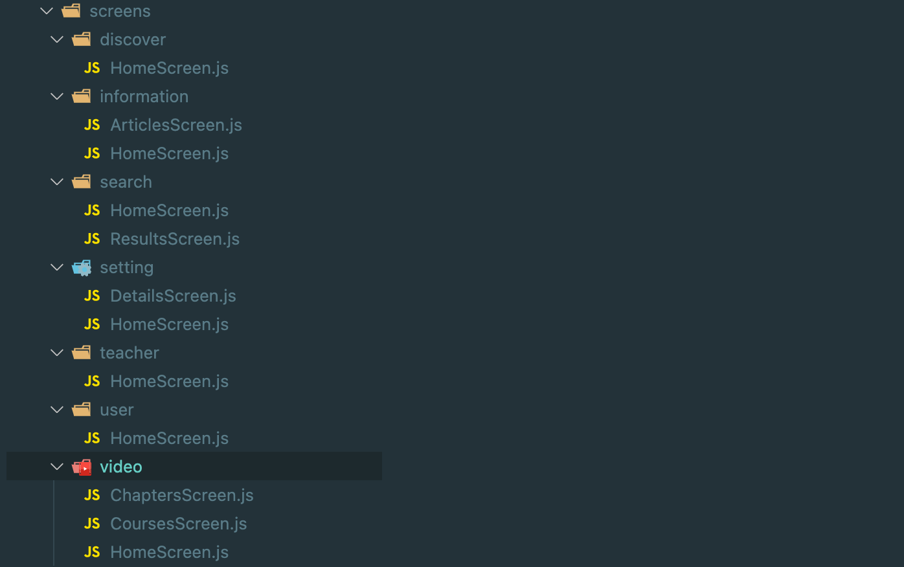

##### 发现`discover`相关的 Screen

###### 新增`src/screens/discover/HomeScreen.js`

```javascript
import * as React from 'react';
import { Button, Text, View } from 'react-native';

const HomeScreen = ({ navigation }) => {
  return (
    <View style={{ flex: 1, alignItems: 'center', justifyContent: 'center' }}>
      <Text style={{ fontSize: 24 }}>发现的首页</Text>

      <Button title="跳转到视频课程页" onPress={() => navigation.navigate('Courses')} />
    </View>
  );
};

export default HomeScreen;
```

##### 新闻`information`相关的 Screen

###### 新增`src/screens/information/HomeScreen.js`

```javascript
import * as React from 'react';
import { Text, View, Button } from 'react-native';

const HomeScreen = ({ navigation }) => {
  return (
    <View style={{ flex: 1, alignItems: 'center', justifyContent: 'center' }}>
      <Text style={{ fontSize: 24 }}>新闻的首页</Text>

      <Button title="跳转到新闻内页" onPress={() => navigation.navigate('Articles')} />
    </View>
  );
};

export default HomeScreen;
```

###### 新增`src/screens/information/ArticlesScreen.js`

```javascript
import * as React from 'react';
import { View, Text } from 'react-native';

const ArticlesScreen = () => {
  return (
    <View style={{ flex: 1, alignItems: 'center', justifyContent: 'center' }}>
      <Text style={{ fontSize: 24 }}>新闻的内页</Text>
    </View>
  );
};

export default ArticlesScreen;
```

##### 搜索`search`相关的 Screen

###### 新增`src/screens/search/HomeScreen.js`

```javascript
import * as React from 'react';
import { Text, View, Button } from 'react-native';

const HomeScreen = ({ navigation }) => {
  return (
    <View style={{ flex: 1, alignItems: 'center', justifyContent: 'center' }}>
      <Text style={{ fontSize: 24 }}>搜索的首页</Text>

      <Button title="跳转到搜索结果页" onPress={() => navigation.navigate('Results')} />
    </View>
  );
};

export default HomeScreen;
```

###### 新增`src/screens/search/ResultsScreen.js`

```javascript
import * as React from 'react';
import { View, Text } from 'react-native';

const ResultsScreen = () => {
  return (
    <View style={{ flex: 1, alignItems: 'center', justifyContent: 'center' }}>
      <Text style={{ fontSize: 24 }}>搜索结果页</Text>
    </View>
  );
};

export default ResultsScreen;
```

##### 设置`setting`相关的 Screen

###### 新增`src/screens/setting/HomeScreen.js`

```javascript
import * as React from 'react';
import { Text, View, Button } from 'react-native';

const HomeScreen = ({ navigation }) => {
  return (
    <View style={{ flex: 1, alignItems: 'center', justifyContent: 'center' }}>
      <Text style={{ fontSize: 24 }}>设置的首页</Text>

      <Button title="跳转到设置详情页" onPress={() => navigation.navigate('Details')} />
    </View>
  );
};

export default HomeScreen;
```

###### 新增`src/screens/setting/DetailsScreen.js`

```javascript
import * as React from 'react';
import { View, Text } from 'react-native';

const DetailsScreen = () => {
  return (
    <View style={{ flex: 1, alignItems: 'center', justifyContent: 'center' }}>
      <Text style={{ fontSize: 24 }}>设置详情页</Text>
    </View>
  );
};

export default DetailsScreen;
```

##### 教师`teacher`相关的 Screen

###### 新增`src/screens/teacher/HomeScreen.js`

```javascript
import * as React from 'react';
import { Text, View } from 'react-native';

const HomeScreen = () => {
  return (
    <View style={{ flex: 1, alignItems: 'center', justifyContent: 'center' }}>
      <Text style={{ fontSize: 24 }}>教师的首页</Text>
    </View>
  );
};

export default HomeScreen;
```

##### 用户`user`相关的 Screen

###### 新增`src/screens/user/HomeScreen.js`

```javascript
import * as React from 'react';
import { Text, View } from 'react-native';

const HomeScreen = () => {
  return (
    <View style={{ flex: 1, alignItems: 'center', justifyContent: 'center' }}>
      <Text style={{ fontSize: 24 }}>用户的首页</Text>
    </View>
  );
};

export default HomeScreen;
```

##### 视频`video`相关的 Screen

###### 新增`src/screens/video/HomeScreen.js`

```javascript
import * as React from 'react';
import { Text, View, Button } from 'react-native';

const HomeScreen = ({ navigation }) => {
  return (
    <View style={{ flex: 1, alignItems: 'center', justifyContent: 'center' }}>
      <Text style={{ fontSize: 24 }}>视频的首页</Text>

      <Button title="跳转到视频课程页" onPress={() => navigation.navigate('Courses')} />
    </View>
  );
};

export default HomeScreen;
```

###### 新增`src/screens/video/CoursesScreen.js`

```javascript
import * as React from 'react';
import { View, Text, Button } from 'react-native';

const CoursesScreen = ({ navigation }) => {
  return (
    <View style={{ flex: 1, alignItems: 'center', justifyContent: 'center' }}>
      <Text style={{ fontSize: 24 }}>视频课程页</Text>

      <Button title="跳转到视频章节页" onPress={() => navigation.navigate('ChapterStack', { screen: 'Chapters' })} />
    </View>
  );
};

export default CoursesScreen;
```

###### 新增`src/screens/video/ChaptersScreen.js`

```javascript
import * as React from 'react';
import { View, Text, Button } from 'react-native';

const ChaptersScreen = ({ navigation }) => {
  return (
    <View style={{ flex: 1, alignItems: 'center', justifyContent: 'center' }}>
      <Text style={{ fontSize: 24 }}>视频章节页</Text>

      <Button title="跳转到教师页" onPress={() => navigation.navigate('Teacher')} />
    </View>
  );
};

export default ChaptersScreen;
```

### 导航器配置

#### Stack 文件（路由）

##### 根 Stack

新建`src/navigation/RootStackScreen.js`文件

```javascript
import * as React from 'react';
import { NavigationContainer } from '@react-navigation/native';
import { createNativeStackNavigator } from '@react-navigation/native-stack';
import InformationStackScreen from './stacks/InformationStackScreen';
import TeacherHomeScreen from '../screens/teacher/HomeScreen';
import SearchStackScreen from './stacks/SearchStackScreen';
import SettingStackScreen from './stacks/SettingStackScreen';
import ChapterStackScreen from './stacks/ChapterStackScreen';
import TabScreen from './TabScreen';

const RootStack = createNativeStackNavigator();

const RootStackScreen = () => {
  return (
    <NavigationContainer>
      <RootStack.Navigator
        screenOptions={{
          headerShown: false,
        }}>
        <RootStack.Group>
          <RootStack.Screen name="Tab" component={TabScreen} />
          <RootStack.Screen name="SearchStack" component={SearchStackScreen} />
          <RootStack.Screen name="SettingStack" component={SettingStackScreen} />
          <RootStack.Screen name="ChapterStack" component={ChapterStackScreen} />
        </RootStack.Group>

        <RootStack.Group>
          <RootStack.Screen
            name="InformationStack"
            component={InformationStackScreen}
            options={{
              presentation: 'fullScreenModal',
            }}
          />
          <RootStack.Screen
            name="Teacher"
            component={TeacherHomeScreen}
            options={{
              presentation: 'modal',
            }}
          />
        </RootStack.Group>
      </RootStack.Navigator>
    </NavigationContainer>
  );
}

export default RootStackScreen;
```

**结构示例**

- RootStack.Navigator
  - RootStack.Group（正常 Stack 形式）
    - Tab（底部 Tab）
    - SearchStack（搜索）
    - SettingStack（设置）
    - ChapterStack（课程章节）
  - RootStack.Group（Modal 形式）
    - InformationStack（新闻）
    - Teacher（教师）

##### 底部 Tab 栏

新建`src/navigation/TabScreen.js`文件

```javascript
import * as React from 'react';
import { createBottomTabNavigator } from '@react-navigation/bottom-tabs';
import Colors from '../constants/Colors';
import DiscoverStackScreen from './stacks/DiscoverStackScreen';
import VideoStackScreen from './stacks/VideoStackScreen';
import UserStackScreen from './stacks/UserStackScreen';

const Tab = createBottomTabNavigator();

const TabScreen = () => {
  return (
    <Tab.Navigator
      screenOptions={({ route }) => ({
        headerShown: false,
        tabBarActiveTintColor: Colors.primary,
        tabBarInactiveTintColor: Colors.tabBarInactiveText,
      })}>
      <Tab.Screen name="DiscoverStack" component={DiscoverStackScreen} />
      <Tab.Screen name="VideoStack" component={VideoStackScreen} />
      <Tab.Screen name="UserStack" component={UserStackScreen} />
    </Tab.Navigator>
  );
}

export default TabScreen;
```

**结构示例**

- Tab.Navigator
  - DiscoverStack（发现 Stack）
  - VideoStack（视频 Stack）
  - UserStack（用户 Stack）

##### 发现 Stack

新建`src/navigation/stacks/DiscoverStackScreen.js`文件

```javascript
import * as React from 'react';
import { createNativeStackNavigator } from '@react-navigation/native-stack';
import HomeScreen from '../../screens/discover/HomeScreen';
import CoursesScreen from '../../screens/video/CoursesScreen';

const DiscoverStack = createNativeStackNavigator();

const DiscoverStackScreen = () => {
  return (
    <DiscoverStack.Navigator>
      <DiscoverStack.Screen
        name="Home"
        component={HomeScreen}
        options={({ navigation, route }) => ({
          title: '发现',
        })}
      />
      <DiscoverStack.Screen name="Courses" component={CoursesScreen} />
    </DiscoverStack.Navigator>
  );
};

export default DiscoverStackScreen;
```

**结构示例**

- DiscoverStack.Navigator
  - Home（发现首页）
  - Courses（视频课程页）

##### 视频 Stack

新建`src/navigation/stacks/VideoStackScreen.js`文件

```javascript
import * as React from 'react';
import { createNativeStackNavigator } from '@react-navigation/native-stack';
import HomeScreen from '../../screens/video/HomeScreen';
import CoursesScreen from '../../screens/video/CoursesScreen';

const VideoStack = createNativeStackNavigator();

const VideoStackScreen = () => {
  return (
    <VideoStack.Navigator>
      <VideoStack.Screen
        name="Home"
        component={HomeScreen}
        options={({ navigation, route }) => ({
          title: '视频',
        })}
      />
      <VideoStack.Screen name="Courses" component={CoursesScreen} />
    </VideoStack.Navigator>
  );
};

export default VideoStackScreen;
```

**结构示例**

- VideoStack.Navigator
  - Home（视频首页）
  - Courses（视频课程页）

##### 视频章节 Stack

新建`src/navigation/stacks/ChapterStackScreen.js`文件

```javascript
import * as React from 'react';
import { createNativeStackNavigator } from '@react-navigation/native-stack';
import ChaptersScreen from '../../screens/video/ChaptersScreen';

const ChapterStack = createNativeStackNavigator();

const ChapterStackScreen = () => {
  return (
    <ChapterStack.Navigator>
      <ChapterStack.Screen name="Chapters" component={ChaptersScreen} />
    </ChapterStack.Navigator>
  );
};

export default ChapterStackScreen;
```

**结构示例**

- ChapterStack.Navigator
  - Chapters（视频章节页）

##### 新闻 Stack

新建`src/navigation/stacks/InformationStackScreen.js`

```javascript
import * as React from 'react';
import { createNativeStackNavigator } from '@react-navigation/native-stack';
import HomeScreen from '../../screens/information/HomeScreen';
import ArticlesScreen from '../../screens/information/ArticlesScreen';

const InformationStack = createNativeStackNavigator();

const InformationStackScreen = () => {
  return (
    <InformationStack.Navigator>
      <InformationStack.Screen name="Home" component={HomeScreen} options={{ title: '新闻' }} />
      <InformationStack.Screen name="Articles" component={ArticlesScreen} />
    </InformationStack.Navigator>
  );
};

export default InformationStackScreen;
```

**结构示例**

- InformationStack.Navigator
  - Home（新闻首页）
  - Articles（新闻内页）

##### 搜索 Stack

新建`src/navigation/stacks/SearchStackScreen.js`文件

```javascript
import * as React from 'react';
import { createNativeStackNavigator } from '@react-navigation/native-stack';
import HomeScreen from '../../screens/search/HomeScreen';
import ResultsScreen from '../../screens/search/ResultsScreen';

const SearchStack = createNativeStackNavigator();

const SearchStackScreen = () => {
  return (
    <SearchStack.Navigator>
      <SearchStack.Screen name="Home" component={HomeScreen} />
      <SearchStack.Screen name="Results" component={ResultsScreen} />
    </SearchStack.Navigator>
  );
};

export default SearchStackScreen;
```

**结构示例**

- SearchStack.Navigator
  - Home（搜索首页）
  - Results（搜索结果页）

##### 设置 Stack

新建`src/navigation/stacks/SettingStackScreen.js`文件

```javascript
import * as React from 'react';
import { createNativeStackNavigator } from '@react-navigation/native-stack';
import HomeScreen from '../../screens/setting/HomeScreen';
import DetailsScreen from '../../screens/setting/DetailsScreen';

const SettingStack = createNativeStackNavigator();

const SettingStackScreen = () => {
  return (
    <SettingStack.Navigator>
      <SettingStack.Screen name="Home" component={HomeScreen} />
      <SettingStack.Screen name="Details" component={DetailsScreen} />
    </SettingStack.Navigator>
  );
};

export default SettingStackScreen;
```

**结构示例**

- SettingStack.Navigator
  - Home（设置首页）
  - Details（设置内页）

##### 用户 Stack

新建`src/navigation/stacks/UserStackScreen.js`文件

```javascript
import * as React from 'react';
import { createNativeStackNavigator } from '@react-navigation/native-stack';
import HomeScreen from '../../screens/user/HomeScreen';

const UserStack = createNativeStackNavigator();

const UserStackScreen = () => {
  return (
    <UserStack.Navigator>
      <UserStack.Screen
        name="Home"
        component={HomeScreen}
        options={({ navigation, route }) => ({
          title: '我的',
        })}
      />
    </UserStack.Navigator>
  );
};

export default UserStackScreen;
```

**结构示例**

- UserStack.Navigator
  - Home（用户首页）

##### Navigation 完整结构

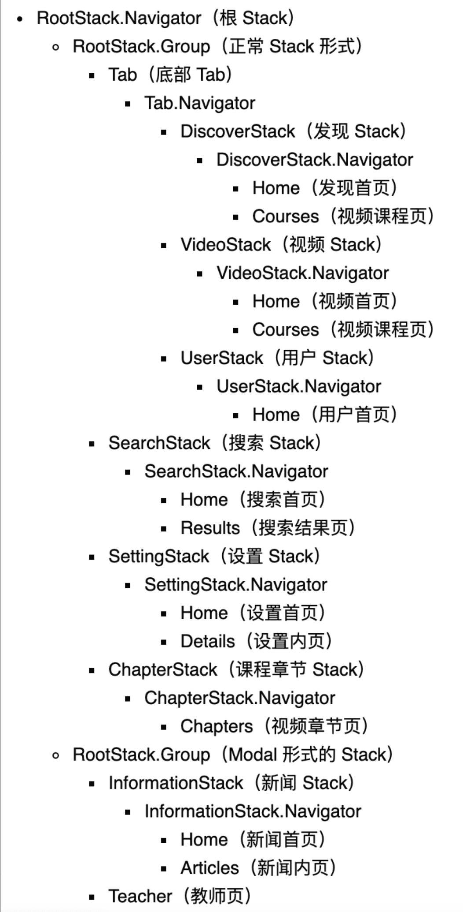

##### 最后一步

- 删除`App.js`文件
- 修改`index.js`文件，引用、注册`RootStackScreen`

```javascript
import { AppRegistry } from 'react-native';
import RootStackScreen from './src/navigation/RootStackScreen';
import { name as appName } from './app.json';

// 图标库
import SimpleLineIcons from 'react-native-vector-icons/SimpleLineIcons';
import Ionicons from 'react-native-vector-icons/Ionicons';
import EvilIcons from 'react-native-vector-icons/EvilIcons';
import MaterialIcons from 'react-native-vector-icons/MaterialIcons';

AppRegistry.registerComponent(appName, () => RootStackScreen);

SimpleLineIcons.loadFont();
Ionicons.loadFont();
EvilIcons.loadFont();
MaterialIcons.loadFont();
```

#### Tab 图标、样式

##### 配置文件

新建`src/navigation/options/TabOption.js`文件

```javascript
import * as React from 'react';
import SimpleLineIcons from 'react-native-vector-icons/SimpleLineIcons';

// TabOption 配置
const TabOption = route => {
  let labelName;
  let iconName;

  switch (route.name) {
    case 'DiscoverStack':
      labelName = '发现';
      iconName = 'compass';
      break;
    case 'VideoStack':
      labelName = '视频';
      iconName = 'camrecorder';
      break;
    default:
      labelName = '我的';
      iconName = 'user';
  }
  return {
    tabBarLabel: labelName,
    tabBarIcon: ({ focused, color }) => (
      <SimpleLineIcons name={iconName} size={25} color={color} />
    ),
  };
};

export default TabOption;
```

##### 修改`src/navigation/TabScreen.js`

```javascript
import * as React from 'react';
import { createBottomTabNavigator } from '@react-navigation/bottom-tabs';
import TabOption from './options/TabOption';
import Colors from '../constants/Colors';
import DiscoverStackScreen from './stacks/DiscoverStackScreen';
import VideoStackScreen from './stacks/VideoStackScreen';
import UserStackScreen from './stacks/UserStackScreen';

const Tab = createBottomTabNavigator();

function TabScreen() {
  return (
    <Tab.Navigator
      screenOptions={({ route }) => ({
        headerShown: false,
        ...TabOption(route),
        tabBarActiveTintColor: Colors.primary,
        tabBarInactiveTintColor: Colors.tabBarInactiveText,
      })}>
      <Tab.Screen name="DiscoverStack" component={DiscoverStackScreen} />
      <Tab.Screen name="VideoStack" component={VideoStackScreen} />
      <Tab.Screen name="UserStack" component={UserStackScreen} />
    </Tab.Navigator>
  );
}

export default TabScreen;
```

结果

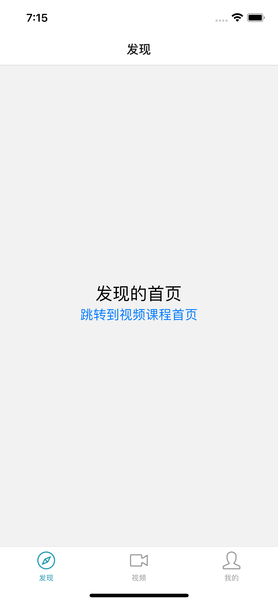

#### Header Buttons（顶部按钮）

##### Tab 的三个首页，增加顶部图标

新建`src/navigation/options/HeaderButtonsOption.js`文件

```javascript
import * as React from 'react';
import SimpleLineIcons from 'react-native-vector-icons/SimpleLineIcons';
import Colors from '../../constants/Colors';

const HeaderButtonsOption = navigation => {
  return {
    headerLeft: () => (
      <SimpleLineIcons
        name="bell"
        size={20}
        color={Colors.headerButton}
        onPress={() => navigation.navigate('InformationStack')}
      />
    ),
    headerRight: () => (
      <>
        <SimpleLineIcons
          name="magnifier"
          size={20}
          color={Colors.headerButton}
          onPress={() => navigation.navigate('SearchStack')}
        />
        <SimpleLineIcons
          name="options"
          size={20}
          color={Colors.headerButton}
          style={{ marginLeft: 15 }}
          onPress={() => navigation.navigate('SettingStack')}
        />
      </>
    ),
  };
};

export default HeaderButtonsOption;
```

##### 修改需要显示顶部按钮的三个 Stack

- `src/navigation/stacks/DiscoverStackScreen.js`
- `src/navigation/stacks/VideoStackScreen.js`
- `src/navigation/stacks/UserStackScreen.js`

以`DiscoverStackScreen`为例，一律加入以下代码

**引用**

```javascript
import HeaderButtonsOption from '../options/HeaderButtonsOption';
```

**修改**

```javascript
<DiscoverStack.Navigator>
  <DiscoverStack.Screen
    name="Home"
    component={HomeScreen}
    options={({ navigation, route }) => ({
      ...HeaderButtonsOption(navigation),
      title: '发现',
    })}
  />
  <DiscoverStack.Screen name="Courses" component={CoursesScreen} />
</DiscoverStack.Navigator>
```

#### Card 公共配置

##### `Stack`公共基础配置

新建`src/navigation/options/CardOption.js`文件

```javascript
import * as React from 'react';
import Colors from '../../constants/Colors';
import Ionicons from 'react-native-vector-icons/Ionicons';
import { Platform } from 'react-native';

//  Card Stack 配置
const CardOption = (route, navigation) => ({
  // 标题的样式
  headerTitleStyle: {
    fontWeight: '400',
    color: Colors.headerTitle,
  },

  // 标题组件的颜色（自带返回箭头）
  headerTintColor: Colors.primary,

  // 安卓标题栏居中
  headerTitleAlign: 'center',

  //安卓使用左右切屏
  animation: 'slide_from_right',

  // 安卓滑动返回的方向为：水平
  gestureDirection: 'horizontal',

  // 默认标题为空
  title: '',

  // 自定义返回按钮
  headerLeft: () => (
    <Ionicons
      name={Platform.OS === 'ios' ? 'ios-chevron-back' : 'md-arrow-back'}
      size={Platform.OS === 'ios' ? 30 : 25}
      color={Colors.primary}
      onPress={() => navigation.goBack()}
    />
  ),
});

export default CardOption;
```

需要引用`CardOption`的有多处，简单的说`src/navigation/stacks`文件夹下，所有文件都需要修改：

- src/navigation/stacks/DiscoverStackScreen.js
- src/navigation/stacks/ChapterStackScreen.js
- src/navigation/stacks/InformationStackScreen.js
- src/navigation/stacks/SearchStackScreen.js
- src/navigation/stacks/SettingStackScreen.js
- src/navigation/stacks/UserStackScreen.js
- src/navigation/stacks/VideoStackScreen.js

以`DiscoverStackScreen`为例，一律加入以下代码

**引用**

```javascript
import CardOption from '../options/CardOption';
```

**修改**

```javascript
<DiscoverStack.Navigator
  screenOptions={({ route, navigation }) => ({
    ...CardOption(route, navigation),
  })}>
   // ...

</DiscoverStack.Navigator>
```

#### Modal 公共配置

##### `Modal`配置文件

新建`src/navigation/options/ModalOption.js`文件

```javascript
import * as React from 'react';
import Ionicons from 'react-native-vector-icons/Ionicons';
import Colors from '../../constants/Colors';
import { Platform } from 'react-native';

// modal页，去掉左侧返回按钮，右侧加上关闭按钮
const ModalOption = navigation => {
  return {
    // 显示header
    headerShown: true,

    // 安卓标题栏居中
    headerTitleAlign: 'center',

    // 不显示默认返回按钮
    headerLeft: () => null,

    // 自定关闭按钮
    headerRight: () => (
      <Ionicons
        name="ios-close"
        size={Platform.OS === 'ios' ? 30 : 25}
        color={Colors.primary}
        onPress={() => navigation.goBack()}
      />
    ),
  };
};
export default ModalOption;
```

##### 教师`Teacher`页面

修改`src/navigation/RootStackScreen.js`文件

**引入**

```javascript
import ModalOption from './options/ModalOption';
```

**修改**

```javascript
<RootStack.Screen
  name="Teacher"
  component={TeacherHomeScreen}
  options={({ navigation }) => ({
    ...ModalOption(navigation),
    presentation: 'modal',
  })}
/>
```

##### 新闻`Home`首页

修改`src/navigation/stacks/InformationStackScreen.js`文件

**引入**

```javascript
import ModalOption from '../options/ModalOption';
```

**修改**

```javascript
<InformationStack.Screen
  name="Home"
  component={HomeScreen}
  options={({ navigation }) => ({
    ...ModalOption(navigation),
    title: '新闻',
  })}
/>
```

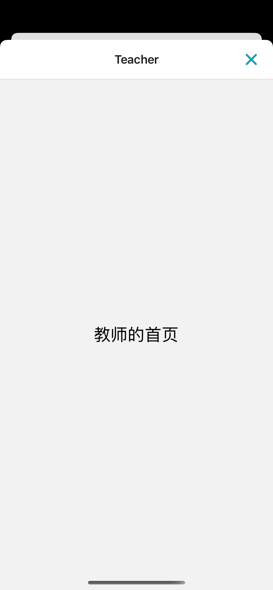

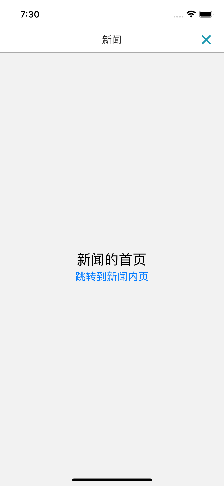

### 网络请求封装

#### Fetch，加入登录验证

##### fetchRequest

新建`src/utils/fetchRequest.js`文件

```javascript
import AsyncStorage from '@react-native-async-storage/async-storage';
import Api from '../constants/Api';

// 自定义 fetch，加上了登录参数
const fetchRequest = async (url, method = 'GET', params) => {
  const userToken = await AsyncStorage.getItem('userToken');
  const auth = userToken ? {Authorization: `Bearer ${userToken}`} : {};
  const body = params ? {body: JSON.stringify(params)} : {};

  const header = {
    Accept: 'application/json',
    'Content-Type': 'application/json',
    ...auth,
  };

  return new Promise(async (resolve, reject) => {
    try {
      let response = await fetch(Api + url, {
        method: method,
        headers: header,
        ...body,
      });

      // 认证失败：登录超时，或账号被禁用
      if (response.status == '401') {
        throw new Error('unauthorized');
      }

      let responseJson = await response.json();
      resolve(responseJson);
    } catch (err) {
      reject(err);
    }
  });
};

export default fetchRequest;
```

#### 自定义 hook 调用接口

##### useFetchData.js

新建`src/hooks/useFetchData.js`文件

```javascript
import React, { useCallback, useEffect, useReducer } from 'react';
import fetchRequest from '../utils/fetchRequest';

// 初始状态
let initialState = {
  loading: true,
  error: false,
  refreshing: false,
  data: [],
};

// 定义reducer，统一管理状态
const reducer = (state, action) => {
  switch (action.type) {
    case 'init':
      return {
        ...state,
        loading: true,
        error: false,
        refreshing: false,
      };
    case 'refresh':
      return {
        ...state,
        refreshing: true,
      };
    case 'success':
      return {
        ...state,
        error: false,
        data: action.payload,
      };
    case 'failure':
      return {
        ...state,
        error: true,
      };
    case 'done':
      return {
        ...state,
        loading: false,
        refreshing: false,
      };
    default:
      throw new Error();
  }
};

const useFetchData = (url, initData) => {
  // 如果有传过来的initData，设置到initialState里
  initialState = {
    ...initialState,
    data: initData || [],
  };

  // 使用useReducer初始化数据
  const [state, dispatch] = useReducer(reducer, initialState);

  const fetchData = async url => {
    try {
      const responseJson = await fetchRequest(url);
      dispatch({ type: 'success', payload: responseJson });
    } catch (error) {
      dispatch({ type: 'failure' });
    } finally {
      dispatch({ type: 'done' });
    }
  };

  // 监听 url 参数，也就说当接口地址变化后，会重新请求接口
  useEffect(() => {
    fetchData(url);
  }, [url]);

  // 下拉刷新
  const onRefresh = useCallback(url => {
    dispatch({ type: 'refresh' });
    fetchData(url);
  }, []);

  // 重新加载
  const onReload = useCallback(url => {
    dispatch({ type: 'init' });
    fetchData(url);
  }, []);

  // 返回这些内容，在调用的页面中可以读取、调用，或再次进行设置
  return { ...state, onRefresh, onReload, fetchData };
};

export default useFetchData;
```

### 公用组件

#### 网络错误提示

##### 新建`src/components/shared/NetworkError.js`文件

```javascript
import * as React from 'react';
import { StyleSheet, View, Text, TouchableOpacity } from 'react-native';
import SimpleLineIcons from 'react-native-vector-icons/SimpleLineIcons';
import Colors from '../../constants/Colors';

const NetworkError = props => {
  const { onReload } = props;

  return (
    <View style={styles.notice}>
      <SimpleLineIcons name={'drawer'} size={160} color={'#ddd'} />
      <Text style={styles.noticeMsg}>Oops，网络出现故障，请点击</Text>
      <TouchableOpacity onPress={() => onReload()} style={styles.reload}>
        <View style={styles.labelWrapper}>
          <Text style={styles.label}>重新加载</Text>
        </View>
      </TouchableOpacity>
    </View>
  );
};

const styles = StyleSheet.create({
  notice: {
    flex: 1,
    backgroundColor: '#fff',
    alignItems: 'center',
    justifyContent: 'center',
  },
  noticeMsg: {
    color: '#999',
  },
  labelWrapper: {
    backgroundColor: Colors.primary,
    height: 40,
    borderRadius: 4,
    paddingLeft: 10,
    paddingRight: 10,
  },
  label: {
    color: '#fff',
    lineHeight: 40,
  },
  reload: {
    marginTop: 10,
  },
});

export default NetworkError;
```

#### 加载中

##### 新建`src/components/shared/Loading.js`文件

```javascript
import * as React from 'react';
import { StyleSheet, ActivityIndicator } from 'react-native';
import Colors from '../../constants/Colors';

const Loading = () => {
  return (
    <ActivityIndicator
      size="small"
      color={Colors.primary}
      style={styles.ActivityIndicatorStyle}
    />
  );
};

const styles = StyleSheet.create({
  ActivityIndicatorStyle: {
    flex: 1,
    backgroundColor: '#fff',
  },
});

export default Loading;
```

#### 没有数据提示

##### 新建`src/components/shared/NoData.js`文件

```javascript
import React from 'react';
import { View, Text, StyleSheet } from 'react-native';
import SimpleLineIcons from 'react-native-vector-icons/SimpleLineIcons';

// 未读取到数据
const NoData = () => {
  return (
    <View style={styles.notice}>
      <SimpleLineIcons name={'drawer'} size={160} color={'#ddd'} />
      <Text style={styles.noticeMsg}>没有内容</Text>
    </View>
  );
};

const styles = StyleSheet.create({
  notice: {
    flex: 1,
    backgroundColor: '#fff',
    alignItems: 'center',
    justifyContent: 'center',
  },
  noticeMsg: {
    color: '#999',
  },
});

export default NoData;
```

### 综合使用：读取数据

```javascript
import * as React from 'react';
import {
  View,
  Text,
  FlatList,
  RefreshControl,
  ScrollView,
  StyleSheet,
  TouchableWithoutFeedback,
  Image,
} from 'react-native';
import useFetchData from '../../hooks/useFetchData';
import Loading from '../../components/shared/Loading';
import NetworkError from '../../components/shared/NetworkError';
import Colors from '../../constants/Colors';

const url = '/api/v2/home.json';

const HomeScreen = ({ navigation }) => {
  const { data, loading, error, onReload, refreshing, onRefresh } = useFetchData(url, {
    recommended_courses: [],
    calendar_courses: [],
    popular_courses: [],
    introductory_courses: [],
  });

  // 判断是否加载中
  if (loading) {
    return <Loading />;
  }

  // 网络错误
  if (error) {
    return <NetworkError onReload={() => onReload(url)} />;
  }

  const renderItem = ({ item, index }) => (
    <TouchableWithoutFeedback
      onPress={() =>
        navigation.navigate('Courses', {
          id: item.id,
          title: item.name,
        })
      }>
      <View style={[styles.default, index == 0 ? styles.first : '', index == data.length - 1 ? styles.last : '']}>
        <Image source={{ uri: item.image }} style={styles.image} />
        <View style={styles.titleWrapper}>
          <Text style={styles.title} numberOfLines={2}>
            {item.name}
          </Text>
        </View>
      </View>
    </TouchableWithoutFeedback>
  );

  return (
    <ScrollView
      style={styles.container}
      refreshControl={<RefreshControl refreshing={refreshing} onRefresh={() => onRefresh(url)} />}>
      <View style={styles.course}>
        <View style={styles.content}>
          <Text style={styles.heading}>推荐课程</Text>
        </View>
        <FlatList
          data={data.calendar_courses}
          keyExtractor={item => item.id.toString()}
          renderItem={renderItem}
          horizontal={true}
          showsHorizontalScrollIndicator={false}
        />
      </View>
    </ScrollView>
  );
};

const styles = StyleSheet.create({
  container: {
    flex: 1,
    backgroundColor: '#fff',
  },
  course: {
    marginTop: 20,
  },
  content: {
    paddingLeft: 15,
    paddingRight: 15,
  },
  heading: {
    fontWeight: 'bold',
    fontSize: 20,
    marginBottom: 10,
  },
  default: {
    position: 'relative',
    width: 206,
    marginLeft: 8,
  },
  first: {
    marginLeft: 15,
  },
  last: {
    marginRight: 15,
  },
  image: {
    width: 206,
    height: 160,
    borderRadius: 5,
  },
  titleWrapper: {
    marginTop: 6,
    height: 48,
    justifyContent: 'center',
  },
  title: {
    fontSize: 16,
  },
  date: {
    fontSize: 12,
    marginTop: 6,
    color: Colors.date,
  },
});

export default HomeScreen;
```

运行结果

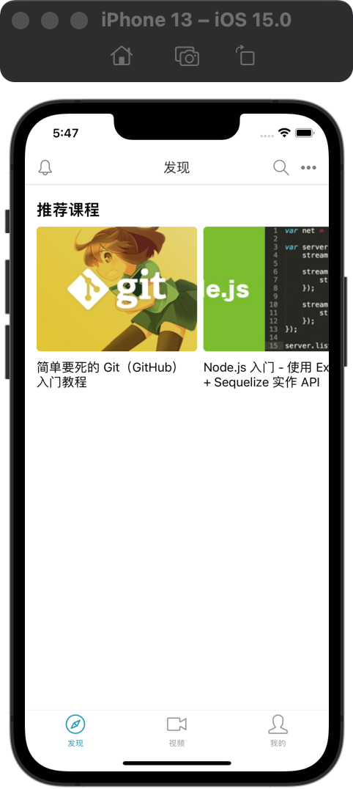

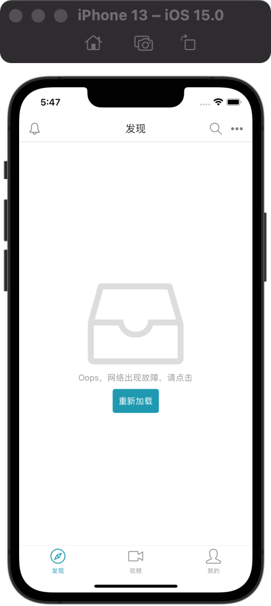

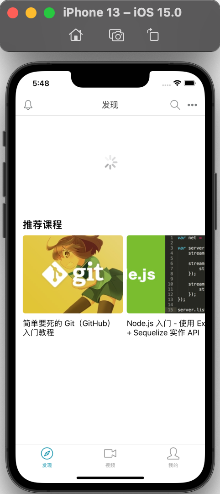

## 杂项

### 图标库：react-native-vector-icons 的使用

### 代码格式优化：Prettier 的配置文件

### 存储：async-storage 的使用

### 轮播图：react-native-swiper 的使用

### 加载 Web 内容：react-native-webview 的使用

### 滚动的 Tab 栏：scrollable-tab-view 的使用

### 分享功能：react-native-share 的使用

### 视频播放：react-native-video 的使用

### 展开更多：react-native-collapsible 结合 react-native-linear-gradient

### 侧边栏：react-native-side-menu

### 好看的表格：react-native-tableview-simple 的使用


