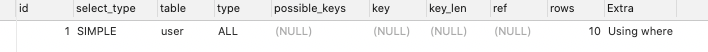
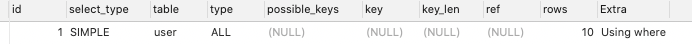
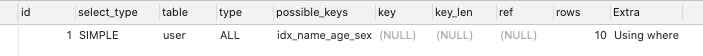

## 面试问题

### hashmap hashtable 区别

#### HashMap 不是线程安全的

HashMap 是 map 接口的实现类，是将键映射到值的对象，其中键和值都是对象，并且不能包含重复键，但可以包含重复值。**HashMap 允许 null  key 和 null value，而 HashTable 不允许**。

#### HashTable 是线程安全 Collection

HashMap 是 HashTable 的轻量级实现，他们都完成了Map 接口，主要区别在于 HashMap 允许 null  key 和 null value，由于非线程安全，效率上可能高于 Hashtable。

#### 区别如下：

- HashMap允许将 null 作为一个 entry 的 key 或者 value，而 Hashtable 不允许。
- HashMap 把 Hashtable 的 contains 方法去掉了，改成 containsValue 和 containsKey。因为 contains 方法容易让人引起误解。
- HashTable 继承自 Dictionary 类，而 HashMap 是 Java1.2 引进的 Map interface 的一个实现。
- HashTable 的方法是 Synchronize 的，而 HashMap 不是，在多个线程访问 Hashtable 时，不需要自己为它的方法实现同步，而 HashMap 就必须为之提供外同步。
- Hashtable 和 HashMap 采用的 hash/rehash 算法都大概一样，所以性能不会有很大的差异。

### 线程的三种创建方式

- Thread 继承Thread类，重写run方法
- Runnable 实现Runnable接口，重写run方法，执行线程需要丢人Runnable接口的实现类，调用start方法，Runnable 不返回结果
- Callable 实现Callable接口，需要返回值类型，重写call方法，`executorService.submit(testCallable)`，`result.get()`

### 有哪些你遇到的是设置了索引但是没有用到索引的地方

> 参考网址：https://segmentfault.com/a/1190000023911554

#### 单个索引

##### 1、使用!= 或者 <> 导致索引失效

```sql
SELECT * FROM `user` WHERE `name` != '冰峰';
```

我们给name字段建立了索引，但是如果!= 或者 <> 这种都会导致索引失效，进行全表扫描，所以如果数据量大的话，谨慎使用

可以通过分析SQL看到，type类型是ALL，扫描了10行数据，进行了全表扫描。<>也是同样的结果

##### 2、类型不一致导致的索引失效

在说这个之前，一定要说一下设计表字段的时候，千万、一定、必须要保持字段类型的一致性，啥意思？比如user表的id是int自增，到了用户的账户表user_id这个字段，一定、必须也是int类型，千万不要写成varchar、char什么的骚操作。

```sql
SELECT * FROM `user` WHERE height= 175;
```

这个SQL诸位一定要看清楚，height表字段类型是varchar，但是我查询的时候使用了数字类型，因为这个中间存在一个隐式的类型转换，所以就会导致索引失效，进行全表扫描。

现在明白我为啥说设计字段的时候一定要保持类型的一致性了不，如果你不保证一致性，一个int一个varchar，在进行多表联合查询（eg: 1 = '1'）必然走不了索引。

遇到这样的表，里面有几千万数据，改又不能改，那种痛可能你们暂时还体会。

##### 3、函数导致的索引失效

```sql
SELECT * FROM `user` WHERE DATE(create_time) = '2020-09-03';
```

如果你的索引字段使用了索引，对不起，他是真的不走索引的

##### 4、运算符导致的索引失效

```sql
SELECT * FROM `user` WHERE age - 1 = 20;
```

如果你对列进行了（+，-，*，/，!）, 那么都将不会走索引。



##### 5、OR引起的索引失效

```sql
SELECT * FROM `user` WHERE `name` = '张三' OR height = '175';
```

OR导致索引是在特定情况下的，并不是所有的OR都是使索引失效，如果OR连接的是同一个字段，那么索引不会失效，反之索引失效。


##### 6、模糊搜索导致的索引失效

```sql
SELECT * FROM `user` WHERE `name` LIKE '%冰';
```

这个我相信大家都明白，模糊搜索如果你前缀也进行模糊搜索，那么不会走索引

##### 7、NOT IN、NOT EXISTS导致索引失效

```sql
SELECT s.* FROM `user` s WHERE NOT EXISTS (SELECT * FROM `user` u WHERE u.name = s.`name` AND u.`name` = '冰峰');
SELECT * FROM `user` WHERE `name` NOT IN ('冰峰');
```

这两种用法，也将使索引失效。但是NOT IN 还是走索引的，千万不要误解为 IN 全部是不走索引的。我之前就有误解

#### 符合索引

##### 1、最左匹配原则

```sql
EXPLAIN SELECT * FROM `user` WHERE sex = '男';
EXPLAIN SELECT * FROM `user` WHERE name = '冰峰' AND sex = '男';
```

**测试之前，删除其他的单列索引。**

啥叫最左匹配原则，就是对于符合索引来说，它的一个索引的顺序是从左往右依次进行比较的，像第二个查询语句，name走索引，接下来回去找age，结果条件中没有age那么后面的sex也将不走索引。



**注意：**

```sql
SELECT * FROM `user` WHERE sex = '男' AND age = 22 AND `name` = '冰峰';
```

可能有些搬砖工可能跟我最开始有个误解，我们的索引顺序明明是name、sex、age，你现在的查询顺序是sex、age、name，这肯定不走索引啊，你要是自己没测试过，也有这种不成熟的想法，那跟我一样还是太年轻了，它其实跟顺序是没有任何关系的，因为mysql的底层会帮我们做一个优化，它会把你的SQL优化为它认为一个效率最高的样子进行执行。所以千万不要有这种误解

##### 2、如果使用了!=会导致后面的索引全部失效

```sql
SELECT * FROM `user` WHERE sex = '男' AND `name` != '冰峰' AND age = 22;
```

我们在name字段使用了 != ，由于name字段是最左边的一个字段，根据最左匹配原则，如果name不走索引，后面的字段也将不走索引。



关于符合索引导致索引失效的情况能说的目前就这两种，其实我觉得对于符合索引来说，重要的是如何建立高效的索引，千万不能说我用到那个字段我就去建立一个单独的索引，不是就可以全局用了嘛。这样是可以，但是这样并没有符合索引高效，所以为了成为高级的搬砖工，我们还是要继续学习，如何创建高效的索引