## 导言

```markdown
# 项目目标
1. 面试等一些需要拿出手的项目经验
2. 提升自己业务理解能力，业务拆解、需求分析等
3. 学习复杂业务或高并发场景的实现方案落地
4. 学习流行的技术框架、技术方案
5. 学习现成的工作经验、提升java开发功能
```

### 核心数据的流向

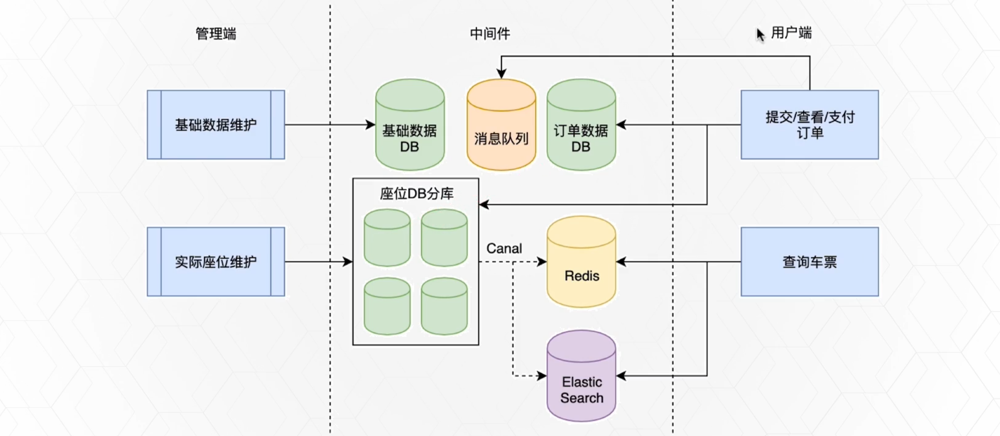

分管理端和用户端

管理端

- 管理端主要是负责基础数据的维护和实际座位的维护
- 由于这些数据量很大，我们做了分库分表的处理，这里使用了基于DB binlog做数据异构的方式，借助canal组件在异步的流程中，将数据写入到redis和es里面，保证数据的一致性

用户端：

- 在查询车票的时候，只需要访问Redis和es就可以了，这样就可以减少db的压力

### 界面展示

后台管理的界面

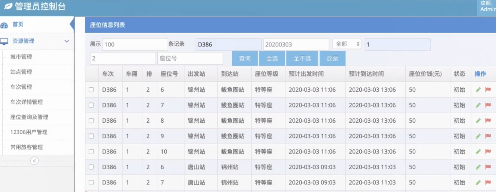

前台订票的页面

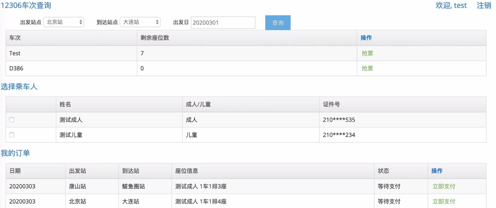

### 技术栈

总体架构：springboot2.x+maven+jdk8+mysql

基础组件：mybatis、guava、jackson、lombok

中间件：redis、elasticsearch、canal（做数据异构）、sharding-jdbc（分库分表）、rabbitmq

基于这些技术框架和组件，我们最终将查出一个多module的java项目

### 课程内容介绍

#### 课程整体介绍

MVP版本：最简化可实行产品，Minimum Viable Product

不是仿照12306网站做一个出来，而是基于这个实际的复杂业务场景，进行分析、拆解、开发，并结合它的高并发特性做一些高可用架构设计和讲解

#### 课程整体简介

做那些功能：

train 相关实体的管理、生成座位、放票、查询余票、抢票、生成订单...

不做那些功能：

登录、个人信息管理、实际支付、退款、不影响整体流程的功能、候补等一些特殊逻辑

讲那些内容：

需求分析、数据库设计、项目搭建、流行的设计思想、后台管理实现、前台查余票及购买、组件使用及实践

不讲那些内容：

相关前端的实现、登录及个人信息维护、实际支付、退款等

## 需求设计与拆解

### 任务拆解与业务介绍-基础数据管理

1. 城市管理和车站管理：


做城市主要是为了做车站管理，城市下面会有车站

2. 动车车次属性：

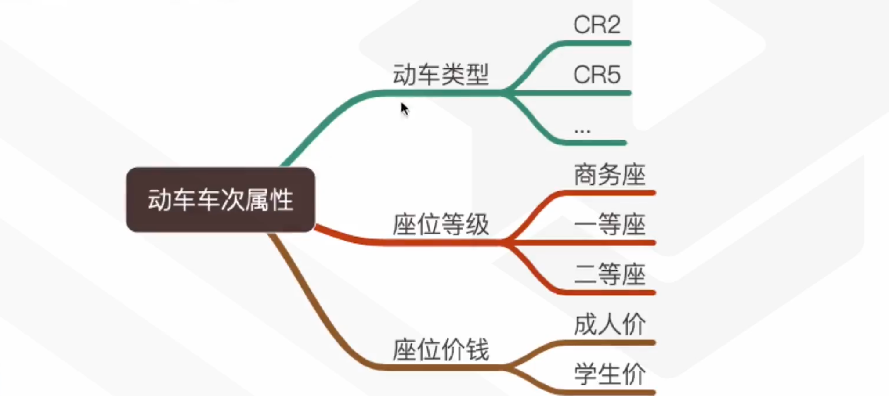

3. 车次详情管理：


4. 日常运维：

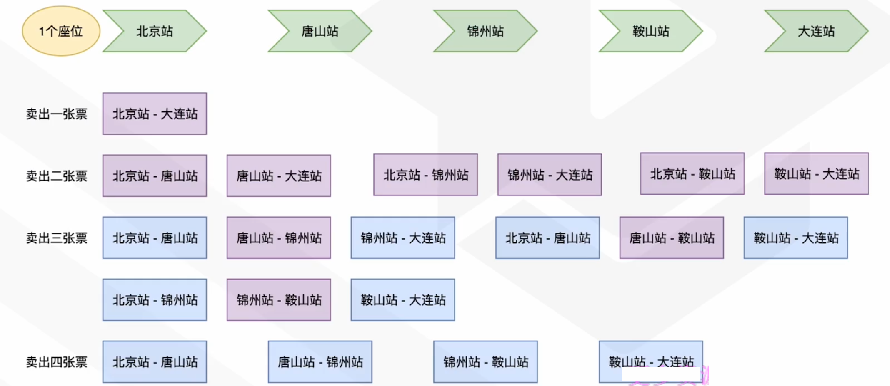

当然，我们合并起来，那么能买的票只有这么多

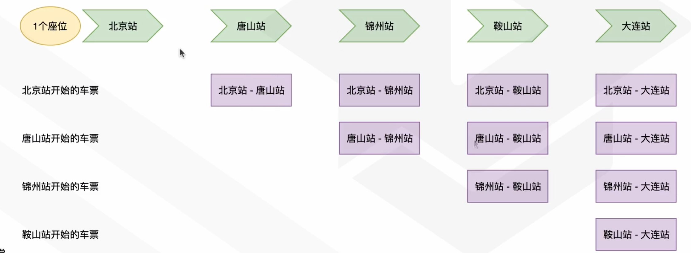

一张票的本质就是：某个车次的某一段区间（一条线段，包含若干站点）

只要区间不重叠，座位就不会发生竞争，可以回收利用（同时预售）

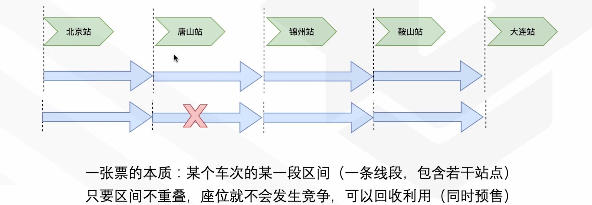

核心业务规则：车票包含的每个原子区间的重叠次数不超过总座位数，比如，假设当前车有100个座位，那么北京站到唐山站可以售票的重复次数就是100次

实际座位管理：

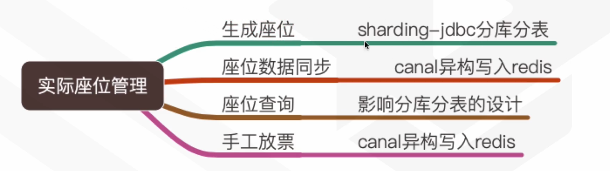

5. 用户端维护


如果出现下面的情况，我们是不能购买北京站到大连站的票的，虽然说整个流程下来还有一次，但是这一次的座位并不是从头空到尾的

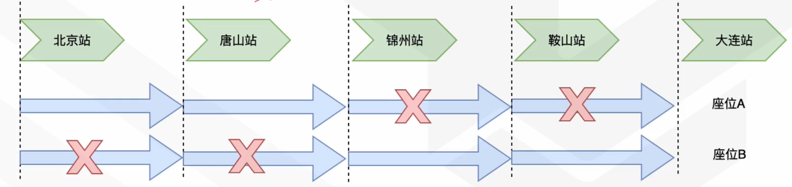

提交订单，开始获取座位

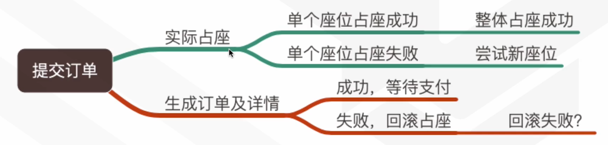

6. 其他

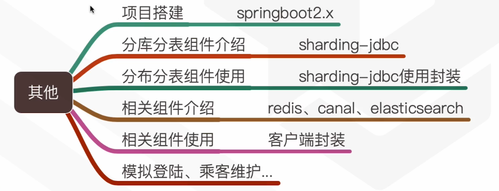

### 12306购票分解

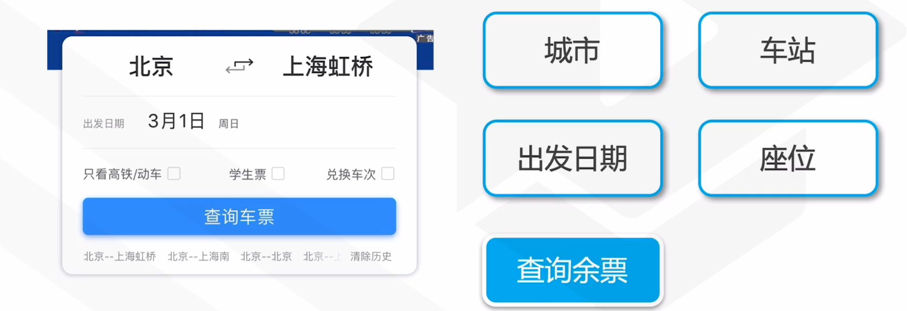

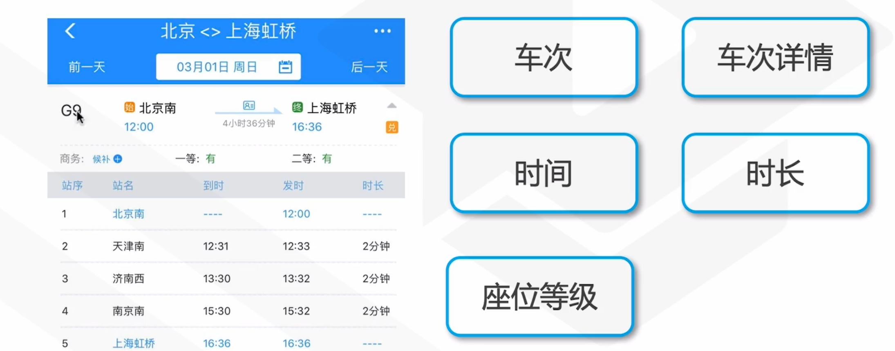

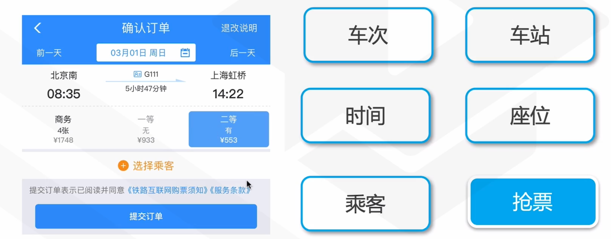


### 业务实体的确定

城市 TrainCity、车站TrainStation、车次TrainNumber、车次详情TrainNumberDetial、座位TrainSeat、乘客TrainTraveller、用户TrainUser、订单详情TrainOrderDetail、订单TrainOrder

### 核心流程说明

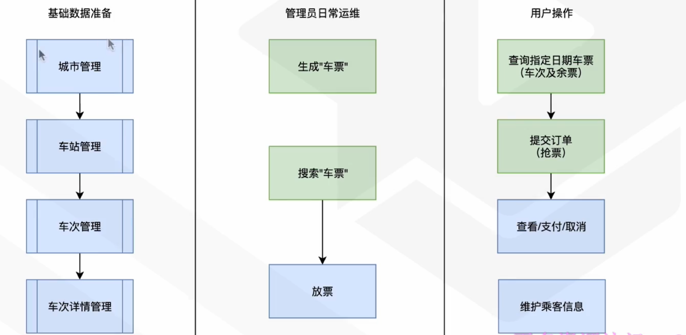

## 项目搭建

### 项目搭建

1. 创建springboot项目，勾选需要的依赖

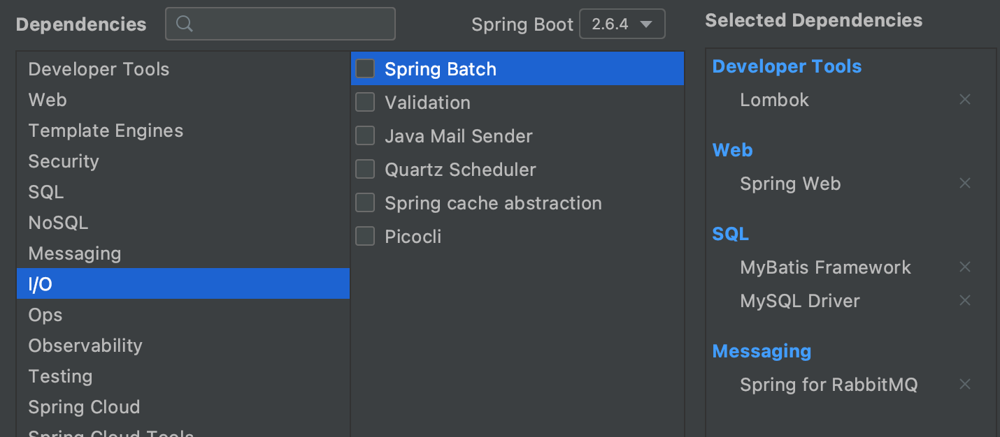

勾选依赖之后，我们的pom文件添加的依赖有

```xml
<dependencies>
    <dependency>
        <groupId>org.springframework.boot</groupId>
        <artifactId>spring-boot-starter-amqp</artifactId>
    </dependency>
    <dependency>
        <groupId>org.springframework.boot</groupId>
        <artifactId>spring-boot-starter-web</artifactId>
    </dependency>
    <dependency>
        <groupId>org.mybatis.spring.boot</groupId>
        <artifactId>mybatis-spring-boot-starter</artifactId>
        <version>2.2.2</version>
    </dependency>

    <dependency>
        <groupId>mysql</groupId>
        <artifactId>mysql-connector-java</artifactId>
        <scope>runtime</scope>
    </dependency>
    <dependency>
        <groupId>org.projectlombok</groupId>
        <artifactId>lombok</artifactId>
        <optional>true</optional>
    </dependency>
    <dependency>
        <groupId>org.springframework.boot</groupId>
        <artifactId>spring-boot-starter-tomcat</artifactId>
        <scope>provided</scope>
    </dependency>
    <dependency>
        <groupId>org.springframework.boot</groupId>
        <artifactId>spring-boot-starter-test</artifactId>
        <scope>test</scope>
    </dependency>
    <dependency>
        <groupId>org.springframework.amqp</groupId>
        <artifactId>spring-rabbit-test</artifactId>
        <scope>test</scope>
    </dependency>
</dependencies>
```

2. 创建后台项目，在刚才创建的项目上右键添加模块

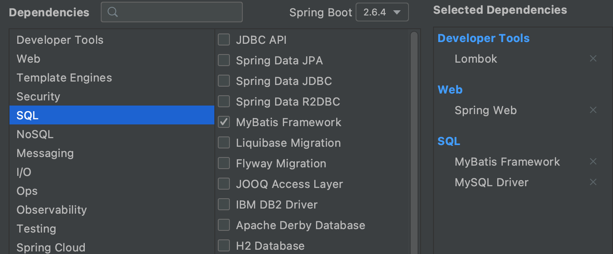

得到pom文件

```xml
<dependencies>
    <dependency>
        <groupId>org.springframework.boot</groupId>
        <artifactId>spring-boot-starter-web</artifactId>
    </dependency>
    <dependency>
        <groupId>org.mybatis.spring.boot</groupId>
        <artifactId>mybatis-spring-boot-starter</artifactId>
        <version>2.2.2</version>
    </dependency>

    <dependency>
        <groupId>mysql</groupId>
        <artifactId>mysql-connector-java</artifactId>
        <scope>runtime</scope>
    </dependency>
    <dependency>
        <groupId>org.projectlombok</groupId>
        <artifactId>lombok</artifactId>
        <optional>true</optional>
    </dependency>
    <dependency>
        <groupId>org.springframework.boot</groupId>
        <artifactId>spring-boot-starter-tomcat</artifactId>
        <scope>provided</scope>
    </dependency>
    <dependency>
        <groupId>org.springframework.boot</groupId>
        <artifactId>spring-boot-starter-test</artifactId>
        <scope>test</scope>
    </dependency>
</dependencies>
```


3. 创建前端项目，同理在刚才创建的项目上右键添加模块

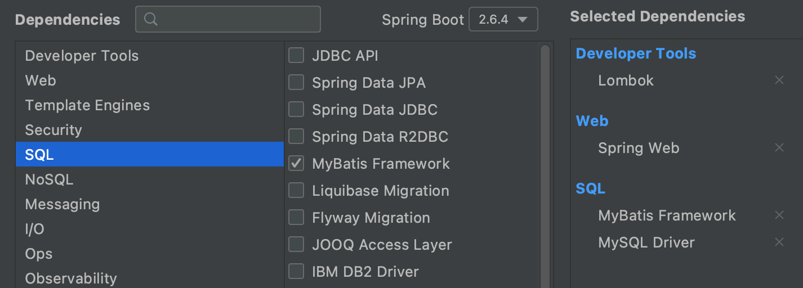

得到的pom文件

```xml
<dependencies>
    <dependency>
        <groupId>org.springframework.boot</groupId>
        <artifactId>spring-boot-starter-web</artifactId>
    </dependency>
    <dependency>
        <groupId>org.mybatis.spring.boot</groupId>
        <artifactId>mybatis-spring-boot-starter</artifactId>
        <version>2.2.2</version>
    </dependency>

    <dependency>
        <groupId>mysql</groupId>
        <artifactId>mysql-connector-java</artifactId>
        <scope>runtime</scope>
    </dependency>
    <dependency>
        <groupId>org.projectlombok</groupId>
        <artifactId>lombok</artifactId>
        <optional>true</optional>
    </dependency>
    <dependency>
        <groupId>org.springframework.boot</groupId>
        <artifactId>spring-boot-starter-tomcat</artifactId>
        <scope>provided</scope>
    </dependency>
    <dependency>
        <groupId>org.springframework.boot</groupId>
        <artifactId>spring-boot-starter-test</artifactId>
        <scope>test</scope>
    </dependency>
</dependencies>
```

4. 创建公共模块

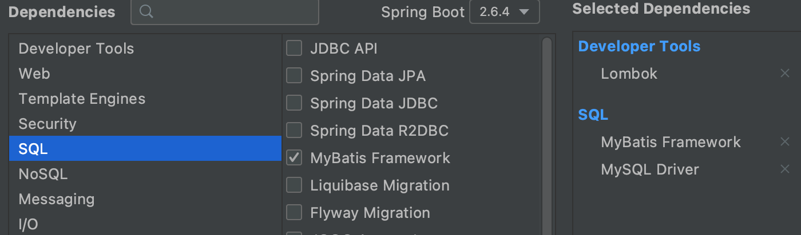

得到的pom文件

```xml
<dependencies>
    <dependency>
        <groupId>org.mybatis.spring.boot</groupId>
        <artifactId>mybatis-spring-boot-starter</artifactId>
        <version>2.2.2</version>
    </dependency>

    <dependency>
        <groupId>mysql</groupId>
        <artifactId>mysql-connector-java</artifactId>
        <scope>runtime</scope>
    </dependency>
    <dependency>
        <groupId>org.projectlombok</groupId>
        <artifactId>lombok</artifactId>
        <optional>true</optional>
    </dependency>
    <dependency>
        <groupId>org.springframework.boot</groupId>
        <artifactId>spring-boot-starter-test</artifactId>
        <scope>test</scope>
    </dependency>
</dependencies>
```

4. 添加数据同步服务模块

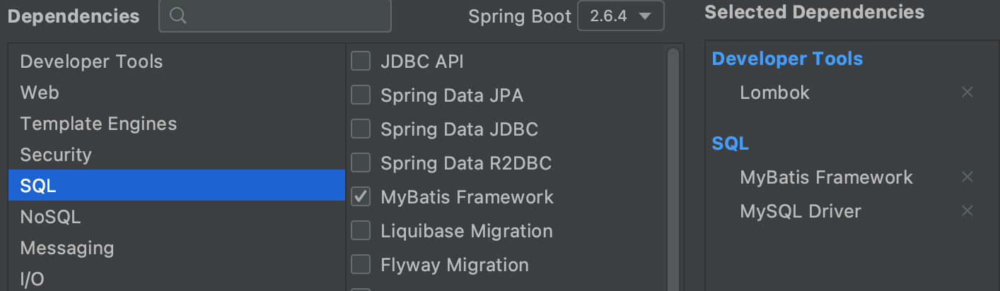

5. 在删除next的src目录之后，得到的文件目录为

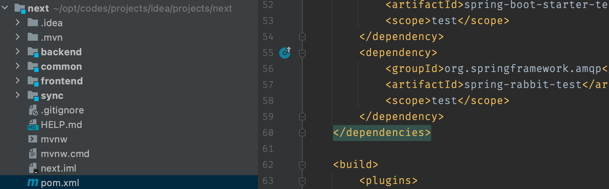

#### 添加依赖

1. backend

```xml
<!--spring context上下文的支持-->
<dependency>
    <groupId>org.springframework</groupId>
    <artifactId>spring-context-support</artifactId>
</dependency>

<!--jsp-->
<dependency>
    <groupId>org.apache.tomcat.embed</groupId>
    <artifactId>tomcat-embed-jasper</artifactId>
    <scope>provided</scope>
</dependency>
<dependency>
    <groupId>javax.servlet</groupId>
    <artifactId>javax.servlet-api</artifactId>
</dependency>
<dependency>
    <groupId>javax.servlet</groupId>
    <artifactId>jstl</artifactId>
</dependency>
<dependency>
    <groupId>org.apache.tomcat</groupId>
    <artifactId>jsp-api</artifactId>
    <version>6.0.36</version>
</dependency>

<!--tools-->
<dependency>
    <groupId>org.apache.commons</groupId>
    <artifactId>commons-lang3</artifactId>
    <version>3.5</version>
</dependency>
<dependency>
    <groupId>commons-collections</groupId>
    <artifactId>commons-collections</artifactId>
    <version>3.2.1</version>
</dependency>
<dependency>
    <groupId>commons-codec</groupId>
    <artifactId>commons-codec</artifactId>
    <version>1.10</version>
</dependency>

<!--jackson-->
<dependency>
    <groupId>com.fasterxml.jackson.datatype</groupId>
    <artifactId>jackson-datatype-guava</artifactId>
    <version>2.5.3</version>
</dependency>
<dependency>
    <groupId>org.codehaus.jackson</groupId>
    <artifactId>jackson-core-asl</artifactId>
    <version>1.9.13</version>
</dependency>
<dependency>
    <groupId>org.codehaus.jackson</groupId>
    <artifactId>jackson-mapper-asl</artifactId>
    <version>1.9.13</version>
</dependency>

<!--logback-->
<dependency>
    <groupId>ch.qos.logback</groupId>
    <artifactId>logback-core</artifactId>
</dependency>
<dependency>
    <groupId>ch.qos.logback</groupId>
    <artifactId>logback-classic</artifactId>
</dependency>
<dependency>
    <groupId>org.slf4j</groupId>
    <artifactId>slf4j-api</artifactId>
</dependency>

<!--validator-->
<dependency>
    <groupId>org.hibernate</groupId>
    <artifactId>hibernate-validator</artifactId>
    <version>5.1.0.Final</version>
</dependency>

<!--redis-->
<dependency>
    <groupId>redis.clients</groupId>
    <artifactId>jedis</artifactId>
    <version>2.8.1</version>
    <type>jar</type>
</dependency>

<!--es-->
<dependency>
    <groupId>org.elasticsearch.client</groupId>
    <artifactId>elasticsearch-rest-high-level-client</artifactId>
    <version>6.2.4</version>
</dependency>
<dependency>
    <groupId>org.elasticsearch</groupId>
    <artifactId>elasticsearch</artifactId>
    <version>6.2.4</version>
</dependency>

<!--分库分表-->
<!--最开始-->
<!--<dependency>-->
<!--    <groupId>com.dangdang</groupId>-->
<!--    <artifactId>shrding-jdbc-core</artifactId>-->
<!--    <version>1.5.4</version>-->
<!--</dependency>-->

<!--升级-->
<!--<dependency>-->
<!--    <groupId>io.shradingjdbc</groupId>-->
<!--    <artifactId>sharding-jdbc-core</artifactId>-->
<!--    <version>2.0.3</version>-->
<!--</dependency>-->

<!--最终，支持批量插入了-->
<dependency>
    <groupId>io.shardingsphere</groupId>
    <artifactId>sharding-jdbc-core</artifactId>
    <version>3.1.0</version>
</dependency>
```


### DB设计：自动生成相关代码


### 通用基础类构建


### 项目搭建验证


## 核心功能开发


## 高可用保证


## 总结

