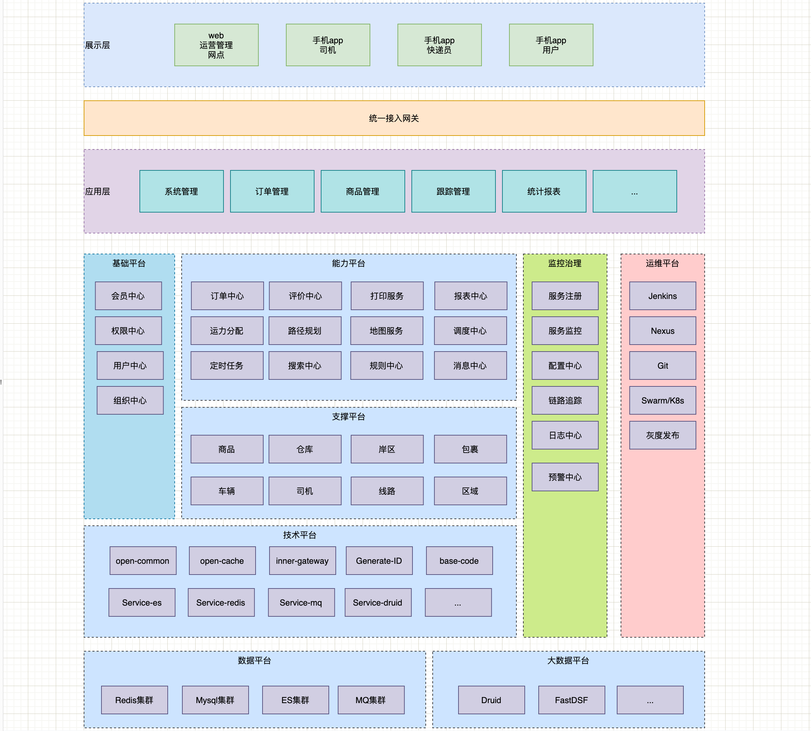
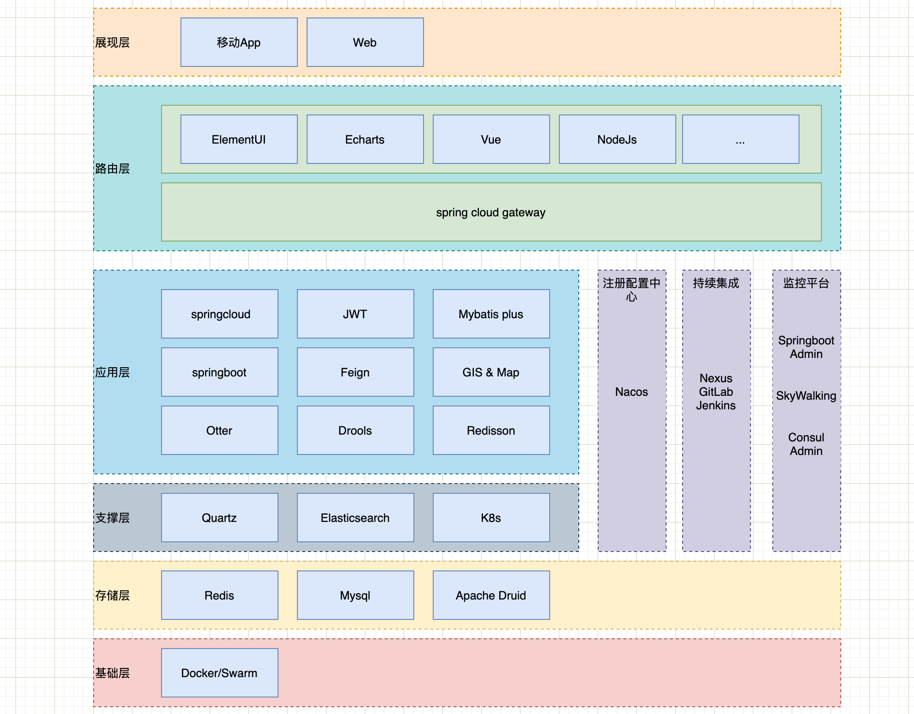
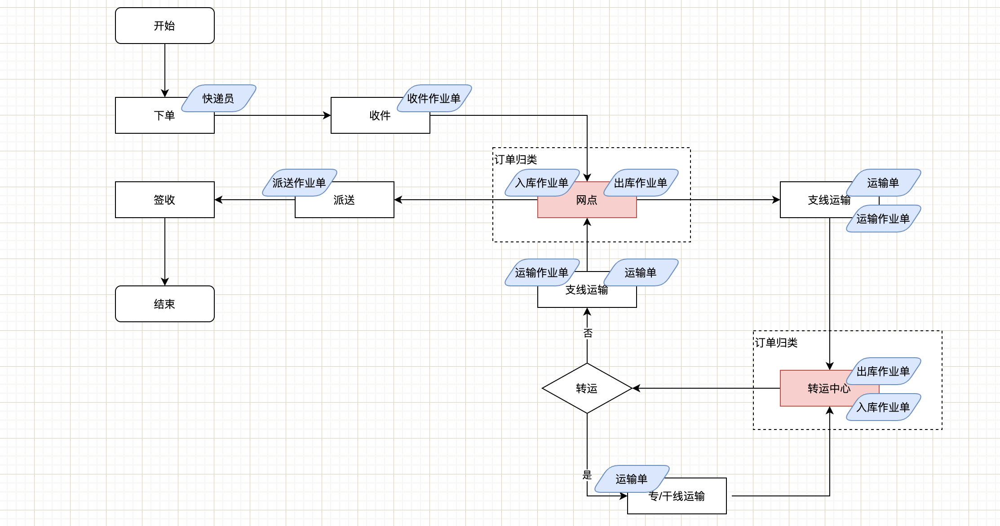
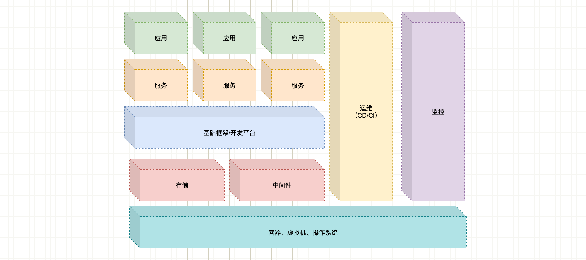
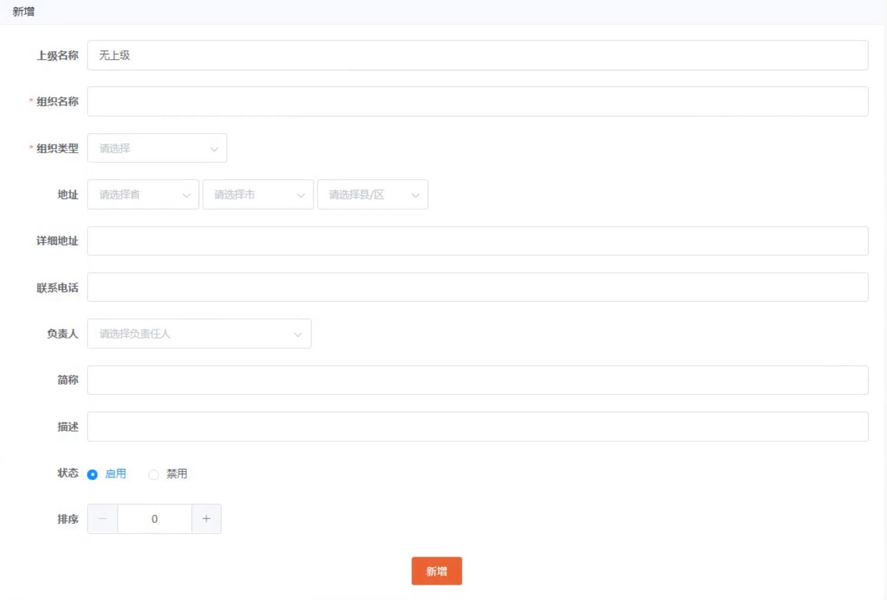

## 基础概述

### 项目概述和环境搭建

#### 项目介绍

本项目名称为品达物流TMS，TMS全称为：Transportation Management System，即运输管理系统，是对运输作业从运力资源准备到最终货物抵达目的地的全流程管理，TMS系统适用于运输公司、各企业下面的运输队等，它主要包括订单管理、配载作业、调度分配、行车管理、GPS车辆定位系统、车辆管理、线路管理、车次管理、人员管理、数据报表、基本信息维护等模块。该系统对车辆、驾驶员、线路等进行全面详细的统计考核，能大大提高运作效率，降低运输成本，使公司能够在激烈的市场竞争中处于领先地位

本项目从用户层面可以分为四个端：TMS后台系统管理端、客户端App、快递员App、司机端App

- TMS后台系统管理端：公司内部管理员用户使用，可以尽心基础数据维护、订单管理、运单管理等
- 客户App：名称为：品达速运，外部客户使用，可以寄件、查询物流信息等
- 快递员App：名称为：品达快递员，公司内部快递员使用，可以接收取派件任务等
- 司机端App：名称为：品达司机宝，公司内部的司机使用，可以接收运输任务、上报位置信息等

#### 物流行业介绍

物流运输市场目前最普遍的有四种行业类别：快递、快运、专线、三方。这四种行业支撑着全国商品货物的流通

- 快递：物流行业外的人对物流的直接反应就是快递，快递只是物流行业的一种形态，得益于电商的发展把快递行业推到大众视野中，快递的接收群体大多为个人，也称为C端。快运、专线、三方的发货和接收群体主要为B端，主要为企业与企业之间的合作，也有少量的个人
- 快运：承运的多是小批量货物，一般为几立方货物或十几公斤货物，如德邦快递、远成物流，运输对象为单个沙发，桌椅等，配送网络为自建和加盟两种方式
- 专线：衔接的货物多数为大宗商品，货物往往依照吨来算，送货主要送到仓库，工厂、门店。整个配送网络都是社会化网络，由不同的专线进行配合，货物运输需要经过多次中转、集拼
- 三方：不直接从事货物运输，主要通过与工厂签订合同，将货物交给专线或者联系车队、司机将货物送到指定地点，属于轻资产运作模式

#### 系统架构

#### 技术架构

### 业务需求说明

#### 产品需求和原型设计

太多了，我不写了

#### 整体业务流程

下图展示的是从寄件人下单到最终收件人签收的整个流程

### 开发方式介绍

#### 软件架构介绍

本项目的开发过程并不是从零开始的，而是基于一些已有的框架和服务来进行开发的。例如：TMS的后台管理端是通过通用权限系统进行菜单的配置、权限的配置、用户的配置、认证和鉴权等。客户da端App是通过注册登录服务来完成C端用户的注册和登录功能。快递员端App是通过文件服务来完成附件的上传操作

#### 通用权限系统介绍

通用权限系统是黑马程序员自研的一个通用的开发平台和权限管理平台，提供了通用的岗位、组织结构、菜单、角色、用户等基础数据的维护功能，同时还提供了认证和鉴权功能，TMS项目可以直接来使用这些功能

由于本课程主要开发的是TMS项目，所以依赖的通过权限系统已经提前部署好，我们直接使用即可

#### 短信服务介绍

企业开发中经常会使用到短信功能，市面上有多种短信服务平台可以供选择，但是不同的短信平台调用方式都不相同，为了在项目中统一调用方式，黑马程序员对世面上主流短信平台进行了整合，提供了统一的短信服务。在TMS中我们直接使用即可。

#### 文件服务介绍

文件的上传、下载功能是软件系统中常见的功能，包括上传文件、下载文件、查看文件等。例如：电商系统中需要上传商品的图片、广告视频，办公系统中上传附件，在社交类系统中上传用户头像等。上传的文件有多种存储方式，例如：本地存储、FastDFS存储、云存储（阿里云、腾讯云、七牛云）等方式。不同的存储方式对应的处理方式都不同。如果后期需要改变存储方式。维护成本比较高。针对以上问题，黑马程序员自研了通用的文件服务，对以上不同的存储方式进行了整合，对外暴露统一的文件服务接口。如果要改变存储方式，只需要在文件服务中修改配置即可切换，调用端程序代码不用做任何修改

在TMS项目中的文件上传操作我们直接使用此文件服务即可

#### 注册登录服务介绍

注册登录服务是黑马程序员自研的针对C端用户的通用的注册登录服务，在TMS的客户端App会使用此服务来完成C端用户的注册和登录操作

### 基础数据配置

#### 配置组织基础数据

组织结构数据是TMS的基础支撑数据，需要在通用权限系统中进行维护，如下图：

### 搭建TMS项目开发环境

