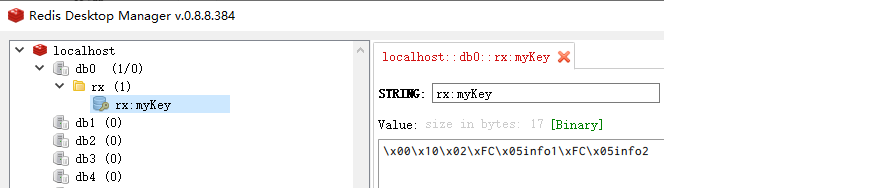

> https://blog.zhouinfo.site/2021/06/16/%E5%AD%A6%E4%B9%A0%E8%B5%84%E6%96%99-itcast%E5%93%81%E8%BE%BE%E9%80%9A%E7%94%A8%E6%9D%83%E9%99%90%E7%B3%BB%E7%BB%9F/

## 项目概述

### 项目介绍

对于企业中的项目绝大多数都需要进行用户权限管理、认证、鉴权、加密、解密、XSS防跨站攻击等。这些功能整体实现思路基本一致，但是大部分项目都需要实现一次，这无形中就形成了巨大的资源浪费。本项目就是针对这个问题，提供了一套通用的权限解决方案—-品达通用权限系统

品达通用权限系统基于SpringCloud(Hoxton.SR1) +SpringBoot(2.2.2.RELEASE) 的微服务框架，具备通用的用户管理、资源权限管理、网关统一鉴权、XSS防跨站攻击等多个模块，支持多业务系统并行开发，支持多服务并行开发，可以作为后端服务的开发脚手架。核心技术采用SpringBoot、Zuul、Nacos、Fegin、Ribbon、Hystrix、JWT Token、Mybatis Plus等主要框架和中间件

本项目具有两个主要功能特性：

- 用户权限管理：具有用户、部门、岗位、角色、菜单管理，并通过网关进行统一的权限认证
- 微服务开发框架：本项目同时也是一个微服务开发框架，集成了基础的公共组件，包括数据库、缓存、日志、表单验证、对象转换、防注入和接口文档管理等工具

### 业务架构


### 技术架构


### 环境要求

- JDK ： 1.8 +

- Maven： 3.3 +

  http://maven.apache.org/download.cgi

- Mysql： 5.6.0 +

  https://downloads.mysql.com/archives/community

- Redis： 4.0 +

  https://redis.io/download

- Nacos： 1.1.4

  https://github.com/alibaba/nacos/releases

- Node： 11.3+（集成npm）

  https://nodejs.org/en/download

## spring boot starter

我们知道Spring Boot大大简化了项目初始搭建以及开发过程，而这些都是通过Spring Boot提供的starter来完成的。品达通用权限系统就是基于Spring Boot进行开发，而且一些基础模块其本质就是starter，所以我们需要对Spring Boot的starter有一个全面深入的了解，这是我们开发品达通用权限系统的必备知识

### starter介绍

spring boot 在配置上相比spring要简单许多, 其核心在于spring-boot-starter, 在使用spring boot来搭建一个项目时, 只需要引入官方提供的starter, 就可以直接使用, 免去了各种配置。starter简单来讲就是引入了一些相关依赖和一些初始化的配置

Spring官方提供了很多starter，第三方也可以定义starter。为了加以区分，starter从名称上进行了如下规范：

- Spring官方提供的starter名称为：spring-boot-starter-xxx，例如Spring官方提供的spring-boot-starter-web
- 第三方提供的starter名称为：xxx-spring-boot-starter，例如由mybatis提供的mybatis-spring-boot-starter

### starter原理

Spring Boot之所以能够帮我们简化项目的搭建和开发过程，主要是基于它提供的起步依赖和自动配置

#### 起步依赖

起步依赖，其实就是将具备某种功能的坐标打包到一起，可以简化依赖导入的过程。例如，我们导入spring-boot-starter-web这个starter，则和web开发相关的jar包都一起导入到项目中了。如下图所示：


```markdown
# 就是jar的的集合体
```

#### 自动配置

```markdown
# 为什么web在导入之后就可以直接启动Tomcat并进行浏览器访问呢？主要是springboot进行了自动配置
```

自动配置，就是无须手动配置xml，自动配置并管理bean，可以简化开发过程。那么Spring Boot是如何完成自动配置的呢？

自动配置涉及到如下几个关键步骤：

-  基于Java代码的Bean配置（配置从哪里来）
-  自动配置条件依赖（配置生效的条件）
-  Bean参数获取（spring IOC在注入Bean的时候，这些Bean的参数需要先读取出来，才能供给spring ioc使用）
-  Bean的发现（Bean从哪里来，配置的spring.factories）
-  Bean的加载（交给spring ioc加载）

我们可以通过一个实际的例子mybatis-spring-boot-starter来说明自动配置的实现过程

##### 基于java代码的Bean配置

当我们在项目中导入了mybatis-spring-boot-starter这个jar后，可以看到它包括了很多相关的jar包，如下图：


其中它会依赖一些需要到的jar包


其中在mybatis-spring-boot-autoconfigure这个jar包中有如下一个**MybatisAutoConfiguration**自动配置类：


打开这个类，截取的关键代码如下：


**@Configuration**和**@Bean**这两个注解一起使用就可以创建一个基于java代码的配置类，可以用来替代传统的xml配置文件

- **@Configuration** 注解的类可以看作是能生产让Spring IoC容器管理的Bean实例的工厂

- **@Bean** 注解的方法返回的对象可以被注册到spring容器中

所以上面的**MybatisAutoConfiguration**这个类，自动帮我们生成了SqlSessionFactory和SqlSessionTemplate这些Mybatis的重要实例并交给spring容器管理，从而完成bean的自动注册

##### 自动配置条件依赖

从**MybatisAutoConfiguration**这个类中使用的注解可以看出，要完成自动配置是有依赖条件的


所以要完成Mybatis的自动配置，需要在类路径中存在SqlSessionFactory.class、SqlSessionFactoryBean.class这两个类，同时需要存在DataSource这个bean且这个bean完成自动注册

这些注解是spring boot特有的，常见的条件依赖注解有：

| 注解                            | 功能说明                                             |
| ------------------------------- | ---------------------------------------------------- |
| @ConditionalOnBean              | 仅在当前上下文中存在某个bean时，才会实例化这个Bean   |
| @ConditionalOnClass             | 某个class位于类路径上，才会实例化这个Bean            |
| @ConditionalOnExpression        | 当表达式为true的时候，才会实例化这个Bean             |
| @ConditionalOnMissingBean       | 仅在当前上下文中不存在某个bean时，才会实例化这个Bean |
| @ConditionalOnMissingClass      | 某个class在类路径上不存在的时候，才会实例化这个Bean  |
| @ConditionalOnNotWebApplication | 不是web应用时才会实例化这个Bean                      |
| @AutoConfigureAfter             | 在某个bean完成自动配置后实例化这个bean               |
| @AutoConfigureBefore            | 在某个bean完成自动配置前实例化这个bean               |

##### Bean参数获取

要完成mybatis的自动配置，需要我们在配置文件中提供数据源相关的配置参数，例如数据库驱动、连接url、数据库用户名、密码等。那么spring boot是如何读取yml或者properites配置文件的的属性来创建数据源对象的？

在我们导入mybatis-spring-boot-starter这个jar包后会传递过来一个spring-boot-autoconfigure包，在这个包中有一个自动配置类**DataSourceAutoConfiguration**，如下所示：


我们可以看到这个类上加入了**EnableConfigurationProperties**这个注解，继续跟踪源码到**DataSourceProperties**这个类，如下：


可以看到这个类上加入了**ConfigurationProperties**注解，这个注解的作用就是把yml或者properties配置文件中的配置参数信息封装到**ConfigurationProperties**注解标注的bean(即**DataSourceProperties**)的相应属性上

@**EnableConfigurationProperties**注解的作用是使@**ConfigurationProperties**注解生效

##### Bean的发现

我们需要从Spring Boot项目的启动类开始跟踪，在启动类上我们一般会加入SpringBootApplication注解，此注解的源码如下：


重点介绍如下三个注解：

- **SpringBootConfiguration**：作用就相当于**Configuration**注解，被注解的类将成为一个bean配置类

- **ComponentScan**：作用就是自动扫描并加载符合条件的组件，最终将这些bean加载到spring容器中

- **EnableAutoConfiguration** ：这个注解很重要，借助@**Import**的支持，收集和注册依赖包中相关的bean定义

继续跟踪**EnableAutoConfiguration**注解源码：


@**EnableAutoConfiguration**注解引入了@**Import**这个注解

**Import**：导入需要自动配置的组件，此处为**EnableAutoConfigurationImportSelector**这个类

**EnableAutoConfigurationImportSelector**类源码如下：


**EnableAutoConfigurationImportSelector**继承了**AutoConfigurationImportSelector**类，继续跟踪**AutoConfigurationImportSelector**类源码：


**AutoConfigurationImportSelector**类的getCandidateConfigurations方法中的调用了SpringFactoriesLoader类的loadFactoryNames方法，继续跟踪源码：


**SpringFactoriesLoader**的**loadFactoryNames**静态方法可以从所有的jar包中读取META-INF/spring.factories文件，而自动配置的类就在这个文件中进行配置：


spring.factories文件内容如下：


```markdown
# 2.2.2版本的已经是这样的了
```


这样Spring Boot就可以加载到**MybatisAutoConfiguration**这个配置类了

##### Bean的加载

在Spring Boot应用中要让一个普通类交给Spring容器管理，通常有以下方法：

1. 使用 @Configuration与@Bean 注解

2. 使用@Controller @Service @Repository @Component 注解标注该类并且启用@ComponentScan自动扫描

3. 使用@Import 方法

其中Spring Boot实现自动配置使用的是@Import注解这种方式，AutoConfigurationImportSelector类的selectImports方法返回一组从META-INF/spring.factories文件中读取的bean的全类名，这样Spring Boot就可以加载到这些Bean并完成实例的创建工作

#### 自动配置总结

我们可以将自动配置的关键几步以及相应的注解总结如下：

1. @Configuration与@Bean：基于Java代码的bean配置

2. @Conditional：设置自动配置条件依赖

3. @EnableConfigurationProperties与@ConfigurationProperties：读取配置文件转换为bean

4. @EnableAutoConfiguration与@Import：实现bean发现与加载

### 自定义starter

本小节我们通过自定义两个starter来加强starter的理解和应用

#### 案例一

##### 开发starter

1. 创建starter工程hello-spring-boot-starter并配置pom.xml文件

```xml
<?xml version="1.0" encoding="UTF-8"?>
<project xmlns="http://maven.apache.org/POM/4.0.0"
         xmlns:xsi="http://www.w3.org/2001/XMLSchema-instance"
         xsi:schemaLocation="http://maven.apache.org/POM/4.0.0 http://maven.apache.org/xsd/maven-4.0.0.xsd">
    <modelVersion>4.0.0</modelVersion>

    <parent>
        <groupId>org.springframework.boot</groupId>
        <artifactId>spring-boot-starter-parent</artifactId>
        <version>2.2.5.RELEASE</version>
    </parent>

    <groupId>com.example</groupId>
    <artifactId>hello-spring-boot-starter</artifactId>
    <version>1.0-SNAPSHOT</version>

    <properties>
        <maven.compiler.source>8</maven.compiler.source>
        <maven.compiler.target>8</maven.compiler.target>
    </properties>

    <dependencies>
        <dependency>
            <groupId>org.springframework.boot</groupId>
            <artifactId>spring-boot-starter</artifactId>
        </dependency>
        <dependency>
            <groupId>org.springframework.boot</groupId>
            <artifactId>spring-boot-autoconfigure</artifactId>
        </dependency>
    </dependencies>
</project>
```

2. 创建配置属性类HelloProperties

```java
package com.example.demo.config;

import org.springframework.boot.context.properties.ConfigurationProperties;

/**
 * 读取配置类转换为config
 */
@ConfigurationProperties(prefix = "hello")
public class HelloProperties {
    private String name;
    private String address;

    public String getName() {
        return name;
    }

    public void setName(String name) {
        this.name = name;
    }

    public String getAddress() {
        return address;
    }

    public void setAddress(String address) {
        this.address = address;
    }

    @Override
    public String toString() {
        return "HelloProperties{" +
                "name='" + name + '\'' +
                ", address='" + address + '\'' +
                '}';
    }
}
```

3. 创建服务类HelloService

```java
package com.example.demo.service;

public class HelloService {private String name;
    private String address;

    public HelloService(String name, String address) {
        this.name = name;
        this.address = address;
    }

    public String sayHello(){
        return "你好！我的名字叫 " + name + "，我来自 " + address;
    }
}
```

4. 创建自动配置类HelloServiceAutoConfiguration

```java
package com.example.demo.config;

import com.example.demo.service.HelloService;
import org.springframework.boot.autoconfigure.condition.ConditionalOnMissingBean;
import org.springframework.boot.context.properties.EnableConfigurationProperties;
import org.springframework.context.annotation.Bean;
import org.springframework.context.annotation.Configuration;

@Configuration
@EnableConfigurationProperties(HelloProperties.class)
public class HelloServiceAutoConfiguration {
    private HelloProperties helloProperties;

    //通过构造方法注入配置属性对象HelloProperties
    public HelloServiceAutoConfiguration(HelloProperties helloProperties) {
        this.helloProperties = helloProperties;
    }

    //实例化HelloService并载入Spring IoC容器
    @Bean
    @ConditionalOnMissingBean // 仅在当前上下文中不存在某个bean时，才会实例化这个Bean
    public HelloService helloService(){
        return new HelloService(helloProperties.getName(),helloProperties.getAddress());
    }
}
```

5. 在resources目录下创建META-INF/spring.factories

```properties
org.springframework.boot.autoconfigure.EnableAutoConfiguration=\
cn.example.demo.config.HelloServiceAutoConfiguration
```

至此starter已经开发完成了，可以将当前starter安装到本地maven仓库供其他应用来使用

```markdown
# 直接install
```


##### 使用starter

1. 创建maven工程myapp并配置pom.xml文件

```xml
<?xml version="1.0" encoding="UTF-8"?>
<project xmlns="http://maven.apache.org/POM/4.0.0"
         xmlns:xsi="http://www.w3.org/2001/XMLSchema-instance"
         xsi:schemaLocation="http://maven.apache.org/POM/4.0.0 http://maven.apache.org/xsd/maven-4.0.0.xsd">
    <modelVersion>4.0.0</modelVersion>

    <parent>
        <groupId>org.springframework.boot</groupId>
        <artifactId>spring-boot-starter-parent</artifactId>
        <version>2.2.5.RELEASE</version>
        <relativePath/>
    </parent>

    <groupId>org.example</groupId>
    <artifactId>myapp</artifactId>
    <version>1.0-SNAPSHOT</version>

    <properties>
        <maven.compiler.source>8</maven.compiler.source>
        <maven.compiler.target>8</maven.compiler.target>
    </properties>

    <dependencies>
        <dependency>
            <groupId>org.springframework.boot</groupId>
            <artifactId>spring-boot-starter-web</artifactId>
        </dependency>
        <dependency>
            <groupId>com.example</groupId>
            <artifactId>hello-spring-boot-starter</artifactId>
            <version>1.0-SNAPSHOT</version>
        </dependency>
    </dependencies>

</project>
```

2. 创建application.yml文件

```yaml
server:
  port: 8080
hello:
  name: xiaoming
  address: beijing
```

3. 创建HelloController

```java
package com.example.demo.controller;

import com.example.demo.service.HelloService;
import org.springframework.beans.factory.annotation.Autowired;
import org.springframework.web.bind.annotation.GetMapping;
import org.springframework.web.bind.annotation.RequestMapping;
import org.springframework.web.bind.annotation.RestController;

@RestController
@RequestMapping("/hello")
public class HelloController {
    //HelloService在我们自定义的starter中已经完成了自动配置，所以此处可以直接注入
    @Autowired
    private HelloService helloService;

    @GetMapping("/say")
    public String sayHello(){
        return helloService.sayHello();
    }
}
```

4. 创建启动类HelloApplication

```java
package com.example.demo;

import org.springframework.boot.SpringApplication;
import org.springframework.boot.autoconfigure.SpringBootApplication;

@SpringBootApplication
public class HelloApplication {
    public static void main(String[] args) {
        SpringApplication.run(HelloApplication.class, args);
    }
}
```

5. 执行启动类main方法，访问地址http://localhost:8080/hello/say


#### 案例二

在前面的案例一中我们通过定义starter，自动配置了一个HelloService实例。本案例我们需要通过自动配置来创建一个拦截器对象，通过此拦截器对象来实现记录日志功能

我们可以在案例一的基础上继续开发案例二

##### 开发starter

1. 在hello-spring-boot-starter的pom.xml文件中追加如下maven坐标

```xml
<?xml version="1.0" encoding="UTF-8"?>
<project xmlns="http://maven.apache.org/POM/4.0.0"
         xmlns:xsi="http://www.w3.org/2001/XMLSchema-instance"
         xsi:schemaLocation="http://maven.apache.org/POM/4.0.0 http://maven.apache.org/xsd/maven-4.0.0.xsd">
    <modelVersion>4.0.0</modelVersion>

    <parent>
        <groupId>org.springframework.boot</groupId>
        <artifactId>spring-boot-starter-parent</artifactId>
        <version>2.2.5.RELEASE</version>
    </parent>

    <groupId>com.example</groupId>
    <artifactId>hello-spring-boot-starter</artifactId>
    <version>1.0-SNAPSHOT</version>

    <properties>
        <maven.compiler.source>8</maven.compiler.source>
        <maven.compiler.target>8</maven.compiler.target>
    </properties>

    <dependencies>
        <dependency>
            <groupId>org.springframework.boot</groupId>
            <artifactId>spring-boot-starter</artifactId>
        </dependency>
        <dependency>
            <groupId>org.springframework.boot</groupId>
            <artifactId>spring-boot-autoconfigure</artifactId>
        </dependency>
        <dependency>
            <groupId>org.springframework.boot</groupId>
            <artifactId>spring-boot-configuration-processor</artifactId>
            <optional>true</optional>
        </dependency>

        <dependency>
            <groupId>org.springframework.boot</groupId>
            <artifactId>spring-boot-starter-web</artifactId>
            <optional>true</optional>
        </dependency>
    </dependencies>
</project>
```

2. 自定义MyLog注解

```java
package com.example.demo.log;

import java.lang.annotation.ElementType;
import java.lang.annotation.Retention;
import java.lang.annotation.RetentionPolicy;
import java.lang.annotation.Target;

@Target(ElementType.METHOD)
@Retention(RetentionPolicy.RUNTIME)
public @interface MyLog {
    /**
     * 方法描述
     */
    String desc() default "";
}
```

3. 自定义日志拦截器MyLogInterceptor

```java
package com.example.demo.log;

import org.springframework.web.method.HandlerMethod;
import org.springframework.web.servlet.ModelAndView;
import org.springframework.web.servlet.handler.HandlerInterceptorAdapter;

import javax.servlet.http.HttpServletRequest;
import javax.servlet.http.HttpServletResponse;
import java.lang.reflect.Method;

/**
 * 日志拦截器
 */
public class MyLogInterceptor extends HandlerInterceptorAdapter {
    // 给每一个线程创建一个独立的空间，存储方法开始的时间
    private static final ThreadLocal<Long> startTimeThreadLocal = new ThreadLocal<>();

    /**
     * 之前执行
     *
     * @param request
     * @param response
     * @param handler
     * @return
     * @throws Exception
     */
    @Override
    public boolean preHandle(HttpServletRequest request, HttpServletResponse response, Object handler) throws Exception {
        HandlerMethod handlerMethod = (HandlerMethod) handler;
        Method method = handlerMethod.getMethod();//获得被拦截的方法对象
        MyLog myLog = method.getAnnotation(MyLog.class);//获得方法上的注解
        if (myLog != null) {
            //方法上加了MyLog注解，需要进行日志记录
            long startTime = System.currentTimeMillis();
            startTimeThreadLocal.set(startTime);
        }
        return true;
    }

    @Override
    public void postHandle(HttpServletRequest request, HttpServletResponse response, Object handler, ModelAndView modelAndView) throws Exception {
        HandlerMethod handlerMethod = (HandlerMethod) handler;
        Method method = handlerMethod.getMethod();//获得被拦截的方法对象
        MyLog myLog = method.getAnnotation(MyLog.class);//获得方法上的注解
        if (myLog != null) {
            //方法上加了MyLog注解，需要进行日志记录
            long endTime = System.currentTimeMillis();
            Long startTime = startTimeThreadLocal.get();
            long optTime = endTime - startTime;

            String requestUri = request.getRequestURI();
            String methodName = method.getDeclaringClass().getName() + "." + method.getName();
            String methodDesc = myLog.desc();

            System.out.println("请求uri：" + requestUri);
            System.out.println("请求方法名：" + methodName);
            System.out.println("方法描述：" + methodDesc);
            System.out.println("方法执行时间：" + optTime + "ms");
        }
    }
}
```

4. 创建自动配置类MyLogAutoConfiguration，用于自动配置拦截器、参数解析器等web组件

```java
package com.example.demo.config;

import com.example.demo.log.MyLogInterceptor;
import org.springframework.context.annotation.Configuration;
import org.springframework.web.servlet.config.annotation.InterceptorRegistry;
import org.springframework.web.servlet.config.annotation.WebMvcConfigurer;

/**
 * 配置类，用于自动配置拦截器、参数解析器等web组件
 */
@Configuration
public class MyLogAutoConfiguration implements WebMvcConfigurer {
    /**
     * 注册自定义日志拦截器
     *
     * @param registry
     */
    @Override
    public void addInterceptors(InterceptorRegistry registry) {
        registry.addInterceptor(new MyLogInterceptor());
    }
}
```

5. 在spring.factories中追加MyLogAutoConfiguration配置

```properties
org.springframework.boot.autoconfigure.EnableAutoConfiguration=\
com.example.demo.config.HelloServiceAutoConfiguration,\
com.example.demo.config.MyLogAutoConfiguration
```

注意：我们在hello-spring-boot-starter中追加了新的内容，需要重新打包安装到maven仓库

##### 使用starter

1. 在myapp工程的Controller方法上加入@MyLog注解

```java
@RestController
@RequestMapping("/hello")
public class HelloController {
    //HelloService在我们自定义的starter中已经完成了自动配置，所以此处可以直接注入
    @Autowired
    private HelloService helloService;

    @GetMapping("/say")
    @MyLog(desc = "sayHello方法")
    public String sayHello(){
        return helloService.sayHello();
    }
}
```

2. 访问地址：http://localhost:8080/hello/say，查看控制台输出：

```bash
请求uri：/hello/say
请求方法名：com.example.demo.controller.HelloController.sayHello
方法描述：sayHello方法
方法执行时间：24ms
```

## lombok

### lombok介绍

lombok是一个开源的代码生成库，能以简单的注解形式来简化Java类中的大量样板代码，提高开发人员的开发效率。例如开发中经常需要写的javabean，都需要花时间去添加相应的getter/setter，也许还要去写构造器、equals等方法，而且需要维护，当属性多时会出现大量的getter/setter方法，这些显得很冗长也没有太多技术含量

lombok能通过注解的方式，在编译时自动为属性生成构造器、getter/setter、equals、hashcode、toString方法，使代码看起来更简洁

lombok对应的maven坐标：

```xml
<dependency>
    <groupId>org.projectlombok</groupId>
    <artifactId>lombok</artifactId>
    <version>1.18.10</version>
</dependency>
```

### 安装lombok插件

要使用lombok需要在IDE中安装对应的lombok插件。本课程使用的开发工具为IntelliJ IDEA，安装插件过程如下：

1. 打开IntelliJ IDEA后点击菜单栏中的File–>Settings进入到设置页面

2. 点击设置页面中的Plugins进行插件的安装，在右侧选择Browse repositories…，然后在搜索页面输入lombok，可以查询到下方的Lombok Plugin，鼠标点击Lombok Plugin可在右侧看到Install按钮，点击该按钮便可安装

### lombok常用注解

| 注解                     | 说明                                                         |
| ------------------------ | ------------------------------------------------------------ |
| @Setter                  | 注解在类或属性，注解在类时为所有属性生成setter方法，注解在属性上时只为该属性生成setter方法 |
| @Getter                  | 使用方法同@Setter，区别在于生成的是getter方法                |
| @ToString                | 注解在类，添加toString方法                                   |
| @EqualsAndHashCode       | 注解在类，生成hashCode和equals方法                           |
| @NoArgsConstructor       | 注解在类，生成无参的构造方法                                 |
| @RequiredArgsConstructor | 注解在类，为类中需要特殊处理的属性生成构造方法，比如final和被@NonNull注解的属性 |
| @AllArgsConstructor      | 注解在类，生成包含类中所有属性的构造方法                     |
| @Data                    | 注解在类，生成setter/getter、equals、canEqual、hashCode、toString方法，如为final属性，则不会为该属性生成setter方法 |
| @Slf4j                   | 注解在类，生成log变量，用于记录日志                          |
| @Builder                 | 将类转变为建造者模式                                         |

### lombok入门案例

```markdown
因为之前使用过lombok，所以就不自己在做入门案例了
```

1. 创建maven工程lombok_demo并配置pom.xml文件

```xml
<?xml version="1.0" encoding="UTF-8"?>
<project xmlns="http://maven.apache.org/POM/4.0.0"
         xmlns:xsi="http://www.w3.org/2001/XMLSchema-instance"
         xsi:schemaLocation="http://maven.apache.org/POM/4.0.0 http://maven.apache.org/xsd/maven-4.0.0.xsd">
    <modelVersion>4.0.0</modelVersion>
    <groupId>cn.itcast</groupId>
    <artifactId>lombok_demo</artifactId>
    <version>1.0-SNAPSHOT</version>
    <dependencies>
        <dependency>
            <groupId>org.projectlombok</groupId>
            <artifactId>lombok</artifactId>
            <version>1.18.10</version>
        </dependency>
    </dependencies>
</project>
```

2. 创建User类并加入lombok提供的注解

```java
package cn.itcast.entity;

import lombok.*;

@Data
@Builder
@NoArgsConstructor
@AllArgsConstructor
public class User {
    private int id;
    private String name;
    private int age;
}
```

3. 创建测试类TestLombok

```java
package cn.itcast;

import cn.itcast.entity.User;

public class TestLombok {
    public static void main(String[] args) {
        //无参构造方法
        User user1 = new User();

        /*
         setter方法
        */
        user1.setId(1);
        user1.setName("itcast");
        user1.setAge(18);

        /*
         getter方法
        */
        int id = user1.getId();
        String name = user1.getName();
        int age = user1.getAge();

        //带有所有参数的构造方法
        User user2 = new User(2,"itheima",20);

        //建造者模式
        User user3 = User.builder().id(3).name("boxuegu").age(22).build();

        /*
         toString方法
        */
        System.out.println(user1.toString());
        System.out.println(user2.toString());
        System.out.println(user3.toString());
    }
}
```

注：可以使用反编译工具查看生成的class文件内容

## 项目搭建

### 导入初始工程

鉴于时间关系，我们不再手动创建工程，而是直接从课程资料中提供的初始工程pinda-authority导入即可

导入步骤：

1. 将初始工程pinda-authority复制到任意没有中文和空格的目录下

2. 打开IDEA，选择Open，选择pinda-authority工程目录即可

导入的项目结构如下：


### 项目模块介绍

品达通用权限系统项目整体工程结构和模块功能如下：

```
pinda-authority              #聚合工程，用于聚合pd-parent、pd-apps、pd-tools等模块
├── pd-parent				 # 父工程，nacos配置及依赖包管理
├── pd-apps					 # 应用目录
	├── pd-auth				 # 权限服务父工程
		├── pd-auth-entity   # 权限实体
		├── pa-auth-server   # 权限服务
	├── pd-gateway			 # 网关服务
└── pd-tools				 # 工具工程
	├── pd-tools-common		 # 基础组件：基础配置类、函数、常量、统一异常处理、undertow服务器
	├── pd-tools-core		 # 核心组件：基础实体、返回对象、上下文、异常处理、分布式锁、函数、树
	├── pd-tools-databases	 # 数据源组件：数据源配置、数据权限、查询条件等
	├── pd-tools-dozer		 # 对象转换：dozer配置、工具
	├── pd-tools-j2cache	 # 缓存组件：j2cache、redis缓存
	├── pd-tools-jwt         # JWT组件：配置、属性、工具
	├── pd-tools-log	     # 日志组件：日志实体、事件、拦截器、工具
	├── pd-tools-swagger2	 # 文档组件：knife4j文档
	├── pd-tools-user        # 用户上下文：用户注解、模型和工具，当前登录用户信息注入模块
	├── pd-tools-validator	 # 表单验证： 后台表单规则验证
	├── pd-tools-xss		 # xss防注入组件
```

项目服务有两个：网关服务和权限服务：

| 应用           | 端口 | 说明     | 启动命令                       |
| -------------- | ---- | -------- | ------------------------------ |
| pd-gateway     | 8760 | 网关服务 | java -jar pd-gateway.jar &     |
| pd-auth-server | 8764 | 权限服务 | java -jar pd-auth-server.jar & |

由于本系统是基于当前非常流行的前后端分离开发方式开发，其中前端部分是由专门的前端开发人员负责，我们课程中直接使用即可

### 服务注册中心

```markdown
# 单机版不使用数据库的的nacos可以参考springcloud基础中的章节
```

> 本项目使用Nacos来作为服务的注册和配置中心。Nacos是阿里巴巴开源的一款支持服务注册与发现，配置管理以及微服务管理的组件。用来取代以前常用的注册中心（zookeeper , eureka等等），以及配置中心（spring cloud config等等）。Nacos是集成了注册中心和配置中心的功能，做到了二合一
>
> 安装和配置过程如下：
>
> 第一步：下载Nacos安装包，地址https://github.com/alibaba/nacos/releases/download/1.1.4/nacos-server-1.1.4.zip
>
> 第二步：将下载的zip压缩文件解压
>
> 第三步：修改配置文件：NACOS_HOME/conf/application.properties
>
> ```properties
> spring.datasource.platform=mysql
> db.num=1
> db.url.0=jdbc:mysql://127.0.0.1:3306/nacos?characterEncoding=utf8&connectTimeout=1000&socketTimeout=3000&autoReconnect=true
> db.user=root
> db.password=root
> ```
>
> 注意：Nacos在存储数据时既可以使用内置数据库存储，也可以通过第三方指定的数据库存储。我们上面指定了使用MySQL数据库来存储Nacos的相关数据，所以需要配置我们使用的MySQL数据库的数据源信息，这个可以根据自己的MySQL数据库进行相应调整，例如MySQL的地址、用户名、密码等
>
> 第四步：创建数据库
>
> ```sql
> CREATE DATABASE `nacos` CHARACTER SET utf8mb4 COLLATE utf8mb4_general_ci;
> ```
>
> 第五步：执行NACOS_HOME/conf/nacos-mysql.sql数据库脚本文件，完成后可以看到创建了如下表
>
> 
>
> 第六步：启动Nacos服务，双击NACOS_HOME/bin/startup.cmd
>
> 第七步：访问Nacos控制台，地址http://localhost:8848/nacos，默认用户名/密码：nacos/nacos
>
> 第八步：新建命名空间pinda-dev，
>
> 
>
> **注意**，命名空间的id需要替换到项目文件**pd-parent/pom.xml**中对应的nacos命名空间的id：
>
> 
>
> 第九步：导入配置文件，选择nacos配置中心的命名空间，点击导入配置按钮，选择文件：docs/nacos/nacos_config_export_2020-03-23 17_31_42.zip。导入完成后如下：
>
> 

### Redis

```markdown
# 可以直接参考redis文章
```

> 在项目开发阶段我们使用windows版的Redis，直接解压授课资料中redis-win32-win64.zip压缩文件，然后双击REDIS_HOME/64bit/redis-server.exe启动Redis服务即可使用

### 开发方式介绍

通过前面导入的初始项目可以看到，pd-tools工程中的各个子模块已经完成了开发，这些子模块属于项目的基础组件，为我们后续开发网关服务和权限服务提供支持，而且有一些子模块在其他项目中也可以复用

由于这些子模块会涉及到一些新技术或者框架，所以本课程会先讲解这些新技术或者框架的使用方法，然后再带领大家通读pd-tools中的相关模块的代码实现，从而了解此模块的作用和开发过程

本课程会按照如下顺序介绍pd-tools中的各个模块：

-  pd-tools-swagger2 # 文档组件：knife4j文档
-  pd-tools-common # 基础组件：基础配置类、函数、常量、统一异常处理、undertow服务器
-  pd-tools-core # 核心组件：基础实体、返回对象、上下文、异常处理、分布式锁、函数、树
-  pd-tools-databases # 数据源组件：数据源配置、数据权限、查询条件等
-  pd-tools-dozer # 对象转换：dozer配置、工具
-  pd-tools-j2cache # 缓存组件：j2cache、redis缓存
-  pd-tools-jwt # JWT组件：配置、属性、工具
-  pd-tools-log # 日志组件：日志实体、事件、拦截器、工具
-  pd-tools-user # 用户上下文：用户注解、模型和工具，当前登录用户信息注入模块
-  pd-tools-validator # 表单验证： 后台表单规则验证
-  pd-tools-xss # xss防注入组件

学习完这些模块之后就可以开发后面的网关服务和权限服务了

## pd-tools-swagger2

pd-tools-swagger2模块定位为文档组件，前后端开发人员可以查看接口文档，为前后端开发人员的开发统一接口，方便后续的前后端联调对接工作

### swagger介绍

相信无论是前端还是后端开发，都或多或少地被接口文档折磨过。前端经常抱怨后端给的接口文档与实际情况不一致。后端又觉得编写及维护接口文档会耗费不少精力，经常来不及更新。其实无论是前端调用后端，还是后端调用后端，都期望有一个好的接口文档。但是这个接口文档对于程序员来说，就跟注释一样，经常会抱怨别人写的代码没有写注释，然而自己写起代码起来，最讨厌的，也是写注释。所以仅仅只通过强制来规范大家是不够的，随着时间推移，版本迭代，接口文档往往很容易就跟不上代码了

使用Swagger你只需要按照它的规范去定义接口及接口相关的信息。再通过Swagger衍生出来的一系列项目和工具，就可以做到生成各种格式的接口文档，生成多种语言的客户端和服务端的代码，以及在线接口调试页面等等。这样，如果按照新的开发模式，在开发新版本或者迭代版本的时候，只需要更新Swagger描述文件，就可以自动生成接口文档和客户端服务端代码，做到调用端代码、服务端代码以及接口文档的一致性

为了简化swagger的使用，Spring框架对swagger进行了整合，建立了Spring-swagger项目，后面改成了现在的Springfox。通过在项目中引入Springfox，可以扫描相关的代码，生成描述文件，进而生成与代码一致的接口文档和客户端代码

Springfox对应的maven坐标如下：

```xml
<dependency>
    <groupId>io.springfox</groupId>
    <artifactId>springfox-swagger-ui</artifactId>
    <version>2.9.2</version>
</dependency>
<dependency>
    <groupId>io.springfox</groupId>
    <artifactId>springfox-swagger2</artifactId>
    <version>2.9.2</version>
</dependency>
```

### swagger常用注解

| 注解               | 说明                                                     |
| ------------------ | -------------------------------------------------------- |
| @Api               | 用在请求的类上，例如Controller，表示对类的说明           |
| @ApiModel          | 用在类上，通常是实体类，表示一个返回响应数据的信息       |
| @ApiModelProperty  | 用在属性上，描述响应类的属性                             |
| @ApiOperation      | 用在请求的方法上，说明方法的用途、作用                   |
| @ApiImplicitParams | 用在请求的方法上，表示一组参数说明                       |
| @ApiImplicitParam  | 用在@ApiImplicitParams注解中，指定一个请求参数的各个方面 |

### swagger入门案例

1. 创建maven工程swagger_demo并配置pom.xml文件

```xml
<?xml version="1.0" encoding="UTF-8"?>
<project xmlns="http://maven.apache.org/POM/4.0.0"
         xmlns:xsi="http://www.w3.org/2001/XMLSchema-instance"
         xsi:schemaLocation="http://maven.apache.org/POM/4.0.0 http://maven.apache.org/xsd/maven-4.0.0.xsd">
    <modelVersion>4.0.0</modelVersion>

    <parent>
        <artifactId>spring-boot-starter-parent</artifactId>
        <groupId>org.springframework.boot</groupId>
        <version>2.2.5.RELEASE</version>
    </parent>

    <groupId>com.demo.swagger</groupId>
    <artifactId>swagger_demo</artifactId>
    <version>1.0-SNAPSHOT</version>

    <properties>
        <maven.compiler.source>8</maven.compiler.source>
        <maven.compiler.target>8</maven.compiler.target>
    </properties>

    <dependencies>
        <dependency>
            <groupId>org.springframework.boot</groupId>
            <artifactId>spring-boot-starter-web</artifactId>
        </dependency>
        <dependency>
            <groupId>io.springfox</groupId>
            <artifactId>springfox-swagger-ui</artifactId>
            <version>2.9.2</version>
        </dependency>
        <dependency>
            <groupId>io.springfox</groupId>
            <artifactId>springfox-swagger2</artifactId>
            <version>2.9.2</version>
        </dependency>
        <dependency>
            <groupId>org.projectlombok</groupId>
            <artifactId>lombok</artifactId>
        </dependency>
    </dependencies>

</project>
```

2. 创建application.yml文件

```
server:
  port: 9000
```

3. 创建实体类User和Menu

```java
package com.demo.swagger.entity;

import io.swagger.annotations.ApiModel;
import io.swagger.annotations.ApiModelProperty;
import lombok.Data;

@Data
@ApiModel(description = "用户实体")
public class User {
    @ApiModelProperty(value = "主键")
    private int id;

    @ApiModelProperty(value = "姓名")
    private String name;

    @ApiModelProperty(value = "年龄")
    private int age;

    @ApiModelProperty(value = "地址")
    private String address;
}
```

```java
package com.demo.swagger.entity;

import io.swagger.annotations.ApiModel;
import io.swagger.annotations.ApiModelProperty;
import lombok.Data;

@Data
@ApiModel
public class Menu {
    @ApiModelProperty(value = "主键")
    private int id;
    
    @ApiModelProperty(value = "菜单名称")
    private String name;
}
```

4. 创建UserController和MenuController

```java
package com.demo.swagger.controller.user;

import com.demo.swagger.entity.User;
import io.swagger.annotations.Api;
import io.swagger.annotations.ApiImplicitParam;
import io.swagger.annotations.ApiImplicitParams;
import io.swagger.annotations.ApiOperation;
import org.springframework.web.bind.annotation.*;

import java.util.ArrayList;
import java.util.List;

@RestController
@RequestMapping(value = "/user")
@Api(tags = "用户控制器")
public class UserController {
    @GetMapping(value = "/getUsers")
    @ApiOperation(value = "查询所有用户", notes = "查询所有用户信息")
    public List<User> getAllUsers() {
        final User user = new User();
        user.setId(100);
        user.setName("张三");
        user.setAge(18);
        user.setAddress("北京");
        final ArrayList<User> users = new ArrayList<>();
        users.add(user);
        return users;
    }

    @PostMapping("/save")
    @ApiOperation(value = "新增用户", notes = "新增用户信息")
    public String save(@RequestBody User user) {
        return "OK";
    }

    @PutMapping("/update")
    @ApiOperation(value = "修改用户", notes = "修改用户信息")
    public String update(@RequestBody User user) {
        return "OK";
    }

    @DeleteMapping("/delete")
    @ApiOperation(value = "删除用户", notes = "删除用户信息")
    public String delete(int id) {
        return "OK";
    }

    @ApiImplicitParams({
            @ApiImplicitParam(name = "pageNum", value = "页码",
                    required = true, type = "Integer"),
            @ApiImplicitParam(name = "pageSize", value = "每页条数",
                    required = true, type = "Integer"),
    })
    @ApiOperation(value = "分页查询用户信息")
    @GetMapping(value = "page/{pageNum}/{pageSize}")
    public String findByPage(@PathVariable Integer pageNum,
                             @PathVariable Integer pageSize) {
        return "OK";
    }
}
```

```java
package com.demo.swagger.controller.menu;
import com.demo.swagger.entity.Menu;
import io.swagger.annotations.Api;
import io.swagger.annotations.ApiImplicitParam;
import io.swagger.annotations.ApiImplicitParams;
import io.swagger.annotations.ApiOperation;
import org.springframework.web.bind.annotation.*;
import java.util.ArrayList;
import java.util.List;

@RestController
@RequestMapping("/menu")
@Api(tags = "菜单控制器")
public class MenuController {
    @GetMapping("/getMenus")
    @ApiOperation(value = "查询所有菜单", notes = "查询所有菜单信息")
    public List<Menu> getMenus(){
        Menu menu = new Menu();
        menu.setId(100);
        menu.setName("itcast");
        List<Menu> list = new ArrayList<>();
        list.add(menu);
        return list;
    }

    @PostMapping("/save")
    @ApiOperation(value = "新增菜单", notes = "新增菜单信息")
    public String save(@RequestBody Menu menu){
        return "OK";
    }

    @PutMapping("/update")
    @ApiOperation(value = "修改菜单", notes = "修改菜单信息")
    public String update(@RequestBody Menu menu){
        return "OK";
    }

    @DeleteMapping("/delete")
    @ApiOperation(value = "删除菜单", notes = "删除菜单信息")
    public String delete(int id){
        return "OK";
    }

    @ApiImplicitParams({
            @ApiImplicitParam(name = "pageNum", value = "页码",
                    required = true, type = "Integer"),
            @ApiImplicitParam(name = "pageSize", value = "每页条数",
                    required = true, type = "Integer"),
    })
    @ApiOperation(value = "分页查询菜单信息")
    @GetMapping(value = "page/{pageNum}/{pageSize}")
    public String findByPage(@PathVariable Integer pageNum,
                             @PathVariable Integer pageSize) {
        return "OK";
    }
}
```

5. 创建配置类SwaggerAutoConfiguration

```java
package com.demo.swagger.config;

import org.springframework.context.annotation.Bean;
import org.springframework.context.annotation.Configuration;
import springfox.documentation.builders.ApiInfoBuilder;
import springfox.documentation.builders.RequestHandlerSelectors;
import springfox.documentation.service.ApiInfo;
import springfox.documentation.service.Contact;
import springfox.documentation.spi.DocumentationType;
import springfox.documentation.spring.web.plugins.Docket;
import springfox.documentation.swagger2.annotations.EnableSwagger2;

@Configuration
@EnableSwagger2
public class SwaggerAutoConfiguration {
    @Bean
    public Docket createRestApi1() {
        final Docket docket = new Docket(DocumentationType.SWAGGER_2)
                .apiInfo(apiInfo()).groupName("用户接口组")
                .select()
                // 为当前路径
                .apis(RequestHandlerSelectors.basePackage("com.demo.swagger.controller.user"))
                .build();
        return docket;
    }

    @Bean
    public Docket createRestApi2() {
        Docket docket = new Docket(DocumentationType.SWAGGER_2)
                .apiInfo(apiInfo()).groupName("菜单接口组")
                .select()
                //为当前包路径
                .apis(RequestHandlerSelectors.basePackage("com.demo.swagger.controller.menu"))
                .build();
        return docket;
    }

    //构建 api文档的详细信息
    private ApiInfo apiInfo() {
        return new ApiInfoBuilder()
                //页面标题
                .title("API接口文档")
                //创建人
                .contact(new Contact("alden", "http://www.github.com", ""))
                //版本号
                .version("1.0")
                //描述
                .description("API 描述")
                .build();
    }
}
```

6. 创建启动类SwaggerDemoApplication

```java
package com.demo.swagger;

import org.springframework.boot.SpringApplication;
import org.springframework.boot.autoconfigure.SpringBootApplication;

@SpringBootApplication
public class SwaggerDemoApplication {
    public static void main(String[] args) {
        SpringApplication.run(SwaggerDemoApplication.class, args);
    }
}
```

7. 执行启动类main方法启动项目，访问地址：http://localhost:9000/swagger-ui.html


### knife4j介绍

knife4j是为Java MVC框架集成Swagger生成Api文档的增强解决方案,前身是swagger-bootstrap-ui,取名knife4j是希望它能像一把匕首一样小巧,轻量,并且功能强悍!其底层是对Springfox的封装，使用方式也和Springfox一致，只是对接口文档UI进行了优化

**核心功能**：

- **文档说明**：根据Swagger的规范说明，详细列出接口文档的说明，包括接口地址、类型、请求示例、请求参数、响应示例、响应参数、响应码等信息，对该接口的使用情况一目了然
- **在线调试**：提供在线接口联调的强大功能，自动解析当前接口参数,同时包含表单验证，调用参数可返回接口响应内容、headers、响应时间、响应状态码等信息，帮助开发者在线调试

### knife4j入门案例

1. 创建maven工程knife4j_demo并配置pom.xml文件

```xml
<?xml version="1.0" encoding="UTF-8"?>
<project xmlns="http://maven.apache.org/POM/4.0.0"
         xmlns:xsi="http://www.w3.org/2001/XMLSchema-instance"
         xsi:schemaLocation="http://maven.apache.org/POM/4.0.0 http://maven.apache.org/xsd/maven-4.0.0.xsd">
    <modelVersion>4.0.0</modelVersion>

    <parent>
        <groupId>org.springframework.boot</groupId>
        <artifactId>spring-boot-starter-parent</artifactId>
        <version>2.2.5.RELEASE</version>
    </parent>

    <groupId>com.demo.knife4j</groupId>
    <artifactId>knife4j_demo</artifactId>
    <version>1.0-SNAPSHOT</version>

    <properties>
        <maven.compiler.source>8</maven.compiler.source>
        <maven.compiler.target>8</maven.compiler.target>
    </properties>

    <dependencies>
        <dependency>
            <groupId>org.springframework.boot</groupId>
            <artifactId>spring-boot-starter-web</artifactId>
        </dependency>
        <dependency>
            <groupId>com.github.xiaoymin</groupId>
            <artifactId>knife4j-spring-boot-starter</artifactId>
            <version>2.0.1</version>
        </dependency>
        <dependency>
            <groupId>org.projectlombok</groupId>
            <artifactId>lombok</artifactId>
        </dependency>
    </dependencies>

</project>
```

2. 创建实体类User和Menu

```java
package com.demo.knife4j.entity;

import io.swagger.annotations.ApiModel;
import io.swagger.annotations.ApiModelProperty;
import lombok.Data;

@Data
@ApiModel(description = "用户实体")
public class User {
    @ApiModelProperty(value = "主键")
    private int id;
    @ApiModelProperty(value = "姓名")
    private String name;
    @ApiModelProperty(value = "年龄")
    private int age;
    @ApiModelProperty(value = "地址")
    private String address;
}
```

```java
package com.demo.knife4j.entity;

import io.swagger.annotations.ApiModel;
import io.swagger.annotations.ApiModelProperty;
import lombok.Data;

@Data
@ApiModel(description = "菜单实体")
public class Menu {
    @ApiModelProperty(value = "主键")
    private int id;
    @ApiModelProperty(value = "菜单名称")
    private String name;
}
```

3. 创建UserController和MenuController

```java
package com.demo.knife4j.controller.user;

import com.demo.knife4j.entity.User;
import io.swagger.annotations.Api;
import io.swagger.annotations.ApiImplicitParam;
import io.swagger.annotations.ApiImplicitParams;
import io.swagger.annotations.ApiOperation;
import org.springframework.web.bind.annotation.*;

import java.util.ArrayList;
import java.util.List;

@RestController
@RequestMapping("/user")
@Api(tags = "用户控制器")
public class UserController {
    @GetMapping("/getUsers")
    @ApiOperation(value = "查询所有用户", notes = "查询所有用户信息")
    public List<User> getAllUsers() {
        User user = new User();
        user.setId(100);
        user.setName("itcast");
        user.setAge(20);
        user.setAddress("bj");
        List<User> list = new ArrayList<>();
        list.add(user);
        return list;
    }

    @PostMapping("/save")
    @ApiOperation(value = "新增用户", notes = "新增用户信息")
    public String save(@RequestBody User user) {
        return "OK";
    }

    @PutMapping("/update")
    @ApiOperation(value = "修改用户", notes = "修改用户信息")
    public String update(@RequestBody User user) {
        return "OK";
    }

    @DeleteMapping("/delete")
    @ApiOperation(value = "删除用户", notes = "删除用户信息")
    public String delete(int id) {
        return "OK";
    }

    @ApiImplicitParams({
            @ApiImplicitParam(name = "pageNum", value = "页码",
                    required = true, type = "Integer"),
            @ApiImplicitParam(name = "pageSize", value = "每页条数",
                    required = true, type = "Integer"),
    })
    @ApiOperation(value = "分页查询用户信息")
    @GetMapping(value = "page/{pageNum}/{pageSize}")
    public String findByPage(@PathVariable Integer pageNum,
                             @PathVariable Integer pageSize) {
        return "OK";
    }
}
```

```java
package com.demo.knife4j.controller.menu;

import com.demo.knife4j.entity.Menu;
import io.swagger.annotations.Api;
import io.swagger.annotations.ApiImplicitParam;
import io.swagger.annotations.ApiImplicitParams;
import io.swagger.annotations.ApiOperation;
import org.springframework.web.bind.annotation.*;

import java.util.ArrayList;
import java.util.List;

@RestController
@RequestMapping("/menu")
@Api(tags = "菜单控制器")
public class MenuController {
    @GetMapping("/getMenus")
    @ApiOperation(value = "查询所有菜单", notes = "查询所有菜单信息")
    public List<Menu> getMenus() {
        Menu menu = new Menu();
        menu.setId(100);
        menu.setName("itcast");
        List<Menu> list = new ArrayList<>();
        list.add(menu);
        return list;
    }

    @PostMapping("/save")
    @ApiOperation(value = "新增菜单", notes = "新增菜单信息")
    public String save(@RequestBody Menu menu) {
        return "OK";
    }

    @PutMapping("/update")
    @ApiOperation(value = "修改菜单", notes = "修改菜单信息")
    public String update(@RequestBody Menu menu) {
        return "OK";
    }

    @DeleteMapping("/delete")
    @ApiOperation(value = "删除菜单", notes = "删除菜单信息")
    public String delete(int id) {
        return "OK";
    }

    @ApiImplicitParams({
            @ApiImplicitParam(name = "pageNum", value = "页码",
                    required = true, type = "Integer"),
            @ApiImplicitParam(name = "pageSize", value = "每页条数",
                    required = true, type = "Integer"),
    })
    @ApiOperation(value = "分页查询菜单信息")
    @GetMapping(value = "page/{pageNum}/{pageSize}")
    public String findByPage(@PathVariable Integer pageNum,
                             @PathVariable Integer pageSize) {
        return "OK";
    }
}
```

4. 创建配置属性类SwaggerProperties

```java
package com.demo.knife4j.config;


import lombok.Data;
import org.springframework.boot.context.properties.ConfigurationProperties;

import java.util.ArrayList;
import java.util.LinkedHashMap;
import java.util.List;
import java.util.Map;

/**
 * 配置属性类，用于封装接口文档相关属性，从配置文件读取信息封装成当前对象
 */
@Data
@ConfigurationProperties(prefix = "pinda.swagger")
public class SwaggerProperties {
    private String title = "在线文档"; //标题
    private String group = ""; //自定义组名
    private String description = "在线文档"; //描述
    private String version = "1.0"; //版本
    private Contact contact = new Contact(); //联系人
    private String basePackage = "com.demo.knife4j"; //swagger会解析的包路径
    private List<String> basePath = new ArrayList<>(); //swagger会解析的url规则
    private List<String> excludePath = new ArrayList<>();//在basePath基础上需要排除的url规则
    private Map<String, DocketInfo> docket = new LinkedHashMap<>(); //分组文档

    public String getGroup() {
        if (group == null || "".equals(group)) {
            return title;
        }
        return group;
    }

    @Data
    public static class DocketInfo {
        private String title = "在线文档"; //标题
        private String group = ""; //自定义组名
        private String description = "在线文档"; //描述
        private String version = "1.0"; //版本
        private Contact contact = new Contact(); //联系人
        private String basePackage = ""; //swagger会解析的包路径
        private List<String> basePath = new ArrayList<>(); //swagger会解析的url规则
        private List<String> excludePath = new ArrayList<>();//在basePath基础上需要排除的url

        public String getGroup() {
            if (group == null || "".equals(group)) {
                return title;
            }
            return group;
        }
    }

    @Data
    public static class Contact {
        private String name = "pinda"; //联系人
        private String url = ""; //联系人url
        private String email = ""; //联系人email
    }
}
```

5. 创建application.yml文件

```yaml
server:
  port: 7788
pinda:
  swagger:
    enabled: true #是否启用swagger
    docket:
      user:
        title: 用户模块
        base-package: com.demo.knife4j.controller.user
      menu:
        title: 菜单模块
        base-package: com.demo.knife4j.controller.menu
```

6. 创建配置类SwaggerAutoConfiguration

```java
package com.demo.knife4j.config;

import com.google.common.base.Predicate;
import com.google.common.base.Predicates;
import org.springframework.beans.BeansException;
import org.springframework.beans.factory.BeanFactory;
import org.springframework.beans.factory.BeanFactoryAware;
import org.springframework.beans.factory.annotation.Autowired;
import org.springframework.beans.factory.config.ConfigurableBeanFactory;
import org.springframework.boot.autoconfigure.condition.ConditionalOnMissingBean;
import org.springframework.boot.autoconfigure.condition.ConditionalOnProperty;
import org.springframework.boot.context.properties.EnableConfigurationProperties;
import org.springframework.context.annotation.Bean;
import org.springframework.context.annotation.Configuration;
import springfox.documentation.builders.ApiInfoBuilder;
import springfox.documentation.builders.PathSelectors;
import springfox.documentation.builders.RequestHandlerSelectors;
import springfox.documentation.service.ApiInfo;
import springfox.documentation.service.Contact;
import springfox.documentation.spi.DocumentationType;
import springfox.documentation.spring.web.plugins.Docket;
import springfox.documentation.swagger2.annotations.EnableSwagger2;

import java.util.ArrayList;
import java.util.LinkedList;
import java.util.List;

@Configuration
@ConditionalOnProperty(name = "pinda.swagger.enabled", havingValue = "true",
        matchIfMissing = true)
@EnableSwagger2
@EnableConfigurationProperties(SwaggerProperties.class)
public class SwaggerAutoConfiguration implements BeanFactoryAware {
    @Autowired
    SwaggerProperties swaggerProperties;
    private BeanFactory beanFactory;

    @Bean
    @ConditionalOnMissingBean
    public List<Docket> createRestApi() {
        ConfigurableBeanFactory configurableBeanFactory = (ConfigurableBeanFactory) beanFactory;
        List<Docket> docketList = new LinkedList<>();
        // 没有分组
        if (swaggerProperties.getDocket().isEmpty()) {
            Docket docket = createDocket(swaggerProperties);
            configurableBeanFactory.registerSingleton(swaggerProperties.getTitle(), docket);
            docketList.add(docket);
            return docketList;
        }
        // 分组创建
        for (String groupName : swaggerProperties.getDocket().keySet()) {
            SwaggerProperties.DocketInfo docketInfo = swaggerProperties.getDocket().get(groupName);
            ApiInfo apiInfo = new ApiInfoBuilder()
                    //页面标题
                    .title(docketInfo.getTitle())
                    //创建人
                    .contact(new Contact(docketInfo.getContact().getName(),
                            docketInfo.getContact().getUrl(),
                            docketInfo.getContact().getEmail()))
                    //版本号
                    .version(docketInfo.getVersion())
                    //描述
                    .description(docketInfo.getDescription())
                    .build();

            // base-path处理
            // 当没有配置任何path的时候，解析/**
            if (docketInfo.getBasePath().isEmpty()) {
                docketInfo.getBasePath().add("/**");
            }
            List<Predicate<String>> basePath = new ArrayList<>();
            for (String path : docketInfo.getBasePath()) {
                basePath.add(PathSelectors.ant(path));
            }

            // exclude-path处理
            List<Predicate<String>> excludePath = new ArrayList<>();
            for (String path : docketInfo.getExcludePath()) {
                excludePath.add(PathSelectors.ant(path));
            }

            Docket docket = new Docket(DocumentationType.SWAGGER_2)
                    .apiInfo(apiInfo)
                    .groupName(docketInfo.getGroup())
                    .select()
                    //为当前包路径
                    .apis(RequestHandlerSelectors.basePackage(docketInfo.getBasePackage()))
                    .paths(Predicates.and(Predicates.not(Predicates.or(excludePath)), Predicates.or(basePath)))
                    .build();
            configurableBeanFactory.registerSingleton(groupName, docket);
            docketList.add(docket);
        }
        return docketList;
    }

    //构建 api文档的详细信息
    private ApiInfo apiInfo(SwaggerProperties swaggerProperties) {
        return new ApiInfoBuilder()
                //页面标题
                .title(swaggerProperties.getTitle())
                //创建人
                .contact(new Contact(swaggerProperties.getContact().getName(),
                        swaggerProperties.getContact().getUrl(),
                        swaggerProperties.getContact().getEmail()))
                //版本号
                .version(swaggerProperties.getVersion())
                //描述
                .description(swaggerProperties.getDescription())
                .build();
    }

    //创建接口文档对象
    private Docket createDocket(SwaggerProperties swaggerProperties) {
        //API 基础信息
        ApiInfo apiInfo = apiInfo(swaggerProperties);

        // base-path处理
        // 当没有配置任何path的时候，解析/**
        if (swaggerProperties.getBasePath().isEmpty()) {
            swaggerProperties.getBasePath().add("/**");
        }
        List<Predicate<String>> basePath = new ArrayList<>();
        for (String path : swaggerProperties.getBasePath()) {
            basePath.add(PathSelectors.ant(path));
        }

        // exclude-path处理
        List<Predicate<String>> excludePath = new ArrayList<>();
        for (String path : swaggerProperties.getExcludePath()) {
            excludePath.add(PathSelectors.ant(path));
        }

        return new Docket(DocumentationType.SWAGGER_2)
                .apiInfo(apiInfo)
                .groupName(swaggerProperties.getGroup())
                .select()
                .apis(RequestHandlerSelectors.basePackage(swaggerProperties.getBasePackage()))
                .paths(Predicates.and(Predicates.not(Predicates.or(excludePath)), Predicates.or(basePath)))
                .build();
    }

    @Override
    public void setBeanFactory(BeanFactory beanFactory) throws BeansException {
        this.beanFactory = beanFactory;
    }
}
```

7. 创建启动类Knife4jDemoApplication

```java
package com.demo.knife4j;

import org.springframework.boot.SpringApplication;
import org.springframework.boot.autoconfigure.SpringBootApplication;

@SpringBootApplication
public class Knife4jDemoApplication {
    public static void main(String[] args) {
        SpringApplication.run(Knife4jDemoApplication.class, args);
    }
}
```

8. 执行启动类main方法启动项目，访问地址：http://localhost:7788/doc.html


9. 如果接口文档不分组，我们可以修改application.yml文件

```yaml
server:
  port: 7788
pinda:
  swagger:
    enabled: true #是否启用swagger
    title: test模块
    base-package: com.demo.knife4j.controller
```

10. 再次访问地址：http://localhost:7788/doc.html


可以看到所有的接口在一个分组中

### pd-tools-swagger2使用

通过上面的入门案例我们已经完成了接口文档的相关开发，而pd-tools-swagger2模块就是使用这种方式开发的，并且按照Spring boot starter的规范在/resources/META-INF中提供spring.factories文件，内容如下：

```properties
org.springframework.boot.autoconfigure.EnableAutoConfiguration=\
    com.itheima.pinda.swagger2.SwaggerAutoConfiguration
```

这样我们在其他模块中如果需要使用swagger接口文档功能，只需要引入这个starter并且在application.yml中进行swagger的相关配置即可，例如：

```yaml
pinda:
  swagger:
    enabled: true #是否启用swagger
    docket:
      user:
        title: 用户模块
        base-package: cn.itcast.controller.user
      menu:
        title: 菜单模块
        base-package: cn.itcast.controller.menu
```

#### 具体使用过程

1. 创建maven工程mySwaggerApp并配置pom.xml

```xml
<?xml version="1.0" encoding="UTF-8"?>
<project xmlns="http://maven.apache.org/POM/4.0.0"
         xmlns:xsi="http://www.w3.org/2001/XMLSchema-instance"
         xsi:schemaLocation="http://maven.apache.org/POM/4.0.0 http://maven.apache.org/xsd/maven-4.0.0.xsd">
    <modelVersion>4.0.0</modelVersion>
    <parent>
        <groupId>org.springframework.boot</groupId>
        <artifactId>spring-boot-starter-parent</artifactId>
        <version>2.2.2.RELEASE</version>
        <relativePath/>
    </parent>
    <groupId>com.itheima</groupId>
    <artifactId>mySwaggerApp</artifactId>
    <version>1.0-SNAPSHOT</version>
    <dependencies>
        <!--引入我们自己定义的swagger基础模块-->
        <dependency>
            <groupId>com.itheima</groupId>
            <artifactId>pd-tools-swagger2</artifactId>
            <version>1.0-SNAPSHOT</version>
        </dependency>
        <dependency>
            <groupId>org.projectlombok</groupId>
            <artifactId>lombok</artifactId>
        </dependency>
    </dependencies>
</project>
```

2. 创建User实体类

```java
package com.itheima.entity;

import io.swagger.annotations.ApiModel;
import io.swagger.annotations.ApiModelProperty;
import lombok.Data;

@Data
@ApiModel(description = "用户实体")
public class User {
    @ApiModelProperty(value = "主键")
    private int id;
    @ApiModelProperty(value = "姓名")
    private String name;
    @ApiModelProperty(value = "年龄")
    private int age;
    @ApiModelProperty(value = "地址")
    private String address;
}
```

3. 创建UserController

```java
package com.itheima.controller;

import com.itheima.entity.User;
import io.swagger.annotations.Api;
import io.swagger.annotations.ApiImplicitParam;
import io.swagger.annotations.ApiImplicitParams;
import io.swagger.annotations.ApiOperation;
import org.springframework.web.bind.annotation.*;
import java.util.ArrayList;
import java.util.List;

@RestController
@RequestMapping("/user")
@Api(tags = "用户控制器")
public class UserController {
    @GetMapping("/getUsers")
    @ApiOperation(value = "查询所有用户", notes = "查询所有用户信息")
    public List<User> getAllUsers(){
        User user = new User();
        user.setId(100);
        user.setName("itcast");
        user.setAge(20);
        user.setAddress("bj");
        List<User> list = new ArrayList<>();
        list.add(user);
        return list;
    }

    @PostMapping("/save")
    @ApiOperation(value = "新增用户", notes = "新增用户信息")
    public String save(@RequestBody User user){
        return "OK";
    }

    @PutMapping("/update")
    @ApiOperation(value = "修改用户", notes = "修改用户信息")
    public String update(@RequestBody User user){
        return "OK";
    }

    @DeleteMapping("/delete")
    @ApiOperation(value = "删除用户", notes = "删除用户信息")
    public String delete(int id){
        return "OK";
    }

    @ApiImplicitParams({
            @ApiImplicitParam(name = "pageNum", value = "页码",
                    required = true, type = "Integer"),
            @ApiImplicitParam(name = "pageSize", value = "每页条数",
                    required = true, type = "Integer"),
    })
    @ApiOperation(value = "分页查询用户信息")
    @GetMapping(value = "page/{pageNum}/{pageSize}")
    public String findByPage(@PathVariable Integer pageNum,
                             @PathVariable Integer pageSize) {
        return "OK";
    }
}
```

4. 创建application.yml

```yaml
server:
  port: 8080
pinda:
  swagger:
    enabled: true
    title: 在线接口文档
    base-package: com.itheima.controller
```

5. 创建启动类

```java
package com.itheima;

import org.springframework.boot.SpringApplication;
import org.springframework.boot.autoconfigure.SpringBootApplication;

@SpringBootApplication
public class MySwaggerApplication {
    public static void main(String[] args) {
        SpringApplication.run(MySwaggerApplication.class,args);
    }
}
```

6. 启动项目，访问地址：http://localhost:8080/doc.html


#### 实现原理

待完成

## pd-tools-dozer

pd-tools-dozer模块定位为对象转换，其本质就是一个Spring Boot starter，其他模块可以直接导入此模块就可以直接完成对象转换了

### dozer介绍

Dozer是Java Bean到Java Bean映射器，它以递归方式将数据从一个对象复制到另一个对象。 dozer是用来对两个对象之间属性转换的工具，有了这个工具之后，我们将一个对象的所有属性值转给另一个对象时，就不需要再去写重复的调用set和get方法了。dozer其实是对我们熟知的beanutils的封装

dozer的maven坐标：

```xml
<dependency>
    <groupId>com.github.dozermapper</groupId>
    <artifactId>dozer-core</artifactId>
    <version>6.5.0</version>
</dependency>
```

为了简化使用方式，dozer还提供了starter，其maven坐标为：

```xml
<dependency>
    <groupId>com.github.dozermapper</groupId>
    <artifactId>dozer-spring-boot-starter</artifactId>
    <version>6.5.0</version>
</dependency>
```

### dozer入门案例

1. 创建maven工程dozer_demo并配置pom.xml文件

```xml
<?xml version="1.0" encoding="UTF-8"?>
<project xmlns="http://maven.apache.org/POM/4.0.0"
         xmlns:xsi="http://www.w3.org/2001/XMLSchema-instance"
         xsi:schemaLocation="http://maven.apache.org/POM/4.0.0 http://maven.apache.org/xsd/maven-4.0.0.xsd">
    <modelVersion>4.0.0</modelVersion>
    <parent>
        <groupId>org.springframework.boot</groupId>
        <artifactId>spring-boot-starter-parent</artifactId>
        <version>2.2.2.RELEASE</version>
        <relativePath/>
    </parent>
    <groupId>cn.itcast</groupId>
    <artifactId>dozer_demo</artifactId>
    <version>1.0-SNAPSHOT</version>
    <dependencies>
        <dependency>
            <groupId>com.github.dozermapper</groupId>
            <artifactId>dozer-spring-boot-starter</artifactId>
            <version>6.5.0</version>
        </dependency>
        <dependency>
            <groupId>junit</groupId>
            <artifactId>junit</artifactId>
        </dependency>
        <dependency>
            <groupId>org.springframework.boot</groupId>
            <artifactId>spring-boot-starter-test</artifactId>
        </dependency>
        <dependency>
            <groupId>org.projectlombok</groupId>
            <artifactId>lombok</artifactId>
        </dependency>
    </dependencies>
</project>
```

2. 创建UserDTO和UserEntity

```java
package com.itheima.dto;
import lombok.Data;
@Data
public class UserDTO {
    private String userId;
    private String userName;
    private int userAge;
    private String address;
    private String birthday;
}
```

```java
package com.itheima.entity;
import lombok.Data;
import java.util.Date;
@Data
public class UserEntity {
    private String id;
    private String name;
    private int age;
    private String address;
    private Date birthday;
}
```

3. 在resources/dozer/目录下创建dozer的全局配置文件global.dozer.xml

```xml
<?xml version="1.0" encoding="UTF-8"?>
<mappings xmlns:xsi="http://www.w3.org/2001/XMLSchema-instance"
          xmlns="http://dozermapper.github.io/schema/bean-mapping"
          xsi:schemaLocation="http://dozermapper.github.io/schema/bean-mapping 
                              http://dozermapper.github.io/schema/bean-mapping.xsd">
    <!--
    全局配置:
    <date-format>表示日期格式
     -->
    <configuration>
        <date-format>yyyy-MM-dd</date-format>
    </configuration>
</mappings>
```

注：全局配置文件名称可以任意

4. 在resources/dozer/目录下创建dozer的映射文件biz.dozer.xml

```xml
<?xml version="1.0" encoding="UTF-8"?>
<mappings xmlns:xsi="http://www.w3.org/2001/XMLSchema-instance"
          xmlns="http://dozermapper.github.io/schema/bean-mapping"
          xsi:schemaLocation="http://dozermapper.github.io/schema/bean-mapping
                             http://dozermapper.github.io/schema/bean-mapping.xsd">
    <!--描述两个类中属性的对应关系，对于两个类中同名的属性可以不映射-->
    <mapping date-format="yyyy-MM-dd">
        <class-a>com.itheima.entity.UserEntity</class-a>
        <class-b>com.itheima.dto.UserDTO</class-b>
        <field>
            <a>id</a>
            <b>userId</b>
        </field>
        <field>
            <a>name</a>
            <b>userName</b>
        </field>
        <field>
            <a>age</a>
            <b>userAge</b>
        </field>
    </mapping>
	<!--
	可以使用map-id指定映射的标识，在程序中通过此标识来确定使用当前这个映射关系
	-->
    <mapping date-format="yyyy-MM-dd" map-id="user">
        <class-a>com.itheima.entity.UserEntity</class-a>
        <class-b>com.itheima.dto.UserDTO</class-b>
        <field>
            <a>id</a>
            <b>userId</b>
        </field>
        <field>
            <a>name</a>
            <b>userName</b>
        </field>
        <field>
            <a>age</a>
            <b>userAge</b>
        </field>
    </mapping>
</mappings>
```

注：映射文件名称可以任意

5. 编写application.yml文件

```yaml
dozer:
  mappingFiles:
    - classpath:dozer/global.dozer.xml
    - classpath:dozer/biz.dozer.xml
```

6. 编写启动类DozerApp

```java
package com.itheima;

import org.springframework.boot.SpringApplication;
import org.springframework.boot.autoconfigure.SpringBootApplication;

@SpringBootApplication
public class DozerApp {
    public static void main(String[] args) {
        SpringApplication.run(DozerApp.class,args);
    }
}
```

7. 编写单元测试DozerTest

```java
package cn.itcast.test;

import com.github.dozermapper.core.DozerBeanMapper;
import com.github.dozermapper.core.DozerBeanMapperBuilder;
import com.github.dozermapper.core.Mapper;
import com.github.dozermapper.core.metadata.MappingMetadata;
import com.itheima.DozerApp;
import com.itheima.dto.UserDTO;
import com.itheima.entity.UserEntity;
import org.junit.Test;
import org.junit.runner.RunWith;
import org.springframework.beans.factory.annotation.Autowired;
import org.springframework.boot.test.context.SpringBootTest;
import org.springframework.test.context.junit4.SpringRunner;

@RunWith(SpringRunner.class)
@SpringBootTest(classes = DozerApp.class)
public class DozerTest {
    @Autowired
    private Mapper mapper;
    @Test
    public void testDozer1(){
        UserDTO userDTO = new UserDTO();
        userDTO.setUserId("100");
        userDTO.setUserName("itcast");
        userDTO.setUserAge(20);
        userDTO.setAddress("bj");
        userDTO.setBirthday("2010-11-20");

        UserEntity user = mapper.map(userDTO, UserEntity.class);
        System.out.println(user);
    }

    @Test
    public void testDozer2(){
        UserDTO userDTO = new UserDTO();
        userDTO.setUserId("100");
        userDTO.setUserName("itcast");
        userDTO.setUserAge(20);
        userDTO.setAddress("bj");
        userDTO.setBirthday("2010-11-20");

        UserEntity user = new UserEntity();
        user.setId("200");
        System.out.println(user);
        mapper.map(userDTO,user);
        System.out.println(user);
    }

    @Test
    public void testDozer3(){
        UserDTO userDTO = new UserDTO();
        userDTO.setUserId("100");
        userDTO.setUserName("itcast");
        userDTO.setUserAge(20);
        userDTO.setAddress("bj");

        UserEntity user = new UserEntity();
        System.out.println(user);
        mapper.map(userDTO,user,"user");
        System.out.println(user);
    }
}
```

### pd-tools-dozer使用

在pd-tools-dozer模块中为了进一步简化操作，封装了一个工具类DozerUtils，其内部使用的就是Mapper对象进行的操作。并且按照Spring Boot starter的规范编写/resources/META-INF/spring.factories文件，内容如下：

```properties
org.springframework.boot.autoconfigure.EnableAutoConfiguration=\
    com.itheima.pinda.dozer.DozerAutoConfiguration
```

在配置类DozerAutoConfiguration中完成DozerUtils对象的创建，这样其他的程序如果需要使用dozer进行对象转换，只需要引入这个模块的maven坐标并且提供对应的映射文件就可以在程序中直接注入DozerUtils对象进行操作了

**具体使用过程：**

1. 创建maven工程myDozerApp并配置pom.xml

```xml
<?xml version="1.0" encoding="UTF-8"?>
<project xmlns="http://maven.apache.org/POM/4.0.0"
         xmlns:xsi="http://www.w3.org/2001/XMLSchema-instance"
         xsi:schemaLocation="http://maven.apache.org/POM/4.0.0 
                             http://maven.apache.org/xsd/maven-4.0.0.xsd">
    <modelVersion>4.0.0</modelVersion>
    <parent>
        <groupId>org.springframework.boot</groupId>
        <artifactId>spring-boot-starter-parent</artifactId>
        <version>2.2.2.RELEASE</version>
        <relativePath/>
    </parent>
    <groupId>com.itheima</groupId>
    <artifactId>myDozerApp</artifactId>
    <version>1.0-SNAPSHOT</version>
    <dependencies>
        <!--引入我们自己定义的dozer基础模块-->
        <dependency>
            <groupId>com.itheima</groupId>
            <artifactId>pd-tools-dozer</artifactId>
            <version>1.0-SNAPSHOT</version>
        </dependency>
        <dependency>
            <groupId>org.projectlombok</groupId>
            <artifactId>lombok</artifactId>
        </dependency>
        <dependency>
            <groupId>org.springframework.boot</groupId>
            <artifactId>spring-boot-starter-web</artifactId>
        </dependency>
    </dependencies>
</project>
```

2. 创建UserEntity和UserDTO

```java
package com.itheima.entity;

import lombok.Data;

@Data
public class UserEntity {
    private Integer id;
    private String name;
    private int age;
}
```

```java
package com.itheima.dto;

import lombok.Data;

@Data
public class UserDTO {
    private Integer id;
    private String name;
    private int age;
}
```

3. 创建UserController

```java
package com.itheima.controller;

import com.itheima.dto.UserDTO;
import com.itheima.entity.UserEntity;
import com.itheima.pinda.dozer.DozerUtils;
import org.springframework.beans.factory.annotation.Autowired;
import org.springframework.web.bind.annotation.GetMapping;
import org.springframework.web.bind.annotation.RequestMapping;
import org.springframework.web.bind.annotation.RestController;

@RestController
@RequestMapping("/user")
public class UserController {
    @Autowired
    private DozerUtils dozerUtils; //在pd-tools-dozer中已经完成了自动配置，可以直接注入

    @GetMapping("/mapper")
    public UserEntity mapper(){
        UserDTO userDTO = new UserDTO();
        userDTO.setId(10);
        userDTO.setName("itcast");
        userDTO.setAge(20);

        UserEntity userEntity = dozerUtils.map(userDTO, UserEntity.class);
        return userEntity;
    }
}
```

4. 创建application.yml

```
server:
  port: 8080
```

5. 创建启动类

```java
package com.itheima;

import org.springframework.boot.SpringApplication;
import org.springframework.boot.autoconfigure.SpringBootApplication;

@SpringBootApplication
public class MyDozerApplication {
    public static void main(String[] args) {
        SpringApplication.run(MyDozerApplication.class,args);
    }
}
```

6. 启动项目，访问地址：http://localhost:8080/user/mapper


注意：由于当前我们创建的UserEntity和UserDTO中的属性完全一致，所以并没有提供映射文件，如果这两个类中的属性存在不一致的情况，需要创建映射文件进行映射，并且还需要在application.yml中配置映射文件的位置，例如：

```yaml
dozer:
  mappingFiles:
    - classpath:dozer/biz.dozer.xml  #指定dozer的映射文件位置
```

## pd-tools-validator

pd-tools-validator模块定位为后端表单数据校验，其他模块可以直接引入pd-tools-validator的maven坐标就可以使用其提供的表单校验功能。pd-tools-validator底层基于hibernate-validator实现

### hibernate-validator介绍

早期的网站，用户输入一个邮箱地址，需要将邮箱地址发送到服务端，服务端进行校验，校验成功后，给前端一个响应

有了JavaScript后，校验工作可以放在前端去执行。那么为什么还需要服务端校验呢？ 因为前端传来的数据不可信。前端很容易获取到后端的接口，如果有人直接调用接口，就可能会出现非法数据，所以服务端也要数据校验

总的来说：

-  前端校验：主要是提高用户体验
-  后端校验：主要是保证数据安全可靠

校验参数基本上是一个体力活，而且冗余代码繁多，也影响代码的可读性，我们需要一个比较优雅的方式来解决这个问题。Hibernate Validator 框架刚好解决了这个问题，可以以很优雅的方式实现参数的校验，让业务代码和校验逻辑分开,不再编写重复的校验逻辑

hibernate-validator优势：

-  验证逻辑与业务逻辑之间进行了分离，降低了程序耦合度
-  统一且规范的验证方式，无需你再次编写重复的验证代码
-  你将更专注于你的业务，将这些繁琐的事情统统丢在一边

hibernate-validator的maven坐标：

```xml
<dependency>
      <groupId>org.hibernate</groupId>
      <artifactId>hibernate-validator</artifactId>
      <version>6.0.18.Final</version>
</dependency>
```

### hibernate-validator常用注解

hibernate-validator提供的校验方式为在类的属性上加入相应的注解来达到校验的目的。hibernate-validator提供的用于校验的注解如下：

| 注解                      | 说明                                                         |
| ------------------------- | ------------------------------------------------------------ |
| @AssertTrue               | 用于boolean字段，该字段只能为true                            |
| @AssertFalse              | 用于boolean字段，该字段只能为false                           |
| @CreditCardNumber         | 对信用卡号进行一个大致的验证                                 |
| @DecimalMax               | 只能小于或等于该值                                           |
| @DecimalMin               | 只能大于或等于该值                                           |
| @Email                    | 检查是否是一个有效的email地址                                |
| @Future                   | 检查该字段的日期是否是属于将来的日期                         |
| @Length(min=,max=)        | 检查所属的字段的长度是否在min和max之间,只能用于字符串        |
| @Max                      | 该字段的值只能小于或等于该值                                 |
| @Min                      | 该字段的值只能大于或等于该值                                 |
| @NotNull                  | 不能为null                                                   |
| @NotBlank                 | 不能为空，检查时会将空格忽略                                 |
| @NotEmpty                 | 不能为空，这里的空是指空字符串                               |
| @Pattern(regex=)          | 被注释的元素必须符合指定的正则表达式                         |
| @URL(protocol=,host,port) | 检查是否是一个有效的URL，如果提供了protocol，host等，则该URL还需满足提供的条件 |

### hibernate-validator入门案例

1. 创建maven工程hibernate-validator_demo并配置pom.xml文件

```xml
<?xml version="1.0" encoding="UTF-8"?>
<project xmlns="http://maven.apache.org/POM/4.0.0"
         xmlns:xsi="http://www.w3.org/2001/XMLSchema-instance"
         xsi:schemaLocation="http://maven.apache.org/POM/4.0.0 
                             http://maven.apache.org/xsd/maven-4.0.0.xsd">
    <modelVersion>4.0.0</modelVersion>
    <parent>
        <groupId>org.springframework.boot</groupId>
        <artifactId>spring-boot-starter-parent</artifactId>
        <version>2.2.2.RELEASE</version>
        <relativePath/>
    </parent>
    <groupId>cn.itcast</groupId>
    <artifactId>hibernate-validator_demo</artifactId>
    <version>1.0-SNAPSHOT</version>
    <dependencies>
        <!--
		spring-boot-starter-web中已经依赖了hibernate-validator
		-->
        <dependency>
            <groupId>org.springframework.boot</groupId>
            <artifactId>spring-boot-starter-web</artifactId>
        </dependency>
        <!--
		<dependency>
              <groupId>org.hibernate</groupId>
              <artifactId>hibernate-validator</artifactId>
              <version>6.0.18.Final</version>
        </dependency>
		-->
    </dependencies>
</project>
```

注意：spring-boot-starter-web中已经依赖了hibernate-validator，所以无需再次导入

2. 创建User类

```java
package cn.itcast.entity;

import lombok.Data;
import org.hibernate.validator.constraints.Length;
import javax.validation.constraints.*;

@Data
public class User {
    @NotNull(message = "用户id不能为空")
    private Integer id;

    @NotEmpty(message = "用户名不能为空")
    @Length(max = 50, message = "用户名长度不能超过50")
    private String username;

    @Max(value = 80,message = "年龄最大为80")
    @Min(value = 18,message = "年龄最小为18")
    private int age;

    @Pattern(regexp = "[a-zA-Z0-9_-]+@[a-zA-Z0-9_-]+(\\.[a-zA-Z0-9_-]+)+$",
             message = "邮箱格式不正确")
    private String email;
}
```

3. 创建UserController

```java
package cn.itcast.controller;

import cn.itcast.entity.User;
import org.springframework.validation.annotation.Validated;
import org.springframework.web.bind.annotation.RequestMapping;
import org.springframework.web.bind.annotation.RestController;
import javax.validation.constraints.NotBlank;

@RestController
@RequestMapping("/user")
@Validated //开启校验功能
public class UserController {
    //简单数据类型校验
    @RequestMapping("/delete")
    public String delete(@NotBlank(message = "id不能为空") String id){
        System.out.println("delete..." + id);
        return "OK";
    }

    //对象属性校验
    @RequestMapping("/save")
    public String save(@Validated User user){
        System.out.println("save..." + user);
        return "OK";
    }
}
```

4. 创建application.yml

```yaml
server:
  port: 9100
```

5. 创建启动类

```java
package cn.itcast;

import org.springframework.boot.SpringApplication;
import org.springframework.boot.autoconfigure.SpringBootApplication;

@SpringBootApplication
public class HibernateValidatorApp {
    public static void main(String[] args) {
        SpringApplication.run(HibernateValidatorApp.class,args);
    }
}
```

启动项目，访问地址：http://localhost:9100/user/save，通过控制台输出可以看到已经可以进行数据校验了，如下：

```bash
Field error in object 'user' on field 'age': rejected value [3]; codes [Min.user.age,Min.age,Min.int,Min]; arguments [org.springframework.context.support.DefaultMessageSourceResolvable: codes [user.age,age]; arguments []; default message [age],18]; default message [年龄最小为18]]
2020-03-02 16:44:35.504  WARN 14896 --- [nio-9100-exec-3] .w.s.m.s.DefaultHandlerExceptionResolver : Resolved [org.springframework.validation.BindException: org.springframework.validation.BeanPropertyBindingResult: 3 errors
Field error in object 'user' on field 'id': rejected value [null]; codes [NotNull.user.id,NotNull.id,NotNull.java.lang.Integer,NotNull]; arguments [org.springframework.context.support.DefaultMessageSourceResolvable: codes [user.id,id]; arguments []; default message [id]]; default message [用户id不能为空]
Field error in object 'user' on field 'age': rejected value [0]; codes [Min.user.age,Min.age,Min.int,Min]; arguments [org.springframework.context.support.DefaultMessageSourceResolvable: codes [user.age,age]; arguments []; default message [age],18]; default message [年龄最小为18]
Field error in object 'user' on field 'username': rejected value [null]; codes [NotEmpty.user.username,NotEmpty.username,NotEmpty.java.lang.String,NotEmpty]; arguments [org.springframework.context.support.DefaultMessageSourceResolvable: codes [user.username,username]; arguments []; default message [username]]; default message [用户名不能为空]]
```

浏览器页面直接报错：


6. 为了能够在页面友好的显示数据校验结果，可以通过全局异常处理来解决，创建全局异常处理类

```java
package cn.itcast.config;

import org.springframework.context.annotation.Configuration;
import org.springframework.stereotype.Controller;
import org.springframework.validation.BindException;
import org.springframework.web.bind.annotation.ControllerAdvice;
import org.springframework.web.bind.annotation.ExceptionHandler;
import org.springframework.web.bind.annotation.ResponseBody;
import org.springframework.web.bind.annotation.RestController;
import javax.servlet.http.HttpServletRequest;
import javax.validation.ConstraintViolation;
import javax.validation.ConstraintViolationException;
import java.util.Set;

/**
 * 全局异常处理
 */
@ControllerAdvice(annotations = {RestController.class, Controller.class})
@ResponseBody
public class ExceptionConfiguration {
    @ExceptionHandler({ConstraintViolationException.class,BindException.class})
    public String validateException(Exception ex, HttpServletRequest request) {
        ex.printStackTrace();
        String msg = null;
        if(ex instanceof ConstraintViolationException){
            ConstraintViolationException constraintViolationException = 
                (ConstraintViolationException)ex;
            Set<ConstraintViolation<?>> violations = 
                constraintViolationException.getConstraintViolations();
            ConstraintViolation<?> next = violations.iterator().next();
            msg = next.getMessage();
        }else if(ex instanceof BindException){
            BindException bindException = (BindException)ex;
            msg = bindException.getBindingResult().getFieldError().getDefaultMessage();
        }
        return msg;
    }
}
```

重启程序可以发现此时页面可以友好的显示校验信息了：


通过控制台的输出可以看到，校验框架将我们的多个属性都进行了数据校验（默认行为），如果我们希望只要有一个属性校验失败就直接返回提示信息，后面的属性不再进行校验了该如何实现呢？

7. 创建ValidatorConfiguration类，指定校验时使用快速失败返回模式

```java
package cn.itcast.config;

import org.hibernate.validator.HibernateValidator;
import org.springframework.context.annotation.Bean;
import org.springframework.validation.beanvalidation.MethodValidationPostProcessor;
import javax.validation.Validation;
import javax.validation.Validator;
import javax.validation.ValidatorFactory;

public class ValidatorConfiguration {
    @Bean
    public Validator validator() {
        ValidatorFactory validatorFactory = 
            Validation.byProvider(HibernateValidator.class)
                .configure()
                //快速失败返回模式
                .addProperty("hibernate.validator.fail_fast", "true")
                .buildValidatorFactory();
        return validatorFactory.getValidator();
    }

    /**
     * 开启快速返回
     * 如果参数校验有异常，直接抛异常，不会进入到 controller，使用全局异常拦截进行拦截
     */
    @Bean
    public MethodValidationPostProcessor methodValidationPostProcessor() {
        MethodValidationPostProcessor postProcessor = 
            new MethodValidationPostProcessor();
        /**设置validator模式为快速失败返回*/
        postProcessor.setValidator(validator());
        return postProcessor;
    }
}
```

注意：上面创建的类并不是配置类，所以到目前为止快速失败返回模式并不会生效，为了使其生效需要创建一个注解用于控制此模式的开启

8. 创建注解EnableFormValidator用于控制快速失败返回模式的开启

```java
package cn.itcast.config;

import org.springframework.context.annotation.Import;
import java.lang.annotation.ElementType;
import java.lang.annotation.Retention;
import java.lang.annotation.RetentionPolicy;
import java.lang.annotation.Target;

/**
 * 在启动类上添加该注解来启动表单验证功能---快速失败返回模式
 */
@Target(ElementType.TYPE)
@Retention(RetentionPolicy.RUNTIME)
@Import(ValidatorConfiguration.class)
public @interface EnableFormValidator {
}
```

9. 在启动类上加入EnableFormValidator注解，开启快速失败返回模式

```java
package cn.itcast;

import cn.itcast.config.EnableFormValidator;
import org.springframework.boot.SpringApplication;
import org.springframework.boot.autoconfigure.SpringBootApplication;

@SpringBootApplication
@EnableFormValidator
public class HibernateValidatorApp {
    public static void main(String[] args) {
        SpringApplication.run(HibernateValidatorApp.class,args);
    }
}
```

通过控制台的输出可以看到，虽然我们输入的数据有多个都不符合校验规则，但是只有一个校验失败异常信息，这说明已经开启了快速失败返回模式

### pd-tools-validator使用

pd-tools-validator的实现和我们上面的入门案例是一致的，只是没有提供全局异常处理，这是因为不同的系统对于校验结果的处理方式可能不一样，所以需要各个系统自己进行个性化的处理，而pd-tools-validator只是提供数据校验功能

**具体使用过程：**

1. 创建maven工程并配置pom.xml文件

```xml
<?xml version="1.0" encoding="UTF-8"?>
<project xmlns="http://maven.apache.org/POM/4.0.0"
         xmlns:xsi="http://www.w3.org/2001/XMLSchema-instance"
         xsi:schemaLocation="http://maven.apache.org/POM/4.0.0 
                             http://maven.apache.org/xsd/maven-4.0.0.xsd">
    <modelVersion>4.0.0</modelVersion>
    <parent>
        <groupId>org.springframework.boot</groupId>
        <artifactId>spring-boot-starter-parent</artifactId>
        <version>2.2.2.RELEASE</version>
        <relativePath/>
    </parent>
    <groupId>com.itheima</groupId>
    <artifactId>myHibernateValidatorApp</artifactId>
    <version>1.0-SNAPSHOT</version>
    <dependencies>
        <dependency>
            <groupId>com.itheima</groupId>
            <artifactId>pd-tools-validator</artifactId>
            <version>1.0-SNAPSHOT</version>
        </dependency>
        <dependency>
            <groupId>org.projectlombok</groupId>
            <artifactId>lombok</artifactId>
        </dependency>
    </dependencies>
</project>
```

2. 创建User类

```java
package cn.itcast.entity;

import lombok.Data;
import org.hibernate.validator.constraints.Length;
import javax.validation.constraints.*;

@Data
public class User {
    @NotNull(message = "用户id不能为空")
    private Integer id;

    @NotEmpty(message = "用户名不能为空")
    @Length(max = 50, message = "用户名长度不能超过50")
    private String username;

    @Max(value = 80,message = "年龄最大为80")
    @Min(value = 18,message = "年龄最小为18")
    private int age;

    @Pattern(regexp = "[a-zA-Z0-9_-]+@[a-zA-Z0-9_-]+(\\.[a-zA-Z0-9_-]+)+$",
             message = "邮箱格式不正确")
    private String email;
}
```

3. 创建UserController

```java
package cn.itcast.controller;

import cn.itcast.entity.User;
import org.springframework.validation.annotation.Validated;
import org.springframework.web.bind.annotation.RequestMapping;
import org.springframework.web.bind.annotation.RestController;
import javax.validation.constraints.NotBlank;

@RestController
@RequestMapping("/user")
@Validated //开启校验功能
public class UserController {
    //简单数据类型校验
    @RequestMapping("/delete")
    public String delete(@NotBlank(message = "id不能为空") String id){
        System.out.println("delete..." + id);
        return "OK";
    }

    //对象属性校验
    @RequestMapping("/save")
    public String save(@Validated User user){
        System.out.println("save..." + user);
        return "OK";
    }
}
```

4. 创建application.yml

```yaml
server:
  port: 9000
```

5. 创建启动类

```java
package cn.itcast;

import com.itheima.pinda.validator.config.EnableFormValidator;
import org.springframework.boot.SpringApplication;
import org.springframework.boot.autoconfigure.SpringBootApplication;

@SpringBootApplication
@EnableFormValidator
public class MyHibernateValidatorApplication {
    public static void main(String[] args) {
        SpringApplication.run(MyHibernateValidatorApplication.class,args);
    }
}
```

6. 启动项目，访问地址：http://localhost:9000/user/save，可以看到控制台输出：

```bash
2020-03-11 16:40:30.288  WARN 17428 --- [nio-9000-exec-4] .w.s.m.s.DefaultHandlerExceptionResolver : Resolved [org.springframework.validation.BindException: org.springframework.validation.BeanPropertyBindingResult: 1 errors
Field error in object 'user' on field 'age': rejected value [0]; codes [Min.user.age,Min.age,Min.int,Min]; arguments [org.springframework.context.support.DefaultMessageSourceResolvable: codes [user.age,age]; arguments []; default message [age],18]; default message [年龄最小为18]]
```

页面效果：


这说明已经开始进行输入校验了，而且根据控制台输出可以看出已经开启快速失败返回模式

为了能够给页面一个友好的提示，也可以加入全局异常处理

## pd-tools-xss

pd-tools-xss模块定位为防跨站脚本攻击（XSS），通过对用户在页面输入的 HTML / CSS / JavaScript 等内容进行检验和清理，确保输入内容符合应用规范，保障系统的安全

### XSS介绍

XSS：跨站脚本攻击(Cross Site Scripting)，为不和 CSS混淆，故将跨站脚本攻击缩写为XSS。XSS是指恶意攻击者往Web页面里插入恶意Script代码，当用户浏览该页时，嵌入其中Web里面的Script代码会被执行，从而达到恶意攻击用户的目的。有点类似于sql注入

XSS攻击原理：

HTML是一种超文本标记语言，通过将一些字符特殊地对待来区别文本和标记，例如，小于符号（<）被看作是HTML标签的开始，之间的字符是页面的标题等等。当动态页面中插入的内容含有这些特殊字符时，用户浏览器会将其误认为是插入了HTML标签，当这些HTML标签引入了一段JavaScript脚本时，这些脚本程序就将会在用户浏览器中执行。所以，当这些特殊字符不能被动态页面检查或检查出现失误时，就将会产生XSS漏洞

### AntiSamy介绍

AntiSamy是OWASP的一个开源项目，通过对用户输入的 HTML / CSS / JavaScript 等内容进行检验和清理，确保输入符合应用规范。AntiSamy被广泛应用于Web服务对存储型和反射型XSS的防御中

AntiSamy的maven坐标：

```xml
<dependency>
  <groupId>org.owasp.antisamy</groupId>
  <artifactId>antisamy</artifactId>
  <version>1.5.7</version>
</dependency>
```

### AntiSamy入门案例

1. 创建maven工程antiSamy_demo并配置pom.xml文件

```xml
<?xml version="1.0" encoding="UTF-8"?>
<project xmlns="http://maven.apache.org/POM/4.0.0"
         xmlns:xsi="http://www.w3.org/2001/XMLSchema-instance"
         xsi:schemaLocation="http://maven.apache.org/POM/4.0.0 
                             http://maven.apache.org/xsd/maven-4.0.0.xsd">
    <modelVersion>4.0.0</modelVersion>
    <parent>
        <groupId>org.springframework.boot</groupId>
        <artifactId>spring-boot-starter-parent</artifactId>
        <version>2.2.2.RELEASE</version>
        <relativePath/>
    </parent>
    <groupId>cn.itcast</groupId>
    <artifactId>antiSamy_demo</artifactId>
    <version>1.0-SNAPSHOT</version>
    <dependencies>
        <dependency>
            <groupId>org.springframework.boot</groupId>
            <artifactId>spring-boot-starter-web</artifactId>
        </dependency>
        <dependency>
            <groupId>org.owasp.antisamy</groupId>
            <artifactId>antisamy</artifactId>
            <version>1.5.7</version>
        </dependency>
        <dependency>
            <groupId>org.projectlombok</groupId>
            <artifactId>lombok</artifactId>
        </dependency>
    </dependencies>
</project>
```

2. 创建application.yml

```yaml
server:
  port: 9000
```

3. 创建策略文件/resources/antisamy-test.xml，文件内容可以从antisamy的jar包中获取

注：AntiSamy对“恶意代码”的过滤依赖于策略文件。策略文件规定了AntiSamy对各个标签、属性的处理方法，策略文件定义的严格与否，决定了AntiSamy对XSS漏洞的防御效果。在AntiSamy的jar包中，包含了几个常用的策略文件


4. 创建User实体类

```java
package cn.itcast.entity;

import lombok.Data;

@Data
public class User {
    private int id;
    private String name;
    private int age;
}
```

5. 创建UserController

```java
package cn.itcast.controller;

import cn.itcast.entity.User;
import org.springframework.web.bind.annotation.RequestMapping;
import org.springframework.web.bind.annotation.RestController;

@RestController
@RequestMapping("/user")
public class UserController {
    @RequestMapping("/save")
    public String save(User user){
        System.out.println("UserController save.... " + user);
        return user.getName();
    }
}
```

6. 创建/resources/static/index.html页面

```html
<!DOCTYPE html>
<html lang="en">
    <head>
        <meta charset="UTF-8">
        <title>Title</title>
    </head>
    <body>
        <form method="post" action="/user/save">
            id:<input type="text" name="id"><br>
            name:<input type="text" name="name"><br>
            age:<input type="text" name="age"><br>
            <input type="submit" value="submit">
        </form>
    </body>
</html>
```

7. 创建启动类

```java
package cn.itcast;

import org.springframework.boot.SpringApplication;
import org.springframework.boot.autoconfigure.SpringBootApplication;

@SpringBootApplication
public class AntiSamyApp {
    public static void main(String[] args) {
        SpringApplication.run(AntiSamyApp.class,args);
    }
}
```

此时我们可以启动项目进行访问，但是还没有进行参数的过滤，所以如果我们输入任意参数都可以正常传递到Controller中，这在实际项目中是非常不安全的。为了对我们输入的数据进行过滤清理，需要通过过滤器来实现

8. 创建过滤器，用于过滤所有提交到服务器的请求参数

```java
package cn.itcast.filter;

import cn.itcast.wrapper.XssRequestWrapper;
import javax.servlet.*;
import javax.servlet.http.HttpServletRequest;
import java.io.IOException;

/*
*过滤所有提交到服务器的请求参数
*/
public class XssFilter implements Filter{
    @Override
    public void doFilter(ServletRequest servletRequest, ServletResponse servletResponse, 
                         FilterChain filterChain) throws IOException, ServletException {
        HttpServletRequest request = (HttpServletRequest)servletRequest;
        //传入重写后的Request
        filterChain.doFilter(new XssRequestWrapper(request),servletResponse);
    }
}
```

注意：通过上面的过滤器可以发现我们并没有在过滤器中直接进行请求参数的过滤清理，而是直接放行了，那么我们还怎么进行请求参数的过滤清理呢？其实过滤清理的工作是在另外一个类XssRequestWrapper中进行的，当上面的过滤器放行时需要调用filterChain.doFilter()方法，此方法需要传入请求Request对象，此时我们可以将当前的request对象进行包装，而XssRequestWrapper就是Request对象的包装类，在过滤器放行时会自动调用包装类的getParameterValues方法，我们可以在包装类的getParameterValues方法中进行统一的请求参数过滤清理

9. 创建XssRequestWrapper类

```java
package cn.itcast.wrapper;

import org.owasp.validator.html.*;
import javax.servlet.http.HttpServletRequest;
import javax.servlet.http.HttpServletRequestWrapper;

public class XssRequestWrapper extends HttpServletRequestWrapper {
    /*
     * 策略文件 需要将要使用的策略文件放到项目资源文件路径下
    */
    private static String antiSamyPath = XssRequestWrapper.class.getClassLoader()
            .getResource( "antisamy-test.xml").getFile();

    public static  Policy policy = null;
    static {
        // 指定策略文件
        try {
            policy = Policy.getInstance(antiSamyPath);
        } catch (PolicyException e) {
            e.printStackTrace();
        }
    }

    /**
     * AntiSamy过滤数据
     * @param taintedHTML 需要进行过滤的数据
     * @return 返回过滤后的数据
     * */
    private String xssClean( String taintedHTML){
        try{
            // 使用AntiSamy进行过滤
            AntiSamy antiSamy = new AntiSamy();
            CleanResults cr = antiSamy.scan( taintedHTML, policy);
            taintedHTML = cr.getCleanHTML();
        }catch( ScanException e) {
            e.printStackTrace();
        }catch( PolicyException e) {
            e.printStackTrace();
        }
        return taintedHTML;
    }

    public XssRequestWrapper(HttpServletRequest request) {
        super(request);
    }

    @Override
    public String[] getParameterValues(String name){
        String[] values = super.getParameterValues(name);
        if ( values == null){
            return null;
        }
        int len = values.length;
        String[] newArray = new String[len];
        for (int j = 0; j < len; j++){
            System.out.println("Antisamy过滤清理，清理之前的参数值：" + values[j]);
            // 过滤清理
            newArray[j] = xssClean(values[j]);
            System.out.println("Antisamy过滤清理，清理之后的参数值：" + newArray[j]);
        }
        return newArray;
    }
}
```

10. 为了使上面定义的过滤器生效，需要创建配置类，用于初始化过滤器对象

```java
package cn.itcast.config;

import cn.itcast.filter.XssFilter;
import org.springframework.boot.web.servlet.FilterRegistrationBean;
import org.springframework.context.annotation.Bean;
import org.springframework.context.annotation.Configuration;

@Configuration
public class AntiSamyConfiguration {
    /**
     * 配置跨站攻击过滤器
     */
    @Bean
    public FilterRegistrationBean filterRegistrationBean() {
        FilterRegistrationBean filterRegistration = 
            new FilterRegistrationBean(new XssFilter());
        filterRegistration.addUrlPatterns("/*");
        filterRegistration.setOrder(1);

        return filterRegistration;
    }
}
```

启动项目，页面输入非法数据，可以看到非法数据被清理掉了

注意：当前我们在进行请求参数过滤时只是在包装类的getParameterValues方法中进行了处理，真实项目中可能用户提交的数据在请求头中，也可能用户提交的是json数据，所以如果考虑所有情况，我们可以在包装类中的多个方法中都进行清理处理即可，如下：

```java
package cn.itcast.wrapper;

import org.owasp.validator.html.*;
import javax.servlet.http.HttpServletRequest;
import javax.servlet.http.HttpServletRequestWrapper;
import java.util.Map;

public class XssRequestWrapper extends HttpServletRequestWrapper {
    /**
     * 策略文件 需要将要使用的策略文件放到项目资源文件路径下
     * */
    private static String antiSamyPath = XssRequestWrapper.class.getClassLoader()
            .getResource( "antisamy-ebay.xml").getFile();

    public static  Policy policy = null;
    static {
        // 指定策略文件
        try {
            policy = Policy.getInstance(antiSamyPath);
        } catch (PolicyException e) {
            e.printStackTrace();
        }
    }

    /**
     * AntiSamy过滤数据
     * @param taintedHTML 需要进行过滤的数据
     * @return 返回过滤后的数据
     * */
    private String xssClean( String taintedHTML){
        try{
            // 使用AntiSamy进行过滤
            AntiSamy antiSamy = new AntiSamy();
            CleanResults cr = antiSamy.scan( taintedHTML, policy);
            taintedHTML = cr.getCleanHTML();
        }catch( ScanException e) {
            e.printStackTrace();
        }catch( PolicyException e) {
            e.printStackTrace();
        }
        return taintedHTML;
    }

    public XssRequestWrapper(HttpServletRequest request) {
        super(request);
    }
    @Override
    public String[] getParameterValues(String name){
        String[] values = super.getParameterValues(name);
        if ( values == null){
            return null;
        }
        int len = values.length;
        String[] newArray = new String[len];
        for (int j = 0; j < len; j++){
            // 过滤清理
            newArray[j] = xssClean(values[j]);
        }
        return newArray;
    }

    @Override
    public String getParameter(String paramString) {
        String str = super.getParameter(paramString);
        if (str == null) {
            return null;
        }
        return xssClean(str);
    }


    @Override
    public String getHeader(String paramString) {
        String str = super.getHeader(paramString);
        if (str == null) {
            return null;
        }
        return xssClean(str);
    }

    @Override
    public Map<String, String[]> getParameterMap() {
        Map<String, String[]> requestMap = super.getParameterMap();
        for (Map.Entry<String, String[]> me : requestMap.entrySet()) {
            String[] values = me.getValue();
            for (int i = 0; i < values.length; i++) {
                values[i] = xssClean(values[i]);
            }
        }
        return requestMap;
    }
}
```

### pd-tools-xss使用

pd-tools-xss的实现和我们上面的入门案例是一致的，底层也是基于AntiSamy对输入参数进行检验和清理，确保输入符合应用规范

为了方便使用，pd-tools-xss已经定义为了starter，其他应用只需要导入其maven坐标，不需要额外进行任何配置就可以使用

**具体使用过程：**

1. 创建maven工程并配置pom.xml文件

```xml
<?xml version="1.0" encoding="UTF-8"?>
<project xmlns="http://maven.apache.org/POM/4.0.0"
         xmlns:xsi="http://www.w3.org/2001/XMLSchema-instance"
         xsi:schemaLocation="http://maven.apache.org/POM/4.0.0 
                             http://maven.apache.org/xsd/maven-4.0.0.xsd">
    <modelVersion>4.0.0</modelVersion>
    <parent>
        <groupId>org.springframework.boot</groupId>
        <artifactId>spring-boot-starter-parent</artifactId>
        <version>2.2.2.RELEASE</version>
        <relativePath/>
    </parent>
    <groupId>com.itheima</groupId>
    <artifactId>myXssApp</artifactId>
    <version>1.0-SNAPSHOT</version>
    <dependencies>
        <dependency>
            <groupId>com.itheima</groupId>
            <artifactId>pd-tools-xss</artifactId>
            <version>1.0-SNAPSHOT</version>
        </dependency>
        <dependency>
            <groupId>org.springframework.boot</groupId>
            <artifactId>spring-boot-starter-web</artifactId>
        </dependency>
    </dependencies>
</project>
```

2. 创建XSSController

```java
package com.itheima.controller;

import org.springframework.web.bind.annotation.GetMapping;
import org.springframework.web.bind.annotation.RequestMapping;
import org.springframework.web.bind.annotation.RestController;

@RestController
@RequestMapping("/xss")
public class XSSController {
    @GetMapping("/get")
    public String get(String text){
        return "处理之后的文本内容为：" + text;
    }
}
```

3. 创建启动类

```java
package com.itheima;

import org.springframework.boot.SpringApplication;
import org.springframework.boot.autoconfigure.SpringBootApplication;

@SpringBootApplication
public class XssApplication {
    public static void main(String[] args) {
        SpringApplication.run(XssApplication.class,args);
    }
}
```

启动项目，访问如下地址：


可以看到，如果输入的是普通文本则不做任何处理。如果输入的是特殊标签则被清理掉了

## pd-tools-log

pd-tools-log模块定位为日志模块，本质也是一个starter。提供的日志功能主要有两个方面：

1. 通过logback框架可以在控制台或者日志文件记录日志信息

2. 拦截用户请求，将操作日志保存到数据库

pd-tools-log涉及到的技术点：

1. 切面Aspect、切点PointCut、通知Advice

2. Spring Event 异步监听事件

3. logback日志组件

4. 函数式接口

5. ThreadLocal

### logback

#### logback介绍

Logback继承自log4j。Logback的架构非常的通用，适用于不同的使用场景


通过上图可以看到logback和Log4j都是slf4j规范的具体实现，我们在程序中直接调用的API其实都是slf4j的api，底层则是真正的日志实现组件—logback或者log4j

Logback 构建在三个主要的类上：Logger，Appender 和 Layout。这三个不同类型的组件一起作用能够让开发者根据消息的类型以及日志的级别来打印日志

**Logger**作为日志的记录器，把它关联到应用的对应的context后，主要用于存放日志对象，也可以定义日志类型、级别。各个logger 都被关联到一个 LoggerContext，LoggerContext负责制造logger，也负责以树结构排列各 logger

**Appender**主要用于指定日志输出的目的地，目的地可以是控制台、文件、 数据库等

**Layout** 负责把事件转换成字符串，输出格式化的日志信息

logback的maven坐标：

```xml
<dependency>
    <groupId>ch.qos.logback</groupId>
    <artifactId>logback-classic</artifactId>
    <version>1.2.3</version>
</dependency>
<dependency>
    <groupId>ch.qos.logback</groupId>
    <artifactId>logback-core</artifactId>
    <version>1.2.3</version>
</dependency>
```

#### logback层级

在 logback中每一个 logger 都依附在 LoggerContext 上，它负责产生 logger，并且通过一个**树状**的层级结构来进行管理。

一个 Logger 被当作为一个实体，它们的命名是大小写敏感的，并且遵循以下规则：

```markdown
如果一个logger的名字加上一个.作为另一个logger名字的前缀，那么该logger就是另一个logger的祖先。如果一个logger与另一个logger之间没有其它的logger，则该logger就是另一个logger的父级

举例：
名为cn.itcast的logger是名为cn.itcast.service的logger的父级
名为cn的logger是名为cn.itcast的logger的父级，是名为cn.itcast.service的logger的祖先
```

在logback中有一个root logger，它是logger层次结构的最高层，它是一个特殊的logger，因为它是每一个层次结构的一部分

#### logback日志输出等级

logback的日志输出等级分为：TRACE, DEBUG, INFO, WARN, ERROR

如果一个给定的logger没有指定一个日志输出等级，那么它就会继承离它最近的一个祖先的层级

为了确保所有的logger都有一个日志输出等级，root logger会有一个默认输出等级 — DEBUG

#### logback初始化步骤

1. logback会在类路径下寻找名为logback-test.xml的文件
2. 如果没有找到，logback会继续寻找名为logback.groovy的文件
3. 如果没有找到，logback会继续寻找名为logback.xml的文件
4. 如果没有找到，将会在类路径下寻找文件META-INFO/services/ch.qos.logback.classic.spi.Configurator，该文件的内容为实现了Configurator接口的实现类的全限定类名
5. 如果以上都没有成功，logback会通过BasicConfigurator为自己进行配置，并且日志将会全部在控制台打印出来

最后一步的目的是为了保证在所有的配置文件都没有被找到的情况下，提供一个默认的配置

#### logback入门案例

##### 案例一

本案例是一个logback简单应用，并且不提供配置文件而使用其提供的默认配置

1. 创建maven工程logback_demo并配置pom.xml文件

```xml
<?xml version="1.0" encoding="UTF-8"?>
<project xmlns="http://maven.apache.org/POM/4.0.0"
         xmlns:xsi="http://www.w3.org/2001/XMLSchema-instance"
         xsi:schemaLocation="http://maven.apache.org/POM/4.0.0 
                             http://maven.apache.org/xsd/maven-4.0.0.xsd">
    <modelVersion>4.0.0</modelVersion>
    <groupId>cn.itcast</groupId>
    <artifactId>logback_demo</artifactId>
    <version>1.0-SNAPSHOT</version>
    <dependencies>
        <dependency>
            <groupId>ch.qos.logback</groupId>
            <artifactId>logback-classic</artifactId>
            <version>1.2.3</version>
        </dependency>
        <dependency>
            <groupId>ch.qos.logback</groupId>
            <artifactId>logback-core</artifactId>
            <version>1.2.3</version>
        </dependency>
        <dependency>
            <groupId>junit</groupId>
            <artifactId>junit</artifactId>
            <version>4.12</version>
        </dependency>
    </dependencies>
</project>
```

2. 编写单元测试

```java
package cn.itcast.logback;

import ch.qos.logback.classic.Level;
import ch.qos.logback.classic.LoggerContext;
import ch.qos.logback.core.util.StatusPrinter;
import org.junit.Test;
import org.slf4j.Logger;
import org.slf4j.LoggerFactory;

/**
* logback使用方法
*/
public class LogbackTest {
    //简单使用
    @Test
    public void test1(){
        Logger logger = LoggerFactory.getLogger("cn.itcast.logback.HelloWorld");
        logger.debug("debug ...");
    }

    //打印日志内部状态
    @Test
    public void test2(){
        Logger logger = LoggerFactory.getLogger("cn.itcast.logback.HelloWorld");
        logger.debug("debug ...");
        // 打印内部的状态
        LoggerContext lc = (LoggerContext)LoggerFactory.getILoggerFactory();
        StatusPrinter.print(lc);
    }

    /*
    * 日志输出级别：ERROR > WARN > INFO > DEBUG > TRACE
    * */

    //测试默认的日志输出级别
    @Test
    public void test3(){
        Logger logger = LoggerFactory.getLogger("cn.itcast.logback.HelloWorld");
        logger.error("error ...");
        logger.warn("warn ...");
        logger.info("info ...");
        logger.debug("debug ...");
        //因为默认的输出级别为debug，所以这一条日志不会输出
        logger.trace("trace ...");
    }

    //设置日志输出级别
    @Test
    public void test4(){
        ch.qos.logback.classic.Logger logger = (ch.qos.logback.classic.Logger) LoggerFactory.getLogger("cn.itcast.logback.HelloWorld");
        logger.setLevel(Level.WARN);
        logger.error("error ...");
        logger.warn("warn ...");
        logger.info("info ...");
        logger.debug("debug ...");
        logger.trace("trace ...");
    }

    //测试Logger的继承
    @Test
    public void test5(){
        ch.qos.logback.classic.Logger logger = 
            (ch.qos.logback.classic.Logger) LoggerFactory.getLogger("cn.itcast");
        logger.setLevel(Level.INFO);
        logger.error("error ...");
        logger.warn("warn ...");
        logger.info("info ...");
        logger.debug("debug ...");
        logger.trace("trace ...");

        // "cn.itcast.logback" 会继承 "cn.itcast" 的有效级别
        Logger barLogger = LoggerFactory.getLogger("cn.itcast.logback");
        // 这条日志会打印，因为 INFO >= INFO
        barLogger.info("子级信息");
        // 这条日志不会打印，因为 DEBUG < INFO
        barLogger.debug("子级调试信息");
    }

    //Logger获取，根据同一个名称获得的logger都是同一个实例
    @Test
    public void test6(){
        Logger logger1 = LoggerFactory.getLogger("cn.itcast");
        Logger logger2 = LoggerFactory.getLogger("cn.itcast");
        System.out.println(logger1 == logger2);
    }

    //参数化日志
    @Test
    public void test7(){
        Logger logger = LoggerFactory.getLogger("cn.itcast");
        logger.debug("hello {}","world");
    }
}
```

##### 案例二

本案例是logback中Spring Boot项目中的应用

1. 创建maven工程springboot_logback_demo并配置pom文件

```xml
<?xml version="1.0" encoding="UTF-8"?>
<project xmlns="http://maven.apache.org/POM/4.0.0"
         xmlns:xsi="http://www.w3.org/2001/XMLSchema-instance"
         xsi:schemaLocation="http://maven.apache.org/POM/4.0.0 
                             http://maven.apache.org/xsd/maven-4.0.0.xsd">
    <modelVersion>4.0.0</modelVersion>
    <parent>
        <groupId>org.springframework.boot</groupId>
        <artifactId>spring-boot-starter-parent</artifactId>
        <version>2.2.2.RELEASE</version>
        <relativePath/>
    </parent>
    <groupId>cn.itcast</groupId>
    <artifactId>springboot_logback_demo</artifactId>
    <version>1.0-SNAPSHOT</version>
    <dependencies>
        <dependency>
            <groupId>ch.qos.logback</groupId>
            <artifactId>logback-classic</artifactId>
            <version>1.2.3</version>
        </dependency>
        <dependency>
            <groupId>ch.qos.logback</groupId>
            <artifactId>logback-core</artifactId>
            <version>1.2.3</version>
        </dependency>
        <dependency>
            <groupId>junit</groupId>
            <artifactId>junit</artifactId>
            <version>4.12</version>
        </dependency>
        <dependency>
            <groupId>org.springframework.boot</groupId>
            <artifactId>spring-boot-starter-web</artifactId>
        </dependency>
    </dependencies>
</project>
```

2. 在resources下编写logback配置文件logback-base.xml和logback-spring.xml

logback-base.xml

```xml
<?xml version="1.0" encoding="UTF-8"?>
<included>
    <contextName>logback</contextName>
    <!-- 
		name的值是变量的名称，value的值时变量定义的值
		定义变量后，可以使“${}”来使用变量
	-->
    <property name="log.path" value="d:\\logs" />

    <!-- 彩色日志 -->
    <!-- 彩色日志依赖的渲染类 -->
    <conversionRule 
              conversionWord="clr" 
              converterClass="org.springframework.boot.logging.logback.ColorConverter" />
    <conversionRule 
              conversionWord="wex" converterClass="org.springframework.boot.logging.logback.WhitespaceThrowableProxyConverter" />
    <conversionRule conversionWord="wEx" converterClass="org.springframework.boot.logging.logback.ExtendedWhitespaceThrowableProxyConverter" />
    <!-- 彩色日志格式 -->
    <property name="CONSOLE_LOG_PATTERN" value="${CONSOLE_LOG_PATTERN:-%clr(%d{yyyy-MM-dd HH:mm:ss.SSS}){faint} %clr(${LOG_LEVEL_PATTERN:-%5p}) %clr(${PID:- }){magenta} %clr(---){faint} %clr([%15.15t]){faint} %clr(%-40.40logger{39}){cyan} %clr(:){faint} %m%n${LOG_EXCEPTION_CONVERSION_WORD:-%wEx}}"/>

    <!--输出到控制台-->
    <appender name="LOG_CONSOLE" class="ch.qos.logback.core.ConsoleAppender">
        <encoder>
            <Pattern>${CONSOLE_LOG_PATTERN}</Pattern>
            <!-- 设置字符集 -->
            <charset>UTF-8</charset>
        </encoder>
    </appender>

    <!--输出到文件-->
    <appender name="LOG_FILE" class="ch.qos.logback.core.rolling.RollingFileAppender">
        <!-- 正在记录的日志文件的路径及文件名 -->
        <file>${log.path}/logback.log</file>
        <!--日志文件输出格式-->
        <encoder>
            <pattern>%d{yyyy-MM-dd HH:mm:ss.SSS} [%thread] %-5level %logger{50} - %msg%n</pattern>
            <charset>UTF-8</charset>
        </encoder>
        <!-- 日志记录器的滚动策略，按日期，按大小记录 -->
        <rollingPolicy class="ch.qos.logback.core.rolling.TimeBasedRollingPolicy">
            <!-- 每天日志归档路径以及格式 -->
            <fileNamePattern>${log.path}/info/log-info-%d{yyyy-MM-dd}.%i.log</fileNamePattern>
            <timeBasedFileNamingAndTriggeringPolicy class="ch.qos.logback.core.rolling.SizeAndTimeBasedFNATP">
                <maxFileSize>100MB</maxFileSize>
            </timeBasedFileNamingAndTriggeringPolicy>
            <!--日志文件保留天数-->
            <maxHistory>15</maxHistory>
        </rollingPolicy>
    </appender>
</included>
```

logback-spring.xml

```xml
<?xml version="1.0" encoding="UTF-8"?>
<configuration>
    <!--引入其他配置文件-->
    <include resource="logback-base.xml" />
    <!--
    <logger>用来设置某一个包或者具体的某一个类的日志打印级别、
    以及指定<appender>。<logger>仅有一个name属性，
    一个可选的level和一个可选的addtivity属性。
    name:用来指定受此logger约束的某一个包或者具体的某一个类。
    level:用来设置打印级别，大小写无关：TRACE, DEBUG, INFO, WARN, ERROR, ALL 和 OFF，
          如果未设置此属性，那么当前logger将会继承上级的级别。
    addtivity:是否向上级logger传递打印信息。默认是true。
     -->

    <!--开发环境-->
    <springProfile name="dev">
        <logger name="cn.itcast.controller" additivity="false" level="debug">
            <appender-ref ref="LOG_CONSOLE"/>
        </logger>
    </springProfile>
    <!--生产环境-->
    <springProfile name="pro">
        <logger name="cn.itcast.controller" additivity="false" level="info">
            <appender-ref ref="LOG_FILE"/>
        </logger>
    </springProfile>

    <!--
    root节点是必选节点，用来指定最基础的日志输出级别，只有一个level属性
    level:设置打印级别，大小写无关：TRACE, DEBUG, INFO, WARN, ERROR, ALL 和 OFF 默认是DEBUG
    可以包含零个或多个元素，标识这个appender将会添加到这个logger。
    -->
    <root level="info">
        <appender-ref ref="LOG_CONSOLE" />
        <appender-ref ref="LOG_FILE" />
    </root>
</configuration>
```

3. 编写application.yml

```yaml
server:
  port: 9000
logging:
  #在Spring Boot项目中默认加载类路径下的logback-spring.xml文件
  config: classpath:logback-spring.xml
spring:
  profiles:
    active: dev
```

4. 创建UserController

```java
package cn.itcast.controller;

import org.slf4j.Logger;
import org.slf4j.LoggerFactory;
import org.springframework.web.bind.annotation.GetMapping;
import org.springframework.web.bind.annotation.RequestMapping;
import org.springframework.web.bind.annotation.RestController;

@RestController
@RequestMapping("/user")
public class UserController {
    Logger logger = LoggerFactory.getLogger(UserController.class);

    @GetMapping("/get")
    public String get(){
        logger.trace("trace...");
        logger.debug("debug...");
        logger.info("info...");
        logger.warn("warn...");
        logger.error("error...");
        return "OK";
    }
}
```

5. 创建启动类

```java
package cn.itcast;

import org.springframework.boot.SpringApplication;
import org.springframework.boot.autoconfigure.SpringBootApplication;

@SpringBootApplication
public class LogbackApp {
    public static void main(String[] args) {
        SpringApplication.run(LogbackApp.class,args);
    }
}
```

启动项目，访问地址：http://localhost:9000/user/get

可以看到控制台已经开始输出日志信息

修改application.yml文件中的开发模式为pro，重启项目这日志输出到了文件中

### Spring Event

#### Spring Event介绍

Spring Event是Spring的事件通知机制，可以将相互耦合的代码解耦，从而方便功能的修改与添加。Spring Event是监听者模式的一个具体实现

监听者模式包含了监听者Listener、事件Event、事件发布者EventPublish，过程就是EventPublish发布一个事件，被监听者捕获到，然后执行事件相应的方法

Spring Event的相关API在spring-context包中

#### Spring Event入门案例

1. 创建maven工程springevent_demo并配置pom.xml文件

```xml
<?xml version="1.0" encoding="UTF-8"?>
<project xmlns="http://maven.apache.org/POM/4.0.0"
         xmlns:xsi="http://www.w3.org/2001/XMLSchema-instance"
         xsi:schemaLocation="http://maven.apache.org/POM/4.0.0 
                             http://maven.apache.org/xsd/maven-4.0.0.xsd">
    <modelVersion>4.0.0</modelVersion>
    <parent>
        <groupId>org.springframework.boot</groupId>
        <artifactId>spring-boot-starter-parent</artifactId>
        <version>2.2.2.RELEASE</version>
        <relativePath/>
    </parent>
    <groupId>cn.itcast</groupId>
    <artifactId>springevent_demo</artifactId>
    <version>1.0-SNAPSHOT</version>
    <dependencies>
        <dependency>
            <groupId>org.springframework.boot</groupId>
            <artifactId>spring-boot-starter-web</artifactId>
        </dependency>
    </dependencies>
</project>
```

2. 创建OptLogDTO类，用于封装操作日志信息

```java
package cn.itcast.dto;

import lombok.Data;

@Data
public class OptLogDTO {
    private String requestIp; //操作IP
    private String type; //日志类型 LogType{OPT:操作类型;EX:异常类型}
    private String userName; //操作人
    private String description; //操作描述
}
```

3. 创建事件类SysLogEvent

```java
package cn.itcast.event;

import cn.itcast.dto.OptLogDTO;
import org.springframework.context.ApplicationEvent;
/**
* 定义系统日志事件
*/
public class SysLogEvent extends ApplicationEvent {
    public SysLogEvent(OptLogDTO optLogDTO) {
        super(optLogDTO);
    }
}
```

4. 创建监听器类SysLogListener

```java
package cn.itcast.listener;

import cn.itcast.dto.OptLogDTO;
import cn.itcast.event.SysLogEvent;
import org.springframework.context.event.EventListener;
import org.springframework.scheduling.annotation.Async;
import org.springframework.stereotype.Component;

/**
* 异步监听日志事件
*/
@Component
public class SysLogListener {
    @Async//异步处理
    @EventListener(SysLogEvent.class)
    public void saveSysLog(SysLogEvent event) {
        OptLogDTO sysLog = (OptLogDTO) event.getSource();
        long id = Thread.currentThread().getId();
        System.out.println("监听到日志操作事件：" + sysLog + " 线程id：" + id);
        //将日志信息保存到数据库...
    }
}
```

5. 创建Controller，用于发布事件

```java
package cn.itcast.controller;

import cn.itcast.dto.OptLogDTO;
import cn.itcast.event.SysLogEvent;
import org.springframework.beans.factory.annotation.Autowired;
import org.springframework.context.ApplicationContext;
import org.springframework.context.ApplicationEvent;
import org.springframework.web.bind.annotation.GetMapping;
import org.springframework.web.bind.annotation.RequestMapping;
import org.springframework.web.bind.annotation.RestController;

@RestController
@RequestMapping("/user")
public class UserController {
    @Autowired
    private ApplicationContext applicationContext;
    @GetMapping("/getUser")
    public String getUser(){
        //构造操作日志信息
        OptLogDTO logInfo = new OptLogDTO();
        logInfo.setRequestIp("127.0.0.1");
        logInfo.setUserName("admin");
        logInfo.setType("OPT");
        logInfo.setDescription("查询用户信息");
		
        //构造事件对象
        ApplicationEvent event = new SysLogEvent(logInfo);
        
        //发布事件
        applicationContext.publishEvent(event);
        
        long id = Thread.currentThread().getId();
        System.out.println("发布事件,线程id：" + id);
        return "OK";
    }
}
```

6. 创建启动类

```java
package cn.itcast;

import org.springframework.boot.SpringApplication;
import org.springframework.boot.autoconfigure.SpringBootApplication;
import org.springframework.scheduling.annotation.EnableAsync;

@SpringBootApplication
@EnableAsync//启用异步处理
public class SpringEventApp {
    public static void main(String[] args) {
        SpringApplication.run(SpringEventApp.class,args);
    }
}
```

启动项目并访问Controller可以发现监听器触发了

### pd-tools-log使用

pd-tools-log的开发步骤为：

1. 定义日志操作事件类SysLogEvent

2. 定义@SysLog注解，用于在Controller的方法上标注当前方法需要进行操作日志的保存处理

3. 定义切面类SysLogAspect

4. 在切面类SysLogAspect中定义切点，拦截Controller中添加@SysLog注解的方法

5. 在切面类SysLogAspect中定义前置通知，在前置通知方法recordLog中收集操作日志相关信息封装为OptLogDTO对象并保存到ThreadLocal中

6. 在切面类SysLogAspect中定义后置通知，在后置通知方法doAfterReturning中通过ThreadLocal 获取OptLogDTO并继续设置其他的操作信息到OptLogDTO

7. 在切面类SysLogAspect的后置通知方法doAfterReturning中发布事件SysLogEvent

8. 定义监听器SysLogListener，监听日志发布事件SysLogEvent

9. 定义配置类LogAutoConfiguration，用于自动配置切面SysLogAspect对象

10. 定义starter所需的META-INF/spring.factories文件，并配置自动配置类LogAutoConfiguration

**问题思考：**

通过分析pd-tools-log的代码可以发现，它只是将日志信息进行收集然后发布日志事件，最后通过监听器来监听日志事件，并没有真正将日志信息保存到数据库，这是为什么呢？

这是因为不同的系统对于操作日志的处理方式可能不同，比如有的系统可能将日志保存到数据库，有的系统可能将日志保存到文件。pd-tools-log作为通用的日志组件不可能将具体的日志处理逻辑限制死，所以他只是将日志信息进行收集，具体的处理方式需要交给我们的应用系统来完成

**具体使用过程：**

1. 创建maven工程myLogApp并配置pom.xml文件

```xml
<?xml version="1.0" encoding="UTF-8"?>
<project xmlns="http://maven.apache.org/POM/4.0.0"
         xmlns:xsi="http://www.w3.org/2001/XMLSchema-instance"
         xsi:schemaLocation="http://maven.apache.org/POM/4.0.0 
                             http://maven.apache.org/xsd/maven-4.0.0.xsd">
    <modelVersion>4.0.0</modelVersion>
    <parent>
        <groupId>org.springframework.boot</groupId>
        <artifactId>spring-boot-starter-parent</artifactId>
        <version>2.2.2.RELEASE</version>
        <relativePath/>
    </parent>
    <groupId>com.itheima</groupId>
    <artifactId>myLogApp</artifactId>
    <version>1.0-SNAPSHOT</version>
    <dependencies>
        <dependency>
            <groupId>com.itheima</groupId>
            <artifactId>pd-tools-log</artifactId>
            <version>1.0-SNAPSHOT</version>
            <exclusions>
                <exclusion>
                    <groupId>com.alibaba.cloud</groupId>
                    <artifactId>spring-cloud-starter-alibaba-nacos-config</artifactId>
                </exclusion>
            </exclusions>
        </dependency>
        <dependency>
            <groupId>org.springframework.boot</groupId>
            <artifactId>spring-boot-starter-web</artifactId>
        </dependency>
        <dependency>
            <groupId>org.projectlombok</groupId>
            <artifactId>lombok</artifactId>
        </dependency>
    </dependencies>
</project>
```

2. 创建logback配置文件logback-base.xml和logback-spring.xml

logback-base.xml

```xml
<?xml version="1.0" encoding="UTF-8"?>
<included>
    <contextName>logback</contextName>
    <!--
		name的值是变量的名称，value的值时变量定义的值
		定义变量后，可以使“${}”来使用变量
	-->
    <property name="log.path" value="d:\\logs" />

    <!-- 彩色日志 -->
    <!-- 彩色日志依赖的渲染类 -->
    <conversionRule
            conversionWord="clr"
            converterClass="org.springframework.boot.logging.logback.ColorConverter" />
    <conversionRule
            conversionWord="wex" converterClass="org.springframework.boot.logging.logback.WhitespaceThrowableProxyConverter" />
    <conversionRule conversionWord="wEx" converterClass="org.springframework.boot.logging.logback.ExtendedWhitespaceThrowableProxyConverter" />
    <!-- 彩色日志格式 -->
    <property name="CONSOLE_LOG_PATTERN" value="${CONSOLE_LOG_PATTERN:-%clr(%d{yyyy-MM-dd HH:mm:ss.SSS}){faint} %clr(${LOG_LEVEL_PATTERN:-%5p}) %clr(${PID:- }){magenta} %clr(---){faint} %clr([%15.15t]){faint} %clr(%-40.40logger{39}){cyan} %clr(:){faint} %m%n${LOG_EXCEPTION_CONVERSION_WORD:-%wEx}}"/>

    <!--输出到控制台-->
    <appender name="LOG_CONSOLE" class="ch.qos.logback.core.ConsoleAppender">
        <encoder>
            <Pattern>${CONSOLE_LOG_PATTERN}</Pattern>
            <!-- 设置字符集 -->
            <charset>UTF-8</charset>
        </encoder>
    </appender>

    <!--输出到文件-->
    <appender name="LOG_FILE" class="ch.qos.logback.core.rolling.RollingFileAppender">
        <!-- 正在记录的日志文件的路径及文件名 -->
        <file>${log.path}/logback.log</file>
        <!--日志文件输出格式-->
        <encoder>
            <pattern>%d{yyyy-MM-dd HH:mm:ss.SSS} [%thread] %-5level %logger{50} - %msg%n</pattern>
            <charset>UTF-8</charset>
        </encoder>
        <!-- 日志记录器的滚动策略，按日期，按大小记录 -->
        <rollingPolicy class="ch.qos.logback.core.rolling.TimeBasedRollingPolicy">
            <!-- 每天日志归档路径以及格式 -->
            <fileNamePattern>${log.path}/info/log-info-%d{yyyy-MM-dd}.%i.log</fileNamePattern>
            <timeBasedFileNamingAndTriggeringPolicy class="ch.qos.logback.core.rolling.SizeAndTimeBasedFNATP">
                <maxFileSize>100MB</maxFileSize>
            </timeBasedFileNamingAndTriggeringPolicy>
            <!--日志文件保留天数-->
            <maxHistory>15</maxHistory>
        </rollingPolicy>
    </appender>
</included>
```

logback-spring.xml

```xml
<?xml version="1.0" encoding="UTF-8"?>
<configuration>
    <!--引入其他配置文件-->
    <include resource="logback-base.xml" />

    <!--开发环境-->
    <springProfile name="dev">
        <logger name="com.itheima" additivity="false" level="debug">
            <appender-ref ref="LOG_CONSOLE"/>
        </logger>
    </springProfile>
    <!--生产环境-->
    <springProfile name="pro">
        <logger name="com.itheima" additivity="false" level="info">
            <appender-ref ref="LOG_FILE"/>
        </logger>
    </springProfile>

    <root level="info">
        <appender-ref ref="LOG_CONSOLE" />
        <appender-ref ref="LOG_FILE" />
    </root>
</configuration>
```

3. 编写application.yml

```yaml
server:
  port: 8080
pinda:
  log:
    enabled: true
logging:
  #在Spring Boot项目中默认加载类路径下的logback-spring.xml文件
  config: classpath:logback-spring.xml
spring:
  profiles:
    active: dev
```

4. 创建UserController

```java
package com.itheima.controller;

import com.itheima.pinda.log.annotation.SysLog;
import io.swagger.annotations.Api;
import io.swagger.annotations.ApiImplicitParam;
import io.swagger.annotations.ApiImplicitParams;
import io.swagger.annotations.ApiOperation;
import org.springframework.web.bind.annotation.*;

@RestController
@RequestMapping("/user")
@Api(tags = "用户控制器")
public class UserController {
    @SysLog("分页查询用户")//记录操作日志
    @ApiImplicitParams({
            @ApiImplicitParam(name = "pageNum", value = "页码",
                    required = true, type = "Integer"),
            @ApiImplicitParam(name = "pageSize", value = "每页条数",
                    required = true, type = "Integer"),
    })
    @ApiOperation(value = "分页查询用户信息")
    @GetMapping(value = "page/{pageNum}/{pageSize}")
    public String findByPage(@PathVariable Integer pageNum,
                             @PathVariable Integer pageSize) {
        return "OK";
    }
}
```

5. 创建LogService

```java
package com.itheima.service;

import com.itheima.pinda.log.entity.OptLogDTO;
import lombok.extern.slf4j.Slf4j;
import org.springframework.stereotype.Service;

@Service
@Slf4j
public class LogService {
    //将日志信息保存到数据库
    public void saveLog(OptLogDTO optLogDTO){
        //此处只是将日志信息进行输出，实际项目中可以将日志信息保存到数据库
        log.debug("保存日志信息：" + optLogDTO);
    }
}
```

6. 创建配置类

```java
package com.itheima.config;

import com.itheima.pinda.log.event.SysLogListener;
import com.itheima.service.LogService;
import org.springframework.boot.autoconfigure.condition.ConditionalOnMissingBean;
import org.springframework.context.annotation.Bean;
import org.springframework.context.annotation.Configuration;

/*
*日志配置类
*/

@Configuration
public class LogAutoConfiguration {
    //自动配置日志监听器组件
    @Bean
    @ConditionalOnMissingBean
    public SysLogListener sysLogListener(LogService logService){
        return new SysLogListener(optLogDTO -> logService.saveLog(optLogDTO));
    }
}
```

7. 编写启动类

```java
package com.itheima;

import org.springframework.boot.SpringApplication;
import org.springframework.boot.autoconfigure.SpringBootApplication;

@SpringBootApplication
public class MyLogApplication {
    public static void main(String[] args) {
        SpringApplication.run(MyLogApplication.class,args);
    }
}
```

启动项目，访问地址：http://localhost:8080/user/page/1/10

可以看到LogService的saveLog方法已经被调用了

## pd-tools-jwt

pd-tools-jwt模块的定位是对于jwt令牌相关操作进行封装，为认证、鉴权提供支撑

提供的功能：生成jwt token、解析jwt token

### 认证机制介绍

#### HTTP Basic Auth

HTTP Basic Auth 是一种简单的登录认证方式，Web浏览器或其他客户端程序在请求时提供用户名和密码，通常用户名和密码会通过HTTP头传递。简单点说就是每次请求时都提供用户的username和password

这种方式是先把用户名、冒号、密码拼接起来，并将得出的结果字符串用Base64算法编码

例如，提供的用户名是 `bill` 、口令是 `123456` ，则拼接后的结果就是 `bill:123456` ，然后再将其用Base64编码，得到 `YmlsbDoxMjM0NTY=` 。最终将Base64编码的字符串发送出去，由接收者解码得到一个由冒号分隔的用户名和口令的字符串

**优点：**

基本上所有流行的网页浏览器都支持基本认证

**缺点：**

由于用户名和密码都是Base64编码的，而Base64编码是可逆的，所以用户名和密码可以认为是明文。所以只有在客户端和服务器主机之间的连接是安全可信的前提下才可以使用

#### Cookie-Session Auth

Cookie-session 认证机制是通过浏览器带上来Cookie对象来与服务器端的session对象匹配来实现状态管理

第一次请求认证在服务端创建一个Session对象，同时在用户的浏览器端创建了一个Cookie对象；当我们关闭浏览器的时候，cookie会被删除。但可以通过修改cookie 的expire time使cookie在一定时间内有效

**优点：**

相对HTTP Basic Auth更加安全

**缺点：**

这种基于cookie-session的认证使应用本身很难得到扩展，随着不同客户端用户的增加，独立的服务器已无法承载更多的用户，而这时候基于session认证应用的问题就会暴露出来

#### OAuth

OAuth 是一个关于授权（authorization）的开放网络标准。允许用户提供一个令牌，而不是用户名和密码来访问他们存放在特定服务提供者的数据。现在的版本是2.0版

严格来说，OAuth2不是一个标准协议，而是一个安全的授权框架。它详细描述了系统中不同角色、用户、服务前端应用（比如API），以及客户端（比如网站或移动App）之间怎么实现相互认证

OAuth流程如下图：


**优点：**

- 快速开发，代码量小，维护工作少
- 如果API要被不同的App使用，并且每个App使用的方式也不一样，使用OAuth2是个不错的选择

**缺点：**

OAuth2是一个安全框架，描述了在各种不同场景下，多个应用之间的授权问题。有海量的资料需要学习，要完全理解需要花费大量时间。OAuth2不是一个严格的标准协议，因此在实施过程中更容易出错

#### Token Auth

基于token的认证鉴权机制类似于http协议，也是无状态的。这种方式不需要在服务端去保留用户的认证信息或者会话信息。这就意味着基于token认证机制的应用不需要去考虑用户在哪一台服务器登录了，这就为应用的扩展提供了便利

这个token必须要在每次请求时传递给服务端，它应该保存在请求头中，Token Auth 流程如下图：


**优点：**

- 支持跨域访问
- Token机制在服务端不需要存储session信息：Token 自身包含了所有登录用户的信息，只需要在客户端的cookie或本地介质存储状态信息
- 去耦：不需要绑定到一个特定的身份验证方案。Token可以在任何地方生成，只要在你的API被调用的时候，你可以进行Token生成调用即可
- 更适用于移动应用：Cookie是不被客户端（iOS, Android，Windows 8等）支持的
- 基于标准化：API可以采用标准化的 JSON Web Token (JWT)。这个标准已经存在多个后端库（.NET, Ruby, Java,Python, PHP）和多家公司的支持（如：Firebase,Google, Microsoft）

**缺点：**

- 占带宽：正常情况下要比 session_id 更大，需要消耗更多流量，挤占更多带宽，假如你的网站每月有 10 万次的浏览器，就意味着要多开销几十兆的流量。听起来并不多，但日积月累也是不小一笔开销。实际上，许多人会在 JWT 中存储的信息会更多
- 无法在服务端注销，因为服务端是无状态的，并没有保存客户端用户登录信息
- 对于有着严格性能要求的 Web 应用并不理想，尤其对于单线程环境

### JWT

#### JWT介绍

JWT全称为JSON Web Token，是目前最流行的跨域身份验证解决方案。JWT是为了在网络应用环境间传递声明而制定的一种基于JSON的开放标准

JWT特别适用于分布式站点的单点登录（SSO）场景。JWT的声明一般被用来在身份提供者和服务提供者间传递被认证的用户身份信息，以便于从资源服务器获取资源，也可被加密

#### JWT的数据结构

JWT其实就是一个很长的字符串，字符之间通过”.”分隔符分为三个子串，各字串之间没有换行符。每一个子串表示了一个功能块，总共有三个部分：**JWT头(header)**、**有效载荷(payload)**、**签名(signature)**，如下图所示：


##### JWT头

JWT头是一个描述JWT元数据的JSON对象，通常如下所示：

```json
{"alg": "HS256","typ": "JWT"}
```

alg：表示签名使用的算法，默认为HMAC SHA256（写为HS256）

typ：表示令牌的类型，JWT令牌统一写为JWT

最后，使用Base64 URL算法将上述JSON对象转换为字符串

##### 有效载荷

有效载荷，是JWT的主体内容部分，也是一个JSON对象，包含需要传递的数据

有效载荷部分规定有如下七个默认字段供选择：

```markdown
iss：发行人
exp：到期时间
sub：主题
aud：用户
nbf：在此之前不可用
iat：发布时间
jti：JWT ID用于标识该JWT
```

除以上默认字段外，还可以自定义私有字段。

最后，同样使用Base64 URL算法将有效载荷部分JSON对象转换为字符串

##### 签名

签名实际上是一个加密的过程，是对上面两部分数据通过指定的算法生成哈希，以确保数据不会被篡改

首先需要指定一个密码（secret），该密码仅仅保存在服务器中，并且不能向用户公开。然后使用JWT头中指定的签名算法（默认情况下为HMAC SHA256），根据以下公式生成签名哈希：

```markdown
HMACSHA256(base64UrlEncode(header) + "." + base64UrlEncode(payload),secret)
```

在计算出签名哈希后，JWT头，有效载荷和签名哈希的三个部分组合成一个字符串，每个部分用”.”分隔，就构成整个JWT对象

#### JWT签名算法

JWT签名算法中，一般有两个选择：HS256和RS256

HS256 (带有 SHA-256 的 HMAC )是一种对称加密算法, 双方之间仅共享一个密钥。由于使用相同的密钥生成签名和验证签名, 因此必须注意确保密钥不被泄密

RS256 (采用SHA-256 的 RSA 签名) 是一种非对称加密算法, 它使用公共/私钥对: JWT的提供方采用私钥生成签名, JWT 的使用方获取公钥以验证签名

#### jjwt介绍

jjwt是一个提供JWT创建和验证的Java库。永远免费和开源(Apache License，版本2.0)，JJWT很容易使用和理解

jjwt的maven坐标：

```xml
<dependency>
    <groupId>io.jsonwebtoken</groupId>
    <artifactId>jjwt</artifactId>
    <version>0.9.1</version>
</dependency>
```

### jwt入门案例

本案例中会通过jjwt来生成和解析JWT令牌

1. 创建maven工程jwt_demo并配置pom.xml文件

```xml
<?xml version="1.0" encoding="UTF-8"?>
<project xmlns="http://maven.apache.org/POM/4.0.0"
         xmlns:xsi="http://www.w3.org/2001/XMLSchema-instance"
         xsi:schemaLocation="http://maven.apache.org/POM/4.0.0 
                             http://maven.apache.org/xsd/maven-4.0.0.xsd">
    <modelVersion>4.0.0</modelVersion>
    <groupId>cn.itcast</groupId>
    <artifactId>jwt_demo</artifactId>
    <version>1.0-SNAPSHOT</version>
    <dependencies>
        <dependency>
            <groupId>io.jsonwebtoken</groupId>
            <artifactId>jjwt</artifactId>
            <version>0.9.1</version>
        </dependency>
        <dependency>
            <groupId>junit</groupId>
            <artifactId>junit</artifactId>
            <version>4.12</version>
        </dependency>
        <dependency>
            <groupId>cn.hutool</groupId>
            <artifactId>hutool-all</artifactId>
            <version>5.1.0</version>
        </dependency>
    </dependencies>
</project>
```

2. 编写单元测试

```java
package cn.itcast.test;

import cn.hutool.core.io.FileUtil;
import io.jsonwebtoken.*;
import org.junit.Test;
import java.io.DataInputStream;
import java.io.InputStream;
import java.security.*;
import java.security.spec.PKCS8EncodedKeySpec;
import java.security.spec.X509EncodedKeySpec;
import java.util.HashMap;
import java.util.Map;

public class JwtTest {
    //生成jwt，不使用签名
    @Test
    public void test1(){
        //添加构成JWT的参数
        Map<String, Object> headMap = new HashMap();
        headMap.put("alg", "none");//不使用签名算法
        headMap.put("typ", "JWT");

        Map body = new HashMap();
        body.put("userId","1");
        body.put("username","xiaoming");
        body.put("role","admin");
        String jwt = Jwts.builder()
                .setHeader(headMap)
                .setClaims(body)
                .setId("jwt001")
                .compact();
        System.out.println(jwt);

        //解析jwt
        Jwt result = Jwts.parser().parse(jwt);
        Object jwtBody = result.getBody();
        Header header = result.getHeader();

        System.out.println(result);
        System.out.println(jwtBody);
        System.out.println(header);
    }

    //生成jwt时使用签名算法生成签名部分----基于HS256签名算法
    @Test
    public void test2(){
        //添加构成JWT的参数
        Map<String, Object> headMap = new HashMap();
        headMap.put("alg", SignatureAlgorithm.HS256.getValue());//使用HS256签名算法
        headMap.put("typ", "JWT");

        Map body = new HashMap();
        body.put("userId","1");
        body.put("username","xiaoming");
        body.put("role","admin");

        String jwt = Jwts.builder()
                        .setHeader(headMap)
                        .setClaims(body)
                        .setId("jwt001")
            			.signWith(SignatureAlgorithm.HS256,"itcast")
            			.compact();
        System.out.println(jwt);

        //解析jwt
        Jwt result = Jwts.parser().setSigningKey("itcast").parse(jwt);
        Object jwtBody = result.getBody();
        Header header = result.getHeader();

        System.out.println(result);
        System.out.println(jwtBody);
        System.out.println(header);
    }

    //生成jwt时使用签名算法生成签名部分----基于RS256签名算法
    @Test
    public void test3() throws Exception{
        //添加构成JWT的参数
        Map<String, Object> headMap = new HashMap();
        headMap.put("alg", SignatureAlgorithm.RS256.getValue());//使用RS256签名算法
        headMap.put("typ", "JWT");

        Map body = new HashMap();
        body.put("userId","1");
        body.put("username","xiaoming");
        body.put("role","admin");

        String jwt = Jwts.builder()
                .setHeader(headMap)
                .setClaims(body)
                .setId("jwt001")
                .signWith(SignatureAlgorithm.RS256,getPriKey())
                .compact();
        System.out.println(jwt);

        //解析jwt
        Jwt result = Jwts.parser().setSigningKey(getPubKey()).parse(jwt);
        Object jwtBody = result.getBody();
        Header header = result.getHeader();

        System.out.println(result);
        System.out.println(jwtBody);
        System.out.println(header);
    }

    //获取私钥
    public PrivateKey getPriKey() throws Exception{
        InputStream resourceAsStream = 
            this.getClass().getClassLoader().getResourceAsStream("pri.key");
        DataInputStream dis = new DataInputStream(resourceAsStream);
        byte[] keyBytes = new byte[resourceAsStream.available()];
        dis.readFully(keyBytes);
        PKCS8EncodedKeySpec spec = new PKCS8EncodedKeySpec(keyBytes);
        KeyFactory kf = KeyFactory.getInstance("RSA");
        return kf.generatePrivate(spec);
    }

    //获取公钥
    public PublicKey getPubKey() throws Exception{
        InputStream resourceAsStream = 
            this.getClass().getClassLoader().getResourceAsStream("pub.key");
        DataInputStream dis = new DataInputStream(resourceAsStream);
        byte[] keyBytes = new byte[resourceAsStream.available()];
        dis.readFully(keyBytes);
        X509EncodedKeySpec spec = new X509EncodedKeySpec(keyBytes);
        KeyFactory kf = KeyFactory.getInstance("RSA");
        return kf.generatePublic(spec);
    }

    //生成自己的 秘钥/公钥 对
    @Test
    public void test4() throws Exception{
        //自定义 随机密码,  请修改这里
        String password = "itcast";

        KeyPairGenerator keyPairGenerator = KeyPairGenerator.getInstance("RSA");
        SecureRandom secureRandom = new SecureRandom(password.getBytes());
        keyPairGenerator.initialize(1024, secureRandom);
        KeyPair keyPair = keyPairGenerator.genKeyPair();

        byte[] publicKeyBytes = keyPair.getPublic().getEncoded();
        byte[] privateKeyBytes = keyPair.getPrivate().getEncoded();

        FileUtil.writeBytes(publicKeyBytes, "d:\\pub.key");
        FileUtil.writeBytes(privateKeyBytes, "d:\\pri.key");
    }
}
```

### pd-tools-jwt使用

pd-tools-jwt底层是基于jjwt进行jwt令牌的生成和解析的。为了方便使用，在pd-tools-jwt模块中封装了两个工具类：JwtTokenServerUtils和JwtTokenClientUtils

JwtTokenServerUtils主要是提供给权限服务的，类中包含生成jwt和解析jwt两个方法

JwtTokenClientUtils主要是提供给网关服务的，类中只有一个解析jwt的方法

需要注意的是pd-tools-jwt并不是starter，所以如果只是在项目中引入他的maven坐标并不能直接使用其提供的工具类。需要在启动类上加入pd-tools-jwt模块中定义的注解@EnableAuthServer或者@EnableAuthClient

pd-tools-jwt使用的签名算法为RS256，需要我们自己的应用来提供一对公钥和私钥，然后在application.yml中进行配置即可

**具体使用过程：**

1. 创建maven工程myJwtApp并配置pom.xml文件

```xml
<?xml version="1.0" encoding="UTF-8"?>
<project xmlns="http://maven.apache.org/POM/4.0.0"
         xmlns:xsi="http://www.w3.org/2001/XMLSchema-instance"
         xsi:schemaLocation="http://maven.apache.org/POM/4.0.0 
                             http://maven.apache.org/xsd/maven-4.0.0.xsd">
    <modelVersion>4.0.0</modelVersion>
    <parent>
        <groupId>org.springframework.boot</groupId>
        <artifactId>spring-boot-starter-parent</artifactId>
        <version>2.2.2.RELEASE</version>
        <relativePath/>
    </parent>
    <groupId>com.itheima</groupId>
    <artifactId>myJwtApp</artifactId>
    <version>1.0-SNAPSHOT</version>
    <dependencies>
        <dependency>
            <groupId>com.itheima</groupId>
            <artifactId>pd-tools-jwt</artifactId>
            <version>1.0-SNAPSHOT</version>
            <exclusions>
                <exclusion>
                    <groupId>com.alibaba.cloud</groupId>
                    <artifactId>spring-cloud-starter-alibaba-nacos-config</artifactId>
                </exclusion>
            </exclusions>
        </dependency>
        <dependency>
            <groupId>org.springframework.boot</groupId>
            <artifactId>spring-boot-starter-web</artifactId>
        </dependency>
    </dependencies>
</project>
```

2. 创建resources/keys目录，将通过RSA算法生成的公钥和私钥复制到此目录下


3. 创建application.yml文件

```yaml
server:
  port: 8080
# JWT相关配置
authentication:
  user:
    expire: 3600 #令牌失效时间
    priKey: keys/pri.key #私钥
    pubKey: keys/pub.key #公钥
```

4. 创建UserController

```java
package com.itheima.controller;

import com.itheima.pinda.auth.server.utils.JwtTokenServerUtils;
import com.itheima.pinda.auth.utils.JwtUserInfo;
import com.itheima.pinda.auth.utils.Token;
import org.springframework.beans.factory.annotation.Autowired;
import org.springframework.web.bind.annotation.GetMapping;
import org.springframework.web.bind.annotation.RequestMapping;
import org.springframework.web.bind.annotation.RestController;

@RestController
@RequestMapping("/user")
public class UserController {
    @Autowired
    private JwtTokenServerUtils jwtTokenServerUtils;

    //用户登录功能，如果登录成功则签发jwt令牌给客户端
    @GetMapping("/login")
    public Token login(){
        String userName = "admin";
        String password = "admin123";
        //查询数据库进行用户名密码校验...

        //如果校验通过，则为客户端生成jwt令牌
        JwtUserInfo jwtUserInfo = new JwtUserInfo();
        jwtUserInfo.setName(userName);
        jwtUserInfo.setOrgId(10L);
        jwtUserInfo.setUserId(1L);
        jwtUserInfo.setAccount(userName);
        jwtUserInfo.setStationId(20L);
        Token token = jwtTokenServerUtils.generateUserToken(jwtUserInfo, null);

        //实际应该是在过滤器中进行jwt令牌的解析
        JwtUserInfo userInfo = jwtTokenServerUtils.getUserInfo(token.getToken());
        System.out.println(userInfo);
        return token;
    }
}
```

5. 创建启动类

```java
package com.itheima;

import com.itheima.pinda.auth.server.EnableAuthServer;
import org.springframework.boot.SpringApplication;
import org.springframework.boot.autoconfigure.SpringBootApplication;

@SpringBootApplication
@EnableAuthServer //启用jwt服务端认证功能
public class MyJwtApplication {
    public static void main(String[] args) {
        SpringApplication.run(MyJwtApplication.class,args);
    }
}
```

6. 启动项目，访问地址：http://localhost:8080/user/login


可以看到jwt令牌已经生成了

## pd-tools-user

pd-tools-user模块的主要功能是自动注入登录人信息。其他应用可以通过本模块提供的@LoginUser注解来注入当前系统登录用户。要实现此功能需要使用到Spring提供的参数解析器组件

本模块涉及到的技术点：

1. 参数解析器

2. 拦截器

### 参数解析器介绍

参数解析器属于spring-web包中提供的组件，springmvc框架中对应提供了很多参数解析器。例如我们开发的Controller代码如下：

```java
@RestController
@RequestMapping("/user")
public class UserController{
    @PostMapping("/save")
    //此处request对象就是通过Springmvc提供的参数解析器帮我们注入的
    public String saveUser(HttpServletRequest request){
        return "success";
    }
}
```

在上面的saveUser方法中，我们声明了一个类型为`HttpServletRequest`的参数，这个对象就是通过springmvc提供的`ServletRequestMethodArgumentResolver`这个参数解析器帮我们注入的。同样如果我们需要使用HttpServletResponse对象，也可以直接在方法上加入这个参数即可，此时springmvc会通过ServletResponseMethodArgumentResolver这个参数解析器帮我们注入

在项目开发中我们也可以根据需要自定义参数解析器，需要实现`HandlerMethodArgumentResolver`接口：

```java
public interface HandlerMethodArgumentResolver {
    boolean supportsParameter(MethodParameter var1);

    @Nullable
    Object resolveArgument(MethodParameter var1, 
                            @Nullable ModelAndViewContainer var2, 
                            NativeWebRequest var3, 
                            @Nullable WebDataBinderFactory var4) throws Exception;
}
```

可以看到此接口包含两个接口方法：`supportsParameter`和`resolveArgument`

当`supportsParameter`方法返回true时，才会调用`resolveArgument`方法

### 参数解析器入门案例

本案例要实现的功能为：通过在Controller的方法参数上加入@CurrentUser注解来注入当前登录用户对象

1. 创建maven工程argumentResolver_demo并配置pom.xml文件

```xml
<?xml version="1.0" encoding="UTF-8"?>
<project xmlns="http://maven.apache.org/POM/4.0.0"
         xmlns:xsi="http://www.w3.org/2001/XMLSchema-instance"
         xsi:schemaLocation="http://maven.apache.org/POM/4.0.0 
                             http://maven.apache.org/xsd/maven-4.0.0.xsd">
    <modelVersion>4.0.0</modelVersion>
    <parent>
        <groupId>org.springframework.boot</groupId>
        <artifactId>spring-boot-starter-parent</artifactId>
        <version>2.2.2.RELEASE</version>
        <relativePath/>
    </parent>
    <groupId>cn.itcast</groupId>
    <artifactId>argumentResolver_demo</artifactId>
    <version>1.0-SNAPSHOT</version>
    <dependencies>
        <dependency>
            <groupId>org.springframework.boot</groupId>
            <artifactId>spring-boot-starter-web</artifactId>
        </dependency>
        <dependency>
            <groupId>org.projectlombok</groupId>
            <artifactId>lombok</artifactId>
        </dependency>
    </dependencies>
</project>
```

2. 创建application.yml

```yaml
server:
  port: 9000
```

3. 创建User实体类

```java
package cn.itcast.entity;

import lombok.AllArgsConstructor;
import lombok.Data;
import java.io.Serializable;

@Data
@AllArgsConstructor
public class User implements Serializable {
    private Long id;
    private String username;
}
```

4. 创建UserController

```java
package cn.itcast.controller;

import cn.itcast.entity.User;
import org.springframework.web.bind.annotation.*;

@RestController
@RequestMapping(value = "/user")
public class UserController {
    //获取当前系统登录用户
    @GetMapping("/getCurrentUser")
    public String getCurrentUser(User user) {
        String name = user.getUsername();
        System.out.println("UserController getCurrentUser方法...");
        return user.toString();
    }
}
```

5. 创建启动类

```java
package cn.itcast;

import org.springframework.boot.SpringApplication;
import org.springframework.boot.autoconfigure.SpringBootApplication;

@SpringBootApplication
public class ArgumentResolverApp {
    public static void main(String[] args) {
        SpringApplication.run(ArgumentResolverApp.class,args);
    }
}
```

此时可以启动项目并且访问：http://localhost:9000/user/getCurrentUser，可以发现虽然能够访问成功，但是user对象的属性都是空的。为了能够获得当前系统登录用户，我们可以通过Spring提供的参数解析器来实现

6. 创建CurrentUser注解

```java
package cn.itcast.anno;

import java.lang.annotation.*;

/**
* 绑定当前登录用户
*/
@Target({ElementType.PARAMETER})
@Retention(RetentionPolicy.RUNTIME)
@Documented
public @interface CurrentUser {
}
```

7. 创建参数解析器类，需要实现HandlerMethodArgumentResolver接口

```java
package cn.itcast.resolver;

import cn.itcast.anno.CurrentUser;
import cn.itcast.entity.User;
import org.springframework.core.MethodParameter;
import org.springframework.web.bind.support.WebDataBinderFactory;
import org.springframework.web.context.request.NativeWebRequest;
import org.springframework.web.method.support.HandlerMethodArgumentResolver;
import org.springframework.web.method.support.ModelAndViewContainer;

/**
 * 自定义参数解析器
 */
public class CurrentUserMethodArgumentResolver implements HandlerMethodArgumentResolver {
    public CurrentUserMethodArgumentResolver() {
        System.out.println("CurrentUserMethodArgumentResolver自定义参数解析器初始化...");
    }

    @Override
    public boolean supportsParameter(MethodParameter parameter) {
        //如果Controller的方法参数类型为User同时还加入了CurrentUser注解，则返回true
        if (parameter.getParameterType().equals(User.class) &&
                parameter.hasParameterAnnotation(CurrentUser.class)) {
            return true;
        }
        return false;
    }

    //当supportsParameter方法返回true时执行此方法
    @Override
    public Object resolveArgument(MethodParameter parameter, 
                                  ModelAndViewContainer mavContainer,
                                  NativeWebRequest webRequest, 
                                  WebDataBinderFactory binderFactory) throws Exception {
        System.out.println("参数解析器...");
        //此处直接模拟了一个User对象，实际项目中可能需要从请求头中获取登录用户的令牌然后进行解析，
        //最终封装成User对象返回即可，这样在Controller的方法形参就可以直接引用到User对象了
        User user = new User(1L,"admin");
        
        return user;
    }
}
```

8. 创建配置类，用于注册自定义参数解析器

```java
package cn.itcast.config;

import cn.itcast.resolver.CurrentUserMethodArgumentResolver;
import org.springframework.context.annotation.Configuration;
import org.springframework.web.method.support.HandlerMethodArgumentResolver;
import org.springframework.web.servlet.config.annotation.WebMvcConfigurer;
import java.util.List;

@Configuration
public class ArgumentResolverConfiguration implements WebMvcConfigurer {
    public CurrentUserMethodArgumentResolver getCurrentUserMethodArgumentResolver(){
        return new CurrentUserMethodArgumentResolver();
    }

    @Override
    //注册自定义参数解析器
    public void addArgumentResolvers(List<HandlerMethodArgumentResolver> resolvers) {
        resolvers.add(getCurrentUserMethodArgumentResolver());
    }
}
```

9. 修改UserController，在User参数前加入@CurrentUser注解

```java
package cn.itcast.controller;

import cn.itcast.anno.CurrentUser;
import cn.itcast.entity.User;
import org.springframework.web.bind.annotation.*;

@RestController
@RequestMapping(value = "/user")
public class UserController {
    //获取当前系统登录用户
    @GetMapping("/getCurrentUser")
    //注意：需要在User参数前加入CurrentUser注解
    public String getCurrentUser(@CurrentUser User user) {
        String name = user.getUsername();
        System.out.println("UserController getCurrentUser方法...");
        return user.toString();
    }
}
```

重新启动项目访问，发现user对象的属性已经有值了，这是因为我们在Controller方法的User参数前加入了@CurrentUser注解，在我们访问Controller的方法时Spring框架会调用我们自定义的参数解析器的supportsParameter方法来判断是否执行resolveArgument方法，如果Controller方法的参数类型为User并且加入了@CurrentUser注解则执行resolverArgument方法，此方法的返回结果将赋值给我们的Controller方法中声明的user参数，即完成了参数绑定

### pd-tools-user使用

pd-tools-user的实现和我们上面的入门案例是一致的，都是通过自定义参数解析器来为Controller的方法注入当前登录用户对象

实现思路：

1. 定义LoginUser注解，用于标注在Controller的方法参数上

2. 自定义拦截器，从请求头中获取用户信息并设置到上下文（通过ThreadLocal实现）中

3. 自定义参数解析器，从上下文中获取用户信息并封装为SysUser对象给Controller的方法参数

4. 定义配置类，用于注册自定义拦截器和参数解析器

注意：pd-tools-user模块并不是starter，所以如果要使用其提供的功能，需要在应用的启动类上加入@EnableLoginArgResolver注解

**具体使用过程：**

1. 创建maven工程myCurrentUserApp并配置pom.xml文件

```xml
<?xml version="1.0" encoding="UTF-8"?>
<project xmlns="http://maven.apache.org/POM/4.0.0"
         xmlns:xsi="http://www.w3.org/2001/XMLSchema-instance"
         xsi:schemaLocation="http://maven.apache.org/POM/4.0.0 
                             http://maven.apache.org/xsd/maven-4.0.0.xsd">
    <modelVersion>4.0.0</modelVersion>
    <parent>
        <groupId>org.springframework.boot</groupId>
        <artifactId>spring-boot-starter-parent</artifactId>
        <version>2.2.2.RELEASE</version>
        <relativePath/>
    </parent>
    <groupId>com.itheima</groupId>
    <artifactId>myCurrentUserApp</artifactId>
    <version>1.0-SNAPSHOT</version>
    <dependencies>
        <dependency>
            <groupId>com.itheima</groupId>
            <artifactId>pd-tools-user</artifactId>
            <version>1.0-SNAPSHOT</version>
            <exclusions>
                <exclusion>
                    <groupId>com.alibaba.cloud</groupId>
                    <artifactId>spring-cloud-starter-alibaba-nacos-config</artifactId>
                </exclusion>
            </exclusions>
        </dependency>
        <dependency>
            <groupId>org.springframework.boot</groupId>
            <artifactId>spring-boot-starter-web</artifactId>
        </dependency>
    </dependencies>
</project>
```

2. 编写启动类

```java
package com.itheima;

import com.itheima.pinda.user.annotation.EnableLoginArgResolver;
import org.springframework.boot.SpringApplication;
import org.springframework.boot.autoconfigure.SpringBootApplication;

@SpringBootApplication
@EnableLoginArgResolver //开启自动登录用户对象注入
public class MyCurrentUserApplication {
    public static void main(String[] args) {
        SpringApplication.run(MyCurrentUserApplication.class,args);
    }
}
```

3. 创建UserController

```java
package com.itheima.controller;

import com.itheima.pinda.user.annotation.LoginUser;
import com.itheima.pinda.user.model.SysUser;
import org.springframework.web.bind.annotation.GetMapping;
import org.springframework.web.bind.annotation.RequestMapping;
import org.springframework.web.bind.annotation.RestController;

@RestController
@RequestMapping("/user")
public class UserController {
    @GetMapping("/getCurrentUser")
    public SysUser getCurrentUser(@LoginUser SysUser user){//注入当前登录用户
        System.out.println(user);
        return user;
    }
}
```

启动项目，因为pd-tools-user模块需要从请求头中获取用户信息，所以需要使用postman进行测试：


可以通过debug断点调试的方式来跟踪程序的执行过程

## pd-tools-core

pd-tools-core是所有模块的基础，定义了一些基础父类供其他模块继承


## pd-tools-common

pd-tools-common模块中定义了一些公共类，例如BaseConfig基础配置类、DefaultGlobalExceptionHandler全局异常处理类、各种类型转换器等


### 异常处理介绍

软件开发过程中不可避免的需要处理各种异常，代码中会出现大量的`try {...} catch {...} finally {...}` 代码块，不仅有大量的冗余代码，而且还影响代码的可读性

Spring从3.2版本开始增加了一个注解`@ControllerAdvice`，可以与`@ExceptionHandler`、`@InitBinder`、`@ModelAttribute` 等注解配套使用，可以统一进行异常处理

### 异常处理入门案例

1. 创建maven工程exceptionHandler_demo并配置pom.xml文件

```xml
<?xml version="1.0" encoding="UTF-8"?>
<project xmlns="http://maven.apache.org/POM/4.0.0"
         xmlns:xsi="http://www.w3.org/2001/XMLSchema-instance"
         xsi:schemaLocation="http://maven.apache.org/POM/4.0.0 
                             http://maven.apache.org/xsd/maven-4.0.0.xsd">
    <modelVersion>4.0.0</modelVersion>
    <parent>
        <groupId>org.springframework.boot</groupId>
        <artifactId>spring-boot-starter-parent</artifactId>
        <version>2.2.2.RELEASE</version>
        <relativePath/>
    </parent>
    <groupId>cn.itcast</groupId>
    <artifactId>exceptionHandler_demo</artifactId>
    <version>1.0-SNAPSHOT</version>
    <dependencies>
        <dependency>
            <groupId>org.springframework.boot</groupId>
            <artifactId>spring-boot-starter-web</artifactId>
        </dependency>
    </dependencies>
</project>
```

2. 编写UserController

```java
package cn.itcast.controller;

import org.springframework.web.bind.annotation.GetMapping;
import org.springframework.web.bind.annotation.RequestMapping;
import org.springframework.web.bind.annotation.RestController;

@RestController
@RequestMapping("/user")
public class UserController {
    @GetMapping("/get")
    public String get(){
        int i = 1 / 0;
        return "success";
    }
}
```

3. 创建application.yml

```yaml
server:
  port: 9000
```

4. 创建启动类

```java
package cn.itcast;

import org.springframework.boot.SpringApplication;
import org.springframework.boot.autoconfigure.SpringBootApplication;

@SpringBootApplication
public class ExceptionHandlerApp {
    public static void main(String[] args) {
        SpringApplication.run(ExceptionHandlerApp.class,args);
    }
}
```

启动项目，访问地址：http://localhost:9000/user/get


可以看到异常信息直接显示到了页面上。接下来需要进行异常处理

5. 创建异常处理类，统一进行异常处理

```java
package cn.itcast.exception;

import org.springframework.web.bind.annotation.ControllerAdvice;
import org.springframework.web.bind.annotation.ExceptionHandler;
import org.springframework.web.bind.annotation.ResponseBody;
/**
 * 全局异常处理
 */
@ControllerAdvice
@ResponseBody
public class GlobalExceptionHandler {
    //异常处理方法，Controller发生异常后会执行此方法，在此进行统一处理
    @ExceptionHandler(Exception.class)
    public String handleException(Exception e){
        System.out.println("统一处理异常信息:" + e.getMessage());
        return "系统错误";
    }
}
```

6. 重新启动项目，访问地址：http://localhost:9000/user/get


可以看到页面中不再显示异常信息，而是我们在异常处理类中返回的提示信息

### pd-tools-common使用

可以在上面入门案例的基础上简单修改即可

1. 修改pom.xml文件，引入pd-tools-common的maven坐标

```xml
<?xml version="1.0" encoding="UTF-8"?>
<project xmlns="http://maven.apache.org/POM/4.0.0"
         xmlns:xsi="http://www.w3.org/2001/XMLSchema-instance"
         xsi:schemaLocation="http://maven.apache.org/POM/4.0.0 
                             http://maven.apache.org/xsd/maven-4.0.0.xsd">
    <modelVersion>4.0.0</modelVersion>
    <parent>
        <groupId>org.springframework.boot</groupId>
        <artifactId>spring-boot-starter-parent</artifactId>
        <version>2.2.2.RELEASE</version>
        <relativePath/>
    </parent>
    <groupId>cn.itcast</groupId>
    <artifactId>exceptionHandler_demo</artifactId>
    <version>1.0-SNAPSHOT</version>
    <dependencies>
        <dependency>
            <groupId>org.springframework.boot</groupId>
            <artifactId>spring-boot-starter-web</artifactId>
        </dependency>
        <dependency>
            <groupId>com.itheima</groupId>
            <artifactId>pd-tools-common</artifactId>
            <version>1.0-SNAPSHOT</version>
            <exclusions>
                <exclusion>
                    <groupId>com.alibaba.cloud</groupId>
                    <artifactId>spring-cloud-starter-alibaba-nacos-config</artifactId>
                </exclusion>
            </exclusions>
        </dependency>
    </dependencies>
</project>
```

2. 修改全局异常处理类，只需要继承pd-tools-common中提供的父类即可

```java
package cn.itcast.exception;

import com.itheima.pinda.common.handler.DefaultGlobalExceptionHandler;
import org.springframework.web.bind.annotation.ControllerAdvice;
import org.springframework.web.bind.annotation.ResponseBody;
/**
 * 全局异常处理
 */
@ControllerAdvice
@ResponseBody
public class GlobalExceptionHandler extends DefaultGlobalExceptionHandler{
}
```

3. 重新启动项目，访问地址：http://localhost:9000/user/get


## pd-tools-databases

pd-tools-databases模块中提供的都是跟数据库操作相关的类。其他模块可以直接引入maven坐标并继承相关父类就可以复用其提供的基础配置


## pd-tools-j2cache

pd-tools-j2cache模块提供的功能为缓存功能，其本质是一个starter，其他模块如果需要使用缓存功能直接引入maven坐标并提供相应配置文件即可使用

### j2cache介绍

j2cache是OSChina目前正在使用的两级缓存框架

j2cache的两级缓存结构：

- L1： 进程内缓存 caffeine/ehcache
- L2： 集中式缓存 Redis/Memcached

j2cache其实并不是在重复造轮子，而是作资源整合，即将Ehcache、Caffeine、redis、Spring Cache等进行整合

由于大量的缓存读取会导致L2的网络成为整个系统的瓶颈，因此L1的目标是降低对L2的读取次数。该缓存框架主要用于集群环境中。单机也可使用，用于避免应用重启导致的ehcache缓存数据丢失

j2cache从1.3.0版本开始支持JGroups和Redis Pub/Sub两种方式进行缓存事件的通知

数据读取顺序 -> L1 -> L2 -> DB

使用j2cache需要导入的maven坐标：

```xml
<dependency>
    <groupId>net.oschina.j2cache</groupId>
    <artifactId>j2cache-spring-boot2-starter</artifactId>
    <version>2.8.0-release</version>
</dependency>
<dependency>
    <groupId>net.oschina.j2cache</groupId>
    <artifactId>j2cache-core</artifactId>
    <version>2.8.0-release</version>
    <exclusions>
        <exclusion>
            <groupId>org.slf4j</groupId>
            <artifactId>slf4j-simple</artifactId>
        </exclusion>
        <exclusion>
            <groupId>org.slf4j</groupId>
            <artifactId>slf4j-api</artifactId>
        </exclusion>
    </exclusions>
</dependency>
```

### j2cache入门案例

1. 创建maven工程j2cache_demo并配置pom.xml文件

```xml
<?xml version="1.0" encoding="UTF-8"?>
<project xmlns="http://maven.apache.org/POM/4.0.0"
         xmlns:xsi="http://www.w3.org/2001/XMLSchema-instance"
         xsi:schemaLocation="http://maven.apache.org/POM/4.0.0 
                             http://maven.apache.org/xsd/maven-4.0.0.xsd">
    <modelVersion>4.0.0</modelVersion>
    <parent>
        <groupId>org.springframework.boot</groupId>
        <artifactId>spring-boot-starter-parent</artifactId>
        <version>2.2.2.RELEASE</version>
        <relativePath/>
    </parent>
    <groupId>cn.itcast</groupId>
    <artifactId>j2cache_demo</artifactId>
    <version>1.0-SNAPSHOT</version>
    <dependencies>
        <dependency>
            <groupId>org.springframework.boot</groupId>
            <artifactId>spring-boot-starter-web</artifactId>
        </dependency>
        <dependency>
            <groupId>net.oschina.j2cache</groupId>
            <artifactId>j2cache-spring-boot2-starter</artifactId>
            <version>2.8.0-release</version>
        </dependency>
        <dependency>
            <groupId>net.oschina.j2cache</groupId>
            <artifactId>j2cache-core</artifactId>
            <version>2.8.0-release</version>
            <exclusions>
                <exclusion>
                    <groupId>org.slf4j</groupId>
                    <artifactId>slf4j-simple</artifactId>
                </exclusion>
                <exclusion>
                    <groupId>org.slf4j</groupId>
                    <artifactId>slf4j-api</artifactId>
                </exclusion>
            </exclusions>
        </dependency>
    </dependencies>
</project>
```

2. 创建application.yml

```yaml
server:
  port: 9000
# redis 通用配置， 不同的环境，需要配置不同的链接信息，
# 只需要将这段信息复制到具体环境的配置文件中进行修改即可
# 如：复制到pd-auth-server-dev.yml中将数据库名和ip改掉
pinda:
  redis:
    ip: 127.0.0.1
    port: 6379
    password:
    database: 0

spring:
  cache:
    type: GENERIC
  redis:
    host: ${pinda.redis.ip}
    password: ${pinda.redis.password}
    port: ${pinda.redis.port}
    database: ${pinda.redis.database}

j2cache:
  #  config-location: /j2cache.properties
  open-spring-cache: true
  cache-clean-mode: passive
  allow-null-values: true
  redis-client: lettuce #指定redis客户端使用lettuce，也可以使用Jedis
  l2-cache-open: true #开启二级缓存
  broadcast: net.oschina.j2cache.cache.support.redis.SpringRedisPubSubPolicy
  #  broadcast: jgroups
  L1: #指定一级缓存提供者为caffeine
    provider_class: caffeine 
  L2: #指定二级缓存提供者为redis
    provider_class: net.oschina.j2cache.cache.support.redis.SpringRedisProvider
    config_section: lettuce
  sync_ttl_to_redis: true
  default_cache_null_object: false
  serialization: fst
caffeine:
  properties: /caffeine.properties   # 这个配置文件需要放在项目中
lettuce:
  mode: single
  namespace:
  storage: generic
  channel: j2cache
  scheme: redis
  hosts: ${pinda.redis.ip}:${pinda.redis.port}
  password: ${pinda.redis.password}
  database: ${pinda.redis.database}
  sentinelMasterId:
  maxTotal: 100
  maxIdle: 10
  minIdle: 10
  timeout: 10000
```

3. 创建/resources/caffeine.properties文件

```properties
#########################################
# Caffeine configuration
# [name] = size, xxxx[s|m|h|d]
#########################################
default=2000, 2h
rx=50, 2h
```

4. 创建MyController

```java
package cn.itcast.controller;

import net.oschina.j2cache.CacheChannel;
import net.oschina.j2cache.CacheObject;
import org.springframework.beans.factory.annotation.Autowired;
import org.springframework.web.bind.annotation.GetMapping;
import org.springframework.web.bind.annotation.RequestMapping;
import org.springframework.web.bind.annotation.RestController;
import java.util.ArrayList;
import java.util.List;

@RestController
@RequestMapping("/cache")
public class MyController {
    private String key = "myKey";
    private String region="rx";
    @Autowired
    private CacheChannel cacheChannel;

    @GetMapping("/getInfos")
    public List<String> getInfos(){
        CacheObject cacheObject = cacheChannel.get(region, key);
        if(cacheObject.getValue() == null){
            //缓存中没有找到，查询数据库获得
            List<String> data = new ArrayList<String>();
            data.add("info1");
            data.add("info2");
            //放入缓存
            cacheChannel.set(region,key,data);
            return data;
        }
        return (List<String>) cacheObject.getValue();
    }

    //清理指定缓存
    @GetMapping("/evict")
    public String evict(){
        cacheChannel.evict(region,key);
        return "evict success";
    }

    //检测存在那级缓存
    @GetMapping("/check")
    public String check(){
        int check = cacheChannel.check(region, key);
        return "level:" + check;
    }

    //检测缓存数据是否存在
    @GetMapping("/exists")
    public String exists(){
        boolean exists = cacheChannel.exists(region, key);
        return "exists:" + exists;
    }

    //清理指定区域的缓存
    @GetMapping("/clear")
    public String clear(){
        cacheChannel.clear(region);
        return "clear success";
    }
}
```

5. 创建启动类

```java
package cn.itcast;

import org.springframework.boot.SpringApplication;
import org.springframework.boot.autoconfigure.SpringBootApplication;

@SpringBootApplication
public class J2CacheApp {
    public static void main(String[] args) {
        SpringApplication.run(J2CacheApp.class,args);
    }
}
```

注意：由于我们当前第二级缓存使用的是redis，所以需要启动redis服务才能正常运行入门案例

启动项目，访问地址：http://localhost:9000/cache/getInfos

可以发现redis中已经缓存了数据：



重启项目，由于j2cache的一级缓存（caffeine）是进程级缓存，重启后一级缓存消失。但是二级缓存（redis）的数据还存在，再次访问上面地址，通过debug断点调试可以看到程序从redis中获取了缓存数据

### pd-tools-j2cache使用

pd-tools-j2cache其实就是一个starter，我们的应用直接引入其maven坐标并配置j2cache的配置文件就可以将CacheChannel对象直接注入到我们的程序中进行缓存数据操作了

具体使用过程和入门案例一致，只需要更换j2cache的maven坐标为pd-tools-j2cache的maven坐标即可

## 数据模型

### 权限数据模型介绍

### 导入表结构

#### pd_common_login_log表

#### pd_common_opt_log表

#### pd_auth_menu表

#### pd_auth_resource表

#### pd_auth_role表

#### pd_auth_user表

#### pd_core_station表

#### pd_core_org表

#### pd_auth_user_role表

#### pd_auth_role_org表

#### pd_auth_role_authority表

### 导入实体类

## 认证和鉴权流程

### 认证流程

### 鉴权流程

## 权限服务开发

### 基础环境搭建

#### 配置文件

##### bootstrap.yml

##### logback-spring.xml

##### j2cache配置文件

##### 密钥文件

##### spy.properties

##### dozer

#### 配置类

#### 启动类

### 开发认证功能

#### easy-captcha

#### 开发验证码接口

#### 开发认证接口

### 开发操作日志功能

### 导入其他功能代码

## 网关服务开发

### 配置文件

#### bootstrap.yml

#### logback-spring.xml

#### j2cache配置文件

#### 密钥文件

### 启动类

### 配置类

### API接口和熔断器

### 过滤器

#### BaseFilter

#### TokenContextFilter

#### AccessFilter

## 通用权限系统企业应用指南

### 新项目开发

#### 数据库环境搭建

#### 后端业务功能开发

##### 创建工程

##### pd-goods-entity开发

##### pd-goods-server开发

#### 配置网关路由规则

#### 前端开发

#### 配置菜单和资源权限

#### 配置角色

### 已有项目集成

#### TMS调整

##### 页面菜单

##### 请求地址

#### 网关路由配置

#### 通用权限系统配置

##### 菜单配置

##### 资源权限配置

##### 角色配置


