## 基础

### 分型

#### 顶底分型

**顶分型**：第二根K线高点是相邻三K线高点最高的，而低点也是相邻三K线低点中最高的

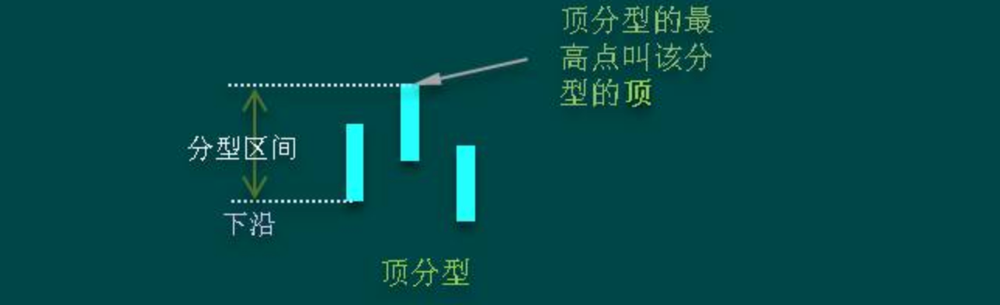

**底分型**：第二根K线低点是相邻三K线中最低的，而高点也是相邻三K线高点中最低的


三相邻K线之间可能组合的一个完全分类

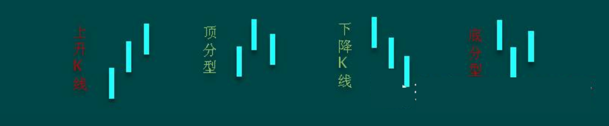

#### K线的包含关系

**包含关系**：就是一K线的高低点全在另一K线的范围内

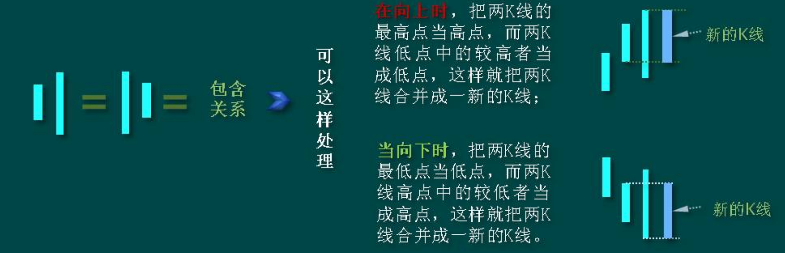

K线方向

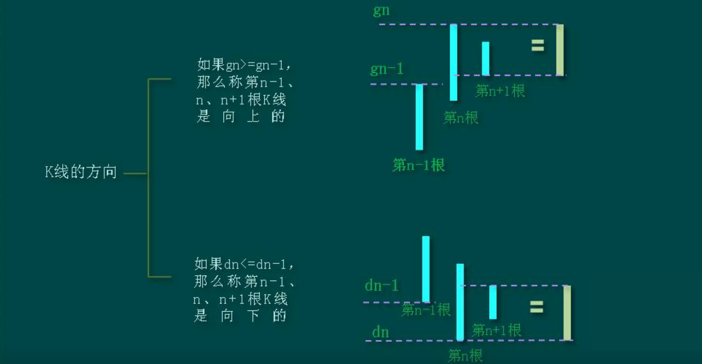

##### 包含关系推论

对于分型，里面最大的麻烦，就是所谓的前后K线间的包含关系，其次，有点简单的几何思维，根据定义，任何人都可以马上得出一下的一些推论

1. 推论1

用[di,gi]记号第i根K线的最低点和最高点构成的区间，当向上时，顺次n个包含关系的K线组，等价于[maxdi,maxgi]的区间对应的K线，也就是说，这n个K线，和最低最高的区间为[maxdi,maxgi]的K线是一回事情：向下时，顺次n个包含关系的K线组，等价于[mindi,mingi]的区间对应的K线

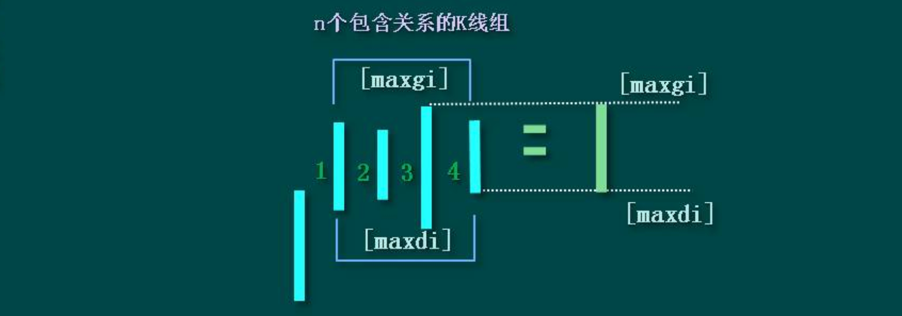

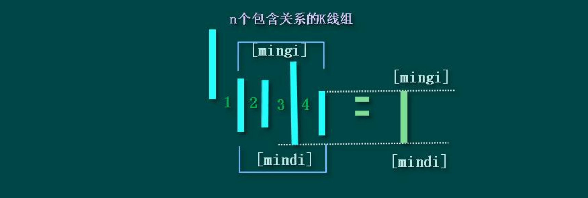

2. 推论2

结合律是有关本ID这理论中最基础的，在K线的包含关系中，当前也需要遵守，而包含关系，不符合传递律，在K线包含关系中，还要遵守顺序原则，就是先用第1、2根K线的包含关系确认新的K线，然后用新的K线去和第三根比，如果有包含关系，继续用包含关系的法则结合成 新的K线，如果没有，就按正常的K线去处理

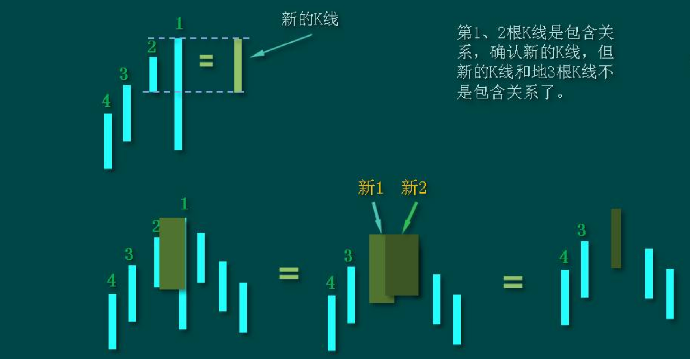

##### K线包含关系处理示例

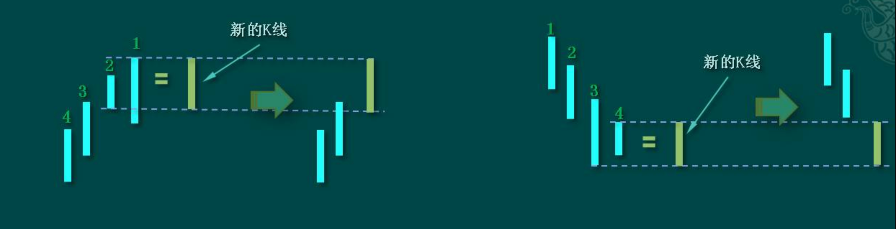

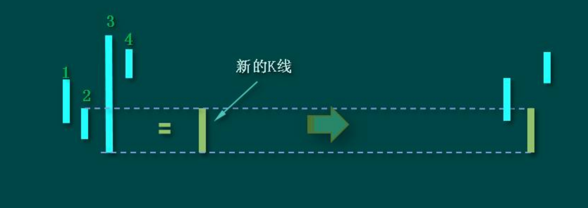

#### 顶底分型强弱分析

##### 顶分型的强弱分析

一个完全没有包含关系的分型结构，意味着市场双方都是直截了当的，没有太多的犹豫。包含关系（只要不是直接把阳线以长阴线吃掉）意味着一种犹豫，一种不确定的观望等，一般在小级别上，都会有中枢延伸、扩展之类的东西

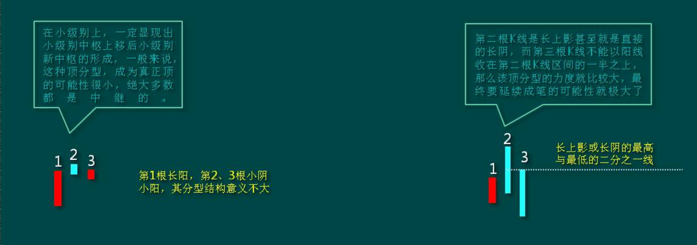

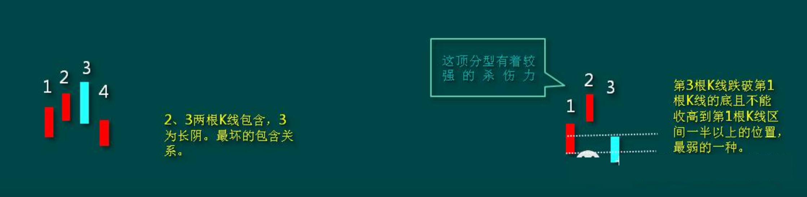

##### 底分型的强弱分析

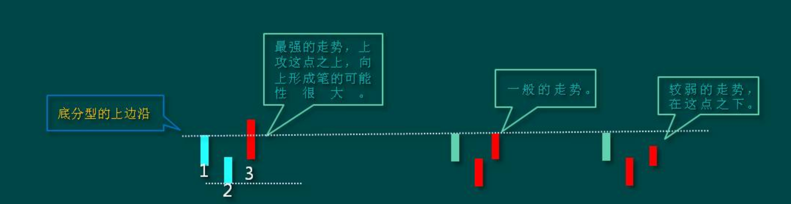

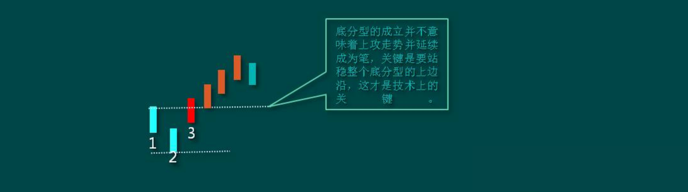

```markdown
# 分型停顿法
在分型确认之后，等待新的一根K线收在之前分型的上边缘
```

#### 分型的操作依据

分型形成后，无非两种结构：

1. 成为中继型的，最终不延续成笔
2. 延续成笔

对于后一种，那是最理想的，例如在日线上操作完，就等着相反的分型出来在操作了，中间可以去宠幸别的面首，这是效率最高的

而对于第一种情况，前面说过，可以看是否有效突破5周期的均线，例如对日线上的顶分型，是否有效跌破5日均线，就是一个判断顶分型类似走势很好的操作依据

不过，还有更精确简单的，就是这分型所对应的小级别中枢里，是否出现第三类买卖点，而且其后是否出现中枢移动。例如，对于一个顶分型，该顶分型成立后，对于该分型区间在小级别里一定形成某级别的中枢，选择其中最大一个，例如日顶分型后，可以找到相应的5、1分钟中枢，一般最大的就是5分钟，30分钟没可能，因为时间不够。如果该5分钟中枢或1分钟中枢出现第三类卖点，并该卖点不形成中枢扩张的情形，那么几乎可以100%可以肯定，一定在日线上要出现笔了

可以100%肯定的，要不出现笔并最终有效突破该顶分型，那一定要出现某级别的第三类买点，否则就算有短时间的新高，也一定是假突破。所以结合小级别的中枢判断，顶分型是否延伸为笔，是可以当下一目了然的

一般来说，可以把分型与小级别走势类型结合操作，例如日线与5分钟的。如果一个小级别的中枢震荡中连日K线都没有出现顶分型结构，那么，这个中枢震荡就没必要走了，后者就算打短差也要控制好数量，因为，没有分型，就意味着走势没有终结，随时新高，你急什么？而一旦顶分型成立，必然对应着小级别走势的第一、第二类买点，其后，关键看新形成中枢的第三类买卖点的问题：一般情况下，如果是中继的，都是第三类卖点后形成的中枢扩展，也就是有一个绝妙的盘整底背驰让你们重新介入。真阳，利用分型搞了一个美妙的短差，又不浪费其后的走势，这就是一个比较几个的操作了。这操作，其实我们都经历过，就是上海周线9月7日前后那个顶分型的操作，一个完美的中继顶分型，在假跌破5周线均线以及相应小级别背驰的共同作用下完成

**注意**：利用分型，例如顶分型，卖了以后一定要注意是否回补，如果一旦确认是中继的，应该回补，否则就等着笔完成再说

但一定要注意，中继顶分型后，如果其后的走势在相应小级别出现背驰或者盘整背驰，那么下一顶分型，是中继的可能性将大幅减少。中继分型，有点类似刹车，一次不一定完全刹住，但第一刹车后如果车速已经减慢，表明刹车系统是有效的，那么第二次刹住的机会就极大了，除非你踩错了，一脚到油门上去了

#### 分型结构的心理因素

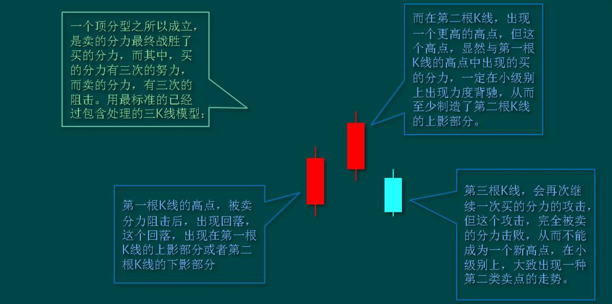

由上可见，一个分型结构的出现，如同中枢，都是经过一个三次的反复心理较量过程，只是中枢用的是三个次级别。所谓一而再、再而三、三而竭，所以一个顶分型就是这样出现了，而底分型的情况，反过来就是了

### 笔和线段

#### 笔的基本概念

两个相邻的顶和底之间构成一笔。所谓笔，就是顶和底之间的其他波动，都可以忽略不算，但注意，一定是相邻的顶和底，隔了几个就不是了

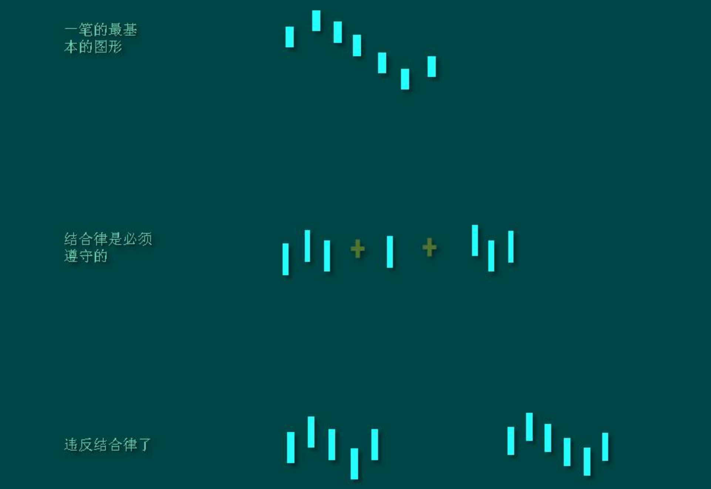

所以，上升的一笔，由结合律，就一定是底分型+上升K线+顶分型，下降的一笔，就是顶分型+下降K线+底分型

#### 笔的划分

笔，必须是一顶一底，而且顶和底之间至少有一个K线不属于顶分型与底分型


还有一个最显然的，就是在同一笔中，顶分型中最高的那K线的区间至少要有一部分高于底分型中最高那K线的区间，如果这条都不满足，也就是顶都在底的范围内或顶比底还低，这显然是不能接受的

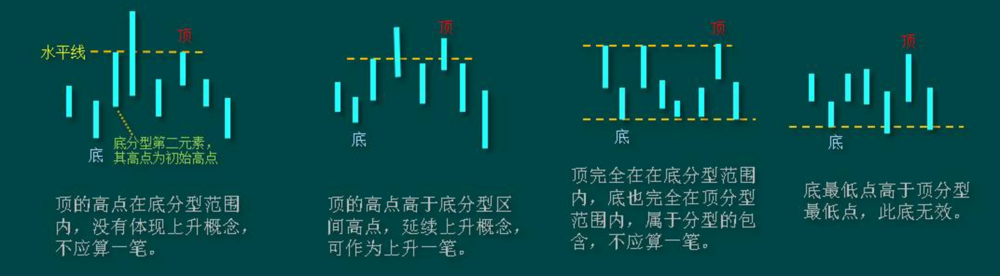

从分型到笔，必须是一顶一底。那么，两个顶或者底能构成一笔吗？这里有两种情况：

1. 在两个顶和底中间有其他的顶和底，这种情况，只是把好几笔当成了一笔，所以只要继续用一顶一底的原则，自然可以解决

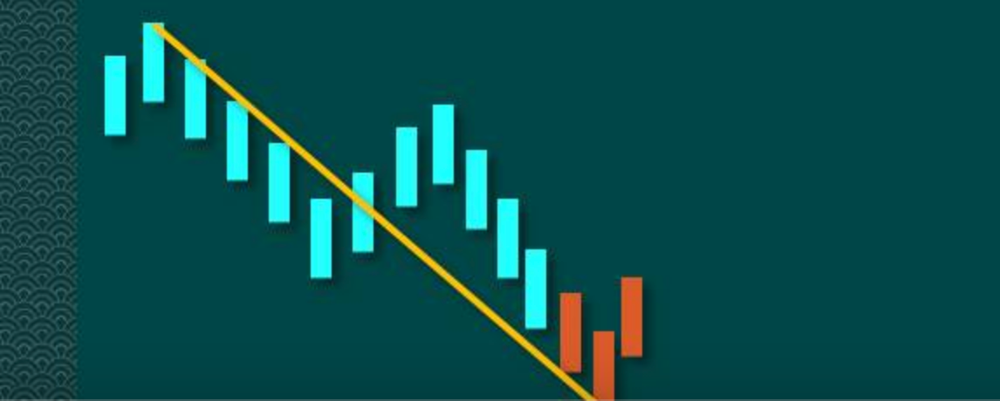

2. 在两个顶或者底中间没有其他的顶和底，这种情况，意味着第一个顶或者底后的转折级别太小，不足以构成值得考察的对象，这种情况下，第一个的顶或者底就可以忽略其存在了，可以忽略不算了

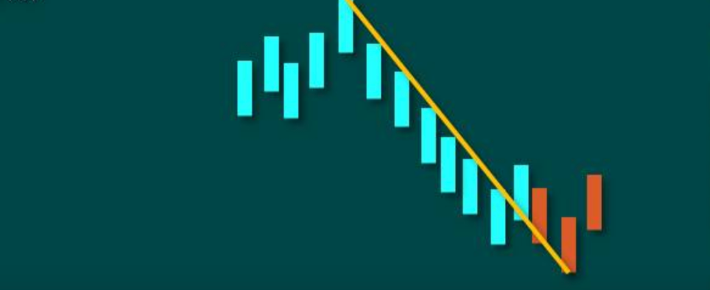

所以，根据上面的分析，对第二种情况，进行相应的处理（类似对于分型中包含关系的处理），就**可以严格地说，先顶后底，构成向上一笔。而所有的图形，都可以唯一地分解为上下交替的笔的连接**。

显然，除了第二种情况中的第一个顶或者底类似的分型，其他的分型，都唯一分别属于相邻的上下两笔，是这两笔间的连接，用一个最简单的比喻，膝盖就是分型，而大腿和小腿就是连接的两笔

如果前面的底高于后面的底，那么前面的划分显然是错误的，因为按这种划分，该笔是没有完成的，一个底不经过一个顶后就有一个更低的底，这是最典型的笔没有完成的情况

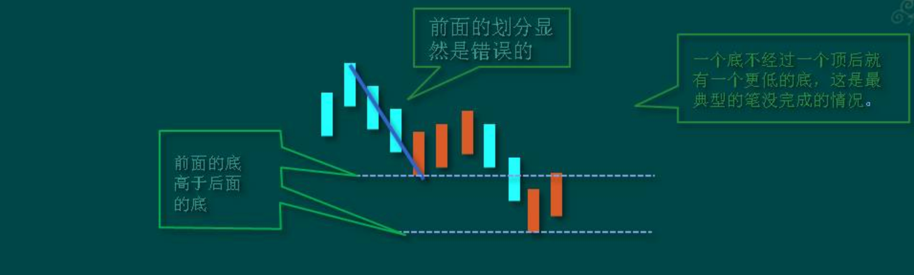

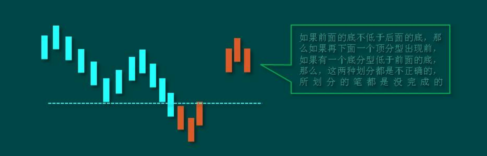

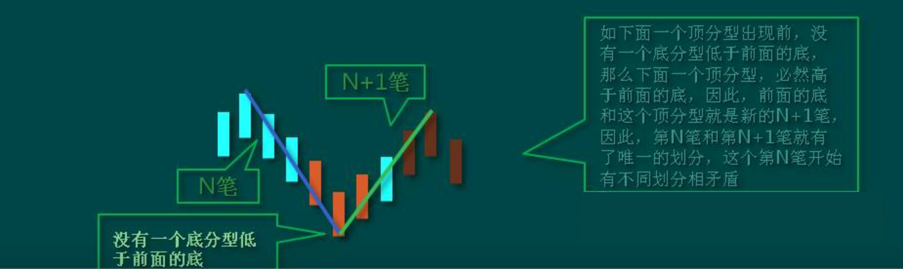

#### 划分笔的步骤

从上面笔划分的唯一性证明汇总，其实也知道如何去划分笔的步骤：

1. 确定所有符合标准的分型
2. 如果前后两个分型是同一性质的，对于顶，前面的低于后面的，只保留后面的，前面的那个可以X掉；对于底，前面的高于后面的，只保留后面的，前面的那个可以X掉。不满足上面的情况的，例如相等的，都可以先保留
3. 经过步骤二的处理后，余下的分型，如果相邻的是顶和底，那么这就是可以划分为一笔

如果相邻的性质一样，那么必然有前顶不低于后顶，前底不高于后底，而在连续的顶后，必然会出现新的底，把这个连续的顶中最先的一个，和这个新出现的底连在一起，就是新的一笔，而中间的那些顶，都X掉；在连续的底后，必然会出现新的顶，把这连续的底中最先的一个，和这新出现的顶连在一起，就是新的一笔，而中间的那些底，都X掉

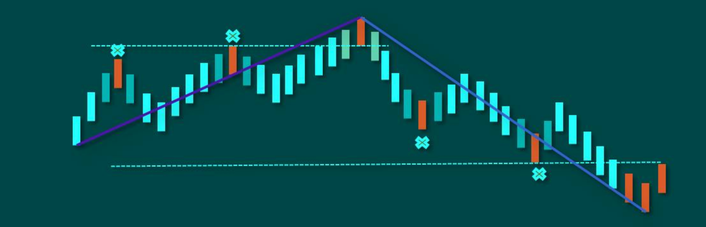

显然，经过上面的三个步骤，所有的笔都可以唯一的划分出来

#### 新笔的定义


#### 如何在当下确认一笔？

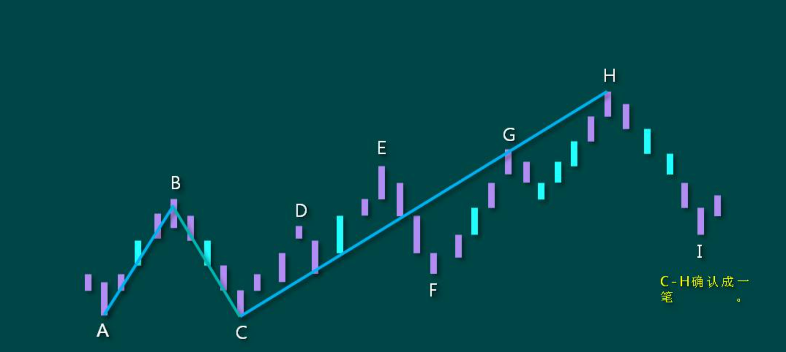


### 中枢


### 走势类型


### 买卖点


## 中级

### 背驰


### 走势转折与力度


## 高级


### 走势的多义性与其应用


### 走势分解深度应用


