序言：知识点关联 

- 为何要学包含关系：因为要寻找顶底分型
- 为何要寻找顶底分型：因为要画严格笔
- 为何要画严格笔：因为要画出中枢；因为严格笔还可以用来推笔，构成稳定性更好的结构，使得区间套更易进行
- 为何要学1+1终结：因为要同级别分解
- 为何要同级别分解：因为要使得中枢方向确定，行情分析简单
- 为何要中枢方向确定：因为要比较是否背驰
- 为何要比较背驰：因为要定义1、2、3类买卖点
- 为何要定义1、2、3类买卖点：因为要实际操作，要盈利


## 顶底分型

### 定义

#### 顶分型定义

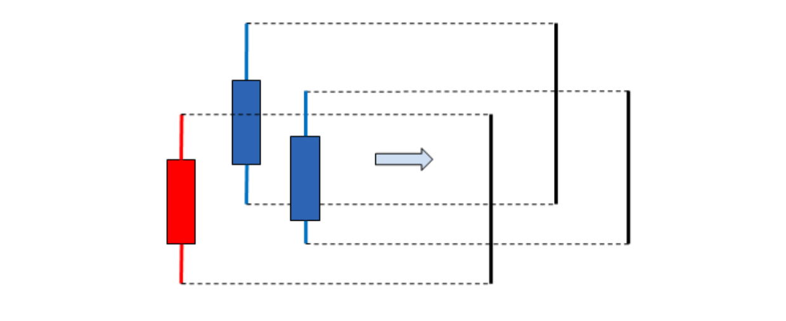

顶分型定义：不含包含关系的3根K线，中间一根的高点最高，低点也最高

#### 底分型定义

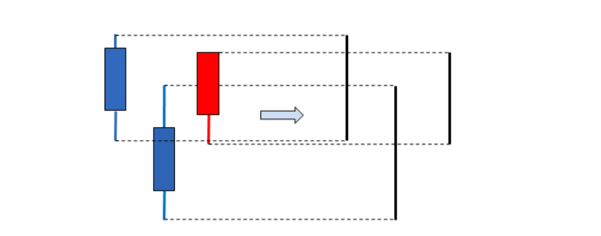

底分型定义：不含包含关系的3根K线，中间一根的低点最低，高点也最低

#### 顶、底分型的含义

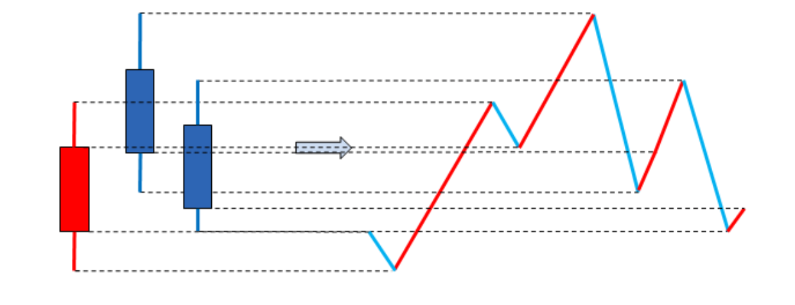

```markdown
# 假设
1. 第一根K线开盘的时候从开盘价下跌到最低价，然后直接拉升到最高价，然后回落到收盘价
2. 第二根K线是阴线，跳空高开在开盘价，跳空高开假设是快速拉升（确保连续）同时把今天的最高点给探到了，然后一路回落到最低点，尾盘上升收盘在收盘价
3. 第三根K线是阴线，同理，跳空高开在开盘价，跳空高开假设是快速拉升（确保连续）同时把今天的最高点给探到了，然后一路回落到最低点，尾盘上升收盘在收盘价
```

附：顶、底分型的含义——案例分析 （级别太短，不用来操作）

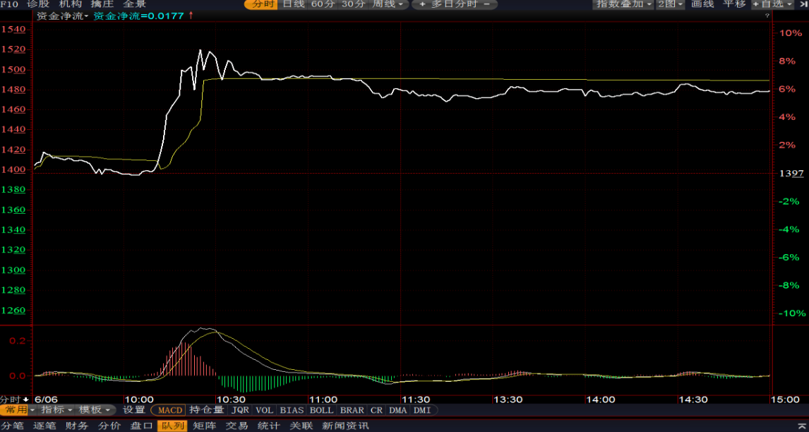

#### 上升趋势中K线的包含关系

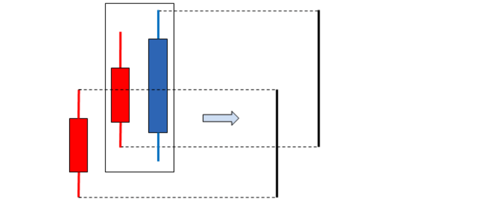

第三根K线出来的时候和第二根有包含，那么就向前看两根判断为上升趋势。上升趋势中的包含关系：高点取高的，低点也取高的，简称高高

#### 下降趋势中K线的包含关系

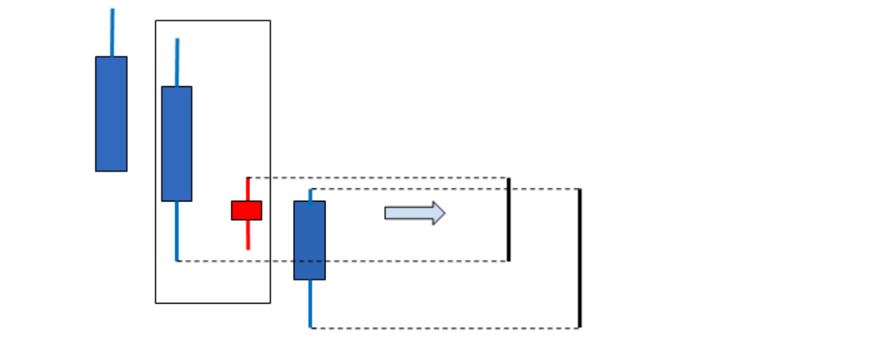

第三根K线出来的时候和第二根有包含，那么就向前看两根判断为下降趋势。下降趋势中的包含关系：低点取低的，高点也取低的，简称低低

#### 包含后的再包含关系

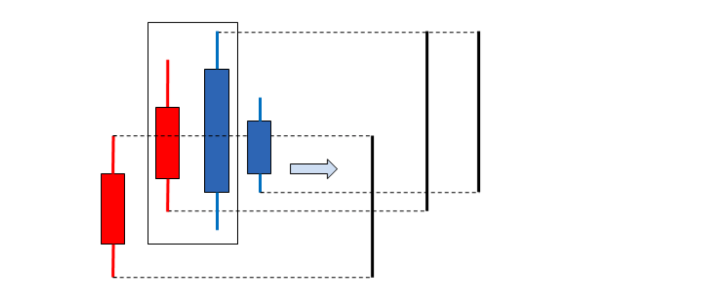

处理包含后再包含的原则是：按照时间顺序，相邻两根发生包含就处理

处理包含关系时，趋势方向的判定原则： 

- 当遇到第一根需要处理的K线时，先看前二根K线，这两根K线的方向决定了之后采用GG还是DD原则

- 若之前两根K线是上升趋势，则采用GG原则，反之，采用DD原则

顶底分型实践：上证指数月K线图（没有顶分出现就没有顶，没有底分出现就没有底），反过来是不成立的，不是一出现顶分型就见顶，也不是一出现底分型就见底

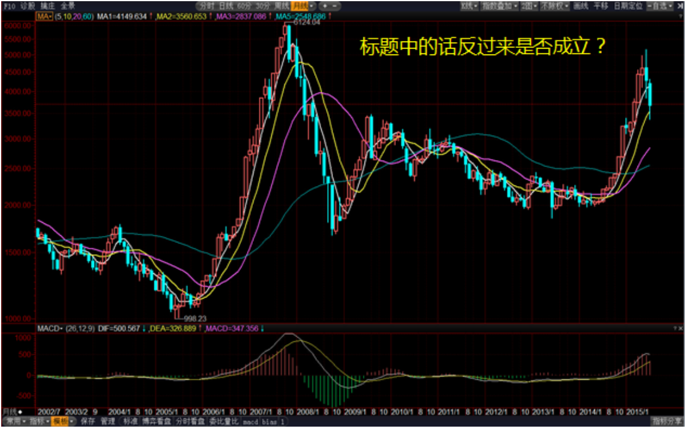

#### 中继、转折顶底分型的区分

1. 内部背离的影响

在一笔的过程中转折底分型只有一个，中继底分型可能有多个也可能没有

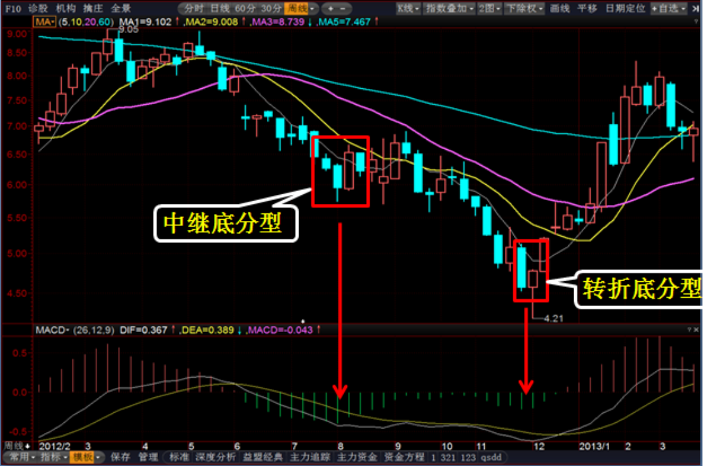

有背驰支持的分型成为转折分型的概率会比较大，另外一笔上涨中第一个顶分型可能不是转折顶分型，之后的第二个或者第三个成为转折底分型的概率比较大

```markdown
# 黄白线没有背离，但是绿柱子背离了，表示在这一笔的内部发生了背离
```

2. 顶底分型形态影响

**典型形态：** 

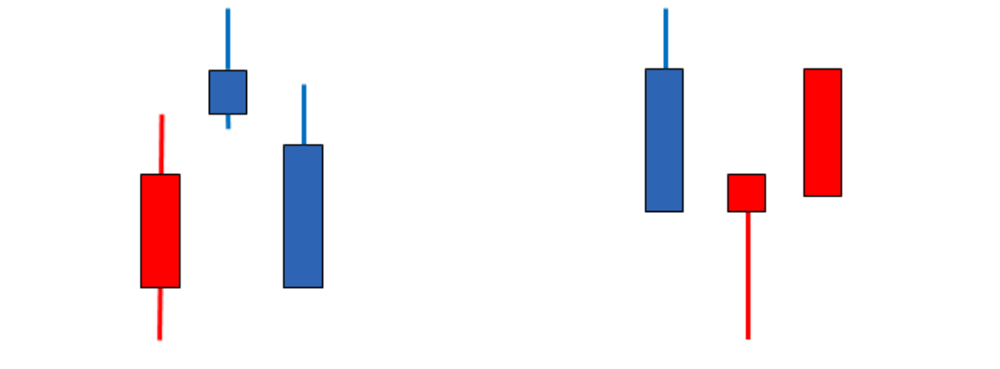

核心是第三根：实体饱满有力度，收盘在第二根线极值下（上）方，次核心是第二根：长影线、十字星、低（高）开阳（阴）线佳

**非典型形态：**

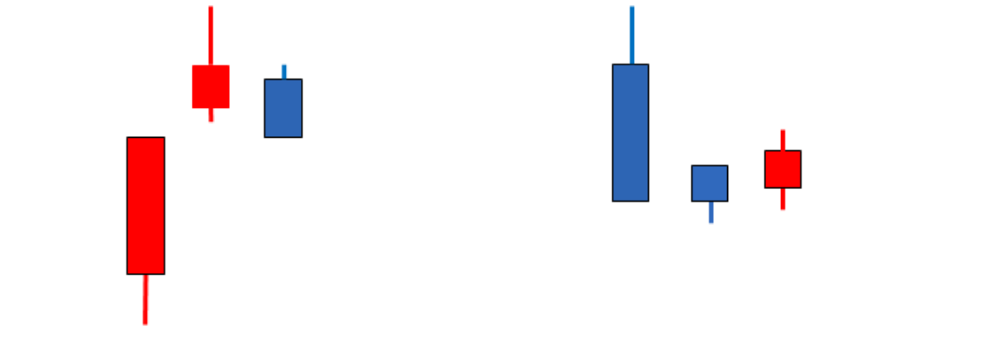

大阴大阳之后跟随小阴小阳，通常是中继顶底分型概率高，第三根线实体力度不够

#### 如何判断一个分型是否大概率会成笔

##### 原著中方法：看次次级别是否有3卖（买）

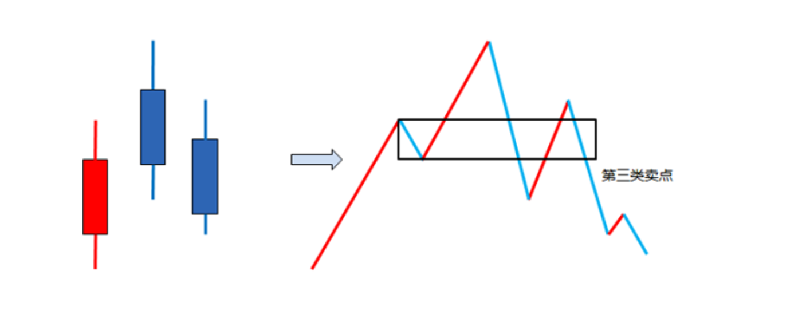

**如果在日线顶分型出现后，去看这个顶分型中最大的中枢（通常都是5分钟中枢，30分钟时间不够），如果接下去针对这个5分钟中枢形成了第三类卖点，其后成笔的概率很高，而日线的顶分型成为转折顶分型的概率也是较大的**

```markdown
# 就是有大阴线收盘在第二根K线以下
```

案例分析：奥普光电（002338）5钟K线图

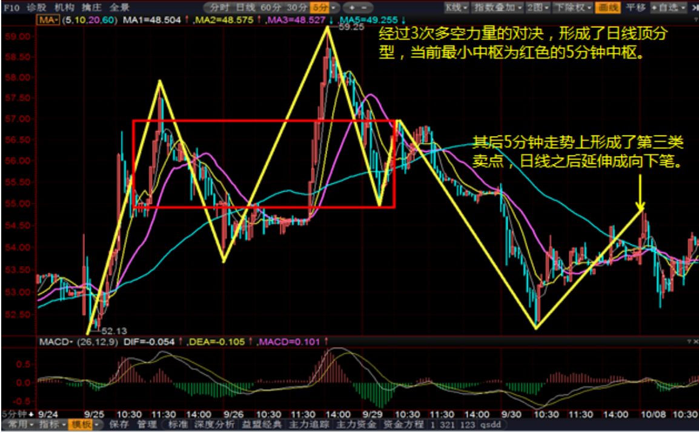

##### 从形态上预估

1. 最有杀伤力的分型

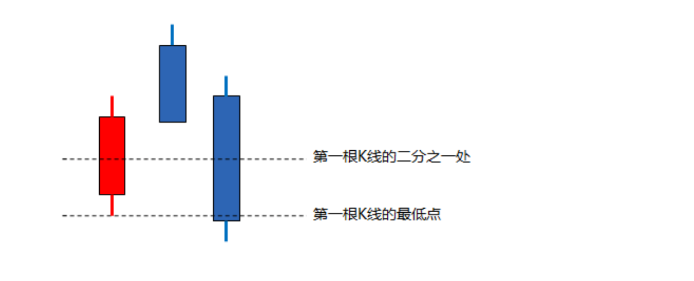

**一般来说，非包含关系处理后的顶分型中，第三根K线如果跌破第一根K线的底部，且收盘不能收到第一根K线区间一半之上，属于最强的顶分型，具有较强的杀伤力，底分型反之**

案例分析：百圆裤业（002640）日K线：从分型角度来看，杀伤力最强的分型不是第一个分型

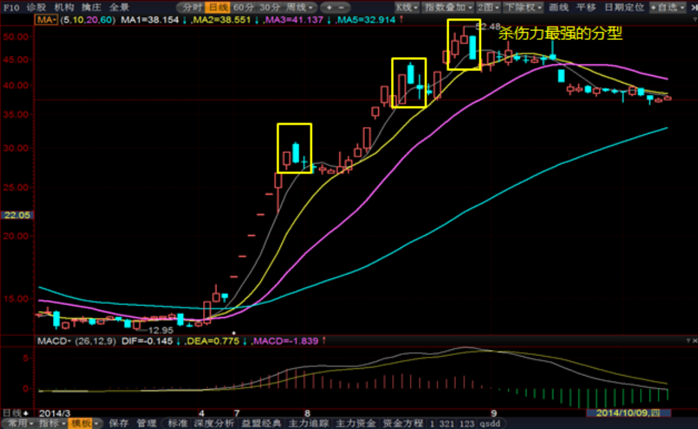

2. 较有杀伤力的分型

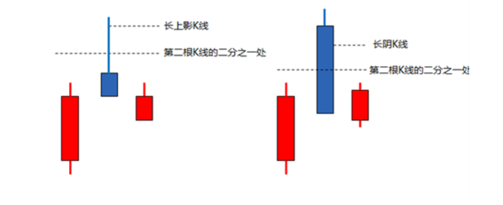

**如果第二根K线是长上影甚至就是直接的长阴，而第三根K线不能以阳线收在第二根K线区间一半之上，那么该分型的力度就比较大，最终延续成笔的可能性就较大，如果其中有包含关系，是直接长阴吃掉长阳，是最强的一种包含关系，底分型反之**

**附：长阴通常实体部分指大于70%，长上影指上影线幅度大于50%**

案例分析：华鼎股份（601113）日K线

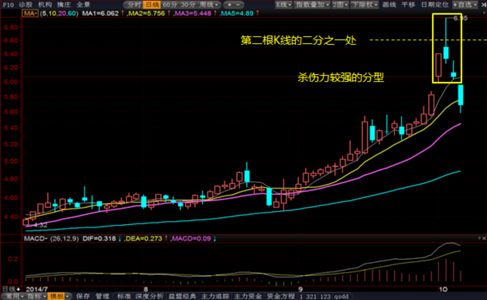

3. 中继分型

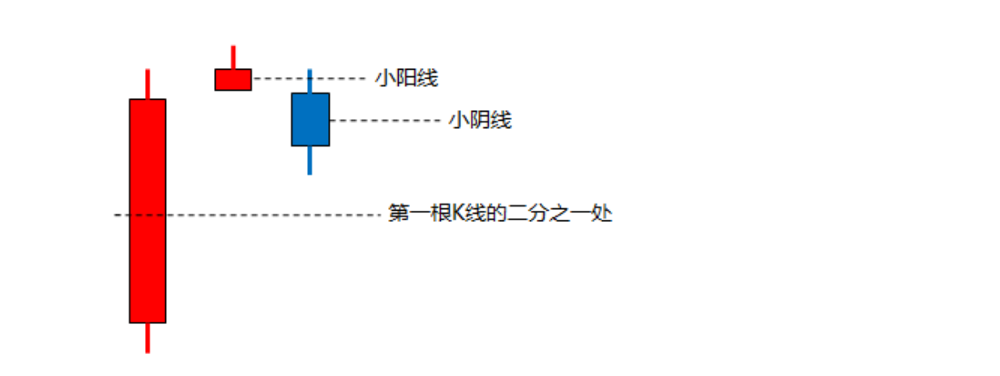

**多为中继型的分型：如果第一根K线是长阳线，而第二、第三根都是小阴、小阳，无法向下超越第一根K线的二分之一处，那么这种分型结构的意义就不强，在小级别上一定显现出小级别中枢上移后小级别新中枢的形成。一般来说，这种顶分型成为真正顶的可能性很小，绝大多数都是中继型的**

案例分析：柘中建设（002346）日K线

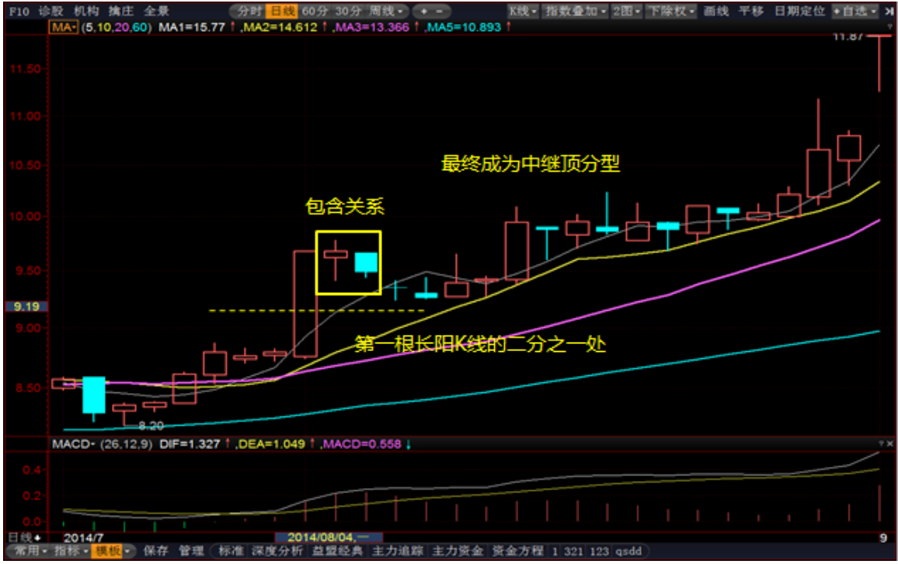

### 实战


### 课程互动问答

> 1. Q: 老师包含后的新K线 是不是已经部分上下影线了？
>
> A: 对啊，其实我们只在乎最高最低。
>
> 2. Q: 都老师，处理第二、第三根K线包含后发现，第三根把第一根又包含了，难道可以又往前追索？
>
> A: 可以的，处理包含关系的核心就是相邻不能有包含，所以左边包含右边，右边包含左边都可以。
>
> 3. Q: 什么是相邻不能有包含？
>
> A: 就是要保证挨着的两根K线都没有包含关系，如果有，就要把它们给处理掉。
>
> 4. Q: 处理包含关系必须是2化一后形成新的K线后再看是否还有包含？
>
> A: 对 。
>
> 5. Q：都老师，包含左包右，右也可包左，那这样子可以拓展到5到6根形成一个分型了？
>
> A：对啊，如果极端状态还有可能更多呢，不过实际走势中很少看见。
>
> 6. Q: 都老师 按照方法的步骤 是不是先要把包含关系全部处理完以后 再去分析是不是出现顶底分型？
>
> A: 是的。
>
> 7. Q: 老师,大盘周五是顶分型吗？
>
> A: 是的，日线上的顶分型。
>
> 8. Q: 都老师，请问严格笔是处理完包含关系还得有5根K线吗？
>
> A: 对，这是我们下节课要讲的内容，别急。
>
> 9. Q: 图形级别与长线，中线，短线有什么对应关系？
>
> A: 一般我们会选定几个周期，比如5分钟、30分钟、日线、周线，5分钟走势就像是30分钟图形的零件，而30分钟的走势又是日线的零件，这种层层的递进关系可以为我们分析股票、定位股票提供基础。

## 笔

> 疑难问题：顶分型之间的K线是否能够共用？如果不能，那么归谁？
>
> 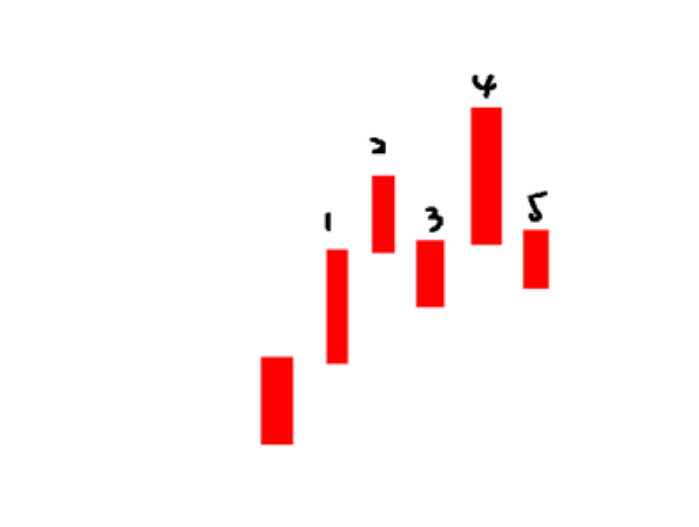
>
> 原则：不能共用，顶分型遇到共用时，归最高的顶分型组合使用；底分型则归最低的底分型使用

### 构建笔的路线

1. 严格笔路线：任一周期均按照严格笔的定义来，可以画出每个周期不同的笔，允许某一笔在两个周期同时为一笔，举例：允许5分钟一笔同时也是30分钟一笔，只要它们满足对应级别严格笔的要求

2. 推笔路线：只在最小周期上使用严格笔定义，其后的各个周期笔需要按照严格推导的方式来进行，即：比最小级别大的周期上不允许按照严格笔定义去画笔，而是按照：**最小级别笔-最小级别线段（大一级别笔）-大一级别线段（更大级别笔）的方式进行**

在今后的实战中，两种方式均可以使用，但在我们半年班课程中，我们以路线二为主。后续会慢慢讲到两种方法各自的优缺点

### 严格笔 基础知识

笔的定义：相邻的顶底分型之间构成一笔

要点：

1. 处理完包含关系的顶底分型之间**至少有1根非公用K线**，即：从顶分型的最高一根K线至底分型的最低一根K线至少有5根不含包含关系的K线

2. 必须是**一顶一底**，顶底间才可以连为一笔

3. **对于顶，如果后面还有一个顶更高，保留后面的；对于底，如果后面还有一个更低的，保留后面的**

### 笔的初步识别

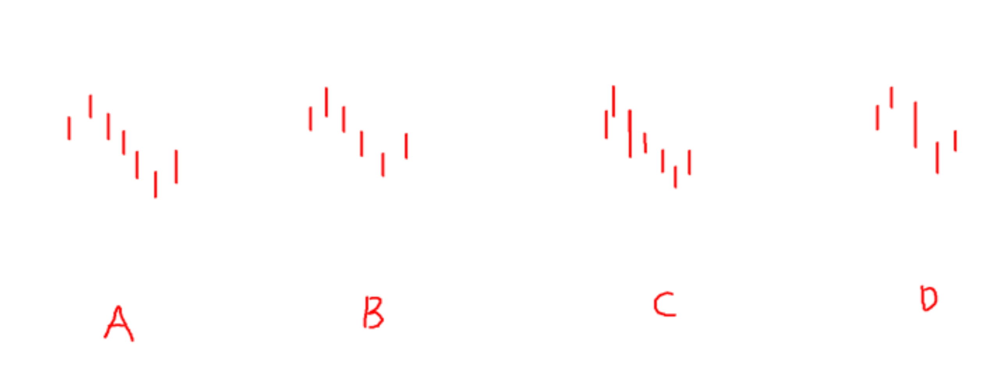

选出成笔的选项，并解释其它为何不成笔；可多选

```markdown
# 选A
B不是，没有非公用的K线
C包含关系处理后，没有非公用的K线
D没有非公用的K线
```

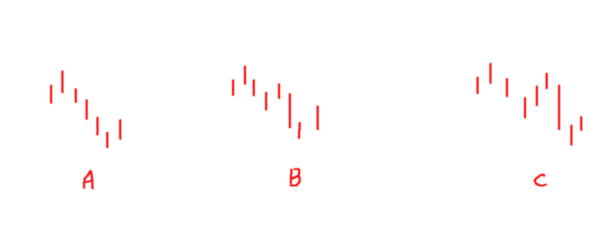

选出不成笔的选项，并解释它为何不成笔；可多选

```markdown
# 没有选项
```

### 画笔的准别顺序

1. 找到图中明显的高低点，目测高低点之间的K线是否有5根
2. 如没有，直接略过，不需要画顶底分型及处理包含关系
3. 如有，则开始画顶底分型处理包含关系，处理完毕后再观察高低点是否有5根K线，如没有，则略过，如有，则画为一笔
4. 修正，如果之前的笔已经画好，但之后出现新的高低点了，同时又无法满足构成新笔的条件，则需要对原笔进行调整

### 笔的进阶识别

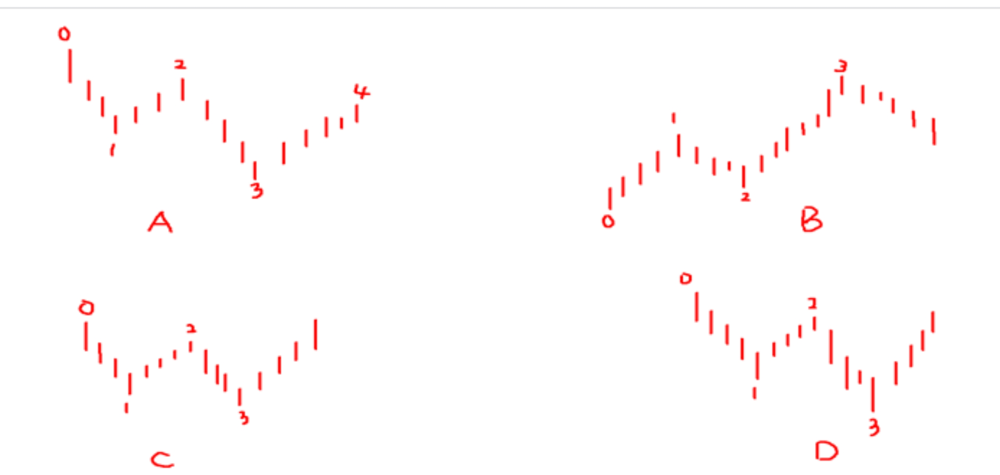

画出标号间相应的笔

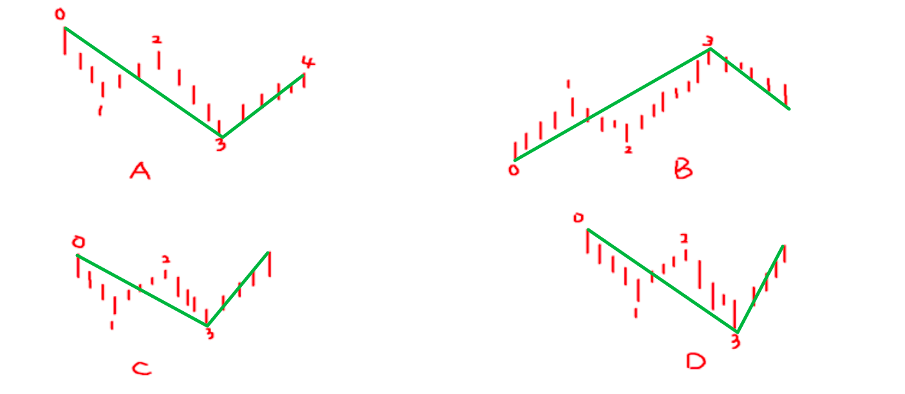

### 特殊笔的处理

#### 次高（低）点成笔

往往出现在行情快速变动时，能明显看出有上涨或下跌趋势，但由于变动速度比较快，处理完包含关系后到最高（低）点不足5根K线，但**后面**次高（低）点再次形成了顶（底）分型，且这个顶分型的高点明显高过之前底分型的低点，可以允许次高（低）点成笔

```markdown
# 上涨速度很快，但是不够5根，这个时候就可以根据次高点的定义来考虑是否可以成笔
这里说的次高和次低点是后面的
```

次高（低）点成笔案例：80-81

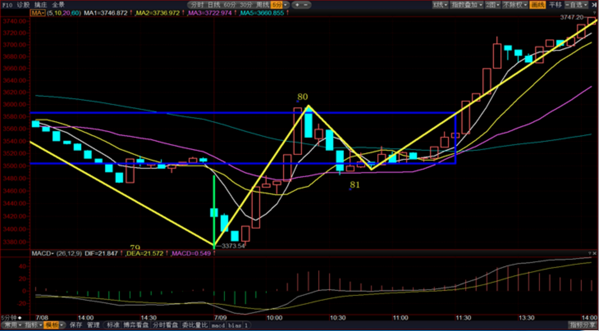

另：结合之前授课经验，为了使得次高（低）点成笔更加明确，特规定：

1. **满足此条件成笔至少要求从最低到最高之间有四根K线（去除包含关系）**
2. **最高（点）点与次高（低）点之间的幅度不能超过之前波幅的50%**，可以拉黄金分割线比较

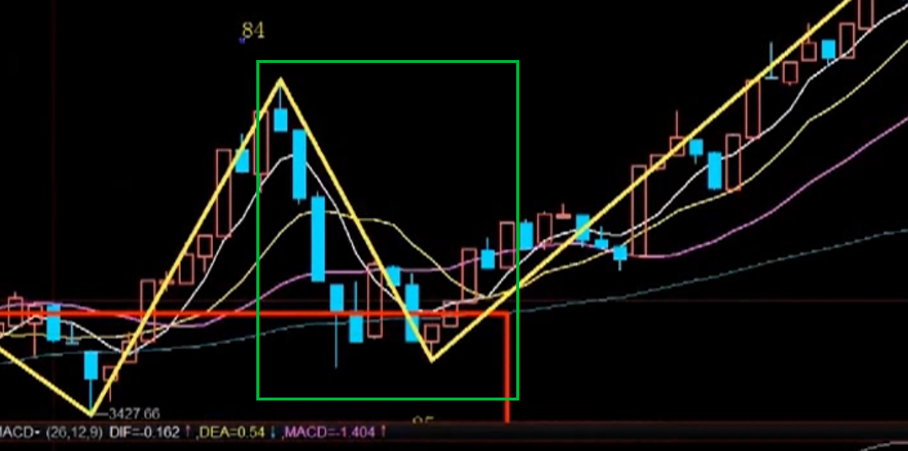

#### 打横笔

按照严格笔定义能够画出笔来，但是实际走势能看出明显是横盘震荡，次级别能看出有对称的上下结构，次级别往往表现为中枢震荡

为帮助同学们清晰界定，特此规定：在对称的上下上结构中，**如果有某一根K线的收盘价站在之前最低（高）点的下（上）方，则意味着不再以打横笔处理，而是可以直接成笔**

```markdown
# 打横不画笔，不做笔，然后直接作为次级别中枢
```

打横笔案例：

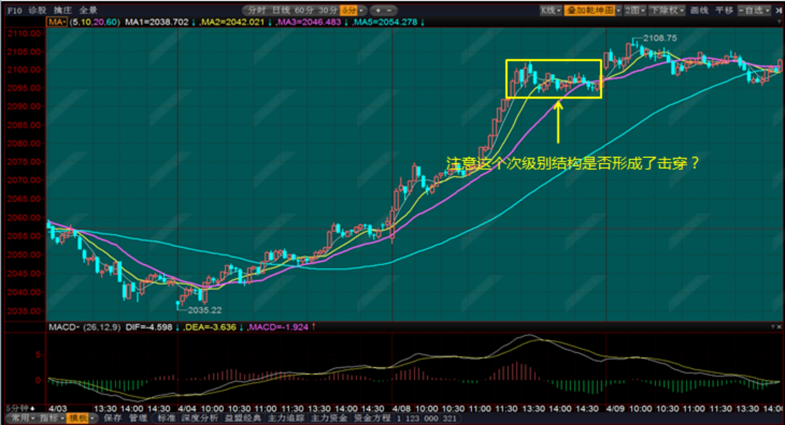

```markdown
这里不是次低点成笔，因为：1.不够四根；2.回拉超过50%
# 击穿的定义，收盘价收盘在之前最低点的下方
```

#### 修正笔

行情出现变化，使得之前的笔画法需要进行改变来符合当前行情的特点

修正笔案例：先有最高（低），才有次高（低）

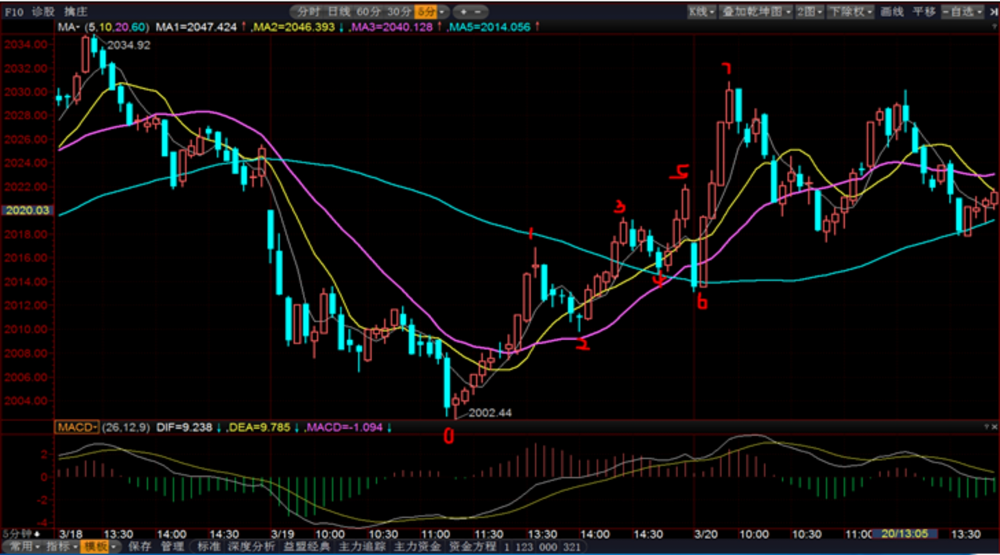

修正笔主要用到的规定：**对于顶，如果后面还有一个顶更高，保留后面的；对于底，如果后面还有一个更低的，保留后面的**

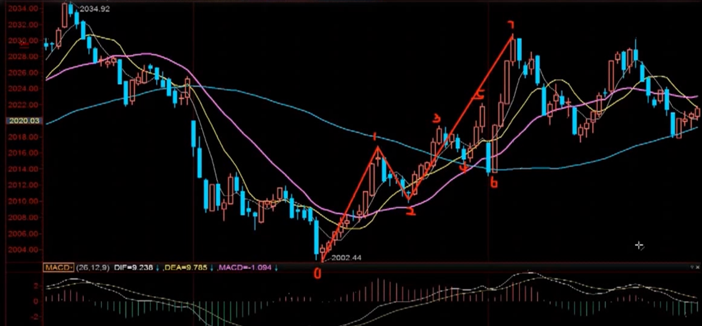

```markdown
# 本来画的是，0-1-2-3-4，但是6号点的长阴线出现之后，就不能这么画了，因为如果这么画，5-6不够一笔，就会变成0-1-2-3-4-7，但是此时5号顶比3号顶更高，6号底比4号底更低，所以根据（对于顶，如果后面还有一个顶更高，保留后面的；对于底，如果后面还有一个更低的，保留后面的），就只能画0-1-2-7
```

#### 跳空成笔

1. 规定：日线级别的缺口均无法成笔，必须按照严格笔的定义来画，允许次高低点成笔

2. 针对指数：30分钟级别：超过2%的缺口可成笔；5分钟级别超过1%可成笔（**缺口须超过3根K线以上不回补**）

3. 针对个股：30分钟级别：超过5%以上的缺口可成笔；5分钟级别超过2.5%可成笔； （**缺口须超过3根K线以上不回补**）

另：如果有同学看其它周期，可以根据周期倍数来调整，如1分钟为5分钟一半，15分钟可以等同于5分钟，60分钟可以等同于30分钟

跳空成笔案例分析（上证指数5分钟K线）：67-68、74-75

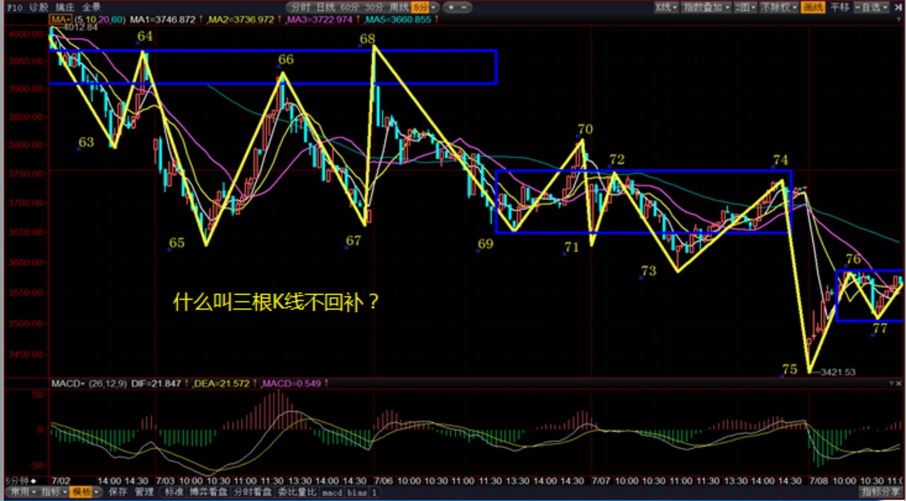

#### 课堂练习：下图中的笔应该如何画？

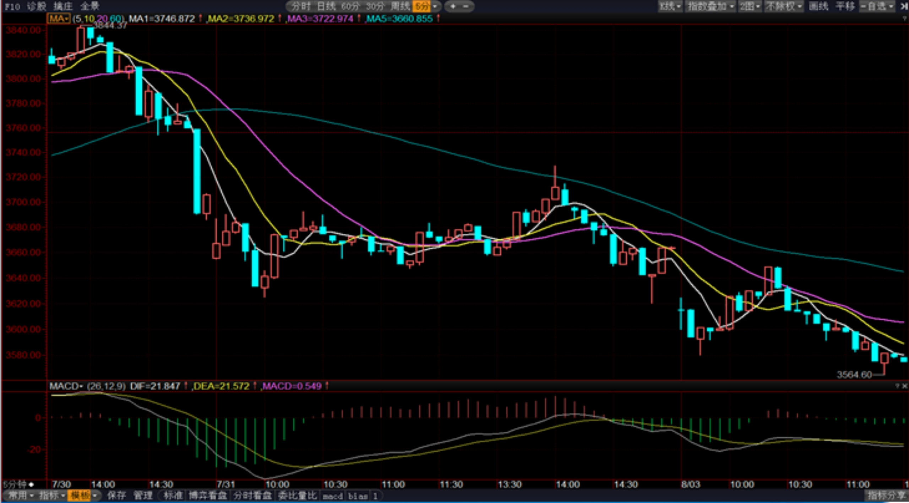

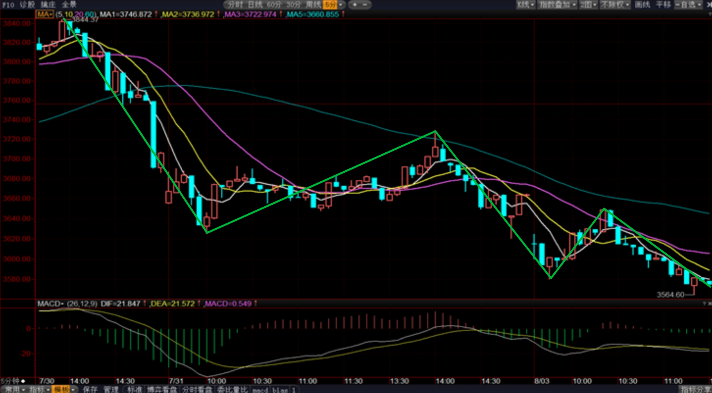

#### 实战练习：上证指数日线严格笔

2013年2月18日——至今


#### 顶底分型停顿法

判断是否大概率成笔的辅助方法

1. 顶底分型实战——停顿法

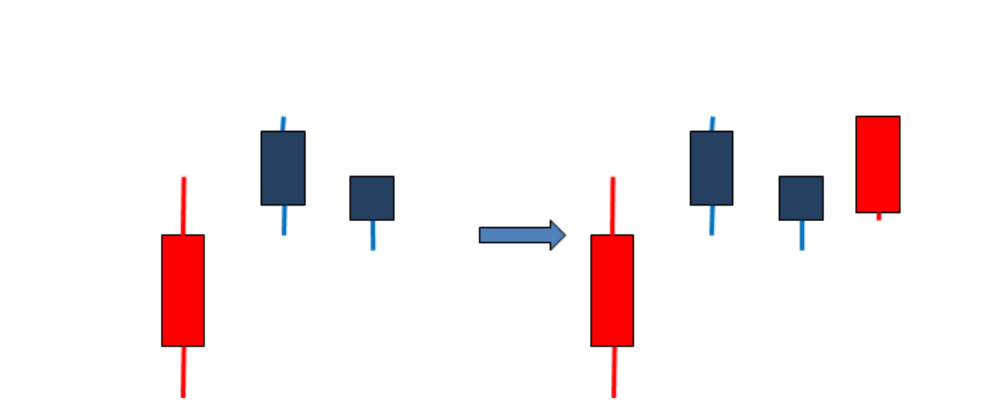

停顿法实质：中继顶底分型往往没有延续性，次级别往往表现为中枢震荡或者多方（空方）第一次反扑，一般额外一根K线可以辅助得出结果

分型停顿法要求：**当分型形成后，等待后续出现某一根K线的收盘价站住第三根K线**（此处的第三根K线是指形成分型的第三根K线）的极值，即可认为满足了停顿法的要求

2. 为什么停顿法可以保证在80-90%的情况下不会错误进场？

其实我们知道，我们绝大多数错误进场都是由于次级别还有内部结构没走完，我一般选取次级别都是按照四分之一或者六分之一的原则（比如30分钟的次级别是5分钟，是30分钟周期的六分之一），从最低点形成底分型至少需要2根K线，而我们停顿1-2根，就意味着最低点上来要有12根-18根次级别K线，绝大多数次级别结构肯定能看出来了

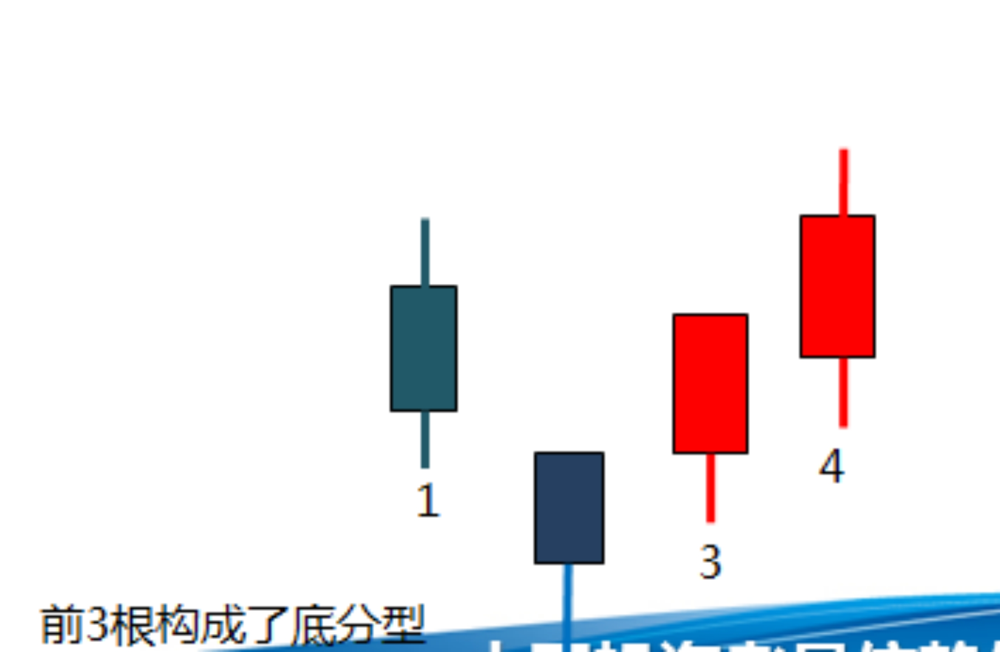

假如K线周期为30分钟，则2号、3号两根K线一共有12根5分钟K线，我们又等了1根，那么从最低点上来应该有12-18根5分钟K线。通常次级别内部结构的一笔力度和时间都不应该有这么长，在5-10根的概率最大，所以，如果这是背驰段上的底分型，在观察了4号K线后我们就可以进场，止损在3号K线的最低点

## 线段

> 特殊笔的鉴别：创业板指数5分钟K线图（打横笔）
>
> 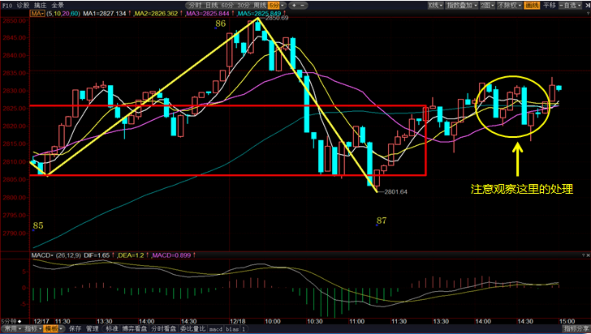
>
> 特殊笔的鉴别：上证指数5分钟K线图（修正笔）
>
> 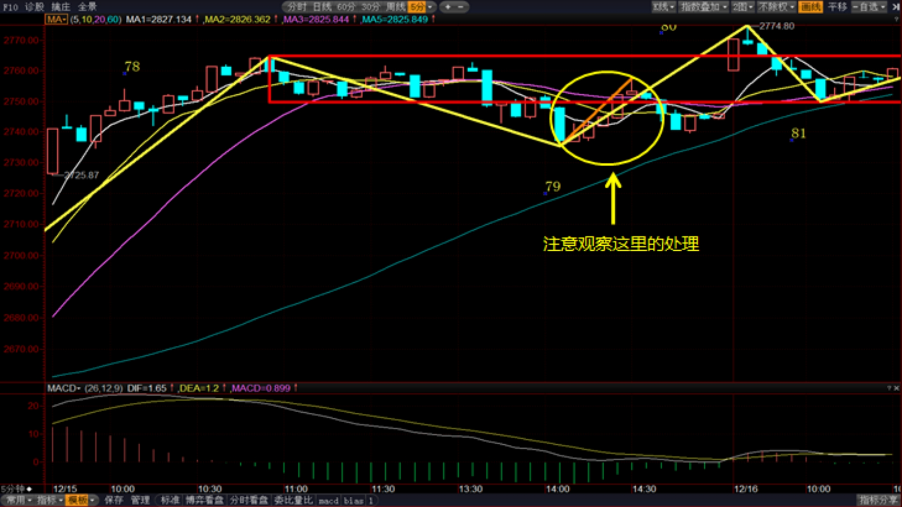
>
> 特殊笔的鉴别：海得控制30分钟K线图（次高点成笔）
>
> 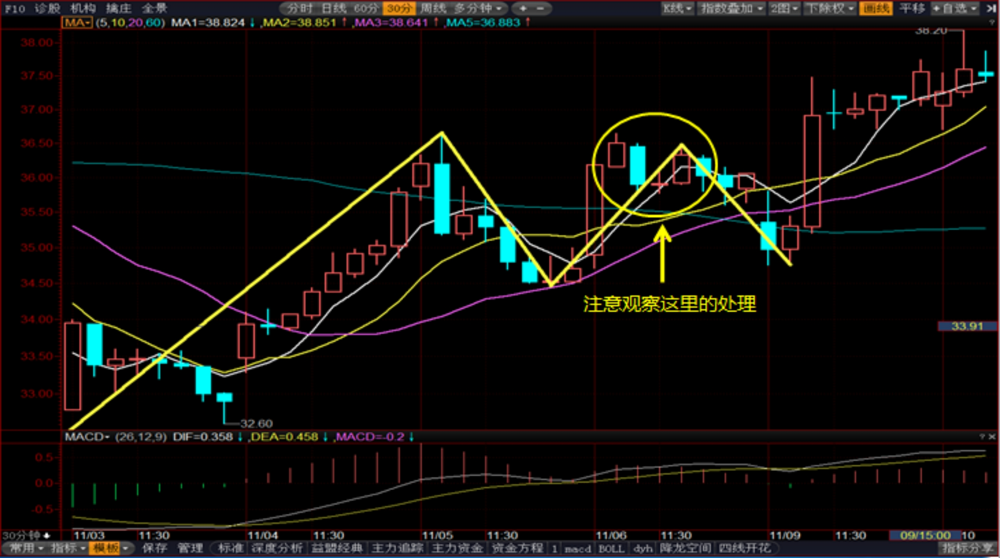

### 线段及线段的终结

线段的定义：至少由3笔构成，且前三笔必须有重叠部分

线段的初级终结定义：1+1模式

```markdown
# 1+1是指两个事件：
比如上涨的时候
1. 不创新高
2. 有效击穿低点
下跌的时候
1. 不创新低
2. 有效击穿高点
```

解释：

- 在上涨趋势中：当某一笔无法创出左侧临近高点的新高，且下一笔创出左侧低点的新低，则意味着上涨线段被终结

- 在下跌趋势中：当某一笔无法创出左侧临近低点的新低，且下一笔创出左侧高点的新高，则意味着下跌线段被终结

附：有效击穿的定义：连续3根收盘价站稳，向上终结的确认为阳线，向下终结的确认为阴线

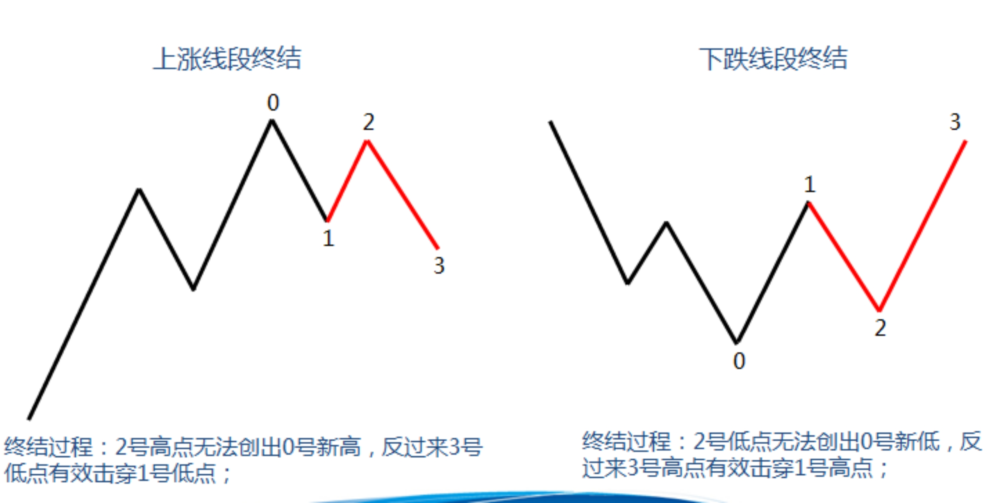

图中共有几条线段，分别是从几号到几号？

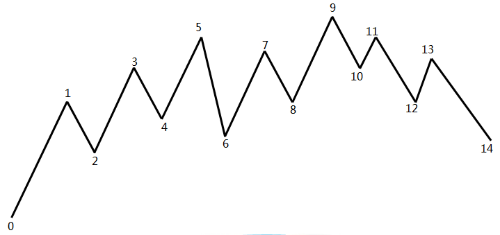

```markdown
# 两条
0-9、9-14
```

1+1模式唯一解决不了的一种终结模式

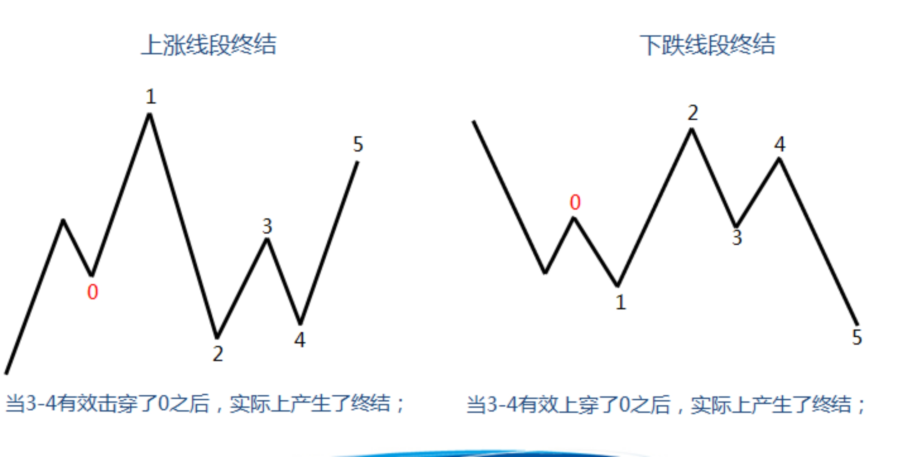

### 随堂测验

下面哪几幅图是有效击穿？（可多选）

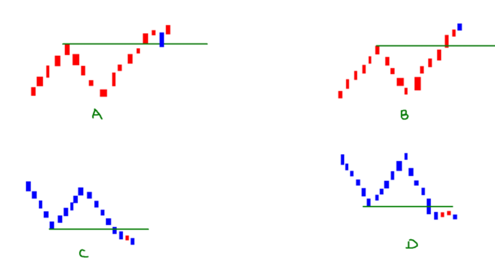

```markdown
# 答案：CD
```

### 特征序列法解决线段终结

特征序列说明：向上线段中，向下笔为该线段特征序列；向下线段中，向上笔为线段特征序列。可以把特征序列这一笔当成一根K线

原因：以第一张图为例，无论如何，0-1和2-3,2-3和4-5必然有重叠，而1-2和3-4则不一定，所以在上涨线段中下跌笔更能反映出这个线段的特征

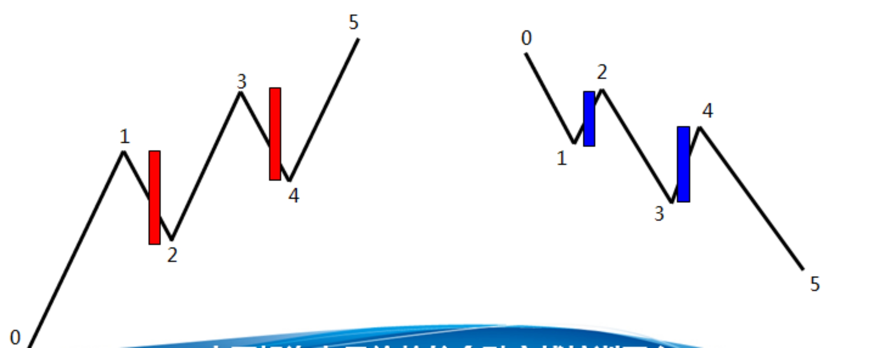

换个方法看同样问题：图中蓝色框内形成了**顶分型**，意味着上涨线段终结

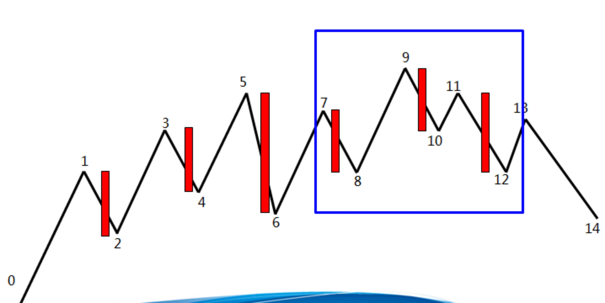

### 走势的同级别分解

同级别分解的目标：将行情在某级别上分成一段段上涨与下跌的连接

同级别分解的目的：简化分析，永远只需要处理一个正在完成的中枢，而无需顾及之前走势的影响；同时为后面的推笔打好基础

同级别分解的原则：选择1+1终结点之前的阶段最高（低）点作为分解的标杆位

##### 该如何进行同级别分解？

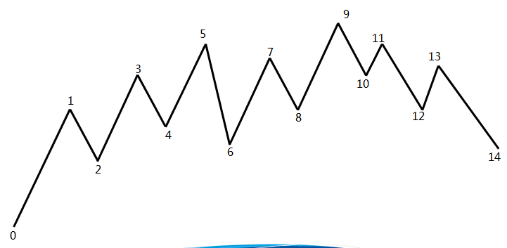

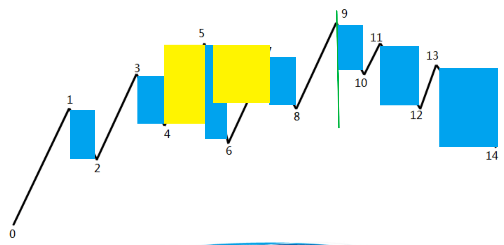

要点：

- 同级别分解线应该画在极值点上（即线段最高或者最低点上）

- 一个线段至少由三笔构成，如果画在极值点上使得两条同级别分解线之间只有一笔，那么选择次高（低）点中较高（低）的那个点画线

B图同级别分解线如何画？

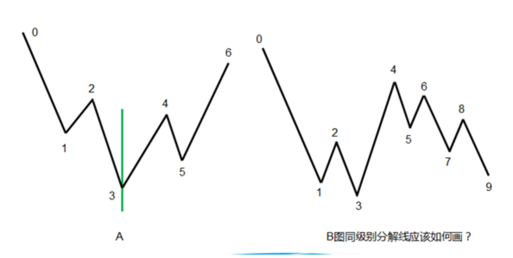

```markdown
# 答案B：画在3号和6号点
```

C图和D图如何画同级别分解线？

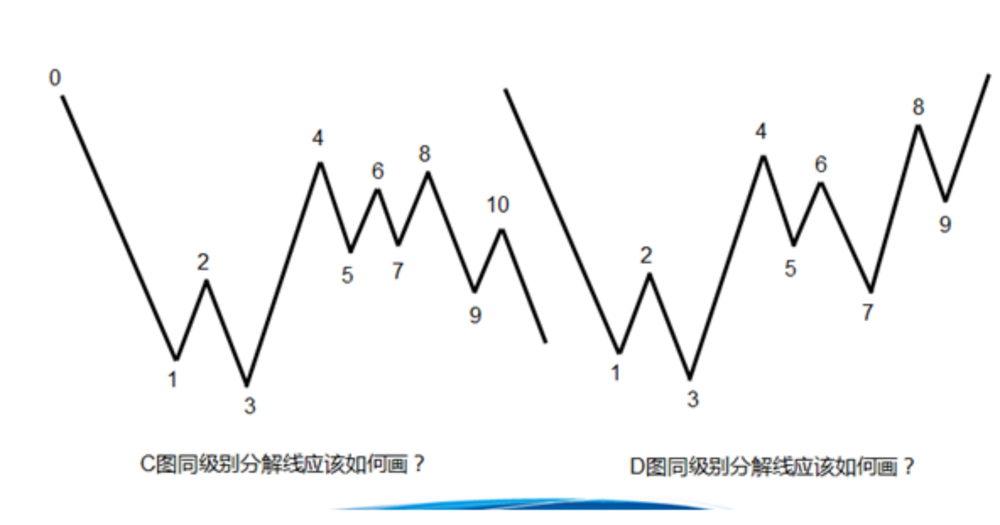

```markdown
# 答案C：画在3号和8号点
# 答案D：画在3号点
```

可以通过过1+1终结，也可以通过特征序列来解决

### 题材选股：中国制造2025

> 中国制造2025逻辑梳理、总结：
>
> 形成经济增长新动力，塑造国际竞争新优势，重点在制造业，难点在制造业，出路也在制造业。指导思想：以加快**新一代信息技术**与制造业**深度融合**为主线，以推进智能制造为主攻方向，以满足经济社会发展和国防建设对重大技术装备的需求为目标
>
> 文章中曾经提及的细分行业：
>
> 1. 各国都在加大科技创新力度，推动三维（3D）打印、移动互联网、云计算、大数据、生物工程、新能源、新材料等领域取得新突破
>
> 2. 载人航天、载人深潜、大型飞机、北斗卫星导航、超级计算机、高铁装备、百万千瓦级发电装备、万米深海石油钻探设备等一批重大技术装备取得突破，形成了若干具有国际竞争力的优势产业和骨干企业，我国已具备了建设工业强国的基础和条件
>
> **智能：**加快发展智能制造装备和产品。组织研发具有深度感知、智慧决策、自动执行功能的**高档数控机床、工业机器人**、增材制造装备等智能制造装备以及智能化生产线，突破**新型传感器、智能测量仪表、工业控制系统、**伺服电机及驱动器和减速器等智能核心装置，推进工程化和产业化
>
> **绿色：**加快制造业绿色改造升级。全面推进钢铁、有色、化工、建材、轻工、印染等传统制造业绿色改造，大力研发**推广余热余压回收、水循环利用、**重金属污染减量化、有毒有害原料替代、废渣资源化、脱硫脱硝除尘等绿色工艺技术装备，加快应用清洁高效铸造、锻压、焊接、表面处理、切削等加工工艺，实现绿色生产 
>
> 《〈中国制造２０２５〉重点领域技术路线图（２０１５版）》，明确了新一代信息技术产业等十大领域的发展方向和目标，涉及的十大重点领域包括**新一代信息技术（集成电路及专用装备、信息通信设备、操作系统及工业软件）、**高档数控机床和机器人、航空航天装备、海洋工程装备及高技术船舶、先进轨道交通装备、节能与新能源汽车、电力装备、农业装备、新材料、生物医药及高性能医疗器械
>
> **模拟盘可关注：**
>
> 1. 数控机床：**沈阳机床**（前期持续跟踪品种）
>
> 2. 机器人：工业机器人（身形庞大，工作时有一定危险性，主要应用在汽车行业，核心在减速机），协作机器人（智能性和柔性更强，相当于人类手臂的延伸，更适用于小规模批量生产）、服务机器人（家庭服务机器人和专业服务机器人）：**埃斯顿**（机器人本体制造商，市值小）、**科大讯飞**（人工语音识别，服务机器人的入口）
>
> 3. 工业控制系统、软件：**海得控制**；
>
> 4. 传感器：**苏州固锝**

### 课程互动问答

> 1. Q: 老师，同级别分界线的目的是为了推笔吗？
>
> A: 推笔是目的之一，第二个目的是确定中枢的颜色和方向，否则很多人就不知道中枢画红色还是蓝色的了

## 中枢与股票前世今生

### 中枢

#### 非严格定义：中枢长的什么样子？

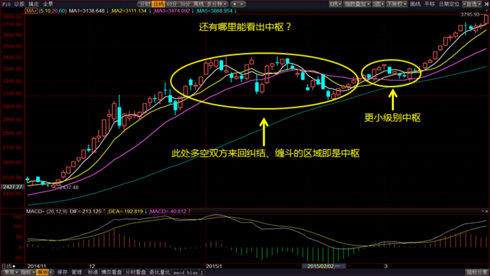

多空双方来回纠结、缠斗的区域即是中枢

#### 中枢的作用

1. 中枢是一切当下走势的分析基础，有了中枢，才会产生直观的压力与支撑，同时也可以根据中枢的位置和破坏对走势进行下一步的预判。中枢就像是“画龙点睛”中的“睛”

2. 70%以上的快速上涨都来源于中枢震荡的结束，所以识别出中枢，同时识别出中枢内部走势的变化，是捕捉快速上涨潜力股的关键

#### 走势中枢的标准定义

中枢的定义：某级别	走势类型中，被至少连续三笔所重叠的部分

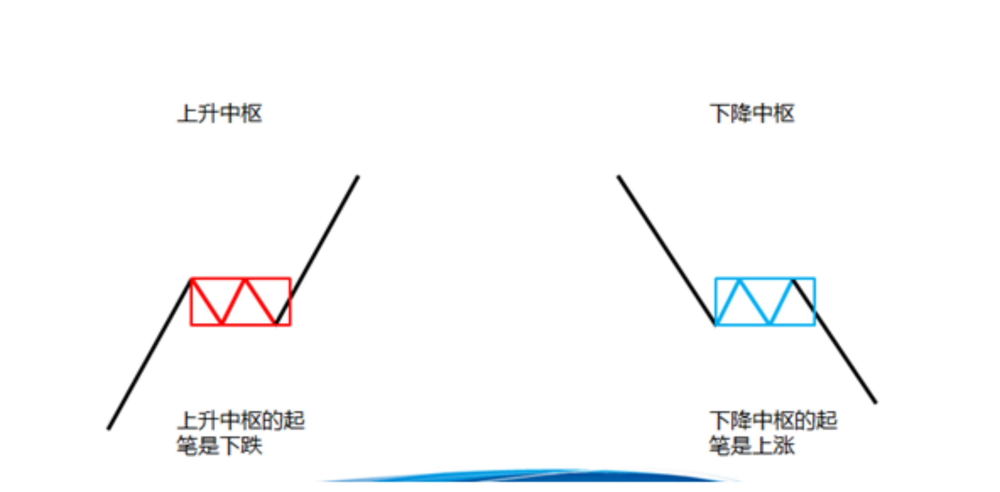

```markdown
# 上升中枢的起笔是下跌
# 下跌中枢的起笔是上升
```

上涨中枢

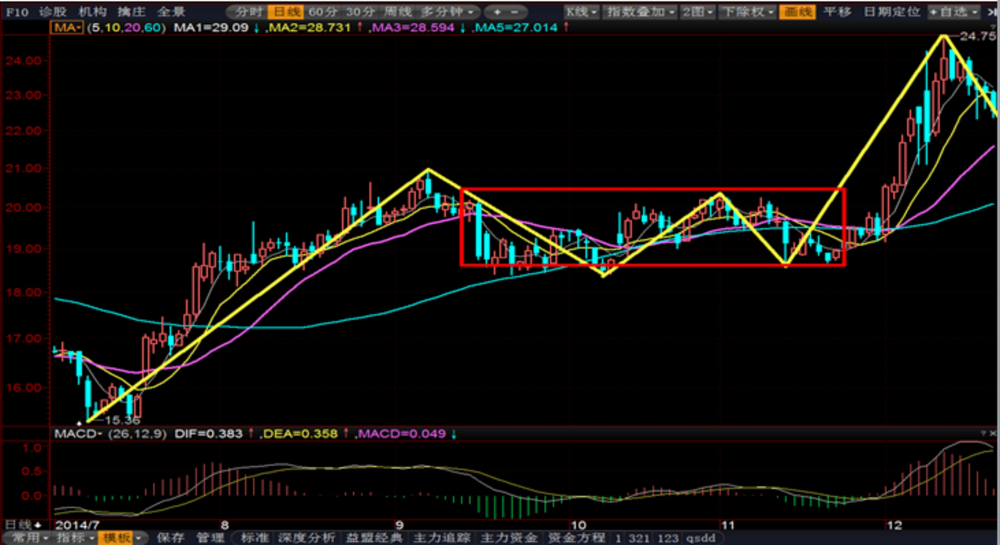

下跌中枢


#### 中枢识别

##### 中枢在哪里？

某级别走势类型中，被**连续前三笔**所重叠的部分


##### 如何画出前三笔共同经过的区域？


1-2一笔共分为三部分，分别为绿、红、紫；2-3一笔共分为二部分，分别为蓝、红，这三笔中哪块区域是共同重合的区域？

**前三笔中，高点取低的，低点取高的**

##### 中枢的另一种构成方式

本级别画不出笔或者画笔很困难，由小级别延伸而成


#### 随堂测试

画出图中对应的中枢


#### 中枢的延伸


走势中枢延伸表现为：**中枢形成之后的每一笔都经过中枢（即：之后每一笔都与中枢有重叠的部分）**

案例：上证指数5分钟走势图


#### 中枢的性质与作用

##### 引力作用

中枢会对所有试图离开它的走势产生引力，距离越近的中枢引力越大，级别越大的中枢引力越大

引力，又称重力相互作用，是指具有质量的物体之间加速靠近的趋势，也是自然界的四大基本相互作用力之一；走势与当前本级别最近的一个中枢关系是分析股票走势的核心


```markdown
# 61、62、68等想要离开中枢，因为引力，被拉回来
```

##### 压力支撑作用

当股价自下方向上反弹至中枢区间时，中枢提供压力；当股价自上而下下跌至中枢区间时，中枢提供阻力

中枢区域是多空双方之前密集交战的区域，当股价自下方向上反弹至此时，之前套牢的投资者有了解套机会，因为被套怕了，所以抢着出局，会产生抛售压力，自然会产生压力；反之，当股价自上方向下跌至此时，之前看好该股但是没有在这个价位买的投资者会觉得机会又来了，因为怕再上去买不进去，所以会下单买入，会产生承接盘，自然会产生支撑


```markdown
# 中位线有支撑作用，并且上下边缘也有支撑作用
```

#### 走势中枢的简单快速辨析法

1. 次级别中枢：本级别图中看到横向6根及6根以上，有互相重叠区间


2. 次次级别中枢：本级别图中看到横向3-6根，有互相重叠区间


### 股票前世今生

#### 前世：上涨


示例：


#### 今生：下跌


示例：


#### 总结

在看背驰的时候可以结合MACD指标，如果没有回抽过零轴，通常都不是本级别真正意义的背驰，可能只是次级别或次次级别的背驰，卖完之后要注意回补

反之，若是完整走完上涨、下跌一生的股票则可以等待轮回

中枢级别就像钓鱼时的量尺，符合长度（自己的操作级别）的可以留下（操作），不符合长度的要放掉（不参与操作）

#### 随堂测试

1. 小测试1：利用MACD协助判断中枢级别（上证指数5分钟K线图）


2. 小测试2：利用MACD协助判断中枢级别（老白干酒日线图）


3. 小测试3：利用MACD协助判断中枢级别（法因数控日线图）


## 背驰与R比率

### 背驰

背驰以及盘整背驰

1. 盘整背驰


b段力度小于a段，形成了盘整背驰，若未小于，则不背驰

案例：


2. 背驰


d段力度小于a段，形成了背驰，若未小于，则不背驰

案例：


3. 区别：前者未经过中枢，后者经过中枢

#### 关于力度的定义

**力度：长度及速度的结合，通常可以长度代替**

**判断力度大小：可以参考MACD指标的黄白线及红绿柱高度，以及红绿柱的面积**

**因为简单面积可以一眼看出，但有些需要公式计算，所以大多数时候，判断是否背驰均参考黄白线及红绿柱子高度**

举例：3-4与1-2相比背驰，股价创新低，但MACD黄白线和绿柱子同步背驰


举例：股价创新低，MACD黄白线基本不背驰，绿柱子高度背驰（不是当前级别的背驰）


举例：25-26与21-22相比是否背驰？


**方法：放大级别看面积（上图为5分钟，此图为30分钟同一段走势）**


### R比率

写在3类买点之前：

1. 如何衡量买点的合理性？

为了解决这个问题，我们引入R比率

2. 如何衡量选股水平的高低？

为解决这个问题，我们引入风险收益比

#### 衡量买点的合理性：R比率

R比率：R=risk，即风险，就是你每次进场交易时，有可能产生的最大亏损，不考虑连续跌停及长期停牌等特殊情况，计算方式如下：

R = (买入价-止损价)/买入价

止损价必须是入场前就设定好的，且R只与买入价与最初设定的止损价相关

R比率=潜在获利比率/R，潜在获利比率可事先估计


#### 衡量选股水平：风险收益比

短线选股以5日风险收益比衡量，中线选股以20日风险收益比衡量


## 买点

接下来就是买点的一些知识点了

### 第一类买点

#### 第一类买点的简单辨别

结合一支股票的前世今生内容，寻找第一类买点

晋亿实业（601002）60分钟K线图


```markdown
# macd回抽零轴、并且黄白线背驰、红绿柱背驰，大概率表示这个股票的前世已经完结
```

创业板指数（399006）周线图


```markdown
# 这里的第一个中枢并不是当前级别的中，大概是次级别的中枢；第二个中枢是因为通过拉长小级别的中枢然后构造出当前级别的中枢，导致的横盘处理
# 所以这里的并非明确意义上的一买点
```

大华股份（002236）日线图


```markdown
# 这两个中枢都是当前级别的中枢，红绿柱和黄白线都背驰了，但是这里的abc线长度来看的话，是没有背驰的，这个时候看不清楚的，就可以放大级别来看
# 为什么一买会失败呢？
因为当想要向上突破第二个中枢的时候，受到阻力的影响，突破失败
```

#### 什么样的一买成功率高？（此两种情况延伸后再背驰）


分析当前指数的运行情况，判断如果接下去30分钟级别第一类买点出现，还需要哪些步骤？


```markdown
# 一买过开始进入二买时间节点
```

> 中枢及同级别分解 要求：画出图中所有的严格笔并标号，同时按照同级别分解原则画出对应中枢（同时画出同级别分解线）
>
> 
>
> 

#### 第一类买点实战

##### 如何选到潜在的一买个股？

1. 海选阶段：准备找哪个周期的潜在一买？

- 如果是30分钟级别的，使用20日跌幅排序；跌幅大于15%

- 如果是日线级别的，使用年跌幅排序；跌幅大于30%

2. 精选阶段：如果选30分钟级别的，保留下来日线至少回抽过10日均线的个股（回抽最多不能超过20日均线）；如果选日线级别的，保留下来周线至少回抽过10周均线的个股（注意，回抽10日均线时剔除掉高级别已成笔的个股）
3. 淘汰赛阶段：看下跌之前的股性，只保留下跌前股性活跃，上涨有力的个股。最优为两中枢背驰，其次为一中枢悬殊背驰，特殊情况为中枢背驰后拉回再向下延伸，但是仍旧背驰

```markdown
# 如果是横向震荡回抽10MA均线，一般来说是30分钟的中枢
# 如果是横向震荡回抽20MA均线，一般来说是60分钟的中枢
```


##### 步骤

1. 准备工作：寻找到合适的操作周期，将合适的操作周期（注意：就这一个周期就够了，不需要画额外周期）自上一个同级别分解线开始的笔、中枢画出（回顾如何寻找合适的周期）

2. 寻找背驰段；背驰段含义：有可能产生背驰的、下跌段那最后一笔下跌，图中蓝色笔即为背驰段（实际操作中，可以等到背驰段创出新低后再开始关注，因为没有新低，也就没有背驰）


3. 寻找底分型：在背驰段创出新低之后，开始寻找背驰段的典型底分型（可以使用停顿法辅助，还可以观察次级别是否有背驰）（若底分型停顿法目前没掌握好，可以暂时以背驰段上该级别B点替代）

4. 买入：当确认了该底分型后买入；之后讲到区间套，可以采用同样方式重复使用，从而实现精确定位
5. 设立离场规则：


#### 案例分析

贵州茅台（600519）日K线图


贵州茅台（600519）日线背驰段8-9放大图


1. 是由于下跌力量衰竭而产生的买点，即空方力量衰竭而产生的买点，而非多方力量加入而产生的买点；第二类买点属于多空力量逆转的买点，第三类买点属于乘胜追击的买点，类二买属于多方蓄势爆发的买点

2. 大概率能够反弹回最近一个中枢，但要小心一中枢背驰后有可能做第三类卖点（拉不回中枢）

3. 需要特别强大的心脏，因为第一类买点基本就是买在最低点旁边一点点，所以买入以后通常是有恐惧的

4. 道家观点：盛极而衰，否极泰来；第一类买点属于否极，第一类卖点属于盛极，否、泰：《周易》中的两个卦名。否：卦不顺利；泰：卦顺利；极：尽头

5. 如果说一买操作的难点，或者说是如果会吃亏，会吃下跌中枢延伸的亏

#### 盘背该不该买

思考：你会在盘背（盘整背驰）的时候去抄底吗？，继续思考：你会在什么样的盘背情况下抄底？


1. 急跌后的盘背（上证指数1分钟K线图）


2. 大周期的盘背：天津磁卡（600800）周线盘整背驰


3. 盘背后的一买如何精确定位：大东方（600327）周K线图


#### 第一类买点失误的归纳、总结

1. 导致一买不盈利的原因一：买在中继底分型上了


2. 导致一买不盈利（盈利小）的原因二：形成下跌中枢延伸


3. 导致一买不盈利的原因三：下跌背驰后以另一个中枢来替代上涨


#### 基础错误

1. 严格笔、中枢及同级别分解线画法有误

2. 该采用停顿法的地方没有停顿

3. 进场时不设立止损

4. 设立了止损不执行

#### 导致一买没有盈利的原因：（假设已不含上述基础错误）

1. 买在中继型底分型而非转折型底分型；（应对：止损）

2. 看到次级别背驰期望进场做本级别一笔，但只形成了次级别一笔而非本级别一笔，反弹空间不足；（即：次级别中枢延伸） （应对：在成本处设立止损，使得其最差也是平盘出局）

3. 下跌背驰后以另一个中枢来替代上涨。 （应对：一买后一旦发现横向继续震荡，应马上出局，或者使用止损）

#### 我到底适合什么样的操作周期？

凡是有这个问题的同学，现在统统做日线一笔！学会再有自己的标准


在一买阶段，只有这三种情况才能出手，其它情况就等着

#### 常用周期搭配表


#### 各级别一买跌幅榜及对应要求


#### 一买走势后的完全分类

> 非典型的底分型当然需要停顿，那么很典型的底分型是否还需要停顿确认？
>
> 有次级别背驰支持的典型底分型无需再停顿（此种情况占30%）
>
> 
>
> 无次级别背驰支持的底分型需要停顿（此种情况占70%）
>
> 

##### 与一买精确定位买入相匹配的心态

1. 这走势现在看起来挺吓人，但是买点到了就要买，没什么好犹豫的

2. 我知道我会错，但我也知道我对的可能性在8-9成左右

3. 我在买的的时候就清楚地知道我应该什么时候离场

4. 我知道我会按照我事先设定的交易规则来进行交易

5. 我现在出现失误出场了，但是我知道接下去条件满足的情况下再买回

#### 走势完全分类

##### 类型一：普通走势：一买背驰后演变为上涨的一段


普通走势案例分析：慈星股份15分钟图


##### 类型二：最强走势：一买背驰后演变为上涨的一段


最强走势案例分析：国机汽车日线图


类型三：较弱走势：一买背驰后演变为中枢延伸


较弱走势案例分析：上证指数日线图


较弱走势案例分析：上证指数5分钟K线图


##### 类型四：最弱走势：一买背驰后演变为三卖


最弱走势案例分析：慈星股份60分钟图


#### 第一类买点个股的高级再精选

##### 短线精选：成交量的影响


离开中枢向下创新低这一笔如果能够放量比较理想，意味着杀跌盘已经涌出，同时有新增资金入场

##### 中线精选：大周期的位置

**大小周期好拍档：**

1. 小1买+大类2买            钻石搭档

2. 小1买+大2、3买合并          铂金搭档

3. 小1买+大3买             黄金搭档

4. 小1买+大1买（大2买）         白银搭档

5. 只是小1买                铛哩个铛~

小级别一买+大级别类二买：中文在线（300364）30分钟K线图


### 走势终完美

#### 走势终完美的含义

**走势终完美**：理解了这一点，就在当下理解了全部图形，理解了过去的那么多为什么

初学者的理解：每个周期的图形都会走出一个或者二个中枢背驰，此谓“完美”；随之而来的疑惑：为什么有的周期背驰，但有的周期根本不背驰？一点都不完美

**正确的理解**：每个周期的图形必将完成，此谓“完美”

**完成的含义是： 1+1终结；** 

**注：在走势中，当有一个完成的中枢后，随时终结都是完美的；换言之，当没有中枢产生时，行情是不会终结的**

#### 走势的四种终结模式

##### 概率最高的终结走法：中枢背驰终结


中枢背驰终结案例：


##### 概率次高的终结走法：盘整背驰终结


盘整背驰终结案例


##### 概率较小的终结走法：小转大（本级别上看不出背离）终结

由于小级别的背驰，导致大级别没有产生相应背驰而直接终结的现象，称之为“小转大”。通常只会在急涨急跌中出现


小转大案例


###### 小转大的买法

走势描述：经过一个中枢（蓝色）的下跌，b 段下跌幅度较大，力度大于a段，没有形成背驰，但b段内部形成了更小级别背驰，绿色为b段次级别中枢，蓝色为本级别中枢


此时走势有可能形成小转大


处理小转大的关键在于观察这一笔反弹出来后与绿色次级别中枢的关系：

1. 顺利直接越过绿色中枢，小转大概率非常高，继续持有，将止损设在这一笔的低点

2. 无法逾越绿色中枢，小转大的概率低，这一笔终结出局

3. 如果无法识别小转大，可以后期通过2买的方式，或者1+1终结的方式买入

小转大案例分析


##### 概率最小的终结走法：中枢无背驰直接终结


中枢无背驰终结与小转大终结的区别


区别：小转大走势中2-3回调一笔通常不会跌破1-2一笔0.382位置，属于从属关系；中枢无背驰终结2-3基本上是与1-2相似的长度，属于并列关系

中枢无背驰终结案例


##### 小结

1. 针对第一种终结方式“中枢背驰终结”，由第一类买点来解决

2. 针对第二种终结方式“盘整背驰终结”，主要由第二类买点来解决，辅以第一类买点（急跌后盘背、大级别盘背）

3. 针对第三种终结方式“小转大终结”，第一类买点+第二类买点来合力解决

4. 针对第四种终结方式“中枢无背驰终结”，主要由第三类买点来解决，辅以第二类买点或类二买

以上四种终结方式构成了”走势终完美“，我们也给予了对应的解决方案，这些解决方案构成了”解决终完美“

### 时间的含义

小时间周期下的股票图形：同学们是否可以在短期内对于该支个股的全貌有所了解？


大时间周期下的图形：同学们是否可以在短期内对于该支个股的全貌有所了解（同支个股）？


#### 周期选择的问题

1. 同学们大可不必为周期选择问题而纠结，正像我之前演示的一样，不同周期选择只是为了寻找到合适的时间框架，使得你在短期内马上可以对于该支个股的全貌有清晰的了解，使得我们的思路清晰

2. 要养成在不同时间框架下观察同一支个股的习惯。再美的姑娘，当你离她只有三厘米时，你只能看到她脸上粗大的毛孔；当你离她一米时，你可以看到她的脸庞，当你离她十米时，你可以看到她的身材；当你离她足够远时，你能看见她的品质

3. 观察股票时，要从大处着眼，小处着手

4. 为帮助同学们能够比较容易从大的方向上判断股票，我们下面引入“分型辅助成笔”知识，可以迅速在大级别上为股票定性

#### 通过分型看走势

分型如何协助解决成笔的问题？

在某一周期的一笔中，顶底分型到底代表着什么？


```markdown
# 每个级别代表着次级别的一笔，无需管次级别到底是什么周期
```


```markdown
# 这里右边画出的就是通过推笔画出的次级别的走势
```

#### 关于周期的选择

所以从更容易理解的角度看，操作时只需思考要做什么周期的一笔，而无需思考配合的次级别哪个周期合适，当然也不用思考次级别会不会随着行情的变化而改变，因为我们不用去更小级别再去看图，我们只需在本级别图中就可以看出合适的次级别表现，因为它们就是本级别的顶底分型

练习：康缘药业的操作思路


#### 分型辅助成笔在实际操作中的难点

1. 分型成笔和过去严格笔的关系：两者不可能百分之百相同，理想状态是可以结合使用：平常看严格笔，想要快速分析行情时，只需看分型成笔即可

2. 特别不明显的分型（就是是否能形成分型肉眼都已经看不出来，需要具体比较价格，差距就在毫厘之间，就几分钱），在实际操作中如何处理比较好？

##### 很不明显的分型处理方法


作业：哪些标号是有次级别中枢背驰形成一买成功的？哪些是有次级别中枢背驰形成一买失败的？（成功标准：形成本级别一笔）


### 第二类买点

#### 推笔原则

1. 选定最小级别

2. 在最小级别上按照严格笔的方式进行画笔

3. 构建以下结构：最小级别笔—最小级别线段—大一级别笔—大一级别线段

4. 需要注意的是：一旦采用了推笔的方式，就意味着只允许在最小级别上使用严格笔的方式画笔，之后的笔都是由次级别线段推出来的

4. 举例：某股票的最小级别为5分钟，则在5分钟图形上按照严格笔的方式进行画笔，之后构建出5分钟线段，将5分钟线段等同于30分钟级别的笔，随后再用推导出的30分钟级别笔去推导30分钟级别的线段，然后用这个线段等同于日线级别的笔，以此类推

注：实际上准确的表述应为：5分钟笔-5分钟线段-5分钟线段的线段，我们为了理解起来方便，则人为的定义了5分钟线段等于30分钟一笔，其实未必一定是30分钟

使用5分钟推30分钟级别笔和30分钟直接成笔的区别

1. 80%的情况下两者是一致的

2. 推笔更加注重的是结构，直接成笔更加注重的是形态

3. 没有对错之分，只有哪种更合理之分

4. 建议长期跟踪的股票都采用推笔的方式，交易和分析起来要更清楚；短线操作的股票基于简单和时间段的角度，可以采用在对应级别上直接画笔的原则

严格笔与推笔的差异对比图：


#### 第二类买点：性价比比较高的买点


第二类买点：在第一类买点之后第一次空头反抽不创新低的点，是买入时第二有利的位置，称之为第二类买点，图中褐色圈标示处为第二类买点

##### 第二类买点和第一类买点的比较

- 第一类买点是下跌过程中由于下跌力度背驰而导致的买点，是下跌过程中第一个最有利的买点，比第二类买点位置更低 

- 第二类买点是产生在第一类买点之后的第一次空头回拉不创新低的位置，位置比第一类买点高，但是较第一类买点安全性高，因为它杜绝了中枢延伸直接创新低这种情况

- 第一类买点与第二类买点的关系是兄弟关系，既相互依存，又相互竞争
  - 若是作为兄长的第一类买点之后涨势很弱，通常做弟弟的第二类买点力度也会弱
  - 但若是兄长第一类买点涨幅过大，则很可能预示着第二类买点的空间已被耗尽。

第二类买点通常有两个用途：

- 给寻求安全稳定的投资者准备
- 为错过第一类买点的投资者提供二次进场的机会（如出现小转大，没有抓到第一类买点）

##### 如何定位第二类买点

1. 方法一：任何买点的本质都是第一类买点，可以将红色的下降笔放大到次级别走势，使用第一类买点的方式进行买入


2. 方法二：到了次级别，周期变小，难度加大，还可以直接使用本级别的底分型停顿确认来确认红色一笔调整的结束


3. 方法三：可以结合大级别的分型成笔来辅助判断，大级别形成一个饱满的底分型，小级别成笔

案例分析：舜元实业（000670）周线级别如何捕捉第二类买点


方法一：放大走势到次级别，仍然利用一买的方法


方法二：使用本级别底分型停顿法


本周案例分析：上证指数5分钟级别如何捕捉第二类买点


##### 第二类买点在小转大走势中的作用

利用第二类买点处理小转大走势


假如在小转大处没有及时发现，或者出现时比较犹豫没有把握：

1. 观察本级别一笔后回拉是否创新低，如不创新低，回拉的幅度如何

2. 如回拉的幅度在可接受范围内，可以选择在本级别这一笔回调结束后买入（用黄金分割比例衡量回调幅度）

第二类买点捕捉小转大终结案例分析：上海钢联（300226）30分钟K线图


最让人纠结的小转大走势：洛阳玻璃（600876）30分钟K线图


```markdown
# 这个位置，小转大，你敢进吗？
连二买都不给你
```

##### 第二类买点如何解决盘背终结

盘整背驰终结买入法（非我们定义的二类：急跌和大周期）


盘整背驰终结买入法案例分析：深深房A（000029）


#### 终结模式的完全分类回顾


#### 对各种终结方式买入的总结

1. 中枢背驰终结的买入法：第一类买点，背驰段底分型停顿法精确定位

2. 盘整背驰终结的买入法（二类）：第一类买点，背驰段底分型停顿法精确定位（二类：急跌盘背、大级别盘背）

3. 盘整背驰终结的买入法（非二类）：第二类买点，回拉笔底分型停顿法精确定位，或次级别放大再次使用第一类或第二类买点定位的方法（区间套）

4. 小转大终结的买入法：第一类买点，直接在小周期背驰处使用底分型停顿法精确定位；或者第二类买点，回拉笔底分型停顿法精确定位，或次级别放大再次使用第一类或第二类买点定位的方法（区间套）

5. 中枢盘整终结买入法：暂空，需要用到第三类买点的知识

目前，除了最后一类，其它四类情况的出现我们都有了相应的买入法则；在买的方面，绝大多数走势应该难不住大家了

#### 第二类买点后的走势情况分类

##### 类型一：偏弱走势：二买后延续之前的下跌中枢震荡（创新高）


##### 类型二：最弱走势：二买后延续之前的下跌中枢震荡（不创新高）


偏弱走势案例分析：


##### 类型三：最强走势：二买后直接向上突破不背驰


最强走势案例分析：长信科技（300088）日线图


#### 黄金分割辅助第二类买点判断

黄金分割线运用的时候采用的是对数坐标。（益盟操盘手软件中数遍右键点击一下，找到“坐标类型” -----选择“对数坐标“）

#### 题材选股：供给侧改革

> ***\*什么是供给侧改革？\**** 
>
> 需求侧有投资、消费、出口三驾马车，供给侧则有劳动力、土地、资本、创新四大要素；供给侧结构性改革旨在调整经济结构，使要素实现最优配置，提升经济增长的质量和数量。
>
> 附：供给侧与经济增长关系方面的理论最早追溯到亚当斯密，他从供给侧归纳出决定经济增长的一些因素。斯密认为增加国民财富和促进经济增长的主要途径是增加劳动者的数目、增加资本投入、加强分工和改良机器以提高生产率。斯密还特别强调自由的制度对推动经济增长十分重要。19 世纪初穆勒和萨伊阐述了经济中供给和需求的关系，提出供给自身创造需求，因而社会的总需求始终等于总供给，供给过剩只能存在于特定部门，不会出现在所有部门。因此他们认为经济增长的根本是供给的提升。19 世纪末马歇尔在阐述供给与经济增长的关系方面恢复了以斯密为代表的古典经济学关于报酬递增的许多理论。另外，马歇尔还把知识和教育引入生产要素之内，他认为劳动者知识水平的提升促进经济增长。20 世纪初，熊彼特提出经济发展方面的“创新理论”，将创新加入供给侧的因素之中。熊彼特认为创新是经济长期增长背后的推动力，企业家的创新是对生产要素的重新组合，其本质上是建立一个新的生产函数。后来学者将其理论衍生为技术创新和制度创新
>
> ***\*案例分析：70年代末英美滞涨\**** 
>
> 这轮严重滞涨从短期看是由于第四次中东战争引发石油价格上涨，导致工业成本增加。从长期看，一是由于之前朝鲜战争、越南战争***\*对需求的刺激逐渐消失\****，二是由于 40 年代末开始的、以原子能和电子信息技术为先导的第三次科技革命***\*对工业增长的推动力已经减弱\****，三是由于在***\*缺乏经济新增长点的背景下仍持续施行的扩张性财政政策和转型期的货币政策助长了通货膨胀\****。继 30 年代美国经济大萧条之后，凯恩斯主义经济学一直被资本主义国家长期奉为圭臬，被视为解决危机问题的良药。凯恩斯主义经济学主张利用扩张性的经济政策增加需求，继而促进经济增长。然而面对70年代出现的结构性经济问题，积极的财政政策和宽松的货币政策无法降低经济的滞涨程度，英国和美国重振经济亟需新的改革思路。 
>
>  
>
> ***\*撒切尔夫人随后采取的措施：\**** 
>
> 1、抑通胀：采用紧缩的经济政策； 2、提效率：实行国企私有化改革； 3、促竞争：减税及削减社会福利。由于供给侧的改革属于经济结构调整，见效速度上与“抑通胀”相比存在时滞，但英国经济推行改革后实现了缓慢持续回暖。 
>
>  
>
> ***\*里根随后采取的措施：\**** 
>
> 1、抑通胀：实行稳定的货币政策； 2、减负担：削减社会福利； 3、促投资：大规模减税； 4、增活力：减少国家对企业的干预。美国经济在经历了“里根经济学”的一系列改革之后逐步走出滞涨。抑通胀方面效果立竿见影，但强力的货币紧缩政策短期内令经济承压更大，事实证明，供给侧的政策虽见效缓慢，但在中长期效果显著。 
>
>  
>
> ***\*案例分析：新中国成立后的三次供给侧改革\**** 
>
> ***\*（一）第一个供给侧改革：包产到户\****：包产到户作为一项***\*经济制度变革\****，它改变的是劳动者和劳动产品之间的分配关系，将劳动的
>
> 最终成果和承包户的经济利益直接联系起来，提升劳动积极性。包产到户的本质是通过优化劳动力资本***\*提升劳动生产率\****。 
>
> ***\*（二）第二个供给侧改革：市场化改革\****：社会主义市场经济体制的逐步建立令中国经济从规模上和结构上都发生了翻天覆地的变化。
>
> 市场调节取代国家指令，使劳动力和资本的使用更有效率；企业自主权的提升令企业家在经营中更加灵活，提升了企业管理水平；企业激励制度的完善提升了员工的工作积极性，相当于提高了劳动力水平；对非公有制经济的不断开放扩大了经济中可使用的资本，并通过加剧竞争、加速优胜劣汰逐渐打破了国有经济的垄断，刺激提升了国有企业的经营水平。 
>
> ***\*（三）第三个供给侧改革：对外开放：\****长期的对外开放改变了中国经济供给侧的条件，劳动力、资本和全要素生产率都得到了深度改善。劳动力方面，开放外商来华投资、发展制造业出口贸易开发了中国低成本的***\*劳动力资源\****，充分将人口禀赋利用起来。***\*资本\****方面，鼓励外商投资、汇改、加入 WTO 促使全球资本进入中国，大幅加速了经济增长。全要素生产率方面，随着中国经济增长和融入全球市场的进程深化，中国***\*经济体制改革\****的步伐从未停歇。对外开放的三十多年历史中，我国市场经济体制不断完善，企业管理水平不断提升，从国外引进和自主创新的生产技术不断提高，这些都持续深刻地改变着中国经济的全要素生产率。 
>
>  
>
> ***\*当前供给侧改革的主要措施：\**** 
>
> 当前中国经济增速放缓部分原因是短期需求不足，但根本原因在于经济供给侧中国人口红利释放告一段落以及资本积累速度下降导致的中长期潜在经济增速下滑，与之前英美在70年代末所处的状况有所不同（主要区别在通胀水平上，当前中国很低） 
>
> 习主席在中央财经领导小组会议中明确指出，要促进过剩产能有效化解，促进产业优化重组；要降低成本，帮助企业保持竞争优势；要化解房地产库存，促进房地产业持续发展；要防范化解金融风险，加快形成功能健全的股票市场。中财办副主任杨伟民称之为推动经济结构改革的***\*四个“歼灭战”\****。供给侧改革，意味着认为某些地方有潜在需求，但是尚未被释放出来（比如国内消费增速逐级下降，但却在国外疯狂扫货）。 
>
> ***\*（一）通过创新推动持续的技术进步\****： 
>
> ***\*（二）消灭过剩产能\****：企业兼并重组（煤炭、钢铁、有色、建材、化工、造船、光伏、风电）、一带一路；
>
> ***\*（三）降低企业成本：\****减税、利率市场化、加强直接融资降低财务成本； 
>
> ***\*（四）消化房地产库存：\****放开户籍制度，促进农民进城买房；加大服务业，缓解就业压力。 
>
> ***\*（五）优化配置：\****劳动力方面：一是放开生育政策，补充人口红利；二是户籍制度改革并发展服务业，促进劳动力跨地域、跨部门流动，同时也能消化地产库存、稳定就业；三是促进扶贫注重教育，从而提升人力资本。土地和资本方面：确权和加速农地流转，从而提高土地使用效率，抑制地产泡沫。而资本要素改革的核心在于降低企业成本、提升企业盈利：资源品价改降低原材料成本，减税降费加速折旧降低财税成本，利率市场化结合降息降低财务成本，养老保险体系改革降低人力成本。而提升企业盈利的另一项改革是淘汰落后产能，国企是主要承担者。 
>
>  
>
> ***\*与中央经济工作会议“共振”：\**** 
>
> ***\*中央经济工作会议公报中冠以“会议强调”的内容如下：\**** 
>
> 1、会议强调，***\*推进供给侧结构性改革\****，是适应和引领经济发展新常态的重大创新，是适应国际金融危机发生后综合国力竞争新形势的主动选择，是适应我国经济发展新常态的必然要求。 
>
>  
>
> 2、会议强调，明年及今后一个时期，要在适度扩大总需求的同时，***\*着力加强供给侧结构性改革\****，实施相互配合的五大政策支柱。第一，宏观政策要稳，就是要为结构性改革营造稳定的宏观经济环境。第二，产业政策要准，就是要准确定位结构性改革方向。要推进农业现代化、加快制造强国建设、加快服务业发展、提高基础设施网络化水平等，推动形成新的增长点。要坚持创新驱动，注重激活存量，着力补齐短板，加快绿色发展，发展实体经济。第三，微观政策要活，就是要完善市场环境、激发企业活力和消费者潜力。第四，改革政策要实，就是要加大力度推动改革落地。第五，社会政策要托底，就是要守住民生底线。要更好发挥社会保障的社会稳定器作用，把重点放在兜底上，保障群众基本生活，保障基本公共服务。 
>
>  
>
> 3、会议强调，推进结构性改革，必须依靠全面深化改革。要加大重要领域和关键环节改革力度，推出一批具有重大牵引作用的改革举措。要***\*大力推进国有企业改革\****，加快改组组建国有资本投资、运营公司，加快推进垄断行业改革。要***\*加快财税体制改革\****，抓住划分中央和地方事权和支出责任、完善地方税体系、增强地方发展能力、减轻企业负担等关键性问题加快推进。要***\*加快金融体制改革\****，尽快形成融资功能完备、基础制度扎实、市场监管有效、投资者合法权益得到充分保护的股票市场，抓紧研究提出金融监管体制改革方案。 
>
>  
>
> 4、会议强调，要坚持中国特色社会主义政治经济学的重大原则，坚持解放和发展社会生产力，坚持社会主义市场经济改革方向，使市场在资源配置中起决定性作用，是深化经济体制改革的主线。 
>
> ***\*与中央经济工作会议“共振”：\**** 
>
> 关键段落：会议认为，明年经济社会发展特别是结构性改革任务十分繁重，战略上要坚持稳中求进、把握好节奏和力度，***\*战术上\****要抓住关键点，主要是抓好***\*去产能\****（资本市场要配合企业兼并重组。要尽可能多兼并重组、少破产清算）***\*、\*******\*去库存\****（要落实户籍制度改革方案，允许农业转移人口等非户籍人口在就业地落户，使他们形成在就业地买房或长期租房的预期和需求。）***\*、\*******\*去杠杆、降成本、补短板五大任务\****。 
>
>  
>
> 经过以上多重分析后，我们认为供给侧改革题材的重点为： 
>
> 1、过剩产能去化中的国企兼并重组：宁夏建材、露天煤业(上海能源)、武钢股份； 
>
> 2、房地产：世联行； 
>
> 3、土地改革：

### 第三类买点

#### 两种第三类买点

##### 模式一

第三类买点：在离开第一个上涨中枢之后，第一次空头反拉不进入中枢的点，是买入时第三有利的位置，称之为第三类买点，图中紫色圈标示处为第三类买点


第三类买点案例分析 上海钢联30分钟（模式一）：


##### 模式二

第三类买点：在第一类买点形成后快速上涨脱离最后一个下跌中枢，其后空方的第一次反扑不进入最后一个下跌中枢的点，称之为第三类买点


思考问题：第二类买点去哪了？买点是否可以不按照一二三的顺序？（是的）

第三类买点案例分析 国机汽车日线（模式二）：


#### 同样是第三类买点，模式一与模式二是否有强弱之分？

- 从行情的安全角度来看，模式二优于模式一

  - 模式一：当第三类买点出现时，最快也要上涨线段的第六笔

  - 模式二：当第三类买点出现时，一定是上涨线段的第二笔

- 从后续上涨空间角度看，模式二同样优于模式一
  - 模式一：当形成时，已经经过了一买之后的上涨以及出中枢的上涨，累计涨幅通常已经较大，则意味着后续空间可能受限
  - 模式二：当形成时，只经过了一买之后的上涨，相对而言累计涨幅不会特别大，后续空间相对有保证一些

#### 如何定位第三类买点？

1. 方法一：任何买点的本质都是第一类买点，可以将红色的下降笔放大到次级别走势，使用第一类买点的方式进行买入


2. 方法二：到了次级别，周期变小，难度加大，还可以直接使用本级别的底分型停顿确认来确认红色一笔调整的结束


第三类买点定位案例分析：锦江投资（600650）30分钟K线图

第一个底分型停顿不操作，R比率不合适。第二个底分型停顿离前期的低点较近，结构太对称了，操作需要谨慎，从经验角度来看不操作


第三类买点定位案例分析：锦江投资（600650）30分钟K线图


#### 疑难问题分析

下图中的买点是否是第三类买点？


答：是三买，低点处客观存在了一个下跌中枢。如下图


下图中的买点是否是第三类买点？


答：图A不是三买，三买是回拉不进入第一个上升中枢的点；图B是三买

#### 第三类买点后走势分类

##### 第三类买点后的走势演变类型（模式一）

做第二个中枢：新国都日线,

三买向上的一笔没有创前期的新高，不是一个成功的三买，演变成第二个中枢震荡


小转大后形成终结：上证指数日线

最弱的三买走势


继续形成大幅上涨：恒生电子周线


##### 第三类买点后的走势演变类型（模式二）

做第一个中枢：理邦仪器60分钟K线图


继续形成大幅上涨：阳光城30分钟图


#### 第三类买点个股的选择

找到第三类买点个股的核心是能够描述红色段有力度的上涨


##### 分类报价筛选60

1. 30分钟、60分钟中枢后的第三类买点：5日涨跌大于15%，20日涨跌大于-5%，小于15%（若想找到更多标的，可调至5日涨跌10%）

2. 日线中枢后的第三类买点：20日涨跌大于40%

3. 挑选要诀：

- 30分钟、60分钟中枢后的第三类买点上涨段最好有涨停板

- 多翻热门板块个股；（比如最近的强势板块） 

#### 均线与吻：吻的分类

1. 飞吻：短期均线略略走平后继续按原来趋势进行下去

2. 唇吻：短期均线靠近长期均线但不跌破或升破，然后按原来趋势继续下去

3. 湿吻：短期均线跌破或升破长期均线甚至出现反复缠绕，如胶似漆

在本节内容中，为简单起见，我们只使用2根均线：5和10，分别作为短期和长期均线，另：本着尊重原著作者的态度，我们没有修改此处的说法，仍然使用了“吻”的说法

吻的案例分析


##### 三买公式编写思路

1. 出现底分型：底分型意味着次级别一笔向上形成，同时为保证是大概率不进入之前中枢，所以要求选到的时候收盘大于5日均线，且5/10/20三根均线多头排列

2. 选到之前20根K线至少有一次“吻”：要求至少5日均线上穿10日均线，这样可以保证选到之前有一个中枢

3. 5日涨跌幅大于某个固定值：为保证选到的不是还处在中枢内部的股票

明白原理之后，同学们可以自行对参数进行修改

#### 第三类买点形成过程中回拉一笔多少比较合适？

（非必要限制，仅作优选条件）

1. 从上升空间看：调整幅度太大太小都不好，最好处于黄金分割0.618或0.5的位置比较好（如果调整幅度不足，做第二个中枢的可能性增大）

2. 从安全性看：次级别有背驰的更安全

案例分析：调整到黄金分割位的回拉：美菱电器日线


案例分析：未调整到黄金分割位的回拉：紫光股份30分钟


案例分析：有次级别背驰案例分析：国机汽车日线图、30分钟图


#### 终结模式的完全分类回顾


最后一类终结模式的两种解决方案：第三类买点：ST凤凰60分钟K线图


最后一类终结模式的两种解决方案之：光头中阳线追入：绿盟科技30分钟K线

止损方法：此根中阳线的开盘价被跌穿就必须离场


#### 对各种终结方式买入的总结

1. 中枢背驰终结的买入法：第一类买点，背驰段底分型停顿法精确定位

2. 盘整背驰终结的买入法（二类）：第一类买点，背驰段底分型停顿法精确定位（二类：急跌盘背、大级别盘背）

3. 盘整背驰终结的买入法（非二类）：第二类买点，回拉笔底分型停顿法精确定位，或次级别放大再次使用第一类或第二类买点定位的方法（区间套）

4. 小转大终结的买入法：第一类买点，直接在小周期背驰处使用底分型停顿法精确定位；或者第二类买点，回拉笔底分型停顿法精确定位，或次级别放大再次使用第一类或第二类买点定位的方法（区间套）

5. 中枢盘整终结买入法：第三类买点回拉笔底分型停顿法精确定位，或次级别放大再次使用第一类或第二类买点定位的方法，或光头中阳线追入

#### 三买实战心得

1. 针对于回拉不进中枢并且不要碰到前期中枢震荡高点的三买，那么这样的三买是可以值得关注的

2. 针对于在同级别分解线的视角下的第一个中枢，出中枢背驰，本该回拉进中枢的一笔却没有被拉回中枢，那么这种三买点也是需要关注的

#### 三买实战案例

第三类买点后续走势案例分析、点评：好想你（002582）30分钟K线图


第三类买点后续走势案例分析、点评：金桥信息（603918）日K线图


### 类二买

类二买的定义


类二买作为非标准买点，在上涨图形中不一定会出现；

其定义为：在第二类买点右侧（可略高或略低），与出现回拉形成二买那一笔共同组成第一个上涨中枢；类二买可以是多个。核心是加红字体

#### 类二买的几种变化形态


以下图形中圆圈处是否是类二买？


```markdown
# 图A是；图B不是
```

下图中几号点是类二买？


```markdown
# 234都是
```

#### 如何定位类二买？

1. 方法一：任何买点的本质都是第一类买点，可以将红色的下降笔放大到次级别走势，使用第一类买点的方式进行买入


2. 方法二：到了次级别，周期变小，难度加大，还可以直接使用本级别的底分型停顿确认来确认红色一笔调整的结束


定位类二买时一定需要注意的：

1. 类二买与其它几类买点不同，它可参考的东西最多

2. 类二买往往可以参考二买的低点，通常会比二买略高，如果在二买价格附近有次级别背驰或者底分型确认，可靠性增强；短暂击穿后迅速收回效果佳

3. 还可以参考MACD，通常成功的类二买出现时往往是在合适的周期上MACD已经从上方向下接近零轴了

##### 什么样的类二买最好？收敛型

平行走势的类二买：千山药机（300216）周线图


收敛型的类二买：怡亚通（002183）周线图


类二买定位：理邦仪器（300206）周K线


类二买定位：理邦仪器（300206）日K线：你会如何做？


#### 类二买通常与哪几类个股结合紧密？

1. 小转大的个股

2. 第一类买点后反弹遇到前期下跌中枢阻力的个股

3. 形成第三类买点个股（模式二）

小转大后做类二买：远望谷（002161） 60分钟K线


中枢受阻后做类二买：渝开发（000514）周K线


形成第三类买点后做类二买：东方热电（000958）60分钟K线图


#### 疑难问题解析

在小转大形成时，类二买与下降中枢很容易弄混


核心因素：看自3跌到4处是否有次级别背驰、底分型确认

辅助因素：看之前1-2的下跌占0-1的比例，通常如果是做类二买，1-2的下跌通常会在0-1的黄金分割位止跌，如果2已经和0比较接近，通常下去走离开中枢的可能性大

#### 类二买后走势分类

##### 类二买后走势分类：软控股份（002073）2日线继续中枢震荡


##### 类二买后走势分类：向下离开中枢（比较少）


##### 类二买后走势分类：向上离开中枢但是背驰


##### 类二买后走势分类：强生控股（600662）周线大幅向上离开中枢不背驰


#### 类二买止损的设立


- 何时使用方法一：买入位置不高、本级别上涨未成笔、震荡区间窄

- 何时使用方法二：本级别已经成笔、震荡区间较宽

#### 如何解决中枢反复震荡的问题，抓住大概率出中枢那一笔？

通过“20”均线辅助判断


##### 回抽均线的2种模式：横向回抽与单向回抽

1. 横向回抽：股价横着走，平行方向。并且分型角度来看是上下上的结构，次级别的中枢震荡


分析：

1. 横向回抽20均线，通常意味着向下并不成笔，通常可以做打横笔处理，但是这其中的打横其实是次级别的中枢震荡

2. 单向回抽20均线，通常意味着向下成笔，这一笔要么是构成中枢震荡的一笔，要么是回抽中枢的一笔（有可能是第三类买点）

这两种情况有可能都在20均线处止跌，如果是第一种情况，往往是中枢震荡完毕的信号，这种中枢震荡是否结束在小级别上可能看不出来，但是放到大级别上就可以比较容易理解：股价在经过了一段上涨之后，以中枢震荡的形式来消化获利盘，当它震荡到20均线处再次获得支撑时，很容易向上走出离开中枢的一笔 

所以接下去我们在选择类二买的时候，可以利用均线支撑的方式，在月线上寻找横向回抽20月均线的个股，这意味着在月线的次级别，也就是周线上该股很有可能是类二买；在周线上寻找横向回抽20周均线的个股，这意味着在日线级别很有可能是类二买

##### 类二买的选股公式：（详细讲解如何使用）

日线级别 A1 日乖离率介于 A2-A3 之间；连续 B1 天处在 B2 日均线上方；C1 日均线目前状态是向上的


优选类二买的原则：

1. 板块效应：板块指数状况，同板块是否有多个股票处在类二买位置

2. 均线辅助：向上一个级别10日及20日均线的支撑

3. 大小级别叠加：类二买+类二买、类二买+三买

题材效应+均线辅助优选个股案例分析：渝开发


板块效应+均线辅助优选个股案例分析：洪都航空


大小级别叠加优选个股案例分析：怡亚通


过往案例分析：横向回抽20日均线：吉电股份（000875）


#### 如何建立起自选股股票池并监控？

1. 自选股（F6）：指数类：上证指数、深成指、沪深300指数、B股指数、IF当月、恒生指数

2. 自选股一（21）：潜在一买类：20日跌幅榜、年跌幅榜

3. 自选股二（22）：热点龙头类（需累积）：盘面与基本面

4. 自选股三（23）：潜在三买类：5日涨幅榜、20日涨幅榜

5. 自选股四（24）：潜在类二买类：组合条件

6. 自选股五（25）：三类涨停板：最弱、一买、出中枢涨停：尚未讲解

7. 自选股六（26）：中长期跟踪品种

8. 自选股七（27）：高白股票；尚未讲解

##### 自选股的跟踪与更新

1. 涨速：可以使用系统预警或者短线精灵，股票拉升前通常都有涨速异动

2. 量比：早晨9:30分-9:35分；（量比大于3的个股当日异动概率高）；收盘后量比大于1的个股后续异动概率高

3. 更新：随时剔除掉已经走坏或者已经有较大涨幅的品种，防止跟踪股票过多而分散了精力

##### 系统预警的设置

1. 点击“市场监测”—“系统预警”


2. 点击“新增条件”


3. 点击“即时盘中选股”—“B113涨速选股”


4. 设置为涨速大于等于1.5


5. 勾选“监控板块”，选择“自定义板块”—“自选股1”，点击“确定”


6. 点击“加入”，选择“自定义板块”-“自选股2”，点击“全选”—“确定” 


7. 股票加入完毕之后，不改动任何条件，点击“确认”


8. 点击“启动预警” 


### 分型重构买点

#### 验证分型（验证底分型的实质是次级别的二买）

在某个上升笔中出现了一个顶分型，其后出现反向的底分型，但并没有创出新高。之后再次出现了一个顶分型，此分型那个与第一个分型的方向是一致的


##### 底分型停顿法VS验证分型法

1. 中瑞思创月线：验证分型法处理，抓月线下跌一笔结束


2. 航天晨光月线：底分型停顿法处理，抓月线下跌一笔结束


#### 底分型停顿确认与验证分型确认对比

1. 底分型停顿的优点在于无论哪一种终结方式，肯定抓得到，而且买进的位置不会特别高；缺点在于如果没有次级别背驰支持，单纯使用成功率不是特别高，尤其是有些次级别调整稍微深一些，有可能被骗进去

2. 验证分型的优点在于成功率高，因为多空力量的强弱再次得到验证；缺点在于有些时候如果多方力量过强，初期一下子就冲上去，等到验证分型产生的时候位置不是特别低了

3. 从二者的止损空间来看，验证分型确认的止损空间通常小于底分型停顿确认

#### 验证分型出现太晚怎么办：什么样的走势容易出现验证分型较晚出现？

好的验证底分型回调比例不能过深；出现底分型停顿之后的验证底分型成功率较高


#### 三类买卖点概念回顾


##### 使用分型换个视角重新看买卖点

案例分析：原著中关于工商银行第三类买点的案例


案例分析：原著中关于工商银行第三类买点的案例


##### 验证分型的实质是什么？

验证分型意味着次级别成笔，有一些验证分型则代表了次级别买点


#### 通过分型重构买点

1. 分型捕捉一买：贵州茅台（600519）周线图


2. 分型捕捉二买：新开普（300248）月线图


3. 分型捕捉三买：万向钱潮（000559）日线图


4. 分型捕捉类二买：九龙山（600555）月线图


##### 附：分型稳定性问题

1. 大周期分型的稳定性强过于小周期

2. 比较适合用分型观察的周期：月线、周线

3. 之前用5日线辅助判断一笔是否终结，在月线上比较合适（原著内容辅助理解）

##### 大家一起找买点


#### 底分型选股（初级公式）

1. 周期：相应的合适周期（日线、周线、月线），  指标线XG=1，选出股票之后点击5日涨跌幅，选取涨跌幅不要太多的

举例：如果分析周期选的是周线的话，那么选出来的股票周线级别形成底分型，观察周线级别分型所处的位置


参考：月线向上成笔个股选择

2. 月线向上成笔个股初选：当月收盘价大于20月均线


3. 形态初选：筛掉形态上已经向下成笔及处在（1，-1）状态下有向下成笔嫌疑的个股


4. 状态初选：保留处在（1，1）状态，同时排除掉有可能已经是次级别第二个中枢的个股


5. 31支个股状态分类：

- 月线一笔新生（或接近新生）状态：浙江医药、豫光金铅、云铝股份、天山纺织、霞客环保、游族网络、东晶电子、易事特

- 月线一笔过程中，正处在周线三买后向上的移动过程：安琪酵母、大连热电、方圆支承

- 其余：基本都处在第一个次级别中枢震荡过程中

6. 其它处在第一个周线中枢震荡中的个股（形态较好）：

黄山旅游、林海股份、美尔雅、浪莎股份、北方股份、亨通光电、法拉电子、哈药股份、皇庭国际、小天鹅、东阿阿胶、中兴商业、中通客车、黔源电力、威尔泰、合肥城建、川润股份、洋河股份、康得新、安洁科技、中泰桥梁、首航节能

### 区间套

#### 区间套及其实战应用(区间套一般情况下往下看一个级别就可以了)

什么是区间套，什么情况下使用区间套？

区间套定义：就是利用走势的自相似性，不断使用中枢背驰定位的方法，周期上由大及小，可以从周线到日线再到30分钟，再到5分钟、1分钟，最终将买点定位在1分钟K线上的1、2、3类买点上，理论上可以在买入定位时做到买在一支股票最低点之后的几分钟内

什么情况下使用：在发现本级别上出现潜在1、2、3或类二买时，希望能够买在更低的位置（因为如果不需要买在更低，可以直接使用底分型停顿法）

注：我们之前在讲1买、2买、3买、类二买定位时看次级别走势的方法其实就是最基础的区间套，但是只用了一层（就像小李子演的《盗梦空间》概念一样，有梦中梦，区间套就是背驰段的背驰段的背驰段）

#### 初识“区间套”


过去的处理方法：在红色背驰段上等待底分型确认

现在还可以：将红色背驰段放大到次级别，再次使用背驰段定位的方法，买在5分钟底分型确认的位置，或者还可以讲5分钟红色背驰段再次放大到1分钟周期，再次重复此种做法

##### “区间套”的几种变化形式：中枢背驰+中枢背驰


##### “区间套”的几种变化形式：中枢背驰+盘整背驰


##### “区间套”的几种变化形式：中枢背驰+小转大


##### “区间套”的几种变化形式：中枢背驰+中枢盘整终结


#### 区间套实际案例分析

友利控股（000584）60分钟K线图


友利控股（000584）5分钟K线图（背驰段放大）


友利控股（000584）1分钟K线图（背驰段放大）


#### 区间套在实际操作中的处理原则

1. 不要苛求完美：不需要不停向下进行区间套，一般进行到第二层即可，即：本级别发现背驰段，然后看到次级别即可；另一重不苛求完美体现在不要每次都认为每个级别都会有背驰段，都是中枢背驰见底，因为行情终结有四种形式，中枢背驰终结虽然概率最高，但毕竟只是其一

2. 在区间套时注意和底分型停顿法之间的关联，如果在进行区间套时发现本级别已经出现底分型确认的情况而区间套还没有确认，一般应该先进场，也就是说两种方法只要出现一个就可以进场了，除非是对安全性要求极高，一定要看到每个次级别都终结才进场的同学

3. 区间套时止损原则：因为不断向下进行定位，理论上出错概率也在增大，如果在某一级别遇到被套住的情况，止损时可以略微放宽一点，比如参照大级别重要的低点，或者是一个固定百分比，因为区间套到最后定位时止损会非常窄

#### 买与卖的不同逻辑原则

##### 买入原则：不见兔子不撒鹰

买入时因为手中是没有筹码，是没有必须要处理的压力的，所以可以选择的余地非常大，可以只选择自己喜欢的走势类型，比如二中枢背驰、在黄金分割位获得支撑的三买、与二买处在同一价位的类二买等等，而对于一些自己没有把握的走势，比如盘背终结、小转大等，完全可以舍弃掉

买入之前是可以有大把时间等待的，错过了一类买点，之后还有很多不同类型的买点可以用，所以用“不见兔子不撒鹰”来形容还是比较恰当的

##### 卖出原则：该出手时必须出手

卖出时因为手中是有筹码的，随着时间的变化，如果没有及时处理就会面临收益受损的风险，所以是有必须要处理的压力的，所以必须要果断，而且无法只选择自己喜欢的走势类型来处理，因为手中的股票有可能走出四种终结方式的任何一种，而我们必须每种都要面对，这也是为什么“卖”比“买”略微难一点的道理所在

卖出时要具有的素质是“果断”，无需瞻前顾后，无需担心卖完以后再涨，因为如果一定要比较，卖出有时是可以略微打一点提前量的，比如已经到了本级别的背驰段上了，又出现了快速拉升，这时候就可以在欢声笑语中完成卖出，因为卖晚和卖早理论上都不好，但是两权相害取其轻，前者对心态的杀伤力更大；而买入除非资金量特别大，否则不建议打提前量，需要耐心等待裁判员的发令枪响

#### 卖出的四种层次

- 层次一：在卖点上主动卖出

- 层次二：产生1+1终结时主动卖出

- 层次三：在止损点上被动卖出

- 层次四：忍到最后忍不住了被迫卖出（通常都是亏损的）

另外：看到更好的品种后卖出，死了都不卖不在本课题讨论范围内

## 卖点

### 第一类卖点

#### 第一类卖点定义

第一类卖点是在上涨中枢上方，由于上涨力度较进入中枢段衰竭而形成的卖点，图中深蓝色圆圈即代表第一类卖点。卖出原则：各就各位——预备——跑


第一类卖点的定位


第一类卖点实际案例分析：金龙汽车（600686）60分钟K线图——日K线一笔


第一类卖点实际案例分析：金龙汽车（600686）日线图


第一类卖点实际案例分析：光大银行（601818）60分钟K线图——日线一笔


第一类卖点案例分析：恒生电子（600570）：未能给出60分钟第一类卖点的机会


本周第一类卖点案例分析：天泽信息（300209）30分钟K线图：

创新高出现顶分型停顿，形成一卖


本周第一类卖点案例分析：天泽信息（300209）5分钟K线图：

区间套思路：将30分钟出中枢一笔放大到5分钟级别，5分钟跳空形成高点出现顶分型停顿表示5分钟上涨一笔结束。之后的走势被拉回中枢，反弹没有过5分钟次级别的小中枢


图形中通过分型成笔可以看出从高点向下的过程中形成了次级别的中枢，并且反弹都没有进入5分钟次级别的中枢，意味着走势大概率比较弱


#### 第一类卖点后的回补

第一类卖点之后的回补：一中枢后的一卖 久其软件（002279）日线

日线背驰高点卖出后，等待日线下跌一笔结束之后进行回补


第一类卖点之后的回补：二中枢后的一卖 远东股份（000681）日线 

日线次级别(60分钟)的两中枢背驰，回补的话需要等60分钟级别的一段结束后再进行操作。也就是相对大级别(日线)向下成笔之后进行回补


第一类卖点之后的回补：光大银行（601818）的回补应该如何进行？

60分钟级别两中枢背驰之后，需要等待60分钟级别下跌一段结束，可以通过60分钟下跌线段的背驰一买点或者回调不创新低的二买点进行回补


#### 卖出阶段的小转大

1. 小转大含义：由于快速上涨中次级别背驰导致了本级别不再产生中枢背驰终结，而直接以1+1终结的形式终结

2. 上升阶段的小转大和下跌阶段的小转大有何不同：我们之前在下跌阶段遇到潜在的小转大，策略是可买可不买，后面可以用第二类买点做辅助；现阶段上升阶段潜在的小转大，我们的操作是一定先卖，这里就是卖和买不同的哲学

3. 如果卖掉了，后面可以选择换股，也可以选择本级别的一笔回调后回补

4. 如果错过了快速上涨的次级别背驰卖出点，后面可以用第二类卖点弥补

补充：采用这种处理方法的前提是：

- 已经经历了一个上涨中枢
- 出现了快速上涨，没出现这两种情况下无需考虑

按照小转大原则处理及其后的回补：华昌达（300278）60分钟K线图

出中枢上涨一笔过程中次级别通过下方的红柱子反映出有背驰迹象。潜在的小转大


按照小转大原则处理及其后的回补：上证指数日K线图

小转大先离场，等待后面的回补


### 第二类卖点

写在第二类卖点之前：能卖在第一类卖点绝不卖在第二类卖点

第二类卖点是在第一类卖点出现后多方第一次反扑无法创出新高的点，图中绿色圆圈即代表第二类卖点。另：第一幅图中卖在第二类卖点实际上是不允许的


备注补充:左边图形中两中枢背驰坚决不能在二卖卖，因为前面给了一卖，一定要先在一卖离场

第二类卖点之后的回补案例分析：新国都（300130）日线图

小转大的走势二卖离场。二卖一般之后是不进行回补的，但是如果二卖之后下跌的一笔是在前期的低点附近止跌，是可以进行回补的，其他情况都不进行回补


### 第三类卖点

#### 第三类卖点的两种形式

第三类卖点是在针对最后一个上涨中枢回拉不进中枢的点，或者是第一个下跌中枢回拉不进中枢的点，两图中的紫色圆圈即为第三类卖点


左边图形中出现的两中枢背驰形成的一卖，止损上移点离场，不能等到三卖才去进行离场

实际操作中不可能用第三类卖点来卖出股票

#### 实际操作中，我们不可能用第三类卖点去卖出股票，为什么？

三卖用来区分趋势是否结束的，三卖出现可能表示下跌的延伸或者加速。走势具有不可预测性，操作一定要设置好止损


其它卖出之后的回补

类二买止损之后的回补案例分析：


UCO（原油指数ETF两倍做多）成交分析：买入、卖出及回补思路分析


### 止损点上移

是对利润的一种保护方式


止损点上移案例分析：东吴证券（601555）60分钟K线图

一笔盈利的交易可以在盈利5个点左右的时候，可以将止损点上移。不能将一笔盈利的交易做成亏损。止损出局之后，后期有回补的点还是可以进行操作的，或者做定点交易的时候进行换股


### 卖出点总结

#### 考虑卖出时，最重要的是什么？

1. 知道自己要的是什么

知道自己操作的什么级别的一笔（或者一个线段），这样才能看好对应级别中枢的背驰，否则要么一个小中枢背驰就把自己吓出来，要么反应很迟钝，明明该卖却还在等

2. 完全分类下跌，知道最坏的情况是什么，如何处理

虽然在卖出前我不知道到底以何种方式终结上涨，但是我知道一共有几种模式，每一种对应的方案是什么；我也知道最坏的情况是什么，应该如何处理。这样，你的信心就会增强，操作起来也更加从容 

3. 知道什么情况代表卖错了，知道如何回补

这个就相当于给自己上了一个保险，卖错也不怕，还可以回补，所以信心更强，操作的时候就不会犹豫

4. 突发状况的处理

在特殊情况下，有可能没有执行卖出方案或者是由于股价跌停无法执行方案，针对这种情况需要有备选方案，同时需要考虑资金管理的问题

#### 知道自己要什么

1. 是准备做某级别的一笔还是一段：做一笔


2. 是准备做某级别的一笔还是一段：做一段


#### 对卖出方式进行分类

在卖出点出现时主动卖出

1. 第一类卖点主动卖出

第一类卖点出现时主动卖出：华昌达（300278）60分钟K线图


2. 第二类卖点主动卖出

第二类卖点出现时主动卖出：世纪瑞尔（300150）120分钟K线图


3. 潜在小转大出现时主动卖出

潜在小转大时卖出：洪都航空（600316）日K线图


潜在小转大时卖出（附图）：洪都航空（600316）次级别30分钟K线图


#### “不对劲儿”时主动卖出

##### 时间逻辑

买入后横向波动不涨（好的交易不会背离太远）

这个一定程度取决于交易经验，根据你在同种模式下比较好的交易体现出的特征来总结，举例子：如果我是做日线级别一笔，而且是买临界点的方法，买入后以后2天不涨就应该坚决走掉

##### 盈亏逻辑

曾经获利5%之上（以收盘价计），但是当前又打回到成本（不让盈利变亏损）

首先，这个前提是你不要追涨；这个5%是经验值，通常和你一笔交易的平均盈利有关，如果你一笔交易通常获利空间在20%左右，获利5%就相当于你盈利的这一笔已经开始向上走了，你不能让回调击穿你盈利这一笔的低点，因为一旦击穿，就意味着你的“盈利”可能会出问题（估计大家不一定能听懂，哈哈，我得解释一下）

1. 时间逻辑不对劲儿：横向波动不涨：云南白药（000538）日K线图


2. 时间逻辑不对劲儿：横向波动不涨：怡亚通（002183）30分钟K线图


3. 盈亏逻辑不对劲儿：曾经获利5%以上又打回成本：大华股份（002236）日K线


#### 止损被动卖出

1. 一般是变化太快导致无法发现

止损：行情变动较快，一笔直接破位：蓝英装备（300293）15分钟K线图


2. 或者是在定位某一笔低点时出现失误

止损：定位一笔低点失误：大华股份（002236）日K线图


#### 发现卖错了怎么办？

1. 即使卖错了也不回补（推荐）

回补的技巧性比较高，完全可以卖完之后不回补，把精力放在下一支品种上，只叫做“只做固定动作”，把一招练好就可以，然后在市场中不断重复自己最擅长的这一招

2. 卖出后随时考虑回补（以日线周期为例）

- 如果是没有背驰，在第二类卖点走掉，要考虑在日线回调一笔后将卖掉的筹码捡回，之后很有可能再给一次创新高背驰的机会

- 如果是没有背驰，在顶分型停顿卖掉，要考虑在日线这一笔下跌结束后，之后如果出现第二类卖点再扔掉，然后可以重复二卖之后回补的策略

- 如果是小转大卖出的，要考虑在日线一笔下跌结束后回补

- 如果上涨幅度比较大且是在第一类卖点走掉的，通常就不考虑回补了，可以换股操作

所以，如果想要考虑卖完之后回补，所有的回补都是补日线回调一笔，这样就非常简单

卖出后回补：渝开发（000514）日线图


最坏的情况是什么？

最坏的情况：没有出现快速上涨+没发现一卖+二卖位置非常低（可以利用止损点上移）


处理最坏的情况：止损点上移原则

上移后的三买止损点，对于没有经验的学员来说：之后的走势跌下来到止损的价格就离场


#### 突发状况的处理

突发状况分类：

1. 一时头脑发热，没有执行卖点及止损方案

2. 股价直接跌停，无法卖出

3. 股价以直接大幅跳空的形式跌破止损价，导致交易时的犹豫

一时头脑发热，没有执行卖点及止损方案：


一时头脑发热，没有执行卖点及止损方案：


股价直接跌停，无法卖出：


股价大幅跳空低开，直接击穿止损点：


股价大幅跳空低开，直接击穿止损点：（续）


## 倒差价

### 中长线的选股思路

1. 跌的比较多
2. 选行业（2-3年行业发展空间大，有政策支持）

3. 市值偏小（60—股本数据-股本市值-总市值）


4. 业绩不是极其差劲的（60—财务数据—主营利润同比 幅亏损的不要）


### 倒差价原理

倒差价是什么意思？

在某股票某级别线段上涨过程中，在线段上涨没有终结的情况下，充分利用其间笔的上下震荡来进行先卖出再买回的操作，通过这种操作有效降低持仓成本，此种操作模式称之为倒差价操作

在某股票成本变为0之前，每次都买固定数量；在股票成本变为0以后，用这笔钱去尽量赚股票，直到某个大级别高点后将其一次性抛出

假设做日线的上升线段（基本等同于周线的笔）


### 倒差价的基本原则

1. 针对初学者，我们不推荐进行倒差价，建议按照买点买、卖点卖的原则进行操作，中间阶段保持持股即可；因为在不熟练的情况下，倒差价倒不出不说，还经常把筹码倒丢了，或者变成了高买低卖，把节奏给破坏了

2. 针对熟练的同学，可以尝试倒差价，目的在于充分利用股票的震荡，将成本尽快向0靠拢，以获得最大的安全

3. 什么样的同学适合倒差价？中线跟踪型同学，即每年中固定操作某些中线潜力股的同学

注：通常在第一个上涨中枢过程中，要么不倒差价，要么要控制好仓位，因为后续上去的概率高，而到了第二个中枢，或者是经历了较大幅度上涨以后，倒差价的比例可以适度提升

#### 方法一：每一笔都倒

此种做法不推荐，因为如果在某级别的一个线段上涨过程中，如果你每一笔都倒，相当于说你直接将你的操作级别缩小，而且在中枢尚未形成的过程中以及向上移动的过程中，非常容易把筹码倒丢

#### 方法二：只在中枢震荡中倒

推荐此种方法，因为在中枢形成后再开始倒差价有几个优点：

1. 中枢震荡中股价是上下震荡的，有差价可倒

2. 由于中枢已经形成，所以在高低点判断上有辅助参考的点

3. 只要懂得中枢破坏必须要形成三买或者三卖并且能够识别，倒丢筹码的可能性降低

倒差价案例分析：怡亚通（002183）多分钟K线图

离开中枢的时候卖出30%，之后在捡回来相同数量


### 倒差价时的仓位控制

建议比例：30%-50%之间

如果倒差价的仓位过大，会使得操作者心理压力较大，随时担心股价上去后筹码倒丢了

如果仓位过小，就算倒了差价，效果也很难显现出来 

### 倒差价的周期选择

假如你选择做A级别的一笔，同时也确定了A级别的次级别为B，也就等同于B级别的一个线段，这时候倒差价的主周期为B级别，在确认B级别进入了中枢震荡后，在其中按照B级别的笔来进行买卖

举例：某同学确定做某股票周线的一笔，选定日线为周线的次级别，那么他就应该在确认日线进入中枢震荡后，按照日线的每笔进行交易，直到有三买或者三卖确认了该中枢的破坏

### 如果倒错了怎么办？

在熟练程度不高的情况下，非常有可能出现以下情况：

1. 卖完以后，次级别的一笔上涨并没有结束，而是继续上涨

处理对策：不要马上再追买回去，因为你手中至少还有一半的筹码没动，所以就算涨了你还是得获得收益，马上追回去这种事情非常容易把整体节奏感给破坏掉；而且一定要清楚，你是在中枢震荡去进行倒差价，所以除非接下去有三买，否则还是会拉回中枢，所以大概率后面还是有机会以更低的价格买回

2. 买回来以后，次级别的一笔下跌并没有结束，而是继续下跌

处理对策：也别急着再马上卖出去，因为大多数时候，你倒了差价，就算没有买在真正一笔的低点，但是还是比你卖的时候要低，这就可以了，因为总比放在那里不动强，然后盯紧你的总仓位止损点，不破就拿着，下次总结一下，正确买回的位置更好一些

### 倒差价操作分析

分析思路：

1. 假设我长期看好某股票，以日线线段作为我的交易模式

2. 假设在没有形成大级别见顶之前，我不愿意出场，而是采用倒差价的思路来降低成本，直到出现大的顶部时再将所有的筹码抛出

3. 假如涨幅不大，那么倒差价的仓位为30%，假如涨幅已经较大，拿出50%筹码来进行倒差价

4. 最后倒差价操作和拿着不动去做比较，看看是否有差异

### 东方创业（600278）双盲测试

1. 东方创业（600278）双盲测试总览：


2. 东方创业（600278）开仓阶段前两次亏损：


3. 东方创业（600278）持有阶段分析：


4. 东方创业（600278）倒差价阶段分析：


5. 东方创业（600278）放空阶段分析：


### 题材挖掘：壳资源

> 在证监会暂缓中概股借壳回归之后
>
> **为什么要炒壳资源？**
>
>   截至目前，中国证监会受理首发企业700余家，其中，已过会近100家，还有600余家公司IPO审核申报排队中。根据当前IPO接近一天一家的发行节奏，如果按照每年200家左右的发行速度计算，这些存量企业的发行上市也需要3年左右的时间来消化。因此，壳资源价值仍将长期凸显。
>
> 长期来看，虽然注册制的实施将显著降低A股壳价值，但注册制落地将是一个循序渐进的过程，短期内施行的可能性并不大。目前来看，注册制的相关配套规则体系还在研究制定当中，这将是需要一个较长的时间过程。另一方面，从当前市场运行环境来说，经历过三次“股灾”以后，市场情绪短期较难恢复，出于对市场承受力的担忧，监管层对新股发行节奏和价格也不会一下子放开，不会造成新股大规模扩容，因此这段时间给了炒壳资源最有利的时间窗口。
>
> A股市场一直存在“退市难”问题。1999年至今的18年来仅有90家公司退市，这与每年上千家公司退市的美国市场不可同日而语。这里还要考虑其中一半的公司是因为吸收合并和私有化等原因退市，因绩差或违法而退市的上市公司，18年来只有48家。尤其是2008年以来的9年间，只有6家因绩差或违法而退市（这一点是否会变化后续会持续观察）。
>
>  **分析、透视壳资源的六大特征**
>
> - 壳资源市值越小，收购成本越低；
>
> - 运营能力弱的公司卖壳意愿更强；
>
> - 壳资源公司净利增速更呈现两级分化；
>
> - 尽管买家偏好更干净的壳，但实际上负债率高的壳更易获得；
>
> - 对公司控制力不强的股东更愿意卖壳；
>
> - 壳资源多分布在传统产能过剩行业。
>
> **壳资源的其它因素：**
>
>  1. 公司近期出现试图转型，或者开始终止一些主营项目，且公司有大量闲置资金购买理财产品，这种现象说明公司维持原有经营业务的意愿不强，换言之，其卖壳的动机就增加了。
>
> 例如：长生生物14年业绩大幅衰减，之后14年底到15年初有大量的闲置资金用于购买理财产品，之后没多久，在15年3月停牌进入重组程序。
>
> 2. 公司近期有进行过重组计划，但重组失败的，说明公司本身对于重组的主动性意愿强，因此对于后续再次推动重组计划的预期也会更强。
>
>  例如：九芝堂在14年10月份重组失败，承诺3个月内不重组，之后15年5月份重组成功。此外，凯撒旅游、太阳能、恺英网络等近年来重组成功的案例之前都有重组失败的“前科”。
>
> 3. 公司近期有重大高管或股东变更，高管或股东增持股份、公司员工数量极少（皮包公司）、有退市风险、属于国资委整合的概念的公司，意味着未来重组的意愿也更迫切。
>
>  通过以上几点更能体现出潜在壳公司推动重组计划的主动意愿，以此作为筛选重组股的加分项，比起大海捞针似的找重组股来说，确定性就能大大增加了。
>
> **壳资源的评分标准：**
>
>  市值：40亿以下的15分，40-70亿的10分，70-100亿的5分，100亿以上0分。
>
> ROE：负值的10分，0-10的5分，10以上的0分。
>
> 净利润增速：负值的5分，正值的0分。
>
>  资产负债率：40%以下的5分，40%以上的0分。
>
> 第一大股东持股比例：小于30%的10分，小于50%的5分，大于50%的0分。
>
>  前十大股东持股比例：小于50%的5分，大于50%的0分。
>
> 近期暂停或终止一些主营项目的，或有闲置资金买理财产品的，又或是有变更主营业务意向的：加5分。
>
> 近期公司有重大高管或股东变更的：加5分。
>
> 公司近期有进行过重组计划，但重组失败的，且重组方案前景可期的：加30分。
>
> 行业因素：旧产业轻资产的行业或者历史出现并购现象多的行业：5分。
>
> 其他因素：股东或高管增持股份、公司员工数量少、有退市风险、国资委整合：5分。
>
> 附注：创业板公司不允许借壳，因此剔除创业板公司
>
> 
>
> 
>

## 黄金分割线

### 黄金分割实质

实质：部分与整体的关系，最为协调的比例、位置（明白了这个关系，才能明白应该如何画线，在哪里取点）

此种协调还体现在斐波那契数列上

0,1,1,2,3,5,8,13,21,34,55……

### 黄金分割线的用途（对数坐标）

1. 当一买出现后上涨一笔形成，可以用黄金分割线辅助判断二买（或二三买合并）出现的价格区间

2. 当类二买出现后大幅上涨一笔形成，可以用黄金分割线辅助判断三买出现的价格区间

3. 当某笔大幅下跌出现后，利用小级别背驰做反弹，可以用黄金分割线辅助判断该笔反弹的大致高点价格区间

4. 利用一买第一笔的长度推算后期线段的高点；（不推荐）

注：鼠标右键点击软件空白处----坐标类型----对数坐标（如下图）


#### 黄金分割线辅助寻找二买用法示意图

0-1作为整体，1-2这一笔回调最为部分。打开黄金分割线，从0号的低点拉到1号的高点，我们常用参考的关键位置有0.618、0.5、0.382。从走势图中也能看出0-1这一笔内部的次级别中枢也会提供1-2回调的这一笔支撑


#### 黄金分割线辅助寻找三买用法示意图

5-6做为整体

为什么不从最低点1拉到6呢？如果从1拉到6表示1-6上涨线段结束了，那这个时候拉黄金分割线表示的是周线一笔之后的回调，也就相对来说是找上涨线段的回调。拉5-6的话表示上涨一笔结束后找上涨一笔的回调


#### 黄金分割线辅助寻找短线反弹高点用法示意图

黄金分割线只是辅助预判的方法，不能完全按照黄金分割线进行个股的买卖。操作还是需要根据个股买卖点来进行操作

从高点拉到低点，看反弹的压力


#### 黄金分割线辅助寻找线段反弹高点用法示意图

不推荐，了解即可

部分推整体，此走势图中的高点在黄金分割线2.618的位置，仅作了解


### 为什么有的股票遵从黄金分割规律而有些不遵从？

1. 一个人的标准身材从肚脐到脚的高度比上整体身高，应该为0.618

2. 一个人的肘部到中指的长度比上整个胳膊长度，应该为0.618

你的比例是多少？为什么我的比例只有0.5多一点？

如果结合一下中枢，那么对于黄金分割理解的层次马上又上了一个台阶

黄金分割线与中枢结合实战用法示意图：理邦仪器（300206）日线图


### 黄金分割线的应用

寻找符合黄金分割规律的股票做长期跟踪品种

图形越是符合分形几何，股票走势越健康。此灵感来自分形几何在尖端医学里面的应用，在检测病人是否患有肿瘤时，通常如果肿瘤尚未形成或者非常小的时候通过超声诊断检查是无法查到的，然而分形学家和生物学家共同研究结果，通过对肾脏的血流观测绘制出的肾脏血管图的对比发现，健康的肾脏血流分布像美丽的榆树一样，自然的分叉展开，而有问题的肾脏血流分布则是无规则的、紊乱的、互相交织的；和此规律类似，如果某些股票k线走势比例越接近黄金分割的，其后期表现往往也比较规律，很多都会遵从黄金分割定律

寻找适合你长期跟踪的“梦中情人”：


## 交易本质及心态修习法

### 投资的本质

#### 投资的本质是期望收益游戏

##### 期望收益（预期收益）

是指如果没有意外事件发生时根据已知信息所预测能得到的收益。通常 未来的资产收益是不确定的。不确定的收益可以用多种可能的取值及其对应的概率来表示，这两者的加权平均，即数学期望值，就是资产的预期收益。

##### 期望收益的结果与哪些因素有关

1. 交易频率：比如你每年的交易次数通常在20次左右

2. 成功率：20次交易中盈利的次数

3. 平均盈利及平均亏损值：盈利的交易中平均盈利幅度，亏损的交易中平均亏损幅度

注意，其中任何一个因素都无法单方面决定期望收益的高低，它一定是由三方面共同决定，就好比成功率高的未必见得收益一定好，成功率高和盈亏比高也未必见得一定好，如果二年才有一次满足要求的交易呢？所以有些号称100%成功的交易系统不见得好的原因就在于此，从1990年至今25年一共只有5次满足要求，100%成功率，每次盈利50%，听起来吓死人，但是5年一次，每次赚50%，其实每年不到10%。有同学说，这样也很好啊，这里还有一个数据把戏：成功率是建立在大样本统计之上才有意义，如果这个样本一共只有5个，成功率是不可信的，完全可以通过拼数据的方式来实现

注：如果同学们对于这部分内容感兴趣，可以去读一下《通向财务自由之路》

##### 大多数人的误解

成功率无法稳定、交易次数无法稳定、先输还是先赢对于结果影响很大，所以结果不可信：

1. 成功率、交易次数无法稳定

核心问题你在交易中同时使用几种方法，如果超过一种，结果基本如上所述，但如果长年累月只使用一种方法，随着行情性质的不同，成功率和交易次数会有差异，但差异较小，尤其是把时间跨度略微放大一些

2. 先输还是先赢对于结果影响很大

假如我们资金的仓位配置是随心所欲的，这的确是有影响的。但是做定点交易时，假设我们每次只要有满足条件的时候都是全部资金操作（全部资金分为三份，操作同样类型的股票，来分散个股特制风险），那么先输和先赢是没有任何影响的。比如今年年初开始我们开始使用类二买的方式操作日线级别类二买，上半年操作14次，下半年操作6次，假设上半年14次交易，盈利了12次亏损了2次，下半年6次全部亏损，那么最终收益为：100万*1.15（12次方）*0.95（8次方）=354.94万。

即：100万*1.15*1.15*1.15* 1.15 * 1.15 * 1.15 * 1.15 * 1.15 * 1.15 * 1.15 * 1.15 * 1.15 * 0.95 *0.95 *0.95 *0.95 *0.95 *0.95 *0.95 *0.95 。如果加上30笔交易的实际手续费，实际收益会比354.94略低

现在我换一下，假如上半年先做了8次交易，全部亏损5%；下半年行情开始好转，做了12次交易，全部盈利，那么最终收益为：

100万*0.95（8次方） *1.15（12次方）=354.94万

结果为什么会一样？因为乘法的交换律，先赢时资金迅速变大，后面就算亏损5%，但由于本金已经很大了，所以每次亏损幅度是超过本金5%的。先输时资金迅速变小，后面就算再亏损5%，但由于本金已经比较小了，所以每次亏损是不到本金5%的。复利的效果在其中得到体现 

看起来那么简单的道理，为什么鲜有人能做到：

1. 期望收益的核心是：

一笔资金只能针对一套固定的方法，重要的事情说三遍：一套、一套、一套

我敢打赌，很少有同学在实际交易中，一笔资金只按照一套固定的思路去操作，因为随着行情的变化，可能有些方法最近会没有满足条件的机会，所以我们不想浪费资金，就去找一些自己并不熟悉和擅长的机会。还有可能你刚刚用一套方法连亏了三次，你认为这方法不好，所以你就换一种，又亏了一次，你就又换，在不停更换方法的过程中，你根本就无法有一个相对的确定的交易成功率和交易次数，盈利比更是来回变化，你根本不知道哪套方法是好的，哪套是不好的，这种状态下想要成功那也是难为大家了

2. 我们是否有一套经过了时间检验、期望收益为正的方法：

在刚才的例子中，一套成功率在60%的方法，平均盈利时幅度为15%，平均亏损时幅度为5%的方法，一年可以平均给我们提供20次交易机会的方法，这种方法我们有没有？如果没有，我们现在使用的方法相应的数据是多少？是否经过了较长时间的测试？如果这些问题都没有回答，是不是应该仔细思考一下哪些工作仍旧有缺失？

3. 心态上，在没有深入了解的情况下，很少有人能够抵挡住连续亏损而继续坚守自己的方法：

在上面例子中，先赢还是先输对实际交易是没有影响的，但是真实交易中，由于每个人心态的问题以及对方法的了解程度会造成很有可能在连续亏损了2-3次后就开始怀疑而无法坚持了 

通过上述分析，我们应该要明确什么：

1. 必须要通过长时间的检验，选择适合自己的一套交易系统

为什么要所有同学每种方法都去用模拟盘测试，这正是这个过程，你需要去体会哪种方法更加适合自己，然后在不断的模拟交易中，经历好与坏，加深对方法的了解，明白它的特性，明白它好的时候是什么样，不好的时候 是什么样，只有这样深入了解过的方法，你才能在逆境中有信心去坚持

2. 明白交易的实质是期望收益游戏，之后选择长期坚持自己信任的交易系统，选择坚守与孤独

坚守一套交易系统的难处在于有很多机会是不属于你这套交易系统的，你只能捕捉满足你条件的股票，当看着其它类型股票大涨时，你是否能够选择孤独？巴菲特错过了当年的网络股大潮，本质上也在于网络股的特性不属于巴菲特交易系统要求的类型。在市场中没有满足要求的个股时，你是否能不去碰其它你不熟悉的机会，而选择空仓？如果你想再股票上成功，这些就是你一定要坚守的。并不是说没有人能够精通十八般兵器，在不同的时间选择不同的、最恰当的策略，只是很少看到这样的成功案例

3. 心态上，不断去修炼，股市即人生

能够觉知到自己的心态变化，当自己感受到负面情绪，或者说是有打破交易规则的时候，及时喊停并自我调节

### 心态的调节

#### 认识各种不良情绪（心态）的来源

大部分都源自生活中积累已久的习性反应，这些习性反应是如此之快，很多时候我们根本就没有思考过程就直接进入了对应的情绪（心态）中 

事件本身是中性的，只是我们的反应将它们解读为好或者不好 

三大步骤：

1. 法：觉知不良情绪（心态）产生的方法

2. 理：与另一个你对话，说明真正的道理，使得另一个你接受这道理

3. 行：执行新的解决方案，为老剧本写一个新结局

后期需要学习的是：

1. 有哪些方法能够迅速察觉到已经产生了不良情绪（心态）？

2. 很多事情的实相到底是什么？如何从心底接受这些实相？

3. 如何能够增加执行力？

#### 觉知不良情绪（心态）产生的方法

1. 感受到身体的变化

个人感觉最快速有效的方法，使用得当的话往往是情绪刚刚产生就能马上察觉。情绪和心态有负面变化时，我个人最明显的身体反应是胸闷、感觉胃胀气，胸闷通常意味着我有转向“怨”（埋怨、怨恨）的迹象，感觉胃胀气通常意味着我产生了焦虑情绪，在我自己没有意识到时我的身体已经在提醒我了

建议：学习观察自己的身体特征，找到情绪产生时自己独特的身体变化。要诚实地面对自己，敢于对自己说：我害怕了、我妒忌了等等

2. 身边要有明智的亲人及朋友

这个环节只能作为补充环节，通常这意味着我们自己并没有感受到情绪变化，需要旁人能看出并提醒，这个角色通常是自己的爱人或父母来扮演

建议：父母和爱人通常无法改变，可以提醒他们如果发觉自己情绪有变化时要及时告知，不要出于好意而不好意思说

3. 养成每天固定时间自省的习惯

有的不良情绪（心态）非常难以察觉，尤其是类似于骄傲、自满这样的情绪，需要每天在安静的独处环境中，养成检视昨日事件的习惯，在这种环境下，可能会发现那些不易察觉的情绪（心态）变化

建议：放在清晨比较安静的时候比较好，通常那个时间是人比较清醒和平静的时候 

#### 如何发觉并接受很多情绪（心态）背后的实相

1. 多读书

人类历史已经超过几千年，相信我们今天遇到的问题并不是我们遇到的新问题，一定已经有人遇到并且可能有解决方案了，为什么不去参考一下呢？这个层面需要多读哲学方面的书，按照爱比克泰德的说法，哲学的主要作用就是回应灵魂的呼声。每个哲学家、每个宗教的背后都代表了他们的价值观，建议多参考一些，然后自己去慢慢体会并实践，发觉最接近实相的那个，然后持续阅读、思考

建议：东方主要是论语、道德经以及佛教相关数据，西方则是古希腊、古罗马相关哲学书籍，个人建议可以先读通俗易懂的《沉思录2》、《正见》、《西藏生死书》，不必纠结于形式，真正的道理应该不是复杂晦涩的，而是应该简单易懂的

2. 不要不加思考地接受其他人的观点，有些道理必须自己反复思索并实践

尽信书不如无书。书中很多观点经过了几百年上千年的考验，我想一定是有用的。但是是否适用于你自己，这是需要不断思索并亲身实践的，当过了这一关之后，每一个吸收的道理才能真正为你所用

建议：就好比我在讲方法的时候，我讲完了你必须要自己去找K线图形去验证我说的是否是普遍道理一样，验证之后才可以去相信和适用，同时验证后也有利于更好的学习，半信半疑是无法有好的效果的

#### 以“恐惧”为例

觉知到恐惧后，简单对恐惧进行分类：

1. 对损失的恐惧

人们常说的恐惧，通常是这一种，往往出现在手中持有的筹码快速下跌过程中，而且通常出现在下跌阶段的中后期，在此种情绪的支配下，很容易在持有套牢筹码的过程中，前期不动而后期股价跌幅已经比较大的时候去杀跌。这种恐惧往往是发酵而成的，即：在初期下跌时没有，但是随着跌幅的不断加大后逐渐产生和放大

这种恐惧还容易在另一种状态下出现，即：连续亏损后出现买点不敢动手

2. 对失去机会的恐惧

往往是在行情出现快速或大幅上涨，而手中空仓或者轻仓时产生的情绪，由于担心自己在未来的上涨中丢掉机会赚不到钱，往往在这种情绪的支配下，会在大涨或者快速之后去追涨。此种恐惧通常也是发酵而成，即：在上涨初期时没有，而伴随着上涨的幅度加大后逐渐产生和放大

3. 对未来不能过“高品质”生活的恐惧

当以上两种恐惧累积较多之后，往往会产生相关联想，逐渐会衍生出一种更为恐怖但略显模糊的情感，即：对于未来不能过所谓“高品质”生活的恐惧。担心未来不能买大房子，担心自己的豪车梦破灭，担心无法供养孩子更好的教育、出国，担心支付能力下降后在同事、朋友面前没面子，担心未来没有钱看病、养老等等等等 

#### 汝果欲学诗，功夫在诗外

1. 改善方法之一：尽量使得这些情绪不出现

为什么一定要等到跌了很多产生了恐惧采取处理，如果能够在卖点或者止损点直接采取措施第一种恐惧出现的频率就会大幅降低；同理，为什么要等到涨了很多才行动，买点出现时就应果断行动，而不是拖延和观望

2. 改善方法之二：用自己的闲钱

一定要对自己诚实，说是闲钱就必须是闲钱，至少是2-3年用不到的，再说的更深一些，不仅是用不到，而且是损失掉一部分或者一大部分，也对你没什么影响的钱。拿准备买房子的钱去炒股，这种状况下注定了必定要与恐惧为伍。打麻将时，如果点一个炮就1万，这麻将你敢打吗？一晚上的输赢很有可能超过几百万，你会不会因为赌注过大而在出牌时缩手缩脚？如果点个炮就1块，你还会缩手缩脚吗？所以当你使用的资金是你不用而且不是特别在意的钱时，你自然恐惧心理就消失大半。有同学一定会说：那放太少钱的话，也赚不了多少钱，没劲。首先，没有金刚钻儿，不能揽瓷器活儿；再次，账户是会说话的，如果你能够保持比较高的收益率，你的账户资金用不了几年就会很快起来，到那时你的资金就大了，那个时候你知道你在用你的盈利去交易，输了的话最多把盈利还回去，不损失本金，恐惧自然少了。缠主本人就是这个心态

3. 改善方法之三：改变对人生的看法

人活一辈子的目的到底是什么？豪宅豪车对你而言有多重要？面子对你有多重要？什么是你最重要的？你害怕疾病和死亡吗？只有回答了这些问题，某种程度上说，你才真正摆脱了恐惧。以我个人而言，虽然轮回这个概念在科学上无法得到证实，但相信人生是轮回的大大降低了我对疾病和死亡的恐惧，也使得我对人生什么是最重要的这件事有了新的认识

## 三类涨停板

按盘口表现对涨停板分类：最强、半强、最弱涨停板

1. 最强涨停走势

开盘半小时内迅速涨停，一旦涨停后不再打开，后期没有买入机会


2. 半强涨停走势

逐波放量上攻，并不特别迅速，一旦涨停后不再打开，没有买入机会


3. 最弱涨停走势

曾经达到涨停，但涨停封不住，会反复打开，有大把买入机会


### 最弱涨停板

#### 最弱涨停板的选择逻辑

1. 好的交易不会背离太远

2. 关键假设：总有一个冲动的投资者“张三”，喜欢在涨停板当日打开以后去追涨；我们只需观察主力资金第二天对张三的态度，是让张三直接吃套，还是迅速脱离张三买入的成本，让其获利；如果发现第二种情况，则意味着主力资金连最冲动的追涨资金都不肯套住，往往后期仍旧会继续上涨。所以可以选择合适的介入点进场


中南建设1月24日分时图


兰石重装11月4日分时图


兰石重装11月5日分时图


#### 最弱涨停板的普通操作技巧

##### 模式一：高开——低走——高走

小高开，低走至零轴，后再度高走创本日新高，作为介入点；本日即获利


##### 模式二：高开——高走

高开高走，找不到介入点


##### 模式三：低开——高走

低开高走，过零轴考虑介入


卖出规则：第二个交易日形成的最低价

跌穿含义：通常意味着5分钟上升中枢被破坏

#### 最弱涨停板的实质：不同级别的中枢

中南建设1月23日分时图


中南建设最弱涨停板的实质：5分钟中枢


上港集团9月4日分时图

放量打开涨停板，冲动的人主动或被动进场


上港集团最弱涨停板的实质：5分钟中枢


青岛双星（000599）案例分析：

高开—低走—高走模式


天奇股份（002009）案例分析：


#### 最弱涨停板的高级操作技巧

##### 最弱涨停板与类二买的结合


##### 对称性原则

1. 如果最弱涨停板当日打开涨停幅度很浅（不破黄色均价线），那么第二个交易日低开或者下探力度也应该很小，此时通常是1分钟中枢类二买

2. 如果最弱涨停板当日打开涨停幅度较深（击穿黄色均价线），那么第二个交易低开或者下跌力度应该较大，此时通常是5分钟中枢类二买

最弱涨停板案例分析：兰石重装（603169）5分钟K线图


#### 如何提升最弱涨停的效率？

效率=成功率+涨幅

1. 相对而言，处在新高位置的最弱涨停更容易出现大幅延伸：天奇股份、青岛双星

关于新高：建议60日新高或以上

2. 股性的活跃度：尽量选取热点龙头（板块效应）或者是短期股性被大幅激活的股票：上港集团、兰石重装

板块效应：同一天该板块中多个股票涨停；或者是前期龙头板块中的补涨品种

成功率高的最弱涨停板案例分析：特立A（000025）日K线图


成功率高的最弱涨停板案例分析：特立A（000025）第二日分时图


最弱涨停的推广模式：重庆啤酒（600132）日K线图


### 一买涨停

#### 一买涨停板基本定义

1. 位置：处在第一类买点位置出现涨停板的个股简称为一买涨停板

2. 级别：在不考虑小转大的情况下，最低级别为30分钟中枢；考虑小转大可能的情况下，可以将级别缩小为5分钟级别；（操作级别要大于30分钟级别，小于日线级别：30分钟，60分钟，120分钟，日线等）

3. 时间：涨停当日距离一买最低点不超过3个交易日（含最低点及涨停当天）

注：此处的3天是不考虑包含关系的

4. 涨停板类型：必须为最强涨停或者半强涨停

5. 前20个日跌幅大于20%（不含涨停当天）

#### 涨停板的卖出思路是：5分钟级别背驰卖出

市场快速释放风险的时候，一买涨停出现的几率会比较大。一般情况下一买涨停出现的几率比其他涨停要低。一买涨停最佳的操作时间是在大盘快速下跌以后

一买涨停案例：金瑞矿业（600714）日线图


一买涨停案例：阳光城（000671）日线图

跌幅较大，30分钟级别的中枢背驰


一买涨停案例：国海证券（000750）日线图（考虑小转大）

30分钟级别两中枢没有出现背驰，小转大


一买涨停案例：国海证券（000750）30分钟K线图（考虑小转大）

两个5分钟中枢背驰，形成了低点


#### 一买涨停个股选到后我们的预期是什么？

1. 对应级别中枢快速上涨的一笔；（解释：若是30分钟中枢一买，则期望30分钟快速上涨一笔，日线中枢一买则期望日线快速上涨一笔）

2. 若是操作有小转大可能的一买涨停，则期待比当前中枢高一级别的快速上涨一笔； （解释：若是30分钟并不背驰，在当前涨停之前只有一个5分钟中枢，进场后并不是做5分钟一笔，而是期望比5分钟高一级别，也就是30分钟快速上涨一笔）

#### 一买涨停板后次日通常会形成什么类型的走势？

1. 案例研究：宁夏建材（600449）一买涨停后走势分析：5分钟中枢震荡

要求高开高走，介入机会是在5分钟回调一笔


2. 案例研究：中央商场（600280）一买涨停后走势分析：5分钟回调一笔

高开低走之后回调碰了昨日的涨停价格，走势有转弱迹象


3. 案例研究：阳光城（000671）一买涨停后走势分析：30分钟回调一笔

高开高走之后，回调没有碰到前一天的涨停价格。5分钟回调一笔延伸出了30分钟的一笔


4. 案例研究：阳光城（000671）一买涨停后走势分析：5分钟回调一笔

该5分钟回调比较延伸，幅度较大。但是没有碰到前一天的涨停价，符合我们的一买涨停操作模式


5. 案例研究：国海证券（000750）一买涨停后走势分析：5分钟中枢震荡

最佳介入点是圆圈处，因为后面的买点不一定能够出现


#### 一买涨停板操作技巧

1. 介入点：5分钟回调的一笔，通常在涨停第二个交易日出现；前提出现高开高走，并且不能碰前一天的涨停价格

2. 止损点：该5分钟一笔的最低点

附：普通操作技巧：高开直接买入，将头一天涨停价格作为止损价

一买涨停板失败案例分析：冀东装备（000856）日线图

低开低走，不具备操作意义


### 出中枢涨停

#### 出中枢涨停板基本定义

1. 位置：处在类二买位置出现涨停板的个股简称为出中枢涨停板；注：类二买位置就意味着只能是同级别第一个中枢，如果适当放宽条件，不是类二买，但是是第一个中枢位置的股票也可以考虑

2. 级别：最低级别为30分钟中枢，最高级别不超过日线级别

3. 时间：由于出中枢涨停可能会带来较大的涨幅，故对于该涨停板距离上一笔调整的低点时间上不做严格限制，但原则是不超过3天比较好

4. 涨停板类型：必须为最强涨停或者半强涨停

出中枢涨停案例：生意宝（002095）日线图


出中枢涨停案例：安硕信息（300380）日线图


#### 出中枢涨停板后次日通常会形成什么类型的走势？

1. 稳扎稳打型：联络互动（002280）出中枢涨停后走势： 5分钟中枢震荡

次日属于高开高走


2. 高开高走猛拉型：生意宝（002095）出中枢涨停后走势： 连续涨停板

高开之后高走，没有形成5分钟回调的一笔就直接封涨停，第二天没有介入机会。第三天有介入机会


3. 高开高走猛拉型：生意宝（002095）连续涨停板

少见。第三个交易日依然没有出现5分钟的回调一笔，直到3个涨停后出现回调，我们可以放弃此次操作。


4. 出中枢涨停板失败案例分析：申华控股（600653）5分钟K线图


5. 长江投资

出中枢涨停案例分析  2014年8月8日，半强涨停。中枢共振（日线中枢和30分钟中枢共振）


6. 第一创业

出中枢涨停案例分析  第二日直接高开封上涨停，没有机会介入


#### 出中枢涨停板操作技巧（同一买涨停板）

1. 介入点：5分钟回调的一笔，通常在涨停第二个交易日出现；（简便点的方法还可以采用30分钟级别的分型来辅助确认）

2. 止损点：该5分钟一笔的最低点

附：普通操作技巧：高开直接买入，将头一天涨停价格作为止损价

比较极端的出中枢涨停板案例分析：韩建河山（603616）5分钟K线图

该股的股性活跃


#### 有关最强、半强涨停的基础性原理

1. 若是涨停后第二天形成5分钟低点，之后被有效击穿，通常短线没戏

2. 短线有戏的股票分为三种：第一种是第二天形成5分钟低点，然后一路向上；第二种是第二天形成5分钟低点，然后做一个5分钟中枢后一路向上；第三种是第二天直接高开高走，5分钟低点都没有，然后第三天才形成5分钟一笔低点，这种通常都是超级强势的股票；（这种类型的股票允许第三天形成更高级别的一笔，比如30分钟或60分钟回调一笔）

3. 最强、半强涨停板，第二日若是直接低开，则后期走强的概率大幅降低

#### 20日涨跌幅统计

数遍右键点击  找到益盟特色  涨跌幅统计  20日涨跌


## 选股方法

### 指数启动初期选股方法

#### 关于BETA （β） （发音：贝塔）

1. 名词解释：某板块或者个股的 BETA （β）值可以通俗的理解为板块或股票相对于大盘指数的敏感性；如总有该现象：在同样时间内，指数涨幅为10%，而某板块涨幅为20%，我们可近似称该板块的BETA值为2；实际上板块和个股的β值是要通过对前三年的数据进行回归而得出的

2. 举例：上证指数从2012年12月4日至2013年2月5日涨幅为23.19%，证券期货板块为50.25%；航天军工板块36.02%；水泥板块34.20%；有色金属板块为29.22%；煤炭板块为27.94%；医药制造板块22.70%；百货零售板块21.53%；电力板块16.09%；酒饮料板块2.69%；证券期货、航天军工、水泥等板块在这轮行情中涨幅明显大于指数，扮演的是高贝塔板块，而医药、电力、酒饮料扮演的是低贝塔板块的角色

#### 高贝法（适合关注指数的同学）

1. 目标：在大盘启动初期选出有望显著跑赢指数的板块、个股

2. 解释：先预设大盘启动的条件，在大盘启动日， 根据历史数据的回归，先选择历史上高贝塔的板块的个股，然后再结合其它辅助条件精选，在启动初期就选出有望明显跑赢指数的品种；然后通过组合持股分散个股的特值风险，获得组合的平均收益

步骤一：判断启动性阳线

1. 经过一轮下跌后站上20日均线的放量中（大）阳线

注：通常要2%左右或以上

2. 经过一轮盘整后站上20日均线或者处在20日均线上方的放量中（大）阳线

注：可放宽至1%左右；此法只适用于前期没有启动阳线的情况，如果已经有了，以先出现的为准 

启动阳线案例：上证指数日线图


启动阳线案例：上证指数日线图


步骤二：初步锁定潜在龙头板块

1. 涨幅：在大盘启动日涨幅至少大于指数涨幅20%

如：大盘启动日涨幅为2%，则板块至少要涨幅大于2.4%

2. 类型：只考虑贝塔值大于1且历史上较活跃曾经领涨过的板块；（针对行业）

附：有代表性高BETA板块及低BETA板块

A：高BETA：证券期货、水泥、煤炭、有色金属、有色矿采、汽车、钢铁、房地产、工程机械、互联网、软件及系统、电子元器件

B：低BETA：医药制造、零售百货、酒饮料、电力、高速公路、港口、纺织、服装

注：高BETA板块上涨时涨幅超越大盘，下跌时跌幅同样超越大盘

步骤三：精选潜在龙头板块

1. 将初选后的板块进行走势完全分类

2. 处在日线或者是30分钟（60分钟）类二买启动阶段的板块优先级最高

3. 处在日线或者是30分钟（60分钟） 二买、三买启动阶段的板块优先级次高

4. 处在日线或者是30分钟（60分钟） 一买启动阶段的板块优先级最后

5. 如果并非处在启动阶段而是在中途阶段的板块，放弃 

解释：

启动阶段：以日线记，启动日与之前一买、二买、类二买的最低点算在一起，时间上不超过3天 

步骤四：初步锁定潜在龙头个股

1. 涨幅：在大盘启动日当日涨幅大于板块的20%

2. 市值：排除掉该板块中市值最大的前10%；（弹性太小，往往贝塔值无法超越板块）

步骤五：精确锁定潜在龙头个股

1. 将初选后的个股进行走势完全分类

2. 处在日线或者是30分钟（60分钟）类二买启动阶段的个股优先级最高

3. 处在日线或者是30分钟（60分钟） 二买、三买启动阶段的个股优先级次高

4. 处在日线或者是30分钟（60分钟） 一买启动阶段的个股优先级最后

5. 如果并非处在启动阶段而是在中途阶段的板块，放弃；同时个股的优先级不能比板块低。比如板块是类二买，个股就不能是一买、三买

附：在买入方式上同学们可以根据R比率来选择当时买入或者等待回调买入 

#### 组合持股比单支买入的好处？


#### 案例演示全过程

步骤一：上证指数启动日分析（2014年1月22日）


步骤二：初步锁定潜在龙头板块   

指数当日涨幅2.16%，所以板块涨幅至少大于2.16%*1.2=2.59%


步骤三：精选潜在龙头板块

1. 处在日线或者是30分钟（60分钟）类二买启动阶段的板块优先级最高：

文化传媒、电气设备；（距离阶段性低点第3天）

2. 处在日线或是30分钟（60分钟） 二买、三买启动阶段的板块优先级次高：

房地产（3）、汽车配件（3）、化工（3）、工程机械（3）

3. 处在日线或者是30分钟（60分钟） 一买启动阶段的板块优先级最后：

船舶制造（4）、证券期货（4）、汽车制造（3）、钢铁（3） 、水运（3）

4. 并非处在启动阶段而是在中途阶段的板块：

船舶制造、证券期货

最后选择板块为：文化传媒、电气设备、房地产、汽车配件、化工

步骤四、五：初步及精选潜在龙头个股

以电气设备板块为例现场演示 

同时分析本次5.31反弹

### 高白股操作

#### 选股逻辑、原理

1. 经过放量猛涨后的个股无论之前股性如何，但当前已经被改造，活跃度大幅增加

2. 绝大多数投资者习惯于忽视这类个股，因为他们从心理上觉得这类个股高了，而市场的规律就是大多数人往往都是错的，所以这类个股通常是高了以后还有更高

3. 我们的方法针对各类个股均有效，而这类个股的波动性大，为我们取得收益创造了良好的先决条件

附：“高帅富、白富美”：市场中近期走势表现最为抢眼的个股

#### “高帅富、白富美”（简称高白）股票池的建立

##### 从题材上看

1. 阶段性热点板块的龙头股

2. 因为重组、借壳等题材出现连续涨停的个股

##### 从走势上看

1. 连续3个涨停板以上（连续走势）

2. 20日涨跌幅大于60%

另：排除掉日线级别已经出现二中枢的个股

#### “高帅富、白富美”（简称高白）股票的操作思路

短线交易的同学：

1. 找到股票后，确定其在短周期上（30分钟或60分钟）的位置 

2. 大概率上这些个股都是在短周期上出第一个中枢的快速上涨中，所以通常可以用3买来解决问题，如果3买涨幅不大，还可以交易后面和3买在同一水平位置的买点；有极少数个股短周期一个中枢都还没形成，可以做2买

3. 所以短线交易的同学通常是找到标的后观察，等待它在相应周期上回调一笔后考虑短线介入；若是第一个中枢，则可以反复操作；若是第二个中枢，出中枢背驰后可以考虑换股

中线交易的同学：

逻辑相同，只不过把操作周期换成日线级别，其它一样 

高白股案例研究：航天军工板块龙头：北方导航（600435）


高白股案例研究：百圆裤业（002640）


高白股案例研究：电子元器件板块龙头星星科技（300256）


不赚钱高白股案例研究：浙江东日（600113）


### 题材选股法

#### 步骤一：对题材本身进行分类、打分

1. 题材、消息的级别

优先级最高：直接由主席、总理、重要会议宣布及强调的事项；10分

优先级其次：国务院宣布的事项；5分

优先级最次：各部委宣布的产生政策等；3分

2. 新旧程度

优先级最高：近期（一年内）首次提及或事件发生；10分

优先级次高：近期多次提及，但强度有递进；3分

某题材累计得分（级别+新旧）≧15分，优先考虑（此处不作结论的原因是后续还有盘面因素）

组合方式为：

1. 直接由主席、总理、重要会议宣布及强调的事项；10分+近期（一年内）首次提及或事件发生；10分=20分

2. 国务院宣布的事项；5分+优先级最高：近期（一年内）首次提及或事件发生；10分=15分

##### 案例重演、分析：国家安全概念

1. 题材、消息：2013年11月13日，十八届三中全会确定我国将设国家安全委员会

优先级评分最高：直接由主席、总理、重要会议宣布及强调的事项；10分

2. 新旧程度：

国家安全委员会概念首次提出，优先评分最高，10分

该题材最终得分为：20分，需重点关注

注：直接由主席、总理、重要会议宣布及强调的事项；10分+近期（一年内）首次提及或事件发生；10分=20分 

#### 步骤二：关注对应题材盘面反应

1. 当日强度：当日涨停的相关概念股数量

（注：观察当日强度最困难的一点是：如果是首次提出，通常还没有现成的概念板块，大家需要百度一下相关的概念股）

当日出现3支以上涨停并且收盘封住，10分

当日出现3支以上涨幅大于7%的个股，5分

2. 昨日强度：昨日是否已经有提前反应

如果昨日盘面已经有反应（ 3支以上涨幅大于7%的个股），额外加5分，表示资金关注程度非常高

某题材盘面反应累计得分（当日强度+昨日强度）≧10分，优先考虑 

##### 案例重演、分析：国家安全概念

1. 当日强度：去除停牌股复牌影响，该概念当日共有6支个股收盘封于涨停

盘面表现得分：10分

2. 昨日强度：无表现，去除停牌股复牌影响，该概念昨日无涨幅大于7%的个股

无额外加分

注：关于额外加分这块，如果昨日本身指数出现大涨，那么板块中出现涨幅大于7%就很正常，大家必须区分是否这些概念的个股明显有异动，而非被指数带动

该概念最终的盘面表现得分为：10分 

结合题材得分20分以及盘面表现得分10分，该题材的最终得分为30分

我们给出最终标准：某题材累计得分≧25分，可以满足要求

#### 步骤三：确定可以操作的题材并初选龙头股

龙头股大概率出现在二类个股身上：

1. 题材公布的当日及前日涨幅最大的个股

2. 处在日线或者是30分钟（60分钟）类二买启动阶段的个股（前提是题材公布当日一定有正向反应）

##### 案例重演、分析：国家安全概念

结合题材得分20分以及盘面表现得分10分，该题材的最终得分为30分，满足了大于等于25分要求，故可以满足操作题材的要求

龙头股分析：

1. 13日当日涨停的个股共有6支，分别是：航天晨光、航天长峰、英飞拓、美亚柏科、蓝盾股份、北信源；

2. 13日当日涨幅大于7%当未涨停的个股：任子行；

3. 13日该板块中处于日线类二买位置的个股：中国卫星、航天通信、蓝盾股份、天玑科技（略超日线周期）；

4. 13日该板块中处于30分钟（60分钟）类二买位置的个股：川大智胜

二者兼有：蓝盾股份（当日涨幅大且处在类二买位置）

二者有一：川大智胜、航天通信（处在类二买位置当日涨幅较大，周期为日线和60分钟）

二者有一：航天晨光（在涨幅最大的个股中结合了次日走势）

#### 步骤四：确定操作思路（一鱼多吃）

1. 刺身吃法（超短线）：如遇到龙头股为出中枢、一买、最弱涨停，可以按照超短线思路操作

2. 白灼吃法（短线）：可以选择等待龙头股产生30分钟（或60分钟）回调一笔，根据2买或者3买来进行操作

3. 回锅吃法（中线波段）：可以选择等待龙头日线回调一笔，根据2买或者3买来进行操作

##### 案例重演、分析：国家安全概念

1. 刺身吃法（超短线）：蓝盾股份和航天晨光出中枢涨停，但是其后4个涨停仍然没有5分钟回调一笔，此做法本题材没有满足要求的；

2. 白灼吃法（短线）：蓝盾股份、川大智胜、航天通信、航天晨光均可；其中蓝盾股份、航天通信为3买（模式二），川大智胜、航天晨光为3买（模式一）

3. 回锅吃法（中线波段）：蓝盾股份、航天通信为日线3买、川大智胜、航天晨光非标准日线买点；所以回锅吃法，主要就是做蓝盾股份和航天通信

### 全天准备事项

#### 清晨（5：00-7:00）

1. 反思昨日问题：操作问题及心态问题，理清思路

2. 早锻炼：游泳或快走，强度不宜多大，但可以保证上午头脑清晰、精力充沛

3. 与锻炼相对应的可选项是读书，因为早晨这个时间对大部分人是黄金时段，最容易静下心来和产生灵感的时段就是这时候

#### 早晨（7:00-9:00）

1. 早饭：吃点咱中国人传统的早饭，对于上午的工作非常重要

2. 接种紧张：闭上眼，想象自己手中持有个股今天的走势状态，尤其是负面走势状态，模拟当时自己的心理状态，感受那种状态下自己的紧张，理清遇到这种情况后自己的应对策略

3. 看新闻：重点关注有可能对行业、概念个股产生较大影响的消息，当发现有这种的消息出现时，需查阅相关资料并对该消息进行评估

#### 盘前（9:15-9:30）

1. 看股指期货：注意隔夜新加坡A50的走势，对现货走势预判做出参考，尤其是遇到隔夜有重大消息产生的时候

2. 关注自选股的集合竞价情况：关注自选股中集合竞价量比大于3的个股，以及在集合竞价就体现出强势的个股

3. 看新闻：重点关注有可能对行业、概念个股产生较大影响的消息，当发现有这种的消息出现时，需查阅相关资料并对该消息进行评估

4. 开盘前可以考虑做2-3模拟交易训练，因为盘前没有行情变动的 影响，没有惦记的事情，精力会比较集中，同时也是对交易时段中的思路是种潜移默化的加强

#### 上午连续竞价阶段（9:30-11:30）

1. 关注持有个股变化：动态关注，但不要看得太频繁，否则会因为盘中的波动而产生随机的买卖想法

2. 关注自选股中备选股的状态：可以分配一部分精力到其余自选股身上，关注那些具备接下去走强的潜力，但同样不要分配过多时间，否则会产生看着看着就觉得自己手中持有的个股不如这个没买的，从而产生随机的换股交易，用交易单去控制随机交易倾向；自选股中如果有量比在9:35分时仍旧大于3且红盘个股，作为盘中重点关注对象；同时需要特别关注自选股中产生有力度的盘口拉升个股，可以用涨速去监控

3. 听音乐：多听可以让自己放松的音乐，推荐古典和轻音乐

4. 总结交易心得：人要是不能把精力全部用掉的话，很容易在以上第2和第3个环节中投入过多精力，从而产生随机交易，所以最好有一个事情是可以用掉大部分精力的，推荐写交易心得和看书

#### 午休（11:30-13:00）

1. 午饭：不要暴饮暴食，不要吃得太撑，否则人会反应变慢

2. 睡午觉：保证下午不打瞌睡、保持精力充沛的方法，同时也是养生的方法

另：有条件躺着睡，比如沙发或者行军床，实在不行才趴着睡，无法将环境调暗同学推荐戴眼罩、塞上耳塞

#### 下午连续竞价阶段（13:00-15:00）

1. 重复上午看盘过程

2. 根据31、32及板块监测发现盘中异动的板块，观察其位置，多留意处在30分钟（60分钟）1买、3买、类二买位置的板块

3. 重点关注一下临近收盘前拉升的个股，观察它们的位置，作为短线异动股处理

4. 每天看盘过程中的饮料选择：建议以茶为主，我个人在每天工作中，茶与音乐是必不可少的两个辅助因素。茶可以根据个人口味选择，我自己倾向于普洱、绿茶和枸杞红枣茶；音乐的类型是和当下需要的心情有关的，所以可以考虑建立起多个歌单，如果心情在比较平稳的状态下，什么类型的音乐都可以，如果是需要凝神思考的时候，纯音乐是比较好的选择，钢琴、大提琴都是不错的选择。如果情绪相对低落，需要准备一些能够节奏比较强的歌曲，让自己的情绪能够转好，有条件的话，听音乐最好使用音箱，长期用耳机耳朵会很不舒服。我个人还有一个经验，桌头上最好放上1-2本自己最爱的书，是那种能够让你迅速进入平稳状态的书

#### 盘后（15:00-17:00）

1. 选股，更新自选股股票池：选择潜在三买个股、三类涨停板、题材龙头股放入到各自对应的自选股中；类二买个股不建议天天选，我个人是每月选一次，选好以后放入到24中日常观察即可

2. 看一下持有品种，对明天可能形成的走势形成预判并制定相应策略

3. 对指数走势进行预判，短期走势不必理会，以个股为主，但当发现重要的变盘信号时，应和个股统一考虑

4. 记录下自选股中收盘时量比大于1的个股，和明天早晨集合竞价量比大于3结合起来看，作为短期关注的重点

5. 交易者的身体状态是交易的一个重要辅助因素，所以这个时段可以考虑适度的身体训练（尤其是早晨没有锻炼的人），可以考虑快走、游泳，最好形成固定的习惯

#### 晚上（19:30-21:30）

1. 娱乐：每天最好有些给自己爱好的时间，否则生活可能会显得略微枯燥，电视、打牌、麻将、游戏什么的都可以考虑；陪孩子玩也是一个不错的选择，同时还可以培养耐心

2. 模拟训练：睡觉前还可以再进行一些模拟训练，也许这些训练可以帮助我们的潜意识在睡觉时继续思考，从而得到一些顿悟

3. 早睡：与早起相对应的是早睡，否则均无法达到均衡状态。建议有睡前音乐，听节奏平缓、有助眠效果的音乐，通常可以通过定时关闭的方式来使得在音乐的帮助下进入睡眠

## 实例分析：一支股票的操作全过程

### 融会贯通之：选到股票后如何入手

案例分析：洪都航空

#### 选股

类二买选股法+热点：

1. 周线类二买选股公式选出备选股后肉眼筛选；（自编公式，乖离率月线0-8）

2. 发现同一期选到多支具备共同概念的个股：如同期选到的有洪都航空、哈飞股份、四创电子、舜天船舶等，马上意识到很有可能不是个股行情，而是有板块行情

3. 结合选到之前对于航天军工板块，尤其是大飞机概念的看好（主席讲话），最终确认了洪都航空 

4. 当时之所以没有选择哈飞股份（但从形态看，哈飞绝对不比洪都航空差），是因为和洪都航空一个集团下的成飞集成爆炒，因为集团注资给成飞集成，而没有选择洪都航空，市场那个时候对洪都航空的看法比较负面，我认为负面情绪得到了比较充分的释放

#### 操作的预备阶段

从概念上首先明确选出来的是周线的类二买个股，所以大的思路应该非常明确，去操作周线的一笔，为何不是周线的一段？因为如果周线继续维持中枢震荡，那么我们操作一段的话就必须接受这个中枢震荡，很有可能面临上下坐电梯，一年内没收益，时间成本过高

当明确了做周线一笔以后，马上面临着何种方式进场、出场的问题，如果仅用周线的顶底分型，那么可靠性并不高，所以需要选定一个次级别作为操作的重要参考

次级别的选择并不是一成不变，比如周线的次级别可以是日线，也可以是多分钟线，需要看图来具体确定

#### 看图确定次级别，当时的图形是这样的


#### 策划进场点的情景

当选定了日线作为次级别后，操作目标就变得清晰，本次交易的目标为：周线一笔，日线一段

由于发现该股时，日线处在二买后上升的一笔途中，由于我反对任何形式的追涨，所以这时候应该能策划出二种不同的进场点情景：一、常规进场：由于日线一笔上涨已经有一段时间了，所以等待日线回调一笔后进场；二、加急进场：虽然日线一笔上涨了一段时间，但是不知道会不会继续大幅上涨，为了避免买入成本大幅提高的情况，所以再向下选定一个次次级别，当次次级别回调一笔后进场。通常都是按照场景一进场

#### 按照场景一等待日线回调一笔进场点


#### 底分型停顿确认买入


#### 或次级别辅助定位买入


#### 持有中的常见问题


#### 大思路清晰：做周线一笔，日线一段

所以，有了这个前提，当只是日线调整同时也没有跌破止损点，要做的事情就是

什么也不做

### 融会贯通之：持有股票后如何出手

#### 大思路整理

当前状态：持有且获利

1. 周线类二买选股公式+热点选出的股票，选出位置在周线类二买位

2. 确认当前周线一笔已经出现，上涨仍在延续中

3. 周线顶分型尚未出现 

接下去的问题：何时卖，如何卖？

#### 卖出预备阶段

首先，要先从概念上明确：卖出与买入不同，不能等待完美状况出现再卖，而是要做好多种准备

其次，当明确了做周线一笔以后，马上面临着何种方式出场的问题，如果仅用周线的顶分型停顿确认，一方面可靠性并不那么高，另一方面有可能会损失一部分利润，所以需要选定一个次级别作为操作的重要参考，这一点的逻辑和买入是相同的

次级别的选择有一些固定逻辑，比如周线次级别通常是日线，日线次级别通常是30分钟，但是可以有一些小变化，需要看图来具体确定

#### 看图确定次级别，当前的图形是这样的


#### 策划卖出的情景

由于卖出与买入的区别，卖出思路设定如下：

第一层次：止损卖出

第二层次：在股票正常上涨过程中（即未出现快速拉升的），采用日线的一卖、二卖卖出

第三层次：若是出现了快速拉升，采用小转大卖出，然后衔接一下第三类买点接回操作

第四层次：在止损点上移后击穿止损卖出

第五层次：出现突发状况，由于某些基本面或突发事件股价迅速下跌，但凡只要越过止损点的，就算当时卖不掉（比如跌停），也要在能离开时第一时间离开

#### 止损卖出的情景模拟

 之前在5号点经过底分型停顿确认，且有次级别背驰支持的情况下进场，首先要设立止损点，当时介入后的第一个想法是要防止此处成为中继型底分型，所以止损应该设立在5号点形成底分型的最低点或者第三根K线的最低点；跌破后1分钟无法收回即止损。由于期间股价没有达到止损点，故没有触发止损


#### 第一次关于卖出的纠结


#### 三买形成之后上移止损点


##### 附：止损点上移思路


 

 

#### 出现离开中枢的快速上涨，考虑小转大卖出


#### 小转大卖出的具体操作（当时的状况）


#####  小转大卖出的具体操作（现在的状况）


 

### 双盲测试案例分析

(即：在不知股票不知时间的情况下模拟交易)

#### 最终数据统计

先展示结果，这是我目前做的最长也是最难的一次测试，耗时近60分钟


#### 确定整体多空思路

(因模拟测试是可以双向交易的)

1. 随机得到的初始状态股票（周线图）


随机得到的初始状态股票（月线图）


#### 寻找进场点

(根据之前思路，接下去要寻找日线第二类买点)

#### 60分钟K线图协助定位日线第二类买点


 买入以后的走势发展（日线上向上形成了1+1终结）


中途三分之一仓位倒差价

(实际交易显示这个倒差价是失败的)

#### 日线上升线段中，出现了一个60分钟中枢震荡，选择三分之一仓位倒差价


#### 寻找卖出机会

(采用了在欢声笑语中卖出的方法分二批出掉)

#### 日线上升线段中，出现了一个60分钟中枢震荡，选择三分之一仓位倒差价


卖出后发现不下去

(此处在考虑是否要小仓位回补，但是最终放弃)

#### 卖出后发现股价横向震荡，并没有下去，思考是否有极端向上情况出现


第一次交易整体回顾

(同时对后续调整做预判，考虑何时再介入)

#### 第一次交易整体回顾（这次看日线图）


大级别中枢震荡中的考验

(最有难度的交易在随后展开)

#### 极其复杂的中枢震荡中的第一次多单尝试（三分之一仓位）


##### 极其复杂的中枢震荡中的第二次多单尝试（二分之一仓位）


##### 极其复杂的中枢震荡中的第三次多单尝试（二分之一仓位）


##### 极其复杂的中枢震荡中的第四次多单尝试（二分之一仓位）


##### 极其复杂的中枢震荡中的第五次多单尝试（二分之一仓位）


##### 极其复杂的中枢震荡中的第五次多单尝试（二分之一仓位）


周线向下突破后做回拉

(最有难度的地方在于连续失败后是否能保持稳定)

#### 向下离开中枢后的回拉操作（满仓）


##### 半仓卖出后日线一笔出现延伸


##### 最后一次操作全貌回顾（日线图）


#### 整体交易的全貌回顾

最后一次操作全貌回顾（日线图）


## 总复习

### 买卖点复习

一张图看清所有买卖点


一张图看清所有买卖点


#### 买卖点定位方法

1. 第一类买点定位法：

三步走：

- 各就各位：股价创出阶段新低
- 预备：对应周期上出现底分型
- 跑：满足底分型停顿

2. 第二（类二）、三类买点定位法：

- 底分型停顿法
- 次级别一买、二买协助定位 

3. 辅助方法：

再论分型中，我们提到了本级别分型形成后代表次级别成笔

对四种终结方式买入的总结：

1. 中枢背驰终结的买入法：第一类买点，背驰段底分型停顿法精确定位

2. 盘整背驰终结的买入法（二类）：第一类买点，背驰段底分型停顿法精确定位（二类：急跌盘背、大级别盘背）

3. 盘整背驰终结的买入法（非二类）：第二类买点，回拉笔底分型停顿法精确定位，或次级别放大再次使用第一类或第二类买点定位的方法（区间套）

4. 小转大终结的买入法：第一类买点，直接在小周期背驰处使用底分型停顿法精确定位；或者第二类买点，回拉笔底分型停顿法精确定位，或次级别放大再次使用第一类或第二类买点定位的方法（区间套）

5. 中枢盘整终结买入法：第三类买点，回拉一笔不进入中枢介入，底分型停顿法精确定位，或次级别放大再次使用第一类或第二类买点定位的方法（区间套） 

### 选股复习

#### 形态类选股法

1. 一买选股

利用跌幅榜选择跌幅大且有次级别中枢的股票

优选：二中枢；大级别位置有利；下跌前股性活跃

2. 三买选股

利用分类报价筛选涨幅满足要求的股票，然后等待对应级别回调一笔；三买组合选股公式，利用吻与分型辅助成笔

优选：满足黄金分割位；有次级别背驰支持

3. 类二买选股

利用公式选出回抽20日（周、月）线的股票，然后人工筛选

优选：板块效应；前期跌幅大；之前二买回调符合黄金分割

#### 其它选股法

1. 题材选股法

题材+盘面打分，超过25分可做；刺身、白灼、回锅三种吃法

优选：处在类二买位置的股票

2. 高白选股法

连续3涨停+20日涨幅大于60%+复牌连续涨停+热点龙头

优选：剔除掉操作级别二中枢出中枢的个股

3. 指数启动初期选股法

指数启动阳线+高贝塔领涨板块+高贝塔领涨个股

优选：对板块及个股分类，优选如类二买等优先级高的买点

4. 三类涨停选股法

最弱涨停+一买涨停+出中枢涨停

优选：结合指数位置及所属概念，一买涨停优先考虑指数也处在一买位置，最弱涨停最好带热点概念，出中枢涨停要第一个中枢大位置有利

### 走势分类处理

1. 从一买到一卖（中枢背驰终结，一中枢与二中枢处理相同）

最好


2. 从一买到盘背一卖（中枢背驰终结，一中枢与二中枢处理相同）

次好


3. 从一买到中枢延伸（延伸可从0至N笔）

最差


4. 从一买到盘背一卖（一卖出现时上涨中枢尚未形成）

次差


5. 从一买到小转大终结


6. 从一买到中枢盘整终结


如果之后回补回来，如何再次切换进入该节奏？


#### 股票走势的分析与预判

分析一支股票的核心：找到自己对应操作级别最近的一个中枢

 

预判一支股票走势的核心：分别找到自己对应操作级别及次级别最近的一个中枢


机械化操作思路分析


### 行情高低点预判复习

1. 中枢法

行情上涨压力位和下跌支撑位，可以参考最近的一个次级别中枢

2. 黄金分割法

二买、三买在回调时可以参照黄金分割位的支撑，同时当一买的第一笔上涨出现后，可以大致参考其对整体线段上涨的空间预判

3. 股票结合指数法

在预判个股的同时结合指数当下状况，辅助预判个股的走势，但一定是以个股为主

理想状况是不要割裂每个方法，而是能够结合起来看，这是综合能力的体现 

#### 综合预判案例分析

怡亚通（002183）周线图


### 卖出方式总结

#### 考虑卖出时，最重要的是什么？

1. 知道自己要的是什么；

知道自己操作的什么级别的一笔（或者一个线段），这样才能看好对应级别中枢的背驰，否则要么一个小中枢背驰就把自己吓出来，要么反应很迟钝，明明该卖却还在等

2. 完全分类下跌，知道最坏的情况是什么，如何处理

虽然在卖出前我不知道到底以何种方式终结上涨，但是我知道一共有几种模式，每一种对应的方案是什么；我也知道最坏的情况是什么，应该如何处理。这样，你的信心就会增强，操作起来也更加从容

3. 知道什么情况代表卖错了，知道如何回补

这个就相当于给自己上了一个保险，卖错也不怕，还可以回补，所以信心更强，操作的时候就不会犹豫

4. 加强合理的预判

这意味着卖出的合理性更高，需要用到之前提到的各种预判方法

5. 要有自信，相信走势没有无缘无故的变化，相信自己可以处理好任何一种走势

这缘于与方法的磨合，以及之前提到的完全分类

#### 卖出方式

1. 一卖、二卖时主动卖出

按照定义来即可

2. 止损点上移后被打掉卖出

按照止损点上移规则不断上移止损点，这样可以保证在比较被动的时候仍旧能够保有利润

3. 底分型的止损被打破卖出

最弱的走势，相当于没有明显上涨直接止损 

4. 潜在小转大时卖出

并未出现中枢背驰，但是出现了向上离开中枢的大幅上涨一笔，可以先在小级别背驰中出掉，后面下跌一笔回补

5. 不对劲儿时卖出

横向波动不涨，或者曾经获利5%以上但又打回成本

### 心态复习

我们对待事情的反应大部分都源自生活中积累已久的习性反应，这些习性反应是如此之快，很多时候我们根本就没有思考过程就直接进入了对应的情绪（心态）中

事件本身是中性的，只是我们的反应将它们解读为好或者不好

#### 改善心态三大步骤

1. 法：觉知不良情绪（心态）产生的方法

2. 理：与另一个你对话，说明真正的道理，使得另一个你接受这道理

3. 行：执行新的解决方案，为老剧本写一个新结局

#### 毕业后我们应该要做什么

1. 必须要通过长时间的检验，选择适合自己的一套交易系统

为什么要所有同学每种方法都去用模拟盘测试，这正是这个过程，你需要去体会哪种方法更加适合自己，然后在不断的模拟交易中，经历好与坏，加深对方法的了解，明白它的特性，明白它好的时候是什么样，不好的时候 是什么样，只有这样深入了解过的方法，你才能在逆境中有信心去坚持。

2. 明白交易的实质是期望收益游戏，之后选择长期坚持自己信任的交易系统，选择坚守与孤独

坚守一套交易系统的难处在于有很多机会是不属于你这套交易系统的，你只能捕捉满足你条件的股票，当看着其它类型股票大涨时，你是否能够选择孤独？巴菲特错过了当年的网络股大潮，本质上也在于网络股的特性不属于巴菲特交易系统要求的类型。在市场中没有满足要求的个股时，你是否能不去碰其它你不熟悉的机会，而选择空仓？如果你想再股票上成功，这些就是你一定要坚守的。并不是说没有人能够精通十八般兵器，在不同的时间选择不同的、最恰当的策略，只是很少看到这样的成功案例

3. 心态上，不断去修炼，股市即人生

能够觉知到自己的心态变化，当自己感受到负面情绪，或者说是有打破交易规则的时候，及时喊停并自我调节

### 分级式基金

#### 分级基金定义

分级基金通俗的解释就是，A份额和B份额的资产作为一个整体投资，其中持有B份额的人每年向A份额的持有人支付约定利息，至于支付利息后的总体投资盈亏都由B份额承担。股票型一般A:B比例为50:50（B类2倍初始杠杆）或40:60（B类1.67倍初始杠杆）

#### 分级基金B的投资策略

参照对应标的，寻找对应标的在自己操作级别上的买点，然后在买入时买入对应标的的B份额，同样，在对应标的上出现卖点时卖出即可。同时可以注意，因为B份额本身还有自己的走势，所以也可以参照B份额本身的买卖点操作，记住：参照B份额本身的走势以及对应标的走势得出的结论 应相同，如果有不同，以B份额本身为准

附当前可交易的主要分级基金B份额：银华锐进（150019），对应深证100指数；证券B（150172），对应申万证券行业指数；军工B（150182），对应中证军工指数；商品B（150097），对应中证大宗商品股指数；创业板B（150153），对应创业板指数；医药B（150131）；中小板B（150086），对应中小板指数；环保B（150185），对应中证环保产业指数；非银行B（150178），对应中证800非银行金融指数

#### 分级基金B的风险

1. 跌幅加倍

2. 下折风险

### 融资融券交易

#### 定义

“融资融券”(securities margin trading)又称“证券信用交易”或“保证金交易”，是指投资者向具有融资融券业务资格的证券公司提供担保物，借入资金买入证券（融资交易）或借入证券并卖出（融券交易）的行为

举例：某同学有100万元，以该资金作为保证金，又融入了100万元，当其买入某股后，该股从10元涨至12元，涨幅为20%，该同学收益为40万元，实际收益率为40%，原因就在于通过融资交易使得其本金放大1倍（原资金的2倍）；相反，当判断失误后亏损也加倍 

### 股指期货基本名词解释

#### 基本名词解释

1. 合约乘数：股指期货指数的每一个点代表固定的货币金额，这个固定的货币金额叫做合约乘数；沪深300指数当前的合约乘数为300元/点，假设股指期货现在的点数3310点，则其价值为3310*300=993000元

2. 保证金：为防止期货交易者违约而要求交易者在购买合约时必须缴纳的一部分资金，根据性质不同，可以分为：初始保证金和追加保证金；当前最新股指期货保证金比例为10%，所以购买一张股指期货合约所需要的保证金为：993000*0.1=99300元

比较：在当前股票市场中，假如某股股价为100元，购买100股所需资金为100*100=10000元，即100%保证金。所以股指期货之所以有杠杆，就是因为允许使用10%的保证金去交易价值100%的合约，盈利和亏损都被相应放大了10倍

3. 交易时间：上午9:15分开盘，下午15:15分收盘，比股票总共多30分钟，到期合约收盘与股票一致，为15:00分 

4. 合约时间：股指期货同时挂牌4个 月份合约，分别为当月、下月、下季、隔季，以当前行情为例：目前为10月，当月合约为10月，下月合约为11月，下季合约为12月，隔季合约为次年3月，用代码表示出来就是：IF1510、IF1511	、IF1512、IF1603；解释：IF是英文单词Index Future的缩写，是指数期货的意思；1510表示合约是15年10月到期，1603就表示合约是16年3月到期。每份合约的到期日为当月的第三个周五，遇到法定假日会顺延，具体看中金所的通知

5. 价格最小变动：0.2点

6. 交割方式：现金交割（商品期货中为实物交割，比如你购买了1手10月到期的鸡蛋合约，在最后到期日仍旧未平仓，那么请准备好钱去大商所指定仓库提取5吨鸡蛋的实物）

7. 主力合约：四个合约中持仓量最大的合约（正常交易都应参与主力合约，因其成交活跃、流动性好），通常主力合约都是当月合约，一般在到期前3天左右，主力合约变为下月合约

### 股指期货操作核心思路

#### 确定大思路

1. 制定好操作级别，盯住主力合约，任何一个多空波段都做；

2. 只做特定买、卖点的模式；（通常此种交易方式会兼顾其它交易品种，可参考“海龟”的模式）

举例：任何一个多空波段都做


举例：只做特定的买卖点


#### 确定操作周期

通常我们最终会以某某级别的一个线段作为自己的交易周期，而不在乎它是哪个周期的一笔

举例：

- 超短线：1分钟线段

- 短线：5分钟线段

- 波段：30分钟线段

- 中线：日线线段

或者更精确的说法：1分钟线段、1分钟线段的线段、1分钟线段的线段的线段… 

举例：线段的线段


#### 确定参照的图形主体

理论上可以参照的主体有三个：

1. 操作的股指期货合约走势

2. 现货走势（即沪深300指数走势）

3. 上证指数走势

由于套利机制的存在，期货和现货的波动应该是一致的，所以理论上沪深300指数应该也是可以参考，同时由于上证指数是我们一直以来习惯看的，而且和沪深300指数基本没差异，所以也可以参考

问题的关键是：三者一致时没有问题，当有不一致时怎么办？

肯定应该是第一个为主，因为这是我们操作的本体，具体盈亏都以其波动计算，经验丰富的同学可以参考其它两个指数为期货合约下一步运行提供预判参考 

#### 选定上述二种交易思路后开始设计自己的交易规则

1. 操作模式：多空均做

2. 操作级别：某周期线段

3. 操作规则：发现线段终结（或有终结前兆时）平仓并开反向仓单

4. 止损范围：通常不超过某点数（需要模拟盘一段时候后总结出，之所以要设定不超过某点数，是为了使得交易的R比率大于3）

5. 定位方式：底分型停顿或者区间套，还是大小级别买点搭配

6. 止盈：出现大幅盈利后，同时没有达到卖出条件，是否需要先止盈，条件是什么

7. 回补：止盈或止损出局后的回补点

案例分析：多空均做模式（5分钟线段）


交易这种模式的同学需要注意几点：

1. 不要执着，不要有“死多死空”的观点，否则会一败涂地

2. 不必坚持某观点，灵活、善变，善于调整自己，但绝不意味着可以违反交易规则（此条违背大多数人做人的准则）

3. 执行力强，可以严格执行交易计划

4. 能接受频繁出小错，或者是曾经盈利不少但最后平盘出场（此条绝大多数人无法做到）

从此中大家也可以看出，为什么看似简单的事情，最终很少有人能够持续做到

#### 选定上述二种交易思路后开始设计自己的交易规则（附）

1. 操作模式：只做特定买（卖）点

2. 操作级别：某周期线段

3. 操作规则：选择特定、高胜率或盈亏比的买（卖）点

4. 止损设定：通常在这个特定买（卖）点的最低（高）价上

5. 定位方式：底分型停顿或者区间套，还是大小级别买点搭配

6. 止盈与回补：不存在止盈，达到盈利预期即出局；同样也无需回补

案例分析：只做特定买（卖）点，30分钟线段


交易这种模式的同学需要注意几点：

1. 和股票类似，相较第一种模式更简单

2. 事先界定好自己喜欢的买（卖）点

3. 做完即离场，无需考虑反向单

4. 如果喜欢类二买、三买这种买点，一定不要忘记还有三卖和类二卖

### 做股指期货的人一般是怎么输钱的？

#### 情景一：逆势下单，不设止损，最后被打爆


总觉得差不多了，逆势开仓，不设止损点硬挺，在担惊受怕中度过持仓的每一天，终于迎来了调整，每次看都像要见顶，但每次都不见顶，捞了一次又一次的救命稻草，结果在后续的一轮上涨中，要么顶不住压力被迫平仓，要么被要求追加保证金

#### 情景二：逆势建仓+不设止损+补仓

没有更多要说的，唯一需要指出的是：这是爆仓最快的一条路

#### 情景三：周期过短，频繁亏损，最终心里无法承受而出局


股指期货因为是T+0交易，同时又具有杠杆效应，所以就算波动很小也会对市值产生影响，很多人就开始做梦，算着自己如果一天能赚5个点，那么一周就是多少，一个月就是多少……在这种预期下，他把周期缩的很短，期望每天都有盈利，最终的结果往往是看的过短导致反应不及，频繁亏损，总后终于接受不了总是亏钱这个现实，然后就没有然后了~

#### 情景四：明明有交易计划，一旦交易时就忘到九霄云外

交易计划去哪了？

这种人事先制定了周密的计划，但是一到真正交易时就无法执行，他的情绪已经完全被盘面左右，他的心随着行情上下不断乱颤，他已经憋得满脸通红，他完全是凭着感觉，跟随贪婪和恐惧在交易

### 如果你真的对股指期货感兴趣，你现在要做些什么？

1. 开设一个股指期货模拟账号

2. 通过模拟操作找到自己的操作模式：多空都做VS只做特定买卖点

3. 找到自己最能接受的操作周期，然后做这个周期的线段

4. 写一份非常详细的计划，详细到到底是做哪种买点，具体介入点如何界定，如何卖出，考虑到各种特殊情况，比如开盘跳空直接越过你的止损点怎么办等等

5. 通过模拟盘来实践你的交易计划，考察两件事：1、能不能坚持这个计划；2、做下来效果如何（一年时间按照规则的交易以后再来谈效果）

6. 如果你根本坚持不了你的交易计划，总试图更改，洗洗回去睡吧

7. 如果你能坚持你的计划，效果不错，是盈利的，恭喜你，以后每天就照着这个“无聊”的规则做下去，直到你发现效果统计和历史上不一致时

8. 我猜你一开始是做不到第7条的，所以你会进入到最难过的一段时间，就是你要去总结、修改你的交易计划，然后再做一年（如果没有耐心等那么久，那么100笔）看效果，然后不断循环，直到满足第7条

9. 有一天终于满足了，你可以开始你的实盘交易，从一张单开始
